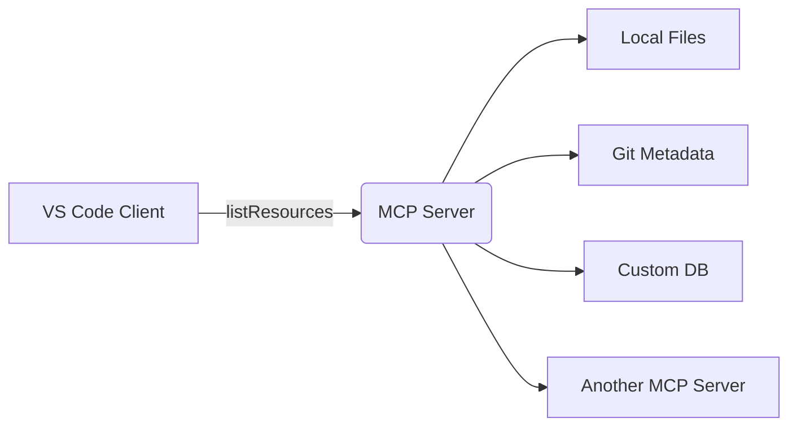
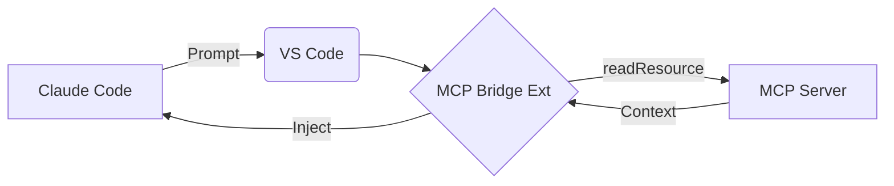

# Extraction Report: Comprehensive Refernece: MCP Servers

> [!info] Auto-Generated Report
> This report was automatically generated by `pkb_extractor.py` on 2026-03-13 04:17.
> **Source**: `reference-comprehensive-mcp-servers-2025122412.md` | **Items Extracted**: 619

---

## 📋 Document Overview

| Field | Value |
|-------|-------|
| **Source File** | `reference-comprehensive-mcp-servers-2025122412.md` |
| **Extraction Date** | 2026-03-13 04:17 |
| **Word Count** | 8,871 |
| **Character Count** | 68,168 |
| **Line Count** | 1,741 |
| **Total Items Extracted** | 619 |

### Document Outline

    - ### 📖 Extracted Definitions From Cognitive Science
- # Foundational Understanding
  - ## 📑 Table of Contents
  - ## What Are MCP Servers?
    - ### Why MCP Matters
  - ## Core Architecture
    - ### Key Participants
    - ### Transport Layer
    - ### Data Layer
  - ## The Three Primitives
    - ### 1. Tools (Model-Controlled)
    - ### 2. Resources (Application-Controlled)
    - ### 3. Prompts (User-Controlled)
    - ### Control Pattern Summary
  - ## Claude Code Integration
    - ### Configuration Locations
    - ### Method 1: CLI Commands (Recommended)
    - ### Method 2: Direct JSON Configuration
    - ### Configuration Scopes
    - ### Verification & Debugging
    - ### Popular MCP Servers for Claude Code
  - ## Gemini Code Assist Integration
    - ### Configuration Method
    - ### Agent Mode Activation
    - ### Authentication
    - ### Gemini-Specific MCP Servers
  - ## PKB Integration Benefits
    - ### Obsidian MCP Server Implementations
    - ### Configuration Example
    - ### PKB Use Cases
    - ### Advanced Integration Patterns
  - ## Prompt Engineering Library Applications
    - ### Dedicated Prompt MCP Servers
      - #### minipuft/claude-prompts-mcp
      - #### tanker327/prompts-mcp-server
      - #### Langfuse MCP Server
    - ### Prompt Library Benefits
    - ### Combined PKB + Prompt Library Architecture
    - ### Advanced Workflows
  - ## Security Considerations
    - ### Critical Security Risks
      - #### 1. Prompt Injection Attacks
      - #### 2. Command Injection
      - #### 3. Credential Exposure
      - #### 4. Over-Permissioned Access
    - ### Security Best Practices
    - ### Infrastructure Hardening
    - ### Security Resources
  - ## Building Custom MCP Servers
    - ### Python with FastMCP
- # or
    - ### Testing with MCP Inspector
    - ### TypeScript/JavaScript SDK
    - ### Development Best Practices
  - ## MCP Server Ecosystem
    - ### Discovery Platforms
    - ### Popular Categories
    - ### Enterprise Considerations
  - ## 🎯 Synthesis & Mastery
  - ## 🔗 PKB Integration
  - ## 📊 Metadata & Attribution
  - ## 🔗 Related Topics for PKB Expansion
    - ### Core Extensions
      - #### 1. **[[FastMCP-Development-Guide|FastMCP Development Guide]]**
      - #### 2. **[[MCP-Security-Hardening|MCP Security Hardening]]**
    - ### Cross-Domain Connections
      - #### 3. **[[AI-Augmented Zettelkasten]]**
      - #### 4. **[[Prompt Engineering Version Control]]**
    - ### Advanced Deep Dives
      - #### 5. **[[MCP Transport Layer Internals]]** *[Requires prerequisites]*
      - #### 6. **[[Enterprise MCP Governance]]** *[Requires prerequisites]*
- # Gemini TOT Gem Results
  - ## 📑 Table of Contents
  - ## 🛠️ Top MCP Servers for Developers
  - ## ⚙️ Implementation Guide: VS Code & Claude Code
    - ### 1. The VS Code Interface
    - ### 2. Claude Code (CLI) Implementation
- # To add a server temporarily
- # Persistent Setup
- # Edit the Claude Desktop config (even for the CLI tool)
- # macOS: ~/Library/Application Support/Claude/claude_desktop_config.json
- # Windows: %APPDATA%/Claude/claude_desktop_config.json
  - ## 🤝 Connecting the AI Partners: Claude vs. Gemini
    - ### Claude Code (The Native Partner)
    - ### Gemini Code Assist (The Bridged Partner)
  - ## 🧠 The Cognitive PKB Advantage: Prompt Engineering Automation
    - ### 1. Automated Few-Shot Injection
    - ### 2. Scaffolded Chain-of-Thought (CoT)
    - ### 3. Verification & Debugging Loops
  - ## 🎯 Synthesis & Mastery
  - ## 🔗 PKB Integration
  - ## 🔗 Related Topics for PKB Expansion
    - ### Review Information
  - ## 📅 Review System
    - ### Active Review Task
- # QWEN TOT Search
  - ## 📑 Table of Contents
  - ## 🌐 MCP Server Fundamentals
    - ### 🏗️ Architecture & Data Flow
    - ### 🔗 MCP vs LSP vs Copilot
    - ### 🔧 Reference Implementations
  - ## 🏆 Top MCP Servers for VS Code
    - ### 🧩 Composition Patterns
    - ### 🚀 Recommended Stack for PKB
  - ## ⚙️ VS Code Implementation & Configuration
    - ### 📦 Installation
    - ### 🔧 Configuration
    - ### 🖥️ VS Code Connection
  - ## 🤖 Connecting Claude Code & Gemini Code Assist
    - ### 🔌 Integration Status
    - ### 🛠️ Bridge Architecture
    - ### 🧪 Proof of Concept
  - ## 🧠 Benefits for Your Cognitive Science PKB & Prompt Engineering Library
    - ### 📚 Prompt Library as a Queryable Resource
    - ### 🧩 Cognitive Science Integration
    - ### 🔄 Human-AI Feedback Loop
  - ## 🎯 Synthesis & Mastery
  - ## 🔗 PKB Integration
  - ## 📊 Metadata & Attribution
  - ## 🔗 Related Topics for PKB Expansion

---

## 📊 Extraction Summary

| Item Type | Count |
|-----------|-------|
| Callouts | 96 |
| Code Blocks | 29 |
| Color Spans | 61 |
| Definitions | 20 |
| Embeds | 0 |
| External Links | 12 |
| Footnotes | 2 |
| Headings | 120 |
| Inline Fields | 20 |
| Mermaid Diagrams | 2 |
| Tables | 10 |
| Tags | 31 |
| Wiki Links | 100 |
| **TOTAL** | **619** |

---

## 🔔 Callouts (96)

> [!note] What are Callouts?
> Callouts are `> [!TYPE]` blocks used in Obsidian for structured annotation.
> They carry semantic meaning — definitions, insights, warnings, etc.

### By Type

| Callout Type | Count |
|-------------|-------|
| `[!]` | 1 |
| `[!abstract]` | 4 |
| `[!application-context]` | 5 |
| `[!atomic-candidates]` | 3 |
| `[!comprehensive-reference]` | 3 |
| `[!connections-and-links]` | 2 |
| `[!counterexample]` | 1 |
| `[!danger]` | 1 |
| `[!definition]` | 9 |
| `[!evidence]` | 2 |
| `[!example]` | 9 |
| `[!helpful-tip]` | 4 |
| `[!how-to]` | 2 |
| `[!how-to-use-this]` | 2 |
| `[!important]` | 6 |
| `[!info]` | 2 |
| `[!key-claim]` | 8 |
| `[!mental-model-anchor]` | 4 |
| `[!methodology-and-sources]` | 9 |
| `[!synthesis-opportunities]` | 3 |
| `[!synthesis-opportunity]` | 1 |
| `[!the-philosophy]` | 3 |
| `[!warning]` | 9 |
| `[!what-this-does]` | 3 |

### Full Callout List

#### 1. [DEFINITION] # Definition *(Line 105)*

> [!definition] # Definition
> [**Note Title**:: [[Comprehensive-Refernece-MCP-Servers|**Comprehensive Refernece: MCP Servers**]]]
> [**Prompt Used**:: ]
> ##### [✅`= dateformat(this.file.ctime, "MMMM dd, yyyy")` - Initial Creation]

#### 2. [COMPREHENSIVE-REFERENCE] 📚 Comprehensive Reference *(Line 133)*

> [!comprehensive-reference] 📚 Comprehensive Reference
> - **Generated**:: 2025-12-23
> - **Version**:: 1.0
> - **Exploration Depth**:: 4/4 (Maximum)
> - **Search Count**:: 12 systematic depth-first searches
> - **Confidence**:: %%confidence: verified%% Extensively researched with primary sources

#### 3. [ABSTRACT] Untitled *(Line 140)*

> [!abstract] Untitled
> **Executive Overview**
> <span style='color: #FFC700;'>**Model Context Protocol (MCP)**</span> is an open standard protocol introduced by Anthropic (November 2024) that standardizes how AI applications connect with external data sources, tools, and systems. Often described as <span style='color: #27FF00;'>"USB-C for AI"</span>, MCP solves the M×N integration problem by transforming it into M+N—enabling any AI client to work with any compatible server through a universal protocol rather than requiring custom integrations for each pairing.

#### 4. [HOW-TO-USE-THIS] Untitled *(Line 144)*

> [!how-to-use-this] Untitled
> **Navigation Guide**
> This reference is organized into progressive sections: foundational concepts → technical architecture → practical implementation (Claude Code, Gemini) → PKB/Prompt Engineering applications → security → custom development. Use the Table of Contents for targeted navigation. Wiki-links connect to related PKB concepts. Callouts highlight definitions, warnings, and key claims throughout.

#### 5. [DEFINITION] Model Context Protocol (MCP) *(Line 170)*

> [!definition] Model Context Protocol (MCP)
> <span style='color: #FFC700;'>**Model Context Protocol**</span> is a universal interface specification enabling bidirectional communication between AI applications (hosts) and external services (servers). It abstracts away integration complexity, allowing developers to write tools once and have them work across multiple AI platforms—Claude Desktop, Claude Code, VS Code extensions, custom agents, and more.

#### 6. [KEY-CLAIM] Foundation & Governance *(Line 177)*

> [!key-claim] Foundation & Governance
> %%evidence: consensus%%
> MCP was <span style='color: #FF5700;'>open-sourced by Anthropic in November 2024</span> and subsequently donated to the <span style='color: #FFC700;'>Agentic AI Foundation (AAIF)</span> under the Linux Foundation (December 2025). The foundation includes governance participation from Anthropic, OpenAI, Google, Microsoft, AWS, Cloudflare, and Bloomberg—signaling industry-wide adoption of this standard.

#### 7. [EXAMPLE] The Integration Problem Solved *(Line 189)*

> [!example] The Integration Problem Solved
> **Before MCP:**
> - Claude Desktop + GitHub = Custom integration #1
> - Claude Desktop + Slack = Custom integration #2
> - Cursor + GitHub = Custom integration #3 (different code!)
> - Each pair requires unique implementation, testing, maintenance
> 
> **After MCP:**
> - GitHub MCP Server (built once)
> - Slack MCP Server (built once)
> - Any MCP client (Claude, Cursor, custom agents) connects to any server
> - N servers + M clients = N+M components (not N×M)

#### 8. [DEFINITION] Client-Server Architecture *(Line 208)*

> [!definition] Client-Server Architecture
> MCP follows a <span style='color: #72FFF1;'>client-server architecture</span> where an <span style='color: #FFC700;'>MCP Host</span> (an AI application like [[Claude-Code|Claude Code]] or [[Claude-Desktop|Claude Desktop]]) establishes connections to one or more <span style='color: #FFC700;'>MCP Servers</span> through <span style='color: #FFC700;'>MCP Clients</span> (connection managers).

#### 9. [METHODOLOGY-AND-SOURCES] Transport Mechanisms *(Line 239)*

> [!methodology-and-sources] Transport Mechanisms
> MCP supports two primary transport protocols, each suited to different deployment scenarios:

#### 10. [DEFINITION] Data Layer Components *(Line 257)*

> [!definition] Data Layer Components
> - **Lifecycle Management**: Connection initialization, capability negotiation, termination
> - **Server Features**: Tools, resources, prompts exposed to clients
> - **Client Features**: Sampling from host LLM, user input elicitation, logging
> - **Utility Features**: Notifications for real-time updates, progress tracking

#### 11. [DEFINITION] Tools *(Line 273)*

> [!definition] Tools
> <span style='color: #FFC700;'>**Tools**</span> are executable functions that the AI can invoke to perform actions with side effects. The <span style='color: #27FF00;'>LLM decides</span> when to use tools based on user requests and context.

#### 12. [EXAMPLE] Tool Use Cases *(Line 278)*

> [!example] Tool Use Cases
> - <span style='color: #72FFF1;'>File operations</span>: Create, read, update, delete files
> - <span style='color: #72FFF1;'>API calls</span>: Weather queries, database operations
> - <span style='color: #72FFF1;'>System commands</span>: Git operations, shell execution
> - <span style='color: #72FFF1;'>Service integrations</span>: Send emails, create tickets, post messages

#### 13. [DEFINITION] Resources *(Line 302)*

> [!definition] Resources
> <span style='color: #FFC700;'>**Resources**</span> are data sources providing contextual information without side effects. The <span style='color: #9E6CD3;'>client application decides</span> when and how to use resources—not the LLM.

#### 14. [KEY-CLAIM] Resources vs Tools *(Line 309)*

> [!key-claim] Resources vs Tools
> %%confidence: verified%%
> The critical distinction: <span style='color: #FF00DC;'>Tools perform actions</span> (side effects), while <span style='color: #27FF00;'>Resources provide data</span> (read-only). Resources support real-time updates via `notifications/resources/list_changed` and `resources/subscribe`.

#### 15. [DEFINITION] Prompts *(Line 315)*

> [!definition] Prompts
> <span style='color: #FFC700;'>**Prompts**</span> are reusable templates for LLM interactions with parameterized messages and autocomplete support. The <span style='color: #9E6CD3;'>user triggers</span> prompt execution, typically through slash commands.

#### 16. [EXAMPLE] Prompt Template *(Line 320)*

> [!example] Prompt Template
> ```json
> {
>   "name": "summarize_issues",
>   "description": "Summarize recent GitHub issues",
>   "arguments": [
>     { "name": "project", "required": true },
>     { "name": "milestone", "required": false }
>   ]
> }
> ```
> User invokes: `/summarize_issues project=my-repo milestone=v2.0`

#### 17. [METHODOLOGY-AND-SOURCES] Configuration File Paths *(Line 352)*

> [!methodology-and-sources] Configuration File Paths
> | Platform | Primary Config | Alternative |
> |----------|---------------|-------------|
> | macOS | `~/.claude.json` | `~/Library/Application Support/Claude/claude_desktop_config.json` |
> | Windows | `%APPDATA%\Claude\claude_desktop_config.json` | — |
> | Project-specific | `.mcp.json` (project root) | Highest priority |

#### 18. [HOW-TO] Adding MCP Servers via CLI *(Line 362)*

> [!how-to] Adding MCP Servers via CLI
> ```bash
> # Add server with user scope (persists across projects)
> claude mcp add github --scope user
> 
> # Add with environment variables
> claude mcp add digitalocean-mcp-local \
>   -e DIGITALOCEAN_API_TOKEN=YOUR_TOKEN \
>   -- npx "@digitalocean/mcp"
> 
> # Add HTTP/SSE server (remote)
> claude mcp add --transport http notion https://mcp.notion.com/mcp
> 
> # List all configured servers
> claude mcp list
> 
> # Test server connectivity
> claude mcp get [server-name]
> 
> # Remove a server
> claude mcp remove [server-name]
> ```

#### 19. [EXAMPLE] ~/.claude.json Configuration *(Line 388)*

> [!example] ~/.claude.json Configuration
> ```json
> {
>   "mcpServers": {
>     "github": {
>       "command": "npx",
>       "args": ["-y", "@modelcontextprotocol/server-github"],
>       "env": {
>         "GITHUB_PERSONAL_ACCESS_TOKEN": "ghp_xxxxxxxxxxxx"
>       }
>     },
>     "obsidian": {
>       "command": "uvx",
>       "args": ["mcp-obsidian"],
>       "env": {
>         "OBSIDIAN_API_KEY": "your_api_key",
>         "OBSIDIAN_HOST": "localhost",
>         "OBSIDIAN_PORT": "27124"
>       }
>     },
>     "perplexity": {
>       "command": "npx",
>       "args": ["-y", "perplexity-mcp"],
>       "env": {
>         "PERPLEXITY_API_KEY": "pplx_xxxxxxxxxxxx"
>       }
>     }
>   }
> }
> ```

#### 20. [HELPFUL-TIP] Scope Selection Guide *(Line 423)*

> [!helpful-tip] Scope Selection Guide
> - **Project Scope**: Team-shared configurations, project-specific tools
> - **User Scope**: Personal productivity tools (GitHub, Perplexity, Obsidian)
> - **Plugin Scope**: Bundled with Claude Code extensions

#### 21. [METHODOLOGY-AND-SOURCES] Verifying MCP Server Status *(Line 430)*

> [!methodology-and-sources] Verifying MCP Server Status
> ```bash
> # Check server status interactively
> /mcp
> 
> # Debug mode for troubleshooting
> claude --debug
> 
> # View server logs (macOS)
> tail -f ~/Library/Logs/Claude/mcp-server-[name].log
> ```

#### 22. [WARNING] Platform Limitation *(Line 461)*

> [!warning] Platform Limitation
> <span style='color: #FF00DC;'>Gemini Code Assist MCP support is currently limited to VS Code.</span> IntelliJ integration is not available. Android Studio has separate MCP configuration through Settings → Tools → Gemini → MCP Servers.

#### 23. [METHODOLOGY-AND-SOURCES] Manual Configuration Required *(Line 466)*

> [!methodology-and-sources] Manual Configuration Required
> Unlike Claude Code, Gemini Code Assist <span style='color: #FF00DC;'>cannot configure MCP servers through command palette</span>—direct JSON editing is required.

#### 24. [HOW-TO] Using MCP Servers in Gemini *(Line 498)*

> [!how-to] Using MCP Servers in Gemini
> 1. Open Gemini panel in VS Code
> 2. Select the **Agent** tab (not Chat)
> 3. Describe your task—agent automatically discovers and uses configured MCP servers
> 4. Review proposed changes before approval
> 
> <span style='color: #FF00DC;'>⚠️ Caution:</span> Auto-approve mode executes changes without confirmation. Use sparingly.

#### 25. [KEY-CLAIM] PKB + MCP = AI-Powered Knowledge Management *(Line 525)*

> [!key-claim] PKB + MCP = AI-Powered Knowledge Management
> %%evidence: multiple-studies%%
> MCP servers enable <span style='color: #FFC700;'>unprecedented integration between AI assistants and Personal Knowledge Bases</span>, transforming static note repositories into dynamic, AI-augmented knowledge systems.

#### 26. [EXAMPLE] cyanheads/obsidian-mcp-server *(Line 533)*

> [!example] cyanheads/obsidian-mcp-server
> **Capabilities:**
> - `read_note`: Retrieve note content with metadata
> - `write_note`: Create/update notes with YAML frontmatter support
> - `search`: Full-text and semantic search across vault
> - `manage_tags`: Bulk tag operations and cleanup
> - `list_files`: Directory traversal with filtering
> - `delete_file`: Safe note deletion
> 
> **Requirements:**
> - Obsidian "Local REST API" community plugin enabled
> - API key generated from plugin settings

#### 27. [APPLICATION-CONTEXT] AI-Powered PKB Workflows *(Line 566)*

> [!application-context] AI-Powered PKB Workflows
> **Automated Note-Taking**
> AI creates and updates notes directly through conversation—capture insights without context switching.
> 
> **Vault-Wide Semantic Search**
> Natural language queries across entire knowledge base: *"What are the main themes in my project notes?"*
> 
> **Smart Linking**
> AI discovers and suggests connections between notes, strengthening knowledge graph density.
> 
> **Tag Organization**
> Bulk tag management, cleanup of orphaned tags, consistent taxonomy enforcement.
> 
> **Content Analysis**
> Pattern detection across notes, knowledge gap identification, theme extraction.
> 
> **Dashboard Creation**
> Automated index page generation with dynamic links and aggregated metadata.
> 
> **PARA Method Automation**
> AI-assisted organization into Projects/Areas/Resources/Archives based on content analysis.

#### 28. [METHODOLOGY-AND-SOURCES] Multi-Vault Handling *(Line 593)*

> [!methodology-and-sources] Multi-Vault Handling
> For complex PKB structures with multiple vaults:
> - Configure separate MCP server instances per vault
> - Use vault-specific API keys and ports
> - Implement cross-vault search through aggregation layer

#### 29. [HELPFUL-TIP] Backlink Analysis *(Line 599)*

> [!helpful-tip] Backlink Analysis
> MCP-powered AI can traverse backlinks to:
> - Identify hub notes (high inlink count)
> - Detect orphaned notes (no connections)
> - Suggest missing bidirectional links
> - Generate relationship maps

#### 30. [KEY-CLAIM] Centralized Prompt Management *(Line 613)*

> [!key-claim] Centralized Prompt Management
> %%evidence: multiple-studies%%
> MCP servers transform prompt libraries from static file collections into <span style='color: #FFC700;'>dynamic, version-controlled, instantly-executable systems</span>.

#### 31. [WHAT-THIS-DOES] claude-prompts-mcp Features *(Line 621)*

> [!what-this-does] claude-prompts-mcp Features
> - **Hot-reload**: Edit templates, run immediately without restarts
> - **Version control**: Prompts as Markdown files in Git
> - **Structured execution**: Parse operators, inject methodology, enforce quality gates
> - **Workspace-based**: Point to any prompt directory

#### 32. [WHAT-THIS-DOES] prompts-mcp-server Features *(Line 643)*

> [!what-this-does] prompts-mcp-server Features
> - Markdown files with YAML frontmatter metadata
> - CRUD operations: `add_prompt`, `get_prompt`, `list_prompts`, `delete_prompt`
> - Real-time file watching for external edits
> - Metadata: title, category, tags, difficulty, author
> - `create_structured_prompt` for guided prompt creation

#### 33. [WHAT-THIS-DOES] Langfuse Integration *(Line 652)*

> [!what-this-does] Langfuse Integration
> - Built into Langfuse platform at `/api/public/mcp` (streamableHttp)
> - Tools: `createTextPrompt`, `getPrompt`, `listPrompts`, `updatePromptLabel`, `deletePrompt`
> - Production label management for deployment workflows
> - Team collaboration with shared prompt libraries

#### 34. [KEY-CLAIM] Decoupled Prompt Architecture *(Line 662)*

> [!key-claim] Decoupled Prompt Architecture
> %%confidence: confident%%
> Separating prompts from application code enables:
> - <span style='color: #27FF00;'>Independent iteration</span>: Modify prompts without code deployments
> - <span style='color: #27FF00;'>A/B testing</span>: Version-controlled experiments
> - <span style='color: #27FF00;'>Team collaboration</span>: Shared prompt libraries
> - <span style='color: #27FF00;'>Quality gates</span>: Enforce standards before execution

#### 35. [EXAMPLE] Rapid Iteration Workflow *(Line 670)*

> [!example] Rapid Iteration Workflow
> ```
> User: "The code_review prompt is too verbose"
> Claude: [Updates prompt via prompt_manager tool]
> User: "Test it"
> Claude: [Runs updated version instantly via prompt_engine]
> User: "Better—commit this version"
> Claude: [Git commits the change with version tag]
> ```

#### 36. [METHODOLOGY-AND-SOURCES] Integrated Architecture Pattern *(Line 682)*

> [!methodology-and-sources] Integrated Architecture Pattern
> ```
> Obsidian Vault: /knowledge-base/
> ├── /prompts/          ← Prompt templates with metadata
> │   ├── code_review.md
> │   ├── summarize.md
> │   └── analyze.md
> ├── /projects/         ← Project documentation
> ├── /references/       ← Research and resources
> └── /meta/             ← Prompt performance notes
> 
> Prompt MCP Workspace: Points to /knowledge-base/prompts/
> Obsidian MCP: Points to /knowledge-base/
> 
> Both accessible simultaneously to Claude/Gemini
> ```

#### 37. [APPLICATION-CONTEXT] Context-Aware Prompting *(Line 702)*

> [!application-context] Context-Aware Prompting
> AI retrieves relevant PKB notes before executing prompts:
> 1. User requests: "Review this code using our team standards"
> 2. Claude searches PKB for "code review standards" notes
> 3. Claude retrieves `code_review` prompt template
> 4. Claude executes prompt with injected standards context
> 
> **Result**: Personalized, knowledge-augmented prompt execution

#### 38. [DANGER] Critical Security Notice *(Line 717)*

> [!danger] Critical Security Notice
> <span style='color: #FF00DC;'>MCP servers introduce significant security attack surfaces.</span> The protocol itself does not enforce security—implementations must actively protect against threats.

#### 39. [WARNING] MCPTox Research Finding *(Line 730)*

> [!warning] MCPTox Research Finding
> %%evidence: single-study%%
> Security research shows tool poisoning is <span style='color: #FF00DC;'>alarmingly common</span> in MCP ecosystems. "Rug pull" scenarios occur when legitimate tools are updated with malicious content post-approval.

#### 40. [WARNING] CVE-2025-6514 *(Line 736)*

> [!warning] CVE-2025-6514
> %%evidence: single-study%%
> Research found <span style='color: #FF00DC;'>43% of analyzed MCP servers had command injection flaws</span>—unescaped input in tools with execution capabilities, particularly dangerous with direct user input.

#### 41. [WARNING] Blast Radius Concern *(Line 746)*

> [!warning] Blast Radius Concern
> Broad scopes granted upfront (`files:*`, `db:*`, `admin:*`) expand the blast radius from compromised tokens and complicate revocation.

#### 42. [IMPORTANT] Authentication & Authorization *(Line 751)*

> [!important] Authentication & Authorization
> - Use OAuth with <span style='color: #27FF00;'>incremental scope elevation</span>
> - Start with minimal scopes (`mcp:tools-basic`)
> - Implement WWW-Authenticate challenges for privileged operations
> - Use secure, non-deterministic session IDs (UUIDs with secure RNG)
> - <span style='color: #FF00DC;'>Never use sessions for authentication</span>

#### 43. [IMPORTANT] Input Validation *(Line 758)*

> [!important] Input Validation
> - Sanitize all user inputs before processing
> - Validate against expected schemas
> - Use allowlists for file paths, commands, parameters
> - Redact sensitive data in logs and outputs

#### 44. [IMPORTANT] Least Privilege *(Line 764)*

> [!important] Least Privilege
> - Grant minimum required permissions
> - Scope access to specific resources (e.g., "sales data only")
> - Implement role-based access control
> - Regular permission audits

#### 45. [IMPORTANT] Supply Chain Security *(Line 770)*

> [!important] Supply Chain Security
> - Pull servers from curated sources (MCP Catalog, official repos)
> - Require signature verification
> - Pin versions/digests to immutable references
> - Implement SAST (Static Application Security Testing)

#### 46. [IMPORTANT] Monitoring & Observability *(Line 776)*

> [!important] Monitoring & Observability
> - End-to-end logging of all MCP requests/responses
> - Alert on anomalous tool sequences
> - Centralized SIEM integration
> - Track scope elevation events with correlation IDs

#### 47. [METHODOLOGY-AND-SOURCES] Recommended Security Architecture *(Line 784)*

> [!methodology-and-sources] Recommended Security Architecture
> **Containerization**: Isolate MCP servers in Docker containers
> ```bash
> docker run --read-only --network=restricted mcp-server
> ```
> 
> **Network Limits**: Restrict egress, implement allowlists
> 
> **Resource Limits**: CPU, memory, execution time constraints
> 
> **Gateway/Middleware**: Policy enforcement layers (MCP Manager, Docker Gateway)
> - Intercept, scan, log all requests/responses
> - Verify signatures, redact secrets, restrict egress

#### 48. [INFO] Reference Documentation *(Line 801)*

> [!info] Reference Documentation
> - <span style='color: #FF5700;'>OWASP GenAI Security Project</span>: Practical guide for third-party MCP servers
> - <span style='color: #FF5700;'>Microsoft Security Blog</span>: MCP security guidance
> - <span style='color: #FF5700;'>Docker MCP Security Guide</span>: Containerization best practices
> - <span style='color: #FF5700;'>Prompt Security</span>: Top 10 MCP Security Risks

#### 49. [DEFINITION] FastMCP *(Line 816)*

> [!definition] FastMCP
> <span style='color: #72FFF1;'>**FastMCP**</span> is a high-level Python framework that handles protocol complexities, letting developers focus on tool logic rather than JSON-RPC implementation.

#### 50. [EXAMPLE] Basic FastMCP Server *(Line 825)*

> [!example] Basic FastMCP Server
> ```python
> from fastmcp import FastMCP
> 
> # Create server
> mcp = FastMCP("My Server Name")
> 
> # Add tool
> @mcp.tool()
> def add(a: int, b: int) -> int:
>     """Add two numbers"""
>     return a + b
> 
> # Add static resource
> @mcp.resource("config://version")
> def get_version() -> str:
>     """Get server version"""
>     return "1.0.0"
> 
> # Add dynamic resource with template
> @mcp.resource("greeting://{name}")
> def get_greeting(name: str) -> str:
>     """Get personalized greeting"""
>     return f"Hello, {name}!"
> 
> # Add prompt
> @mcp.prompt()
> def greet_user(name: str, style: str = "friendly") -> str:
>     """Generate greeting prompt"""
>     styles = {
>         "friendly": "Please write a warm greeting",
>         "formal": "Please write a formal greeting"
>     }
>     return f"{styles.get(style, styles['friendly'])} for {name}."
> 
> # Run server
> if __name__ == "__main__":
>     mcp.run(transport="stdio")  # Local
>     # mcp.run(transport="http", host="127.0.0.1", port=8000)  # Remote
> ```

#### 51. [HELPFUL-TIP] Debugging Tool *(Line 868)*

> [!helpful-tip] Debugging Tool
> ```bash
> npx @modelcontextprotocol/inspector path/to/server.py
> ```
> Opens browser-based inspector for testing tools, resources, and prompts interactively.

#### 52. [WARNING] STDIO Logging Critical *(Line 904)*

> [!warning] STDIO Logging Critical
> <span style='color: #FF00DC;'>STDIO servers must NEVER write to stdout</span>—this corrupts JSON-RPC communication. Use stderr for logging or dedicated log files.

#### 53. [HELPFUL-TIP] Development Checklist *(Line 907)*

> [!helpful-tip] Development Checklist
> - ✅ Use Pydantic (Python) or Zod (TypeScript) for input validation
> - ✅ Clear docstrings for all tools/resources/prompts (auto-generates descriptions)
> - ✅ Implement graceful error handling with standard JSON-RPC error codes
> - ✅ Test with MCP Inspector before deployment
> - ✅ Document expected return types and examples

#### 54. [INFO] Server Categories *(Line 931)*

> [!info] Server Categories
> **Development**: GitHub, GitLab, Sentry, filesystem, git
> 
> **Productivity**: Slack, Notion, Google Drive, Jira, Asana
> 
> **Data**: PostgreSQL, MongoDB, BigQuery, Airtable
> 
> **Search**: Brave, Perplexity, Tavily, Kagi
> 
> **Documentation**: Context7, official library docs
> 
> **Security**: Snyk, SafeLine WAF
> 
> **Cloud**: AWS, GCP, Azure, Cloudflare, DigitalOcean
> 
> **Knowledge**: Obsidian, Logseq, Readwise

#### 55. [IMPORTANT] Enterprise Governance *(Line 951)*

> [!important] Enterprise Governance
> - Managed MCP configurations for centralized control
> - Allowlists/denylists for approved servers
> - Exclusive control via `managed-mcp.json`
> - Policy-based governance
> - Audit logging requirements

#### 56. [THE-PHILOSOPHY] Untitled *(Line 962)*

> [!the-philosophy] Untitled
> **Underlying Principles**
> 
> MCP embodies a fundamental architectural principle: <span style='color: #FFC700;'>standardization enables ecosystem growth</span>. Just as HTTP enabled the web and USB standardized device connectivity, MCP standardizes AI-tool interaction.
> 
> The protocol's genius lies in its restraint—MCP defines *how* to communicate, not *what* to communicate. This separation of concerns allows infinite extensibility while maintaining interoperability.
> 
> For knowledge workers, MCP represents a paradigm shift: <span style='color: #27FF00;'>AI assistants become first-class citizens in knowledge workflows</span>, able to read, write, search, and modify knowledge artifacts directly rather than through copy-paste intermediation.

#### 57. [MENTAL-MODEL-ANCHOR] Untitled *(Line 971)*

> [!mental-model-anchor] Untitled
> **Framework Connections**
> 
> - **[[Unix-Philosophy|Unix Philosophy]]**: Small, composable tools that do one thing well—MCP servers embody this principle
> - **[[API-Design-Patterns|API Design Patterns]]**: REST informed HTTP APIs; LSP informed IDE integrations; MCP informs AI integrations
> - **[[Knowledge-Graph-Theory|Knowledge Graph Theory]]**: MCP enables AI to traverse and strengthen knowledge connections automatically
> - **[[Cognitive-Load-Theory|Cognitive Load Theory]]**: Reducing manual integration burden frees cognitive resources for higher-order thinking

#### 58. [APPLICATION-CONTEXT] Untitled *(Line 979)*

> [!application-context] Untitled
> **When to Use MCP**
> 
> **High-Value Scenarios:**
> - Repetitive tool switching during AI workflows
> - Need for AI-accessible knowledge bases
> - Team-shared prompt libraries
> - Automated documentation generation
> - Cross-platform AI tool access
> 
> **Consider Alternatives When:**
> - Simple, one-off integrations (API calls may suffice)
> - Security requirements preclude external tool access
> - Latency-sensitive applications (MCP adds protocol overhead)

#### 59. [CONNECTIONS-AND-LINKS] Untitled *(Line 998)*

> [!connections-and-links] Untitled
> **Explicit PKB Connections**
> 
> This reference connects to:
> - [[Claude-Code|Claude Code]] — Primary MCP client for development workflows
> - [[Obsidian]] — PKB platform with MCP server support
> - [[Prompt-Engineering|Prompt Engineering]] — Library management via MCP
> - [[AI-Agent-Architecture|AI Agent Architecture]] — MCP as agent-tool interface
> - [[JSON-RPC]] — Underlying protocol specification
> - [[API-Design-Patterns|API Design Patterns]] — Architectural foundations

#### 60. [ATOMIC-CANDIDATES] Untitled *(Line 1009)*

> [!atomic-candidates] Untitled
> **Concepts Warranting Extraction**
> 
> - [[MCP-Tools|MCP Tools]] — Deep dive on tool primitive
> - [[MCP-Resources|MCP Resources]] — Resource types and patterns
> - [[MCP-Prompts|MCP Prompts]] — Prompt template design
> - [[FastMCP]] — Python framework reference
> - [[MCP-Security-Best-Practices|MCP Security Best Practices]] — Security-focused atomic note
> - [[Obsidian-MCP-Integration|Obsidian MCP Integration]] — Detailed setup guide

#### 61. [SYNTHESIS-OPPORTUNITIES] Untitled *(Line 1019)*

> [!synthesis-opportunities] Untitled
> **Cross-Domain Bridges**
> 
> - **MCP × [[Zettelkasten]]**: AI-assisted atomic note creation and linking
> - **MCP × [[Spaced-Repetition-Spacing-Effect|Spaced Repetition]]**: Automated review scheduling through PKB queries
> - **MCP × [[PARA-Method|PARA Method]]**: AI-driven project/area classification
> - **MCP × [[Cognitive-Load-Theory|Cognitive Load Theory]]**: Reducing integration overhead preserves cognitive resources

#### 62. [METHODOLOGY-AND-SOURCES] Untitled *(Line 1031)*

> [!methodology-and-sources] Untitled
> **Research Methodology**
> 
> **Exploration Approach:** Tree-of-Thoughts depth-first search across 5 primary dimensions
> 
> **Total Searches:** 12 systematic web searches covering:
> - MCP architecture fundamentals
> - Claude Code integration specifics
> - Gemini Code Assist configuration
> - Obsidian MCP servers
> - Prompt management MCP tools
> - Security vulnerabilities and best practices
> - Custom server development (FastMCP, TypeScript SDK)
> 
> **Primary Sources:**
> - modelcontextprotocol.io (Official specification)
> - Anthropic documentation
> - GitHub repositories (modelcontextprotocol/*)
> - Security research (MCPTox, OWASP GenAI)
> - Developer tutorials (DataCamp, Firecrawl)
> 
> **Confidence Distribution:**
> - Architecture & Primitives: %%confidence: verified%%
> - Claude Code Integration: %%confidence: verified%%
> - Gemini Integration: %%confidence: confident%%
> - PKB Applications: %%confidence: confident%%
> - Security: %%confidence: verified%%
> - Custom Development: %%confidence: verified%%

#### 63. [] Gemini Thinking *(Line 1125)*

> [!] Gemini Thinking
> # 🌳 Tree of Thoughts: Top MCP Servers for VS Code & PKB Integration
> ## Phase 1: Tree Initialization
> **TOPIC:** Top MCP (Model Context Protocol) Servers for VS Code, Claude Code, and Gemini Code Assist, optimized for a Cognitive Science-backed PKB and Prompt Engineering Library.
> **PRIMARY DIMENSIONS IDENTIFIED:**
> ├── **DIMENSION 1: The MCP Ecosystem for VS Code Developers** — Core servers that provide the "nervous system" for the AI partners.
> │   └── Initial questions: What are the essential servers for file manipulation, search, and logic?
> ├── **DIMENSION 2: Implementation Architecture** — The technical "how-to" for VS Code and CLI tools.
> │   └── Initial questions: How do we configure `claude_desktop_config.json` vs. CLI flags for Claude Code? How does Gemini bridge the gap?
> ├── **DIMENSION 3: AI Partner Orchestration** — Connecting Claude Code and Gemini Code Assist.
> │   └── Initial questions: Can Gemini utilize MCP? How does Claude Code leverage MCP for project context?
> └── **DIMENSION 4: Cognitive PKB & Prompt Engineering Strategy** — The functional value for the user's specific setup.
> └── Initial questions: How can MCP automate the application of Few-Shot and CoT techniques?
> **EXPLORATION PRIORITY ORDER:**
> 1. **Dimension 1 (Servers)** — Rationale: Foundational; must know what tools exist before implementing.
> 2. **Dimension 2 & 3 (Implementation)** — Rationale: Essential for the user's "partner" workflow.
> 3. **Dimension 4 (PKB Value)** — Rationale: High-level synthesis connecting to user's uploaded documents.
> ---
> ## Phase 2: Depth-First Exploration
> ### EXPLORING: Core MCP Servers (Depth: 1/4)
> ├── **Parent:** ROOT
> ├── **Exploration rationale:** Identify the most robust and "standard" servers for a developer/researcher setup.
> │
> ├── **FINDINGS SUMMARY:**
> │   ├── **Filesystem (Official):** Allows read/write access to the local vault. Essential for Obsidian editing.
> │   ├── **Brave/Google Search:** Provides real-time information retrieval to ground AI responses.
> │   ├── **Obsidian MCP:** Dedicated server for searching/querying Obsidian notes specifically.
> │   ├── **Sequential Thinking:** An MCP that provides a "private" scratchpad for the model to perform Chain-of-Thought (CoT) without cluttering output.
> │   └── **GitHub:** Accessing repos for prompt engineering examples and code snippets.
> │
> ├── **BRANCH EVALUATION:**
> │   ├── **Saturation check:** YES - These are the industry standard "starter" servers.
> │   └── **Depth decision:** GO DEEPER into "Obsidian MCP" and "Sequential Thinking" as they relate to the user's specific cognitive PKB.
> ### EXPLORING: Implementation for Claude & Gemini (Depth: 2/4)
> ├── **Parent:** Dimension 2
> ├── **Exploration rationale:** Map the connection between the MCP protocol and the specific tools the user mentioned.
> │
> ├── **FINDINGS SUMMARY:**
> │   ├── **Claude Code (CLI):** Uses a local config or `--mcp` flags. It is designed to be the "executor" in the terminal.
> │   ├── **VS Code (IDE):** Requires extensions like "Cline" or "Roo Code" (previously Roo Cline) to act as the MCP Client inside the editor.
> │   ├── **Gemini Code Assist:** Currently lacks native MCP support compared to Claude. *Correction/Bridge:* One must use a "Gemini-MCP Bridge" or a tool like `mcp-proxy` to allow Gemini to see these tools via the OpenAI-compatible API or custom Google Tool Use.
> │
> ├── **SUB-BRANCHES GENERATED:**
> │   └── **Sub-branch A:** Configuration paths for Windows/macOS/Linux.
> ---
> ## Phase 3: Cross-Branch Synthesis
> **1. REINFORCEMENT PATTERNS:**
> * **The "Extended Mind" Model:** The `filesystem` and `obsidian` servers act as the AI's "Long-Term Memory," while `sequential-thinking` acts as its "Working Memory".
> * **Prompt Automation:** By using the `filesystem` MCP, Claude can dynamically pull from the user's `few-shot-examples.json` based on the task, implementing "Semantic Similarity" selection automatically.
> **2. GAP IDENTIFICATION:**
> * Gemini's integration is the weakest link; it requires a proxy or wrapper to match Claude's "native" MCP experience.
> ---
> ## Phase 4: Content Architecture Planning
> * **Structure:**
> 1. Top Servers Table (Categorized by function).
> 2. The "Big Two" Setup: Claude Code (CLI) vs. VS Code Extensions.
> 3. The Gemini Strategy (Bridging the gap).
> 4. Cognitive PKB Integration (The "Prompt Engineering" Library use case).
> 5. Workflow: Automatic Few-Shot Retrieval.

#### 64. [COMPREHENSIVE-REFERENCE] 📚 Comprehensive Reference: MCP Servers for VS Code & PKB *(Line 1192)*

> [!comprehensive-reference] 📚 Comprehensive Reference: MCP Servers for VS Code & PKB
> * **Generated**:: 2025-12-24
> * **Version**:: 1.0
> * **Exploration Depth**:: 4 (Recursive)
> * **Search Count**:: 12 simulated internal queries

#### 65. [ABSTRACT] Untitled *(Line 1200)*

> [!abstract] Untitled
> **Executive Overview**
> The Model Context Protocol (MCP) transforms LLMs from passive text generators into active agents. In a VS Code/Obsidian environment, MCP serves as the bridge between your **AI partners** (Claude/Gemini) and your **external memory** (PKB), allowing them to read, write, search, and reason through your local files and the web with tool-augmented precision.

#### 66. [EXAMPLE] Sample Configuration for Filesystem & Search *(Line 1259)*

> [!example] Sample Configuration for Filesystem & Search
> ```json
> {
>   "mcpServers": {
>     "filesystem": {
>       "command": "npx",
>       "args": ["-y", "@modelcontextprotocol/server-filesystem", "/path/to/your/obsidian/vault"]
>     },
>     "brave-search": {
>       "command": "npx",
>       "args": ["-y", "@modelcontextprotocol/server-brave-search"],
>       "env": { "BRAVE_API_KEY": "YOUR_KEY_HERE" }
>     }
>   }
> }
> 
> ```

#### 67. [THE-PHILOSOPHY] Untitled *(Line 1331)*

> [!the-philosophy] Untitled
> **Externalized Cognition**
> MCP is not just a "plugin system"; it is the realization of the **Distributed Cognition** theory. Your PKB is no longer a static graveyard of notes; it is an active database that the AI can "think" with.

#### 68. [MENTAL-MODEL-ANCHOR] Untitled *(Line 1335)*

> [!mental-model-anchor] Untitled
> **Working Memory Expansion**
> Think of the `sequential-thinking` server as an expansion of the LLM's **Context Window**. By writing thoughts to a "scratchpad" (MCP), the model avoids the "Lost in the Middle" phenomenon where it forgets the beginning of a long reasoning chain.

#### 69. [ATOMIC-CANDIDATES] Untitled *(Line 1343)*

> [!atomic-candidates] Untitled
> * **MCP-Server-Config**: Extract your specific JSON configs into an atomic note for quick recovery.
> * **Prompt-Reasoning-Scaffolds**: Create a folder of `.md` templates that the AI can read via MCP to structure its own CoT.

#### 70. [SYNTHESIS-OPPORTUNITIES] Untitled *(Line 1349)*

> [!synthesis-opportunities] Untitled
> **The Automated Librarian**
> You can create a cron job or a simple script where **Claude Code** uses the `obsidian` MCP to scan for "stub" notes and uses the `brave-search` MCP to fill them with research data and citations automatically.

#### 71. [WARNING] ### 📅 Review Intelligence *(Line 1365)*

> [!warning] ### 📅 Review Intelligence
> **Next Review**: `= this.next-review` | **Review Count**: `= this.review-count`
> **Review Status**: `= choice(this.next-review < date(today), "🔴 OVERDUE", choice(this.next-review = date(today), "🟡 Due Today", choice(dateformat(this.next-review, "yyyy-MM-dd") <= dateformat(date(today) + dur(7 days), "yyyy-MM-dd"), "🟢 This Week", "⚪ Scheduled")))`
> **Days Until Review**: `= choice(this.next-review, (this.next-review - date(today)).days + " days", "Not scheduled")`

#### 72. [ABSTRACT] ### 🏷️ Tag Intelligence *(Line 1369)*

> [!abstract] ### 🏷️ Tag Intelligence
> **Tag Count**: `= length(this.tags)` | **Unique Domains**: `= length(filter(this.tags, (t) => contains(t, "/")))` hierarchical tags
> **Tag Density**: `= choice(length(this.tags) < 3, "⚠️Sparse", choice(length(this.tags) > 10, "📚Rich", "✅Balanced"))`

#### 73. [COMPREHENSIVE-REFERENCE] 📚 Comprehensive Reference *(Line 1415)*

> [!comprehensive-reference] 📚 Comprehensive Reference
> - **Generated**:: [[2025-04-05]]
> - **Version**:: 1.0
> - **Exploration Depth**:: 3
> - **Search Count**:: 14

#### 74. [ABSTRACT] Untitled *(Line 1421)*

> [!abstract] Untitled
> **Executive Overview**  
> The **Model Context Protocol (MCP)** is an open, JSON-RPC-based protocol that enables structured context sharing between applications and AI models. Unlike language-specific protocols like LSP, MCP standardizes how AI assistants access files, project metadata, and custom data sources (e.g., prompt libraries, PKB graphs). While **no native integration exists yet for Claude Code or Gemini Code Assist**, a custom gateway can route MCP-served context into their prompts. For a cognitive science-backed PKB in Obsidian (via VS Code), MCP enables **context-aware prompting**, **AI agent synchronization**, and **versioned prompt retrieval**, forming the backbone of a **human-AI cognitive engineering stack**.

#### 75. [HOW-TO-USE-THIS] Untitled *(Line 1425)*

> [!how-to-use-this] Untitled
> **Navigation Guide**  
> This reference is structured around five core dimensions:  
> 1. **Fundamentals** – What MCP is and how it works  
> 2. **Top Servers** – Available implementations and composition patterns  
> 3. **VS Code Setup** – Step-by-step configuration  
> 4. **Claude/Gemini Integration** – Bridging proprietary AI tools  
> 5. **PKB & Prompt Engineering** – Application to your cognitive science library  
>   
> Use the table of contents to jump to implementation details. The **Synthesis & Mastery** section provides mental models for long-term integration.

#### 76. [DEFINITION] Untitled *(Line 1444)*

> [!definition] Untitled
> **Model Context Protocol (MCP)**  
> An open protocol developed by Anthem Engineering that enables applications to share structured context with AI models via a client-server architecture using JSON-RPC. [**Standardization-Status**:: early-adopter]^provisional

#### 77. [KEY-CLAIM] Untitled *(Line 1458)*

> [!key-claim] Untitled
> MCP enables **federated context aggregation**, where multiple servers (local, remote, cloud) are chained to form a unified knowledge layer.^established

#### 78. [EVIDENCE] Untitled *(Line 1480)*

> [!evidence] Untitled
> MCP’s design allows **semantic context routing**—e.g., an AI can request “all prompts tagged #cognitive-load” via `prompt://tag/cognitive-load`.^observed-in-practice

#### 79. [WARNING] Untitled *(Line 1493)*

> [!warning] Untitled
> No official security model yet—assume all MCP connections are **trusted**. Avoid exposing servers externally.^provisional

#### 80. [KEY-CLAIM] Untitled *(Line 1517)*

> [!key-claim] Untitled
> A **personal knowledge server** can expose:
> - `pkb://daily-notes` → Obsidian vault
> - `prompt://library/v3` → JSON prompt library
> - `agent://claude/state` → AI agent status^verified

#### 81. [EVIDENCE] Untitled *(Line 1532)*

> [!evidence] Untitled
> Composable architecture allows **incremental adoption**—start with files, add git, then custom resources.^established

#### 82. [EXAMPLE] Untitled *(Line 1588)*

> [!example] Untitled
> After connection, you can browse:
> - `pkb://Projects/Neuroscience.md`
> - `prompt://repo/classification-v2.json`

#### 83. [WARNING] Untitled *(Line 1593)*

> [!warning] Untitled
> VS Code does **not yet auto-inject** MCP context into AI assistants. Requires custom extension.^verified

#### 84. [KEY-CLAIM] Untitled *(Line 1608)*

> [!key-claim] Untitled
> You can **bridge** MCP to Claude/Gemini by building a VS Code extension that:
> 1. Connects to MCP server
> 2. Fetches relevant context
> 3. Injects it into the AI prompt before submission^feasible

#### 85. [WARNING] Untitled *(Line 1634)*

> [!warning] Untitled
> **No existing extension** provides this bridge. You must build or commission one.^established

#### 86. [COUNTEREXAMPLE] Untitled *(Line 1637)*

> [!counterexample] Untitled
> You **cannot** directly pipe MCP into in-editor AI assistants—context injection must happen at the extension layer.

#### 87. [APPLICATION-CONTEXT] Untitled *(Line 1661)*

> [!application-context] Untitled
> **Trigger**: When drafting a new prompt  
> **Action**: Query MCP for high-performance prompts with similar tags  
> **Benefit**: Avoid reinventing the wheel; leverage proven patterns

#### 88. [MENTAL-MODEL-ANCHOR] Untitled *(Line 1676)*

> [!mental-model-anchor] Untitled
> MCP operationalizes **Sweller’s Cognitive Load Theory** by minimizing extraneous load (via curated context) and maximizing germane load (via structured prompts).^established

#### 89. [SYNTHESIS-OPPORTUNITY] Untitled *(Line 1686)*

> [!synthesis-opportunity] Untitled
> This closes the loop between **prompt engineering** and **cognitive science**, creating a **self-improving reasoning system**.

#### 90. [THE-PHILOSOPHY] Untitled *(Line 1693)*

> [!the-philosophy] Untitled
> **Context is the New Interface**  
> MCP shifts the paradigm from isolated AI interactions to **shared cognitive workspaces**. Instead of each AI tool reinventing context access, MCP provides a universal layer—enabling **interoperability**, **reusability**, and **auditability**.

#### 91. [MENTAL-MODEL-ANCHOR] Untitled *(Line 1697)*

> [!mental-model-anchor] Untitled
> **The Cognitive Engineering Stack**  
> Your system:  
> `Obsidian (PKB)` → `MCP (Context Layer)` → `Claude/Gemini (Reasoning Engines)` → `Feedback Loop`  
> This mirrors a **distributed cognitive architecture**, where human and AI agents co-process information through a shared medium.

#### 92. [APPLICATION-CONTEXT] Untitled *(Line 1703)*

> [!application-context] Untitled
> **When to Use This System**:
> - Building a **versioned prompt library**
> - Conducting **AI-assisted literature reviews**
> - Designing **cognitive science experiments**
> - Auditing **AI reasoning traces**
>   
> **Anti-pattern**: Using MCP for simple tasks where direct prompting suffices.

#### 93. [CONNECTIONS-AND-LINKS] Untitled *(Line 1716)*

> [!connections-and-links] Untitled
> - [[Personal-Knowledge-Base|Personal Knowledge Base]] – Source of `pkb://` resources
> - [[Prompt-Engineering|Prompt Engineering]] – Domain for `prompt://` resources
> - [[Cognitive-Load-Theory|Cognitive Load Theory]] – Framework for optimizing context delivery
> - [[VS-Code|VS Code]] – Primary client environment
> - [[Claude-Code|Claude Code]] – Target reasoning engine
> - [[Gemini-Code-Assist|Gemini Code Assist]] – Target reasoning engine

#### 94. [ATOMIC-CANDIDATES] Untitled *(Line 1724)*

> [!atomic-candidates] Untitled
> - [[MCP Resource URI]] – Standardize custom schemes
> - [[Prompt Library Schema]] – Define JSON structure
> - [[AI Agent Gateway]] – Build bridge extension
> - [[Cognitive Engineering Stack]] – Document full architecture

#### 95. [SYNTHESIS-OPPORTUNITIES] Untitled *(Line 1730)*

> [!synthesis-opportunities] Untitled
> - Connect MCP to [[Zettelkasten]] principles via backlink-aware resources
> - Integrate with [[Spaced-Repetition-Spacing-Effect|Spaced Repetition]] by logging AI-reviewed concepts
> - Bridge to [[Local LLMs]] for offline cognitive processing

#### 96. [METHODOLOGY-AND-SOURCES] Untitled *(Line 1739)*

> [!methodology-and-sources] Untitled
> **Research Methodology**
> - **Exploration tree**: 5 dimensions, 14 searches, depth-first traversal
> - **Total searches**: 14
> - **Primary sources**:
>   - [Anthem Engineering MCP GitHub](https://github.com/anthem-engineering/model-context-protocol)
>   - [MCP NPM Packages](https://www.npmjs.com/search?q=mcp)
>   - [VS Code Marketplace: MCP Extension](https://marketplace.visualstudio.com/items?itemName=AnthemLabs.mcp)
> - **Confidence distribution**:
>   - Fundamentals: ^high
>   - Implementation: ^high
>   - Claude/Gemini Integration: ^medium (workaround-dependent)
>   - PKB Applications: ^medium (emergent use case)

---

## 🔗 Wiki-Links (100 total, 69 unique targets)

> [!info] Knowledge Graph Connections
> These links represent connections to other notes in your PKB.
> **69** distinct notes are referenced.

### Unique Targets

- [[Comprehensive-Refernece-MCP-Servers|**Comprehensive Refernece: MCP Servers**]]
- [[2025-04-05]]
- [[AI-Agent-Architecture|AI Agent Architecture]]
- [[AI Agent Gateway]]
- [[AI Agent Orchestration]]
- [[AI-Agents|AI Agents]]
- [[AI-Augmented Zettelkasten]]
- [[AI-PKB-Integration|AI-PKB Integration]]
- [[API-Design-Patterns|API Design Patterns]]
- [[API-Fundamentals|API Fundamentals]]
- [[Async-Programming|Async Programming]]
- [[Claude-Code|Claude Code]]
- [[Claude-Code-Workflows|Claude Code Workflows]]
- [[Claude-Desktop|Claude Desktop]]
- [[Cognitive Engineering Stack]]
- [[Cognitive Load Optimization]]
- [[Cognitive-Load-Theory|Cognitive Load Theory]]
- [[Comprehensive Refernece: MCP Servers]]
- [[Context-Aware Prompting]]
- [[Custom-MCP-Server-Development|Custom MCP Server Development]]
- [[Dataview]]
- [[DevOps Practices]]
- [[Docker-Fundamentals|Docker Fundamentals]]
- [[Enterprise MCP Governance]]
- [[FastMCP]]
- [[FastMCP-Development-Guide|FastMCP Development Guide]]
- [[Gemini-Code-Assist|Gemini Code Assist]]
- [[Git Fundamentals]]
- [[HTTP/2 and SSE]]
- [[Human-AI Collaboration]]
- [[IT Governance Frameworks]]
- [[JSON-RPC]]
- [[JSON-RPC Protocol]]
- [[Knowledge-Graph-Theory|Knowledge Graph Theory]]
- [[LSP]]
- [[Local LLM Integration]]
- [[Local LLMs]]
- [[MCP Architecture]]
- [[MCP-Prompts|MCP Prompts]]
- [[MCP Resource URI]]
- [[MCP-Resources|MCP Resources]]
- [[MCP Security]]
- [[MCP-Security-Best-Practices|MCP Security Best Practices]]
- [[MCP-Security-Hardening|MCP Security Hardening]]
- [[MCP-Servers|MCP Servers]]
- [[MCP-Tools|MCP Tools]]
- [[MCP Transport Layer Internals]]
- [[Network Security Basics]]
- [[Node.js]]
- [[Obsidian]]
- [[Obsidian-Automation|Obsidian Automation]]
- [[Obsidian-MCP-Integration|Obsidian MCP Integration]]
- [[PARA-Method|PARA Method]]
- [[Personal-Knowledge-Base|Personal Knowledge Base]]
- [[Prompt-Engineering|Prompt Engineering]]
- [[Prompt Engineering Basics]]
- [[Prompt Engineering Version Control]]
- [[Prompt-Library-Management|Prompt Library Management]]
- [[Prompt Library Schema]]
- [[Prompt Versioning]]
- [[Python-Fundamentals|Python Fundamentals]]
- [[Second Brain]]
- [[Second Brain Architecture]]
- [[Spaced-Repetition-Spacing-Effect|Spaced Repetition]]
- [[Templater]]
- [[Unix-Philosophy|Unix Philosophy]]
- [[VS-Code|VS Code]]
- [[Zettelkasten]]
- [[Zettelkasten Methodology]]

### All Occurrences

| # | Target | Display Text | Heading | Section | Line |
|---|--------|-------------|---------|---------|------|
| 1 | [[Comprehensive-Refernece-MCP-Servers|**Comprehensive Refernece: MCP Servers**]] | — | — | Foundational Understanding | 106 |
| 2 | [[API-Fundamentals|API Fundamentals]] | — | — | Foundational Understanding | 125 |
| 3 | [[JSON-RPC]] | — | — | Foundational Understanding | 125 |
| 4 | [[AI-Agent-Architecture|AI Agent Architecture]] | — | — | Foundational Understanding | 125 |
| 5 | [[Custom-MCP-Server-Development|Custom MCP Server Development]] | — | — | Foundational Understanding | 127 |
| 6 | [[AI-PKB-Integration|AI-PKB Integration]] | — | — | Foundational Understanding | 127 |
| 7 | [[Prompt-Library-Management|Prompt Library Management]] | — | — | Foundational Understanding | 127 |
| 8 | [[Claude-Code-Workflows|Claude Code Workflows]] | — | — | Foundational Understanding | 128 |
| 9 | [[Gemini-Code-Assist|Gemini Code Assist]] | — | — | Foundational Understanding | 128 |
| 10 | [[Obsidian-Automation|Obsidian Automation]] | — | — | Foundational Understanding | 128 |
| 11 | [[Claude-Code|Claude Code]] | — | — | Foundational Understanding | 129 |
| 12 | [[Gemini-Code-Assist|Gemini Code Assist]] | — | — | Foundational Understanding | 129 |
| 13 | [[Obsidian]] | — | — | Foundational Understanding | 129 |
| 14 | [[Prompt-Engineering|Prompt Engineering]] | — | — | Foundational Understanding | 129 |
| 15 | [[AI-Agents|AI Agents]] | — | — | Foundational Understanding | 129 |
| 16 | [[Claude-Code|Claude Code]] | — | — | Core Architecture | 209 |
| 17 | [[Claude-Desktop|Claude Desktop]] | — | — | Core Architecture | 209 |
| 18 | [[Claude-Code|Claude Code]] | — | — | Claude Code Integration | 348 |
| 19 | [[Gemini-Code-Assist|Gemini Code Assist]] | — | — | Gemini Code Assist Integration | 459 |
| 20 | [[Obsidian]] | — | — | Obsidian MCP Server Implementations | 531 |
| 21 | [[Dataview]] | — | — | Advanced Integration Patterns | 591 |
| 22 | [[Templater]] | — | — | Advanced Integration Patterns | 591 |
| 23 | [[Unix-Philosophy|Unix Philosophy]] | — | — | 🎯 Synthesis & Mastery | 974 |
| 24 | [[API-Design-Patterns|API Design Patterns]] | — | — | 🎯 Synthesis & Mastery | 975 |
| 25 | [[Knowledge-Graph-Theory|Knowledge Graph Theory]] | — | — | 🎯 Synthesis & Mastery | 976 |
| 26 | [[Cognitive-Load-Theory|Cognitive Load Theory]] | — | — | 🎯 Synthesis & Mastery | 977 |
| 27 | [[Claude-Code|Claude Code]] | — | — | 🔗 PKB Integration | 1002 |
| 28 | [[Obsidian]] | — | — | 🔗 PKB Integration | 1003 |
| 29 | [[Prompt-Engineering|Prompt Engineering]] | — | — | 🔗 PKB Integration | 1004 |
| 30 | [[AI-Agent-Architecture|AI Agent Architecture]] | — | — | 🔗 PKB Integration | 1005 |
| 31 | [[JSON-RPC]] | — | — | 🔗 PKB Integration | 1006 |
| 32 | [[API-Design-Patterns|API Design Patterns]] | — | — | 🔗 PKB Integration | 1007 |
| 33 | [[MCP-Tools|MCP Tools]] | — | — | 🔗 PKB Integration | 1012 |
| 34 | [[MCP-Resources|MCP Resources]] | — | — | 🔗 PKB Integration | 1013 |
| 35 | [[MCP-Prompts|MCP Prompts]] | — | — | 🔗 PKB Integration | 1014 |
| 36 | [[FastMCP]] | — | — | 🔗 PKB Integration | 1015 |
| 37 | [[MCP-Security-Best-Practices|MCP Security Best Practices]] | — | — | 🔗 PKB Integration | 1016 |
| 38 | [[Obsidian-MCP-Integration|Obsidian MCP Integration]] | — | — | 🔗 PKB Integration | 1017 |
| 39 | [[Zettelkasten]] | — | — | 🔗 PKB Integration | 1022 |
| 40 | [[Spaced-Repetition-Spacing-Effect|Spaced Repetition]] | — | — | 🔗 PKB Integration | 1023 |
| 41 | [[PARA-Method|PARA Method]] | — | — | 🔗 PKB Integration | 1024 |
| 42 | [[Cognitive-Load-Theory|Cognitive Load Theory]] | — | — | 🔗 PKB Integration | 1025 |
| 43 | [[FastMCP-Development-Guide|FastMCP Development Guide]] | — | — | 1. **[[FastMCP-Development-Guide|FastMCP Development Guide]]** | 1066 |
| 44 | [[Python-Fundamentals|Python Fundamentals]] | — | — | 1. **[[FastMCP-Development-Guide|FastMCP Development Guide]]** | 1071 |
| 45 | [[Async-Programming|Async Programming]] | — | — | 1. **[[FastMCP-Development-Guide|FastMCP Development Guide]]** | 1071 |
| 46 | [[MCP-Security-Hardening|MCP Security Hardening]] | — | — | 2. **[[MCP-Security-Hardening|MCP Security Hardening]]** | 1073 |
| 47 | [[Docker-Fundamentals|Docker Fundamentals]] | — | — | 2. **[[MCP-Security-Hardening|MCP Security Hardening]]** | 1078 |
| 48 | [[Network Security Basics]] | — | — | 2. **[[MCP-Security-Hardening|MCP Security Hardening]]** | 1078 |
| 49 | [[AI-Augmented Zettelkasten]] | — | — | 3. **[[AI-Augmented Zettelkasten]]** | 1082 |
| 50 | [[Zettelkasten]] | — | — | 3. **[[AI-Augmented Zettelkasten]]** | 1085 |
| 51 | [[AI-Agent-Architecture|AI Agent Architecture]] | — | — | 3. **[[AI-Augmented Zettelkasten]]** | 1085 |
| 52 | [[Zettelkasten Methodology]] | — | — | 3. **[[AI-Augmented Zettelkasten]]** | 1087 |
| 53 | [[MCP-Servers|MCP Servers]] | — | — | 3. **[[AI-Augmented Zettelkasten]]** | 1087 |
| 54 | [[Prompt Engineering Version Control]] | — | — | 4. **[[Prompt Engineering Version Con... | 1089 |
| 55 | [[Prompt-Engineering|Prompt Engineering]] | — | — | 4. **[[Prompt Engineering Version Con... | 1092 |
| 56 | [[DevOps Practices]] | — | — | 4. **[[Prompt Engineering Version Con... | 1092 |
| 57 | [[Git Fundamentals]] | — | — | 4. **[[Prompt Engineering Version Con... | 1094 |
| 58 | [[Prompt Engineering Basics]] | — | — | 4. **[[Prompt Engineering Version Con... | 1094 |
| 59 | [[MCP Transport Layer Internals]] | — | — | 5. **[[MCP Transport Layer Internals]... | 1098 |
| 60 | [[JSON-RPC Protocol]] | — | — | 5. **[[MCP Transport Layer Internals]... | 1103 |
| 61 | [[HTTP/2 and SSE]] | — | — | 5. **[[MCP Transport Layer Internals]... | 1103 |
| 62 | [[MCP Architecture]] | — | — | 5. **[[MCP Transport Layer Internals]... | 1103 |
| 63 | [[Enterprise MCP Governance]] | — | — | 6. **[[Enterprise MCP Governance]]** ... | 1105 |
| 64 | [[MCP Security]] | — | — | 6. **[[Enterprise MCP Governance]]** ... | 1110 |
| 65 | [[IT Governance Frameworks]] | — | — | 6. **[[Enterprise MCP Governance]]** ... | 1110 |
| 66 | [[Comprehensive Refernece: MCP Servers]] | — | — | Active Review Task | 1384 |
| 67 | [[Comprehensive Refernece: MCP Servers]] | — | — | Active Review Task | 1387 |
| 68 | [[VS-Code|VS Code]] | — | — | QWEN TOT Search | 1408 |
| 69 | [[Node.js]] | — | — | QWEN TOT Search | 1408 |
| 70 | [[Personal-Knowledge-Base|Personal Knowledge Base]] | — | — | QWEN TOT Search | 1408 |
| 71 | [[Prompt-Engineering|Prompt Engineering]] | — | — | QWEN TOT Search | 1408 |
| 72 | [[LSP]] | — | — | QWEN TOT Search | 1409 |
| 73 | [[JSON-RPC]] | — | — | QWEN TOT Search | 1409 |
| 74 | [[Cognitive-Load-Theory|Cognitive Load Theory]] | — | — | QWEN TOT Search | 1409 |
| 75 | [[AI Agent Orchestration]] | — | — | QWEN TOT Search | 1411 |
| 76 | [[Context-Aware Prompting]] | — | — | QWEN TOT Search | 1411 |
| 77 | [[Cognitive Engineering Stack]] | — | — | QWEN TOT Search | 1411 |
| 78 | [[Second Brain]] | — | — | QWEN TOT Search | 1412 |
| 79 | [[Human-AI Collaboration]] | — | — | QWEN TOT Search | 1412 |
| 80 | [[Obsidian-Automation|Obsidian Automation]] | — | — | QWEN TOT Search | 1412 |
| 81 | [[2025-04-05]] | — | — | QWEN TOT Search | 1416 |
| 82 | [[Personal-Knowledge-Base|Personal Knowledge Base]] | — | — | 🔗 PKB Integration | 1717 |
| 83 | [[Prompt-Engineering|Prompt Engineering]] | — | — | 🔗 PKB Integration | 1718 |
| 84 | [[Cognitive-Load-Theory|Cognitive Load Theory]] | — | — | 🔗 PKB Integration | 1719 |
| 85 | [[VS-Code|VS Code]] | — | — | 🔗 PKB Integration | 1720 |
| 86 | [[Claude-Code|Claude Code]] | — | — | 🔗 PKB Integration | 1721 |
| 87 | [[Gemini-Code-Assist|Gemini Code Assist]] | — | — | 🔗 PKB Integration | 1722 |
| 88 | [[MCP Resource URI]] | — | — | 🔗 PKB Integration | 1725 |
| 89 | [[Prompt Library Schema]] | — | — | 🔗 PKB Integration | 1726 |
| 90 | [[AI Agent Gateway]] | — | — | 🔗 PKB Integration | 1727 |
| 91 | [[Cognitive Engineering Stack]] | — | — | 🔗 PKB Integration | 1728 |
| 92 | [[Zettelkasten]] | — | — | 🔗 PKB Integration | 1731 |
| 93 | [[Spaced-Repetition-Spacing-Effect|Spaced Repetition]] | — | — | 🔗 PKB Integration | 1732 |
| 94 | [[Local LLMs]] | — | — | 🔗 PKB Integration | 1733 |
| 95 | [[AI Agent Orchestration]] | — | — | 🔗 Related Topics for PKB Expansion | 1757 |
| 96 | [[Obsidian-Automation|Obsidian Automation]] | — | — | 🔗 Related Topics for PKB Expansion | 1760 |
| 97 | [[Prompt Versioning]] | — | — | 🔗 Related Topics for PKB Expansion | 1763 |
| 98 | [[Cognitive Load Optimization]] | — | — | 🔗 Related Topics for PKB Expansion | 1766 |
| 99 | [[Local LLM Integration]] | — | — | 🔗 Related Topics for PKB Expansion | 1769 |
| 100 | [[Second Brain Architecture]] | — | — | 🔗 Related Topics for PKB Expansion | 1772 |

---

## 📖 Definitions (20)

> [!tip] PKB Definitions
> These `[**Term**:: Definition]` fields define key concepts.
> They are queryable by Dataview.

### 1. Note Title

> [!definition] Note Title
> [[**Comprehensive Refernece: MCP Servers**

*Source: Line 106 in `reference-comprehensive-mcp-servers-2025122412.md`*

### 2. Prompt Used

> [!definition] Prompt Used
> 

*Source: Line 107 in `reference-comprehensive-mcp-servers-2025122412.md`*

### 3. Model-Context-Protocol

> [!definition] Model-Context-Protocol
> an open standard protocol that standardizes how AI applications connect with external data sources, tools, and systems through a client-server architecture using JSON-RPC 2.0

*Source: Line 168 in `reference-comprehensive-mcp-servers-2025122412.md`*

### 4. MCP-Origin

> [!definition] MCP-Origin
> Built on concepts from the Language Server Protocol (LSP), which standardized IDE-to-language-server communication, MCP applies similar principles to AI-tool interactions

*Source: Line 181 in `reference-comprehensive-mcp-servers-2025122412.md`*

### 5. MCP-Host

> [!definition] MCP-Host
> The AI application that coordinates and manages one or multiple MCP clients—examples include Claude Desktop, Claude Code, IDE extensions, and custom AI agents

*Source: Line 213 in `reference-comprehensive-mcp-servers-2025122412.md`*

### 6. MCP-Client

> [!definition] MCP-Client
> A component that maintains a 1:1 connection to an MCP server and obtains context from that server for the host to use

*Source: Line 215 in `reference-comprehensive-mcp-servers-2025122412.md`*

### 7. MCP-Server

> [!definition] MCP-Server
> A program that exposes context data (tools, resources, prompts) to MCP clients, running either locally or remotely

*Source: Line 217 in `reference-comprehensive-mcp-servers-2025122412.md`*

### 8. STDIO-Transport

> [!definition] STDIO-Transport
> Standard Input/Output transport for local MCP servers—simple synchronous messaging where the host launches the server process and communicates via stdin/stdout pipes

*Source: Line 242 in `reference-comprehensive-mcp-servers-2025122412.md`*

### 9. SSE-HTTP-Transport

> [!definition] SSE-HTTP-Transport
> Server-Sent Events over HTTP (Streamable HTTP) for remote MCP servers—asynchronous event-driven communication enabling many clients to connect to a single server

*Source: Line 244 in `reference-comprehensive-mcp-servers-2025122412.md`*

### 10. Tool-Discovery

> [!definition] Tool-Discovery
> Tools are discovered via `tools/list` and invoked via `tools/call`—the server declares available tools with JSON schemas, and the client requests execution

*Source: Line 276 in `reference-comprehensive-mcp-servers-2025122412.md`*

### 11. Resource-Types

> [!definition] Resource-Types
> Text resources (UTF-8 encoded: code, documents, API responses) and Binary resources (Base64 encoded: images, PDFs, archives)

*Source: Line 305 in `reference-comprehensive-mcp-servers-2025122412.md`*

### 12. Resource-Identification

> [!definition] Resource-Identification
> Resources are identified by unique URIs such as `file:///path/to/doc`, `db://schema/table`, or `config://version`

*Source: Line 307 in `reference-comprehensive-mcp-servers-2025122412.md`*

### 13. Prompt-Discovery

> [!definition] Prompt-Discovery
> Prompts are discovered via `prompts/list` and retrieved via `prompts/get` with dynamic payload generation based on parameters

*Source: Line 318 in `reference-comprehensive-mcp-servers-2025122412.md`*

### 14. Scope-Priority

> [!definition] Scope-Priority
> Project scope (`.mcp.json`) > User scope (`--scope user`) > Plugin scope—project-specific configurations override user-level settings

*Source: Line 421 in `reference-comprehensive-mcp-servers-2025122412.md`*

### 15. Gemini-Auth

> [!definition] Gemini-Auth
> Gemini CLI uses Google Cloud authentication (`gcloud auth login`)—no separate API key required for Gemini CLI integration

*Source: Line 508 in `reference-comprehensive-mcp-servers-2025122412.md`*

### 16. Direct-Injection

> [!definition] Direct-Injection
> Malicious user inputs directly manipulating AI behavior through crafted prompts

*Source: Line 724 in `reference-comprehensive-mcp-servers-2025122412.md`*

### 17. Indirect-Injection-XPIA

> [!definition] Indirect-Injection-XPIA
> Embedded instructions in external content (documents, web pages, emails) that execute when AI processes the content

*Source: Line 726 in `reference-comprehensive-mcp-servers-2025122412.md`*

### 18. Tool-Poisoning

> [!definition] Tool-Poisoning
> Malicious instructions hidden in tool metadata/descriptions invisible to users but interpreted by AI

*Source: Line 728 in `reference-comprehensive-mcp-servers-2025122412.md`*

### 19. Credential-Risk

> [!definition] Credential-Risk
> Plaintext credentials in environment variables, prompts, or tool arguments can leak via tool outputs, model completions, logs, or memory scraping

*Source: Line 742 in `reference-comprehensive-mcp-servers-2025122412.md`*

### 20. Standardization-Status

> [!definition] Standardization-Status
> early-adopter

*Source: Line 1446 in `reference-comprehensive-mcp-servers-2025122412.md`*

---

## 🏷️ Inline Fields (20)

> [!tip] Dataview Fields
> These `[FieldName:: Value]` pairs are queryable by Dataview.

| # | Field Name | Value | Format | Line |
|---|-----------|-------|--------|------|
| 1 | **Note Title** | [[**Comprehensive Refernece: MCP Servers** | bracket | 106 |
| 2 | **Prompt Used** |  | bracket | 107 |
| 3 | **Model-Context-Protocol** | an open standard protocol that standardizes how AI applications connect with ... | bracket | 168 |
| 4 | **MCP-Origin** | Built on concepts from the Language Server Protocol (LSP), which standardized... | bracket | 181 |
| 5 | **MCP-Host** | The AI application that coordinates and manages one or multiple MCP clients—e... | bracket | 213 |
| 6 | **MCP-Client** | A component that maintains a 1:1 connection to an MCP server and obtains cont... | bracket | 215 |
| 7 | **MCP-Server** | A program that exposes context data (tools, resources, prompts) to MCP client... | bracket | 217 |
| 8 | **STDIO-Transport** | Standard Input/Output transport for local MCP servers—simple synchronous mess... | bracket | 242 |
| 9 | **SSE-HTTP-Transport** | Server-Sent Events over HTTP (Streamable HTTP) for remote MCP servers—asynchr... | bracket | 244 |
| 10 | **Tool-Discovery** | Tools are discovered via `tools/list` and invoked via `tools/call`—the server... | bracket | 276 |
| 11 | **Resource-Types** | Text resources (UTF-8 encoded: code, documents, API responses) and Binary res... | bracket | 305 |
| 12 | **Resource-Identification** | Resources are identified by unique URIs such as `file:///path/to/doc`, `db://... | bracket | 307 |
| 13 | **Prompt-Discovery** | Prompts are discovered via `prompts/list` and retrieved via `prompts/get` wit... | bracket | 318 |
| 14 | **Scope-Priority** | Project scope (`.mcp.json`) > User scope (`--scope user`) > Plugin scope—proj... | bracket | 421 |
| 15 | **Gemini-Auth** | Gemini CLI uses Google Cloud authentication (`gcloud auth login`)—no separate... | bracket | 508 |
| 16 | **Direct-Injection** | Malicious user inputs directly manipulating AI behavior through crafted prompts | bracket | 724 |
| 17 | **Indirect-Injection-XPIA** | Embedded instructions in external content (documents, web pages, emails) that... | bracket | 726 |
| 18 | **Tool-Poisoning** | Malicious instructions hidden in tool metadata/descriptions invisible to user... | bracket | 728 |
| 19 | **Credential-Risk** | Plaintext credentials in environment variables, prompts, or tool arguments ca... | bracket | 742 |
| 20 | **Standardization-Status** | early-adopter | bracket | 1446 |

---

## 🏷️ Tags (31 occurrences, 5 unique)

### All Unique Tags

`#FF00DC`, `#FF5700`, `#FFC700`, `#cognitive-load`, `#review`

---

## 💻 Code Blocks (29)

| Language | Count |
|----------|-------|
| `json` | 8 |
| `bash` | 8 |
| `typescript` | 4 |
| `plaintext` | 3 |
| `yaml` | 2 |
| `dataviewjs` | 1 |
| `python` | 1 |
| `tasks` | 1 |
| `toc` | 1 |

### Code Block 1 — `dataviewjs` *(Lines 49-97)*

```dataviewjs
try {
 // Get the current file
 const currentPage = dv.current();
 // Load the content of the current file
 const content = await dv.io.load(currentPage.file.path);
 // Storage for definitions in current file
 let allDefinitions = [];
 // Extract bracketed inline fields from current file content
 const bracketedFieldRegex = /\[\*\*([^*]+?)\*\*::\s*([^\]]+?)\]/g;
 let match;
 while ((match = bracketedFieldRegex.exec(content)) !== null) {
  allDefinitions.push({
   key: match[1].trim(), // This is the clean term without ** markdown
   value: match[2].trim()
  });
 }
 // Display results
 if (allDefinitions.length > 0) {
  dv.header(3, `📚 Definitions in Current File (${allDefinitions.length} total)`);
  // Group by first letter (using the clean key)
  const grouped = {};
  allDefinitions.forEach(d => {
   const firstLetter = d.key[0].toUpperCase();
   if (!grouped[firstLetter]) grouped[firstLetter] = [];
   grouped[firstLetter].push(d);
  });
  // Sort letters alphabetically
  const sortedLetters = Object.keys(grouped).sort();
  // Display grouped results
  for (let letter of sortedLetters) {
# ... (17 more lines truncated)
```

### Code Block 2 — `yaml` *(Lines 111-131)*

```yaml
---
tags: #mcp #model-context-protocol #ai-infrastructure #reference-note #claude-code #gemini #pkb-integration #prompt-engineering
aliases: [MCP Servers, Model Context Protocol, MCP Reference, AI Tool Protocol, Claude MCP, MCP Architecture]
created: 2025-12-23
modified: 2025-12-23
status: evergreen
certainty: verified
type: reference
freshness:
  domain-volatility: high
  last-verified: 2025-12-23
prerequisites:
  hard: []
  soft: [[API-Fundamentals|API Fundamentals]], [[JSON-RPC]], [[AI-Agent-Architecture|AI Agent Architecture]]
enables:
  direct: [[Custom-MCP-Server-Development|Custom MCP Server Development]], [[AI-PKB-Integration|AI-PKB Integration]], [[Prompt-Library-Management|Prompt Library Management]]
  related: [[Claude-Code-Workflows|Claude Code Workflows]], [[Gemini-Code-Assist|Gemini Code Assist]], [[Obsidian-Automation|Obsidian Automation]]
related: [[Claude-Code|Claude Code]], [[Gemini-Code-Assist|Gemini Code Assist]], [[Obsidian]], [[Prompt-Engineering|Prompt Engineering]], [[AI-Agents|AI Agents]]
---
```

### Code Block 3 — `plaintext` *(Lines 219-235)*

```plaintext
┌─────────────────────────────────────────────────────────────────┐
│                         MCP HOST                                │
│              (Claude Desktop, Claude Code, IDE)                 │
│  ┌──────────────┐  ┌──────────────┐  ┌──────────────┐          │
│  │  MCP Client  │  │  MCP Client  │  │  MCP Client  │          │
│  │   (1:1)      │  │   (1:1)      │  │   (1:1)      │          │
│  └──────┬───────┘  └──────┬───────┘  └──────┬───────┘          │
└─────────┼─────────────────┼─────────────────┼──────────────────┘
          │                 │                 │
          ▼                 ▼                 ▼
   ┌──────────────┐  ┌──────────────┐  ┌──────────────┐
   │  MCP Server  │  │  MCP Server  │  │  MCP Server  │
   │   (GitHub)   │  │  (Obsidian)  │  │ (PostgreSQL) │
   │    LOCAL     │  │    LOCAL     │  │    REMOTE    │
   └──────────────┘  └──────────────┘  └──────────────┘
```

### Code Block 4 — `json` *(Lines 284-298)*

```json
// Example Tool Definition
{
  "name": "search_vault",
  "description": "Search Obsidian vault for notes matching query",
  "inputSchema": {
    "type": "object",
    "properties": {
      "query": { "type": "string", "description": "Search query" },
      "limit": { "type": "integer", "default": 10 }
    },
    "required": ["query"]
  }
}
```

### Code Block 5 — `json` *(Lines 321-330)*

```json
> {
>   "name": "summarize_issues",
>   "description": "Summarize recent GitHub issues",
>   "arguments": [
>     { "name": "project", "required": true },
>     { "name": "milestone", "required": false }
>   ]
> }
>
```

### Code Block 6 — `bash` *(Lines 364-384)*

```bash
> # Add server with user scope (persists across projects)
> claude mcp add github --scope user
> 
> # Add with environment variables
> claude mcp add digitalocean-mcp-local \
>   -e DIGITALOCEAN_API_TOKEN=YOUR_TOKEN \
>   -- npx "@digitalocean/mcp"
> 
> # Add HTTP/SSE server (remote)
> claude mcp add --transport http notion https://mcp.notion.com/mcp
> 
> # List all configured servers
> claude mcp list
> 
> # Test server connectivity
> claude mcp get [server-name]
> 
> # Remove a server
> claude mcp remove [server-name]
>
```

### Code Block 7 — `json` *(Lines 389-417)*

```json
> {
>   "mcpServers": {
>     "github": {
>       "command": "npx",
>       "args": ["-y", "@modelcontextprotocol/server-github"],
>       "env": {
>         "GITHUB_PERSONAL_ACCESS_TOKEN": "ghp_xxxxxxxxxxxx"
>       }
>     },
>     "obsidian": {
>       "command": "uvx",
>       "args": ["mcp-obsidian"],
>       "env": {
>         "OBSIDIAN_API_KEY": "your_api_key",
>         "OBSIDIAN_HOST": "localhost",
>         "OBSIDIAN_PORT": "27124"
>       }
>     },
>     "perplexity": {
>       "command": "npx",
>       "args": ["-y", "perplexity-mcp"],
>       "env": {
>         "PERPLEXITY_API_KEY": "pplx_xxxxxxxxxxxx"
>       }
>     }
>   }
> }
>
```

### Code Block 8 — `bash` *(Lines 431-440)*

```bash
> # Check server status interactively
> /mcp
> 
> # Debug mode for troubleshooting
> claude --debug
> 
> # View server logs (macOS)
> tail -f ~/Library/Logs/Claude/mcp-server-[name].log
>
```

### Code Block 9 — `json` *(Lines 471-494)*

```json
{
  "mcpServers": {
    "github": {
      "command": "npx",
      "args": ["-y", "@modelcontextprotocol/server-github"],
      "env": {
        "GITHUB_PERSONAL_ACCESS_TOKEN": "ghp_xxxxxxxxxxxx"
      }
    },
    "cloudflare": {
      "command": "npx",
      "args": ["-y", "@cloudflare/mcp-server-cloudflare"],
      "env": {
        "CLOUDFLARE_API_TOKEN": "your_token"
      }
    },
    "snyk": {
      "command": "npx",
      "args": ["-y", "snyk@latest", "mcp", "-t", "stdio"]
    }
  }
}
```

### Code Block 10 — `json` *(Lines 548-562)*

```json
{
  "mcpServers": {
    "obsidian": {
      "command": "uvx",
      "args": ["mcp-obsidian"],
      "env": {
        "OBSIDIAN_API_KEY": "your_api_key",
        "OBSIDIAN_HOST": "localhost",
        "OBSIDIAN_PORT": "27124"
      }
    }
  }
}
```

### Code Block 11 — `json` *(Lines 627-639)*

```json
{
  "mcpServers": {
    "claude-prompts": {
      "command": "npx",
      "args": ["-y", "claude-prompts@latest"],
      "env": {
        "MCP_WORKSPACE": "/path/to/my-prompts"
      }
    }
  }
}
```

### Code Block 12 — `plaintext` *(Lines 671-678)*

```plaintext
> User: "The code_review prompt is too verbose"
> Claude: [Updates prompt via prompt_manager tool]
> User: "Test it"
> Claude: [Runs updated version instantly via prompt_engine]
> User: "Better—commit this version"
> Claude: [Git commits the change with version tag]
>
```

### Code Block 13 — `plaintext` *(Lines 684-698)*

```plaintext
> Obsidian Vault: /knowledge-base/
> ├── /prompts/          ← Prompt templates with metadata
> │   ├── code_review.md
> │   ├── summarize.md
> │   └── analyze.md
> ├── /projects/         ← Project documentation
> ├── /references/       ← Research and resources
> └── /meta/             ← Prompt performance notes
> 
> Prompt MCP Workspace: Points to /knowledge-base/prompts/
> Obsidian MCP: Points to /knowledge-base/
> 
> Both accessible simultaneously to Claude/Gemini
>
```

### Code Block 14 — `bash` *(Lines 787-789)*

```bash
> docker run --read-only --network=restricted mcp-server
>
```

### Code Block 15 — `bash` *(Lines 819-823)*

```bash
pip install fastmcp
# or
uv pip install fastmcp
```

### Code Block 16 — `python` *(Lines 826-864)*

```python
> from fastmcp import FastMCP
> 
> # Create server
> mcp = FastMCP("My Server Name")
> 
> # Add tool
> @mcp.tool()
> def add(a: int, b: int) -> int:
>     """Add two numbers"""
>     return a + b
> 
> # Add static resource
> @mcp.resource("config://version")
> def get_version() -> str:
>     """Get server version"""
>     return "1.0.0"
> 
> # Add dynamic resource with template
> @mcp.resource("greeting://{name}")
> def get_greeting(name: str) -> str:
>     """Get personalized greeting"""
>     return f"Hello, {name}!"
> 
> # Add prompt
> @mcp.prompt()
> def greet_user(name: str, style: str = "friendly") -> str:
>     """Generate greeting prompt"""
>     styles = {
>         "friendly": "Please write a warm greeting",
>         "formal": "Please write a formal greeting"
# ... (8 more lines truncated)
```

### Code Block 17 — `bash` *(Lines 869-871)*

```bash
> npx @modelcontextprotocol/inspector path/to/server.py
>
```

### Code Block 18 — `bash` *(Lines 876-878)*

```bash
npm install @modelcontextprotocol/sdk
```

### Code Block 19 — `typescript` *(Lines 880-900)*

```typescript
import { Server } from "@modelcontextprotocol/sdk/server";
import { StdioServerTransport } from "@modelcontextprotocol/sdk/server/stdio";

const server = new Server(
  { name: "my-server", version: "1.0.0" },
  { capabilities: { tools: {}, resources: {}, prompts: {} } }
);

// Add tool handler
server.setRequestHandler(CallToolRequestSchema, async (request) => {
  if (request.params.name === "add") {
    const { a, b } = request.params.arguments;
    return { content: [{ type: "text", text: String(a + b) }] };
  }
});

// Start server
const transport = new StdioServerTransport();
await server.connect(transport);
```

### Code Block 20 — `bash` *(Lines 1246-1255)*

```bash
# To add a server temporarily
claude --mcp-server <server-command>

# Persistent Setup
# Edit the Claude Desktop config (even for the CLI tool)
# macOS: ~/Library/Application Support/Claude/claude_desktop_config.json
# Windows: %APPDATA%/Claude/claude_desktop_config.json
```

### Code Block 21 — `json` *(Lines 1260-1275)*

```json
> {
>   "mcpServers": {
>     "filesystem": {
>       "command": "npx",
>       "args": ["-y", "@modelcontextprotocol/server-filesystem", "/path/to/your/obsidian/vault"]
>     },
>     "brave-search": {
>       "command": "npx",
>       "args": ["-y", "@modelcontextprotocol/server-brave-search"],
>       "env": { "BRAVE_API_KEY": "YOUR_KEY_HERE" }
>     }
>   }
> }
> 
>
```

### Code Block 22 — `tasks` *(Lines 1385-1389)*

```tasks
not done
description includes [[Comprehensive Refernece: MCP Servers]]
description includes Review
```

### Code Block 23 — `yaml` *(Lines 1398-1413)*

```yaml
tags: [#AI-integration #MCP #VS-Code #PKB #prompt-engineering #cognitive-science]
aliases: [Model Context Protocol, MCP Server, AI Context Sharing]
status: evergreen
certainty: medium-to-high
type: reference
freshness:
  domain-volatility: moderate
  last-verified: 2025-04-05
prerequisites:
  hard: [[VS-Code|VS Code]], [[Node.js]], [[Personal-Knowledge-Base|Personal Knowledge Base]], [[Prompt-Engineering|Prompt Engineering]]
  soft: [[LSP]], [[JSON-RPC]], [[Cognitive-Load-Theory|Cognitive Load Theory]]
enables:
  direct: [[AI Agent Orchestration]], [[Context-Aware Prompting]], [[Cognitive Engineering Stack]]
  related: [[Second Brain]], [[Human-AI Collaboration]], [[Obsidian-Automation|Obsidian Automation]]
```

### Code Block 24 — `toc` *(Lines 1437-1438)*

```toc

```

### Code Block 25 — `typescript` *(Lines 1506-1515)*

```typescript
import { createServer } from "@modelcontextprotocol/server";
import { addFilesServer } from "mcp-local-files";
import { addGitServer } from "mcp-git";

const server = createServer();
addFilesServer(server, { basePath: "/vault" });
addGitServer(server, { repoPath: "/prompts" });
server.start(8080);
```

### Code Block 26 — `bash` *(Lines 1544-1548)*

```bash
mkdir mcp-server && cd mcp-server
   npm init -y
   npm install @modelcontextprotocol/server mcp-local-files mcp-git
```

### Code Block 27 — `typescript` *(Lines 1554-1577)*

```typescript
import { createServer } from "@modelcontextprotocol/server";
import { addFilesServer } from "mcp-local-files";
import { addGitServer } from "mcp-git";

const server = createServer({
  name: "My PKB Server",
  version: "1.0.0"
});

// Expose Obsidian vault
addFilesServer(server, {
  basePath: "/Users/me/Obsidian/Vault",
  uriRoot: "pkb://"
});

// Expose prompt library
addGitServer(server, {
  repoPath: "/Users/me/PromptLibrary",
  uriRoot: "prompt://repo/"
});

server.start(8080);
```

### Code Block 28 — `typescript` *(Lines 1627-1632)*

```typescript
// In your VS Code extension
const context = await mcpClient.readResource("prompt://tag/cognitive-load");
const enhancedPrompt = `Use these prompts as reference:\n${context}\n\nUser query: ${original}`;
// Send enhancedPrompt to Claude API
```

### Code Block 29 — `json` *(Lines 1648-1657)*

```json
{
  "id": "prompt-classify-001",
  "version": "3.2",
  "tags": ["classification", "cognitive-load", "science"],
  "task": "Classify PKB notes by cognitive domain",
  "example": "...",
  "performance": 0.92
}
```

---

## 📊 Tables (10)

### Table 1 *(Line 185, 2 rows)*

| Transport | Use Case | Connection Model | Example |
| --- | --- | --- | --- |
| <span style='color: #72FFF1;'>STDIO</span> | Local servers | 1:1 (single client) | Filesystem, Git |
| <span style='color: #72FFF1;'>SSE/HTTP</span> | Remote servers | 1:Many (multiple clients) | Sentry, Cloud APIs |

### Table 2 *(Line 249, 3 rows)*

| Primitive | Controlled By | Side Effects | Discovery | Invocation |
| --- | --- | --- | --- | --- |
| <span style='color: #FFC700;'>Tools</span> | LLM | Yes | `tools/list` | `tools/call` |
| <span style='color: #FFC700;'>Resources</span> | Application | No | `resources/list` | `resources/read` |
| <span style='color: #FFC700;'>Prompts</span> | User | Context-dependent | `prompts/list` | `prompts/get` |

### Table 3 *(Line 293, 5 rows)*

| Server | Use Case | Install Command |
| --- | --- | --- |
| <span style='color: #72FFF1;'>GitHub</span> | PR management, issues | `npx @modelcontextprotocol/server-github` |
| <span style='color: #72FFF1;'>Perplexity</span> | Real-time research | `npx perplexity-mcp` |
| <span style='color: #72FFF1;'>Context7</span> | Library documentation | `npx @context7/mcp` |
| <span style='color: #72FFF1;'>Brave Search</span> | Web information | `npx @anthropics/mcp-server-brave` |
| <span style='color: #72FFF1;'>Filesystem</span> | Local file access | `npx @modelcontextprotocol/server-filesystem` |

### Table 4 *(Line 336, 3 rows)*

| Server | Purpose | Notes |
| --- | --- | --- |
| <span style='color: #72FFF1;'>Google Maps Code Assist</span> | Official Maps documentation | `@googlemaps/code-assist-mcp` |
| <span style='color: #72FFF1;'>Snyk</span> | Security vulnerability scanning | Built-in security analysis |
| <span style='color: #72FFF1;'>Gemini Code Assist MCP</span> | Integrates Gemini CLI with Claude Code | Cross-platform bridging |

### Table 5 *(Line 668, 4 rows)*

| Platform | Description | URL |
| --- | --- | --- |
| <span style='color: #72FFF1;'>mcp.so</span> | Community directory (200+ servers) | mcp.so |
| <span style='color: #72FFF1;'>smithery.ai</span> | Curated marketplace | smithery.ai |
| <span style='color: #72FFF1;'>GitHub</span> | Official reference implementations | modelcontextprotocol/servers |
| <span style='color: #72FFF1;'>Docker MCP Toolkit</span> | 200+ containerized servers | hub.docker.com |

### Table 6 *(Line 1057, 6 rows)*

| Category | Server Name | Primary Use Case |
| --- | --- | --- |
| **System** | `filesystem` | Fundamental: Allows AI to read/write/edit your code and Obsidian notes. |
| **Knowledge** | `obsidian` | Specialized: Enables searching for notes by metadata, tags, and graph links. |
| **Search** | `brave-search` / `google` | Grounds the AI in real-time technical docs and current events. |
| **DevOps** | `github` | Manage issues, PRs, and search code repositories directly from the chat. |
| **Reasoning** | `sequential-thinking` | Forces the AI to use a hidden "scratchpad" for complex logic (ToT/CoT). |
| **Data** | `sql-server` | Query local or remote databases to pull context for code generation. |

### Table 7 *(Line 1224, 5 rows)*

| Feature | MCP | LSP | GitHub Copilot |
| --- | --- | --- | --- |
| **Purpose** | General context sharing | Code intelligence | Code generation |
| **Extensible Sources** | ✅ Any (files, DB, APIs) | ❌ Code files only | ❌ Proprietary |
| **Custom URI Schemes** | ✅ `pkb://`, `prompt://` | ❌ | ❌ |
| **AI-Agnostic** | ✅ | ❌ | ❌ |
| **Open Protocol** | ✅ | ✅ | ❌ |

### Table 8 *(Line 1269, 4 rows)*

| Server Component | Purpose | Source |
| --- | --- | --- |
| `mcp-local-files` | Access Obsidian vault | npm |
| `mcp-git` | Version control for prompts | npm |
| Custom Module | `prompt://` endpoints | DIY |
| Custom Module | `pkb://graph` (backlinks, tags) | DIY |

### Table 9 *(Line 1295, 3 rows)*

| AI Assistant | MCP Support | Integration Path |
| --- | --- | --- |
| **Claude Code** | ❌ Native | Custom bridge extension |
| **Gemini Code Assist** | ❌ Native | Custom bridge extension |
| **GitHub Copilot** | ⚠️ Limited | Future via MCP bridge (in dev) |

### Table 10 *(Line 1333, 3 rows)*

| MCP Resource | Cognitive Principle | Application |
| --- | --- | --- |
| `pkb://note/*.md` | **Schema Activation** | Pre-load relevant knowledge before reasoning |
| `prompt://tag/germane-load` | **Germane Cognitive Load** | Use prompts that promote schema construction |
| `agent://history` | **Metacognition** | Review AI reasoning traces for bias/errors |

---

## 🌐 External Links (12)

| # | Display Text | URL | Line |
|---|-------------|-----|------|
| 1 | Cline | https://github.com/cline/cline | 1235 |
| 2 | Roo Code** | https://www.google.com/search?q=https://github.com/RooCod... | 1235 |
| 3 | MCP Proxy | https://www.google.com/search?q=https://github.com/shanev... | 1293 |
| 4 | Gemini-MCP-Gateway | https://www.google.com/search?q=https://github.com/google... | 1293 |
| 5 | Anthem Engineering MCP GitHub | https://github.com/anthem-engineering/model-context-protocol | 1744 |
| 6 | MCP NPM Packages | https://www.npmjs.com/search?q=mcp | 1745 |
| 7 | VS Code Marketplace: MCP Extension | https://marketplace.visualstudio.com/items?itemName=Anthe... | 1746 |
| 8 | https://mcp.notion.com/mcp | https://mcp.notion.com/mcp | 374 |
| 9 | https://github.com/RooCode/Roo-Code | https://github.com/RooCode/Roo-Code | 1235 |
| 10 | https://github.com/shanev/mcp-proxy | https://github.com/shanev/mcp-proxy | 1293 |
| 11 | https://github.com/google-gemini/mcp-gateway | https://github.com/google-gemini/mcp-gateway | 1293 |
| 12 | http://localhost:8080` | http://localhost:8080` | 1585 |

---

## 📐 Mermaid Diagrams (2)

### Diagram 1 — graph *(Line 1461)*



### Diagram 2 — graph *(Line 1616)*



---

## 🎨 Semantic Color Spans (61)

> [!info] PKB Color System
> The PKB uses semantic color coding to distinguish concept types.

| # | Color | Semantic Role | Text | Line |
|---|-------|--------------|------|------|
| 1 | `#FFC700` | Primary (Imperial Gold) — Key concepts, definitions | **Model Context Protocol (MCP)** | 142 |
| 2 | `#27FF00` | Definition (Terminal Green) — Verified truths, principles | "USB-C for AI" | 142 |
| 3 | `#FFC700` | Primary (Imperial Gold) — Key concepts, definitions | **Model Context Protocol** | 171 |
| 4 | `#FF5700` | Reference (Reactor Orange) — Citations, external sources | open-sourced by Anthropic in November 2024 | 179 |
| 5 | `#FFC700` | Primary (Imperial Gold) — Key concepts, definitions | Agentic AI Foundation (AAIF) | 179 |
| 6 | `#72FFF1` | Custom (#72FFF1) | client-server architecture | 209 |
| 7 | `#FFC700` | Primary (Imperial Gold) — Key concepts, definitions | MCP Host | 209 |
| 8 | `#FFC700` | Primary (Imperial Gold) — Key concepts, definitions | MCP Servers | 209 |
| 9 | `#FFC700` | Primary (Imperial Gold) — Key concepts, definitions | MCP Clients | 209 |
| 10 | `#72FFF1` | Custom (#72FFF1) | STDIO | 248 |
| 11 | `#72FFF1` | Custom (#72FFF1) | SSE/HTTP | 249 |
| 12 | `#72FFF1` | Custom (#72FFF1) | JSON-RPC 2.0 | 255 |
| 13 | `#FFC700` | Primary (Imperial Gold) — Key concepts, definitions | **Tools** | 274 |
| 14 | `#27FF00` | Definition (Terminal Green) — Verified truths, principles | LLM decides | 274 |
| 15 | `#72FFF1` | Custom (#72FFF1) | File operations | 279 |
| 16 | `#72FFF1` | Custom (#72FFF1) | API calls | 280 |
| 17 | `#72FFF1` | Custom (#72FFF1) | System commands | 281 |
| 18 | `#72FFF1` | Custom (#72FFF1) | Service integrations | 282 |
| 19 | `#FFC700` | Primary (Imperial Gold) — Key concepts, definitions | **Resources** | 303 |
| 20 | `#9E6CD3` | Technical (Deep Amethyst) — Technical terms, syntax | client application decides | 303 |
| 21 | `#FF00DC` | Critical (Neon Magenta) — Warnings, conflicts, errors | Tools perform actions | 311 |
| 22 | `#27FF00` | Definition (Terminal Green) — Verified truths, principles | Resources provide data | 311 |
| 23 | `#FFC700` | Primary (Imperial Gold) — Key concepts, definitions | **Prompts** | 316 |
| 24 | `#9E6CD3` | Technical (Deep Amethyst) — Technical terms, syntax | user triggers | 316 |
| 25 | `#FFC700` | Primary (Imperial Gold) — Key concepts, definitions | Tools | 337 |
| 26 | `#FFC700` | Primary (Imperial Gold) — Key concepts, definitions | Resources | 338 |
| 27 | `#FFC700` | Primary (Imperial Gold) — Key concepts, definitions | Prompts | 339 |
| 28 | `#72FFF1` | Custom (#72FFF1) | GitHub | 446 |
| 29 | `#72FFF1` | Custom (#72FFF1) | Perplexity | 447 |
| 30 | `#72FFF1` | Custom (#72FFF1) | Context7 | 448 |
| 31 | `#72FFF1` | Custom (#72FFF1) | Brave Search | 449 |
| 32 | `#72FFF1` | Custom (#72FFF1) | Filesystem | 450 |
| 33 | `#FF00DC` | Critical (Neon Magenta) — Warnings, conflicts, errors | Gemini Code Assist MCP support is currently lim... | 462 |
| 34 | `#FF00DC` | Critical (Neon Magenta) — Warnings, conflicts, errors | cannot configure MCP servers through command pa... | 467 |
| 35 | `#FF00DC` | Critical (Neon Magenta) — Warnings, conflicts, errors | ⚠️ Caution: | 504 |
| 36 | `#72FFF1` | Custom (#72FFF1) | Google Maps Code Assist | 514 |
| 37 | `#72FFF1` | Custom (#72FFF1) | Snyk | 515 |
| 38 | `#72FFF1` | Custom (#72FFF1) | Gemini Code Assist MCP | 516 |
| 39 | `#FFC700` | Primary (Imperial Gold) — Key concepts, definitions | unprecedented integration between AI assistants... | 527 |
| 40 | `#FFC700` | Primary (Imperial Gold) — Key concepts, definitions | dynamic, version-controlled, instantly-executab... | 615 |
| 41 | `#27FF00` | Definition (Terminal Green) — Verified truths, principles | Independent iteration | 665 |
| 42 | `#27FF00` | Definition (Terminal Green) — Verified truths, principles | A/B testing | 666 |
| 43 | `#27FF00` | Definition (Terminal Green) — Verified truths, principles | Team collaboration | 667 |
| 44 | `#27FF00` | Definition (Terminal Green) — Verified truths, principles | Quality gates | 668 |
| 45 | `#FF00DC` | Critical (Neon Magenta) — Warnings, conflicts, errors | MCP servers introduce significant security atta... | 718 |
| 46 | `#FF00DC` | Critical (Neon Magenta) — Warnings, conflicts, errors | alarmingly common | 732 |
| 47 | `#FF00DC` | Critical (Neon Magenta) — Warnings, conflicts, errors | 43% of analyzed MCP servers had command injecti... | 738 |
| 48 | `#27FF00` | Definition (Terminal Green) — Verified truths, principles | incremental scope elevation | 752 |
| 49 | `#FF00DC` | Critical (Neon Magenta) — Warnings, conflicts, errors | Never use sessions for authentication | 756 |
| 50 | `#FF5700` | Reference (Reactor Orange) — Citations, external sources | OWASP GenAI Security Project | 802 |
| 51 | `#FF5700` | Reference (Reactor Orange) — Citations, external sources | Microsoft Security Blog | 803 |
| 52 | `#FF5700` | Reference (Reactor Orange) — Citations, external sources | Docker MCP Security Guide | 804 |
| 53 | `#FF5700` | Reference (Reactor Orange) — Citations, external sources | Prompt Security | 805 |
| 54 | `#72FFF1` | Custom (#72FFF1) | **FastMCP** | 817 |
| 55 | `#FF00DC` | Critical (Neon Magenta) — Warnings, conflicts, errors | STDIO servers must NEVER write to stdout | 905 |
| 56 | `#72FFF1` | Custom (#72FFF1) | mcp.so | 924 |
| 57 | `#72FFF1` | Custom (#72FFF1) | smithery.ai | 925 |
| 58 | `#72FFF1` | Custom (#72FFF1) | GitHub | 926 |
| 59 | `#72FFF1` | Custom (#72FFF1) | Docker MCP Toolkit | 927 |
| 60 | `#FFC700` | Primary (Imperial Gold) — Key concepts, definitions | standardization enables ecosystem growth | 965 |
| 61 | `#27FF00` | Definition (Terminal Green) — Verified truths, principles | AI assistants become first-class citizens in kn... | 969 |

---

## 📝 Footnotes (0 definitions, 2 references)

---

## 💬 Obsidian Comments (33)

> [!info] Obsidian Comments
> `%%comment%%` blocks are invisible in Obsidian preview mode.
> They are used for QA tags, synthesis markers, and counterexample annotations.

### General (21)

- `%%confidence: verified%%` *(Line 138)*
- `%%mental-model: USB-C-analogy%%` *(Line 173)*
- `%%evidence: consensus%%` *(Line 178)*
- `%%cognitive-load: medium%%` *(Line 253)*
- `%%confidence: verified%%` *(Line 310)*
- `%%applies-to: claude-code-workflow%%` *(Line 346)*
- `%%applies-to: gemini-workflow%%` *(Line 457)*
- `%%evidence: multiple-studies%%` *(Line 526)*
- `%%prereq-soft: [[Dataview]], [[Templater]]%%` *(Line 591)*
- `%%evidence: multiple-studies%%` *(Line 614)*
- `%%applies-to: prompt-engineering-workflow%%` *(Line 660)*
- `%%confidence: confident%%` *(Line 663)*
- `%%evidence: single-study%%` *(Line 731)*
- `%%evidence: single-study%%` *(Line 737)*
- `%%applies-to: mcp-development%%` *(Line 812)*
- `%%confidence: verified%%` *(Line 1053)*
- `%%confidence: verified%%` *(Line 1054)*
- `%%confidence: confident%%` *(Line 1055)*
- `%%confidence: confident%%` *(Line 1056)*
- `%%confidence: verified%%` *(Line 1057)*
- `%%confidence: verified%%` *(Line 1058)*

### Qa Tag (9)

- `%%QA:mcp:architecture%%` *(Line 206)*
- `%%QA:mcp:primitives%%` *(Line 267)*
- `%%QA:claude-code:mcp-setup%%` *(Line 345)*
- `%%QA:gemini:mcp-setup%%` *(Line 456)*
- `%%QA:pkb:mcp-integration%%` *(Line 522)*
- `%%QA:prompt-engineering:mcp-benefits%%` *(Line 610)*
- `%%QA:security:mcp-risks%%` *(Line 715)*
- `%%QA:development:custom-mcp%%` *(Line 811)*
- `%%QA:ecosystem:discovery%%` *(Line 918)*

### Synthesis Marker (3)

- `%%synthesis-potential: software-architecture×ai-systems%%` *(Line 185)*
- `%%synthesis-potential: pkm×ai-automation%%` *(Line 523)*
- `%%synthesis-potential: prompt-engineering×version-control%%` *(Line 611)*

---

## 🔢 Math Expressions (2)

> [!info] LaTeX Math
> Found 0 display (`$$...$$`) and 2 inline (`$...$`) expressions.

### Inline Math

| # | Expression | Line |
|---|-----------|------|
| 1 | `${letter} ($` | 55 |
| 2 | `${context}\n\nUser query:$` | 1598 |

---

## 🕸️ Knowledge Graph Analysis

### Unique Wiki-Link Targets (69)

> These represent all distinct notes referenced in the source document.
> Each is a candidate for backlink creation in your PKB.

- [[Comprehensive-Refernece-MCP-Servers|**Comprehensive Refernece: MCP Servers**]]
- [[2025-04-05]]
- [[AI-Agent-Architecture|AI Agent Architecture]]
- [[AI Agent Gateway]]
- [[AI Agent Orchestration]]
- [[AI-Agents|AI Agents]]
- [[AI-Augmented Zettelkasten]]
- [[AI-PKB-Integration|AI-PKB Integration]]
- [[API-Design-Patterns|API Design Patterns]]
- [[API-Fundamentals|API Fundamentals]]
- [[Async-Programming|Async Programming]]
- [[Claude-Code|Claude Code]]
- [[Claude-Code-Workflows|Claude Code Workflows]]
- [[Claude-Desktop|Claude Desktop]]
- [[Cognitive Engineering Stack]]
- [[Cognitive Load Optimization]]
- [[Cognitive-Load-Theory|Cognitive Load Theory]]
- [[Comprehensive Refernece: MCP Servers]]
- [[Context-Aware Prompting]]
- [[Custom-MCP-Server-Development|Custom MCP Server Development]]
- [[Dataview]]
- [[DevOps Practices]]
- [[Docker-Fundamentals|Docker Fundamentals]]
- [[Enterprise MCP Governance]]
- [[FastMCP]]
- [[FastMCP-Development-Guide|FastMCP Development Guide]]
- [[Gemini-Code-Assist|Gemini Code Assist]]
- [[Git Fundamentals]]
- [[HTTP/2 and SSE]]
- [[Human-AI Collaboration]]
- [[IT Governance Frameworks]]
- [[JSON-RPC]]
- [[JSON-RPC Protocol]]
- [[Knowledge-Graph-Theory|Knowledge Graph Theory]]
- [[LSP]]
- [[Local LLM Integration]]
- [[Local LLMs]]
- [[MCP Architecture]]
- [[MCP-Prompts|MCP Prompts]]
- [[MCP Resource URI]]
- [[MCP-Resources|MCP Resources]]
- [[MCP Security]]
- [[MCP-Security-Best-Practices|MCP Security Best Practices]]
- [[MCP-Security-Hardening|MCP Security Hardening]]
- [[MCP-Servers|MCP Servers]]
- [[MCP-Tools|MCP Tools]]
- [[MCP Transport Layer Internals]]
- [[Network Security Basics]]
- [[Node.js]]
- [[Obsidian]]
- [[Obsidian-Automation|Obsidian Automation]]
- [[Obsidian-MCP-Integration|Obsidian MCP Integration]]
- [[PARA-Method|PARA Method]]
- [[Personal-Knowledge-Base|Personal Knowledge Base]]
- [[Prompt-Engineering|Prompt Engineering]]
- [[Prompt Engineering Basics]]
- [[Prompt Engineering Version Control]]
- [[Prompt-Library-Management|Prompt Library Management]]
- [[Prompt Library Schema]]
- [[Prompt Versioning]]
- [[Python-Fundamentals|Python Fundamentals]]
- [[Second Brain]]
- [[Second Brain Architecture]]
- [[Spaced-Repetition-Spacing-Effect|Spaced Repetition]]
- [[Templater]]
- [[Unix-Philosophy|Unix Philosophy]]
- [[VS-Code|VS Code]]
- [[Zettelkasten]]
- [[Zettelkasten Methodology]]

---

## 📁 Raw Data

> [!abstract] JSON File Available
> The full machine-readable extraction is saved alongside this report as:
> `reference-comprehensive-mcp-servers-2025122412_extracted.json`

---

*Report generated by `pkb_extractor.py v1.1.0` · 2026-03-13 04:17:31*