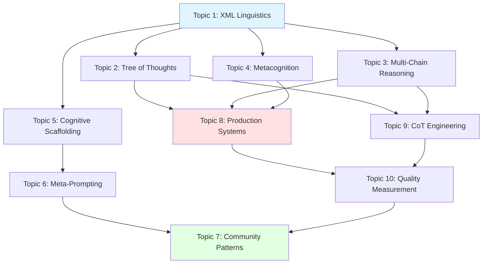

# Extraction Report: Advanced Claude Reasoning Research: Topic Architecture

> [!info] Auto-Generated Report
> This report was automatically generated by `pkb_extractor.py` on 2026-03-13 04:18.
> **Source**: `topic-set-advanced-claude-reasoning-research-2025122713.md` | **Items Extracted**: 127

---

## 📋 Document Overview

| Field | Value |
|-------|-------|
| **Source File** | `topic-set-advanced-claude-reasoning-research-2025122713.md` |
| **Extraction Date** | 2026-03-13 04:18 |
| **Word Count** | 1,785 |
| **Character Count** | 14,543 |
| **Line Count** | 408 |
| **Total Items Extracted** | 127 |

### Document Outline

- # 🧠 Advanced Claude Reasoning Research: Topic Architecture
  - ## 📋 Topic Set: Claude Advanced Reasoning Architecture
    - ### **Architectural Philosophy**
  - ## 🏗️ Topic 1: The XML Linguistics of Claude's Thinking Tags
  - ## Natural Sections (Cognitive Scaffolds):
  - ## 🌳 Topic 2: Tree of Thoughts Architecture in Claude Systems
  - ## Natural Sections (Cognitive Scaffolds):
  - ## 🔄 Topic 3: Multi-Chain Reasoning & Self-Consistency Mechanisms
  - ## Natural Sections (Cognitive Scaffolds):
  - ## 🪞 Topic 4: Metacognitive Reasoning Systems (Reflexion & Self-Correction)
  - ## Natural Sections (Cognitive Scaffolds):
  - ## 🧱 Topic 5: Cognitive Load Scaffolding Engineering
  - ## Natural Sections (Cognitive Scaffolds):
  - ## 🔧 Topic 6: Meta-Prompting: Using Claude to Engineer Claude
  - ## Natural Sections (Cognitive Scaffolds):
  - ## 💡 Topic 7: Novel Community Reasoning Patterns & Discoveries
  - ## Natural Sections (Cognitive Scaffolds):
  - ## 🏛️ Topic 8: Production Reasoning System Architecture
  - ## Natural Sections (Cognitive Scaffolds):
  - ## 🔬 Topic 9: Chain of Thought Engineering & Integration Patterns
  - ## Natural Sections (Cognitive Scaffolds):
  - ## 🎯 Topic 10: Reasoning Quality Measurement & Optimization
  - ## Natural Sections (Cognitive Scaffolds):
  - ## 🔗 Topic Interconnections & Reading Order
    - ### **Recommended Sequence for Systematic Learning**:
  - ## 📊 Cognitive Load Management Features
    - ### **1. Natural Sectioning**
    - ### **2. Progression Markers**
    - ### **3. Integration Hooks**
    - ### **4. Example Density**
    - ### **5. Template Provision**
    - ### **6. Validation Checkpoints**
  - ## 🎯 Why This Architecture Succeeds
    - ### **Comprehensive Coverage**
    - ### **Natural Scaffolding**
    - ### **Progressive Depth**
    - ### **Novel Insights**
    - ### **Practical Value**
  - ## 🚀 Expansion Opportunities

---

## 📊 Extraction Summary

| Item Type | Count |
|-----------|-------|
| Callouts | 0 |
| Code Blocks | 10 |
| Color Spans | 0 |
| Definitions | 0 |
| Embeds | 0 |
| External Links | 0 |
| Footnotes | 0 |
| Headings | 39 |
| Inline Fields | 0 |
| Mermaid Diagrams | 1 |
| Tables | 0 |
| Tags | 0 |
| Wiki Links | 6 |
| **TOTAL** | **127** |

---

## 🔗 Wiki-Links (6 total, 6 unique targets)

> [!info] Knowledge Graph Connections
> These links represent connections to other notes in your PKB.
> **6** distinct notes are referenced.

### Unique Targets

- [[Adversarial Reasoning Testing]]
- [[Domain-Specific Reasoning Architectures]]
- [[Multi-Agent Reasoning Coordination]]
- [[Reasoning Performance Benchmarking]]
- [[Reasoning System Debugging & Troubleshooting]]
- [[Reasoning System Economics]]

### All Occurrences

| # | Target | Display Text | Heading | Section | Line |
|---|--------|-------------|---------|---------|------|
| 1 | [[Domain-Specific Reasoning Architectures]] | — | — | 🚀 Expansion Opportunities | 410 |
| 2 | [[Reasoning System Debugging & Troubleshooting]] | — | — | 🚀 Expansion Opportunities | 411 |
| 3 | [[Multi-Agent Reasoning Coordination]] | — | — | 🚀 Expansion Opportunities | 412 |
| 4 | [[Reasoning Performance Benchmarking]] | — | — | 🚀 Expansion Opportunities | 413 |
| 5 | [[Adversarial Reasoning Testing]] | — | — | 🚀 Expansion Opportunities | 414 |
| 6 | [[Reasoning System Economics]] | — | — | 🚀 Expansion Opportunities | 415 |

---

## 💻 Code Blocks (10)

| Language | Count |
|----------|-------|
| `markdown` | 10 |

### Code Block 1 — `markdown` *(Lines 43-52)*

```markdown
## Natural Sections (Cognitive Scaffolds):

1. **XML as Cognitive Delimiter**: How tags create reasoning boundaries
2. **Semantic Tag Taxonomy**: Categorizing tags by cognitive function
3. **Nested Tag Architecture**: Hierarchical reasoning structures  
4. **Custom Tag Engineering**: Principles for creating novel tags
5. **Tag Linguistics & Parsing**: How Claude interprets tag semantics
6. **Empirical Tag Performance**: Community-discovered effective patterns
```

### Code Block 2 — `markdown` *(Lines 70-80)*

```markdown
## Natural Sections (Cognitive Scaffolds):

1. **ToT Fundamentals in LLMs**: How tree exploration works in Claude
2. **Node Architecture & State Management**: Representing exploration state
3. **Branching Strategies**: When to explore width vs depth
4. **Evaluation & Pruning Heuristics**: Scoring and abandoning paths
5. **Backtracking Protocols**: Recovery from unproductive directions
6. **ToT + Self-Consistency Integration**: Multi-chain validation in trees
7. **Production Implementation Patterns**: Complete system examples
```

### Code Block 3 — `markdown` *(Lines 98-108)*

```markdown
## Natural Sections (Cognitive Scaffolds):

1. **Chain Independence**: Preventing reasoning contamination
2. **Perspective Engineering**: Creating distinct reasoning lenses
3. **Chain Generation Protocols**: Systematic diverse reasoning
4. **Convergence Analysis**: Measuring chain agreement
5. **Divergence Resolution**: Synthesizing conflicting chains
6. **Robustness Assessment**: Confidence scoring methods
7. **Integration with Other Frameworks**: SC + ToT + CoT combinations
```

### Code Block 4 — `markdown` *(Lines 126-136)*

```markdown
## Natural Sections (Cognitive Scaffolds):

1. **Metacognition in AI Systems**: Self-monitoring fundamentals
2. **Quality Gate Architecture**: Validation checkpoint design
3. **Failure Detection Heuristics**: Recognizing poor reasoning
4. **Self-Correction Protocols**: Recovery and refinement
5. **Learning from Failed Paths**: Extracting meta-insights
6. **Continuous Improvement Loops**: Iterative refinement
7. **Production Reflexion Systems**: Complete implementations
```

### Code Block 5 — `markdown` *(Lines 154-164)*

```markdown
## Natural Sections (Cognitive Scaffolds):

1. **Cognitive Load Theory for LLMs**: Working memory constraints
2. **Scaffold Taxonomy**: Types of cognitive support structures
3. **Decomposition Strategies**: Breaking complex reasoning
4. **Progressive Disclosure Architecture**: Staged information revelation
5. **State Management Patterns**: Tracking intermediate results
6. **Context Window Optimization**: Efficient information architecture
7. **Empirical Scaffold Effectiveness**: What actually works
```

### Code Block 6 — `markdown` *(Lines 182-192)*

```markdown
## Natural Sections (Cognitive Scaffolds):

1. **Meta-Prompting Fundamentals**: Self-improvement mechanisms
2. **Recursive Prompt Refinement**: Iterative optimization
3. **Self-Generating Reasoning Protocols**: Claude building structures
4. **Meta-Prompt Patterns Library**: Reusable templates
5. **Quality Assessment Automation**: Self-evaluation systems
6. **Convergence & Stability**: When to stop refining
7. **Production Meta-Systems**: Complete workflows
```

### Code Block 7 — `markdown` *(Lines 210-220)*

```markdown
## Natural Sections (Cognitive Scaffolds):

1. **Discovery Methodology**: How novel patterns emerge
2. **Uncommon Thinking Tag Patterns**: Beyond standard XML
3. **Edge Case Reasoning Techniques**: Handling boundary conditions
4. **Cross-Domain Reasoning Transfers**: Analogical applications
5. **Experimental Approaches**: High-risk, high-reward techniques
6. **Pattern Effectiveness Analysis**: Why these work
7. **Replication & Adaptation**: Making discoveries yours
```

### Code Block 8 — `markdown` *(Lines 238-248)*

```markdown
## Natural Sections (Cognitive Scaffolds):

1. **System Requirements Analysis**: Defining reasoning needs
2. **Framework Selection & Integration**: Combining ToT/SC/CoT/Reflexion
3. **Modular Component Architecture**: Reusable reasoning blocks
4. **Validation & Testing Frameworks**: Quality assurance
5. **Performance Optimization**: Speed vs. depth tradeoffs
6. **Deployment Patterns**: Production considerations
7. **Monitoring & Maintenance**: Ongoing quality management
```

### Code Block 9 — `markdown` *(Lines 266-276)*

```markdown
## Natural Sections (Cognitive Scaffolds):

1. **CoT Design Principles**: Effective exemplar creation
2. **Exemplar Library Architecture**: Organizing reusable patterns
3. **Context-Sensitive CoT Selection**: When to use which pattern
4. **CoT + ToT Integration**: Guiding tree exploration
5. **CoT + Self-Consistency Synergy**: Structured multi-chain reasoning
6. **Avoiding CoT Rigidity**: Flexibility vs. structure balance
7. **Domain-Specific CoT Patterns**: Specialization strategies
```

### Code Block 10 — `markdown` *(Lines 294-304)*

```markdown
## Natural Sections (Cognitive Scaffolds):

1. **Reasoning Quality Dimensions**: What to measure
2. **Quantitative Assessment Methods**: Metrics and scoring
3. **Bottleneck Identification**: Finding reasoning failures
4. **Optimization Strategies**: Systematic improvement
5. **A/B Testing for Reasoning**: Comparative evaluation
6. **Continuous Quality Monitoring**: Production tracking
7. **Empirical Effectiveness Studies**: What works, what doesn't
```

---

## 📐 Mermaid Diagrams (1)

### Diagram 1 — graph *(Line 321)*



---

## 🕸️ Knowledge Graph Analysis

### Unique Wiki-Link Targets (6)

> These represent all distinct notes referenced in the source document.
> Each is a candidate for backlink creation in your PKB.

- [[Adversarial Reasoning Testing]]
- [[Domain-Specific Reasoning Architectures]]
- [[Multi-Agent Reasoning Coordination]]
- [[Reasoning Performance Benchmarking]]
- [[Reasoning System Debugging & Troubleshooting]]
- [[Reasoning System Economics]]

---

## 📁 Raw Data

> [!abstract] JSON File Available
> The full machine-readable extraction is saved alongside this report as:
> `topic-set-advanced-claude-reasoning-research-2025122713_extracted.json`

---

*Report generated by `pkb_extractor.py v1.1.0` · 2026-03-13 04:18:05*