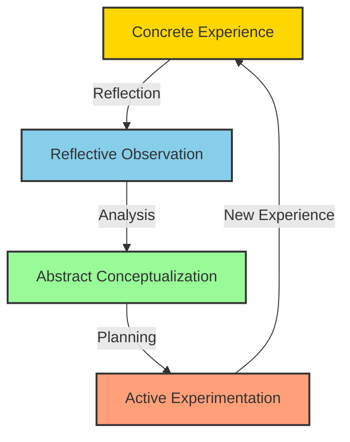

# Extraction Report: A Framework Synthesis: Continuous Self Development

> [!info] Auto-Generated Report
> This report was automatically generated by `pkb_extractor.py` on 2026-03-13 04:18.
> **Source**: `cog-sci-report-framework-synthesis-for-continuous-self-development-20251026152940.md` | **Items Extracted**: 329

---

## 📋 Document Overview

| Field | Value |
|-------|-------|
| **Source File** | `cog-sci-report-framework-synthesis-for-continuous-self-development-20251026152940.md` |
| **Extraction Date** | 2026-03-13 04:18 |
| **Word Count** | 12,259 |
| **Character Count** | 91,939 |
| **Line Count** | 842 |
| **Total Items Extracted** | 329 |

### Document Outline

- # 1.0 📜 INTRODUCTION
- # 2.0 🧭 HISTORICAL CONTEXT & FOUNDATIONAL THEORIES
  - ## THE PRAGMATIST ROOTS: DEWEY AND REFLECTIVE THOUGHT
  - ## EXPERIENTIAL LEARNING: FROM LEWIN TO KOLB
  - ## SCHÖN AND THE REFLECTIVE PRACTITIONER
  - ## THE BEHAVIORAL TRADITION: FROM SKINNER TO SELF-DETERMINATION
  - ## CONSTRUCTIVISM AND SOCIAL LEARNING
- # 3.0 🔭🔬 DEEP EXPOSITION: A MULTI-FACETED ANALYSIS
  - ## 3.1 ⚛️ FOUNDATIONAL PRINCIPLES
- # 4.0 ⚙️ MECHANISMS AND PROCESSES
  - ## 4.1 THE CYCLE OF EXPERIENTIAL LEARNING
  - ## 4.2 THE ARCHITECTURE OF HABIT FORMATION
  - ## 4.3 THE MOTIVATION SPECTRUM AND INTERNALIZATION
  - ## 4.4 THE SOCIAL CONSTRUCTION OF KNOWLEDGE
  - ## 4.5 METACOGNITION AND SELF-REGULATED LEARNING
- # 5.0 🔬 OBSERVATIONAL EVIDENCE
  - ## 5.1 EMPIRICAL SUPPORT FOR REFLECTIVE PRACTICE
  - ## 5.2 EMPIRICAL SUPPORT FOR SELF-DETERMINATION THEORY
  - ## 5.3 EMPIRICAL SUPPORT FOR IMPLEMENTATION INTENTIONS
  - ## 5.4 EMPIRICAL SUPPORT FOR CONSTRUCTIVISM AND SOCIAL LEARNING
- # 6.0 🌍 BROADER IMPLICATIONS
  - ## 6.1 FOR PROFESSIONAL DEVELOPMENT AND TRAINING
  - ## 6.2 FOR EDUCATIONAL DESIGN AND PEDAGOGY
  - ## 6.3 FOR PERSONAL LIFE MANAGEMENT
  - ## 6.4 FOR POLICY AND SYSTEM DESIGN
- # 7.0 ❔ FRONTIER RESEARCH
  - ## 7.1 NEUROSCIENCE OF SELF-DIRECTED CHANGE
  - ## 7.2 DIGITAL TECHNOLOGIES AND SELF-DEVELOPMENT
  - ## 7.3 BEHAVIOR CHANGE AT SCALE
  - ## 7.4 INTEGRATION OF EMBODIED AND SITUATED APPROACHES
- # 8.0 🦕 CONCLUSION
- # 9.0 🧠 KEY QUESTIONS
- # 10.0 📚 REFERENCE/APPENDIX
  - ## 🔗 RELATED TOPICS FOR PERSONAL KNOWLEDGE BASE EXPANSION

---

## 📊 Extraction Summary

| Item Type | Count |
|-----------|-------|
| Callouts | 38 |
| Code Blocks | 3 |
| Color Spans | 0 |
| Definitions | 0 |
| Embeds | 0 |
| External Links | 2 |
| Footnotes | 108 |
| Headings | 34 |
| Inline Fields | 0 |
| Mermaid Diagrams | 1 |
| Tables | 0 |
| Tags | 0 |
| Wiki Links | 117 |
| **TOTAL** | **329** |

---

## 🔔 Callouts (38)

> [!note] What are Callouts?
> Callouts are `> [!TYPE]` blocks used in Obsidian for structured annotation.
> They carry semantic meaning — definitions, insights, warnings, etc.

### By Type

| Callout Type | Count |
|-------------|-------|
| `[!abstract]` | 1 |
| `[!analogy]` | 1 |
| `[!ask-yourself-this]` | 2 |
| `[!cite]` | 1 |
| `[!connection-ideas]` | 1 |
| `[!counter-argument]` | 1 |
| `[!definition]` | 1 |
| `[!evidence]` | 4 |
| `[!example]` | 1 |
| `[!important]` | 1 |
| `[!key-claim]` | 3 |
| `[!links-to-related-notes]` | 1 |
| `[!pre-read-questions]` | 1 |
| `[!principle-point]` | 7 |
| `[!question]` | 1 |
| `[!quote]` | 4 |
| `[!summary]` | 1 |
| `[!the-purpose]` | 5 |
| `[!thoughts]` | 1 |

### Full Callout List

#### 1. [PRE-READ-QUESTIONS] Untitled *(Line 28)*

> [!pre-read-questions] Untitled
> - How do the disciplines of reflective practice, behavioral psychology, and learning theory converge to inform a unified approach to personal growth?
> - What distinguishes systematic self-development from passive experience accumulation, and why does this distinction matter for professional excellence?
> - In what ways can understanding the mechanisms of habit formation and metacognition accelerate your journey toward becoming the person you aspire to be?
> - How might an integrated framework address the common failure modes in personal development—the abandoned resolutions, the stalled progress, the gap between intention and action?

#### 2. [ABSTRACT] Untitled *(Line 36)*

> [!abstract] Untitled
> This comprehensive exploration synthesizes three foundational domains—[[reflective practice]], [[behavioral psychology]], and [[Learning Theory]]—into a cohesive framework for continuous self-development. We examine how deliberate reflection transforms experience into wisdom, how behavioral science reveals the architecture of sustainable change, and how learning theory illuminates the cognitive processes underlying skill acquisition and knowledge construction. The framework proposed here is neither prescriptive nor simplistic; it acknowledges the profound complexity of human development while offering practical, evidence-based pathways forward.
> 
> At its core, this synthesis addresses a fundamental paradox: while human beings possess extraordinary capacity for growth and adaptation, most struggle to translate aspiration into sustained transformation. Through examining the iterative cycles of [[Kolb's Experiential Learning]], the motivational dynamics of [[Self-Determination Theory]], the strategic automaticity of [[implementation intentions]], and the social construction of knowledge articulated by [[Vygotsky]], we construct a meta-framework that honors both the systematic nature of development and the deeply personal nature of growth. This framework is designed for the professional who seeks not merely competence, but mastery; not merely change, but transformation.

#### 3. [THE-PURPOSE] Untitled *(Line 43)*

> [!the-purpose] Untitled
> This article aims to provide a deep, intellectually rigorous examination of continuous self-development as a systematic, iterative process. It transcends the shallow waters of self-help platitudes to explore the foundational theories that explain *how* and *why* humans develop across their lifespan. By integrating insights from reflective practice, behavioral psychology, and learning theory, we construct a comprehensive framework that professionals can apply to their own growth trajectories. This is not a quick-fix manual, but rather a scholarly synthesis intended to build genuine understanding of the mechanisms that govern human development.

#### 4. [QUOTE] Untitled *(Line 46)*

> [!quote] Untitled
> "We do not learn from experience... we learn from reflecting on experience."
> — John Dewey, *How We Think* (1933)

#### 5. [THE-PURPOSE] Untitled *(Line 50)*

> [!the-purpose] Untitled
> Dewey's insight, articulated nearly a century ago, remains profoundly relevant. It captures the essence of what distinguishes true development from mere accumulation of experiences. Two professionals might work in identical environments for identical durations, yet one emerges transformed while the other remains stagnant. The difference lies not in the quantity of experiences, but in the quality of reflection applied to those experiences. This observation serves as the philosophical anchor for our framework: systematic self-development requires the intentional application of cognitive processes to one's lived experiences.

#### 6. [ASK-YOURSELF-THIS] Untitled *(Line 89)*

> [!ask-yourself-this] Untitled
> - *How did the* **historical development** *of reflective practice* **shape** *our current understanding?*
>     - The evolution from Dewey's general concept of reflective thought to Schön's situated professional artistry reveals an increasing appreciation for the context-dependent, embodied nature of expertise. Early views treated reflection as primarily cognitive and individual; later frameworks recognized its social, emotional, and action-oriented dimensions. This progression mirrors broader shifts in educational and psychological theory from behaviorism to cognitivism to sociocultural perspectives.
> - *Are there any* **abandoned theories** *that are as interesting as the current ones?*
>     - [[Chris Argyris]]'s distinction between [[single-loop learning]] (correcting errors within existing frameworks) and [[double-loop learning]] (questioning and revising the frameworks themselves) deserves renewed attention. While influential in organizational learning, it is less commonly integrated into personal development frameworks. Yet the capacity to question our own assumptions—to engage in double-loop learning—may be the most critical skill for navigating complexity and avoiding self-deception.

#### 7. [PRINCIPLE-POINT] Untitled *(Line 121)*

> [!principle-point] Untitled
> **Core Principle 1: The Primacy of Deliberate Reflection**
> Experience alone is necessary but insufficient for learning and development. The transformation of experience into knowledge requires deliberate, structured reflection that examines not only what happened, but why it happened, what it means, and how future action should be modified. Without reflection, we are condemned to repeat our experiences without learning from them.

#### 8. [QUOTE] Untitled *(Line 131)*

> [!quote] Untitled
> "Reflection-in-action is a dialogue of thinking and doing through which I become more skillful."
> — Donald Schön, *The Reflective Practitioner*

#### 9. [THE-PURPOSE] Untitled *(Line 135)*

> [!the-purpose] Untitled
> Schön's insight highlights that reflection is not merely retrospective analysis, but an active component of skilled performance itself. The master carpenter "listens" to the wood, adjusting technique in response to its grain and resistance. The expert therapist notices subtle shifts in a client's affect and spontaneously modifies their intervention. This real-time reflection-in-action distinguishes expertise from mere technical proficiency.

#### 10. [PRINCIPLE-POINT] Untitled *(Line 138)*

> [!principle-point] Untitled
> **Core Principle 2: The Three Pillars of Motivation**
> Sustainable behavior change and development require the satisfaction of three innate psychological needs: autonomy (experiencing a sense of volition and choice), competence (experiencing effectiveness and mastery), and relatedness (experiencing connection and belonging). When these needs are supported, development becomes self-sustaining; when thwarted, it becomes dependent on external control and prone to failure.

#### 11. [DEFINITION] Untitled *(Line 150)*

> [!definition] Untitled
> - **Internalization:**
>     - The process through which externally regulated behaviors and values are transformed into personally endorsed and self-determined motivations. In SDT's framework, internalization progresses through stages from external regulation (purely driven by consequences) → introjected regulation (driven by internal pressures like guilt) → identified regulation (consciously valued) → integrated regulation (fully aligned with self). Full internalization means you no longer *have* to do something; you *want* to do it because it expresses who you are.

#### 12. [PRINCIPLE-POINT] Untitled *(Line 154)*

> [!principle-point] Untitled
> **Core Principle 3: The Behavior Convergence Formula**
> For any behavior to occur at a specific moment, three elements must simultaneously converge: sufficient motivation (desire to act), sufficient ability (capacity and opportunity to act), and an effective prompt (trigger that initiates action). This B=MAP formula provides a diagnostic framework for understanding why intended behaviors fail to materialize and how to design environments that support desired actions.

#### 13. [PRINCIPLE-POINT] Untitled *(Line 168)*

> [!principle-point] Untitled
> **Core Principle 4: Strategic Automaticity Through Implementation Intentions**
> Goal achievement is dramatically enhanced—effect size of d=.65—when abstract goal intentions ("I intend to exercise more") are translated into concrete implementation intentions that specify when, where, and how action will be taken ("If it is Monday morning at 7am, then I will put on my running shoes and jog around the park"). These if-then plans delegate control to environmental cues, automating goal-directed behavior and conserving cognitive resources for other tasks.

#### 14. [PRINCIPLE-POINT] Untitled *(Line 178)*

> [!principle-point] Untitled
> **Core Principle 5: Knowledge as Active Construction**
> Learning is not the passive reception of information but the active construction of understanding. Learners integrate new experiences with existing mental models through processes of assimilation (fitting new information into existing schemas) and accommodation (revising schemas to fit new information). This constructive process means that identical experiences produce different learning outcomes depending on the learner's prior knowledge, beliefs, and interpretive frameworks.

#### 15. [PRINCIPLE-POINT] Untitled *(Line 194)*

> [!principle-point] Untitled
> **Core Principle 6: The Social Scaffolding of Development**
> Individual development is enabled and constrained by social and cultural contexts. Learning occurs first on the social plane (between people) and later on the psychological plane (within the individual), as mediated by cultural tools like language, concepts, and practices. The gap between what one can do independently and what one can do with guidance—the Zone of Proximal Development—defines the space where development is possible. Effective development systems provide appropriate scaffolding within this zone.

#### 16. [PRINCIPLE-POINT] Untitled *(Line 206)*

> [!principle-point] Untitled
> **Core Principle 7: The Iterative Nature of Development**
> Development is not linear but cyclical and iterative. We repeatedly move through phases of experience, reflection, conceptualization, and experimentation. Each cycle produces small increments of growth; accumulated cycles produce transformation. Discontinuities and plateaus are normal features of the developmental landscape, not signs of failure. Long-term development requires patience with process and celebration of small wins.

#### 17. [IMPORTANT] Untitled *(Line 226)*

> [!important] Untitled
> The quality of concrete experience matters. [[Deliberate practice]]—experience specifically designed to stretch current capacities, with clear goals, focused attention, and immediate feedback—produces far greater learning than routine repetition. Not all experience is created equal.

#### 18. [ANALOGY] Untitled *(Line 249)*

> [!analogy] Untitled
> Think of experiential learning as a spiral staircase. Each complete cycle represents one full rotation—you return to a similar position (concrete experience) but at a higher level of understanding and capability. Over many cycles, the cumulative ascent produces expertise. The spiral metaphor captures both the repetitive and progressive nature of development.

#### 19. [EXAMPLE] Untitled *(Line 285)*

> [!example] Untitled
> Consider learning to drive. Initially, every action—checking mirrors, turning the steering wheel, applying pressure to pedals—requires intense concentration. After months of practice, driving becomes "second nature." You can navigate familiar routes while carrying on a conversation or listening to a podcast, with the driving behavior proceeding automatically. Yet you retain the ability to consciously control when necessary (emergency situations, unfamiliar roads). This is the hallmark of a mature habit: automatic execution with preserved capacity for conscious override.

#### 20. [KEY-CLAIM] Untitled *(Line 332)*

> [!key-claim] Untitled
> Professional development is most effective when it simulates or embeds learners within communities of practice, provides graduated scaffolding, and explicitly addresses the identity transformation from novice to expert. Isolated training divorced from authentic practice context rarely produces transfer.

#### 21. [EVIDENCE] Untitled *(Line 361)*

> [!evidence] Untitled
> *The* **primary evidence** *supporting reflective practice comes from:*
> - [[Gibbs' (1988) Reflective Cycle studies]], which demonstrated that structured reflection significantly improved learning outcomes in nursing education. Nurses who engaged in systematic reflection showed enhanced clinical judgment, better patient outcomes, and greater professional confidence compared to those who did not reflect systematically.[^34]
>   - **This showed:** Reflection must be structured and deliberate. Unguided rumination does not produce the same learning effects as reflection following a systematic framework.
> 
> - [[Schön's (1983) observational studies]] of architects, psychotherapists, engineers, and town planners, which revealed that expert practitioners engage in constant micro-cycles of reflection-in-action, framing and reframing problems as they unfold.[^35]
>   - **This showed:** Expert practice is not the straightforward application of technical rules, but artful improvisation informed by reflective thinking. Expertise includes knowing when rules apply and when to break them.
> 
> - [[Meta-analyses of medical education]] (Mann et al., 2009) examining reflection interventions across multiple studies and contexts, finding moderate positive effects (effect sizes ranging from d=0.19 to d=0.69) on clinical reasoning, diagnostic accuracy, and professional development.[^36]
>   - **This showed:** Reflection produces tangible improvements in professional performance, not merely subjective feelings of growth. The effect is strengthened when reflection is scaffolded, social (discussed with others), and linked to action.

#### 22. [KEY-CLAIM] Untitled *(Line 372)*

> [!key-claim] Untitled
> Based on the evidence, a **key claim** is that:
> Reflection is not merely "thinking about" experience but involves specific cognitive operations: description of concrete details, analysis of causes and consequences, synthesis with theoretical frameworks, evaluation against standards or goals, and projection of modified future action. These operations must be deliberately practiced; they don't occur spontaneously for most people.

#### 23. [EVIDENCE] Untitled *(Line 380)*

> [!evidence] Untitled
> *Evidence from controlled experiments:*
> - Deci's original (1971) study showing that external rewards undermined intrinsic motivation for interesting activities, a finding replicated across hundreds of subsequent studies.[^38]
>   - **This showed:** The overjustification effect—when you pay people for what they already enjoy, the payment can crowd out internal motivation. The activity comes to be seen as work rather than play.
> 
> - Field experiments demonstrating that autonomy-supportive (vs. controlling) teaching styles produce better learning outcomes, higher creativity, greater conceptual understanding, and lower dropout rates.[^39]
>   - **This showed:** How environments are structured (autonomy-supporting vs. controlling) matters as much as or more than what is taught. Content delivery without need support produces shallow, fragile learning.
> 
> - Longitudinal studies showing that need satisfaction predicts well-being trajectories over time, with effects holding after controlling for baseline well-being, personality, and life circumstances.[^40]
>   - **This showed:** The three basic needs are not mere preferences but genuine psychological requirements—thwarting them over time produces measurable decrements in mental health and functioning.

#### 24. [QUOTE] Untitled *(Line 391)*

> [!quote] Untitled
> "Human beings can be proactive and engaged or, alternatively, passive and alienated, largely as a function of the social conditions in which they develop and function."
> — Ryan & Deci (2000), "Self-determination theory and the facilitation of intrinsic motivation, social development, and well-being"

#### 25. [THE-PURPOSE] Untitled *(Line 395)*

> [!the-purpose] Untitled
> This quote captures SDT's central thesis—that contexts shape motivation quality. It suggests that organizations, educators, and individuals can intentionally create conditions that foster or undermine autonomous motivation. The practical implication is that development interventions should be evaluated not just on whether they produce behavior change, but on what *kind* of motivation they engender.

#### 26. [EVIDENCE] Untitled *(Line 402)*

> [!evidence] Untitled
> **Key findings:**
> - **Overall effect size: d = .65** (medium to large effect on goal attainment)
> - Implementation intentions were effective across diverse goal domains: health behaviors (exercise, diet, medical screening), academic performance, environmental conservation, negotiation, time management
> - Effects were particularly strong for "getting started" problems (remembering to act, seizing opportunities, overcoming initial reluctance): **d = .54 to .78**
> - Effects were maintained for "staying on track" problems (shielding goal pursuit from distractions, resisting temptation): **d = .77**
> - Mechanism confirmed: Implementation intentions enhance cue accessibility (faster detection of critical situations) and automate responses (faster, more efficient action initiation)

#### 27. [KEY-CLAIM] Untitled *(Line 410)*

> [!key-claim] Untitled
> Implementation intentions work by strategically offloading the burden of decision-making from the moment of action to an earlier planning phase. Once the if-then plan is set, the specified situation automatically triggers the response without requiring effortful self-control in the moment. This is especially valuable given that self-control is a limited resource that becomes depleted with use.

#### 28. [EVIDENCE] Untitled *(Line 417)*

> [!evidence] Untitled
> - [[Problem-Based Learning (PBL) meta-analyses]] show superior long-term retention, deeper understanding, and better transfer to novel situations compared to traditional instruction, though traditional instruction may produce better short-term recall of facts.[^43]
>   - **This showed:** What you do with information matters more than how much information you receive. Active struggle with problems promotes deeper encoding and more flexible knowledge.
> 
> - [[Vygotsky-inspired research on the Zone of Proximal Development]] demonstrates that tasks calibrated to the learner's edge of competence (challenging but achievable with support) produce optimal learning, while tasks too easy or too hard produce sub-optimal outcomes.[^44]
>   - **This showed:** There is an optimal difficulty level for learning—too easy produces boredom and minimal growth; too hard produces anxiety and giving up. The "Goldilocks principle" for development.
> 
> - [[Studies of apprenticeship and mentoring relationships]] show that novice-expert interaction accelerates skill development more than solo practice or peer collaboration alone.[^45]
>   - **This showed:** Access to expert models of thinking and performance is crucial. Watching and working alongside experts provides otherwise invisible information about strategy selection, problem-framing, and quality standards.

#### 29. [CONNECTION-IDEAS] Untitled *(Line 441)*

> [!connection-ideas] Untitled
> *The principles discussed here* **strongly connect to the field of:**
>   - [[Organizational Learning]] and the concept of [[Learning Organizations]] articulated by Peter Senge
>   - **The reason:**
>     - Organizations that master continuous learning at the collective level must first support continuous learning at the individual level. The five disciplines Senge describes (personal mastery, mental models, shared vision, team learning, systems thinking) all depend on individuals who engage in reflective practice, construct and revise their mental models, and sustain motivation for growth. Our framework provides the micro-level processes that enable Senge's macro-level organizational transformation.

#### 30. [COUNTER-ARGUMENT] Untitled *(Line 473)*

> [!counter-argument] Untitled
> **An important counter-argument or alternative perspective suggests that:**
> Some critics argue that the emphasis on deliberate, systematic development underestimates the value of serendipity, playfulness, and "wasting time." [[Cal Newport]] and others caution that over-structured self-improvement can become counterproductive, crowding out the unstructured exploration that often yields the most creative insights. The obsessive optimization of every hour can paradoxically undermine the well-being it aims to serve.
> **This is important because:**
> It highlights that the framework should be applied with wisdom and balance. There is a place for systematic development *and* for unstructured play, for goal-directed action *and* for aimless wandering. The framework describes *how* development works when you engage in it deliberately, but it doesn't prescribe that every moment should be developmental. Rest, recreation, and randomness have their own essential roles in a flourishing life.

#### 31. [QUESTION] Untitled *(Line 499)*

> [!question] Untitled
> *What is the* **single biggest unanswered question** *in this field right now?*
> How can we personalize development approaches based on neurobiological individual differences? If people vary in baseline executive function, stress reactivity, reward sensitivity, and neuroplasticity, should development frameworks be tailored accordingly? Current approaches are largely one-size-fits-all; precision development based on neurocognitive profiling may be the next frontier.

#### 32. [SUMMARY] Untitled *(Line 535)*

> [!summary] Untitled
> We have journeyed through the theoretical foundations and empirical evidence supporting an integrated framework for continuous self-development. The synthesis reveals that development is simultaneously:
> 
> **A reflective process** requiring deliberate examination of experience through structured cycles of observation, analysis, and planning (Kolb, Schön, Gibbs)
> 
> **A motivational process** requiring satisfaction of basic psychological needs for autonomy, competence, and relatedness to sustain engagement (Deci & Ryan)
> 
> **A behavioral process** requiring the strategic use of prompts and implementation intentions to translate intentions into habits (Fogg, Gollwitzer)
> 
> **A cognitive process** requiring active construction of knowledge through assimilation and accommodation of experiences (Piaget)
> 
> **A social process** occurring within zones of proximal development, supported by scaffolding from more knowledgeable others (Vygotsky)
> 
> No single theoretical lens captures the full complexity of human development. Each contributes essential insights; each, alone, is incomplete. The power of integration lies in recognizing that effective development strategies must address all dimensions simultaneously. A brilliant reflection practice without attention to motivation will produce insights that never translate to action. Sophisticated behavior design without reflection will create habits that lack meaning and direction. Social learning without individual agency will produce conformity rather than growth.
> 
> The framework we have constructed is not a recipe for mechanical application, but a conceptual toolkit for navigating the lifelong journey of becoming. It suggests that sustained development requires:
> 
> **Regular reflection** built into the rhythm of professional and personal life
> **Environments** that support autonomy, competence, and relatedness
> **Strategic use of implementation intentions** to bridge intention and action
> **Active engagement** with challenging problems that stretch current capacity
> **Developmental relationships** that provide scaffolding, feedback, and community
> **Patience with process**, recognizing that mastery is built through countless small iterations
> 
> Perhaps most importantly, the framework reveals that development is not something that happens *to* us or is done *to* us, but something we actively *do*. We are not passive recipients of development interventions, but active agents in our own becoming. This recognition is simultaneously humbling (there are no shortcuts, no one can do the work for us) and empowering (we have agency, we can choose our path, we can design our growth).
> 
> The gap between current self and potential self is bridged not by wishing or hoping, but by systematic, reflective, socially-embedded practice over time. This is the work of a lifetime—challenging, sometimes frustrating, often exhilarating, always worthwhile. The integrated framework we have explored provides the theoretical foundation and practical guidance for undertaking this essential human project with intention, intelligence, and hope.

#### 33. [ASK-YOURSELF-THIS] Untitled *(Line 565)*

> [!ask-yourself-this] Untitled
> - *How would* **I explain** *the* *central idea of this article to someone with no background in this field?* (**The Feynman Technique**)
>     - Imagine you want to get better at something—anything. Maybe you want to become a better leader, or learn a new skill, or change a habit. Most people approach this haphazardly: they read a book, attend a workshop, try something for a while, then move on to the next thing. But this article says there's a better way—a *systematic* way.
> 
>     - The core idea is that genuine development requires three things working together: **reflection** (thinking deeply about your experiences, not just having experiences), **smart habits** (using proven techniques from psychology to make new behaviors stick), and **the right environment** (surrounding yourself with people and structures that support your growth). It's like the difference between wandering randomly through a forest and having a compass, a map, and a guide. Both might eventually get you where you're going, but one is much more efficient and reliable. The article pulls together decades of research to show exactly how these pieces fit together and how you can use them in your own life.
> 
> - *What was the most* **surprising or counter-intuitive** *concept presented?* **Why**?
>     - The most surprising insight is that external rewards can actually *reduce* motivation for activities we find inherently interesting. This seems backwards—shouldn't rewarding something make us want to do it more? But Self-Determination Theory shows that when you pay people for activities they already enjoy, it can shift their mindset from "I do this because I love it" to "I do this because I'm paid." The payment crowds out the intrinsic satisfaction. It's counter-intuitive because our entire society is built on the assumption that carrots and sticks are the fundamental drivers of behavior. This research suggests that approach works for things people don't care about, but actually backfires for things they do care about. The practical implication is profound: to sustain development, we need to connect it to our core values and identity (intrinsic motivation), not rely on external pressures.
> 
> - *What* **pre-existing knowledge** *did this article connect with or challenge*?
>     - This article strongly connects with [[growth mindset]] research (Carol Dweck) and challenges [[fixed mindset]] assumptions about talent and ability.
> 
>       - Dweck's work on growth mindset argues that believing abilities can be developed (rather than being fixed traits) predicts greater achievement. Our framework extends this by showing *how* development actually works—the specific processes and conditions that enable growth. Where Dweck focuses on beliefs about ability, our framework provides the architecture for actualizing development. The two are complementary: growth mindset provides the psychological stance ("I can develop"), while our integrated framework provides the roadmap and toolkit ("here's how development happens").
> 
>       - The framework challenges the implicit fixed mindset embedded in much professional practice—the assumption that people either have or don't have leadership ability, creative talent, strategic thinking capacity, etc. By revealing the systematic processes underlying development (reflection, deliberate practice, need satisfaction, scaffolding), the framework demonstrates that these capacities can be cultivated through intentional practice over time.

#### 34. [QUOTE] Untitled *(Line 582)*

> [!quote] Untitled
> "The essence of the independent mind lies not in what it thinks, but in how it thinks."
> — Christopher Hitchens

#### 35. [THE-PURPOSE] Untitled *(Line 586)*

> [!the-purpose] Untitled
> While Hitchens was writing about intellectual independence rather than personal development per se, his observation captures a crucial truth about our framework. The goal is not to prescribe *what* to develop (that must be personally meaningful), but to clarify *how* development works. By understanding the processes—cycles of reflection, need satisfaction, strategic automaticity, social scaffolding—we become more effective agents of our own growth. We develop not just specific skills or knowledge, but the meta-competence of development itself: the capacity to identify what we need to learn, design appropriate learning experiences, persist through difficulty, and transform ourselves continuously. This is the independent mind applied to the project of becoming.

#### 36. [LINKS-TO-RELATED-NOTES] Untitled *(Line 589)*

> [!links-to-related-notes] Untitled
> - Identify **three key terms** or **concepts** from this article.
> - *Write your* **own definition** *for each and create a new note to link them back to this one*.
> 
> 1. [[Zone of Proximal Development]]
>     - The gap between what a learner can accomplish independently and what they can accomplish with guidance from a more knowledgeable other. This concept, developed by Vygotsky, defines the optimal space for development—challenges that are neither too easy (already mastered) nor too hard (beyond reach even with help). Effective development experiences target the ZPD, providing appropriate scaffolding that enables learners to accomplish more than they could alone while gradually building independent capability. The ZPD is dynamic, shifting as competence grows, which means development systems must continuously adjust challenge levels.
> 
> 1. [[Implementation Intentions]]
>     - Concrete if-then plans that specify when, where, and how a goal-directed behavior will be enacted ("If situation X occurs, then I will do Y"). Implementation intentions create strategic automaticity by pre-committing to a response in a specified situation, thereby offloading decision-making from the moment of action to an earlier planning phase. Research shows implementation intentions produce medium-to-large effects (d=.65) on goal achievement by enhancing cue detection and automating responses. They are particularly effective for overcoming common self-regulation failures like forgetting to act, missing opportunities, or struggling to initiate action.
> 
> 1. [[Self-Determination Theory]]
>     - A comprehensive theory of human motivation proposing that well-being and optimal functioning depend on satisfaction of three basic psychological needs: autonomy (experiencing volition and self-endorsement), competence (experiencing effectiveness and growth), and relatedness (experiencing connection and belonging). SDT distinguishes between different types of motivation along a continuum of autonomy, from controlled (external and introjected) to autonomous (identified, integrated, and intrinsic). The theory proposes that contexts supporting the three basic needs foster internalization—the transformation of external regulations into personally valued commitments—which is essential for sustainable behavior change and development.

#### 37. [THOUGHTS] Untitled *(Line 603)*

> [!thoughts] Untitled
> - *What is your* **analysis** *of this information?*
>     - This synthesis reveals both the maturity and fragmentation of the personal development field. On one hand, we have decades of rigorous research producing robust, replicable findings about how humans learn, change, and grow. The effect sizes are real, the mechanisms are increasingly well-understood, and the practical implications are clear. This is genuine knowledge, not speculation or folk wisdom.
> 
>     - On the other hand, this knowledge remains balkanized in disciplinary silos. Educators know Kolb but may be unfamiliar with Deci and Ryan. Industrial-organizational psychologists know behavior change models but may undervalue reflective practice. The failure to integrate across these domains likely explains why so many development initiatives fail—they address one dimension while neglecting others.
> 
>     - The most exciting implication of this framework is its potential to improve not just individual development, but development system design. Organizations, educational institutions, and policy-makers could apply these principles to create environments that systematically enable growth rather than accidentally hindering it. The gap between what we *know* works and what is actually *implemented* in practice remains large. Closing that gap may be the most important next step.

#### 38. [CITE] Untitled *(Line 613)*

> [!cite] Untitled
> :[^1] Gollwitzer, P. M., & Sheeran, P. (2006). Implementation intentions and goal achievement: A meta-analysis of effects and processes. *Advances in Experimental Social Psychology*, 38, 69-119. <https://doi.org/10.1016/S0065-2601(06)>38002-1
> 
> :[^2] Sheeran, P., & Webb, T. L. (2016). The intention-behavior gap. *Social and Personality Psychology Compass*, 10(9), 503-518. <https://doi.org/10.1111/spc3.12265>
> 
> :[^3] Schön, D. A. (1983). *The reflective practitioner: How professionals think in action*. Basic Books.
> 
> :[^4] Dewey, J. (1933). *How we think: A restatement of the relation of reflective thinking to the educative process*. D.C. Heath and Company.
> 
> :[^5] Lewin, K. (1951). *Field theory in social science*. Harper & Row.
> 
> :[^6] Kolb, D. A. (1984). *Experiential learning: Experience as the source of learning and development*. Prentice Hall.
> 
> :[^7] Schön, D. A. (1983). *The reflective practitioner: How professionals think in action*. Basic Books.
> 
> :[^8] Skinner, B. F. (1953). *Science and human behavior*. Macmillan.
> 
> :[^9] Deci, E. L. (1971). Effects of externally mediated rewards on intrinsic motivation. *Journal of Personality and Social Psychology*, 18(1), 105-115.
> 
> :[^10] Deci, E. L., & Ryan, R. M. (1985). *Intrinsic motivation and self-determination in human behavior*. Plenum Press.
> 
> :[^11] Ryan, R. M., & Deci, E. L. (2000). Self-determination theory and the facilitation of intrinsic motivation, social development, and well-being. *American Psychologist*, 55(1), 68-78.
> 
> :[^12] Piaget, J. (1973). *To understand is to invent*. Grossman Publishers.
> 
> :[^13] Vygotsky, L. S. (1978). *Mind in society: The development of higher psychological processes*. Harvard University Press.
> 
> :[^14] Schraw, G., & Dennison, R. S. (1994). Assessing metacognitive awareness. *Contemporary Educational Psychology*, 19(4), 460-475.
> 
> :[^15] Andrews-Hanna, J. R., Smallwood, J., & Spreng, R. N. (2014). The default network and self-generated thought. *Annals of the New York Academy of Sciences*, 1316(1), 29-52.
> 
> :[^16] Ryan, R. M., & Deci, E. L. (2017). *Self-determination theory: Basic psychological needs in motivation, development, and wellness*. Guilford Press.
> 
> :[^17] Deci, E. L., Koestner, R., & Ryan, R. M. (1999). A meta-analytic review of experiments examining the effects of extrinsic rewards on intrinsic motivation. *Psychological Bulletin*, 125(6), 627-668.
> 
> :[^18] Fogg, B. J. (2009). A behavior model for persuasive design. *Proceedings of the 4th International Conference on Persuasive Technology*, Article 40.
> 
> :[^19] Gollwitzer, P. M. (1999). Implementation intentions: Strong effects of simple plans. *American Psychologist*, 54(7), 493-503.
> 
> :[^20] Gollwitzer, P. M., & Brandstätter, V. (1997). Implementation intentions and effective goal pursuit. *Journal of Personality and Social Psychology*, 73(1), 186-199.
> 
> :[^21] Gollwitzer, P. M., & Sheeran, P. (2006). Implementation intentions and goal achievement: A meta-analysis of effects and processes. *Advances in Experimental Social Psychology*, 38, 69-119.
> 
> :[^22] von Glasersfeld, E. (1996). Introduction: Aspects of constructivism. In C. Fosnot (Ed.), *Constructivism: Theory, perspectives, and practice* (pp. 3-7). Teachers College Press.
> 
> :[^23] Vygotsky, L. S. (1978). *Mind in society: The development of higher psychological processes*. Harvard University Press.
> 
> :[^24] Ericsson, K. A., Krampe, R. T., & Tesch-Römer, C. (1993). The role of deliberate practice in the acquisition of expert performance. *Psychological Review*, 100(3), 363-406.
> 
> :[^25] Duhigg, C. (2012). *The power of habit: Why we do what we do in life and business*. Random House.
> 
> :[^26] Wood, W., & Neal, D. T. (2007). A new look at habits and the habit-goal interface. *Psychological Review*, 114(4), 843-863.
> 
> :[^27] Ryan, R. M., & Deci, E. L. (2017). *Self-determination theory: Basic psychological needs in motivation, development, and wellness*. Guilford Press.
> 
> :[^28] Deci, E. L., & Ryan, R. M. (2008). Facilitating optimal motivation and psychological well-being across life's domains. *Canadian Psychology*, 49(1), 14-23.
> 
> :[^29] Vygotsky, L. S. (1978). *Mind in society: The development of higher psychological processes*. Harvard University Press.
> 
> :[^30] Lave, J., & Wenger, E. (1991). *Situated learning: Legitimate peripheral participation*. Cambridge University Press.
> 
> :[^31] Hafferty, F. W. (1998). Beyond curriculum reform: Confronting medicine's hidden curriculum. *Academic Medicine*, 73(4), 403-407.
> 
> :[^32] Flavell, J. H. (1979). Metacognition and cognitive monitoring: A new area of cognitive-developmental inquiry. *American Psychologist*, 34(10), 906-911.
> 
> :[^33] Zimmerman, B. J. (2002). Becoming a self-regulated learner: An overview. *Theory Into Practice*, 41(2), 64-70.
> 
> :[^34] Gibbs, G. (1988). *Learning by doing: A guide to teaching and learning methods*. Further Education Unit, Oxford Polytechnic.
> 
> :[^35] Schön, D. A. (1983). *The reflective practitioner: How professionals think in action*. Basic Books.
> 
> :[^36] Mann, K., Gordon, J., & MacLeod, A. (2009). Reflection and reflective practice in health professions education: A systematic review. *Advances in Health Sciences Education*, 14(4), 595-621.
> 
> :[^37] Ryan, R. M., & Deci, E. L. (2017). *Self-determination theory: Basic psychological needs in motivation, development, and wellness*. Guilford Press.
> 
> :[^38] Deci, E. L. (1971). Effects of externally mediated rewards on intrinsic motivation. *Journal of Personality and Social Psychology*, 18(1), 105-115.
> 
> :[^39] Reeve, J., & Jang, H. (2006). What teachers say and do to support students' autonomy during a learning activity. *Journal of Educational Psychology*, 98(1), 209-218.
> 
> :[^40] Vansteenkiste, M., Ryan, R. M., & Soenens, B. (2020). Basic psychological need theory: Advancements, critical themes, and future directions. *Motivation and Emotion*, 44, 1-31.
> 
> :[^41] Gollwitzer, P. M., & Sheeran, P. (2006). Implementation intentions and goal achievement: A meta-analysis of effects and processes. *Advances in Experimental Social Psychology*, 38, 69-119.
> 
> :[^42] Hmelo-Silver, C. E. (2004). Problem-based learning: What and how do students learn? *Educational Psychology Review*, 16(3), 235-266.
> 
> :[^43] Dochy, F., Segers, M., Van den Bossche, P., & Gijbels, D. (2003). Effects of problem-based learning: A meta-analysis. *Learning and Instruction*, 13(5), 533-568.
> 
> :[^44] Chaiklin, S. (2003). The zone of proximal development in Vygotsky's analysis of learning and instruction. In A. Kozulin et al. (Eds.), *Vygotsky's educational theory in cultural context* (pp. 39-64). Cambridge University Press.
> 
> :[^45] Boud, D., & Lee, A. (2005). 'Peer learning' as pedagogic discourse for research education. *Studies in Higher Education*, 30(5), 501-516.
> 
> :[^46] Miller, E. K., & Cohen, J. D. (2001). An integrative theory of prefrontal cortex function. *Annual Review of Neuroscience*, 24, 167-202.
> 
> :[^47] Lazar, S. W., et al. (2005). Meditation experience is associated with increased cortical thickness. *NeuroReport*, 16(17), 1893-1897.
> 
> :[^48] Egan, M. F., et al. (2003). The BDNF val66met polymorphism affects activity-dependent secretion of BDNF and human memory and hippocampal function. *Cell*, 112(2), 257-269.
> 
> :[^49] Etkin, J. (2016). The hidden cost of personal quantification. *Journal of Consumer Research*, 42(6), 967-984.
> 
> :[^50] Guntuku, S. C., et al. (2017). Detecting depression and mental illness on social media: An integrative review. *Current Opinion in Behavioral Sciences*, 18, 43-49.
> 
> :[^51] Makransky, G., & Petersen, G. B. (2021). The cognitive affective model of immersive learning (CAMIL): A theoretical research-based model of learning in immersive virtual reality. *Educational Psychology Review*, 33, 937-958.
> 
> :[^52] Chen, B., et al. (2015). Basic psychological need satisfaction, need frustration, and need strength across four cultures. *Motivation and Emotion*, 39, 216-236.
> 
> :[^53] Dreyfus, H. L., & Dreyfus, S. E. (1986). *Mind over machine: The power of human intuition and expertise in the era of the computer*. Free Press.
> 
> :[^54] Beilock, S. L., & Carr, T. H. (2001). On the fragility of skilled performance: What governs choking under pressure? *Journal of Experimental Psychology: General*, 130(4), 701-725.

---

## 🔗 Wiki-Links (117 total, 99 unique targets)

> [!info] Knowledge Graph Connections
> These links represent connections to other notes in your PKB.
> **99** distinct notes are referenced.

### Unique Targets

- [[AI-powered coaching]]
- [[Accommodation-(Constructivist-Learning)]]
- [[After-Action Reviews]]
- [[Anterior Cingulate Cortex]]
- [[Assimilation-(Constructivist-Learning)]]
- [[Autonomous motivation]]
- [[Autonomy]]
- [[B.F. Skinner]]
- [[BDNF (Brain-Derived Neurotrophic Factor)]]
- [[BJ Fogg]]
- [[Behavior Model]]
- [[Cal Newport]]
- [[Charles Duhigg]]
- [[Chris Argyris]]
- [[Communities of Practice and Professional Identity Development]]
- [[Competence]]
- [[Context-dependent memory]]
- [[Controlled motivation]]
- [[Cultural Differences in Motivation and Learning Styles]]
- [[David Kolb]]
- [[Deliberate Practice and the 10,000 Hour Rule]]
- [[Deliberate practice]]
- [[Digital Tools for Personal Knowledge Management]]
- [[Donald Schön]]
- [[Edward Deci]]
- [[Experiential Learning Theory]]
- [[Extrinsic motivation]]
- [[Gibbs' (1988) Reflective Cycle studies]]
- [[Gollwitzer and Sheeran's (2006) meta-analysis]]
- [[Growth Mindset vs Fixed Mindset Research]]
- [[Habit Formation]]
- [[Habit Stacking and Atomic Habits Framework]]
- [[Hubert Dreyfus]]
- [[Implementation Intentions]]
- [[Implementation intentions]]
- [[Internalization]]
- [[Intrinsic motivation]]
- [[Jean Piaget]]
- [[K. Anders Ericsson]]
- [[Kolb]]
- [[Kolb's Experiential Learning]]
- [[Kolb's Experiential Learning Cycle]]
- [[Kurt Lewin]]
- [[Learning Organizations]]
- [[Learning Theory]]
- [[Lev Vygotsky]]
- [[Meta-analyses of medical education]]
- [[Metacognition]]
- [[Neuroplasticity]]
- [[Neuroscience of Mindfulness and Meditation]]
- [[Organizational Learning]]
- [[Organizational Learning and Knowledge Management Systems]]
- [[Peter Gollwitzer]]
- [[Pragmatism]]
- [[Problem-Based Learning (PBL) meta-analyses]]
- [[Relatedness]]
- [[Richard Ryan]]
- [[Sara Lazar]]
- [[Scaffolding-(Constructivist-Learning)]]
- [[Schön's (1983) observational studies]]
- [[Self-Determination Theory]]
- [[Self-Regulated Learning]]
- [[Sian Beilock]]
- [[Studies of apprenticeship and mentoring relationships]]
- [[Video review]]
- [[Vygotsky]]
- [[Vygotsky-inspired research on the Zone of Proximal Development]]
- [[Wendy Wood]]
- [[Zone of Proximal Development]]
- [[basal ganglia]]
- [[behavior tracking devices]]
- [[behavioral psychology]]
- [[computational narrative analysis]]
- [[constructivism]]
- [[continuous improvement]]
- [[default mode network]]
- [[deliberate practice]]
- [[double-loop learning]]
- [[fading]]
- [[fixed mindset]]
- [[growth mindset]]
- [[habit formation apps]]
- [[habit loop]]
- [[hidden curriculum]]
- [[implementation intentions]]
- [[insula]]
- [[intention-behavior gap]]
- [[journaling]]
- [[legitimate peripheral participation]]
- [[medial prefrontal cortex]]
- [[operant conditioning]]
- [[prefrontal cortex]]
- [[reflection-in-action]]
- [[reflection-on-action]]
- [[reflective practice]]
- [[single-loop learning]]
- [[situated learning]]
- [[sociocultural theory]]
- [[striatum]]

### All Occurrences

| # | Target | Display Text | Heading | Section | Line |
|---|--------|-------------|---------|---------|------|
| 1 | [[reflective practice]] | — | — | Document Start | 37 |
| 2 | [[behavioral psychology]] | — | — | Document Start | 37 |
| 3 | [[Learning Theory]] | — | — | Document Start | 37 |
| 4 | [[Kolb's Experiential Learning]] | — | — | Document Start | 39 |
| 5 | [[Self-Determination Theory]] | — | — | Document Start | 39 |
| 6 | [[implementation intentions]] | — | — | Document Start | 39 |
| 7 | [[Vygotsky]] | — | — | Document Start | 39 |
| 8 | [[intention-behavior gap]] | — | — | 1.0 📜 INTRODUCTION | 53 |
| 9 | [[Donald Schön]] | — | — | 1.0 📜 INTRODUCTION | 61 |
| 10 | [[reflection-in-action]] | — | — | 1.0 📜 INTRODUCTION | 61 |
| 11 | [[reflective practice]] | — | — | THE PRAGMATIST ROOTS: DEWEY AND REFLE... | 71 |
| 12 | [[Pragmatism]] | — | — | THE PRAGMATIST ROOTS: DEWEY AND REFLE... | 71 |
| 13 | [[Kurt Lewin]] | — | — | EXPERIENTIAL LEARNING: FROM LEWIN TO ... | 79 |
| 14 | [[David Kolb]] | — | — | EXPERIENTIAL LEARNING: FROM LEWIN TO ... | 81 |
| 15 | [[Experiential Learning Theory]] | — | — | EXPERIENTIAL LEARNING: FROM LEWIN TO ... | 81 |
| 16 | [[Donald Schön]] | — | — | SCHÖN AND THE REFLECTIVE PRACTITIONER | 85 |
| 17 | [[reflection-on-action]] | — | — | SCHÖN AND THE REFLECTIVE PRACTITIONER | 87 |
| 18 | [[reflection-in-action]] | — | — | SCHÖN AND THE REFLECTIVE PRACTITIONER | 87 |
| 19 | [[Chris Argyris]] | — | — | SCHÖN AND THE REFLECTIVE PRACTITIONER | 93 |
| 20 | [[single-loop learning]] | — | — | SCHÖN AND THE REFLECTIVE PRACTITIONER | 93 |
| 21 | [[double-loop learning]] | — | — | SCHÖN AND THE REFLECTIVE PRACTITIONER | 93 |
| 22 | [[B.F. Skinner]] | — | — | THE BEHAVIORAL TRADITION: FROM SKINNE... | 97 |
| 23 | [[operant conditioning]] | — | — | THE BEHAVIORAL TRADITION: FROM SKINNE... | 97 |
| 24 | [[Edward Deci]] | — | — | THE BEHAVIORAL TRADITION: FROM SKINNE... | 99 |
| 25 | [[Richard Ryan]] | — | — | THE BEHAVIORAL TRADITION: FROM SKINNE... | 99 |
| 26 | [[Self-Determination Theory]] | — | — | THE BEHAVIORAL TRADITION: FROM SKINNE... | 99 |
| 27 | [[Autonomy]] | — | — | THE BEHAVIORAL TRADITION: FROM SKINNE... | 99 |
| 28 | [[Competence]] | — | — | THE BEHAVIORAL TRADITION: FROM SKINNE... | 99 |
| 29 | [[Relatedness]] | — | — | THE BEHAVIORAL TRADITION: FROM SKINNE... | 99 |
| 30 | [[Intrinsic motivation]] | — | — | THE BEHAVIORAL TRADITION: FROM SKINNE... | 101 |
| 31 | [[Extrinsic motivation]] | — | — | THE BEHAVIORAL TRADITION: FROM SKINNE... | 101 |
| 32 | [[Jean Piaget]] | — | — | CONSTRUCTIVISM AND SOCIAL LEARNING | 107 |
| 33 | [[constructivism]] | — | — | CONSTRUCTIVISM AND SOCIAL LEARNING | 107 |
| 34 | [[Assimilation-(Constructivist-Learning)]] | — | — | CONSTRUCTIVISM AND SOCIAL LEARNING | 107 |
| 35 | [[Accommodation-(Constructivist-Learning)]] | — | — | CONSTRUCTIVISM AND SOCIAL LEARNING | 107 |
| 36 | [[Lev Vygotsky]] | — | — | CONSTRUCTIVISM AND SOCIAL LEARNING | 109 |
| 37 | [[sociocultural theory]] | — | — | CONSTRUCTIVISM AND SOCIAL LEARNING | 109 |
| 38 | [[Zone of Proximal Development]] | — | — | CONSTRUCTIVISM AND SOCIAL LEARNING | 111 |
| 39 | [[Metacognition]] | — | — | 3.1 ⚛️ FOUNDATIONAL PRINCIPLES | 125 |
| 40 | [[default mode network]] | — | — | 3.1 ⚛️ FOUNDATIONAL PRINCIPLES | 127 |
| 41 | [[medial prefrontal cortex]] | — | — | 3.1 ⚛️ FOUNDATIONAL PRINCIPLES | 127 |
| 42 | [[Self-Determination Theory]] | — | — | 3.1 ⚛️ FOUNDATIONAL PRINCIPLES | 142 |
| 43 | [[Autonomy]] | — | — | 3.1 ⚛️ FOUNDATIONAL PRINCIPLES | 144 |
| 44 | [[Competence]] | — | — | 3.1 ⚛️ FOUNDATIONAL PRINCIPLES | 146 |
| 45 | [[Relatedness]] | — | — | 3.1 ⚛️ FOUNDATIONAL PRINCIPLES | 148 |
| 46 | [[BJ Fogg]] | — | — | 3.1 ⚛️ FOUNDATIONAL PRINCIPLES | 158 |
| 47 | [[Behavior Model]] | — | — | 3.1 ⚛️ FOUNDATIONAL PRINCIPLES | 158 |
| 48 | [[Peter Gollwitzer]] | — | — | 3.1 ⚛️ FOUNDATIONAL PRINCIPLES | 172 |
| 49 | [[implementation intentions]] | — | — | 3.1 ⚛️ FOUNDATIONAL PRINCIPLES | 172 |
| 50 | [[Vygotsky]] | — | — | 3.1 ⚛️ FOUNDATIONAL PRINCIPLES | 198 |
| 51 | [[Zone of Proximal Development]] | — | — | 3.1 ⚛️ FOUNDATIONAL PRINCIPLES | 200 |
| 52 | [[Scaffolding-(Constructivist-Learning)]] | — | — | 3.1 ⚛️ FOUNDATIONAL PRINCIPLES | 202 |
| 53 | [[Kolb]] | — | — | 3.1 ⚛️ FOUNDATIONAL PRINCIPLES | 210 |
| 54 | [[continuous improvement]] | — | — | 3.1 ⚛️ FOUNDATIONAL PRINCIPLES | 210 |
| 55 | [[deliberate practice]] | — | — | 3.1 ⚛️ FOUNDATIONAL PRINCIPLES | 210 |
| 56 | [[K. Anders Ericsson]] | — | — | 3.1 ⚛️ FOUNDATIONAL PRINCIPLES | 212 |
| 57 | [[Kolb's Experiential Learning Cycle]] | — | — | 4.1 THE CYCLE OF EXPERIENTIAL LEARNING | 222 |
| 58 | [[Deliberate practice]] | — | — | 4.1 THE CYCLE OF EXPERIENTIAL LEARNING | 227 |
| 59 | [[After-Action Reviews]] | — | — | 4.1 THE CYCLE OF EXPERIENTIAL LEARNING | 233 |
| 60 | [[journaling]] | — | — | 4.1 THE CYCLE OF EXPERIENTIAL LEARNING | 234 |
| 61 | [[Video review]] | — | — | 4.1 THE CYCLE OF EXPERIENTIAL LEARNING | 235 |
| 62 | [[Habit Formation]] | — | — | 4.2 THE ARCHITECTURE OF HABIT FORMATION | 267 |
| 63 | [[Charles Duhigg]] | — | — | 4.2 THE ARCHITECTURE OF HABIT FORMATION | 269 |
| 64 | [[habit loop]] | — | — | 4.2 THE ARCHITECTURE OF HABIT FORMATION | 269 |
| 65 | [[basal ganglia]] | — | — | 4.2 THE ARCHITECTURE OF HABIT FORMATION | 269 |
| 66 | [[prefrontal cortex]] | — | — | 4.2 THE ARCHITECTURE OF HABIT FORMATION | 274 |
| 67 | [[Context-dependent memory]] | — | — | 4.2 THE ARCHITECTURE OF HABIT FORMATION | 277 |
| 68 | [[Wendy Wood]] | — | — | 4.2 THE ARCHITECTURE OF HABIT FORMATION | 277 |
| 69 | [[Implementation intentions]] | — | — | 4.2 THE ARCHITECTURE OF HABIT FORMATION | 288 |
| 70 | [[Self-Determination Theory]] | — | — | 4.3 THE MOTIVATION SPECTRUM AND INTER... | 292 |
| 71 | [[Controlled motivation]] | — | — | 4.3 THE MOTIVATION SPECTRUM AND INTER... | 304 |
| 72 | [[Autonomous motivation]] | — | — | 4.3 THE MOTIVATION SPECTRUM AND INTER... | 304 |
| 73 | [[Internalization]] | — | — | 4.3 THE MOTIVATION SPECTRUM AND INTER... | 306 |
| 74 | [[Vygotsky]] | — | — | 4.4 THE SOCIAL CONSTRUCTION OF KNOWLEDGE | 316 |
| 75 | [[legitimate peripheral participation]] | — | — | 4.4 THE SOCIAL CONSTRUCTION OF KNOWLEDGE | 318 |
| 76 | [[situated learning]] | — | — | 4.4 THE SOCIAL CONSTRUCTION OF KNOWLEDGE | 320 |
| 77 | [[hidden curriculum]] | — | — | 4.4 THE SOCIAL CONSTRUCTION OF KNOWLEDGE | 320 |
| 78 | [[Scaffolding-(Constructivist-Learning)]] | — | — | 4.4 THE SOCIAL CONSTRUCTION OF KNOWLEDGE | 322 |
| 79 | [[fading]] | — | — | 4.4 THE SOCIAL CONSTRUCTION OF KNOWLEDGE | 330 |
| 80 | [[Metacognition]] | — | — | 4.5 METACOGNITION AND SELF-REGULATED ... | 337 |
| 81 | [[Self-Regulated Learning]] | — | — | 4.5 METACOGNITION AND SELF-REGULATED ... | 339 |
| 82 | [[Gibbs' (1988) Reflective Cycle studies]] | — | — | 5.1 EMPIRICAL SUPPORT FOR REFLECTIVE ... | 363 |
| 83 | [[Schön's (1983) observational studies]] | — | — | 5.1 EMPIRICAL SUPPORT FOR REFLECTIVE ... | 366 |
| 84 | [[Meta-analyses of medical education]] | — | — | 5.1 EMPIRICAL SUPPORT FOR REFLECTIVE ... | 369 |
| 85 | [[Gollwitzer and Sheeran's (2006) meta-analysis]] | — | — | 5.3 EMPIRICAL SUPPORT FOR IMPLEMENTAT... | 400 |
| 86 | [[Problem-Based Learning (PBL) meta-analyses]] | — | — | 5.4 EMPIRICAL SUPPORT FOR CONSTRUCTIV... | 418 |
| 87 | [[Vygotsky-inspired research on the Zone of Proximal Development]] | — | — | 5.4 EMPIRICAL SUPPORT FOR CONSTRUCTIV... | 421 |
| 88 | [[Studies of apprenticeship and mentoring relationships]] | — | — | 5.4 EMPIRICAL SUPPORT FOR CONSTRUCTIV... | 424 |
| 89 | [[Organizational Learning]] | — | — | 6.1 FOR PROFESSIONAL DEVELOPMENT AND ... | 443 |
| 90 | [[Learning Organizations]] | — | — | 6.1 FOR PROFESSIONAL DEVELOPMENT AND ... | 443 |
| 91 | [[Cal Newport]] | — | — | 6.3 FOR PERSONAL LIFE MANAGEMENT | 475 |
| 92 | [[prefrontal cortex]] | — | — | 7.1 NEUROSCIENCE OF SELF-DIRECTED CHANGE | 493 |
| 93 | [[Anterior Cingulate Cortex]] | — | — | 7.1 NEUROSCIENCE OF SELF-DIRECTED CHANGE | 493 |
| 94 | [[insula]] | — | — | 7.1 NEUROSCIENCE OF SELF-DIRECTED CHANGE | 493 |
| 95 | [[striatum]] | — | — | 7.1 NEUROSCIENCE OF SELF-DIRECTED CHANGE | 493 |
| 96 | [[Neuroplasticity]] | — | — | 7.1 NEUROSCIENCE OF SELF-DIRECTED CHANGE | 495 |
| 97 | [[Sara Lazar]] | — | — | 7.1 NEUROSCIENCE OF SELF-DIRECTED CHANGE | 495 |
| 98 | [[BDNF (Brain-Derived Neurotrophic Factor)]] | — | — | 7.1 NEUROSCIENCE OF SELF-DIRECTED CHANGE | 497 |
| 99 | [[behavior tracking devices]] | — | — | 7.2 DIGITAL TECHNOLOGIES AND SELF-DEV... | 505 |
| 100 | [[habit formation apps]] | — | — | 7.2 DIGITAL TECHNOLOGIES AND SELF-DEV... | 505 |
| 101 | [[AI-powered coaching]] | — | — | 7.2 DIGITAL TECHNOLOGIES AND SELF-DEV... | 505 |
| 102 | [[computational narrative analysis]] | — | — | 7.2 DIGITAL TECHNOLOGIES AND SELF-DEV... | 509 |
| 103 | [[Hubert Dreyfus]] | — | — | 7.4 INTEGRATION OF EMBODIED AND SITUA... | 529 |
| 104 | [[Sian Beilock]] | — | — | 7.4 INTEGRATION OF EMBODIED AND SITUA... | 531 |
| 105 | [[growth mindset]] | — | — | 9.0 🧠 KEY QUESTIONS | 576 |
| 106 | [[fixed mindset]] | — | — | 9.0 🧠 KEY QUESTIONS | 576 |
| 107 | [[Zone of Proximal Development]] | — | — | 9.0 🧠 KEY QUESTIONS | 594 |
| 108 | [[Implementation Intentions]] | — | — | 9.0 🧠 KEY QUESTIONS | 597 |
| 109 | [[Self-Determination Theory]] | — | — | 9.0 🧠 KEY QUESTIONS | 600 |
| 110 | [[Deliberate Practice and the 10,000 Hour Rule]] | — | — | 🔗 RELATED TOPICS FOR PERSONAL KNOWLED... | 727 |
| 111 | [[Organizational Learning and Knowledge Management Systems]] | — | — | 🔗 RELATED TOPICS FOR PERSONAL KNOWLED... | 728 |
| 112 | [[Neuroscience of Mindfulness and Meditation]] | — | — | 🔗 RELATED TOPICS FOR PERSONAL KNOWLED... | 729 |
| 113 | [[Cultural Differences in Motivation and Learning Styles]] | — | — | 🔗 RELATED TOPICS FOR PERSONAL KNOWLED... | 730 |
| 114 | [[Growth Mindset vs Fixed Mindset Research]] | — | — | 🔗 RELATED TOPICS FOR PERSONAL KNOWLED... | 731 |
| 115 | [[Digital Tools for Personal Knowledge Management]] | — | — | 🔗 RELATED TOPICS FOR PERSONAL KNOWLED... | 732 |
| 116 | [[Communities of Practice and Professional Identity Development]] | — | — | 🔗 RELATED TOPICS FOR PERSONAL KNOWLED... | 733 |
| 117 | [[Habit Stacking and Atomic Habits Framework]] | — | — | 🔗 RELATED TOPICS FOR PERSONAL KNOWLED... | 734 |

---

## 💻 Code Blocks (3)

| Language | Count |
|----------|-------|
| `markdown` | 3 |

### Code Block 1 — `markdown` *(Lines 736-787)*

```markdown
<thinking>
The user is asking me to write a comprehensive academic article about "A Framework Synthesis for Continuous Self-Development." This is a meta-level topic about personal and professional growth, integrating multiple disciplines.

Let me break down what I need to do:

1. **Deconstruct the Topic**: This is about creating a unified framework for self-development that draws from:
   - Reflective practice (Schön, Kolb, Gibbs)
   - Behavioral psychology (Skinner, Bandura, self-determination theory)
   - Learning theory (constructivism, experiential learning, metacognition)
   
   The framework should be systematic and iterative, suggesting cycles of growth.

2. **Research Requirements**: I need to search for:
   - Current research on reflective practice methodologies
   - Behavioral psychology principles related to habit formation and motivation
   - Modern learning theories and their application to adult development
   - Integrated frameworks that combine these disciplines
   - Evidence for effectiveness of systematic self-development approaches

3. **Structure**: Following the provided template, I need to:
   - Create engaging pre-read questions
   - Write a comprehensive abstract
   - Provide historical context
   - Detail foundational principles from each discipline
   - Explain mechanisms and processes
   - Present evidence
   - Discuss implications
   - Address frontier research
   - Conclude with synthesis

# ... (20 more lines truncated)
```

### Code Block 2 — `markdown` *(Lines 789-791)*

```markdown
I'll conduct comprehensive research on this topic to provide you with a deeply researched, academically rigorous article on frameworks for continuous self-development.Now let me search for research on integrated frameworks and current developments in self-development:Perfect! I now have substantial research material. Let me compile this comprehensive article following your detailed specifications.
```

### Code Block 3 — `markdown` *(Lines 793-864)*

```markdown
<thinking>
Based on my research, I've gathered comprehensive information across multiple disciplines:

**1. Reflective Practice:**
- Kolb's Experiential Learning Cycle (4 stages: Concrete Experience, Reflective Observation, Abstract Conceptualization, Active Experimentation)
- Schön's Reflection-in-Action and Reflection-on-Action
- Gibbs' Reflective Cycle (6 stages including feelings and action planning)
- Core principle: Experience alone doesn't lead to learning; deliberate reflection is essential

**2. Behavioral Psychology:**
- Self-Determination Theory (Deci & Ryan): Three basic psychological needs - Autonomy, Competence, Relatedness
- Intrinsic vs. Extrinsic motivation
- Internalization process
- Fogg Behavior Model (B=MAP): Behavior occurs when Motivation, Ability, and Prompt converge
- Implementation Intentions (Gollwitzer): If-then planning with effect size d=.65

**3. Learning Theory:**
- Constructivism (Piaget & Vygotsky)
- Zone of Proximal Development
- Metacognition and self-regulation
- Social learning and scaffolding
- Adult learning principles (Knowles' Andragogy)

**4. Integrated Framework:**
- Continuous Professional Development cycles
- Self-directed learning principles
- Systematic and iterative processes
- Feedback loops
- Goal-setting and implementation

# ... (40 more lines truncated)
```

---

## 🌐 External Links (2)

| # | Display Text | URL | Line |
|---|-------------|-----|------|
| 1 | https://doi.org/10.1016/S0065-2601(06 | https://doi.org/10.1016/S0065-2601(06 | 615 |
| 2 | https://doi.org/10.1111/spc3.12265 | https://doi.org/10.1111/spc3.12265 | 617 |

---

## 📐 Mermaid Diagrams (1)

### Diagram 1 — graph *(Line 252)*



---

## 📝 Footnotes (0 definitions, 108 references)

---

## 🕸️ Knowledge Graph Analysis

### Unique Wiki-Link Targets (99)

> These represent all distinct notes referenced in the source document.
> Each is a candidate for backlink creation in your PKB.

- [[AI-powered coaching]]
- [[Accommodation-(Constructivist-Learning)]]
- [[After-Action Reviews]]
- [[Anterior Cingulate Cortex]]
- [[Assimilation-(Constructivist-Learning)]]
- [[Autonomous motivation]]
- [[Autonomy]]
- [[B.F. Skinner]]
- [[BDNF (Brain-Derived Neurotrophic Factor)]]
- [[BJ Fogg]]
- [[Behavior Model]]
- [[Cal Newport]]
- [[Charles Duhigg]]
- [[Chris Argyris]]
- [[Communities of Practice and Professional Identity Development]]
- [[Competence]]
- [[Context-dependent memory]]
- [[Controlled motivation]]
- [[Cultural Differences in Motivation and Learning Styles]]
- [[David Kolb]]
- [[Deliberate Practice and the 10,000 Hour Rule]]
- [[Deliberate practice]]
- [[Digital Tools for Personal Knowledge Management]]
- [[Donald Schön]]
- [[Edward Deci]]
- [[Experiential Learning Theory]]
- [[Extrinsic motivation]]
- [[Gibbs' (1988) Reflective Cycle studies]]
- [[Gollwitzer and Sheeran's (2006) meta-analysis]]
- [[Growth Mindset vs Fixed Mindset Research]]
- [[Habit Formation]]
- [[Habit Stacking and Atomic Habits Framework]]
- [[Hubert Dreyfus]]
- [[Implementation Intentions]]
- [[Implementation intentions]]
- [[Internalization]]
- [[Intrinsic motivation]]
- [[Jean Piaget]]
- [[K. Anders Ericsson]]
- [[Kolb]]
- [[Kolb's Experiential Learning]]
- [[Kolb's Experiential Learning Cycle]]
- [[Kurt Lewin]]
- [[Learning Organizations]]
- [[Learning Theory]]
- [[Lev Vygotsky]]
- [[Meta-analyses of medical education]]
- [[Metacognition]]
- [[Neuroplasticity]]
- [[Neuroscience of Mindfulness and Meditation]]
- [[Organizational Learning]]
- [[Organizational Learning and Knowledge Management Systems]]
- [[Peter Gollwitzer]]
- [[Pragmatism]]
- [[Problem-Based Learning (PBL) meta-analyses]]
- [[Relatedness]]
- [[Richard Ryan]]
- [[Sara Lazar]]
- [[Scaffolding-(Constructivist-Learning)]]
- [[Schön's (1983) observational studies]]
- [[Self-Determination Theory]]
- [[Self-Regulated Learning]]
- [[Sian Beilock]]
- [[Studies of apprenticeship and mentoring relationships]]
- [[Video review]]
- [[Vygotsky]]
- [[Vygotsky-inspired research on the Zone of Proximal Development]]
- [[Wendy Wood]]
- [[Zone of Proximal Development]]
- [[basal ganglia]]
- [[behavior tracking devices]]
- [[behavioral psychology]]
- [[computational narrative analysis]]
- [[constructivism]]
- [[continuous improvement]]
- [[default mode network]]
- [[deliberate practice]]
- [[double-loop learning]]
- [[fading]]
- [[fixed mindset]]
- [[growth mindset]]
- [[habit formation apps]]
- [[habit loop]]
- [[hidden curriculum]]
- [[implementation intentions]]
- [[insula]]
- [[intention-behavior gap]]
- [[journaling]]
- [[legitimate peripheral participation]]
- [[medial prefrontal cortex]]
- [[operant conditioning]]
- [[prefrontal cortex]]
- [[reflection-in-action]]
- [[reflection-on-action]]
- [[reflective practice]]
- [[single-loop learning]]
- [[situated learning]]
- [[sociocultural theory]]
- [[striatum]]

---

## 📁 Raw Data

> [!abstract] JSON File Available
> The full machine-readable extraction is saved alongside this report as:
> `cog-sci-report-framework-synthesis-for-continuous-self-development-20251026152940_extracted.json`

---

*Report generated by `pkb_extractor.py v1.1.0` · 2026-03-13 04:18:22*