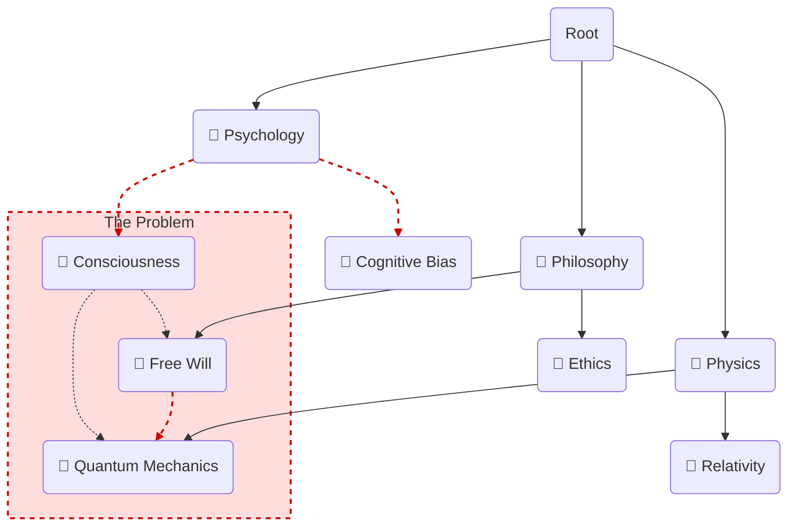

# Extraction Report: Application of Formal Pedagogical and Andragogical Theories to Architectural Design of Pkb

> [!info] Auto-Generated Report
> This report was automatically generated by `pkb_extractor.py` on 2026-03-13 04:18.
> **Source**: `cog-sci-report-application-of-formal-pedagogical-and-andragogical-theories-to-architectural-design-of-pkb-20251023220714.md` | **Items Extracted**: 135

---

## 📋 Document Overview

| Field | Value |
|-------|-------|
| **Source File** | `cog-sci-report-application-of-formal-pedagogical-and-andragogical-theories-to-architectural-design-of-pkb-20251023220714.md` |
| **Extraction Date** | 2026-03-13 04:18 |
| **Word Count** | 6,365 |
| **Character Count** | 42,647 |
| **Line Count** | 416 |
| **Total Items Extracted** | 135 |

### Document Outline

- # 1.0 📜 INTRODUCTION
- # 2.0 ✒️🏛️ HISTORICAL CONTEXT & FOUNDATIONAL THEORIES
  - ## FROM PEDAGOGY TO ANDRAGOGY: THE EVOLVING LEARNER
  - ## FROM INSTRUCTIVISM TO CONSTRUCTIVISM: THE EVOLVING MIND
  - ## FROM MEMEX TO ZETTELKASTEN: THE EVOLVING SYSTEM
- # **3.0 🔭🔬 DEEP EXPOSITION: A MULTI-FACETED ANALYSIS**
  - ## 3.1 ⚛️ FOUNDATIONAL PRINCIPLES: THE "WHY"
  - ## 4.0 ⚙️ MECHANISMS AND PROCESSES: THE "HOW"
    - ### 4.1 THE PEDAGOGICAL ARCHITECTURE: FAILURE OF THE HIERARCHY
    - ### 4.2 THE ANDRAGOGICAL/CONSTRUCTIVIST ARCHITECTURE: POWER OF THE NETWORK
    - ### 4.3 CORE MECHANISMS OF A CONSTRUCTIVIST PKM
      - #### MECHANISM 1: THE ATOMIC NOTE (THE ACT OF CONSTRUCTION)
      - #### MECHANISM 2: MAPS OF CONTENT (MOCS) (THE ACT OF SYNTHESIS)
  - ## 5.0 🔬 OBSERVATIONAL EVIDENCE AND MANIFESTATIONS: THE "WHAT"
    - ### MANIFESTATION 1: OPTIMIZED KNOWLEDGE SYNTHESIS
    - ### MANIFESTATION 2: ENHANCED KNOWLEDGE RETENTION
  - ## 6.0 🌍 BROADER IMPLICATIONS AND SIGNIFICANCE: THE "SO WHAT"
    - ### THE USER AS ARCHITECT, NOT LIBRARIAN
    - ### FROM "KNOWLEDGE MANAGEMENT" TO "KNOWLEDGE CREATION"
  - ## 7.0 ❔ FRONTIER RESEARCH & UNANSWERED QUESTIONS
  - ## 8.0 🦕 CONCLUSION
  - ## 9.0 🧠 KEY QUESTIONS FOR ACTIVE READING & REFLECTION
  - ## 10.0 📚 REFERENCES

---

## 📊 Extraction Summary

| Item Type | Count |
|-----------|-------|
| Callouts | 27 |
| Code Blocks | 0 |
| Color Spans | 0 |
| Definitions | 0 |
| Embeds | 0 |
| External Links | 1 |
| Footnotes | 8 |
| Headings | 23 |
| Inline Fields | 0 |
| Mermaid Diagrams | 1 |
| Tables | 0 |
| Tags | 0 |
| Wiki Links | 27 |
| **TOTAL** | **135** |

---

## 🔔 Callouts (27)

> [!note] What are Callouts?
> Callouts are `> [!TYPE]` blocks used in Obsidian for structured annotation.
> They carry semantic meaning — definitions, insights, warnings, etc.

### By Type

| Callout Type | Count |
|-------------|-------|
| `[!abstract]` | 1 |
| `[!analogy]` | 2 |
| `[!ask-yourself-this]` | 2 |
| `[!cite]` | 2 |
| `[!connection-ideas]` | 1 |
| `[!counter-argument]` | 1 |
| `[!definition]` | 3 |
| `[!evidence]` | 1 |
| `[!important]` | 1 |
| `[!key-claim]` | 2 |
| `[!pre-read-questions]` | 1 |
| `[!principle-point]` | 2 |
| `[!question]` | 2 |
| `[!quote]` | 4 |
| `[!summary]` | 1 |
| `[!the-purpose]` | 1 |

### Full Callout List

#### 1. [CITE] Untitled *(Line 25)*

> [!cite] Untitled
> **Bibliographic Information**
> - **Source Type**:: AI-Report/Article
> - **Title**:: Report_An-Investigation-into-the-Application-of-Formal-Pedagogical-and-Andragogical-Theories-to-the-Architectural-Design-of-Personal-Knowledge-Management-Systems_🆔20251023220714
> - **Author(s)**:: 🌩️♊URG011_v1.1_🆔20251022221217
> - **Year**:: 2025
> - **Publisher / Journal**:: ⁉️
> - **Volume / Issue**:: 001
> - **Page(s)**:: 001
> - **URL / DOI**:: <https://gemini.google.com/gem/4a40a40aa594/865a42b5cc771d3b>
> - **Date Accessed**:: 2025-10-25T16:31:22

#### 2. [PRE-READ-QUESTIONS] Untitled *(Line 39)*

> [!pre-read-questions] Untitled
> - What is the fundamental difference between **pedagogy** (teaching children) and **andragogy** (teaching adults), and why does this distinction matter for designing a PKM system?
>   - In what ways is a traditional, folder-based file system an *obstacle* to the learning theory of **Constructivism**?
>   - How does the act of creating an "atomic note" (Zettelkasten method) serve as a practical application of **Piaget's** theories of assimilation and accommodation?
>   - What is **Self-Directed Learning (SDL)**, and how can a PKM's *architecture* (e.g., networked links) either support or hinder a learner's autonomy?
>   - Beyond simple recall, how do "Maps of Content" (MOCs) and linking facilitate the higher-order cognitive process of **knowledge synthesis**?

#### 3. [ABSTRACT] Untitled *(Line 49)*

> [!abstract] Untitled
> This article provides an in-depth investigation into the intersection of formal learning theory and the architectural design of Personal Knowledge Management (PKM) systems. It posits that the majority of users unconsciously structure their digital knowledge systems using an outdated and inefficient **pedagogical** (teacher-directed) model, resulting in "digital graveyards" of disconnected information. This document argues for a deliberate architectural shift towards a framework grounded in **andragogy** (adult learning theory) and **constructivism**.
> 
> We will deconstruct the core principles of andragogy, as defined by Malcolm Knowles, to establish the *motivation* and *orientation* of the adult learner—a self-directed, problem-centered individual. We will then analyze the mechanisms of **constructivism** (both cognitive and social), positing that learning is an active process of *building*, not a passive one of *receiving*. The central thesis is that a PKM system's architecture is not a neutral container; it is an active learning environment. We will demonstrate how specific PKM architectures—namely the networked, graph-based model of "atomic" and "linked" notes—are a direct manifestation of constructivist principles. This design, in turn, is uniquely suited to support the adult learner's primary goals: robust **knowledge synthesis** and long-term **retention**.

#### 4. [QUOTE] Untitled *(Line 57)*

> [!quote] Untitled
> "The adult learner… is a person who is 'self-directed.' He sees himself as being responsible for his own learning. He doesn't wait to be told what to do. He takes the initiative in diagnosing his own learning needs, formulating his own learning goals, identifying resources for learning, choosing and implementing appropriate learning strategies, and evaluating his own learning outcomes."
> 
> — **Malcolm S. Knowles**, *Self-Directed Learning: A Guide for Learners and Teachers* (1975)

#### 5. [THE-PURPOSE] Untitled *(Line 62)*

> [!the-purpose] Untitled
> The purpose of this article is to build a formal, theoretical bridge between the fields of cognitive science, adult education, and information architecture. We are in the midst of a data explosion, yet "knowledge" remains as elusive as ever. Many of us, as professionals and lifelong learners, meticulously collect articles, notes, and highlights, only to entomb them in a digital filing cabinet—a nested hierarchy of folders that mirrors the physical filing cabinets of the 20th century. We build "digital graveyards" of information, and then wonder why they fail to produce insight.
> 
> The fundamental problem, I argue, is a **profound mismatch of models**. We are adult, **self-directed learners** (an *andragogical* model) attempting to build knowledge using a system designed for a child's passive reception of information (a *pedagogical* model). We are **constructivists**—learning by actively building and connecting ideas—stuck using a rigid, *instructivist* architecture that prizes categorization over connection.
> 
> This article will investigate how the formal theories of **andragogy** and **constructivism** can and *should* serve as the architectural blueprint for a modern Personal Knowledge Management (PKM) system. We will move beyond the "how-to" of specific apps and instead focus on the *why*. Why do networked links (like `[[wiki-links]]`) feel so revolutionary? Because they are a functional implementation of a 70-year-old learning theory. How can we design a system that doesn't just *store* knowledge, but actively *generates* synthesis and ensures retention? By aligning its architecture with the very way our adult minds are built to learn.

#### 6. [KEY-CLAIM] Untitled *(Line 93)*

> [!key-claim] Untitled
> The failure of most PKM systems is that they are architected **pedagogically** for a user who is, by nature, **andragogical**. An adult, self-directed, problem-centered learner is given a rigid, subject-centered, teacher-directed filing system. The system fights the user's core nature. A successful PKM *must* be andragogical, placing the self-directed learner in total control of a system designed for immediate, problem-centered application.

#### 7. [DEFINITION] Untitled *(Line 103)*

> [!definition] Untitled
> **Constructivism:** A learning theory positing that learners are not passive recipients of information. Instead, they *actively construct* their own knowledge and understanding. New information is integrated with existing mental frameworks (schemas) through a dynamic, personal, and creative process.

#### 8. [ASK-YOURSELF-THIS] Untitled *(Line 117)*

> [!ask-yourself-this] Untitled
> - **How did the historical development of this idea shape our current understanding?**
>       - Our understanding of PKM is a direct product of these parallel histories. We *use* hierarchical folders because that's how we were *taught* (pedagogy, instructivism) and how *physical files* worked. The new wave of "linked-thought" tools (Obsidian, Roam) is the *first* architectural shift that truly embraces the *learner* (andragogy) and the *mind* (constructivism).
>   - **Are there any abandoned theories that are as interesting as the current one?**
>       - Yes. The core idea of **Behaviorism**, while insufficient as a total theory of learning, is still relevant. Techniques like Spaced Repetition (SRS) are, in essence, a behaviorist mechanism (a stimulus-response loop) that can be *plugged into* a constructivist system to great effect. We shouldn't abandon it, but rather see it as one tool in a much larger cognitive toolkit.

#### 9. [PRINCIPLE-POINT] Untitled *(Line 143)*

> [!principle-point] Untitled
> **Core Principle 1: Andragogy (The Learner's Mandate)**
> 
> The PKM system must be architected to serve the principles of **Self-Directed Learning (SDL)**. SDL, a cornerstone of andragogy, is a process "in which individuals take the initiative… in diagnosing their learning needs, formulating learning goals, identifying human and material resources for learning, choosing and implementing appropriate learning strategies, and evaluating learning outcomes."[^1]
> 
> A PKM is not a "Personal *Storage* System." It is a "Personal *Knowledge* System," and knowledge, for an adult, is synonymous with SDL. Let's break down how a PKM's architecture *must* serve Knowles' assumptions:
> 
>   - **Self-Concept:** The user *must* be the architect. A system that imposes a rigid, unchangeable structure (a pedagogical "curriculum") is a violation of the adult's self-concept as a self-directing individual. The architecture must be fluid, emergent, and entirely owned by the user.
>   - **Experience:** The PKM's primary purpose is to be the *externalization* of the user's unique, accumulated experience and thought. It is the "reservoir." This means the system must be *optimized for contribution*, not just consumption. The friction to create a new note (a new "experience") must be as close to zero as possible.
>   - **Readiness & Orientation to Learning:** The adult learner is **problem-centered**. They do not learn "sociology" for its own sake; they learn it to solve a problem (e.g., "Why is my team communication breaking down?"). This has a *profound* architectural implication: **Topical, hierarchical folders are the enemy of problem-centered learning.** A problem like "team communication" draws on psychology, sociology, management theory, and personal experience. A rigid folder system (`\Psychology\`, `\Sociology\`) *prevents* the necessary synthesis. The architecture *must* allow for a single note (the "problem") to connect *across* all these domains.

#### 10. [QUOTE] Untitled *(Line 155)*

> [!quote] Untitled
> "The highest function of the teacher is to get the student to the point where he can learn on his own, and the highest function of a… learning resource is to be useful to a self-directing learner."
> 
> — *Paraphrased from Malcolm Knowles*

#### 11. [PRINCIPLE-POINT] Untitled *(Line 160)*

> [!principle-point] Untitled
> **Core Principle 2: Constructivism (The Mind's Mandate)**
> 
> If andragogy is the "why," constructivism is the "how." The PKM system must be an *active cognitive workbench* for the construction of knowledge, not a passive *warehouse* for the storage of facts. Learning is the *creation* of new, robust, and interconnected mental schemas. The PKM's architecture must be a physical-digital mirror of this internal, mental process.
> 
>   - **The Failure of "Copy-Paste":** The instructivist model (learning by transmission) is embodied by `Ctrl+C`, `Ctrl+V`. This action involves *zero* cognitive construction. The information passes *through* the user, but is not *processed* by them. A PKM architecture that encourages this is a "digital graveyard."
>   - **The Triumph of "Re-phrasing":** The constructivist model is embodied by the **Feynman Technique**—or, more practically, by the **Zettelkasten's principle of atomic notes in one's own words**. This process *forces* the learner to engage in Piaget's assimilation and accommodation. You *must* break down the new idea, compare it to your existing schemas (your other notes), and then *re-build* it in your own language to fit it into your network. The *effort* of this re-phrasing *is* the act of learning.
>   - **The Schema as a "Map":** A PKM's architecture *is* the user's externalized schema. In a folder system, that schema is a rigid, top-down tree. In a networked system, the schema is an *emergent, bottom-up web*. This web-like structure is a far more accurate representation of how the human brain actually stores and connects concepts.

#### 12. [DEFINITION] Untitled *(Line 170)*

> [!definition] Untitled
> **Schema (pl. Schemas or Schemata):** In cognitive psychology, a schema is a mental framework or concept that helps organize and interpret information. It is the "scaffolding" or "mental model" we use to understand the world. All new information is understood *relative* to our existing schemas.

#### 13. [ANALOGY] Untitled *(Line 194)*

> [!analogy] Untitled
> A hierarchical folder system is like a **library** where every book is chained to a specific, immovable shelf. You can only read about "French History" in the "France" aisle. You are forbidden from taking that book and placing it next to a book on "Renaissance Art" to compare them. It is a system built for *storage* and *retrieval by known address*, not for *synthesis* or *discovery*.

#### 14. [ANALOGY] Untitled *(Line 240)*

> [!analogy] Untitled
> A networked system is a **roundtable discussion**. Every "note" is a "person" (an expert on one topic). You can "tap" any note on the shoulder and ask, "Who else in this room do you know?" The note `[[Free Will]]` will point you to `[[Quantum Mechanics]]` and `[[Consciousness]]`. You are not a librarian; you are a *facilitator of a conversation* between your own ideas.

#### 15. [DEFINITION] Untitled *(Line 270)*

> [!definition] Untitled
> **Knowledge Synthesis:** A higher-order cognitive process that involves combining, integrating, and abstracting information from two or more sources to create a new, original, or more complex understanding. It is the *opposite* of rote memorization.

#### 16. [EVIDENCE] Untitled *(Line 280)*

> [!evidence] Untitled
> The primary evidence for this is the *visual graph* in tools like Obsidian. This graph is a literal, real-time visualization of your knowledge synthesis. "Clusters" in the graph represent *synthesized topics*. "Bridge notes" (nodes that connect two different clusters) represent *interdisciplinary synthesis*. The user can *see* their knowledge being woven together. Niklas Luhmann's 90,000-note Zettelkasten, which led to over 70 books, is the definitive, real-world proof that a networked system is a "synthesis machine."[^2]

#### 17. [KEY-CLAIM] Untitled *(Line 304)*

> [!key-claim] Untitled
> A constructivist, networked PKM does not *just* store your knowledge; it creates the ideal conditions for *long-term retention*. It transforms learning from a passive act of "reviewing" to an active one of *processing* (encoding) and *connecting* (retrieval). It bakes "desirable difficulty" into the system, ensuring that the knowledge you build is the knowledge you keep.

#### 18. [CONNECTION-IDEAS] Untitled *(Line 320)*

> [!connection-ideas] Untitled
> The principles discussed here strongly connect to the field of [[Generative AI]]. An LLM is, in essence, a massive, *impersonal* networked graph of statistical relationships. Your *personal* knowledge graph (your PKM) is a *curated, constructed, and opinionated* graph of *your* understanding. The future of knowledge work will be the *dialogue* between these two graphs—using the LLM (as Vygotsky's MKO) to help you build and navigate your own, personal "second brain."

#### 19. [COUNTER-ARGUMENT] Untitled *(Line 331)*

> [!counter-argument] Untitled
> An important counter-argument suggests that this constructivist, networked model is **too chaotic and high-friction**. "It's just easier to put the PDF in the `\Physics\` folder. I don't have time to make atomic notes."
> 
> This is important because it highlights the *true cost*. This critique is correct, but only in the *short term*.
> 
>   - The "folder" method is a *short-term optimization* for *storage*. It has a low "ingest" cost but a *catastrophically high* "retrieval and synthesis" cost.
>   - The "networked" method is a *long-term optimization* for *synthesis*. It has a slightly higher "ingest" cost (you must *process* the note), but a *near-zero* "retrieval and synthesis" cost, as that work has *already been done*.
> 
> It is the difference between "learning for the test" (cramming, then forgetting) and "learning for mastery" (building a deep, lasting schema). The andragogical model trusts the adult learner to make that long-term investment.

#### 20. [QUOTE] Untitled *(Line 342)*

> [!quote] Untitled
> "The landscape is not a fixed entity; it is a fluid set of relationships that you can manipulate and orchestrate through your movement… The camera is a box for capturing light, but the lens, guided by your feet, is the pen with which you write the story."
> 
> — *From user-provided exemplar*
> 
> This is a perfect metaphor. The hierarchical system is a "fixed entity." The networked system is a "fluid set of relationships." Your PKM is the "lens," and your *constructivist linking* is the "pen with which you write the story" of your own understanding.

#### 21. [QUESTION] Untitled *(Line 359)*

> [!question] Untitled
> - **What is the single biggest unanswered question in this field right now?**
>       - The biggest question is one of **cognitive scaffolding and automation**. How do we design a system that *automates* the *clerical* parts of PKM (filing, tagging, linking) while *protecting* and *enhancing* the *cognitive* parts (re-phrasing, synthesizing, accommodating)? If we automate *too much*, we remove the "desirable difficulty" that creates retention. If we automate *too little*, the friction becomes too high and we abandon the system. Finding this "automated ZPD" is the key.

#### 22. [SUMMARY] Untitled *(Line 368)*

> [!summary] Untitled
> We have traveled from the origins of teaching to the frontiers of AI-assisted cognition. We have established that the common "digital graveyard" of hierarchical folders is not a failing of the *user*, but a failing of the *architecture*. It is a pedagogical, instructivist system imposed on an andragogical, constructivist *mind*. It is a system built to *store* facts, not *build* wisdom.
> 
> The solution is a deliberate architectural shift. By embracing the principles of **andragogy**, we center the **self-directed, problem-oriented adult learner**. By building on the principles of **constructivism**, we provide that learner with a *cognitive workbench* (not a filing cabinet) that mirrors how the mind *actually learns*: by *actively building schemas*.
> 
> This new architecture—the **networked graph**—uses **atomic notes** as the mechanism for *construction* (Piagetian accommodation) and **Maps of Content (MOCs)** as the mechanism for *synthesis* (Vygotskian ZPD). This model is not just "different"; it is *fundamentally aligned* with the cognitive science of knowledge retention and synthesis. It transforms the user from a passive librarian into an active architect, and the PKM from a "digital graveyard" into a "knowledge creation engine."

#### 23. [ASK-YOURSELF-THIS] Untitled *(Line 380)*

> [!ask-yourself-this] Untitled
> - **How would I explain the central idea of this article to someone with no background in this field? (The Feynman Technique)**
>       - Your Answer Goes Here: "Most people use their computer's 'notes' app like a stack of shoeboxes. You label a box 'Recipes,' dump 100 recipes in, and then you have to dig through the whole box to find one. This is slow and messy, and you'll never invent a *new* recipe. A *better* way is to write each *ingredient* on its own index card. Then, you *link* the 'flour' card to the 'egg' card, the 'egg' card to the 'sugar' card, etc. Soon, you're not just *storing* recipes; you can *see* the *connections* that *make* a recipe. You can see 'flour' also connects to 'gravy' and 'bread.' You've created a *web* of ideas, not a *box* of junk. This web lets you *invent* new things, and the *act of writing the cards and linking them* makes you remember everything *way* better. This article argues we should build our digital 'second brains' like the web of index cards (active, connected) not the stack of shoeboxes (passive, siloed)."
>   - **What was the most surprising or counter-intuitive concept presented? Why?**
>       - Your Answer Goes Here: (e.g., "The idea that 'folders' are actually *bad* for organizing knowledge. It seems counter-intuitive because my whole life I've been *told* to use folders. But the argument that they *hide* connections and force you to make a decision ('where does this go?') *before* you even understand the idea makes perfect sense. The counter-argument that a *messy-looking* graph is *better* than a *tidy* folder list is the most surprising, and compelling, idea.")
>   - **What pre-existing knowledge did this article connect with or challenge for me?**
>       - Your Answer Goes Here: (e.g., "This article directly connected with my struggles using Evernote/Notion. I *have* a 'digital graveyard.' I dump things in, and I never see them again. I thought *I* was the problem—that I was just 'undisciplined.' This article reframes the problem: my *architecture* was fighting me. It challenged my belief that 'being organized' means 'having a neat folder structure.' It suggests true organization is about 'being connected.'")

#### 24. [QUOTE] Untitled *(Line 389)*

> [!quote] Untitled
> "Before we can wield our lenses with intent, we must first dismantle one of the most pervasive and misleading myths… Understanding the true relationship… is the single most important conceptual leap an aspiring landscape photographer can make."
> 
> — *From user-provided exemplar*

#### 25. [IMPORTANT] Untitled *(Line 394)*

> [!important] Untitled
> Identify three key terms or concepts from this article. Write your own definition for each and create a new note to link them back to this one.
> 
> 1.  `[[Andragogy vs. Pedagogy]]`
> 1.  `[[Constructivism|Constructivism (Learning Theory)]]`
> 1.  `[[Networked vs. Hierarchical PKM Architecture]]`

#### 26. [QUESTION] Untitled *(Line 402)*

> [!question] Untitled
> - **What is one question I still have after reading this? Where might I look for an answer?**
>       - Your Answer Goes Here: (e.g., "This article perfectly sells the *why* of a networked, constructivist PKM. But it only briefly mentions *how* to start. My question is: what is the *practical first step* for someone who has 10 years of 'digital graveyard' in a hierarchical system? How do you *migrate*? Do you start fresh (a 'digital Sabbath') or try to "convert" old notes? I would look for an answer by searching for "how to migrate from Evernote to Obsidian" or "strategies for starting a Zettelkasten from scratch.")

#### 27. [CITE] Untitled *(Line 411)*

> [!cite] Untitled
> - **Additional Sources Used in Research:**
>   - Bush, V. (1945). As We May Think. *The Atlantic Monthly*.
>   - Piaget, J. (1971). *Biology and Knowledge*. University of Chicago Press.
>   - Vygotsky, L. S. (1978). *Mind in Society: The Development of Higher Psychological Processes*. Harvard University Press.
>   - Ahrens, S. (2017). *How to Take Smart Notes: One Simple Technique to Boost Writing, Learning and Thinking*.
>   - Sio, U. N., & Ormerod, T. C. (2009). Does incubation enhance problem-solving? A meta-analytic review. *Psychological Bulletin*, *135*(1), 94-120. (Related to synthesis and serendipity).
>   - User-provided file. (2025, October 20). *AI-Note\_Exemplars-for-LLMs\_🆔20251020184551.md*.

---

## 🔗 Wiki-Links (27 total, 22 unique targets)

> [!info] Knowledge Graph Connections
> These links represent connections to other notes in your PKB.
> **22** distinct notes are referenced.

### Unique Targets

- [[Andragogy vs. Pedagogy]]
- [[Book Project Ideas]]
- [[Cognitive-Bias|Cognitive Bias]]
- [[Consciousness]]
- [[Constructivism|Constructivism (Learning Theory)]]
- [[Free Will]]
- [[Generative AI]]
- [[Management Theory]]
- [[Marketing]]
- [[My notes from 1-on-1 with Bob]]
- [[Networked vs. Hierarchical PKM Architecture]]
- [[Philosophy MOC]]
- [[Physics MOC]]
- [[Project A]]
- [[Psychological Safety]]
- [[Quantum Mechanics]]
- [[Team Comms MOC]]
- [[The Uncertainty Principle]]
- [[Vygotsky's ZPD]]
- [[that old idea]]
- [[wiki-link]]
- [[wiki-links]]

### All Occurrences

| # | Target | Display Text | Heading | Section | Line |
|---|--------|-------------|---------|---------|------|
| 1 | [[wiki-links]] | — | — | 1.0 📜 INTRODUCTION | 68 |
| 2 | [[wiki-link]] | — | — | FROM MEMEX TO ZETTELKASTEN: THE EVOLV... | 131 |
| 3 | [[wiki-link]] | — | — | 4.2 THE ANDRAGOGICAL/CONSTRUCTIVIST A... | 232 |
| 4 | [[Free Will]] | — | — | 4.2 THE ANDRAGOGICAL/CONSTRUCTIVIST A... | 235 |
| 5 | [[Quantum Mechanics]] | — | — | 4.2 THE ANDRAGOGICAL/CONSTRUCTIVIST A... | 235 |
| 6 | [[Physics MOC]] | — | — | 4.2 THE ANDRAGOGICAL/CONSTRUCTIVIST A... | 236 |
| 7 | [[Philosophy MOC]] | — | — | 4.2 THE ANDRAGOGICAL/CONSTRUCTIVIST A... | 236 |
| 8 | [[Book Project Ideas]] | — | — | 4.2 THE ANDRAGOGICAL/CONSTRUCTIVIST A... | 236 |
| 9 | [[Cognitive-Bias|Cognitive Bias]] | — | — | 4.2 THE ANDRAGOGICAL/CONSTRUCTIVIST A... | 237 |
| 10 | [[Marketing]] | — | — | 4.2 THE ANDRAGOGICAL/CONSTRUCTIVIST A... | 237 |
| 11 | [[Free Will]] | — | — | 4.2 THE ANDRAGOGICAL/CONSTRUCTIVIST A... | 242 |
| 12 | [[Quantum Mechanics]] | — | — | 4.2 THE ANDRAGOGICAL/CONSTRUCTIVIST A... | 242 |
| 13 | [[Consciousness]] | — | — | 4.2 THE ANDRAGOGICAL/CONSTRUCTIVIST A... | 242 |
| 14 | [[The Uncertainty Principle]] | — | — | MECHANISM 1: THE ATOMIC NOTE (THE ACT... | 253 |
| 15 | [[Team Comms MOC]] | — | — | MECHANISM 2: MAPS OF CONTENT (MOCS) (... | 259 |
| 16 | [[Psychological Safety]] | — | — | MECHANISM 2: MAPS OF CONTENT (MOCS) (... | 259 |
| 17 | [[Vygotsky's ZPD]] | — | — | MECHANISM 2: MAPS OF CONTENT (MOCS) (... | 259 |
| 18 | [[Management Theory]] | — | — | MECHANISM 2: MAPS OF CONTENT (MOCS) (... | 259 |
| 19 | [[My notes from 1-on-1 with Bob]] | — | — | MECHANISM 2: MAPS OF CONTENT (MOCS) (... | 259 |
| 20 | [[that old idea]] | — | — | MANIFESTATION 1: OPTIMIZED KNOWLEDGE ... | 276 |
| 21 | [[Free Will]] | — | — | MANIFESTATION 2: ENHANCED KNOWLEDGE R... | 300 |
| 22 | [[Quantum Mechanics]] | — | — | MANIFESTATION 2: ENHANCED KNOWLEDGE R... | 300 |
| 23 | [[Project A]] | — | — | MANIFESTATION 2: ENHANCED KNOWLEDGE R... | 301 |
| 24 | [[Generative AI]] | — | — | THE USER AS ARCHITECT, NOT LIBRARIAN | 322 |
| 25 | [[Andragogy vs. Pedagogy]] | — | — | 9.0 🧠 KEY QUESTIONS FOR ACTIVE READIN... | 398 |
| 26 | [[Constructivism|Constructivism (Learning Theory)]] | — | — | 9.0 🧠 KEY QUESTIONS FOR ACTIVE READIN... | 399 |
| 27 | [[Networked vs. Hierarchical PKM Architecture]] | — | — | 9.0 🧠 KEY QUESTIONS FOR ACTIVE READIN... | 400 |

---

## 🌐 External Links (1)

| # | Display Text | URL | Line |
|---|-------------|-----|------|
| 1 | https://gemini.google.com/gem/4a40a40aa594/865a... | https://gemini.google.com/gem/4a40a40aa594/865a42b5cc771d3b | 34 |

---

## 📐 Mermaid Diagrams (1)

### Diagram 1 — graph *(Line 198)*

---

## 📝 Footnotes (4 definitions, 4 references)

### Footnote Definitions

- **[^1]**: Knowles, M. S. (1975). *Self-Directed Learning: A Guide for Learners and Teachers*. Association Press. *(Line 421)*
- **[^2]**: Schmidt, J. (2018). Niklas Luhmann's Card Index: The Fabrication of Serendipity. *Sociologica*, *12*(1), 53-60. *(Line 425)*
- **[^3]**: Craik, F. I. M., & Lockhart, R. S. (1972). Levels of processing: A framework for memory research. *Journal of Verbal Learning and Verbal Behavior*, *11*(6), 671-684. *(Line 429)*
- **[^4]**: Roediger, H. L., & Karpicke, J. D. (2006). Test-Enhanced Learning: Taking Memory Tests Improves Long-Term Retention. *Psychological Science*, *17*(3), 249-255. *(Line 433)*

---

## 🕸️ Knowledge Graph Analysis

### Unique Wiki-Link Targets (22)

> These represent all distinct notes referenced in the source document.
> Each is a candidate for backlink creation in your PKB.

- [[Andragogy vs. Pedagogy]]
- [[Book Project Ideas]]
- [[Cognitive-Bias|Cognitive Bias]]
- [[Consciousness]]
- [[Constructivism|Constructivism (Learning Theory)]]
- [[Free Will]]
- [[Generative AI]]
- [[Management Theory]]
- [[Marketing]]
- [[My notes from 1-on-1 with Bob]]
- [[Networked vs. Hierarchical PKM Architecture]]
- [[Philosophy MOC]]
- [[Physics MOC]]
- [[Project A]]
- [[Psychological Safety]]
- [[Quantum Mechanics]]
- [[Team Comms MOC]]
- [[The Uncertainty Principle]]
- [[Vygotsky's ZPD]]
- [[that old idea]]
- [[wiki-link]]
- [[wiki-links]]

---

## 📁 Raw Data

> [!abstract] JSON File Available
> The full machine-readable extraction is saved alongside this report as:
> `cog-sci-report-application-of-formal-pedagogical-and-andragogical-theories-to-architectural-design-of-pkb-20251023220714_extracted.json`

---

*Report generated by `pkb_extractor.py v1.1.0` · 2026-03-13 04:18:22*