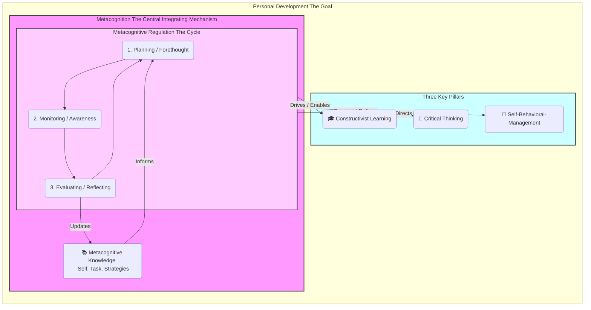

# Extraction Report: Metacognition as the Central Integrating Mechanism for Personal Development

> [!info] Auto-Generated Report
> This report was automatically generated by `pkb_extractor.py` on 2026-03-13 04:18.
> **Source**: `cog-sci-report-metacognition-as-the-central-integrating-mechanism-for-personal-development-20251028024116.md` | **Items Extracted**: 147

---

## 📋 Document Overview

| Field | Value |
|-------|-------|
| **Source File** | `cog-sci-report-metacognition-as-the-central-integrating-mechanism-for-personal-development-20251028024116.md` |
| **Extraction Date** | 2026-03-13 04:18 |
| **Word Count** | 6,771 |
| **Character Count** | 46,711 |
| **Line Count** | 502 |
| **Total Items Extracted** | 147 |

### Document Outline

- # 1.0 📜 INTRODUCTION
- # 2.0 🧭 HISTORICAL CONTEXT & FOUNDATIONAL THEORIES
- # **3.0 🔭🔬 DEEP EXPOSITION: A MULTI-FACETED ANALYSIS**
  - ## 3.1 ⚛️ FOUNDATIONAL PRINCIPLES
  - ## 4.0 ⚙️ MECHANISMS AND PROCESSES
    - ### 4.1 MECHANISM 1: METACOGNITION AS THE ENGINE OF CONSTRUCTIVIST LEARNING
    - ### 4.2 MECHANISM 2: METACOGNITION AS THE GOVERNOR OF CRITICAL THINKING
    - ### 4.3 MECHANISM 3: METACOGNITION AS THE CONTROL PANEL FOR SELF-BEHAVIORAL-MANAGEMENT
    - ### 4.4 THE INTEGRATED MODEL: THE "CEO OF THE SELF"
  - ## 5.0 🔬 OBSERVATIONAL EVIDENCE
  - ## 6.0 🌍 BROADER IMPLICATIONS
  - ## 7.0 ❔ FRONTIER RESEARCH
  - ## 8.0 🦕 CONCLUSION
  - ## 9.0 🧠 KEY QUESTIONS
  - ## 10.0 📚 REFERENCE/APPENDIX

---

## 📊 Extraction Summary

| Item Type | Count |
|-----------|-------|
| Callouts | 32 |
| Code Blocks | 0 |
| Color Spans | 0 |
| Definitions | 0 |
| Embeds | 0 |
| External Links | 0 |
| Footnotes | 33 |
| Headings | 15 |
| Inline Fields | 0 |
| Mermaid Diagrams | 1 |
| Tables | 0 |
| Tags | 0 |
| Wiki Links | 14 |
| **TOTAL** | **147** |

---

## 🔔 Callouts (32)

> [!note] What are Callouts?
> Callouts are `> [!TYPE]` blocks used in Obsidian for structured annotation.
> They carry semantic meaning — definitions, insights, warnings, etc.

### By Type

| Callout Type | Count |
|-------------|-------|
| `[!abstract]` | 1 |
| `[!analogy]` | 1 |
| `[!ask-yourself-this]` | 2 |
| `[!cite]` | 1 |
| `[!connection-ideas]` | 1 |
| `[!counter-argument]` | 1 |
| `[!definition]` | 1 |
| `[!evidence]` | 1 |
| `[!example]` | 1 |
| `[!key-claim]` | 2 |
| `[!links-to-related-notes]` | 1 |
| `[!pre-read-questions]` | 1 |
| `[!principle-point]` | 2 |
| `[!question]` | 1 |
| `[!quote]` | 6 |
| `[!summary]` | 1 |
| `[!the-purpose]` | 7 |
| `[!thoughts]` | 1 |

### Full Callout List

#### 1. [PRE-READ-QUESTIONS] Untitled *(Line 27)*

> [!pre-read-questions] Untitled
> - What is the fundamental difference between **cognition** (thinking) and **metacognition** (thinking about thinking)?
>   - In what specific ways might a lack of metacognition *prevent* personal development, even if someone is highly intelligent?
>   - How can the same metacognitive process (e.g., "monitoring") be applied differently to achieve **constructivist learning** versus **critical thinking**?
>   - Why is "planning" considered a metacognitive skill, and how does it relate to managing emotions or behaviors, not just tasks?
>   - As you read, try to identify one personal or professional goal where a more explicit metacognitive strategy could be applied.

#### 2. [ABSTRACT] Untitled *(Line 37)*

> [!abstract] Untitled
> This article provides a comprehensive analysis of **metacognition**—the capacity to think about one's own thinking—as the central, integrating mechanism for intentional **personal development**. The central thesis posits that personal development is not a passive process but an active one, requiring the deliberate integration of three foundational pillars: **constructivist learning**, **critical thinking**, and **self-behavioral-management**. This document argues that metacognition is the superordinate "operating system" that enables, governs, and unifies these three pillars.
> 
> We will deconstruct the two primary components of metacognition: 1) **Metacognitive Knowledge** (what one knows about their own cognitive processes) and 2) **Metacognitive Regulation** (the active processes of planning, monitoring, and evaluating one's cognition). We will then demonstrate, step-by-step, how these regulatory functions are the *operational force* that transforms the passive potential for learning, reasoning, and self-control into an active, intentional reality.
> 
> Using this framework, the article will show that constructivist learning relies on metacognitive monitoring to build understanding, critical thinking employs metacognitive evaluation to refine judgment, and self-behavioral-management uses metacognitive planning to direct action. By serving as the common, underlying mechanism for all three, metacognition emerges as the essential, learnable skill for anyone seeking to consciously and systematically improve their identity, capabilities, and quality of life.

#### 3. [THE-PURPOSE] Untitled *(Line 46)*

> [!the-purpose] Untitled
> The purpose of this article is to provide a deep, methodological explanation of *how* we change. We seek to move beyond the vague platitudes of "self-help" and establish a rigorous, evidence-based framework for intentional personal development. Our central claim is that this capacity for change is not governed by luck, innate talent, or mysterious inspiration, but by a specific, definable, and *trainable* set of skills: the skills of **metacognition**. We will explore how "thinking about thinking" is the central, integrating mechanism—the "CEO of the Self"—that marshals our capacity for learning, reasoning, and acting.

#### 4. [QUOTE] Untitled *(Line 49)*

> [!quote] Untitled
> "To know thyself is the beginning of wisdom."
> 
> — Socrates

#### 5. [THE-PURPOSE] Untitled *(Line 54)*

> [!the-purpose] Untitled
> This ancient aphorism, often repeated, is rarely deconstructed. "Knowing thyself" is not a passive state of being; it is an *active process* of self-inquiry. It is the act of turning one's attention inward, not with the aim of simple navel-gazing, but with the precise, analytical goal of understanding the *processes* that govern our own minds. This is the very definition of metacognition. This article will argue that this Socratic injunction is the truest and most practical advice ever given for personal development.

#### 6. [ASK-YOURSELF-THIS] Untitled *(Line 97)*

> [!ask-yourself-this] Untitled
> - **How did the historical development of this idea shape our current understanding?**
>       - Our understanding was shaped by a *rebellion* against behaviorism. The "cognitive revolution" gave us permission to study the mind, and Flavell's work gave us the *specific vocabulary* to study the mind's ability to *study itself*. This shifted the focus from external conditioning to *internal, self-directed* learning and regulation as the primary drivers of human development.
>   - **Are there any abandoned theories that are as interesting as the current one?**
>       - The purely behaviorist model is fascinating. It's not so much "wrong" as it is "radically incomplete." It *works* for training simple, reflexive behaviors (this is the basis of habit formation, like a slot machine's reward schedule). But it completely fails to explain complex, novel, and intentional human behaviors like writing a novel, debugging code, or navigating a complex social dilemma, all of which require the "black box" of metacognitive, internal planning and evaluation.

#### 7. [ANALOGY] Untitled *(Line 112)*

> [!analogy] Untitled
> To understand this, imagine your mind is a vast personal library.
> 
>   - **Cognition** is the act of *reading the books*. It's the "first-order" process of acquiring information.
>   - **Metacognition** is the *librarian*.
>       - The **Metacognitive Knowledge** is the *card catalog*—the librarian's knowledge of *what's in* the library, *where* it is, and *how* to best find it.
>       - The **Metacognitive Regulation** is the *active work* of the librarian—*planning* which books to retrieve, *monitoring* the research process, and *evaluating* whether the assembled information successfully answers the query.
> 
> A library with no librarian (pure cognition) is a chaotic, useless mess of information. A librarian with no books (pure metacognition) is an empty, theoretical system. Both are required, but it is the *librarian* (metacognition) that turns the raw *information* (cognition) into *usable wisdom*.

#### 8. [PRINCIPLE-POINT] Untitled *(Line 124)*

> [!principle-point] Untitled
> - **Core Principle 1: Metacognitive Knowledge (The "Card Catalog")**
>       - This is the *static* component of metacognition. It is your stored, explicit knowledge about yourself and the world *as it relates to cognitive tasks*. As Flavell outlined, it is the database you draw upon to make decisions about how to think. [^1]
> 
>       - **Person Knowledge (Knowing the Knower):** This is your self-concept as a thinker. It includes:
> 
>           - *Intra-individual:* "I am easily distracted after 3 PM." "I learn best by drawing diagrams, not by reading text." "I tend to get defensive when my political views are challenged."
>           - *Inter-individual:* "My boss is a 'big picture' thinker, so I should skip the small details." "He doesn't respond well to data; I need to use an emotional story."
> 
>       - **Task Knowledge (Knowing the Task):** This is your knowledge about the *nature* of the cognitive challenge you face.
> 
>           - *Example:* You know that "skimming this email for a date" is a low-demand task, while "deeply reading this academic paper to critique its methodology" is a high-demand task.
>           - *Significance:* This knowledge allows you to correctly allocate resources. A failure in task knowledge leads to *misapplied effort*—e.g., spending 3 hours on a trivial email or 3 minutes skimming a vital legal contract.
> 
>       - **Strategy Knowledge (Knowing the Tools):** This is your "toolbox" of cognitive and behavioral strategies.
> 
>           - *Example:* For memorization, you know strategies like "spaced repetition" or "mnemonics." For understanding, you know "the Feynman technique." For emotional regulation, you know "cognitive reframing" or "taking a 10-second pause."
>           - *Significance:* A person with poor strategy knowledge has only one tool—a "hammer" (like rote memorization)—and tries to use it for every task, even when they need a "scalpel" (like critical analysis).

#### 9. [QUOTE] Untitled *(Line 144)*

> [!quote] Untitled
> "He who knows others is wise; he who knows himself is enlightened."
> 
> — Laozi

#### 10. [THE-PURPOSE] Untitled *(Line 149)*

> [!the-purpose] Untitled
> Laozi's wisdom cuts to the heart of "person knowledge." Knowing others is mere *inter*-personal intelligence. Knowing oneself—understanding your own cognitive strengths, weaknesses, biases, and triggers—is the *intra*-personal "enlightenment" that Flavell identified as a key component of metacognitive knowledge.

#### 11. [PRINCIPLE-POINT] Untitled *(Line 154)*

> [!principle-point] Untitled
> - **Core Principle 2: Metacognitive Regulation (The "Librarian's Work")**
>       - This is the *active*, *procedural* component of metacognition. This is where the "thinking about thinking" happens in real-time. It is a continuous, cyclical process that allows you to *steer* your cognition. Researchers typically divide this cycle into three phases. [^2, ^4, ^10]
> 
>       - **1. Planning (Forethought & Goal-Setting):** This phase occurs *before* the cognitive task. It involves:
> 
>           - *Drawing on Knowledge:* The "librarian" consults the "card catalog" (Metacognitive Knowledge).
>           - *Setting Goals:* "What is my specific goal here? What does 'done' look like?"
>           - *Strategy Selection:* "Given my *knowledge* of this *task* and *myself*, what *strategy* is best?" (e.g., "This is a complex paper, and I'm tired. I will use the Pomodoro technique and aim to summarize just one section.").
>           - *Resource Allocation:* "How much time and energy will this require?"
> 
>       - **2. Monitoring (Self-Observation & Control):** This phase occurs *during* the cognitive task. It is the real-time "dashboard" of your mind.
> 
>           - *Awareness:* "Am I paying attention right now, or is my mind wandering?"
>           - *Comprehension Check:* "Do I *really* understand what I just read, or am I just 'word-skimming'?"
>           - *Progress Tracking:* "Am I making progress toward the goal I set in the planning phase?"
>           - *Control & Adjustment:* This is the crucial link. Monitoring is useless if you don't *act* on the information. "My mind is wandering. I will take a 1-minute break and refocus." "I don't understand this. I will go back and re-read the previous paragraph."
> 
>       - **3. Evaluating (Self-Reflection & Adaptation):** This phase occurs *after* the cognitive task.
> 
>           - *Outcome Assessment:* "Did I achieve the goal I set?"
>           - *Process Assessment:* "How well did my chosen strategy *work*? Did I get distracted? Why?"
>           - *Updating Knowledge:* This is where the loop closes. The results of this evaluation are fed *back into* your Metacognitive Knowledge. "That Pomodoro strategy worked really well for that task. I'll add that to my 'effective strategies' list." Or, "I really underestimated how long that would take. I need to update my *task knowledge* for next time."

#### 12. [DEFINITION] Untitled *(Line 179)*

> [!definition] Untitled
> - **Cognitive Strategy:**
>       - A "first-order" mental tool used to achieve a cognitive goal. **Example:** Reading a textbook.
>   - **Metacognitive Strategy:**
>       - A "second-order" mental tool used to *manage* the first-order strategy. **Example:** *Pausing after each page to ask yourself, "What was the main idea of this page?"* (This is a monitoring strategy).

#### 13. [EXAMPLE] Untitled *(Line 214)*

> [!example] Untitled
> - **Task:** A physics student who believes "heavy objects fall faster" reads the in-depth explanation of Galileo's experiments.
>   - **Non-Metacognitive Learner:** Reads the words. The concept doesn't "stick" because it conflicts with their intuitive schema. They get to the end of the chapter and still think, "Yeah, but a feather…". They "read" but did not "learn."
>   - **Metacognitive Learner:** Reads the concept. **(Monitor):** "Wait, this is saying the *mass doesn't matter*. That feels *wrong*." They *stop*, *identify* the conflict, and **(Regulate):** "Okay, let me re-read the part about air resistance. Oh, so in a vacuum… I see. My *original schema* was only true *with* air. The *underlying principle* is different." The student has *evaluated* and *re-built* their mental model. They have *learned*.

#### 14. [KEY-CLAIM] Untitled *(Line 243)*

> [!key-claim] Untitled
> - *Based on the evidence, a key claim is that:*
>       - **Critical thinking is not a *type* of thinking; it is a *quality* of thinking that is *produced* by metacognitive regulation.** Without the metacognitive ability to step back, observe, and correct one's own cognitive processes, a person is *incapable* of critical thought. They are simply… *thinking*.

#### 15. [EVIDENCE] Untitled *(Line 329)*

> [!evidence] Untitled
> *The* **primary evidence** *supporting this comes from:*
> 
>   - [[Educational Interventions]],
> 
>       - **This showed:** When students are taught *explicit* metacognitive strategies—such as "think-aloud protocols" (where they verbalize their thought process while solving a problem) or "exam wrappers" (worksheets where they *evaluate* *why* they got questions wrong *after* an exam)—their learning and grades improve *significantly* more than control groups, even when "raw intelligence" is accounted for. [^3] We are not teaching them *what* to learn, but *how* to learn.
> 
>   - [[Cognitive-Behavioral Therapy (CBT)]],
> 
>       - **This showed:** CBT is one of the most effective treatments for depression, anxiety, and PTSD. [^9] The *entire* basis of CBT is metacognitive. It trains patients to *monitor* their automatic negative thoughts (e.g., "I am worthless"), *evaluate* them for logical fallacies (a critical thinking skill), and *replace* them with more adaptive thoughts (a regulatory act). CBT is, in essence, applied metacognitive training for emotional management.
> 
>   - [[Deliberate Practice]],
> 
>       - **This showed:** The work of Anders Ericsson on "expert performance" (the "10,000-hour rule") revealed that it's not just "practice" that makes perfect; it's "**deliberate practice**." Deliberate practice is *intensely* metacognitive. It involves a "highly structured activity the explicit goal of which is to improve performance." [^11] This involves *planning* (setting a specific, narrow goal), *monitoring* (constant, real-time feedback on "am I doing it right?"), and *evaluating* (relentless post-practice reflection).

#### 16. [KEY-CLAIM] Untitled *(Line 344)*

> [!key-claim] Untitled
> - *Based on the evidence, a key claim is that:*
>       - **Metacognition is a *domain-general skill*.** The *same* core mechanism (Plan, Monitor, Evaluate) that helps a student pass a test is what helps a patient overcome anxiety and what helps a musician master an instrument. This proves its role as a *central, integrating* mechanism that underpins all forms of skill development.

#### 17. [QUOTE] Untitled *(Line 349)*

> [!quote] Untitled
> "We do not learn from experience… we learn from *reflecting* on experience."
> 
> — John Dewey

#### 18. [THE-PURPOSE] Untitled *(Line 354)*

> [!the-purpose] Untitled
> The philosopher of education, John Dewey, captured this perfectly. Experience (cognition) is just the raw data. Learning (personal development) is the *product* of *reflecting* on that data. That act of "reflection" *is* the metacognitive evaluation phase.

#### 19. [CONNECTION-IDEAS] Untitled *(Line 361)*

> [!connection-ideas] Untitled
> - *The principles discussed here* **strongly connect to the field of:**
> 
>       - [[Education Reform]]
>       - **The reason:**
>           - Our education system is overwhelmingly focused on *content* (cognition). We spend 12 years teaching students *what* to think (the capitals of states, the periodic table). We spend almost *zero* time teaching them *how* to think (metacognition). The single most impactful reform we could make is to embed metacognitive training—planning, monitoring for understanding, and evaluating study strategies—as a core, longitudinal curriculum from grade 1 through 12.
> 
>   - *The principles discussed here* **strongly connect to the field of:**
> 
>       - [[Mental Health & Therapy]]
>       - **The reason:**
>           - A new wave of therapy, "Metacognitive Therapy" (MCT), goes even *beyond* CBT. MCT (developed by Adrian Wells) argues that the problem is not the *content* of negative thoughts (e.g., "I am anxious"), but our *metacognitive beliefs about* those thoughts (e.g., "My anxiety is uncontrollable and dangerous"). [^12] It treats psychological disorders by changing how we *relate* to our thoughts—teaching us to *monitor* them as passing mental events, not as commands or truths. This is a *pure* application of our thesis.

#### 20. [COUNTER-ARGUMENT] Untitled *(Line 375)*

> [!counter-argument] Untitled
> - **An important counter-argument or alternative perspective suggests that:**
>       - This model is *too* "cognitive" and "top-down," ignoring the profound power of "bottom-up" processes like emotion, intuition, and unconscious processing. We can't just "think" our way out of deep-seated trauma or biological depression.
>   - **This is important because:**
>       - It reminds us that metacognition is not a *panacea*. It is a *mechanism* that operates *within* a larger, more complex biological and emotional system. Metacognition is the "CEO," but it still has to listen to the "board of directors" (e.g., your neurochemistry, your "gut feelings"). An effective CEO *integrates* this "bottom-up" data (monitoring their own intuition) into their "top-down" plan. Metacognition is *necessary*, but perhaps not *sufficient*, for all forms of personal development.

#### 21. [QUOTE] Untitled *(Line 382)*

> [!quote] Untitled
> "Between stimulus and response there is a space. In that space is our power to choose our response. In our response lies our growth and our freedom."
> 
> — Viktor Frankl

#### 22. [THE-PURPOSE] Untitled *(Line 387)*

> [!the-purpose] Untitled
> Viktor Frankl, a psychiatrist and Holocaust survivor, provides the ultimate philosophical implication. This "space" he describes *is* the metacognitive moment. It is the *monitoring* function that "catches" the stimulus and *halts* the automatic, behavioral response. The "power to choose" is the *evaluative* and *regulatory* function that selects a new, intentional response. Freedom, Frankl argues, *is* applied metacognition.

#### 23. [QUESTION] Untitled *(Line 396)*

> [!question] Untitled
> - *What is the* **single biggest unanswered question** *in this field right now?*
> 
>       - **Where, and how, does the brain *do* metacognition?** We are getting closer. Research in **[[Metacognitive Neuroscience]]** consistently points to the **[[Prefrontal Cortex (PFC)]]**, especially the *anterior* and *dorsolateral* regions, as the "seat" of this executive function. [^13] When you are "monitoring" your thoughts, this is the area of your brain that is "lighting up." The frontier question is *how*? How do these neurons *model* the operations of *other* neural circuits? How does this "self-monitoring" circuit physically work?
> 
>   - **Other Frontier Questions:**
> 
>       - **Can we build "metacognitive AI"?** Current AI (like me, Gemini) is purely cognitive. I can process information, but I have no *self-awareness* of *how* I'm processing it. I cannot "monitor" my own "understanding" in real-time or "feel" when I'm uncertain (I can only predict a *probability* of uncertainty). Building an AI that can *genuinely* "think about its own thinking" is a major, and perhaps dangerous, goal in AGI research.
>       - **Metacognition in Non-Humans:** We know that some primates, dolphins, and corvids (crows) exhibit signs of metacognition—for example, they can "opt-out" of a test they "know" they will fail. [^14] How did this evolve? What does this tell us about the nature of consciousness itself?

#### 24. [QUOTE] Untitled *(Line 407)*

> [!quote] Untitled
> "The brain is a complex adaptive system, meaning it is a system that can change its own structure and function based on experience… Metacognition is, in this sense, the brain's highest-level adaptive strategy: the strategy of *managing its own adaptation*."
> 
> — Unknown Cognitive Scientist

#### 25. [THE-PURPOSE] Untitled *(Line 412)*

> [!the-purpose] Untitled
> This framing connects metacognition directly to neuroplasticity. If neuroplasticity is the brain's ability to *change* (to learn), then metacognition is the *intentional direction* of that change. This is the biological implementation of personal development.

#### 26. [SUMMARY] Untitled *(Line 417)*

> [!summary] Untitled
> In this article, we have journeyed from the Socratic injunction "Know thyself" to the modern neuroscience of the prefrontal cortex. We have deconstructed **metacognition** into its two core components: the "card catalog" of **Metacognitive Knowledge** (of self, task, and strategy) and the "librarian's work" of **Metacognitive Regulation** (the active cycle of **planning**, **monitoring**, and **evaluating**).
> 
> Our central thesis, now substantiated, is that this regulatory cycle is the **central integrating mechanism** for all intentional personal development. It is the single, domain-general skill that operationalizes the three pillars of self-improvement:
> 
> 1.  It is the **engine** of **[[Constructivist Learning]]**, allowing us to *monitor* our understanding and *evaluate* our mental models to actively build new knowledge.
> 1.  It is the **governor** of **[[Critical-Thinking|Critical Thinking]]**, allowing us to *monitor* our own biases and *evaluate* the logic of our reasoning to make better judgments.
> 1.  It is the **control panel** for **[[Self-Behavioral-Management]]**, allowing us to *monitor* our internal impulses and *plan* strategic responses to align our actions with our goals.
> 
> The evidence from education, therapy, and high-performance shows that this skill is not an innate gift but a *trainable* one. The implications are profound. They suggest that the key to a better life lies not in changing our stars, but in changing the way we *think*—and more specifically, in becoming *conscious, systematic managers of our own thinking*. Metacognition is the mechanism for turning "the unexamined life" into "the intentional life." It is the practical, step-by-step process of becoming the "CEO of your Self."

#### 27. [ASK-YOURSELF-THIS] Untitled *(Line 430)*

> [!ask-yourself-this] Untitled
> - **How would I explain the central idea of this article to someone with no background in this field? (The Feynman Technique)**
>       - Imagine your mind is a workshop. You have lots of tools: a "learning" hammer, a "logic" saw, and a "behavior" drill (this is your *cognition*). You can use them, but you're messy and often grab the wrong one, like trying to hammer in a screw. **Metacognition** is you, the "Master Carpenter," stepping back and *thinking about* the *process*. The Carpenter *plans* the project first ("What am I trying to build?"). She *monitors* her work as she goes ("Am I using this saw safely? Is this cut straight?"). And she *evaluates* the final product ("This joint is weak. *Next time*, I'll use a different technique."). This article argues that "personal development" is just *becoming* that Master Carpenter. The *same* process of **Plan, Monitor, and Evaluate** is how you get better at *all* your skills, whether it's learning, thinking, or acting.
>   - **What was the most surprising or counter-intuitive concept presented? Why?**
>       - The most counter-intuitive idea might be that "willpower" is a *cognitive skill* (self-behavioral-management) rather than a *moral virtue*. We're taught that procrastinators are "lazy." This article reframes it: they are *metacognitively unskilled*. They fail to *plan* for triggers, *monitor* their impulse to procrastinate, or *deploy* strategies to regulate that impulse. This reframes "failure" from a moral flaw to a *skill deficit*, which is far more empowering because skills can be learned.
>   - **What pre-existing knowledge did this article connect with or challenge?**
>       - This article directly connects to [[Mindfulness]]. Mindfulness meditation is, in essence, *pure training for the "monitoring" component* of metacognition. It is the non-judgmental practice of "watching your thoughts." This article provides the *framework* for what to *do* after you've watched them (i.e., *evaluate* and *plan*). It bridges the gap between passive Eastern "observation" and active Western "goal-orientation."

#### 28. [QUOTE] Untitled *(Line 439)*

> [!quote] Untitled
> "Until you make the unconscious conscious, it will direct your life and you will call it fate."
> 
> — C.G. Jung

#### 29. [THE-PURPOSE] Untitled *(Line 444)*

> [!the-purpose] Untitled
> Jung's famous quote is a perfect, if slightly mystical, description of metacognition. The "unconscious" is our unexamined, "first-order" cognitive habits, biases, and impulses. "Making it conscious" is the act of metacognitive *monitoring*. If we *fail* to do this, our automatic programming directs our lives. If we *succeed*, we move from "fate" to "choice."

#### 30. [LINKS-TO-RELATED-NOTES] Untitled *(Line 447)*

> [!links-to-related-notes] Untitled
> - Identify **three key terms** or **concepts** from this article.
>   - *Write your* **own definition** *for each and create a new note to link them back to this one*.
> 
> <!-- end list -->
> 1.  [[Metacognitive-Regulation|Metacognitive Regulation]]
>       - **Definition:** The active, "in-the-moment" executive process of steering one's own mind. It is a continuous, three-part cycle: **Planning** (selecting goals and strategies before a task), **Monitoring** (real-time awareness of one's performance and comprehension *during* a task), and **Evaluating** (reflecting on the process and outcome *after* a task to update future behavior).
> 2.  [[Constructivist Learning]]
>       - **Definition:** A theory of learning stating that individuals do not passively absorb knowledge but actively *build* (or "construct") it. This process involves integrating new information and experiences into pre-existing mental models ("schemas") and, most importantly, *rebuilding* those models when new information conflicts with them.
> 3.  [[Metacognitive-Knowledge|Metacognitive Knowledge]]
>       - **Definition:** The "database" of what an individual *knows* about their own cognitive system. It is composed of three categories: **Person Knowledge** (one's own strengths, weaknesses, and biases), **Task Knowledge** (the demands and nature of different mental tasks), and **Strategy Knowledge** (a "toolbox" of cognitive strategies and when to use them).

#### 31. [THOUGHTS] Untitled *(Line 460)*

> [!thoughts] Untitled
> - *What is your* **analysis** *of this information?*
>       - My analysis is that "metacognition" is arguably the single most important meta-skill for human flourishing in the 21st century. In a world of infinite information (testing our learning), constant manipulation (testing our critical thinking), and endless distraction (testing our self-management), the individual who can *govern their own mind* has an almost insurmountable advantage. The research strongly suggests that this is not an abstract philosophical pursuit but a concrete, practical, and *trainable* discipline. The failure of our institutions—particularly education—to systematically teach these skills is the single greatest missed opportunity for elevating our collective human potential.

#### 32. [CITE] Untitled *(Line 467)*

> [!cite] Untitled

---

## 🔗 Wiki-Links (14 total, 13 unique targets)

> [!info] Knowledge Graph Connections
> These links represent connections to other notes in your PKB.
> **13** distinct notes are referenced.

### Unique Targets

- [[Cognitive-Behavioral Therapy (CBT)]]
- [[Constructivist Learning]]
- [[Critical-Thinking|Critical Thinking]]
- [[Deliberate Practice]]
- [[Education Reform]]
- [[Educational Interventions]]
- [[Mental Health & Therapy]]
- [[Metacognitive-Knowledge|Metacognitive Knowledge]]
- [[Metacognitive Neuroscience]]
- [[Metacognitive-Regulation|Metacognitive Regulation]]
- [[Mindfulness]]
- [[Prefrontal Cortex (PFC)]]
- [[Self-Behavioral-Management]]

### All Occurrences

| # | Target | Display Text | Heading | Section | Line |
|---|--------|-------------|---------|---------|------|
| 1 | [[Educational Interventions]] | — | — | 5.0 🔬 OBSERVATIONAL EVIDENCE | 332 |
| 2 | [[Cognitive-Behavioral Therapy (CBT)]] | — | — | 5.0 🔬 OBSERVATIONAL EVIDENCE | 336 |
| 3 | [[Deliberate Practice]] | — | — | 5.0 🔬 OBSERVATIONAL EVIDENCE | 340 |
| 4 | [[Education Reform]] | — | — | 6.0 🌍 BROADER IMPLICATIONS | 365 |
| 5 | [[Mental Health & Therapy]] | — | — | 6.0 🌍 BROADER IMPLICATIONS | 371 |
| 6 | [[Metacognitive Neuroscience]] | — | — | 7.0 ❔ FRONTIER RESEARCH | 400 |
| 7 | [[Prefrontal Cortex (PFC)]] | — | — | 7.0 ❔ FRONTIER RESEARCH | 400 |
| 8 | [[Constructivist Learning]] | — | — | 8.0 🦕 CONCLUSION | 422 |
| 9 | [[Critical-Thinking|Critical Thinking]] | — | — | 8.0 🦕 CONCLUSION | 423 |
| 10 | [[Self-Behavioral-Management]] | — | — | 8.0 🦕 CONCLUSION | 424 |
| 11 | [[Mindfulness]] | — | — | 9.0 🧠 KEY QUESTIONS | 437 |
| 12 | [[Metacognitive-Regulation|Metacognitive Regulation]] | — | — | 9.0 🧠 KEY QUESTIONS | 453 |
| 13 | [[Constructivist Learning]] | — | — | 9.0 🧠 KEY QUESTIONS | 455 |
| 14 | [[Metacognitive-Knowledge|Metacognitive Knowledge]] | — | — | 9.0 🧠 KEY QUESTIONS | 457 |

---

## 📐 Mermaid Diagrams (1)

### Diagram 1 — graph *(Line 283)*

---

## 📝 Footnotes (14 definitions, 19 references)

### Footnote Definitions

- **[^1]**: Flavell, J. H. (1979). Metacognition and cognitive monitoring: A new area of cognitive–developmental inquiry. *American Psychologist, 34*(10), 906–911. *(Line 469)*
- **[^2]**: Brown, A. L. (1987). Metacognition, executive control, self-regulation, and other more mysterious mechanisms. In F. E. Weinert & R. H. Kluwe (Eds.), *Metacognition, motivation, and understanding* (pp. 65–116). Lawrence Erlbaum Associates. *(Line 473)*
- **[^3]**: Dunlosky, J., & Metcalfe, J. (2009). *Metacognition*. Sage Publications. (This book is a comprehensive review of the field, summarizing decades of research on the link between metacognitive interventions and learning outcomes.) *(Line 477)*
- **[^4]**: Vygotsky, L. S. (1978). *Mind in society: The development of higher psychological processes*. Harvard University Press. (Vygotsky's work, especially on the "Zone of Proximal Development," implies a metacognitive guide—a teacher or self—that provides the necessary scaffolding.) *(Line 481)*
- **[^5]**: Ennis, R. H. (1985). A logical basis for measuring critical thinking skills. *Educational Leadership, 43*(2), 44-48. *(Line 485)*
- **[^6]**: Paul, R., & Elder, L. (2006). *Critical thinking: The nature of critical and creative thought*. Journal of Developmental Education, 30(2), 34-35. *(Line 489)*
- **[^7]**: Kahneman, D. (2011). *Thinking, fast and slow*. Farrar, Straus and Giroux. (Kahneman's "System 1" is the fast, automatic, biased cognition, and "System 2" is the slow, effortful, analytical cognition. Metacognition is the process of "System 2" *monitoring* and *correcting* "System 1.") *(Line 493)*
- **[^8]**: Bandura, A. (1991). Social cognitive theory of self-regulation. *Organizational Behavior and Human Decision Processes, 50*(2), 248-287. *(Line 497)*
- **[^9]**: Beck, J. S. (2011). *Cognitive behavior therapy: Basics and beyond* (2nd ed.). Guilford Press. (The foundational text for CBT, which is predicated on metacognitive awareness of one's thoughts.) *(Line 501)*
- **[^10]**: Schraw, G., & Dennison, R. S. (1994). Assessing metacognitive awareness. *Contemporary Educational Psychology, 19*(4), 460-475. *(Line 505)*
- **[^11]**: Ericsson, K. A., Krampe, R. T., & Tesch-Römer, C. (1993). The role of deliberate practice in the acquisition of expert performance. *Psychological Review, 100*(3), 363–406. *(Line 509)*
- **[^12]**: Wells, A. (2009). *Metacognitive therapy for anxiety and depression*. Guilford Press. *(Line 513)*
- **[^13]**: Fleming, S. M., & Dolan, R. J. (2012). The neural basis of metacognitive ability. *Philosophical Transactions of the Royal Society B: Biological Sciences, 367*(1594), 1338–1349. *(Line 517)*
- **[^14]**: Kornell, N. (2009). Metacognition in animals. In J. Dunlosky & J. Metcalfe (Eds.), *Metacognition* (pp. 289-305). Sage Publications. *(Line 521)*

---

## 🕸️ Knowledge Graph Analysis

### Unique Wiki-Link Targets (13)

> These represent all distinct notes referenced in the source document.
> Each is a candidate for backlink creation in your PKB.

- [[Cognitive-Behavioral Therapy (CBT)]]
- [[Constructivist Learning]]
- [[Critical-Thinking|Critical Thinking]]
- [[Deliberate Practice]]
- [[Education Reform]]
- [[Educational Interventions]]
- [[Mental Health & Therapy]]
- [[Metacognitive-Knowledge|Metacognitive Knowledge]]
- [[Metacognitive Neuroscience]]
- [[Metacognitive-Regulation|Metacognitive Regulation]]
- [[Mindfulness]]
- [[Prefrontal Cortex (PFC)]]
- [[Self-Behavioral-Management]]

---

## 📁 Raw Data

> [!abstract] JSON File Available
> The full machine-readable extraction is saved alongside this report as:
> `cog-sci-report-metacognition-as-the-central-integrating-mechanism-for-personal-development-20251028024116_extracted.json`

---

*Report generated by `pkb_extractor.py v1.1.0` · 2026-03-13 04:18:22*