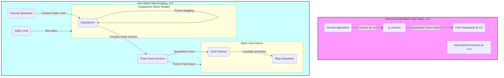

# Extraction Report: cosmo-report-black-hole-metrics-and-spacetime-geometry-20251120094904

> [!info] Auto-Generated Report
> This report was automatically generated by `pkb_extractor.py` on 2026-03-13 04:19.
> **Source**: `cosmo-report-black-hole-metrics-and-spacetime-geometry-20251120094904.md` | **Items Extracted**: 103

---

## 📋 Document Overview

| Field | Value |
|-------|-------|
| **Source File** | `cosmo-report-black-hole-metrics-and-spacetime-geometry-20251120094904.md` |
| **Extraction Date** | 2026-03-13 04:19 |
| **Word Count** | 5,786 |
| **Character Count** | 37,117 |
| **Line Count** | 414 |
| **Total Items Extracted** | 103 |

### Document Outline

- # 1.0 📜Introduction
- # 2.0 ✒️🏛️Historical Context & Foundational Theories
- # **3.0 🔭🔬Deep Exposition: A Multi-Faceted Analysis**
  - ## 3.1 ⚛️Foundational Principles: The "Why"
  - ## 4.0 ⚙️Mechanisms And Processes: The "How"
    - ### 4.1 ⚙️ The Schwarzschild Metric: The "Static" Case (J=0)
      - #### 4.1.1 The Event Horizon: The Causal Boundary
      - #### 4.1.2 The Central Singularity: The End of Spacetime
    - ### 4.2 ⚙️ The Kerr Metric: The "Realistic" Case (J\>0)
      - #### 4.2.1 The Ergosphere: The Spacetime Vortex
      - #### 4.2.2 The Dual Horizons and Ring Singularity
  - ## 5.0 🔬Observational Evidence and Manifestations: The "What"
  - ## 6.0 🌍Broader Implications and Significance: The "So What"
  - ## 7.0 ❔Frontier Research & Unanswered Questions
  - ## 8.0 🦕Conclusion
  - ## 9.0🧠Key Questions for Active Reading & Reflection
  - ## 10.0 📚 References

---

## 📊 Extraction Summary

| Item Type | Count |
|-----------|-------|
| Callouts | 29 |
| Code Blocks | 0 |
| Color Spans | 0 |
| Definitions | 0 |
| Embeds | 0 |
| External Links | 0 |
| Footnotes | 30 |
| Headings | 17 |
| Inline Fields | 0 |
| Mermaid Diagrams | 1 |
| Tables | 0 |
| Tags | 0 |
| Wiki Links | 5 |
| **TOTAL** | **103** |

---

## 🔔 Callouts (29)

> [!note] What are Callouts?
> Callouts are `> [!TYPE]` blocks used in Obsidian for structured annotation.
> They carry semantic meaning — definitions, insights, warnings, etc.

### By Type

| Callout Type | Count |
|-------------|-------|
| `[!abstract]` | 1 |
| `[!analogy]` | 2 |
| `[!ask-yourself-this]` | 2 |
| `[!cite]` | 1 |
| `[!connection-ideas]` | 1 |
| `[!counter-argument]` | 1 |
| `[!definition]` | 2 |
| `[!evidence]` | 3 |
| `[!important]` | 1 |
| `[!key-claim]` | 2 |
| `[!pre-read-questions]` | 1 |
| `[!principle-point]` | 3 |
| `[!question]` | 2 |
| `[!quote]` | 5 |
| `[!summary]` | 1 |
| `[!the-purpose]` | 1 |

### Full Callout List

#### 1. [PRE-READ-QUESTIONS] Untitled *(Line 26)*

> [!pre-read-questions] Untitled
> - What is a spacetime "metric," and how is it different from a simple description of gravity?
>   - What is the fundamental, physical difference between the Event Horizon (a "boundary") and the Singularity (an "end point")?
>   - Why is the "static" Schwarzschild metric insufficient for describing real-world black holes, and what key features does the "rotating" Kerr metric introduce?
>   - What is the "ergosphere," and how does it represent a concept even more bizarre than the event horizon itself?
>   - How have modern astronomers managed to gather *observational evidence* for these purely mathematical concepts?

#### 2. [ABSTRACT] Untitled *(Line 36)*

> [!abstract] Untitled
> This article provides a deep, methodological analysis of the spacetime geometries that define black holes. We move beyond the popular-science metaphor of a "cosmic vacuum cleaner" to explore the rigorous mathematical frameworks—the "metrics"—that arise as exact solutions to Einstein's equations of General Relativity. The central thesis is that a black hole is not an "object" in the traditional sense, but a *specific and extreme curvature of spacetime itself*.
> 
> We will deconstruct the two primary metrics: first, the foundational (but incomplete) **Schwarzschild metric**, which describes a static, non-rotating black hole. This will allow us to precisely define the **Event Horizon** as a causal boundary of no return and the **Central Singularity** as a point of infinite curvature where our current laws of physics break down.
> 
> Second, we will conduct a deep exploration of the **Kerr metric**, the solution for a *rotating* black hole, which represents the physical reality of these cosmic bodies. We will detail its far more complex structure, including the presence of dual horizons, the "frame-dragging" effect, the profound implications of the **ergosphere**, and the nature of its bizarre "ring singularity." This analysis will demonstrate how these mathematical solutions are not mere curiosities but are now being observationally confirmed by modern astronomy, solidifying their status as the most extreme laboratories for testing the limits of physical law.

#### 3. [QUOTE] Untitled *(Line 46)*

> [!quote] Untitled
> "Spacetime tells matter how to move; matter tells spacetime how to curve."
> 
> — John Archibald Wheeler [^1]

#### 4. [THE-PURPOSE] Untitled *(Line 51)*

> [!the-purpose] Untitled
> The purpose of this article is to provide a deep, multi-faceted explanation of black holes, not as mere curiosities, but as profound solutions to the laws of physics. We are here to journey *inside* the mathematics, to understand the "metric" that defines them. A black hole is the ultimate prediction of Einstein's General Relativity—a theory of gravity so potent that it can warp the very fabric of space and time to the breaking point.
> 
> We stand at an incredible moment in science. For nearly a century, black holes were "theoretical curiosities," mathematical oddities born from Einstein's 1915 equations. They were considered too bizarre to exist. Yet, in our lifetimes, we have *seen* them. We have photographed the "shadow" of an event horizon [^2] and "heard" the gravitational wave "chirp" of two of them merging .[^3] These celestial bodies are real, and they are the gatekeepers to the most profound questions in all of physics.
> 
> To understand them, we must move past the simple metaphor of a "hole" and embrace the language of geometry. The key is the **spacetime metric**. This article will deconstruct this concept, using it as our guide to explore the foundational "static" black hole (Schwarzschild) and the far more complex and "realistic" rotating black hole (Kerr). We will explore *why* the event horizon is an inescapable boundary, *what* the singularity truly represents, and *how* the rotation of a Kerr black hole twists spacetime itself into a vortex, creating a region—the ergosphere—where one is *forced* to move. This is not a journey to a "place," but a journey into the geometry of spacetime at its most extreme.

#### 5. [ASK-YOURSELF-THIS] Untitled *(Line 77)*

> [!ask-yourself-this] Untitled
> - **How did the historical development of this idea shape our current understanding?**
>       - The development was a slow, reluctant acceptance of what the math predicted. It started with GR (the "law"), moved to a simplified "impossible" solution (Schwarzschild), was then shown to be a *physical* possibility (Oppenheimer & Snyder), and finally evolved into a "realistic" solution (Kerr) that matched the universe we observe. Our understanding was shaped by a constant tension between mathematical truth and physical intuition.
>   - **Are there any abandoned theories that are as interesting as the current one?**
>       - The idea of "frozen stars" was a prominent early theory. It was based on the mathematics of the Schwarzschild metric from an outside observer's perspective. From our viewpoint, as an object approaches the event horizon, its time *slows down* (time dilation). It would appear to slow, dim (redshift), and *never* actually cross the horizon, "freezing" on its surface for eternity. This theory is "abandoned" not because it's *wrong*—it's what an external observer *sees*—but because it's an incomplete picture. From the perspective of the object *falling in*, it crosses the horizon in a finite, and very short, amount of time.

#### 6. [PRINCIPLE-POINT] Untitled *(Line 92)*

> [!principle-point] Untitled
> **Core Principle 1: Gravity is Geometry**
> 
> The most fundamental shift from Newtonian physics to Einstein's General Relativity is this: **Gravity is not a force, it is the curvature of spacetime.** A massive object doesn't "pull" on another object with an invisible rope. Instead, the massive object *warps* the 4D fabric of spacetime around it, and other objects simply follow the straightest possible path (a "geodesic") through that *curved* geometry.
> 
> The classic analogy is a bowling ball (a star) placed on a trampoline (spacetime). The bowling ball creates a deep "dimple." If you then roll a marble (a planet), it doesn't *want* to go toward the bowling ball; it *wants* to go straight. But "straight" on the curved surface of the trampoline is a path that *curves around* the dimple—an orbit. A black hole is this analogy taken to its extreme: a mass so concentrated, it creates a "dimple" that is *infinitely deep*, a puncture in the fabric.

#### 7. [PRINCIPLE-POINT] Untitled *(Line 100)*

> [!principle-point] Untitled
> **Core Principle 2: The "Metric" is the Rulebook**
> 
> If spacetime is a "fabric," the **spacetime metric** (or "metric tensor," `gμν`) is the mathematical "rulebook" that describes its exact shape. It is the *solution* to Einstein's field equations for a specific arrangement of mass and energy.
> 
> Think of it as the ultimate "distance formula." On a flat piece of paper, you use the Pythagorean theorem: $ds^2 = dx^2 + dy^2$. This is the "flat" metric. On the 2D surface of a sphere (like Earth), that formula is wrong. The "straight" path between two cities is a "great circle," and the distance formula is more complex. The metric is the equation that tells you the true "distance" ($ds^2$, the spacetime interval) between two points in a curved geometry.
> 
> The Schwarzschild metric and Kerr metric are simply the "rulebooks" for the geometry *outside* a static or rotating black hole, respectively. They are the "Pythagorean theorem" for the most warped spacetimes in the universe.

#### 8. [QUOTE] Untitled *(Line 110)*

> [!quote] Untitled
> "Black holes have no hair."
> 
> — John Archibald Wheeler

#### 9. [PRINCIPLE-POINT] Untitled *(Line 115)*

> [!principle-point] Untitled
> **Core Principle 3: The "No-Hair" Theorem**
> 
> This principle brings profound simplicity to an otherwise chaotic field. Coined by John Wheeler, the **No-Hair Theorem** (a conjecture, but one that is widely accepted) states that when a star collapses to form a black hole, all of its complex properties—its chemical composition, its magnetic fields, the mountains and valleys on its surface—are radiated away or swallowed. The final, stable black hole is "bald" (has "no hair"), and can be *perfectly* described by just **three** properties:
> 
> 1.  **Mass (M):** How much "stuff" it's made of.
> 1.  **Angular Momentum (J):** How fast it's spinning.
> 1.  **Electric Charge (Q):** Its net charge.
> 
> In reality, cosmic black holes are expected to have negligible charge (Q=0), as they would quickly neutralize themselves by attracting oppositely charged particles. Therefore, for all practical purposes, an astrophysical black hole is defined *only* by its **Mass** and its **Spin**. The Schwarzschild metric is the M-only solution. The Kerr metric is the M-and-J solution. This is why these two metrics are the *only* ones we need to study.

#### 10. [DEFINITION] Untitled *(Line 127)*

> [!definition] Untitled
> **Metric Tensor ($g_{\mu\nu}$):** A 4x4 matrix of functions that defines the geometry of spacetime. It tells you how to compute the spacetime interval ($ds^2$) between two infinitesimally close events. $ds^2 = g_{\mu\nu} dx^\mu dx^\nu$. In essence, it's the complete mathematical description of the "curves" in spacetime.

#### 11. [ANALOGY] Untitled *(Line 143)*

> [!analogy] Untitled
> To understand the Event Horizon, you must understand that it is **not a physical surface**. You would not "hit" it. A better analogy is a waterfall. Imagine you are in a canoe on a wide, calm river that feeds a massive waterfall. Far from the falls, you can paddle at 5 mph. You can go upstream, downstream, or sit still. As you drift closer, the river's current quickens. At some point, the river is flowing at exactly 5 mph. If you are *at* this line, you can paddle furiously upstream *at* 5 mph, and you *stay in one place*. But if you drift one inch past this line, the river is now flowing at 5.0001 mph. Your maximum paddle speed is *less* than the speed of the river. You can *no longer* paddle upstream. You can still paddle left or right, but your "future" is now irreversibly *downstream*.
> 
> The **Event Horizon** is this line. The "river" is spacetime, and your "paddle speed" is the speed of light. The black hole's gravity warps spacetime so severely that *spacetime itself* flows "into" the singularity. The Event Horizon is the precise "line" where this inward flow of space *exceeds the speed of light*.
> 
>   - **Outside the horizon:** Spacetime is flowing "in," but slower than light. You can fire your rockets and escape.
>   - **At the horizon:** Spacetime flows "in" *at* the speed of light. Even light itself (a photon) is "paddling" at $c$ but the "river" is flowing at $c$, so it is held in place, running on a treadmill.
>   - **Inside the horizon:** Spacetime flows "in" *faster* than light. Nothing, not even light, can "paddle" fast enough to escape. Your future is now, inescapably, at the central singularity.

#### 12. [DEFINITION] Untitled *(Line 159)*

> [!definition] Untitled
> **Singularity:** A point (or region) in spacetime where the curvature becomes **infinite**. This is not a "place" of very dense matter in the way a neutron star is. It is a point where the *theory itself* (General Relativity) breaks down. The equations produce infinities for density and curvature, which is a clear signal from mathematics that the theory is incomplete.
> 
> In the Schwarzschild case, the singularity is "spacelike." This is a subtle but critical concept. Once inside the event horizon, the singularity is not a "place" you can *avoid*. It is a "moment in time" you *will* experience. The radial direction ($r$) and the time direction ($t$) effectively swap roles. "Toward the singularity" becomes as inevitable as "toward tomorrow."

#### 13. [ANALOGY] Untitled *(Line 173)*

> [!analogy] Untitled
> Imagine a powerful electric mixer spinning in a vat of thick honey. The spinning blades (the rotating singularity) "grab" the honey (spacetime) and spin it, creating a whirlpool. This whirlpool is fastest near the blades and slower as you get farther out.
> 
> This "spacetime whirlpool" is the **Ergosphere**. It is a region *outside* the event horizon.
> 
>   - Far from the black hole, spacetime is "still."
>   - As you get closer, you enter a region called the **static limit**. This is the *outer boundary* of the ergosphere. Inside this limit, spacetime is being dragged by the black hole's rotation faster than your rockets can possibly compensate.
>   - Inside the ergosphere, you are **forced to co-rotate** with the black hole. You *cannot* stay still relative to a distant star. It is physically impossible.
>   - **Crucially:** The ergosphere is *outside* the event horizon. This means you can *still escape*. You are "stuck" in the whirlpool and *must* spin, but you can fire your rockets "outward" and spiral *out* of the ergosphere to safety.

#### 14. [KEY-CLAIM] Untitled *(Line 195)*

> [!key-claim] Untitled
> The existence of a **ring singularity** is one of the most profound and disturbing predictions of the Kerr metric. A "point" singularity is an "end." But a "ring" is something you could, theoretically, *fly through*. This opens up bizarre mathematical possibilities, such as passing "through" the black hole into a "white hole," another universe, or even your own past (creating a time machine).
> 
> This is a mathematical "nightmare" because it violates **causality**. To solve this, physicist Roger Penrose proposed the **Cosmic Censorship Hypothesis** .[^10] This hypothesis states that *every* singularity in our universe must be "clothed" by an event horizon. Nature, in effect, *censors* the singularity, hiding it from view and preventing these causality-violating pathways from being accessible. The Kerr metric *allows* for a "naked singularity" (one without a horizon) if it spins *too fast* ($a > M$), but it is believed that such an object is physically impossible to form.

#### 15. [EVIDENCE] Untitled *(Line 250)*

> [!evidence] Untitled
> **Evidence 1: The Event Horizon Telescope (EHT)**
> 
> The primary evidence comes from the **Event Horizon Telescope**. This is not a single telescope, but a "virtual" telescope the size of Planet Earth, created by linking radio telescopes across the globe (a technique called VLBI). In **2019**, the EHT collaboration released the first-ever direct image of a black hole: **M87**\*, a supermassive black hole 55 million light-years away .[^2]
> 
> We did not, and cannot, "see" the black hole itself. What we see is its **shadow**. The EHT captured the image of superheated plasma *orbiting* the black hole in an accretion disk. The black hole, as predicted by the Kerr metric, "casts a shadow" against this bright background. This "shadow" is the region where light rays are "sucked in," and its size and shape (a near-perfect circle) were a *direct* confirmation of the predictions of General Relativity and the Kerr metric for a black hole of M87\*'s immense mass (6.5 billion solar masses). In **2022**, the EHT did it again, imaging our *own* galaxy's black hole, **Sagittarius A**\* .[^11]

#### 16. [EVIDENCE] Untitled *(Line 258)*

> [!evidence] Untitled
> **Evidence 2: Gravitational Waves (LIGO/Virgo)**
> 
> On **September 14, 2015**, the LIGO and Virgo collaborations detected GW150914: a "chirp" of gravitational waves—ripples in spacetime itself—from two black holes spiraling into each other and merging .[^3] This was the "sound" of spacetime being violently warped.
> 
> The "what" is in the *details* of that chirp. The final, merged black hole was a *newly formed Kerr black hole*. As it settled down, it "wobbled" and "rang" like a bell, emitting a specific "ringdown" pattern of gravitational waves. This pattern, the "sound" of the new black hole, was a *perfect match* for the "quasi-normal modes" predicted by the mathematics of the Kerr metric. We "heard" the birth of a Kerr black hole.

#### 17. [EVIDENCE] Untitled *(Line 266)*

> [!evidence] Untitled
> **Evidence 3: Stellar Orbits**
> 
> For decades, astronomers like Andrea Ghez and Reinhard Genzel (who won the 2020 Nobel Prize for this work) tracked the orbits of stars at the very center of our galaxy, particularly a star named **S2** .[^12] S2 orbits *something* massive and *invisible* every 16 years. By tracing its precise, relativistic orbit (a "rosette" pattern, not a simple ellipse), they were able to use Kepler's laws to "weigh" the central object.
> 
> The result: an object of **4 million solar masses**, all contained within a region smaller than our solar system, that emits *no light*. There is no known object *except* a black hole—a supermassive black hole described by the Kerr metric—that can account for these observations.

#### 18. [KEY-CLAIM] Untitled *(Line 274)*

> [!key-claim] Untitled
> Based on the evidence, the key claim is this: **Black holes are not just a theory; they are a confirmed, physical reality.** The mathematical solutions (metrics) derived by Schwarzschild and Kerr are not just numerical games; they are the *actual* geometric "blueprints" that govern the most extreme objects in our cosmos. The EHT and LIGO have transformed black holes from "physics" into "astronomy."

#### 19. [QUOTE] Untitled *(Line 278)*

> [!quote] Untitled
> "The black hole teaches us that space can be crumpled like a piece of paper into an infinitesimal dot, that time can be extinguished like a blown-out flame, and that the laws of physics that we regard as sacred, as immutable, are anything but."
> 
> — Kip Thorne, Nobel Laureate in Physics (2017)

#### 20. [CONNECTION-IDEAS] Untitled *(Line 287)*

> [!connection-ideas] Untitled
> The principles of black holes, specifically the [[Event Horizon]], connect deeply to the field of **Thermodynamics and Information Theory**. In the 1970s, Jacob Bekenstein and Stephen Hawking discovered that black holes have **entropy**, and the amount of entropy is proportional to the *surface area* of the event horizon .[^13]
> 
> This was a revolution. It implied black holes also have a **temperature** and must, therefore, *radiate*. This led to Hawking's famous discovery of **Hawking Radiation**, a quantum-mechanical process near the event horizon that causes black holes to *slowly* evaporate over unfathomably long timescales. This is the first, and still most profound, link between General Relativity (gravity), Quantum Mechanics (particles), and Thermodynamics (entropy/heat).

#### 21. [COUNTER-ARGUMENT] Untitled *(Line 293)*

> [!counter-argument] Untitled
> An important counter-argument, or rather a profound *paradox*, arises from this connection: **The Black Hole Information Paradox**. Quantum mechanics, a bedrock principle of physics, states that "information" (the specific quantum state of a particle) can *never* be destroyed.
> 
> But what happens when you throw a book (which is full of information) into a black hole?
> 
> 1.  General Relativity says the book is crushed at the singularity, and the information is *gone forever*.
> 1.  Quantum Mechanics says the information *must* be preserved.
> 
> This is a direct contradiction between our two best theories of reality. Hawking's radiation only made it worse: if the black hole *evaporates*, where does the information go? Does it "leak" out in the radiation? Is it "stored" on the event horizon (the "Holographic Principle")? This paradox is arguably the single most important "so what" in all of theoretical physics, as solving it will require nothing less than a new theory of **Quantum Gravity**.

#### 22. [QUOTE] Untitled *(Line 304)*

> [!quote] Untitled
> "God abhors a naked singularity."
> 
> — Roger Penrose [^10]

#### 23. [QUESTION] Untitled *(Line 329)*

> [!question] Untitled
> - **What is the single biggest unanswered question in this field right now?**
>       - Without a doubt, it is the **Black Hole Information Paradox**. It represents a fundamental clash between the two pillars of modern physics (General Relativity and Quantum Mechanics). The nature of the singularity is a close second, but most physicists believe that solving the Information Paradox will *also* give us the tools and insights needed to finally understand the singularity.

#### 24. [SUMMARY] Untitled *(Line 336)*

> [!summary] Untitled
> We have journeyed from the foundational law of General Relativity to the specific, actionable "blueprints" of black holes: the metrics. We have seen that these cosmic objects are not "things" but pure, extreme **geometry**.
> 
> The **Schwarzschild metric** gave us the first glimpse: a "static" model that defined the **Event Horizon** as a *causal boundary* (a river flowing faster than light) and the **Singularity** as an *inevitable future* (an end to time itself).

#### 25. [ASK-YOURSELF-THIS] Untitled *(Line 350)*

> [!ask-yourself-this] Untitled
> - **How would I explain the central idea of this article to someone with no background in this field? (The Feynman Technique)**
>       - You'd say: "Think of gravity like a bowling ball on a trampoline. A black hole is like a bowling ball so heavy it *punctures* the trampoline. The 'metric' is the *exact mathematical formula* that describes the *shape* of that puncture. We've found two main formulas: a simple 'static' one (Schwarzschild) and a realistic 'spinning' one (Kerr). The 'event horizon' isn't a 'surface,' it's the 'edge' of the hole where the trampoline fabric is falling 'down' *faster than the speed of light*, so you can't climb back out. The 'singularity' is the 'point' at the bottom where the fabric is *infinitely* curved, and our math just breaks."
>   - **What was the most surprising or counter-intuitive concept presented? Why?**
>       - The most counter-intuitive concept is likely the **ergosphere** of the Kerr metric. The Event Horizon ("point of no return") is famous, but the ergosphere is weirder. It's a region *outside* the horizon where you can *still escape*, but you are *physically forced* to spin along with the black hole because *spacetime itself* is being dragged like a whirlpool. The idea that you *cannot stay still*—that "stationary" is not a valid frame of reference—is deeply counter-intuitive.
>   - **What pre-existing knowledge did this article connect with or challenge for me?**
>       - This article likely challenged the "cosmic vacuum cleaner" or "hole in space" mental model. It reframed a black hole not as an "object" that "sucks" but as a *geometric property* of space. It also connected the abstract idea of Einstein's "curved spacetime" to *specific, named solutions* (Schwarzschild, Kerr) and *tangible, observed features* (the EHT shadow, the LIGO chirp), making the theory feel concrete.

#### 26. [QUOTE] Untitled *(Line 359)*

> [!quote] Untitled
> "The Universe is under no obligation to make sense to you."
> 
> — Neil deGrasse Tyson

#### 27. [IMPORTANT] Untitled *(Line 364)*

> [!important] Untitled
> Identify three key terms or concepts from this article. Write your own definition for each and create a new note to link them back to this one.
> 
> 1.  `[[Spacetime Metric]]`
> 1.  `[[Event Horizon]]`
> 1.  `[[Kerr Metric]]`

#### 28. [QUESTION] Untitled *(Line 372)*

> [!question] Untitled
> - **What is one question I still have after reading this? Where might I look for an answer?**
>       - **Question:** The article states that the No-Hair Theorem simplifies black holes to Mass, Charge, and Angular Momentum, and that charge (Q) is negligible. But *what if* a black hole *did* have a significant charge? What would the metric (the "Reissner-Nordström" or "Kerr-Newman" metrics) look like, and what new features would *it* have?
>       - **Answer:** I would look for an answer by searching for the "Reissner-Nordström metric" (for a *charged*, non-rotating black hole) and the "Kerr-Newman metric" (for a *charged*, rotating black hole) on university physics websites (like hyperphysics or physics.stackexchange) or in academic textbooks on General Relativity.

#### 29. [CITE] Untitled *(Line 380)*

> [!cite] Untitled

---

## 🔗 Wiki-Links (5 total, 4 unique targets)

> [!info] Knowledge Graph Connections
> These links represent connections to other notes in your PKB.
> **4** distinct notes are referenced.

### Unique Targets

- [[Albert Einstein]]
- [[Event Horizon]]
- [[Kerr Metric]]
- [[Spacetime Metric]]

### All Occurrences

| # | Target | Display Text | Heading | Section | Line |
|---|--------|-------------|---------|---------|------|
| 1 | [[Albert Einstein]] | — | — | 2.0 ✒️🏛️Historical Context & Foundati... | 63 |
| 2 | [[Event Horizon]] | — | — | 6.0 🌍Broader Implications and Signifi... | 289 |
| 3 | [[Spacetime Metric]] | — | — | 9.0🧠Key Questions for Active Reading ... | 368 |
| 4 | [[Event Horizon]] | — | — | 9.0🧠Key Questions for Active Reading ... | 369 |
| 5 | [[Kerr Metric]] | — | — | 9.0🧠Key Questions for Active Reading ... | 370 |

---

## 📐 Mermaid Diagrams (1)

### Diagram 1 — graph *(Line 201)*

---

## 📝 Footnotes (13 definitions, 17 references)

### Footnote Definitions

- **[^1]**: Misner, C. W., Thorne, K. S., & Wheeler, J. A. (1973). *Gravitation*. W. H. Freeman. (This is the origin of the famous "Spacetime tells matter…" quote, a foundational textbook of General Relativity). *(Line 384)*
- **[^2]**: The Event Horizon Telescope Collaboration. (2019). First M87 Event Horizon Telescope Results. I. The Shadow of the Supermassive Black Hole. *The Astrophysical Journal Letters*, 875(1), L1. *(Line 388)*
- **[^3]**: Abbott, B. P., et al. (LIGO Scientific Collaboration and Virgo Collaboration). (2016). Observation of Gravitational Waves from a Binary Black Hole Merger. *Physical Review Letters*, 116(6), 061102. *(Line 392)*
- **[^4]**: Einstein, A. (1915). Die Feldgleichungen der Gravitation (The Field Equations of Gravitation). *Sitzungsberichte der Preussischen Akademie der Wissenschaften zu Berlin*, 844–847. *(Line 396)*
- **[^5]**: Schwarzschild, K. (1916). Über das Gravitationsfeld eines Massenpunktes nach der Einsteinschen Theorie. *Sitzungsberichte der Königlich Preussischen Akademie der Wissenschaften*, 1, 189–196. *(Line 400)*
- **[^6]**: Einstein, A. (1939). On a Stationary System with Spherical Symmetry Consisting of Many Gravitating Masses. *Annals of Mathematics*, 40(4), 922–936. *(Line 404)*
- **[^7]**: Oppenheimer, J. R., & Snyder, H. (1939). On Continued Gravitational Contraction. *Physical Review*, 56(5), 455–459. *(Line 408)*
- **[^8]**: Wheeler, J. A. (1968). Our Universe: The Known and the Unknown. *American Scholar*, 37(2), 248–274. *(Line 412)*
- **[^9]**: Kerr, R. P. (1963). Gravitational Field of a Spinning Mass as an Example of Algebraically Special Metrics. *Physical Review Letters*, 11(5), 237–238. *(Line 416)*
- **[^10]**: Penrose, R. (1969). Gravitational Collapse: The Role of General Relativity. *Rivista del Nuovo Cimento*, 1, 252–276. *(Line 420)*
- **[^11]**: The Event Horizon Telescope Collaboration. (2022). First Sagittarius A\* Event Horizon Telescope Results. I. The Shadow of the Supermassive Black Hole in the Center of the Milky Way. *The Astrophysical Journal Letters*, 930(2), L12. *(Line 424)*
- **[^12]**: Ghez, A. M., et al. (2008). Measuring Distance and Properties of the Milky Way's Central Supermassive Black Hole with Stellar Orbits. *The Astrophysical Journal*, 689(2), 1044–1062. *(Line 428)*
- **[^13]**: Bekenstein, J. D. (1973). Black Holes and Entropy. *Physical Review D*, 7(8), 2333–2346. *(Line 432)*

---

## 🔢 Math Expressions (15)

> [!info] LaTeX Math
> Found 0 display (`$$...$$`) and 15 inline (`$...$`) expressions.

### Inline Math

| # | Expression | Line |
|---|-----------|------|
| 1 | `$ds^2 = dx^2 + dy^2$` | 98 |
| 2 | `$ds^2$` | 104 |
| 3 | `$g_{\mu\nu}$` | 122 |
| 4 | `$ds^2$` | 125 |
| 5 | `$ds^2 = g_{\mu\nu} dx^\mu dx^\nu$` | 125 |
| 6 | `$r_s = 2GM/c^2$` | 133 |
| 7 | `$G$` | 133 |
| 8 | `$M$` | 133 |
| 9 | `$c$` | 133 |
| 10 | `$c$` | 145 |
| 11 | `$c$` | 147 |
| 12 | `$r = 0$` | 150 |
| 13 | `$r$` | 161 |
| 14 | `$t$` | 161 |
| 15 | `$a > M$` | 197 |

---

## 🕸️ Knowledge Graph Analysis

### Unique Wiki-Link Targets (4)

> These represent all distinct notes referenced in the source document.
> Each is a candidate for backlink creation in your PKB.

- [[Albert Einstein]]
- [[Event Horizon]]
- [[Kerr Metric]]
- [[Spacetime Metric]]

---

## 📁 Raw Data

> [!abstract] JSON File Available
> The full machine-readable extraction is saved alongside this report as:
> `cosmo-report-black-hole-metrics-and-spacetime-geometry-20251120094904_extracted.json`

---

*Report generated by `pkb_extractor.py v1.1.0` · 2026-03-13 04:19:12*