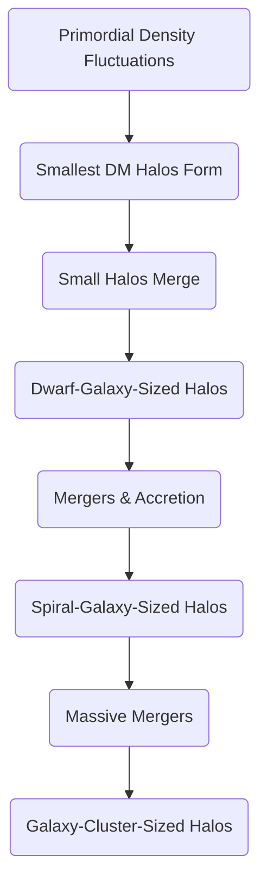

# Extraction Report: cosmo-report-cold-dark-matter-in-the-gravitational-collapse-and-hierarchical-formation-of-the-cosmic-web-20251120094616

> [!info] Auto-Generated Report
> This report was automatically generated by `pkb_extractor.py` on 2026-03-13 04:19.
> **Source**: `cosmo-report-cold-dark-matter-in-the-gravitational-collapse-and-hierarchical-formation-of-the-cosmic-web-20251120094616.md` | **Items Extracted**: 127

---

## 📋 Document Overview

| Field | Value |
|-------|-------|
| **Source File** | `cosmo-report-cold-dark-matter-in-the-gravitational-collapse-and-hierarchical-formation-of-the-cosmic-web-20251120094616.md` |
| **Extraction Date** | 2026-03-13 04:19 |
| **Word Count** | 6,618 |
| **Character Count** | 42,321 |
| **Line Count** | 378 |
| **Total Items Extracted** | 127 |

### Document Outline

- # 1.0 📜Introduction
- # 2.0 🧭Historical Context & Foundational Theories
    - ### 2.1 The First "Ghost": Fritz Zwicky and the Coma Cluster
    - ### 2.2 The "Smoking Gun": Vera Rubin and Galactic Rotation Curves
    - ### 2.3 The "Hot" vs. "Cold" Debate: A Battle for the Universe's Structure
    - ### 2.4 The Verdict: Observations and the Rise of ΛCDM
- # **3.0 🔭🔬Deep Exposition: A Multi-Faceted Analysis**
  - ## 3.1 ⚛️Foundational Principles
  - ## 4.0 ⚙️Mechanisms and Processes
    - ### 4.1 The "Seeds": The Primordial Density Fluctuations
    - ### 4.2 The "Dark Ages" and Gravitational Instability
    - ### 4.3 Hierarchical Formation: The Cosmic "Assembly Line"
    - ### 4.4 The "Gas" Follows the "Dark": Baryon Collapse
    - ### 4.5 Emergence of the Cosmic Web
  - ## 5.0 🔬 Observational Evidence
    - ### 5.1 Evidence 1: The "Smoking Gun" (The Bullet Cluster)
    - ### 5.2 Evidence 2: The "Blueprint" (The Cosmic Microwave Background)
    - ### 5.3 Evidence 3: The "Final Product" (Large-Scale Structure Surveys)
  - ## 6.0 🌍 Broader Implications: The "Nurture" of the Cosmic Web
    - ### 6.1 The "Morphology-Density" Relation
    - ### 6.2 The Mechanisms of Environmental Influence
  - ## 7.0 ❔ Frontier Research
    - ### 7.1 The Hunt: What *is* Cold Dark Matter?
    - ### 7.2 The "Cracks": Tensions in the ΛCDM Model
  - ## 8.0 🦕 Conclusion
  - ## 9.0 🧠 Key Questions
  - ## 10.0 📚 Reference/Appendix

---

## 📊 Extraction Summary

| Item Type | Count |
|-----------|-------|
| Callouts | 33 |
| Code Blocks | 0 |
| Color Spans | 0 |
| Definitions | 0 |
| Embeds | 0 |
| External Links | 0 |
| Footnotes | 10 |
| Headings | 27 |
| Inline Fields | 0 |
| Mermaid Diagrams | 1 |
| Tables | 0 |
| Tags | 0 |
| Wiki Links | 25 |
| **TOTAL** | **127** |

---

## 🔔 Callouts (33)

> [!note] What are Callouts?
> Callouts are `> [!TYPE]` blocks used in Obsidian for structured annotation.
> They carry semantic meaning — definitions, insights, warnings, etc.

### By Type

| Callout Type | Count |
|-------------|-------|
| `[!abstract]` | 1 |
| `[!analogy]` | 1 |
| `[!ask-yourself-this]` | 2 |
| `[!cite]` | 1 |
| `[!connection-ideas]` | 1 |
| `[!counter-argument]` | 1 |
| `[!definition]` | 1 |
| `[!evidence]` | 2 |
| `[!key-claim]` | 1 |
| `[!left-off-reading-at]` | 1 |
| `[!links-to-related-notes]` | 1 |
| `[!pre-read-questions]` | 1 |
| `[!principle-point]` | 3 |
| `[!question]` | 1 |
| `[!quote]` | 6 |
| `[!summary]` | 1 |
| `[!the-purpose]` | 7 |
| `[!thoughts]` | 1 |

### Full Callout List

#### 1. [LEFT-OFF-READING-AT] Untitled *(Line 25)*

> [!left-off-reading-at] Untitled
> - When I last left this report I was reading: Section 5.3

#### 2. [PRE-READ-QUESTIONS] Untitled *(Line 30)*

> [!pre-read-questions] Untitled
> * What is the fundamental difference between "Hot," "Warm," and "Cold" Dark Matter, and why did "Cold" become the accepted standard?
>   * How can we be sure that 85% of the universe's matter is invisible? What is the "smoking gun" evidence that separates dark matter from normal matter?
>   * What does it mean for the universe to be "hierarchical"? What is the alternative, and why did it fail?
>   * How can an invisible, underlying *scaffolding* dictate the *shape* (morphology) of a galaxy? What are the specific mechanisms at play?
>   * What are the biggest "cracks" or "tensions" in the standard Cold Dark Matter model that keep cosmologists awake at night?

#### 3. [ABSTRACT] Untitled *(Line 40)*

> [!abstract] Untitled
> This document provides a comprehensive analysis of the [[Cold Dark Matter (CDM)]] paradigm, the foundational pillar of the standard model of cosmology (ΛCDM). We explore the central thesis that this invisible, non-baryonic, and non-relativistic substance is the primary architect of all large-scale structure in the cosmos. Through the relentless and simple force of gravity, Cold Dark Matter is posited to be the *scaffolding* upon which the entire [[Cosmic Web]]—the vast, filamentary network of galaxy clusters, groups, and voids—was built.
> 
> We will trace the historical and theoretical journey from the first hints of "missing mass" to the establishment of CDM as the consensus. The analysis will deconstruct the core principles of CDM (its "cold" and "dark" nature) to explain *why* it uniquely predicts a "bottom-up" or [[Hierarchical Formation]] of the universe, where small structures (dwarf galaxies) form first and subsequently merge to build larger ones (like our Milky Way) and eventually massive galaxy clusters. We will then detail the mechanisms of this gravitational collapse, from the initial quantum "seeds" to the full-blown simulation of the cosmic web. Finally, we will explore the profound consequences of this dark scaffolding, demonstrating how it directly *constrains* and *governs* the distribution, evolution, and ultimate morphology of the visible galaxies we observe today.

#### 4. [THE-PURPOSE] Untitled *(Line 47)*

> [!the-purpose] Untitled
> Look up at a clear night sky, and you are seeing a lie. Or rather, a beautiful, glittering omission. The stars, nebulae, and galaxies—the sum total of everything our eyes and telescopes can perceive—are but a fleeting shimmer on the surface of a vast, dark ocean. All the matter that we can see, the "baryonic" matter that makes up you, me, our planet, and every star, accounts for only **15%** of the total matter in the universe. The other **85%** is missing. It is dark. It does not shine, reflect, or interact with light in any way. Yet, it is there. We know it is there because we can feel its presence, just as you can feel the wind: not by seeing it, but by observing its effect on everything it touches.
> 
> This invisible substance, known as **Cold Dark Matter (CDM)**, is the silent protagonist of our cosmic story. It is the invisible architect, the unseen scaffolding upon which the entire grand, intricate structure of the cosmos is built. The purpose of this article is to provide a deep, multi-faceted explanation of this profound idea. We will explore how this one, simple *concept*—that the universe is dominated by a slow-moving, invisible form of matter—unlocks *everything* else. It explains the "why" behind the largest structures we see: the great "cosmic web" of filaments and voids. It tells us *why* galaxies are not scattered randomly but are organized like pearls on an invisible thread. And it provides the key to understanding *why* some galaxies are brilliant, star-forming spirals like our own, while others are ancient, "red and dead" elliptical giants.
> 
> This is not a story of astrophysics alone; it is a story of philosophy. It challenges our perception, forcing us to accept that the visible universe is merely the "foam on the waves," a secondary construction built within a pre-existing, and profoundly more massive, invisible world.

#### 5. [QUOTE] Untitled *(Line 54)*

> [!quote] Untitled
> "What we see is not all there is. In fact, what we see is a very small part of what there is… The universe is dominated by a dark side, a dark matter, and a dark energy. And this dark side is the driver of our cosmic destiny."
> — Michael S. Turner

#### 6. [THE-PURPOSE] Untitled *(Line 58)*

> [!the-purpose] Untitled
> Turner's quote encapsulates the Copernican-level shift in perspective that dark matter represents. It's not just an "extra ingredient"; it is the *dominant* ingredient. This realization moves us from a "what-you-see-is-what-you-get" cosmos to one where the ultimate fate and structure of the universe are governed by forces we can, as of now, only infer.

#### 7. [ASK-YOURSELF-THIS] Untitled *(Line 99)*

> [!ask-yourself-this] Untitled
> * **How did the historical development of this idea shape our current understanding?**
>       * The development was a story of *resistance and necessity*. Zwicky's "missing mass" in clusters (1930s) and Rubin's "flat rotation curves" in galaxies (1970s) were *problems* that needed a solution. They forced us to accept an invisible component. The subsequent "Hot vs. Cold" debate was a *refinement* of that idea, where we used the *observed large-scale structure* (bottom-up, not top-down) to determine the *properties* of that invisible component (it must be slow-moving, i.e., "cold").
>   * **Are there any abandoned theories that are as interesting as the current one?**
>       * Yes, the **Hot Dark Matter (HDM)** model is fascinating. The idea that the universe was built "top-down" (giant structures forming first, then fragmenting) is an elegant and powerful counter-narrative. It failed because it didn't match observation, but it serves as a crucial intellectual foil. Its failure is what gives us such strong confidence in the "bottom-up" hierarchical model of CDM.

#### 8. [PRINCIPLE-POINT] Untitled *(Line 112)*

> [!principle-point] Untitled
> * **Core Principle 1: "Darkness" (The Collisionless, Non-Interactive Nature)**
>       * This is the most defining trait. "Dark" does not just mean "doesn't shine"; it means it **does not interact with the electromagnetic force**. A particle of dark matter feels no friction, cannot be stopped by your hand, and passes through light (photons) as if it were not there. This also means it cannot *lose energy* by radiating it away as light, which is the primary way normal (baryonic) matter cools and clumps together to form dense objects like stars.
>       * **Why this matters:** Because dark matter is "collisionless," it can form vast, diffuse, spherical "halos" that are much larger than the visible galaxies within them. Normal matter, by contrast, *can* radiate energy away. This allows it to cool, collapse, and flatten into the dense, spinning *disks* that form spiral galaxies. This principle explains the fundamental *separation* of dark and normal matter: the dark matter forms the huge, spherical "gravitational well," and the normal matter sinks to the center of it to build the visible galaxy.

#### 9. [QUOTE] Untitled *(Line 119)*

> [!quote] Untitled
> "Matter tells space how to curve. Space tells matter how to move."
>  — John Archibald Wheeler

#### 10. [THE-PURPOSE] Untitled *(Line 123)*

> [!the-purpose] Untitled
> Wheeler's famous summary of General Relativity is the engine of our story. Dark matter, possessing 85% of the mass, does the vast majority of the "telling." It curves spacetime on a grand scale, and the visible matter (and light itself) has no choice but to follow the paths it dictates.

#### 11. [PRINCIPLE-POINT] Untitled *(Line 126)*

> [!principle-point] Untitled
> * **Core Principle 2: "Coldness" (The Non-Relativistic, Slow-Moving Nature)**
>       * This is the principle that defines the *scale* of structure. "Cold" simply means that at the time the universe became transparent (the era of "decoupling"), the dark matter particles were already moving sluggishly, far slower than the speed of light.
>       * **Why this matters:** Because it's slow, dark matter's gravity can conquer its kinetic energy *even on very small scales*. This allows it to start clumping together *immediately* and *everywhere*, forming tiny, "Earth-mass" micro-halos (in theory) that then merge into globular-cluster-sized halos, then dwarf-galaxy-sized halos, and so on. This is the **engine of hierarchical, bottom-up formation**. If dark matter were "Hot" (fast-moving), its particles would have zipped out of these small clumps, "wiping clean" any small-scale structure before it could form.

#### 12. [DEFINITION] Untitled *(Line 132)*

> [!definition] Untitled
> * **Hierarchical (Bottom-Up) Formation:**
>       * A model of cosmic structure formation in which small, gravitationally-bound objects (like dwarf galaxy halos) form first. These objects then merge over billions of years, driven by gravity, to create progressively larger and more massive objects (like spiral galaxies, and eventually, massive galaxy clusters).

#### 13. [PRINCIPLE-POINT] Untitled *(Line 137)*

> [!principle-point] Untitled
> * **Core Principle 3: "Gravitational" (The All-Powerful, Sole Interaction)**
>       * This is the *action* principle. Cold Dark Matter does not interact via the strong, weak, or electromagnetic forces. It only interacts with one force: **gravity**. It feels gravity, and (because it has mass) it *exerts* gravity.
>       * **Why this matters:** This makes its behavior incredibly simple and predictable. Its story is not one of chemistry, biology, or electromagnetism. It is a pure, simple, and relentless story of gravitational collapse. This simplicity is what allows us to model it so effectively in N-body simulations. We just need to plug in a vast number of "point masses" that only obey gravity, add the expansion of the universe (driven by Λ, Dark Energy), and let the simulation run. The result, astonishingly, is our universe.

#### 14. [ANALOGY] Untitled *(Line 189)*

> [!analogy] Untitled
> * **To understand** [[Baryonic Collapse]], **imagine** building a massive tent. The **Cold Dark Matter** is the **poles and frame** of the tent. It's invisible, but it's the *scaffolding* that gives the tent its shape and structure. The **normal matter** (gas) is the **canvas**. It has no structure on its own, but when you drape it over the frame, it settles into the shape dictated by the poles, making the invisible structure visible. The stars that ignite from this gas are the "Christmas lights" we hang on the canvas, illuminating the grand structure.

#### 15. [EVIDENCE] Untitled *(Line 217)*

> [!evidence] Untitled
> *The* **primary evidence** *supporting this comes from:*
> 
>   - The [[Bullet Cluster]]
>       * **This showed:** That the majority of the mass in the cluster (mapped by lensing, in blue) is *physically separate* from the majority of the *visible* matter (the hot gas, in pink). This is incontrovertible proof of a collisionless, non-baryonic form of matter. It is not just "dim gas" or a "tweak to gravity"; it is a *substance*.

#### 16. [KEY-CLAIM] Untitled *(Line 227)*

> [!key-claim] Untitled
> * *Based on the evidence, a* **key claim** *is that:*
>       * The CMB data *demands* the existence of Cold Dark Matter. To form the structures we see today from the tiny seeds *seen* in the CMB, you *need* a non-baryonic matter component (dark matter) to start the clumping process *early*. Normal matter was "stuck" to radiation and couldn't collapse. Dark matter, being immune to radiation, could. Without it, there simply was not enough time in 13.8 billion years to form the galaxies and clusters we see.

#### 17. [EVIDENCE] Untitled *(Line 236)*

> [!evidence] Untitled
> *The* **primary evidence** *supporting this comes from:*
> 
>   - [[Large-Scale Structure Surveys]] (e.g., the Sloan Digital Sky Survey (SDSS), 2dF Galaxy Redshift Survey)
>       * **This showed:** These surveys have meticulously mapped the 3D positions of millions of galaxies. The result is a stunning, undeniable confirmation: the real, observed universe *is* a cosmic web, and its statistical properties (how "clumpy" it is, the "void-filament-node" structure) match the predictions of the ΛCDM simulations *perfectly*.

#### 18. [QUOTE] Untitled *(Line 242)*

> [!quote] Untitled
> "It's a wonderful time to be a cosmologist. We're in a position to empirically test our theories of the origin and evolution of the universe."
> — Carlos Frenk (a key architect of the Millennium Simulation)

#### 19. [THE-PURPOSE] Untitled *(Line 246)*

> [!the-purpose] Untitled
> Frenk's point is that cosmology is no longer a purely theoretical or philosophical pursuit. The N-body simulations *are* the theory (ΛCDM) made manifest, and the large-scale surveys *are* the experiment. The fact that the simulation and the observation match is the single most powerful validation of the entire Cold Dark Matter paradigm.

#### 20. [CONNECTION-IDEAS] Untitled *(Line 274)*

> [!connection-ideas] Untitled
> * *The principles discussed here* **strongly connect to the field of:**
>       * [[Stellar-Evolution|Stellar Evolution]]
>       * **The reason:**
>           * The "color" of a galaxy ("blue" vs. "red") is a direct proxy for its star-formation history. The environmental mechanisms of the cosmic web (mergers, stripping) are the *direct cause* of [[Star Formation Cessation]] ("quenching"). Therefore, to understand why some galaxies are "dead" and others are "alive," you *must* understand their position in the dark matter-dominated cosmic web.

#### 21. [COUNTER-ARGUMENT] Untitled *(Line 281)*

> [!counter-argument] Untitled
> * **An important counter-argument or alternative perspective suggests that:**
>       * This entire "dark matter" paradigm is wrong, and is just a "fix" for our misunderstanding of gravity. This alternative is known as **MOND (Modified Newtonian Dynamics)**.[^5] MOND posits that gravity *itself* behaves differently on galactic scales (where it is very weak), eliminating the need for dark matter to explain rotation curves.
>   * **This is important because:**
>       * MOND is very successful at explaining *individual galaxy rotation curves*, sometimes even *better* than CDM. However, it *catastrophically fails* to explain the "macro" picture. It cannot explain the Bullet Cluster (where mass and light are separate), the acoustic peaks of the CMB, or the large-scale structure of the cosmic web. The ΛCDM model is the *only* theory that can successfully explain *all* of these observations, from the infant universe to the present-day web.

#### 22. [QUOTE] Untitled *(Line 288)*

> [!quote] Untitled
> "The history of the cosmos is a history of the triumph of gravity over all other forces."
> — James Peebles (Nobel Laureate for his foundational work in cosmology)

#### 23. [THE-PURPOSE] Untitled *(Line 292)*

> [!the-purpose] Untitled
> Peebles' insight is the key. And since Cold Dark Matter is 85% of the "stuff" that gravity has to work with, the history of the cosmos is, more specifically, the history of *dark matter's gravity* triumphant. This triumph is what sculpted the web and, in turn, sculpted every galaxy within it.

#### 24. [QUESTION] Untitled *(Line 318)*

> [!question] Untitled
> * *What is the* **single biggest unanswered question** *in this field right now?*
>       * There are two, and they are linked: **1) The Identity Problem:** What *is* the dark matter particle? (A WIMP? An Axion? Something else?). **2) The Tension Problem:** Is the Hubble Tension a sign that our ΛCDM model is *wrong*, or is it just a systematic error in our measurements? If it's the former, it could mean Dark Energy is not constant, or that Dark Matter has some *slight* interaction we haven't accounted for (e.g., "Warm" or "Self-Interacting" Dark Matter), which would rewrite parts of this very article.

#### 25. [QUOTE] Untitled *(Line 323)*

> [!quote] Untitled
> "We are in the midst of a technological revolution, in which we are building instruments that are allowing us to test this paradigm to a level of precision that we've never been able to before… And the paradigm is holding up remarkably well, but there are these developing tensions."
> — Priyamvada Natarajan

#### 26. [THE-PURPOSE] Untitled *(Line 327)*

> [!the-purpose] Untitled
> Natarajan's quote perfectly captures the current moment. We are in the "stress-testing" phase. The ΛCDM model, built on Cold Dark Matter, has been phenomenally successful, but it is now being pushed to its limits. Its future—and our entire understanding of the cosmos—hinges on whether it "bends" or "breaks."

#### 27. [SUMMARY] Untitled *(Line 332)*

> [!summary] Untitled
> We have traveled from the first, fleeting hints of "missing mass" in the 1930s to a complete, robust, and tested Standard Model of Cosmology. The journey has forced us to accept a profound, almost philosophical, truth: the universe we see is not the "real" universe. The *real* universe is a vast, dark, and invisible scaffolding of **Cold Dark Matter**.
> 
> We have established that the simple, core principles of this substance—that it is **"dark"** (collisionless), **"cold"** (slow-moving), and interacts only via **gravity**—are not just descriptors. They are the *generative rules* for the entire cosmos. From these rules, the principle of **gravitational instability** inevitably gives rise to a **"bottom-up" hierarchical formation** of structure. This process, unfolding over 13.8 billion years, built the magnificent, web-like superstructure of the cosmos—the Voids, Filaments, and Nodes of the **Cosmic Web**.
> 
> We have seen that this web is not a passive backdrop. It is the *environment* that dictates the fate of all visible matter. By creating the gravitational "wells" (halos), it determines *where* galaxies are born. By controlling their "ecosystem," it determines *how* they evolve, transforming pristine, gas-rich spirals into ancient, "red and dead" ellipticals through the violent mechanisms of mergers and stripping. The invisible, in a very real sense, dictates the *form* and *destiny* of the visible.
> 
> While the precise *identity* of the dark matter particle remains one of the greatest unsolved mysteries in all of science, its *role* as the cosmic architect is now established beyond a reasonable doubt. The evidence from galaxy rotation, the Bullet Cluster, the Cosmic Microwave Background, and the perfect match between N-body simulations and large-scale surveys tells one consistent story. We are not just observers of the universe; we are inhabitants of a vast, dark structure, living inside a "city" of normal matter that was built upon a foundation we may never, ever see.

#### 28. [ASK-YOURSELF-THIS] Untitled *(Line 343)*

> [!ask-yourself-this] Untitled
> * **How would I explain the central idea of this article to someone with no background in this field? (The Feynman Technique)**
>       * Imagine you're flying over a landscape at night. You see cities, towns, and the highways connecting them, all picked out in lights. But you *don't* see the land itself—the mountains, valleys, and rivers. The central idea is that the universe is the same way. The "lights" are the galaxies we see, but they're just "built on" an invisible landscape that's *five times* more massive.
>       * This invisible landscape is "Cold Dark Matter." Because it's "cold" (slow-moving), it clumped together *first*, forming a "scaffolding" that looks like a giant, 3D spider's web. The gravity from this web then pulled all the *normal* matter (the "gas" that makes stars and galaxies) into it. The galaxies are the "lights" that turned on along this invisible "cosmic web." This web isn't just a location; it's an *environment*. A galaxy in an "empty" part of the web (a "void") evolves peacefully. A galaxy in a "crowded" part (a "node," or cluster) gets smashed, stripped, and "killed." The invisible, therefore, determines the life of the visible.
>   * **What was the most surprising or counter-intuitive concept presented? Why?**
>       * The most counter-intuitive idea is "Hot" vs. "Cold" Dark Matter. It's not about temperature, but *speed*, and this one property *completely changes* how a universe is built. The idea that fast-moving (Hot) particles would *erase* small structures and build a "top-down" (big-things-first) universe is a wild concept. It's surprising that our universe's entire "bottom-up" (small-things-first) history is a direct consequence of its dark matter being "cold," or slow-moving.
>   * **What pre-existing knowledge did this article connect with or challenge?**
>       * This article connects deeply with [[Newtonian Gravity]] and [[Einstein's General Relativity]]. It shows how these familiar laws, when applied to a new, dominant *ingredient* (CDM), produce a result (the cosmic web) that is completely non-intuitive. It also challenged the pre-existing notion of "empty space." The "voids" in space are not truly empty; they are just *under-dense*. And the "empty" space *within* a galaxy halo is actually teeming with invisible dark matter, which is what's holding the galaxy together.

#### 29. [QUOTE] Untitled *(Line 353)*

> [!quote] Untitled
> "The Universe is under no obligation to make sense to you."
> — Neil deGrasse Tyson

#### 30. [THE-PURPOSE] Untitled *(Line 357)*

> [!the-purpose] Untitled
> This quote is the perfect summary for the study of dark matter. The idea of an invisible 85% is absurd from a human perspective. It makes no "common sense." But the universe doesn't care about our common sense. The data—from Zwicky, to Rubin, to the Bullet Cluster, to Planck—all points to this one, strange, and unavoidable conclusion.

#### 31. [LINKS-TO-RELATED-NOTES] Untitled *(Line 360)*

> [!links-to-related-notes] Untitled
> * Identify **three key terms** or **concepts** from this article.
>   * *Write your* **own definition** *for each and create a new note to link them back to this one*.
> 
> <!-- end list -->

#### 32. [THOUGHTS] Untitled *(Line 374)*

> [!thoughts] Untitled
> * *What is your* **analysis** *of this information?*
>       * My analysis is that the Cold Dark Matter paradigm is one of the most successful and potent theories in modern science. It's a prime example of a simple, elegant concept (a single, new particle) providing the key to unlock a dozen different, seemingly unrelated problems. It simultaneously explains galactic rotation curves, the dynamics of galaxy clusters, the "smoking gun" of the Bullet Cluster, the statistical pattern of the CMB, and the very *existence* of the cosmic web.
>       * The "nurture" aspect—the environmental influence on galaxy morphology—is particularly powerful. It elevates the cosmic web from a static "picture" to a dynamic, evolving *ecosystem*. However, the "tensions" (Hubble, Small-Scale) are critically important. They are the "grit" in the oyster. They may be the first signs that ΛCDM is a brilliant *approximation* of a deeper, more complex reality that has yet to be discovered. The entire field is poised, waiting to see if these cracks will be sealed or if they will break the whole paradigm open.

#### 33. [CITE] Untitled *(Line 382)*

> [!cite] Untitled

---

## 🔗 Wiki-Links (25 total, 21 unique targets)

> [!info] Knowledge Graph Connections
> These links represent connections to other notes in your PKB.
> **21** distinct notes are referenced.

### Unique Targets

- [[Axions]]
- [[Baryonic Collapse]]
- [[Bullet Cluster]]
- [[Cold Dark Matter (CDM)]]
- [[Cosmic Microwave Background (CMB)]]
- [[Cosmic Web]]
- [[Einstein's General Relativity]]
- [[Fritz Zwicky]]
- [[Galactic Mergers]]
- [[Hierarchical Formation]]
- [[Hubble Tension]]
- [[Inflation]]
- [[Large-Scale Structure Surveys]]
- [[Neutrino]]
- [[Newtonian Gravity]]
- [[Ram-Pressure Stripping]]
- [[Star Formation Cessation]]
- [[Stellar-Evolution|Stellar Evolution]]
- [[Strangulation]]
- [[Vera Rubin]]
- [[WIMPs]]

### All Occurrences

| # | Target | Display Text | Heading | Section | Line |
|---|--------|-------------|---------|---------|------|
| 1 | [[Cold Dark Matter (CDM)]] | — | — | Document Start | 41 |
| 2 | [[Cosmic Web]] | — | — | Document Start | 41 |
| 3 | [[Hierarchical Formation]] | — | — | Document Start | 43 |
| 4 | [[Fritz Zwicky]] | — | — | 2.1 The First "Ghost": Fritz Zwicky a... | 67 |
| 5 | [[Vera Rubin]] | — | — | 2.2 The "Smoking Gun": Vera Rubin and... | 73 |
| 6 | [[Neutrino]] | — | — | 2.3 The "Hot" vs. "Cold" Debate: A Ba... | 83 |
| 7 | [[Cosmic Microwave Background (CMB)]] | — | — | 2.4 The Verdict: Observations and the... | 97 |
| 8 | [[Cosmic Microwave Background (CMB)]] | — | — | 4.1 The "Seeds": The Primordial Densi... | 149 |
| 9 | [[Inflation]] | — | — | 4.1 The "Seeds": The Primordial Densi... | 149 |
| 10 | [[Baryonic Collapse]] | — | — | 4.4 The "Gas" Follows the "Dark": Bar... | 191 |
| 11 | [[Bullet Cluster]] | — | — | 5.1 Evidence 1: The "Smoking Gun" (Th... | 220 |
| 12 | [[Large-Scale Structure Surveys]] | — | — | 5.3 Evidence 3: The "Final Product" (... | 239 |
| 13 | [[Galactic Mergers]] | — | — | 6.2 The Mechanisms of Environmental I... | 270 |
| 14 | [[Ram-Pressure Stripping]] | — | — | 6.2 The Mechanisms of Environmental I... | 271 |
| 15 | [[Strangulation]] | — | — | 6.2 The Mechanisms of Environmental I... | 272 |
| 16 | [[Stellar-Evolution|Stellar Evolution]] | — | — | 6.2 The Mechanisms of Environmental I... | 277 |
| 17 | [[Star Formation Cessation]] | — | — | 6.2 The Mechanisms of Environmental I... | 279 |
| 18 | [[WIMPs]] | — | — | 7.1 The Hunt: What *is* Cold Dark Mat... | 305 |
| 19 | [[Axions]] | — | — | 7.1 The Hunt: What *is* Cold Dark Mat... | 306 |
| 20 | [[Hubble Tension]] | — | — | 7.2 The "Cracks": Tensions in the ΛCD... | 313 |
| 21 | [[Newtonian Gravity]] | — | — | 9.0 🧠 Key Questions | 351 |
| 22 | [[Einstein's General Relativity]] | — | — | 9.0 🧠 Key Questions | 351 |
| 23 | [[Cold Dark Matter (CDM)]] | — | — | 9.0 🧠 Key Questions | 367 |
| 24 | [[Hierarchical Formation]] | — | — | 9.0 🧠 Key Questions | 369 |
| 25 | [[Cosmic Web]] | — | — | 9.0 🧠 Key Questions | 371 |

---

## 📐 Mermaid Diagrams (1)

### Diagram 1 — graph *(Line 170)*

---

## 📝 Footnotes (5 definitions, 5 references)

### Footnote Definitions

- **[^1]**: Zwicky, F. (1933). *Die Rotverschiebung von Extragalaktischen Nebeln*. Helvetica Physica Acta, Vol. 6, p. 110-127. (The original paper, in German, where Zwicky first coined "dunkle Materie".) *(Line 386)*
- **[^2]**: Rubin, V. C., & Ford, W. K., Jr. (1970). *Rotation of the Andromeda Nebula from a Spectroscopic Survey of Emission Regions*. The Astrophysical Journal, 159, 379. (The groundbreaking paper on Andromeda's flat rotation curve.) *(Line 389)*
- **[^3]**: Clowe, D., et al. (2006). *A Direct Empirical Proof of the Existence of Dark Matter*. The Astrophysical Journal Letters, 648(2), L109–L113. (The primary paper on the Bullet Cluster.) *(Line 392)*
- **[^4]**: Springel, V., et al. (2005). *Simulations of the formation, evolution, and clustering of galaxies and quasars*. Nature, 435(7042), 629–636. (The paper detailing the Millennium Simulation.) *(Line 395)*
- **[^5]**: Milgrom, M. (1983). *A modification of the Newtonian dynamics as a possible alternative to the hidden mass hypothesis*. The Astrophysical Journal, 270, 365–370. (The original paper proposing MOND.) *(Line 398)*

---

## 🔢 Math Expressions (1)

> [!info] LaTeX Math
> Found 0 display (`$$...$$`) and 1 inline (`$...$`) expressions.

### Inline Math

| # | Expression | Line |
|---|-----------|------|
| 1 | `$H_0$` | 307 |

---

## 🕸️ Knowledge Graph Analysis

### Unique Wiki-Link Targets (21)

> These represent all distinct notes referenced in the source document.
> Each is a candidate for backlink creation in your PKB.

- [[Axions]]
- [[Baryonic Collapse]]
- [[Bullet Cluster]]
- [[Cold Dark Matter (CDM)]]
- [[Cosmic Microwave Background (CMB)]]
- [[Cosmic Web]]
- [[Einstein's General Relativity]]
- [[Fritz Zwicky]]
- [[Galactic Mergers]]
- [[Hierarchical Formation]]
- [[Hubble Tension]]
- [[Inflation]]
- [[Large-Scale Structure Surveys]]
- [[Neutrino]]
- [[Newtonian Gravity]]
- [[Ram-Pressure Stripping]]
- [[Star Formation Cessation]]
- [[Stellar-Evolution|Stellar Evolution]]
- [[Strangulation]]
- [[Vera Rubin]]
- [[WIMPs]]

---

## 📁 Raw Data

> [!abstract] JSON File Available
> The full machine-readable extraction is saved alongside this report as:
> `cosmo-report-cold-dark-matter-in-the-gravitational-collapse-and-hierarchical-formation-of-the-cosmic-web-20251120094616_extracted.json`

---

*Report generated by `pkb_extractor.py v1.1.0` · 2026-03-13 04:19:12*