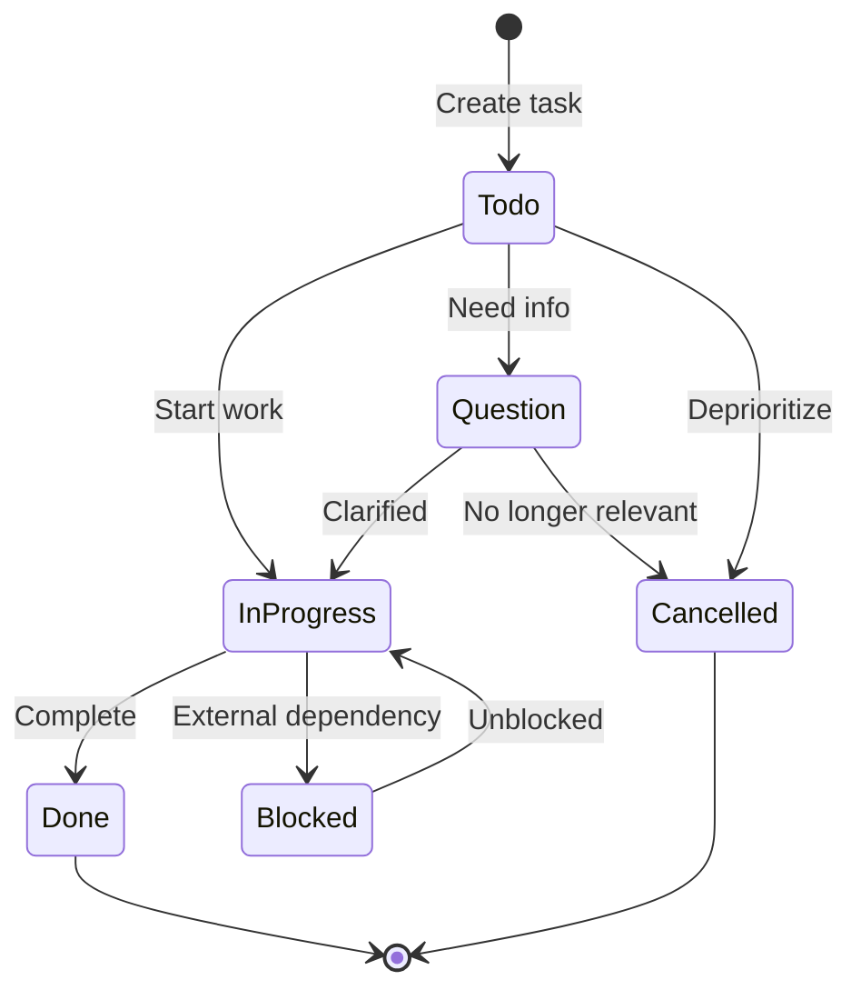

# Extraction Report: Reference Comprehensive Alternative Checkboxes 2025120321

> [!info] Auto-Generated Report
> This report was automatically generated by `pkb_extractor.py` on 2026-03-13 04:18.
> **Source**: `reference-comprehensive-alternative-checkboxes-2025120321.md` | **Items Extracted**: 484

---

## 📋 Document Overview

| Field | Value |
|-------|-------|
| **Source File** | `reference-comprehensive-alternative-checkboxes-2025120321.md` |
| **Extraction Date** | 2026-03-13 04:18 |
| **Word Count** | 7,844 |
| **Character Count** | 57,931 |
| **Line Count** | 1,463 |
| **Total Items Extracted** | 484 |

### Document Outline

- # Alternative Checkboxes
    - ### Related Notes
    - ### Sources & References
    - ### Backlinks & Connections
    - ### 2025-12-03 - Initial Creation
    - ### Tags & Classification
  - ## 📑 Table of Contents
  - ## 🔍 Foundational Concepts
    - ### The Evolution from Standard Markdown
    - ### Core Architectural Components
    - ### Integration with Obsidian's Task Architecture
  - ## 📋 Complete Checkbox Syntax Taxonomy
    - ### Standard Obsidian Checkboxes
    - ### Universal Alternative Checkboxes
    - ### Extended Checkbox Types
    - ### Complete ITS Theme Checkbox Set
    - ### Theme-Specific Extensions
  - ## 🎨 Theme-Based Implementations
    - ### Minimal Theme
    - ### ITS Theme (SlRvb)
    - ### Things Theme
    - ### Primary Theme
  - ## 🔌 Plugin Ecosystem Integration
    - ### Tasks Plugin
  - ## Query: All In-Progress Tasks
  - ## Query: Important and Urgent Tasks
  - ## Query: Cancelled Tasks This Month
    - ### Dataview Integration
    - ### Complementary Plugins
  - ## ⚙️ CSS Architecture & Customization
    - ### Understanding the data-task Attribute
    - ### CSS Selector Patterns
    - ### CSS Variables for Theming
    - ### SVG Icon Implementation
    - ### Text Decoration Control
    - ### Complete CSS Snippet Template
    - ### Installation & Management
  - ## 💼 Practical Workflows & Use Cases
    - ### Task Management Workflows
  - ## Inbox (Raw Capture)
  - ## Next Actions
  - ## Waiting For
  - ## Someday/Maybe
  - ## Today's Focus
  - ## Waiting on Others
  - ## Needs Clarification
    - ### Creative Writing & Content Development
  - ## Character: Elena Morrison
    - ### Character Arc
    - ### Scene Appearances
    - ### Story Elements
  - ## Act II Development
    - ### Rising Action
    - ### To Research
    - ### Project & Product Management
  - ## Sprint 23 - User Authentication Refactor
    - ### In Progress
    - ### Blocked
    - ### Cancelled This Sprint
    - ### Code Review
    - ### Important Items
    - ### Research & Knowledge Synthesis
  - ## Research: Neural Plasticity in Adult Learning
    - ### Papers to Read
    - ### Key Findings
    - ### Synthesis
    - ### Follow-up
    - ### Academic & Student Workflows
  - ## CS301 - Data Structures & Algorithms
    - ### Assignments
    - ### Study Tasks
    - ### Exam Prep
    - ### Business & Financial Tracking
  - ## Decision: Upgrade Office Equipment
    - ### Cost-Benefit Analysis
    - ### Action Items
    - ### Decision Status
    - ### Personal Productivity & Habit Tracking
  - ## Morning Routine
  - ## Evening Review
  - ## Habit Tracking
    - ### Integration with Obsidian Features
  - ## Tasks by Type
    - ### High Priority
    - ### In Progress Across Vault
  - ## 🎯 Synthesis & Mastery
    - ### Cognitive Models for Alternative Checkboxes
    - ### Design Principles for Checkbox Systems
    - ### Advanced Implementation Strategies
  - ## Writing Projects
  - ## Software Development
  - ## Research
  - ## General Tasks
  - ## Meeting Notes Template
    - ### Action Items
    - ### Follow-up Questions
    - ### Delegated Tasks
    - ### Important Decisions
  - ## Command Center
    - ### 🔥 Critical
    - ### 🔄 Active Work
    - ### ❓ Needs Attention
    - ### ⏳ Waiting
    - ### Comparative Analysis
    - ### Common Pitfalls & Solutions
    - ### Evolution & Maintenance
  - ## Checkbox Usage Review - Q4 2024
    - ### Usage Statistics (via vault search)
    - ### Decisions
    - ### Integration with Broader PKM Philosophy
  - ## 📊 Metadata & Attribution
  - ## 🔄 Version History
- # 🔗 Related Topics for PKB Expansion

---

## 📊 Extraction Summary

| Item Type | Count |
|-----------|-------|
| Callouts | 28 |
| Code Blocks | 48 |
| Color Spans | 0 |
| Definitions | 11 |
| Embeds | 0 |
| External Links | 3 |
| Footnotes | 0 |
| Headings | 113 |
| Inline Fields | 11 |
| Mermaid Diagrams | 1 |
| Tables | 4 |
| Tags | 11 |
| Wiki Links | 164 |
| **TOTAL** | **484** |

---

## 🔔 Callouts (28)

> [!note] What are Callouts?
> Callouts are `> [!TYPE]` blocks used in Obsidian for structured annotation.
> They carry semantic meaning — definitions, insights, warnings, etc.

### By Type

| Callout Type | Count |
|-------------|-------|
| `[!]` | 2 |
| `[!abstract]` | 1 |
| `[!analogy]` | 2 |
| `[!comprehensive-reference]` | 1 |
| `[!connections-and-links]` | 2 |
| `[!definition]` | 4 |
| `[!helpful-tip]` | 2 |
| `[!how-to-use-this]` | 1 |
| `[!key-claim]` | 5 |
| `[!methodology-and-sources]` | 2 |
| `[!overview]` | 1 |
| `[!the-philosophy]` | 1 |
| `[!todo]` | 1 |
| `[!use-cases-and-examples]` | 2 |
| `[!warning]` | 1 |

### Full Callout List

#### 1. [OVERVIEW] Untitled *(Line 38)*

> [!overview] Untitled
> - **Title**:: [[Alternative Checkboxes]]
> - **Prompt/Topic Used**:: 
> - **Status**:: 🌱 `= this.maturity` | Confidence: `= this.confidence`

#### 2. [] # :FasClipboardList:In-Note Metadata Panel *(Line 43)*

> [!] # :FasClipboardList:In-Note Metadata Panel
> - **Note-Type**: `= this.type`
> - **Development Status**: `= this.maturity`
> - **Epistemic Confidence**: `= this.confidence`
> - **Next Review**: `= this.next-review`
> - **Review Count**: `= this.review-count`
> - **Created**: `= this.created`
> - **Last Modified**: `= this.modified`
> 
> > [!purpose] ### 📝Content Metrics
> > [**Word Count**:: `= this.file.size`]| [**Est. Read Time**:: `= round(this.file.size / 1300) + " min"`]
> > [**Depth Class**:: `= choice(this.file.size < 500, "🌱Stub", choice(this.file.size < 2000, "📄Note", "📜Essay"))`]
> ----
> > [!purpose] ### 🕰️Temporal Context
> > [**Created**:: `= this.file.ctime`] | [**Age**:: `= (date(today) - this.file.ctime).days + " days"`]
> > [**Last Touch**:: `= this.file.mtime`] | [**Staleness**:: `= choice((date(today) - this.file.mtime).days > 180, "🕸️Cobwebs", choice((date(today) - this.file.mtime).days > 30, "🍂Cold", "🔥Fresh"))`]
> > [**Touch Frequency**:: `= choice((date(today) - this.file.mtime).days < 7, "🔥Active", choice((date(today) - this.file.mtime).days < 30, "👌Regular", "❄️Dormant"))`]
> ----
> > [!topic-idea] ### 🔗Network Connectivity
> > [**In-Links**:: `= length(this.file.inlinks)`] | [**Out-Links**:: `= length(this.file.outlinks)`]
> > [**Network Status**:: `= choice(length(this.file.inlinks) = 0, "🕸️Orphan", choice(length(this.file.inlinks) > 5, "⚡ Hub", "🌱Node"))`]
> ```dataviewjs
> // SYSTEM: Semantic Bridge Engine
> // PURPOSE: Find "Sibling" notes that share the same Outlinks (Contexts)
> const current = dv.current();
> const myOutlinks = current.file.outlinks.map(l => l.path);
> 
> // 1. Filter the Vault
> const siblings = dv.pages()
>     .where(p => p.file.path !== current.file.path) // Exclude self
>     .where(p => !current.file.outlinks.map(l => l.path).includes(p.file.path)) // Exclude existing direct links
>     .map(p => {
>         // Find overlap between this page's links and the current page's links
>         const shared = p.file.outlinks.filter(l => myOutlinks.includes(l.path));
>         return { 
>             link: p.file.link, 
>             sharedCount: shared.length, 
>             sharedLinks: shared 
>         };
>     })
>     .where(p => p.sharedCount > 0) // Must share at least 1 connection
>     .sort(p => p.sharedCount, "desc") // Sort by strongest connection
>     .limit(5); // Only show top 5
> 
> // 2. Render the Bridge
> if (siblings.length > 0) {
>     dv.header(3, "Semantic Bridges (Missing Connections)");
>     dv.table(
>         ["Sibling Note", "Strength", "Shared Context"], 
>         siblings.map(s => [
>             s.link, 
>             "🔗" + s.sharedCount, 
>             s.sharedLinks.slice(0, 3).join(", ") + (s.sharedCount > 3 ? "…" : "")
>         ])
>     );
> } else {
>     dv.paragraph("*No semantic siblings found. This note is unique in its connections.*");
> }
> ```

#### 3. [] ### Claude Thinking *(Line 145)*

> [!] ### Claude Thinking
> **PHASE 1: REQUEST ANALYSIS**
> Request Classification:
> - Type: comprehensive_note
> - Scope: reference
> - Research Required: YES - This requires current information about community-maintained checkbox variations in Obsidian, which may have evolved since my training data
> Request Details:
> - Topic: Obsidian Alternative Checkboxes (community variations beyond standard markdown)
> - User Intent: Create exhaustive reference for custom checkbox syntax used in Obsidian PKB
> - Expected Output: Reference note with all checkbox types, their syntax, rendering, use cases
> - Depth Required: Comprehensive coverage of all community checkbox variants
> **RESEARCH STRATEGY:**
> I need to search for:
> 1. Official Obsidian checkbox documentation
> 2. Community-created checkbox variations and their meanings
> 3. Plugin-specific checkbox syntaxes (Tasks plugin, Checklist plugin, etc.)
> 4. CSS snippet checkbox customizations
> 5. Best practices for checkbox usage in PKM systems
> **QUERY RATIONALE:**
> Query 1: "Obsidian alternative checkboxes syntax"
> - Expected: Core syntax variations beyond basic [ ] and [x]
> - Rationale: Need foundational understanding of what alternative checkboxes exist
> Query 2: "Obsidian Tasks plugin checkbox types"
> - Expected: Task-management specific checkbox variations
> - Rationale: Tasks plugin is most popular for advanced checkbox functionality
> Query 3: "Obsidian community checkbox CSS snippets"
> - Expected: Custom styling and additional checkbox types via CSS
> - Rationale: Community often extends functionality through CSS
> Query 4: "Obsidian checkbox best practices PKM"
> - Expected: Usage patterns and workflow integration
> - Rationale: Need practical application context
> Query 5: "Obsidian checklist markdown variations"
> - Expected: Comprehensive list of all supported syntax patterns
> - Rationale: Ensure complete coverage
> **STRUCTURAL PLANNING:**
> Information Architecture:
> 1. Core Concept (What are alternative checkboxes?)
> 2. Standard Checkbox Types (built-in Obsidian)
> 3. Tasks Plugin Checkboxes (most comprehensive system)
> 4. Community Variants (CSS-based, other plugins)
> 5. Syntax Reference Table (quick lookup)
> 6. Use Cases & Workflows (practical application)
> 7. Implementation Guide (how to enable/customize)
> 8. Synthesis (best practices, mental models)
> Wiki-Link Opportunities:
> - [[Markdown]]
> - [[Obsidian]]
> - [[Task-Management|Task Management]]
> - [[GTD|GTD (Getting Things Done)]]
> - [[03-notes/01_permanent-notes/02_personal-knowledge-base/Personal Knowledge Management]]
> - [[CSS Snippets]]
> - [[Obsidian Plugins]]
> - [[Dataview]]
> - [[Metadata]]
> - [[Workflow Design]]
> - [[Visual Semantics]]
> - [[Information-Architecture|Information Architecture]]
> Callout Strategy:
> - [!definition] for checkbox type definitions
> - [!example] for syntax demonstrations
> - [!methodology-and-sources] for implementation steps
> - [!helpful-tip] for workflow suggestions
> - [!warning] for compatibility issues
> - [!key-claim] for best practice principles
> Metadata Planning:
> - Tags: #obsidian #reference-note #markdown #task-management #pkm-tools
> - Aliases: [Checkbox Types, Task Checkboxes, Alternative Checkboxes, Obsidian Checkboxes]
> **PHASE 2: RESEARCH EXECUTION**
> Now executing web searches...
> Now I have comprehensive information from multiple sources. Let me create the exhaustive reference note.

#### 4. [COMPREHENSIVE-REFERENCE] 📚 Comprehensive-Reference *(Line 222)*

> [!comprehensive-reference] 📚 Comprehensive-Reference
> - **Generated**:: 2025-12-03
> - **Version**:: 1.0
> - **Type**:: Reference Documentation

#### 5. [ABSTRACT] Untitled *(Line 227)*

> [!abstract] Untitled
> **Executive Overview**
> Alternative checkboxes in [[Obsidian]] extend standard [[Markdown]] task functionality beyond the basic unchecked `- [ ]` and checked `- [x]` states, allowing users to represent diverse task statuses through custom character syntax within brackets. This comprehensive reference documents all community-recognized checkbox variants, their rendering behaviors, implementation methods via [[CSS Snippets]] and [[Obsidian Plugins]], and practical applications within [[03-notes/01_permanent-notes/02_personal-knowledge-base/Personal Knowledge Management]] workflows.

#### 6. [HOW-TO-USE-THIS] Untitled *(Line 231)*

> [!how-to-use-this] Untitled
> **Navigation Guide**
> This reference note is organized into 7 major sections covering foundational concepts, complete syntax taxonomies, theme-specific implementations, plugin integrations, CSS customization, practical workflows, and synthesis frameworks. Use the table of contents for quick navigation, or search for specific checkbox characters using [[wiki-links]].

#### 7. [DEFINITION] Untitled *(Line 249)*

> [!definition] Untitled
> - **Key-Term**:: [[Alternative Checkboxes]]
> - **Definition**:: Extended task list syntax in [[Obsidian]] that uses different characters between brackets (e.g., `[/]`, `[?]`, `[-]`) to represent task states beyond binary completion, rendered with custom icons and styling through [[CSS]] or [[Obsidian Themes]].

#### 8. [KEY-CLAIM] Untitled *(Line 261)*

> [!key-claim] Untitled
> **Central Principle**
> Alternative checkboxes transform task lists from binary completion trackers into semantic status indicators, enabling [[Visual Information Architecture]] that communicates task states at a glance while preserving plain-text portability.

#### 9. [WARNING] Untitled *(Line 281)*

> [!warning] Untitled
> **Critical Constraints**
> Alternative checkboxes are purely a rendering feature—the underlying [[Markdown]] files contain only the character within brackets. If you share notes with users who don't have appropriate themes or [[CSS Snippets]] enabled, they will see raw characters like `[?]` or `[!]` without semantic icons. This maintains [[Plain-Text Portability]] but may reduce immediate comprehension for recipients unfamiliar with the conventions.

#### 10. [DEFINITION] Untitled *(Line 303)*

> [!definition] Untitled
> **Universal Checkbox Set**
> The following characters are recognized by most themes and CSS implementations:

#### 11. [USE-CASES-AND-EXAMPLES] Untitled *(Line 325)*

> [!use-cases-and-examples] Untitled
> **Extended Semantic Categories**
> 
> **Project Management**
> - `- [D]` - Date: Task with important date dependency
> - `- [T]` - Time: Time-sensitive task
> - `- [R]` - Research: Investigation required
> - `- [+]` - Add: Addition to project scope
> 
> **Decision Making**
> - `- [P]` - Pro: Advantage or positive aspect
> - `- [C]` - Con: Disadvantage or concern
> - `- [B]` - Brainstorm: Ideation item
> - `- [A]` - Answer: Solution or resolution
> 
> **Content Creation**
> - `- [Q]` - Quote: Direct quotation
> - `- [N]` - Note: Observation or annotation
> - `- [p]` - Paraphrase: Restated content
> - `- [E]` - Example: Illustrative case
> 
> **Narrative & Creative Work**
> - `- [@]` - Character/Person: Character development
> - `- [t]` - Talk: Dialogue or conversation
> - `- [O]` - Outline/Plot: Structure element
> - `- [~]` - Conflict: Narrative tension
> - `- [W]` - World: World-building element
> - `- [f]` - Clue/Find: Discovery or revelation
> - `- [F]` - Foreshadow: Setup for future events
> - `- [&]` - Symbolism: Symbolic element

#### 12. [CONNECTIONS-AND-LINKS] Untitled *(Line 421)*

> [!connections-and-links] Untitled
> **Checkbox Taxonomy Organization**
> The checkbox types can be organized into semantic categories:
> - **Status Indicators**: `[ ]`, `[x]`, `[/]`, `[-]`, `[>]`, `[<]`
> - **Priority Markers**: `[!]`, `[*]`, `[f]`, `[H]`
> - **Information Types**: `[?]`, `[i]`, `[I]`, `[N]`, `[Q]`
> - **Decision Support**: `[P]`, `[C]`, `[B]`, `[A]`, `[c]`
> - **Content Development**: `[@]`, `[t]`, `[O]`, `[~]`, `[W]`, `[&]`
> - **Context Markers**: `[l]`, `[L]`, `[b]`, `[T]`, `[D]`
> - **Workflow Actions**: `[R]`, `[+]`, `[E]`, `[r]`

#### 13. [METHODOLOGY-AND-SOURCES] Untitled *(Line 440)*

> [!methodology-and-sources] Untitled
> **Minimal Checkbox Philosophy**
> [[Minimal Theme]] draws inspiration from [[Bullet Journal]] methodology, where different markers (dots, circles, dashes, etc.) convey semantic meaning. The digital implementation translates these analog conventions into icon-based visual language.

#### 14. [ANALOGY] Untitled *(Line 537)*

> [!analogy] Untitled
> **Design Pattern Comparison**
> Think of [[Obsidian Themes]] as different "dialects" of the alternative checkbox language. [[Minimal Theme]] established the grammar (syntax rules), [[ITS Theme]] expanded the vocabulary (new checkbox types for specialized domains), [[Things Theme]] refined the pronunciation (visual aesthetics), and [[Primary Theme]] provided the translation dictionary (customization tools). All remain mutually intelligible through the shared `data-task` attribute foundation.

#### 15. [DEFINITION] Untitled *(Line 549)*

> [!definition] Untitled
> - **Key-Term**:: [[Custom Statuses]]
> - **Definition**:: User-definable task state configurations in [[Tasks-Plugin|Tasks Plugin]] that map checkbox characters to semantic meanings, enable status-aware querying, and control task cycling behavior.

#### 16. [HELPFUL-TIP] Untitled *(Line 597)*

> [!helpful-tip] Untitled
> **Workflow Optimization**
> Replace [[Obsidian]]'s default "Toggle checkbox status" hotkey with [[Tasks-Plugin|Tasks Plugin]]'s "Tasks: Toggle Done" command for status-aware cycling that respects your custom status definitions.

#### 17. [CONNECTIONS-AND-LINKS] Untitled *(Line 655)*

> [!connections-and-links] Untitled
> **Plugin Synergy Matrix**
> 
> Optimal workflow combinations:
> - **[[Tasks-Plugin|Tasks Plugin]] + [[Minimal Theme]]**: Full-featured task management with visual semantics
> - **[[Task Status Plugin]] + [[ITS Theme]]**: Rapid status changes for creative writing workflows
> - **[[Dataview]] + [[Checkbox Time Tracker]]**: Temporal analysis of task completion patterns
> - **[[Checkbox Sync]] + hierarchical outlines**: Automated progress tracking for complex projects

#### 18. [DEFINITION] Untitled *(Line 670)*

> [!definition] Untitled
> - **Key-Term**:: [[data-task Attribute]]
> - **Definition**:: An [[HTML]] attribute automatically generated by [[Obsidian]] when rendering task list items, containing the character from between the brackets, which serves as the [[CSS]] selector target for alternative checkbox styling.

#### 19. [HELPFUL-TIP] Untitled *(Line 887)*

> [!helpful-tip] Untitled
> **Snippet Organization**
> Name your snippet files descriptively (e.g., `alternative-checkboxes-minimal.css` or `custom-checkboxes-writing.css`) and include header comments documenting the checkbox types included, making future maintenance easier.

#### 20. [USE-CASES-AND-EXAMPLES] Untitled *(Line 1134)*

> [!use-cases-and-examples] Untitled
> **Workflow Selection Guide**
> 
> **Choose Standard Checkboxes When:**
> - Simple binary completion tracking suffices
> - Collaborating with users unfamiliar with alternatives
> - Exporting notes to systems without custom styling
> 
> **Choose Alternative Checkboxes When:**
> - Managing complex multi-state workflows
> - Requiring visual semantic indicators
> - Building sophisticated [[Knowledge Work]] systems
> - Integrating with [[Tasks-Plugin|Tasks Plugin]] or [[Dataview]]
> - Tracking diverse information types beyond tasks

#### 21. [TODO] Sprint Tasks *(Line 1154)*

> [!todo] Sprint Tasks
> - [/] Backend API development
> - [!] Critical bug fix needed
> - [?] Clarify feature requirements
> - [x] Database migration complete

#### 22. [THE-PHILOSOPHY] Untitled *(Line 1200)*

> [!the-philosophy] Untitled
> **Underlying Philosophy**
> Alternative checkboxes embody the principle that **semantic granularity enhances cognitive clarity**. By moving beyond binary completion states, we acknowledge that knowledge work and creative processes exist in liminal spaces—tasks are not merely "done" or "not done" but evolve through states of questioning, research, progress, delegation, and cancellation. The visual language of alternative checkboxes serves as an external cognitive artifact, offloading mental overhead to the interface itself.

#### 23. [KEY-CLAIM] Untitled *(Line 1253)*

> [!key-claim] Untitled
> **Principle 1: Semantic Parsimony**
> Use the minimum number of distinct checkbox types necessary for your workflow. Every additional checkbox type increases cognitive load and decision fatigue. Start with 5-7 core types and expand only when clear semantic gaps emerge.

#### 24. [KEY-CLAIM] Untitled *(Line 1257)*

> [!key-claim] Untitled
> **Principle 2: Visual Consistency**
> Maintain consistent color semantics (e.g., red=important, blue=in-progress, gray=cancelled) across your entire [[PKB]]. This builds [[Procedural-Memory|Procedural Memory]] and reduces cognitive processing time.

#### 25. [KEY-CLAIM] Untitled *(Line 1261)*

> [!key-claim] Untitled
> **Principle 3: Workflow Alignment**
> Checkbox types should map to actual workflow states you encounter regularly. Avoid aspirational checkbox types that "might be useful"—they create decision paralysis. Audit your usage monthly and remove unused types.

#### 26. [KEY-CLAIM] Untitled *(Line 1265)*

> [!key-claim] Untitled
> **Principle 4: Progressive Disclosure**
> Begin with standard checkboxes. Introduce alternative checkboxes as specific needs arise. This prevents overwhelming new users while allowing sophisticated workflows to emerge organically.

#### 27. [ANALOGY] Untitled *(Line 1427)*

> [!analogy] Untitled
> **Illuminating Comparison**
> Think of alternative checkboxes as **musical notation for knowledge work**. Just as sheet music uses symbols (whole notes, quarter notes, rests, dynamics) to encode temporal and expressive dimensions beyond the pitch itself, alternative checkboxes encode workflow dimensions (priority, blockage, delegation) beyond the task's completion status. Musicians sight-reading sheet music don't consciously process every symbol—pattern recognition takes over. Similarly, your visual cortex learns to parse checkbox types pre-attentively, offloading cognitive processing from your deliberate attention to your perceptual system.

#### 28. [METHODOLOGY-AND-SOURCES] Untitled *(Line 1435)*

> [!methodology-and-sources] Untitled
> **Research Methodology**
> This reference note synthesizes information from:
> 
> **Primary Sources:**
> - Minimal Theme GitHub repository (kepano/obsidian-minimal)
> - ITS Theme documentation (SlRvb/Obsidian--ITS-Theme)
> - Tasks Plugin official documentation
> - Obsidian Developer Documentation - CSS Variables
> - Primary Theme documentation
> - Things Theme documentation
> 
> **Community Resources:**
> - Obsidian Forum discussions on alternative checkboxes
> - GitHub Gist CSS snippets by Oliver Balfour and community
> - Community CSS snippet repositories
> 
> **Research Queries Performed:**
> 1. "Obsidian alternative checkboxes syntax complete list"
> 2. "Obsidian Tasks plugin checkbox status types documentation"
> 3. "Minimal theme Obsidian checkbox complete list syntax"
> 4. "Obsidian checkbox CSS data-task attribute complete reference"
> 
> **Synthesis Approach:**
> Integrated documentation from major theme authors, plugin maintainers, and community CSS contributors to create comprehensive cross-reference taxonomy. Validated syntax against multiple source implementations. Categorized checkboxes semantically rather than alphabetically to enhance usability.
> 
> **Confidence Level:**
> - **High**: Core checkbox syntax (`[ ]` `[x]` `[/]` `[-]` `[>]` `[<]` `[?]` `[!]` `[*]`)
> - **High**: Minimal Theme and ITS Theme implementations (official documentation)
> - **High**: Tasks Plugin custom status functionality (official docs + GitHub)
> - **Medium**: Extended checkbox types (theme-dependent, less standardized)
> - **Medium**: CSS implementation details (multiple valid approaches exist)

---

## 🔗 Wiki-Links (164 total, 70 unique targets)

> [!info] Knowledge Graph Connections
> These links represent connections to other notes in your PKB.
> **70** distinct notes are referenced.

### Unique Targets

- [[03-notes/01_permanent-notes/02_personal-knowledge-base/Personal Knowledge Management]]
- [[Alternative Checkboxes]]
- [[Bullet Journal]]
- [[CSS]]
- [[CSS Snippet]]
- [[CSS Snippet Development for Obsidian]]
- [[CSS Snippets]]
- [[CSS Variables]]
- [[Callouts]]
- [[Checkbox 3 States Plugin]]
- [[Checkbox Sync]]
- [[Checkbox Sync Plugin]]
- [[Checkbox Time Tracker]]
- [[Completed Tasks Plugin]]
- [[Creative Writing]]
- [[Custom Statuses]]
- [[Dataview]]
- [[Dataview & Tasks Plugin Query Mastery]]
- [[Dataview-Plugin|Dataview Plugin]]
- [[Developer Tools]]
- [[Dungeons & Dragons]]
- [[Edit Mode]]
- [[Finite State Machine]]
- [[Font Awesome]]
- [[GTD]]
- [[GTD|GTD (Getting Things Done)]]
- [[GitHub]]
- [[HTML]]
- [[Heroicons]]
- [[ITS Theme]]
- [[Information-Architecture|Information Architecture]]
- [[Kanban Plugin]]
- [[Knowledge Work]]
- [[Live Preview]]
- [[Lucide Icons]]
- [[Markdown]]
- [[Metadata]]
- [[Minimal Theme]]
- [[Obsidian]]
- [[Obsidian Mobile]]
- [[Obsidian Plugins]]
- [[Obsidian Themes]]
- [[PKB]]
- [[Personal-Knowledge-Base|Personal Knowledge Base]]
- [[Plain-Text Portability]]
- [[Primary Theme]]
- [[Procedural-Memory|Procedural Memory]]
- [[Project Management]]
- [[QuickAdd]]
- [[Reading View]]
- [[Reference-Note|Reference Note]]
- [[SVG]]
- [[Sanctum Theme]]
- [[Semantic-Network|Semantic Network]]
- [[Software Development]]
- [[Source Mode]]
- [[Style Settings Plugin]]
- [[Task-Management|Task Management]]
- [[Task Management Systems Comparison]]
- [[Task Status Plugin]]
- [[Tasks-Plugin|Tasks Plugin]]
- [[Templater]]
- [[Things 3]]
- [[Things Theme]]
- [[Visual Information Architecture]]
- [[Visual Semantics]]
- [[Visual Semantics in Knowledge Management]]
- [[wiki-links]]
- [[Workflow Design]]
- [[data-task Attribute]]

### All Occurrences

| # | Target | Display Text | Heading | Section | Line |
|---|--------|-------------|---------|---------|------|
| 1 | [[Alternative Checkboxes]] | — | — | Alternative Checkboxes | 39 |
| 2 | [[Markdown]] | — | — | Tags & Classification | 190 |
| 3 | [[Obsidian]] | — | — | Tags & Classification | 191 |
| 4 | [[Task-Management|Task Management]] | — | — | Tags & Classification | 192 |
| 5 | [[GTD|GTD (Getting Things Done)]] | — | — | Tags & Classification | 193 |
| 6 | [[03-notes/01_permanent-notes/02_personal-knowledge-base/Personal Knowledge Management]] | — | — | Tags & Classification | 194 |
| 7 | [[CSS Snippets]] | — | — | Tags & Classification | 195 |
| 8 | [[Obsidian Plugins]] | — | — | Tags & Classification | 196 |
| 9 | [[Dataview]] | — | — | Tags & Classification | 197 |
| 10 | [[Metadata]] | — | — | Tags & Classification | 198 |
| 11 | [[Workflow Design]] | — | — | Tags & Classification | 199 |
| 12 | [[Visual Semantics]] | — | — | Tags & Classification | 200 |
| 13 | [[Information-Architecture|Information Architecture]] | — | — | Tags & Classification | 201 |
| 14 | [[Obsidian]] | — | — | Tags & Classification | 229 |
| 15 | [[Markdown]] | — | — | Tags & Classification | 229 |
| 16 | [[CSS Snippets]] | — | — | Tags & Classification | 229 |
| 17 | [[Obsidian Plugins]] | — | — | Tags & Classification | 229 |
| 18 | [[03-notes/01_permanent-notes/02_personal-knowledge-base/Personal Knowledge Management]] | — | — | Tags & Classification | 229 |
| 19 | [[wiki-links]] | — | — | Tags & Classification | 233 |
| 20 | [[Alternative Checkboxes]] | — | — | 🔍 Foundational Concepts | 250 |
| 21 | [[Obsidian]] | — | — | 🔍 Foundational Concepts | 251 |
| 22 | [[CSS]] | — | — | 🔍 Foundational Concepts | 251 |
| 23 | [[Obsidian Themes]] | — | — | 🔍 Foundational Concepts | 251 |
| 24 | [[Markdown]] | — | — | The Evolution from Standard Markdown | 255 |
| 25 | [[Knowledge Work]] | — | — | The Evolution from Standard Markdown | 255 |
| 26 | [[Project Management]] | — | — | The Evolution from Standard Markdown | 255 |
| 27 | [[Personal-Knowledge-Base|Personal Knowledge Base]] | — | — | The Evolution from Standard Markdown | 255 |
| 28 | [[Obsidian]] | — | — | The Evolution from Standard Markdown | 255 |
| 29 | [[Markdown]] | — | — | The Evolution from Standard Markdown | 255 |
| 30 | [[Minimal Theme]] | — | — | The Evolution from Standard Markdown | 257 |
| 31 | [[ITS Theme]] | — | — | The Evolution from Standard Markdown | 257 |
| 32 | [[Things Theme]] | — | — | The Evolution from Standard Markdown | 257 |
| 33 | [[Primary Theme]] | — | — | The Evolution from Standard Markdown | 257 |
| 34 | [[HTML]] | — | — | The Evolution from Standard Markdown | 257 |
| 35 | [[Obsidian]] | — | — | The Evolution from Standard Markdown | 257 |
| 36 | [[CSS]] | — | — | The Evolution from Standard Markdown | 257 |
| 37 | [[Visual Information Architecture]] | — | — | The Evolution from Standard Markdown | 263 |
| 38 | [[Markdown]] | — | — | Core Architectural Components | 269 |
| 39 | [[Markdown]] | — | — | Core Architectural Components | 269 |
| 40 | [[CSS Snippets]] | — | — | Core Architectural Components | 269 |
| 41 | [[Reading View]] | — | — | Core Architectural Components | 271 |
| 42 | [[Live Preview]] | — | — | Core Architectural Components | 271 |
| 43 | [[SVG]] | — | — | Core Architectural Components | 271 |
| 44 | [[CSS]] | — | — | Core Architectural Components | 271 |
| 45 | [[Obsidian]] | — | — | Core Architectural Components | 273 |
| 46 | [[Obsidian]] | — | — | Integration with Obsidian's Task Arch... | 277 |
| 47 | [[Tasks-Plugin|Tasks Plugin]] | — | — | Integration with Obsidian's Task Arch... | 277 |
| 48 | [[Dataview]] | — | — | Integration with Obsidian's Task Arch... | 277 |
| 49 | [[Kanban Plugin]] | — | — | Integration with Obsidian's Task Arch... | 277 |
| 50 | [[Tasks-Plugin|Tasks Plugin]] | — | — | Integration with Obsidian's Task Arch... | 277 |
| 51 | [[Reading View]] | — | — | Integration with Obsidian's Task Arch... | 279 |
| 52 | [[Edit Mode]] | — | — | Integration with Obsidian's Task Arch... | 279 |
| 53 | [[Obsidian]] | — | — | Integration with Obsidian's Task Arch... | 279 |
| 54 | [[Tasks-Plugin|Tasks Plugin]] | — | — | Integration with Obsidian's Task Arch... | 279 |
| 55 | [[Markdown]] | — | — | Integration with Obsidian's Task Arch... | 283 |
| 56 | [[CSS Snippets]] | — | — | Integration with Obsidian's Task Arch... | 283 |
| 57 | [[Plain-Text Portability]] | — | — | Integration with Obsidian's Task Arch... | 283 |
| 58 | [[Obsidian]] | — | — | Standard Obsidian Checkboxes | 291 |
| 59 | [[Obsidian Themes]] | — | — | Universal Alternative Checkboxes | 301 |
| 60 | [[ITS Theme]] | — | — | Extended Checkbox Types | 323 |
| 61 | [[ITS Theme]] | — | — | Complete ITS Theme Checkbox Set | 358 |
| 62 | [[Things Theme]] | — | — | Theme-Specific Extensions | 402 |
| 63 | [[Software Development]] | — | — | Theme-Specific Extensions | 402 |
| 64 | [[Minimal Theme]] | — | — | Minimal Theme | 438 |
| 65 | [[Obsidian]] | — | — | Minimal Theme | 438 |
| 66 | [[Minimal Theme]] | — | — | Minimal Theme | 442 |
| 67 | [[Bullet Journal]] | — | — | Minimal Theme | 442 |
| 68 | [[Minimal Theme]] | — | — | Minimal Theme | 446 |
| 69 | [[Minimal Theme]] | — | — | Minimal Theme | 473 |
| 70 | [[Style Settings Plugin]] | — | — | Minimal Theme | 473 |
| 71 | [[ITS Theme]] | — | — | ITS Theme (SlRvb) | 482 |
| 72 | [[ITS Theme]] | — | — | ITS Theme (SlRvb) | 485 |
| 73 | [[Minimal Theme]] | — | — | ITS Theme (SlRvb) | 485 |
| 74 | [[Dungeons & Dragons]] | DnD | — | ITS Theme (SlRvb) | 485 |
| 75 | [[Creative Writing]] | — | — | ITS Theme (SlRvb) | 485 |
| 76 | [[ITS Theme]] | — | — | ITS Theme (SlRvb) | 508 |
| 77 | [[Style Settings Plugin]] | — | — | ITS Theme (SlRvb) | 508 |
| 78 | [[Things Theme]] | — | — | Things Theme | 512 |
| 79 | [[Things 3]] | — | — | Things Theme | 512 |
| 80 | [[Obsidian]] | — | — | Things Theme | 512 |
| 81 | [[GitHub]] | — | — | Things Theme | 516 |
| 82 | [[Primary Theme]] | — | — | Primary Theme | 528 |
| 83 | [[Minimal Theme]] | — | — | Primary Theme | 528 |
| 84 | [[Sanctum Theme]] | — | — | Primary Theme | 528 |
| 85 | [[Style Settings Plugin]] | — | — | Primary Theme | 528 |
| 86 | [[Source Mode]] | — | — | Primary Theme | 535 |
| 87 | [[Obsidian Themes]] | — | — | Primary Theme | 539 |
| 88 | [[Minimal Theme]] | — | — | Primary Theme | 539 |
| 89 | [[ITS Theme]] | — | — | Primary Theme | 539 |
| 90 | [[Things Theme]] | — | — | Primary Theme | 539 |
| 91 | [[Primary Theme]] | — | — | Primary Theme | 539 |
| 92 | [[Tasks-Plugin|Tasks Plugin]] | — | — | Tasks Plugin | 547 |
| 93 | [[Obsidian]] | — | — | Tasks Plugin | 547 |
| 94 | [[Custom Statuses]] | — | — | Tasks Plugin | 550 |
| 95 | [[Tasks-Plugin|Tasks Plugin]] | — | — | Tasks Plugin | 551 |
| 96 | [[Tasks-Plugin|Tasks Plugin]] | — | — | Tasks Plugin | 555 |
| 97 | [[Tasks-Plugin|Tasks Plugin]] | — | — | Tasks Plugin | 559 |
| 98 | [[Tasks-Plugin|Tasks Plugin]] | — | — | Tasks Plugin | 569 |
| 99 | [[Minimal Theme]] | — | — | Tasks Plugin | 571 |
| 100 | [[ITS Theme]] | — | — | Tasks Plugin | 572 |
| 101 | [[Obsidian]] | — | — | Query: Cancelled Tasks This Month | 599 |
| 102 | [[Tasks-Plugin|Tasks Plugin]] | — | — | Query: Cancelled Tasks This Month | 599 |
| 103 | [[Dataview-Plugin|Dataview Plugin]] | — | — | Dataview Integration | 603 |
| 104 | [[Dataview]] | — | — | Dataview Integration | 615 |
| 105 | [[Dataview]] | — | — | Dataview Integration | 624 |
| 106 | [[Dataview]] | — | — | Dataview Integration | 624 |
| 107 | [[Tasks-Plugin|Tasks Plugin]] | — | — | Dataview Integration | 624 |
| 108 | [[Task Status Plugin]] | — | — | Complementary Plugins | 630 |
| 109 | [[Checkbox 3 States Plugin]] | — | — | Complementary Plugins | 641 |
| 110 | [[Checkbox Time Tracker]] | — | — | Complementary Plugins | 645 |
| 111 | [[Checkbox Sync Plugin]] | — | — | Complementary Plugins | 649 |
| 112 | [[Completed Tasks Plugin]] | — | — | Complementary Plugins | 653 |
| 113 | [[Tasks-Plugin|Tasks Plugin]] | — | — | Complementary Plugins | 659 |
| 114 | [[Minimal Theme]] | — | — | Complementary Plugins | 659 |
| 115 | [[Task Status Plugin]] | — | — | Complementary Plugins | 660 |
| 116 | [[ITS Theme]] | — | — | Complementary Plugins | 660 |
| 117 | [[Dataview]] | — | — | Complementary Plugins | 661 |
| 118 | [[Checkbox Time Tracker]] | — | — | Complementary Plugins | 661 |
| 119 | [[Checkbox Sync]] | — | — | Complementary Plugins | 662 |
| 120 | [[data-task Attribute]] | — | — | Understanding the data-task Attribute | 671 |
| 121 | [[HTML]] | — | — | Understanding the data-task Attribute | 672 |
| 122 | [[Obsidian]] | — | — | Understanding the data-task Attribute | 672 |
| 123 | [[CSS]] | — | — | Understanding the data-task Attribute | 672 |
| 124 | [[Edit Mode]] | — | — | CSS Selector Patterns | 683 |
| 125 | [[Reading View]] | — | — | CSS Selector Patterns | 683 |
| 126 | [[Obsidian]] | — | — | CSS Variables for Theming | 733 |
| 127 | [[CSS Variables]] | — | — | CSS Variables for Theming | 733 |
| 128 | [[SVG]] | — | — | SVG Icon Implementation | 763 |
| 129 | [[Heroicons]] | — | — | SVG Icon Implementation | 779 |
| 130 | [[SVG]] | — | — | SVG Icon Implementation | 779 |
| 131 | [[Minimal Theme]] | — | — | SVG Icon Implementation | 779 |
| 132 | [[Lucide Icons]] | — | — | SVG Icon Implementation | 780 |
| 133 | [[Font Awesome]] | — | — | SVG Icon Implementation | 781 |
| 134 | [[SVG]] | — | — | SVG Icon Implementation | 782 |
| 135 | [[Obsidian]] | — | — | Text Decoration Control | 786 |
| 136 | [[CSS Snippet]] | — | — | Complete CSS Snippet Template | 818 |
| 137 | [[Obsidian]] | — | — | Installation & Management | 884 |
| 138 | [[Developer Tools]] | — | — | Installation & Management | 893 |
| 139 | [[Edit Mode]] | — | — | Installation & Management | 895 |
| 140 | [[Reading View]] | — | — | Installation & Management | 895 |
| 141 | [[Callouts]] | — | — | Installation & Management | 896 |
| 142 | [[Obsidian Mobile]] | — | — | Installation & Management | 897 |
| 143 | [[GTD]] | — | — | Task Management Workflows | 907 |
| 144 | [[ITS Theme]] | — | — | Creative Writing & Content Development | 952 |
| 145 | [[Knowledge Work]] | — | — | Habit Tracking | 1145 |
| 146 | [[Tasks-Plugin|Tasks Plugin]] | — | — | Habit Tracking | 1146 |
| 147 | [[Dataview]] | — | — | Habit Tracking | 1146 |
| 148 | [[Finite State Machine]] | — | — | Cognitive Models for Alternative Chec... | 1208 |
| 149 | [[Bullet Journal]] | — | — | Cognitive Models for Alternative Chec... | 1232 |
| 150 | [[03-notes/01_permanent-notes/02_personal-knowledge-base/Personal Knowledge Management]] | — | — | Cognitive Models for Alternative Chec... | 1234 |
| 151 | [[Markdown]] | — | — | Cognitive Models for Alternative Chec... | 1242 |
| 152 | [[PKB]] | — | — | Design Principles for Checkbox Systems | 1259 |
| 153 | [[Procedural-Memory|Procedural Memory]] | — | — | Design Principles for Checkbox Systems | 1259 |
| 154 | [[Templater]] | — | — | General Tasks | 1295 |
| 155 | [[QuickAdd]] | — | — | General Tasks | 1295 |
| 156 | [[Tasks-Plugin|Tasks Plugin]] | — | — | Important Decisions | 1319 |
| 157 | [[Reference-Note|Reference Note]] | — | — | Common Pitfalls & Solutions | 1369 |
| 158 | [[Task Status Plugin]] | — | — | Common Pitfalls & Solutions | 1381 |
| 159 | [[03-notes/01_permanent-notes/02_personal-knowledge-base/Personal Knowledge Management]] | — | — | Integration with Broader PKM Philosophy | 1415 |
| 160 | [[Semantic-Network|Semantic Network]] | — | — | Integration with Broader PKM Philosophy | 1421 |
| 161 | [[Task Management Systems Comparison]] | — | — | 🔗 Related Topics for PKB Expansion | 1478 |
| 162 | [[CSS Snippet Development for Obsidian]] | — | — | 🔗 Related Topics for PKB Expansion | 1483 |
| 163 | [[Visual Semantics in Knowledge Management]] | — | — | 🔗 Related Topics for PKB Expansion | 1488 |
| 164 | [[Dataview & Tasks Plugin Query Mastery]] | — | — | 🔗 Related Topics for PKB Expansion | 1493 |

---

## 📖 Definitions (11)

> [!tip] PKB Definitions
> These `[**Term**:: Definition]` fields define key concepts.
> They are queryable by Dataview.

### 1. Word Count

> [!definition] Word Count
> `= this.file.size`

*Source: Line 54 in `reference-comprehensive-alternative-checkboxes-2025120321.md`*

### 2. Est. Read Time

> [!definition] Est. Read Time
> `= round(this.file.size / 1300) + " min"`

*Source: Line 54 in `reference-comprehensive-alternative-checkboxes-2025120321.md`*

### 3. Depth Class

> [!definition] Depth Class
> `= choice(this.file.size < 500, "🌱Stub", choice(this.file.size < 2000, "📄Note", "📜Essay"))`

*Source: Line 55 in `reference-comprehensive-alternative-checkboxes-2025120321.md`*

### 4. Created

> [!definition] Created
> `= this.file.ctime`

*Source: Line 58 in `reference-comprehensive-alternative-checkboxes-2025120321.md`*

### 5. Age

> [!definition] Age
> `= (date(today) - this.file.ctime).days + " days"`

*Source: Line 58 in `reference-comprehensive-alternative-checkboxes-2025120321.md`*

### 6. Last Touch

> [!definition] Last Touch
> `= this.file.mtime`

*Source: Line 59 in `reference-comprehensive-alternative-checkboxes-2025120321.md`*

### 7. Staleness

> [!definition] Staleness
> `= choice((date(today) - this.file.mtime).days > 180, "🕸️Cobwebs", choice((date(today) - this.file.mtime).days > 30, "🍂Cold", "🔥Fresh"))`

*Source: Line 59 in `reference-comprehensive-alternative-checkboxes-2025120321.md`*

### 8. Touch Frequency

> [!definition] Touch Frequency
> `= choice((date(today) - this.file.mtime).days < 7, "🔥Active", choice((date(today) - this.file.mtime).days < 30, "👌Regular", "❄️Dormant"))`

*Source: Line 60 in `reference-comprehensive-alternative-checkboxes-2025120321.md`*

### 9. In-Links

> [!definition] In-Links
> `= length(this.file.inlinks)`

*Source: Line 63 in `reference-comprehensive-alternative-checkboxes-2025120321.md`*

### 10. Out-Links

> [!definition] Out-Links
> `= length(this.file.outlinks)`

*Source: Line 63 in `reference-comprehensive-alternative-checkboxes-2025120321.md`*

### 11. Network Status

> [!definition] Network Status
> `= choice(length(this.file.inlinks) = 0, "🕸️Orphan", choice(length(this.file.inlinks) > 5, "⚡ Hub", "🌱Node"))`

*Source: Line 64 in `reference-comprehensive-alternative-checkboxes-2025120321.md`*

---

## 🏷️ Inline Fields (11)

> [!tip] Dataview Fields
> These `[FieldName:: Value]` pairs are queryable by Dataview.

| # | Field Name | Value | Format | Line |
|---|-----------|-------|--------|------|
| 1 | **Word Count** | `= this.file.size` | bracket | 54 |
| 2 | **Est. Read Time** | `= round(this.file.size / 1300) + " min"` | bracket | 54 |
| 3 | **Depth Class** | `= choice(this.file.size < 500, "🌱Stub", choice(this.file.size < 2000, "📄Note... | bracket | 55 |
| 4 | **Created** | `= this.file.ctime` | bracket | 58 |
| 5 | **Age** | `= (date(today) - this.file.ctime).days + " days"` | bracket | 58 |
| 6 | **Last Touch** | `= this.file.mtime` | bracket | 59 |
| 7 | **Staleness** | `= choice((date(today) - this.file.mtime).days > 180, "🕸️Cobwebs", choice((da... | bracket | 59 |
| 8 | **Touch Frequency** | `= choice((date(today) - this.file.mtime).days < 7, "🔥Active", choice((date(t... | bracket | 60 |
| 9 | **In-Links** | `= length(this.file.inlinks)` | bracket | 63 |
| 10 | **Out-Links** | `= length(this.file.outlinks)` | bracket | 63 |
| 11 | **Network Status** | `= choice(length(this.file.inlinks) = 0, "🕸️Orphan", choice(length(this.file.... | bracket | 64 |

---

## 🏷️ Tags (11 occurrences, 6 unique)

### All Unique Tags

`#css-customization`, `#markdown`, `#obsidian`, `#pkm-tools`, `#reference-note`, `#task-management`

---

## 💻 Code Blocks (48)

| Language | Count |
|----------|-------|
| `markdown` | 22 |
| `plaintext` | 12 |
| `css` | 8 |
| `dataview` | 5 |
| `dataviewjs` | 1 |

### Code Block 1 — `dataviewjs` *(Lines 65-102)*

```dataviewjs
> // SYSTEM: Semantic Bridge Engine
> // PURPOSE: Find "Sibling" notes that share the same Outlinks (Contexts)
> const current = dv.current();
> const myOutlinks = current.file.outlinks.map(l => l.path);
> 
> // 1. Filter the Vault
> const siblings = dv.pages()
>     .where(p => p.file.path !== current.file.path) // Exclude self
>     .where(p => !current.file.outlinks.map(l => l.path).includes(p.file.path)) // Exclude existing direct links
>     .map(p => {
>         // Find overlap between this page's links and the current page's links
>         const shared = p.file.outlinks.filter(l => myOutlinks.includes(l.path));
>         return { 
>             link: p.file.link, 
>             sharedCount: shared.length, 
>             sharedLinks: shared 
>         };
>     })
>     .where(p => p.sharedCount > 0) // Must share at least 1 connection
>     .sort(p => p.sharedCount, "desc") // Sort by strongest connection
>     .limit(5); // Only show top 5
> 
> // 2. Render the Bridge
> if (siblings.length > 0) {
>     dv.header(3, "Semantic Bridges (Missing Connections)");
>     dv.table(
>         ["Sibling Note", "Strength", "Shared Context"], 
>         siblings.map(s => [
>             s.link, 
>             "🔗" + s.sharedCount, 
# ... (7 more lines truncated)
```

### Code Block 2 — `dataview` *(Lines 106-112)*

```dataview
TABLE type, maturity, confidence
FROM  ""
WHERE  type = "reference"
SORT "maturity" DESC
LIMIT 15
```

### Code Block 3 — `dataview` *(Lines 114-122)*

```dataview
TABLE 
    source AS "Source Type",
    file.ctime AS "Date Added"
FROM ""
WHERE source = "claude-sonnet-4.5"
SORT file.ctime DESC
LIMIT 10
```

### Code Block 4 — `dataview` *(Lines 124-132)*

```dataview
TABLE 
    type AS "Type",
    maturity AS "Maturity",
    created AS "Created"
FROM [[#]]
SORT created DESC
LIMIT 15
```

### Code Block 5 — `markdown` *(Lines 360-398)*

```markdown
- [ ] Unchecked
- [x] Regular/Checked
- [X] Checked (alternate)
- [-] Dropped
- [>] Forward
- [D] Date
- [?] Question
- [/] Half Done
- [+] Add
- [R] Research
- [!] Important
- [i] Idea
- [B] Brainstorm
- [P] Pro
- [C] Con
- [Q] Quote
- [N] Note
- [b] Bookmark
- [I] Information
- [p] Paraphrase
- [L] Location
- [E] Example
- [A] Answer
- [r] Reward
- [c] Choice
- [d] Doing
- [T] Time
- [@] Character/Person
- [t] Talk
- [O] Outline/Plot
# ... (7 more lines truncated)
```

### Code Block 6 — `markdown` *(Lines 404-408)*

```markdown
- [D] Draft pull request
- [P] Open pull request
- [M] Merged pull request
```

### Code Block 7 — `markdown` *(Lines 412-419)*

```markdown
- [S] Savings (financial tracking)
- [k] Key (critical dependency)
- [w] Win (success or achievement)
- [u] Up (increase or improvement)
- [d] Down (decrease or decline)
- [f] Fire (urgent/hot item)
```

### Code Block 8 — `markdown` *(Lines 488-506)*

```markdown
Narrative Structure:
- [@] Character/Person (character notes)
- [t] Talk (dialogue tracking)
- [O] Outline/Plot (story structure)
- [~] Conflict (tension points)
- [W] World (world-building)
- [f] Clue/Find (plot devices)
- [F] Foreshadow (setup elements)
- [&] Symbolism (thematic elements)
- [s] Secret (hidden information)

Workflow Extensions:
- [r] Reward (gamification)
- [c] Choice (decision points)
- [d] Doing (currently active)
- [p] Paraphrase (content revision)
- [A] Answer (solution/resolution)
```

### Code Block 9 — `markdown` *(Lines 520-524)*

```markdown
- [D] Draft pull request (grayed out circle)
- [P] Open pull request (purple indicator)
- [M] Merged pull request (green merged icon)
```

### Code Block 10 — `markdown` *(Lines 577-579)*

```markdown
## Query: All In-Progress Tasks
```

### Code Block 11 — `plaintext` *(Lines 581-584)*

```plaintext
## Query: Important and Urgent Tasks
```

### Code Block 12 — `plaintext` *(Lines 587-590)*

```plaintext
## Query: Cancelled Tasks This Month
```

### Code Block 13 — `plaintext` *(Lines 594-595)*

```plaintext

```

### Code Block 14 — `dataview` *(Lines 607-611)*

```dataview
TASK
WHERE !completed
WHERE file.path = this.file.path
```

### Code Block 15 — `dataview` *(Lines 617-620)*

```dataview
TABLE file.tasks
WHERE contains(file.content, "[?]")
```

### Code Block 16 — `css` *(Lines 687-698)*

```css
/* Reading View & Live Preview */
.markdown-preview-view ul > li[data-task="?"],
.markdown-rendered ul > li[data-task="?"] {
    /* Custom styling here */
}

/* Edit Mode (Source & Live Preview) */
.HyperMD-task-line[data-task="?"] {
    /* Custom styling here */
}
```

### Code Block 17 — `css` *(Lines 704-729)*

```css
/* Question Mark Checkbox Example */

/* Checkbox itself */
.markdown-preview-view li[data-task="?"] > .task-list-item-checkbox:checked,
.markdown-rendered li[data-task="?"] > .task-list-item-checkbox:checked {
    border: none;
    background-color: var(--color-orange);
}

/* Icon using SVG mask */
.markdown-preview-view li[data-task="?"] > .task-list-item-checkbox:checked::before,
.markdown-rendered li[data-task="?"] > .task-list-item-checkbox:checked::before {
    content: ' ';
    background-color: white;
    -webkit-mask-image: url("data:image/svg+xml,<svg xmlns='http://www.w3.org/2000/svg' viewBox='0 0 20 20' fill='currentColor'><path fill-rule='evenodd' d='M18 10a8 8 0 11-16 0 8 8 0 0116 0zm-8-3a1 1 0 00-.867.5 1 1 0 11-1.731-1A3 3 0 0113 8a3.001 3.001 0 01-2 2.83V11a1 1 0 11-2 0v-1a1 1 0 011-1 1 1 0 100-2zm0 8a1 1 0 100-2 1 1 0 000 2z' clip-rule='evenodd'/></svg>");
}

/* Text styling */
.markdown-preview-view ul > li[data-task="?"],
.markdown-rendered ul > li[data-task="?"],
.HyperMD-task-line[data-task="?"] {
    color: var(--text-muted);
    text-decoration: none;
}
```

### Code Block 18 — `css` *(Lines 737-746)*

```css
:root {
    --checkbox-radius: 50%; /* Border radius */
    --checkbox-size: 1.25em; /* Size */
    --checkbox-border-width: 2px; /* Border thickness */
    --checkbox-border-color: var(--text-muted); /* Border color */
    --checkbox-bg: var(--background-primary); /* Background */
    --checkbox-color: var(--interactive-accent); /* Check color */
}
```

### Code Block 19 — `css` *(Lines 752-759)*

```css
:root {
    --checklist-done-color: var(--text-muted);
    --checklist-progress-color: var(--color-blue);
    --checklist-cancelled-color: var(--text-faint);
    --checklist-important-color: var(--color-red);
}
```

### Code Block 20 — `css` *(Lines 767-776)*

```css
/* Technique: Use mask-image for colorizable icons */
.task-list-item-checkbox:checked::before {
    content: ' ';
    background-color: var(--checkbox-color); /* Color fills masked shape */
    -webkit-mask-image: url("data:image/svg+xml,<svg>...</svg>");
    -webkit-mask-repeat: no-repeat;
    -webkit-mask-position: center;
}
```

### Code Block 21 — `css` *(Lines 790-802)*

```css
/* Remove strikethrough for specific checkbox types */
.HyperMD-task-line[data-task="?"],
.markdown-rendered ul > li[data-task="?"],
.markdown-preview-view ul > li[data-task="?"] {
    text-decoration: none;
}

/* Ensure no strikethrough in callouts (Live Preview) */
.markdown-rendered ul > li[data-task="?"] {
    text-decoration: none !important;
}
```

### Code Block 22 — `css` *(Lines 806-814)*

```css
/* Apply strikethrough only to cancelled tasks */
.HyperMD-task-line[data-task="-"],
.markdown-rendered ul > li[data-task="-"],
.markdown-preview-view ul > li[data-task="-"] {
    text-decoration: line-through;
    color: var(--text-faint);
}
```

### Code Block 23 — `css` *(Lines 820-875)*

```css
/* ================================================
   Alternative Checkboxes CSS Snippet
   Compatible with Obsidian v1.5+
   Works in: Edit Mode, Live Preview, Reading View
   ================================================ */

/* Base Checkbox Styling Reset */
.task-list-item-checkbox:checked {
    border: none;
}

/* ========== IN PROGRESS [/] ========== */
.markdown-preview-view li[data-task="/"] > .task-list-item-checkbox:checked,
.markdown-rendered li[data-task="/"] > .task-list-item-checkbox:checked {
    background-color: var(--color-blue);
}

.markdown-preview-view li[data-task="/"] > .task-list-item-checkbox:checked::before,
.markdown-rendered li[data-task="/"] > .task-list-item-checkbox:checked::before {
    content: ' ';
    background-color: white;
    -webkit-mask-image: url("data:image/svg+xml,<svg xmlns='http://www.w3.org/2000/svg' viewBox='0 0 20 20' fill='currentColor'><path d='M10 18a8 8 0 100-16 8 8 0 000 16zM7 9a1 1 0 000 2h6a1 1 0 100-2H7z'/></svg>");
}

.HyperMD-task-line[data-task="/"],
.markdown-rendered ul > li[data-task="/"],
.markdown-preview-view ul > li[data-task="/"] {
    color: var(--text-normal);
    text-decoration: none;
}
# ... (24 more lines truncated)
```

### Code Block 24 — `markdown` *(Lines 909-927)*

```markdown
## Inbox (Raw Capture)
- [ ] Review Q4 budget proposal
- [ ] Call dentist for appointment
- [ ] Research new CRM software

## Next Actions
- [/] Draft client presentation (IN PROGRESS)
- [!] Submit expense report by EOD (IMPORTANT)
- [>] Review Sarah's code (DELEGATED)

## Waiting For
- [<] Feedback from legal team (SCHEDULED)
- [?] Clarification on project scope (QUESTION)

## Someday/Maybe
- [*] Learn Spanish (BOOKMARKED)
- [b] Read "Getting Things Done" (BOOKMARKED)
```

### Code Block 25 — `markdown` *(Lines 931-933)*

```markdown
## Today's Focus
```

### Code Block 26 — `plaintext` *(Lines 936-939)*

```plaintext
## Waiting on Others
```

### Code Block 27 — `plaintext` *(Lines 942-945)*

```plaintext
## Needs Clarification
```

### Code Block 28 — `plaintext` *(Lines 947-948)*

```plaintext

```

### Code Block 29 — `markdown` *(Lines 956-977)*

```markdown
## Character: Elena Morrison

### Character Arc
- [@] Initial characterization complete
- [/] Backstory development in progress
- [ ] Relationship dynamics with protagonist
- [F] Set up reveal for Chapter 12
- [~] Internal conflict: loyalty vs. ambition

### Scene Appearances
- [x] Chapter 3 - Introduction
- [/] Chapter 7 - Confrontation scene
- [t] Chapter 9 - Dialogue with Marcus
- [O] Chapter 15 - Plot turning point

### Story Elements
- [W] Elena's apartment (world-building note)
- [&] Represents institutional corruption theme
- [s] Secret: Former intelligence operative
- [f] Planted clue in Chapter 4 about her past
```

### Code Block 30 — `markdown` *(Lines 981-995)*

```markdown
## Act II Development

### Rising Action
- [x] Inciting incident established
- [O] Midpoint twist outlined
- [/] Character motivation refinement
- [~] Central conflict escalation
- [F] Foreshadowing for Act III climax

### To Research
- [R] 1990s surveillance technology
- [R] Corporate espionage legal frameworks
- [E] Find example of similar plot structure in published work
```

### Code Block 31 — `markdown` *(Lines 1001-1025)*

```markdown
## Sprint 23 - User Authentication Refactor

### In Progress
- [/] Implement OAuth2 integration
- [/] Update user database schema
- [d] Writing migration scripts (John)

### Blocked
- [?] Clarify password reset flow with Product
- [<] Waiting for security audit results

### Cancelled This Sprint
- [-] Two-factor authentication (moved to Sprint 24)
- [-] Social login integration (deprioritized)

### Code Review
- [D] PR #234 - Draft (needs work)
- [P] PR #235 - Open (ready for review)
- [M] PR #230 - Merged

### Important Items
- [!] Deploy to staging by Friday
- [!] Load testing before production release
```

### Code Block 32 — `markdown` *(Lines 1031-1055)*

```markdown
## Research: Neural Plasticity in Adult Learning

### Papers to Read
- [ ] Smith et al. (2023) - Neurogenesis in hippocampus
- [/] Johnson & Lee (2024) - Synaptic pruning mechanisms
- [x] Brown (2022) - Age-related cognitive decline

### Key Findings
- [N] Note: Plasticity peaks in morning hours (Smith)
- [Q] Quote: "Neural reorganization continues throughout lifespan"
- [E] Example: London taxi drivers hippocampal study
- [i] Idea: Connection to spaced repetition learning

### Synthesis
- [P] Pro: Multiple studies confirm adult neuroplasticity
- [C] Con: Sample sizes remain small in recent research
- [B] Brainstorm: Potential PKM application for learning optimization
- [A] Answer: Adult learning benefits from strategic timing

### Follow-up
- [R] Research: Optimal learning intervals
- [?] Question: Does time-of-day affect knowledge retention?
- [b] Bookmark: Neuroscience journal database
```

### Code Block 33 — `markdown` *(Lines 1061-1079)*

```markdown
## CS301 - Data Structures & Algorithms

### Assignments
- [/] Assignment 3: Binary tree implementation (50% complete)
- [!] Assignment 4: Graph algorithms (due Monday!)
- [ ] Extra credit: Dynamic programming problems

### Study Tasks
- [x] Watch lecture on recursion
- [N] Note: Time complexity analysis crucial for exam
- [E] Example problems: Practice QuickSort variations
- [?] Question: Ask TA about space complexity in merge sort

### Exam Prep
- [R] Research: Previous exam questions
- [b] Bookmark: Algorithm visualization site
- [*] Star: Big-O cheat sheet (high-value resource)
```

### Code Block 34 — `markdown` *(Lines 1085-1106)*

```markdown
## Decision: Upgrade Office Equipment

### Cost-Benefit Analysis
- [P] Pro: Increased productivity (estimated 15%)
- [P] Pro: Improved employee satisfaction
- [P] Pro: Tax deductible expense
- [C] Con: $12K upfront cost
- [C] Con: Training time required
- [C] Con: Potential compatibility issues

### Action Items
- [R] Research: Vendor comparisons
- [/] Get three quotes (2/3 complete)
- [?] Question: Lease vs. purchase options?
- [S] Savings: Potential $2K annually in maintenance costs

### Decision Status
- [!] Important: Need decision by end of Q4
- [<] Scheduled: Board meeting December 15
- [A] Answer: Proceed with lease option (lower risk)
```

### Code Block 35 — `markdown` *(Lines 1112-1132)*

```markdown
## Morning Routine

- [x] Wake at 6:00 AM
- [/] 20-minute meditation (currently 10 minutes)
- [H] Exercise (health goal - 5x per week)
- [ ] Review daily priorities
- [!] Critical: Take medication

## Evening Review

- [r] Reward: If 3 priorities completed → 30 min reading
- [N] Note: Energy peaks 10-11 AM (schedule deep work)
- [T] Time-block: 2-4 PM for meetings only

## Habit Tracking

- [*] Star habit: Daily PKB review (on 23-day streak!)
- [w] Win: Completed all priorities Mon-Wed this week
- [u] Up: Exercise consistency improved this month
```

### Code Block 36 — `markdown` *(Lines 1153-1159)*

```markdown
> [!todo] Sprint Tasks
> - [/] Backend API development
> - [!] Critical bug fix needed
> - [?] Clarify feature requirements
> - [x] Database migration complete
```

### Code Block 37 — `markdown` *(Lines 1163-1174)*

```markdown
- [/] Major Project: Website Redesign
  - [x] Research competitor sites
  - [x] Create wireframes
  - [/] Design mockups
    - [x] Homepage design
    - [/] Product page design
    - [ ] Contact page design
  - [ ] Development phase
    - [?] Clarify technical stack with team
    - [!] Urgent: Set up staging environment
```

### Code Block 38 — `markdown` *(Lines 1178-1182)*

```markdown
## Tasks by Type

### High Priority
```

### Code Block 39 — `plaintext` *(Lines 1186-1189)*

```plaintext
### In Progress Across Vault
```

### Code Block 40 — `plaintext` *(Lines 1193-1194)*

```plaintext

```

### Code Block 41 — `markdown` *(Lines 1275-1291)*

```markdown
## Writing Projects
Primary set: [ ] [x] [/] [@] [O] [~] [F]
Focus: Character, outline, conflict, foreshadowing

## Software Development
Primary set: [ ] [x] [/] [D] [P] [M] [!]
Focus: PR states, priority, completion

## Research
Primary set: [ ] [x] [R] [N] [Q] [E] [A]
Focus: Research, notes, quotes, examples, answers

## General Tasks
Primary set: [ ] [x] [/] [-] [>] [!] [?]
Focus: Status, priority, clarification
```

### Code Block 42 — `markdown` *(Lines 1297-1315)*

```markdown
## Meeting Notes Template

### Action Items
- [ ] 
- [ ] 

### Follow-up Questions
- [?] 
- [?] 

### Delegated Tasks
- [>] 
- [>] 

### Important Decisions
- [!] 
- [!]
```

### Code Block 43 — `markdown` *(Lines 1321-1325)*

```markdown
## Command Center

### 🔥 Critical
```

### Code Block 44 — `plaintext` *(Lines 1329-1332)*

```plaintext
### 🔄 Active Work
```

### Code Block 45 — `plaintext` *(Lines 1334-1337)*

```plaintext
### ❓ Needs Attention
```

### Code Block 46 — `plaintext` *(Lines 1339-1342)*

```plaintext
### ⏳ Waiting
```

### Code Block 47 — `plaintext` *(Lines 1344-1345)*

```plaintext

```

### Code Block 48 — `markdown` *(Lines 1393-1411)*

```markdown
## Checkbox Usage Review - Q4 2024

### Usage Statistics (via vault search)
- `[x]`: 2,341 instances (completed tasks)
- `[/]`: 456 instances (in progress)
- `[!]`: 234 instances (important)
- `[?]`: 189 instances (questions)
- `[-]`: 67 instances (cancelled)
- `[>]`: 45 instances (delegated)
- `[@]`: 12 instances (character notes)
- `[F]`: 2 instances (foreshadowing) ← CANDIDATE FOR REMOVAL

### Decisions
- **Keep**: Core task management set (7 types)
- **Remove**: `[F]` (underutilized, use tags instead)
- **Add**: `[R]` (research) - frequently using [?] as workaround
- **Update CSS**: Change `[!]` color from red to orange (less alarming)
```

---

## 📊 Tables (4)

### Table 1 *(Line 271, 3 rows)*

| Syntax | Status | Description | Visual Behavior |
| --- | --- | --- | --- |
| `- [ ]` | Unchecked | Default incomplete task state | Empty checkbox |
| `- [x]` | Checked | Default completed task state | Checked checkbox with strikethrough |
| `- [X]` | Checked (variant) | Capital X also marks completion | Identical to `[x]` |

### Table 2 *(Line 277, 11 rows)*

| Syntax | Common Name | Semantic Meaning | Typical Icon | Use Case |
| --- | --- | --- | --- | --- |
| `- [/]` | In Progress / Incomplete | Task currently being worked on | Half-filled circle or progress indicator | Active work items |
| `- [-]` | Cancelled / Dropped | Task abandoned or no longer relevant | Circle with minus or strikethrough | Scope changes, deprioritization |
| `- [>]` | Forwarded / Scheduled / Deferred | Task postponed to future date | Right chevron or forward arrow | Waiting for future action |
| `- [<]` | Scheduled / Rescheduled | Task moved to specific time | Clock icon or calendar | Time-blocked tasks |
| `- [?]` | Question | Task requiring clarification or decision | Question mark | Blocked on information |
| `- [!]` | Important / High Priority | Critical task requiring attention | Exclamation mark or star | Priority indicators |
| `- [*]` | Star / Bookmark | Starred or highlighted task | Star icon | Favorites or key items |
| `- ["]` | Quote | Task involving quotation or reference | Quote mark | Research tasks |
| `- [l]` | Location | Task tied to specific location | Pin or location marker | Context-dependent tasks |
| `- [b]` | Bookmark | Task to bookmark or save | Bookmark icon | Reference tasks |
| `- [i]` | Information / Idea | Informational item or idea | Info icon or lightbulb | Knowledge capture |

### Table 3 *(Line 833, 5 rows)*

| Approach | Strengths | Weaknesses | Best For |
| --- | --- | --- | --- |
| **Standard Checkboxes Only** | Universal compatibility, simple mental model, works everywhere | Limited semantic expression, no visual scanning aids | Collaborative documents, public notes, simple task tracking |
| **Theme-Based Alternative Checkboxes** | Beautiful out-of-box experience, no configuration needed, visual consistency | Theme-locked, limited customization, may not match workflow | Users who value aesthetics, prefer low-friction setup |
| **Custom CSS Snippets** | Complete control, workflow-specific, portable across themes | Requires CSS knowledge, maintenance overhead, testing needed | Power users, specific domain needs, unique workflows |
| **Tasks Plugin Custom Statuses** | Query-able, cyclable, integrates with task management, documentation | Plugin dependency, learning curve, configuration complexity | Heavy task management users, systematic workflows |
| **Hybrid Approach** | Flexibility, best-of-all-worlds, adaptable | Potential conflicts, more moving parts, steeper learning curve | Advanced users, evolving needs, experimental workflows |

### Table 4 *(Line 1037, 1 rows)*

| Version | Date | Changes |
| --- | --- | --- |
| 1.0 | 2025-12-03 | Initial comprehensive compilation covering all major checkbox types, theme implementations, plugin integrations, CSS architecture, and practical workflows |

---

## 🌐 External Links (3)

| # | Display Text | URL | Line |
|---|-------------|-----|------|
| 1 | http://www.w3.org/2000/svg' | http://www.w3.org/2000/svg' | 719 |
| 2 | http://www.w3.org/2000/svg' | http://www.w3.org/2000/svg' | 842 |
| 3 | http://www.w3.org/2000/svg' | http://www.w3.org/2000/svg' | 862 |

---

## 📐 Mermaid Diagrams (1)

### Diagram 1 — statediagram *(Line 1210)*



---

## 🕸️ Knowledge Graph Analysis

### Unique Wiki-Link Targets (70)

> These represent all distinct notes referenced in the source document.
> Each is a candidate for backlink creation in your PKB.

- [[03-notes/01_permanent-notes/02_personal-knowledge-base/Personal Knowledge Management]]
- [[Alternative Checkboxes]]
- [[Bullet Journal]]
- [[CSS]]
- [[CSS Snippet]]
- [[CSS Snippet Development for Obsidian]]
- [[CSS Snippets]]
- [[CSS Variables]]
- [[Callouts]]
- [[Checkbox 3 States Plugin]]
- [[Checkbox Sync]]
- [[Checkbox Sync Plugin]]
- [[Checkbox Time Tracker]]
- [[Completed Tasks Plugin]]
- [[Creative Writing]]
- [[Custom Statuses]]
- [[Dataview]]
- [[Dataview & Tasks Plugin Query Mastery]]
- [[Dataview-Plugin|Dataview Plugin]]
- [[Developer Tools]]
- [[Dungeons & Dragons]]
- [[Edit Mode]]
- [[Finite State Machine]]
- [[Font Awesome]]
- [[GTD]]
- [[GTD|GTD (Getting Things Done)]]
- [[GitHub]]
- [[HTML]]
- [[Heroicons]]
- [[ITS Theme]]
- [[Information-Architecture|Information Architecture]]
- [[Kanban Plugin]]
- [[Knowledge Work]]
- [[Live Preview]]
- [[Lucide Icons]]
- [[Markdown]]
- [[Metadata]]
- [[Minimal Theme]]
- [[Obsidian]]
- [[Obsidian Mobile]]
- [[Obsidian Plugins]]
- [[Obsidian Themes]]
- [[PKB]]
- [[Personal-Knowledge-Base|Personal Knowledge Base]]
- [[Plain-Text Portability]]
- [[Primary Theme]]
- [[Procedural-Memory|Procedural Memory]]
- [[Project Management]]
- [[QuickAdd]]
- [[Reading View]]
- [[Reference-Note|Reference Note]]
- [[SVG]]
- [[Sanctum Theme]]
- [[Semantic-Network|Semantic Network]]
- [[Software Development]]
- [[Source Mode]]
- [[Style Settings Plugin]]
- [[Task-Management|Task Management]]
- [[Task Management Systems Comparison]]
- [[Task Status Plugin]]
- [[Tasks-Plugin|Tasks Plugin]]
- [[Templater]]
- [[Things 3]]
- [[Things Theme]]
- [[Visual Information Architecture]]
- [[Visual Semantics]]
- [[Visual Semantics in Knowledge Management]]
- [[wiki-links]]
- [[Workflow Design]]
- [[data-task Attribute]]

---

## 📁 Raw Data

> [!abstract] JSON File Available
> The full machine-readable extraction is saved alongside this report as:
> `reference-comprehensive-alternative-checkboxes-2025120321_extracted.json`

---

*Report generated by `pkb_extractor.py v1.1.0` · 2026-03-13 04:18:29*