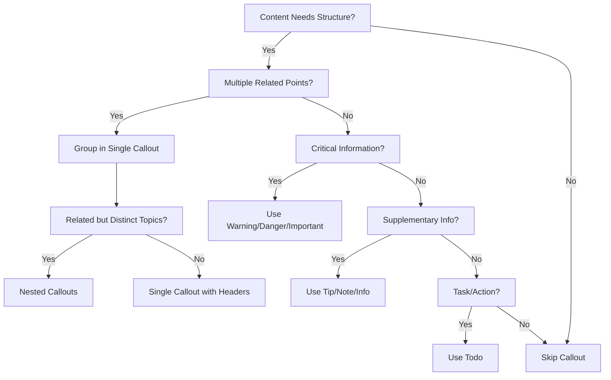

# Extraction Report: Reference Comprehensive Callout Techniques 2025120218

> [!info] Auto-Generated Report
> This report was automatically generated by `pkb_extractor.py` on 2026-03-13 04:18.
> **Source**: `reference-comprehensive-callout-techniques-2025120218.md` | **Items Extracted**: 464

---

## 📋 Document Overview

| Field | Value |
|-------|-------|
| **Source File** | `reference-comprehensive-callout-techniques-2025120218.md` |
| **Extraction Date** | 2026-03-13 04:18 |
| **Word Count** | 7,396 |
| **Character Count** | 52,854 |
| **Line Count** | 1,680 |
| **Total Items Extracted** | 464 |

### Document Outline

- # Callout Techniques
  - ## 📊 Note Metadata Dashboard
    - ### Related Notes
    - ### Sources & References
    - ### Backlinks & Connections
    - ### 2025-12-02 - Initial Creation
    - ### Tags & Classification
    - ### Review System
      - #### Review Checklist:
    - ### Claude Thinking
  - ## 📑 Table of Contents
  - ## 1. ⚙️ Foundational Callout Syntax & Core Types
    - ### Basic Callout Structure
    - ### Title Manipulation Techniques
    - ### Foldable/Collapsible Callouts
    - ### Standard Callout Type Taxonomy
  - ## 2. 🏗️ Callout Nesting Architecture
    - ### Single-Level Nesting
    - ### Multi-Level Deep Nesting
    - ### Multiple Callouts Within Parent Callout
    - ### Complex Nesting Patterns
  - ## 3. 📝 Markdown Integration Techniques
    - ### Text Formatting Within Callouts
    - ### Lists Inside Callouts
    - ### Code Blocks in Callouts
    - ### Headers Inside Callouts
    - ### Horizontal Rules in Callouts
    - ### Tables in Callouts
    - ### Links and Embeds in Callouts
    - ### Blockquotes Inside Callouts
  - ## 4. 🔌 Plugin-Specific Callout Integrations
    - ### Dataview Plugin Integration
      - #### Standard Dataview Queries in Callouts
      - #### DataviewJS in Callouts
      - #### Generating Callouts FROM Dataview
      - #### Callout Block References with Dataview
    - ### Tasks Plugin Integration
    - ### Templater Plugin Integration
    - ### Meta Bind Plugin Integration
  - ## 5. 🎨 Advanced CSS Customization
    - ### Creating Custom Callout Types
    - ### Icon Customization
    - ### Color Scheme Customization
    - ### Metadata-Based Customization
    - ### Title-Only and Content-Only Styles
    - ### Multi-Column Callout Layouts
    - ### Scrollable Callout Content
    - ### Hover Effects and Transitions
    - ### Neutral/Unstyled Callout
  - ## 6. 💡 Best Practices & Design Patterns
    - ### Semantic Type Selection
    - ### Nesting Depth Limitations
    - ### Foldable Callout Strategy
  - ## Daily Dashboard
    - ### Performance Considerations
    - ### Callout Content Guidelines
    - ### Accessibility and Theme Compatibility
  - ## 7. 📋 Complete Syntax Reference
    - ### Basic Callout Syntax Patterns
    - ### Nesting Syntax Patterns
    - ### Markdown Element Syntax
    - ### Plugin Integration Syntax
    - ### CSS Customization Syntax
  - ## 8. 🔧 Troubleshooting & Limitations
    - ### Common Syntax Errors
    - ### Known Limitations
    - ### Performance Troubleshooting
    - ### Plugin Compatibility Issues
  - ## 🎯 Synthesis & Mastery
    - ### Cognitive Models for Callout Mastery
    - ### Comparative Methodology Analysis
    - ### Decision Framework: When to Use Callouts
  - ## 📊 Metadata & Attribution
  - ## 🔄 Version History
- # 🔗 Related Topics for PKB Expansion

---

## 📊 Extraction Summary

| Item Type | Count |
|-----------|-------|
| Callouts | 109 |
| Code Blocks | 80 |
| Color Spans | 0 |
| Definitions | 0 |
| Embeds | 6 |
| External Links | 5 |
| Footnotes | 0 |
| Headings | 75 |
| Inline Fields | 1 |
| Mermaid Diagrams | 1 |
| Tables | 2 |
| Tags | 12 |
| Wiki Links | 40 |
| **TOTAL** | **464** |

---

## 🔔 Callouts (109)

> [!note] What are Callouts?
> Callouts are `> [!TYPE]` blocks used in Obsidian for structured annotation.
> They carry semantic meaning — definitions, insights, warnings, etc.

### By Type

| Callout Type | Count |
|-------------|-------|
| `[!abstract]` | 7 |
| `[!analogy]` | 1 |
| `[!attention]` | 1 |
| `[!calendar]` | 1 |
| `[!comprehensive-reference]` | 1 |
| `[!definition]` | 6 |
| `[!example]` | 9 |
| `[!fail]` | 1 |
| `[!faq]` | 1 |
| `[!goal]` | 1 |
| `[!helpful-tip]` | 3 |
| `[!how-to-use-this]` | 1 |
| `[!important]` | 3 |
| `[!info]` | 18 |
| `[!info|blue]` | 1 |
| `[!info|red]` | 1 |
| `[!key-claim]` | 3 |
| `[!level1]` | 1 |
| `[!metadata]` | 1 |
| `[!methodology-and-sources]` | 1 |
| `[!multi-column]` | 1 |
| `[!network]` | 1 |
| `[!neutral]` | 1 |
| `[!note]` | 9 |
| `[!note|metadata-value]` | 1 |
| `[!overview]` | 1 |
| `[!parent]` | 4 |
| `[!question]` | 2 |
| `[!quote]` | 2 |
| `[!research]` | 1 |
| `[!scroll]` | 1 |
| `[!the-philosophy]` | 1 |
| `[!tip]` | 2 |
| `[!todo]` | 4 |
| `[!type]` | 6 |
| `[!type-identifier]` | 1 |
| `[!warning]` | 9 |

### Full Callout List

#### 1. [OVERVIEW] Untitled *(Line 39)*

> [!overview] Untitled
> - **Title**:: [[Callout Techniques]]
> - **Prompt/Topic Used**:: 
> - **Status**:: 🌱 `= this.maturity` | Confidence: `= this.confidence`

#### 2. [FAIL] 🛠️ Metadata Health Check *(Line 45)*

> [!fail] 🛠️ Metadata Health Check
> **Missing Fields**:: `$= const fields = ["status", "type", "tags"]; const missing = fields.filter(f => !dv.current()[f]); missing.length > 0 ? "⚠️ Missing: " + missing.join(", ") : "✅ All Systems Go"`

#### 3. [METADATA] Untitled *(Line 48)*

> [!metadata] Untitled
> **Note-Type**: `= this.type`
> **Development Status**: `= this.maturity`  
> **Epistemic Confidence**: `= this.confidence`  
> **Next Review**: `= this.next-review`  
> **Review Count**: `= this.review-count`  
> **Created**: `= this.created`  
> **Last Modified**: `= this.modified`

#### 4. [QUOTE] 📝 Content Metrics *(Line 57)*

> [!quote] 📝 Content Metrics
> **Word Count**:: `= this.file.size` B | **Est. Read Time**:: `= round(this.file.size / 1300) + " min"`
> **Depth Class**:: `= choice(this.file.size < 500, "🌱 Stub", choice(this.file.size < 2000, "📄 Note", "📜 Essay"))`

#### 5. [CALENDAR] 🕰️ Temporal Context *(Line 61)*

> [!calendar] 🕰️ Temporal Context
> **Created**:: `= this.file.ctime` | **Age**:: `= (date(today) - this.file.ctime).days + " days"`
> **Last Touch**:: `= this.file.mtime` | **Staleness**:: `= choice((date(today) - this.file.mtime).days > 180, "🕸️ Cobwebs", choice((date(today) - this.file.mtime).days > 30, "🍂 Cold", "🔥 Fresh"))`

#### 6. [NETWORK] 🔗 Network Connectivity *(Line 65)*

> [!network] 🔗 Network Connectivity
> **In-Links**:: `= length(this.file.inlinks)` | **Out-Links**:: `= length(this.file.outlinks)`
> **Network Status**:: `= choice(length(this.file.inlinks) = 0, "🕸️ Orphan", choice(length(this.file.inlinks) > 5, "⚡ Hub", "🌱 Node"))`

#### 7. [IMPORTANT] Review Schedule *(Line 145)*

> [!important] Review Schedule
> - **Next Review**: `= this.next-review`
> - **Review Frequency**: Based on maturity level
>   - Seedling: Weekly
>   - Budding: Bi-weekly
>   - Developing: Monthly
>   - Evergreen: Quarterly

#### 8. [COMPREHENSIVE-REFERENCE] 📚 Comprehensive Reference *(Line 278)*

> [!comprehensive-reference] 📚 Comprehensive Reference
> - **Generated**:: 2024-12-02
> - **Version**:: 1.0
> - **Type**:: Reference Documentation

#### 9. [ABSTRACT] Untitled *(Line 283)*

> [!abstract] Untitled
> **Executive Overview**
> This comprehensive reference documents every possible technique for modifying, customizing, and extending [[Callout Syntax]] in [[Obsidian]] using [[Markdown]], [[CSS]], and plugin integrations. From basic syntax to advanced multi-level nesting, custom styling, and [[Plugin Integration]], this guide covers all documented and discoverable callout manipulation methods.

#### 10. [HOW-TO-USE-THIS] Untitled *(Line 287)*

> [!how-to-use-this] Untitled
> **Navigation Guide**
> This reference is organized into 8 major sections covering foundational syntax, nesting architecture, Markdown integration, plugin compatibility, CSS customization, best practices, syntax patterns, and troubleshooting. Use callout folding (`+`/`-` indicators) to manage document length, and leverage [[Wiki Links]] to explore related concepts.

#### 11. [DEFINITION] Untitled *(Line 306)*

> [!definition] Untitled
> - **Callout**:: A specially styled [[Blockquote]] element in [[Obsidian]] featuring customizable icons, colors, and collapsible behavior
> - **Type Identifier**:: The lowercase string following `[!` that determines callout appearance and semantic meaning
> - **Callout Metadata**:: Optional parameters following the type identifier using pipe (`|`) syntax for customization

#### 12. [TYPE-IDENTIFIER] Optional Custom Title *(Line 316)*

> [!type-identifier] Optional Custom Title
> Content line 1
> Content line 2
> More content...

#### 13. [EXAMPLE] Untitled *(Line 328)*

> [!example] Untitled
> **Basic Info Callout**
> ```markdown
> > [!info] This is the title
> > This is the content of the callout.
> > It supports **Markdown** formatting.
> ```
> 
> **Rendered Result:**
> A blue-tinted box with an information icon and the custom title "This is the title"

#### 14. [TIP] Custom Helpful Advice *(Line 345)*

> [!tip] Custom Helpful Advice
> Content here

#### 15. [WARNING] > [!question] Level 1: Root Question *(Line 351)*

> [!warning] > [!question] Level 1: Root Question
> > Root level content
> > 
> > > [!todo] Level 2: First Nested Task
> > > Second level content
> > > 
> > > > [!example] Level 3: Deeply Nested Example
> > > > Third level content demonstrating deep nesting capabilityCritical: System Update Required

#### 16. [NOTE] Untitled *(Line 363)*

> [!note] Untitled
> Content without any title line

#### 17. [KEY-CLAIM] Untitled *(Line 367)*

> [!key-claim] Untitled
> **Title Behavior Principle**
> If no text follows the type identifier, Obsidian displays the type identifier itself as the title in title case (e.g., `[!info]` becomes "Info"). Empty space after the identifier suppresses title display entirely.

#### 18. [FAQ] + Expanded by Default *(Line 376)*

> [!faq] + Expanded by Default
> This callout starts open but can be collapsed by clicking the title.

#### 19. [WARNING] - Collapsed by Default *(Line 379)*

> [!warning] - Collapsed by Default
> This callout starts collapsed and must be clicked to reveal content.

#### 20. [WARNING] Untitled *(Line 389)*

> [!warning] Untitled
> **Folding Limitation**
> The fold state is not persistent across Obsidian sessions. All foldable callouts reset to their default state (+ or -) when reopening a note or restarting Obsidian.

#### 21. [HELPFUL-TIP] Untitled *(Line 413)*

> [!helpful-tip] Untitled
> **Type Alias Strategy**
> All callout type aliases are functionally identical to their primary type. Use aliases for semantic clarity in your notes (e.g., `[!tldr]` instead of `[!abstract]` for readability), but maintain consistency within individual projects.

#### 22. [DEFINITION] Untitled *(Line 421)*

> [!definition] Untitled
> - **Nesting**:: The practice of embedding callouts within other callouts by increasing blockquote depth
> - **Nesting Level**:: The hierarchical depth of callout embedding (Level 1 = parent, Level 2 = first child, etc.)
> - **Multiple Callouts Pattern**:: Placing several callouts at the same nesting level within a parent callout

#### 23. [QUESTION] Can callouts be nested? *(Line 431)*

> [!question] Can callouts be nested?
> > [!todo] Yes, they can!
> > This is a child callout inside a parent callout.

#### 24. [EXAMPLE] Untitled *(Line 443)*

> [!example] Untitled
> **Nested Note Inside Warning**
> ```markdown
> > [!warning] Primary Alert
> > This is the parent callout content explaining the warning.
> > 
> > > [!note] Additional Context
> > > This nested note provides supporting details.
> > > - Bullet points work
> > > - Multiple lines supported
> ```

#### 25. [QUESTION] Level 1: Root Question *(Line 460)*

> [!question] Level 1: Root Question
> Root level content
> 
> > [!todo] Level 2: First Nested Task
> > Second level content
> > 
> > > [!example] Level 3: Deeply Nested Example
> > > Third level content demonstrating deep nesting capability

#### 26. [WARNING] Untitled *(Line 477)*

> [!warning] Untitled
> **Deep Nesting Performance**
> While Obsidian technically supports unlimited nesting depth, excessive nesting (beyond 4-5 levels) creates visual complexity and potential rendering performance issues. Most themes optimize for 1-3 nesting levels.

#### 27. [INFO] Parent Container *(Line 486)*

> [!info] Parent Container
> Parent callout content here.
> 
> > [!success] First Child Callout
> > Success message content
> 
> > [!warning] Second Child Callout  
> > Warning message content
> 
> > [!tip] Third Child Callout
> > Helpful tip content

#### 28. [EXAMPLE] Untitled *(Line 504)*

> [!example] Untitled
> **Three Sibling Callouts in Info Parent**
> ```markdown
> > [!info] Meeting Notes
> > General meeting overview and attendees listed below.
> >
> > > [!todo] Action Items
> > > - Task 1
> > > - Task 2
> >
> > > [!question] Open Questions
> > > - Question 1
> > > - Question 2
> >
> > > [!success] Decisions Made
> > > - Decision 1
> > > - Decision 2
> ```

#### 29. [ABSTRACT] Project Overview *(Line 528)*

> [!abstract] Project Overview
> High-level project summary
> 
> > [!tip] Phase 1 Recommendations
> > Phase 1 guidance
> > 
> > > [!example] Use Case A
> > > Detailed example for phase 1
> > 
> > > [!example] Use Case B
> > > Another example
> 
> > [!warning] Phase 2 Cautions
> > Phase 2 warnings
> > 
> > > [!danger] Critical Blocker
> > > Serious issue requiring attention

#### 30. [KEY-CLAIM] Untitled *(Line 552)*

> [!key-claim] Untitled
> **Nesting Organizational Principle**
> Callout nesting excels at representing hierarchical relationships (parent-child dependencies) and categorical groupings (sibling alternatives). Use nesting depth to indicate information hierarchy, not merely for visual styling.

#### 31. [DEFINITION] Untitled *(Line 560)*

> [!definition] Untitled
> - **Markdown Feature Compatibility**:: The extent to which standard Markdown syntax renders correctly within callout bodies
> - **Line Prefix Requirement**:: The mandate that every line within a callout must start with the appropriate `>` character(s)
> - **Inline Formatting**:: Text-level Markdown (bold, italic, code) that works within callout content

#### 32. [INFO] Formatted Text Examples *(Line 570)*

> [!info] Formatted Text Examples
> **Bold text** for emphasis
> *Italic text* for subtle stress
> ***Bold and italic*** for maximum emphasis
> ==Highlighted text== (if theme supports)
> ~~Strikethrough text~~ for deletions
> `inline code` for technical terms

#### 33. [NOTE] Shopping List *(Line 590)*

> [!note] Shopping List
> - Milk
> - Bread
> - Eggs
>   - Brown eggs
>   - White eggs

#### 34. [INFO] Installation Steps *(Line 600)*

> [!info] Installation Steps
> 1. Download installer
> 2. Run setup wizard
> 3. Configure preferences
> 4. Restart application

#### 35. [TODO] Project Tasks *(Line 609)*

> [!todo] Project Tasks
> - [x] Complete research phase
> - [x] Draft initial outline
> - [ ] Write first section
> - [ ] Review and edit

#### 36. [IMPORTANT] Untitled *(Line 616)*

> [!important] Untitled
> **List Indentation Rule**
> Nested list items (sub-bullets) require both the callout prefix (`>`) AND proper Markdown indentation (2-4 spaces). Missing either breaks list structure.

#### 37. [TIP] Quick Command *(Line 626)*

> [!tip] Quick Command
> Use `npm install` to install dependencies.

#### 38. [EXAMPLE] Python Function *(Line 632)*

> [!example] Python Function
> Here's a sample function:
> 
> ```python
> def calculate_sum(a, b):
>     return a + b
> 
> result = calculate_sum(5, 3)
> print(result)
> ```

#### 39. [WARNING] Untitled *(Line 650)*

> [!warning] Untitled
> **Code Block Formatting Challenge**
> Writing code blocks in callouts is tedious because every line requires manual `>` prefixing. This is a known limitation of the blockquote-based callout implementation. Consider using code block plugins that auto-prefix or moving extensive code outside callouts.

#### 40. [ABSTRACT] Document Structure *(Line 659)*

> [!abstract] Document Structure
> ### Primary Section
> Content for primary section
> 
> #### Subsection A
> Subsection details
> 
> #### Subsection B
> More subsection details

#### 41. [INFO] Sectioned Content *(Line 679)*

> [!info] Sectioned Content
> First section content here
> 
> ---
> 
> Second section content here
> 
> ---
> 
> Third section content here

#### 42. [EXAMPLE] Comparison Table *(Line 702)*

> [!example] Comparison Table
> | Feature | Option A | Option B |
> |---------|----------|----------|
> | Speed   | Fast     | Slow     |
> | Cost    | High     | Low      |
> | Quality | Premium  | Standard |

#### 43. [NOTE] Cross-References *(Line 722)*

> [!note] Cross-References
> See [[Related Note]] for more details.
> Also check [[Another Note#Specific Section]].

#### 44. [INFO] Resources *(Line 729)*

> [!info] Resources
> Visit [Obsidian Help](https://help.obsidian.md) for documentation.

#### 45. [EXAMPLE] Visual Reference *(Line 735)*

> [!example] Visual Reference
> ![[diagram.png]]
> 
> External image:
> 

#### 46. [ABSTRACT] Referenced Content *(Line 744)*

> [!abstract] Referenced Content
> ![[Other Note]]
> 
> Specific section:
> ![[Note#Section Name]]
> 
> Block reference:
> ![[Note^block-id]]

#### 47. [QUOTE] Meta-Quote Structure *(Line 759)*

> [!quote] Meta-Quote Structure
> This is the callout content introducing the quote.
> 
> > This is a blockquote nested inside the callout.
> > It has a different visual appearance from the callout itself.

#### 48. [DEFINITION] Untitled *(Line 774)*

> [!definition] Untitled
> - **Plugin Compatibility**:: The ability of Obsidian community plugins to function correctly within callout environments
> - **Query Syntax**:: Special code block languages (e.g., `dataview`, `dataviewjs`) that execute dynamic queries
> - **Rendering Context**:: The execution environment plugins receive when embedded in callouts versus standard note body

#### 49. [INFO] Task Overview *(Line 788)*

> [!info] Task Overview
> ```dataview
> TASK
> WHERE !completed
> SORT due ASC
> LIMIT 10
> ```

#### 50. [EXAMPLE] Dynamic Task Count *(Line 809)*

> [!example] Dynamic Task Count
> ```dataviewjs
> const tasks = dv.pages()
>   .file.tasks
>   .where(t => !t.completed);
> 
> dv.paragraph(`You have ${tasks.length} incomplete tasks.`);
> ```

#### 51. [WARNING] Untitled *(Line 820)*

> [!warning] Untitled
> **DataviewJS Callout Bug History**
> Dataview versions around v0.5.56 exhibited bugs where DataviewJS blocks returned empty lines in callouts while standard Dataview queries worked normally. Ensure you're using updated Dataview versions (v0.5.60+) for reliable DataviewJS callout support.

#### 52. [INFO] Important Info *(Line 851)*

> [!info] Important Info
> This callout has a block reference

#### 53. [TODO] Project Tasks *(Line 872)*

> [!todo] Project Tasks
> - [ ] Draft proposal 📅 2024-12-15
> - [x] Research competitors ✅ 2024-12-01
> - [ ] Schedule review meeting 🔁 every week
> - [ ] Finalize budget 🆔 PROJ-123

#### 54. [ABSTRACT] Today's Tasks *(Line 888)*

> [!abstract] Today's Tasks
> ```tasks
> not done
> due before tomorrow
> sort by priority
> ```

#### 55. [HELPFUL-TIP] Untitled *(Line 897)*

> [!helpful-tip] Untitled
> **Tasks Plugin Callout Strategy**
> Many users wrap Tasks plugin queries in collapsible callouts to create task dashboards that prevent overwhelming visual clutter while maintaining quick access to full task lists.

#### 56. [INFO] Document Metadata *(Line 906)*

> [!info] Document Metadata
> - Created: <% tp.file.creation_date() %>
> - Modified: <% tp.file.last_modified_date() %>
> - Author: <% tp.user.name %>

#### 57. [INFO] Task Tracker *(Line 923)*

> [!info] Task Tracker
> Progress: `INPUT[slider(0,100,1):progress]`
> Status: `VIEW[{progress}]%`

#### 58. [DEFINITION] Untitled *(Line 937)*

> [!definition] Untitled
> - **CSS Snippet**:: A custom stylesheet file placed in `.obsidian/snippets/` that modifies Obsidian's appearance
> - **Callout Data Attribute**:: The `data-callout` HTML attribute containing the callout type identifier, used as CSS selector target
> - **CSS Variable**:: Theme-level color/style variables (e.g., `--callout-color`) that control callout appearance

#### 59. [GOAL] Quarterly Objective *(Line 971)*

> [!goal] Quarterly Objective
> Increase user engagement by 25%

#### 60. [RESEARCH] Study Findings *(Line 974)*

> [!research] Study Findings
> Analysis of user behavior patterns

#### 61. [WARNING] Untitled *(Line 998)*

> [!warning] Untitled
> **Lucide Version Compatibility**
> Obsidian updates Lucide icons periodically (currently version 0.446.0), and icon availability depends on the included version. Using icons from future Lucide versions will fail. Always verify icon existence at [lucide.dev](https://lucide.dev) and check the version compatibility.

#### 62. [NOTE|METADATA-VALUE] Custom Styled Note *(Line 1034)*

> [!note|metadata-value] Custom Styled Note
> Content here

#### 63. [INFO|BLUE] Blue Variant *(Line 1066)*

> [!info|blue] Blue Variant
> This info callout has blue styling

#### 64. [INFO|RED] Red Variant *(Line 1069)*

> [!info|red] Red Variant
> Same type, different color via metadata

#### 65. [MULTI-COLUMN] Untitled *(Line 1114)*

> [!multi-column] Untitled
> > [!note] Column 1
> > Content for first column
> 
> > [!tip] Column 2
> > Content for second column
> 
> > [!info] Column 3
> > Content for third column

#### 66. [SCROLL] Long Content *(Line 1152)*

> [!scroll] Long Content
> [Extensive content that exceeds 300px height will scroll]

#### 67. [NEUTRAL] Untitled *(Line 1197)*

> [!neutral] Untitled
> This content looks like regular text but is in a referenceable callout block.
> You can link to this with a block ID.

#### 68. [DEFINITION] Untitled *(Line 1207)*

> [!definition] Untitled
> - **Callout Anti-Pattern**:: Usage practices that create maintenance problems, readability issues, or performance degradation
> - **Semantic Callout Use**:: Choosing callout types based on information meaning rather than purely visual preference
> - **Information Architecture**:: The structural organization of content within and across callouts

#### 69. [KEY-CLAIM] Untitled *(Line 1214)*

> [!key-claim] Untitled
> **Semantic Coherence Principle**
> Callout types should reflect content meaning, not arbitrary aesthetic preference. Consistent semantic usage creates predictable visual language across your vault.

#### 70. [WARNING] Untitled *(Line 1233)*

> [!warning] Untitled
> **Excessive Nesting Anti-Pattern**
> Nesting beyond 3-4 levels creates cognitive load, visual complexity, and potential rendering issues. If structure requires deeper nesting, consider restructuring with headers or separate notes.

#### 71. [HELPFUL-TIP] Untitled *(Line 1250)*

> [!helpful-tip] Untitled
> **Default Fold State Decision Framework**
> - Use `+` (expanded) for: Critical information users should see immediately
> - Use `-` (collapsed) for: Supplementary details, extensive lists, optional context
> - Use static (no fold) for: Brief, essential content that doesn't justify folding

#### 72. [TODO] - Today's Tasks (Click to expand) *(Line 1262)*

> [!todo] - Today's Tasks (Click to expand)
> ```tasks
> not done
> due today
> ```

#### 73. [ABSTRACT] - Meeting Notes (Click to expand) *(Line 1268)*

> [!abstract] - Meeting Notes (Click to expand)
> ```dataview
> LIST
> FROM "Meetings"
> WHERE date = date(today)
> ```

#### 74. [ATTENTION] Untitled *(Line 1278)*

> [!attention] Untitled
> **Rendering Performance Factors**
> - **Nested callouts**: Each nesting level adds DOM depth; 5+ levels may lag
> - **Large code blocks in callouts**: Syntax highlighting inside callouts is computationally expensive
> - **Dataview queries in callouts**: Dynamic query execution adds rendering overhead
> - **Multiple callouts per note**: 50+ callouts in a single note may slow scrolling

#### 75. [NOTE] Point 1 *(Line 1301)*

> [!note] Point 1
> First point

#### 76. [NOTE] Point 2 *(Line 1304)*

> [!note] Point 2
> Second point

#### 77. [NOTE] Point 3 *(Line 1307)*

> [!note] Point 3
> Third point

#### 78. [NOTE] Key Concepts *(Line 1314)*

> [!note] Key Concepts
> **Point 1**: First point explanation
> 
> **Point 2**: Second point explanation
> 
> **Point 3**: Third point explanation

#### 79. [IMPORTANT] Untitled *(Line 1324)*

> [!important] Untitled
> **Theme-Agnostic Callout Design**
> When creating custom callouts via CSS, test across multiple themes (light/dark modes) to ensure readability. Color choices that work in dark mode may fail in light mode.

#### 80. [TYPE] Custom Title *(Line 1341)*

> [!type] Custom Title
> Content

#### 81. [TYPE] + Custom Title *(Line 1345)*

> [!type] + Custom Title
> Content

#### 82. [TYPE] - Custom Title *(Line 1349)*

> [!type] - Custom Title
> Content

#### 83. [TYPE] Custom Title *(Line 1353)*

> [!type] Custom Title

#### 84. [TYPE] Untitled *(Line 1356)*

> [!type] Untitled
> Content (title will be "Type")

#### 85. [TYPE] Untitled *(Line 1360)*

> [!type] Untitled
> Content (blank line after type)

#### 86. [PARENT] Untitled *(Line 1368)*

> [!parent] Untitled
> Parent content
> 
> > [!child]
> > Child content

#### 87. [LEVEL1] Untitled *(Line 1375)*

> [!level1] Untitled
> > [!level2]
> > 
> > > [!level3]

#### 88. [PARENT] Untitled *(Line 1382)*

> [!parent] Untitled
> > [!child1]
> > Content 1
> 
> > [!child2]
> > Content 2
> 
> > [!child3]
> > Content 3

#### 89. [INFO] Untitled *(Line 1398)*

> [!info] Untitled
> **Bold** *Italic* `code` ==highlight== ~~strike~~

#### 90. [NOTE] Untitled *(Line 1402)*

> [!note] Untitled
> - Unordered
> - List items
> 
> 1. Ordered
> 2. List items
> 
> - [ ] Task list
> - [x] Completed task

#### 91. [EXAMPLE] Untitled *(Line 1413)*

> [!example] Untitled
> ```python
> def function():
>     return True
> ```

#### 92. [INFO] Untitled *(Line 1421)*

> [!info] Untitled
> | Col1 | Col2 |
> |------|------|
> | A    | B    |

#### 93. [NOTE] Untitled *(Line 1428)*

> [!note] Untitled
> [[Internal Link]]
> [External](https://example.com)
> ![[Embedded Note]]
> ![[Image.png]]

#### 94. [ABSTRACT] Untitled *(Line 1435)*

> [!abstract] Untitled
> ### Section Header
> Content
> 
> #### Subsection
> More content

#### 95. [INFO] Untitled *(Line 1443)*

> [!info] Untitled
> Section 1
> 
> ---
> 
> Section 2

#### 96. [INFO] Untitled *(Line 1455)*

> [!info] Untitled
> ```dataview
> LIST
> WHERE tag = #example
> ```

#### 97. [EXAMPLE] Untitled *(Line 1463)*

> [!example] Untitled
> ```dataviewjs
> dv.paragraph("Dynamic content");
> ```

#### 98. [TODO] Untitled *(Line 1470)*

> [!todo] Untitled
> - [ ] Task 📅 2024-12-15
> 
> ```tasks
> not done
> due before tomorrow
> ```

#### 99. [INFO] Untitled *(Line 1479)*

> [!info] Untitled
> Created: <% tp.file.creation_date() %>

#### 100. [WARNING] Untitled *(Line 1515)*

> [!warning] Untitled
> **Frequent Callout Mistakes**

#### 101. [INFO] Title *(Line 1521)*

> [!info] Title

#### 102. [INFO] Title *(Line 1526)*

> [!info] Title
> Content with prefix
> More content

#### 103. [PARENT] Untitled *(Line 1534)*

> [!parent] Untitled
> > [!child1]
> > > [!child2]  <!-- Should be >> not >>> -->

#### 104. [PARENT] Untitled *(Line 1539)*

> [!parent] Untitled
> > [!child1]
> > [!child2]

#### 105. [INFO] Untitled *(Line 1547)*

> [!info] Untitled
> > This is a blockquote, not a nested callout

#### 106. [INFO] Untitled *(Line 1551)*

> [!info] Untitled
> > [!note]
> > This is a nested callout

#### 107. [THE-PHILOSOPHY] Untitled *(Line 1615)*

> [!the-philosophy] Untitled
> **Underlying Philosophy of Callout Design**
> Callouts represent a compromise between Markdown's simplicity and modern interface affordances. By extending blockquote syntax rather than inventing new Markdown, Obsidian maintains compatibility with standard Markdown while enabling rich information architecture. The prefix-on-every-line requirement reflects this tension: it preserves blockquote semantics but creates friction for complex content.

#### 108. [ANALOGY] Untitled *(Line 1630)*

> [!analogy] Untitled
> **Illuminating Comparison**
> Callouts are to Markdown what LEGO bricks are to basic building blocks. While you can create structures with plain blocks (standard Markdown), LEGO bricks (callouts) provide specialized shapes, colors, and connection mechanisms that enable more sophisticated, purposeful constructions without abandoning the fundamental building principle.

#### 109. [METHODOLOGY-AND-SOURCES] Untitled *(Line 1668)*

> [!methodology-and-sources] Untitled
> **Research Methodology**
> - **Primary Sources**: 
>   - Official Obsidian Help Documentation (help.obsidian.md)
>   - Obsidian GitHub Repository (obsidian-help)
>   - Obsidian Community Forum discussions
> - **Research Queries Executed**:
>   1. "Obsidian callouts documentation syntax"
>   2. "Obsidian nested callouts multiple levels"
>   3. "Obsidian callouts dataview queries code blocks"
>   4. "Obsidian callouts custom CSS styling modifications"
> - **Synthesis Approach**: Systematic extraction of syntax patterns, limitations, and community-discovered techniques from official documentation, forum discussions, and CSS snippet repositories
> - **Confidence Level**: 
>   - **High**: Basic syntax, nesting mechanics, standard types (official documentation)
>   - **High**: CSS customization fundamentals (official docs + community examples)
>   - **Medium**: Plugin integration specifics (documented issues and workarounds)
>   - **Medium**: Advanced CSS patterns (community-derived techniques)

---

## 🔗 Wiki-Links (40 total, 32 unique targets)

> [!info] Knowledge Graph Connections
> These links represent connections to other notes in your PKB.
> **32** distinct notes are referenced.

### Unique Targets

- [[Another Note]]
- [[Blockquote]]
- [[CSS]]
- [[CSS Customization]]
- [[Callout Syntax]]
- [[Callout Techniques]]
- [[Code Blocks]]
- [[Dataview Plugin]]
- [[Dataview Query Language Reference]]
- [[Frontmatter]]
- [[Information Architecture]]
- [[Information Architecture in Personal Knowledge Management]]
- [[Inline Formatting]]
- [[Internal Link]]
- [[Knowledge Graph]]
- [[Markdown]]
- [[Markdown Extended Syntax Ecosystem]]
- [[Markdown Tables]]
- [[Meta Bind Plugin]]
- [[Nested Structures]]
- [[Note]]
- [[Note-Taking Best Practices]]
- [[Note^callout-id]]
- [[Obsidian]]
- [[Obsidian CSS Snippets Architecture]]
- [[Outline Pane]]
- [[Plugin Integration]]
- [[Related Note]]
- [[Tasks Plugin]]
- [[Templater Plugin]]
- [[Wiki Links]]
- [[YAML]]

### All Occurrences

| # | Target | Display Text | Heading | Section | Line |
|---|--------|-------------|---------|---------|------|
| 1 | [[Callout Techniques]] | — | — | Callout Techniques | 40 |
| 2 | [[Obsidian]] | — | — | Claude Thinking | 225 |
| 3 | [[Markdown]] | — | — | Claude Thinking | 226 |
| 4 | [[Callout Syntax]] | — | — | Claude Thinking | 227 |
| 5 | [[Dataview Plugin]] | — | — | Claude Thinking | 228 |
| 6 | [[Tasks Plugin]] | — | — | Claude Thinking | 229 |
| 7 | [[Templater Plugin]] | — | — | Claude Thinking | 230 |
| 8 | [[CSS Customization]] | — | — | Claude Thinking | 231 |
| 9 | [[Nested Structures]] | — | — | Claude Thinking | 232 |
| 10 | [[Code Blocks]] | — | — | Claude Thinking | 233 |
| 11 | [[Wiki Links]] | — | — | Claude Thinking | 234 |
| 12 | [[Frontmatter]] | — | — | Claude Thinking | 235 |
| 13 | [[YAML]] | — | — | Claude Thinking | 236 |
| 14 | [[Knowledge Graph]] | — | — | Claude Thinking | 237 |
| 15 | [[Note-Taking Best Practices]] | — | — | Claude Thinking | 238 |
| 16 | [[Information Architecture]] | — | — | Claude Thinking | 239 |
| 17 | [[Callout Syntax]] | — | — | Claude Thinking | 285 |
| 18 | [[Obsidian]] | — | — | Claude Thinking | 285 |
| 19 | [[Markdown]] | — | — | Claude Thinking | 285 |
| 20 | [[CSS]] | — | — | Claude Thinking | 285 |
| 21 | [[Plugin Integration]] | — | — | Claude Thinking | 285 |
| 22 | [[Wiki Links]] | — | — | Claude Thinking | 289 |
| 23 | [[Blockquote]] | — | — | 1. ⚙️ Foundational Callout Syntax & C... | 307 |
| 24 | [[Obsidian]] | — | — | 1. ⚙️ Foundational Callout Syntax & C... | 307 |
| 25 | [[Inline Formatting]] | — | — | Text Formatting Within Callouts | 567 |
| 26 | [[Outline Pane]] | — | — | Headers Inside Callouts | 673 |
| 27 | [[Note]] | — | Header | Headers Inside Callouts | 674 |
| 28 | [[Markdown Tables]] | — | — | Tables in Callouts | 699 |
| 29 | [[Related Note]] | — | — | Links and Embeds in Callouts | 723 |
| 30 | [[Another Note]] | — | Specific Section | Links and Embeds in Callouts | 724 |
| 31 | [[Dataview Plugin]] | — | — | Dataview Plugin Integration | 781 |
| 32 | [[Note^callout-id]] | — | — | Callout Block References with Dataview | 863 |
| 33 | [[Tasks Plugin]] | — | — | Tasks Plugin Integration | 869 |
| 34 | [[Templater Plugin]] | — | — | Templater Plugin Integration | 903 |
| 35 | [[Meta Bind Plugin]] | — | — | Meta Bind Plugin Integration | 920 |
| 36 | [[Internal Link]] | — | — | Markdown Element Syntax | 1429 |
| 37 | [[Obsidian CSS Snippets Architecture]] | — | — | 🔗 Related Topics for PKB Expansion | 1696 |
| 38 | [[Dataview Query Language Reference]] | — | — | 🔗 Related Topics for PKB Expansion | 1701 |
| 39 | [[Information Architecture in Personal Knowledge Management]] | — | — | 🔗 Related Topics for PKB Expansion | 1706 |
| 40 | [[Markdown Extended Syntax Ecosystem]] | — | — | 🔗 Related Topics for PKB Expansion | 1711 |

---

## 🏷️ Inline Fields (1)

> [!tip] Dataview Fields
> These `[FieldName:: Value]` pairs are queryable by Dataview.

| # | Field Name | Value | Format | Line |
|---|-----------|-------|--------|------|
| 1 | **!` that determines callout appearance and semantic meaning
> - Callout Metadata** | Optional parameters following the type identifier using pipe (`|`) syntax for... | bracket | 308 |

---

## 🏷️ Tags (12 occurrences, 7 unique)

### All Unique Tags

`#Header`, `#advanced-techniques`, `#callouts`, `#markdown`, `#obsidian`, `#reference-note`, `#syntax-guide`

---

## 💻 Code Blocks (80)

| Language | Count |
|----------|-------|
| `plaintext` | 38 |
| `markdown` | 29 |
| `dataview` | 5 |
| `dataviewjs` | 4 |
| `tasks` | 2 |
| `javascript` | 1 |
| `python` | 1 |

### Code Block 1 — `dataviewjs` *(Lines 69-106)*

```dataviewjs
// 🧠 SYSTEM: Semantic Bridge Engine
// PURPOSE: Find "Sibling" notes that share the same Outlinks (Contexts)
const current = dv.current();
const myOutlinks = current.file.outlinks.map(l => l.path);

// 1. Filter the Vault
const siblings = dv.pages()
    .where(p => p.file.path !== current.file.path) // Exclude self
    .where(p => !current.file.outlinks.map(l => l.path).includes(p.file.path)) // Exclude existing direct links
    .map(p => {
        // Find overlap between this page's links and the current page's links
        const shared = p.file.outlinks.filter(l => myOutlinks.includes(l.path));
        return { 
            link: p.file.link, 
            sharedCount: shared.length, 
            sharedLinks: shared 
        };
    })
    .where(p => p.sharedCount > 0) // Must share at least 1 connection
    .sort(p => p.sharedCount, "desc") // Sort by strongest connection
    .limit(5); // Only show top 5

// 2. Render the Bridge
if (siblings.length > 0) {
    dv.header(4, "🌉 Semantic Bridges (Missing Connections)");
    dv.table(
        ["Sibling Note", "Strength", "Shared Context"], 
        siblings.map(s => [
            s.link, 
            "🔗 " + s.sharedCount, 
# ... (6 more lines truncated)
```

### Code Block 2 — `dataview` *(Lines 108-114)*

```dataview
TABLE type, maturity, confidence
FROM  ""
WHERE  type = "reference"
SORT "maturity" DESC
LIMIT 15
```

### Code Block 3 — `dataview` *(Lines 116-123)*

```dataview
TABLE 
    source AS "Source Type",
    created AS "Date Added"
FROM [[]]
WHERE "claude-sonnet-4.5"
SORT created DESC
```

### Code Block 4 — `dataview` *(Lines 125-133)*

```dataview
TABLE 
    type AS "Type",
    maturity AS "Maturity",
    created AS "Created"
FROM [[#]]
SORT created DESC
LIMIT 15
```

### Code Block 5 — `markdown` *(Lines 315-320)*

```markdown
> [!type-identifier] Optional Custom Title
> Content line 1
> Content line 2
> More content...
```

### Code Block 6 — `markdown` *(Lines 330-334)*

```markdown
> > [!info] This is the title
> > This is the content of the callout.
> > It supports **Markdown** formatting.
>
```

### Code Block 7 — `markdown` *(Lines 344-347)*

```markdown
> [!tip] Custom Helpful Advice
> Content here
```

### Code Block 8 — `markdown` *(Lines 350-359)*

```markdown
> [!warning] > [!question] Level 1: Root Question
> > Root level content
> > 
> > > [!todo] Level 2: First Nested Task
> > > Second level content
> > > 
> > > > [!example] Level 3: Deeply Nested Example
> > > > Third level content demonstrating deep nesting capabilityCritical: System Update Required
```

### Code Block 9 — `markdown` *(Lines 362-365)*

```markdown
> [!note]
> Content without any title line
```

### Code Block 10 — `markdown` *(Lines 375-381)*

```markdown
> [!faq]+ Expanded by Default
> This callout starts open but can be collapsed by clicking the title.

> [!warning]- Collapsed by Default  
> This callout starts collapsed and must be clicked to reveal content.
```

### Code Block 11 — `markdown` *(Lines 430-435)*

```markdown
> [!question] Can callouts be nested?
> 
> > [!todo] Yes, they can!
> > This is a child callout inside a parent callout.
```

### Code Block 12 — `markdown` *(Lines 445-453)*

```markdown
> > [!warning] Primary Alert
> > This is the parent callout content explaining the warning.
> > 
> > > [!note] Additional Context
> > > This nested note provides supporting details.
> > > - Bullet points work
> > > - Multiple lines supported
>
```

### Code Block 13 — `markdown` *(Lines 459-468)*

```markdown
> [!question] Level 1: Root Question
> Root level content
> 
> > [!todo] Level 2: First Nested Task
> > Second level content
> > 
> > > [!example] Level 3: Deeply Nested Example
> > > Third level content demonstrating deep nesting capability
```

### Code Block 14 — `markdown` *(Lines 485-497)*

```markdown
> [!info] Parent Container
> Parent callout content here.
> 
> > [!success] First Child Callout
> > Success message content
> 
> > [!warning] Second Child Callout  
> > Warning message content
> 
> > [!tip] Third Child Callout
> > Helpful tip content
```

### Code Block 15 — `markdown` *(Lines 506-521)*

```markdown
> > [!info] Meeting Notes
> > General meeting overview and attendees listed below.
> >
> > > [!todo] Action Items
> > > - Task 1
> > > - Task 2
> >
> > > [!question] Open Questions
> > > - Question 1
> > > - Question 2
> >
> > > [!success] Decisions Made
> > > - Decision 1
> > > - Decision 2
>
```

### Code Block 16 — `markdown` *(Lines 527-545)*

```markdown
> [!abstract] Project Overview
> High-level project summary
> 
> > [!tip] Phase 1 Recommendations
> > Phase 1 guidance
> > 
> > > [!example] Use Case A
> > > Detailed example for phase 1
> > 
> > > [!example] Use Case B
> > > Another example
> 
> > [!warning] Phase 2 Cautions
> > Phase 2 warnings
> > 
> > > [!danger] Critical Blocker
> > > Serious issue requiring attention
```

### Code Block 17 — `markdown` *(Lines 569-577)*

```markdown
> [!info] Formatted Text Examples
> **Bold text** for emphasis
> *Italic text* for subtle stress
> ***Bold and italic*** for maximum emphasis
> ==Highlighted text== (if theme supports)
> ~~Strikethrough text~~ for deletions
> `inline code` for technical terms
```

### Code Block 18 — `markdown` *(Lines 589-596)*

```markdown
> [!note] Shopping List
> - Milk
> - Bread
> - Eggs
>   - Brown eggs
>   - White eggs
```

### Code Block 19 — `markdown` *(Lines 599-605)*

```markdown
> [!info] Installation Steps
> 1. Download installer
> 2. Run setup wizard
> 3. Configure preferences
> 4. Restart application
```

### Code Block 20 — `markdown` *(Lines 608-614)*

```markdown
> [!todo] Project Tasks
> - [x] Complete research phase
> - [x] Draft initial outline
> - [ ] Write first section
> - [ ] Review and edit
```

### Code Block 21 — `markdown` *(Lines 625-628)*

```markdown
> [!tip] Quick Command
> Use `npm install` to install dependencies.
```

### Code Block 22 — `markdown` *(Lines 631-635)*

```markdown
> [!example] Python Function
> Here's a sample function:
> 
>
```

### Code Block 23 — `plaintext` *(Lines 641-645)*

```plaintext
**Important Syntax Requirements:**
1. Opening fence (`
```

### Code Block 24 — `markdown` *(Lines 658-669)*

```markdown
> [!abstract] Document Structure
> 
> ### Primary Section
> Content for primary section
> 
> #### Subsection A
> Subsection details
> 
> #### Subsection B
> More subsection details
```

### Code Block 25 — `markdown` *(Lines 678-689)*

```markdown
> [!info] Sectioned Content
> First section content here
> 
> ---
> 
> Second section content here
> 
> ---
> 
> Third section content here
```

### Code Block 26 — `markdown` *(Lines 701-709)*

```markdown
> [!example] Comparison Table
> 
> | Feature | Option A | Option B |
> |---------|----------|----------|
> | Speed   | Fast     | Slow     |
> | Cost    | High     | Low      |
> | Quality | Premium  | Standard |
```

### Code Block 27 — `markdown` *(Lines 721-725)*

```markdown
> [!note] Cross-References
> See [[Related Note]] for more details.
> Also check [[Another Note#Specific Section]].
```

### Code Block 28 — `markdown` *(Lines 728-731)*

```markdown
> [!info] Resources
> Visit [Obsidian Help](https://help.obsidian.md) for documentation.
```

### Code Block 29 — `markdown` *(Lines 734-740)*

```markdown
> [!example] Visual Reference
> ![[diagram.png]]
> 
> External image:
> 
```

### Code Block 30 — `markdown` *(Lines 743-752)*

```markdown
> [!abstract] Referenced Content
> ![[Other Note]]
> 
> Specific section:
> ![[Note#Section Name]]
> 
> Block reference:
> ![[Note^block-id]]
```

### Code Block 31 — `markdown` *(Lines 758-764)*

```markdown
> [!quote] Meta-Quote Structure
> This is the callout content introducing the quote.
> 
> > This is a blockquote nested inside the callout.
> > It has a different visual appearance from the callout itself.
```

### Code Block 32 — `markdown` *(Lines 787-790)*

```markdown
> [!info] Task Overview
> 
>
```

### Code Block 33 — `plaintext` *(Lines 795-808)*

```plaintext
**Working Query Types:**
- `LIST` queries
- `TABLE` queries
- `TASK` queries
- `CALENDAR` queries

#### DataviewJS in Callouts

DataviewJS blocks historically experienced compatibility issues in callouts, with some versions failing to render:
```

### Code Block 34 — `dataviewjs` *(Lines 811-817)*

```dataviewjs
> const tasks = dv.pages()
>   .file.tasks
>   .where(t => !t.completed);
> 
> dv.paragraph(`You have ${tasks.length} incomplete tasks.`);
>
```

### Code Block 35 — `javascript` *(Lines 828-829)*

```javascript

```

### Code Block 36 — `plaintext` *(Lines 839-850)*

```plaintext
**Limitation:**
The `-` fold modifier in programmatically generated callouts may not activate collapsible behavior correctly. This appears to be a rendering timing issue where dynamically inserted callout syntax doesn't trigger fold initialization.

#### Callout Block References with Dataview

Transclusion of callouts using block IDs in Dataview requires regex-based content extraction:

**Callout with Block ID:**
```

### Code Block 37 — `plaintext` *(Lines 854-857)*

```plaintext
**Dataview Transclusion Attempt:**
```

### Code Block 38 — `dataviewjs` *(Lines 858-864)*

```dataviewjs
const targetBlock = "^callout-id";
const page = dv.page("Note Name");
// Complex regex matching required for callout transclusion
const calloutRegex = />\s\[\!(\w+)\]\s(.+?)((\n>\s.*?)*)\n/;
// Implementation complexity high; consider direct [[Note^callout-id]] syntax
```

### Code Block 39 — `markdown` *(Lines 871-877)*

```markdown
> [!todo] Project Tasks
> - [ ] Draft proposal 📅 2024-12-15
> - [x] Research competitors ✅ 2024-12-01
> - [ ] Schedule review meeting 🔁 every week
> - [ ] Finalize budget 🆔 PROJ-123
```

### Code Block 40 — `markdown` *(Lines 887-890)*

```markdown
> [!abstract] Today's Tasks
> 
>
```

### Code Block 41 — `plaintext` *(Lines 894-905)*

```plaintext
> [!helpful-tip]
> **Tasks Plugin Callout Strategy**
> Many users wrap Tasks plugin queries in collapsible callouts to create task dashboards that prevent overwhelming visual clutter while maintaining quick access to full task lists.

### Templater Plugin Integration

[[Templater Plugin]] commands execute within callouts:
```

### Code Block 42 — `plaintext` *(Lines 910-922)*

```plaintext
**Templater Feature Compatibility:**
- Date functions: `tp.date.*`
- File functions: `tp.file.*`
- System functions: `tp.system.*`
- Custom user scripts: `tp.user.*`

### Meta Bind Plugin Integration

[[Meta Bind Plugin]] input fields and view fields work in callouts:
```

### Code Block 43 — `plaintext` *(Lines 926-947)*

```plaintext
**Meta Bind Components:**
- Input fields (text, number, slider, toggle, select)
- View fields (display values from frontmatter)
- Buttons (trigger actions)

---

## 5. 🎨 Advanced CSS Customization

> [!definition]
> - **CSS Snippet**:: A custom stylesheet file placed in `.obsidian/snippets/` that modifies Obsidian's appearance
> - **Callout Data Attribute**:: The `data-callout` HTML attribute containing the callout type identifier, used as CSS selector target
> - **CSS Variable**:: Theme-level color/style variables (e.g., `--callout-color`) that control callout appearance

### Creating Custom Callout Types

CSS snippets define custom callouts using the `.callout[data-callout="type"]` selector pattern with `--callout-color` and `--callout-icon` variables:

**Basic Custom Callout CSS:**
```

### Code Block 44 — `plaintext` *(Lines 952-955)*

```plaintext
**Complete Custom Callout Definition:**
```

### Code Block 45 — `plaintext` *(Lines 967-970)*

```plaintext
**Usage in Notes:**
```

### Code Block 46 — `plaintext` *(Lines 976-983)*

```plaintext
### Icon Customization

Callout icons reference Lucide icon library using the `lucide-icon-name` format, or can use custom SVG elements:

**Lucide Icon Reference:**
```

### Code Block 47 — `plaintext` *(Lines 988-991)*

```plaintext
**Custom SVG Icon:**
```

### Code Block 48 — `plaintext` *(Lines 996-1006)*

```plaintext
> [!warning]
> **Lucide Version Compatibility**
> Obsidian updates Lucide icons periodically (currently version 0.446.0), and icon availability depends on the included version. Using icons from future Lucide versions will fail. Always verify icon existence at [lucide.dev](https://lucide.dev) and check the version compatibility.

### Color Scheme Customization

The `--callout-color` variable accepts RGB triplets (0-255 range) that define the callout's primary color:
```

### Code Block 49 — `plaintext` *(Lines 1020-1033)*

```plaintext
**Color Application:**
- **Background tint**: Callout background uses color with transparency
- **Border color**: Left border typically uses full-opacity color
- **Icon color**: Icon inherits the callout color
- **Title color**: May inherit or contrast based on theme

### Metadata-Based Customization

Advanced CSS techniques allow on-the-fly callout customization using metadata syntax after the type identifier:

**Metadata Syntax:**
```

### Code Block 50 — `plaintext` *(Lines 1036-1039)*

```plaintext
**Corresponding CSS:**
```

### Code Block 51 — `plaintext` *(Lines 1046-1049)*

```plaintext
**Practical Example - Color Variants:**
```

### Code Block 52 — `plaintext` *(Lines 1062-1065)*

```plaintext
**Usage:**
```

### Code Block 53 — `plaintext` *(Lines 1071-1076)*

```plaintext
### Title-Only and Content-Only Styles

**Hide Title, Show Only Content:**
```

### Code Block 54 — `plaintext` *(Lines 1086-1089)*

```plaintext
**Hide Content, Title-Only Display:**
```

### Code Block 55 — `plaintext` *(Lines 1093-1100)*

```plaintext
### Multi-Column Callout Layouts

CSS snippets enable multi-column layouts using a parent `[!multi-column]` callout that houses sub-callouts as columns:

**Multi-Column CSS Snippet Concept:**
```

### Code Block 56 — `plaintext` *(Lines 1110-1113)*

```plaintext
**Usage:**
```

### Code Block 57 — `plaintext` *(Lines 1124-1127)*

```plaintext
**Width Control Metadata:**
```

### Code Block 58 — `plaintext` *(Lines 1136-1142)*

```plaintext
### Scrollable Callout Content

Custom CSS creates scrollable callouts useful for large text blocks or code without breaking note flow:
```

### Code Block 59 — `plaintext` *(Lines 1148-1151)*

```plaintext
**Usage:**
```

### Code Block 60 — `plaintext` *(Lines 1154-1158)*

```plaintext
### Hover Effects and Transitions
```

### Code Block 61 — `plaintext` *(Lines 1172-1178)*

```plaintext
### Neutral/Unstyled Callout

Neutral callouts remove all styling to create invisible grouping containers for block references:
```

### Code Block 62 — `plaintext` *(Lines 1192-1196)*

```plaintext
**Use Case:**
Creating block-referenceable sections without visual callout styling:
```

### Code Block 63 — `plaintext` *(Lines 1201-1259)*

```plaintext
---

## 6. 💡 Best Practices & Design Patterns

> [!definition]
> - **Callout Anti-Pattern**:: Usage practices that create maintenance problems, readability issues, or performance degradation
> - **Semantic Callout Use**:: Choosing callout types based on information meaning rather than purely visual preference
> - **Information Architecture**:: The structural organization of content within and across callouts

### Semantic Type Selection

> [!key-claim]
> **Semantic Coherence Principle**
> Callout types should reflect content meaning, not arbitrary aesthetic preference. Consistent semantic usage creates predictable visual language across your vault.

**Type Selection Matrix:**

| Content Type | Recommended Callout | Rationale |
|-------------|---------------------|-----------|
| Definitions | `[!definition]` (custom) or `[!note]` | Neutral, informational |
| Actionable items | `[!todo]` | Task-oriented icon/color |
| Important warnings | `[!warning]` or `[!danger]` | Attention-grabbing colors |
| Supplementary tips | `[!tip]` or `[!hint]` | Helpful but non-critical |
| Success confirmations | `[!success]` or `[!check]` | Positive reinforcement |
| Open questions | `[!question]` or `[!faq]` | Inquiry-oriented |
| Code examples | `[!example]` | Demonstrates application |
| External quotes | `[!quote]` | Distinguishes quoted material |

### Nesting Depth Limitations

# ... (25 more lines truncated)
```

### Code Block 64 — `tasks` *(Lines 1263-1266)*

```tasks
> not done
> due today
>
```

### Code Block 65 — `dataview` *(Lines 1269-1273)*

```dataview
> LIST
> FROM "Meetings"
> WHERE date = date(today)
>
```

### Code Block 66 — `plaintext` *(Lines 1274-1299)*

```plaintext
### Performance Considerations

> [!attention]
> **Rendering Performance Factors**
> - **Nested callouts**: Each nesting level adds DOM depth; 5+ levels may lag
> - **Large code blocks in callouts**: Syntax highlighting inside callouts is computationally expensive
> - **Dataview queries in callouts**: Dynamic query execution adds rendering overhead
> - **Multiple callouts per note**: 50+ callouts in a single note may slow scrolling

**Optimization Techniques:**
1. **Limit callouts per note**: Keep below 30 callouts for smooth performance
2. **Externalize large code blocks**: Reference external code files instead of embedding
3. **Lazy-load query results**: Use collapsible callouts for expensive queries
4. **Profile problematic notes**: Use Obsidian's Developer Tools to identify slow renders

### Callout Content Guidelines

**Ideal Callout Content Length:**
- **Title**: 3-8 words for scanability
- **Body (non-foldable)**: 1-4 paragraphs or 50-200 words
- **Body (foldable)**: No limit, but consider splitting at 500+ words

**Anti-Pattern: Callout Overuse**
```

### Code Block 67 — `plaintext` *(Lines 1309-1312)*

```plaintext
**Better Approach:**
```

### Code Block 68 — `plaintext` *(Lines 1320-1339)*

```plaintext
### Accessibility and Theme Compatibility

> [!important]
> **Theme-Agnostic Callout Design**
> When creating custom callouts via CSS, test across multiple themes (light/dark modes) to ensure readability. Color choices that work in dark mode may fail in light mode.

**Contrast Ratio Best Practices:**
- Ensure 4.5:1 minimum contrast ratio between text and background (WCAG AA)
- Test custom colors with contrast checking tools
- Provide fallback colors for themes that override callout styling

---

## 7. 📋 Complete Syntax Reference

### Basic Callout Syntax Patterns
```

### Code Block 69 — `plaintext` *(Lines 1362-1366)*

```plaintext
### Nesting Syntax Patterns
```

### Code Block 70 — `plaintext` *(Lines 1392-1396)*

```plaintext
### Markdown Element Syntax
```

### Code Block 71 — `python` *(Lines 1415-1418)*

```python
> def function():
>     return True
>
```

### Code Block 72 — `plaintext` *(Lines 1449-1453)*

```plaintext
### Plugin Integration Syntax
```

### Code Block 73 — `dataview` *(Lines 1457-1460)*

```dataview
> LIST
> WHERE tag = #example
>
```

### Code Block 74 — `dataviewjs` *(Lines 1465-1467)*

```dataviewjs
> dv.paragraph("Dynamic content");
>
```

### Code Block 75 — `tasks` *(Lines 1473-1476)*

```tasks
> not done
> due before tomorrow
>
```

### Code Block 76 — `plaintext` *(Lines 1481-1485)*

```plaintext
### CSS Customization Syntax
```

### Code Block 77 — `plaintext` *(Lines 1507-1519)*

```plaintext
---

## 8. 🔧 Troubleshooting & Limitations

### Common Syntax Errors

> [!warning]
> **Frequent Callout Mistakes**

**1. Missing Line Prefixes:**
```

### Code Block 78 — `plaintext` *(Lines 1529-1532)*

```plaintext
**2. Incorrect Nesting Depth:**
```

### Code Block 79 — `plaintext` *(Lines 1542-1545)*

```plaintext
**3. Blockquote Interpretation:**
```

### Code Block 80 — `plaintext` *(Lines 1555-1646)*

```plaintext
### Known Limitations

**1. No Persistent Fold State:**
Fold state (expanded/collapsed) does not persist across Obsidian sessions. Every time you reopen a note, foldable callouts reset to their `+` or `-` default.

**2. Outline Pane Artifacts:**
Multiple nested callouts can cause the outline pane to display abnormally, particularly with deeply nested structures or many siblings.

**3. Code Block Tedium:**
Every line in a code block requires manual `>` prefixing, making large code examples tedious to format within callouts.

**Workaround:**
- Write code block outside callout first
- Use editor find-replace to add `> ` to each line
- Or use external code files with file references

**4. Dynamic Callout Folding:**
Callouts generated programmatically (e.g., via DataviewJS) may not render fold modifiers correctly.

**5. Theme Inconsistencies:**
Callout appearance varies significantly across themes. Custom CSS may break when switching themes due to conflicting selectors or overridden variables.

### Performance Troubleshooting

**Symptom: Slow Scrolling/Lag**
- **Diagnosis**: Count callouts in note; check for 50+ callouts
- **Solution**: Split note into multiple linked notes or use fewer callouts

**Symptom: Delayed Rendering**
- **Diagnosis**: Check for nested Dataview queries or complex DataviewJS
# ... (58 more lines truncated)
```

---

## 📊 Tables (2)

### Table 1 *(Line 323, 13 rows)*

| Type Identifier | Semantic Purpose | Default Icon | Aliases |
| --- | --- | --- | --- |
| `note` | General information | Pencil | `[!note]` |
| `abstract` | Summary/overview | Clipboard list | `[!summary]`, `[!tldr]` |
| `info` | Informational content | Info circle | `[!info]` |
| `todo` | Task/action item | Check circle | `[!todo]` |
| `tip` | Helpful suggestion | Flame | `[!tip]`, `[!hint]`, `[!important]` |
| `success` | Positive outcome | Check | `[!success]`, `[!check]`, `[!done]` |
| `question` | Query/inquiry | Help circle | `[!question]`, `[!help]`, `[!faq]` |
| `warning` | Cautionary content | Alert triangle | `[!warning]`, `[!caution]`, `[!attention]` |
| `failure` | Negative outcome | X mark | `[!failure]`, `[!fail]`, `[!missing]` |
| `danger` | Critical warning | Zap | `[!danger]`, `[!error]` |
| `bug` | Software issue | Bug | `[!bug]` |
| `example` | Illustrative case | List | `[!example]` |
| `quote` | Quotation | Quote | `[!quote]`, `[!cite]` |

### Table 2 *(Line 944, 1 rows)*

| Version | Date | Changes |
| --- | --- | --- |
| 1.0 | 2024-12-02 | Initial comprehensive compilation covering all documented callout techniques, nesting patterns, Markdown integration, plugin compatibility, CSS customization, and best practices |

---

## 🌐 External Links (5)

| # | Display Text | URL | Line |
|---|-------------|-----|------|
| 1 | Obsidian Help | https://help.obsidian.md | 730 |
| 2 | Alt text | https://example.com/image.jpg | 739 |
| 3 | lucide.dev | https://lucide.dev | 1000 |
| 4 | External | https://example.com | 1430 |
| 5 | http://www.w3.org/2000/svg" | http://www.w3.org/2000/svg" | 994 |

---

## 📎 Embeds (6)

| # | Target | Type | Line |
|---|--------|------|------|
| 1 | `diagram.png` | Image | 736 |
| 2 | `Other Note` | Note/File | 745 |
| 3 | `Note#Section Name` | Note/File | 748 |
| 4 | `Note^block-id` | Note/File | 751 |
| 5 | `Embedded Note` | Note/File | 1431 |
| 6 | `Image.png` | Image | 1432 |

---

## 📐 Mermaid Diagrams (1)

### Diagram 1 — graph *(Line 1646)*



---

## 🕸️ Knowledge Graph Analysis

### Unique Wiki-Link Targets (32)

> These represent all distinct notes referenced in the source document.
> Each is a candidate for backlink creation in your PKB.

- [[Another Note]]
- [[Blockquote]]
- [[CSS]]
- [[CSS Customization]]
- [[Callout Syntax]]
- [[Callout Techniques]]
- [[Code Blocks]]
- [[Dataview Plugin]]
- [[Dataview Query Language Reference]]
- [[Frontmatter]]
- [[Information Architecture]]
- [[Information Architecture in Personal Knowledge Management]]
- [[Inline Formatting]]
- [[Internal Link]]
- [[Knowledge Graph]]
- [[Markdown]]
- [[Markdown Extended Syntax Ecosystem]]
- [[Markdown Tables]]
- [[Meta Bind Plugin]]
- [[Nested Structures]]
- [[Note]]
- [[Note-Taking Best Practices]]
- [[Note^callout-id]]
- [[Obsidian]]
- [[Obsidian CSS Snippets Architecture]]
- [[Outline Pane]]
- [[Plugin Integration]]
- [[Related Note]]
- [[Tasks Plugin]]
- [[Templater Plugin]]
- [[Wiki Links]]
- [[YAML]]

---

## 📁 Raw Data

> [!abstract] JSON File Available
> The full machine-readable extraction is saved alongside this report as:
> `reference-comprehensive-callout-techniques-2025120218_extracted.json`

---

*Report generated by `pkb_extractor.py v1.1.0` · 2026-03-13 04:18:30*