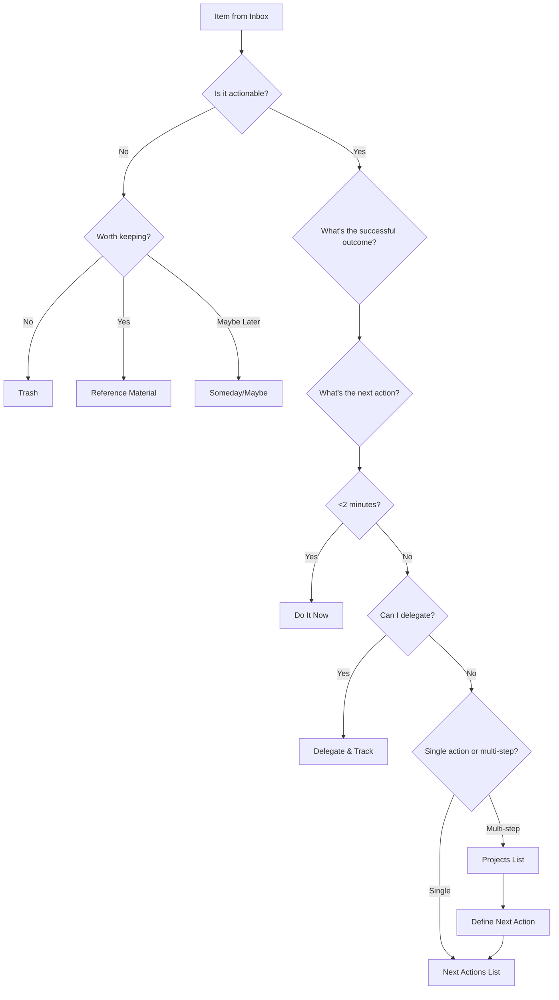

# Extraction Report: 📚 Comprehensive Reference: Getting Things Done

> [!info] Auto-Generated Report
> This report was automatically generated by `pkb_extractor.py` on 2026-03-13 04:18.
> **Source**: `reference-comprehensive-getting-things-done-202511150451.md` | **Items Extracted**: 1242

---

## 📋 Document Overview

| Field | Value |
|-------|-------|
| **Source File** | `reference-comprehensive-getting-things-done-202511150451.md` |
| **Extraction Date** | 2026-03-13 04:18 |
| **Word Count** | 16,459 |
| **Character Count** | 117,097 |
| **Line Count** | 3,212 |
| **Total Items Extracted** | 1,242 |

### Document Outline

  - ## 📑 Table of Contents
  - ## 🧠 1. Core Philosophy & Principles
    - ### Foundational Concepts
    - ### The Mind Like Water Concept
    - ### Natural Planning Model
  - ## ⚙️ 2. The Five Core Processes
    - ### Process 1: Capture
    - ### Process 2: Clarify
    - ### Process 3: Organize
    - ### Process 4: Reflect
    - ### Process 5: Engage
  - ## 📋 3. GTD Lists & Organization System
    - ### Core Action Lists
      - #### Next Actions Lists
  - ## @computer
  - ## @phone
  - ## @errands
      - #### Projects List
  - ## Active Projects
      - #### Waiting For List
  - ## Waiting For
    - ### Reference Systems
      - #### Someday/Maybe List
  - ## Someday/Maybe
    - ### Skills to Develop
    - ### Places to Visit
    - ### Projects to Explore
    - ### Experiences to Try
      - #### Reference Materials
    - ### Tickler System (43 Folders)
  - ## 🎯 4. The Horizons of Focus Framework
    - ### Horizon Framework Structure
    - ### Ground Level: Calendar & Next Actions
    - ### Horizon 1: Projects (10,000 ft)
    - ### Horizon 2: Areas of Focus/Responsibility (20,000 ft)
    - ### Horizon 3: Goals & Objectives (30,000 ft)
  - ## Professional Goals (12-24 Months)
  - ## Personal Goals (12-24 Months)
    - ### Horizon 4: Vision (40,000 ft)
    - ### Horizon 5: Purpose & Principles (50,000 ft)
    - ### Horizon Integration & Alignment
  - ## Alignment Audit
  - ## 🔄 5. The Weekly Review Ritual
    - ### The Complete Weekly Review Process
      - #### Phase 1: Get Clear (Empty Collection Points)
      - #### Phase 2: Get Current (Update System Status)
      - #### Phase 3: Get Creative (Explore Possibilities)
      - #### Phase 4: Get Perspective (Horizon Review)
    - ### Weekly Review Best Practices
- # Weekly Review - [[<% tp.date.now("YYYY-MM-DD") %>]]
  - ## Phase 1: Get Clear
  - ## Phase 2: Get Current
  - ## Phase 3: Get Creative
  - ## Phase 4: Get Perspective (monthly/quarterly)
  - ## Week Reflections
  - ## 🎲 6. Decision-Making Models
    - ### The Four-Criteria Model
      - #### Criterion 1: Context
      - #### Criterion 2: Time Available
      - #### Criterion 3: Energy Available
  - ## High-Energy Actions (@high_energy)
  - ## Medium-Energy Actions (@medium_energy)
  - ## Low-Energy Actions (@low_energy)
      - #### Criterion 4: Priority
    - ### The Threefold Model of Work
  - ## 💻 7. Obsidian Implementation Architecture
    - ### Core Folder Structure
    - ### Dashboard Design
- # 🎯 GTD Dashboard
  - ## 📥 To Process
  - ## 🎯 Next Actions by Context
    - ### @computer
    - ### @phone
    - ### @errands
  - ## 📋 Active Projects
  - ## ⏳ Waiting For
  - ## 📅 Scheduled This Week
  - ## 🌟 Someday/Maybe (Sample)
    - ### Task Management Approaches
      - #### Approach 1: Native Markdown Tasks
  - ## Project: Website Redesign
      - #### Approach 2: Tasks Plugin Enhancement
  - ## Overdue Tasks
  - ## This Week (High Priority)
      - #### Approach 3: Dataview-Based GTD
- # Project: Establish Morning Workout Routine
  - ## Outcome
  - ## Next Actions
  - ## Notes
    - ### Integration Patterns
      - #### GTD + Zettelkasten Integration
- # Project: Write Productivity System Guide
  - ## Related Notes
  - ## Next Actions
  - ## Project Support
  - ## 🔌 8. Plugin Ecosystem for GTD
    - ### Core GTD Plugins
      - #### Tasks Plugin
      - #### Dataview Plugin
      - #### Templater Plugin
- # Project: <% tp.file.title %>
  - ## Outcome
  - ## Next Actions
  - ## Resources
  - ## Notes
      - #### Homepage Plugin
      - #### QuickAdd Plugin
    - ### Specialized GTD Plugins
      - #### Kanban Plugin
      - #### Calendar Plugin
      - #### Reminder Plugin
    - ### Custom Plugin Development
  - ## 🔧 9. Workflow Templates & Automation
    - ### Project Initiation Template
- # <% tp.file.title %>
  - ## 📋 Natural Planning
    - ### 1. Purpose & Principles
    - ### 2. Vision of Outcome
    - ### 3. Brainstorming
    - ### 4. Organizing
    - ### 5. Next Actions
  - ## 🎯 Actions
    - ### Next Actions
    - ### Waiting For
    - ### Future/Someday
  - ## 📚 Resources & Reference
  - ## 📝 Notes & Progress Log
    - ### Daily Capture Template
- # 📅 <% tp.date.now("dddd, MMMM DD, YYYY") %>
  - ## 🌅 Morning Planning
  - ## 📥 Captured Today
  - ## ✅ Completed
  - ## 📝 Notes & Reflections
    - ### What Went Well
    - ### Challenges Encountered
    - ### Tomorrow's Preparation
    - ### Weekly Review Checklist Template
- # 🔄 Weekly Review - Week <% tp.date.now("WW, YYYY") %>
  - ## Phase 1: Get Clear ✨
    - ### Empty Collection Points
  - ## Phase 2: Get Current 🔄
    - ### Review Next Actions
    - ### Review Calendar
    - ### Review Projects
    - ### Review Waiting For
  - ## Phase 3: Get Creative 💡
    - ### Someday/Maybe Review
    - ### Areas of Focus Check
    - ### Creative Exploration
  - ## Phase 4: Get Perspective 🎯
    - ### Monthly Horizon Review (First Friday)
    - ### Quarterly Horizon Review (First Friday of quarter)
  - ## 📊 Week Metrics
    - ### Quick Capture Macro (QuickAdd)
    - ### Area of Focus Template
- # <% tp.file.title %>
  - ## 📊 Standards & Metrics
  - ## 🎯 Active Projects
  - ## ✅ Current Actions
  - ## 🔄 Recurring Activities
  - ## 💡 Improvement Ideas
  - ## 📝 Reflections
    - ### Recent Wins
    - ### Current Challenges
    - ### Next Quarter Goals
  - ## 🔗 10. Integration with PKB Systems
    - ### Philosophical Integration
    - ### Bidirectional Linking Strategy
      - #### Projects → Knowledge Notes
- # Project: Master Statistical Inference
  - ## Learning Resources
  - ## Knowledge Created
  - ## Next Actions
      - #### Knowledge Notes → Projects
- # [[Stoicism Practical Philosophy]]
  - ## Core Concept
  - ## Related Projects
  - ## Actions Generated
  - ## Connections
    - ### Capture-to-Permanent-Note Workflow
- # Inbox Capture - 2025-11-14 14:30
- # Literature Note - Atomic Habits Chapter 4
- # Activation Energy in Productivity Systems
  - ## Concept
  - ## Application to GTD
  - ## Evidence
  - ## Practical Implementation
  - ## Related
    - ### Project-Based Learning Documentation
- # Project: Learn Rust Programming Language
  - ## Learning Outcome
  - ## Knowledge Structure
    - ### Foundation Layer
    - ### Application Layer
    - ### Integration Layer
  - ## Actions
  - ## Success Criteria
    - ### Weekly Review PKB Enhancement
  - ## Phase 4: Knowledge Integration (Added to standard review)
    - ### Knowledge Created This Week
    - ### Knowledge Gaps Identified
    - ### PKB Maintenance Actions
    - ### Insights & Synthesis
    - ### MOC (Map of Content) as GTD Hub
- # 🗺️ Productivity Systems MOC
  - ## Active Exploration (Current Projects)
  - ## Core Frameworks
    - ### Execution Systems
    - ### Planning Systems
  - ## Atomic Concepts
  - ## Comparative Notes
  - ## Implementation Resources
  - ## Reference & Research
  - ## Areas Requiring Development
  - ## ⚠️ 11. Common Pitfalls & Solutions
    - ### Pitfall 1: Over-Engineered Setup
    - ### Pitfall 2: Inconsistent Processing
  - ## End-of-Day Processing (15 minutes)
    - ### Pitfall 3: Vague Next Actions
    - ### Pitfall 4: Skipping Weekly Reviews
    - ### Pitfall 5: Calendar Contamination
  - ## Scheduled This Week
    - ### Pitfall 6: Project Proliferation
    - ### Pitfall 7: Context Chaos
    - ### Pitfall 8: Perfectionism Paralysis
  - ## System Friction Log
  - ## 🚀 12. Advanced Applications
    - ### Advanced Application 1: GTD for Creative Work
- # Creative Project: Write Novel
  - ## Horizon 5: Purpose
  - ## Horizon 4: Vision
  - ## Horizon 3: Goals (12 months)
  - ## Projects (Active Components)
  - ## Areas of Focus### Advanced Application 1: GTD for Creative Work (continued)
  - ## Areas of Focus
  - ## Creative Actions Structure
    - ### Divergent Phase (Exploration)
    - ### Convergent Phase (Refinement)
    - ### Support Infrastructure
  - ## Creative-Specific Lists
    - ### Inspiration Captures
    - ### Research Questions
    - ### Craft Improvements Needed
    - ### Advanced Application 2: GTD for Knowledge Work & Research
- # Research Project: Effectiveness of Spaced Repetition in Adult Learning
  - ## Research Questions (Evolving)
  - ## Research Design Actions
    - ### Literature Review Phase
    - ### Study Design Phase
    - ### Data Collection Phase
    - ### Analysis Phase
  - ## Knowledge Artifacts Generated
    - ### Permanent Notes Created
    - ### Literature Notes
    - ### Synthesis Notes
  - ## Research Infrastructure
    - ### Waiting For
    - ### Resources & Tools
  - ## Integration with PKB
    - ### Advanced Application 3: Multi-Role Life Management
- # Life Roles Architecture
  - ## Purpose (Horizon 5) - Overarching
  - ## Vision (Horizon 4) - 3-5 Years
  - ## Goals (Horizon 3) - 12-24 Months
    - ### Professional Role
    - ### Parenting Role
    - ### Entrepreneurial Role
    - ### Health Role
  - ## Areas of Focus (Horizon 2)
    - ### Professional (@work domain)
    - ### Parenting (@family domain)
    - ### Entrepreneurship (@business domain)
    - ### Health (@personal domain)
  - ## Projects by Role
    - ### Current Professional Projects
    - ### Current Parenting Projects
    - ### Current Entrepreneurial Projects
    - ### Current Health Projects
  - ## Context Lists Enhanced by Role
    - ### @work (Office/professional context)
    - ### @home (Family time)
    - ### @business (Entrepreneurial work)
    - ### @gym (Fitness training)
  - ## Role-Based Weekly Review
    - ### Professional Role Check
    - ### Parenting Role Check
    - ### Entrepreneurial Role Check
    - ### Health Role Check
  - ## Role Boundaries & Capacity
    - ### Advanced Application 4: GTD for Long-Term Projects (1+ years)
- # Long-Term Project: Write & Publish Non-Fiction Book
  - ## Macro Phases (Project within Projects)
    - ### Phase 1: Research & Outline (Months 1-4) ✅ COMPLETE
    - ### Phase 2: First Draft (Months 5-10) 🔄 ACTIVE
    - ### Phase 3: Revision (Months 11-14) ⏸️ FUTURE
    - ### Phase 4: Publication Preparation (Months 15-18) ⏸️ FUTURE
    - ### Phase 5: Marketing & Launch (Months 19-24) ⏸️ FUTURE
  - ## Current Active Sub-Project: Draft Part 2 - Chapters 5-8
  - ## Milestone Tracking
  - ## Monthly Review Questions (Long-Term Projects)
  - ## Quarterly Deep Review
    - ### Advanced Application 5: GTD + Time Blocking Hybrid
- # Time Block + GTD Hybrid System
  - ## Calendar Structure (Time Blocking)
    - ### Monday-Friday Template
  - ## Context Lists Enhanced for Time Blocking
    - ### @deep-work (Scheduled in protected blocks only)
    - ### @shallow-work (Flexible execution anytime)
    - ### @communication (Batch in collaborative windows)
  - ## Time Block Preparation (Part of Daily Review)
  - ## Weekly Time Block Audit (Part of Weekly Review)
  - ## Integration Principles
    - ### Time Blocking Provides:
    - ### GTD Provides:
    - ### Synergy:
  - ## 🎯 Synthesis & Mastery
    - ### Cognitive Models for GTD Mastery
    - ### Comparative Analysis
    - ### Path to GTD Mastery
  - ## 📊 Metadata & Attribution
  - ## 🔄 Version History
- # 🔗 Related Topics for PKB Expansion

---

## 📊 Extraction Summary

| Item Type | Count |
|-----------|-------|
| Callouts | 66 |
| Code Blocks | 65 |
| Color Spans | 0 |
| Definitions | 0 |
| Embeds | 0 |
| External Links | 0 |
| Footnotes | 0 |
| Headings | 322 |
| Inline Fields | 0 |
| Mermaid Diagrams | 1 |
| Tables | 6 |
| Tags | 25 |
| Wiki Links | 177 |
| **TOTAL** | **1242** |

---

## 🔔 Callouts (66)

> [!note] What are Callouts?
> Callouts are `> [!TYPE]` blocks used in Obsidian for structured annotation.
> They carry semantic meaning — definitions, insights, warnings, etc.

### By Type

| Callout Type | Count |
|-------------|-------|
| `[!abstract]` | 1 |
| `[!analogy]` | 3 |
| `[!comprehensive-reference]` | 1 |
| `[!core-principle]` | 4 |
| `[!definition]` | 18 |
| `[!helpful-tip]` | 7 |
| `[!how-to-use-this]` | 1 |
| `[!important]` | 3 |
| `[!key-claim]` | 5 |
| `[!methodology-and-sources]` | 6 |
| `[!outcome]` | 1 |
| `[!principle-point]` | 3 |
| `[!summary]` | 2 |
| `[!the-philosophy]` | 3 |
| `[!the-purpose]` | 1 |
| `[!warning]` | 4 |
| `[!what-this-does]` | 3 |

### Full Callout List

#### 1. [COMPREHENSIVE-REFERENCE] 📚 Comprehensive Reference *(Line 34)*

> [!comprehensive-reference] 📚 Comprehensive Reference
> - **Generated**:: 2025-11-14
> - **Version**:: 1.0
> - **Type**:: Reference Documentation
> - **Author**:: David Allen (Methodology), Adapted for [[obsidian]] [[PKB]] Implementation

#### 2. [ABSTRACT] Untitled *(Line 40)*

> [!abstract] Untitled
> **Executive Overview**
> Getting Things Done is a personal productivity methodology developed by David Allen that transforms overwhelming task loads into stress-free productivity by capturing all commitments in a trusted external system and breaking them into clear, actionable steps. The system operates on the principle that "there is an inverse relationship between things on your mind and those things getting done," enabling practitioners to achieve what Allen calls "[[Mind Like Water]]"—a state of relaxed focus where you respond appropriately to inputs without mental clutter. This reference note provides exhaustive coverage of [[GTD]] principles, implementation strategies, and specialized guidance for deploying the system within an [[obsidian]]-based [[Personal Knowledge Base]].

#### 3. [HOW-TO-USE-THIS] Untitled *(Line 44)*

> [!how-to-use-this] Untitled
> **Navigation Guide**
> This reference note is organized into 12 major sections covering all aspects of GTD methodology and Obsidian-specific implementation. Use the table of contents below for quick navigation to specific topics, or search for concepts using [[Wiki-Links]]. The document progresses from foundational philosophy through tactical implementation, concluding with advanced integration strategies for knowledge workers.

#### 4. [DEFINITION] Untitled *(Line 67)*

> [!definition] Untitled
> - **Getting Things Done (GTD)**:: A comprehensive work-life management system designed to alleviate overwhelm and instill focus, clarity, and confidence by externalizing mental commitments into a trusted organizational framework.
> - **Open Loops**:: Unfinished tasks, commitments, or items of interest that occupy mental bandwidth—also called "incompletes" or "stuff."
> - **Trusted System**:: An external organizational framework reliable enough that your mind can fully release responsibility for remembering tasks and commitments.

#### 5. [KEY-CLAIM] Untitled *(Line 88)*

> [!key-claim] Untitled
> **The GTD Promise**
> When you have clarity about what must be done and a foolproof plan for actually doing it, you can get a grip on everything, stay relaxed, and accomplish meaningful things with minimal effort across the whole spectrum of life and work.

#### 6. [THE-PHILOSOPHY] Untitled *(Line 94)*

> [!the-philosophy] Untitled
> **Philosophical Foundation: Mind Like Water**
> Allen uses the metaphor of water's response to objects: when something is thrown into water, it responds appropriately with a splash proportional to the input, then returns to quiescence. The opposite of this ideal state is a mind that never returns to calm but remains continually stressed by every input, unable to process appropriately because it's already saturated with retained commitments.

#### 7. [METHODOLOGY-AND-SOURCES] Untitled *(Line 109)*

> [!methodology-and-sources] Untitled
> **The Natural Planning Model**
> Allen's Natural Planning Model represents the vertical dimension of project thinking, describing how humans naturally plan effectively:
> 
> 1. **Purpose & Principles**: Why are we doing this? What are the boundaries?
> 2. **Vision/Outcome**: What would success look like?
> 3. **Brainstorming**: What ideas emerge when we think freely?
> 4. **Organizing**: What structure makes sense? What are the components?
> 5. **Next Actions**: What specific physical steps will move this forward?

#### 8. [PRINCIPLE-POINT] Untitled *(Line 125)*

> [!principle-point] Untitled
> **The GTD Workflow Foundation**
> The Mastering Work Flow technique forms GTD's horizontal dimension—teaching how to capture, think about, organize, and manage all commitments across five sequential stages.

#### 9. [DEFINITION] Untitled *(Line 131)*

> [!definition] Untitled
> - **Capture**:: The practice of recording anything that crosses your mind—tasks, events, ideas, book recommendations—into external inboxes, freeing your mind for processing rather than retention.

#### 10. [HELPFUL-TIP] Untitled *(Line 146)*

> [!helpful-tip] Untitled
> **Obsidian Capture Strategy**
> Install the Homepage plugin to force Obsidian to open a designated capture note whenever you launch the application, creating instant access to your primary inbox for frictionless capture.

#### 11. [DEFINITION] Untitled *(Line 163)*

> [!definition] Untitled
> - **Clarify**:: The decision-making process that transforms raw inbox items into clearly defined outcomes and actions by asking key questions about each item.

#### 12. [WARNING] Untitled *(Line 195)*

> [!warning] Untitled
> **The "Next Action" Precision Requirement**
> Vague entries like "Mom's birthday" or "Update website" fail the GTD clarity test. Proper next actions are concrete and specific: "Call Sarah for restaurant recommendations for Mom's birthday dinner" or "Draft new copy for homepage hero section in Google Docs."

#### 13. [DEFINITION] Untitled *(Line 205)*

> [!definition] Untitled
> - **Organize**:: The systematic placement of clarified items into appropriate categories within your GTD system based on clarification decisions.

#### 14. [KEY-CLAIM] Untitled *(Line 220)*

> [!key-claim] Untitled
> **Calendar Sacred Ground**
> Allen emphasizes that only three types of items belong on your calendar: appointments (time-specific commitments), day-specific actions (must be done on a particular day), and day-specific information (relevant to a specific date). Everything else dilutes the calendar's authority as your "hard landscape."

#### 15. [DEFINITION] Untitled *(Line 240)*

> [!definition] Untitled
> - **Reflect**:: The regular process of reviewing different lists in your GTD system, updating their contents, and ensuring the system remains current and trustworthy.

#### 16. [IMPORTANT] Untitled *(Line 260)*

> [!important] Untitled
> **Reflection Maintains Trust**
> Without regular reflection, your external system gradually decays into unreliability—the mind begins re-internalizing commitments, defeating GTD's fundamental purpose. Trust evaporates when lists contain outdated, irrelevant, or unclear items.

#### 17. [DEFINITION] Untitled *(Line 266)*

> [!definition] Untitled
> - **Engage**:: The execution phase—actually doing work by making trusted choices about what actions to take at any given moment.

#### 18. [WHAT-THIS-DOES] Untitled *(Line 285)*

> [!what-this-does] Untitled
> **List Infrastructure Purpose**
> Systematic organization of inputs is central to GTD—Allen prescribes specific organizational containers that serve distinct functional purposes within the methodology.

#### 19. [DEFINITION] Untitled *(Line 293)*

> [!definition] Untitled
> - **Next Actions**:: Context-categorized lists recording the immediate physical steps required to move projects forward, organized by the tools, locations, or people needed to execute them.

#### 20. [DEFINITION] Untitled *(Line 327)*

> [!definition] Untitled
> - **Project**:: Any outcome requiring more than one action step to complete, ranging from "Plan vacation to Iceland" to "Complete annual performance review" to "Reorganize garage."

#### 21. [HELPFUL-TIP] Untitled *(Line 359)*

> [!helpful-tip] Untitled
> **Project Review Integration**
> Each project should maintain a "waiting for" sub-list tracking items that cannot progress until someone else takes action, preventing projects from stalling due to untracked dependencies.

#### 22. [DEFINITION] Untitled *(Line 388)*

> [!definition] Untitled
> - **Someday/Maybe**:: A parking lot for aspirations, possibilities, and potential projects not currently active but worth preserving for future consideration, marked with tags like #pkm.

#### 23. [IMPORTANT] Untitled *(Line 421)*

> [!important] Untitled
> **Someday/Maybe Review Frequency**
> Review this list monthly or quarterly, not weekly—the purpose is periodic reassessment, not active management.

#### 24. [DEFINITION] Untitled *(Line 438)*

> [!definition] Untitled
> - **Tickler File**:: A date-triggered reminder system using 43 folders (12 months + 31 days) that brings items to attention on specific future dates.

#### 25. [PRINCIPLE-POINT] Untitled *(Line 450)*

> [!principle-point] Untitled
> **Multi-Altitude Perspective Integration**
> The Six Horizons of Focus allow reflection on different levels of perspective that should influence choices, managing work from multiple altitudes ranging from immediate actions to life purpose.

#### 26. [METHODOLOGY-AND-SOURCES] Untitled *(Line 458)*

> [!methodology-and-sources] Untitled
> **The Six Horizons Model**

#### 27. [DEFINITION] Untitled *(Line 486)*

> [!definition] Untitled
> - **Projects (Horizon 1)**:: Relatively near-term outcomes requiring multiple actions that can typically be completed within about one year.

#### 28. [DEFINITION] Untitled *(Line 512)*

> [!definition] Untitled
> - **Areas of Focus**:: The agreements you have about your ongoing responsibilities, interests, and roles—essentially the job description for your life and work.

#### 29. [HELPFUL-TIP] Untitled *(Line 535)*

> [!helpful-tip] Untitled
> **Areas as Project Generators**
> Areas of focus are ongoing aspects of life requiring attention to keep things running smoothly—the "engine room" that you don't necessarily complete but must maintain in balance. Each area generates projects ensuring adequate attention: "Health" might spawn "Complete annual physical exam" or "Establish morning workout routine."

#### 30. [DEFINITION] Untitled *(Line 543)*

> [!definition] Untitled
> - **Goals & Objectives**:: Specific, measurable medium-term commitments requiring completion of multiple smaller projects, typically with 1-2 year time horizons.

#### 31. [KEY-CLAIM] Untitled *(Line 568)*

> [!key-claim] Untitled
> **Goals Drive Projects, Projects Serve Areas**
> Goals provide specific milestones that turn your vision into reality, giving direction and sense of progress through concrete targets. They cascade downward: Horizon 3 goals generate Horizon 1 projects, which produce ground-level actions.

#### 32. [DEFINITION] Untitled *(Line 576)*

> [!definition] Untitled
> - **Vision**:: The 3-5 year picture of your ideal future—where you want to be, what you want to have accomplished, and how you want your life to look.

#### 33. [ANALOGY] Untitled *(Line 590)*

> [!analogy] Untitled
> **Vision as Destination**
> If purpose (Horizon 5) is your compass direction, vision is the specific destination on the map—you can see it clearly enough to plan the route, though you might need to adjust the path based on terrain encountered along the way.

#### 34. [DEFINITION] Untitled *(Line 598)*

> [!definition] Untitled
> - **Purpose & Principles**:: The ultimate bigger picture—the work you are here to do on the planet with your life, the fundamental values guiding all decisions and actions.

#### 35. [WARNING] Untitled *(Line 621)*

> [!warning] Untitled
> **Purpose Paradox**
> No matter how organized you become, if you're not spending adequate time with family, health, spiritual life, etc., you'll still have "incompletes" to address, make decisions about, and create projects around to achieve clarity. Organization alone cannot substitute for alignment with authentic purpose.

#### 36. [CORE-PRINCIPLE] Untitled *(Line 629)*

> [!core-principle] Untitled
> **Vertical Alignment Requirement**
> By ensuring each horizon aligns with others, you gain clear understanding of direction and identify planning gaps, promoting proactive rather than reactive work approaches.

#### 37. [KEY-CLAIM] Untitled *(Line 664)*

> [!key-claim] Untitled
> **The Critical Success Factor**
> David Allen identifies the weekly review as a "critical factor for success" because frequent review ensures you're not merely doing things, but doing the right things.

#### 38. [DEFINITION] Untitled *(Line 668)*

> [!definition] Untitled
> - **Weekly Review**:: A systematic, comprehensive review of your entire GTD system performed weekly to maintain perspective, ensure completeness, and rebuild trust in your organizational framework.

#### 39. [METHODOLOGY-AND-SOURCES] Untitled *(Line 675)*

> [!methodology-and-sources] Untitled
> **Standard Weekly Review Sequence**

#### 40. [HELPFUL-TIP] Untitled *(Line 770)*

> [!helpful-tip] Untitled
> **Schedule as Sacred Time**
> Schedule your weekly review by setting it up as a recurring calendar appointment using natural language like "every Sunday at 5pm." Treat this appointment with the same commitment as meeting with your most important client—yourself.

#### 41. [WARNING] Untitled *(Line 797)*

> [!warning] Untitled
> **Review Decay = System Failure**
> Missing 2-3 consecutive weekly reviews typically results in system breakdown—lists become outdated, trust evaporates, and mind begins reclaiming storage responsibility, defeating GTD's core purpose.

#### 42. [PRINCIPLE-POINT] Untitled *(Line 844)*

> [!principle-point] Untitled
> **Contextual Decision Framework**
> To decide what action to take next, Allen prescribes considering four criteria: context, time available, energy available, and priority—in that specific sequence.

#### 43. [DEFINITION] Untitled *(Line 854)*

> [!definition] Untitled
> - **Context**:: The tools, locations, or people required to execute specific actions—essentially answering "What can I do right now, given my current circumstances?"

#### 44. [HELPFUL-TIP] Untitled *(Line 882)*

> [!helpful-tip] Untitled
> **The 2-Minute Rule** (Revisited)
> When processing inbox items, anything requiring under two minutes gets done immediately, but during execution phases, these become quick wins for utilizing small time pockets.

#### 45. [CORE-PRINCIPLE] Untitled *(Line 922)*

> [!core-principle] Untitled
> **Energy Optimization**
> Do challenging tasks requiring concentration during your most effective periods, and choose less mentally demanding tasks during low-energy times. This principle aligns with [[Chronobiology]] research on circadian rhythms and cognitive performance variability.

#### 46. [METHODOLOGY-AND-SOURCES] Untitled *(Line 949)*

> [!methodology-and-sources] Untitled
> **Three Work Categories**

#### 47. [WHAT-THIS-DOES] Untitled *(Line 979)*

> [!what-this-does] Untitled
> **Obsidian as GTD Platform**
> [[obsidian]]'s plain-text [[Markdown]] foundation, robust plugin ecosystem, and bidirectional linking capabilities make it exceptionally suited for GTD implementation, particularly when integrated with broader [[03-notes/01_permanent-notes/02_personal-knowledge-base/Personal Knowledge Management]] workflows.

#### 48. [HELPFUL-TIP] Untitled *(Line 1027)*

> [!helpful-tip] Untitled
> **PARA + GTD Hybrid**
> Combining the PARA method (Projects, Areas, Resources, Archive) with GTD creates elegant structure, where PARA provides organizational hierarchy and GTD supplies workflow methodology.

#### 49. [SUMMARY] Untitled *(Line 1040)*

> [!summary] Untitled
> **Today**: [[<% tp.date.now("YYYY-MM-DD") %>]]
> **Energy**: [High/Medium/Low]
> **Available Time**: [Hours]

#### 50. [WHAT-THIS-DOES] Untitled *(Line 1262)*

> [!what-this-does] Untitled
> **Essential Plugin Stack**
> Community plugins transform Obsidian into a comprehensive GTD platform, enabling automation, advanced queries, and sophisticated task management.

#### 51. [METHODOLOGY-AND-SOURCES] Untitled *(Line 1443)*

> [!methodology-and-sources] Untitled
> **Automation Philosophy**
> Well-designed templates and automation reduce cognitive load, ensure consistency, and eliminate friction in GTD implementation—but must remain flexible enough to accommodate life's unpredictability.

#### 52. [OUTCOME] Untitled *(Line 1467)*

> [!outcome] Untitled
> **Successful Outcome**
> <!-- Describe what "done" looks like in 1-2 clear sentences -->

#### 53. [THE-PURPOSE] Untitled *(Line 1471)*

> [!the-purpose] Untitled
> **Why This Matters**
> <!-- Connect to higher horizons: Which Area/Goal/Vision does this serve? -->
> - **Supports Area**: [[]]
> - **Advances Goal**: [[]]
> - **Alignment Check**:

#### 54. [IMPORTANT] Untitled *(Line 1592)*

> [!important] Untitled
> **Review Start**: <% tp.date.now("HH:mm") %>
> **Goal Completion**: < 90 minutes
> **Environment**: ☕ Quiet space, all tools accessible

#### 55. [SUMMARY] Untitled *(Line 1725)*

> [!summary] Untitled
> **Review Completed**: <% tp.date.now("HH:mm") %>
> **Duration**: 
> **System Health**: [ ] Excellent [ ] Good [ ] Needs Work
> **Next Review**: <% tp.date.now("YYYY-MM-DD", 7) %>

#### 56. [DEFINITION] Untitled *(Line 1789)*

> [!definition] Untitled
> **Area Definition**
> <!-- What ongoing responsibility/role does this represent? -->

#### 57. [THE-PHILOSOPHY] Untitled *(Line 1793)*

> [!the-philosophy] Untitled
> **Why This Matters**
> <!-- How does maintaining this area serve your values and vision? -->

#### 58. [CORE-PRINCIPLE] Untitled *(Line 1852)*

> [!core-principle] Untitled
> **GTD-PKB Synergy**
> Integrating GTD with Personal Knowledge Management creates compound effects—task completion generates knowledge artifacts, and knowledge work spawns actionable projects.

#### 59. [WARNING] Untitled *(Line 2122)*

> [!warning] Untitled
> **GTD Failure Patterns**
> Understanding common implementation failures prevents painful system abandonment and enables preemptive correction.

#### 60. [ANALOGY] Untitled *(Line 2138)*

> [!analogy] Untitled
> **The Kitchen Metaphor**
> Building an elaborate kitchen before learning to cook ensures an intimidating, unused space. Start with a hot plate and one pan—add complexity only as genuine needs emerge from actual cooking practice.

#### 61. [HELPFUL-TIP] Untitled *(Line 2217)*

> [!helpful-tip] Untitled
> **The Answering Machine Test**
> If you couldn't leave this action as a voicemail message for someone else and have them execute it exactly, it's not specific enough.

#### 62. [CORE-PRINCIPLE] Untitled *(Line 2430)*

> [!core-principle] Untitled
> **Progress Over Perfection**
> The key to any lasting productivity system is keeping it as simple as possible and using it as often as possible. Use beats perfection.

#### 63. [KEY-CLAIM] Untitled *(Line 2459)*

> [!key-claim] Untitled
> **GTD as Meta-Skill Foundation**
> Once basic GTD mechanics become habitual, the methodology provides scaffolding for advanced productivity, creativity, and life design applications.

#### 64. [THE-PHILOSOPHY] Untitled *(Line 3050)*

> [!the-philosophy] Untitled
> **Underlying Philosophy**
> GTD transcends mere task management—it represents a philosophy of intentional living through complete external commitment capture, systematic processing, and alignment between daily actions and life purpose. The methodology enables what Allen calls "stress-free productivity": the paradoxical state where maximum organizational control creates maximum creative freedom.

#### 65. [ANALOGY] Untitled *(Line 3082)*

> [!analogy] Untitled
> **The Jazz Improvisation Metaphor**
> A jazz musician masters scales, chord progressions, and theory (GTD mechanics), but brilliance emerges when this technical foundation enables spontaneous creative expression (opportunistic engagement). The system doesn't constrain—it liberates through fluency.

#### 66. [METHODOLOGY-AND-SOURCES] Untitled *(Line 3127)*

> [!methodology-and-sources] Untitled
> **Research Methodology**
> This reference note synthesizes information from authoritative primary sources, academic research on productivity systems, and extensive community documentation of Obsidian-specific implementations. Research included systematic web searches across official GTD documentation, peer-reviewed literature on task management psychology, and practical implementation guides from experienced practitioners.
> 
> **Primary Sources**:
> - David Allen Company official GTD methodology documentation and trademarked frameworks
> - Allen, David. *Getting Things Done: The Art of Stress-Free Productivity* (2001, revised 2015)
> - Community productivity guides and implementation tutorials
> 
> **Obsidian Implementation Sources**:
> - Community forum discussions, GitHub repositories, and personal implementation blogs documenting Obsidian GTD workflows
> 
> **Theoretical Framework Sources**:
> - Horizons of Focus framework documentation and application guides
> 
> **Synthesis Approach**: Integrated official methodology with cognitive science principles, Obsidian technical capabilities, and real-world implementation experiences to create comprehensive, actionable reference
> 
> **Confidence Level**: 
> - Core GTD methodology: High (primary source documentation)
> - Obsidian implementation: High (multiple community validations)
> - Advanced applications: Medium-High (based on reported experiences)
> - Tool-specific details: Medium (subject to plugin updates)

---

## 🔗 Wiki-Links (177 total, 161 unique targets)

> [!info] Knowledge Graph Connections
> These links represent connections to other notes in your PKB.
> **161** distinct notes are referenced.

### Unique Targets

- [[03-notes/01_permanent-notes/02_personal-knowledge-base/Personal Knowledge Management]]
- [[12 Week Year Methodology]]
- [[<% tp.date.now("YYYY-MM-DD") %>]]
- [[<% tp.date.now("YYYY-MM-DD", -1) %>]]
- [[<% tp.date.now("YYYY-MM-DD", -7) %>]]
- [[<% tp.date.now("YYYY-MM-DD", 1) %>]]
- [[<% tp.date.now("YYYY-MM-DD", 7) %>]]
- [[<% tp.file.folder() %>]]
- [[Acceptance and Commitment Therapy]]
- [[Area - Academic Research]]
- [[Area-Writing-Teaching]]
- [[Areas]]
- [[Atomic Note - Confidence Intervals Explained]]
- [[Atomic Note - P-Values Common Misconceptions]]
- [[Atomic Notes Pattern]]
- [[Bayesian vs Frequentist Approaches]]
- [[Behavioral Economics]]
- [[Borrowing Rules in Rust]]
- [[Bottom-Up vs Top-Down Planning]]
- [[Capture]]
- [[Capture System]]
- [[Central Limit Theorem Applications]]
- [[Chronobiology]]
- [[Clarification Algorithm]]
- [[Cognitive Behavioral Therapy]]
- [[Cognitive Offloading]]
- [[Cognitive Psychology]]
- [[Context-Based Organization]]
- [[Context-Based Productivity Systems - Theory and Implementation]]
- [[Context-Based Task Organization]]
- [[Creative Process]]
- [[Decision Fatigue Studies]]
- [[Desirable Difficulties Principle]]
- [[Digital vs Analog Productivity Tools]]
- [[Eastern Wisdom Traditions]]
- [[Eisenhower Matrix]]
- [[Environmental Design]]
- [[Expanding Interval Schedules]]
- [[Flow Theory]]
- [[Friction Reduction Economics]]
- [[GTD]]
- [[GTD Dashboard]]
- [[GTD Dashboard Template]]
- [[GTD vs PARA - Integration Strategies]]
- [[Getting Things Done (GTD)]]
- [[Getting Things Done Core Principles]]
- [[Goal - Publish 3 Peer-Reviewed Papers This Year]]
- [[Goal-Launch-Online-Course]]
- [[Habit Formation]]
- [[Habit Formation Research]]
- [[Horizons of Focus Framework]]
- [[Hypothesis Testing Framework]]
- [[Inbox Zero Principle]]
- [[Learning Science MOC]]
- [[Learning Theory Principles]]
- [[Lifetime Annotations Purpose]]
- [[Lit-Note - Cepeda et al 2006 - Spacing Effects Meta-Analysis]]
- [[Lit-Note - Karpicke 2016 - Retrieval Practice]]
- [[Lit-Note - Kornell & Bjork 2008 - Learning Concepts]]
- [[Lit-Note-Template]]
- [[Literature Note - Building a Second Brain (Forte)]]
- [[Literature Note - Getting Things Done (Allen)]]
- [[Literature Note - Rust Programming Language Book Ch 4]]
- [[Literature Note - Statistical Rethinking Ch 3]]
- [[Locus of Control Psychology]]
- [[Markdown]]
- [[Metacognition]]
- [[Mind Like Water]]
- [[Mind Like Water Philosophy]]
- [[Mind Like Water Philosophy - Eastern Influences on Productivity]]
- [[Mindfulness]]
- [[Natural Planning Model Deep Dive]]
- [[Obsidian]]
- [[Obsidian GTD Plugin Recommendations]]
- [[PARA Method]]
- [[PKB]]
- [[Peak Performance]]
- [[Personal Knowledge Base]]
- [[Personal Knowledge Management]]
- [[Personal Knowledge Management Best Practices]]
- [[Personal Knowledge Management MOC]]
- [[Personal Learning System Design]]
- [[Philosophy]]
- [[Pomodoro Technique]]
- [[Probability Theory Fundamentals]]
- [[Processing System]]
- [[Productivity Methods]]
- [[Productivity Psychology Research]]
- [[Project Initiation Template]]
- [[Project Management]]
- [[Project: Automate Course Platform Setup]]
- [[Project: Build Backyard Treehouse with Kids]]
- [[Project: Build Character Development System]]
- [[Project: Complete 16-Week Marathon Training]]
- [[Project: Complete First Draft Chapters 1-10]]
- [[Project: Create Module 3 Video Content]]
- [[Project: Design Personal Productivity Dashboard]]
- [[Project: Develop Mindfulness Practice]]
- [[Project: Establish Morning Meditation Ritual]]
- [[Project: Evaluate Time Blocking vs Task Batching]]
- [[Project: Hire Software Engineer for Team]]
- [[Project: Implement GTD in Obsidian]]
- [[Project: Improve Communication Skills]]
- [[Project: Launch Email Nurture Sequence]]
- [[Project: Optimize Capture Points Across Life]]
- [[Project: Optimize Sleep Schedule for Energy]]
- [[Project: Plan Emma's 10th Birthday Party]]
- [[Project: Q4 Strategic Plan Presentation]]
- [[Project: Redesign Customer Onboarding Process]]
- [[Project: Research Middle Schools for Next Year]]
- [[Project: Research Publishing Industry]]
- [[Project: Write Philosophy Blog Series]]
- [[Projects]]
- [[Reference System]]
- [[Reflective Practice]]
- [[Rust Ownership System Explained]]
- [[Rust vs C++ Memory Management Comparison]]
- [[Self-Development MOC]]
- [[Self-Regulated Learning]]
- [[Spaced Repetition - Forgetting Curve Relationship]]
- [[Stoicism Practical Philosophy]]
- [[Sub-Project: Agent Selection & Contract]]
- [[Sub-Project: Beta Reader Feedback Integration]]
- [[Sub-Project: Book Proposal to Agents]]
- [[Sub-Project: Build Author Platform]]
- [[Sub-Project: Create Detailed Book Outline]]
- [[Sub-Project: Draft Conclusion & Appendices]]
- [[Sub-Project: Draft Part 1 - Chapters 1-4]]
- [[Sub-Project: Draft Part 2 - Chapters 5-8]]
- [[Sub-Project: Draft Part 3 - Chapters 9-12]]
- [[Sub-Project: Interview 10 Subject Matter Experts]]
- [[Sub-Project: Launch Week Coordination]]
- [[Sub-Project: Line Editing and Polish]]
- [[Sub-Project: Literature Review - 50 Key Books]]
- [[Sub-Project: Pre-Launch Marketing Campaign]]
- [[Sub-Project: Publisher Submission Process]]
- [[Sub-Project: Structural Revision with Editor]]
- [[Synthesis - Boundary Conditions for Spacing Benefits]]
- [[Synthesis - Optimal Spacing Intervals Across Studies]]
- [[Synthesis Note - Memory Safety Without Garbage Collection]]
- [[Synthesis Note - When to Use Which Statistical Test]]
- [[Systems Programming Best Practices MOC]]
- [[Systems Thinking]]
- [[Task Management]]
- [[Testing Effect vs Spacing Effect]]
- [[Time Blocking Method]]
- [[Two-Minute Rule]]
- [[Ubiquitous Computing]]
- [[Weekly Review]]
- [[Weekly Review Checklist]]
- [[Weekly Review Importance]]
- [[Weekly Review as Meta-Skill - Applications Beyond GTD]]
- [[Wiki-Links]]
- [[Work Systems MOC]]
- [[Workflow Design]]
- [[Working Memory]]
- [[Zettelkasten]]
- [[Zettelkasten Methodology]]
- [[obsidian]]
- [[productivity]]
- [[time management]]

### All Occurrences

| # | Target | Display Text | Heading | Section | Line |
|---|--------|-------------|---------|---------|------|
| 1 | [[obsidian]] | — | — | Document Start | 38 |
| 2 | [[PKB]] | — | — | Document Start | 38 |
| 3 | [[Mind Like Water]] | — | — | Document Start | 42 |
| 4 | [[GTD]] | — | — | Document Start | 42 |
| 5 | [[obsidian]] | — | — | Document Start | 42 |
| 6 | [[Personal Knowledge Base]] | — | — | Document Start | 42 |
| 7 | [[Wiki-Links]] | — | — | Document Start | 46 |
| 8 | [[Cognitive Psychology]] | — | — | Foundational Concepts | 78 |
| 9 | [[Cognitive Offloading]] | — | — | Foundational Concepts | 78 |
| 10 | [[Working Memory]] | — | — | Foundational Concepts | 78 |
| 11 | [[time management]] | — | — | Foundational Concepts | 80 |
| 12 | [[obsidian]] | — | — | Foundational Concepts | 82 |
| 13 | [[Mind Like Water]] | — | — | The Mind Like Water Concept | 98 |
| 14 | [[Flow Theory]] | — | — | The Mind Like Water Concept | 105 |
| 15 | [[Processing System]] | — | — | Process 1: Capture | 159 |
| 16 | [[PKB]] | — | — | Reference Materials | 434 |
| 17 | [[Zettelkasten]] | — | — | Reference Materials | 434 |
| 18 | [[Weekly Review]] | — | — | Horizon 1: Projects (10,000 ft) | 497 |
| 19 | [[<% tp.date.now("YYYY-MM-DD") %>]] | — | — | Weekly Review - [[<% tp.date.now("YYY... | 804 |
| 20 | [[Chronobiology]] | — | — | Low-Energy Actions (@low_energy) | 924 |
| 21 | [[obsidian]] | — | — | 💻 7. Obsidian Implementation Architec... | 981 |
| 22 | [[Markdown]] | — | — | 💻 7. Obsidian Implementation Architec... | 981 |
| 23 | [[03-notes/01_permanent-notes/02_personal-knowledge-base/Personal Knowledge Management]] | — | — | 💻 7. Obsidian Implementation Architec... | 981 |
| 24 | [[<% tp.date.now("YYYY-MM-DD") %>]] | — | — | 🎯 GTD Dashboard | 1041 |
| 25 | [[Weekly Review]] | — | — | 🌟 Someday/Maybe (Sample) | 1114 |
| 26 | [[Projects]] | — | — | 🌟 Someday/Maybe (Sample) | 1114 |
| 27 | [[Areas]] | — | — | 🌟 Someday/Maybe (Sample) | 1114 |
| 28 | [[Capture]] | — | — | 🌟 Someday/Maybe (Sample) | 1114 |
| 29 | [[Zettelkasten Methodology]] | — | — | Related Notes | 1238 |
| 30 | [[Atomic Notes Pattern]] | — | — | Related Notes | 1239 |
| 31 | [[Personal Knowledge Management Best Practices]] | — | — | Related Notes | 1240 |
| 32 | [[Learning Theory Principles]] | — | — | Related Notes | 1241 |
| 33 | [[Area-Writing-Teaching]] | — | — | Project Support | 1249 |
| 34 | [[Goal-Launch-Online-Course]] | — | — | Project Support | 1249 |
| 35 | [[Projects]] | — | — | 📝 Notes & Progress Log | 1522 |
| 36 | [[<% tp.file.folder() %>]] | — | — | 📝 Notes & Progress Log | 1522 |
| 37 | [[Weekly Review]] | — | — | 📝 Notes & Progress Log | 1522 |
| 38 | [[<% tp.date.now("YYYY-MM-DD", -1) %>]] | ← Yesterday | — | Tomorrow's Preparation | 1575 |
| 39 | [[GTD Dashboard]] | Dashboard | — | Tomorrow's Preparation | 1575 |
| 40 | [[<% tp.date.now("YYYY-MM-DD", 1) %>]] | Tomorrow → | — | Tomorrow's Preparation | 1575 |
| 41 | [[<% tp.date.now("YYYY-MM-DD", -7) %>]] | ← Last Week | — | 📊 Week Metrics | 1731 |
| 42 | [[GTD Dashboard]] | Dashboard | — | 📊 Week Metrics | 1731 |
| 43 | [[<% tp.date.now("YYYY-MM-DD", 7) %>]] | Next Week → | — | 📊 Week Metrics | 1731 |
| 44 | [[Probability Theory Fundamentals]] | — | — | Learning Resources | 1876 |
| 45 | [[Bayesian vs Frequentist Approaches]] | — | — | Learning Resources | 1877 |
| 46 | [[Central Limit Theorem Applications]] | — | — | Learning Resources | 1878 |
| 47 | [[Hypothesis Testing Framework]] | — | — | Learning Resources | 1879 |
| 48 | [[Atomic Note - Confidence Intervals Explained]] | — | — | Knowledge Created | 1882 |
| 49 | [[Atomic Note - P-Values Common Misconceptions]] | — | — | Knowledge Created | 1883 |
| 50 | [[Synthesis Note - When to Use Which Statistical Test]] | — | — | Knowledge Created | 1884 |
| 51 | [[Literature Note - Statistical Rethinking Ch 3]] | — | — | Knowledge Created | 1885 |
| 52 | [[Stoicism Practical Philosophy]] | — | — | [[Stoicism Practical Philosophy]] | 1896 |
| 53 | [[Project: Develop Mindfulness Practice]] | — | — | Related Projects | 1905 |
| 54 | [[Project: Improve Communication Skills]] | — | — | Related Projects | 1906 |
| 55 | [[Project: Write Philosophy Blog Series]] | — | — | Related Projects | 1907 |
| 56 | [[Cognitive Behavioral Therapy]] | — | — | Connections | 1915 |
| 57 | [[Acceptance and Commitment Therapy]] | — | — | Connections | 1916 |
| 58 | [[Locus of Control Psychology]] | — | — | Connections | 1917 |
| 59 | [[Project: Optimize Capture Points Across Life]] | — | — | Literature Note - Atomic Habits Chapt... | 1945 |
| 60 | [[Habit Formation Research]] | — | — | Evidence | 1964 |
| 61 | [[Decision Fatigue Studies]] | — | — | Evidence | 1965 |
| 62 | [[Friction Reduction Economics]] | — | — | Evidence | 1966 |
| 63 | [[Getting Things Done Core Principles]] | — | — | Related | 1975 |
| 64 | [[Zettelkasten Methodology]] | — | — | Related | 1976 |
| 65 | [[Behavioral Economics]] | — | — | Related | 1977 |
| 66 | [[Rust Ownership System Explained]] | — | — | Foundation Layer | 1993 |
| 67 | [[Borrowing Rules in Rust]] | — | — | Foundation Layer | 1994 |
| 68 | [[Lifetime Annotations Purpose]] | — | — | Foundation Layer | 1995 |
| 69 | [[Literature Note - Rust Programming Language Book Ch 4]] | — | — | Application Layer | 1999 |
| 70 | [[Synthesis Note - Memory Safety Without Garbage Collection]] | — | — | Application Layer | 2000 |
| 71 | [[Rust vs C++ Memory Management Comparison]] | — | — | Integration Layer | 2003 |
| 72 | [[Systems Programming Best Practices MOC]] | — | — | Integration Layer | 2004 |
| 73 | [[Project: Implement GTD in Obsidian]] | — | — | Active Exploration (Current Projects) | 2069 |
| 74 | [[Project: Evaluate Time Blocking vs Task Batching]] | — | — | Active Exploration (Current Projects) | 2070 |
| 75 | [[Project: Design Personal Productivity Dashboard]] | — | — | Active Exploration (Current Projects) | 2071 |
| 76 | [[Getting Things Done (GTD)]] | — | — | Execution Systems | 2075 |
| 77 | [[Time Blocking Method]] | — | — | Execution Systems | 2076 |
| 78 | [[Pomodoro Technique]] | — | — | Execution Systems | 2077 |
| 79 | [[Eisenhower Matrix]] | — | — | Execution Systems | 2078 |
| 80 | [[Horizons of Focus Framework]] | — | — | Planning Systems | 2081 |
| 81 | [[PARA Method]] | — | — | Planning Systems | 2082 |
| 82 | [[12 Week Year Methodology]] | — | — | Planning Systems | 2083 |
| 83 | [[Mind Like Water Philosophy]] | — | — | Atomic Concepts | 2086 |
| 84 | [[Inbox Zero Principle]] | — | — | Atomic Concepts | 2087 |
| 85 | [[Context-Based Task Organization]] | — | — | Atomic Concepts | 2088 |
| 86 | [[Weekly Review Importance]] | — | — | Atomic Concepts | 2089 |
| 87 | [[Two-Minute Rule]] | — | — | Atomic Concepts | 2090 |
| 88 | [[Clarification Algorithm]] | — | — | Atomic Concepts | 2091 |
| 89 | [[GTD vs PARA - Integration Strategies]] | — | — | Comparative Notes | 2094 |
| 90 | [[Digital vs Analog Productivity Tools]] | — | — | Comparative Notes | 2095 |
| 91 | [[Bottom-Up vs Top-Down Planning]] | — | — | Comparative Notes | 2096 |
| 92 | [[GTD Dashboard Template]] | — | — | Implementation Resources | 2099 |
| 93 | [[Weekly Review Checklist]] | — | — | Implementation Resources | 2100 |
| 94 | [[Project Initiation Template]] | — | — | Implementation Resources | 2101 |
| 95 | [[Obsidian GTD Plugin Recommendations]] | — | — | Implementation Resources | 2102 |
| 96 | [[Literature Note - Getting Things Done (Allen)]] | — | — | Reference & Research | 2105 |
| 97 | [[Literature Note - Building a Second Brain (Forte)]] | — | — | Reference & Research | 2106 |
| 98 | [[Productivity Psychology Research]] | — | — | Reference & Research | 2107 |
| 99 | [[Personal Knowledge Management MOC]] | — | — | Areas Requiring Development | 2115 |
| 100 | [[Self-Development MOC]] | — | — | Areas Requiring Development | 2115 |
| 101 | [[Work Systems MOC]] | — | — | Areas Requiring Development | 2115 |
| 102 | [[Project: Complete First Draft Chapters 1-10]] | — | — | Projects (Active Components) | 2484 |
| 103 | [[Project: Build Character Development System]] | — | — | Projects (Active Components) | 2485 |
| 104 | [[Project: Research Publishing Industry]] | — | — | Projects (Active Components) | 2486 |
| 105 | [[Lit-Note-Template]] | — | — | Literature Review Phase | 2564 |
| 106 | [[Spaced Repetition - Forgetting Curve Relationship]] | — | — | Permanent Notes Created | 2592 |
| 107 | [[Desirable Difficulties Principle]] | — | — | Permanent Notes Created | 2593 |
| 108 | [[Testing Effect vs Spacing Effect]] | — | — | Permanent Notes Created | 2594 |
| 109 | [[Expanding Interval Schedules]] | — | — | Permanent Notes Created | 2595 |
| 110 | [[Lit-Note - Cepeda et al 2006 - Spacing Effects Meta-Analysis]] | — | — | Literature Notes | 2598 |
| 111 | [[Lit-Note - Kornell & Bjork 2008 - Learning Concepts]] | — | — | Literature Notes | 2599 |
| 112 | [[Lit-Note - Karpicke 2016 - Retrieval Practice]] | — | — | Literature Notes | 2600 |
| 113 | [[Synthesis - Optimal Spacing Intervals Across Studies]] | — | — | Synthesis Notes | 2603 |
| 114 | [[Synthesis - Boundary Conditions for Spacing Benefits]] | — | — | Synthesis Notes | 2604 |
| 115 | [[Learning Science MOC]] | — | — | Integration with PKB | 2622 |
| 116 | [[Goal - Publish 3 Peer-Reviewed Papers This Year]] | — | — | Integration with PKB | 2623 |
| 117 | [[Area - Academic Research]] | — | — | Integration with PKB | 2624 |
| 118 | [[Personal Learning System Design]] | — | — | Integration with PKB | 2625 |
| 119 | [[Project: Q4 Strategic Plan Presentation]] | — | — | Current Professional Projects | 2710 |
| 120 | [[Project: Hire Software Engineer for Team]] | — | — | Current Professional Projects | 2711 |
| 121 | [[Project: Redesign Customer Onboarding Process]] | — | — | Current Professional Projects | 2712 |
| 122 | [[Project: Plan Emma's 10th Birthday Party]] | — | — | Current Parenting Projects | 2715 |
| 123 | [[Project: Research Middle Schools for Next Year]] | — | — | Current Parenting Projects | 2716 |
| 124 | [[Project: Build Backyard Treehouse with Kids]] | — | — | Current Parenting Projects | 2717 |
| 125 | [[Project: Create Module 3 Video Content]] | — | — | Current Entrepreneurial Projects | 2720 |
| 126 | [[Project: Launch Email Nurture Sequence]] | — | — | Current Entrepreneurial Projects | 2721 |
| 127 | [[Project: Automate Course Platform Setup]] | — | — | Current Entrepreneurial Projects | 2722 |
| 128 | [[Project: Complete 16-Week Marathon Training]] | — | — | Current Health Projects | 2725 |
| 129 | [[Project: Establish Morning Meditation Ritual]] | — | — | Current Health Projects | 2726 |
| 130 | [[Project: Optimize Sleep Schedule for Energy]] | — | — | Current Health Projects | 2727 |
| 131 | [[Sub-Project: Literature Review - 50 Key Books]] | — | — | Phase 1: Research & Outline (Months 1... | 2818 |
| 132 | [[Sub-Project: Interview 10 Subject Matter Experts]] | — | — | Phase 1: Research & Outline (Months 1... | 2819 |
| 133 | [[Sub-Project: Create Detailed Book Outline]] | — | — | Phase 1: Research & Outline (Months 1... | 2820 |
| 134 | [[Sub-Project: Draft Part 1 - Chapters 1-4]] | — | — | Phase 2: First Draft (Months 5-10) 🔄 ... | 2823 |
| 135 | [[Sub-Project: Draft Part 2 - Chapters 5-8]] | — | — | Phase 2: First Draft (Months 5-10) 🔄 ... | 2824 |
| 136 | [[Sub-Project: Draft Part 3 - Chapters 9-12]] | — | — | Phase 2: First Draft (Months 5-10) 🔄 ... | 2825 |
| 137 | [[Sub-Project: Draft Conclusion & Appendices]] | — | — | Phase 2: First Draft (Months 5-10) 🔄 ... | 2826 |
| 138 | [[Sub-Project: Structural Revision with Editor]] | — | — | Phase 3: Revision (Months 11-14) ⏸️ F... | 2829 |
| 139 | [[Sub-Project: Beta Reader Feedback Integration]] | — | — | Phase 3: Revision (Months 11-14) ⏸️ F... | 2830 |
| 140 | [[Sub-Project: Line Editing and Polish]] | — | — | Phase 3: Revision (Months 11-14) ⏸️ F... | 2831 |
| 141 | [[Sub-Project: Book Proposal to Agents]] | — | — | Phase 4: Publication Preparation (Mon... | 2834 |
| 142 | [[Sub-Project: Agent Selection & Contract]] | — | — | Phase 4: Publication Preparation (Mon... | 2835 |
| 143 | [[Sub-Project: Publisher Submission Process]] | — | — | Phase 4: Publication Preparation (Mon... | 2836 |
| 144 | [[Sub-Project: Build Author Platform]] | — | — | Phase 5: Marketing & Launch (Months 1... | 2839 |
| 145 | [[Sub-Project: Pre-Launch Marketing Campaign]] | — | — | Phase 5: Marketing & Launch (Months 1... | 2840 |
| 146 | [[Sub-Project: Launch Week Coordination]] | — | — | Phase 5: Marketing & Launch (Months 1... | 2841 |
| 147 | [[Natural Planning Model Deep Dive]] | — | — | 🔗 Related Topics for PKB Expansion | 3160 |
| 148 | [[Project Management]] | — | — | 🔗 Related Topics for PKB Expansion | 3163 |
| 149 | [[Creative Process]] | — | — | 🔗 Related Topics for PKB Expansion | 3163 |
| 150 | [[Systems Thinking]] | — | — | 🔗 Related Topics for PKB Expansion | 3163 |
| 151 | [[Mind Like Water Philosophy - Eastern Influences on Productivity]] | — | — | 🔗 Related Topics for PKB Expansion | 3165 |
| 152 | [[GTD]] | — | — | 🔗 Related Topics for PKB Expansion | 3168 |
| 153 | [[Philosophy]] | — | — | 🔗 Related Topics for PKB Expansion | 3168 |
| 154 | [[Mindfulness]] | — | — | 🔗 Related Topics for PKB Expansion | 3168 |
| 155 | [[Peak Performance]] | — | — | 🔗 Related Topics for PKB Expansion | 3168 |
| 156 | [[Eastern Wisdom Traditions]] | — | — | 🔗 Related Topics for PKB Expansion | 3168 |
| 157 | [[Context-Based Productivity Systems - Theory and Implementation]] | — | — | 🔗 Related Topics for PKB Expansion | 3170 |
| 158 | [[Productivity Methods]] | — | — | 🔗 Related Topics for PKB Expansion | 3173 |
| 159 | [[Cognitive Psychology]] | — | — | 🔗 Related Topics for PKB Expansion | 3173 |
| 160 | [[Environmental Design]] | — | — | 🔗 Related Topics for PKB Expansion | 3173 |
| 161 | [[Ubiquitous Computing]] | — | — | 🔗 Related Topics for PKB Expansion | 3173 |
| 162 | [[Weekly Review as Meta-Skill - Applications Beyond GTD]] | — | — | 🔗 Related Topics for PKB Expansion | 3175 |
| 163 | [[productivity]] | — | — | 🔗 Related Topics for PKB Expansion | 3178 |
| 164 | [[Metacognition]] | — | — | 🔗 Related Topics for PKB Expansion | 3178 |
| 165 | [[Habit Formation]] | — | — | 🔗 Related Topics for PKB Expansion | 3178 |
| 166 | [[Self-Regulated Learning]] | — | — | 🔗 Related Topics for PKB Expansion | 3178 |
| 167 | [[Reflective Practice]] | — | — | 🔗 Related Topics for PKB Expansion | 3178 |
| 168 | [[Personal Knowledge Management]] | — | — | 🔗 Related Topics for PKB Expansion | 3204 |
| 169 | [[Obsidian]] | — | — | 🔗 Related Topics for PKB Expansion | 3205 |
| 170 | [[Workflow Design]] | — | — | 🔗 Related Topics for PKB Expansion | 3206 |
| 171 | [[Task Management]] | — | — | 🔗 Related Topics for PKB Expansion | 3207 |
| 172 | [[Reference System]] | — | — | 🔗 Related Topics for PKB Expansion | 3208 |
| 173 | [[Capture System]] | — | — | 🔗 Related Topics for PKB Expansion | 3209 |
| 174 | [[Weekly Review]] | — | — | 🔗 Related Topics for PKB Expansion | 3210 |
| 175 | [[Project Management]] | — | — | 🔗 Related Topics for PKB Expansion | 3211 |
| 176 | [[Context-Based Organization]] | — | — | 🔗 Related Topics for PKB Expansion | 3212 |
| 177 | [[Mind Like Water]] | — | — | 🔗 Related Topics for PKB Expansion | 3213 |

---

## 🏷️ Tags (25 occurrences, 15 unique)

### All Unique Tags

`#daily`, `#deep`, `#gtd`, `#obsidian`, `#obsidian-implementation`, `#pkm`, `#productivity`, `#recurring`, `#reference-note`, `#someday`, `#task-management`, `#type/reference`, `#waiting`, `#workflow`, `#workflow-design`

### Hierarchical Tags

- **type/**
  - `#type/reference`

---

## 💻 Code Blocks (65)

| Language | Count |
|----------|-------|
| `markdown` | 35 |
| `plaintext` | 28 |
| `javascript` | 2 |

### Code Block 1 — `markdown` *(Lines 298-317)*

```markdown
## @computer

- [ ] Draft Q4 budget analysis in Excel
- [ ] Research cloud storage options for team collaboration
- [ ] Update LinkedIn profile with recent certifications
- [ ] Review and respond to Sarah's proposal document

## @phone

- [ ] Call dentist to schedule cleaning appointment
- [ ] Follow up with contractor about kitchen renovation timeline
- [ ] Schedule meeting with mentor for career planning

## @errands

- [ ] Pick up dry cleaning at Main Street Cleaners
- [ ] Buy birthday gift for nephew (age 7, loves dinosaurs)
- [ ] Return defective router to Best Buy
```

### Code Block 2 — `markdown` *(Lines 340-357)*

```markdown
## Active Projects

- [ ] **Launch personal website redesign**
      - Outcome: New website live with updated portfolio and blog
      - Next: Schedule meeting with designer to review mockups
      - Due: 2025-12-15
      
- [ ] **Complete tax preparation for 2024**
      - Outcome: Taxes filed with CPA and documentation archived
      - Next: Gather Q4 bank statements from online portal
      - Due: 2025-04-01
      
- [ ] **Plan anniversary dinner celebration**
      - Outcome: Restaurant reservation confirmed, gift purchased
      - Next: Call three restaurants for availability on June 12th
      - Due: 2025-05-30
```

### Code Block 3 — `markdown` *(Lines 369-376)*

```markdown
## Waiting For

- [ ] **Sarah**: Feedback on marketing proposal (requested 2025-11-10)
- [ ] **IT Department**: Password reset for project management tool (ticket #4592)
- [ ] **Amazon**: Delivery of standing desk converter (order #112-8473625)
- [ ] **John**: Revised budget numbers for Q1 planning (expected by 2025-11-18)
```

### Code Block 4 — `markdown` *(Lines 397-419)*

```markdown
## Someday/Maybe

### Skills to Develop
- Learn woodworking (build basic furniture)
- Study conversational Japanese
- Take photography composition course

### Places to Visit
- Hiking trip to Patagonia
- Food tour of Tokyo
- Visit national parks in Pacific Northwest

### Projects to Explore
- Write short story collection
- Build custom mechanical keyboard
- Restore vintage bicycle

### Experiences to Try
- Attend silent meditation retreat
- Take glassblowing workshop
- Join community theater production
```

### Code Block 5 — `markdown` *(Lines 501-508)*

```markdown
Project: Launch Personal Podcast Series
├── Research podcast hosting platforms (Next Action: @computer)
├── Purchase USB microphone and audio interface (Next Action: @errands)
├── Draft series outline for first 10 episodes (Next Action: @computer)
├── Design podcast artwork (Waiting For: Designer Sarah)
└── Record and edit pilot episode (Next Action: @home-studio)
```

### Code Block 6 — `markdown` *(Lines 550-566)*

```markdown
## Professional Goals (12-24 Months)

- **Revenue Target**: Grow consulting practice to $250K annual revenue
  - Supporting Projects: Launch productized service offering, implement referral program, hire virtual assistant
  
- **Skill Development**: Achieve proficiency in data science and machine learning
  - Supporting Projects: Complete 3 online courses, build 5 portfolio projects, present at local meetup

## Personal Goals (12-24 Months)

- **Health**: Run a marathon in under 4 hours
  - Supporting Projects: Complete 16-week training program, optimize nutrition plan, purchase proper running shoes
  
- **Financial**: Build 6-month emergency fund ($30,000)
  - Supporting Projects: Automate savings transfers, reduce discretionary spending, sell unused equipment
```

### Code Block 7 — `markdown` *(Lines 635-649)*

```markdown
## Alignment Audit

Purpose (H5): Foster lifelong learning and creative expression
    ↓ Does Vision support Purpose?
Vision (H4): Build sustainable creative business enabling flexible lifestyle
    ↓ Do Goals advance Vision?
Goal (H3): Launch online course with 500 students by end of year
    ↓ Do Projects achieve Goals?
Project (H1): Develop 8-module video curriculum for productivity course
    ↓ Do Areas support Projects?
Area (H2): Content creation and educational design
    ↓ Do Actions advance Projects?
Action (Ground): Script first module introduction and record audio draft
```

### Code Block 8 — `markdown` *(Lines 803-838)*

```markdown
# Weekly Review - [[<% tp.date.now("YYYY-MM-DD") %>]]

## Phase 1: Get Clear
- [ ] Collect loose papers and materials
- [ ] Process physical inbox to zero
- [ ] Process email inbox to zero
- [ ] Process note capture inbox to zero
- [ ] Empty head (mind sweep)

## Phase 2: Get Current
- [ ] Review and update Next Actions lists
- [ ] Review past calendar (2-3 weeks)
- [ ] Review upcoming calendar (2-3 weeks)  
- [ ] Review and update Projects list
- [ ] Review Waiting For list

## Phase 3: Get Creative
- [ ] Review Someday/Maybe list
- [ ] Review Areas of Focus checklist
- [ ] Brainstorm new ideas and possibilities

## Phase 4: Get Perspective (monthly/quarterly)
- [ ] Review Goals and objectives (monthly)
- [ ] Review Vision (quarterly)
- [ ] Review Purpose & Principles (quarterly)

## Week Reflections
**Wins this week**:

**Challenges encountered**:
# ... (4 more lines truncated)
```

### Code Block 9 — `markdown` *(Lines 897-920)*

```markdown
## High-Energy Actions (@high_energy)
- Strategic planning and vision work
- Complex problem-solving
- Creative ideation and brainstorming
- Difficult conversations
- Learning new concepts
- Writing demanding content

## Medium-Energy Actions (@medium_energy)
- Routine project work
- Email processing and responses
- Meeting attendance and participation
- Standard administrative tasks
- Collaborative work sessions

## Low-Energy Actions (@low_energy)
- Filing and organizing
- Routine data entry
- Simple errands and logistics
- Light email responses
- Reference material reading
- Task list reviews and updates
```

### Code Block 10 — `plaintext` *(Lines 989-1025)*

```plaintext
📁 Your-Vault/
├── 📁 00-System/
│   ├── Dashboard.md (Homepage/hub)
│   ├── Weekly-Review-Template.md
│   └── GTD-Menu.md (navigation)
│
├── 📁 01-Inbox/
│   ├── Capture.md (quick entry point)
│   └── Daily-Notes/ (dated captures)
│
├── 📁 02-Projects/
│   ├── Active/
│   │   ├── Project-Website-Redesign.md
│   │   └── Project-Tax-Preparation.md
│   ├── On-Hold/
│   └── Archive/
│
├── 📁 03-Areas/
│   ├── Area-Health-Fitness.md
│   ├── Area-Professional-Development.md
│   └── Area-Family-Relationships.md
│
├── 📁 04-Resources/
│   └── (Reference materials)
│
├── 📁 05-Context-Actions/
│   ├── @computer.md
│   ├── @phone.md
│   ├── @errands.md
│   └── @waiting-for.md
# ... (5 more lines truncated)
```

### Code Block 11 — `markdown` *(Lines 1037-1047)*

```markdown
# 🎯 GTD Dashboard

> [!summary]
> **Today**: [[<% tp.date.now("YYYY-MM-DD") %>]]
> **Energy**: [High/Medium/Low]
> **Available Time**: [Hours]

## 📥 To Process
```

### Code Block 12 — `plaintext` *(Lines 1053-1058)*

```plaintext
## 🎯 Next Actions by Context

### @computer
```

### Code Block 13 — `plaintext` *(Lines 1062-1065)*

```plaintext
### @phone
```

### Code Block 14 — `plaintext` *(Lines 1069-1072)*

```plaintext
### @errands
```

### Code Block 15 — `plaintext` *(Lines 1076-1080)*

```plaintext
## 📋 Active Projects
```

### Code Block 16 — `plaintext` *(Lines 1086-1090)*

```plaintext
## ⏳ Waiting For
```

### Code Block 17 — `plaintext` *(Lines 1094-1098)*

```plaintext
## 📅 Scheduled This Week
```

### Code Block 18 — `plaintext` *(Lines 1103-1107)*

```plaintext
## 🌟 Someday/Maybe (Sample)
```

### Code Block 19 — `plaintext` *(Lines 1111-1115)*

```plaintext
---
**Quick Links**: [[Weekly Review]] | [[Projects]] | [[Areas]] | [[Capture]]
```

### Code Block 20 — `markdown` *(Lines 1123-1130)*

```markdown
## Project: Website Redesign

- [ ] Schedule meeting with designer @computer 📅 2025-11-20
- [ ] Gather competitor website examples @computer #next
- [ ] Purchase new domain name @computer 💰 $15
- [ ] @waiting Sarah's design mockup feedback (requested 2025-11-15)
```

### Code Block 21 — `markdown` *(Lines 1149-1154)*

```markdown
- [ ] Call dentist to schedule appointment 📅 2025-11-18 @phone
- [ ] Review Q4 budget analysis 📅 2025-11-20 ⏫ @computer
- [ ] Weekly review 🔁 every Sunday 📅 2025-11-17 ⏰ 17:00
- [ ] Submit expense report ⏳ 2025-11-16 📅 2025-11-22 @computer
```

### Code Block 22 — `markdown` *(Lines 1158-1161)*

```markdown
## Overdue Tasks
```

### Code Block 23 — `plaintext` *(Lines 1165-1169)*

```plaintext
## This Week (High Priority)
```

### Code Block 24 — `plaintext` *(Lines 1175-1176)*

```plaintext

```

### Code Block 25 — `markdown` *(Lines 1186-1210)*

```markdown
---
state: active
org: personal
area: health
start: 2025-11-01
due: 2025-12-31
reviewed: 2025-11-14
category: Project
priority: 2
---

# Project: Establish Morning Workout Routine

## Outcome
Wake at 6am daily and complete 45-minute workout before work.

## Next Actions
- [ ] #next Research morning workout programs for beginners @computer
- [ ] Purchase yoga mat and resistance bands @errands
- [ ] Schedule first session with personal trainer @phone

## Notes
Benefits: improved energy, better sleep, stress management
```

### Code Block 26 — `markdown` *(Lines 1214-1215)*

```markdown

```

### Code Block 27 — `plaintext` *(Lines 1223-1224)*

```plaintext

```

### Code Block 28 — `markdown` *(Lines 1234-1250)*

```markdown
# Project: Write Productivity System Guide

## Related Notes
- [[Zettelkasten Methodology]] - foundational concepts
- [[Atomic Notes Pattern]] - structure for guide sections
- [[Personal Knowledge Management Best Practices]] - umbrella topic
- [[Learning Theory Principles]] - pedagogical approach

## Next Actions
- [ ] Create literature note from "How to Take Smart Notes" Chapter 5 @reading
- [ ] Draft atomic note: "Progressive Summarization Technique" @computer
- [ ] Link productivity concepts in existing PKB notes @computer

## Project Support
This project serves [[Area-Writing-Teaching]] and contributes to [[Goal-Launch-Online-Course]].
```

### Code Block 29 — `markdown` *(Lines 1308-1309)*

```markdown

```

### Code Block 30 — `plaintext` *(Lines 1317-1318)*

```plaintext

```

### Code Block 31 — `markdown` *(Lines 1332-1359)*

```markdown
---
state: active
org: personal
area: <% tp.system.suggester(["Health", "Career", "Finance", "Learning", "Family"], ["health", "career", "finance", "learning", "family"]) %>
start: <% tp.date.now("YYYY-MM-DD") %>
due: 
reviewed: <% tp.date.now("YYYY-MM-DD") %>
category: Project
priority: 1
---

# Project: <% tp.file.title %>

## Outcome
<!-- What does "done" look like? -->

## Next Actions
- [ ] #next 

## Resources
<!-- Links to related notes, reference materials -->

## Notes
<!-- Project-specific observations, ideas -->

<% await tp.file.move("02-Projects/Active/" + tp.file.title) %>
```

### Code Block 32 — `javascript` *(Lines 1377-1395)*

```javascript
// QuickAdd Macro: Quick Capture to Inbox

module.exports = async (params) => {
  const { quickAddApi: { inputPrompt } } = params;
  
  const capture = await inputPrompt("Capture:");
  
  if (!capture) return;
  
  const timestamp = moment().format("YYYY-MM-DD HH:mm");
  const captureEntry = `- [ ] ${capture} #inbox 📅 ${timestamp}\n`;
  
  await app.vault.adapter.append(
    "01-Inbox/Capture.md",
    captureEntry
  );
};
```

### Code Block 33 — `markdown` *(Lines 1449-1498)*

```markdown
---
created: <% tp.date.now("YYYY-MM-DD") %>
updated: <% tp.date.now("YYYY-MM-DD") %>
state: active
category: Project
area: <% tp.system.suggester(["🏢 Career", "💰 Finance", "🏥 Health", "👨‍👩‍👧 Family", "📚 Learning", "🏠 Home", "🎨 Creative"], ["career", "finance", "health", "family", "learning", "home", "creative"]) %>
priority: <% tp.system.suggester(["1 - Critical", "2 - High", "3 - Medium", "4 - Low"], [1, 2, 3, 4]) %>
start_date: <% tp.date.now("YYYY-MM-DD") %>
target_date: 
completion_date: 
tags:
  - project
  - <% tp.file.title.toLowerCase().replace(/ /g, "-") %>
---

# <% tp.file.title %>

> [!outcome]
> **Successful Outcome**
> <!-- Describe what "done" looks like in 1-2 clear sentences -->

> [!the-purpose]
> **Why This Matters**
> <!-- Connect to higher horizons: Which Area/Goal/Vision does this serve? -->
> - **Supports Area**: [[]]
> - **Advances Goal**: [[]]
> - **Alignment Check**: 

## 📋 Natural Planning

# ... (18 more lines truncated)
```

### Code Block 34 — `plaintext` *(Lines 1501-1525)*

```plaintext
## 🎯 Actions

### Next Actions
- [ ] #pkm 

### Waiting For
- [ ] #pkm 

### Future/Someday
- [ ]  #pkm

## 📚 Resources & Reference
<!-- Links to related notes, documents, research -->

## 📝 Notes & Progress Log
**<% tp.date.now("YYYY-MM-DD") %>**: Project initiated

---

**Quick Links**: [[Projects]] | [[<% tp.file.folder() %>]] | [[Weekly Review]]

<% await tp.file.move("02-Projects/Active/" + tp.file.title) %>
```

### Code Block 35 — `markdown` *(Lines 1529-1561)*

```markdown
---
date: <% tp.date.now("YYYY-MM-DD") %>
day: <% tp.date.now("dddd") %>
tags:
  - daily-note
  - inbox
---

# 📅 <% tp.date.now("dddd, MMMM DD, YYYY") %>

## 🌅 Morning Planning

**Today's Focus**:
- 

**Energy Level**: [ ] High [ ] Medium [ ] Low

**Available Time Blocks**:
- 

**Top 3 Priorities**:
1. 
2. 
3. 

## 📥 Captured Today

<!-- Quick capture area - process during daily review -->

## ✅ Completed
```

### Code Block 36 — `plaintext` *(Lines 1563-1576)*

```plaintext
## 📝 Notes & Reflections

### What Went Well

### Challenges Encountered

### Tomorrow's Preparation

---

**Navigation**: [[<% tp.date.now("YYYY-MM-DD", -1) %>|← Yesterday]] | [[GTD Dashboard|Dashboard]] | [[<% tp.date.now("YYYY-MM-DD", 1) %>|Tomorrow →]]
```

### Code Block 37 — `markdown` *(Lines 1580-1629)*

```markdown
---
date: <% tp.date.now("YYYY-MM-DD") %>
week: Week <% tp.date.now("WW") %>
type: weekly-review
tags:
  - review
  - weekly-review
---

# 🔄 Weekly Review - Week <% tp.date.now("WW, YYYY") %>

> [!important]
> **Review Start**: <% tp.date.now("HH:mm") %>
> **Goal Completion**: < 90 minutes
> **Environment**: ☕ Quiet space, all tools accessible

## Phase 1: Get Clear ✨

### Empty Collection Points
- [ ] Gather loose papers, receipts, business cards
- [ ] Process physical inbox to zero
- [ ] Process email inbox to zero (`<current count>` → `0`)
- [ ] Process note capture inbox to zero
- [ ] Review downloads folder and desktop
- [ ] Check messenger apps for captured items
- [ ] Mind sweep - empty head of lingering items

**Captured this week**: <!-- Note significant new items -->

## Phase 2: Get Current 🔄
# ... (18 more lines truncated)
```

### Code Block 38 — `plaintext` *(Lines 1636-1662)*

```plaintext
- [ ] Verify each active project has next action defined
- [ ] Update project statuses (active/on hold/complete)
- [ ] Archive completed projects
- [ ] Identify stalled projects (>2 weeks without update)

**Projects needing attention**:
- 

### Review Waiting For
- [ ] Follow up on overdue delegated items
- [ ] Remove completed items
- [ ] Add next actions for necessary follow-ups

## Phase 3: Get Creative 💡

### Someday/Maybe Review
- [ ] Activate items now ready to become projects
- [ ] Delete items no longer interesting
- [ ] Add new possibilities from this week

**Activated from Someday/Maybe**:
- 

### Areas of Focus Check
```

### Code Block 39 — `plaintext` *(Lines 1668-1732)*

```plaintext
- [ ] Health & Fitness - adequate attention?
- [ ] Career/Professional - progressing?
- [ ] Financial - on track?
- [ ] Relationships - nurtured?
- [ ] Learning/Growth - active?
- [ ] Home/Environment - maintained?

**Areas needing new projects**:
- 

### Creative Exploration
- [ ] What new projects would be valuable?
- [ ] What bold moves should I consider?
- [ ] What's blocking important progress?

**New project ideas**:
- 

## Phase 4: Get Perspective 🎯

### Monthly Horizon Review (First Friday)
- [ ] Review Goals (Horizon 3) - progress assessment
- [ ] Adjust goals based on changed circumstances  
- [ ] Generate projects supporting quarterly objectives

### Quarterly Horizon Review (First Friday of quarter)
- [ ] Review 3-5 year Vision (Horizon 4)
- [ ] Review Purpose & Principles (Horizon 5)
- [ ] Major life direction assessment

# ... (32 more lines truncated)
```

### Code Block 40 — `javascript` *(Lines 1736-1771)*

```javascript
// Rapid inbox capture with context suggestion

module.exports = async (params) => {
  const {
    quickAddApi: { inputPrompt, suggester },
    app
  } = params;
  
  // Capture item
  const item = await inputPrompt("What's on your mind?");
  if (!item) return;
  
  // Suggest context
  const contexts = [
    "📧 General",
    "💻 @computer", 
    "📞 @phone",
    "🏃 @errands",
    "🏠 @home",
    "⏰ @waiting"
  ];
  const context = await suggester(contexts, contexts);
  
  // Create entry
  const timestamp = moment().format("YYYY-MM-DD HH:mm");
  const entry = `- [ ] ${item} ${context || ""} #inbox\n    *Captured: ${timestamp}*\n`;
  
  // Append to capture file
  const capturePath = "01-Inbox/Capture.md";
  await app.vault.adapter.append(capturePath, entry);
# ... (4 more lines truncated)
```

### Code Block 41 — `markdown` *(Lines 1775-1808)*

```markdown
---
type: area
status: active
life_domain: <% tp.system.suggester(["Work", "Life"], ["work", "life"]) %>
created: <% tp.date.now("YYYY-MM-DD") %>
reviewed: <% tp.date.now("YYYY-MM-DD") %>
tags:
  - area-of-focus
  - <% tp.file.title.toLowerCase().replace(/ /g, "-") %>
---

# <% tp.file.title %>

> [!definition]
> **Area Definition**
> <!-- What ongoing responsibility/role does this represent? -->

> [!the-philosophy]
> **Why This Matters**
> <!-- How does maintaining this area serve your values and vision? -->

## 📊 Standards & Metrics

**What "healthy" looks like in this area**:
- 
- 

**Key indicators of success**:
- 

# ... (1 more lines truncated)
```

### Code Block 42 — `plaintext` *(Lines 1813-1817)*

```plaintext
## ✅ Current Actions
```

### Code Block 43 — `plaintext` *(Lines 1821-1846)*

```plaintext
## 🔄 Recurring Activities

<!-- Regular tasks maintaining this area -->
- [ ] 🔁 <!-- Weekly/monthly/quarterly maintenance -->

## 💡 Improvement Ideas

<!-- Ongoing enhancement possibilities -->

## 📝 Reflections

### Recent Wins

### Current Challenges

### Next Quarter Goals
<!-- Specific measurable targets for next 3 months -->

---

**Review Frequency**: Monthly
**Last Reviewed**: <% tp.date.now("YYYY-MM-DD") %>
**Next Review**: <% tp.date.now("YYYY-MM-DD", 30) %>
```

### Code Block 44 — `markdown` *(Lines 1872-1891)*

```markdown
# Project: Master Statistical Inference

## Learning Resources
- [[Probability Theory Fundamentals]] - prerequisite review
- [[Bayesian vs Frequentist Approaches]] - methodology comparison
- [[Central Limit Theorem Applications]] - core concept
- [[Hypothesis Testing Framework]] - practical application

## Knowledge Created
- [[Atomic Note - Confidence Intervals Explained]] ✅
- [[Atomic Note - P-Values Common Misconceptions]] ✅
- [[Synthesis Note - When to Use Which Statistical Test]] 🔄
- [[Literature Note - Statistical Rethinking Ch 3]] 📚

## Next Actions
- [ ] Create literature note from "Thinking, Fast and Slow" Chapter on statistical intuition @reading
- [ ] Draft atomic note explaining Monte Carlo simulation @computer
- [ ] Link statistical concepts in existing data science notes @computer
```

### Code Block 45 — `markdown` *(Lines 1895-1918)*

```markdown
# [[Stoicism Practical Philosophy]]

*Permanent Note - Created 2025-10-15*

## Core Concept
Stoic philosophy emphasizes distinguishing between what we control (our thoughts, actions, responses) and what we don't (external events, others' opinions), directing energy toward the former.

## Related Projects
This concept informs:
- [[Project: Develop Mindfulness Practice]] - recognizing automatic reactions
- [[Project: Improve Communication Skills]] - controlling responses, not reactions
- [[Project: Write Philosophy Blog Series]] - sharing insights publicly

## Actions Generated
- [ ] Create morning Stoic reflection ritual @home #next
- [ ] Draft blog post "Stoicism for Knowledge Workers" @computer
- [ ] Research Stoic journaling methods @computer

## Connections
↔ [[Cognitive Behavioral Therapy]] - similar dichotomy of control
↔ [[Acceptance and Commitment Therapy]] - acceptance of uncontrollables
↔ [[Locus of Control Psychology]] - internal vs external orientation
```

### Code Block 46 — `markdown` *(Lines 1923-1929)*

```markdown
# Inbox Capture - 2025-11-14 14:30

- Interesting insight from podcast: "Your system should be optimized for starting, not finishing" - implies reducing activation energy is more valuable than completion rituals
- Seems related to habit formation research and GTD capture principles
- **Action**: Create atomic note exploring this concept @computer #next
```

### Code Block 47 — `markdown` *(Lines 1932-1947)*

```markdown
# Literature Note - Atomic Habits Chapter 4

**Source**: Clear, James. *Atomic Habits*. 2018.

**Key Ideas**:
- Habit formation depends more on frequency than duration
- Environment design reduces friction for desired behaviors
- "Activation energy" determines whether habits initiate

**GTD Connection**: This explains why inbox ubiquity matters—lower capture friction = higher capture frequency = more trusted system

**Projects Spawned**:
- [[Project: Optimize Capture Points Across Life]] - reduce capture friction
  - Next action: Audit current capture tools and friction points @computer
```

### Code Block 48 — `markdown` *(Lines 1950-1978)*

```markdown
# Activation Energy in Productivity Systems

*Atomic Note - Created 2025-11-14*

## Concept
The energy required to initiate an action determines whether it occurs. Systems optimized for low-activation-energy starting outperform those optimized for high-friction-but-thorough completion.

## Application to GTD
- Multiple ubiquitous capture points > perfect capture process
- Quick weekly review > exhaustive monthly overhaul
- Immediate 2-minute actions > deferred "perfect time" execution

## Evidence
- [[Habit Formation Research]] - frequency beats intensity
- [[Decision Fatigue Studies]] - energy preservation critical
- [[Friction Reduction Economics]] - small barriers compound

## Practical Implementation
This principle suggests:
- Optimizing capture tool accessibility over feature richness
- Accepting "good enough" processing over delayed perfection
- Creating quick-start rituals rather than elaborate preparation

## Related
↔ [[Getting Things Done Core Principles]] - system trust requires ease
↔ [[Zettelkasten Methodology]] - capture friction kills system
↔ [[Behavioral Economics]] - defaults and nudges
```

### Code Block 49 — `markdown` *(Lines 1984-2018)*

```markdown
# Project: Learn Rust Programming Language

## Learning Outcome
Write idiomatic Rust code confidently, understanding ownership, borrowing, and lifetimes sufficiently to build command-line tools and contribute to open-source projects.

## Knowledge Structure

### Foundation Layer
- [ ] Create atomic note: [[Rust Ownership System Explained]] @computer
- [ ] Create atomic note: [[Borrowing Rules in Rust]] @computer
- [ ] Create atomic note: [[Lifetime Annotations Purpose]] @computer

### Application Layer
- [ ] Build project: CLI task manager in Rust
- [ ] Document learning: [[Literature Note - Rust Programming Language Book Ch 4]]
- [ ] Synthesize: [[Synthesis Note - Memory Safety Without Garbage Collection]]

### Integration Layer
- [ ] Compare: [[Rust vs C++ Memory Management Comparison]]
- [ ] Connect: [[Systems Programming Best Practices MOC]]
- [ ] Apply: Contribute to open-source Rust project

## Actions
- [ ] #next Read "The Rust Programming Language" Chapter 1-3 @reading
- [ ] Setup Rust development environment on laptop @computer
- [ ] Complete Rustlings exercises Set 1 @computer
- [ ] Join Rust Discord community and introduce myself @computer

## Success Criteria
- [ ] 5+ atomic notes on core Rust concepts
# ... (3 more lines truncated)
```

### Code Block 50 — `markdown` *(Lines 2024-2028)*

```markdown
## Phase 4: Knowledge Integration (Added to standard review)

### Knowledge Created This Week
```

### Code Block 51 — `plaintext` *(Lines 2033-2057)*

```plaintext
**Reflection Questions**:
- [ ] Which completed projects generated valuable knowledge artifacts?
- [ ] Which knowledge notes revealed new project opportunities?
- [ ] What connections emerged between existing notes?
- [ ] Which areas of my PKB need development via dedicated projects?

### Knowledge Gaps Identified
<!-- Learning needs discovered through project work -->
- 

### PKB Maintenance Actions
- [ ] Create MOC for emerging topic cluster: 
- [ ] Refactor notes in overcrowded category:
- [ ] Link orphaned notes to main graph:

### Insights & Synthesis
<!-- Higher-order thinking from week's experiences -->
**Key Insight**:

**Application**:

**Next Learning Project**:
```

### Code Block 52 — `markdown` *(Lines 2063-2116)*

```markdown
# 🗺️ Productivity Systems MOC

*Map of Content - Knowledge Navigation Hub*

## Active Exploration (Current Projects)
- [[Project: Implement GTD in Obsidian]] 🔄
- [[Project: Evaluate Time Blocking vs Task Batching]] 🔜
- [[Project: Design Personal Productivity Dashboard]] 💡

## Core Frameworks
### Execution Systems
- [[Getting Things Done (GTD)]] ⭐
- [[Time Blocking Method]]
- [[Pomodoro Technique]]
- [[Eisenhower Matrix]]

### Planning Systems
- [[Horizons of Focus Framework]]
- [[PARA Method]]
- [[12 Week Year Methodology]]

## Atomic Concepts
- [[Mind Like Water Philosophy]]
- [[Inbox Zero Principle]]
- [[Context-Based Task Organization]]
- [[Weekly Review Importance]]
- [[Two-Minute Rule]]
- [[Clarification Algorithm]]

## Comparative Notes
# ... (22 more lines truncated)
```

### Code Block 53 — `markdown` *(Lines 2174-2190)*

```markdown
## End-of-Day Processing (15 minutes)

1. **Gather**: Collect from all inboxes (physical, digital, mental)
   - Check: notebook, email, Slack, phone captures, loose papers
   
2. **Process Each Item**:
   - Actionable? → Define next action → Organize to list
   - Not actionable? → Trash, reference, or someday/maybe
   
3. **Review Tomorrow**:
   - Check calendar for time commitments
   - Identify 3 top priorities for available time
   - Ensure context lists updated

**Time**: Set calendar reminder for consistent daily time (e.g., 4:30pm)
```

### Code Block 54 — `markdown` *(Lines 2326-2329)*

```markdown
## Scheduled This Week
```

### Code Block 55 — `plaintext` *(Lines 2334-2335)*

```plaintext

```

### Code Block 56 — `markdown` *(Lines 2361-2375)*

```markdown
## Active Project Audit
   
   ### Truly Active (Working on this month)
   - 
   
   ### On Hold (Waiting for external factor)
   - 
   
   ### Someday/Maybe (Good idea, wrong time)
   - 
   
   ### Abandoned (No longer want/need)
   -
```

### Code Block 57 — `markdown` *(Lines 2441-2451)*

```markdown
## System Friction Log

**Week 1**:
- Capture tool too slow - need QuickAdd macro ✓
- Dashboard overwhelming - simplify queries ✓

**Week 2**:
- Context list too scattered - consolidate @computer subcategories ✓
- Weekly review taking too long - create template ✓
```

### Code Block 58 — `markdown` *(Lines 2469-2490)*

```markdown
# Creative Project: Write Novel

## Horizon 5: Purpose
Why write this: Process grief, explore identity, create meaning

## Horizon 4: Vision
Published 80,000-word literary novel, positive critical reception, authentic emotional resonance

## Horizon 3: Goals (12 months)
- Complete first draft (80K words)
- Revise with feedback from 3 beta readers
- Query 20 literary agents

## Projects (Active Components)
1. [[Project: Complete First Draft Chapters 1-10]]
2. [[Project: Build Character Development System]]
3. [[Project: Research Publishing Industry]]

## Areas of Focus### Advanced Application 1: GTD for Creative Work (continued)
```

### Code Block 59 — `plaintext` *(Lines 2531-2551)*

```plaintext
**Key Principles for Creative GTD**:

1. **Separate Ideation from Execution**: Brainstorming/exploration sessions are projects themselves, with next actions like "Spend 30 minutes mind-mapping character motivations without judgment"

2. **Process-Oriented Actions**: Not just "Write chapter" but "Write Chapter 3 opening - 500 words, focus on sensory details, no editing"

3. **Protect Divergent Time**: Schedule "no outcome required" creative exploration blocks on calendar as appointments with muse

4. **Capture Inspiration Immediately**: Fleeting creative insights evaporate faster than task commitments—ubiquitous capture even more critical

5. **Review Creative Projects Differently**: Weekly review asks "Did I advance the work?" not "Did I complete tasks?"

### Advanced Application 2: GTD for Knowledge Work & Research

**Challenge**: Knowledge work involves synthesis, analysis, and discovery—outcomes emerge rather than being predefined.

**Enhanced Research Project Template**:
```

### Code Block 60 — `plaintext` *(Lines 2626-2646)*

```plaintext
**Research-Specific GTD Practices**:

1. **Emergent Action Definition**: Research reveals next steps—weekly review asks "What did I discover that suggests new actions?"

2. **Version Control for Knowledge**: Date all synthesis notes; research evolves understanding

3. **Waiting-For Critical**: Research depends on others (reviewers, IRB, collaborators)—tracking delegated items prevents stalls

4. **Integration with Reference Manager**: Zotero/Mendeley libraries feed literature note creation actions

5. **Analysis Scripts as Actions**: Specific computational tasks with clear inputs/outputs

### Advanced Application 3: Multi-Role Life Management

**Challenge**: Modern professionals juggle distinct roles with competing demands (employee, parent, entrepreneur, athlete, volunteer).

**Horizons by Life Role**:
```

### Code Block 61 — `plaintext` *(Lines 2789-2809)*

```plaintext
**Multi-Role GTD Principles**:

1. **Explicit Role Definition**: Unnamed roles get neglected—name them to manage them

2. **Role-Specific Goals**: Each role has its own Horizon 3 objectives that may conflict—force conscious prioritization

3. **Context + Role Tags**: Combine for precision (`@computer @work` vs `@computer @business`)

4. **Role Review in Weekly Process**: Dedicated attention to each life domain prevents drift

5. **Capacity Honesty**: Acknowledge finite time—success requires boundaries, not superhuman capacity

### Advanced Application 4: GTD for Long-Term Projects (1+ years)

**Challenge**: Multi-year projects require sustained momentum without overwhelming weekly action lists.

**Graduated Commitment System**:
```

### Code Block 62 — `plaintext` *(Lines 2900-2920)*

```plaintext
**Long-Term Project Principles**:

1. **Nested Project Structure**: Year+ projects decompose into 2-4 month sub-projects, preventing list overwhelm

2. **Only Active Sub-Project on Dashboard**: Future phases exist as reference, not active commitments

3. **Monthly Milestone Check**: Different rhythm than weekly review—assesses trajectory, not task completion

4. **Quarterly Deep Dive**: Strategic assessment, timeline adjustment, risk evaluation

5. **Activation Triggers**: Clear criteria for when to activate next sub-project (current one 80% complete)

### Advanced Application 5: GTD + Time Blocking Hybrid

**Challenge**: Pure GTD enables flexible opportunistic productivity but doesn't protect deep work time.

**Integrated Approach**:
```

### Code Block 63 — `plaintext` *(Lines 2990-2997)*

```plaintext
Tomorrow: Tuesday, Nov 16
- 7:30-9:00am: Deep Work - Draft Chapter 7, Section 1
- 9:00-10:00am: Team Standup (calendar)
- 10:00-12:00pm: Email processing + shallow work
- 1:00-3:00pm: Deep Work - System architecture design
- 3:00-5:00pm: Admin + planning
```

### Code Block 64 — `plaintext` *(Lines 3032-3057)*

```plaintext
**Hybrid System Principles**:

1. **Protect, Don't Prescribe**: Block time types (deep, admin, open), not specific tasks—allows GTD flexibility within blocks

2. **Energy-Aware Blocking**: Align block types with natural energy rhythms

3. **Block Themes, Not Tasks**: "Deep Work" block can draw from any @deep-work action based on context/interest

4. **Interrupt Recovery**: If deep work block interrupted, don't abandon system—analyze cause, adjust protection

5. **Flexibility Buffers**: Leave 30-40% of week unscheduled for GTD opportunistic work

---

## 🎯 Synthesis & Mastery

> [!the-philosophy]
> **Underlying Philosophy**
> GTD transcends mere task management—it represents a philosophy of intentional living through complete external commitment capture, systematic processing, and alignment between daily actions and life purpose. The methodology enables what Allen calls "stress-free productivity": the paradoxical state where maximum organizational control creates maximum creative freedom.

### Cognitive Models for GTD Mastery

**The Funnel Model**:
```

### Code Block 65 — `plaintext` *(Lines 3067-3180)*

```plaintext
Everything enters wide, gets progressively focused through systematic processing, until action selection becomes simple rather than overwhelming.

**The Control-Perspective Matrix**:

| | Low Perspective | High Perspective |
|---|---|---|
| **High Control** | ✅ Organized Execution | 🌟 Aligned Mastery |
| **Low Control** | ❌ Chaos & Overwhelm | 🤔 Vision Without Action |

GTD mastery requires both dimensions:
- **Control (Horizontal)**: Managing day-to-day commitments systematically
- **Perspective (Vertical)**: Connecting actions to purpose through Horizons

> [!analogy]
> **The Jazz Improvisation Metaphor**
> A jazz musician masters scales, chord progressions, and theory (GTD mechanics), but brilliance emerges when this technical foundation enables spontaneous creative expression (opportunistic engagement). The system doesn't constrain—it liberates through fluency.

### Comparative Analysis

| Approach | Strengths | Weaknesses | Use When |
|----------|-----------|------------|----------|
| **Pure GTD** | Comprehensive capture, stress reduction, flexible execution | Can become mechanical, lacking strategic direction | Overwhelming inputs, need control quickly |
| **Top-Down Goal Planning** | Clear vision alignment, strategic focus | Neglects daily details, brittle to unexpected inputs | Well-defined long-term goals, stable environment |
| **Time Blocking** | Protected focus, energy optimization | Rigid, disrupted by unexpected demands | Control over schedule, predictable workload |
| **GTD + Time Blocking Hybrid** | Strategic protection + flexible execution | More complex to maintain | Knowledge work requiring both depth and responsiveness |
| **PARA Method** | Clean information architecture | Limited workflow guidance | Organizing accumulated knowledge |
| **GTD + PARA + Zettelkasten** | Complete work-life-knowledge integration | Steep learning curve, complex system | Building comprehensive second brain |

### Path to GTD Mastery

# ... (80 more lines truncated)
```

---

## 📊 Tables (6)

### Table 1 *(Line 197, 7 rows)*

| Category | Purpose | Contents | Review Frequency |
| --- | --- | --- | --- |
| **Calendar** | Hard landscape | Time-specific commitments, appointments | Daily |
| **Next Actions** | Context-based doing | Single actions organized by context | Daily |
| **Projects** | Multi-step outcomes | Desired results requiring >1 action | Weekly |
| **Waiting For** | Delegated tracking | Items dependent on others | Weekly |
| **Someday/Maybe** | Possibility parking | Future aspirations, not current commitments | Monthly/Quarterly |
| **Reference** | Supportive information | Non-actionable information you may need | As needed |
| **Tickler/Incubate** | Future reminders | Date-triggered review items | Daily (review) |

### Table 2 *(Line 391, 6 rows)*

| Horizon | Altitude | Time Frame | Focus | Key Question |
| --- | --- | --- | --- | --- |
| **Ground** | Runway | Immediate | Calendar & Actions | "What must I do today?" |
| **Horizon 1** | 10,000 ft | 1-2 weeks | Projects | "What outcomes am I committed to completing?" |
| **Horizon 2** | 20,000 ft | Ongoing | Areas of Focus/Responsibility | "What roles must I maintain?" |
| **Horizon 3** | 30,000 ft | 1-2 years | Goals & Objectives | "What results do I want to achieve?" |
| **Horizon 4** | 40,000 ft | 3-5 years | Vision | "Where do I want to be?" |
| **Horizon 5** | 50,000 ft | Lifetime | Purpose & Principles | "Why do I exist? What are my values?" |

### Table 3 *(Line 669, 6 rows)*

| Obstacle | Solution |
| --- | --- |
| **Inconsistent execution** | Hard schedule + environmental trigger (same time/place) |
| **Takes too long** | Daily inbox processing reduces weekly burden |
| **Feels overwhelming** | Break into 15-minute segments if needed |
| **Lost momentum** | Use checklist/template for systematic progress |
| **Boring/tedious** | Enhance environment (music, pleasant location) |
| **Skipping repeatedly** | Recommit at smaller scale (30-minute mini-review) |

### Table 4 *(Line 734, 4 rows)*

| Available Time | Action Type | Examples |
| --- | --- | --- |
| **5-10 minutes** | Quick wins | Email responses, brief phone calls, simple errands |
| **30-60 minutes** | Moderate tasks | Document drafting, research sessions, planning |
| **2-4 hours** | Deep work | Writing projects, complex analysis, creative work |
| **Full day** | Major projects | Strategic planning, comprehensive reviews, learning |

### Table 5 *(Line 1314, 5 rows)*

| Vague Action | Specific Next Action |
| --- | --- |
| "Mom's birthday" | "Call Sarah to ask for restaurant recommendations for Mom's 65th birthday dinner" @phone |
| "Website" | "Draft homepage hero section copy in Google Doc focusing on client transformation stories" @computer |
| "Taxes" | "Download 2024 1099 forms from Schwab investment account portal" @computer |
| "Follow up on project" | "Email John asking for revised budget estimates for Q1 marketing campaign" @computer |
| "Plan vacation" | "Research 3-star or better hotels in Portland Pearl District for dates April 10-15" @computer |

### Table 6 *(Line 2008, 6 rows)*

| Milestone | Target Date | Status | Actual Date |
| --- | --- | --- | --- |
| Complete outline | 2025-04-30 | ✅ | 2025-04-15 |
| Draft Part 1 complete | 2025-07-31 | ✅ | 2025-07-20 |
| Draft Part 2 complete | 2025-10-31 | 🔄 | In progress |
| Full first draft | 2025-12-31 | ⏸️ | - |
| Revision complete | 2026-02-28 | ⏸️ | - |
| Agent signed | 2026-04-30 | ⏸️ | - |

---

## 📐 Mermaid Diagrams (1)

### Diagram 1 — graph *(Line 168)*



---

## 🔢 Math Expressions (2)

> [!info] LaTeX Math
> Found 0 display (`$$...$$`) and 2 inline (`$...$`) expressions.

### Inline Math

| # | Expression | Line |
|---|-----------|------|
| 1 | `${capture} #inbox 📅$` | 1366 |
| 2 | `${item}$` | 1731 |

---

## 🕸️ Knowledge Graph Analysis

### Unique Wiki-Link Targets (161)

> These represent all distinct notes referenced in the source document.
> Each is a candidate for backlink creation in your PKB.

- [[03-notes/01_permanent-notes/02_personal-knowledge-base/Personal Knowledge Management]]
- [[12 Week Year Methodology]]
- [[<% tp.date.now("YYYY-MM-DD") %>]]
- [[<% tp.date.now("YYYY-MM-DD", -1) %>]]
- [[<% tp.date.now("YYYY-MM-DD", -7) %>]]
- [[<% tp.date.now("YYYY-MM-DD", 1) %>]]
- [[<% tp.date.now("YYYY-MM-DD", 7) %>]]
- [[<% tp.file.folder() %>]]
- [[Acceptance and Commitment Therapy]]
- [[Area - Academic Research]]
- [[Area-Writing-Teaching]]
- [[Areas]]
- [[Atomic Note - Confidence Intervals Explained]]
- [[Atomic Note - P-Values Common Misconceptions]]
- [[Atomic Notes Pattern]]
- [[Bayesian vs Frequentist Approaches]]
- [[Behavioral Economics]]
- [[Borrowing Rules in Rust]]
- [[Bottom-Up vs Top-Down Planning]]
- [[Capture]]
- [[Capture System]]
- [[Central Limit Theorem Applications]]
- [[Chronobiology]]
- [[Clarification Algorithm]]
- [[Cognitive Behavioral Therapy]]
- [[Cognitive Offloading]]
- [[Cognitive Psychology]]
- [[Context-Based Organization]]
- [[Context-Based Productivity Systems - Theory and Implementation]]
- [[Context-Based Task Organization]]
- [[Creative Process]]
- [[Decision Fatigue Studies]]
- [[Desirable Difficulties Principle]]
- [[Digital vs Analog Productivity Tools]]
- [[Eastern Wisdom Traditions]]
- [[Eisenhower Matrix]]
- [[Environmental Design]]
- [[Expanding Interval Schedules]]
- [[Flow Theory]]
- [[Friction Reduction Economics]]
- [[GTD]]
- [[GTD Dashboard]]
- [[GTD Dashboard Template]]
- [[GTD vs PARA - Integration Strategies]]
- [[Getting Things Done (GTD)]]
- [[Getting Things Done Core Principles]]
- [[Goal - Publish 3 Peer-Reviewed Papers This Year]]
- [[Goal-Launch-Online-Course]]
- [[Habit Formation]]
- [[Habit Formation Research]]
- [[Horizons of Focus Framework]]
- [[Hypothesis Testing Framework]]
- [[Inbox Zero Principle]]
- [[Learning Science MOC]]
- [[Learning Theory Principles]]
- [[Lifetime Annotations Purpose]]
- [[Lit-Note - Cepeda et al 2006 - Spacing Effects Meta-Analysis]]
- [[Lit-Note - Karpicke 2016 - Retrieval Practice]]
- [[Lit-Note - Kornell & Bjork 2008 - Learning Concepts]]
- [[Lit-Note-Template]]
- [[Literature Note - Building a Second Brain (Forte)]]
- [[Literature Note - Getting Things Done (Allen)]]
- [[Literature Note - Rust Programming Language Book Ch 4]]
- [[Literature Note - Statistical Rethinking Ch 3]]
- [[Locus of Control Psychology]]
- [[Markdown]]
- [[Metacognition]]
- [[Mind Like Water]]
- [[Mind Like Water Philosophy]]
- [[Mind Like Water Philosophy - Eastern Influences on Productivity]]
- [[Mindfulness]]
- [[Natural Planning Model Deep Dive]]
- [[Obsidian]]
- [[Obsidian GTD Plugin Recommendations]]
- [[PARA Method]]
- [[PKB]]
- [[Peak Performance]]
- [[Personal Knowledge Base]]
- [[Personal Knowledge Management]]
- [[Personal Knowledge Management Best Practices]]
- [[Personal Knowledge Management MOC]]
- [[Personal Learning System Design]]
- [[Philosophy]]
- [[Pomodoro Technique]]
- [[Probability Theory Fundamentals]]
- [[Processing System]]
- [[Productivity Methods]]
- [[Productivity Psychology Research]]
- [[Project Initiation Template]]
- [[Project Management]]
- [[Project: Automate Course Platform Setup]]
- [[Project: Build Backyard Treehouse with Kids]]
- [[Project: Build Character Development System]]
- [[Project: Complete 16-Week Marathon Training]]
- [[Project: Complete First Draft Chapters 1-10]]
- [[Project: Create Module 3 Video Content]]
- [[Project: Design Personal Productivity Dashboard]]
- [[Project: Develop Mindfulness Practice]]
- [[Project: Establish Morning Meditation Ritual]]
- [[Project: Evaluate Time Blocking vs Task Batching]]
- [[Project: Hire Software Engineer for Team]]
- [[Project: Implement GTD in Obsidian]]
- [[Project: Improve Communication Skills]]
- [[Project: Launch Email Nurture Sequence]]
- [[Project: Optimize Capture Points Across Life]]
- [[Project: Optimize Sleep Schedule for Energy]]
- [[Project: Plan Emma's 10th Birthday Party]]
- [[Project: Q4 Strategic Plan Presentation]]
- [[Project: Redesign Customer Onboarding Process]]
- [[Project: Research Middle Schools for Next Year]]
- [[Project: Research Publishing Industry]]
- [[Project: Write Philosophy Blog Series]]
- [[Projects]]
- [[Reference System]]
- [[Reflective Practice]]
- [[Rust Ownership System Explained]]
- [[Rust vs C++ Memory Management Comparison]]
- [[Self-Development MOC]]
- [[Self-Regulated Learning]]
- [[Spaced Repetition - Forgetting Curve Relationship]]
- [[Stoicism Practical Philosophy]]
- [[Sub-Project: Agent Selection & Contract]]
- [[Sub-Project: Beta Reader Feedback Integration]]
- [[Sub-Project: Book Proposal to Agents]]
- [[Sub-Project: Build Author Platform]]
- [[Sub-Project: Create Detailed Book Outline]]
- [[Sub-Project: Draft Conclusion & Appendices]]
- [[Sub-Project: Draft Part 1 - Chapters 1-4]]
- [[Sub-Project: Draft Part 2 - Chapters 5-8]]
- [[Sub-Project: Draft Part 3 - Chapters 9-12]]
- [[Sub-Project: Interview 10 Subject Matter Experts]]
- [[Sub-Project: Launch Week Coordination]]
- [[Sub-Project: Line Editing and Polish]]
- [[Sub-Project: Literature Review - 50 Key Books]]
- [[Sub-Project: Pre-Launch Marketing Campaign]]
- [[Sub-Project: Publisher Submission Process]]
- [[Sub-Project: Structural Revision with Editor]]
- [[Synthesis - Boundary Conditions for Spacing Benefits]]
- [[Synthesis - Optimal Spacing Intervals Across Studies]]
- [[Synthesis Note - Memory Safety Without Garbage Collection]]
- [[Synthesis Note - When to Use Which Statistical Test]]
- [[Systems Programming Best Practices MOC]]
- [[Systems Thinking]]
- [[Task Management]]
- [[Testing Effect vs Spacing Effect]]
- [[Time Blocking Method]]
- [[Two-Minute Rule]]
- [[Ubiquitous Computing]]
- [[Weekly Review]]
- [[Weekly Review Checklist]]
- [[Weekly Review Importance]]
- [[Weekly Review as Meta-Skill - Applications Beyond GTD]]
- [[Wiki-Links]]
- [[Work Systems MOC]]
- [[Workflow Design]]
- [[Working Memory]]
- [[Zettelkasten]]
- [[Zettelkasten Methodology]]
- [[obsidian]]
- [[productivity]]
- [[time management]]

---

## 📁 Raw Data

> [!abstract] JSON File Available
> The full machine-readable extraction is saved alongside this report as:
> `reference-comprehensive-getting-things-done-202511150451_extracted.json`

---

*Report generated by `pkb_extractor.py v1.1.0` · 2026-03-13 04:18:30*