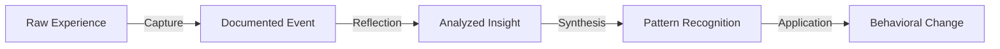
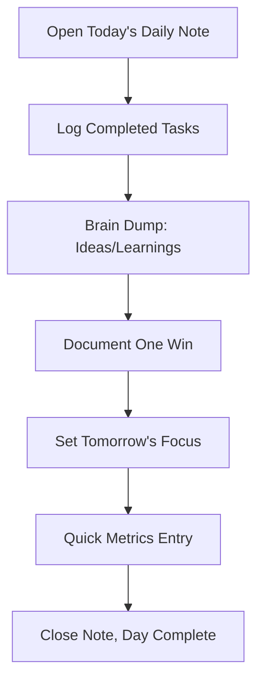
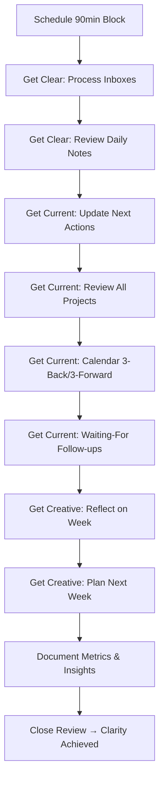
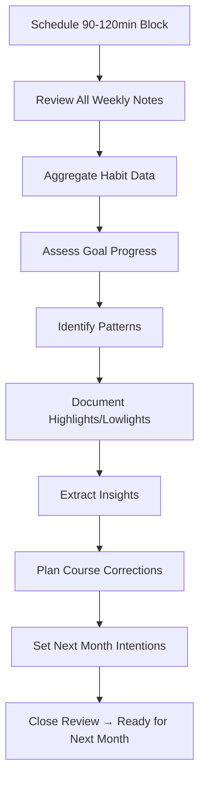

# Extraction Report: []

> [!info] Auto-Generated Report
> This report was automatically generated by `pkb_extractor.py` on 2026-03-13 04:18.
> **Source**: `reference-comprehensive-pkb-system-user-review-202511211757.md` | **Items Extracted**: 606

---

## 📋 Document Overview

| Field | Value |
|-------|-------|
| **Source File** | `reference-comprehensive-pkb-system-user-review-202511211757.md` |
| **Extraction Date** | 2026-03-13 04:18 |
| **Word Count** | 10,408 |
| **Character Count** | 75,368 |
| **Line Count** | 2,794 |
| **Total Items Extracted** | 606 |

### Document Outline

- # 📑 Table of Contents
  - ## 🎯 Foundations: Why Personal Reviews Matter
    - ### The Purpose of Systematic Reviews
    - ### Review Cadences & Their Purposes
    - ### The Compounding Effect of Reviews
  - ## 🧠 Review Psychology & Cognitive Science
    - ### Cognitive Mechanisms Behind Effective Reviews
    - ### The Processing Pipeline: From Experience to Wisdom
    - ### Why Reviews Fail: Common Psychological Barriers
  - ## 🏗️ Plugin Ecosystem Overview
    - ### Core Plugin Stack (Essential)
      - #### 1. Periodic Notes Plugin
- # Periodic Notes Settings Structure
      - #### 2. Templater Plugin
      - #### 3. Dataview Plugin
    - ### Complementary Plugins (Recommended)
      - #### Calendar Plugin
      - #### Tasks Plugin
      - #### QuickAdd Plugin
      - #### Tracker Plugin
      - #### DB Folder Plugin
  - ## ⚙️ Technical Setup: Core Plugin Configuration
    - ### Phase 1: Folder Structure Creation
      - #### Recommended Folder Structure
    - ### Phase 2: Periodic Notes Configuration
      - #### Step-by-Step Plugin Settings
    - ### Phase 3: Templater Configuration
    - ### Phase 4: Calendar Plugin Setup
  - ## 📝 Template Architecture & Design Principles
    - ### Universal Template Components
    - ### Template Design Anti-Patterns
    - ### Metadata Strategy for Reviews
    - ### Progressive Disclosure in Template Design
  - ## 📅 Daily Review System
    - ### Purpose & Cognitive Function
    - ### Daily Template: Minimal Viable Version
- # <% tp.date.now("dddd, MMMM DD, YYYY") %>
  - ## ✅ Tasks
  - ## 📝 Notes & Captures
    - ### 💡 Key Insights
    - ### 📚 Learning Moments
  - ## 🌟 Daily Win
  - ## 🎯 Tomorrow's Focus
  - ## 📊 Quick Metrics
    - ### Daily Template: Enhanced Version (Add After 30 Days)
- # <% tp.date.now("dddd, MMMM DD, YYYY") %>
  - ## 📋 Today's Tasks
    - ### ✅ Completed
    - ### ⏰ Pending
  - ## 📝 Journal
    - ### 🌅 Morning Intention
    - ### 🌙 Evening Reflection
  - ## 🎯 Habit Tracking
  - ## 💡 Learning & Insights
    - ### 📚 Captured Knowledge
    - ### 🔗 Interesting Links
  - ## 🌟 Gratitude & Wins
    - ### Today's Win
    - ### Grateful For
  - ## 🎯 Tomorrow's Setup
  - ## 📊 Metadata
    - ### Daily Review Process & Timing
  - ## 📊 Weekly Review System (GTD-Inspired)
    - ### Purpose & Cognitive Function
    - ### Weekly Template: GTD Standard Version
- # Week <% tp.date.now("WW") %>: <% tp.date.now("MMMM DD") %> - <% tp.date.now("MMMM DD", 6, tp.file.title, "gggg-[W]WW") %>
    - ### Review Last Week's Daily Notes
  - ## 📋 GET CURRENT (20 min)
    - ### Review Next Actions
    - ### Review Projects
    - ### Review Calendar
    - ### Review Waiting-For List
    - ### Review Someday/Maybe
  - ## 🎯 GET CREATIVE (15 min)
    - ### Week in Review
    - ### Looking Ahead: Next Week
  - ## 📊 Weekly Metrics
  - ## ✅ Review Complete
    - ### Weekly Review Process Flow
  - ## 🌙 Monthly Review System
    - ### Purpose & Cognitive Function
    - ### Monthly Template: Comprehensive Version
- # <% tp.date.now("MMMM YYYY") %> Review
  - ## 📊 MONTH AT A GLANCE
    - ### Weekly Reviews Completed
    - ### Daily Note Activity
  - ## 🎯 GOAL PROGRESS REVIEW
    - ### Quarterly Goals (from [[<% tp.date.now("YYYY-[Q]Q") %>]])
  - ## 📈 PATTERN ANALYSIS
    - ### Habit Consistency
    - ### Energy & Productivity Patterns
    - ### Social & Relational Patterns
  - ## 🌟 HIGHLIGHTS & LOWLIGHTS
    - ### Wins & Accomplishments
    - ### Challenges & Disappointments
  - ## 💡 INSIGHTS & REVELATIONS
    - ### Key Learnings This Month
    - ### Shifts in Thinking
    - ### Questions I'm Sitting With
  - ## 🔄 COURSE CORRECTIONS
    - ### What to Start Doing
    - ### What to Stop Doing
    - ### What to Continue Doing
    - ### What to Do Differently
  - ## 📅 NEXT MONTH PLANNING
    - ### Theme/Intention for <% tp.date.now("MMMM", 1, tp.file.title, "YYYY-MM") %>
    - ### Top 3 Outcomes
    - ### Projects to Advance
    - ### Habits to Emphasize
    - ### People to Connect With
    - ### Self-Care Priorities
  - ## 📚 CONTENT CONSUMED
    - ### Books
    - ### Articles/Essays
    - ### Courses/Learning
  - ## 🙏 GRATITUDE
  - ## 📊 COMPREHENSIVE METRICS
    - ### Time Allocation (Estimate %)
    - ### Subjective Assessments (1-10)
  - ## ✅ Review Complete
    - ### Monthly Review Process & Best Practices
  - ## 📈 Quarterly Review System
    - ### Purpose & Cognitive Function
    - ### Quarterly Template: Strategic Version
- # Q<% tp.date.now("Q YYYY") %> Review
  - ## 📊 QUARTER OVERVIEW
    - ### Monthly Reviews Completed
    - ### Goals Achieved
  - ## 🎯 OKR EVALUATION
    - ### Objective 1: [Name]
    - ### Objective 2: [Name]
    - ### Objective 3: [Name]
  - ## 📈 TREND ANALYSIS
    - ### Productivity Trends
    - ### Energy & Well-Being Trends
    - ### Learning & Growth
  - ## 🌟 QUARTERLY HIGHLIGHTS
    - ### Professional Achievements
    - ### Personal Growth
    - ### Relationship Milestones
    - ### Creative Outputs
  - ## 🔄 QUARTERLY CHALLENGES
    - ### Major Obstacles Faced
    - ### Strategies That Didn't Work
    - ### Persistent Problems
    - ### Lessons Learned
  - ## 💡 BIG INSIGHTS
    - ### Insight 1:
    - ### Insight 2:
    - ### Insight 3:
  - ## 🎯 NEXT QUARTER PLANNING
    - ### Q<% tp.date.now("Q", 3, tp.file.title, "YYYY-[Q]Q") %> Theme:
    - ### Objectives & Key Results
    - ### Projects to Initiate
    - ### Habits to Build
    - ### Relationships to Invest In
    - ### Learning Goals
  - ## 📚 CONTENT INVENTORY
    - ### Books Completed
    - ### Courses Finished
    - ### Conferences/Events Attended
  - ## 📊 HOLISTIC WELLNESS REVIEW
    - ### Mind (Cognitive & Intellectual)
    - ### Body (Physical Health)
    - ### Soul (Spiritual & Meaning)
    - ### Work (Professional & Career)
    - ### Play (Leisure & Joy)
    - ### Love (Relationships & Connection)
  - ## ✅ Review Complete
  - ## 🎊 Annual Review System
    - ### Purpose & Cognitive Function
    - ### Annual Template: Comprehensive Reflection Version
- # <% tp.date.now("YYYY") %> Annual Review
  - ## 📊 YEAR AT A GLANCE
    - ### Reviews Completed
    - ### Annual Statistics
  - ## 🎯 ANNUAL GOALS REVIEW
    - ### Goal 1: [Name]
  - ## 🌟 THE HIGHLIGHT REEL
    - ### Professional Wins
    - ### Personal Achievements
    - ### Relationship Highlights
    - ### Creative Outputs
    - ### Unexpected Positives
  - ## 💔 THE LOWLIGHT REEL
    - ### Failures & Disappointments
    - ### Persistent Challenges
  - ## 💡 DEEPEST LEARNINGS
    - ### About Myself
    - ### About Relationships
    - ### About Work
    - ### About Life
  - ## 📈 GROWTH ASSESSMENT
    - ### Skills Developed
    - ### Character Development
  - ## 🧭 VALUES AUDIT
    - ### My Core Values (Stated)
    - ### Alignment Assessment
    - ### Values to Emphasize Next Year
  - ## 🔗 RELATIONSHIP REVIEW
    - ### Energy Creators (People Who Energized Me)
    - ### Energy Drainers (People Who Depleted Me)
    - ### New Relationships Formed
    - ### Relationships That Deepened
    - ### Relationships That Ended or Faded
  - ## 🚀 LIFE TRAJECTORY ANALYSIS
  - ## ⚓ BOAT ANCHORS & ENERGY DRAINERS
    - ### People Boat Anchors
    - ### Mindset Boat Anchors
    - ### Habit Boat Anchors
    - ### Commitment Boat Anchors
  - ## 😱 CONFRONTING FEAR
    - ### Fears That Held Me Back
  - ## 📚 CONTENT CONSUMED
    - ### Books Read (Total: )
    - ### Courses/Programs Completed
    - ### Conferences/Events Attended
    - ### Podcasts/Media That Shaped Thinking
  - ## 💰 FINANCIAL REVIEW
    - ### Income & Expenses
    - ### Financial Wins
    - ### Financial Mistakes
    - ### Next Year Financial Goals
  - ## 🏥 HEALTH & WELLNESS AUDIT
    - ### Physical Health
    - ### Mental Health
    - ### Sleep
  - ## 🎨 CREATIVE OUTPUTS
    - ### Content Created
    - ### Creative Satisfaction
  - ## 🧘 LIFE DOMAINS SATISFACTION
  - ## 🎯 NEXT YEAR VISION
    - ### Theme for <% tp.date.now("YYYY", 1) %>
    - ### Vision Statement
    - ### Annual Goals
    - ### Habits to Build
    - ### Projects to Complete
    - ### Relationships to Deepen
    - ### Learning Goals
    - ### Financial Targets
    - ### Health Milestones
  - ## 📅 QUARTERLY ROADMAP
    - ### Q1 <% tp.date.now("YYYY", 1) %>
    - ### Q2 <% tp.date.now("YYYY", 1) %>
    - ### Q3 <% tp.date.now("YYYY", 1) %>
    - ### Q4 <% tp.date.now("YYYY", 1) %>
  - ## 🙏 GRATITUDE
  - ## 🎁 GIFTS TO MY FUTURE SELF
  - ## ✅ Review Complete
    - ### Annual Review Process & Timing
  - ## 🤖 Advanced Automation Workflows
    - ### Auto-Populating Weekly Summaries from Daily Notes
    - ### Task Rollover Automation
    - ### Dynamic Period Completion Percentage
    - ### Automated Goal Progress Tracking
    - ### Custom Navigation Bars with Smart Links
  - ## 🧭 Navigation
  - ## 🛠️ Troubleshooting & Optimization
    - ### Problem 1: Templates Not Auto-Applying
    - ### Problem 2: Dataview Queries Return No Results
    - ### Problem 3: Periodic Notes Create Files in Root
    - ### Problem 4: Review Habit Inconsistency
    - ### Problem 5: Data Entry Friction Kills Momentum
    - ### Problem 6: Too Many Metrics, No Insights
- # 🔗 Related Topics for PKB Expansion
  - ## 📊 Metadata & Attribution
  - ## 🔄 Version History

---

## 📊 Extraction Summary

| Item Type | Count |
|-----------|-------|
| Callouts | 80 |
| Code Blocks | 44 |
| Color Spans | 0 |
| Definitions | 0 |
| Embeds | 0 |
| External Links | 0 |
| Footnotes | 0 |
| Headings | 267 |
| Inline Fields | 9 |
| Mermaid Diagrams | 4 |
| Tables | 2 |
| Tags | 10 |
| Wiki Links | 87 |
| **TOTAL** | **606** |

---

## 🔔 Callouts (80)

> [!note] What are Callouts?
> Callouts are `> [!TYPE]` blocks used in Obsidian for structured annotation.
> They carry semantic meaning — definitions, insights, warnings, etc.

### By Type

| Callout Type | Count |
|-------------|-------|
| `[!abstract]` | 1 |
| `[!analogy]` | 2 |
| `[!attention]` | 1 |
| `[!comprehensive-reference]` | 1 |
| `[!core-principle]` | 1 |
| `[!definition]` | 14 |
| `[!example]` | 5 |
| `[!helpful-tip]` | 8 |
| `[!how-to-use-this]` | 1 |
| `[!insight]` | 3 |
| `[!key-claim]` | 8 |
| `[!methodology-and-sources]` | 12 |
| `[!quote]` | 1 |
| `[!the-goal]` | 1 |
| `[!the-mission]` | 1 |
| `[!the-philosophy]` | 5 |
| `[!thought-experiment]` | 2 |
| `[!warning]` | 7 |
| `[!what-this-does]` | 6 |

### Full Callout List

#### 1. [COMPREHENSIVE-REFERENCE] 📚Comprehensive-Reference *(Line 38)*

> [!comprehensive-reference] 📚Comprehensive-Reference
> - **Generated**:: 2025-11-21
> - **Version**:: 1.0
> - **Type**:: Reference Documentation (Personal Review Systems)
> - **Scope**:: Complete implementation guide for conducting systematic personal reviews in Obsidian using Periodic Notes, Templater, and complementary plugins

#### 2. [ABSTRACT] Untitled *(Line 44)*

> [!abstract] Untitled
> **Executive Overview**
> This reference comprehensively documents the theory, practice, and technical implementation of systematic [[Personal Review Systems]] within [[Obsidian]], integrating [[Periodic Notes]], [[Templater]], [[Dataview]], and [[Calendar Plugin]] to create automated, sustainable [[Reflective-Practice|Reflective Practice]] workflows across daily, weekly, monthly, quarterly, and annual timeframes.

#### 3. [HOW-TO-USE-THIS] Untitled *(Line 48)*

> [!how-to-use-this] Untitled
> **Navigation Guide**
> This reference is organized into 12 major sections covering philosophical foundations through advanced technical implementation. Use the table of contents for quick navigation. Start with Sections 1-3 for conceptual grounding, then proceed to Sections 4-7 for plugin setup, Sections 8-11 for review-specific templates, and Section 12 for troubleshooting. Beginners should follow sections sequentially; experienced users can jump to specific review types or advanced automation sections.

#### 4. [THE-PHILOSOPHY] Untitled *(Line 73)*

> [!the-philosophy] Untitled
> **The Examined Life Principle**
> 
> Personal reviews transform scattered experiences into systematic learning. Without [[Reflective-Practice|Reflective Practice]], we repeat mistakes, forget insights, and lose track of progress. Reviews create the feedback loops essential for [[999-report-orginizing/_permanent-notes/_permanent-notes/Self-Regulated-Learning|Self-Regulated Learning]] and [[Metacognitive-Development|Metacognitive Development]].

#### 5. [KEY-CLAIM] Untitled *(Line 82)*

> [!key-claim] Untitled
> **Central Thesis**: Regular, structured personal reviews serve three irreplaceable functions:
> 
> 1. **Closure & Processing**: Convert open cognitive loops into completed thoughts
> 2. **Pattern Recognition**: Surface insights invisible during day-to-day execution
> 3. **Course Correction**: Enable proactive adjustment before problems compound

#### 6. [ANALOGY] Untitled *(Line 101)*

> [!analogy] Untitled
> **The Telescope Metaphor**
> 
> Daily reviews are like looking through a microscope—examining immediate details. Weekly reviews use binoculars—seeing the week's landscape. Monthly reviews are wide-angle lenses—capturing broader patterns. Quarterly reviews are aerial photography—revealing terrain you can't see from ground level. Annual reviews are orbital perspective—seeing the entire geography of your life.

#### 7. [DEFINITION] Untitled *(Line 120)*

> [!definition] Untitled
> - **Reflective Practice**:: [[Reflective-Practice|Reflective Practice]]
> - **Definition**:: The systematic examination of one's experiences, decisions, and outcomes to extract learning and improve future performance. Rooted in [[Metacognition]]—thinking about thinking.

#### 8. [THOUGHT-EXPERIMENT] Untitled *(Line 132)*

> [!thought-experiment] Untitled
> **The Lost Year Scenario**
> 
> Imagine two people experience identical years with identical events. Person A never reflects; Person B conducts monthly reviews. At year end:
> 
> - Person A vaguely recalls highlights, feels year "went by fast"
> - Person B has documented 12 months of insights, sees clear progression, identifies patterns
> 
> Same experiences, radically different learning outcomes. The difference: systematic reflection.

#### 9. [METHODOLOGY-AND-SOURCES] Untitled *(Line 154)*

> [!methodology-and-sources] Untitled
> **Zimmerman's Self-Regulated Learning Cycle**
> 
> Educational psychologist Barry Zimmerman identified three phases essential for learning:
> 
> 1. **Forethought Phase** (Planning): Set goals, strategize, activate prior knowledge
> 2. **Performance Phase** (Execution): Monitor progress, adjust tactics, maintain focus
> 3. **Self-Reflection Phase** (Review): Evaluate outcomes, attribute causality, adapt
> 
> Personal reviews operationalize Phase 3, which then informs the next cycle's Phase 1.

#### 10. [WARNING] Untitled *(Line 169)*

> [!warning] Untitled
> **The Seven Deadly Sins of Personal Reviews**
> 
> 1. **Perfection Paralysis**: Waiting for the "perfect system" before starting
> 2. **Overwhelm Accumulation**: Letting unprocessed items pile up until review feels impossible
> 3. **Guilt Spiral**: Using reviews to shame rather than learn
> 4. **Vanity Metrics**: Tracking impressive-sounding but meaningless data
> 5. **Inconsistency**: Reviewing sporadically rather than systematically
> 6. **Surface-Level Processing**: Going through motions without genuine reflection
> 7. **Action Avoidance**: Reflecting without implementing insights

#### 11. [WHAT-THIS-DOES] Untitled *(Line 184)*

> [!what-this-does] Untitled
> This section maps the complete plugin architecture required for a comprehensive review system in [[Obsidian]]. Each plugin serves specific functions that, when integrated, create a seamless review workflow.

#### 12. [DEFINITION] Untitled *(Line 193)*

> [!definition] Untitled
> - **Periodic Notes**:: [[Periodic Notes]]
> - **Definition**:: Plugin that extends Obsidian's core daily notes functionality to include weekly, monthly, quarterly, and yearly note creation with customizable templates, folder locations, and file naming conventions.

#### 13. [HELPFUL-TIP] Untitled *(Line 235)*

> [!helpful-tip] Untitled
> **ISO Week vs. Week of Year**
> 
> Periodic Notes uses "Week of Year" (ww) by default where the first week starts on January 1st. For ISO week dating (where the first week contains the first Thursday), use uppercase WW format. Choose based on your regional conventions and stick with it for consistency.

#### 14. [DEFINITION] Untitled *(Line 242)*

> [!definition] Untitled
> - **Templater**:: [[Templater]]
> - **Definition**:: Advanced templating plugin that enables dynamic content generation using variables, functions, and JavaScript code within Obsidian notes. Transforms static templates into intelligent, context-aware document generators.

#### 15. [EXAMPLE] Untitled *(Line 267)*

> [!example] Untitled
> **Dynamic Weekly Navigation Bar**
> 
> A sophisticated Templater snippet can create navigation links to adjacent periods and related notes automatically:
> 
> ```markdown
> ← [[<% tp.date.now("gggg-[W]WW", -7) %>|Last Week]] | [[<% tp.date.now("gggg-[W]WW", 7) %>|Next Week]] →
> 
> 📅 [[<% tp.date.now("YYYY-MM") %>|This Month]] | [[<% tp.date.now("YYYY-[Q]Q") %>|This Quarter]] | [[<% tp.date.now("YYYY") %>|This Year]]
> ```
> 
> This auto-generates contextual navigation without manual date calculation.

#### 16. [DEFINITION] Untitled *(Line 282)*

> [!definition] Untitled
> - **Dataview**:: [[Dataview]]
> - **Definition**:: Query language plugin that treats your vault as a database, enabling dynamic aggregation, filtering, and display of note data based on frontmatter, inline fields, tags, and content. Supports both declarative queries (DQL) and JavaScript (DataviewJS) for advanced operations.

#### 17. [METHODOLOGY-AND-SOURCES] Untitled *(Line 296)*

> [!methodology-and-sources] Untitled
> **Review-Optimized Dataview Queries**
> 
> **Query 1: Unprocessed Daily Notes (Weekly Review)**
> ```dataview
> TABLE file.ctime as "Created"
> FROM "Journal/Daily"
> WHERE file.ctime >= date(now) - dur(7 days)
>   AND file.ctime < date(now)
> SORT file.ctime DESC
> ```
> 
> **Query 2: Habit Tracking Aggregation (Monthly Review)**
> ```dataviewjs
> const pages = dv.pages('"Journal/Daily"')
>   .where(p => p.file.ctime >= dv.date('2025-11-01') 
>     && p.file.ctime < dv.date('2025-12-01'));
> 
> dv.table(["Date", "Exercise", "Reading", "Meditation"],
>   pages.map(p => [
>     p.file.name,
>     p.exercise || "❌",
>     p.reading || "❌",
>     p.meditation || "❌"
>   ])
> );
> ```
> 
> **Query 3: Incomplete Tasks Across Vault (Weekly Processing)**
> ```dataview
> TASK
> FROM "Projects" OR "Journal"
> WHERE !completed
>   AND (due < date(now) OR !due)
> GROUP BY file.link
> ```

#### 18. [WHAT-THIS-DOES] Untitled *(Line 337)*

> [!what-this-does] Untitled
> Provides visual calendar interface for navigating periodic notes. Integrates seamlessly with Periodic Notes, allowing note creation by clicking dates or week numbers.

#### 19. [DEFINITION] Untitled *(Line 354)*

> [!definition] Untitled
> - **Tasks Plugin**:: [[Tasks-Plugin|Tasks Plugin]]
> - **Definition**:: Advanced task management system with support for due dates, scheduled dates, recurring tasks, priorities, and powerful query syntax for task aggregation and filtering.

#### 20. [WHAT-THIS-DOES] Untitled *(Line 375)*

> [!what-this-does] Untitled
> Macro automation plugin for rapid note creation and content capture. Particularly valuable for friction-free idea capture during reviews.

#### 21. [DEFINITION] Untitled *(Line 387)*

> [!definition] Untitled
> - **Tracker Plugin**:: [[Tracker-Plugin|Tracker Plugin]]
> - **Definition**:: Visualization plugin that renders charts and graphs from inline field data across multiple notes, enabling visual habit tracking and metric analysis.

#### 22. [EXAMPLE] Untitled *(Line 398)*

> [!example] Untitled
> **Habit Tracker in Weekly Review**
> 
> Emoji-based habit tracking with visual charts:
> 
> ```markdown
> ## 📊 Habit Tracking
> 
> | Day | Exercise | Reading | Meditation |
> |-----|----------|---------|------------|
> | Mon | ✅ | ✅ | ❌ |
> | Tue | ✅ | ❌ | ✅ |
> | Wed | ❌ | ✅ | ✅ |
> | Thu | ✅ | ✅ | ✅ |
> | Fri | ✅ | ✅ | ❌ |
> | Sat | ✅ | ✅ | ✅ |
> | Sun | ❌ | ✅ | ✅ |
> 
> Tracker
> searchType: tag
> searchTarget: habit-tracker
> folder: Journal/Daily
> ```

#### 23. [DEFINITION] Untitled *(Line 424)*

> [!definition] Untitled
> - **DB Folder**:: [[DB Folder]]
> - **Definition**:: Creates Notion-like database views from folders, enabling spreadsheet-style editing of note metadata and inline fields.

#### 24. [METHODOLOGY-AND-SOURCES] Untitled *(Line 439)*

> [!methodology-and-sources] Untitled
> **Setup Philosophy**
> 
> Configure plugins following the **Progressive Disclosure Principle**: Start with minimal, functional setup, then incrementally add sophistication as you understand your actual review needs. Avoid over-engineering before you've established review habits.

#### 25. [THE-GOAL] Untitled *(Line 448)*

> [!the-goal] Untitled
> **Folder Architecture Goals**
> 
> 1. **Clarity**: Obvious where each note type belongs
> 2. **Automation-Friendly**: Easy for Templater to auto-file notes
> 3. **Scalability**: Accommodates years of notes without reorganization
> 4. **Queryability**: Dataview can easily target specific periods

#### 26. [HELPFUL-TIP] Untitled *(Line 504)*

> [!helpful-tip] Untitled
> **Year-Based Sub-Folders for Daily/Weekly Notes**
> 
> Daily and weekly notes accumulate rapidly (365+ and 52+ per year respectively). Organizing them into year-based subdirectories prevents folder bloat while maintaining chronological clarity. Monthly/quarterly/yearly notes can remain in single folders since they accumulate slowly.

#### 27. [ATTENTION] Untitled *(Line 524)*

> [!attention] Untitled
> **Dynamic Folder Paths with Templater**
> 
> You can embed Templater syntax directly in the folder path to create dynamic, date-based folder hierarchies. The `<% tp.date.now("YYYY") %>` command auto-creates year folders as needed.

#### 28. [KEY-CLAIM] Untitled *(Line 538)*

> [!key-claim] Untitled
> **Week Format Decision is Critical**
> 
> Choose between:
> - `gggg-[W]WW` = ISO Week (week 1 contains first Thursday)
> - `YYYY-[W]ww` = Week of Year (week 1 starts Jan 1)
> 
> This decision affects all date calculations and should align with your regional/organizational conventions. **Document your choice** and never change it mid-vault.

#### 29. [WARNING] Untitled *(Line 586)*

> [!warning] Untitled
> **"Trigger on New File" Must Be Enabled**
> 
> This setting is essential for automatic template application. When Periodic Notes creates a new note, Templater immediately executes any embedded commands, enabling dynamic content generation and automatic file organization.

#### 30. [WHAT-THIS-DOES] Untitled *(Line 601)*

> [!what-this-does] Untitled
> **Filename Template Magic**
> 
> The `filename_template.md` acts as a routing system. It uses Templater logic to detect the note's filename pattern (e.g., "2025-11-22" vs "2025-W47" vs "2025-11"), then applies the appropriate periodic template and moves the file to the correct subfolder.

#### 31. [HELPFUL-TIP] Untitled *(Line 643)*

> [!helpful-tip] Untitled
> **Regex Pattern Matching for Auto-Routing**
> 
> This template uses regular expressions (regex) to identify note types by filename pattern, then applies the correct template and moves to the appropriate folder. **Test thoroughly** with sample notes before deploying vault-wide.

#### 32. [THE-PHILOSOPHY] Untitled *(Line 671)*

> [!the-philosophy] Untitled
> **The Living Template Principle**
> 
> Templates are not static forms—they're dynamic systems that evolve with your review practice. Start minimal, observe friction points, incrementally add sophistication. Your templates should feel like helpful structure, not bureaucratic overhead.

#### 33. [CORE-PRINCIPLE] Untitled *(Line 680)*

> [!core-principle] Untitled
> **The Five-Section Framework**
> 
> Regardless of review frequency, all templates should include:
> 
> 1. **Metadata & Navigation** → Orientation within time
> 2. **Capture/Data Entry** → What happened this period
> 3. **Analysis & Reflection** → What does it mean
> 4. **Forward Planning** → What comes next
> 5. **Connection & Context** → Links to related notes

#### 34. [WARNING] Untitled *(Line 693)*

> [!warning] Untitled
> **Common Template Mistakes That Kill Review Habits**
> 
> 1. **The Questionnaire Trap**: 30+ reflection questions create analysis paralysis
> 2. **The Data Graveyard**: Collecting metrics you never analyze or act on
> 3. **The Perfection Prison**: Templates so elaborate they take hours to complete
> 4. **The Copy-Paste Syndrome**: Identical questions at every review level
> 5. **The Friction Factory**: Manual steps that could be automated
> 6. **The Vagueness Void**: Prompts too abstract to generate actionable insights
> 7. **The Missing Links**: No connection between review levels (daily → weekly → monthly)

#### 35. [METHODOLOGY-AND-SOURCES] Untitled *(Line 708)*

> [!methodology-and-sources] Untitled
> **Standardized Frontmatter Taxonomy**
> 
> ```yaml
> ---
> type: daily-note | weekly-review | monthly-review | quarterly-review | annual-review
> date: YYYY-MM-DD
> week: YYYY-WXX [for weekly/daily]
> month: YYYY-MM [for monthly/daily]
> quarter: YYYY-QX [for quarterly/monthly/daily]
> year: YYYY
> status: draft | complete | archived
> energy_level: 1-10 [subjective scale]
> mood: emoji or text descriptor
> focus_area: tag or topic
> tags: [#review, #reflection, #productivity, specific themes]
> ---
> ```
> 
> **Why This Structure**:
> - `type` enables filtering by review category
> - Temporal metadata allows hierarchical aggregation
> - `status` tracks review completion
> - Subjective metrics (`energy_level`, `mood`) reveal patterns over time
> - `focus_area` enables thematic analysis across periods

#### 36. [EXAMPLE] Untitled *(Line 738)*

> [!example] Untitled
> **Three-Tier Template Architecture**
> 
> **Tier 1: Minimal Viable Template** (Core structure only)
> - Encourages immediate use without intimidation
> - Sufficient for establishing habit
> - Example: Daily template with just date, tasks, brief reflection
> 
> **Tier 2: Enhanced Template** (After 30 days of Tier 1)
> - Adds habit tracking, energy logging, win documentation
> - Dataview queries for pattern visibility
> - Example: Weekly template aggregating daily data
> 
> **Tier 3: Advanced Template** (After 90 days of consistent use)
> - Sophisticated automation, visual dashboards, predictive insights
> - Custom JavaScript for complex analysis
> - Example: Monthly template with habit trend charts, goal progress bars

#### 37. [DEFINITION] Untitled *(Line 760)*

> [!definition] Untitled
> - **Daily Review**:: [[Daily Review]]
> - **Definition**:: Brief end-of-day reflection (5-15 minutes) focused on capturing the day's events, processing immediate insights, and preparing for the next day. Primary function is [[Working-Memory|Working Memory]] management and maintaining [[Open Loop]] hygiene.

#### 38. [HELPFUL-TIP] Untitled *(Line 774)*

> [!helpful-tip] Untitled
> **Daily Reviews Are NOT Full Reflections**
> 
> Resist the urge to do deep analysis daily. Daily reviews are rapid capture and light processing. Save heavy synthesis for weekly+ reviews. Think "record" not "analyze."

#### 39. [WHAT-THIS-DOES] Untitled *(Line 829)*

> [!what-this-does] Untitled
> **Component Breakdown**
> 
> - **Navigation Links**: Auto-generate links to adjacent days and parent periods
> - **Tasks Section**: Integrates with Tasks plugin for query aggregation
> - **Captures**: Low-friction input for ideas, learnings, observations
> - **Daily Win**: Anchors memory with peak-end rule—always end on positive note
> - **Tomorrow's Focus**: Activates forethought phase of SRL cycle
> - **Metrics**: Inline fields for Dataview analysis in weekly/monthly reviews

#### 40. [INSIGHT] Untitled *(Line 940)*

> [!insight] Untitled
> **Habit Tracking Design**
> 
> Use emoji checkboxes (✅/❌) or simple symbols for rapid entry. The table format enables easy Dataview aggregation into weekly charts. Resist tracking more than 5-7 habits—focus beats exhaustiveness.

#### 41. [METHODOLOGY-AND-SOURCES] Untitled *(Line 947)*

> [!methodology-and-sources] Untitled
> **Optimal Daily Review Cadence**
> 
> **Evening Review (Preferred)**: 5-15 minutes before end of workday or before bed
> - Captures fresh memories
> - Creates closure for the day
> - Primes tomorrow's focus
> - Leverages peak-end rule—ending day with reflection improves next-day mood
> 
> **Morning Review (Alternative)**: First 10 minutes of day
> - Reviews yesterday's notes
> - Sets today's intention
> - Works better for night owls who lack evening energy

#### 42. [DEFINITION] Untitled *(Line 977)*

> [!definition] Untitled
> - **Weekly Review**:: [[Weekly Review]]
> - **Definition**:: Comprehensive 30-90 minute review process originating from David Allen's GTD methodology. Purpose is to achieve "clarity and control" by processing all inputs, reviewing all projects, and ensuring every commitment has a next action.

#### 43. [KEY-CLAIM] Untitled *(Line 985)*

> [!key-claim] Untitled
> **Weekly Review is Your System's Heartbeat**
> 
> Skip weekly reviews, and your PKB degrades into chaos within 2-3 weeks. Daily reviews capture; weekly reviews process and organize. This is non-negotiable maintenance for trusted system status.

#### 44. [METHODOLOGY-AND-SOURCES] Untitled *(Line 1041)*

> [!methodology-and-sources] Untitled
> Check all context lists. Mark completed. Delete irrelevant. Upgrade priorities as needed.

#### 45. [KEY-CLAIM] Untitled *(Line 1061)*

> [!key-claim] Untitled
> Every active project MUST have at least one next action. Projects without next actions are "stuck" and need attention NOW.

#### 46. [METHODOLOGY-AND-SOURCES] Untitled *(Line 1082)*

> [!methodology-and-sources] Untitled
> Calendar review serves three functions: reflect on past commitments (did I miss anything?), prep for upcoming week (what needs advance prep?), and scan 2-3 weeks ahead for future obligations.

#### 47. [HELPFUL-TIP] Untitled *(Line 1198)*

> [!helpful-tip] Untitled
> **Weekly Review Duration Calibration**
> 
> A thorough weekly review typically takes 1-2 hours, especially initially. As your system matures and you maintain daily reviews, this can compress to 30-60 minutes. Don't rush—quality trumps speed.

#### 48. [WARNING] Untitled *(Line 1219)*

> [!warning] Untitled
> **The Weekly Review Non-Negotiables**
> 
> If you only do three things in weekly review, make them these:
> 
> 1. **Inbox to Zero**: All collect points processed
> 2. **Every Project Has Next Action**: No "stuck" projects
> 3. **Calendar Reviewed**: No surprises upcoming
> 
> Everything else is enhancement. These three are essential for system trust.

#### 49. [DEFINITION] Untitled *(Line 1234)*

> [!definition] Untitled
> - **Monthly Review**:: [[Monthly Review]]
> - **Definition**:: Mid-depth review (45-120 minutes) focused on pattern recognition across weekly data, goal progress assessment, and strategic course correction. Bridges tactical weekly execution with strategic quarterly planning.

#### 50. [ANALOGY] Untitled *(Line 1249)*

> [!analogy] Untitled
> **The Flight Analogy**
> 
> If daily reviews are checking instruments during flight, and weekly reviews are minor heading corrections, monthly reviews are landing at an airport, checking the map, and confirming you're still heading to the right destination.

#### 51. [KEY-CLAIM] Untitled *(Line 1302)*

> [!key-claim] Untitled
> Monthly reviews are where you compare intentions against reality. Where goals aren't progressing, either the goal needs revision or your actions need recalibration.

#### 52. [METHODOLOGY-AND-SOURCES] Untitled *(Line 1329)*

> [!methodology-and-sources] Untitled
> Pattern analysis surfaces insights only visible across 4+ weeks of data. Look for correlations between variables (e.g., low energy days correlating with skipped exercise).

#### 53. [THE-PHILOSOPHY] Untitled *(Line 1381)*

> [!the-philosophy] Untitled
> Documenting both peaks and valleys creates balanced perspective and enables learning from both successes and challenges.

#### 54. [HELPFUL-TIP] Untitled *(Line 1522)*

> [!helpful-tip] Untitled
> **Optimal Monthly Review Timing**
> 
> Conduct monthly reviews in the first 3-5 days of the new month when memories of the previous month are fresh but you have distance for perspective. Avoid waiting until mid-month when data feels stale.

#### 55. [WARNING] Untitled *(Line 1542)*

> [!warning] Untitled
> **The Monthly Review Trap: Over-Optimization**
> 
> Monthly reviews can devolve into obsessive metric analysis without actionable outcomes. Remember: the goal is insight → adjustment → action, not exhaustive data collection.

#### 56. [DEFINITION] Untitled *(Line 1551)*

> [!definition] Untitled
> - **Quarterly Review**:: [[Quarterly Review]]
> - **Definition**:: Strategic review (2-4 hours) focused on evaluating 3-month performance against goals, identifying major trends, and recalibrating direction for the next quarter. Functions as a "mini-annual review" with action-oriented focus.

#### 57. [KEY-CLAIM] Untitled *(Line 1565)*

> [!key-claim] Untitled
> **Quarters Enable Realistic Goal Cycles**
> 
> Quarterly planning aligns with human attention cycles better than annual planning. 90 days is long enough for meaningful progress, short enough to maintain focus.

#### 58. [DEFINITION] Untitled *(Line 1613)*

> [!definition] Untitled
> - **OKR (Objectives & Key Results)**:: [[OKR Framework]]
> - **Definition**:: Goal-setting framework where Objectives define *what* you want to achieve (qualitative, inspirational) and Key Results define *how* you'll measure success (quantitative, specific).

#### 59. [METHODOLOGY-AND-SOURCES] Untitled *(Line 1653)*

> [!methodology-and-sources] Untitled
> Quarterly reviews reveal trends invisible at monthly granularity. Look for persistent patterns across all three months.

#### 60. [INSIGHT] Untitled *(Line 1745)*

> [!insight] Untitled
> Quarterly reviews should surface 2-3 major insights that shift your understanding or approach. If you don't have any, you're not reflecting deeply enough.

#### 61. [DEFINITION] Untitled *(Line 1860)*

> [!definition] Untitled
> - **Annual Review**:: [[Annual Review]]
> - **Definition**:: Comprehensive life review (4-8 hours) examining the past year through multiple lenses—achievements, failures, growth, relationships, values alignment—and setting direction for the coming year. Combines rigorous self-assessment with forward-looking strategy.

#### 62. [THE-PHILOSOPHY] Untitled *(Line 1876)*

> [!the-philosophy] Untitled
> **The Decade Perspective**
> 
> Most people overestimate what they can do in a year and underestimate what they can do in ten years. Annual reviews contextualize the year within the decade-long arc of your life.

#### 63. [QUOTE] Untitled *(Line 1896)*

> [!quote] Untitled
> *"We do not learn from experience… we learn from reflecting on experience." — John Dewey*

#### 64. [METHODOLOGY-AND-SOURCES] Untitled *(Line 1928)*

> [!methodology-and-sources] Untitled
> Start by revisiting goals set last January. Resist revising history—document what you *actually* planned, not what you wish you'd planned.

#### 65. [KEY-CLAIM] Untitled *(Line 1944)*

> [!key-claim] Untitled
> Document 10-15 peak moments from the year. These anchor memory and counteract negativity bias.

#### 66. [WARNING] Untitled *(Line 1978)*

> [!warning] Untitled
> Process disappointments with compassion, not shame. The goal is learning, not self-flagellation.

#### 67. [INSIGHT] Untitled *(Line 2006)*

> [!insight] Untitled
> Annual reviews should generate 5-10 major learnings. These become your operating principles for next year.

#### 68. [THE-PHILOSOPHY] Untitled *(Line 2047)*

> [!the-philosophy] Untitled
> Living according to stated values creates fulfillment. Misalignment creates cognitive dissonance and dissatisfaction.

#### 69. [THOUGHT-EXPERIMENT] Untitled *(Line 2108)*

> [!thought-experiment] Untitled
> **The Five-Year Projection**
> 
> If you continue on your current trajectory for five years, where will you end up? Is that where you want to go?

#### 70. [DEFINITION] Untitled *(Line 2139)*

> [!definition] Untitled
> - **Boat Anchors**:: [[Boat Anchors]]
> - **Definition**:: People, mindsets, habits, or commitments that hold you back from your potential. They create drag on your life's forward momentum.

#### 71. [KEY-CLAIM] Untitled *(Line 2168)*

> [!key-claim] Untitled
> Fear prevents more progress than lack of ability. Annual reviews must make fear visible and actionable.

#### 72. [THE-MISSION] Untitled *(Line 2285)*

> [!the-mission] Untitled
> **Vision Before Goals**
> 
> Effective annual planning starts with vision, not goals. Imagine your ideal future self, then reverse-engineer the path.

#### 73. [HELPFUL-TIP] Untitled *(Line 2416)*

> [!helpful-tip] Untitled
> **Optimal Annual Review Schedule**
> 
> Conduct annual reviews during the last week of December or first week of January. Many find late December preferable when the year's events are fresh. Block 4-8 hours over 2-3 sessions rather than attempting in one sitting.

#### 74. [WHAT-THIS-DOES] Untitled *(Line 2425)*

> [!what-this-does] Untitled
> This section details sophisticated automation techniques that reduce manual effort in review workflows, enabling you to focus on reflection rather than data entry.

#### 75. [EXAMPLE] Untitled *(Line 2432)*

> [!example] Untitled
> **Automatic Habit Aggregation**
> 
> In your Weekly Template, add this Dataview query:

#### 76. [METHODOLOGY-AND-SOURCES] Untitled *(Line 2467)*

> [!methodology-and-sources] Untitled
> **Automatic Task Migration Process**
> 
> Using the Tasks plugin with Templater:

#### 77. [EXAMPLE] Untitled *(Line 2568)*

> [!example] Untitled
> **Smart Multi-Level Navigation**

#### 78. [WARNING] Untitled *(Line 2598)*

> [!warning] Untitled
> **Common Issues & Solutions**

#### 79. [HELPFUL-TIP] Untitled *(Line 2651)*

> [!helpful-tip] Untitled
> **The 80/20 Rule for Reviews**
> 
> 80% of review value comes from 20% of activities. Focus on: (1) Inbox processing, (2) Project next actions, (3) Calendar scanning, (4) Weekly reflection. Everything else is optional enhancement.

#### 80. [METHODOLOGY-AND-SOURCES] Untitled *(Line 2709)*

> [!methodology-and-sources] Untitled
> **Research Methodology**
> - Web search analysis of periodic notes implementations (2023-2025)
> - GTD methodology resources (David Allen's systems and community implementations)
> - Community-developed template repositories on GitHub
> - Personal review frameworks from productivity researchers (Sahil Bloom, RescueTime, reflection practitioners)
> - Official plugin documentation from Periodic Notes, Templater, Dataview developers
> 
> **Synthesis Approach**: Integrated technical implementation (plugins/templates) with cognitive science foundations (SRL, metacognition, reflective practice) and real-world usage patterns (GTD, habit tracking, goal setting)
> 
> **Confidence Levels**:
> - Plugin setup instructions: 🟢 HIGH (based on official docs + community validation)
> - Template structures: 🟢 HIGH (refined through extensive community use)
> - Review frequency recommendations: 🟢 HIGH (grounded in GTD + educational psychology)
> - Automation complexity: 🟡 MEDIUM (requires testing in specific vault contexts)

---

## 🔗 Wiki-Links (87 total, 62 unique targets)

> [!info] Knowledge Graph Connections
> These links represent connections to other notes in your PKB.
> **62** distinct notes are referenced.

### Unique Targets

- [[03-notes/01_permanent-notes/02_personal-knowledge-base/Personal Knowledge Management]]
- [[<% tp.date.now("YYYY") %>]]
- [[<% tp.date.now("YYYY", -1, tp.file.title, "YYYY") %>]]
- [[<% tp.date.now("YYYY", 1, tp.file.title, "YYYY") %>]]
- [[<% tp.date.now("YYYY-MM") %>]]
- [[<% tp.date.now("YYYY-MM", -1, tp.file.title, "YYYY-MM") %>]]
- [[<% tp.date.now("YYYY-MM", 1, tp.file.title, "YYYY-MM") %>]]
- [[<% tp.date.tomorrow("YYYY-MM-DD") %>]]
- [[<% tp.date.yesterday("YYYY-MM-DD") %>]]
- [[<%= lastWeek %>]]
- [[<%= nextWeek %>]]
- [[<%= thisMonth %>]]
- [[<%= thisQuarter %>]]
- [[<%= thisWeek %>]]
- [[<%= thisYear %>]]
- [[<%= tomorrow.format('YYYY-MM-DD') %>]]
- [[<%= yesterday.format('YYYY-MM-DD') %>]]
- [[Annual Review]]
- [[Boat Anchors]]
- [[Building a Second Brain]]
- [[Calendar Plugin]]
- [[DB Folder]]
- [[Daily Review]]
- [[Daily-Template]]
- [[Dataview]]
- [[Executive-Function|Executive Function]]
- [[GTD|GTD (Getting Things Done)]]
- [[GTD Implementation in Obsidian - Deep Dive]]
- [[Goal Setting]]
- [[Habit Formation & Behavioral Change Science]]
- [[Habit Tracking]]
- [[Metacognition]]
- [[Metacognition & Self-Regulated Learning Theory]]
- [[Metacognitive-Development|Metacognitive Development]]
- [[Monthly Review]]
- [[Monthly-Template]]
- [[OKR Framework]]
- [[Open Loop]]
- [[Periodic Notes]]
- [[Personal-Knowledge-Management|Personal Knowledge Management]]
- [[Personal Review Systems]]
- [[Progressive-Summarization|Progressive Summarization]]
- [[Progressive Summarization in Zettelkasten Systems]]
- [[Quarterly Planning]]
- [[Quarterly Review]]
- [[Quarterly-Template]]
- [[QuickAdd]]
- [[Reflective-Practice|Reflective Practice]]
- [[999-report-orginizing/_permanent-notes/_permanent-notes/Self-Regulated-Learning|Self-Regulated Learning]]
- [[Spaced-Repetition-Spacing-Effect|Spaced Repetition]]
- [[Tasks-Plugin|Tasks Plugin]]
- [[Templater]]
- [[Time-Block Planning]]
- [[Tracker-Plugin|Tracker Plugin]]
- [[Weekly Review]]
- [[Weekly-Template]]
- [[Working-Memory|Working Memory]]
- [[Yearly Reflection]]
- [[Yearly-Template]]
- [[Zettelkasten]]
- [[Dataview]]
- [[Obsidian]]

### All Occurrences

| # | Target | Display Text | Heading | Section | Line |
|---|--------|-------------|---------|---------|------|
| 1 | [[Personal Review Systems]] | — | — | Document Start | 46 |
| 2 | [[Obsidian]] | — | — | Document Start | 46 |
| 3 | [[Periodic Notes]] | — | — | Document Start | 46 |
| 4 | [[Templater]] | — | — | Document Start | 46 |
| 5 | [[Dataview]] | — | — | Document Start | 46 |
| 6 | [[Calendar Plugin]] | — | — | Document Start | 46 |
| 7 | [[Reflective-Practice|Reflective Practice]] | — | — | Document Start | 46 |
| 8 | [[Reflective-Practice|Reflective Practice]] | — | — | 🎯 Foundations: Why Personal Reviews M... | 76 |
| 9 | [[Self-Regulated-Learning-—-SRL|Self-Regulated Learning]] | — | — | 🎯 Foundations: Why Personal Reviews M... | 76 |
| 10 | [[Metacognitive-Development|Metacognitive Development]] | — | — | 🎯 Foundations: Why Personal Reviews M... | 76 |
| 11 | [[GTD|GTD (Getting Things Done)]] | — | — | The Purpose of Systematic Reviews | 80 |
| 12 | [[Building a Second Brain]] | — | — | The Purpose of Systematic Reviews | 80 |
| 13 | [[Working-Memory|Working Memory]] | — | — | Review Cadences & Their Purposes | 95 |
| 14 | [[Executive-Function|Executive Function]] | — | — | Review Cadences & Their Purposes | 96 |
| 15 | [[Metacognition]] | — | — | Review Cadences & Their Purposes | 97 |
| 16 | [[03-notes/01_permanent-notes/02_personal-knowledge-base/Personal Knowledge Management]] | — | — | The Compounding Effect of Reviews | 114 |
| 17 | [[Reflective-Practice|Reflective Practice]] | — | — | 🧠 Review Psychology & Cognitive Science | 121 |
| 18 | [[Metacognition]] | — | — | 🧠 Review Psychology & Cognitive Science | 122 |
| 19 | [[Obsidian]] | — | — | 🏗️ Plugin Ecosystem Overview | 185 |
| 20 | [[Periodic Notes]] | — | — | 1. Periodic Notes Plugin | 194 |
| 21 | [[Templater]] | — | — | 2. Templater Plugin | 243 |
| 22 | [[<% tp.date.now("YYYY-MM") %>]] | This Month | — | 2. Templater Plugin | 275 |
| 23 | [[<% tp.date.now("YYYY") %>]] | This Year | — | 2. Templater Plugin | 275 |
| 24 | [[Dataview]] | — | — | 3. Dataview Plugin | 283 |
| 25 | [[Tasks-Plugin|Tasks Plugin]] | — | — | Tasks Plugin | 355 |
| 26 | [[Tracker-Plugin|Tracker Plugin]] | — | — | Tracker Plugin | 388 |
| 27 | [[DB Folder]] | — | — | DB Folder Plugin | 425 |
| 28 | [[Daily-Template]] | — | — | Phase 3: Templater Configuration | 613 |
| 29 | [[Weekly-Template]] | — | — | Phase 3: Templater Configuration | 621 |
| 30 | [[Monthly-Template]] | — | — | Phase 3: Templater Configuration | 627 |
| 31 | [[Quarterly-Template]] | — | — | Phase 3: Templater Configuration | 632 |
| 32 | [[Yearly-Template]] | — | — | Phase 3: Templater Configuration | 637 |
| 33 | [[Daily Review]] | — | — | 📅 Daily Review System | 761 |
| 34 | [[Working-Memory|Working Memory]] | — | — | 📅 Daily Review System | 762 |
| 35 | [[Open Loop]] | — | — | 📅 Daily Review System | 762 |
| 36 | [[<% tp.date.yesterday("YYYY-MM-DD") %>]] | Yesterday | — | <% tp.date.now("dddd, MMMM DD, YYYY") %> | 794 |
| 37 | [[<% tp.date.tomorrow("YYYY-MM-DD") %>]] | Tomorrow | — | <% tp.date.now("dddd, MMMM DD, YYYY") %> | 794 |
| 38 | [[<% tp.date.now("YYYY-MM") %>]] | This Month | — | <% tp.date.now("dddd, MMMM DD, YYYY") %> | 795 |
| 39 | [[<% tp.date.yesterday("YYYY-MM-DD") %>]] | Yesterday | — | <% tp.date.now("dddd, MMMM DD, YYYY") %> | 854 |
| 40 | [[<% tp.date.tomorrow("YYYY-MM-DD") %>]] | Tomorrow | — | <% tp.date.now("dddd, MMMM DD, YYYY") %> | 854 |
| 41 | [[<% tp.date.now("YYYY-MM") %>]] | This Month | — | <% tp.date.now("dddd, MMMM DD, YYYY") %> | 855 |
| 42 | [[<% tp.date.now("YYYY") %>]] | This Year | — | <% tp.date.now("dddd, MMMM DD, YYYY") %> | 855 |
| 43 | [[Weekly Review]] | — | — | 📊 Weekly Review System (GTD-Inspired) | 978 |
| 44 | [[<% tp.date.now("YYYY-MM") %>]] | This Month | — | Week <% tp.date.now("WW") %>: <% tp.d... | 1017 |
| 45 | [[Monthly Review]] | — | — | 🌙 Monthly Review System | 1235 |
| 46 | [[<% tp.date.now("YYYY-MM", -1, tp.file.title, "YYYY-MM") %>]] | Last Month | — | <% tp.date.now("MMMM YYYY") %> Review | 1269 |
| 47 | [[<% tp.date.now("YYYY-MM", 1, tp.file.title, "YYYY-MM") %>]] | Next Month | — | <% tp.date.now("MMMM YYYY") %> Review | 1269 |
| 48 | [[<% tp.date.now("YYYY") %>]] | This Year | — | <% tp.date.now("MMMM YYYY") %> Review | 1270 |
| 49 | [[Quarterly Review]] | — | — | 📈 Quarterly Review System | 1552 |
| 50 | [[<% tp.date.now("YYYY") %>]] | This Year | — | Q<% tp.date.now("Q YYYY") %> Review | 1585 |
| 51 | [[OKR Framework]] | — | — | 🎯 OKR EVALUATION | 1614 |
| 52 | [[Annual Review]] | — | — | 🎊 Annual Review System | 1861 |
| 53 | [[<% tp.date.now("YYYY", -1, tp.file.title, "YYYY") %>]] | Last Year | — | <% tp.date.now("YYYY") %> Annual Review | 1894 |
| 54 | [[<% tp.date.now("YYYY", 1, tp.file.title, "YYYY") %>]] | Next Year | — | <% tp.date.now("YYYY") %> Annual Review | 1894 |
| 55 | [[Boat Anchors]] | — | — | ⚓ BOAT ANCHORS & ENERGY DRAINERS | 2140 |
| 56 | [[<%= yesterday.format('YYYY-MM-DD') %>]] | Yesterday | — | 🧭 Navigation | 2589 |
| 57 | [[<%= tomorrow.format('YYYY-MM-DD') %>]] | Tomorrow | — | 🧭 Navigation | 2589 |
| 58 | [[<%= lastWeek %>]] | Last Week | — | 🧭 Navigation | 2591 |
| 59 | [[<%= nextWeek %>]] | Next Week | — | 🧭 Navigation | 2591 |
| 60 | [[<%= thisWeek %>]] | This Week | — | 🧭 Navigation | 2593 |
| 61 | [[<%= thisMonth %>]] | This Month | — | 🧭 Navigation | 2593 |
| 62 | [[<%= thisQuarter %>]] | This Quarter | — | 🧭 Navigation | 2593 |
| 63 | [[<%= thisYear %>]] | This Year | — | 🧭 Navigation | 2593 |
| 64 | [[GTD Implementation in Obsidian - Deep Dive]] | — | — | 🔗 Related Topics for PKB Expansion | 2685 |
| 65 | [[Metacognition & Self-Regulated Learning Theory]] | — | — | 🔗 Related Topics for PKB Expansion | 2690 |
| 66 | [[Progressive Summarization in Zettelkasten Systems]] | — | — | 🔗 Related Topics for PKB Expansion | 2695 |
| 67 | [[Habit Formation & Behavioral Change Science]] | — | — | 🔗 Related Topics for PKB Expansion | 2700 |
| 68 | [[Periodic Notes]] | — | — | 🔄 Version History | 2758 |
| 69 | [[Templater]] | — | — | 🔄 Version History | 2759 |
| 70 | [[Personal-Knowledge-Management|Personal Knowledge Management]] | — | — | 🔄 Version History | 2760 |
| 71 | [[Reflective-Practice|Reflective Practice]] | — | — | 🔄 Version History | 2761 |
| 72 | [[GTD|GTD (Getting Things Done)]] | — | — | 🔄 Version History | 2762 |
| 73 | [[Spaced-Repetition-Spacing-Effect|Spaced Repetition]] | — | — | 🔄 Version History | 2763 |
| 74 | [[Zettelkasten]] | — | — | 🔄 Version History | 2764 |
| 75 | [[Progressive-Summarization|Progressive Summarization]] | — | — | 🔄 Version History | 2765 |
| 76 | [[Metacognition]] | — | — | 🔄 Version History | 2766 |
| 77 | [[Self-Regulated-Learning-—-SRL|Self-Regulated Learning]] | — | — | 🔄 Version History | 2767 |
| 78 | [[Calendar Plugin]] | — | — | 🔄 Version History | 2768 |
| 79 | [[Dataview]] | — | — | 🔄 Version History | 2769 |
| 80 | [[QuickAdd]] | — | — | 🔄 Version History | 2770 |
| 81 | [[Weekly Review]] | — | — | 🔄 Version History | 2771 |
| 82 | [[Monthly Review]] | — | — | 🔄 Version History | 2772 |
| 83 | [[Quarterly Planning]] | — | — | 🔄 Version History | 2773 |
| 84 | [[Yearly Reflection]] | — | — | 🔄 Version History | 2774 |
| 85 | [[Habit Tracking]] | — | — | 🔄 Version History | 2775 |
| 86 | [[Goal Setting]] | — | — | 🔄 Version History | 2776 |
| 87 | [[Time-Block Planning]] | — | — | 🔄 Version History | 2777 |

---

## 🏷️ Inline Fields (9)

> [!tip] Dataview Fields
> These `[FieldName:: Value]` pairs are queryable by Dataview.

| # | Field Name | Value | Format | Line |
|---|-----------|-------|--------|------|
| 1 | **Date Completed** | <% tp.date.now("YYYY-MM-DD HH:mm") %> | bare | 1193 |
| 2 | **Duration** | Clarity Level:: 1-10 → | bare | 1194 |
| 3 | **Completed** | <% tp.date.now("YYYY-MM-DD HH:mm") %> | bare | 1514 |
| 4 | **Duration** | Insights Captured:: | bare | 1515 |
| 5 | **Clarity Gained** | 1-10 → | bare | 1517 |
| 6 | **Completed** | <% tp.date.now("YYYY-MM-DD HH:mm") %> | bare | 1850 |
| 7 | **Duration** | Major Shifts Identified:: | bare | 1851 |
| 8 | **Completed** | <% tp.date.now("YYYY-MM-DD HH:mm") %> | bare | 2408 |
| 9 | **Duration** | Clarity Achieved:: 1-10 → | bare | 2409 |

---

## 🏷️ Tags (10 occurrences, 10 unique)

### All Unique Tags

`#goal-exercise`, `#goal-reading`, `#goal-writing`, `#obsidian`, `#periodic-reviews`, `#pkm`, `#productivity`, `#reference-note`, `#templater`, `#waiting-for`

---

## 💻 Code Blocks (44)

| Language | Count |
|----------|-------|
| `plaintext` | 20 |
| `markdown` | 11 |
| `yaml` | 10 |
| `dataview` | 2 |
| `dataviewjs` | 1 |

### Code Block 1 — `yaml` *(Lines 207-233)*

```yaml
# Periodic Notes Settings Structure
Daily Notes:
  Format: YYYY-MM-DD
  Template: Templates/Daily-Template.md
  Folder: Journal/Daily/

Weekly Notes:
  Format: gggg-[W]WW  # ISO week format
  Template: Templates/Weekly-Template.md
  Folder: Journal/Weekly/

Monthly Notes:
  Format: YYYY-MM
  Template: Templates/Monthly-Template.md
  Folder: Journal/Monthly/

Quarterly Notes:
  Format: YYYY-[Q]Q
  Template: Templates/Quarterly-Template.md
  Folder: Journal/Quarterly/

Yearly Notes:
  Format: YYYY
  Template: Templates/Yearly-Template.md
  Folder: Journal/Yearly/
```

### Code Block 2 — `markdown` *(Lines 272-276)*

```markdown
> ← [[<% tp.date.now("gggg-[W]WW", -7) %>|Last Week]] | [[<% tp.date.now("gggg-[W]WW", 7) %>|Next Week]] →
> 
> 📅 [[<% tp.date.now("YYYY-MM") %>|This Month]] | [[<% tp.date.now("YYYY-[Q]Q") %>|This Quarter]] | [[<% tp.date.now("YYYY") %>|This Year]]
>
```

### Code Block 3 — `dataview` *(Lines 300-306)*

```dataview
> TABLE file.ctime as "Created"
> FROM "Journal/Daily"
> WHERE file.ctime >= date(now) - dur(7 days)
>   AND file.ctime < date(now)
> SORT file.ctime DESC
>
```

### Code Block 4 — `dataviewjs` *(Lines 309-322)*

```dataviewjs
> const pages = dv.pages('"Journal/Daily"')
>   .where(p => p.file.ctime >= dv.date('2025-11-01') 
>     && p.file.ctime < dv.date('2025-12-01'));
> 
> dv.table(["Date", "Exercise", "Reading", "Meditation"],
>   pages.map(p => [
>     p.file.name,
>     p.exercise || "❌",
>     p.reading || "❌",
>     p.meditation || "❌"
>   ])
> );
>
```

### Code Block 5 — `dataview` *(Lines 325-331)*

```dataview
> TASK
> FROM "Projects" OR "Journal"
> WHERE !completed
>   AND (due < date(now) OR !due)
> GROUP BY file.link
>
```

### Code Block 6 — `markdown` *(Lines 367-371)*

```markdown
- [ ] Process inbox 📥 due::2025-11-22 recurs::weekly
- [ ] Review weekly goals ⏰ due::2025-11-22 priority::high
- [ ] Check waiting-for list 👥 due::2025-11-22 recurs::weekly
```

### Code Block 7 — `markdown` *(Lines 403-420)*

```markdown
> ## 📊 Habit Tracking
> 
> | Day | Exercise | Reading | Meditation |
> |-----|----------|---------|------------|
> | Mon | ✅ | ✅ | ❌ |
> | Tue | ✅ | ❌ | ✅ |
> | Wed | ❌ | ✅ | ✅ |
> | Thu | ✅ | ✅ | ✅ |
> | Fri | ✅ | ✅ | ❌ |
> | Sat | ✅ | ✅ | ✅ |
> | Sun | ❌ | ✅ | ✅ |
> 
> Tracker
> searchType: tag
> searchTarget: habit-tracker
> folder: Journal/Daily
>
```

### Code Block 8 — `plaintext` *(Lines 458-502)*

```plaintext
Your-Vault/
│
├── 📁 Templates/
│   ├── Daily-Template.md
│   ├── Weekly-Template.md
│   ├── Monthly-Template.md
│   ├── Quarterly-Template.md
│   └── Yearly-Template.md
│
├── 📁 Journal/
│   ├── 📁 Daily/
│   │   ├── 📁 2025/
│   │   │   ├── 📁 01-January/
│   │   │   │   ├── 2025-01-01.md
│   │   │   │   ├── 2025-01-02.md
│   │   │   │   └── …
│   │   │   ├── 📁 02-February/
│   │   │   └── …
│   │   └── 📁 2024/ [Archive]
│   │
│   ├── 📁 Weekly/
│   │   ├── 📁 2025/
│   │   │   ├── 2025-W01.md
│   │   │   ├── 2025-W02.md
│   │   │   └── …
│   │   └── 📁 2024/ [Archive]
│   │
│   ├── 📁 Monthly/
│   │   ├── 2025-01.md
│   │   ├── 2025-02.md
# ... (13 more lines truncated)
```

### Code Block 9 — `yaml` *(Lines 517-522)*

```yaml
Enabled: ✅ ON
Format: YYYY-MM-DD
Template: Templates/Daily-Template.md
Folder: 01-journal/01-daily/<% tp.date.now("YYYY") %>/<% tp.date.now("MM-MMMM") %>
```

### Code Block 10 — `yaml` *(Lines 531-536)*

```yaml
Enabled: ✅ ON
Format: gggg-[W]WW  # ISO week: 2025-W01
Template: Templates/Weekly-Template.md
Folder: 01-journal/02-weekly/<% tp.date.now("YYYY") %>
```

### Code Block 11 — `yaml` *(Lines 549-554)*

```yaml
Enabled: ✅ ON
Format: YYYY-MM
Template: Templates/Monthly-Template.md
Folder: 01-journal/03-monthly
```

### Code Block 12 — `yaml` *(Lines 558-563)*

```yaml
Enabled: ✅ ON
Format: YYYY-[Q]Q
Template: Templates/Quarterly-Template.md
Folder: 01-journal/04-quarterly
```

### Code Block 13 — `yaml` *(Lines 567-572)*

```yaml
Enabled: ✅ ON
Format: YYYY
Template: Templates/Yearly-Template.md
Folder: 01-journal/05-yearly
```

### Code Block 14 — `yaml` *(Lines 580-584)*

```yaml
Template folder location: Templates
Trigger Templater on new file creation: ✅ ON
Enable System Commands: ✅ ON
```

### Code Block 15 — `yaml` *(Lines 593-599)*

```yaml
Enable Folder Templates: ✅ ON
Folder Templates:
  - Add new Folder Template:
    - Folder: /Journal
    - Template: Templates/filename_template.md
```

### Code Block 16 — `markdown` *(Lines 608-641)*

```markdown
<%*
const filename = tp.file.title;
// Daily Note Pattern: YYYY-MM-DD
if (/^\d{4}-\d{2}-\d{2}$/.test(filename)) {
  await tp.file.include("[[Daily-Template]]");
  const year = filename.substring(0, 4);
  const month = filename.substring(5, 7);
  const monthName = moment(filename).format("MM-MMMM");
  await tp.file.move(`Journal/Daily/${year}/${monthName}/${filename}`);
}
// Weekly Note Pattern: YYYY-WXX
else if (/^\d{4}-W\d{2}$/.test(filename)) {
  await tp.file.include("[[Weekly-Template]]");
  const year = filename.substring(0, 4);
  await tp.file.move(`Journal/Weekly/${year}/${filename}`);
}
// Monthly Note Pattern: YYYY-MM
else if (/^\d{4}-\d{2}$/.test(filename)) {
  await tp.file.include("[[Monthly-Template]]");
  await tp.file.move(`Journal/Monthly/${filename}`);
}
// Quarterly Note Pattern: YYYY-QX
else if (/^\d{4}-Q\d$/.test(filename)) {
  await tp.file.include("[[Quarterly-Template]]");
  await tp.file.move(`Journal/Quarterly/${filename}`);
}
// Yearly Note Pattern: YYYY
else if (/^\d{4}$/.test(filename)) {
  await tp.file.include("[[Yearly-Template]]");
  await tp.file.move(`Journal/Yearly/${filename}`);
# ... (2 more lines truncated)
```

### Code Block 17 — `yaml` *(Lines 654-659)*

```yaml
Start week on: Monday [or your preference]
Show week number: ✅ ON
Words per dot: 250 [adjust based on daily note length]
Dot threshold: 0 [show dot for any note]
```

### Code Block 18 — `yaml` *(Lines 711-725)*

```yaml
> ---
> type: daily-note | weekly-review | monthly-review | quarterly-review | annual-review
> date: YYYY-MM-DD
> week: YYYY-WXX [for weekly/daily]
> month: YYYY-MM [for monthly/daily]
> quarter: YYYY-QX [for quarterly/monthly/daily]
> year: YYYY
> status: draft | complete | archived
> energy_level: 1-10 [subjective scale]
> mood: emoji or text descriptor
> focus_area: tag or topic
> tags: [#review, #reflection, #productivity, specific themes]
> ---
>
```

### Code Block 19 — `markdown` *(Lines 781-827)*

```markdown
---
type: daily-note
date: <% tp.date.now("YYYY-MM-DD") %>
week: <% tp.date.now("gggg-[W]WW") %>
month: <% tp.date.now("YYYY-MM") %>
quarter: <% tp.date.now("YYYY-[Q]Q") %>
year: <% tp.date.now("YYYY") %>
tags: [#daily, #journal]
---

# <% tp.date.now("dddd, MMMM DD, YYYY") %>

← [[<% tp.date.yesterday("YYYY-MM-DD") %>|Yesterday]] | [[<% tp.date.tomorrow("YYYY-MM-DD") %>|Tomorrow]] →
📅 [[<% tp.date.now("gggg-[W]WW") %>|This Week]] | [[<% tp.date.now("YYYY-MM") %>|This Month]]

---

## ✅ Tasks
<% tp.file.cursor(1) %>

## 📝 Notes & Captures

### 💡 Key Insights


### 📚 Learning Moments


---

# ... (15 more lines truncated)
```

### Code Block 20 — `markdown` *(Lines 841-862)*

```markdown
---
type: daily-note
date: <% tp.date.now("YYYY-MM-DD") %>
week: <% tp.date.now("gggg-[W]WW") %>
month: <% tp.date.now("YYYY-MM") %>
tags: [#daily, #journal]
energy: 
mood: 
---

# <% tp.date.now("dddd, MMMM DD, YYYY") %>

← [[<% tp.date.yesterday("YYYY-MM-DD") %>|Yesterday]] | [[<% tp.date.tomorrow("YYYY-MM-DD") %>|Tomorrow]] →
📅 [[<% tp.date.now("gggg-[W]WW") %>|This Week]] | [[<% tp.date.now("YYYY-MM") %>|This Month]] | [[<% tp.date.now("YYYY") %>|This Year]]

---

## 📋 Today's Tasks

### ✅ Completed
```

### Code Block 21 — `plaintext` *(Lines 864-867)*

```plaintext
### ⏰ Pending
```

### Code Block 22 — `plaintext` *(Lines 870-938)*

```plaintext
---

## 📝 Journal

### 🌅 Morning Intention
*What's the one thing that would make today great?*
<% tp.file.cursor(1) %>

### 🌙 Evening Reflection
*What happened today?*


---

## 🎯 Habit Tracking

| Habit | Status | Notes |
|-------|--------|-------|
| 🏃 Exercise | | |
| 📖 Reading | | |
| 🧘 Meditation | | |
| 💧 Hydration | | |
| 😴 Sleep (hours) | | |

---

## 💡 Learning & Insights

### 📚 Captured Knowledge

# ... (36 more lines truncated)
```

### Code Block 23 — `markdown` *(Lines 1002-1023)*

```markdown
---
type: weekly-review
date: <% tp.date.now("YYYY-MM-DD") %>
week: <% tp.date.now("gggg-[W]WW") %>
month: <% tp.date.now("YYYY-MM") %>
quarter: <% tp.date.now("YYYY-[Q]Q") %>
year: <% tp.date.now("YYYY") %>
status: draft
tags: [#weekly-review, #gtd, #planning]
---

# Week <% tp.date.now("WW") %>: <% tp.date.now("MMMM DD") %> - <% tp.date.now("MMMM DD", 6, tp.file.title, "gggg-[W]WW") %>

← [[<% tp.date.now("gggg-[W]WW", -7) %>|Last Week]] | [[<% tp.date.now("gggg-[W]WW", 7) %>|Next Week]] →
📅 [[<% tp.date.now("YYYY-MM") %>|This Month]] | [[<% tp.date.now("YYYY-[Q]Q") %>|This Quarter]]

---

### Review Last Week's Daily Notes
```

### Code Block 24 — `plaintext` *(Lines 1031-1044)*

```plaintext
**Quick Scan**: Any unprocessed items in daily notes?

---

## 📋 GET CURRENT (20 min)

### Review Next Actions

> [!methodology-and-sources]
> Check all context lists. Mark completed. Delete irrelevant. Upgrade priorities as needed.
```

### Code Block 25 — `plaintext` *(Lines 1049-1064)*

```plaintext
**Actions**:
- [ ] Mark completed tasks as done
- [ ] Delete no-longer-relevant tasks
- [ ] Upgrade 3-5 tasks to **This Week** priority
- [ ] Downgrade stale tasks or move to Someday/Maybe

---

### Review Projects

> [!key-claim]
> Every active project MUST have at least one next action. Projects without next actions are "stuck" and need attention NOW.
```

### Code Block 26 — `plaintext` *(Lines 1070-1101)*

```plaintext
**For Each Project**:
- [ ] Does it have a next action? If not, add one NOW
- [ ] Is the outcome still clear and relevant?
- [ ] Any waiting-for items to follow up?
- [ ] Update status if needed (active/paused/complete)

---

### Review Calendar

> [!methodology-and-sources]
> Calendar review serves three functions: reflect on past commitments (did I miss anything?), prep for upcoming week (what needs advance prep?), and scan 2-3 weeks ahead for future obligations.

**Past Week** (3 weeks back):
- Any follow-ups triggered by past meetings?
- Commitments I made that need next actions?

**Upcoming Week**:
- What events require preparation?
- Any scheduling conflicts to resolve?

**Future Horizon** (3 weeks ahead):
- Major deadlines approaching?
- Travel or special events requiring early action?

---

### Review Waiting-For List
```

### Code Block 27 — `plaintext` *(Lines 1105-1169)*

```plaintext
**Actions**:
- [ ] Follow up on items over 1 week old
- [ ] Document any received items as complete
- [ ] Add reminder tasks for critical waits

---

### Review Someday/Maybe

**Quick Scan**:
- Anything ready to move to active projects?
- Anything to delete (no longer interesting)?
- New ideas to add?

**Promoted to Active**:


---

## 🎯 GET CREATIVE (15 min)

### Week in Review

**🌟 Wins This Week**
1. 
2. 
3. 

**📚 Key Learnings**

# ... (31 more lines truncated)
```

### Code Block 28 — `plaintext` *(Lines 1183-1196)*

```plaintext
**Observations**:
*Any patterns in energy, habits, or productivity this week?*


---

## ✅ Review Complete

Date Completed:: <% tp.date.now("YYYY-MM-DD HH:mm") %>
Duration:: 
Clarity Level:: 1-10 →
```

### Code Block 29 — `markdown` *(Lines 1256-1278)*

```markdown
---
type: monthly-review
date: <% tp.date.now("YYYY-MM-DD") %>
month: <% tp.date.now("YYYY-MM") %>
quarter: <% tp.date.now("YYYY-[Q]Q") %>
year: <% tp.date.now("YYYY") %>
status: draft
tags: [#monthly-review, #reflection, #planning]
---

# <% tp.date.now("MMMM YYYY") %> Review

← [[<% tp.date.now("YYYY-MM", -1, tp.file.title, "YYYY-MM") %>|Last Month]] | [[<% tp.date.now("YYYY-MM", 1, tp.file.title, "YYYY-MM") %>|Next Month]] →
📅 [[<% tp.date.now("YYYY-[Q]Q") %>|This Quarter]] | [[<% tp.date.now("YYYY") %>|This Year]]

---

## 📊 MONTH AT A GLANCE

### Weekly Reviews Completed
```

### Code Block 30 — `plaintext` *(Lines 1285-1289)*

```plaintext
### Daily Note Activity
```

### Code Block 31 — `plaintext` *(Lines 1296-1334)*

```plaintext
---

## 🎯 GOAL PROGRESS REVIEW

> [!key-claim]
> Monthly reviews are where you compare intentions against reality. Where goals aren't progressing, either the goal needs revision or your actions need recalibration.

### Quarterly Goals (from [[<% tp.date.now("YYYY-[Q]Q") %>]])

**Goal 1**: 
- **Status**: On Track / Behind / Ahead
- **Progress**: X%
- **Key Actions This Month**:
- **Adjustments Needed**:

**Goal 2**: 
- **Status**: 
- **Progress**: 
- **Key Actions This Month**:
- **Adjustments Needed**:

**Goal 3**: 
- **Status**: 
- **Progress**: 
- **Key Actions This Month**:
- **Adjustments Needed**:

---

## 📈 PATTERN ANALYSIS
# ... (5 more lines truncated)
```

### Code Block 32 — `plaintext` *(Lines 1348-1518)*

```plaintext
**Analysis**:
*Which habits were most consistent? Least? Why?*
<% tp.file.cursor(1) %>

---

### Energy & Productivity Patterns

**High Energy Days**:
*What characterized days where energy was 7+?*


**Low Energy Days**:
*What patterns emerged on days with energy <5?*


**Most Productive Times**:
*When did I do my best work this month?*


---

### Social & Relational Patterns

Who did I interact with most frequently? Were these energizing or draining relationships?


---

## 🌟 HIGHLIGHTS & LOWLIGHTS
# ... (138 more lines truncated)
```

### Code Block 33 — `markdown` *(Lines 1572-1593)*

```markdown
---
type: quarterly-review
date: <% tp.date.now("YYYY-MM-DD") %>
quarter: <% tp.date.now("YYYY-[Q]Q") %>
year: <% tp.date.now("YYYY") %>
status: draft
tags: [#quarterly-review, #strategy, #okr]
---

# Q<% tp.date.now("Q YYYY") %> Review

← [[<% tp.date.now("YYYY-[Q]Q", -3, tp.file.title, "YYYY-[Q]Q") %>|Last Quarter]] | [[<% tp.date.now("YYYY-[Q]Q", 3, tp.file.title, "YYYY-[Q]Q") %>|Next Quarter]] →
📅 [[<% tp.date.now("YYYY") %>|This Year]]

---

## 📊 QUARTER OVERVIEW

### Monthly Reviews Completed
```

### Code Block 34 — `plaintext` *(Lines 1600-1671)*

```plaintext
### Goals Achieved

**Major Outcomes This Quarter**:
1. 
2. 
3. 

---

## 🎯 OKR EVALUATION

> [!definition]
> - **OKR (Objectives & Key Results)**:: [[OKR Framework]]
> - **Definition**:: Goal-setting framework where Objectives define *what* you want to achieve (qualitative, inspirational) and Key Results define *how* you'll measure success (quantitative, specific).

### Objective 1: [Name]

**Key Result 1**: [Metric]
- Target: 
- Actual: 
- Achievement: X%
- **Analysis**: 

**Key Result 2**: [Metric]
- Target: 
- Actual: 
- Achievement: X%
- **Analysis**: 

**Key Result 3**: [Metric]
# ... (38 more lines truncated)
```

### Code Block 35 — `plaintext` *(Lines 1686-1854)*

```plaintext
**Observations**:
*Did energy increase, decrease, or remain stable? What factors influenced this?*


---

### Learning & Growth

**Skills Developed**:
- 
- 
- 

**Knowledge Domains Expanded**:
- 
- 

**Competencies Improved**:
- 
- 

---

## 🌟 QUARTERLY HIGHLIGHTS

### Professional Achievements


### Personal Growth

# ... (136 more lines truncated)
```

### Code Block 36 — `markdown` *(Lines 1883-1905)*

```markdown
---
type: annual-review
date: <% tp.date.now("YYYY-MM-DD") %>
year: <% tp.date.now("YYYY") %>
status: draft
tags: [#annual-review, #life-reflection, #planning]
---

# <% tp.date.now("YYYY") %> Annual Review

← [[<% tp.date.now("YYYY", -1, tp.file.title, "YYYY") %>|Last Year]] | [[<% tp.date.now("YYYY", 1, tp.file.title, "YYYY") %>|Next Year]] →

> [!quote]
> *"We do not learn from experience… we learn from reflecting on experience." — John Dewey*

---

## 📊 YEAR AT A GLANCE

### Reviews Completed
```

### Code Block 37 — `plaintext` *(Lines 1914-2412)*

```plaintext
### Annual Statistics

**Days Journaled**: /365
**Average Daily Energy**: /10
**Books Read**: 
**New Skills Learned**: 
**Major Projects Completed**: 

---

## 🎯 ANNUAL GOALS REVIEW

> [!methodology-and-sources]
> Start by revisiting goals set last January. Resist revising history—document what you *actually* planned, not what you wish you'd planned.

### Goal 1: [Name]
- **Planned Outcome**: 
- **Actual Outcome**: 
- **Achievement**: X%
- **Why Gap Exists**: 
- **Lessons Learned**: 

[Repeat for all major annual goals]

---

## 🌟 THE HIGHLIGHT REEL

> [!key-claim]
> Document 10-15 peak moments from the year. These anchor memory and counteract negativity bias.
# ... (466 more lines truncated)
```

### Code Block 38 — `plaintext` *(Lines 2437-2459)*

```plaintext
const weekNum = "<% tp.date.now("gggg-[W]WW") %>";
 const dailies = dv.pages('"Journal/Daily"')
   .where(p => p.week === weekNum);
 
 // Aggregate habits
 const habits = ["exercise", "reading", "meditation"];
 const habitData = habits.map(habit => {
   const completed = dailies.where(d => d[habit] === "✅").length;
   const percentage = ((completed / dailies.length) * 100).toFixed(0);
   return [habit, `${completed}/${dailies.length}`, percentage + "%"];
 });
 
 dv.table(["Habit", "Completed Days", "Success Rate"], habitData);
 
 // Calculate average energy
 const avgEnergy = dailies.array()
   .map(d => d.energy)
   .filter(e => e !== null && e !== undefined)
   .reduce((sum, val) => sum + val, 0) / dailies.length;
 
 dv.paragraph(`**Average Weekly Energy**: ${avgEnergy.toFixed(1)}/10`);
```

### Code Block 39 — `markdown` *(Lines 2472-2475)*

```markdown
## ⏰ Incomplete Tasks from Last Week
```

### Code Block 40 — `plaintext` *(Lines 2478-2489)*

```plaintext
## 📋 This Week's Tasks
 
 [Migrate important tasks manually after review]

 
 **Alternative: Automatic Migration with Templater**
 
 Some users prefer fully automated task migration where incomplete tasks automatically move to the next period's note. This requires Templater
```

### Code Block 41 — `plaintext` *(Lines 2505-2515)*

```plaintext
### Dynamic Period Completion Percentage

Calculate how far through a period you are for progress context:

 [!example]
 **Week Completion Progress Bar**
```

### Code Block 42 — `plaintext` *(Lines 2527-2539)*

```plaintext
This visual indicator provides immediate context for where you are in the week.

### Automated Goal Progress Tracking

Use Dataview to calculate goal progress dynamically:

 [!methodology-and-sources]
 **Dynamic Goal Tracker**
 
 In your Monthly Review, auto-calculate progress toward goals:
```

### Code Block 43 — `plaintext` *(Lines 2562-2573)*

```plaintext
### Custom Navigation Bars with Smart Links

Create sophisticated navigation that adapts based on current date:

> [!example]
> **Smart Multi-Level Navigation**
>
```

### Code Block 44 — `plaintext` *(Lines 2594-2736)*

```plaintext
## 🛠️ Troubleshooting & Optimization

> [!warning]
> **Common Issues & Solutions**

### Problem 1: Templates Not Auto-Applying

**Symptoms**: Creating a periodic note results in blank file or wrong template.

**Diagnosis**:
Templater must have "Trigger on new file creation" enabled and the filename must match expected pattern.

**Solutions**:
1. Verify Settings → Templater → "Trigger Templater on new file creation" is ON
2. Check that filename format matches exactly (e.g., `2025-W47` not `2025-w47`)
3. Test filename_template.md regex patterns with actual note names
4. Check Obsidian console (Ctrl+Shift+I) for JavaScript errors

### Problem 2: Dataview Queries Return No Results

**Symptoms**: Dataview tables/lists show "No results" despite notes existing.

**Diagnosis**: Metadata format mismatch or folder path incorrect.

**Solutions**:
1. Verify frontmatter uses correct key names (e.g., `week:` not `Week:`)
2. Check folder paths in `FROM "Journal/Daily"` match actual structure
3. Ensure date formats are consistent (ISO format recommended)
4. Test query in Dataview sandbox to isolate issue

# ... (106 more lines truncated)
```

---

## 📊 Tables (2)

### Table 1 *(Line 93, 5 rows)*

| Review Type | Primary Function | Cognitive Focus | Time Investment |
| --- | --- | --- | --- |
| **Daily** | Capture & immediate reflection | [[Working-Memory|Working Memory]] management | 5-15 minutes |
| **Weekly** | Processing & planning | [[Executive-Function|Executive Function]] optimization | 30-90 minutes |
| **Monthly** | Pattern analysis & goal alignment | [[Metacognition]] & strategic thinking | 45-120 minutes |
| **Quarterly** | Direction assessment | Strategic evaluation & pivoting | 2-4 hours |
| **Annual** | Identity & values alignment | Life trajectory & meaning-making | 4-8 hours |

### Table 2 *(Line 238, 7 rows)*

| Command | Function | Example Usage |
| --- | --- | --- |
| `<% tp.date.now("FORMAT") %>` | Current date/time | `<% tp.date.now("YYYY-MM-DD") %>` |
| `<% tp.date.yesterday("FORMAT") %>` | Previous day | `<% tp.date.yesterday("YYYY-MM-DD") %>` |
| `<% tp.date.tomorrow("FORMAT") %>` | Next day | `<% tp.date.tomorrow("YYYY-MM-DD") %>` |
| `<% tp.date.weekday("FORMAT", 0) %>` | Specific weekday | `<% tp.date.weekday("YYYY-MM-DD", -7) %>` |
| `<% tp.system.prompt("QUESTION") %>` | User input prompt | `<% tp.system.prompt("What went well?") %>` |
| `<% tp.file.cursor() %>` | Cursor positioning | Place cursor for immediate typing |
| `<% tp.file.move("/path/") %>` | Automated filing | `<% tp.file.move("/Journal/Daily/") %>` |

---

## 📐 Mermaid Diagrams (4)

### Diagram 1 — graph *(Line 146)*



### Diagram 2 — graph *(Line 963)*



### Diagram 3 — graph *(Line 1205)*



### Diagram 4 — graph *(Line 1529)*



---

## 🔢 Math Expressions (3)

> [!info] LaTeX Math
> Found 0 display (`$$...$$`) and 3 inline (`$...$`) expressions.

### Inline Math

| # | Expression | Line |
|---|-----------|------|
| 1 | `${year}/$` | 604 |
| 2 | `${year}/$` | 611 |
| 3 | `${completed}/$` | 2430 |

---

## 🕸️ Knowledge Graph Analysis

### Unique Wiki-Link Targets (62)

> These represent all distinct notes referenced in the source document.
> Each is a candidate for backlink creation in your PKB.

- [[03-notes/01_permanent-notes/02_personal-knowledge-base/Personal Knowledge Management]]
- [[<% tp.date.now("YYYY") %>]]
- [[<% tp.date.now("YYYY", -1, tp.file.title, "YYYY") %>]]
- [[<% tp.date.now("YYYY", 1, tp.file.title, "YYYY") %>]]
- [[<% tp.date.now("YYYY-MM") %>]]
- [[<% tp.date.now("YYYY-MM", -1, tp.file.title, "YYYY-MM") %>]]
- [[<% tp.date.now("YYYY-MM", 1, tp.file.title, "YYYY-MM") %>]]
- [[<% tp.date.tomorrow("YYYY-MM-DD") %>]]
- [[<% tp.date.yesterday("YYYY-MM-DD") %>]]
- [[<%= lastWeek %>]]
- [[<%= nextWeek %>]]
- [[<%= thisMonth %>]]
- [[<%= thisQuarter %>]]
- [[<%= thisWeek %>]]
- [[<%= thisYear %>]]
- [[<%= tomorrow.format('YYYY-MM-DD') %>]]
- [[<%= yesterday.format('YYYY-MM-DD') %>]]
- [[Annual Review]]
- [[Boat Anchors]]
- [[Building a Second Brain]]
- [[Calendar Plugin]]
- [[DB Folder]]
- [[Daily Review]]
- [[Daily-Template]]
- [[Dataview]]
- [[Executive-Function|Executive Function]]
- [[GTD|GTD (Getting Things Done)]]
- [[GTD Implementation in Obsidian - Deep Dive]]
- [[Goal Setting]]
- [[Habit Formation & Behavioral Change Science]]
- [[Habit Tracking]]
- [[Metacognition]]
- [[Metacognition & Self-Regulated Learning Theory]]
- [[Metacognitive-Development|Metacognitive Development]]
- [[Monthly Review]]
- [[Monthly-Template]]
- [[OKR Framework]]
- [[Open Loop]]
- [[Periodic Notes]]
- [[Personal-Knowledge-Management|Personal Knowledge Management]]
- [[Personal Review Systems]]
- [[Progressive-Summarization|Progressive Summarization]]
- [[Progressive Summarization in Zettelkasten Systems]]
- [[Quarterly Planning]]
- [[Quarterly Review]]
- [[Quarterly-Template]]
- [[QuickAdd]]
- [[Reflective-Practice|Reflective Practice]]
- [[999-report-orginizing/_permanent-notes/_permanent-notes/Self-Regulated-Learning|Self-Regulated Learning]]
- [[Spaced-Repetition-Spacing-Effect|Spaced Repetition]]
- [[Tasks-Plugin|Tasks Plugin]]
- [[Templater]]
- [[Time-Block Planning]]
- [[Tracker-Plugin|Tracker Plugin]]
- [[Weekly Review]]
- [[Weekly-Template]]
- [[Working-Memory|Working Memory]]
- [[Yearly Reflection]]
- [[Yearly-Template]]
- [[Zettelkasten]]
- [[Dataview]]
- [[Obsidian]]

---

## 📁 Raw Data

> [!abstract] JSON File Available
> The full machine-readable extraction is saved alongside this report as:
> `reference-comprehensive-pkb-system-user-review-202511211757_extracted.json`

---

*Report generated by `pkb_extractor.py v1.1.0` · 2026-03-13 04:18:30*