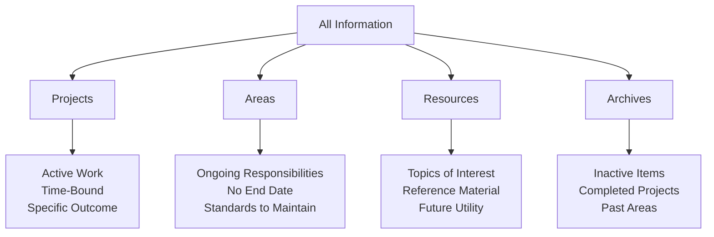
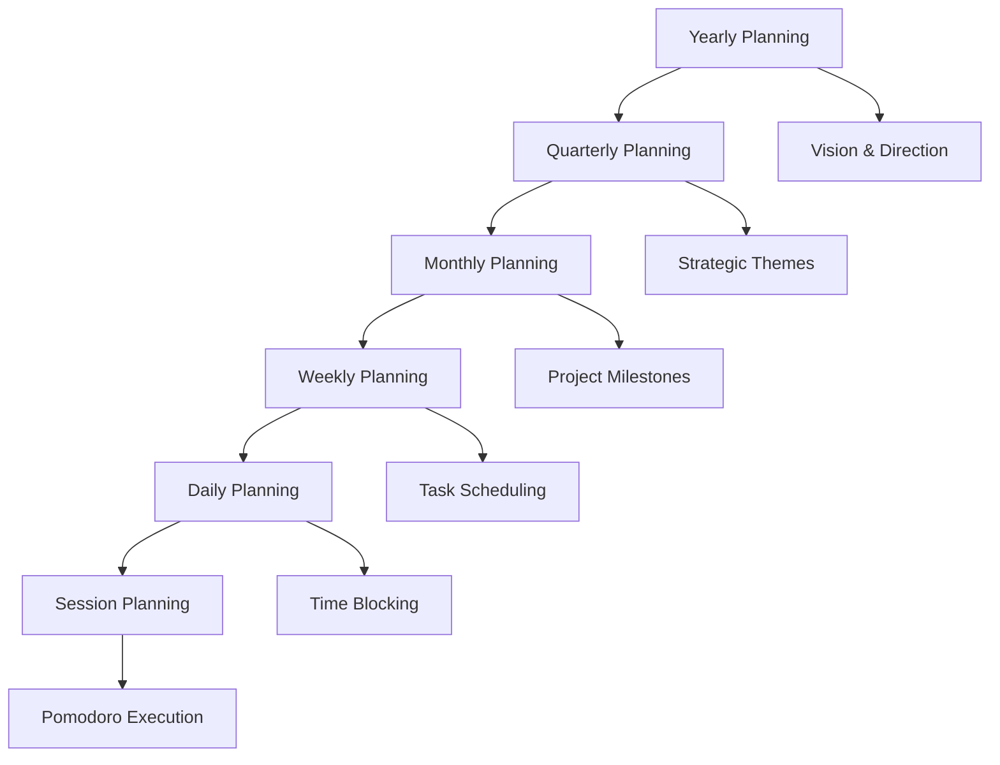

# Extraction Report: Personal Knowledge Base: Planning

> [!info] Auto-Generated Report
> This report was automatically generated by `pkb_extractor.py` on 2026-03-13 04:18.
> **Source**: `reference-comprehensive-planning-through-pkb-20251114.md` | **Items Extracted**: 623

---

## 📋 Document Overview

| Field | Value |
|-------|-------|
| **Source File** | `reference-comprehensive-planning-through-pkb-20251114.md` |
| **Extraction Date** | 2026-03-13 04:18 |
| **Word Count** | 9,787 |
| **Character Count** | 70,900 |
| **Line Count** | 2,032 |
| **Total Items Extracted** | 623 |

### Document Outline

  - ## 📑 Table of Contents
- # 🧠 Theoretical Foundations: Planning in Self-Regulated Learning
  - ## The Cognitive Science of Planning
    - ### The MAPS Model: Planning as Metacognitive Foundation
    - ### The Three-Phase Cycle of Self-Regulated Learning
    - ### Planning and Working Memory
    - ### The Dual Nature of Planning
- # ⚙️ Core Planning Frameworks for Knowledge Work
  - ## Getting Things Done (GTD): The Foundation
    - ### The Five-Phase GTD Workflow
    - ### GTD for Knowledge Work: Adaptations
  - ## PARA Method: Information Architecture
    - ### PARA Structure
    - ### PARA in PKB Contexts
  - ## Time Blocking: Temporal Allocation
    - ### Time Blocking Core Principles
    - ### Time Blocking Framework
    - ### Types of Time Blocks
  - ## Eisenhower Matrix: Priority Quadrants
    - ### The Four Quadrants
    - ### Eisenhower Matrix in PKB Planning
  - ## Pomodoro Technique: Focused Intervals
    - ### Pomodoro Protocol
  - ## Integrating Multiple Frameworks
    - ### Example Integrated Workflow
- # 📅 Temporal Planning Architectures
  - ## The Hierarchy of Planning Horizons
    - ### Yearly Planning: Strategic Vision
    - ### Quarterly Planning: Theme Translation
    - ### Monthly Planning: Project Milestones
- # Month: YYYY-MM
  - ## Quarterly Context
  - ## This Month's Focus
    - ### Primary Project: [[Bayesian-Inference-Course]]
    - ### Secondary Project: [[Statistical-Problem-Practice]]
  - ## Success Metrics
  - ## Obstacles & Mitigations
  - ## Resources Needed
    - ### Weekly Planning: Task Orchestration
    - ### Daily Planning: Execution Roadmap
    - ### Session Planning: Focused Execution
- # 🔧 Obsidian-Specific Planning Implementation
  - ## Plugin Ecosystem for Planning
    - ### Essential Planning Plugins
    - ### Advanced Planning Plugins
  - ## Implementing Periodic Notes Architecture
    - ### Setup Configuration
    - ### Daily Note Template Architecture
- # Saturday, October 25th, 2025
  - ## 📅 Temporal Context
  - ## 🎯 Today's Plan
    - ### Big Rock 🎯
    - ### Supporting Tasks 📝
    - ### Routine Items 🔄
  - ## ⏰ Time Blocks
  - ## 📊 Tasks Overview
    - ### Due Today
    - ### Can Do Today
    - ### Completed Today
  - ## 📝 Notes & Captures
    - ### Quick Captures
    - ### Ideas
    - ### Observations
  - ## 🔗 Notes Created/Modified Today
  - ## 🌙 Evening Reflection
    - ### Wins 🎉
    - ### Learned 💡
    - ### Challenges ⚠️
    - ### Tomorrow's Priority
    - ### Energy Patterns
    - ### Weekly Note Template Architecture
- # Week 10 | 2025
  - ## 📅 Week Overview
  - ## 🎯 This Week's Focus
    - ### Weekly Theme
    - ### Primary Goals (2-3 Maximum)
    - ### Supporting Objectives
  - ## 📊 Weekly Progress Dashboard
    - ### Daily Notes This Week
    - ### Habit Tracking
    - ### Tasks Completed This Week
    - ### Notes Created This Week
  - ## 🔍 Weekly Review
    - ### Wins This Week 🎉
    - ### Key Learnings 💡
    - ### Challenges & Blockers ⚠️
    - ### Process Improvements
  - ## 📈 Goal Progress
    - ### Monthly Goal Advancement
    - ### Quarterly Theme Alignment
  - ## 🗓️ Next Week Preview
    - ### Upcoming Commitments
    - ### Priorities for Next Week
    - ### Resources Needed
  - ## Task Management with Tasks Plugin
    - ### Task Syntax
    - ### Task Queries in Notes
  - ## Time Blocking with Day Planner
    - ### Day Planner Setup
- # Day Planner
    - ### External Calendar Integration
- # 🔗 Integration Patterns: Connecting Planning Systems
  - ## Vertical Integration: Temporal Hierarchy Linking
    - ### Bottom-Up Flow (Emergent Planning)
  - ## This Week's Completions
  - ## Weekly Themes This Month
  - ## Monthly Milestones Progress
    - ### Top-Down Flow (Intentional Planning)
  - ## Horizontal Integration: Cross-System Coherence
    - ### GTD + PARA Integration
    - ### Eisenhower + Time Blocking Integration
  - ## Weekly Time Budget by Quadrant
    - ### Quadrant II (Important, Not Urgent) - 60% of discretionary time
    - ### Quadrant I (Important, Urgent) - 25% of discretionary time
    - ### Quadrant III (Urgent, Not Important) - 10% of discretionary time
    - ### Quadrant IV (Neither) - 5% (minimize)
    - ### Task Management + Periodic Notes Integration
  - ## Next Actions
  - ## Tasks Scheduled Today
  - ## Plugin Workflow Integration
    - ### Automated Planning Pipeline
- # ⚠️ Common Planning Challenges & Solutions
  - ## Over-Planning Paralysis
    - ### Symptoms
    - ### Solutions
  - ## Under-Planning: Reactive Drift
    - ### Symptoms
    - ### Solutions
  - ## Planning-Execution Gap
    - ### Symptoms
    - ### Solutions
  - ## Scope Creep and Goal Inflation
    - ### Symptoms
    - ### Solutions
  - ## Planning System Abandonment
    - ### Symptoms
    - ### Solutions
- # 🚀 Advanced Planning Optimization
  - ## Metacognitive Planning: Planning How You Plan
    - ### The Meta-Planning Framework
    - ### Planning Metrics and Analytics
  - ## Weekly Planning Analytics
  - ## Energy-Aware Planning
    - ### Daily Energy Mapping
  - ## Energy Log
    - ### Weekly Energy Patterns
  - ## Context-Aware Planning
    - ### Contextual Productivity
  - ## Next Actions
  - ## Today's Context Availability
  - ## Context-Matched Schedule
    - ### 9:00-11:00 (@deep-work-space + @high-cognition)
    - ### 11:00-12:00 (@computer + @low-cognition)
    - ### 2:00-4:00 (@anywhere + @medium-cognition)
  - ## Project-Based Learning Architecture
    - ### Learning Projects vs. Learning Areas
    - ### Project-Based Learning Planning
- # Project: Bayesian Inference Mastery
  - ## Outcome Definition
  - ## Learning Roadmap
    - ### Phase 1: Foundations (Weeks 1-4)
    - ### Phase 2: Application (Weeks 5-8)
    - ### Phase 3: Integration (Weeks 9-12)
  - ## Weekly Time Allocation
  - ## Progress Tracking
  - ## Adaptive Planning: The Feedback Loop
    - ### The OODA Loop for Planning
    - ### Weekly Feedback Integration
  - ## 📊 Synthesis & Cognitive Models
    - ### Mental Model: Planning as Architecture
    - ### The Planning Paradox
    - ### Cognitive Load Distribution
  - ## 📊 Metadata & Attribution
  - ## 🔄 Version History
- # 🔗 Related Topics for PKB Expansion
  - ## Request Classification & Analysis
  - ## Structural Planning
  - ## Research Query Strategy

---

## 📊 Extraction Summary

| Item Type | Count |
|-----------|-------|
| Callouts | 41 |
| Code Blocks | 57 |
| Color Spans | 0 |
| Definitions | 0 |
| Embeds | 0 |
| External Links | 0 |
| Footnotes | 0 |
| Headings | 178 |
| Inline Fields | 0 |
| Mermaid Diagrams | 2 |
| Tables | 5 |
| Tags | 12 |
| Wiki Links | 93 |
| **TOTAL** | **623** |

---

## 🔔 Callouts (41)

> [!note] What are Callouts?
> Callouts are `> [!TYPE]` blocks used in Obsidian for structured annotation.
> They carry semantic meaning — definitions, insights, warnings, etc.

### By Type

| Callout Type | Count |
|-------------|-------|
| `[!abstract]` | 1 |
| `[!analogy]` | 1 |
| `[!comprehensive-reference]` | 1 |
| `[!connection-ideas]` | 1 |
| `[!definition]` | 7 |
| `[!example]` | 3 |
| `[!helpful-tip]` | 3 |
| `[!how-to-use-this]` | 1 |
| `[!key-claim]` | 5 |
| `[!methodology-and-sources]` | 4 |
| `[!principle-point]` | 5 |
| `[!the-goal]` | 3 |
| `[!the-philosophy]` | 2 |
| `[!use-cases-and-examples]` | 2 |
| `[!warning]` | 1 |
| `[!what-this-does]` | 1 |

### Full Callout List

#### 1. [COMPREHENSIVE-REFERENCE] 📚 Comprehensive-Reference *(Line 25)*

> [!comprehensive-reference] 📚 Comprehensive-Reference
> - **Generated**:: 2025-11-14
> - **Version**:: 1.0
> - **Type**:: Reference Documentation

#### 2. [ABSTRACT] Untitled *(Line 30)*

> [!abstract] Untitled
> **Executive Overview**
> Planning in the context of [[03-notes/01_permanent-notes/02_personal-knowledge-base/Personal Knowledge Management]] and [[Self-Directed-Learning|Self-Directed Learning]] is the metacognitive process of systematically organizing cognitive resources, time allocation, and learning objectives to maximize knowledge acquisition and application within a [[PKB]] environment. This reference note synthesizes cognitive science research, planning methodologies, and Obsidian-specific implementation strategies to provide a comprehensive framework for planning knowledge work and self-education activities.

#### 3. [HOW-TO-USE-THIS] Untitled *(Line 34)*

> [!how-to-use-this] Untitled
> **Navigation Guide**
> This reference note is organized into 7 major sections covering theoretical foundations, planning frameworks, temporal planning strategies, Obsidian implementation, integration patterns, challenges and solutions, and advanced optimization techniques. Use the table of contents below for quick navigation, or search for specific terms using [[wiki-links]].

#### 4. [DEFINITION] Untitled *(Line 54)*

> [!definition] Untitled
> - **Planning (Cognitive Psychology Context)**:: The metacognitive process of formulating action sequences, allocating resources, and establishing goals before engaging in task execution. Planning is a forward-reaching cognitive activity that transforms abstract intentions into concrete action pathways.
> - **Metacognitive Planning**:: The specific subset of planning activities that involves thinking about one's own cognitive processes, including task analysis, strategy selection, resource allocation, and performance monitoring.

#### 5. [PRINCIPLE-POINT] Untitled *(Line 64)*

> [!principle-point] Untitled
> **Core Cognitive Principle**
> Planning is an effortful process that reduces cognitive load by externalizing task management. When individuals actively plan and regulate learning activities, they demonstrate better delayed gratification, more effective organization strategies, and enhanced self-efficacy. The metacognitive component of self-regulated learning encompasses self-beliefs (like mindset and self-efficacy) and regulation of emotions, both critical for effective planning.

#### 6. [KEY-CLAIM] Untitled *(Line 88)*

> [!key-claim] Untitled
> **Planning's Primacy in Learning Effectiveness**
> Research from the Education Endowment Foundation shows that explicit teaching of planning strategies leads to +7 to +8 months of additional academic progress. Metacognitive strategies that support learners in planning, monitoring, and evaluating their learning demonstrate high effectiveness across all age groups and subject domains, with planning being the initiating component that sets the entire self-regulation cycle in motion.

#### 7. [CONNECTION-IDEAS] Untitled *(Line 94)*

> [!connection-ideas] Untitled
> **The Cognitive Load Relationship**
> Planning reduces [[Working-Memory|Working Memory]] burden by creating external cognitive scaffolds. David Allen's [[GTD]] methodology explicitly addresses this: "There is an inverse relationship between things on your mind and those things getting done." When planning systems externalize commitments, they free working memory for higher-order cognitive tasks rather than mere recall.

#### 8. [METHODOLOGY-AND-SOURCES] Untitled *(Line 110)*

> [!methodology-and-sources] Untitled
> **Empirical Evidence for Planning Effectiveness**
> Cross-lagged structural equation modeling reveals causal relationships from planning strategy to monitoring strategy, demonstrating that effective planning creates the foundation for effective execution monitoring. Planning strategy use directly predicts the deployment of cognitive strategies, mediated by self-efficacy. The pathway is: Planning → Self-Efficacy → Learning Behaviors → Cognitive Strategy Use.

#### 9. [DEFINITION] Untitled *(Line 120)*

> [!definition] Untitled
> - **Getting Things Done (GTD)**:: A personal productivity system developed by David Allen that moves all items of interest, information, issues, tasks, and projects out of one's mind by recording them externally, then breaking them into actionable work items with known time limits.
> - **Trusted System**:: The external repository (digital or analog) that holds all commitments, ensuring nothing is lost and reducing anxiety about forgetting.

#### 10. [KEY-CLAIM] Untitled *(Line 160)*

> [!key-claim] Untitled
> **GTD's Cognitive Liberation**
> The fundamental promise of GTD is stress reduction through complete externalization. When your "reminder system" is external and trusted, your mind stops repeatedly surfacing incomplete commitments, allowing genuine focus on current tasks. GTD can be understood as an application of [[Distributed-Cognition|Distributed Cognition]] or [[Extended Mind]] theory.

#### 11. [USE-CASES-AND-EXAMPLES] Untitled *(Line 166)*

> [!use-cases-and-examples] Untitled
> # **PKB Application of GTD**
> 
> **Traditional GTD**: "Write quarterly report" → "Draft outline for Q3 metrics" (@computer, 30min)
> 
> **Knowledge Work GTD**: "Master retrieval practice techniques" → 
> - Project: [[Retrieval-Practice|Retrieval Practice]] mastery
> - Next Actions: 
>   - "Read Chapter 3 of 'Make It Stick'" (@reading-chair, 45min, med-energy)
>   - "Create 10 flashcards on spacing effects" (@computer, 20min, low-energy)
>   - "Write synthesis note connecting spacing to my calculus studying" (@computer, 60min, high-energy)

#### 12. [DEFINITION] Untitled *(Line 182)*

> [!definition] Untitled
> - **PARA Method**:: A universal organizational framework separating information into four top-level categories: Projects (active, time-bound), Areas (ongoing responsibilities), Resources (topics of interest), Archives (inactive items). Created by Tiago Forte for knowledge workers managing significant digital information.

#### 13. [PRINCIPLE-POINT] Untitled *(Line 200)*

> [!principle-point] Untitled
> **The Actionability Gradient**
> PARA organizes by actionability, not topic. The same subject (e.g., "Python programming") might exist across all four categories:
> - **Projects**: "Build web scraper for research data collection" (by Dec 15)
> - **Areas**: "Programming skills maintenance" (ongoing)
> - **Resources**: "Python best practices articles" (reference)
> - **Archives**: "Completed Python course from 2023"

#### 14. [DEFINITION] Untitled *(Line 221)*

> [!definition] Untitled
> - **[[03-notes/01_permanent-notes/02_personal-knowledge-base/Time Blocking]]**:: A time management method where specific time blocks with defined start and end times are allocated to individual tasks or categories of work, creating a proactive schedule that protects focused work periods.

#### 15. [HELPFUL-TIP] Untitled *(Line 250)*

> [!helpful-tip] Untitled
> **The 80/20 Blocking Rule**
> Schedule only 80% of available time in blocks, leaving 20% as buffer for unexpected issues, interruptions, and cognitive rest. Over-scheduling creates rigidity that collapses when reality intervenes.

#### 16. [METHODOLOGY-AND-SOURCES] Untitled *(Line 256)*

> [!methodology-and-sources] Untitled
> **Time Block Categories for Knowledge Work**
> 
> **Deep Work Blocks** (90-120 minutes)
> - [[Deliberate-Practice|Deliberate Practice]] on challenging concepts
> - [[Creative Synthesis]] writing  
> - Complex problem-solving
> - Original research and analysis
> 
> **Shallow Work Blocks** (25-45 minutes)
> - Email and communication
> - Administrative tasks
> - Quick note processing
> - File organization
> 
> **Learning Blocks** (45-90 minutes)
> - Reading and annotation
> - Video course consumption
> - Flashcard review ([[03-notes/01_permanent-notes/01_cognitive-development/Spaced Repetition]])
> - Light concept exploration
> 
> **Integration Blocks** (30-60 minutes)
> - [[Weekly Review]] processes
> - Cross-linking notes
> - [[Progressive-Summarization|Progressive Summarization]]
> - Knowledge consolidation

#### 17. [DEFINITION] Untitled *(Line 285)*

> [!definition] Untitled
> - **Eisenhower Matrix**:: A prioritization framework dividing tasks into four quadrants based on urgency and importance, enabling strategic decision-making about task selection and delegation.

#### 18. [KEY-CLAIM] Untitled *(Line 309)*

> [!key-claim] Untitled
> **The Quadrant II Revolution**
> For self-directed learners, Quadrant II (Important but Not Urgent) contains the highest-leverage activities: [[Deliberate-Practice|Deliberate Practice]], [[System Building]], [[Relationship Cultivation]], and [[Strategic-Planning|Strategic Planning]]. Most people spend excessive time in Quadrants I and III (urgent tasks), neglecting Quadrant II until items become urgent, creating chronic crisis management.

#### 19. [DEFINITION] Untitled *(Line 325)*

> [!definition] Untitled
> - **Pomodoro Technique**:: A time management method using 25-minute focused work intervals ("Pomodoros") followed by 5-minute breaks, with longer 15-30 minute breaks after four cycles. Designed to maintain mental freshness and prevent burnout.

#### 20. [USE-CASES-AND-EXAMPLES] Untitled *(Line 340)*

> [!use-cases-and-examples] Untitled
> **Pomodoro Applications in Self-Education**
> 
> **Reading Dense Academic Material**:
> - Pomodoro 1: Read 10 pages with highlighting
> - Break: Reflect on key ideas
> - Pomodoro 2: Create permanent notes on highlights
> - Break: Physical movement
> - Pomodoro 3: Link new notes to existing knowledge
> - Break: Mental rest
> - Pomodoro 4: Write synthesis connecting concepts
> - Long Break: 20 minutes away from desk
> 
> **Modified Pomodoros for Flow Work**:
> Many practitioners adapt intervals (50/10 for deeper work, 15/5 for administrative tasks) based on task demands. The rigid 25/5 structure is a starting point, not a universal law.

#### 21. [PRINCIPLE-POINT] Untitled *(Line 358)*

> [!principle-point] Untitled
> **The Framework Stack Principle**
> Productivity frameworks are not mutually exclusive—they address different planning dimensions. The most effective personal planning systems combine multiple frameworks strategically:
> 
> - **GTD** for comprehensive task capture and organization
> - **PARA** for information architecture and file organization  
> - **Eisenhower Matrix** for priority determination
> - **Time Blocking** for execution scheduling
> - **Pomodoro** for focused session management

#### 22. [THE-GOAL] Untitled *(Line 424)*

> [!the-goal] Untitled
> **Yearly Planning Objectives**
> - Define [[Possible Selves]]: Who you're becoming as a learner
> - Identify 3-5 strategic learning domains
> - Establish measurable annual outcomes
> - Create theme or focus for the year

#### 23. [EXAMPLE] Untitled *(Line 437)*

> [!example] Untitled
> **Yearly Plan Example**
> 
> **Theme**: "Year of Systematic Learning"
> 
> **Strategic Domains**:
> 1. [[cognitive-psychology|Cognitive Psychology]]: Build research-level understanding
> 2. [[Statistical Analysis]]: Progress from novice to intermediate practitioner  
> 3. [[Technical Writing]]: Develop publication-quality skills
> 
> **Annual Outcomes**:
> - Write 12 synthesis papers (one per month)
> - Complete 3 major research projects
> - Build comprehensive Zettelkasten with 500+ permanent notes

#### 24. [METHODOLOGY-AND-SOURCES] Untitled *(Line 463)*

> [!methodology-and-sources] Untitled
> **Quarterly OKR Framework for Learning**
> 
> **Objective**: Achieve intermediate statistical fluency
> 
> **Key Results**:
> - KR1: Complete full course on Bayesian inference (measured: course completion)
> - KR2: Solve 50 practice problems across distribution types (measured: problem log)
> - KR3: Apply statistical analysis to 2 original research questions (measured: completed analyses)
> - KR4: Create 30 permanent notes on statistical concepts (measured: note count)

#### 25. [HELPFUL-TIP] Untitled *(Line 551)*

> [!helpful-tip] Untitled
> **The "Big Rocks First" Principle**
> Schedule your most important outcomes (Quadrant II work) FIRST when energy is highest, then fit smaller tasks around them. If you schedule small tasks first, Big Rocks never fit.

#### 26. [EXAMPLE] Untitled *(Line 606)*

> [!example] Untitled
> **Daily Note Structure**
> 
> ```markdown
> # 2025-11-14 Thursday
> 
> ## Context
> Week: [[2025-W46]]
> Energy: ⚡⚡⚡ (High - well rested)
> 
> ## Today's Priorities
> 1. 🎯 **Big Rock**: Complete Bayesian inference Module 5
>    - Time Block: 9:00-11:30 AM (3 Pomodoros)
> 2. 📝 **Support**: Write permanent note on conjugate priors
>    - Time Block: 2:00-3:00 PM (2 Pomodoros)
> 3. 🔄 **Support**: Solve 5 practice problems
>    - Time Block: 4:00-5:00 PM (2 Pomodoros)
> 
> ## Time Blocks
> - 9:00-11:30: Deep Work - Module 5
> - 11:30-12:00: Break
> - 12:00-1:00: Lunch
> - 1:00-2:00: Emails & admin
> - 2:00-3:00: Note writing
> - 3:00-4:00: Break / walk
> - 4:00-5:00: Practice problems
> - 5:00-5:15: Daily reflection
> 
> ## Evening Reflection
> ### Completed
> - [x] Module 5 complete (2.5 hours)
> - [x] Conjugate priors note written
> - [x] 5 practice problems solved
> 
> ### Learned Today
> - Conjugate priors dramatically simplify posterior calculations
> - Beta distribution is conjugate prior for binomial likelihood
> - Connection to my existing knowledge on probability distributions
> 
> ### Tomorrow's Setup
> - Start Module 6 (Markov Chain Monte Carlo)
> - Need to review sampling methods first
> ```

#### 27. [THE-GOAL] Untitled *(Line 918)*

> [!the-goal] Untitled
> [What's the overarching theme for this week?]

#### 28. [PRINCIPLE-POINT] Untitled *(Line 1235)*

> [!principle-point] Untitled
> **The Bidirectional Planning Principle**
> Planning effectiveness emerges from bidirectional flow: top-down intentionality provides direction, while bottom-up emergence provides reality-testing and course correction. Static top-down plans fail when they ignore bottom-up feedback; reactive bottom-up execution fails without top-down vision.

#### 29. [WHAT-THIS-DOES] Untitled *(Line 1346)*

> [!what-this-does] Untitled
> **The Automation Advantage**
> By automating note structure and data aggregation, the system:
> - Eliminates manual data entry
> - Ensures consistency across temporal levels
> - Surfaces patterns not visible in individual days
> - Reduces cognitive overhead of maintaining the system
> - Makes planning sustainable long-term

#### 30. [WARNING] Untitled *(Line 1361)*

> [!warning] Untitled
> **The Planning Trap**
> Excessive planning becomes procrastination in disguise. When planning feels productive but prevents execution, it becomes a sophisticated avoidance mechanism.

#### 31. [EXAMPLE] Untitled *(Line 1394)*

> [!example] Untitled
> **Over-Planning vs. Sufficient Planning**
> 
> **Over-Planned**: Spend 3 hours creating elaborate reading notes template with 15 custom fields, color-coding system, and integration scripts before reading first book.
> 
> **Sufficiently Planned**: Create basic book note template (title, author, key ideas, connections) in 15 minutes. Refine template based on actual use over first 5 books.

#### 32. [KEY-CLAIM] Untitled *(Line 1433)*

> [!key-claim] Untitled
> **The Implementation Intention Principle**
> Plans fail at the moment of execution when they lack specific implementation intentions—concrete specifications of when, where, and how actions will occur. "I'll study statistics this week" fails; "I'll study Bayesian inference 9-11am in my home office on Monday" succeeds.

#### 33. [THE-PHILOSOPHY] Untitled *(Line 1557)*

> [!the-philosophy] Untitled
> **Second-Order Planning**
> The most sophisticated planning involves planning your planning processes—establishing meta-level routines that ensure planning itself remains effective and adaptive.

#### 34. [PRINCIPLE-POINT] Untitled *(Line 1623)*

> [!principle-point] Untitled
> **The Chronotype-Capacity Principle**
> Effective planning accounts for natural energy fluctuations throughout day, week, and month. Forcing high-cognitive-demand work during low-energy periods creates planning-execution gaps.

#### 35. [DEFINITION] Untitled *(Line 1737)*

> [!definition] Untitled
> - **Learning Project**:: Time-bound learning goal with specific completion criteria and deliverable. Example: "Master Bayesian inference sufficient to apply to research questions" (3-month project, completion = solved 10 real problems using Bayesian methods)
> - **Learning Area**:: Ongoing domain of continuous development without end date. Example: "Statistical competency" (career-long area)

#### 36. [THE-GOAL] Untitled *(Line 1761)*

> [!the-goal] Untitled
> By 2026-02-01, achieve functional competency in Bayesian inference methods sufficient to:
> 1. Formulate appropriate priors for research contexts
> 2. Apply MCMC sampling for posterior estimation
> 3. Interpret and communicate Bayesian results

#### 37. [HELPFUL-TIP] Untitled *(Line 1852)*

> [!helpful-tip] Untitled
> **The 1% Improvement Protocol**
> Rather than overhauling entire planning system, aim for 1% improvements weekly. After 52 weeks of 1% improvements, planning system is 68% more effective through compound gains.

#### 38. [THE-PHILOSOPHY] Untitled *(Line 1860)*

> [!the-philosophy] Untitled
> **Planning as Distributed Cognition**
> Planning systems function as cognitive prosthetics—external structures that augment human cognitive limitations (particularly working memory constraints) by distributing cognitive work across time, space, and tools. Effective planning doesn't just organize tasks; it fundamentally restructures how cognition operates.

#### 39. [ANALOGY] Untitled *(Line 1866)*

> [!analogy] Untitled
> **The Construction Metaphor**
> 
> Think of planning like architectural blueprints:
> 
> - **Yearly Plans** = City zoning (broad spatial organization)
> - **Quarterly Plans** = Building design (specific structures)
> - **Monthly Plans** = Floor plans (room arrangements)
> - **Weekly Plans** = Construction schedule (sequencing)
> - **Daily Plans** = Work orders (immediate tasks)
> 
> Just as builders don't construct buildings room-by-room without plans, learners shouldn't pursue knowledge goal-by-goal without planning architecture. Yet plans must remain flexible—discovering foundation problems requires design adjustments, just as learning obstacles require plan revisions.

#### 40. [KEY-CLAIM] Untitled *(Line 1881)*

> [!key-claim] Untitled
> **Rigidity-Flexibility Tension**
> Effective planning creates structure without rigidity, commitment without inflexibility. Plans provide direction while remaining adaptive. The challenge: plans detailed enough to guide action but flexible enough to accommodate reality. No day goes exactly as planned; success isn't perfect plan execution but skillful plan adaptation.

#### 41. [METHODOLOGY-AND-SOURCES] Untitled *(Line 1912)*

> [!methodology-and-sources] Untitled
> **Research Methodology**
> 
> This reference note synthesizes:
> - **Cognitive Science Research**: Self-regulated learning theory, metacognition, planning effectiveness studies
> - **Productivity Frameworks**: GTD, PARA, Eisenhower Matrix, Time Blocking, Pomodoro Technique
> - **PKB Best Practices**: Obsidian community implementations, plugin ecosystems, workflow patterns
> - **Primary Sources**: Academic literature on planning, productivity system documentation, Obsidian technical guides
> 
> **Research Approach**:
> 1. Systematic web searches on planning theory, self-regulated learning, productivity frameworks
> 2. Technical documentation review for Obsidian plugins and implementation patterns
> 3. Integration synthesis connecting cognitive science to practical implementation
> 4. Multi-scale organization from theoretical foundations through tactical execution
> 
> **Confidence Levels**:
> - Cognitive science foundations: HIGH (strong academic research base)
> - Planning framework descriptions: HIGH (well-documented methodologies)
> - Obsidian implementation: HIGH (verified through plugin documentation)
> - Specific workflow recommendations: MEDIUM (based on community practices, individual variation)

---

## 🔗 Wiki-Links (93 total, 71 unique targets)

> [!info] Knowledge Graph Connections
> These links represent connections to other notes in your PKB.
> **71** distinct notes are referenced.

### Unique Targets

- [[03-notes/01_permanent-notes/01_cognitive-development/Spaced Repetition]]
- [[03-notes/01_permanent-notes/02_personal-knowledge-base/Personal Knowledge Management]]
- [[03-notes/01_permanent-notes/02_personal-knowledge-base/Time Blocking]]
- [[2025]]
- [[2025-03]]
- [[2025-03-03]]
- [[2025-03-04]]
- [[2025-03-05]]
- [[2025-03-06]]
- [[2025-03-07]]
- [[2025-03-08]]
- [[2025-03-09]]
- [[2025-10]]
- [[2025-10-24]]
- [[2025-10-26]]
- [[2025-Q1]]
- [[2025-Q4]]
- [[2025-W09]]
- [[2025-W11]]
- [[2025-W43]]
- [[2025-W46]]
- [[Bayesian-Inference-Course]]
- [[Calendar Plugin]]
- [[Cognitive-Load|Cognitive Load]]
- [[cognitive-psychology|Cognitive Psychology]]
- [[Creative Synthesis]]
- [[Daily-Notes|Daily Notes]]
- [[Dataview-Plugin|Dataview Plugin]]
- [[Day-Planner|Day Planner]]
- [[Deliberate-Practice|Deliberate Practice]]
- [[Distributed-Cognition|Distributed Cognition]]
- [[Extended Mind]]
- [[GTD]]
- [[Goal Setting]]
- [[Habit Formation and Planning Systems Integration]]
- [[Metacognition]]
- [[Motivational Beliefs]]
- [[Obsidian Templates]]
- [[PARA Method]]
- [[PKB]]
- [[Periodic Notes]]
- [[Possible Selves]]
- [[Progressive-Summarization|Progressive Summarization]]
- [[Progressive Summarization in PKB Systems]]
- [[Project Management]]
- [[Q2-2024-Statistical-Fluency]]
- [[Relationship Cultivation]]
- [[Retrieval-Practice|Retrieval Practice]]
- [[Self-Directed-Learning|Self Directed Learning]]
- [[999-report-orginizing/_permanent-notes/_permanent-notes/Self-Regulated-Learning|Self-Regulated Learning]]
- [[Self-Regulated Learning Theory]]
- [[Spaced-Repetition-Spacing-Effect|Spaced Repetition]]
- [[Statistical Analysis]]
- [[Statistical-Competency]]
- [[Statistical-Problem-Practice]]
- [[Statistics]]
- [[Strategic-Planning|Strategic Planning]]
- [[System Building]]
- [[Task Analysis]]
- [[Task-Management|Task Management]]
- [[Tasks-Plugin|Tasks Plugin]]
- [[Technical Writing]]
- [[Templater]]
- [[Time Blocking]]
- [[Time Management vs. Attention Management]]
- [[Weekly Review]]
- [[Weekly Reviews]]
- [[Working-Memory|Working Memory]]
- [[Zettelkasten]]
- [[Dataview]]
- [[wiki-links]]

### All Occurrences

| # | Target | Display Text | Heading | Section | Line |
|---|--------|-------------|---------|---------|------|
| 1 | [[03-notes/01_permanent-notes/02_personal-knowledge-base/Personal Knowledge Management]] | — | — | Document Start | 32 |
| 2 | [[Self-Directed-Learning|Self Directed Learning]] | Self-Directed Learning | — | Document Start | 32 |
| 3 | [[PKB]] | — | — | Document Start | 32 |
| 4 | [[wiki-links]] | — | — | Document Start | 36 |
| 5 | [[Goal Setting]] | — | — | The Three-Phase Cycle of Self-Regulat... | 73 |
| 6 | [[Task Analysis]] | — | — | The Three-Phase Cycle of Self-Regulat... | 74 |
| 7 | [[Strategic-Planning|Strategic Planning]] | — | — | The Three-Phase Cycle of Self-Regulat... | 75 |
| 8 | [[Motivational Beliefs]] | — | — | The Three-Phase Cycle of Self-Regulat... | 76 |
| 9 | [[Working-Memory|Working Memory]] | — | — | Planning and Working Memory | 96 |
| 10 | [[GTD]] | — | — | Planning and Working Memory | 96 |
| 11 | [[Zettelkasten]] | — | — | The Dual Nature of Planning | 106 |
| 12 | [[Deliberate-Practice|Deliberate Practice]] | — | — | The Dual Nature of Planning | 107 |
| 13 | [[Distributed-Cognition|Distributed Cognition]] | — | — | The Five-Phase GTD Workflow | 162 |
| 14 | [[Extended Mind]] | — | — | The Five-Phase GTD Workflow | 162 |
| 15 | [[Retrieval-Practice|Retrieval Practice]] | — | — | GTD for Knowledge Work: Adaptations | 172 |
| 16 | [[03-notes/01_permanent-notes/02_personal-knowledge-base/Time Blocking]] | — | — | Time Blocking: Temporal Allocation | 222 |
| 17 | [[Deliberate-Practice|Deliberate Practice]] | — | — | Types of Time Blocks | 260 |
| 18 | [[Creative Synthesis]] | — | — | Types of Time Blocks | 261 |
| 19 | [[03-notes/01_permanent-notes/01_cognitive-development/Spaced Repetition]] | — | — | Types of Time Blocks | 274 |
| 20 | [[Weekly Review]] | — | — | Types of Time Blocks | 278 |
| 21 | [[Progressive-Summarization|Progressive Summarization]] | — | — | Types of Time Blocks | 280 |
| 22 | [[Deliberate-Practice|Deliberate Practice]] | — | — | The Four Quadrants | 311 |
| 23 | [[System Building]] | — | — | The Four Quadrants | 311 |
| 24 | [[Relationship Cultivation]] | — | — | The Four Quadrants | 311 |
| 25 | [[Strategic-Planning|Strategic Planning]] | — | — | The Four Quadrants | 311 |
| 26 | [[Possible Selves]] | — | — | Yearly Planning: Strategic Vision | 426 |
| 27 | [[cognitive-psychology|Cognitive Psychology]] | — | — | Yearly Planning: Strategic Vision | 443 |
| 28 | [[Statistical Analysis]] | — | — | Yearly Planning: Strategic Vision | 444 |
| 29 | [[Technical Writing]] | — | — | Yearly Planning: Strategic Vision | 445 |
| 30 | [[Obsidian Templates]] | — | — | Monthly Planning: Project Milestones | 480 |
| 31 | [[Periodic Notes]] | — | — | Monthly Planning: Project Milestones | 480 |
| 32 | [[Q2-2024-Statistical-Fluency]] | — | — | Quarterly Context | 488 |
| 33 | [[Bayesian-Inference-Course]] | — | — | Primary Project: [[Bayesian-Inference... | 492 |
| 34 | [[Statistical-Problem-Practice]] | — | — | Secondary Project: [[Statistical-Prob... | 496 |
| 35 | [[Periodic Notes]] | — | — | Weekly Planning: Task Orchestration | 557 |
| 36 | [[Templater]] | — | — | Weekly Planning: Task Orchestration | 557 |
| 37 | [[Dataview]] | — | — | Weekly Planning: Task Orchestration | 557 |
| 38 | [[2025-W46]] | — | — | Daily Planning: Execution Roadmap | 613 |
| 39 | [[Periodic Notes]] | — | — | Essential Planning Plugins | 694 |
| 40 | [[Templater]] | — | — | Essential Planning Plugins | 695 |
| 41 | [[Dataview]] | — | — | Essential Planning Plugins | 696 |
| 42 | [[Tasks-Plugin|Tasks Plugin]] | — | — | Essential Planning Plugins | 697 |
| 43 | [[Calendar Plugin]] | — | — | Essential Planning Plugins | 698 |
| 44 | [[Day-Planner|Day Planner]] | — | — | Essential Planning Plugins | 699 |
| 45 | [[2025-W43]] | — | — | Daily Note Template Architecture | 763 |
| 46 | [[2025-10]] | — | — | Daily Note Template Architecture | 764 |
| 47 | [[2025-Q4]] | — | — | Daily Note Template Architecture | 765 |
| 48 | [[2025]] | — | — | Daily Note Template Architecture | 766 |
| 49 | [[2025-W43]] | — | — | 📅 Temporal Context | 776 |
| 50 | [[2025-10-24]] | — | — | Energy Patterns | 886 |
| 51 | [[2025-10-26]] | — | — | Energy Patterns | 887 |
| 52 | [[2025-03]] | — | — | Weekly Note Template Architecture | 901 |
| 53 | [[2025-Q1]] | — | — | Weekly Note Template Architecture | 902 |
| 54 | [[2025-03]] | — | — | 📅 Week Overview | 912 |
| 55 | [[2025-Q1]] | — | — | 📅 Week Overview | 913 |
| 56 | [[2025-W09]] | — | — | Resources Needed | 1044 |
| 57 | [[2025-W11]] | — | — | Resources Needed | 1045 |
| 58 | [[2025-03-03]] | — | — | Resources Needed | 1047 |
| 59 | [[2025-03-04]] | — | — | Resources Needed | 1047 |
| 60 | [[2025-03-05]] | — | — | Resources Needed | 1047 |
| 61 | [[2025-03-06]] | — | — | Resources Needed | 1047 |
| 62 | [[2025-03-07]] | — | — | Resources Needed | 1047 |
| 63 | [[2025-03-08]] | — | — | Resources Needed | 1047 |
| 64 | [[2025-03-09]] | — | — | Resources Needed | 1047 |
| 65 | [[Deliberate-Practice|Deliberate Practice]] | — | — | Energy Log | 1664 |
| 66 | [[Statistics]] | — | — | Project-Based Learning Planning | 1747 |
| 67 | [[Statistical-Competency]] | — | — | Project-Based Learning Planning | 1748 |
| 68 | [[Self-Regulated Learning Theory]] | — | — | 🔗 Related Topics for PKB Expansion | 1943 |
| 69 | [[Time Management vs. Attention Management]] | — | — | 🔗 Related Topics for PKB Expansion | 1948 |
| 70 | [[Progressive Summarization in PKB Systems]] | — | — | 🔗 Related Topics for PKB Expansion | 1953 |
| 71 | [[Habit Formation and Planning Systems Integration]] | — | — | 🔗 Related Topics for PKB Expansion | 1958 |
| 72 | [[Self-Regulated-Learning-—-SRL|Self-Regulated Learning]] | — | — | Structural Planning | 1996 |
| 73 | [[Metacognition]] | — | — | Structural Planning | 1997 |
| 74 | [[Working-Memory|Working Memory]] | — | — | Structural Planning | 1998 |
| 75 | [[Goal Setting]] | — | — | Structural Planning | 1999 |
| 76 | [[Zettelkasten]] | — | — | Structural Planning | 2000 |
| 77 | [[Daily-Notes|Daily Notes]] | — | — | Structural Planning | 2001 |
| 78 | [[Weekly Reviews]] | — | — | Structural Planning | 2002 |
| 79 | [[Project Management]] | — | — | Structural Planning | 2003 |
| 80 | [[Task-Management|Task Management]] | — | — | Structural Planning | 2004 |
| 81 | [[Cognitive-Load|Cognitive Load]] | — | — | Structural Planning | 2005 |
| 82 | [[Deliberate-Practice|Deliberate Practice]] | — | — | Structural Planning | 2006 |
| 83 | [[Time Blocking]] | — | — | Structural Planning | 2007 |
| 84 | [[GTD]] | — | — | Structural Planning | 2008 |
| 85 | [[PARA Method]] | — | — | Structural Planning | 2009 |
| 86 | [[Progressive-Summarization|Progressive Summarization]] | — | — | Structural Planning | 2010 |
| 87 | [[Spaced-Repetition-Spacing-Effect|Spaced Repetition]] | — | — | Structural Planning | 2011 |
| 88 | [[Retrieval-Practice|Retrieval Practice]] | — | — | Structural Planning | 2012 |
| 89 | [[Obsidian Templates]] | — | — | Structural Planning | 2013 |
| 90 | [[Dataview-Plugin|Dataview Plugin]] | — | — | Structural Planning | 2014 |
| 91 | [[Tasks-Plugin|Tasks Plugin]] | — | — | Structural Planning | 2015 |
| 92 | [[Calendar Plugin]] | — | — | Structural Planning | 2016 |
| 93 | [[Periodic Notes]] | — | — | Structural Planning | 2017 |

---

## 🏷️ Tags (12 occurrences, 9 unique)

### All Unique Tags

`#cognitive-science`, `#metacognition`, `#pkb`, `#pkm`, `#planning`, `#reference-note`, `#self-regulated-learning`, `#type/reference`, `#type/report/psychology`

### Hierarchical Tags

- **type/**
  - `#type/reference`
  - `#type/report/psychology`

---

## 💻 Code Blocks (57)

| Language | Count |
|----------|-------|
| `plaintext` | 37 |
| `markdown` | 11 |
| `dataview` | 7 |
| `tasks` | 2 |

### Code Block 1 — `plaintext` *(Lines 290-307)*

```plaintext
┌────────────────────────┬─────────────────────────┐
│   URGENT & IMPORTANT   │  NOT URGENT & IMPORTANT │
│      (DO FIRST)        │      (SCHEDULE)         │
│                        │                         │
│  • Crises              │  • Planning             │
│  • Deadlines           │  • Skill development    │
│  • Critical problems   │  • Relationship building│
│                        │  • Strategic learning   │
├────────────────────────┼─────────────────────────┤
│  URGENT & UNIMPORTANT  │ NOT URGENT & UNIMPORTANT│
│     (DELEGATE)         │      (ELIMINATE)        │
│                        │                         │
│  • Interruptions       │  • Busywork             │
│  • Some calls/emails   │  • Time wasters         │
│  • Minor requests      │  • Trivial activities   │
└────────────────────────┴─────────────────────────┘
```

### Code Block 2 — `markdown` *(Lines 484-513)*

```markdown
# Month: YYYY-MM

## Quarterly Context
- Active Quarter Theme: [[Q2-2024-Statistical-Fluency]]
- Quarter Progress: 33% complete

## This Month's Focus
### Primary Project: [[Bayesian-Inference-Course]]
- Target: Complete modules 4-6
- Time Allocation: 15 hours (5 hours/week)

### Secondary Project: [[Statistical-Problem-Practice]]
- Target: Solve 20 problems (5/week)
- Time Allocation: 8 hours

## Success Metrics
- [ ] Course progress: 50% → 75%
- [ ] Problem count: 30 → 50
- [ ] Permanent notes: 15 → 25
- [ ] Integration: Write 1 synthesis connecting statistics to existing knowledge

## Obstacles & Mitigations
- **Risk**: Course complexity increases in Module 5
- **Mitigation**: Allocate extra review time, find supplementary resources

## Resources Needed
- [ ] Additional textbook on Bayesian methods
- [ ] Study group or discussion forum access
```

### Code Block 3 — `markdown` *(Lines 609-648)*

```markdown
> # 2025-11-14 Thursday
> 
> ## Context
> Week: [[2025-W46]]
> Energy: ⚡⚡⚡ (High - well rested)
> 
> ## Today's Priorities
> 1. 🎯 **Big Rock**: Complete Bayesian inference Module 5
>    - Time Block: 9:00-11:30 AM (3 Pomodoros)
> 2. 📝 **Support**: Write permanent note on conjugate priors
>    - Time Block: 2:00-3:00 PM (2 Pomodoros)
> 3. 🔄 **Support**: Solve 5 practice problems
>    - Time Block: 4:00-5:00 PM (2 Pomodoros)
> 
> ## Time Blocks
> - 9:00-11:30: Deep Work - Module 5
> - 11:30-12:00: Break
> - 12:00-1:00: Lunch
> - 1:00-2:00: Emails & admin
> - 2:00-3:00: Note writing
> - 3:00-4:00: Break / walk
> - 4:00-5:00: Practice problems
> - 5:00-5:15: Daily reflection
> 
> ## Evening Reflection
> ### Completed
> - [x] Module 5 complete (2.5 hours)
> - [x] Conjugate priors note written
> - [x] 5 practice problems solved
> 
# ... (9 more lines truncated)
```

### Code Block 4 — `plaintext` *(Lines 718-743)*

```plaintext
Daily Notes:
├─ Folder: Periodic/Daily
├─ Format: YYYY-MM-DD
└─ Template: Templates/Daily-Note-Template.md

Weekly Notes:
├─ Folder: Periodic/Weekly  
├─ Format: gggg-[W]WW
└─ Template: Templates/Weekly-Note-Template.md

Monthly Notes:
├─ Folder: Periodic/Monthly
├─ Format: YYYY-MM
└─ Template: Templates/Monthly-Note-Template.md

Quarterly Notes:
├─ Folder: Periodic/Quarterly
├─ Format: YYYY-[Q]Q
└─ Template: Templates/Quarterly-Note-Template.md

Yearly Notes:
├─ Folder: Periodic/Yearly
├─ Format: YYYY
└─ Template: Templates/Yearly-Note-Template.md
```

### Code Block 5 — `markdown` *(Lines 760-811)*

```markdown
---
date: 2025-10-25
week: [[2025-W43]]
month: [[2025-10]]
quarter: [[2025-Q4]]
year: [[2025]]
energy: 
mood:
sleep_hours:
tags: [daily-note]
---

# Saturday, October 25th, 2025

## 📅 Temporal Context
- **Week**: [[2025-W43]]
- **This Week's Theme**: `= this.week.theme`
- **Monthly Goal**: `= this.month.primary_goal`

## 🎯 Today's Plan

### Big Rock 🎯
- [ ] [Primary outcome for today]

### Supporting Tasks 📝
- [ ] [Supporting task 1]
- [ ] [Supporting task 2]

### Routine Items 🔄
- [ ] Morning review
# ... (18 more lines truncated)
```

### Code Block 6 — `dataview` *(Lines 812-816)*

```dataview
TASK
FROM "Projects" OR "Areas"
WHERE !completed AND due = this.file.day
```

### Code Block 7 — `plaintext` *(Lines 817-821)*

```plaintext
### Can Do Today
```

### Code Block 8 — `plaintext` *(Lines 822-828)*

```plaintext
TASK
FROM "Projects" OR "Areas"
WHERE !completed AND (due = null OR due > this.file.day)
SORT file.name DESC
LIMIT 10
```

### Code Block 9 — `plaintext` *(Lines 829-833)*

```plaintext
### Completed Today
```

### Code Block 10 — `plaintext` *(Lines 834-838)*

```plaintext
TASK
FROM "Projects" OR "Areas" OR ""
WHERE completed AND completion = this.file.day
```

### Code Block 11 — `plaintext` *(Lines 839-854)*

```plaintext
## 📝 Notes & Captures

### Quick Captures
- 

### Ideas
- 

### Observations
- 

## 🔗 Notes Created/Modified Today
```

### Code Block 12 — `plaintext` *(Lines 855-860)*

```plaintext
LIST
FROM ""
WHERE file.cday = this.file.day OR file.mday = this.file.day
SORT file.mtime DESC
```

### Code Block 13 — `plaintext` *(Lines 861-888)*

```plaintext
## 🌙 Evening Reflection

### Wins 🎉
- 
- 

### Learned 💡
- 
- 

### Challenges ⚠️
- 
- 

### Tomorrow's Priority
- 

### Energy Patterns
**Morning**: 
**Afternoon**: 
**Evening**: 

---
**Previous Day**: [[2025-10-24]]
**Next Day**: [[2025-10-26]]
```

### Code Block 14 — `markdown` *(Lines 897-936)*

```markdown
---
week_number: 10
year: 2025
month: [[2025-03]]
quarter: [[2025-Q1]]
theme: 
primary_goal:
tags: [weekly-note]
---

# Week 10 | 2025

## 📅 Week Overview
**Dates**: Mar 3rd - Mar 9th
**Monthly Context**: [[2025-03]]
**Quarterly Context**: [[2025-Q1]]

## 🎯 This Week's Focus

### Weekly Theme
> [!the-goal]
> [What's the overarching theme for this week?]

### Primary Goals (2-3 Maximum)
1. [ ] [Primary goal 1 - aligned with monthly milestone]
2. [ ] [Primary goal 2 - aligned with quarterly theme]
3. [ ] [Primary goal 3 - if applicable]

### Supporting Objectives
- [ ] [Supporting objective 1]
# ... (6 more lines truncated)
```

### Code Block 15 — `dataview` *(Lines 937-945)*

```dataview
TABLE 
  energy as "Energy",
  mood as "Mood",
  sleep_hours as "Sleep"
FROM "Periodic/Daily"
WHERE week = this.file.link
SORT file.name ASC
```

### Code Block 16 — `plaintext` *(Lines 946-952)*

```plaintext
### Habit Tracking
```

### Code Block 17 — `plaintext` *(Lines 953-965)*

```plaintext
TABLE
  file.link as "Date",
  morning_review as "🌅 Morning",
  spaced_rep as "🔁 SRS",
  deep_work as "🧠 Deep",
  exercise as "💪 Exercise",
  reading as "📚 Read",
  reflection as "🌙 Reflect"
FROM "Periodic/Daily"
WHERE week = this.file.link
SORT file.name ASC
```

### Code Block 18 — `plaintext` *(Lines 966-970)*

```plaintext
### Tasks Completed This Week
```

### Code Block 19 — `plaintext` *(Lines 971-978)*

```plaintext
TASK
FROM "Projects" OR "Areas"
WHERE completed
  AND completion >= date("2025-03-03")
  AND completion <= date("2025-03-09")
GROUP BY file.link
```

### Code Block 20 — `plaintext` *(Lines 979-983)*

```plaintext
### Notes Created This Week
```

### Code Block 21 — `plaintext` *(Lines 984-990)*

```plaintext
LIST
FROM ""
WHERE file.cday >= date("2025-03-03")
  AND file.cday <= date("2025-03-09")
SORT file.ctime DESC
```

### Code Block 22 — `plaintext` *(Lines 991-1048)*

```plaintext
## 🔍 Weekly Review

### Wins This Week 🎉
- 
- 

### Key Learnings 💡
- 
- 

### Challenges & Blockers ⚠️
**Challenge**:
**Root Cause**:
**Mitigation**:

### Process Improvements
**What worked well?**
- 

**What didn't work?**
- 

**Adjustments for next week:**
- 

## 📈 Goal Progress

### Monthly Goal Advancement
**Monthly Goal**: `= this.month.primary_goal`
**Progress This Week**: [Describe contribution]
# ... (25 more lines truncated)
```

### Code Block 23 — `markdown` *(Lines 1057-1059)*

```markdown
- [ ] This is a basic task
```

### Code Block 24 — `markdown` *(Lines 1062-1064)*

```markdown
- [ ] Complete Module 5 📅 2025-11-15
```

### Code Block 25 — `markdown` *(Lines 1067-1069)*

```markdown
- [ ] Write synthesis note ⏳ 2025-11-14
```

### Code Block 26 — `markdown` *(Lines 1072-1076)*

```markdown
- [ ] ⏫ High priority task
- [ ] 🔼 Medium priority task
- [ ] 🔽 Low priority task
```

### Code Block 27 — `markdown` *(Lines 1079-1083)*

```markdown
- [ ] Daily review 🔁 every day
- [ ] Weekly planning 🔁 every week on Sunday
- [ ] Monthly reflection 🔁 every month on the 1st
```

### Code Block 28 — `markdown` *(Lines 1088-1089)*

```markdown

```

### Code Block 29 — `plaintext` *(Lines 1092-1093)*

```plaintext

```

### Code Block 30 — `markdown` *(Lines 1096-1098)*

```markdown

```

### Code Block 31 — `plaintext` *(Lines 1102-1105)*

```plaintext
**Show tasks scheduled for this week**:
```

### Code Block 32 — `tasks` *(Lines 1106-1111)*

```tasks
not done
scheduled after yesterday
scheduled before next week
group by filename
```

### Code Block 33 — `plaintext` *(Lines 1112-1127)*

```plaintext
## Time Blocking with Day Planner

Day Planner provides visual timeline interface for time-blocked task execution, integrating with both Tasks plugin and external calendars (Google Calendar, iCloud).

### Day Planner Setup

**Configuration**:
1. Enable Dataview plugin (required dependency)
2. Enable Daily Notes OR Periodic Notes
3. Install Day Planner
4. Configure timeline preferences

**Time Block Syntax in Daily Notes**:
```

### Code Block 34 — `plaintext` *(Lines 1140-1171)*

```plaintext
**Timeline View**: Day Planner renders these as color-coded blocks on a timeline, showing:
- Current time indicator
- Completed blocks (checked)
- Active blocks
- Upcoming blocks
- Conflicts or overlaps

### External Calendar Integration

Day Planner can display events from internet calendars (Google Calendar, iCloud, Outlook) by adding ICS links in settings.

This enables:
- Seeing fixed commitments within Obsidian
- Planning time blocks around meetings
- Unified view of planned vs. scheduled time

---

# 🔗 Integration Patterns: Connecting Planning Systems

## Vertical Integration: Temporal Hierarchy Linking

Effective planning requires each temporal level to inform and be informed by adjacent levels.

### Bottom-Up Flow (Emergent Planning)

**Daily → Weekly**:
Dataview queries in weekly notes automatically aggregate daily data, surfacing patterns and progress without manual summarization.
```

### Code Block 35 — `dataview` *(Lines 1174-1182)*

```dataview
TABLE
  rows.file.tasks as "Completed Tasks"
FROM "Periodic/Daily"
WHERE week = this.file.link
  AND file.tasks.completed = true
FLATTEN file.tasks as task
GROUP BY file.link
```

### Code Block 36 — `plaintext` *(Lines 1183-1187)*

```plaintext
**Weekly → Monthly**:
```

### Code Block 37 — `dataview` *(Lines 1190-1195)*

```dataview
TABLE theme as "Weekly Theme", primary_goal as "Primary Goal"
FROM "Periodic/Weekly"
WHERE month = this.file.link
SORT file.name ASC
```

### Code Block 38 — `plaintext` *(Lines 1196-1201)*

```plaintext
**Monthly → Quarterly**:
```

### Code Block 39 — `dataview` *(Lines 1204-1210)*

```dataview
TABLE 
  primary_goal as "Goal",
  completion_percent as "Progress"
FROM "Periodic/Monthly"
WHERE quarter = this.file.link
```

### Code Block 40 — `plaintext` *(Lines 1211-1266)*

```plaintext
### Top-Down Flow (Intentional Planning)

**Yearly → Quarterly**:
- Annual strategic domains become quarterly themes
- Yearly outcomes decompose into quarterly projects
- Capabilities identified annually drive quarterly skill-building

**Quarterly → Monthly**:
- Quarterly projects break into monthly milestones
- Monthly goals derive from quarterly OKRs
- Resource acquisition spreads across months

**Monthly → Weekly**:
- Monthly milestones inform weekly Big Rocks
- Week-by-week progression toward monthly goal
- Buffer weeks for integration and consolidation

**Weekly → Daily**:
- Weekly Big Rocks become daily priorities
- Weekly time allocation guides daily time blocks
- Daily tasks serve weekly objectives

> [!principle-point]
> **The Bidirectional Planning Principle**
> Planning effectiveness emerges from bidirectional flow: top-down intentionality provides direction, while bottom-up emergence provides reality-testing and course correction. Static top-down plans fail when they ignore bottom-up feedback; reactive bottom-up execution fails without top-down vision.

## Horizontal Integration: Cross-System Coherence

### GTD + PARA Integration

# ... (22 more lines truncated)
```

### Code Block 41 — `plaintext` *(Lines 1283-1299)*

```plaintext
**Daily Time Blocking Using Quadrants**:

| Time Block | Quadrant | Task Type | Rationale |
|------------|----------|-----------|-----------|
| 9:00-11:00 | II | Deep Work: Learning | Peak cognitive hours for important work |
| 11:00-12:00 | III | Admin/Email | Post-peak for less demanding work |
| 2:00-4:00 | II | Creative Synthesis | Secondary peak for important work |
| 4:00-5:00 | I | Deadline tasks | Lower energy for urgent necessities |

### Task Management + Periodic Notes Integration

Tasks created in daily notes flow upward to weekly reviews via Dataview queries, while projects in PARA structure push tasks downward into daily execution.

**Task Creation Pattern**:
```

### Code Block 42 — `tasks` *(Lines 1309-1312)*

```tasks
not done
scheduled on 2025-11-14
```

### Code Block 43 — `plaintext` *(Lines 1313-1381)*

```plaintext
## Plugin Workflow Integration

### Automated Planning Pipeline

Modern Obsidian planning leverages automation to reduce friction while maintaining system integrity.

**Daily Note Generation Workflow**:
1. **Trigger**: Click date in Calendar plugin OR run "Open Daily Note" command
2. **Templater**: Executes Daily-Note-Template.md
   - Calculates date context (week, month, quarter, year)
   - Creates links to parent periodic notes
   - Generates task query blocks
3. **Dataview**: Executes queries to populate:
   - Tasks due today (from all project notes)
   - Tasks scheduled today
   - Weekly theme and monthly goal (from parent notes)
4. **Result**: Fully populated daily note ready for planning

**Weekly Note Generation Workflow**:
1. **Trigger**: Click week in Calendar OR run "Open Weekly Note" command
2. **Templater**: Executes Weekly-Note-Template.md
   - Calculates week number, date range
   - Links to daily notes for the week
   - Creates parent note links (month, quarter)
3. **Dataview**: Automatically aggregates:
   - Habit tracking data from daily notes
   - Completed tasks from the week
   - Energy and mood patterns
   - Notes created during week
4. **Result**: Weekly dashboard showing progress and patterns
# ... (36 more lines truncated)
```

### Code Block 44 — `plaintext` *(Lines 1383-1447)*

```plaintext
If execution falls below 50% of time, reduce planning scope.

**3. Use the 2-Minute Rule**
If planning for a task takes longer than doing the task, do the task.

**4. Implement "Good Enough" Planning**
- Plans need only be detailed enough to start
- Refinement happens during execution
- Accept that plans will change

> [!example]
> **Over-Planning vs. Sufficient Planning**
> 
> **Over-Planned**: Spend 3 hours creating elaborate reading notes template with 15 custom fields, color-coding system, and integration scripts before reading first book.
> 
> **Sufficiently Planned**: Create basic book note template (title, author, key ideas, connections) in 15 minutes. Refine template based on actual use over first 5 books.

## Under-Planning: Reactive Drift

### Symptoms
- Constant firefighting, always responding to urgent
- No time for important but non-urgent work (Quadrant II)
- Forgetting commitments
- Working on easy tasks while critical work languishes
- Feeling busy but not productive

### Solutions

**1. Minimum Viable Planning (MVP)**
Even minimal planning beats no planning:
# ... (33 more lines truncated)
```

### Code Block 45 — `plaintext` *(Lines 1449-1497)*

```plaintext
**Example Transformations**:
- ❌ "Read more this week"
- ✅ "I will read for 30 minutes at 7:00 AM in my reading chair with physical book and notebook"

- ❌ "Work on Bayesian project"
- ✅ "I will solve 5 practice problems at 2:00 PM at my desk using course problem set and calculator"

**2. Single Source of Truth**
GTD emphasizes the "trusted system"—all commitments in one place. Fragmented planning across multiple tools creates execution friction.

For PKB planning:
- Tasks live in project notes (PARA structure)
- Daily notes query tasks (Dataview)
- Time blocks scheduled in calendar
- All three sync continuously

**3. Commitment Devices**
- **Social**: Share goals with accountability partner
- **Environmental**: Remove distractions before planned work
- **Financial**: Invest in resources (courses, books) creating sunk-cost motivation
- **Technological**: Use Obsidian Day Planner notifications as execution prompts

## Scope Creep and Goal Inflation

### Symptoms
- Adding new goals before completing current ones
- Quarterly plans with 10 major projects
- Daily task lists with 20 items
- Constantly feeling behind

# ... (16 more lines truncated)
```

### Code Block 46 — `plaintext` *(Lines 1510-1600)*

```plaintext
With 20-30 hours/week, carefully allocate:
- Deep work: 10-15 hours (core learning/creation)
- Shallow work: 5-10 hours (admin, organization)
- Integration: 5 hours (reviewing, linking, synthesizing)

## Planning System Abandonment

### Symptoms
- Starting new systems every few months
- Complex systems that fall into disuse
- Guilt about unused planning templates
- Reverting to email inbox as task manager

### Solutions

**1. Start Minimal, Grow Gradually**
Obsidian planning systems should begin with core plugins (Periodic Notes, Templater, Calendar) and basic templates. Advanced features (Dataview queries, Charts, custom scripts) added only after foundational habits established.

**Week 1-4**: Daily notes only, basic template
**Month 2-3**: Add weekly notes and review process
**Quarter 2**: Add monthly notes and tracking
**Year 2+**: Add advanced queries, visualizations

**2. Friction Audit**
Identify and eliminate sources of system friction:
- Is note creation too slow? → Simplify templates
- Are queries breaking? → Use simpler Dataview syntax
- Is daily review taking too long? → Remove unnecessary sections
- Forgetting to open Obsidian? → Set environment/time triggers

# ... (57 more lines truncated)
```

### Code Block 47 — `dataview` *(Lines 1611-1618)*

```dataview
TABLE
  sum(rows.deep_work_hours) as "Deep Work",
  sum(rows.planning_time) as "Planning Time",
  round((sum(rows.planning_time) / (sum(rows.deep_work_hours) + sum(rows.planning_time))) * 100, 1) + "%" as "Planning Ratio"
FROM "Periodic/Daily"
WHERE week = this.file.link
```

### Code Block 48 — `plaintext` *(Lines 1619-1636)*

```plaintext
## Energy-Aware Planning

> [!principle-point]
> **The Chronotype-Capacity Principle**
> Effective planning accounts for natural energy fluctuations throughout day, week, and month. Forcing high-cognitive-demand work during low-energy periods creates planning-execution gaps.

### Daily Energy Mapping

**Step 1: Energy Tracking** (2 weeks minimum)
Track energy in daily notes using 3-point scale:
- ⚡⚡⚡ = High energy, sharp focus
- ⚡⚡ = Moderate energy, decent focus
- ⚡ = Low energy, difficult to focus

Track across time blocks:
```

### Code Block 49 — `plaintext` *(Lines 1643-1647)*

```plaintext
**Step 2: Pattern Analysis**
After 2 weeks, use Dataview to analyze:
```

### Code Block 50 — `dataview` *(Lines 1648-1656)*

```dataview
TABLE
  file.link as "Date",
  morning as "Morning",
  afternoon as "Afternoon",
  evening as "Evening"
FROM "Periodic/Daily"
WHERE file.day >= date(today) - dur(14 days)
```

### Code Block 51 — `plaintext` *(Lines 1657-1706)*

```plaintext
**Step 3: Task-Energy Matching**
Match task types to energy levels:

| Energy Level | Optimal Tasks | Time Blocking |
|--------------|---------------|---------------|
| **Peak (⚡⚡⚡)** | [[Deliberate-Practice|Deliberate Practice]], creative synthesis, complex problem-solving | 9:00-11:00 AM, 4:00-6:00 PM |
| **Moderate (⚡⚡)** | Learning, reading, note-making, routine practice | 2:00-4:00 PM |
| **Low (⚡)** | Admin, email, organization, review, shallow work | 12:00-2:00 PM |

### Weekly Energy Patterns

Some individuals show weekly energy patterns:
- Monday: Lower energy (weekend transition)
- Tuesday-Thursday: Peak energy  
- Friday: Moderate (anticipating weekend)

**Adaptive Weekly Planning**:
- Schedule Deep Work projects on Tuesday-Thursday
- Use Monday for planning, organization, easy wins
- Use Friday for integration, review, lighter work

## Context-Aware Planning

### Contextual Productivity

GTD's context-based organization recognizes that effectiveness depends on matching tasks to available contexts (location, tools, people).

**Context Categories for Knowledge Work**:

**Environmental Contexts**:
# ... (17 more lines truncated)
```

### Code Block 52 — `plaintext` *(Lines 1712-1715)*

```plaintext
**Context-Based Daily Planning**:
```

### Code Block 53 — `plaintext` *(Lines 1731-1744)*

```plaintext
## Project-Based Learning Architecture

### Learning Projects vs. Learning Areas

> [!definition]
> - **Learning Project**:: Time-bound learning goal with specific completion criteria and deliverable. Example: "Master Bayesian inference sufficient to apply to research questions" (3-month project, completion = solved 10 real problems using Bayesian methods)
> - **Learning Area**:: Ongoing domain of continuous development without end date. Example: "Statistical competency" (career-long area)

### Project-Based Learning Planning

**Project Definition Template**:
```

### Code Block 54 — `plaintext` *(Lines 1795-1796)*

```plaintext

```

### Code Block 55 — `plaintext` *(Lines 1804-1805)*

```plaintext

```

### Code Block 56 — `plaintext` *(Lines 1806-1964)*

```plaintext
## Adaptive Planning: The Feedback Loop

### The OODA Loop for Planning

Borrowed from military strategy, the OODA loop (Observe-Orient-Decide-Act) provides framework for adaptive planning:

**Observe**: Collect data on planning effectiveness
- What got done vs. what was planned?
- Where did estimates diverge from reality?
- What unexpected obstacles emerged?

**Orient**: Analyze patterns and context
- Are completion rates trending up or down?
- Do certain task types consistently overrun estimates?
- Is the planning system too rigid or too loose?

**Decide**: Determine adjustments
- Should next week's planning be more conservative?
- Do templates need simplification?
- Should deep work blocks be longer/shorter?

**Act**: Implement changes
- Adjust next week's plan based on insights
- Update templates with lessons learned
- Modify time estimates for similar future tasks

### Weekly Feedback Integration

**End-of-Week Review Questions**:
1. **Completion Analysis**: "What % of planned work was completed?"
# ... (123 more lines truncated)
```

### Code Block 57 — `plaintext` *(Lines 2044-2046)*

```plaintext

```

---

## 📊 Tables (5)

### Table 1 *(Line 104, 3 rows)*

| Planning Level | Function | Example in PKB Context |
| --- | --- | --- |
| **Strategic (Macro)** | Long-term goal architecture, system design | Designing a [[Zettelkasten]] structure for comprehensive topic coverage over years |
| **Tactical (Micro)** | Daily task selection, session organization | Planning today's [[Deliberate-Practice|Deliberate Practice]] session on a specific concept |
| **Operational** | Real-time resource allocation | Deciding to switch from reading to note-making based on cognitive fatigue |

### Table 2 *(Line 205, 4 rows)*

| PARA Category | PKB Planning Function | Planning Horizon |
| --- | --- | --- |
| **Projects** | Active learning goals with completion criteria | 1 week - 6 months |
| **Areas** | Domains of continuous development | Ongoing/Indefinite |
| **Resources** | Reference materials supporting both | As-needed access |
| **Archives** | Completed learning projects, past notes | Historical record |

### Table 3 *(Line 293, 3 rows)*

| Integration | How It Works |
| --- | --- |
| **GTD + Eisenhower** | After clarifying tasks in GTD, tag with quadrant → prioritize Quadrant II in time blocking |
| **PARA + Eisenhower** | Projects in Quadrant I/II are active; Quadrant III candidates for delegation; Quadrant IV move to Archives |
| **Time Blocking + Eisenhower** | Allocate prime cognitive hours (mornings) to Quadrant II deep work |

### Table 4 *(Line 563, 6 rows)*

| Plugin | Function | Planning Role |
| --- | --- | --- |
| **[[Periodic Notes]]** | Creates daily, weekly, monthly, quarterly, yearly notes with customizable templates | Temporal structure foundation |
| **[[Templater]]** | Dynamic template engine with JavaScript capabilities for date manipulation, variable insertion, and automation | Template automation and note generation |
| **[[Dataview]]** | Query language and JavaScript API for filtering, sorting, and extracting data from markdown pages | Progress tracking, task aggregation, metrics visualization |
| **[[Tasks-Plugin|Tasks Plugin]]** | Advanced task management with due dates, priorities, recurrence, filtering | Task lifecycle management |
| **[[Calendar Plugin]]** | Monthly calendar view enabling visual navigation and note creation by clicking dates | Visual temporal navigation |
| **[[Day-Planner|Day Planner]]** | Timeline view of daily tasks with time-blocking interface, integrates with Google Calendar | Time-block visualization and execution |

### Table 5 *(Line 598, 4 rows)*

| Plugin | Function | Use Case |
| --- | --- | --- |
| **Charts** | Create visual charts from note data | Progress visualization, habit tracking graphs |
| **Heatmap Calendar** | Generate heatmap visualizations | Consistency tracking, activity patterns |
| **DB Folder** | Notion-like database views of folders | Project dashboard creation |
| **Tracker** | Extract and visualize tracked data | Habit metrics, learning analytics |

---

## 📐 Mermaid Diagrams (2)

### Diagram 1 — graph *(Line 187)*



### Diagram 2 — graph *(Line 404)*



---

## 🕸️ Knowledge Graph Analysis

### Unique Wiki-Link Targets (71)

> These represent all distinct notes referenced in the source document.
> Each is a candidate for backlink creation in your PKB.

- [[03-notes/01_permanent-notes/01_cognitive-development/Spaced Repetition]]
- [[03-notes/01_permanent-notes/02_personal-knowledge-base/Personal Knowledge Management]]
- [[03-notes/01_permanent-notes/02_personal-knowledge-base/Time Blocking]]
- [[2025]]
- [[2025-03]]
- [[2025-03-03]]
- [[2025-03-04]]
- [[2025-03-05]]
- [[2025-03-06]]
- [[2025-03-07]]
- [[2025-03-08]]
- [[2025-03-09]]
- [[2025-10]]
- [[2025-10-24]]
- [[2025-10-26]]
- [[2025-Q1]]
- [[2025-Q4]]
- [[2025-W09]]
- [[2025-W11]]
- [[2025-W43]]
- [[2025-W46]]
- [[Bayesian-Inference-Course]]
- [[Calendar Plugin]]
- [[Cognitive-Load|Cognitive Load]]
- [[cognitive-psychology|Cognitive Psychology]]
- [[Creative Synthesis]]
- [[Daily-Notes|Daily Notes]]
- [[Dataview-Plugin|Dataview Plugin]]
- [[Day-Planner|Day Planner]]
- [[Deliberate-Practice|Deliberate Practice]]
- [[Distributed-Cognition|Distributed Cognition]]
- [[Extended Mind]]
- [[GTD]]
- [[Goal Setting]]
- [[Habit Formation and Planning Systems Integration]]
- [[Metacognition]]
- [[Motivational Beliefs]]
- [[Obsidian Templates]]
- [[PARA Method]]
- [[PKB]]
- [[Periodic Notes]]
- [[Possible Selves]]
- [[Progressive-Summarization|Progressive Summarization]]
- [[Progressive Summarization in PKB Systems]]
- [[Project Management]]
- [[Q2-2024-Statistical-Fluency]]
- [[Relationship Cultivation]]
- [[Retrieval-Practice|Retrieval Practice]]
- [[Self-Directed-Learning|Self Directed Learning]]
- [[999-report-orginizing/_permanent-notes/_permanent-notes/Self-Regulated-Learning|Self-Regulated Learning]]
- [[Self-Regulated Learning Theory]]
- [[Spaced-Repetition-Spacing-Effect|Spaced Repetition]]
- [[Statistical Analysis]]
- [[Statistical-Competency]]
- [[Statistical-Problem-Practice]]
- [[Statistics]]
- [[Strategic-Planning|Strategic Planning]]
- [[System Building]]
- [[Task Analysis]]
- [[Task-Management|Task Management]]
- [[Tasks-Plugin|Tasks Plugin]]
- [[Technical Writing]]
- [[Templater]]
- [[Time Blocking]]
- [[Time Management vs. Attention Management]]
- [[Weekly Review]]
- [[Weekly Reviews]]
- [[Working-Memory|Working Memory]]
- [[Zettelkasten]]
- [[Dataview]]
- [[wiki-links]]

---

## 📁 Raw Data

> [!abstract] JSON File Available
> The full machine-readable extraction is saved alongside this report as:
> `reference-comprehensive-planning-through-pkb-20251114_extracted.json`

---

*Report generated by `pkb_extractor.py v1.1.0` · 2026-03-13 04:18:30*