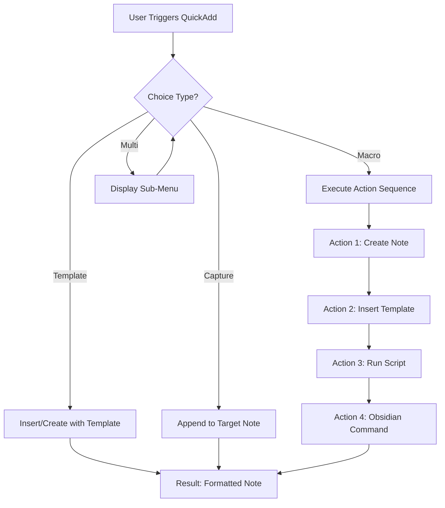

# Extraction Report: []

> [!info] Auto-Generated Report
> This report was automatically generated by `pkb_extractor.py` on 2026-03-13 04:18.
> **Source**: `reference-comprehensive-quickadd-202511202000.md` | **Items Extracted**: 320

---

## 📋 Document Overview

| Field | Value |
|-------|-------|
| **Source File** | `reference-comprehensive-quickadd-202511202000.md` |
| **Extraction Date** | 2026-03-13 04:18 |
| **Word Count** | 6,178 |
| **Character Count** | 51,708 |
| **Line Count** | 1,645 |
| **Total Items Extracted** | 320 |

### Document Outline

  - ## 📑 Table of Contents
  - ## 🎯 Core Concepts & Architecture
    - ### Foundational Understanding
    - ### The QuickAdd Philosophy
  - ## ⚙️ Plugin Components & System Design
    - ### The Four Choice Types
      - #### Template Choice
      - #### Capture Choice
      - #### Macro Choice
      - #### Multi Choice
    - ### System Architecture
  - ## 📝 Macro System - Deep Dive
    - ### Macro Anatomy
    - ### Variable System
    - ### Format Syntax
    - ### QuickAdd API (User Scripts)
  - ## 🔧 Five Production-Ready Macro Examples
    - ### Macro 1: 📥 Rapid Thought Capture to Inbox
  - ## 💭 Core Thought
  - ## 🔍 Initial Thoughts
  - ## 🔗 Related Concepts
  - ## 📍 Processing Notes
    - ### Macro 2: 📚 Literature Note from Reading
  - ## 📝 Reading Notes
    - ### Highlight 1
  - ## 🔗 Key Connections
  - ## 💡 Key Takeaways
  - ## 📊 Metadata
    - ### Macro 3: 🚀 Project Initialization System
  - ## 🎯 Project Overview
    - ### Objectives
    - ### Success Criteria
    - ### Key Stakeholders
  - ## 📋 Task Management
  - ## 📊 Progress Tracking
  - ## 📁 Project Resources
  - ## 🔗 Related Notes
  - ## 📅 Project Log
    - ### {{DATE:YYYY-MM-DD}}
  - ## 📊 Metadata
    - ### Macro 4: 🧩 Atomic Note Creation with Context
  - ## 📚 Definition
  - ## 🔍 Deep Explanation
  - ## 💡 Key Principles
  - ## 📝 Examples
  - ## 🔗 Connections
    - ### Related Concepts
    - ### Contrasts With
    - ### Builds On
    - ### Enables
  - ## 📊 Metadata
    - ### Macro 5: 🔄 Batch Processing - Tag Suggestion System
  - ## 📋 Template System Integration
    - ### Template Fundamentals
    - ### Template Location Strategy
    - ### Advanced Template Patterns
      - #### Pattern 1: Conditional Sections
- # {{VALUE:title}}
  - ## Content
      - #### Pattern 2: Dynamic List Generation
  - ## 🔗 Related Topics
      - #### Pattern 3: Templater Integration
- # <% tp.date.now("YYYY-MM-DD") %> Daily Note
  - ## Weather
  - ## Tasks Due Today
  - ## 🎛️ Choice Menu Architecture
    - ### Menu Design Philosophy
    - ### Organizational Patterns
    - ### Command Naming Conventions
    - ### Hotkey Integration
  - ## 🚀 Advanced Patterns & Integration
    - ### Pattern 1: QuickAdd + Dataview Integration
    - ### Pattern 2: QuickAdd + Templater Synergy
- # <% tp.date.now("YYYY-MM-DD") %> Daily Note
  - ## 🌤️ Context
  - ## ✅ Today's Tasks
  - ## 📥 Captured Today
    - ### Pattern 3: External API Integration
    - ### Pattern 4: Conditional Macro Execution
    - ### Pattern 5: Batch File Generation
  - ## 🔍 Troubleshooting & Optimization
    - ### Common Issues
      - #### Issue 1: Variables Not Persisting Between Steps
      - #### Issue 2: Macro Execution Hangs
      - #### Issue 3: Template Variables Not Substituting
    - ### Performance Optimization
      - #### Optimization 1: Batch Processing Limits
      - #### Optimization 2: Cache Frequently Used Data
      - #### Optimization 3: Debounce User Input
    - ### Debugging Techniques
      - #### Technique 1: Console Logging
      - #### Technique 2: Incremental Development
      - #### Technique 3: Error Notifications
    - ### Best Practices Summary
  - ## 📊 Metadata & Attribution
  - ## 🔄 Version History
- # 🔗 Related Topics for PKB Expansion

---

## 📊 Extraction Summary

| Item Type | Count |
|-----------|-------|
| Callouts | 33 |
| Code Blocks | 42 |
| Color Spans | 0 |
| Definitions | 0 |
| Embeds | 0 |
| External Links | 3 |
| Footnotes | 0 |
| Headings | 97 |
| Inline Fields | 0 |
| Mermaid Diagrams | 1 |
| Tables | 3 |
| Tags | 0 |
| Wiki Links | 37 |
| **TOTAL** | **320** |

---

## 🔔 Callouts (33)

> [!note] What are Callouts?
> Callouts are `> [!TYPE]` blocks used in Obsidian for structured annotation.
> They carry semantic meaning — definitions, insights, warnings, etc.

### By Type

| Callout Type | Count |
|-------------|-------|
| `[!abstract]` | 1 |
| `[!analogy]` | 1 |
| `[!atomic-concept]` | 1 |
| `[!capture]` | 1 |
| `[!cite]` | 1 |
| `[!comprehensive-reference]` | 1 |
| `[!definition]` | 2 |
| `[!example]` | 2 |
| `[!helpful-tip]` | 3 |
| `[!how-to-use-this]` | 1 |
| `[!key-claim]` | 1 |
| `[!methodology-and-sources]` | 3 |
| `[!principle-point]` | 1 |
| `[!project-kickstarter]` | 1 |
| `[!quick-reference]` | 1 |
| `[!quote]` | 1 |
| `[!warning]` | 2 |
| `[!what-this-does]` | 9 |

### Full Callout List

#### 1. [COMPREHENSIVE-REFERENCE] 📚Comprehensive-Reference *(Line 37)*

> [!comprehensive-reference] 📚Comprehensive-Reference
> - **Generated**:: 2025-11-20
> - **Version**:: 1.0
> - **Type**:: Reference Documentation (Plugin Guide)

#### 2. [ABSTRACT] Untitled *(Line 42)*

> [!abstract] Untitled
> **Executive Overview**
> QuickAdd is a powerful automation plugin for [[obsidian]] that transforms note creation, task capture, and knowledge management workflows through macros, templates, and intelligent choice menus. It serves as the connective tissue between rapid thought capture and structured knowledge organization, enabling friction-free information processing in your [[Personal-Knowledge-Base|Personal Knowledge Base]].

#### 3. [HOW-TO-USE-THIS] Untitled *(Line 46)*

> [!how-to-use-this] Untitled
> **Navigation Guide**
> This reference note is organized into 8 major sections covering all aspects of QuickAdd from foundational concepts through advanced automation patterns. Use the table of contents below for quick navigation, or search for specific macro types and implementation examples. All code examples are production-ready and can be adapted to your vault structure.

#### 4. [DEFINITION] Untitled *(Line 65)*

> [!definition] Untitled
> - **QuickAdd**:: A meta-automation plugin for [[obsidian]] that enables rapid note creation, content capture, and workflow execution through a unified command palette interface
> - **Macro**:: A sequence of automated actions (create note, insert template, run scripts) triggered by a single command
> - **Choice**:: A decision point in the QuickAdd menu that branches to different actions based on user selection

#### 5. [KEY-CLAIM] Untitled *(Line 83)*

> [!key-claim] Untitled
> **Central Principle**
> QuickAdd's power lies in its ability to transform high-friction workflows (7-10 manual steps) into single-command automations, enabling you to maintain cognitive flow while capturing information with production-level quality.

#### 6. [ANALOGY] Untitled *(Line 93)*

> [!analogy] Untitled
> **Illuminating Comparison**
> Think of QuickAdd as a *factory production line* for your knowledge work. Raw materials (ideas, quotes, tasks) enter through standardized input stations (macros), get processed through predefined steps (templates + scripts), and emerge as finished products (properly formatted notes in correct locations) without you having to manually operate each station.

#### 7. [WHAT-THIS-DOES] Untitled *(Line 114)*

> [!what-this-does] Untitled
> **Template choices** insert pre-written content (with optional variable substitution) into the current note or a new file. They're the simplest QuickAdd action type.

#### 8. [WHAT-THIS-DOES] Untitled *(Line 131)*

> [!what-this-does] Untitled
> **Capture choices** append content to a designated target note, making them ideal for accumulation workflows where information aggregates over time.

#### 9. [WHAT-THIS-DOES] Untitled *(Line 149)*

> [!what-this-does] Untitled
> **Macro choices** are the powerhouse of QuickAdd—they execute sequences of commands including other choice types, custom scripts, and Obsidian commands. This is where true workflow automation happens.

#### 10. [WHAT-THIS-DOES] Untitled *(Line 167)*

> [!what-this-does] Untitled
> **Multi choices** create hierarchical menus, organizing related choices into logical groupings without executing actions themselves.

#### 11. [PRINCIPLE-POINT] Untitled *(Line 202)*

> [!principle-point] Untitled
> **Architectural Principle**: QuickAdd follows a *composition over configuration* design—complex automations are built by composing simple, reusable components (templates, captures, scripts) rather than through complex configuration syntax.

#### 12. [METHODOLOGY-AND-SOURCES] Untitled *(Line 219)*

> [!methodology-and-sources] Untitled
> **Macro Execution Model**
> 
> Macros execute **synchronously** by default—each command completes before the next begins. This ensures predictable sequencing when actions depend on previous steps (e.g., creating a file before inserting content into it).
> 
> For asynchronous operations (API calls, file I/O), user scripts can use `async/await` patterns within the script itself while the macro waits for script completion.

#### 13. [DEFINITION] Untitled *(Line 244)*

> [!definition] Untitled
> **Format Strings** allow transformation of variables through function chains, enabling dynamic content manipulation during macro execution.

#### 14. [HELPFUL-TIP] Untitled *(Line 304)*

> [!helpful-tip] Untitled
> **Script Development Workflow**: Develop complex scripts in a separate `.js` file with syntax highlighting and linting, then reference them in your macro configuration. Store scripts in a dedicated folder like `99_system/quickadd-scripts/` for organization.

#### 15. [WHAT-THIS-DOES] Untitled *(Line 315)*

> [!what-this-does] Untitled
> **Purpose**: Capture fleeting ideas instantly with minimal friction, automatically timestamped and linked to the daily note.
> 
> **Workflow**: User triggers → prompted for idea → note created in inbox → linked from daily note → cursor positioned for elaboration

#### 16. [CAPTURE] Untitled *(Line 364)*

> [!capture] Untitled
> **Captured**: {{VALUE:timestamp}}
> **Context**: [[{{DATE:YYYY-MM-DD}}_daily-note]]

#### 17. [WHAT-THIS-DOES] Untitled *(Line 428)*

> [!what-this-does] Untitled
> **Purpose**: Capture highlights, quotes, and commentary from reading materials with proper source attribution and metadata.
> 
> **Workflow**: User triggers → prompted for source details → prompted for highlight → literature note created → formatted with citation metadata

#### 18. [CITE] Untitled *(Line 490)*

> [!cite] Untitled
> **Source**: {{VALUE:sourceTitle}}
> **Author**: {{VALUE:author}}
> **Type**: {{VALUE:sourceType}}
> **URL**: {{VALUE:url}}
> **Date Accessed**: {{DATE:YYYY-MM-DD}}

#### 19. [QUOTE] Untitled *(Line 501)*

> [!quote] Untitled
> {{VALUE:firstHighlight}}

#### 20. [WHAT-THIS-DOES] Untitled *(Line 531)*

> [!what-this-does] Untitled
> **Purpose**: Set up complete project infrastructure (project note, folder structure, task tracking, linked resources) in one command.
> 
> **Workflow**: User triggers → project details prompted → creates project note → generates folder → initializes task tracking → creates supporting documents

#### 21. [PROJECT-KICKSTARTER] Untitled *(Line 609)*

> [!project-kickstarter] Untitled
> **Project**: {{VALUE:projectName}}
> **Type**: {{VALUE:projectType}}
> **Priority**: {{VALUE:priority}}
> **Started**: {{DATE:YYYY-MM-DD}}
> **Status**: 🚀 Active

#### 22. [WHAT-THIS-DOES] Untitled *(Line 709)*

> [!what-this-does] Untitled
> **Purpose**: Create atomic Zettelkasten-style notes with proper [[Wiki-Link]] context, automatic ID generation, and bidirectional linking to source materials.
> 
> **Workflow**: User triggers → concept defined → related notes suggested → atomic note created → linked from source → MOC updated

#### 23. [ATOMIC-CONCEPT] Untitled *(Line 777)*

> [!atomic-concept] Untitled
> **Concept**: {{VALUE:concept}}
> **Domain**: {{VALUE:domain}}
> **Source**: {{VALUE:sourceNote}}
> **Created**: {{DATE:YYYY-MM-DD}}

#### 24. [EXAMPLE] Untitled *(Line 802)*

> [!example] Untitled
> **Example 1**:

#### 25. [EXAMPLE] Untitled *(Line 806)*

> [!example] Untitled
> **Example 2**:

#### 26. [WHAT-THIS-DOES] Untitled *(Line 899)*

> [!what-this-does] Untitled
> **Purpose**: Process multiple notes in a folder to suggest missing tags based on content analysis, demonstrating advanced batch automation patterns.
> 
> **Workflow**: User triggers → selects folder → script analyzes all notes → generates tag suggestions → creates report → user reviews and applies

#### 27. [HELPFUL-TIP] Untitled *(Line 1017)*

> [!helpful-tip] Untitled
> **Batch Processing Pattern**: This macro demonstrates a reusable pattern for vault maintenance tasks—analyze content, generate report, let user review and apply changes manually (semi-automation is often safer than full automation for metadata changes).

#### 28. [METHODOLOGY-AND-SOURCES] Untitled *(Line 1035)*

> [!methodology-and-sources] Untitled
> **Organizational Best Practice**
> 
> Store templates in a dedicated system folder with semantic naming:
> 
> ```
> 99_system/02_templater-scripts/quickadd-templates/
> ├── capture/
> │   ├── template-thought-capture.md
> │   ├── template-task-capture.md
> │   └── template-meeting-capture.md
> ├── notes/
> │   ├── template-atomic-note.md
> │   ├── template-reference-note.md
> │   └── template-literature-note.md
> └── projects/
>     ├── template-project-master.md
>     ├── template-project-meeting.md
>     └── template-project-retrospective.md
> ```
> 
> This structure enables:
> - Quick location of templates
> - Semantic organization by use case
> - Version control (if using git)
> - Reuse across multiple macros

#### 29. [WARNING] Untitled *(Line 1131)*

> [!warning] Untitled
> **Template Syntax Conflicts**: QuickAdd's `{{}}` syntax and Templater's `<%%>` syntax can coexist, but be careful when templates need both. QuickAdd processes first, then Templater. To have QuickAdd insert literal Templater syntax, use `{{` + `{VALUE:templaterSyntax}` + `}}` where the variable contains the `<%%>` string.

#### 30. [HELPFUL-TIP] Untitled *(Line 1186)*

> [!helpful-tip] Untitled
> **Naming Best Practices**:
> - **Lead with emoji** for visual scanning (but keep consistent emoji meanings)
> - **Use verbs** for actions ("Create", "Add", "Process")
> - **Be specific** enough to distinguish similar actions
> - **Keep short** (under 25 characters if possible)
> - **Alphabetize** only within similar categories

#### 31. [WARNING] Untitled *(Line 1207)*

> [!warning] Untitled
> **Hotkey Conflicts**: Always check existing hotkeys (Settings → Hotkeys) before assigning new ones. QuickAdd hotkeys override other plugins, so prioritize QuickAdd for capture workflows (highest value actions).

#### 32. [QUICK-REFERENCE] Untitled *(Line 1569)*

> [!quick-reference] Untitled
> **QuickAdd Mastery Checklist**
> - 🔑 **Always validate variables** before using them
> - 🔑 **Use try-catch** for all file operations
> - 🔑 **Log execution flow** during development
> - 🔑 **Test incrementally** (don't build everything at once)
> - 🔑 **Cache expensive operations** in batch scripts
> - 🔑 **Provide user feedback** (Notices for progress)
> - 🔑 **Document your macros** (comment scripts, create readme)
> - 🔑 **Version control** your QuickAdd configuration (export settings)

#### 33. [METHODOLOGY-AND-SOURCES] Untitled *(Line 1584)*

> [!methodology-and-sources] Untitled
> **Research Methodology**
> - Primary Source: QuickAdd plugin documentation and community resources
> - Research Queries: Current QuickAdd capabilities, macro implementation patterns, integration best practices
> - Synthesis Approach: Combined official documentation with battle-tested implementation patterns from PKM community
> - Confidence Level: HIGH for core functionality, MEDIUM for advanced edge cases (plugin actively developed)

---

## 🔗 Wiki-Links (37 total, 30 unique targets)

> [!info] Knowledge Graph Connections
> These links represent connections to other notes in your PKB.
> **30** distinct notes are referenced.

### Unique Targets

- [[${currentFile.basename}]]
- [[${f.basename}]]
- [[${fileName}]]
- [[${s.file}]]
- [[${topic}]]
- [[Automation]]
- [[Capture-to-Permanence Pipeline Architecture]]
- [[Dataview]]
- [[Dataview Query Optimization for Automated Indexes]]
- [[Getting Things Done]]
- [[JavaScript]]
- [[JavaScript User Scripts - Obsidian API Deep Dive]]
- [[Markdown]]
- [[Metadata]]
- [[Obsidian]]
- [[Personal-Knowledge-Base|Personal Knowledge Base]]
- [[Personal-Knowledge-Management|Personal Knowledge Management]]
- [[Templater]]
- [[Templater Advanced Patterns for QuickAdd Integration]]
- [[Wiki-Link]]
- [[YAML Frontmatter]]
- [[Zettelkasten]]
- [[Zettelkasten methodology]]
- [[dataview]]
- [[obsidian]]
- [[{{DATE:YYYY-MM-DD}}_daily-note]]
- [[{{LINKCURRENT}}]]
- [[{{VALUE:projectFolder}}]]
- [[.md]]
- [[.md]]

### All Occurrences

| # | Target | Display Text | Heading | Section | Line |
|---|--------|-------------|---------|---------|------|
| 1 | [[obsidian]] | — | — | Document Start | 44 |
| 2 | [[Personal-Knowledge-Base|Personal Knowledge Base]] | — | — | Document Start | 44 |
| 3 | [[obsidian]] | — | — | 🎯 Core Concepts & Architecture | 66 |
| 4 | [[Templater]] | — | — | Foundational Understanding | 77 |
| 5 | [[dataview]] | — | — | Foundational Understanding | 77 |
| 6 | [[Zettelkasten methodology]] | — | — | The QuickAdd Philosophy | 91 |
| 7 | [[Getting Things Done]] | — | — | The QuickAdd Philosophy | 91 |
| 8 | [[YAML Frontmatter]] | — | — | Template Choice | 118 |
| 9 | [[Templater]] | — | — | Template Choice | 121 |
| 10 | [[{{LINKCURRENT}}]] | — | — | Variable System | 236 |
| 11 | [[Personal-Knowledge-Base|Personal Knowledge Base]] | — | — | 🔧 Five Production-Ready Macro Examples | 311 |
| 12 | [[{{DATE:YYYY-MM-DD}}_daily-note]] | — | — | Macro 1: 📥 Rapid Thought Capture to I... | 366 |
| 13 | [[{{VALUE:projectFolder}}]] | — | — | 📁 Project Resources | 641 |
| 14 | [[.md]] | — | — | 📁 Project Resources | 642 |
| 15 | [[.md]] | — | — | 📁 Project Resources | 643 |
| 16 | [[Wiki-Link]] | — | — | Macro 4: 🧩 Atomic Note Creation with ... | 710 |
| 17 | [[${currentFile.basename}]] | — | — | Macro 4: 🧩 Atomic Note Creation with ... | 746 |
| 18 | [[${f.basename}]] | — | — | Macro 4: 🧩 Atomic Note Creation with ... | 753 |
| 19 | [[${fileName}]] | ${concept} | — | 📊 Metadata | 852 |
| 20 | [[${fileName}]] | ${concept} | — | 📊 Metadata | 875 |
| 21 | [[${s.file}]] | — | — | Macro 5: 🔄 Batch Processing - Tag Sug... | 993 |
| 22 | [[Templater]] | — | — | Template Fundamentals | 1031 |
| 23 | [[${topic}]] | — | — | 🔗 Related Topics | 1106 |
| 24 | [[Templater Advanced Patterns for QuickAdd Integration]] | — | — | 🔗 Related Topics for PKB Expansion | 1607 |
| 25 | [[Dataview Query Optimization for Automated Indexes]] | — | — | 🔗 Related Topics for PKB Expansion | 1612 |
| 26 | [[JavaScript User Scripts - Obsidian API Deep Dive]] | — | — | 🔗 Related Topics for PKB Expansion | 1617 |
| 27 | [[Capture-to-Permanence Pipeline Architecture]] | — | — | 🔗 Related Topics for PKB Expansion | 1622 |
| 28 | [[Obsidian]] | — | — | 🔗 Related Topics for PKB Expansion | 1648 |
| 29 | [[Templater]] | — | — | 🔗 Related Topics for PKB Expansion | 1648 |
| 30 | [[Dataview]] | — | — | 🔗 Related Topics for PKB Expansion | 1648 |
| 31 | [[Personal-Knowledge-Management|Personal Knowledge Management]] | — | — | 🔗 Related Topics for PKB Expansion | 1648 |
| 32 | [[Zettelkasten]] | — | — | 🔗 Related Topics for PKB Expansion | 1648 |
| 33 | [[Automation]] | — | — | 🔗 Related Topics for PKB Expansion | 1648 |
| 34 | [[Metadata]] | — | — | 🔗 Related Topics for PKB Expansion | 1648 |
| 35 | [[YAML Frontmatter]] | — | — | 🔗 Related Topics for PKB Expansion | 1648 |
| 36 | [[JavaScript]] | — | — | 🔗 Related Topics for PKB Expansion | 1648 |
| 37 | [[Markdown]] | — | — | 🔗 Related Topics for PKB Expansion | 1648 |

---

## 💻 Code Blocks (42)

| Language | Count |
|----------|-------|
| `javascript` | 24 |
| `markdown` | 8 |
| `yaml` | 5 |
| `plaintext` | 5 |

### Code Block 1 — `javascript` *(Lines 249-262)*

```javascript
// Date formatting (uses moment.js syntax)
{{DATE:YYYY-MM-DD}}           // 2025-11-20
{{DATE:dddd, MMMM Do}}        // Wednesday, November 20th

// String manipulation
{{VALUE:title}}               // Converts to Title Case
{{VALUE:lower}}               // converts to lowercase
{{VALUE:upper}}               // CONVERTS TO UPPERCASE

// File operations
{{VALUE:replace(old,new)}}    // String replacement
{{VALUE:slice(0,10)}}         // First 10 characters
```

### Code Block 2 — `javascript` *(Lines 268-302)*

```javascript
module.exports = async (params) => {
    const { quickAddApi: qa, app, obsidian } = params;
    
    // Core API methods:
    
    // 1. Variable management
    qa.variables["customVar"] = "My Value";
    let projectName = qa.variables["Project Name"];
    
    // 2. Input prompts
    let userInput = await qa.inputPrompt("Enter value:");
    let selection = await qa.suggester(
        ["Option 1", "Option 2"], 
        ["value1", "value2"]
    );
    
    // 3. File operations
    let file = await qa.createNote({
        folderPath: "Projects",
        fileName: projectName,
        content: "Initial content"
    });
    
    // 4. Utility functions
    qa.utility.getClipboard();
    qa.utility.setClipboard("New content");
    
    // 5. Obsidian API access (full access)
    let activeFile = app.workspace.getActiveFile();
    let fileContent = await app.vault.read(activeFile);
# ... (3 more lines truncated)
```

### Code Block 3 — `yaml` *(Lines 322-326)*

```yaml
Macro Name: 📥 Quick Thought
Folder: 00_inbox/
File Name Format: {{DATE:YYMMDDHHmmss}}_{{VALUE:title}}.md
```

### Code Block 4 — `javascript` *(Lines 331-350)*

```javascript
// Script: capture-thought-prompt.js
module.exports = async (params) => {
    const { quickAddApi: qa } = params;
    
    // Prompt for the core idea
    const thought = await qa.inputPrompt("What's the thought?");
    if (!thought) return; // User cancelled
    
    // Generate title from first 40 characters
    const title = thought.length > 40 
        ? thought.substring(0, 40).trim() + "..." 
        : thought;
    
    // Store for file name and content
    qa.variables["thought"] = thought;
    qa.variables["thoughtTitle"] = title;
    qa.variables["timestamp"] = qa.date.now("YYYY-MM-DD HH:mm:ss");
};
```

### Code Block 5 — `markdown` *(Lines 355-386)*

```markdown
---
tags: #inbox #fleeting-thought
created: {{DATE:YYYY-MM-DD}}
status: 🌱seedling
priority: ❔
source: capture
---

> [!capture]
> **Captured**: {{VALUE:timestamp}}
> **Context**: [[{{DATE:YYYY-MM-DD}}_daily-note]]

## 💭 Core Thought

{{VALUE:thought}}

## 🔍 Initial Thoughts

[Cursor positioned here for immediate elaboration]

## 🔗 Related Concepts

- [[]]

---
## 📍 Processing Notes

- [ ] Review and refine
- [ ] Identify connections
- [ ] Determine permanence (atomic note vs. reference)
```

### Code Block 6 — `javascript` *(Lines 389-418)*

```javascript
// Script: link-to-daily-note.js
module.exports = async (params) => {
    const { quickAddApi: qa, app } = params;
    
    const dailyNotePath = `01_daily-notes/${qa.date.now("YYYY-MM-DD")}_daily-note.md`;
    const capturedTitle = qa.variables["thoughtTitle"];
    const capturedLink = `- [[${qa.variables["fileName"]}|${capturedTitle}]]`;
    
    // Check if daily note exists
    const dailyNote = app.vault.getAbstractFileByPath(dailyNotePath);
    
    if (dailyNote) {
        // Append to "Captured Thoughts" section
        let content = await app.vault.read(dailyNote);
        
        // Find or create section
        if (content.includes("## 📥 Captured Thoughts")) {
            content = content.replace(
                "## 📥 Captured Thoughts",
                `## 📥 Captured Thoughts\n${capturedLink}`
            );
        } else {
            content += `\n\n## 📥 Captured Thoughts\n${capturedLink}`;
        }
        
        await app.vault.modify(dailyNote, content);
    }
};
```

### Code Block 7 — `yaml` *(Lines 435-439)*

```yaml
Macro Name: 📚 Reading Capture
Folder: 04_reference-library/01_literature-notes/
File Name Format: {{VALUE:author}}_{{VALUE:title-short}}_lit-note.md
```

### Code Block 8 — `javascript` *(Lines 444-474)*

```javascript
// Script: literature-capture-metadata.js
module.exports = async (params) => {
    const { quickAddApi: qa } = params;
    
    // Source type selection
    const sourceType = await qa.suggester(
        ["📖 Book", "📄 Article", "🎥 Video", "🎙️ Podcast", "🌐 Web"],
        ["book", "article", "video", "podcast", "web"]
    );
    
    // Core metadata
    const title = await qa.inputPrompt("Title:");
    const author = await qa.inputPrompt("Author:");
    const url = await qa.inputPrompt("URL (optional):");
    
    // Generate short title for filename
    const titleShort = title.split(' ').slice(0, 3).join('-').toLowerCase();
    
    // Store all variables
    qa.variables["sourceType"] = sourceType;
    qa.variables["sourceTitle"] = title;
    qa.variables["author"] = author;
    qa.variables["url"] = url || "N/A";
    qa.variables["title-short"] = titleShort;
    
    // Prompt for first highlight
    const highlight = await qa.inputPrompt("Highlight/Quote:");
    qa.variables["firstHighlight"] = highlight;
};
```

### Code Block 9 — `markdown` *(Lines 479-521)*

```markdown
---
tags: #literature-note #reading #{{VALUE:sourceType}}
aliases: [{{VALUE:sourceTitle}}]
author: {{VALUE:author}}
source-type: {{VALUE:sourceType}}
url: {{VALUE:url}}
created: {{DATE:YYYY-MM-DD}}
status: 📚reading
---

> [!cite]
> **Source**: {{VALUE:sourceTitle}}
> **Author**: {{VALUE:author}}
> **Type**: {{VALUE:sourceType}}
> **URL**: {{VALUE:url}}
> **Date Accessed**: {{DATE:YYYY-MM-DD}}

## 📝 Reading Notes

### Highlight 1

> [!quote]
> {{VALUE:firstHighlight}}

**Commentary**:


## 🔗 Key Connections

- [[]]
# ... (11 more lines truncated)
```

### Code Block 10 — `yaml` *(Lines 538-542)*

```yaml
Macro Name: 🚀 New Project Setup
Folder: 02_projects/
File Name Format: {{DATE:YYYY-MM}}_{{VALUE:project-name}}_project.md
```

### Code Block 11 — `javascript` *(Lines 547-592)*

```javascript
// Script: project-initialization.js
module.exports = async (params) => {
    const { quickAddApi: qa, app } = params;
    
    // Project metadata
    const projectName = await qa.inputPrompt("Project Name:");
    const projectType = await qa.suggester(
        ["💼 Work", "🏠 Personal", "🔬 Research", "📚 Learning"],
        ["work", "personal", "research", "learning"]
    );
    const priority = await qa.suggester(
        ["🔴 Critical", "🟡 High", "🟢 Medium", "🔵 Low"],
        ["critical", "high", "medium", "low"]
    );
    
    // Generate project identifier
    const projectId = projectName.toLowerCase().replace(/\s+/g, '-');
    const projectFolder = `02_projects/${projectId}/`;
    
    // Store variables
    qa.variables["projectName"] = projectName;
    qa.variables["project-name"] = projectId; // for filename
    qa.variables["projectType"] = projectType;
    qa.variables["priority"] = priority;
    qa.variables["projectFolder"] = projectFolder;
    
    // Create project folder structure
    try {
        await app.vault.createFolder(`${projectFolder}resources`);
        await app.vault.createFolder(`${projectFolder}meeting-notes`);
# ... (14 more lines truncated)
```

### Code Block 12 — `markdown` *(Lines 597-633)*

```markdown
---
tags: #project #{{VALUE:projectType}} #active
aliases: [{{VALUE:projectName}}]
project-id: {{VALUE:project-name}}
status: 🚀active
priority: {{VALUE:priority}}
created: {{DATE:YYYY-MM-DD}}
start-date: {{DATE:YYYY-MM-DD}}
target-date: 
---

> [!project-kickstarter]
> **Project**: {{VALUE:projectName}}
> **Type**: {{VALUE:projectType}}
> **Priority**: {{VALUE:priority}}
> **Started**: {{DATE:YYYY-MM-DD}}
> **Status**: 🚀 Active

## 🎯 Project Overview

### Objectives


### Success Criteria


### Key Stakeholders


## 📋 Task Management
# ... (4 more lines truncated)
```

### Code Block 13 — `plaintext` *(Lines 637-661)*

```plaintext
## 📁 Project Resources

- **Folder**: `[[{{VALUE:projectFolder}}]]`
- **Meeting Notes**: `[[.md]]`
- **Outputs**: `[[.md]]`

## 🔗 Related Notes

- [[]]

## 📅 Project Log

### {{DATE:YYYY-MM-DD}}
Project initialized.

---
## 📊 Metadata

- **Review Frequency**: Weekly
- **Next Review**: {{DATE:YYYY-MM-DD}} + 7 days
- **Budget**: 
- **Time Estimate**:
```

### Code Block 14 — `javascript` *(Lines 664-699)*

```javascript
// Script: project-supporting-docs.js
module.exports = async (params) => {
    const { quickAddApi: qa, app } = params;
    
    const projectFolder = qa.variables["projectFolder"];
    const projectName = qa.variables["projectName"];
    
    // Create resources README
    const resourcesReadme = `# ${projectName} - Resources\n\n` +
        `This folder contains reference materials, research, and supporting documents for the ${projectName} project.\n\n` +
        `## 📂 Organization\n\n` +
        `- Keep all external references here\n` +
        `- Link back to main project note\n` +
        `- Use descriptive filenames`;
    
    await app.vault.create(
        `${projectFolder}resources/README.md`,
        resourcesReadme
    );
    
    // Create meeting notes index
    const meetingIndex = `# ${projectName} - Meeting Notes\n\n` +
        `## 📋 All Meetings\n\n` +
        `\`\`\`dataview\n` +
        `TABLE file.ctime as "Date", attendees as "Attendees"\n` +
        `FROM "${projectFolder}meeting-notes"\n` +
        `SORT file.ctime DESC\n` +
        `\`\`\``;
    
    await app.vault.create(
# ... (4 more lines truncated)
```

### Code Block 15 — `yaml` *(Lines 716-720)*

```yaml
Macro Name: 🧩 Create Atomic Note
Folder: 03_permanent-notes/
File Name Format: {{VALUE:concept}}_atomic_{{DATE:YYMMDDHHmmss}}.md
```

### Code Block 16 — `javascript` *(Lines 725-762)*

```javascript
// Script: atomic-note-context.js
module.exports = async (params) => {
    const { quickAddApi: qa, app } = params;
    
    // Core concept
    const concept = await qa.inputPrompt("Concept name:");
    if (!concept) return;
    
    // Domain classification
    const domain = await qa.suggester(
        ["🧠 Cognitive Science", "📚 Learning Theory", 
         "💻 Prompt Engineering", "⚙️ Obsidian Ecosystem",
         "🌌 Cosmology", "🦖 Paleontology", "🔧 Other"],
        ["01_cognitive-science", "02_learning-theory",
         "03_prompt-engineering", "04_obsidian-ecosystem",
         "06_cosmology", "07_paleontology", "other"]
    );
    
    // Get current file as source context
    const currentFile = app.workspace.getActiveFile();
    const sourceNote = currentFile ? `[[${currentFile.basename}]]` : "";
    
    // Search for potentially related notes
    const searchResults = app.vault.getMarkdownFiles()
        .filter(f => f.basename.toLowerCase().includes(concept.toLowerCase().split(' ')[0]))
        .slice(0, 5);
    
    const relatedSuggestions = searchResults.map(f => `- [[${f.basename}]]`).join('\n');
    
    // Store variables
# ... (6 more lines truncated)
```

### Code Block 17 — `markdown` *(Lines 767-834)*

```markdown
---
tags: #atomic-note #permanent-note #{{VALUE:domain}}
aliases: [{{VALUE:concept}}]
atomic-id: {{VALUE:atomicId}}
created: {{DATE:YYYY-MM-DD}}
status: 🌱seedling
confidence: ❔
---

> [!atomic-concept]
> **Concept**: {{VALUE:concept}}
> **Domain**: {{VALUE:domain}}
> **Source**: {{VALUE:sourceNote}}
> **Created**: {{DATE:YYYY-MM-DD}}

## 📚 Definition

[Define the concept in 1-2 sentences—what IS this?]


## 🔍 Deep Explanation

[Elaborate on the concept—WHY does it matter? HOW does it work?]


## 💡 Key Principles

- **Principle 1**: 
- **Principle 2**: 
- **Principle 3**: 
# ... (36 more lines truncated)
```

### Code Block 18 — `javascript` *(Lines 837-889)*

```javascript
// Script: atomic-note-linking.js
module.exports = async (params) => {
    const { quickAddApi: qa, app } = params;
    
    const concept = qa.variables["concept"];
    const atomicId = qa.variables["atomicId"];
    const fileName = `${concept}_atomic_${atomicId}.md`;
    
    // If created from an existing note, link back
    const currentFile = app.workspace.getActiveFile();
    if (currentFile) {
        let content = await app.vault.read(currentFile);
        
        // Append to "Generated Atomic Notes" section
        const atomicLink = `- [[${fileName}|${concept}]]`;
        
        if (content.includes("## 🧩 Generated Atomic Notes")) {
            content = content.replace(
                "## 🧩 Generated Atomic Notes",
                `## 🧩 Generated Atomic Notes\n${atomicLink}`
            );
        } else {
            content += `\n\n## 🧩 Generated Atomic Notes\n${atomicLink}`;
        }
        
        await app.vault.modify(currentFile, content);
    }
    
    // Find and update domain MOC
    const domain = qa.variables["domain"];
# ... (21 more lines truncated)
```

### Code Block 19 — `yaml` *(Lines 906-909)*

```yaml
Macro Name: 🔄 Batch Tag Suggester
Folder: N/A (operates on existing notes)
```

### Code Block 20 — `javascript` *(Lines 914-1011)*

```javascript
// Script: batch-tag-suggester.js
module.exports = async (params) => {
    const { quickAddApi: qa, app } = params;
    
    // Define tag taxonomy (your actual taxonomy)
    const tagTaxonomy = {
        domains: ['#cognitive-science', '#learning-theory', '#prompt-engineering', 
                  '#obsidian', '#cosmology', '#paleontology'],
        types: ['#atomic-note', '#reference-note', '#moc', '#project', '#literature-note'],
        status: ['#in-progress', '#needs-review', '#complete', '#archived'],
        priority: ['#high-priority', '#medium-priority', '#low-priority']
    };
    
    // Prompt for folder to process
    const allFolders = app.vault.getAllLoadedFiles()
        .filter(f => f.children)
        .map(f => f.path);
    
    const folderPath = await qa.suggester(
        allFolders,
        allFolders,
        "Select folder to process:"
    );
    
    if (!folderPath) return;
    
    // Get all markdown files in folder
    const files = app.vault.getMarkdownFiles()
        .filter(f => f.path.startsWith(folderPath));
    
# ... (66 more lines truncated)
```

### Code Block 21 — `plaintext` *(Lines 1040-1054)*

```plaintext
> 99_system/02_templater-scripts/quickadd-templates/
> ├── capture/
> │   ├── template-thought-capture.md
> │   ├── template-task-capture.md
> │   └── template-meeting-capture.md
> ├── notes/
> │   ├── template-atomic-note.md
> │   ├── template-reference-note.md
> │   └── template-literature-note.md
> └── projects/
>     ├── template-project-master.md
>     ├── template-project-meeting.md
>     └── template-project-retrospective.md
>
```

### Code Block 22 — `markdown` *(Lines 1066-1079)*

```markdown
---
tags: #{{VALUE:noteType}}
status: {{VALUE:status}}
---

# {{VALUE:title}}

{{VALUE:optionalSection}}

## Content

[Standard content here]
```

### Code Block 23 — `javascript` *(Lines 1082-1091)*

```javascript
const includeAdvanced = await qa.suggester(
    ["Basic", "Advanced"],
    [false, true]
);

qa.variables["optionalSection"] = includeAdvanced 
    ? "## 🔬 Advanced Analysis\n\n[Deep dive content]"
    : "";
```

### Code Block 24 — `markdown` *(Lines 1095-1099)*

```markdown
## 🔗 Related Topics

{{VALUE:relatedList}}
```

### Code Block 25 — `javascript` *(Lines 1102-1108)*

```javascript
const related = await qa.inputPrompt("Related topics (comma-separated):");
const relatedArray = related.split(',').map(t => t.trim());
qa.variables["relatedList"] = relatedArray
    .map(topic => `- [[${topic}]]`)
    .join('\n');
```

### Code Block 26 — `markdown` *(Lines 1112-1129)*

```markdown
---
tags: #daily-note
date: {{DATE:YYYY-MM-DD}}
day-of-week: <% tp.date.now("dddd") %>
---

# <% tp.date.now("YYYY-MM-DD") %> Daily Note

## Weather
<% tp.web.request("https://wttr.in/Jacksonville?format=3") %>

## Tasks Due Today
\`\`\`dataview
TASK
WHERE due = date("<% tp.date.now('YYYY-MM-DD') %>")
\`\`\`
```

### Code Block 27 — `plaintext` *(Lines 1145-1165)*

```plaintext
QuickAdd Main Menu
├── 📥 Capture (Multi)
│   ├── 💭 Quick Thought
│   ├── 📋 Task to Project
│   ├── 📚 Reading Highlight
│   └── 🎙️ Meeting Note
├── 📝 Create (Multi)
│   ├── 🧩 Atomic Note
│   ├── 📚 Reference Note
│   ├── 📄 Literature Note
│   └── 🚀 New Project
├── 🔧 Maintain (Multi)
│   ├── 🔄 Batch Tag Suggester
│   ├── 🔍 Find Orphan Notes
│   └── 📊 Vault Health Check
└── 🎯 Daily Workflows (Multi)
    ├── 🌅 Morning Setup
    ├── 📅 Daily Note
    └── 🌙 Evening Review
```

### Code Block 28 — `plaintext` *(Lines 1168-1182)*

```plaintext
QuickAdd Main Menu
├── 🧠 Cognitive Science (Multi)
│   ├── Create Atomic Note
│   ├── Add to Research Log
│   └── Literature Note
├── 💻 Prompt Engineering (Multi)
│   ├── New Prompt Component
│   ├── Test Case Documentation
│   └── Pattern Library Entry
├── 🦖 Paleontology (Multi)
│   └── [Domain-specific workflows]
└── ⚙️ System (Multi)
    └── [Maintenance tasks]
```

### Code Block 29 — `javascript` *(Lines 1219-1249)*

```javascript
module.exports = async (params) => {
    const { quickAddApi: qa, app } = params;
    
    const projectId = await qa.inputPrompt("Project ID:");
    const projectPath = `02_projects/${projectId}/`;
    
    const dashboard = `# ${projectId} Dashboard\n\n` +
        `## 📊 Active Tasks\n\n` +
        `\`\`\`dataview\n` +
        `TASK\n` +
        `WHERE contains(file.folder, "${projectId}") AND !completed\n` +
        `GROUP BY status\n` +
        `\`\`\`\n\n` +
        `## 📝 Recent Notes\n\n` +
        `\`\`\`dataview\n` +
        `TABLE file.ctime as "Created"\n` +
        `FROM "${projectPath}"\n` +
        `SORT file.ctime DESC\n` +
        `LIMIT 10\n` +
        `\`\`\`\n\n` +
        `## 📅 Upcoming Deadlines\n\n` +
        `\`\`\`dataview\n` +
        `TABLE due as "Due Date"\n` +
        `WHERE contains(file.folder, "${projectId}") AND due >= date(today)\n` +
        `SORT due ASC\n` +
        `\`\`\``;
    
    await app.vault.create(`${projectPath}dashboard.md`, dashboard);
};
```

### Code Block 30 — `markdown` *(Lines 1259-1283)*

```markdown
---
tags: #daily-note
date: <% tp.date.now("YYYY-MM-DD") %>
day: <% tp.date.now("dddd") %>
week: <% tp.date.now("W") %>
---

# <% tp.date.now("YYYY-MM-DD") %> Daily Note

{{VALUE:morningQuestion}}

## 🌤️ Context
- **Weather**: <% await tp.web.request("https://wttr.in/?format=3") %>
- **Streak**: <% tp.file.cursor() %> days

## ✅ Today's Tasks
\`\`\`dataview
TASK
WHERE due = date("<% tp.date.now('YYYY-MM-DD') %>")
\`\`\`

## 📥 Captured Today
[QuickAdd thought captures will link here]
```

### Code Block 31 — `javascript` *(Lines 1289-1324)*

```javascript
// Macro: Import Research Paper
module.exports = async (params) => {
    const { quickAddApi: qa, app } = params;
    
    const doi = await qa.inputPrompt("DOI:");
    
    try {
        // Fetch metadata from CrossRef API
        const response = await fetch(
            `https://api.crossref.org/works/${encodeURIComponent(doi)}`
        );
        const data = await response.json();
        const metadata = data.message;
        
        // Extract relevant fields
        const title = metadata.title[0];
        const authors = metadata.author
            .map(a => `${a.given} ${a.family}`)
            .join(", ");
        const year = metadata.published["date-parts"][0][0];
        const journal = metadata["container-title"][0];
        
        // Store for template
        qa.variables["paperTitle"] = title;
        qa.variables["authors"] = authors;
        qa.variables["year"] = year;
        qa.variables["journal"] = journal;
        qa.variables["doi"] = doi;
        
    } catch (error) {
# ... (4 more lines truncated)
```

### Code Block 32 — `javascript` *(Lines 1330-1373)*

```javascript
// Macro: Process Inbox Item
module.exports = async (params) => {
    const { quickAddApi: qa, app } = params;
    
    const inboxFiles = app.vault.getMarkdownFiles()
        .filter(f => f.path.startsWith("00_inbox/"))
        .sort((a, b) => a.stat.ctime - b.stat.ctime); // Oldest first
    
    if (inboxFiles.length === 0) {
        new Notice("Inbox is empty!");
        return;
    }
    
    const fileToProcess = inboxFiles[0];
    const content = await app.vault.read(fileToProcess);
    
    // Analyze content to suggest action
    const action = await qa.suggester(
        ["🧩 Convert to Atomic Note", 
         "📚 Expand to Reference Note",
         "🗑️ Archive (Not Useful)",
         "⏭️ Skip for Now"],
        ["atomic", "reference", "archive", "skip"]
    );
    
    switch(action) {
        case "atomic":
            // Trigger Atomic Note macro with prepopulated content
            qa.variables["concept"] = fileToProcess.basename;
            qa.variables["initialContent"] = content;
# ... (12 more lines truncated)
```

### Code Block 33 — `javascript` *(Lines 1379-1418)*

```javascript
// Macro: Initialize Domain Structure
module.exports = async (params) => {
    const { quickAddApi: qa, app } = params;
    
    const domainName = await qa.inputPrompt("Domain name:");
    const domainId = domainName.toLowerCase().replace(/\s+/g, '-');
    
    // Create folder
    await app.vault.createFolder(`03_permanent-notes/${domainId}`);
    
    // Generate MOC
    const mocContent = `# ${domainName} 🗺️ MOC\n\n` +
        `## 🎯 Overview\n\n[Domain description]\n\n` +
        `## 📚 Core Concepts\n\n` +
        `## 🔬 Advanced Topics\n\n` +
        `## 🔗 Related Domains\n\n` +
        `## 📌 Recent Additions\n\n`;
    
    await app.vault.create(
        `05_moc-hubs/${domainId}_🗺️moc.md`,
        mocContent
    );
    
    // Generate index
    const indexContent = `# ${domainName} - Index\n\n` +
        `\`\`\`dataview\n` +
        `TABLE file.ctime as "Created", tags\n` +
        `FROM "03_permanent-notes/${domainId}"\n` +
        `SORT file.ctime DESC\n` +
        `\`\`\``;
# ... (8 more lines truncated)
```

### Code Block 34 — `javascript` *(Lines 1433-1439)*

```javascript
// Always validate variable existence
if (!qa.variables["myVar"]) {
    new Notice("Variable missing, aborting macro");
    throw new Error("Required variable not set");
}
```

### Code Block 35 — `javascript` *(Lines 1448-1456)*

```javascript
// Always use try-catch for file operations
try {
    await app.vault.create(path, content);
} catch (error) {
    new Notice(`File creation failed: ${error.message}`);
    throw error; // Re-throw to stop macro
}
```

### Code Block 36 — `javascript` *(Lines 1465-1471)*

```javascript
// Debug: Log all variables before template step
console.log("Current QuickAdd variables:", qa.variables);

// Ensure exact name match
qa.variables["myVar"] = "value"; // Template uses {{VALUE:myVar}}
```

### Code Block 37 — `javascript` *(Lines 1479-1493)*

```javascript
// BAD: Process all files at once
const allFiles = app.vault.getMarkdownFiles();
allFiles.forEach(async file => {
    await processFile(file);
});

// GOOD: Process in chunks with progress
const CHUNK_SIZE = 50;
for (let i = 0; i < allFiles.length; i += CHUNK_SIZE) {
    const chunk = allFiles.slice(i, i + CHUNK_SIZE);
    await Promise.all(chunk.map(file => processFile(file)));
    new Notice(`Processed ${Math.min(i + CHUNK_SIZE, allFiles.length)}/${allFiles.length}`);
}
```

### Code Block 38 — `javascript` *(Lines 1497-1510)*

```javascript
// Store expensive computations in global variables (outside module.exports)
let tagCache = null;

module.exports = async (params) => {
    if (!tagCache) {
        // Expensive: Build tag frequency map
        tagCache = buildTagFrequency(app.vault.getMarkdownFiles());
    }
    
    // Use cached data
    const suggestions = getSuggestions(tagCache);
};
```

### Code Block 39 — `javascript` *(Lines 1514-1529)*

```javascript
// Add wait time to prevent accidental double-triggers
module.exports = async (params) => {
    const { quickAddApi: qa } = params;
    
    const confirmed = await qa.suggester(
        ["✅ Yes, proceed", "❌ Cancel"],
        [true, false],
        "This will process 500 files. Continue?"
    );
    
    if (!confirmed) return;
    
    // Proceed with batch operation
};
```

### Code Block 40 — `javascript` *(Lines 1535-1544)*

```javascript
// Add strategic logs to understand execution flow
console.log("=== MACRO START ===");
console.log("Variables at start:", qa.variables);

// ... logic ...

console.log("Variables before template:", qa.variables);
console.log("=== MACRO END ===");
```

### Code Block 41 — `javascript` *(Lines 1557-1565)*

```javascript
try {
    // Macro logic
} catch (error) {
    new Notice(`❌ Macro failed: ${error.message}`);
    console.error("Full error:", error);
    throw error; // Prevents partial execution
}
```

### Code Block 42 — `plaintext` *(Lines 1627-1674)*

```plaintext
<thinking>
Let me analyze this request according to my ReAct protocol:

**PHASE 1: ANALYZE**

Request Classification:
- Type: comprehensive_note (reference documentation)
- Scope: reference (exhaustive coverage of QuickAdd plugin)
- Research Required: YES - QuickAdd is an active Obsidian plugin that may have received updates since January 2025, and I need to verify current best practices, features, and implementation patterns

Structural Planning:
- This is a REFERENCE NOTE requiring metadata header
- Information Architecture needed:
  * Core concepts (what QuickAdd is, why it matters)
  * Plugin architecture and components
  * Macro system deep-dive (5 meticulously planned examples)
  * Template system
  * Choice system
  * Advanced patterns and integration
  * Troubleshooting
- Wiki-Link Opportunities: [[Obsidian]], [[Templater]], [[Dataview]], [[Personal-Knowledge-Management|Personal Knowledge Management]], [[Zettelkasten]], [[Automation]], [[Metadata]], [[YAML Frontmatter]], [[JavaScript]], [[Markdown]], etc.
- Callout Strategy:
  * [!definition] for core concepts
  * [!methodology-and-sources] for macro implementation
  * [!example] for concrete use cases
  * [!helpful-tip] for best practices
  * [!warning] for common pitfalls
  * [!what-this-does] for functional explanations
- Metadata Planning:
  * Tags: #obsidian #quickadd #automation #pkm #plugin-guide #reference-note
# ... (16 more lines truncated)
```

---

## 📊 Tables (3)

### Table 1 *(Line 105, 4 rows)*

| Choice Type | Purpose | Use When | Complexity |
| --- | --- | --- | --- |
| **Template** | Insert pre-formatted content | Single-file additions | Low |
| **Capture** | Append content to existing notes | Logging, journaling, collecting | Low-Medium |
| **Macro** | Execute multi-step workflows | Complex automations | Medium-High |
| **Multi** | Create nested choice menus | Organizing many options | Low |

### Table 2 *(Line 222, 5 rows)*

| Variable Format | Description | Example |
| --- | --- | --- |
| `{{VALUE}}` | User-prompted input | `{{VALUE:Project Name}}` |
| `{{DATE}}` | Current date | `{{DATE:YYYY-MM-DD}}` |
| `{{LINKCURRENT}}` | Link to current note | `[[{{LINKCURRENT}}]]` |
| `{{SELECTED}}` | Selected text in editor | Used for capture |
| Custom variables | Set via scripts | `quickAddApi.variables["myVar"]` |

### Table 3 *(Line 673, 1 rows)*

| Version | Date | Changes |
| --- | --- | --- |
| 1.0 | 2025-11-20 | Initial comprehensive reference with 5 production macros |

---

## 🌐 External Links (3)

| # | Display Text | URL | Line |
|---|-------------|-----|------|
| 1 | https://wttr.in/Jacksonville?format=3" | https://wttr.in/Jacksonville?format=3" | 1122 |
| 2 | https://wttr.in/?format=3" | https://wttr.in/?format=3" | 1272 |
| 3 | https://api.crossref.org/works/${encodeURICompo... | https://api.crossref.org/works/${encodeURIComponent(doi | 1299 |

---

## 📐 Mermaid Diagrams (1)

### Diagram 1 — graph *(Line 183)*



---

## 💬 Obsidian Comments (1)

> [!info] Obsidian Comments
> `%%comment%%` blocks are invisible in Obsidian preview mode.
> They are used for QA tags, synthesis markers, and counterexample annotations.

### General (1)

- `%%>` syntax can coexist, but be careful when templates need both. QuickAdd processes first, then Templater. To have QuickAdd insert literal Templater syntax, use `{{` + `{VALUE:templaterSyntax}` + `}}` where the variable contains the `<%%` *(Line 1132)*

---

## 🔢 Math Expressions (7)

> [!info] LaTeX Math
> Found 0 display (`$$...$$`) and 7 inline (`$...$`) expressions.

### Inline Math

| # | Expression | Line |
|---|-----------|------|
| 1 | `${qa.variables["fileName"]}\|$` | 366 |
| 2 | `${concept}_atomic_$` | 803 |
| 3 | `${fileName}\|$` | 833 |
| 4 | `${fileName}\|$` | 855 |
| 5 | `${a.given}$` | 1285 |
| 6 | `${domainId}/00_$` | 1391 |
| 7 | `${Math.min(i + CHUNK_SIZE, allFiles.length)}/$` | 1467 |

---

## 🕸️ Knowledge Graph Analysis

### Unique Wiki-Link Targets (30)

> These represent all distinct notes referenced in the source document.
> Each is a candidate for backlink creation in your PKB.

- [[${currentFile.basename}]]
- [[${f.basename}]]
- [[${fileName}]]
- [[${s.file}]]
- [[${topic}]]
- [[Automation]]
- [[Capture-to-Permanence Pipeline Architecture]]
- [[Dataview]]
- [[Dataview Query Optimization for Automated Indexes]]
- [[Getting Things Done]]
- [[JavaScript]]
- [[JavaScript User Scripts - Obsidian API Deep Dive]]
- [[Markdown]]
- [[Metadata]]
- [[Obsidian]]
- [[Personal-Knowledge-Base|Personal Knowledge Base]]
- [[Personal-Knowledge-Management|Personal Knowledge Management]]
- [[Templater]]
- [[Templater Advanced Patterns for QuickAdd Integration]]
- [[Wiki-Link]]
- [[YAML Frontmatter]]
- [[Zettelkasten]]
- [[Zettelkasten methodology]]
- [[dataview]]
- [[obsidian]]
- [[{{DATE:YYYY-MM-DD}}_daily-note]]
- [[{{LINKCURRENT}}]]
- [[{{VALUE:projectFolder}}]]
- [[.md]]
- [[.md]]

---

## 📁 Raw Data

> [!abstract] JSON File Available
> The full machine-readable extraction is saved alongside this report as:
> `reference-comprehensive-quickadd-202511202000_extracted.json`

---

*Report generated by `pkb_extractor.py v1.1.0` · 2026-03-13 04:18:30*