# Extraction Report: Reference Instructional Daily Stoicism 2025120322

> [!info] Auto-Generated Report
> This report was automatically generated by `pkb_extractor.py` on 2026-03-13 04:18.
> **Source**: `reference-instructional-daily-stoicism-2025120322.md` | **Items Extracted**: 354

---

## 📋 Document Overview

| Field | Value |
|-------|-------|
| **Source File** | `reference-instructional-daily-stoicism-2025120322.md` |
| **Extraction Date** | 2026-03-13 04:18 |
| **Word Count** | 5,876 |
| **Character Count** | 49,918 |
| **Line Count** | 1,716 |
| **Total Items Extracted** | 354 |

### Document Outline

- # Daily Stoic Intergration System
    - ### Related Notes
    - ### Sources & References
    - ### Backlinks & Connections
    - ### 2025-12-03 - Initial Creation
    - ### Tags & Classification
- # 🏛️ DAILY STOIC INTEGRATION SYSTEM
  - ## Complete Project Package for Obsidian PKB
  - ## 📐 SYSTEM ARCHITECTURE BLUEPRINT
  - ## 🛠️ MODULE 1: CORE DAILY NOTE TEMPLATE
    - ### Prerequisites
    - ### File Structure Setup
  - ## 💻 COMPONENT 1: MAIN DAILY NOTE TEMPLATE
    - ### File: `Templates/Daily-Note-Stoic-v2.md`
- # 🏛️ <%= dayName %>, <%= tp.date.now("MMMM D, YYYY") %>
  - ## 🌅 MORNING PREPARATION - *Praemeditatio*
    - ### 🎯 The Dichotomy of Control
      - #### Today's Controllable Focus Areas
      - #### Potential External Challenges (To Accept)
    - ### 🛡️ Premeditatio Malorum - *Negative Visualization*
    - ### 💎 Implementation Intentions - *Specific Commitments*
    - ### 📚 Knowledge Integration Intention
  - ## ⚙️ DAILY ACTIVITIES & COGNITIVE CAPTURES
    - ### 📋 Task Management Integration
    - ### 🧠 Cognitive Snapshots - *Throughout the Day*
      - #### Today's Captured Moments
    - ### 📝 Free-Form Journal Space
  - ## 🌙 EVENING REFLECTION - *Examen*
    - ### 🔍 Judgment Analysis - *Identifying Cognitive Content*
      - #### Significant Events of the Day
    - ### ⚖️ Virtue Assessment - *Character Examination*
      - #### How did I embody today's virtue focus?
      - #### The Four Cardinal Virtues - Self-Assessment
    - ### 📊 Emotional Inventory - *Affective Awareness*
    - ### 🎓 Lesson Extraction - *Epistemic Growth*
      - #### Cognitive-Epistemic Lessons
      - #### Behavioral Insights
      - #### PKB Integration Reflections
    - ### 🔮 Tomorrow's Commitment
  - ## 📊 DAILY ANALYTICS DASHBOARD
    - ### Practice Completion Tracker
    - ### Virtue Development Trajectory
    - ### 7-Day Stoic Practice Streak
    - ### PKB Integration Patterns
  - ## 🔗 RELATED DAILY NOTES
    - ### Previous & Next Days
    - ### This Week's Daily Notes
  - ## 🎯 KNOWLEDGE GRAPH CONNECTIONS
    - ### Related Stoic Concepts
    - ### Related Cognitive Science Concepts
  - ## 🎛️ COMPONENT 2: QUICKADD MACRO CONFIGURATIONS
    - ### QuickAdd Setup Instructions
    - ### MACRO 1: Cognitive Distortion Capture
    - ### 🧠 Cognitive Distortion Logged at {{TIME:HH:mm}}
    - ### MACRO 2: Stoic Insight Capture
    - ### 💡 Insight Captured at {{TIME:HH:mm}}
    - ### MACRO 3: Virtue Challenge Log
    - ### 🎯 Virtue Challenge at {{TIME:HH:mm}}
  - ## 📊 COMPONENT 3: ANALYTICS DASHBOARD SYSTEM
    - ### File: `Stoic-Analytics/Virtue-Tracker-Dashboard.md`
- # 🏛️ Stoic Virtue Development Dashboard
  - ## 📈 VIRTUE SCORE TRAJECTORIES (30-Day View)
    - ### Wisdom Development Curve
    - ### Four Virtues Comparison (Last 7 Days)
  - ## 🎯 PRACTICE COMPLETION METRICS
    - ### Monthly Stoic Completeness Rate
    - ### Component Breakdown
  - ## 🧠 COGNITIVE PATTERN ANALYSIS
    - ### Distortion Frequency Heatmap
    - ### Emotional Landscape
  - ## 📚 PKB INTEGRATION HEALTH
    - ### Concept Engagement Tracking
    - ### Domain Focus Distribution
  - ## 🎯 VIRTUE FOCUS OPTIMIZATION
    - ### Most/Least Practiced Virtues
  - ## 🔗 RELATED DASHBOARDS
  - ## 🛠️ COMPONENT 4: META BIND BUTTON LIBRARY
    - ### Maturity Progression Buttons
    - ### 🌱 Note Maturity Controls
  - ## 🎓 IMPLEMENTATION GUIDE
    - ### Phase 1: Template Installation (30 minutes)
    - ### Phase 2: QuickAdd Macro Setup (20 minutes)
    - ### Phase 3: Dashboard Creation (15 minutes)
    - ### Phase 4: First Daily Practice (30 minutes)
  - ## 🔧 TROUBLESHOOTING GUIDE
    - ### Issue 1: Template Variables Not Populating
    - ### Issue 2: Meta Bind Buttons Not Rendering
    - ### Issue 3: Dataview Queries Returning Empty Results
    - ### Issue 4: QuickAdd Macros Not Capturing to Correct Location
  - ## 📊 ADVANCED CUSTOMIZATION OPTIONS
    - ### Custom Virtue Tracking
    - ### Integration with Spaced Repetition (Tasks Plugin)
    - ### 📅 Concept Review Queue
    - ### Weekly Stoic Synthesis Note
- # 🏛️ Week <%= tp.date.now("ww") %> Stoic Synthesis
  - ## Virtue Patterns
  - ## Key Insights
  - ## Behavioral Adjustments for Next Week
  - ## 🎓 LEARNING OUTCOMES
  - ## 🔗 NEXT-LEVEL ENHANCEMENTS
    - ### 1. **AI-Assisted Reflection Analysis**
    - ### 2. **Cross-Vault Stoic Community**
    - ### 3. **Automated Literature Connection**
    - ### 4. **Gamification Layer**
    - ### 5. **Multi-Modal Journaling**
  - ## 🏛️ STOIC WISDOM FOR THE JOURNEY

---

## 📊 Extraction Summary

| Item Type | Count |
|-----------|-------|
| Callouts | 25 |
| Code Blocks | 82 |
| Color Spans | 0 |
| Definitions | 11 |
| Embeds | 0 |
| External Links | 0 |
| Footnotes | 0 |
| Headings | 106 |
| Inline Fields | 11 |
| Mermaid Diagrams | 1 |
| Tables | 0 |
| Tags | 3 |
| Wiki Links | 13 |
| **TOTAL** | **354** |

---

## 🔔 Callouts (25)

> [!note] What are Callouts?
> Callouts are `> [!TYPE]` blocks used in Obsidian for structured annotation.
> They carry semantic meaning — definitions, insights, warnings, etc.

### By Type

| Callout Type | Count |
|-------------|-------|
| `[!]` | 2 |
| `[!abstract]` | 3 |
| `[!definition]` | 1 |
| `[!helpful-tip]` | 1 |
| `[!important]` | 5 |
| `[!key-claim]` | 4 |
| `[!methodology-and-sources]` | 4 |
| `[!overview]` | 1 |
| `[!principle-point]` | 1 |
| `[!quote]` | 2 |
| `[!thought-experiment]` | 1 |

### Full Callout List

#### 1. [OVERVIEW] Untitled *(Line 38)*

> [!overview] Untitled
> - **Title**:: [[Daily Stoic Intergration System]]
> - **Prompt/Topic Used**:: 
> - **Status**:: 🌱 `= this.maturity` | Confidence: `= this.confidence`

#### 2. [] # :FasClipboardList:In-Note Metadata Panel *(Line 43)*

> [!] # :FasClipboardList:In-Note Metadata Panel
> - **Note-Type**: `= this.type`
> - **Development Status**: `= this.maturity`
> - **Epistemic Confidence**: `= this.confidence`
> - **Next Review**: `= this.next-review`
> - **Review Count**: `= this.review-count`
> - **Created**: `= this.created`
> - **Last Modified**: `= this.modified`
> 
> > [!purpose] ### 📝Content Metrics
> > [**Word Count**:: `= this.file.size`]| [**Est. Read Time**:: `= round(this.file.size / 1300) + " min"`]
> > [**Depth Class**:: `= choice(this.file.size < 500, "🌱Stub", choice(this.file.size < 2000, "📄Note", "📜Essay"))`]
> ----
> > [!purpose] ### 🕰️Temporal Context
> > [**Created**:: `= this.file.ctime`] | [**Age**:: `= (date(today) - this.file.ctime).days + " days"`]
> > [**Last Touch**:: `= this.file.mtime`] | [**Staleness**:: `= choice((date(today) - this.file.mtime).days > 180, "🕸️Cobwebs", choice((date(today) - this.file.mtime).days > 30, "🍂Cold", "🔥Fresh"))`]
> > [**Touch Frequency**:: `= choice((date(today) - this.file.mtime).days < 7, "🔥Active", choice((date(today) - this.file.mtime).days < 30, "👌Regular", "❄️Dormant"))`]
> ----
> > [!topic-idea] ### 🔗Network Connectivity
> > [**In-Links**:: `= length(this.file.inlinks)`] | [**Out-Links**:: `= length(this.file.outlinks)`]
> > [**Network Status**:: `= choice(length(this.file.inlinks) = 0, "🕸️Orphan", choice(length(this.file.inlinks) > 5, "⚡ Hub", "🌱Node"))`]
> ```dataviewjs
> // SYSTEM: Semantic Bridge Engine
> // PURPOSE: Find "Sibling" notes that share the same Outlinks (Contexts)
> const current = dv.current();
> const myOutlinks = current.file.outlinks.map(l => l.path);
> 
> // 1. Filter the Vault
> const siblings = dv.pages()
>     .where(p => p.file.path !== current.file.path) // Exclude self
>     .where(p => !current.file.outlinks.map(l => l.path).includes(p.file.path)) // Exclude existing direct links
>     .map(p => {
>         // Find overlap between this page's links and the current page's links
>         const shared = p.file.outlinks.filter(l => myOutlinks.includes(l.path));
>         return { 
>             link: p.file.link, 
>             sharedCount: shared.length, 
>             sharedLinks: shared 
>         };
>     })
>     .where(p => p.sharedCount > 0) // Must share at least 1 connection
>     .sort(p => p.sharedCount, "desc") // Sort by strongest connection
>     .limit(5); // Only show top 5
> 
> // 2. Render the Bridge
> if (siblings.length > 0) {
>     dv.header(3, "Semantic Bridges (Missing Connections)");
>     dv.table(
>         ["Sibling Note", "Strength", "Shared Context"], 
>         siblings.map(s => [
>             s.link, 
>             "🔗" + s.sharedCount, 
>             s.sharedLinks.slice(0, 3).join(", ") + (s.sharedCount > 3 ? "…" : "")
>         ])
>     );
> } else {
>     dv.paragraph("*No semantic siblings found. This note is unique in its connections.*");
> }
> ```

#### 3. [] ### Claude Thinking *(Line 145)*

> [!] ### Claude Thinking
> This is a comprehensive automation engineering request requiring:
> 1. **SCOPE ANALYSIS:**
>    - Primary Goal: Integrate Daily Stoicism into Daily Notes
>    - Secondary Goals: Behavior change tracking, epistemological development, metacognitive growth
>    - Technical Requirements: Multi-plugin orchestration (Dataview, Templater, Meta Bind, QuickAdd, Tasks)
>    - Constraint: Must align with existing metadata schema from master Templater architecture
> 2. **KNOWLEDGE BASE REVIEW:**
>    - Need to reference: Master Templater architecture (tag taxonomy + metadata structure)
>    - Need to reference: Daily Stoic Journaling comprehensive guide
>    - Need to reference: Dataview documentation (inline queries, blocks, DataviewJS)
>    - Need to reference: Meta Bind button patterns (exemplar provided)
>    - Available plugins: Calendar, Charts, Commander, Dataview, Day Planner, Kanban, Meta Bind, Periodic Notes, QuickAdd, Tasks, Templater
> 3. **ARCHITECTURAL PLANNING:**
>    This requires a modular system with:
>    - Core Daily Note Template (Templater-driven)
>    - Stoic Philosophy Integration Module
>    - Metacognitive Reflection Components
>    - Progress Tracking Systems
>    - Interactive Controls (Meta Bind buttons)
>    - Automated Queries (Dataview/DataviewJS)
>    - Capture Workflows (QuickAdd macros)
>    - Task Management Integration
>    - Analytics Dashboard Components
> 4. **IMPLEMENTATION STRATEGY:**
>    - Phase 1: Retrieve and analyze PKB metadata structure
>    - Phase 2: Design complete system architecture
>    - Phase 3: Build all components with full documentation
>    - Phase 4: Provide integration guide and troubleshooting
> 5. **COMPLEXITY ASSESSMENT:**
>    - Technical Complexity: 9/10 (multi-plugin orchestration, advanced queries)
>    - Implementation Complexity: 8/10 (multiple interconnected components)
>    - Maintenance Complexity: 6/10 (self-documenting, modular design)
>    - Learning Curve: Advanced (but comprehensive documentation will support)
> Let me first search the project knowledge to understand the existing metadata structure and Stoic journaling framework.
> I'll design and engineer your complete Daily Stoic Integration System. This is a sophisticated multi-plugin orchestration project that will transform your daily notes into a cognitive-science-aligned Stoic practice platform. Let me first analyze your existing PKB structure to ensure perfect compatibility.Perfect! Now I have comprehensive understanding of both your PKB metadata architecture and the Stoic journaling framework. Let me build your complete Daily Stoic Integration System.

#### 4. [ABSTRACT] 📋 Project Overview *(Line 187)*

> [!abstract] 📋 Project Overview
> **Objective**: Transform daily notes into cognitive-science-aligned Stoic practice platform integrating philosophical reflection, behavioral tracking, metacognitive development, and knowledge synthesis.
> 
> **System Architecture**: Six interconnected modules orchestrating Dataview, Templater, Meta Bind, QuickAdd, Tasks, and Charts plugins to create self-documenting, progress-tracking daily practice environment.
> 
> **Estimated Implementation Time**: 3-4 hours for complete setup
> **Difficulty Level**: Advanced (comprehensive documentation provided)
> **Maintenance**: Self-documenting system requires minimal upkeep

#### 5. [IMPORTANT] 🎯 Core Design Philosophy *(Line 196)*

> [!important] 🎯 Core Design Philosophy
> This system embodies three foundational principles:
> 1. **Progressive Revelation**: Complexity emerges gradually through daily use
> 2. **Metacognitive Scaffolding**: Every component teaches self-regulation skills
> 3. **Epistemic Accountability**: Built-in tracking of knowledge development and behavioral patterns

#### 6. [IMPORTANT] Required Plugins Verification *(Line 248)*

> [!important] Required Plugins Verification
> Before proceeding, verify these plugins are installed and enabled:
> - [x] **Templater** (v2.0.0+) - Dynamic template generation
> - [x] **Dataview** (v0.5.0+) - Queries and analytics
> - [x] **Meta Bind** (v1.0.0+) - Interactive buttons
> - [x] **QuickAdd** (v1.0.0+) - Capture workflows
> - [x] **Tasks** (v7.0.0+) - Task management
> - [x] **Periodic Notes** (v0.0.17+) - Daily note automation
> - [x] **Charts** (v3.0.0+) - Data visualization
> 
> Navigate to: Settings → Community Plugins → Browse to install missing plugins

#### 7. [METHODOLOGY-AND-SOURCES] Template Architecture *(Line 291)*

> [!methodology-and-sources] Template Architecture
> This template uses **phased revelation**: core Stoic structure loads immediately, with advanced analytics sections collapsing by default. Dataview queries are strategically placed to create "discovery moments" throughout the day, reinforcing metacognitive awareness through automated pattern recognition.

#### 8. [QUOTE] Daily Stoic Wisdom *(Line 392)*

> [!quote] Daily Stoic Wisdom
> *"You have power over your mind—not outside events. Realize this, and you will find strength."*  
> — Marcus Aurelius, *Meditations* 8.32

#### 9. [IMPORTANT] Morning Stoic Intention Setting *(Line 404)*

> [!important] Morning Stoic Intention Setting
> **Time Completed**: `VIEW[{morning-time}][text(class(time-input))]`  
> **Completion Status**: `VIEW[{morning-complete}]`

#### 10. [PRINCIPLE-POINT] Fundamental Stoic Distinction *(Line 430)*

> [!principle-point] Fundamental Stoic Distinction
> **Within My Control** (*τὰ ἐφ' ἡμῖν*):  
> - My judgments, opinions, interpretations
> - My actions, choices, responses  
> - My values, principles, character
> - My effort, attention, discipline
> 
> **Outside My Control** (*τὰ οὐκ ἐφ' ἡμῖν*):  
> - Others' opinions, actions, judgments
> - External outcomes, results, consequences
> - Past events, future uncertainties
> - Natural processes, cosmic order

#### 11. [THOUGHT-EXPERIMENT] Preparing for Adversity *(Line 459)*

> [!thought-experiment] Preparing for Adversity
> **What difficulties might today present?** Visualize potential obstacles not as catastrophes but as opportunities to practice virtue.

#### 12. [METHODOLOGY-AND-SOURCES] Research-Based Behavior Planning *(Line 476)*

> [!methodology-and-sources] Research-Based Behavior Planning
> Implementation intentions follow the formula: "If [SITUATION], then I will [RESPONSE]." This creates automatic behavioral triggers that bypass willpower depletion.

#### 13. [KEY-CLAIM] Epistemic Accountability Checkpoint *(Line 501)*

> [!key-claim] Epistemic Accountability Checkpoint
> **Which concepts from my PKB will I actively engage with today?**

#### 14. [HELPFUL-TIP] Metacognitive Monitoring Protocol *(Line 548)*

> [!helpful-tip] Metacognitive Monitoring Protocol
> Use these capture points to externalize judgments and emotional reactions as they occur. Each snapshot creates data for evening analysis.

#### 15. [IMPORTANT] Evening Stoic Review *(Line 598)*

> [!important] Evening Stoic Review
> **Time Completed**: `VIEW[{evening-time}][text(class(time-input))]`  
> **Completion Status**: `VIEW[{evening-complete}]`

#### 16. [DEFINITION] The Stoic Core Insight *(Line 626)*

> [!definition] The Stoic Core Insight
> **Events themselves are neutral.** Only our *judgments* about events create suffering or joy. This section externalizes those judgments for rational examination.

#### 17. [KEY-CLAIM] Daily Virtue Audit *(Line 713)*

> [!key-claim] Daily Virtue Audit
> **Cardinal Virtue Focus**: <%= virtueChoice %>

#### 18. [METHODOLOGY-AND-SOURCES] Emotional Regulation Through Externalization *(Line 792)*

> [!methodology-and-sources] Emotional Regulation Through Externalization
> Research shows that labeling emotions ([[Affect Labeling]]) reduces amygdala activity and enhances prefrontal control. This section transforms vague feelings into precise linguistic categories.

#### 19. [KEY-CLAIM] Knowledge Synthesis Checkpoint *(Line 824)*

> [!key-claim] Knowledge Synthesis Checkpoint
> **What did I learn today about myself, others, or effective action?**

#### 20. [IMPORTANT] Prospective Planning *(Line 877)*

> [!important] Prospective Planning
> Based on today's reflection, what specific intention will guide tomorrow?

#### 21. [ABSTRACT] Self-Documenting Progress Metrics *(Line 905)*

> [!abstract] Self-Documenting Progress Metrics
> These queries auto-generate from your daily practice, creating zero-maintenance analytics.

#### 22. [KEY-CLAIM] Bidirectional Epistemic Linking *(Line 1029)*

> [!key-claim] Bidirectional Epistemic Linking
> These automatic queries discover connections between today's practice and your broader PKB.

#### 23. [METHODOLOGY-AND-SOURCES] Capture Workflow Architecture *(Line 1071)*

> [!methodology-and-sources] Capture Workflow Architecture
> These macros enable frictionless capture of cognitive snapshots throughout the day, creating the data substrate for evening reflection and longitudinal pattern analysis.

#### 24. [ABSTRACT] Purpose *(Line 1214)*

> [!abstract] Purpose
> Longitudinal tracking of cardinal virtue cultivation through daily practice metrics. This dashboard auto-updates from daily note metadata to reveal behavioral patterns and epistemic growth trajectories.

#### 25. [QUOTE] Marcus Aurelius, *Meditations* 5.1 *(Line 1740)*

> [!quote] Marcus Aurelius, *Meditations* 5.1
> *"At dawn, when you have trouble getting out of bed, tell yourself: 'I have to go to work—as a human being. What do I have to complain of, if I'm going to do what I was born for—the things I was brought into the world to do? Or is this what I was created for? To huddle under the blankets and stay warm?'"*

---

## 🔗 Wiki-Links (13 total, 13 unique targets)

> [!info] Knowledge Graph Connections
> These links represent connections to other notes in your PKB.
> **13** distinct notes are referenced.

### Unique Targets

- [[<%= tp.date.now("YYYY-MM-DD", -1, tp.file.title) %>]]
- [[<%= tp.date.now("YYYY-MM-DD", 1, tp.file.title) %>]]
- [[Affect Labeling]]
- [[Behavioral-Patterns-MOC]]
- [[Daily Stoic Intergration System]]
- [[Epictetus]]
- [[Epistemic-Growth-Chart]]
- [[Marcus Aurelius]]
- [[Seneca]]
- [[Stoic-Insights-MOC]]
- [[Stoicism]]
- [[Virtue Ethics]]
- [[{{VALUE:Link to PKB concepts}}]]

### All Occurrences

| # | Target | Display Text | Heading | Section | Line |
|---|--------|-------------|---------|---------|------|
| 1 | [[Daily Stoic Intergration System]] | — | — | Daily Stoic Intergration System | 39 |
| 2 | [[Affect Labeling]] | — | — | 📊 Emotional Inventory - *Affective Aw... | 793 |
| 3 | [[<%= tp.date.now("YYYY-MM-DD", -1, tp.file.title) %>]] | Yesterday | — | Previous & Next Days | 1013 |
| 4 | [[<%= tp.date.now("YYYY-MM-DD", 1, tp.file.title) %>]] | Tomorrow | — | Previous & Next Days | 1014 |
| 5 | [[Stoicism]] | — | — | Related Stoic Concepts | 1036 |
| 6 | [[Marcus Aurelius]] | — | — | Related Stoic Concepts | 1036 |
| 7 | [[Epictetus]] | — | — | Related Stoic Concepts | 1036 |
| 8 | [[Seneca]] | — | — | Related Stoic Concepts | 1036 |
| 9 | [[Virtue Ethics]] | — | — | Related Stoic Concepts | 1036 |
| 10 | [[{{VALUE:Link to PKB concepts}}]] | — | — | 💡 Insight Captured at {{TIME:HH:mm}} | 1151 |
| 11 | [[Behavioral-Patterns-MOC]] | — | — | 🔗 RELATED DASHBOARDS | 1469 |
| 12 | [[Epistemic-Growth-Chart]] | — | — | 🔗 RELATED DASHBOARDS | 1470 |
| 13 | [[Stoic-Insights-MOC]] | — | — | 🔗 RELATED DASHBOARDS | 1471 |

---

## 📖 Definitions (11)

> [!tip] PKB Definitions
> These `[**Term**:: Definition]` fields define key concepts.
> They are queryable by Dataview.

### 1. Word Count

> [!definition] Word Count
> `= this.file.size`

*Source: Line 54 in `reference-instructional-daily-stoicism-2025120322.md`*

### 2. Est. Read Time

> [!definition] Est. Read Time
> `= round(this.file.size / 1300) + " min"`

*Source: Line 54 in `reference-instructional-daily-stoicism-2025120322.md`*

### 3. Depth Class

> [!definition] Depth Class
> `= choice(this.file.size < 500, "🌱Stub", choice(this.file.size < 2000, "📄Note", "📜Essay"))`

*Source: Line 55 in `reference-instructional-daily-stoicism-2025120322.md`*

### 4. Created

> [!definition] Created
> `= this.file.ctime`

*Source: Line 58 in `reference-instructional-daily-stoicism-2025120322.md`*

### 5. Age

> [!definition] Age
> `= (date(today) - this.file.ctime).days + " days"`

*Source: Line 58 in `reference-instructional-daily-stoicism-2025120322.md`*

### 6. Last Touch

> [!definition] Last Touch
> `= this.file.mtime`

*Source: Line 59 in `reference-instructional-daily-stoicism-2025120322.md`*

### 7. Staleness

> [!definition] Staleness
> `= choice((date(today) - this.file.mtime).days > 180, "🕸️Cobwebs", choice((date(today) - this.file.mtime).days > 30, "🍂Cold", "🔥Fresh"))`

*Source: Line 59 in `reference-instructional-daily-stoicism-2025120322.md`*

### 8. Touch Frequency

> [!definition] Touch Frequency
> `= choice((date(today) - this.file.mtime).days < 7, "🔥Active", choice((date(today) - this.file.mtime).days < 30, "👌Regular", "❄️Dormant"))`

*Source: Line 60 in `reference-instructional-daily-stoicism-2025120322.md`*

### 9. In-Links

> [!definition] In-Links
> `= length(this.file.inlinks)`

*Source: Line 63 in `reference-instructional-daily-stoicism-2025120322.md`*

### 10. Out-Links

> [!definition] Out-Links
> `= length(this.file.outlinks)`

*Source: Line 63 in `reference-instructional-daily-stoicism-2025120322.md`*

### 11. Network Status

> [!definition] Network Status
> `= choice(length(this.file.inlinks) = 0, "🕸️Orphan", choice(length(this.file.inlinks) > 5, "⚡ Hub", "🌱Node"))`

*Source: Line 64 in `reference-instructional-daily-stoicism-2025120322.md`*

---

## 🏷️ Inline Fields (11)

> [!tip] Dataview Fields
> These `[FieldName:: Value]` pairs are queryable by Dataview.

| # | Field Name | Value | Format | Line |
|---|-----------|-------|--------|------|
| 1 | **Word Count** | `= this.file.size` | bracket | 54 |
| 2 | **Est. Read Time** | `= round(this.file.size / 1300) + " min"` | bracket | 54 |
| 3 | **Depth Class** | `= choice(this.file.size < 500, "🌱Stub", choice(this.file.size < 2000, "📄Note... | bracket | 55 |
| 4 | **Created** | `= this.file.ctime` | bracket | 58 |
| 5 | **Age** | `= (date(today) - this.file.ctime).days + " days"` | bracket | 58 |
| 6 | **Last Touch** | `= this.file.mtime` | bracket | 59 |
| 7 | **Staleness** | `= choice((date(today) - this.file.mtime).days > 180, "🕸️Cobwebs", choice((da... | bracket | 59 |
| 8 | **Touch Frequency** | `= choice((date(today) - this.file.mtime).days < 7, "🔥Active", choice((date(t... | bracket | 60 |
| 9 | **In-Links** | `= length(this.file.inlinks)` | bracket | 63 |
| 10 | **Out-Links** | `= length(this.file.outlinks)` | bracket | 63 |
| 11 | **Network Status** | `= choice(length(this.file.inlinks) = 0, "🕸️Orphan", choice(length(this.file.... | bracket | 64 |

---

## 🏷️ Tags (3 occurrences, 3 unique)

### All Unique Tags

`#cognitive-science`, `#metacognition`, `#self-regulated-learning`

---

## 💻 Code Blocks (82)

| Language | Count |
|----------|-------|
| `plaintext` | 68 |
| `markdown` | 9 |
| `dataview` | 3 |
| `dataviewjs` | 1 |
| `javascript` | 1 |

### Code Block 1 — `dataviewjs` *(Lines 65-102)*

```dataviewjs
> // SYSTEM: Semantic Bridge Engine
> // PURPOSE: Find "Sibling" notes that share the same Outlinks (Contexts)
> const current = dv.current();
> const myOutlinks = current.file.outlinks.map(l => l.path);
> 
> // 1. Filter the Vault
> const siblings = dv.pages()
>     .where(p => p.file.path !== current.file.path) // Exclude self
>     .where(p => !current.file.outlinks.map(l => l.path).includes(p.file.path)) // Exclude existing direct links
>     .map(p => {
>         // Find overlap between this page's links and the current page's links
>         const shared = p.file.outlinks.filter(l => myOutlinks.includes(l.path));
>         return { 
>             link: p.file.link, 
>             sharedCount: shared.length, 
>             sharedLinks: shared 
>         };
>     })
>     .where(p => p.sharedCount > 0) // Must share at least 1 connection
>     .sort(p => p.sharedCount, "desc") // Sort by strongest connection
>     .limit(5); // Only show top 5
> 
> // 2. Render the Bridge
> if (siblings.length > 0) {
>     dv.header(3, "Semantic Bridges (Missing Connections)");
>     dv.table(
>         ["Sibling Note", "Strength", "Shared Context"], 
>         siblings.map(s => [
>             s.link, 
>             "🔗" + s.sharedCount, 
# ... (7 more lines truncated)
```

### Code Block 2 — `dataview` *(Lines 106-112)*

```dataview
TABLE type, maturity, confidence
FROM  ""
WHERE  type = "reference"
SORT "maturity" DESC
LIMIT 15
```

### Code Block 3 — `dataview` *(Lines 114-122)*

```dataview
TABLE 
    source AS "Source Type",
    file.ctime AS "Date Added"
FROM ""
WHERE source = "claude-sonnet-4.5"
SORT file.ctime DESC
LIMIT 10
```

### Code Block 4 — `dataview` *(Lines 124-132)*

```dataview
TABLE 
    type AS "Type",
    maturity AS "Maturity",
    created AS "Created"
FROM [[#]]
SORT created DESC
LIMIT 15
```

### Code Block 5 — `plaintext` *(Lines 264-285)*

```plaintext
Your Vault/
├── Templates/
│   ├── Daily-Note-Stoic-v2.md          # Main daily template
│   ├── Stoic-Morning-Prep.md           # Morning section template
│   ├── Stoic-Evening-Reflection.md     # Evening section template
│   └── Quick-Captures/
│       ├── Stoic-Insight-Capture.md
│       ├── Cognitive-Distortion-Log.md
│       └── Virtue-Challenge-Log.md
├── Daily Notes/
│   └── [YYYY-MM-DD format notes stored here]
├── Stoic-Analytics/
│   ├── Virtue-Tracker-Dashboard.md
│   ├── Behavioral-Patterns-MOC.md
│   └── Epistemic-Growth-Chart.md
└── Scripts/
    └── templater-scripts/
        ├── stoic-tag-selector.js
        ├── virtue-calculator.js
        └── progress-tracker.js
```

### Code Block 6 — `markdown` *(Lines 296-408)*

```markdown
<%*
/*
═══════════════════════════════════════════════════════════════
DAILY STOIC INTEGRATION TEMPLATE v2.0.0
═══════════════════════════════════════════════════════════════
CONSTITUTIONAL PRINCIPLE: This template creates cognitive-science-aligned
daily practice combining Stoic philosophy, metacognitive monitoring, and
knowledge synthesis. Every component serves epistemic accountability.
DEPENDENCIES: Templater, Dataview, Meta Bind, QuickAdd, Tasks, Charts
MAINTENANCE: Self-documenting through embedded queries
COMPATIBILITY: Designed for Pur3v4d3r's 577-tag taxonomy architecture
═══════════════════════════════════════════════════════════════
*/
// ═══════════════════════════════════════════════════════════
// SECTION 1: TEMPORAL & IDENTITY METADATA
// ═══════════════════════════════════════════════════════════
const today = tp.date.now("YYYY-MM-DD");
const dayName = tp.date.now("dddd");
const weekNum = tp.date.now("ww");
const monthName = tp.date.now("MMMM YYYY");
const yearNum = tp.date.now("YYYY");
// Calculate day number in current year
const startOfYear = tp.date.now("YYYY") + "-01-01";
const dayOfYear = Math.floor((new Date(today) - new Date(startOfYear)) / (1000 * 60 * 60 * 24)) + 1;
// ═══════════════════════════════════════════════════════════
// SECTION 2: STOIC VIRTUE & FOCUS SELECTION
// ═══════════════════════════════════════════════════════════
const virtues = [
    "Wisdom (σοφία) - Discernment and Right Judgment",
    "Justice (δικαιοσύνη) - Fairness and Integrity", 
# ... (80 more lines truncated)
```

### Code Block 7 — `plaintext` *(Lines 426-445)*

```plaintext
### 🎯 The Dichotomy of Control

> [!principle-point] Fundamental Stoic Distinction
> **Within My Control** (*τὰ ἐφ' ἡμῖν*):  
> - My judgments, opinions, interpretations
> - My actions, choices, responses  
> - My values, principles, character
> - My effort, attention, discipline
>
> **Outside My Control** (*τὰ οὐκ ἐφ' ἡμῖν*):  
> - Others' opinions, actions, judgments
> - External outcomes, results, consequences
> - Past events, future uncertainties
> - Natural processes, cosmic order

#### Today's Controllable Focus Areas
```

### Code Block 8 — `plaintext` *(Lines 447-451)*

```plaintext
#### Potential External Challenges (To Accept)
```

### Code Block 9 — `plaintext` *(Lines 453-462)*

```plaintext
---

### 🛡️ Premeditatio Malorum - *Negative Visualization*

> [!thought-experiment] Preparing for Adversity
> **What difficulties might today present?** Visualize potential obstacles not as catastrophes but as opportunities to practice virtue.
```

### Code Block 10 — `plaintext` *(Lines 464-468)*

```plaintext
**How will I respond with <%= virtueChoice %>?**
```

### Code Block 11 — `plaintext` *(Lines 470-481)*

```plaintext
---

### 💎 Implementation Intentions - *Specific Commitments*

> [!methodology-and-sources] Research-Based Behavior Planning
> Implementation intentions follow the formula: "If [SITUATION], then I will [RESPONSE]." This creates automatic behavioral triggers that bypass willpower depletion.

**If-Then Commitment #1:**
```

### Code Block 12 — `plaintext` *(Lines 483-487)*

```plaintext
**If-Then Commitment #2:**
```

### Code Block 13 — `plaintext` *(Lines 489-493)*

```plaintext
**If-Then Commitment #3:**
```

### Code Block 14 — `plaintext` *(Lines 495-504)*

```plaintext
---

### 📚 Knowledge Integration Intention

> [!key-claim] Epistemic Accountability Checkpoint
> **Which concepts from my PKB will I actively engage with today?**
```

### Code Block 15 — `plaintext` *(Lines 514-518)*

```plaintext
**Selected for Today's Integration:**
```

### Code Block 16 — `plaintext` *(Lines 520-528)*

```plaintext
---

## ⚙️ DAILY ACTIVITIES & COGNITIVE CAPTURES

### 📋 Task Management Integration
```

### Code Block 17 — `plaintext` *(Lines 533-535)*

```plaintext

```

### Code Block 18 — `plaintext` *(Lines 542-551)*

```plaintext
---

### 🧠 Cognitive Snapshots - *Throughout the Day*

> [!helpful-tip] Metacognitive Monitoring Protocol
> Use these capture points to externalize judgments and emotional reactions as they occur. Each snapshot creates data for evening analysis.
```

### Code Block 19 — `plaintext` *(Lines 558-560)*

```plaintext

```

### Code Block 20 — `plaintext` *(Lines 567-569)*

```plaintext

```

### Code Block 21 — `plaintext` *(Lines 576-580)*

```plaintext
#### Today's Captured Moments
```

### Code Block 22 — `plaintext` *(Lines 586-602)*

```plaintext
---

### 📝 Free-Form Journal Space

*Use this space for unstructured reflection throughout the day…*

---

## 🌙 EVENING REFLECTION - *Examen*

> [!important] Evening Stoic Review
> **Time Completed**: `VIEW[{evening-time}][text(class(time-input))]`  
> **Completion Status**: `VIEW[{evening-complete}]`
```

### Code Block 23 — `plaintext` *(Lines 620-633)*

```plaintext
---

### 🔍 Judgment Analysis - *Identifying Cognitive Content*

> [!definition] The Stoic Core Insight
> **Events themselves are neutral.** Only our *judgments* about events create suffering or joy. This section externalizes those judgments for rational examination.

#### Significant Events of the Day

**Event 1** (Factual Description):
```

### Code Block 24 — `plaintext` *(Lines 635-639)*

```plaintext
**My Initial Judgment**:
```

### Code Block 25 — `plaintext` *(Lines 641-645)*

```plaintext
**Was this within my control?**: `VIEW[{event-1-controllable}]`
```

### Code Block 26 — `plaintext` *(Lines 652-654)*

```plaintext

```

### Code Block 27 — `plaintext` *(Lines 661-665)*

```plaintext
**Rational Reframe** (Stoic Perspective):
```

### Code Block 28 — `plaintext` *(Lines 667-673)*

```plaintext
---

**Event 2** (Factual Description):
```

### Code Block 29 — `plaintext` *(Lines 675-679)*

```plaintext
**My Initial Judgment**:
```

### Code Block 30 — `plaintext` *(Lines 681-685)*

```plaintext
**Was this within my control?**: `VIEW[{event-2-controllable}]`
```

### Code Block 31 — `plaintext` *(Lines 692-694)*

```plaintext

```

### Code Block 32 — `plaintext` *(Lines 701-705)*

```plaintext
**Rational Reframe** (Stoic Perspective):
```

### Code Block 33 — `plaintext` *(Lines 707-720)*

```plaintext
---

### ⚖️ Virtue Assessment - *Character Examination*

> [!key-claim] Daily Virtue Audit
> **Cardinal Virtue Focus**: <%= virtueChoice %>

#### How did I embody today's virtue focus?

**Successes** (Where I acted with <%= virtueChoice %>):
```

### Code Block 34 — `plaintext` *(Lines 722-726)*

```plaintext
**Failures** (Where I fell short):
```

### Code Block 35 — `plaintext` *(Lines 728-732)*

```plaintext
**Specific Improvement for Tomorrow**:
```

### Code Block 36 — `plaintext` *(Lines 734-742)*

```plaintext
---

#### The Four Cardinal Virtues - Self-Assessment

**Wisdom (σοφία)**: `VIEW[{wisdom-score}][slider(class(virtue-slider), minValue(1), maxValue(10))]`
```

### Code Block 37 — `plaintext` *(Lines 750-754)*

```plaintext
**Justice (δικαιοσύνη)**: `VIEW[{justice-score}][slider(class(virtue-slider), minValue(1), maxValue(10))]`
```

### Code Block 38 — `plaintext` *(Lines 762-766)*

```plaintext
**Courage (ἀνδρεία)**: `VIEW[{courage-score}][slider(class(virtue-slider), minValue(1), maxValue(10))]`
```

### Code Block 39 — `plaintext` *(Lines 774-778)*

```plaintext
**Temperance (σωφροσύνη)**: `VIEW[{temperance-score}][slider(class(virtue-slider), minValue(1), maxValue(10))]`
```

### Code Block 40 — `plaintext` *(Lines 786-799)*

```plaintext
---

### 📊 Emotional Inventory - *Affective Awareness*

> [!methodology-and-sources] Emotional Regulation Through Externalization
> Research shows that labeling emotions ([[Affect Labeling]]) reduces amygdala activity and enhances prefrontal control. This section transforms vague feelings into precise linguistic categories.

**When did I experience strong emotions today?**

**Emotion 1**: `VIEW[{emotion-1-type}]`
```

### Code Block 41 — `plaintext` *(Lines 801-805)*

```plaintext
**Triggering Thought**:
```

### Code Block 42 — `plaintext` *(Lines 807-811)*

```plaintext
**Intensity**: `VIEW[{emotion-1-intensity}][progressBar(class(emotion-bar))]`
```

### Code Block 43 — `plaintext` *(Lines 818-829)*

```plaintext
---

### 🎓 Lesson Extraction - *Epistemic Growth*

> [!key-claim] Knowledge Synthesis Checkpoint
> **What did I learn today about myself, others, or effective action?**

#### Cognitive-Epistemic Lessons
```

### Code Block 44 — `plaintext` *(Lines 831-835)*

```plaintext
#### Behavioral Insights
```

### Code Block 45 — `plaintext` *(Lines 837-843)*

```plaintext
#### PKB Integration Reflections

**Did I engage with my target concept?**: `VIEW[{pkb-engagement}]`
```

### Code Block 46 — `plaintext` *(Lines 855-857)*

```plaintext

```

### Code Block 47 — `plaintext` *(Lines 865-869)*

```plaintext
**How did today's experiences relate to existing knowledge?**
```

### Code Block 48 — `plaintext` *(Lines 871-880)*

```plaintext
---

### 🔮 Tomorrow's Commitment

> [!important] Prospective Planning
> Based on today's reflection, what specific intention will guide tomorrow?
```

### Code Block 49 — `plaintext` *(Lines 882-884)*

```plaintext

```

### Code Block 50 — `plaintext` *(Lines 899-912)*

```plaintext
---

## 📊 DAILY ANALYTICS DASHBOARD

> [!abstract] Self-Documenting Progress Metrics
> These queries auto-generate from your daily practice, creating zero-maintenance analytics.

### Practice Completion Tracker

**Today's Stoic Practice Completeness**: `VIEW[{stoic-completeness}][progressBar(class(completion-bar))]`
```

### Code Block 51 — `plaintext` *(Lines 932-938)*

```plaintext
---

### Virtue Development Trajectory
```

### Code Block 52 — `plaintext` *(Lines 959-965)*

```plaintext
---

### 7-Day Stoic Practice Streak
```

### Code Block 53 — `plaintext` *(Lines 990-996)*

```plaintext
---

### PKB Integration Patterns
```

### Code Block 54 — `plaintext` *(Lines 1005-1018)*

```plaintext
---

## 🔗 RELATED DAILY NOTES

### Previous & Next Days

⬅️ [[<%= tp.date.now("YYYY-MM-DD", -1, tp.file.title) %>|Yesterday]]  
➡️ [[<%= tp.date.now("YYYY-MM-DD", 1, tp.file.title) %>|Tomorrow]]

### This Week's Daily Notes
```

### Code Block 55 — `plaintext` *(Lines 1023-1034)*

```plaintext
---

## 🎯 KNOWLEDGE GRAPH CONNECTIONS

> [!key-claim] Bidirectional Epistemic Linking
> These automatic queries discover connections between today's practice and your broader PKB.

### Related Stoic Concepts
```

### Code Block 56 — `plaintext` *(Lines 1040-1044)*

```plaintext
### Related Cognitive Science Concepts
```

### Code Block 57 — `plaintext` *(Lines 1050-1054)*

```plaintext
---
```

### Code Block 58 — `plaintext` *(Lines 1060-1065)*

```plaintext
---

*This daily note is part of the **Daily Stoic Integration System v2.0.0** designed for cognitive-science-aligned personal knowledge building.*
```

### Code Block 59 — `markdown` *(Lines 1101-1119)*

```markdown
### 🧠 Cognitive Distortion Logged at {{TIME:HH:mm}}

**Situation**: {{VALUE:Describe the situation}}

**Automatic Thought**: {{VALUE:What did you immediately think?}}

**Distortion Type**: {{VALUE:catastrophizing|black-and-white|overgeneralization|mind-reading|emotional-reasoning|should-statements}}

**Evidence For**: {{VALUE:What supports this thought?}}

**Evidence Against**: {{VALUE:What contradicts it?}}

**Balanced Reframe**: {{VALUE:What's a more rational perspective?}}

---
tags: #capture/distortion #cognitive-bias #metacognition/monitoring
---
```

### Code Block 60 — `markdown` *(Lines 1142-1156)*

```markdown
### 💡 Insight Captured at {{TIME:HH:mm}}

**Core Realization**: {{VALUE:What Stoic principle became clear?}}

**Situation That Triggered It**: {{VALUE:What prompted this insight?}}

**Application**: {{VALUE:How will you apply this going forward?}}

**Related Concepts**: [[{{VALUE:Link to PKB concepts}}]]

---
tags: #capture/insight #stoicism/practice #wisdom
---
```

### Code Block 61 — `markdown` *(Lines 1177-1193)*

```markdown
### 🎯 Virtue Challenge at {{TIME:HH:mm}}

**Virtue Tested**: {{VALUE:wisdom|justice|courage|temperance}}

**The Challenge**: {{VALUE:What situation tested this virtue?}}

**My Response**: {{VALUE:How did you actually respond?}}

**Virtue Alignment**: {{VALUE:1-10 scale - How well did you embody the virtue?}}

**What I Learned**: {{VALUE:Key takeaway for future similar situations}}

---
tags: #capture/virtue-challenge #character-development #applied-stoicism
---
```

### Code Block 62 — `markdown` *(Lines 1203-1223)*

```markdown
---
tags:
  - type/dashboard
  - analytics/stoic-practice
  - virtuem/tracking
  - pkb/components/dashboards
---

# 🏛️ Stoic Virtue Development Dashboard

> [!abstract] Purpose
> Longitudinal tracking of cardinal virtue cultivation through daily practice metrics. This dashboard auto-updates from daily note metadata to reveal behavioral patterns and epistemic growth trajectories.

---

## 📈 VIRTUE SCORE TRAJECTORIES (30-Day View)

### Wisdom Development Curve
```

### Code Block 63 — `plaintext` *(Lines 1256-1260)*

```plaintext
### Four Virtues Comparison (Last 7 Days)
```

### Code Block 64 — `plaintext` *(Lines 1286-1294)*

```plaintext
---

## 🎯 PRACTICE COMPLETION METRICS

### Monthly Stoic Completeness Rate
```

### Code Block 65 — `plaintext` *(Lines 1315-1319)*

```plaintext
### Component Breakdown
```

### Code Block 66 — `plaintext` *(Lines 1330-1338)*

```plaintext
---

## 🧠 COGNITIVE PATTERN ANALYSIS

### Distortion Frequency Heatmap
```

### Code Block 67 — `plaintext` *(Lines 1354-1358)*

```plaintext
### Emotional Landscape
```

### Code Block 68 — `plaintext` *(Lines 1367-1375)*

```plaintext
---

## 📚 PKB INTEGRATION HEALTH

### Concept Engagement Tracking
```

### Code Block 69 — `plaintext` *(Lines 1385-1389)*

```plaintext
### Domain Focus Distribution
```

### Code Block 70 — `plaintext` *(Lines 1417-1425)*

```plaintext
---

## 🎯 VIRTUE FOCUS OPTIMIZATION

### Most/Least Practiced Virtues
```

### Code Block 71 — `plaintext` *(Lines 1463-1477)*

```plaintext
---

## 🔗 RELATED DASHBOARDS

- [[Behavioral-Patterns-MOC]] - Cross-domain pattern analysis
- [[Epistemic-Growth-Chart]] - Knowledge maturity tracking
- [[Stoic-Insights-MOC]] - Curated wisdom collection

---

*Last Updated: `= date(today)`*  
*Auto-refreshes on dashboard view*
```

### Code Block 72 — `markdown` *(Lines 1487-1492)*

```markdown
### 🌱 Note Maturity Controls

`VIEW[{maturity}]`
```

### Code Block 73 — `plaintext` *(Lines 1501-1503)*

```plaintext

```

### Code Block 74 — `plaintext` *(Lines 1512-1514)*

```plaintext

```

### Code Block 75 — `plaintext` *(Lines 1523-1525)*

```plaintext

```

### Code Block 76 — `plaintext` *(Lines 1534-1535)*

```plaintext

```

### Code Block 77 — `markdown` *(Lines 1667-1669)*

```markdown
**Humility**: `VIEW[{humility-score}][slider(class(virtue-slider), minValue(1), maxValue(10))]`
```

### Code Block 78 — `plaintext` *(Lines 1677-1678)*

```plaintext

```

### Code Block 79 — `javascript` *(Lines 1680-1682)*

```javascript
humility: last7.array().map(p => p["humility-score"] || 0).reduce((a,b) => a+b, 0) / last7.length
```

### Code Block 80 — `markdown` *(Lines 1686-1688)*

```markdown
### 📅 Concept Review Queue
```

### Code Block 81 — `plaintext` *(Lines 1693-1694)*

```plaintext

```

### Code Block 82 — `markdown` *(Lines 1698-1707)*

```markdown
---
tags:
  - type/weekly-review
  - practice/stoicism
  - synthesis
---
# 🏛️ Week <%= tp.date.now("ww") %> Stoic Synthesis
## Virtue Patterns
```

---

## 📐 Mermaid Diagrams (1)

### Diagram 1 — graph *(Line 206)*

```mermaid
graph TB
    A[Daily Note Template] --> B[Morning Stoic Preparation]
    A --> C[Day's Activities Tracking]
    A --> D[Evening Stoic Reflection]
    A --> E[Knowledge Integration]
    A --> F[Progress Analytics]
    
    B --> B1[Virtue Intention Setting]
    B --> B2[Premeditatio Malorum]
    B --> B3[Control Dichotomy]
    
    C --> C1[Task Management]
    C --> C2[Event Logging]
    C --> C3[Cognitive Snapshots]
    
    D --> D1[Judgment Analysis]
    D --> D2[Virtue Assessment]
    D --> D3[Lesson Extraction]
    
    E --> E1[PKB Connection Scanner]
    E --> E2[Concept Maturity Tracker]
    E --> E3[Domain Progress Viewer]
    
    F --> F1[Stoic Practice Metrics]
    F --> F2[Behavioral Pattern Charts]
    F --> F3[Knowledge Growth Dashboard]
    
    style A fill:#e1f5ff
    style B fill:#fff4e1
    style C fill:#f0f0f0
    style D fill:#ffe1e1
    style E fill:#e1ffe1
    style F fill:#f4e1ff
```



---

## 🔢 Math Expressions (3)

> [!info] LaTeX Math
> Found 0 display (`$$...$$`) and 3 inline (`$...$`) expressions.

### Inline Math

| # | Expression | Line |
|---|-----------|------|
| 1 | `${icon} **$` | 890 |
| 2 | `${daysAbove75}/$` | 1284 |
| 3 | `${bar}]$` | 1299 |

---

## 🕸️ Knowledge Graph Analysis

### Unique Wiki-Link Targets (13)

> These represent all distinct notes referenced in the source document.
> Each is a candidate for backlink creation in your PKB.

- [[<%= tp.date.now("YYYY-MM-DD", -1, tp.file.title) %>]]
- [[<%= tp.date.now("YYYY-MM-DD", 1, tp.file.title) %>]]
- [[Affect Labeling]]
- [[Behavioral-Patterns-MOC]]
- [[Daily Stoic Intergration System]]
- [[Epictetus]]
- [[Epistemic-Growth-Chart]]
- [[Marcus Aurelius]]
- [[Seneca]]
- [[Stoic-Insights-MOC]]
- [[Stoicism]]
- [[Virtue Ethics]]
- [[{{VALUE:Link to PKB concepts}}]]

---

## 📁 Raw Data

> [!abstract] JSON File Available
> The full machine-readable extraction is saved alongside this report as:
> `reference-instructional-daily-stoicism-2025120322_extracted.json`

---

*Report generated by `pkb_extractor.py v1.1.0` · 2026-03-13 04:18:30*