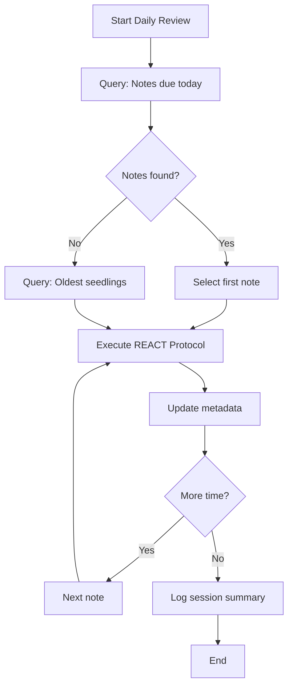

# Extraction Report: Reference Instructional Pkb Review System 2025120322

> [!info] Auto-Generated Report
> This report was automatically generated by `pkb_extractor.py` on 2026-03-13 04:18.
> **Source**: `reference-instructional-pkb-review-system-2025120322.md` | **Items Extracted**: 526

---

## 📋 Document Overview

| Field | Value |
|-------|-------|
| **Source File** | `reference-instructional-pkb-review-system-2025120322.md` |
| **Extraction Date** | 2026-03-13 04:18 |
| **Word Count** | 11,528 |
| **Character Count** | 88,941 |
| **Line Count** | 3,119 |
| **Total Items Extracted** | 526 |

### Document Outline

- # PKB Review System: Complete Implementation Package
    - ### Related Notes
    - ### Sources & References
    - ### Backlinks & Connections
    - ### 2025-12-03 - Initial Creation
    - ### Tags & Classification
- # 🔬 PKB Review System: Complete Implementation Package
    - ### Notes Contained in this Reference
- # Note 1: Implementation Guide
- # PKB Review System: Implementation Guide
  - ## 1. Foundational Philosophy
    - ### 1.1 The Metacognitive Scaffold Concept
    - ### 1.2 Stoic Integration Framework
  - ## 2. The Review Cycle Architecture
    - ### 2.1 Maturity Advancement Model
    - ### 2.2 Confidence Calibration Protocol
  - ## 3. The Review Session Protocol
    - ### 3.1 Session Types
    - ### 3.2 The REACT Review Protocol
    - ### 3.3 Stoic Reflection Questions
  - ## 4. Implementation Workflow
    - ### 4.1 Daily Quick Review (~15 minutes)
    - ### 4.2 Weekly Deep Review (~60 minutes)
    - ### 4.3 Monthly Synthesis Review (~2 hours)
  - ## 5. Installation Instructions
    - ### 5.1 Required Components
    - ### 5.2 Setup Sequence
    - ### 5.3 Configuration Checklist
  - ## 6. Best Practices
    - ### 6.1 Cognitive Load Management
    - ### 6.2 Common Pitfalls
    - ### 6.3 Adaptation Guidance
  - ## 7. Philosophical Grounding
    - ### 7.1 From Information to Wisdom
    - ### 7.2 The Examined Knowledge Life
- # Note 2: Templater Templates Library
- # Templater Templates Library: PKB Review System
  - ## Template 1: Review Session Launcher
- # 📋 Review Session: <% dateNow %> (<% selectedSession.charAt(0).toUpperCase() + selectedSession.slice(1) %>)
  - ## 📥 Notes Due for Review
  - ## 🔄 REACT Protocol Checklist
    - ### Note 1: `= [[]]`
    - ### Note 2: `= [[]]`
    - ### Note 3: `= [[]]`
  - ## 🏛️ Stoic Reflection
  - ## 📊 Session Summary
    - ### Key Insights
    - ### Action Items
    - ### Notes for Next Session
  - ## 🔗 Session Links
  - ## Template 2: Single Note Review Prompt
  - ## 🧠 Phase 1: RECALL
  - ## 🔍 Phase 2: EVALUATE
  - ## ✨ Phase 3: AUGMENT
  - ## 🔗 Phase 4: CONNECT
  - ## 📈 Phase 5: TRACK
  - ## 🏛️ Stoic Reflection (Optional)
  - ## Template 3: Weekly Review Summary
- # 📊 Weekly Review Summary: <% weekNumber %>
  - ## 📈 Review Activity Metrics
    - ### Sessions Completed This Week
    - ### Notes Reviewed This Week
  - ## 🌱 Maturity Distribution
    - ### Current State
  - ## 🎯 Advancement Activity
    - ### Notes Advanced This Week
    - ### Notes Requiring Attention
  - ## 🔗 Connection Health
    - ### Orphan Notes (No Inlinks)
  - ## 🏛️ Weekly Reflection
  - ## 📋 Next Week Planning
    - ### Review Queue
    - ### Focus Areas
  - ## Template 4: Maturity Advancement Checklist
- # 📊 Maturity Advancement Assessment: <% transition.title %>
  - ## 🔴 → 🌱 needs-review to seedling
    - ### Required Criteria
    - ### Quick Assessment
    - ### Decision
  - ## 🌱 → 🌿 seedling to developing
    - ### Required Criteria
    - ### Quality Assessment
    - ### Decision
  - ## 🌿 → 🌲 developing to budding
    - ### Required Criteria
    - ### Teaching Test
    - ### Limitations Acknowledgment
    - ### Decision
  - ## 🌲 → 🌳 budding to evergreen
    - ### Required Criteria
    - ### Wisdom Test
    - ### Decision
  - ## 📝 Advancement Record
  - ## Template 5: Review Log Entry
- # 🔗 Related Topics for PKB Expansion
- # Note 3: Dataview Queries Library
- # Dataview Queries Library: PKB Review System
  - ## 1. Discovery Queries
    - ### 1.1 Notes Due for Review Today
    - ### 1.2 Notes Due This Week
    - ### 1.3 Needs-Review Queue (Unprocessed Notes)
    - ### 1.4 Domain-Specific Review Queue
    - ### 1.5 Low-Confidence Notes Needing Validation
  - ## 2. Tracking Queries
    - ### 2.1 Review Activity Log (Last 7 Days)
    - ### 2.2 Review Count Leaders
    - ### 2.3 Recently Advanced Notes
    - ### 2.4 Review Streak Tracker
  - ## 3. Analysis Queries
    - ### 3.1 Maturity Distribution Dashboard
    - ### 3.2 Confidence Distribution
    - ### 3.3 Domain Coverage Analysis
    - ### 3.4 Review Interval Effectiveness
  - ## 4. Health Queries
    - ### 4.1 Orphan Notes (No Incoming Links)
    - ### 4.2 Stale Notes (Not Modified in 90+ Days)
    - ### 4.3 Evergreen Notes Needing Quarterly Review
    - ### 4.4 Missing Metadata Detection
    - ### 4.5 Connection Density Check
  - ## 5. Dashboard Aggregation Query
- # Note 4: Meta Bind Button Library
- # Meta Bind Button Library: PKB Review System
  - ## 1. Maturity Control Buttons
    - ### 1.1 Maturity Advancement Button Set
    - ### 1.2 Quick Advance Button
  - ## 2. Confidence Control Buttons
    - ### 2.1 Confidence Level Button Set
  - ## 3. Review Scheduling Buttons
    - ### 3.1 Set Next Review Date
    - ### 3.2 Simplified Date Buttons (No JS)
  - ## 4. Review Count Tracking
    - ### 4.1 Increment Review Count
    - ### 4.2 Review Count Display
  - ## 5. Status Toggle Buttons
    - ### 5.1 Archive Note Button
    - ### 5.2 Flag for Deep Review
  - ## 6. Composite Review Panels
    - ### 6.1 Complete Review Control Panel
    - ### 6.2 Minimal Review Bar
  - ## 7. Input Fields for Manual Entry
    - ### 7.1 Maturity Selector Dropdown
    - ### 7.2 Confidence Selector Dropdown
    - ### 7.3 Free-Form Review Notes
  - ## 8. Template Integration Example
  - ## 📊 Review System
- # 🔗 Related Topics for PKB Expansion
- # Note 5: QuickAdd Macro Library
- # QuickAdd Macro Library: PKB Review System
  - ## 1. Start Review Session Macro
    - ### Macro Configuration
    - ### Step-by-Step Setup
  - ## 2. Quick Note Review Macro
    - ### Macro Configuration
    - ### Step-by-Step Setup
  - ## 3. Batch Review Launcher Macro
    - ### Macro Configuration
    - ### User Script
  - ## 4. Complete Review & Advance Macro
    - ### Macro Configuration
    - ### Macro Steps
    - ### User Script
    - ### Capture Step Configuration
  - ## 5. Weekly Review Generator Macro
    - ### Macro Configuration
    - ### Macro Steps
    - ### Template Action Configuration
  - ## 6. Emergency Note Flag Macro
    - ### Macro Configuration
    - ### User Script
  - ## 7. Clear Review Queue Macro
    - ### Macro Configuration
    - ### User Script
  - ## 8. Installation Checklist

---

## 📊 Extraction Summary

| Item Type | Count |
|-----------|-------|
| Callouts | 82 |
| Code Blocks | 83 |
| Color Spans | 0 |
| Definitions | 11 |
| Embeds | 0 |
| External Links | 0 |
| Footnotes | 0 |
| Headings | 173 |
| Inline Fields | 11 |
| Mermaid Diagrams | 1 |
| Tables | 2 |
| Tags | 0 |
| Wiki Links | 90 |
| **TOTAL** | **526** |

---

## 🔔 Callouts (82)

> [!note] What are Callouts?
> Callouts are `> [!TYPE]` blocks used in Obsidian for structured annotation.
> They carry semantic meaning — definitions, insights, warnings, etc.

### By Type

| Callout Type | Count |
|-------------|-------|
| `[!]` | 2 |
| `[!abstract]` | 9 |
| `[!definition]` | 1 |
| `[!helpful-tip]` | 3 |
| `[!important]` | 3 |
| `[!methodology-and-sources]` | 6 |
| `[!overview]` | 3 |
| `[!principle-point]` | 2 |
| `[!thought-experiment]` | 5 |
| `[!topic-idea]` | 1 |
| `[!warning]` | 4 |
| `[!what-this-does]` | 43 |

### Full Callout List

#### 1. [OVERVIEW] Untitled *(Line 38)*

> [!overview] Untitled
> - **Title**:: [[PKB Review System: Complete Implementation Package]]
> - **Prompt/Topic Used**:: 
> - **Status**:: 🌱 `= this.maturity` | Confidence: `= this.confidence`

#### 2. [] # :FasClipboardList:In-Note Metadata Panel *(Line 43)*

> [!] # :FasClipboardList:In-Note Metadata Panel
> - **Note-Type**: `= this.type`
> - **Development Status**: `= this.maturity`
> - **Epistemic Confidence**: `= this.confidence`
> - **Next Review**: `= this.next-review`
> - **Review Count**: `= this.review-count`
> - **Created**: `= this.created`
> - **Last Modified**: `= this.modified`
> 
> > [!purpose] ### 📝Content Metrics
> > [**Word Count**:: `= this.file.size`]| [**Est. Read Time**:: `= round(this.file.size / 1300) + " min"`]
> > [**Depth Class**:: `= choice(this.file.size < 500, "🌱Stub", choice(this.file.size < 2000, "📄Note", "📜Essay"))`]
> ----
> > [!purpose] ### 🕰️Temporal Context
> > [**Created**:: `= this.file.ctime`] | [**Age**:: `= (date(today) - this.file.ctime).days + " days"`]
> > [**Last Touch**:: `= this.file.mtime`] | [**Staleness**:: `= choice((date(today) - this.file.mtime).days > 180, "🕸️Cobwebs", choice((date(today) - this.file.mtime).days > 30, "🍂Cold", "🔥Fresh"))`]
> > [**Touch Frequency**:: `= choice((date(today) - this.file.mtime).days < 7, "🔥Active", choice((date(today) - this.file.mtime).days < 30, "👌Regular", "❄️Dormant"))`]
> ----
> > [!topic-idea] ### 🔗Network Connectivity
> > [**In-Links**:: `= length(this.file.inlinks)`] | [**Out-Links**:: `= length(this.file.outlinks)`]
> > [**Network Status**:: `= choice(length(this.file.inlinks) = 0, "🕸️Orphan", choice(length(this.file.inlinks) > 5, "⚡ Hub", "🌱Node"))`]
> ```dataviewjs
> // SYSTEM: Semantic Bridge Engine
> // PURPOSE: Find "Sibling" notes that share the same Outlinks (Contexts)
> const current = dv.current();
> const myOutlinks = current.file.outlinks.map(l => l.path);
> 
> // 1. Filter the Vault
> const siblings = dv.pages()
>     .where(p => p.file.path !== current.file.path) // Exclude self
>     .where(p => !current.file.outlinks.map(l => l.path).includes(p.file.path)) // Exclude existing direct links
>     .map(p => {
>         // Find overlap between this page's links and the current page's links
>         const shared = p.file.outlinks.filter(l => myOutlinks.includes(l.path));
>         return { 
>             link: p.file.link, 
>             sharedCount: shared.length, 
>             sharedLinks: shared 
>         };
>     })
>     .where(p => p.sharedCount > 0) // Must share at least 1 connection
>     .sort(p => p.sharedCount, "desc") // Sort by strongest connection
>     .limit(5); // Only show top 5
> 
> // 2. Render the Bridge
> if (siblings.length > 0) {
>     dv.header(3, "Semantic Bridges (Missing Connections)");
>     dv.table(
>         ["Sibling Note", "Strength", "Shared Context"], 
>         siblings.map(s => [
>             s.link, 
>             "🔗" + s.sharedCount, 
>             s.sharedLinks.slice(0, 3).join(", ") + (s.sharedCount > 3 ? "…" : "")
>         ])
>     );
> } else {
>     dv.paragraph("*No semantic siblings found. This note is unique in its connections.*");
> }
> ```

#### 3. [] ### Claude Thinking *(Line 145)*

> [!] ### Claude Thinking
> This is a comprehensive request for a complete note review system for a Personal Knowledge Base (PKB). The user wants a system that:
> 1. Functions as an external scaffold for metacognition
> 2. Filters information through Stoic principles and cognitive science protocols
> 3. Regulates epistemic beliefs
> 4. Facilitates transition from passive consumption to professional-grade knowledge application
> They've provided 4 templates in the project files that contain:
> - Complete tag taxonomy
> - Knowledge maturity scale (needs-review, seedling, developing, budding, evergreen)
> - Epistemic confidence ratings (speculative, provisional, moderate, established, high)
> - All metadata currently used
> The output requirements are:
> 1. Implementation Guide (complete note)
> 2. Templater Templates (complete note)
> 3. Dataview Queries Library (complete note)
> 4. Meta Bind Button Library (complete note)
> 5. QuickAdd Macro (complete note)
> Let me first analyze the templates to understand their system:
> **From the templates, I can extract:**
> **Maturity Levels:**
> - needs-review
> - seedling
> - developing
> - budding
> - evergreen
> **Confidence Levels:**
> - speculative
> - provisional
> - moderate
> - established
> - high
> **Metadata Structure:**
> ```yaml
> aliases:
> tags:
> source:
> id:
> created:
> modified:
> week:
> month:
> quarter:
> year:
> type:
> maturity:
> confidence:
> next-review:
> review-count:
> link-up:
> link-related:
> ```
> **MOCs (link-up options):**
> - artificial-intelligence-moc
> - cognitive-science-moc
> - cosmology-moc
> - educational-psychology-moc
> - learning-theory-moc
> - neuroscience-moc
> - pkb-&-pkm-moc
> - practical-philosophy-moc
> - prompt-engineering-moc
> **Tag Groups:**
> - Group A1: Type tags
> - Group A2: Status tags
> - Group A3: Context & Source tags
> - Group A4: Mode, Nature, Model, Complexity, Validation, Maturity
> - Group B1: Top-Level Domains
> - Group B2: Systems & Methodologies
> - Group C1: PKM/PKB/Obsidian Parent Paths
> - Group C2: Cognitive Science Parent Paths
> - Group C3: Prompt Engineering Parent Paths
> - Groups D-J: Granular concepts
> Now I need to design a comprehensive review system that:
> 1. **Implementation Guide** - The master document explaining the philosophy, workflow, and integration
> 2. **Templater Templates** - Templates for review sessions, review logs, and review prompts
> 3. **Dataview Queries Library** - Queries for finding notes due for review, tracking progress, dashboard views
> 4. **Meta Bind Button Library** - Interactive buttons for maturity advancement, confidence updates, quick actions
> 5. **QuickAdd Macro** - Automated workflows for starting reviews, processing notes, logging outcomes
> Let me design each component with Stoic principles and cognitive science protocols in mind:
> **Stoic Principles for Knowledge Review:**
> 6. **Dichotomy of Control** - Focus on what we can improve (our understanding) vs. what we cannot (external facts)
> 7. **Premeditatio Malorum** - Anticipate where knowledge might fail us
> 8. **View from Above** - See how individual notes connect to broader knowledge
> 9. **Memento Mori** - Prioritize truly important knowledge
> 10. **Amor Fati** - Embrace gaps in knowledge as opportunities
> **Cognitive Science Protocols:**
> 11. **Spaced Repetition** - Review intervals based on maturity
> 12. **Active Recall** - Generate questions, not just re-read
> 13. **Elaborative Interrogation** - Ask "why" and "how"
> 14. **Interleaving** - Mix different topics in review sessions
> 15. **Metacognitive Monitoring** - Check comprehension accuracy
> 16. **Desirable Difficulties** - Embrace struggle as learning signal
> 17. **Testing Effect** - Self-test to strengthen memory
> 18. **Generation Effect** - Create connections, don't just recognize
> Let me now structure each output:
> ---
> **1. IMPLEMENTATION GUIDE** (~3000-4000 words)
> - Philosophy & Framework
> - The Review Cycle Explained
> - Maturity Advancement Criteria
> - Confidence Assessment Protocol
> - Stoic Reflection Framework
> - Cognitive Science Integration
> - Workflow Overview
> - Installation Instructions
> - Best Practices
> **2. TEMPLATER TEMPLATES** (~2000-3000 words)
> - Review Session Template (for starting a review session)
> - Single Note Review Template (review prompts for individual notes)
> - Review Log Entry Template (recording outcomes)
> - Weekly Review Summary Template
> - Monthly Synthesis Template
> **3. DATAVIEW QUERIES LIBRARY** (~2500-3500 words)
> - Notes Due for Review
> - Notes by Maturity Level
> - Orphan Notes Detection
> - Stale Notes (not touched in X days)
> - Low Confidence Notes
> - Review Progress Dashboard
> - Knowledge Gap Analysis
> - Cross-Domain Connection Opportunities
> - Review History Tracking
> **4. META BIND BUTTON LIBRARY** (~2000-3000 words)
> - Maturity Advancement Buttons
> - Confidence Update Buttons
> - Quick Review Actions
> - Status Toggle Buttons
> - Review Scheduling Buttons
> - One-Click Workflows
> **5. QUICKADD MACRO** (~2000-2500 words)
> - Start Review Session Macro
> - Process Single Note Macro
> - Complete Review Macro
> - Quick Capture During Review
> - Emergency Note Flagging
> Let me now write each of these as complete, production-ready notes.
> Given the scope, I should read the skill files first to ensure I'm creating optimal outputs. But actually, this is pure content generation, not file creation - these are notes to be pasted into Obsidian. So I'll focus on producing the actual content.
> Actually, looking at the request more carefully - they want me to generate these as complete notes they can paste into their vault. This is content generation, not file creation in the computer environment. I'll produce comprehensive markdown content for each.
> Let me structure my response with all 5 complete notes, properly formatted for Obsidian with their metadata system.

#### 4. [ABSTRACT] System Overview *(Line 343)*

> [!abstract] System Overview
> This guide establishes a **Metacognitive Review Protocol** for your Personal Knowledge Base. The system transforms passive note storage into an active [[External Cognition]] scaffold that regulates [[Epistemic Beliefs]], advances knowledge [[Maturity]], and bridges the gap between information consumption and professional application.
> 
> **Core Philosophy**: Your PKB is not a cemetery for ideas—it is a living ecosystem requiring deliberate cultivation through structured review.

#### 5. [PRINCIPLE-POINT] The Review Imperative *(Line 356)*

> [!principle-point] The Review Imperative
> **Knowledge unused degrades. Knowledge reviewed compounds.**
> 
> Each review cycle doesn't merely refresh memory—it strengthens [[Retrieval Pathways]], surfaces new connections, and advances notes from raw information toward actionable wisdom.

#### 6. [THOUGHT-EXPERIMENT] The Stoic Review Stance *(Line 379)*

> [!thought-experiment] The Stoic Review Stance
> Imagine you're advising a future version of yourself who has forgotten this knowledge. What would that future self *need* to understand? What context would be missing? This perspective transforms review from maintenance into mentorship.

#### 7. [DEFINITION] Maturity Level Definitions & Criteria *(Line 396)*

> [!definition] Maturity Level Definitions & Criteria
> **🔴 needs-review** — Note exists but hasn't been processed
> - *Criteria*: Raw capture, unverified content, no connections established
> - *Review Interval*: Immediate (within 48 hours)
> - *Advancement Requires*: One complete review pass, basic connections added
> 
> **🌱 seedling** — Initial processing complete
> - *Criteria*: Content verified, 2-3 connections made, structure established
> - *Review Interval*: 7 days
> - *Advancement Requires*: Successful recall test, 2+ new connections, practical application identified
> 
> **🌿 developing** — Active integration in progress
> - *Criteria*: Applied in at least one context, connections to 5+ notes, confidence stabilizing
> - *Review Interval*: 14 days
> - *Advancement Requires*: Demonstrated application, connection to MOC, no significant gaps
> 
> **🌲 budding** — Approaching mature understanding
> - *Criteria*: Multiple applications, teaching-ready explanation, high confidence
> - *Review Interval*: 30 days
> - *Advancement Requires*: Can explain without referencing note, identifies limitations
> 
> **🌳 evergreen** — Stable, integrated knowledge
> - *Criteria*: Deeply integrated, minimal decay between reviews, automatic recall
> - *Review Interval*: 90 days
> - *Advancement*: Maintain status through quarterly validation

#### 8. [METHODOLOGY-AND-SOURCES] Confidence Assessment Rubric *(Line 427)*

> [!methodology-and-sources] Confidence Assessment Rubric
> | Level | Definition | Evidence Required | Risk Profile |
> |-------|-----------|-------------------|--------------|
> | **speculative** | Hypothesis or intuition | Personal reasoning only | High error probability |
> | **provisional** | Reasonable but unverified | Single source or limited evidence | Moderate error probability |
> | **moderate** | Corroborated understanding | Multiple sources, some verification | Low error probability |
> | **established** | Well-supported knowledge | Strong evidence, expert consensus | Very low error probability |
> | **high** | Foundational certainty | Extensive verification, personal testing | Near-zero error probability |

#### 9. [METHODOLOGY-AND-SOURCES] REACT Review Steps *(Line 460)*

> [!methodology-and-sources] REACT Review Steps
> **R**ecall — Before reading, attempt to recall the note's core content
> - Write a 1-2 sentence summary from memory
> - Note confidence in your recall (helps calibrate [[Metamemory]])
> 
> **E**valuate — Read the note and assess
> - Is the content still accurate?
> - Is the structure clear?
> - Are connections appropriate?
> 
> **A**ugment — Improve the note
> - Add new connections discovered
> - Update outdated information
> - Enhance clarity based on new understanding
> 
> **C**onnect — Strengthen the graph
> - Add links to recently created notes
> - Identify MOC placement
> - Surface semantic siblings
> 
> **T**rack — Update metadata
> - Adjust maturity level (if criteria met)
> - Recalibrate confidence
> - Set next review date
> - Increment review-count

#### 10. [THOUGHT-EXPERIMENT] Stoic Review Prompts *(Line 491)*

> [!thought-experiment] Stoic Review Prompts
> 1. **Dichotomy of Control**: "What aspects of this knowledge are within my power to develop further?"
> 
> 2. **Premeditatio Malorum**: "If I relied on this knowledge in a high-stakes situation, what could go wrong?"
> 
> 3. **View from Above**: "How does this note serve my broader intellectual project? Is it truly necessary?"
> 
> 4. **Memento Mori**: "If I could only retain 20% of my PKB, would this note make the cut?"
> 
> 5. **Amor Fati**: "What limitation or gap in this note can I embrace as a learning opportunity?"

#### 11. [IMPORTANT] Installation Order *(Line 558)*

> [!important] Installation Order
> 1. **Verify Prerequisites**
>    - Templater plugin installed and configured
>    - Dataview plugin installed (enable JS queries)
>    - Meta Bind plugin installed
>    - QuickAdd plugin installed
> 
> 2. **Create Folder Structure**
>    ```
>    Your Vault/
>    ├── Templates/
>    │   └── Review/
>    │       ├── _review-session-template.md
>    │       ├── _review-log-template.md
>    │       └── _review-prompts.md
>    ├── Dashboards/
>    │   └── review-dashboard.md
>    └── Logs/
>        └── Review-Logs/
>    ```
> 
> 3. **Install Templates** → Copy from Templater Templates Library note
> 
> 4. **Configure Dataview Queries** → Copy from Queries Library note
> 
> 5. **Set Up Meta Bind Buttons** → Copy from Button Library note
> 
> 6. **Configure QuickAdd Macros** → Follow Macro Library instructions

#### 12. [HELPFUL-TIP] Preventing Review Fatigue *(Line 603)*

> [!helpful-tip] Preventing Review Fatigue
> - **Batch by Type**: Group similar notes (all prompt engineering, all cognitive science) to reduce [[Context Switching]]
> - **Time-Box Strictly**: 15 minutes for quick review means 15 minutes—respect the boundary
> - **Interleave Difficulty**: Alternate between challenging and easier notes
> - **Honor Energy Levels**: Deep reviews when fresh; quick reviews acceptable when tired

#### 13. [WARNING] Avoid These Traps *(Line 612)*

> [!warning] Avoid These Traps
> 1. **Perfectionism Paralysis**: Don't delay maturity advancement waiting for "perfect" understanding
> 2. **Connection Hoarding**: Not every note needs 20 links—quality over quantity
> 3. **Review Debt Accumulation**: Skipping reviews compounds—address backlogs quickly
> 4. **Confidence Inflation**: Be honest about uncertainty; "speculative" isn't shameful
> 5. **Over-Engineering**: The system serves your thinking, not vice versa

#### 14. [METHODOLOGY-AND-SOURCES] System Evolution *(Line 622)*

> [!methodology-and-sources] System Evolution
> After one month of use, evaluate:
> - Are review intervals appropriate for your retention?
> - Which session types provide most value?
> - What friction points slow you down?
> 
> Adjust intervals, templates, and workflows based on *your* observed patterns. This system is a starting framework—customize it.

#### 15. [PRINCIPLE-POINT] The Wisdom Test *(Line 644)*

> [!principle-point] The Wisdom Test
> You have achieved wisdom when you can:
> 1. Recall the knowledge without consulting the note
> 2. Apply it correctly in novel situations
> 3. Teach it clearly to others
> 4. Recognize its limitations and failure modes

#### 16. [ABSTRACT] Template Collection Overview *(Line 703)*

> [!abstract] Template Collection Overview
> This library contains five production-ready [[Templater]] templates for the PKB Review System. Each template is designed to scaffold [[Metacognitive Monitoring]], enforce [[REACT Protocol]] discipline, and integrate with your existing metadata architecture.
> 
> **Installation**: Copy each template to your `/Templates/Review/` folder.

#### 17. [WHAT-THIS-DOES] Purpose *(Line 712)*

> [!what-this-does] Purpose
> Initiates a structured review session, queries notes due for review, and creates a session log entry. Use this to start any Quick, Deep, or Synthesis review.

#### 18. [OVERVIEW] Untitled *(Line 793)*

> [!overview] Untitled
> - **Session Type**: <% selectedSession %>
> - **Planned Duration**: <% duration %> minutes
> - **Focus Area**: <% focusArea %>
> - **Start Time**: <% timeStart %>
> - **Intention**: <% intention %>

#### 19. [THOUGHT-EXPERIMENT] Apply to 2-3 notes reviewed *(Line 868)*

> [!thought-experiment] Apply to 2-3 notes reviewed
> **Dichotomy of Control**: What aspects of this knowledge can I develop further?
> 
> **Response**: 
> 
> ---
> 
> **Premeditatio Malorum**: Where might this knowledge fail me?
> 
> **Response**: 
> 
> ---
> 
> **View from Above**: How does this serve my broader intellectual project?
> 
> **Response**:

#### 20. [WHAT-THIS-DOES] Purpose *(Line 930)*

> [!what-this-does] Purpose
> Provides structured review prompts that can be embedded in any note or triggered via QuickAdd. Guides you through the [[REACT Protocol]] for a single note.

#### 21. [ABSTRACT] Review Session: <% dateNow %> *(Line 951)*

> [!abstract] Review Session: <% dateNow %>
> **Current Maturity**: <% currentMaturity %>
> **Current Confidence**: <% currentConfidence %>
> **Review Count**: <% reviewCount %>

#### 22. [IMPORTANT] Before reading the note content, answer: *(Line 958)*

> [!important] Before reading the note content, answer:
> **What do I remember about this topic?**
> 
> _Write your recall attempt here:_
> 
> 
> 
> **Recall Confidence** (1-10): ___

#### 23. [METHODOLOGY-AND-SOURCES] Assessment Questions *(Line 974)*

> [!methodology-and-sources] Assessment Questions
> **Accuracy Check**:
> - [ ] All claims still valid
> - [ ] Sources still reliable
> - [ ] No outdated information
> 
> **Structure Check**:
> - [ ] Clear organization
> - [ ] Appropriate depth
> - [ ] Good use of callouts/formatting
> 
> **Completeness Check**:
> - [ ] Key concepts covered
> - [ ] Examples sufficient
> - [ ] No critical gaps
> 
> **Issues Identified**:

#### 24. [HELPFUL-TIP] Improvements to Make *(Line 998)*

> [!helpful-tip] Improvements to Make
> **Content Updates**:
> 
> 
> **Clarity Enhancements**:
> 
> 
> **New Examples/Applications**:

#### 25. [TOPIC-IDEA] Connection Opportunities *(Line 1013)*

> [!topic-idea] Connection Opportunities
> **Existing Links to Verify**:
> ```dataview
> LIST
> FROM outgoing([[<% currentFile %>]])
> LIMIT 10
> ```
> 
> **Potential New Links**:
> - [[]] — Reason: 
> - [[]] — Reason: 
> - [[]] — Reason: 
> 
> **MOC Placement**:
> - [ ] Verify link-up MOC is correct
> - [ ] Consider additional MOC connections

#### 26. [IMPORTANT] Metadata Decisions *(Line 1035)*

> [!important] Metadata Decisions
> **Maturity Assessment**:
> 
> | Current | Decision | New Level |
> |---------|----------|-----------|
> | <% currentMaturity %> | ⏸️ Maintain / ⬆️ Advance / ⬇️ Regress | ___ |
> 
> *Justification*: 
> 
> ---
> 
> **Confidence Assessment**:
> 
> | Current | Decision | New Level |
> |---------|----------|-----------|
> | <% currentConfidence %> | ⏸️ Maintain / ⬆️ Increase / ⬇️ Decrease | ___ |
> 
> *Justification*: 
> 
> ---
> 
> **Next Review Date**: 
> - Seedling: +7 days = <% tp.date.now("YYYY-MM-DD", 7) %>
> - Developing: +14 days = <% tp.date.now("YYYY-MM-DD", 14) %>
> - Budding: +30 days = <% tp.date.now("YYYY-MM-DD", 30) %>
> - Evergreen: +90 days = <% tp.date.now("YYYY-MM-DD", 90) %>

#### 27. [THOUGHT-EXPERIMENT] Deep Consideration *(Line 1067)*

> [!thought-experiment] Deep Consideration
> **If I had to stake my professional reputation on this knowledge, would I?**
> 
> 
> **What's the most likely way this understanding could be wrong?**
> 
> 
> **How does this knowledge serve my larger goals?**

#### 28. [WHAT-THIS-DOES] Purpose *(Line 1085)*

> [!what-this-does] Purpose
> Creates a weekly summary of review activity, tracks metrics, and surfaces patterns in your knowledge development.

#### 29. [OVERVIEW] Untitled *(Line 1121)*

> [!overview] Untitled
> **Period**: <% weekStart %> to <% weekEnd %>
> **Generated**: <% dateNow %>

#### 30. [THOUGHT-EXPERIMENT] Stoic Weekly Review *(Line 1248)*

> [!thought-experiment] Stoic Weekly Review
> **What knowledge proved most valuable this week?**
> 
> 
> **What gaps in understanding became apparent?**
> 
> 
> **What should I prioritize reviewing next week?**

#### 31. [WHAT-THIS-DOES] Purpose *(Line 1289)*

> [!what-this-does] Purpose
> Provides explicit checklists for determining whether a note qualifies for maturity advancement. Use during any review session.

#### 32. [ABSTRACT] Advancement Criteria *(Line 1330)*

> [!abstract] Advancement Criteria
> Complete all checklist items to qualify for advancement from **<% currentMaturity %>** to **<% transition.next %>**.

#### 33. [WHAT-THIS-DOES] Purpose *(Line 1475)*

> [!what-this-does] Purpose
> Creates a compact log entry for tracking individual note reviews. Used by QuickAdd macro to maintain review history.

#### 34. [ABSTRACT] Query Collection Overview *(Line 1576)*

> [!abstract] Query Collection Overview
> This library contains production-ready [[Dataview]] queries for the PKB Review System. Queries are organized by purpose: discovery (finding notes to review), tracking (monitoring progress), analysis (understanding patterns), and health (detecting problems).
> 
> **Usage**: Copy queries into your dashboard notes or embed inline where needed.

#### 35. [WHAT-THIS-DOES] Purpose *(Line 1587)*

> [!what-this-does] Purpose
> The primary workhorse query—finds all notes whose `next-review` date has passed.

#### 36. [WHAT-THIS-DOES] Purpose *(Line 1605)*

> [!what-this-does] Purpose
> Planning query for weekly review sessions—shows upcoming review load.

#### 37. [WHAT-THIS-DOES] Purpose *(Line 1622)*

> [!what-this-does] Purpose
> Finds notes at the lowest maturity level requiring initial processing.

#### 38. [WHAT-THIS-DOES] Purpose *(Line 1638)*

> [!what-this-does] Purpose
> Filters due notes by a specific MOC domain. Replace the MOC name as needed.

#### 39. [WHAT-THIS-DOES] Purpose *(Line 1654)*

> [!what-this-does] Purpose
> Surfaces notes with weak epistemic grounding requiring evidence strengthening.

#### 40. [WHAT-THIS-DOES] Purpose *(Line 1674)*

> [!what-this-does] Purpose
> Shows notes modified in the past week with review activity.

#### 41. [WHAT-THIS-DOES] Purpose *(Line 1691)*

> [!what-this-does] Purpose
> Identifies most-reviewed notes—candidates for evergreen status or obsessive over-reviewing.

#### 42. [WHAT-THIS-DOES] Purpose *(Line 1708)*

> [!what-this-does] Purpose
> Celebrates progress—shows notes that moved up in maturity recently.

#### 43. [WHAT-THIS-DOES] Purpose *(Line 1732)*

> [!what-this-does] Purpose
> Checks for consistent review activity across recent days.

#### 44. [WHAT-THIS-DOES] Purpose *(Line 1758)*

> [!what-this-does] Purpose
> Provides a snapshot of your entire PKB's knowledge maturity state.

#### 45. [WHAT-THIS-DOES] Purpose *(Line 1800)*

> [!what-this-does] Purpose
> Shows epistemic health of your knowledge base.

#### 46. [WHAT-THIS-DOES] Purpose *(Line 1838)*

> [!what-this-does] Purpose
> Shows how knowledge is distributed across your MOC domains.

#### 47. [WHAT-THIS-DOES] Purpose *(Line 1871)*

> [!what-this-does] Purpose
> Analyzes average time between reviews by maturity level to optimize intervals.

#### 48. [WHAT-THIS-DOES] Purpose *(Line 1913)*

> [!what-this-does] Purpose
> Finds isolated notes that need connection to the knowledge graph.

#### 49. [WHAT-THIS-DOES] Purpose *(Line 1938)*

> [!what-this-does] Purpose
> Finds notes that may be forgotten or need archival consideration.

#### 50. [WHAT-THIS-DOES] Purpose *(Line 1955)*

> [!what-this-does] Purpose
> Even stable knowledge needs periodic validation.

#### 51. [WHAT-THIS-DOES] Purpose *(Line 1971)*

> [!what-this-does] Purpose
> Finds notes with incomplete frontmatter that need attention.

#### 52. [WHAT-THIS-DOES] Purpose *(Line 2006)*

> [!what-this-does] Purpose
> Identifies notes with too few or too many links for their maturity level.

#### 53. [WHAT-THIS-DOES] Purpose *(Line 2050)*

> [!what-this-does] Purpose
> A comprehensive dashboard summary combining key metrics. Use as the header of your main review dashboard.

#### 54. [ABSTRACT] Button Collection Overview *(Line 2153)*

> [!abstract] Button Collection Overview
> This library contains production-ready [[Meta Bind]] buttons for the PKB Review System. Buttons enable one-click metadata updates, eliminating friction from review workflows.
> 
> **Installation**: Copy button code blocks into your notes or templates. Buttons work in Reading Mode.

#### 55. [WHAT-THIS-DOES] Purpose *(Line 2164)*

> [!what-this-does] Purpose
> A complete button row for advancing or regressing note maturity. Displays current level and provides one-click transitions.

#### 56. [WHAT-THIS-DOES] Purpose *(Line 2221)*

> [!what-this-does] Purpose
> Single button that advances to the next maturity level in sequence. Use when you're confident the note meets advancement criteria.

#### 57. [WARNING] Script Note *(Line 2266)*

> [!warning] Script Note
> Meta Bind's JavaScript actions require specific setup. If JS actions aren't working, use the individual button set above instead.

#### 58. [WHAT-THIS-DOES] Purpose *(Line 2275)*

> [!what-this-does] Purpose
> One-click confidence level selection matching your epistemic assessment scale.

#### 59. [WHAT-THIS-DOES] Purpose *(Line 2334)*

> [!what-this-does] Purpose
> Quick buttons for setting next-review date based on standard intervals.

#### 60. [HELPFUL-TIP] Alternative Approach *(Line 2387)*

> [!helpful-tip] Alternative Approach
> If JS actions don't work in your setup, use input fields with manual date entry:

#### 61. [WHAT-THIS-DOES] Purpose *(Line 2401)*

> [!what-this-does] Purpose
> One-click button to increment the review counter after completing a review pass.

#### 62. [WHAT-THIS-DOES] Purpose *(Line 2417)*

> [!what-this-does] Purpose
> View field showing current review count inline.

#### 63. [WHAT-THIS-DOES] Purpose *(Line 2435)*

> [!what-this-does] Purpose
> Marks a note as archived, removing it from active review cycles.

#### 64. [WHAT-THIS-DOES] Purpose *(Line 2453)*

> [!what-this-does] Purpose
> Adds a flag indicating the note needs extra attention in the next review session.

#### 65. [WHAT-THIS-DOES] Purpose *(Line 2482)*

> [!what-this-does] Purpose
> An all-in-one panel combining maturity, confidence, and scheduling controls. Embed this callout in your note template.

#### 66. [ABSTRACT] 📊 Review Control Panel *(Line 2486)*

> [!abstract] 📊 Review Control Panel
> **Current Status:**
> - Maturity: `VIEW[{maturity}]`
> - Confidence: `VIEW[{confidence}]`
> - Next Review: `VIEW[{next-review}]`
> - Review Count: `VIEW[{review-count}]`
> 
> ---
> 
> **Maturity Controls:**
> `BUTTON[needs-review]` `BUTTON[seedling]` `BUTTON[developing]` `BUTTON[budding]` `BUTTON[evergreen]`
> 
> **Confidence Controls:**
> `BUTTON[speculative]` `BUTTON[provisional]` `BUTTON[moderate]` `BUTTON[established]` `BUTTON[high]`
> 
> **Review Actions:**
> `BUTTON[+1-review]` `BUTTON[+7-days]` `BUTTON[+14-days]` `BUTTON[+30-days]`

#### 67. [WARNING] Button Reference Syntax *(Line 2506)*

> [!warning] Button Reference Syntax
> The `BUTTON[id]` syntax requires you to define buttons with IDs. Alternative: copy the full button code blocks directly into the panel.

#### 68. [WHAT-THIS-DOES] Purpose *(Line 2511)*

> [!what-this-does] Purpose
> Compact single-line review interface for notes where space is limited.

#### 69. [WHAT-THIS-DOES] Purpose *(Line 2524)*

> [!what-this-does] Purpose
> Dropdown selector for maturity level when buttons aren't preferred.

#### 70. [WHAT-THIS-DOES] Purpose *(Line 2551)*

> [!what-this-does] Purpose
> Text area for capturing review notes directly in frontmatter.

#### 71. [METHODOLOGY-AND-SOURCES] How to Use in Your Templates *(Line 2562)*

> [!methodology-and-sources] How to Use in Your Templates
> Add this section to your permanent note or report templates for built-in review controls.

#### 72. [ABSTRACT] Review Controls *(Line 2568)*

> [!abstract] Review Controls
> | Metric | Current Value | Update |
> |--------|---------------|--------|
> | **Maturity** | `VIEW[{maturity}]` | `INPUT[select(option(needs-review),option(seedling),option(developing),option(budding),option(evergreen)):maturity]` |
> | **Confidence** | `VIEW[{confidence}]` | `INPUT[select(option(speculative),option(provisional),option(moderate),option(established),option(high)):confidence]` |
> | **Next Review** | `VIEW[{next-review}]` | `INPUT[date:next-review]` |
> | **Review Count** | `VIEW[{review-count}]` | `BUTTON[+1-review]` |

#### 73. [ABSTRACT] Macro Collection Overview *(Line 2643)*

> [!abstract] Macro Collection Overview
> This library contains [[QuickAdd]] macros that automate the PKB Review System workflows. Macros reduce friction by combining multiple actions into single commands accessible from anywhere in your vault.
> 
> **Installation**: Create these macros in QuickAdd settings (Settings → QuickAdd → Manage Macros).

#### 74. [WHAT-THIS-DOES] Purpose *(Line 2652)*

> [!what-this-does] Purpose
> Launches a complete review session: creates session log from template, opens notes due for review, and sets up your review environment.

#### 75. [WHAT-THIS-DOES] Purpose *(Line 2704)*

> [!what-this-does] Purpose
> Performs a rapid review on the currently open note: prompts for decisions, updates metadata, and logs the review.

#### 76. [WHAT-THIS-DOES] Purpose *(Line 2814)*

> [!what-this-does] Purpose
> Opens multiple notes due for review in separate tabs/panes for efficient batch processing.

#### 77. [WHAT-THIS-DOES] Purpose *(Line 2870)*

> [!what-this-does] Purpose
> One-command workflow that advances a note's maturity, sets next review date, increments counter, and logs completion.

#### 78. [WHAT-THIS-DOES] Purpose *(Line 2966)*

> [!what-this-does] Purpose
> Creates a weekly review summary note from template, automatically dated and linked.

#### 79. [WHAT-THIS-DOES] Purpose *(Line 2991)*

> [!what-this-does] Purpose
> Quickly flags a note as needing urgent attention—adds to a "review emergency" list for priority processing.

#### 80. [WHAT-THIS-DOES] Purpose *(Line 3046)*

> [!what-this-does] Purpose
> Marks all currently due notes as reviewed with "maintained" status—use when you need to clear a backlog without full review.

#### 81. [WARNING] Backlog Clear Warning *(Line 3115)*

> [!warning] Backlog Clear Warning
> This macro should be used sparingly. It clears the queue without proper review, which defeats the purpose of the system. Use only when backlog has become unmanageable and you need a fresh start.

#### 82. [METHODOLOGY-AND-SOURCES] Complete Setup *(Line 3122)*

> [!methodology-and-sources] Complete Setup
> 1. **Enable QuickAdd Plugin**
>    - Settings → Community Plugins → QuickAdd
>    - Enable and configure
> 
> 2. **Create User Scripts Folder**
>    - Create folder: `Scripts/QuickAdd/`
>    - Save user scripts as `.js` files
> 
> 3. **Import Macros**
>    - Settings → QuickAdd → Manage Macros
>    - Create each macro following configurations above
> 
> 4. **Assign Hotkeys** (Recommended)
>    | Macro | Suggested Hotkey |
>    |-------|-----------------|
>    | Start Review Session | `Ctrl/Cmd + Shift + R` |
>    | Quick Note Review | `Ctrl/Cmd + R` |
>    | Complete Review & Advance | `Ctrl/Cmd + Shift + A` |
>    | Emergency Flag | `Ctrl/Cmd + !` |
> 
> 5. **Test Each Macro**
>    - Create a test note
>    - Run each macro
>    - Verify metadata updates correctly
>    - Check log files are created
> 
> 6. **Add to Command Palette**
>    - In QuickAdd settings, enable "Add to command palette" for each macro

---

## 🔗 Wiki-Links (90 total, 70 unique targets)

> [!info] Knowledge Graph Connections
> These links represent connections to other notes in your PKB.
> **70** distinct notes are referenced.

### Unique Targets

- [[${activeFile.basename}]]
- [[<% currentFile %>]]
- [[<% noteName %>]]
- [[<% weekNumber %>]]
- [[Amor Fati]]
- [[Automation]]
- [[Cognitive Science]]
- [[Cognitive-Science-MOC]]
- [[Context Switching]]
- [[Dataview]]
- [[Dichotomy of Control]]
- [[Epistemic Beliefs]]
- [[Epistemic Certainty]]
- [[Extended Cognition]]
- [[External Cognition]]
- [[Frontmatter Schema Design]]
- [[Frontmatter-Design]]
- [[Illusion of Competence]]
- [[Information-Architecture]]
- [[Interactive Note Design]]
- [[Learning-Theory-MOC]]
- [[Maturity]]
- [[Memento Mori]]
- [[Meta Bind]]
- [[Meta Bind Advanced Patterns]]
- [[Meta-Bind]]
- [[Metacognitive Monitoring]]
- [[Metamemory]]
- [[Obsidian Plugin Interoperability]]
- [[Obsidian/Advanced]]
- [[Obsidian/Plugins]]
- [[PKB Review System: Complete Implementation Package]]
- [[PKB/Design]]
- [[PKB/Maintenance]]
- [[PKB/Metadata]]
- [[PKM/Workflow]]
- [[Phronesis]]
- [[Premeditatio Malorum]]
- [[Productivity]]
- [[QuickAdd]]
- [[REACT Protocol]]
- [[ReAct Framework]]
- [[Retrieval Pathways]]
- [[Review Friction Reduction]]
- [[Socrates]]
- [[Spaced Repetition Algorithms]]
- [[Spacing Effect]]
- [[Stoic Philosophy]]
- [[Template Versioning Strategies]]
- [[Template-Automation]]
- [[Templater]]
- [[Templater User Scripts]]
- [[Testing Effect]]
- [[Version-Control]]
- [[View from Above]]
- [[artificial-intelligence-moc]]
- [[cognitive-science-moc]]
- [[cosmology-moc]]
- [[learning-theory-moc]]
- [[neuroscience-moc]]
- [[pkb-&-pkm-moc]]
- [[prompt-engineering-moc]]
- [[review-buttons-library]]
- [[review-macros-library]]
- [[review-queries-library]]
- [[review-system-implementation-guide]]
- [[review-templates-library]]
- [[wiki-links]]
- [[{{NAME}}]]
- [[{{VALUE:noteName}}]]

### All Occurrences

| # | Target | Display Text | Heading | Section | Line |
|---|--------|-------------|---------|---------|------|
| 1 | [[PKB Review System: Complete Implementation Package]] | — | — | PKB Review System: Complete Implement... | 39 |
| 2 | [[Stoic Philosophy]] | — | — | 🔬 PKB Review System: Complete Impleme... | 288 |
| 3 | [[Cognitive Science]] | — | — | 🔬 PKB Review System: Complete Impleme... | 288 |
| 4 | [[pkb-&-pkm-moc]] | — | — | Note 1: Implementation Guide | 332 |
| 5 | [[cognitive-science-moc]] | — | — | Note 1: Implementation Guide | 333 |
| 6 | [[review-queries-library]] | — | — | Note 1: Implementation Guide | 335 |
| 7 | [[review-templates-library]] | — | — | Note 1: Implementation Guide | 336 |
| 8 | [[review-buttons-library]] | — | — | Note 1: Implementation Guide | 337 |
| 9 | [[review-macros-library]] | — | — | Note 1: Implementation Guide | 338 |
| 10 | [[External Cognition]] | — | — | PKB Review System: Implementation Guide | 344 |
| 11 | [[Epistemic Beliefs]] | — | — | PKB Review System: Implementation Guide | 344 |
| 12 | [[Maturity]] | — | — | PKB Review System: Implementation Guide | 344 |
| 13 | [[Extended Cognition]] | — | — | 1.1 The Metacognitive Scaffold Concept | 354 |
| 14 | [[Illusion of Competence]] | — | — | 1.1 The Metacognitive Scaffold Concept | 354 |
| 15 | [[Retrieval Pathways]] | — | — | 1.1 The Metacognitive Scaffold Concept | 359 |
| 16 | [[Testing Effect]] | — | — | 1.1 The Metacognitive Scaffold Concept | 363 |
| 17 | [[Spacing Effect]] | — | — | 1.1 The Metacognitive Scaffold Concept | 364 |
| 18 | [[Metacognitive Monitoring]] | — | — | 1.1 The Metacognitive Scaffold Concept | 365 |
| 19 | [[Stoic Philosophy]] | — | — | 1.2 Stoic Integration Framework | 369 |
| 20 | [[Dichotomy of Control]] | — | — | 1.2 Stoic Integration Framework | 373 |
| 21 | [[Premeditatio Malorum]] | — | — | 1.2 Stoic Integration Framework | 374 |
| 22 | [[View from Above]] | — | — | 1.2 Stoic Integration Framework | 375 |
| 23 | [[Memento Mori]] | — | — | 1.2 Stoic Integration Framework | 376 |
| 24 | [[Amor Fati]] | — | — | 1.2 Stoic Integration Framework | 377 |
| 25 | [[Epistemic Certainty]] | — | — | 2.2 Confidence Calibration Protocol | 425 |
| 26 | [[ReAct Framework]] | — | — | 3.2 The REACT Review Protocol | 458 |
| 27 | [[Metamemory]] | — | — | 3.2 The REACT Review Protocol | 464 |
| 28 | [[Context Switching]] | — | — | 6.1 Cognitive Load Management | 605 |
| 29 | [[Phronesis]] | — | — | 7.1 From Information to Wisdom | 637 |
| 30 | [[Socrates]] | — | — | 7.2 The Examined Knowledge Life | 653 |
| 31 | [[pkb-&-pkm-moc]] | — | — | Note 2: Templater Templates Library | 695 |
| 32 | [[review-system-implementation-guide]] | — | — | Note 2: Templater Templates Library | 697 |
| 33 | [[review-queries-library]] | — | — | Note 2: Templater Templates Library | 698 |
| 34 | [[Templater]] | — | — | Templater Templates Library: PKB Revi... | 704 |
| 35 | [[Metacognitive Monitoring]] | — | — | Templater Templates Library: PKB Revi... | 704 |
| 36 | [[REACT Protocol]] | — | — | Templater Templates Library: PKB Revi... | 704 |
| 37 | [[cognitive-science-moc]] | — | — | Template 1: Review Session Launcher | 753 |
| 38 | [[pkb-&-pkm-moc]] | — | — | Template 1: Review Session Launcher | 754 |
| 39 | [[prompt-engineering-moc]] | — | — | Template 1: Review Session Launcher | 755 |
| 40 | [[learning-theory-moc]] | — | — | Template 1: Review Session Launcher | 756 |
| 41 | [[artificial-intelligence-moc]] | — | — | Template 1: Review Session Launcher | 757 |
| 42 | [[cosmology-moc]] | — | — | Template 1: Review Session Launcher | 758 |
| 43 | [[neuroscience-moc]] | — | — | Template 1: Review Session Launcher | 759 |
| 44 | [[REACT Protocol]] | — | — | Template 2: Single Note Review Prompt | 931 |
| 45 | [[<% currentFile %>]] | — | — | 🔗 Phase 4: CONNECT | 1018 |
| 46 | [[<% weekNumber %>]] | — | — | Template 3: Weekly Review Summary | 1111 |
| 47 | [[pkb-&-pkm-moc]] | — | — | Template 3: Weekly Review Summary | 1116 |
| 48 | [[wiki-links]] | — | — | Required Criteria | 1342 |
| 49 | [[wiki-links]] | — | — | Required Criteria | 1365 |
| 50 | [[<% noteName %>]] | — | — | Template 5: Review Log Entry | 1509 |
| 51 | [[Templater User Scripts]] | — | — | 🔗 Related Topics for PKB Expansion | 1516 |
| 52 | [[Obsidian/Advanced]] | — | — | 🔗 Related Topics for PKB Expansion | 1519 |
| 53 | [[Template-Automation]] | — | — | 🔗 Related Topics for PKB Expansion | 1519 |
| 54 | [[Spaced Repetition Algorithms]] | — | — | 🔗 Related Topics for PKB Expansion | 1521 |
| 55 | [[Cognitive-Science-MOC]] | — | — | 🔗 Related Topics for PKB Expansion | 1524 |
| 56 | [[Learning-Theory-MOC]] | — | — | 🔗 Related Topics for PKB Expansion | 1524 |
| 57 | [[Review Friction Reduction]] | — | — | 🔗 Related Topics for PKB Expansion | 1526 |
| 58 | [[PKM/Workflow]] | — | — | 🔗 Related Topics for PKB Expansion | 1529 |
| 59 | [[Productivity]] | — | — | 🔗 Related Topics for PKB Expansion | 1529 |
| 60 | [[Template Versioning Strategies]] | — | — | 🔗 Related Topics for PKB Expansion | 1531 |
| 61 | [[PKB/Maintenance]] | — | — | 🔗 Related Topics for PKB Expansion | 1534 |
| 62 | [[Version-Control]] | — | — | 🔗 Related Topics for PKB Expansion | 1534 |
| 63 | [[pkb-&-pkm-moc]] | — | — | Note 3: Dataview Queries Library | 1568 |
| 64 | [[review-system-implementation-guide]] | — | — | Note 3: Dataview Queries Library | 1570 |
| 65 | [[review-templates-library]] | — | — | Note 3: Dataview Queries Library | 1571 |
| 66 | [[Dataview]] | — | — | Dataview Queries Library: PKB Review ... | 1577 |
| 67 | [[cognitive-science-moc]] | — | — | 1.4 Domain-Specific Review Queue | 1648 |
| 68 | [[pkb-&-pkm-moc]] | — | — | Note 4: Meta Bind Button Library | 2145 |
| 69 | [[review-system-implementation-guide]] | — | — | Note 4: Meta Bind Button Library | 2147 |
| 70 | [[review-queries-library]] | — | — | Note 4: Meta Bind Button Library | 2148 |
| 71 | [[Meta Bind]] | — | — | Meta Bind Button Library: PKB Review ... | 2154 |
| 72 | [[Meta Bind Advanced Patterns]] | — | — | 🔗 Related Topics for PKB Expansion | 2583 |
| 73 | [[Obsidian/Plugins]] | — | — | 🔗 Related Topics for PKB Expansion | 2586 |
| 74 | [[Meta-Bind]] | — | — | 🔗 Related Topics for PKB Expansion | 2586 |
| 75 | [[Frontmatter Schema Design]] | — | — | 🔗 Related Topics for PKB Expansion | 2588 |
| 76 | [[PKB/Metadata]] | — | — | 🔗 Related Topics for PKB Expansion | 2591 |
| 77 | [[Frontmatter-Design]] | — | — | 🔗 Related Topics for PKB Expansion | 2591 |
| 78 | [[Interactive Note Design]] | — | — | 🔗 Related Topics for PKB Expansion | 2593 |
| 79 | [[PKB/Design]] | — | — | 🔗 Related Topics for PKB Expansion | 2596 |
| 80 | [[Information-Architecture]] | — | — | 🔗 Related Topics for PKB Expansion | 2596 |
| 81 | [[Obsidian Plugin Interoperability]] | — | — | 🔗 Related Topics for PKB Expansion | 2598 |
| 82 | [[Obsidian/Advanced]] | — | — | 🔗 Related Topics for PKB Expansion | 2601 |
| 83 | [[Automation]] | — | — | 🔗 Related Topics for PKB Expansion | 2601 |
| 84 | [[pkb-&-pkm-moc]] | — | — | Note 5: QuickAdd Macro Library | 2635 |
| 85 | [[review-system-implementation-guide]] | — | — | Note 5: QuickAdd Macro Library | 2637 |
| 86 | [[review-templates-library]] | — | — | Note 5: QuickAdd Macro Library | 2638 |
| 87 | [[QuickAdd]] | — | — | QuickAdd Macro Library: PKB Review Sy... | 2644 |
| 88 | [[{{NAME}}]] | — | — | Step-by-Step Setup | 2807 |
| 89 | [[{{VALUE:noteName}}]] | — | — | Capture Step Configuration | 2959 |
| 90 | [[${activeFile.basename}]] | — | — | User Script | 3034 |

---

## 📖 Definitions (11)

> [!tip] PKB Definitions
> These `[**Term**:: Definition]` fields define key concepts.
> They are queryable by Dataview.

### 1. Word Count

> [!definition] Word Count
> `= this.file.size`

*Source: Line 54 in `reference-instructional-pkb-review-system-2025120322.md`*

### 2. Est. Read Time

> [!definition] Est. Read Time
> `= round(this.file.size / 1300) + " min"`

*Source: Line 54 in `reference-instructional-pkb-review-system-2025120322.md`*

### 3. Depth Class

> [!definition] Depth Class
> `= choice(this.file.size < 500, "🌱Stub", choice(this.file.size < 2000, "📄Note", "📜Essay"))`

*Source: Line 55 in `reference-instructional-pkb-review-system-2025120322.md`*

### 4. Created

> [!definition] Created
> `= this.file.ctime`

*Source: Line 58 in `reference-instructional-pkb-review-system-2025120322.md`*

### 5. Age

> [!definition] Age
> `= (date(today) - this.file.ctime).days + " days"`

*Source: Line 58 in `reference-instructional-pkb-review-system-2025120322.md`*

### 6. Last Touch

> [!definition] Last Touch
> `= this.file.mtime`

*Source: Line 59 in `reference-instructional-pkb-review-system-2025120322.md`*

### 7. Staleness

> [!definition] Staleness
> `= choice((date(today) - this.file.mtime).days > 180, "🕸️Cobwebs", choice((date(today) - this.file.mtime).days > 30, "🍂Cold", "🔥Fresh"))`

*Source: Line 59 in `reference-instructional-pkb-review-system-2025120322.md`*

### 8. Touch Frequency

> [!definition] Touch Frequency
> `= choice((date(today) - this.file.mtime).days < 7, "🔥Active", choice((date(today) - this.file.mtime).days < 30, "👌Regular", "❄️Dormant"))`

*Source: Line 60 in `reference-instructional-pkb-review-system-2025120322.md`*

### 9. In-Links

> [!definition] In-Links
> `= length(this.file.inlinks)`

*Source: Line 63 in `reference-instructional-pkb-review-system-2025120322.md`*

### 10. Out-Links

> [!definition] Out-Links
> `= length(this.file.outlinks)`

*Source: Line 63 in `reference-instructional-pkb-review-system-2025120322.md`*

### 11. Network Status

> [!definition] Network Status
> `= choice(length(this.file.inlinks) = 0, "🕸️Orphan", choice(length(this.file.inlinks) > 5, "⚡ Hub", "🌱Node"))`

*Source: Line 64 in `reference-instructional-pkb-review-system-2025120322.md`*

---

## 🏷️ Inline Fields (11)

> [!tip] Dataview Fields
> These `[FieldName:: Value]` pairs are queryable by Dataview.

| # | Field Name | Value | Format | Line |
|---|-----------|-------|--------|------|
| 1 | **Word Count** | `= this.file.size` | bracket | 54 |
| 2 | **Est. Read Time** | `= round(this.file.size / 1300) + " min"` | bracket | 54 |
| 3 | **Depth Class** | `= choice(this.file.size < 500, "🌱Stub", choice(this.file.size < 2000, "📄Note... | bracket | 55 |
| 4 | **Created** | `= this.file.ctime` | bracket | 58 |
| 5 | **Age** | `= (date(today) - this.file.ctime).days + " days"` | bracket | 58 |
| 6 | **Last Touch** | `= this.file.mtime` | bracket | 59 |
| 7 | **Staleness** | `= choice((date(today) - this.file.mtime).days > 180, "🕸️Cobwebs", choice((da... | bracket | 59 |
| 8 | **Touch Frequency** | `= choice((date(today) - this.file.mtime).days < 7, "🔥Active", choice((date(t... | bracket | 60 |
| 9 | **In-Links** | `= length(this.file.inlinks)` | bracket | 63 |
| 10 | **Out-Links** | `= length(this.file.outlinks)` | bracket | 63 |
| 11 | **Network Status** | `= choice(length(this.file.inlinks) = 0, "🕸️Orphan", choice(length(this.file.... | bracket | 64 |

---

## 💻 Code Blocks (83)

| Language | Count |
|----------|-------|
| `plaintext` | 52 |
| `dataview` | 12 |
| `dataviewjs` | 11 |
| `javascript` | 5 |
| `markdown` | 2 |
| `yaml` | 1 |

### Code Block 1 — `dataviewjs` *(Lines 65-102)*

```dataviewjs
> // SYSTEM: Semantic Bridge Engine
> // PURPOSE: Find "Sibling" notes that share the same Outlinks (Contexts)
> const current = dv.current();
> const myOutlinks = current.file.outlinks.map(l => l.path);
> 
> // 1. Filter the Vault
> const siblings = dv.pages()
>     .where(p => p.file.path !== current.file.path) // Exclude self
>     .where(p => !current.file.outlinks.map(l => l.path).includes(p.file.path)) // Exclude existing direct links
>     .map(p => {
>         // Find overlap between this page's links and the current page's links
>         const shared = p.file.outlinks.filter(l => myOutlinks.includes(l.path));
>         return { 
>             link: p.file.link, 
>             sharedCount: shared.length, 
>             sharedLinks: shared 
>         };
>     })
>     .where(p => p.sharedCount > 0) // Must share at least 1 connection
>     .sort(p => p.sharedCount, "desc") // Sort by strongest connection
>     .limit(5); // Only show top 5
> 
> // 2. Render the Bridge
> if (siblings.length > 0) {
>     dv.header(3, "Semantic Bridges (Missing Connections)");
>     dv.table(
>         ["Sibling Note", "Strength", "Shared Context"], 
>         siblings.map(s => [
>             s.link, 
>             "🔗" + s.sharedCount, 
# ... (7 more lines truncated)
```

### Code Block 2 — `dataview` *(Lines 106-112)*

```dataview
TABLE type, maturity, confidence
FROM  ""
WHERE  type = "reference"
SORT "maturity" DESC
LIMIT 15
```

### Code Block 3 — `dataview` *(Lines 114-122)*

```dataview
TABLE 
    source AS "Source Type",
    file.ctime AS "Date Added"
FROM ""
WHERE source = "claude-opus-4.1"
SORT file.ctime DESC
LIMIT 10
```

### Code Block 4 — `dataview` *(Lines 124-132)*

```dataview
TABLE 
    type AS "Type",
    maturity AS "Maturity",
    created AS "Created"
FROM [[#]]
SORT created DESC
LIMIT 15
```

### Code Block 5 — `yaml` *(Lines 177-195)*

```yaml
> aliases:
> tags:
> source:
> id:
> created:
> modified:
> week:
> month:
> quarter:
> year:
> type:
> maturity:
> confidence:
> next-review:
> review-count:
> link-up:
> link-related:
>
```

### Code Block 6 — `markdown` *(Lines 304-390)*

```markdown
---
aliases:
  - "PKB Review System Guide"
  - "Knowledge Review Protocol"
  - "Metacognitive Review Framework"
tags:
  - "type/guide"
  - "type/framework"
  - "status/production"
  - "pkm"
  - "pkb"
  - "cognitive-science"
  - "self-regulation"
  - "metacognitive-monitoring"
  - "spaced-repetition"
  - "knowledge-workflow/review"
  - "year/2025"
source: "claude-opus-4.5"
id: "20251203-review-system-guide"
created: "2025-12-03T00:00:00"
modified: "2025-12-03T00:00:00"
type: "guide"
maturity: "evergreen"
confidence: "established"
next-review: "2026-03-03"
review-count: 0
link-up:
  - "[[pkb-&-pkm-moc]]"
  - "[[cognitive-science-moc]]"
link-related:
# ... (54 more lines truncated)
```

### Code Block 7 — `plaintext` *(Lines 394-509)*

```plaintext
> [!definition] Maturity Level Definitions & Criteria
>
> **🔴 needs-review** — Note exists but hasn't been processed
> - *Criteria*: Raw capture, unverified content, no connections established
> - *Review Interval*: Immediate (within 48 hours)
> - *Advancement Requires*: One complete review pass, basic connections added
>
> **🌱 seedling** — Initial processing complete
> - *Criteria*: Content verified, 2-3 connections made, structure established
> - *Review Interval*: 7 days
> - *Advancement Requires*: Successful recall test, 2+ new connections, practical application identified
>
> **🌿 developing** — Active integration in progress
> - *Criteria*: Applied in at least one context, connections to 5+ notes, confidence stabilizing
> - *Review Interval*: 14 days
> - *Advancement Requires*: Demonstrated application, connection to MOC, no significant gaps
>
> **🌲 budding** — Approaching mature understanding
> - *Criteria*: Multiple applications, teaching-ready explanation, high confidence
> - *Review Interval*: 30 days
> - *Advancement Requires*: Can explain without referencing note, identifies limitations
>
> **🌳 evergreen** — Stable, integrated knowledge
> - *Criteria*: Deeply integrated, minimal decay between reviews, automatic recall
> - *Review Interval*: 90 days
> - *Advancement*: Maintain status through quarterly validation

### 2.2 Confidence Calibration Protocol

The confidence scale measures [[Epistemic Certainty]]—how justified your belief in the note's accuracy is:
# ... (82 more lines truncated)
```

### Code Block 8 — `plaintext` *(Lines 523-542)*

```plaintext
### 4.2 Weekly Deep Review (~60 minutes)

1. **Preparation** (5 min): Review last week's summary, set intention
2. **Due Notes** (25 min): Process all notes past next-review date
3. **Connection Building** (15 min): Run semantic bridge queries, link notes
4. **Reflection** (10 min): Apply Stoic prompts to 2-3 significant notes
5. **Summary** (5 min): Log insights, update weekly note

### 4.3 Monthly Synthesis Review (~2 hours)

1. **Architecture Health Check** (20 min): Run orphan queries, identify isolated clusters
2. **MOC Maintenance** (30 min): Update Maps of Content with new notes
3. **Cross-Domain Analysis** (30 min): Look for connections between distant domains
4. **Confidence Audit** (20 min): Review all "speculative" and "provisional" notes
5. **Gap Identification** (15 min): Note areas where knowledge feels incomplete
6. **Monthly Summary** (5 min): Log synthesis insights
```

### Code Block 9 — `plaintext` *(Lines 567-578)*

```plaintext
>    Your Vault/
>    ├── Templates/
>    │   └── Review/
>    │       ├── _review-session-template.md
>    │       ├── _review-log-template.md
>    │       └── _review-prompts.md
>    ├── Dashboards/
>    │   └── review-dashboard.md
>    └── Logs/
>        └── Review-Logs/
>
```

### Code Block 10 — `plaintext` *(Lines 639-642)*

```plaintext
Information → Knowledge → Understanding → Wisdom
   (raw)      (organized)   (connected)   (applied)
```

### Code Block 11 — `plaintext` *(Lines 664-669)*

```plaintext
---

# Note 2: Templater Templates Library
```

### Code Block 12 — `javascript` *(Lines 717-804)*

```javascript
<%*
/* ═══════════════════════════════════════════════════════════════════════
   REVIEW SESSION LAUNCHER TEMPLATE
   Initializes a review session and creates tracking entry
   ═══════════════════════════════════════════════════════════════════════ */
// Session Type Selection
const sessionTypes = [
    "⚡ Quick Review (15 min)",
    "🔍 Deep Review (60 min)", 
    "🔄 Synthesis Review (120 min)",
    "🏗️ Architecture Review (180 min)"
];
const sessionTypeValues = ["quick", "deep", "synthesis", "architecture"];
const selectedSession = await tp.system.suggester(
    sessionTypes, 
    sessionTypeValues, 
    false, 
    "Select Review Session Type:"
);
if (!selectedSession) { return; }
// Session Duration Mapping
const durations = {
    "quick": 15,
    "deep": 60,
    "synthesis": 120,
    "architecture": 180
};
const duration = durations[selectedSession];
// Date and Time Calculations
const dateNow = tp.date.now("YYYY-MM-DD");
# ... (55 more lines truncated)
```

### Code Block 13 — `plaintext` *(Lines 815-924)*

```plaintext
---

## 🔄 REACT Protocol Checklist

Use this for each note reviewed:

### Note 1: `= [[]]`
- [ ] **R**ecall: Attempted recall before reading
- [ ] **E**valuate: Assessed accuracy and structure
- [ ] **A**ugment: Made improvements
- [ ] **C**onnect: Added/verified links
- [ ] **T**rack: Updated metadata

**Recall Summary**: 
**Changes Made**: 
**Maturity Decision**: ⏸️ Maintained | ⬆️ Advanced | ⬇️ Regressed
**New Connections**: 

---

### Note 2: `= [[]]`
- [ ] **R**ecall: Attempted recall before reading
- [ ] **E**valuate: Assessed accuracy and structure
- [ ] **A**ugment: Made improvements
- [ ] **C**onnect: Added/verified links
- [ ] **T**rack: Updated metadata

**Recall Summary**: 
**Changes Made**: 
**Maturity Decision**: ⏸️ Maintained | ⬆️ Advanced | ⬇️ Regressed
# ... (77 more lines truncated)
```

### Code Block 14 — `javascript` *(Lines 935-1016)*

```javascript
<%*
/* ═══════════════════════════════════════════════════════════════════════
   SINGLE NOTE REVIEW PROMPT
   Embeddable review scaffold for individual notes
   ═══════════════════════════════════════════════════════════════════════ */
const dateNow = tp.date.now("YYYY-MM-DD");
const currentFile = tp.file.title;
// Get current maturity for context
const currentMaturity = tp.frontmatter.maturity || "unknown";
const currentConfidence = tp.frontmatter.confidence || "unknown";
const reviewCount = tp.frontmatter["review-count"] || 0;
_%>

---

> [!abstract] Review Session: <% dateNow %>
> **Current Maturity**: <% currentMaturity %>
> **Current Confidence**: <% currentConfidence %>
> **Review Count**: <% reviewCount %>

## 🧠 Phase 1: RECALL

> [!important] Before reading the note content, answer:
> 
> **What do I remember about this topic?**
> 
> _Write your recall attempt here:_
> 
> 
> 
# ... (51 more lines truncated)
```

### Code Block 15 — `plaintext` *(Lines 1020-1079)*

```plaintext
>
> **Potential New Links**:
> - [[]] — Reason: 
> - [[]] — Reason: 
> - [[]] — Reason: 
>
> **MOC Placement**:
> - [ ] Verify link-up MOC is correct
> - [ ] Consider additional MOC connections

---

## 📈 Phase 5: TRACK

> [!important] Metadata Decisions
>
> **Maturity Assessment**:
> 
> | Current | Decision | New Level |
> |---------|----------|-----------|
> | <% currentMaturity %> | ⏸️ Maintain / ⬆️ Advance / ⬇️ Regress | ___ |
>
> *Justification*: 
>
> ---
>
> **Confidence Assessment**:
>
> | Current | Decision | New Level |
> |---------|----------|-----------|
# ... (28 more lines truncated)
```

### Code Block 16 — `javascript` *(Lines 1090-1131)*

```javascript
<%*
/* ═══════════════════════════════════════════════════════════════════════
   WEEKLY REVIEW SUMMARY TEMPLATE
   Aggregates weekly review activity and insights
   ═══════════════════════════════════════════════════════════════════════ */
const weekNumber = tp.date.now("gggg-[W]WW");
const weekStart = tp.date.weekday("YYYY-MM-DD", 0); // Monday
const weekEnd = tp.date.weekday("YYYY-MM-DD", 6); // Sunday
const dateNow = tp.date.now("YYYY-MM-DD");
_%>
---
aliases:
  - "Week <% weekNumber %> Review Summary"
tags:
  - "type/reflection"
  - "type/report"
  - "status/complete"
  - "knowledge-workflow/review"
  - "year/<% tp.date.now("YYYY") %>"
created: "<% dateNow %>"
week: "[[<% weekNumber %>]]"
type: "reflection"
maturity: "developing"
confidence: "moderate"
link-up:
  - "[[pkb-&-pkm-moc]]"
---

# 📊 Weekly Review Summary: <% weekNumber %>

# ... (9 more lines truncated)
```

### Code Block 17 — `plaintext` *(Lines 1143-1147)*

```plaintext
### Notes Reviewed This Week
```

### Code Block 18 — `plaintext` *(Lines 1158-1166)*

```plaintext
---

## 🌱 Maturity Distribution

### Current State
```

### Code Block 19 — `plaintext` *(Lines 1192-1200)*

```plaintext
---

## 🎯 Advancement Activity

### Notes Advanced This Week
```

### Code Block 20 — `plaintext` *(Lines 1207-1211)*

```plaintext
### Notes Requiring Attention
```

### Code Block 21 — `plaintext` *(Lines 1219-1227)*

```plaintext
---

## 🔗 Connection Health

### Orphan Notes (No Inlinks)
```

### Code Block 22 — `plaintext` *(Lines 1242-1265)*

```plaintext
---

## 🏛️ Weekly Reflection

> [!thought-experiment] Stoic Weekly Review
>
> **What knowledge proved most valuable this week?**
> 
> 
> **What gaps in understanding became apparent?**
> 
> 
> **What should I prioritize reviewing next week?**
> 

---

## 📋 Next Week Planning

### Review Queue
```

### Code Block 23 — `plaintext` *(Lines 1274-1283)*

```plaintext
### Focus Areas

1. **Priority Domain**: 
2. **Notes to Deep Review**: 
3. **Connections to Build**: 

---
```

### Code Block 24 — `javascript` *(Lines 1294-1469)*

```javascript
<%*
/* ═══════════════════════════════════════════════════════════════════════
   MATURITY ADVANCEMENT CHECKLIST
   Explicit criteria for each maturity transition
   ═══════════════════════════════════════════════════════════════════════ */
const currentMaturity = await tp.system.suggester(
    ["needs-review", "seedling", "developing", "budding"],
    ["needs-review", "seedling", "developing", "budding"],
    false,
    "Current Maturity Level:"
);
if (!currentMaturity) { return; }
const transitions = {
    "needs-review": {
        next: "seedling",
        title: "needs-review → seedling"
    },
    "seedling": {
        next: "developing",
        title: "seedling → developing"
    },
    "developing": {
        next: "budding",
        title: "developing → budding"
    },
    "budding": {
        next: "evergreen",
        title: "budding → evergreen"
    }
};
# ... (144 more lines truncated)
```

### Code Block 25 — `javascript` *(Lines 1480-1510)*

```javascript
<%*
/* ═══════════════════════════════════════════════════════════════════════
   REVIEW LOG ENTRY TEMPLATE
   Compact logging for individual note reviews
   ═══════════════════════════════════════════════════════════════════════ */
const dateNow = tp.date.now("YYYY-MM-DD");
const timeNow = tp.date.now("HH:mm");
// Note Selection
const noteName = await tp.system.prompt("Note reviewed (filename or link):");
if (!noteName) { return; }
// Outcome Selection
const outcomes = [
    "⬆️ Advanced Maturity",
    "⏸️ Maintained Level",
    "⬇️ Regressed Level",
    "🔗 Connections Added",
    "📝 Content Updated",
    "❓ Needs Further Review"
];
const outcome = await tp.system.suggester(
    outcomes,
    outcomes,
    false,
    "Primary Review Outcome:"
);
// Quick Notes
const notes = await tp.system.prompt("Brief notes (optional):", "");
_%>
| <% dateNow %> <% timeNow %> | [[<% noteName %>]] | <% outcome %> | <% notes %> |
```

### Code Block 26 — `plaintext` *(Lines 1537-1543)*

```plaintext
---

# Note 3: Dataview Queries Library
```

### Code Block 27 — `dataview` *(Lines 1590-1601)*

```dataview
TABLE 
    maturity AS "📊 Maturity",
    confidence AS "🎯 Confidence",
    next-review AS "📅 Due Date",
    (date(today) - next-review).days AS "⏰ Days Overdue",
    review-count AS "🔄 Reviews"
FROM ""
WHERE next-review <= date(today)
    AND next-review != null
SORT (date(today) - next-review).days DESC
```

### Code Block 28 — `dataview` *(Lines 1608-1618)*

```dataview
TABLE 
    maturity AS "Maturity",
    next-review AS "Due Date",
    type AS "Note Type"
FROM ""
WHERE next-review >= date(today)
    AND next-review <= date(today) + dur(7 days)
    AND next-review != null
SORT next-review ASC
```

### Code Block 29 — `dataview` *(Lines 1625-1634)*

```dataview
TABLE 
    created AS "Created",
    source AS "Source",
    type AS "Type",
    link-up AS "MOC"
FROM ""
WHERE maturity = "needs-review"
SORT created DESC
```

### Code Block 30 — `dataview` *(Lines 1641-1650)*

```dataview
TABLE 
    maturity AS "Maturity",
    next-review AS "Due",
    confidence AS "Confidence"
FROM ""
WHERE next-review <= date(today)
    AND contains(link-up, "[[cognitive-science-moc]]")
SORT next-review ASC
```

### Code Block 31 — `dataview` *(Lines 1657-1666)*

```dataview
TABLE 
    maturity AS "Maturity",
    confidence AS "Confidence",
    source AS "Source",
    next-review AS "Next Review"
FROM ""
WHERE confidence = "speculative" OR confidence = "provisional"
SORT confidence ASC, next-review ASC
```

### Code Block 32 — `dataview` *(Lines 1677-1687)*

```dataview
TABLE 
    maturity AS "Maturity",
    review-count AS "Reviews",
    modified AS "Last Modified"
FROM ""
WHERE file.mtime >= date(today) - dur(7 days)
    AND review-count > 0
SORT file.mtime DESC
LIMIT 20
```

### Code Block 33 — `dataview` *(Lines 1694-1704)*

```dataview
TABLE 
    review-count AS "🔄 Reviews",
    maturity AS "Maturity",
    confidence AS "Confidence",
    created AS "Created"
FROM ""
WHERE review-count != null
SORT review-count DESC
LIMIT 15
```

### Code Block 34 — `dataviewjs` *(Lines 1711-1728)*

```dataviewjs
// Notes modified in last 14 days with high maturity
const recentlyAdvanced = dv.pages()
    .where(p => p.file.mtime >= dv.date("today") - dv.duration("14 days"))
    .where(p => p.maturity === "developing" || p.maturity === "budding" || p.maturity === "evergreen")
    .sort(p => p.file.mtime, "desc")
    .limit(10);

dv.table(
    ["Note", "Maturity", "Reviews", "Modified"],
    recentlyAdvanced.map(p => [
        p.file.link,
        p.maturity,
        p.reviewcount || p["review-count"] || 0,
        p.file.mtime
    ])
);
```

### Code Block 35 — `dataviewjs` *(Lines 1735-1750)*

```dataviewjs
const last7Days = [];
for (let i = 0; i < 7; i++) {
    const day = dv.date("today") - dv.duration(`${i} days`);
    const dayStr = day.toFormat("yyyy-MM-dd");
    
    const reviewedThatDay = dv.pages()
        .where(p => p.file.mtime && p.file.mtime.toFormat("yyyy-MM-dd") === dayStr)
        .where(p => p["review-count"] > 0)
        .length;
    
    last7Days.push([day.toFormat("EEE, MMM dd"), reviewedThatDay > 0 ? "✅" : "❌", reviewedThatDay]);
}

dv.table(["Day", "Reviewed?", "Notes Touched"], last7Days);
```

### Code Block 36 — `dataviewjs` *(Lines 1761-1796)*

```dataviewjs
const pages = dv.pages().where(p => p.maturity);

const maturityLevels = ["needs-review", "seedling", "developing", "budding", "evergreen"];
const counts = {};
const emojis = {
    "needs-review": "🔴",
    "seedling": "🌱",
    "developing": "🌿",
    "budding": "🌲",
    "evergreen": "🌳"
};

maturityLevels.forEach(level => counts[level] = 0);

for (let page of pages) {
    if (counts.hasOwnProperty(page.maturity)) {
        counts[page.maturity]++;
    }
}

const total = Object.values(counts).reduce((a, b) => a + b, 0);

dv.table(
    ["Level", "Count", "% of Total", "Visual"],
    maturityLevels.map(level => {
        const count = counts[level];
        const pct = total > 0 ? ((count / total) * 100).toFixed(1) : 0;
        const barLength = Math.round(pct / 5);
        const bar = "█".repeat(barLength) + "░".repeat(20 - barLength);
        return [`${emojis[level]} ${level}`, count, `${pct}%`, bar];
# ... (4 more lines truncated)
```

### Code Block 37 — `dataviewjs` *(Lines 1803-1834)*

```dataviewjs
const pages = dv.pages().where(p => p.confidence);

const confidenceLevels = ["speculative", "provisional", "moderate", "established", "high"];
const counts = {};
const emojis = {
    "speculative": "❓",
    "provisional": "🔸",
    "moderate": "🔹",
    "established": "✅",
    "high": "💎"
};

confidenceLevels.forEach(level => counts[level] = 0);

for (let page of pages) {
    if (counts.hasOwnProperty(page.confidence)) {
        counts[page.confidence]++;
    }
}

const total = Object.values(counts).reduce((a, b) => a + b, 0);

dv.table(
    ["Confidence", "Count", "% of Total"],
    confidenceLevels.map(level => {
        const count = counts[level];
        const pct = total > 0 ? ((count / total) * 100).toFixed(1) : 0;
        return [`${emojis[level]} ${level}`, count, `${pct}%`];
    })
);
```

### Code Block 38 — `dataviewjs` *(Lines 1841-1867)*

```dataviewjs
const mocs = [
    "artificial-intelligence-moc",
    "cognitive-science-moc",
    "cosmology-moc",
    "educational-psychology-moc",
    "learning-theory-moc",
    "neuroscience-moc",
    "pkb-&-pkm-moc",
    "practical-philosophy-moc",
    "prompt-engineering-moc"
];

const mocCounts = mocs.map(moc => {
    const count = dv.pages()
        .where(p => p["link-up"] && 
            (Array.isArray(p["link-up"]) 
                ? p["link-up"].some(l => String(l).includes(moc))
                : String(p["link-up"]).includes(moc)))
        .length;
    return [moc.replace("-moc", "").replace(/-/g, " "), count];
});

mocCounts.sort((a, b) => b[1] - a[1]);

dv.table(["Domain", "Note Count"], mocCounts);
```

### Code Block 39 — `dataviewjs` *(Lines 1874-1905)*

```dataviewjs
const pages = dv.pages()
    .where(p => p.maturity && p["review-count"] && p["review-count"] > 1)
    .where(p => p.created && p.modified);

const intervalData = {};

for (let page of pages) {
    const maturity = page.maturity;
    if (!intervalData[maturity]) {
        intervalData[maturity] = [];
    }
    
    // Approximate: (days since creation) / (review count)
    const created = dv.date(page.created);
    const now = dv.date("today");
    if (created && now) {
        const daysSinceCreation = now.diff(created, "days").days;
        const avgInterval = daysSinceCreation / page["review-count"];
        intervalData[maturity].push(avgInterval);
    }
}

const summaryData = Object.entries(intervalData).map(([maturity, intervals]) => {
    const avg = intervals.length > 0 
        ? (intervals.reduce((a, b) => a + b, 0) / intervals.length).toFixed(1)
        : "N/A";
    return [maturity, intervals.length, `${avg} days`];
});

dv.table(["Maturity", "Sample Size", "Avg Review Interval"], summaryData);
```

### Code Block 40 — `dataviewjs` *(Lines 1916-1934)*

```dataviewjs
const orphans = dv.pages()
    .where(p => p.file.inlinks.length === 0)
    .where(p => !p.file.path.includes("Templates"))
    .where(p => !p.file.path.includes("Dashboards"))
    .where(p => !p.file.path.includes("Logs"))
    .where(p => !p.file.path.includes("Daily"))
    .sort(p => p.file.ctime, "desc")
    .limit(15);

if (orphans.length > 0) {
    dv.table(
        ["🕸️ Orphan Note", "Created", "Maturity", "Type"],
        orphans.map(p => [p.file.link, p.created, p.maturity, p.type])
    );
} else {
    dv.paragraph("✅ **No orphan notes found!** Your knowledge graph is well-connected.");
}
```

### Code Block 41 — `dataview` *(Lines 1941-1951)*

```dataview
TABLE 
    maturity AS "Maturity",
    file.mtime AS "Last Modified",
    (date(today) - file.mtime).days AS "Days Stale"
FROM ""
WHERE file.mtime < date(today) - dur(90 days)
    AND maturity != null
SORT file.mtime ASC
LIMIT 20
```

### Code Block 42 — `dataview` *(Lines 1958-1967)*

```dataview
TABLE 
    confidence AS "Confidence",
    next-review AS "Due",
    review-count AS "Total Reviews"
FROM ""
WHERE maturity = "evergreen"
    AND next-review <= date(today)
SORT next-review ASC
```

### Code Block 43 — `dataviewjs` *(Lines 1974-2002)*

```dataviewjs
const incompleteNotes = dv.pages()
    .where(p => !p.file.path.includes("Templates"))
    .where(p => 
        !p.maturity || 
        !p.confidence || 
        !p["next-review"] || 
        !p.type ||
        !p["link-up"]
    )
    .limit(20);

if (incompleteNotes.length > 0) {
    dv.table(
        ["Note", "Missing Fields"],
        incompleteNotes.map(p => {
            const missing = [];
            if (!p.maturity) missing.push("maturity");
            if (!p.confidence) missing.push("confidence");
            if (!p["next-review"]) missing.push("next-review");
            if (!p.type) missing.push("type");
            if (!p["link-up"]) missing.push("link-up");
            return [p.file.link, missing.join(", ")];
        })
    );
} else {
    dv.paragraph("✅ **All notes have complete metadata!**");
}
```

### Code Block 44 — `dataviewjs` *(Lines 2009-2044)*

```dataviewjs
const notes = dv.pages()
    .where(p => p.maturity && p.maturity !== "needs-review")
    .where(p => !p.file.path.includes("Templates"));

// Expected min outlinks by maturity
const expectedLinks = {
    "seedling": 2,
    "developing": 5,
    "budding": 7,
    "evergreen": 8
};

const underlinked = notes
    .where(p => {
        const expected = expectedLinks[p.maturity] || 0;
        return p.file.outlinks.length < expected;
    })
    .sort(p => p.file.outlinks.length, "asc")
    .limit(10);

if (underlinked.length > 0) {
    dv.header(4, "⚠️ Under-Linked Notes");
    dv.table(
        ["Note", "Maturity", "Current Links", "Expected Min"],
        underlinked.map(p => [
            p.file.link,
            p.maturity,
            p.file.outlinks.length,
            expectedLinks[p.maturity]
        ])
# ... (4 more lines truncated)
```

### Code Block 45 — `dataviewjs` *(Lines 2053-2110)*

```dataviewjs
// ═══════════════════════════════════════════════════════════════════════
// PKB REVIEW DASHBOARD - EXECUTIVE SUMMARY
// ═══════════════════════════════════════════════════════════════════════

const allNotes = dv.pages().where(p => p.maturity);
const total = allNotes.length;

// Due for review
const dueNotes = allNotes.where(p => 
    p["next-review"] && 
    dv.date(p["next-review"]) <= dv.date("today")
);

// Maturity counts
const maturityCounts = {
    "needs-review": allNotes.where(p => p.maturity === "needs-review").length,
    "seedling": allNotes.where(p => p.maturity === "seedling").length,
    "developing": allNotes.where(p => p.maturity === "developing").length,
    "budding": allNotes.where(p => p.maturity === "budding").length,
    "evergreen": allNotes.where(p => p.maturity === "evergreen").length
};

// Low confidence count
const lowConfidence = allNotes.where(p => 
    p.confidence === "speculative" || p.confidence === "provisional"
).length;

// Orphans
const orphans = dv.pages()
    .where(p => p.file.inlinks.length === 0)
# ... (26 more lines truncated)
```

### Code Block 46 — `plaintext` *(Lines 2115-2121)*

```plaintext
---

# Note 4: Meta Bind Button Library
```

### Code Block 47 — `plaintext` *(Lines 2177-2179)*

```plaintext

```

### Code Block 48 — `plaintext` *(Lines 2187-2189)*

```plaintext

```

### Code Block 49 — `plaintext` *(Lines 2197-2199)*

```plaintext

```

### Code Block 50 — `plaintext` *(Lines 2207-2209)*

```plaintext

```

### Code Block 51 — `plaintext` *(Lines 2217-2224)*

```plaintext
### 1.2 Quick Advance Button

> [!what-this-does] Purpose
> Single button that advances to the next maturity level in sequence. Use when you're confident the note meets advancement criteria.
```

### Code Block 52 — `plaintext` *(Lines 2231-2235)*

```plaintext
**Required Script** (`Scripts/advance-maturity.js`):
```

### Code Block 53 — `plaintext` *(Lines 2264-2278)*

```plaintext
> [!warning] Script Note
> Meta Bind's JavaScript actions require specific setup. If JS actions aren't working, use the individual button set above instead.

---

## 2. Confidence Control Buttons

### 2.1 Confidence Level Button Set

> [!what-this-does] Purpose
> One-click confidence level selection matching your epistemic assessment scale.
```

### Code Block 54 — `plaintext` *(Lines 2286-2288)*

```plaintext

```

### Code Block 55 — `plaintext` *(Lines 2296-2298)*

```plaintext

```

### Code Block 56 — `plaintext` *(Lines 2306-2308)*

```plaintext

```

### Code Block 57 — `plaintext` *(Lines 2316-2318)*

```plaintext

```

### Code Block 58 — `plaintext` *(Lines 2326-2337)*

```plaintext
---

## 3. Review Scheduling Buttons

### 3.1 Set Next Review Date

> [!what-this-does] Purpose
> Quick buttons for setting next-review date based on standard intervals.
```

### Code Block 59 — `plaintext` *(Lines 2347-2349)*

```plaintext

```

### Code Block 60 — `plaintext` *(Lines 2359-2361)*

```plaintext

```

### Code Block 61 — `plaintext` *(Lines 2371-2373)*

```plaintext

```

### Code Block 62 — `plaintext` *(Lines 2383-2391)*

```plaintext
### 3.2 Simplified Date Buttons (No JS)

> [!helpful-tip] Alternative Approach
> If JS actions don't work in your setup, use input fields with manual date entry:

**Next Review Date Input:**
```

### Code Block 63 — `plaintext` *(Lines 2393-2404)*

```plaintext
---

## 4. Review Count Tracking

### 4.1 Increment Review Count

> [!what-this-does] Purpose
> One-click button to increment the review counter after completing a review pass.
```

### Code Block 64 — `plaintext` *(Lines 2413-2420)*

```plaintext
### 4.2 Review Count Display

> [!what-this-does] Purpose
> View field showing current review count inline.
```

### Code Block 65 — `plaintext` *(Lines 2422-2425)*

```plaintext
Or with formatting:
```

### Code Block 66 — `plaintext` *(Lines 2427-2438)*

```plaintext
---

## 5. Status Toggle Buttons

### 5.1 Archive Note Button

> [!what-this-does] Purpose
> Marks a note as archived, removing it from active review cycles.
```

### Code Block 67 — `plaintext` *(Lines 2449-2456)*

```plaintext
### 5.2 Flag for Deep Review

> [!what-this-does] Purpose
> Adds a flag indicating the note needs extra attention in the next review session.
```

### Code Block 68 — `plaintext` *(Lines 2464-2466)*

```plaintext

```

### Code Block 69 — `plaintext` *(Lines 2474-2485)*

```plaintext
---

## 6. Composite Review Panels

### 6.1 Complete Review Control Panel

> [!what-this-does] Purpose
> An all-in-one panel combining maturity, confidence, and scheduling controls. Embed this callout in your note template.
```

### Code Block 70 — `plaintext` *(Lines 2504-2514)*

```plaintext
> [!warning] Button Reference Syntax
> The `BUTTON[id]` syntax requires you to define buttons with IDs. Alternative: copy the full button code blocks directly into the panel.

### 6.2 Minimal Review Bar

> [!what-this-does] Purpose
> Compact single-line review interface for notes where space is limited.
```

### Code Block 71 — `plaintext` *(Lines 2516-2527)*

```plaintext
---

## 7. Input Fields for Manual Entry

### 7.1 Maturity Selector Dropdown

> [!what-this-does] Purpose
> Dropdown selector for maturity level when buttons aren't preferred.
```

### Code Block 72 — `plaintext` *(Lines 2535-2539)*

```plaintext
### 7.2 Confidence Selector Dropdown
```

### Code Block 73 — `plaintext` *(Lines 2547-2554)*

```plaintext
### 7.3 Free-Form Review Notes

> [!what-this-does] Purpose
> Text area for capturing review notes directly in frontmatter.
```

### Code Block 74 — `plaintext` *(Lines 2556-2565)*

```plaintext
---

## 8. Template Integration Example

> [!methodology-and-sources] How to Use in Your Templates
> Add this section to your permanent note or report templates for built-in review controls.
```

### Code Block 75 — `plaintext` *(Lines 2577-2604)*

```plaintext
---

# 🔗 Related Topics for PKB Expansion

1. **[[Meta Bind Advanced Patterns]]**
   - *Connection*: Complex button actions require deeper Meta Bind knowledge
   - *Depth Potential*: Chained actions, conditional visibility, dynamic labels
   - *Knowledge Graph Role*: Links to [[Obsidian/Plugins]], [[Meta-Bind]]

2. **[[Frontmatter Schema Design]]**
   - *Connection*: Buttons operate on frontmatter fields
   - *Depth Potential*: Field naming conventions, data types, validation
   - *Knowledge Graph Role*: Links to [[PKB/Metadata]], [[Frontmatter-Design]]

3. **[[Interactive Note Design]]**
   - *Connection*: Buttons transform static notes into interactive interfaces
   - *Depth Potential*: UX principles for note-based applications
   - *Knowledge Graph Role*: Links to [[PKB/Design]], [[Information-Architecture]]

4. **[[Obsidian Plugin Interoperability]]**
   - *Connection*: Meta Bind can trigger other plugin actions
   - *Depth Potential*: Plugin API patterns, cross-plugin workflows
   - *Knowledge Graph Role*: Links to [[Obsidian/Advanced]], [[Automation]]

---
```

### Code Block 76 — `markdown` *(Lines 2610-2690)*

```markdown
---
aliases:
  - "Review QuickAdd Macros"
  - "PKB Review Automation"
  - "Review Workflow Macros"
tags:
  - "type/reference"
  - "status/production"
  - "obsidian"
  - "quickadd"
  - "quickadd-macros"
  - "automation"
  - "knowledge-workflow/review"
  - "year/2025"
source: "claude-opus-4.5"
id: "20251203-review-macros"
created: "2025-12-03T00:00:00"
modified: "2025-12-03T00:00:00"
type: "reference"
maturity: "evergreen"
confidence: "established"
next-review: "2026-03-03"
review-count: 0
link-up:
  - "[[pkb-&-pkm-moc]]"
link-related:
  - "[[review-system-implementation-guide]]"
  - "[[review-templates-library]]"
---

# ... (49 more lines truncated)
```

### Code Block 77 — `plaintext` *(Lines 2693-2742)*

```plaintext
**Step 4: Save and Test**
1. Save the macro
2. Add to command palette: Enable in QuickAdd settings
3. Test: `Ctrl/Cmd + P` → "Start Review Session"

---

## 2. Quick Note Review Macro

> [!what-this-does] Purpose
> Performs a rapid review on the currently open note: prompts for decisions, updates metadata, and logs the review.

### Macro Configuration

**Macro Name**: `Quick Note Review`
**Trigger**: Command palette or hotkey (recommended: `Ctrl/Cmd + R`)

### Step-by-Step Setup

**Step 1: Create the Macro**
1. Open Settings → QuickAdd → Manage Macros
2. Add new macro: `Quick Note Review`

**Step 2: Add Choice - Recall Assessment**
1. Add step: "Choice"
2. Configure:
   - Prompt: "How well did you recall this content?"
   - Choices:
     - `Perfect recall` → Variable: `recallScore = 5`
     - `Good recall` → Variable: `recallScore = 4`
# ... (16 more lines truncated)
```

### Code Block 78 — `plaintext` *(Lines 2798-2806)*

```plaintext
**Step 5: Add Capture - Log Entry**
1. Add step: "Capture"
2. Configure:
   - Capture to: `Logs/Review-Logs/review-log.md`
   - Insert at: Bottom
   - Format:
```

### Code Block 79 — `plaintext` *(Lines 2808-2824)*

```plaintext
---

## 3. Batch Review Launcher Macro

> [!what-this-does] Purpose
> Opens multiple notes due for review in separate tabs/panes for efficient batch processing.

### Macro Configuration

**Macro Name**: `Batch Review Mode`
**Trigger**: Command palette

### User Script
```

### Code Block 80 — `plaintext` *(Lines 2864-2888)*

```plaintext
---

## 4. Complete Review & Advance Macro

> [!what-this-does] Purpose
> One-command workflow that advances a note's maturity, sets next review date, increments counter, and logs completion.

### Macro Configuration

**Macro Name**: `Complete Review & Advance`
**Trigger**: Hotkey (recommended: `Ctrl/Cmd + Shift + A`)

### Macro Steps

| Step | Type | Description |
|------|------|-------------|
| 1 | User Script | Advance maturity and update metadata |
| 2 | Capture | Log completion to review log |
| 3 | Command | Optional: Close current tab |

### User Script
```

### Code Block 81 — `plaintext` *(Lines 2952-2958)*

```plaintext
### Capture Step Configuration

- Capture to: `Logs/Review-Logs/advancement-log.md`
- Format:
```

### Code Block 82 — `plaintext` *(Lines 2960-3001)*

```plaintext
---

## 5. Weekly Review Generator Macro

> [!what-this-does] Purpose
> Creates a weekly review summary note from template, automatically dated and linked.

### Macro Configuration

**Macro Name**: `Generate Weekly Review`
**Trigger**: Command palette (run weekly)

### Macro Steps

| Step | Type | Configuration |
|------|------|---------------|
| 1 | Template | Template: `_weekly-review-summary.md` |

### Template Action Configuration

- Template path: `Templates/Review/_weekly-review-summary.md`
- Create in folder: `Logs/Review-Logs/Weekly`
- File name format: `{{DATE:gggg-[W]WW}}-review-summary`
- Open after creation: ✅ Yes

---

## 6. Emergency Note Flag Macro

> [!what-this-does] Purpose
# ... (8 more lines truncated)
```

### Code Block 83 — `plaintext` *(Lines 3040-3056)*

```plaintext
---

## 7. Clear Review Queue Macro

> [!what-this-does] Purpose
> Marks all currently due notes as reviewed with "maintained" status—use when you need to clear a backlog without full review.

### Macro Configuration

**Macro Name**: `Clear Review Backlog`
**Trigger**: Command palette (use sparingly!)

### User Script
```

---

## 📊 Tables (2)

### Table 1 *(Line 253, 5 rows)*

| Component | Purpose | Key Features |
| --- | --- | --- |
| **Implementation Guide** | Philosophy & workflow documentation | REACT protocol, Stoic integration, maturity criteria |
| **Templater Templates** | Session scaffolding | Session launcher, review prompts, weekly summary |
| **Dataview Queries** | Note discovery & tracking | Due notes, maturity distribution, health checks |
| **Meta Bind Buttons** | One-click metadata control | Maturity/confidence buttons, scheduling |
| **QuickAdd Macros** | Automated workflows | Session start, batch review, advancement |

### Table 2 *(Line 282, 4 rows)*

| Component | Purpose | Location |
| --- | --- | --- |
| **Templater Templates** | Review session scaffolds | `/Templates/Review/` |
| **Dataview Queries** | Note discovery and tracking | `/Dashboards/` or inline |
| **Meta Bind Buttons** | Quick metadata updates | Embedded in notes |
| **QuickAdd Macros** | Automated workflows | QuickAdd settings |

---

## 📐 Mermaid Diagrams (1)

### Diagram 1 — flowchart *(Line 509)*



---

## 🔢 Math Expressions (5)

> [!info] LaTeX Math
> Found 0 display (`$$...$$`) and 5 inline (`$...$`) expressions.

### Inline Math

| # | Expression | Line |
|---|-----------|------|
| 1 | `${emojis[level]}$` | 1764 |
| 2 | `${emojis[level]}$` | 1803 |
| 3 | `${currentMaturity} →$` | 2772 |
| 4 | `${currentMaturity} →$` | 2928 |
| 5 | `${activeFile.basename}]] -$` | 3013 |

---

## 🕸️ Knowledge Graph Analysis

### Unique Wiki-Link Targets (70)

> These represent all distinct notes referenced in the source document.
> Each is a candidate for backlink creation in your PKB.

- [[${activeFile.basename}]]
- [[<% currentFile %>]]
- [[<% noteName %>]]
- [[<% weekNumber %>]]
- [[Amor Fati]]
- [[Automation]]
- [[Cognitive Science]]
- [[Cognitive-Science-MOC]]
- [[Context Switching]]
- [[Dataview]]
- [[Dichotomy of Control]]
- [[Epistemic Beliefs]]
- [[Epistemic Certainty]]
- [[Extended Cognition]]
- [[External Cognition]]
- [[Frontmatter Schema Design]]
- [[Frontmatter-Design]]
- [[Illusion of Competence]]
- [[Information-Architecture]]
- [[Interactive Note Design]]
- [[Learning-Theory-MOC]]
- [[Maturity]]
- [[Memento Mori]]
- [[Meta Bind]]
- [[Meta Bind Advanced Patterns]]
- [[Meta-Bind]]
- [[Metacognitive Monitoring]]
- [[Metamemory]]
- [[Obsidian Plugin Interoperability]]
- [[Obsidian/Advanced]]
- [[Obsidian/Plugins]]
- [[PKB Review System: Complete Implementation Package]]
- [[PKB/Design]]
- [[PKB/Maintenance]]
- [[PKB/Metadata]]
- [[PKM/Workflow]]
- [[Phronesis]]
- [[Premeditatio Malorum]]
- [[Productivity]]
- [[QuickAdd]]
- [[REACT Protocol]]
- [[ReAct Framework]]
- [[Retrieval Pathways]]
- [[Review Friction Reduction]]
- [[Socrates]]
- [[Spaced Repetition Algorithms]]
- [[Spacing Effect]]
- [[Stoic Philosophy]]
- [[Template Versioning Strategies]]
- [[Template-Automation]]
- [[Templater]]
- [[Templater User Scripts]]
- [[Testing Effect]]
- [[Version-Control]]
- [[View from Above]]
- [[artificial-intelligence-moc]]
- [[cognitive-science-moc]]
- [[cosmology-moc]]
- [[learning-theory-moc]]
- [[neuroscience-moc]]
- [[pkb-&-pkm-moc]]
- [[prompt-engineering-moc]]
- [[review-buttons-library]]
- [[review-macros-library]]
- [[review-queries-library]]
- [[review-system-implementation-guide]]
- [[review-templates-library]]
- [[wiki-links]]
- [[{{NAME}}]]
- [[{{VALUE:noteName}}]]

---

## 📁 Raw Data

> [!abstract] JSON File Available
> The full machine-readable extraction is saved alongside this report as:
> `reference-instructional-pkb-review-system-2025120322_extracted.json`

---

*Report generated by `pkb_extractor.py v1.1.0` · 2026-03-13 04:18:30*