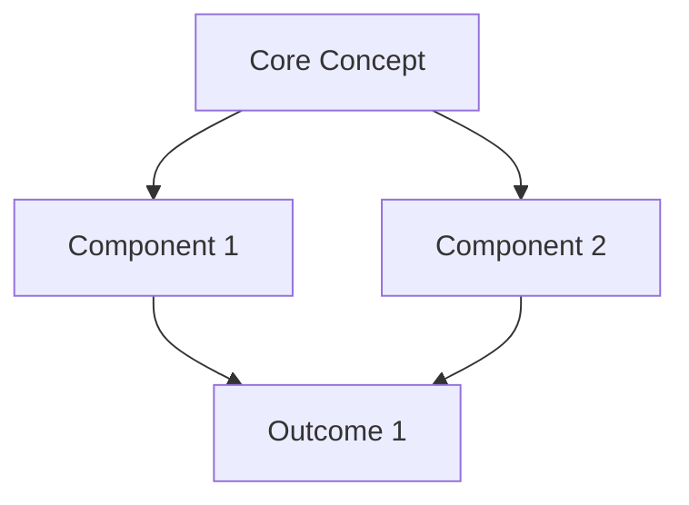
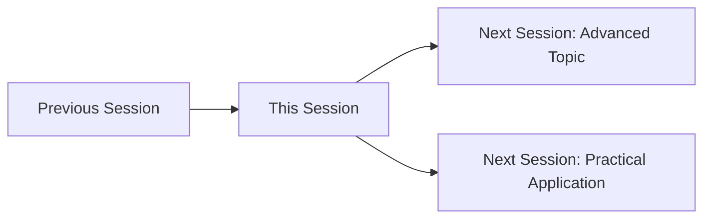

# Extraction Report: Re-usable Templater Syntax and Complete Note Templates

> [!info] Auto-Generated Report
> This report was automatically generated by `pkb_extractor.py` on 2026-03-13 04:18.
> **Source**: `reference-technical-advanced-templater-note-templates-20251118225816.md` | **Items Extracted**: 1080

---

## 📋 Document Overview

| Field | Value |
|-------|-------|
| **Source File** | `reference-technical-advanced-templater-note-templates-20251118225816.md` |
| **Extraction Date** | 2026-03-13 04:18 |
| **Word Count** | 17,594 |
| **Character Count** | 134,633 |
| **Line Count** | 4,300 |
| **Total Items Extracted** | 1,080 |

### Document Outline

- # Daily Planning & Daily Notes Templates
  - ## 📚 Part I: Reusable Syntax Sequences
    - ### Intelligent Time Block Generator with Energy Mapping
    - ### Priority Task Selector with Eisenhower Matrix
    - ### Daily Habit Tracker with Streak Management
    - ### Evening Reflection & Tomorrow Preview Generator
  - ## 🗂️ Part II: Complete Template Implementations
    - ### Comprehensive Daily Note Template
- # 📅 <% tp.date.now("dddd, MMMM DD, YYYY") %>
  - ## ☀️ Morning Planning
    - ### 🎯 Top 3 Priorities (MIT - Most Important Tasks)
    - ### 💭 Morning Intention
  - ## 📝 Captured Notes & Ideas
    - ### 💡 Ideas & Insights
    - ### 📧 Important Communications
    - ### 🤝 Meetings & Conversations
      - #### Meeting: [Title]
  - ## 📚 Learning Log
  - ## 📊 Daily Metrics
    - ### ⏱️ Time Tracking Summary
    - ### 💰 Financial Log *(optional)*
    - ### 🏃 Health & Wellness
  - ## 🌟 Wins & Gratitude
    - ### 🎉 Today's Wins
    - ### 🙏 Gratitude
  - ## 🔄 Evening Review
    - ### 📈 Progress Assessment
    - ### 💭 Reflection Questions
  - ## 🔗 Daily Connections
  - ## 📎 References & Links
    - ### Focus-Mode Daily Note (Minimal Distraction)
- # <% tp.date.now("dddd, MMMM DD") %>
  - ## 🎯 The Big Three
  - ## ⏰ Focus Blocks
  - ## 📝 Capture Zone
  - ## ✅ Day Complete
    - ### Weekly Planning & Review Daily Trigger Template
- # 📅 <% tp.date.now("dddd, MMMM DD, YYYY") %>
  - ## 📊 This Week in Review
    - ### 🎯 Goal Progress
    - ### 📈 Weekly Statistics
    - ### 💡 Key Learnings
  - ## 🔮 Next Week Planning
    - ### 🎯 Primary Objectives
    - ### 📅 Weekly Schedule Preview
    - ### 🔧 Systems & Habits
  - ## 📝 Today's Tasks
    - ### 🎯 Priorities
    - ### 📋 Weekly Review Checklist
  - ## 🔗 Weekly Links
    - ### Weekend Daily Note Template
- # 🌴 <% tp.date.now("dddd, MMMM DD, YYYY") %>
  - ## 🎨 Weekend Priorities
    - ### ⚖️ Rest vs. Activity Balance
    - ### ✅ Weekend To-Do's
  - ## 🏠 Home & Personal
    - ### 🧹 Home Maintenance
    - ### 💰 Personal Admin
    - ### 🎯 Personal Projects
  - ## 🤝 Social & Relationships
  - ## 🎨 Creative & Learning
  - ## 🏃 Wellness & Self-Care
    - ### Physical
    - ### Mental
    - ### Emotional
  - ## 🌟 Weekend Wins
  - ## 🔄 Week Transition
    - ### 📊 Last Week Closure
    - ### 🔮 Next Week Prep
  - ## 💭 Weekend Reflection
  - ## 🔗 Navigation
- # 🔗 Related Topics for PKB Expansion
- # Templater Syntax Reference & Template Library
  - ## 📚 Part I: Reusable Syntax Sequences
    - ### Intelligent Tag Generator with Semantic Analysis
    - ### Validated Multi-Field User Input Collector
    - ### Adaptive Content Scaffold Builder
    - ### Advanced Date Range Calculator with Business Logic
  - ## 📅 Milestone Schedule
  - ## 🗂️ Part II: Complete Template Implementations
    - ### Learning Concept Card Template
- # <% tp.file.title %>
  - ## 📖 Detailed Explanation
  - ## 🧩 Key Components
  - ## 🔄 Mental Model
  - ## 💡 Personal Insight
  - ## 🎯 Practical Applications
  - ## ❓ Open Questions & Areas for Deeper Study
  - ## 🧪 Self-Testing
  - ## 🔗 Knowledge Graph Connections
    - ### Agile Sprint Planning Board Template
- # <% tp.file.title %>
  - ## 📊 Sprint Metrics
  - ## 🎯 Sprint Backlog
    - ### 🔴 High Priority
    - ### 🟠 Medium Priority
    - ### 🟢 Low Priority
  - ## 📅 Daily Standup Log
    - ### <% tp.date.now("YYYY-MM-DD") %> - Day 1
  - ## 🚧 Impediments & Risks
  - ## 🎉 Sprint Deliverables
  - ## 📈 Burndown Tracking
  - ## 🔄 Sprint Retrospective (End of Sprint)
  - ## 🔗 Related Sprints
    - ### Weekly Review & Planning Journal Template
- # Week <% tp.frontmatter.week_number %> Review - <% moment(tp.date.now("YYYY-MM-DD")).format("MMMM YYYY") %>
  - ## 🎯 Goal Progress Review
    - ### Professional Goals
    - ### Personal Goals
  - ## 📊 Time & Energy Analysis
    - ### Time Allocation Breakdown
    - ### Energy Patterns
  - ## 📚 Learning & Growth
    - ### New Knowledge Acquired
    - ### Skills Practiced
    - ### Content Consumed
  - ## 🙏 Gratitude & Positive Moments
  - ## 🔄 Habit Tracking
  - ## 📅 Week Ahead Planning
    - ### Next Week's Focus
    - ### Scheduled Commitments
    - ### Buffer & Recovery
  - ## 💭 Free Reflection Space
  - ## 🔗 Connected Reviews
    - ### Research Synthesis Workspace Template
- # <% tp.file.title %>
  - ## 🎯 Research Objectives
  - ## 📚 Literature Map
    - ### Key Sources by Theme
      - #### Theme 1: [Conceptual Framework]
      - #### Theme 2: [Methodological Approaches]
      - #### Theme 3: [Empirical Findings]
  - ## 🧩 Theoretical Framework
    - ### Theory 1: [[Theory Name]]
    - ### Theory 2: [[Theory Name]]
  - ## 📊 Emerging Patterns & Themes
    - ### Convergent Findings
    - ### Divergent Perspectives
    - ### Research Gaps Identified
  - ## 💡 Synthesis & Original Insights
    - ### Conceptual Model
    - ### Novel Contributions
  - ## 🔬 Methodology Design
    - ### Research Design
    - ### Data Sources
    - ### Analysis Plan
  - ## ✍️ Argument Structure Outline
    - ### Supporting Arguments
    - ### Counterarguments & Rebuttals
  - ## 📅 Research Timeline & Milestones
  - ## 🔗 Connected Research
  - ## 📝 Writing Workspace
    - ### Introduction Draft
    - ### Methods Draft
    - ### Results Draft
    - ### Discussion Draft
- # 🔗 Related Topics for PKB Expansion
- # LLM Content Import & Integration Templates
  - ## 📚 Part I: Reusable Syntax Sequences
    - ### LLM Source Attribution & Metadata Generator
    - ### LLM Content Cleanup & Formatting Processor
    - ### Multi-Source LLM Conversation Merger
    - ### LLM Conversation Archive Indexer
  - ## 🗂️ Part II: Complete Template Implementations
    - ### General LLM Report Import Template
- # <% tp.file.title %>
  - ## 📋 Context & Background
  - ## 🤖 LLM-Generated Content
  - ## 🔍 Critical Review & Validation
    - ### Accuracy Assessment
    - ### Completeness Analysis
  - ## 💡 Personal Synthesis & Insights
  - ## 📊 Information Quality Scoring
  - ## ✅ Integration Checklist
    - ### Content Processing
    - ### PKB Integration
    - ### Knowledge Gaps Identified
  - ## 📅 Follow-Up Actions
  - ## 🔗 Related Notes
  - ## 📝 Revision History
    - ### Research Synthesis LLM Import Template
- # <% tp.file.title %>
  - ## 🎯 Research Objective & LLM Role
  - ## 📚 LLM-Generated Research Content
  - ## 🔬 Academic Rigor Assessment
    - ### Source Quality Evaluation
    - ### Theoretical Framework Validation
  - ## 💡 Critical Analysis & Synthesis
    - ### Strengths of LLM Output
    - ### Limitations & Corrections
  - ## 🧩 Integration with Research Project
    - ### How This Advances My Research
    - ### Placement in Research Architecture
  - ## 📊 Research Contribution Assessment
  - ## ✅ Verification Workflow
    - ### Immediate Actions
    - ### Follow-Up Research
    - ### Documentation Standards
  - ## 📝 Research Writing Integration
    - ### Usable Content
    - ### Content to Discard
  - ## 🔗 Research Network Connections
  - ## 🎓 Learning Outcomes
    - ### Technical Documentation LLM Import Template
- # <% tp.file.title %>
  - ## 🎯 Technical Context
  - ## 💻 LLM-Generated Technical Content
  - ## 🧪 Testing & Validation
    - ### Code Testing Log
    - ### Code Review Findings
  - ## 🔧 Corrections & Improvements
    - ### Modified Code (After Testing)
- # Paste corrected code here after testing
    - ### Performance Optimization
  - ## 📚 Technical Documentation
    - ### How It Works
    - ### API Reference (if applicable)
- # Document key functions
  - ## 🛠️ Usage Examples
    - ### Basic Usage
- # Minimal example
    - ### Advanced Usage
- # Complex scenario
    - ### Common Patterns
- # Code example
  - ## ⚠️ Gotchas & Troubleshooting
    - ### Common Errors
    - ### Best Practices
    - ### Limitations
  - ## 🔗 Technical Context & References
  - ## ✅ Production Readiness Checklist
    - ### Learning Conversation Archive Template
- # <% tp.file.title %>
  - ## 🎯 Learning Context
  - ## 💬 Conversation Flow & Key Exchanges
    - ### Initial Question
    - ### Key Exchanges
  - ## 💡 Key Learnings & Insights
    - ### Core Concepts Grasped
    - ### Analogies & Mental Models
  - ## 🎓 Learning Assessment
    - ### Comprehension Check
    - ### Quality of LLM's Teaching
  - ## 📚 Integration with Learning Path
    - ### Placement in Knowledge Structure
    - ### Extracted to Permanent Notes
  - ## 🔄 Active Recall & Spaced Repetition
    - ### Self-Testing Questions
    - ### Review Schedule
  - ## 🔍 Follow-Up Learning Actions
    - ### Immediate Next Steps
    - ### Long-Term Learning Plan
  - ## 🔗 Learning Network
  - ## 💭 Meta-Learning Reflections
- # 🔗 Related Topics for PKB Expansion

---

## 📊 Extraction Summary

| Item Type | Count |
|-----------|-------|
| Callouts | 48 |
| Code Blocks | 36 |
| Color Spans | 0 |
| Definitions | 0 |
| Embeds | 0 |
| External Links | 0 |
| Footnotes | 5 |
| Headings | 255 |
| Inline Fields | 0 |
| Mermaid Diagrams | 2 |
| Tables | 18 |
| Tags | 33 |
| Wiki Links | 200 |
| **TOTAL** | **1080** |

---

## 🔔 Callouts (48)

> [!note] What are Callouts?
> Callouts are `> [!TYPE]` blocks used in Obsidian for structured annotation.
> They carry semantic meaning — definitions, insights, warnings, etc.

### By Type

| Callout Type | Count |
|-------------|-------|
| `[!abstract]` | 9 |
| `[!analogy]` | 2 |
| `[!attention]` | 5 |
| `[!counter-argument]` | 1 |
| `[!definition]` | 4 |
| `[!evidence]` | 3 |
| `[!example]` | 2 |
| `[!helpful-tip]` | 2 |
| `[!important]` | 3 |
| `[!key-claim]` | 3 |
| `[!methodology-and-sources]` | 5 |
| `[!principle-point]` | 1 |
| `[!thought-experiment]` | 4 |
| `[!warning]` | 2 |
| `[!what-this-does]` | 2 |

### Full Callout List

#### 1. [ABSTRACT] Purpose *(Line 32)*

> [!abstract] Purpose
> Comprehensive Templater templates for daily planning, execution tracking, and reflection. Integrates task management, time blocking, habit tracking, and learning capture into cohesive daily workflow systems optimized for the [[Obsidian]] ecosystem.

#### 2. [ABSTRACT] Daily Overview *(Line 719)*

> [!abstract] Daily Overview
> **Week** <% moment(tp.date.now("YYYY-MM-DD")).week() %> of <%= moment(tp.date.now("YYYY-MM-DD")).year() %>
> **Weather/Context**: <% tp.frontmatter.weather || "Not specified" %>
> **Focus Word**: *<% await tp.system.prompt("One word intention for today", "Focus") %>*

#### 3. [IMPORTANT] Today's Mission *(Line 939)*

> [!important] Today's Mission
> *One primary objective for today:*
> 
> **<% await tp.system.prompt("What is THE most important thing to accomplish today?") %>**

#### 4. [ATTENTION] Weekly Review Day *(Line 1028)*

> [!attention] Weekly Review Day
> Today is your designated weekly review day. Plan to spend 30-60 minutes reviewing the past week and planning the next.

#### 5. [ABSTRACT] Weekend Intentions *(Line 1219)*

> [!abstract] Weekend Intentions
> **Mode**: <% tp.frontmatter.mode %>
> **Focus**: *<% await tp.system.suggester(["Rest & Recovery", "Personal Projects", "Social & Family", "Adventure & Exploration", "Learning & Growth", "Mixed"], ["rest", "projects", "social", "adventure", "learning", "mixed"]) %>*

#### 6. [ABSTRACT] Purpose *(Line 1423)*

> [!abstract] Purpose
> Comprehensive collection of reusable Templater syntax sequences and complete template implementations for rapid PKB automation development. Each component is production-ready, extensively documented, and designed for modular reuse across diverse workflows.

#### 7. [DEFINITION] Core Definition *(Line 1832)*

> [!definition] Core Definition
> *Brief definition in your own words - aim for 1-2 sentences that capture the essence*

#### 8. [ANALOGY] Understanding Through Comparison *(Line 1852)*

> [!analogy] Understanding Through Comparison
> *Explain this concept using an analogy, metaphor, or comparison to something familiar*

#### 9. [EXAMPLE] Real-World Examples *(Line 1865)*

> [!example] Real-World Examples
> 1. **Example 1**: Concrete scenario
> 2. **Example 2**: Different context application
> 3. **Example 3**: Edge case or unusual application

#### 10. [ATTENTION] Comprehension Check *(Line 1878)*

> [!attention] Comprehension Check
> Without looking at notes above, can you:
> - [ ] Define the concept in one sentence
> - [ ] Explain it to someone unfamiliar with the topic
> - [ ] Identify when you'd apply this concept
> - [ ] Connect it to 3 other concepts in your knowledge base

#### 11. [ABSTRACT] Sprint Overview *(Line 1943)*

> [!abstract] Sprint Overview
> **Goal**: <% tp.frontmatter.sprint_goal %>
> **Timeline**: <% tp.frontmatter.sprint_start %> → <% tp.frontmatter.sprint_end %>
> **Team**: <% tp.frontmatter.team %>
> **Velocity Target**: <% tp.frontmatter.velocity_target %> points

#### 12. [WARNING] Active Blockers *(Line 2007)*

> [!warning] Active Blockers
> *Track anything preventing progress*

#### 13. [IMPORTANT] Definition of Done Checklist *(Line 2016)*

> [!important] Definition of Done Checklist
> - [ ] All acceptance criteria met for committed stories
> - [ ] Code reviewed and merged to main branch
> - [ ] Unit tests written and passing (>80% coverage)
> - [ ] Documentation updated
> - [ ] Demo prepared for sprint review
> - [ ] Deployed to staging environment

#### 14. [ABSTRACT] Week at a Glance *(Line 2094)*

> [!abstract] Week at a Glance
> **Period**: <% moment(tp.frontmatter.week_start).format("MMM DD") %> - <% moment(tp.frontmatter.week_end).format("MMM DD, YYYY") %>
> **Energy Level**: <% tp.frontmatter.energy_level %>
> **Satisfaction**: <% "⭐".repeat(tp.frontmatter.satisfaction_rating) %>

#### 15. [KEY-CLAIM] Primary Objective *(Line 2105)*

> [!key-claim] Primary Objective
> *What was the main professional goal for this week?*

#### 16. [THOUGHT-EXPERIMENT] Reflection Prompt *(Line 2151)*

> [!thought-experiment] Reflection Prompt
> If you could redistribute your time this week, what would you change?

#### 17. [EXAMPLE] Key Concepts Learned *(Line 2171)*

> [!example] Key Concepts Learned
> - **[[Concept-1|Concept 1]]**: Brief description and why it matters
> - **[[Concept-2|Concept 2]]**: Brief description and source
> - **[[Concept-3|Concept 3]]**: Application or next step

#### 18. [HELPFUL-TIP] Gratitude Practice *(Line 2194)*

> [!helpful-tip] Gratitude Practice
> Research shows regular gratitude reflection improves well-being and life satisfaction.

#### 19. [IMPORTANT] Primary Intention *(Line 2231)*

> [!important] Primary Intention
> *What is the ONE thing that would make next week successful?*

#### 20. [DEFINITION] Research Question *(Line 2313)*

> [!definition] Research Question
> **Primary Question**: <% tp.frontmatter.research_topic %>
> 
> **Sub-Questions:**
> 1. 
> 2. 
> 3.

#### 21. [METHODOLOGY-AND-SOURCES] Search Strategy *(Line 2338)*

> [!methodology-and-sources] Search Strategy
> **Databases**: [Specify: PubMed, Google Scholar, JSTOR, etc.]
> **Search Terms**: 
> **Inclusion Criteria**: 
> **Exclusion Criteria**: 
> **Date Range**:

#### 22. [PRINCIPLE-POINT] Foundational Theories *(Line 2372)*

> [!principle-point] Foundational Theories
> *Identify 2-3 core theoretical perspectives informing your research*

#### 23. [EVIDENCE] Areas of Consensus *(Line 2403)*

> [!evidence] Areas of Consensus
> *What do multiple sources agree on?*

#### 24. [COUNTER-ARGUMENT] Contradictions & Debates *(Line 2416)*

> [!counter-argument] Contradictions & Debates
> *Where do sources disagree or present competing views?*

#### 25. [ATTENTION] Opportunities for Contribution *(Line 2431)*

> [!attention] Opportunities for Contribution
> *What hasn't been adequately addressed?*

#### 26. [THOUGHT-EXPERIMENT] Integrated Framework *(Line 2448)*

> [!thought-experiment] Integrated Framework
> *How do the pieces fit together? What new understanding emerges?*

#### 27. [KEY-CLAIM] Central Thesis *(Line 2502)*

> [!key-claim] Central Thesis
> *Your main argumentative claim*

#### 28. [ABSTRACT] Purpose *(Line 2740)*

> [!abstract] Purpose
> Specialized Templater templates for systematically importing, structuring, and integrating LLM-generated content (reports, analyses, summaries) into your Personal Knowledge Base with proper attribution, metadata, and PKB architecture alignment.

#### 29. [ABSTRACT] Report Overview *(Line 3210)*

> [!abstract] Report Overview
> **Generated By**: <% tp.frontmatter.llm_model %>
> **Purpose**: <% tp.frontmatter.report_purpose %>
> **Original Prompt**: <% tp.frontmatter.original_prompt %>
> **Quality Rating**: <% "⭐".repeat(tp.frontmatter.quality_rating) %>

#### 30. [METHODOLOGY-AND-SOURCES] Generation Context *(Line 3220)*

> [!methodology-and-sources] Generation Context
> **Conversation Context**: <% tp.frontmatter.conversation_context %>
> **Prompt Approach**: <% tp.frontmatter.prompt_approach %>
> **Date Generated**: <% tp.frontmatter.generation_date %>

#### 31. [ATTENTION] AI-Generated Content *(Line 3238)*

> [!attention] AI-Generated Content
> The following content was produced by an LLM. Review for accuracy before integrating into PKB.

#### 32. [EVIDENCE] Fact-Checking Results *(Line 3252)*

> [!evidence] Fact-Checking Results

#### 33. [THOUGHT-EXPERIMENT] My Understanding *(Line 3283)*

> [!thought-experiment] My Understanding
> *Process the LLM's output into your own words and mental models*

#### 34. [DEFINITION] Research Context *(Line 3422)*

> [!definition] Research Context
> **Primary Question**: <% tp.frontmatter.research_question %>
> **Research Phase**: <% tp.frontmatter.research_phase %>
> **Discipline**: <% tp.frontmatter.academic_discipline %>
> **LLM Used**: <% tp.frontmatter.llm_model %> (<% tp.frontmatter.generation_date %>)

#### 35. [METHODOLOGY-AND-SOURCES] Generation Parameters *(Line 3451)*

> [!methodology-and-sources] Generation Parameters
> **Prompt Approach**: <% tp.frontmatter.prompt_approach %>
> **Context Provided**: <% tp.frontmatter.conversation_context %>

#### 36. [EVIDENCE] Reference Verification *(Line 3466)*

> [!evidence] Reference Verification

#### 37. [ABSTRACT] Technical Overview *(Line 3688)*

> [!abstract] Technical Overview
> **Technology**: <% tp.frontmatter.technology_stack %>
> **Documentation Type**: <% tp.frontmatter.doc_type %>
> **LLM Source**: <% tp.frontmatter.llm_model %>
> **Generated**: <% tp.frontmatter.generation_date %>

#### 38. [WARNING] AI-Generated Code *(Line 3715)*

> [!warning] AI-Generated Code
> Code below was generated by an LLM and has NOT been tested yet.
> **Testing Status**: <% tp.frontmatter.code_tested ? "✅ Tested" : "⚠️ NOT TESTED" %>
> **Production Status**: <% tp.frontmatter.production_ready ? "✅ Production Ready" : "🚫 NOT Production Ready" %>

#### 39. [WHAT-THIS-DOES] Production-Ready Version *(Line 3783)*

> [!what-this-does] Production-Ready Version
> This is the tested, corrected version ready for actual use.

#### 40. [METHODOLOGY-AND-SOURCES] Implementation Details *(Line 3814)*

> [!methodology-and-sources] Implementation Details

#### 41. [HELPFUL-TIP] Recommendations *(Line 3883)*

> [!helpful-tip] Recommendations

#### 42. [DEFINITION] Learning Session Overview *(Line 3992)*

> [!definition] Learning Session Overview
> **Topic**: <% tp.frontmatter.learning_objective %>
> **Learning Stage**: <% tp.frontmatter.learning_stage %>
> **Comprehension Level**: <% "⭐".repeat(tp.frontmatter.comprehension_level) %>
> **Quality**: <% tp.frontmatter.conversation_quality %>

#### 43. [METHODOLOGY-AND-SOURCES] Conversation Metadata *(Line 4020)*

> [!methodology-and-sources] Conversation Metadata
> **Duration**: ~<% tp.frontmatter.turn_count %> exchanges
> **LLM Model**: <% tp.frontmatter.llm_model %>
> **Date**: <% tp.frontmatter.generation_date %>
> **Topics Covered**: <% tp.frontmatter.topics %>

#### 44. [KEY-CLAIM] Primary Takeaways *(Line 4059)*

> [!key-claim] Primary Takeaways

#### 45. [ANALOGY] Understanding Tools *(Line 4081)*

> [!analogy] Understanding Tools

#### 46. [ATTENTION] Self-Evaluation *(Line 4097)*

> [!attention] Self-Evaluation

#### 47. [WHAT-THIS-DOES] Content Migration *(Line 4153)*

> [!what-this-does] Content Migration

#### 48. [THOUGHT-EXPERIMENT] Comprehension Tests *(Line 4171)*

> [!thought-experiment] Comprehension Tests

---

## 🔗 Wiki-Links (200 total, 156 unique targets)

> [!info] Knowledge Graph Connections
> These links represent connections to other notes in your PKB.
> **156** distinct notes are referenced.

### Unique Targets

- [[${match}]]
- [[${topic}]]
- [[03-notes/01_permanent-notes/01_cognitive-development/Pomodoro Technique]]
- [[03-notes/01_permanent-notes/02_personal-knowledge-base/Personal Knowledge Management]]
- [[<% await tp.system.prompt("Link to main project note name") %>]]
- [[<% moment(tp.date.now("YYYY-MM-DD")).format("YYYY-MM") %> Monthly Review]]
- [[<% moment(tp.date.now("YYYY-MM-DD")).startOf('week').add(1, 'day').format("YYYY-MM-DD") %>]]
- [[<% moment(tp.date.now("YYYY-MM-DD")).startOf('week').add(2, 'days').format("YYYY-MM-DD") %>]]
- [[<% moment(tp.date.now("YYYY-MM-DD")).startOf('week').add(3, 'days').format("YYYY-MM-DD") %>]]
- [[<% moment(tp.date.now("YYYY-MM-DD")).startOf('week').add(4, 'days').format("YYYY-MM-DD") %>]]
- [[<% moment(tp.date.now("YYYY-MM-DD")).startOf('week').add(5, 'days').format("YYYY-MM-DD") %>]]
- [[%-tp.date.nowYYYY-MM-%-Monthly-Review|<% tp.date.now("YYYY-MM") %> Monthly Review]]
- [[%-tp.date.nowYYYY-MM-DD,-1-%|<% tp.date.now("YYYY-MM-DD", -1) %>]]
- [[<% tp.date.now("YYYY-MM-DD", -1, tp.file.title, "YYYY-MM-DD") %>]]
- [[<% tp.date.now("YYYY-MM-DD", 1) %>]]
- [[%-tp.date.nowYYYY-MM-DD,-1,-tp.file.title,-YYYY-MM-DD-%|<% tp.date.now("YYYY-MM-DD", 1, tp.file.title, "YYYY-MM-DD") %>]]
- [[<% tp.frontmatter.year %> Year in Review]]
- [[@Source]]
- [[@Source1]]
- [[@Source2]]
- [[@Source3]]
- [[AAR-After-Action-Review|AAR (After Action Review)]]
- [[AI-Assisted Research Verification Protocols]]
- [[AI-Augmented Thinking]]
- [[Academic Writing]]
- [[Advanced Templater Functions]]
- [[Advanced Topic 1]]
- [[Advanced Topic 2]]
- [[Anki]]
- [[Architecture Pattern]]
- [[Architecture Patterns]]
- [[Argument-Mapping|Argument Mapping]]
- [[Atomic-Habits|Atomic Habits]]
- [[Author-Name|Author Name]]
- [[Author Year - Title]]
- [[Bullet Journaling]]
- [[Burnout]]
- [[Citation Management]]
- [[Claim to fact-check]]
- [[Comparative Analysis Framework]]
- [[Complementary Concept Conversation]]
- [[Concept-1|Concept 1]]
- [[Concept-2|Concept 2]]
- [[Concept-3|Concept 3]]
- [[Concept A]]
- [[Concept B]]
- [[Concept Card 1]]
- [[Concept Card 2]]
- [[Concept-Name|Concept Name]]
- [[Concept X]]
- [[Concept Y]]
- [[Concept to investigate]]
- [[Content Verification]]
- [[Conversation Management MOC]]
- [[Conversation Topic 1]]
- [[Conversation Topic 2]]
- [[Core Concept 1]]
- [[Core Concept 2]]
- [[Course Notes]]
- [[Daily-Review-Frameworks|Daily Review Frameworks]]
- [[Dataview]]
- [[Dataview-Queries-for-Daily-Notes|Dataview Queries for Daily Notes]]
- [[Day-Planner|Day Planner]]
- [[Dependencies]]
- [[Domain MOC]]
- [[Earlier LLM Conversation]]
- [[Elaborative-Interrogation|Elaborative Interrogation]]
- [[Existing Concept 1]]
- [[Existing Topic Note]]
- [[Flow-State|Flow State]]
- [[Framework X]]
- [[Framework Z]]
- [[GTD|GTD (Getting Things Done)]]
- [[GTD-Weekly-Review|GTD Weekly Review]]
- [[Getting-Things-Done|Getting Things Done]]
- [[Goals-MOC|Goals MOC]]
- [[Habit-Formation-Science|Habit Formation Science]]
- [[Hybrid Human-AI Knowledge Creation Workflows]]
- [[JavaScript in Obsidian Templates]]
- [[Key-Concepts|Key Concepts]]
- [[LLM Prompt Engineering for PKB]]
- [[Learning-Log|Learning Log]]
- [[Learning Theory]]
- [[Literature Note 1]]
- [[Literature Notes]]
- [[Literature-Review|Literature Review]]
- [[MOC Name]]
- [[Main Research Project]]
- [[Mendeley]]
- [[Meta-Learning from LLM Interactions]]
- [[Metacognition]]
- [[Metacognitive-Development|Metacognitive Development]]
- [[Methodological Framework]]
- [[Obsidian Plugin Integration Patterns]]
- [[PKB Automation Design Principles]]
- [[Positive Psychology]]
- [[Prerequisite Concept 1]]
- [[Prerequisite Concept 2]]
- [[Previous-Concept|Previous Concept]]
- [[Previous Understanding]]
- [[Prior conversation about this topic]]
- [[Problem this helps solve]]
- [[Project Name 1]]
- [[Project Name 2]]
- [[Project where this applies]]
- [[QuickAdd]]
- [[Related Concept 1]]
- [[Related Concept 2]]
- [[Related Implementation]]
- [[Related LLM Report 1]]
- [[Related LLM Report 2]]
- [[Research Method]]
- [[Research Method 1]]
- [[Research Topic 1]]
- [[Self-Directed-Learning|Self-Directed Learning]]
- [[Similar Topic Conversation]]
- [[Source 1]]
- [[Source 2]]
- [[Source Reliability Scoring]]
- [[Spaced-Repetition-Spacing-Effect|Spaced Repetition]]
- [[Sprint <% parseInt((await tp.system.prompt("Sprint number (e.g., Sprint 12)")).replace(/\D/g, '')) + 1 %>]]
- [[Sprint <% parseInt((await tp.system.prompt("Sprint number (e.g., Sprint 12)")).replace(/\D/g, '')) - 1 %>]]
- [[Statistical Technique]]
- [[Stoic-Evening-Meditation|Stoic Evening Meditation]]
- [[Strategic-Planning|Strategic Planning]]
- [[Tasks]]
- [[Tasks-Plugin|Tasks Plugin]]
- [[Technology Concept]]
- [[Technology Stack]]
- [[The-Power-of-Habit|The Power of Habit]]
- [[Theoretical Concept]]
- [[Theoretical Framework]]
- [[Theory 1]]
- [[Theory 2]]
- [[Theory Name]]
- [[Time-Blocking-Methodology|Time Blocking Methodology]]
- [[Tiny-Habits|Tiny Habits]]
- [[Topic 1]]
- [[Topic 2]]
- [[Topic A]]
- [[Topic B]]
- [[Topic flagged for further research]]
- [[Topic to investigate]]
- [[Topic to research further 1]]
- [[Topic to research further 2]]
- [[Tracker-Plugin|Tracker Plugin]]
- [[Week <% tp.frontmatter.week_number + 1 %> Review - <% tp.frontmatter.year %>]]
- [[Week <% tp.frontmatter.week_number - 1 %> Review - <% tp.frontmatter.year %>]]
- [[What led to this question]]
- [[Zotero]]
- [[Dataview]]
- [[deep-work|deep work]]
- [[Obsidian]]
- [[productivity]]
- [[wiki-links]]
- [[work-life-balance|work-life balance]]

### All Occurrences

| # | Target | Display Text | Heading | Section | Line |
|---|--------|-------------|---------|---------|------|
| 1 | [[Obsidian]] | — | — | Daily Planning & Daily Notes Templates | 33 |
| 2 | [[Day-Planner|Day Planner]] | — | — | Intelligent Time Block Generator with... | 227 |
| 3 | [[Tasks-Plugin|Tasks Plugin]] | — | — | Priority Task Selector with Eisenhowe... | 399 |
| 4 | [[Dataview]] | — | — | Daily Habit Tracker with Streak Manag... | 555 |
| 5 | [[Tracker-Plugin|Tracker Plugin]] | — | — | Daily Habit Tracker with Streak Manag... | 556 |
| 6 | [[Goals-MOC|Goals MOC]] | — | — | Daily Habit Tracker with Streak Manag... | 557 |
| 7 | [[Concept-1|Concept 1]] | — | — | Evening Reflection & Tomorrow Preview... | 617 |
| 8 | [[Concept-2|Concept 2]] | — | — | Evening Reflection & Tomorrow Preview... | 618 |
| 9 | [[Learning-Log|Learning Log]] | — | — | Evening Reflection & Tomorrow Preview... | 695 |
| 10 | [[Concept-1|Concept 1]] | — | — | 📚 Learning Log | 775 |
| 11 | [[Concept-2|Concept 2]] | — | — | 📚 Learning Log | 776 |
| 12 | [[Previous-Concept|Previous Concept]] | — | — | 📚 Learning Log | 787 |
| 13 | [[<% tp.date.now("YYYY-MM-DD", -1, tp.file.title, "YYYY-MM-DD") %>]] | — | — | 🔗 Daily Connections | 876 |
| 14 | [[%-tp.date.nowYYYY-MM-DD,-1,-tp.file.title,-YYYY-MM-DD-%|<% tp.date.now("YYYY-MM-DD", 1, tp.file.title, "YYYY-MM-DD") %>]] | — | — | 🔗 Daily Connections | 877 |
| 15 | [[%-tp.date.nowYYYY-MM-%-Monthly-Review|<% tp.date.now("YYYY-MM") %> Monthly Review]] | — | — | 🔗 Daily Connections | 880 |
| 16 | [[03-notes/01_permanent-notes/02_personal-knowledge-base/Personal Knowledge Management]] | — | — | 📎 References & Links | 907 |
| 17 | [[productivity]] | — | — | 📎 References & Links | 907 |
| 18 | [[<% tp.date.now("YYYY-MM-DD", 1) %>]] | — | — | ✅ Day Complete | 990 |
| 19 | [[%-tp.date.nowYYYY-MM-DD,-1-%|<% tp.date.now("YYYY-MM-DD", -1) %>]] | — | — | ✅ Day Complete | 994 |
| 20 | [[<% tp.date.now("YYYY-MM-DD", 1) %>]] | — | — | ✅ Day Complete | 994 |
| 21 | [[deep-work|deep work]] | — | — | ✅ Day Complete | 997 |
| 22 | [[Flow-State|Flow State]] | — | — | ✅ Day Complete | 997 |
| 23 | [[03-notes/01_permanent-notes/01_cognitive-development/Pomodoro Technique]] | — | — | ✅ Day Complete | 1010 |
| 24 | [[%-tp.date.nowYYYY-MM-%-Monthly-Review|<% tp.date.now("YYYY-MM") %> Monthly Review]] | — | — | 🔗 Weekly Links | 1170 |
| 25 | [[<% moment(tp.date.now("YYYY-MM-DD")).startOf('week').add(1, 'day').format("YYYY-MM-DD") %>]] | — | — | 🔗 Weekly Links | 1173 |
| 26 | [[<% moment(tp.date.now("YYYY-MM-DD")).startOf('week').add(2, 'days').format("YYYY-MM-DD") %>]] | — | — | 🔗 Weekly Links | 1174 |
| 27 | [[<% moment(tp.date.now("YYYY-MM-DD")).startOf('week').add(3, 'days').format("YYYY-MM-DD") %>]] | — | — | 🔗 Weekly Links | 1175 |
| 28 | [[<% moment(tp.date.now("YYYY-MM-DD")).startOf('week').add(4, 'days').format("YYYY-MM-DD") %>]] | — | — | 🔗 Weekly Links | 1176 |
| 29 | [[<% moment(tp.date.now("YYYY-MM-DD")).startOf('week').add(5, 'days').format("YYYY-MM-DD") %>]] | — | — | 🔗 Weekly Links | 1177 |
| 30 | [[GTD-Weekly-Review|GTD Weekly Review]] | — | — | 🔗 Weekly Links | 1185 |
| 31 | [[Strategic-Planning|Strategic Planning]] | — | — | 🔗 Weekly Links | 1185 |
| 32 | [[Getting-Things-Done|Getting Things Done]] | — | — | 🔗 Weekly Links | 1194 |
| 33 | [[%-tp.date.nowYYYY-MM-DD,-1-%|<% tp.date.now("YYYY-MM-DD", -1) %>]] | — | — | 🔗 Navigation | 1369 |
| 34 | [[<% tp.date.now("YYYY-MM-DD", 1) %>]] | — | — | 🔗 Navigation | 1370 |
| 35 | [[Burnout]] | — | — | 🔗 Navigation | 1378 |
| 36 | [[work-life-balance|work-life balance]] | — | — | 🔗 Navigation | 1378 |
| 37 | [[Time-Blocking-Methodology|Time Blocking Methodology]] | — | — | 🔗 Related Topics for PKB Expansion | 1401 |
| 38 | [[deep-work|deep work]] | — | — | 🔗 Related Topics for PKB Expansion | 1403 |
| 39 | [[Habit-Formation-Science|Habit Formation Science]] | — | — | 🔗 Related Topics for PKB Expansion | 1406 |
| 40 | [[Atomic-Habits|Atomic Habits]] | — | — | 🔗 Related Topics for PKB Expansion | 1408 |
| 41 | [[The-Power-of-Habit|The Power of Habit]] | — | — | 🔗 Related Topics for PKB Expansion | 1408 |
| 42 | [[Tiny-Habits|Tiny Habits]] | — | — | 🔗 Related Topics for PKB Expansion | 1408 |
| 43 | [[Daily-Review-Frameworks|Daily Review Frameworks]] | — | — | 🔗 Related Topics for PKB Expansion | 1411 |
| 44 | [[Stoic-Evening-Meditation|Stoic Evening Meditation]] | — | — | 🔗 Related Topics for PKB Expansion | 1412 |
| 45 | [[AAR-After-Action-Review|AAR (After Action Review)]] | — | — | 🔗 Related Topics for PKB Expansion | 1412 |
| 46 | [[Dataview-Queries-for-Daily-Notes|Dataview Queries for Daily Notes]] | — | — | 🔗 Related Topics for PKB Expansion | 1416 |
| 47 | [[QuickAdd]] | — | — | Intelligent Tag Generator with Semant... | 1490 |
| 48 | [[Dataview]] | — | — | Intelligent Tag Generator with Semant... | 1491 |
| 49 | [[Tasks]] | — | — | Validated Multi-Field User Input Coll... | 1584 |
| 50 | [[Author-Name|Author Name]] | — | — | Adaptive Content Scaffold Builder | 1681 |
| 51 | [[Key-Concepts|Key Concepts]] | — | — | Adaptive Content Scaffold Builder | 1681 |
| 52 | [[Theoretical Framework]] | — | — | Adaptive Content Scaffold Builder | 1681 |
| 53 | [[Architecture Patterns]] | — | — | Adaptive Content Scaffold Builder | 1683 |
| 54 | [[Technology Stack]] | — | — | Adaptive Content Scaffold Builder | 1683 |
| 55 | [[Dependencies]] | — | — | Adaptive Content Scaffold Builder | 1683 |
| 56 | [[Concept-1|Concept 1]] | — | — | Adaptive Content Scaffold Builder | 1685 |
| 57 | [[Concept-2|Concept 2]] | — | — | Adaptive Content Scaffold Builder | 1685 |
| 58 | [[Concept-3|Concept 3]] | — | — | Adaptive Content Scaffold Builder | 1685 |
| 59 | [[QuickAdd]] | — | — | Adaptive Content Scaffold Builder | 1698 |
| 60 | [[Day-Planner|Day Planner]] | — | — | Adaptive Content Scaffold Builder | 1700 |
| 61 | [[Tasks]] | — | — | Adaptive Content Scaffold Builder | 1700 |
| 62 | [[Dataview]] | — | — | 📅 Milestone Schedule | 1806 |
| 63 | [[Tasks]] | — | — | 📅 Milestone Schedule | 1808 |
| 64 | [[Concept X]] | — | — | 💡 Personal Insight | 1860 |
| 65 | [[Concept Y]] | — | — | 💡 Personal Insight | 1861 |
| 66 | [[Topic to investigate]] | — | — | ❓ Open Questions & Areas for Deeper S... | 1874 |
| 67 | [[Prerequisite Concept 1]] | — | — | 🔗 Knowledge Graph Connections | 1893 |
| 68 | [[Prerequisite Concept 2]] | — | — | 🔗 Knowledge Graph Connections | 1894 |
| 69 | [[Advanced Topic 1]] | — | — | 🔗 Knowledge Graph Connections | 1897 |
| 70 | [[Advanced Topic 2]] | — | — | 🔗 Knowledge Graph Connections | 1898 |
| 71 | [[Related Concept 1]] | — | — | 🔗 Knowledge Graph Connections | 1901 |
| 72 | [[Related Concept 2]] | — | — | 🔗 Knowledge Graph Connections | 1902 |
| 73 | [[Spaced-Repetition-Spacing-Effect|Spaced Repetition]] | — | — | 🔗 Knowledge Graph Connections | 1908 |
| 74 | [[Elaborative-Interrogation|Elaborative Interrogation]] | — | — | 🔗 Knowledge Graph Connections | 1908 |
| 75 | [[Anki]] | — | — | 🔗 Knowledge Graph Connections | 1921 |
| 76 | [[<% await tp.system.prompt("Link to main project note name") %>]] | — | — | Agile Sprint Planning Board Template | 1938 |
| 77 | [[Sprint <% parseInt((await tp.system.prompt("Sprint number (e.g., Sprint 12)")).replace(/\D/g, '')) - 1 %>]] | — | — | 🔗 Related Sprints | 2053 |
| 78 | [[Sprint <% parseInt((await tp.system.prompt("Sprint number (e.g., Sprint 12)")).replace(/\D/g, '')) + 1 %>]] | — | — | 🔗 Related Sprints | 2054 |
| 79 | [[Tasks-Plugin|Tasks Plugin]] | — | — | 🔗 Related Sprints | 2061 |
| 80 | [[Dataview]] | — | — | 🔗 Related Sprints | 2061 |
| 81 | [[Concept-1|Concept 1]] | — | — | New Knowledge Acquired | 2172 |
| 82 | [[Concept-2|Concept 2]] | — | — | New Knowledge Acquired | 2173 |
| 83 | [[Concept-3|Concept 3]] | — | — | New Knowledge Acquired | 2174 |
| 84 | [[Source 1]] | — | — | Content Consumed | 2184 |
| 85 | [[Source 2]] | — | — | Content Consumed | 2185 |
| 86 | [[Week <% tp.frontmatter.week_number - 1 %> Review - <% tp.frontmatter.year %>]] | — | — | 🔗 Connected Reviews | 2269 |
| 87 | [[Week <% tp.frontmatter.week_number + 1 %> Review - <% tp.frontmatter.year %>]] | — | — | 🔗 Connected Reviews | 2270 |
| 88 | [[<% moment(tp.date.now("YYYY-MM-DD")).format("YYYY-MM") %> Monthly Review]] | — | — | 🔗 Connected Reviews | 2271 |
| 89 | [[<% tp.frontmatter.year %> Year in Review]] | — | — | 🔗 Connected Reviews | 2272 |
| 90 | [[GTD|GTD (Getting Things Done)]] | — | — | 🔗 Connected Reviews | 2278 |
| 91 | [[Bullet Journaling]] | — | — | 🔗 Connected Reviews | 2278 |
| 92 | [[Positive Psychology]] | — | — | 🔗 Connected Reviews | 2278 |
| 93 | [[Day-Planner|Day Planner]] | — | — | 🔗 Connected Reviews | 2291 |
| 94 | [[Dataview]] | — | — | 🔗 Connected Reviews | 2292 |
| 95 | [[Theory Name]] | — | — | Theory 1: [[Theory Name]] | 2375 |
| 96 | [[Theory Name]] | — | — | Theory 2: [[Theory Name]] | 2386 |
| 97 | [[@Source1]] | — | — | Convergent Findings | 2407 |
| 98 | [[@Source2]] | — | — | Convergent Findings | 2407 |
| 99 | [[@Source3]] | — | — | Convergent Findings | 2407 |
| 100 | [[@Source]] | — | — | Divergent Perspectives | 2420 |
| 101 | [[@Source]] | — | — | Divergent Perspectives | 2421 |
| 102 | [[Project Name 1]] | — | — | 🔗 Connected Research | 2545 |
| 103 | [[Project Name 2]] | — | — | 🔗 Connected Research | 2546 |
| 104 | [[Core Concept 1]] | — | — | 🔗 Connected Research | 2549 |
| 105 | [[Core Concept 2]] | — | — | 🔗 Connected Research | 2550 |
| 106 | [[Research Method 1]] | — | — | 🔗 Connected Research | 2553 |
| 107 | [[Statistical Technique]] | — | — | 🔗 Connected Research | 2554 |
| 108 | [[Literature-Review|Literature Review]] | — | — | Discussion Draft | 2581 |
| 109 | [[Argument-Mapping|Argument Mapping]] | — | — | Discussion Draft | 2581 |
| 110 | [[Academic Writing]] | — | — | Discussion Draft | 2581 |
| 111 | [[Zotero]] | — | — | Discussion Draft | 2596 |
| 112 | [[Mendeley]] | — | — | Discussion Draft | 2596 |
| 113 | [[Literature Notes]] | — | — | Discussion Draft | 2598 |
| 114 | [[Advanced Templater Functions]] | — | — | 🔗 Related Topics for PKB Expansion | 2604 |
| 115 | [[Obsidian Plugin Integration Patterns]] | — | — | 🔗 Related Topics for PKB Expansion | 2609 |
| 116 | [[PKB Automation Design Principles]] | — | — | 🔗 Related Topics for PKB Expansion | 2614 |
| 117 | [[JavaScript in Obsidian Templates]] | — | — | 🔗 Related Topics for PKB Expansion | 2619 |
| 118 | [[Citation Management]] | — | — | LLM Source Attribution & Metadata Gen... | 2875 |
| 119 | [[wiki-links]] | — | — | LLM Content Cleanup & Formatting Proc... | 2899 |
| 120 | [[${match}]] | — | — | LLM Content Cleanup & Formatting Proc... | 2928 |
| 121 | [[${match}]] | — | — | LLM Content Cleanup & Formatting Proc... | 2929 |
| 122 | [[${match}]] | — | — | LLM Content Cleanup & Formatting Proc... | 2934 |
| 123 | [[${match}]] | — | — | LLM Content Cleanup & Formatting Proc... | 2935 |
| 124 | [[Content Verification]] | — | — | LLM Content Cleanup & Formatting Proc... | 2986 |
| 125 | [[Comparative Analysis Framework]] | — | — | Multi-Source LLM Conversation Merger | 3086 |
| 126 | [[Source Reliability Scoring]] | — | — | Multi-Source LLM Conversation Merger | 3088 |
| 127 | [[${topic}]] | — | — | LLM Conversation Archive Indexer | 3157 |
| 128 | [[Conversation Topic 1]] | — | — | LLM Conversation Archive Indexer | 3161 |
| 129 | [[Conversation Topic 2]] | — | — | LLM Conversation Archive Indexer | 3162 |
| 130 | [[Conversation Management MOC]] | — | — | LLM Conversation Archive Indexer | 3186 |
| 131 | [[Topic to research further 1]] | — | — | Completeness Analysis | 3276 |
| 132 | [[Topic to research further 2]] | — | — | Completeness Analysis | 3277 |
| 133 | [[Existing Concept 1]] | — | — | 💡 Personal Synthesis & Insights | 3298 |
| 134 | [[Previous Understanding]] | — | — | 💡 Personal Synthesis & Insights | 3299 |
| 135 | [[Framework X]] | — | — | 💡 Personal Synthesis & Insights | 3300 |
| 136 | [[Concept-1|Concept 1]] | — | — | Content Processing | 3322 |
| 137 | [[Concept-2|Concept 2]] | — | — | Content Processing | 3322 |
| 138 | [[Concept-3|Concept 3]] | — | — | Content Processing | 3322 |
| 139 | [[MOC Name]] | — | — | PKB Integration | 3329 |
| 140 | [[Research Topic 1]] | — | — | Knowledge Gaps Identified | 3336 |
| 141 | [[Concept to investigate]] | — | — | Knowledge Gaps Identified | 3337 |
| 142 | [[Claim to fact-check]] | — | — | Knowledge Gaps Identified | 3338 |
| 143 | [[What led to this question]] | — | — | 🔗 Related Notes | 3362 |
| 144 | [[Prior conversation about this topic]] | — | — | 🔗 Related Notes | 3363 |
| 145 | [[Related LLM Report 1]] | — | — | 🔗 Related Notes | 3366 |
| 146 | [[Related LLM Report 2]] | — | — | 🔗 Related Notes | 3367 |
| 147 | [[Project where this applies]] | — | — | 🔗 Related Notes | 3370 |
| 148 | [[Problem this helps solve]] | — | — | 🔗 Related Notes | 3371 |
| 149 | [[Theory 1]] | — | — | Theoretical Framework Validation | 3488 |
| 150 | [[Theory 2]] | — | — | Theoretical Framework Validation | 3493 |
| 151 | [[Literature Note 1]] | — | — | Placement in Research Architecture | 3550 |
| 152 | [[Methodological Framework]] | — | — | Placement in Research Architecture | 3551 |
| 153 | [[Theoretical Concept]] | — | — | Placement in Research Architecture | 3552 |
| 154 | [[Previous Understanding]] | — | — | Placement in Research Architecture | 3555 |
| 155 | [[Topic flagged for further research]] | — | — | Follow-Up Research | 3584 |
| 156 | [[Author Year - Title]] | — | — | 🔗 Research Network Connections | 3621 |
| 157 | [[Author Year - Title]] | — | — | 🔗 Research Network Connections | 3622 |
| 158 | [[Core Concept 1]] | — | — | 🔗 Research Network Connections | 3625 |
| 159 | [[Core Concept 2]] | — | — | 🔗 Research Network Connections | 3626 |
| 160 | [[Research Method]] | — | — | 🔗 Research Network Connections | 3629 |
| 161 | [[Main Research Project]] | — | — | 🔗 Research Network Connections | 3632 |
| 162 | [[Citation Management]] | — | — | 🎓 Learning Outcomes | 3668 |
| 163 | [[Technology Concept]] | — | — | 🔗 Technical Context & References | 3907 |
| 164 | [[Architecture Pattern]] | — | — | 🔗 Technical Context & References | 3908 |
| 165 | [[Related Implementation]] | — | — | 🔗 Technical Context & References | 3909 |
| 166 | [[Concept-1|Concept 1]] | — | — | Core Concepts Grasped | 4061 |
| 167 | [[Concept-2|Concept 2]] | — | — | Core Concepts Grasped | 4067 |
| 168 | [[Concept-3|Concept 3]] | — | — | Core Concepts Grasped | 4073 |
| 169 | [[Concept-Name|Concept Name]] | — | — | Analogies & Mental Models | 4085 |
| 170 | [[Topic A]] | — | — | Placement in Knowledge Structure | 4140 |
| 171 | [[Topic B]] | — | — | Placement in Knowledge Structure | 4141 |
| 172 | [[Concept X]] | — | — | Placement in Knowledge Structure | 4144 |
| 173 | [[Concept Y]] | — | — | Placement in Knowledge Structure | 4144 |
| 174 | [[Framework Z]] | — | — | Placement in Knowledge Structure | 4145 |
| 175 | [[Advanced Topic 1]] | — | — | Placement in Knowledge Structure | 4148 |
| 176 | [[Advanced Topic 2]] | — | — | Placement in Knowledge Structure | 4149 |
| 177 | [[Concept Card 1]] | — | — | Extracted to Permanent Notes | 4156 |
| 178 | [[Concept Card 2]] | — | — | Extracted to Permanent Notes | 4157 |
| 179 | [[Existing Topic Note]] | — | — | Extracted to Permanent Notes | 4160 |
| 180 | [[Domain MOC]] | — | — | Extracted to Permanent Notes | 4163 |
| 181 | [[Core Concept 1]] | — | — | Self-Testing Questions | 4173 |
| 182 | [[Concept A]] | — | — | Self-Testing Questions | 4177 |
| 183 | [[Concept B]] | — | — | Self-Testing Questions | 4177 |
| 184 | [[Concept X]] | — | — | Self-Testing Questions | 4181 |
| 185 | [[Topic 1]] | — | — | Immediate Next Steps | 4209 |
| 186 | [[Topic 2]] | — | — | Immediate Next Steps | 4210 |
| 187 | [[Earlier LLM Conversation]] | — | — | 🔗 Learning Network | 4237 |
| 188 | [[Course Notes]] | — | — | 🔗 Learning Network | 4238 |
| 189 | [[Similar Topic Conversation]] | — | — | 🔗 Learning Network | 4241 |
| 190 | [[Complementary Concept Conversation]] | — | — | 🔗 Learning Network | 4242 |
| 191 | [[Self-Directed-Learning|Self-Directed Learning]] | — | — | 💭 Meta-Learning Reflections | 4276 |
| 192 | [[Metacognitive-Development|Metacognitive Development]] | — | — | 💭 Meta-Learning Reflections | 4276 |
| 193 | [[Anki]] | — | — | 💭 Meta-Learning Reflections | 4291 |
| 194 | [[LLM Prompt Engineering for PKB]] | — | — | 🔗 Related Topics for PKB Expansion | 4299 |
| 195 | [[AI-Assisted Research Verification Protocols]] | — | — | 🔗 Related Topics for PKB Expansion | 4304 |
| 196 | [[Hybrid Human-AI Knowledge Creation Workflows]] | — | — | 🔗 Related Topics for PKB Expansion | 4309 |
| 197 | [[Meta-Learning from LLM Interactions]] | — | — | 🔗 Related Topics for PKB Expansion | 4314 |
| 198 | [[Metacognition]] | — | — | 🔗 Related Topics for PKB Expansion | 4317 |
| 199 | [[Learning Theory]] | — | — | 🔗 Related Topics for PKB Expansion | 4317 |
| 200 | [[AI-Augmented Thinking]] | — | — | 🔗 Related Topics for PKB Expansion | 4317 |

---

## 🏷️ Tags (33 occurrences, 29 unique)

### All Unique Tags

`#academic`, `#active-study`, `#agile`, `#analysis`, `#atomic-concept`, `#concept`, `#created-`, `#daily-note`, `#focus-mode`, `#guide`, `#journal`, `#learning`, `#llm-generated`, `#moc`, `#productivity`, `#project`, `#reference-note`, `#reflection`, `#research`, `#sprint-planning`, `#synthesis`, `#task-management`, `#task/high`, `#task/low`, `#task/medium`, `#untagged`, `#weekend`, `#weekly-review`, `#weekly-review-day`

### Hierarchical Tags

- **task/**
  - `#task/high`
  - `#task/low`
  - `#task/medium`

---

## 💻 Code Blocks (36)

| Language | Count |
|----------|-------|
| `plaintext` | 32 |
| `javascript` | 2 |
| `dataview` | 1 |
| `markdown` | 1 |

### Code Block 1 — `javascript` *(Lines 41-218)*

```javascript
<%*
// Generates personalized time blocks based on day type, energy patterns, and commitments
// Integrates with calendar events and adapts to user's chronotype
// Determine day type
const dayOfWeek = tp.date.now("dddd");
const isWeekend = dayOfWeek === "Saturday" || dayOfWeek === "Sunday";
const dayType = await tp.system.suggester(
    [
        "🏢 Standard Workday",
        "🎯 Deep Work Day (minimal meetings)",
        "🤝 Collaborative Day (many meetings)",
        "🏠 Flex/Hybrid Day",
        "🌴 Weekend/Off Day",
        "✈️ Travel Day",
        "🏥 Reduced Capacity Day"
    ],
    [
        "standard-work",
        "deep-work",
        "collaborative",
        "flex",
        "weekend",
        "travel",
        "reduced"
    ],
    false,
    `What type of day is ${dayOfWeek}?`
);
// If cancelled, provide minimal structure
if (!dayType) {
# ... (146 more lines truncated)
```

### Code Block 2 — `javascript` *(Lines 236-350)*

```javascript
<%*
// Intelligently selects daily priorities using Eisenhower Matrix
// Pulls from task backlog and guides prioritization decisions
// Ask how many priority tasks for today
const taskCount = parseInt(await tp.system.prompt(
    "How many priority tasks for today? (Recommended: 3-5)",
    "3"
));
if (isNaN(taskCount) || taskCount < 1 || taskCount > 10) {
    tR = "## 🎯 Today's Priorities\n\n1. \n2. \n3. \n\n";
    return;
}
// Collect task information with Eisenhower Matrix classification
let tasks = [];
for (let i = 1; i <= taskCount; i++) {
    const taskName = await tp.system.prompt(`Priority ${i} - Task name`);
    
    if (!taskName) break; // Allow early exit
    
    // Eisenhower Matrix classification
    const isUrgent = await tp.system.suggester(
        ["⏰ YES - Time-sensitive / deadline", "📅 NO - Can wait"],
        [true, false],
        false,
        `Is "${taskName}" URGENT?`
    );
    
    const isImportant = await tp.system.suggester(
        ["⭐ YES - High-impact / strategic", "📋 NO - Low-impact"],
        [true, false],
# ... (84 more lines truncated)
```

### Code Block 3 — `plaintext` *(Lines 390-408)*

```plaintext
**Use Cases:**
- Strategic daily task prioritization using proven frameworks
- Identification of crisis patterns and prevention opportunities
- Delegation and elimination decision support
- Energy-aware task scheduling for optimal performance

**Integration Notes:**
- Combine with [[Tasks-Plugin|Tasks Plugin]] for checkbox functionality and queries
- Link to project management notes for strategic context
- Track quadrant patterns over time to identify planning issues
- Use with time block generator to assign tasks to energy-appropriate slots

---

### Daily Habit Tracker with Streak Management
```

### Code Block 4 — `plaintext` *(Lines 546-564)*

```plaintext
**Use Cases:**
- Systematic daily habit tracking across multiple life domains
- Streak monitoring for motivation and accountability
- Pattern identification for habit optimization
- Integration with long-term behavior change goals

**Integration Notes:**
- Use [[Dataview]] queries to calculate actual streaks across daily notes
- Combine with [[Tracker-Plugin|Tracker Plugin]] for visual habit charts
- Link to [[Goals-MOC|Goals MOC]] for alignment with long-term objectives
- Export data for statistical analysis of habit success factors

---

### Evening Reflection & Tomorrow Preview Generator
```

### Code Block 5 — `plaintext` *(Lines 685-705)*

```plaintext
**Use Cases:**
- Structured evening reflection for learning consolidation
- Gratitude practice for well-being and positive psychology
- Task completion analysis for productivity improvement
- Tomorrow planning for reduced morning decision fatigue

**Integration Notes:**
- Link completed tasks to project tracking notes
- Connect learning captures to [[Learning-Log|Learning Log]] or concept notes
- Use day ratings for longitudinal mood/productivity tracking
- Integrate tomorrow preview with morning planning routine

---

## 🗂️ Part II: Complete Template Implementations

### Comprehensive Daily Note Template
```

### Code Block 6 — `plaintext` *(Lines 905-929)*

```plaintext
**Template Purpose:** Comprehensive daily note combining planning, execution tracking, learning capture, habit monitoring, and reflection into a unified daily operating system. Designed as the central hub for [[03-notes/01_permanent-notes/02_personal-knowledge-base/Personal Knowledge Management]] and [[productivity]] workflows.

**Key Features:**
- Integration of all four reusable syntax sequences (time blocks, priority tasks, habits, reflection)
- Multi-dimensional tracking (time, tasks, habits, health, learning, gratitude)
- Structured sections for different parts of the day (morning, during, evening)
- Automatic date navigation and hierarchical note linking
- Dataview-compatible metadata and task tracking
- Flexible sections that can be filled as needed throughout the day

**Customization Points:**
- Remove sections that don't fit your workflow (financial log, health metrics, etc.)
- Adjust time block generation parameters for your schedule
- Modify habit categories to match your goals
- Add domain-specific sections (creative work, research progress, client work)
- Integrate with calendar APIs for automatic meeting population
- Connect to external tracking apps (fitness, time tracking, etc.)

---

### Focus-Mode Daily Note (Minimal Distraction)
```

### Code Block 7 — `plaintext` *(Lines 995-1017)*

```plaintext
**Template Purpose:** Minimalist daily note for deep work days when extensive tracking would be counterproductive. Emphasizes singular focus, minimal sections, and distraction reduction for [[deep-work|deep work]] and [[Flow-State|Flow State]] optimization.

**Key Features:**
- Single mission statement for day-level focus
- "Big Three" priorities only (no overwhelming task lists)
- Two-block time structure for sustained focus sessions
- Minimal capture zone to park interruptions without disrupting flow
- Stripped-down design reduces cognitive load and decision fatigue
- Fast end-of-day review without extensive reflection prompts

**Customization Points:**
- Adjust focus block times to match your peak productivity windows
- Add/remove based on personal focus needs
- Pair with [[03-notes/01_permanent-notes/01_cognitive-development/Pomodoro Technique]] or other time management methods
- Create different versions for different work contexts (writing days, coding days, etc.)

---

### Weekly Planning & Review Daily Trigger Template
```

### Code Block 8 — `dataview` *(Lines 1054-1063)*

```dataview
TABLE
  length(filter(file.tasks, (t) => t.completed)) as "Completed",
  length(file.tasks) as "Total",
  round((length(filter(file.tasks, (t) => t.completed)) / length(file.tasks)) * 100, 1) + "%" as "Completion"
FROM "Daily Notes"
WHERE date >= date(<% moment(tp.date.now("YYYY-MM-DD")).startOf('week').format("YYYY-MM-DD") %>)
  AND date <= date(<% moment(tp.date.now("YYYY-MM-DD")).endOf('week').format("YYYY-MM-DD") %>)
  AND file.day
```

### Code Block 9 — `plaintext` *(Lines 1183-1208)*

```plaintext
**Template Purpose:** Specialized daily note for weekly review and planning days (typically Sunday evening or Monday morning). Combines [[GTD-Weekly-Review|GTD Weekly Review]] methodology with forward planning and maintains daily note structure for consistency. Designed for [[Strategic-Planning|Strategic Planning]] at the weekly cadence.

**Key Features:**
- Automatic weekly review triggers and checklists
- Dataview integration for automated weekly statistics
- Past week analysis with goal tracking and pattern recognition
- Future week planning with daily intention setting
- Links to all daily notes from the past and upcoming week
- Balance between reflection and forward-looking action planning
- Weekly review checklist based on [[Getting-Things-Done|Getting Things Done]] methodology

**Customization Points:**
- Adjust review checklist items to match your GTD system
- Modify goal categories for your life domains
- Add domain-specific review sections (finances, health metrics, learning progress)
- Integrate with project management system for status updates
- Connect to habit tracking for weekly pattern analysis
- Customize for different weekly review cadences (Sunday night vs Monday morning)

---

### Weekend Daily Note Template
```

### Code Block 10 — `plaintext` *(Lines 1376-1432)*

```plaintext
**Template Purpose:** Weekend-specific daily note emphasizing rest, recharge, and non-work priorities while maintaining daily note continuity. Designed to prevent [[Burnout]], support [[work-life-balance|work-life balance]], and intentionally structure recovery time for sustainable productivity.

**Key Features:**
- Rest vs. activity balance assessment and planning
- Boundary protection (explicit "Absolutely Not" section)
- Multiple life domain coverage (home, social, creative, wellness)
- Lighter task structure compared to weekday templates
- Weekend-specific win categories (enjoyment, recharge)
- Minimal work-week transition section (saves deep planning for designated review time)
- Mood and energy tracking for recovery effectiveness

**Customization Points:**
- Adjust sections based on your weekend priorities and lifestyle
- Add family-specific activities if applicable
- Include hobby or sport-specific tracking sections
- Modify rest categories for your self-care practices
- Create separate templates for Saturday vs. Sunday with different emphases
- Integrate with meal planning, fitness routines, or other weekend rituals

---

# 🔗 Related Topics for PKB Expansion

1. **[[Time-Blocking-Methodology|Time Blocking Methodology]]**
   - *Connection*: Deep dive into energy management, calendar blocking techniques, and attention architecture beyond basic daily scheduling
   - *Depth Potential*: Explore Cal Newport's [[deep-work|deep work]] principles, circadian rhythm optimization, protection strategies against context switching, and ideal-week design
   - *Knowledge Graph Role*: Productivity methodology hub connecting cognitive science, workflow design, and personal effectiveness principles

2. **[[Habit-Formation-Science|Habit Formation Science]]**
   - *Connection*: Neurological and behavioral foundations of habit development, including cue-routine-reward loops, habit stacking, and identity-based change
# ... (23 more lines truncated)
```

### Code Block 11 — `plaintext` *(Lines 1481-1499)*

```plaintext
**Use Cases:**
- Consistent tagging across new notes without manual taxonomy lookup
- Automated tag generation for rapid capture workflows
- Semantic organization based on content analysis
- Maintaining hierarchical tag structures in large vaults

**Integration Notes:**
- Combine with [[QuickAdd]] macros for one-click note creation
- Pairs with [[Dataview]] queries that filter by generated tag patterns
- Extend keyword analysis by integrating with external NLP APIs
- Compatible with tag-based MOC generation workflows

---

### Validated Multi-Field User Input Collector
```

### Code Block 12 — `plaintext` *(Lines 1573-1589)*

```plaintext
**Use Cases:**
- Project tracking templates requiring validated structured data
- Client/stakeholder information collection with format enforcement
- Task templates with priority and scheduling constraints
- Any workflow requiring type-safe user input collection
**Integration Notes:**
- Output formats directly to YAML frontmatter fields
- Validation logic can be extracted for reuse in other templates
- Extend with custom regex patterns for domain-specific validation (phone numbers, URLs, IDs)
- Compatible with [[Tasks]] plugin metadata for task management

---
### Adaptive Content Scaffold Builder
```

### Code Block 13 — `plaintext` *(Lines 1689-1705)*

```plaintext
**Use Cases:**
- Rapid note creation with context-appropriate structure
- Enforcing consistent documentation patterns across teams
- Reducing cognitive load when starting new notes
- Educational templates that guide information capture
**Integration Notes:**
- Expand scaffoldConfigs object with custom note types for your domain
- Combine with [[QuickAdd]] for template selection shortcuts
- Callout types reference your active Obsidian callout CSS customizations
- Section headers can trigger [[Day-Planner|Day Planner]] or [[Tasks]] plugin integrations

---
### Advanced Date Range Calculator with Business Logic
```

### Code Block 14 — `plaintext` *(Lines 1797-1816)*

```plaintext
**Use Cases:**
- Project timeline generation with automatic milestone calculation
- Sprint planning with business day accuracy
- Deadline tracking with urgency indicators
- Academic semester planning with assignment scheduling
**Integration Notes:**
- Requires moment.js (built into Templater)
- Output format compatible with [[Dataview]] table queries
- Extend with holiday calendar integration for more accurate business day calculation
- Milestone data can feed [[Tasks]] plugin due dates with recurrence rules

---

## 🗂️ Part II: Complete Template Implementations

### Learning Concept Card Template
```

### Code Block 15 — `plaintext` *(Lines 1906-1927)*

```plaintext
**Template Purpose:** Structured learning documentation following [[Spaced-Repetition-Spacing-Effect|Spaced Repetition]] and [[Elaborative-Interrogation|Elaborative Interrogation]] principles. Designed for deep concept mastery in academic or professional development contexts.

**Key Features:** 
- Confidence tracking for metacognitive awareness
- Multiple representation layers (definition, analogy, examples)
- Self-testing prompts integrated into structure
- Automatic review scheduling using spaced repetition intervals
- Knowledge graph positioning (upstream/downstream/lateral)

**Customization Points:**
- Adjust review intervals based on your retention patterns
- Modify confidence_level scale to match your assessment preferences
- Add domain-specific sections (e.g., "Mathematical Formulation" for STEM topics)
- Integrate with [[Anki]] export workflows for flashcard generation

---

### Agile Sprint Planning Board Template
```

### Code Block 16 — `plaintext` *(Lines 2059-2080)*

```plaintext
**Template Purpose:** Comprehensive agile sprint tracking combining planning, daily execution, and retrospective analysis. Integrates [[Tasks-Plugin|Tasks Plugin]] metadata and [[Dataview]] calculations for real-time progress visualization.

**Key Features:**
- Automatic sprint duration calculation (default 2-week sprints)
- Dataview-powered metrics dashboard (story points, completion rate, blockers)
- Inline task metadata compatible with Tasks plugin filtering
- Daily standup logging structure
- Built-in retrospective framework

**Customization Points:**
- Adjust sprint duration in sprint_end calculation (currently 14 days)
- Modify priority levels and color coding to match team conventions
- Add custom task metadata fields (labels, components, epic links)
- Integrate with external tools via API (Jira, Linear, GitHub Projects)

---

### Weekly Review & Planning Journal Template
```

### Code Block 17 — `plaintext` *(Lines 2276-2298)*

```plaintext
**Template Purpose:** Comprehensive weekly reflection combining [[GTD|GTD (Getting Things Done)]] principles, [[Bullet Journaling]] techniques, and [[Positive Psychology]] practices. Designed for holistic life review covering professional productivity, personal growth, and well-being.

**Key Features:**
- Automatic week number calculation and date range generation
- Multi-dimensional tracking (goals, time, energy, habits, gratitude)
- Structured reflection prompts based on coaching methodologies
- Built-in linking to previous/next weeks for longitudinal review
- Habit tracker with visual checkmarks for pattern identification

**Customization Points:**
- Modify habit tracking categories to match your personal goals
- Adjust time allocation categories for your work context
- Add domain-specific goal sections (creative projects, health metrics, financial)
- Integrate with [[Day-Planner|Day Planner]] for detailed daily time blocking
- Connect to [[Dataview]] queries for automated habit statistics across multiple weeks

---

### Research Synthesis Workspace Template
```

### Code Block 18 — `plaintext` *(Lines 2579-2624)*

```plaintext
**Template Purpose:** Comprehensive research synthesis environment combining [[Literature-Review|Literature Review]] methodology, [[Argument-Mapping|Argument Mapping]], and [[Academic Writing]] scaffolds. Designed for graduate-level research, systematic reviews, meta-analyses, or extended analytical projects.

**Key Features:**
- Multi-phase research tracking (literature → analysis → writing)
- Structured literature organization with thematic categorization
- Theoretical framework development section
- Synthesis tools for convergent/divergent findings
- Integrated argument construction with claim-evidence-reasoning structure
- Automatic milestone generation based on 90-day timeline
- Mermaid diagram support for conceptual model visualization

**Customization Points:**
- Adjust timeline duration for project scope (default 90 days)
- Modify discipline-specific sections (add hypothesis testing for quantitative work)
- Expand methodology section with domain-specific protocols
- Integrate with [[Zotero]] or [[Mendeley]] citation managers
- Add ethics/IRB approval tracking for human subjects research
- Connect to [[Literature Notes]] template for detailed source analysis

---

# 🔗 Related Topics for PKB Expansion

1. **[[Advanced Templater Functions]]**
   - *Connection*: Deep dive into tp.system, tp.file, tp.date advanced usage patterns not covered in basic syntax sequences
   - *Depth Potential*: Explore complex logic, nested conditions, async operations, and custom user functions for enterprise-level automation
   - *Knowledge Graph Role*: Technical documentation cluster providing comprehensive API reference for Templater ecosystem

2. **[[Obsidian Plugin Integration Patterns]]**
   - *Connection*: How Templater coordinates with Dataview, Tasks, QuickAdd, Day Planner, and other plugins for cohesive workflow automation
# ... (12 more lines truncated)
```

### Code Block 19 — `plaintext` *(Lines 2626-2628)*

```plaintext

```

### Code Block 20 — `plaintext` *(Lines 2704-2706)*

```plaintext

```

### Code Block 21 — `plaintext` *(Lines 2731-2749)*

```plaintext
---
tags: #obsidian #pkb/plugin/templater #llm #prompt-engineering #workflow
aliases: [LLM Content Import Templates, AI Output Processing, Claude Integration Templates, LLM Report Templates]
---

# LLM Content Import & Integration Templates

> [!abstract] Purpose
> Specialized Templater templates for systematically importing, structuring, and integrating LLM-generated content (reports, analyses, summaries) into your Personal Knowledge Base with proper attribution, metadata, and PKB architecture alignment.

---

## 📚 Part I: Reusable Syntax Sequences

### LLM Source Attribution & Metadata Generator
```

### Code Block 22 — `plaintext` *(Lines 2866-2884)*

```plaintext
**Use Cases:**
- Systematic attribution for all LLM-generated content in PKB
- Quality tracking and review workflow management
- Provenance documentation for knowledge sources
- Filtering and querying LLM content via Dataview

**Integration Notes:**
- Combine with [[Citation Management]] workflows for research integrity
- Use `human_verified` field for post-review status updates
- Query with Dataview: `WHERE llm_source AND !human_verified` to find content needing validation
- Extend with custom content_type categories for your domain

---

### LLM Content Cleanup & Formatting Processor
```

### Code Block 23 — `plaintext` *(Lines 2975-2993)*

```plaintext
**Use Cases:**
- Rapid import of LLM conversations into structured notes
- Automated wiki-link generation for knowledge graph building
- Standardizing LLM output formatting to PKB conventions
- Creating review workflows for AI-assisted content

**Integration Notes:**
- Run immediately after copying LLM output to clipboard
- Adjust wiki-link detection patterns for your domain terminology
- Combine with [[Content Verification]] workflows for fact-checking
- Use review checklist to track validation progress over time

---

### Multi-Source LLM Conversation Merger
```

### Code Block 24 — `plaintext` *(Lines 3076-3094)*

```plaintext
**Use Cases:**
- Comparing responses from different LLMs (Claude vs ChatGPT vs Gemini)
- Testing prompt variations to identify robust insights vs. artifacts
- Building higher-confidence knowledge from multi-source validation
- Research workflows requiring triangulation of AI-assisted analysis

**Integration Notes:**
- Particularly valuable for complex or controversial topics
- Use with [[Comparative Analysis Framework]] for systematic evaluation
- Extend to track model performance patterns over time
- Integrate with [[Source Reliability Scoring]] for weighted synthesis

---

### LLM Conversation Archive Indexer
```

### Code Block 25 — `plaintext` *(Lines 3177-3197)*

```plaintext
**Use Cases:**
- Cataloging important LLM conversations for future reference
- Building a searchable index of AI-assisted research sessions
- Tracking conversation quality and extraction status
- Creating a personal archive of learning dialogues

**Integration Notes:**
- Combine with [[Conversation Management MOC]] for centralized tracking
- Use Dataview to query by quality rating, topics, or extraction status
- Link to full conversation transcripts stored in separate archive folder
- Extend with conversation embedding/search for semantic retrieval

---

## 🗂️ Part II: Complete Template Implementations

### General LLM Report Import Template
```

### Code Block 26 — `plaintext` *(Lines 3386-3409)*

```plaintext
**Template Purpose:** Comprehensive framework for importing any LLM-generated report with complete provenance tracking, critical review scaffolding, and PKB integration workflow. Designed for thoughtful processing of AI-assisted research rather than uncritical acceptance.

**Key Features:**
- Full metadata capture for LLM source, prompt, and generation context
- Structured critical review framework with fact-checking prompts
- Personal synthesis section to process information actively
- Multi-dimensional quality scoring for content assessment
- Integration checklist ensuring proper PKB incorporation
- Revision tracking for iterative refinement

**Customization Points:**
- Adjust quality scoring dimensions for your evaluation criteria
- Modify integration checklist for your specific PKB workflows
- Add domain-specific review sections (code testing, experimental validation, etc.)
- Connect to external verification tools or databases
- Integrate with spaced repetition for important concepts

---

### Research Synthesis LLM Import Template
```

### Code Block 27 — `plaintext` *(Lines 3652-3675)*

```plaintext
**Template Purpose:** Specialized template for academic/research contexts where LLM output requires rigorous verification against scholarly standards. Emphasizes source validation, theoretical accuracy, and integration with formal research workflows while maintaining academic integrity.

**Key Features:**
- Research-specific metadata (discipline, research phase, validation priority)
- Comprehensive source verification framework
- Theoretical framework validation section
- Multi-dimensional academic quality assessment
- Structured verification workflow with academic integrity safeguards
- Integration pathways into literature notes and research project architecture

**Customization Points:**
- Adjust verification workflow for your field's standards (experimental replication, archival verification, etc.)
- Modify theoretical framework section for discipline-specific paradigms
- Add statistical validation section for quantitative research
- Integrate with [[Citation Management]] tools (Zotero, Mendeley)
- Connect to institutional research integrity policies

---

### Technical Documentation LLM Import Template
```

### Code Block 28 — `plaintext` *(Lines 3702-3704)*

```plaintext
<% await tp.system.prompt("Paste your original technical prompt") %>
```

### Code Block 29 — `plaintext` *(Lines 3788-3831)*

```plaintext
**Changes Made:**
1. **Change**: 
   - **Reason**: 
   - **Impact**: 

### Performance Optimization

**LLM's approach:**


**Optimizations applied:**
- 

**Benchmarks:**
- LLM version: 
- Optimized version: 
- Improvement: 

---

## 📚 Technical Documentation

### How It Works

> [!methodology-and-sources] Implementation Details

**High-Level Overview:**


**Step-by-Step Breakdown:**
# ... (10 more lines truncated)
```

### Code Block 30 — `plaintext` *(Lines 3833-3853)*

```plaintext
**Parameters:**
| Parameter | Type | Required | Description |
|-----------|------|----------|-------------|
|  |  |  |  |

**Returns:**
- Type: 
- Description: 

**Exceptions/Errors:**
- `ErrorType`: When this occurs

---

## 🛠️ Usage Examples

### Basic Usage
```

### Code Block 31 — `plaintext` *(Lines 3855-3859)*

```plaintext
### Advanced Usage
```

### Code Block 32 — `plaintext` *(Lines 3861-3866)*

```plaintext
### Common Patterns

**Pattern 1:**
```

### Code Block 33 — `plaintext` *(Lines 3868-3954)*

```plaintext
*Use when:* 

---

## ⚠️ Gotchas & Troubleshooting

### Common Errors

**Error**: `Error message`
- **Cause**: 
- **Solution**: 

### Best Practices

> [!helpful-tip] Recommendations

**Do:**
- 

**Don't:**
- 

### Limitations

**What this implementation doesn't handle:**
- 

**When to use alternative approaches:**
- 

# ... (55 more lines truncated)
```

### Code Block 34 — `markdown` *(Lines 3979-4029)*

```markdown
---
type: llm-learning-conversation
<%* tR = await tp.user["LLM Conversation Archive Indexer"]() -%>
learning_objective: "<% await tp.system.prompt("What were you trying to learn/understand?") %>"
learning_stage: <% await tp.system.suggester(["🌱 First Exposure", "🌿 Building Understanding", "🌳 Deepening Knowledge", "🎓 Mastery/Teaching"], ["exposure", "building", "deepening", "mastery"]) %>
comprehension_level: <% await tp.system.suggester(["⭐ Basic grasp", "⭐⭐ Good understanding", "⭐⭐⭐ Deep comprehension", "⭐⭐⭐⭐ Near-expert", "⭐⭐⭐⭐⭐ Expert-level"], [1, 2, 3, 4, 5]) %>
follow_up_needed: true
created: <% tp.date.now("YYYY-MM-DD") %>
---

# <% tp.file.title %>

> [!definition] Learning Session Overview
> **Topic**: <% tp.frontmatter.learning_objective %>
> **Learning Stage**: <% tp.frontmatter.learning_stage %>
> **Comprehension Level**: <% "⭐".repeat(tp.frontmatter.comprehension_level) %>
> **Quality**: <% tp.frontmatter.conversation_quality %>

---

## 🎯 Learning Context

**What prompted this learning session:**


**Prior knowledge I had:**
- 

**Specific questions I wanted answered:**
1. 
# ... (19 more lines truncated)
```

### Code Block 35 — `plaintext` *(Lines 4031-4245)*

```plaintext
**LLM's initial response (summary):**


### Key Exchanges

**Exchange 1: [Topic/Question]**
- **My question**: 
- **LLM's key insight**: 
- **My understanding**: ✅ Clear / 🤔 Unclear / 📚 Need more

**Exchange 2: [Topic/Question]**
- **My question**: 
- **LLM's key insight**: 
- **My understanding**: 

**Exchange 3: [Topic/Question]**
- **My question**: 
- **LLM's key insight**: 
- **My understanding**: 

---

## 💡 Key Learnings & Insights

### Core Concepts Grasped

> [!key-claim] Primary Takeaways

1. **[[Concept-1|Concept 1]]**: 
   - **Definition**: 
# ... (182 more lines truncated)
```

### Code Block 36 — `plaintext` *(Lines 4250-4274)*

```plaintext
---

## 💭 Meta-Learning Reflections

**What worked well in this learning approach:**
- 

**What I'd do differently next time:**
- 

**How LLM compares to other learning methods for this topic:**
- **vs. Textbook**: 
- **vs. Video Tutorial**: 
- **vs. Human Tutor**: 

**Optimal use case for LLM in learning:**
- 

---

*Learning session archived: <% tp.date.now("YYYY-MM-DD HH:mm") %>*
*Follow-up status: <% tp.frontmatter.follow_up_needed ? "🔴 Follow-up needed" : "✅ Complete" %>*
```

---

## 📊 Tables (18)

### Table 1 *(Line 358, 5 rows)*

| Category | Planned | Actual | Variance |
| --- | --- | --- | --- |
| Deep Work |  |  |  |
| Meetings |  |  |  |
| Admin/Email |  |  |  |
| Learning |  |  |  |
| Personal |  |  |  |

### Table 2 *(Line 1020, 0 rows)*

| Completion | Date | Day |
| --- | --- | --- |

### Table 3 *(Line 1187, 4 rows)*

| Metric | Target | Actual | Status |
| --- | --- | --- | --- |
| Story Points Committed | <% tp.frontmatter.velocity_target %> | `= sum(filter(this.tasks, (t) => t.points).points)` | `= choice(sum(filter(this.tasks, (t) => t.points).points) >= <% tp.frontmatter.velocity_target %>, "✅", "⚠️")` |
| Tasks Completed | - | `= length(filter(this.tasks, (t) => t.status = "Done"))` | - |
| Completion Rate | 100% | `= round((length(filter(this.tasks, (t) => t.status = "Done")) / length(this.tasks)) * 100, 1)` % | - |
| Blockers | 0 | `= length(filter(this.tasks, (t) => t.status = "Blocked"))` | `= choice(length(filter(this.tasks, (t) => t.status = "Blocked")) = 0, "✅", "🔴")` |

### Table 4 *(Line 1229, 1 rows)*

| Issue | Impact | Owner | Resolution Plan | Status |
| --- | --- | --- | --- | --- |
|  |  |  |  |  |

### Table 5 *(Line 1268, 3 rows)*

| Day | Date | Points Remaining | Notes |
| --- | --- | --- | --- |
| 1 | <% tp.date.now("YYYY-MM-DD") %> | <% tp.frontmatter.velocity_target %> | Sprint kickoff |
| 2 |  |  |  |
| 3 |  |  |  |

### Table 6 *(Line 1403, 5 rows)*

| Category | % Time | Quality Rating (1-5) | Notes |
| --- | --- | --- | --- |
| Deep Work |  |  |  |
| Meetings |  |  |  |
| Admin/Email |  |  |  |
| Learning |  |  |  |
| Personal |  |  |  |

### Table 7 *(Line 1414, 5 rows)*

| Habit | Mon | Tue | Wed | Thu | Fri | Sat | Sun | Weekly Total |
| --- | --- | --- | --- | --- | --- | --- | --- | --- |
| Morning routine | ✓ |  |  |  |  |  |  | /7 |
| Exercise | ✓ |  |  |  |  |  |  | /7 |
| Reading (30min) | ✓ |  |  |  |  |  |  | /7 |
| Meditation | ✓ |  |  |  |  |  |  | /7 |
| Deep work block | ✓ |  |  |  |  |  |  | /7 |

### Table 8 *(Line 1419, 5 rows)*

| Day | Commitment | Time | Prep Needed |
| --- | --- | --- | --- |
| Monday |  |  |  |
| Tuesday |  |  |  |
| Wednesday |  |  |  |
| Thursday |  |  |  |
| Friday |  |  |  |

### Table 9 *(Line 1479, 2 rows)*

| Source | Author(s) | Year | Key Argument | Relevance | Link |
| --- | --- | --- | --- | --- | --- |
|  |  |  |  | 🔴 High | [[]] |
|  |  |  |  | 🟠 Medium | [[]] |

### Table 10 *(Line 1487, 2 rows)*

| Source | Author(s) | Year | Key Argument | Relevance | Link |
| --- | --- | --- | --- | --- | --- |
|  |  |  |  | 🔴 High | [[]] |
|  |  |  |  | 🟠 Medium | [[]] |

### Table 11 *(Line 1492, 2 rows)*

| Source | Author(s) | Year | Key Argument | Relevance | Link |
| --- | --- | --- | --- | --- | --- |
|  |  |  |  | 🔴 High | [[]] |
|  |  |  |  | 🟠 Medium | [[]] |

### Table 12 *(Line 1546, 1 rows)*

| Source Type | Description | Access Method | Status |
| --- | --- | --- | --- |
|  |  |  |  |

### Table 13 *(Line 1566, 5 rows)*

| Phase | Tasks | Deadline | Status |
| --- | --- | --- | --- |
| Literature Review | Identify 50 key sources | <% moment(tp.date.now("YYYY-MM-DD")).add(30, 'days').format("YYYY-MM-DD") %> | 🟡 |
| Framework Development | Complete theoretical synthesis | <% moment(tp.date.now("YYYY-MM-DD")).add(45, 'days').format("YYYY-MM-DD") %> | ⚪ |
| Data Collection |  | <% moment(tp.date.now("YYYY-MM-DD")).add(60, 'days').format("YYYY-MM-DD") %> | ⚪ |
| Analysis |  | <% moment(tp.date.now("YYYY-MM-DD")).add(75, 'days').format("YYYY-MM-DD") %> | ⚪ |
| First Draft |  | <% moment(tp.date.now("YYYY-MM-DD")).add(90, 'days').format("YYYY-MM-DD") %> | ⚪ |

### Table 14 *(Line 2284, 5 rows)*

| Dimension | Rating (1-5) | Notes |
| --- | --- | --- |
| **Accuracy** | <% await tp.system.suggester(["1 - Many errors", "2 - Some errors", "3 - Mostly accurate", "4 - Very accurate", "5 - Perfectly accurate"], [1,2,3,4,5]) %> |  |
| **Depth** | <% await tp.system.suggester(["1 - Superficial", "2 - Basic", "3 - Adequate", "4 - Detailed", "5 - Comprehensive"], [1,2,3,4,5]) %> |  |
| **Relevance** | <% await tp.system.suggester(["1 - Off-topic", "2 - Tangential", "3 - Relevant", "4 - Highly relevant", "5 - Perfect match"], [1,2,3,4,5]) %> |  |
| **Novelty** | <% await tp.system.suggester(["1 - Nothing new", "2 - Mostly known", "3 - Some new info", "4 - Many new insights", "5 - Transformative"], [1,2,3,4,5]) %> |  |
| **Actionability** | <% await tp.system.suggester(["1 - Pure theory", "2 - Few applications", "3 - Some practical use", "4 - Highly actionable", "5 - Immediately applicable"], [1,2,3,4,5]) %> |  |

### Table 15 *(Line 2357, 2 rows)*

| Date | Change | Reason |
| --- | --- | --- |
| <% tp.date.now("YYYY-MM-DD") %> | Initial import | LLM response captured |
|  |  |  |

### Table 16 *(Line 2483, 2 rows)*

| Source | Type | Verification Status | Notes |
| --- | --- | --- | --- |
|  | Journal/Book/Web | ✅ Verified / 🔍 Checking / ❌ Invalid |  |
|  |  |  |  |

### Table 17 *(Line 2578, 5 rows)*

| Dimension | Rating | Justification |
| --- | --- | --- |
| **Literature Coverage** | <% await tp.system.suggester(["Comprehensive", "Good", "Adequate", "Limited", "Insufficient"], ["comprehensive", "good", "adequate", "limited", "insufficient"]) %> |  |
| **Theoretical Depth** | <% await tp.system.suggester(["Expert-level", "Advanced", "Intermediate", "Basic", "Superficial"], ["expert", "advanced", "intermediate", "basic", "superficial"]) %> |  |
| **Methodological Rigor** | <% await tp.system.suggester(["High", "Medium-High", "Medium", "Medium-Low", "Low"], ["high", "medium-high", "medium", "medium-low", "low"]) %> |  |
| **Originality of Insights** | <% await tp.system.suggester(["Novel perspective", "Some new angles", "Mostly standard", "Entirely conventional", "Derivative"], ["novel", "some-new", "standard", "conventional", "derivative"]) %> |  |
| **Usability for Writing** | <% await tp.system.suggester(["Ready to cite", "Needs verification", "Reference only", "Discard"], ["ready", "verify", "reference", "discard"]) %> |  |

### Table 18 *(Line 2668, 2 rows)*

| Test Case | Expected | Actual | Status | Notes |
| --- | --- | --- | --- | --- |
|  |  |  | ✅/❌ |  |
|  |  |  | ✅/❌ |  |

---

## 📐 Mermaid Diagrams (2)

### Diagram 1 — graph *(Line 2451)*



### Diagram 2 — graph *(Line 4245)*



---

## 📝 Footnotes (0 definitions, 5 references)

---

## 🔢 Math Expressions (15)

> [!info] LaTeX Math
> Found 0 display (`$$...$$`) and 15 inline (`$...$`) expressions.

### Inline Math

| # | Expression | Line |
|---|-----------|------|
| 1 | `${block.time}$` | 185 |
| 2 | `${block.time} \|$` | 202 |
| 3 | `${i}.$` | 569 |
| 4 | `${completedTasks}/$` | 627 |
| 5 | `${priorityIcons[i]}$` | 1526 |
| 6 | `${startDate.format("YYYY-MM-DD")} ($` | 1772 |
| 7 | `${calculatedEndDate.format("YYYY-MM-DD")} ($` | 1775 |
| 8 | `${duration}$` | 1777 |
| 9 | `${milestoneData.map(m => `\|$` | 1785 |
| 10 | `${m.date} \|$` | 1786 |
| 11 | `${contentType} #$` | 2849 |
| 12 | `${match}]]`) \|\| line.includes(`\`$` | 2921 |
| 13 | `${source.id}**:$` | 3011 |
| 14 | `${source.id} ($` | 3038 |
| 15 | `${idx + 1}.$` | 3141 |

---

## 🕸️ Knowledge Graph Analysis

### Unique Wiki-Link Targets (156)

> These represent all distinct notes referenced in the source document.
> Each is a candidate for backlink creation in your PKB.

- [[${match}]]
- [[${topic}]]
- [[03-notes/01_permanent-notes/01_cognitive-development/Pomodoro Technique]]
- [[03-notes/01_permanent-notes/02_personal-knowledge-base/Personal Knowledge Management]]
- [[<% await tp.system.prompt("Link to main project note name") %>]]
- [[<% moment(tp.date.now("YYYY-MM-DD")).format("YYYY-MM") %> Monthly Review]]
- [[<% moment(tp.date.now("YYYY-MM-DD")).startOf('week').add(1, 'day').format("YYYY-MM-DD") %>]]
- [[<% moment(tp.date.now("YYYY-MM-DD")).startOf('week').add(2, 'days').format("YYYY-MM-DD") %>]]
- [[<% moment(tp.date.now("YYYY-MM-DD")).startOf('week').add(3, 'days').format("YYYY-MM-DD") %>]]
- [[<% moment(tp.date.now("YYYY-MM-DD")).startOf('week').add(4, 'days').format("YYYY-MM-DD") %>]]
- [[<% moment(tp.date.now("YYYY-MM-DD")).startOf('week').add(5, 'days').format("YYYY-MM-DD") %>]]
- [[%-tp.date.nowYYYY-MM-%-Monthly-Review|<% tp.date.now("YYYY-MM") %> Monthly Review]]
- [[%-tp.date.nowYYYY-MM-DD,-1-%|<% tp.date.now("YYYY-MM-DD", -1) %>]]
- [[<% tp.date.now("YYYY-MM-DD", -1, tp.file.title, "YYYY-MM-DD") %>]]
- [[<% tp.date.now("YYYY-MM-DD", 1) %>]]
- [[%-tp.date.nowYYYY-MM-DD,-1,-tp.file.title,-YYYY-MM-DD-%|<% tp.date.now("YYYY-MM-DD", 1, tp.file.title, "YYYY-MM-DD") %>]]
- [[<% tp.frontmatter.year %> Year in Review]]
- [[@Source]]
- [[@Source1]]
- [[@Source2]]
- [[@Source3]]
- [[AAR-After-Action-Review|AAR (After Action Review)]]
- [[AI-Assisted Research Verification Protocols]]
- [[AI-Augmented Thinking]]
- [[Academic Writing]]
- [[Advanced Templater Functions]]
- [[Advanced Topic 1]]
- [[Advanced Topic 2]]
- [[Anki]]
- [[Architecture Pattern]]
- [[Architecture Patterns]]
- [[Argument-Mapping|Argument Mapping]]
- [[Atomic-Habits|Atomic Habits]]
- [[Author-Name|Author Name]]
- [[Author Year - Title]]
- [[Bullet Journaling]]
- [[Burnout]]
- [[Citation Management]]
- [[Claim to fact-check]]
- [[Comparative Analysis Framework]]
- [[Complementary Concept Conversation]]
- [[Concept-1|Concept 1]]
- [[Concept-2|Concept 2]]
- [[Concept-3|Concept 3]]
- [[Concept A]]
- [[Concept B]]
- [[Concept Card 1]]
- [[Concept Card 2]]
- [[Concept-Name|Concept Name]]
- [[Concept X]]
- [[Concept Y]]
- [[Concept to investigate]]
- [[Content Verification]]
- [[Conversation Management MOC]]
- [[Conversation Topic 1]]
- [[Conversation Topic 2]]
- [[Core Concept 1]]
- [[Core Concept 2]]
- [[Course Notes]]
- [[Daily-Review-Frameworks|Daily Review Frameworks]]
- [[Dataview]]
- [[Dataview-Queries-for-Daily-Notes|Dataview Queries for Daily Notes]]
- [[Day-Planner|Day Planner]]
- [[Dependencies]]
- [[Domain MOC]]
- [[Earlier LLM Conversation]]
- [[Elaborative-Interrogation|Elaborative Interrogation]]
- [[Existing Concept 1]]
- [[Existing Topic Note]]
- [[Flow-State|Flow State]]
- [[Framework X]]
- [[Framework Z]]
- [[GTD|GTD (Getting Things Done)]]
- [[GTD-Weekly-Review|GTD Weekly Review]]
- [[Getting-Things-Done|Getting Things Done]]
- [[Goals-MOC|Goals MOC]]
- [[Habit-Formation-Science|Habit Formation Science]]
- [[Hybrid Human-AI Knowledge Creation Workflows]]
- [[JavaScript in Obsidian Templates]]
- [[Key-Concepts|Key Concepts]]
- [[LLM Prompt Engineering for PKB]]
- [[Learning-Log|Learning Log]]
- [[Learning Theory]]
- [[Literature Note 1]]
- [[Literature Notes]]
- [[Literature-Review|Literature Review]]
- [[MOC Name]]
- [[Main Research Project]]
- [[Mendeley]]
- [[Meta-Learning from LLM Interactions]]
- [[Metacognition]]
- [[Metacognitive-Development|Metacognitive Development]]
- [[Methodological Framework]]
- [[Obsidian Plugin Integration Patterns]]
- [[PKB Automation Design Principles]]
- [[Positive Psychology]]
- [[Prerequisite Concept 1]]
- [[Prerequisite Concept 2]]
- [[Previous-Concept|Previous Concept]]
- [[Previous Understanding]]
- [[Prior conversation about this topic]]
- [[Problem this helps solve]]
- [[Project Name 1]]
- [[Project Name 2]]
- [[Project where this applies]]
- [[QuickAdd]]
- [[Related Concept 1]]
- [[Related Concept 2]]
- [[Related Implementation]]
- [[Related LLM Report 1]]
- [[Related LLM Report 2]]
- [[Research Method]]
- [[Research Method 1]]
- [[Research Topic 1]]
- [[Self-Directed-Learning|Self-Directed Learning]]
- [[Similar Topic Conversation]]
- [[Source 1]]
- [[Source 2]]
- [[Source Reliability Scoring]]
- [[Spaced-Repetition-Spacing-Effect|Spaced Repetition]]
- [[Sprint <% parseInt((await tp.system.prompt("Sprint number (e.g., Sprint 12)")).replace(/\D/g, '')) + 1 %>]]
- [[Sprint <% parseInt((await tp.system.prompt("Sprint number (e.g., Sprint 12)")).replace(/\D/g, '')) - 1 %>]]
- [[Statistical Technique]]
- [[Stoic-Evening-Meditation|Stoic Evening Meditation]]
- [[Strategic-Planning|Strategic Planning]]
- [[Tasks]]
- [[Tasks-Plugin|Tasks Plugin]]
- [[Technology Concept]]
- [[Technology Stack]]
- [[The-Power-of-Habit|The Power of Habit]]
- [[Theoretical Concept]]
- [[Theoretical Framework]]
- [[Theory 1]]
- [[Theory 2]]
- [[Theory Name]]
- [[Time-Blocking-Methodology|Time Blocking Methodology]]
- [[Tiny-Habits|Tiny Habits]]
- [[Topic 1]]
- [[Topic 2]]
- [[Topic A]]
- [[Topic B]]
- [[Topic flagged for further research]]
- [[Topic to investigate]]
- [[Topic to research further 1]]
- [[Topic to research further 2]]
- [[Tracker-Plugin|Tracker Plugin]]
- [[Week <% tp.frontmatter.week_number + 1 %> Review - <% tp.frontmatter.year %>]]
- [[Week <% tp.frontmatter.week_number - 1 %> Review - <% tp.frontmatter.year %>]]
- [[What led to this question]]
- [[Zotero]]
- [[Dataview]]
- [[deep-work|deep work]]
- [[Obsidian]]
- [[productivity]]
- [[wiki-links]]
- [[work-life-balance|work-life balance]]

---

## 📁 Raw Data

> [!abstract] JSON File Available
> The full machine-readable extraction is saved alongside this report as:
> `reference-technical-advanced-templater-note-templates-20251118225816_extracted.json`

---

*Report generated by `pkb_extractor.py v1.1.0` · 2026-03-13 04:18:31*