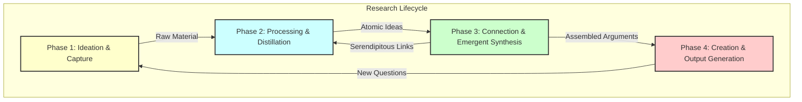

# Extraction Report: Research Project Lifecycle as Implemented Within a Personal Knowledge Base

> [!info] Auto-Generated Report
> This report was automatically generated by `pkb_extractor.py` on 2026-03-13 04:18.
> **Source**: `pkb-report-research-project-lifecycle-as-implemented-within-a-personal-knowledge-base-20251120093250.md` | **Items Extracted**: 118

---

## 📋 Document Overview

| Field | Value |
|-------|-------|
| **Source File** | `pkb-report-research-project-lifecycle-as-implemented-within-a-personal-knowledge-base-20251120093250.md` |
| **Extraction Date** | 2026-03-13 04:18 |
| **Word Count** | 5,819 |
| **Character Count** | 37,587 |
| **Line Count** | 364 |
| **Total Items Extracted** | 118 |

### Document Outline

- # 1.0 📜 INTRODUCTION
- # 2.0 ✒️🏛️ HISTORICAL CONTEXT & FOUNDATIONAL THEORIES
- # **3.0 🔭🔬DEEP EXPOSITION: A MULTI-FACETED ANALYSIS**
  - ## 3.1 ⚛️FOUNDATIONAL PRINCIPLES: THE "WHY"
  - ## 4.0 ⚙️ MECHANISMS AND PROCESSES: THE "HOW"
    - ### 4.1 📥 PHASE 1: IDEATION & CAPTURE (THE "FLEETING" STAGE)
    - ### 4.2 🧠 PHASE 2: PROCESSING & DISTILLATION (THE "LITERATURE" STAGE)
    - ### 4.3 🕸️ PHASE 3: CONNECTION & EMERGENT SYNTHESIS (THE "ZETTELKASTEN" STAGE)
    - ### 4.4 📤 PHASE 4: CREATION & OUTPUT GENERATION (THE "OUTPUT" STAGE)
  - ## 5.0 🔬 OBSERVATIONAL EVIDENCE AND MANIFESTATIONS: THE "WHAT"
  - ## 6.0 🌍 BROADER IMPLICATIONS AND SIGNIFICANCE: THE "SO WHAT"
  - ## 7.0 ❔ FRONTIER RESEARCH & UNANSWERED QUESTIONS
  - ## 8.0 🦕 CONCLUSION
  - ## 9.0 🧠 KEY QUESTIONS FOR ACTIVE READING & REFLECTION
  - ## 10.0 📚 REFERENCES

---

## 📊 Extraction Summary

| Item Type | Count |
|-----------|-------|
| Callouts | 25 |
| Code Blocks | 0 |
| Color Spans | 0 |
| Definitions | 0 |
| Embeds | 0 |
| External Links | 3 |
| Footnotes | 17 |
| Headings | 15 |
| Inline Fields | 0 |
| Mermaid Diagrams | 1 |
| Tables | 0 |
| Tags | 0 |
| Wiki Links | 22 |
| **TOTAL** | **118** |

---

## 🔔 Callouts (25)

> [!note] What are Callouts?
> Callouts are `> [!TYPE]` blocks used in Obsidian for structured annotation.
> They carry semantic meaning — definitions, insights, warnings, etc.

### By Type

| Callout Type | Count |
|-------------|-------|
| `[!abstract]` | 1 |
| `[!ask-yourself-this]` | 2 |
| `[!cite]` | 2 |
| `[!connection-ideas]` | 1 |
| `[!counter-argument]` | 1 |
| `[!definition]` | 3 |
| `[!evidence]` | 1 |
| `[!important]` | 1 |
| `[!key-claim]` | 1 |
| `[!pre-read-questions]` | 1 |
| `[!principle-point]` | 3 |
| `[!question]` | 2 |
| `[!quote]` | 4 |
| `[!summary]` | 1 |
| `[!the-purpose]` | 1 |

### Full Callout List

#### 1. [CITE] Untitled *(Line 27)*

> [!cite] Untitled
> **Bibliographic Information**
> - **Source Type**:: AI
> - **Title**:: Report_A-Comprehensive-Modeling-of-the-End-to-End-Research-Project-Lifecycle-as-Implemented-within-a-Personal-Knowledge-Base_🆔20251023024747
> - **Author(s)**:: 🌩️♊URG011_🆔20251020233318
> - **Year**:: 2025
> - **Publisher / Journal**:: ⁉️
> - **Volume / Issue**:: 001
> - **Page(s)**:: 001
> - **URL / DOI**:: <https://gemini.google.com/gem/4a40a40aa594/596d5298d9c05b95>
> - **Date Accessed**:: 2025-10-25

#### 2. [PRE-READ-QUESTIONS] Untitled *(Line 39)*

> [!pre-read-questions] Untitled
> - What is the fundamental flaw in the traditional, linear model of research (e.g., "write a term paper"), and how does a Personal Knowledge Base (Personal Knowledge Base) propose to solve it?
>   - How does the concept of an "atomic note" differ from simple note-taking, and why is this distinction critical for the process of "emergent synthesis"?
>   - What does it mean for a Personal Knowledge Base to be an "engine for synthesis" rather than just a "container for information"?
>   - In this model, what is the methodological relationship between "literature capture" (reading) and "final output generation" (writing)?
>   - What role does "serendipity" play in a structured research lifecycle, and how can a Personal Knowledge Base be engineered to promote it?

#### 3. [ABSTRACT] Untitled *(Line 49)*

> [!abstract] Untitled
> This document provides a comprehensive methodological model of the end-to-end research project lifecycle as it is transformed by implementation within a modern Personal Knowledge Base (Personal Knowledge Base). We will deconstruct the traditional, linear "project-based" model of research and contrast it with a dynamic, cyclical, and "knowledge-based" framework. The central thesis is that a Personal Knowledge Base, when properly utilized, is not a passive repository for information but an active, agentic partner in the research process. It functions as an "exobrain" that fundamentally alters the progression from initial ideation to final output.
> 
> We will explore the four primary phases of this lifecycle: **1) Ideation & Capture**, **2) Processing & Distillation**, **3) Connection & Emergent Synthesis**, and **4) Creation & Output Generation**. The analysis will detail the foundational principles (e.g., atomicity, dense linking, emergence) that empower this system and the specific mechanisms (e.g., fleeting notes, evergreen notes, Maps of Content) that execute it. By charting this methodological progression, we demonstrate how a PKB-driven lifecycle moves the researcher from the "tyranny of the blank page" to a state of continuous, emergent discovery, where final outputs are not "created" from scratch but "assembled" from a mature, pre-existing network of interconnected thoughts.

#### 4. [QUOTE] Untitled *(Line 57)*

> [!quote] Untitled
> "We are drowning in information, while starving for wisdom. The world henceforth will be run by synthesizers, people able to put together the right information at the right time, think critically about it, and make important choices wisely."
> — E.O. Wilson

#### 5. [THE-PURPOSE] Untitled *(Line 61)*

> [!the-purpose] Untitled
> The purpose of this article is to provide a deep, methodological explanation of the modern research lifecycle, modeled not as a series of discrete projects but as a continuous, integrated process facilitated by a Personal Knowledge Base (Personal Knowledge Base). For generations, the "research project" has been framed as a linear, finite task: you receive a topic, you gather resources, you synthesize them in your head, you write a manuscript, and then you are "done," often discarding the intellectual scaffolding built along the way. This model is inefficient, stressful, and fundamentally misaligned with how genuine understanding is cultivated.
> 
> We stand today at a methodological crossroads, enabled by digital tools like Obsidian, Roam Research, and TiddlyWiki. These are not mere "note-taking apps"; they are platforms for implementing a new way of *thinking*. They allow us to execute a research lifecycle that is cyclical, emergent, and cumulative. This article will frame this new methodology as a formal "system" to be analyzed. We will deconstruct its core principles, detail its operational mechanisms, and explore its profound implications for anyone who thinks for a living. The goal is to move beyond "how to use a tool" and establish a rigorous framework for "how to *think with* a tool," transforming your Personal Knowledge Base from a digital filing cabinet into a true partner in discovery.

#### 6. [ASK-YOURSELF-THIS] Untitled *(Line 93)*

> [!ask-yourself-this] Untitled
> - **How did the historical development of this idea shape our current understanding?**
>       - It shows that our "modern" Personal Knowledge Base problem is not modern at all. Vannevar Bush defined the *problem* (information overload, need for associative thinking) in 1945. Niklas Luhmann provided the *methodological solution* (atomicity, linking, emergence) in the 1970s. Modern tools like Obsidian provided the *technological platform* that finally made this solution frictionless and scalable for everyone. Our current understanding is a synthesis of all three.
>   - **Are there any abandoned theories that are as interesting as the current one?**
>       - The primary "abandoned theory" is the *hierarchical, folder-based filing system* (e.g., the Dewey Decimal System, or your "My Documents" folder). It was abandoned *as a primary organizational tool* for *ideas* (though it's still fine for *projects* and *resources*) because it is too rigid. A note about "quantum physics" and its relation to "Buddhist philosophy" can only *live* in one folder ("Physics" or "Philosophy"), breaking the very connection that makes the idea interesting. The current linking-based model replaced this "one-to-one" paradigm with a "many-to-many" network.

#### 7. [PRINCIPLE-POINT] Untitled *(Line 108)*

> [!principle-point] Untitled
> **Core Principle 1: ⚛️ Atomicity (The Unit of Thought)**
> 
> The bedrock of the entire system is the **atomic note**. This is a principle borrowed directly from Luhmann: *one note should contain one idea, and one idea only*. [^2] This "idea" can be a single definition, a quote with your analysis, a summary of an argument, or a fleeting personal insight.
> 
> This principle is non-negotiable, for one simple reason: **modularity**.
> 
> An atomic note is a "single-purpose tool." A long note that contains thoughts on *five* different topics is a "multi-tool." It might seem efficient, but it's functionally useless. You cannot *link* to "idea \#3" buried in that long note. You cannot *reassemble* that note into a new argument, because it's hopelessly entangled with four other ideas.
> 
> An atomic note, by contrast, is a "Lego brick." It is a discrete, modular, and self-contained unit of thought. It can be linked to from *anywhere* and re-used in *any number* of future contexts (outlines, MOCs, manuscripts) without needing to be broken down. This "separating" of a "hot, chaotic, and undifferentiated" stream of consciousness into "cool" atomic units is the foundational act of building structure.

#### 8. [DEFINITION] Untitled *(Line 120)*

> [!definition] Untitled
> **Atomic Note (or "Evergreen Note"):** A self-contained, concept-oriented note that is written in your own words and explicitly linked to other notes in the Personal Knowledge Base. Its title is often a full-sentence summary of the claim it makes (e.g., "Atomic notes enable modular remixing of ideas"). It is the fundamental building block of a Personal Knowledge Base. [^4]

#### 9. [PRINCIPLE-POINT] Untitled *(Line 124)*

> [!principle-point] Untitled
> **Core Principle 2: 🔗 Dense Linking (The Network of Thought)**
> 
> If atomicity creates the "nodes" of your exobrain, linking creates the "edges" or *synapses*. The system's intelligence does not reside *in* the notes themselves, but in the *connections between them*. A Personal Knowledge Base without links is a morgue of dead ideas; a Personal Knowledge Base *with* links is a living, growing ecosystem.
> 
> This is the execution of Vannevar Bush's "associative trails." [^1] In a modern Personal Knowledge Base, this is achieved with `[[Wiki-Links]]`. As you process a new idea (e.g., on "telephoto compression"), you explicitly ask, "What does this relate to that I already know?" You might link it to `[[Focal Length]]`, `[[Perspective]]`, and `[[Compositional Storytelling]]`.
> 
> Crucially, these tools provide **bidirectional links** (or "backlinks"). When you look at your `[[Perspective]]` note, you *see* a list of all the *other* notes that link *to* it. This is a mechanism for *serendipity*. You might be reviewing your `[[Perspective]]` note and discover that, six months ago, you linked to it from a note on "Cubist painting." This sparks a new, emergent idea that you would *never* have had in a linear, folder-based system. The Personal Knowledge Base *surfaces* connections you have forgotten, acting as a "serendipity engine."

#### 10. [PRINCIPLE-POINT] Untitled *(Line 134)*

> [!principle-point] Untitled
> **Core Principle 3: 🌱 Emergence over Planning (The Growth of Thought)**
> 
> This is the most profound philosophical shift. In the traditional model, you *plan* a project. You create a rigid outline (your "top-down" structure) and then "fill in the blanks." This is brittle. If your research leads you in a new direction, your entire structure breaks.
> 
> The Personal Knowledge Base model is **bottom-up**. You do not start with a grand plan. You start by cultivating *individual* atomic notes. You focus on the "local" connections between ideas. Over time, as these clusters of notes grow, "structures of understanding are built". You will notice a dense cluster of notes forming around a particular concept. This cluster *is* your "chapter." You can then create a "Map of Content" (MOC) note to simply *list* and *organize* these links, and a "bottom-up" outline has *emerged* from the work you were already doing.
> 
> This frees the researcher from the "tyranny of the outline." You follow your curiosity, trusting that the structure will reveal itself (emerge) from the network of connections you are building. You are not an "architect" with a fixed blueprint; you are a "gardener" cultivating a patch of land, and the "final output" is the harvest.

#### 11. [QUOTE] Untitled *(Line 144)*

> [!quote] Untitled
> "The lens does not change perspective; your feet do. The lens simply changes your field of view from the perspective you have chosen."
> 
> > [!analogy]
> > This quote from photography is a perfect analogy for this principle. In the old model, the "outline" is your fixed "lens." You stand in one spot and zoom in and out, forced to work with one perspective. In the Personal Knowledge Base model, your "feet" are your "links." You move *physically* (intellectually) around the "landscape of ideas", finding the most compelling "perspective" (the emergent argument) *first*. The "final output" is simply the "focal length you choose to frame that story".

#### 12. [DEFINITION] Untitled *(Line 176)*

> [!definition] Untitled
> **Fleeting Note:** A quick, temporary capture of an idea. It can be a thought in the shower, a quote from a podcast, or a margin note in a book. Its *only* purpose is to act as a reminder to be processed later. It is "garbage" until it is processed.

#### 13. [DEFINITION] Untitled *(Line 224)*

> [!definition] Untitled
> **Map of Content (MOC):** A MOC is not a "folder." It is a *note* whose *sole purpose* is to *curate and structure links* to other notes on a high-level topic. It is a "table of contents" that you build *bottom-up* as you see clusters of notes emerging. For example, you might create a `[[Photography MOC]]` that links to your notes on `[[Perspective]]`, `[[Focal Length]]`, `[[The Philosophy of the Tripod]]`, and `[[Pre-visualization]]`.

#### 14. [EVIDENCE] Untitled *(Line 248)*

> [!evidence] Untitled
> The primary historical evidence is the "Luhmann-Productivity Paradox." How could one man, **Niklas Luhmann**, with 1970s technology (paper slips and cabinets), generate a body of work so vast and interconnected that it rivals the output of entire university departments? [^2, 3] The answer is that he *never* started from zero. Every book and article was an *emergence* from his Zettelkasten. He was in a constant state of "Phase 3" (Synthesis), and "Phase 4" (Creation) was a relatively trivial act of assembly. The *system* was the engine of his productivity.

#### 15. [KEY-CLAIM] Untitled *(Line 252)*

> [!key-claim] Untitled
> Based on the evidence, a key claim is that: **This methodology shifts the primary goal of research from *producing a project* to *building an exobrain*.** The final outputs (articles, books, reports) become a *by-product* of a richer, more important goal: the cultivation of a personal, external, and interconnected network of understanding.

#### 16. [CONNECTION-IDEAS] Untitled *(Line 269)*

> [!connection-ideas] Untitled
> The principles discussed here strongly connect to the field of [[Cognitive-Science|Cognitive Science]]. Specifically, the idea of a Personal Knowledge Base as an "exobrain" is a practical application of **[[Extended Cognition (EC)]]**. The EC thesis, championed by philosophers Andy Clark and David Chalmers, argues that the "mind" is not "brain-bound." [^5] Our cognitive tools—a notepad, a calculator, or a Personal Knowledge Base—are not just *aids* to thought; they are *literal parts* of our cognitive process. When you "follow a trail" of links in your Obsidian vault, your *mind* is "thinking" using a loop that runs from your biological brain, through your fingers on the keyboard, onto the screen (the externalized "memory" and "processor"), and back through your eyes to your brain. This methodology is, in essence, a "how-to" guide for *building* a more powerful, extended mind.

#### 17. [COUNTER-ARGUMENT] Untitled *(Line 275)*

> [!counter-argument] Untitled
> An important counter-argument suggests that this entire process is just a sophisticated form of **"digital hoarding"** or **"procrasti-linking."** Critics argue that practitioners spend more time *tinkering* with the *system* (managing plugins, refining MOCs, "gardening" links) than doing "real work" (i.e., producing "Phase 4" outputs).
> 
> This is important because it highlights the *primary failure mode* of this system. This critique is *absolutely valid* if the user becomes obsessed with the *tool* and forgets the *method*. A Personal Knowledge Base full of copy-pasted, unprocessed, and un-linked highlights (a "Phase 1" junkyard) is *worse* than no system at all. The entire value of the lifecycle is contingent on the difficult, daily, intellectual labor of **"Phase 2" (Processing)** and **"Phase 3" (Connecting)**. The system is a "gym for your mind"; owning a membership (the software) does nothing if you don't do the "reps" (the processing).

#### 18. [QUOTE] Untitled *(Line 281)*

> [!quote] Untitled
> "This forced pause is perhaps the tripod's greatest, though least tangible, gift... It transforms you from a reactive snapshot-taker into a proactive, methodical creator."
> 
> This, from the exemplar on photography, is the *perfect* philosophical summation. The traditional research model makes you a "reactive snapshot-taker"—you frantically gather sources for a deadline. The Personal Knowledge Base lifecycle *is* the "tripod." It is a "deliberate declaration of intent". The "forced pause" of Phase 2 and Phase 3 is the "ritual" that compels you to study the scene, to ask deeper questions, and to "notice the subtle relationships between elements", transforming you into a "proactive, methodical creator."

#### 19. [QUESTION] Untitled *(Line 303)*

> [!question] Untitled
> - **What is the single biggest unanswered question in this field right now?**
>       - The biggest question is the **"AI-Cognition Trade-off."** How do we integrate powerful AI agents to *augment* the Personal Knowledge Base lifecycle (e.g., handling rote summarization, finding novel connections) *without* "outsourcing" the very cognitive labor (processing, synthesizing) that creates human understanding in the first place? Finding the "sweet spot" between AI augmentation and cognitive "atrophy" is the defining challenge for the next generation of knowledge work.

#### 20. [SUMMARY] Untitled *(Line 312)*

> [!summary] Untitled
> We have deconstructed the research lifecycle, charting its evolution from Vannevar Bush's "Memex" and Niklas Luhmann's "Zettelkasten" to the modern, tool-driven Personal Knowledge Base. We have moved past the "what" (the software) and modeled the "how" (the methodology) and the "why" (the principles).
> 
> The traditional, linear "project" model is shown to be a brittle, inefficient relic. The PKB-driven lifecycle, by contrast, is a robust, cyclical, and continuous process of "knowledge cultivation." It is built on the foundational principles of **Atomicity** (Lego-like ideas), **Dense Linking** (a network of thought), and **Emergence** (bottom-up discovery).
> 
> We modeled this lifecycle as a four-phase engine: **1) Capture** (raw ideas), **2) Process** (atomic notes), **3) Connect** (the emergent web), and **4) Create** (effortless assembly). The "final output" is revealed to be a mere *by-product* of the true, primary goal: the construction of an "exobrain." This methodology is not just a "productivity system"; it is a "declaration of intent" to engage with information deeply, a "forced pause" that transforms us from "passive documentarians" into "active authors" of our own understanding.

#### 21. [ASK-YOURSELF-THIS] Untitled *(Line 324)*

> [!ask-yourself-this] Untitled
> - **How would I explain the central idea of this article to someone with no background in this field? (The Feynman Technique)**
>       - Imagine your brain is a kitchen. The "old" way of research is like going to the store with one specific, complicated recipe (the "project"), buying *only* those ingredients, and making the dish. When you're done, the kitchen is empty again. The "new" (Personal Knowledge Base) way is to "garden." Every time you find a cool ingredient (an idea), you don't just use it; you *plant* it in your garden (Phase 2). You "process" it. Then, you build "connections" between your plants (Phase 3), noticing that "tomatoes and basil grow well together." You do this *every day*. Now, when you need to "make a dish" (the "output"), you don't go to the store. You just "shop" your own garden, which is already full of mature, interconnected ingredients. You just *assemble* them. The "dishes" (articles, books) become an easy, natural *by-product* of just "tending your garden."
>   - **What was the most surprising or counter-intuitive concept presented? Why?**
>       - The most counter-intuitive idea is likely "Emergence over Planning" (Principle 3) and the idea that the "final output" is the *easiest* step (Phase 4). We are trained our whole lives to *start* with the outline and the "blank page," which is the hardest part. The idea that you should *never* start with an outline—that you should instead "play" with atomic ideas and links until an outline *reveals itself* (emerges)—is a complete inversion of the traditional creative process.
>   - **What pre-existing knowledge did this article connect with or challenge for me?**
>       - This article directly challenges the "project-based" or "deadline-based" mindset that most of us learned in school and practice at work. It reframes "research" as something you do *continuously*, not in "bursts." It connects with the pre-existing knowledge that "cramming" for a test (the linear model) leads to poor long-term retention, while "spaced repetition" and "building connections" (the Personal Knowledge Base model) lead to true, lasting understanding.

#### 22. [QUOTE] Untitled *(Line 333)*

> [!quote] Untitled
> "You are not separate from the universe, looking in. You are a part of it, looking out."
> 
> > [!analogy]
> > This quote from the cosmology exemplar serves as a final, profound analogy. In the old model, *you* are "separate from" your research, "looking in" at a pile of sources. In the Personal Knowledge Base model, your mind and your "exobrain" *become* the "universe" of your knowledge. You are not an outside observer; you are "a part of it," and your "final outputs" are simply that system "looking out" and reporting what it has learned.

#### 23. [IMPORTANT] Untitled *(Line 339)*

> [!important] Untitled
> Identify three key terms or concepts from this article. Write your own definition for each and create a new note to link them back to this one.
> 
> 1.  `[[Zettelkasten]]`
> 1.  `[[Emergent Synthesis]]`
> 1.  `[[Atomic Note (Evergreen Note)]]`

#### 24. [QUESTION] Untitled *(Line 347)*

> [!question] Untitled
> - **What is one question I still have after reading this? Where might I look for an answer?**
>       - **Question:** This article perfectly models the *solo* researcher's lifecycle. But how does this entire "PKB-driven" methodology scale for *teams*? How do you manage a "collaborative Zettelkasten" when "my" connections and "my" atomic notes (written in *my* words) might not make sense to a colleague? What are the "social protocols" for a "shared exobrain"?
>       - **Answer:** I would look for an answer by researching "multi-player Personal Knowledge Base," "collaborative knowledge management," and "team-based Zettelkasten." I would investigate how tools like Notion (which is team-native) or Obsidian's "Shared Vaults" are being used in practice by research labs or companies.

#### 25. [CITE] Untitled *(Line 355)*

> [!cite] Untitled
> **Source Files Provided:**
> 
> : User-provided file. (2025, October 20). *AI-Note\_Exemplars-for-LLMs\_🆔20251020184551.md*.
> 
> : User-provided file. (2025, October 20). *AI-Note\_Callout-List-for-AI\_🆔20251020191122.md*.
> 
> : User-provided file. (2025, October 21). *URG011-Exemplar-of-a-report.md*.

---

## 🔗 Wiki-Links (22 total, 15 unique targets)

> [!info] Knowledge Graph Connections
> These links represent connections to other notes in your PKB.
> **15** distinct notes are referenced.

### Unique Targets

- [[Article - The PKB Research Lifecycle]]
- [[Atomic Note (Evergreen Note)]]
- [[Cognitive-Science|Cognitive Science]]
- [[Composition]]
- [[Compositional Storytelling]]
- [[Emergent Synthesis]]
- [[Extended Cognition (EC)]]
- [[Focal Length]]
- [[New Idea]]
- [[Perspective]]
- [[Photography MOC]]
- [[Pre-visualization]]
- [[The Philosophy of the Tripod]]
- [[Wiki-Links]]
- [[Zettelkasten]]

### All Occurrences

| # | Target | Display Text | Heading | Section | Line |
|---|--------|-------------|---------|---------|------|
| 1 | [[Wiki-Links]] | — | — | 3.1 ⚛️FOUNDATIONAL PRINCIPLES: THE "WHY" | 130 |
| 2 | [[Focal Length]] | — | — | 3.1 ⚛️FOUNDATIONAL PRINCIPLES: THE "WHY" | 130 |
| 3 | [[Perspective]] | — | — | 3.1 ⚛️FOUNDATIONAL PRINCIPLES: THE "WHY" | 130 |
| 4 | [[Compositional Storytelling]] | — | — | 3.1 ⚛️FOUNDATIONAL PRINCIPLES: THE "WHY" | 130 |
| 5 | [[Perspective]] | — | — | 3.1 ⚛️FOUNDATIONAL PRINCIPLES: THE "WHY" | 132 |
| 6 | [[Perspective]] | — | — | 3.1 ⚛️FOUNDATIONAL PRINCIPLES: THE "WHY" | 132 |
| 7 | [[New Idea]] | — | — | 4.3 🕸️ PHASE 3: CONNECTION & EMERGENT... | 212 |
| 8 | [[New Idea]] | — | — | 4.3 🕸️ PHASE 3: CONNECTION & EMERGENT... | 215 |
| 9 | [[New Idea]] | — | — | 4.3 🕸️ PHASE 3: CONNECTION & EMERGENT... | 216 |
| 10 | [[Perspective]] | — | — | 4.3 🕸️ PHASE 3: CONNECTION & EMERGENT... | 216 |
| 11 | [[Composition]] | — | — | 4.3 🕸️ PHASE 3: CONNECTION & EMERGENT... | 216 |
| 12 | [[Photography MOC]] | — | — | 4.3 🕸️ PHASE 3: CONNECTION & EMERGENT... | 226 |
| 13 | [[Perspective]] | — | — | 4.3 🕸️ PHASE 3: CONNECTION & EMERGENT... | 226 |
| 14 | [[Focal Length]] | — | — | 4.3 🕸️ PHASE 3: CONNECTION & EMERGENT... | 226 |
| 15 | [[The Philosophy of the Tripod]] | — | — | 4.3 🕸️ PHASE 3: CONNECTION & EMERGENT... | 226 |
| 16 | [[Pre-visualization]] | — | — | 4.3 🕸️ PHASE 3: CONNECTION & EMERGENT... | 226 |
| 17 | [[Article - The PKB Research Lifecycle]] | — | — | 4.4 📤 PHASE 4: CREATION & OUTPUT GENE... | 235 |
| 18 | [[Cognitive-Science|Cognitive Science]] | — | — | 6.0 🌍 BROADER IMPLICATIONS AND SIGNIF... | 271 |
| 19 | [[Extended Cognition (EC)]] | — | — | 6.0 🌍 BROADER IMPLICATIONS AND SIGNIF... | 271 |
| 20 | [[Zettelkasten]] | — | — | 9.0 🧠 KEY QUESTIONS FOR ACTIVE READIN... | 343 |
| 21 | [[Emergent Synthesis]] | — | — | 9.0 🧠 KEY QUESTIONS FOR ACTIVE READIN... | 344 |
| 22 | [[Atomic Note (Evergreen Note)]] | — | — | 9.0 🧠 KEY QUESTIONS FOR ACTIVE READIN... | 345 |

---

## 🌐 External Links (3)

| # | Display Text | URL | Line |
|---|-------------|-----|------|
| 1 | https://notes.andymatuschak.org/Evergreen\_notes | https://notes.andymatuschak.org/Evergreen_notes | 381 |
| 2 | https://gemini.google.com/gem/4a40a40aa594/596d... | https://gemini.google.com/gem/4a40a40aa594/596d5298d9c05b95 | 36 |
| 3 | https://notes.andymatuschak.org/Evergreen\_notes | https://notes.andymatuschak.org/Evergreen\_notes | 381 |

---

## 📐 Mermaid Diagrams (1)

### Diagram 1 — graph *(Line 156)*

---

## 📝 Footnotes (5 definitions, 12 references)

### Footnote Definitions

- **[^1]**: Bush, V. (1945). As We May Think. *The Atlantic Monthly*. *(Line 367)*
- **[^2]**: Ahrens, S. (2017). *How to Take Smart Notes: One Simple Technique to Boost Writing, Learning and Thinking*. CreateSpace Independent Publishing Platform. *(Line 371)*
- **[^3]**: Luhmann, N. (1992). Communicating with Slip Boxes: An Empirical Account. (Translated by M. Kuehn). *Sociologica*. *(Line 375)*
- **[^4]**: Matuschak, A. (n.d.). *Evergreen notes*. Andy's Working Notes. Retrieved from [https://notes.andymatuschak.org/Evergreen\_notes](https://notes.andymatuschak.org/Evergreen_notes) *(Line 379)*
- **[^5]**: Clark, A., & Chalmers, D. (1998). The Extended Mind. *Analysis*, 58(1), 7-19. *(Line 383)*

---

## 🕸️ Knowledge Graph Analysis

### Unique Wiki-Link Targets (15)

> These represent all distinct notes referenced in the source document.
> Each is a candidate for backlink creation in your PKB.

- [[Article - The PKB Research Lifecycle]]
- [[Atomic Note (Evergreen Note)]]
- [[Cognitive-Science|Cognitive Science]]
- [[Composition]]
- [[Compositional Storytelling]]
- [[Emergent Synthesis]]
- [[Extended Cognition (EC)]]
- [[Focal Length]]
- [[New Idea]]
- [[Perspective]]
- [[Photography MOC]]
- [[Pre-visualization]]
- [[The Philosophy of the Tripod]]
- [[Wiki-Links]]
- [[Zettelkasten]]

---

## 📁 Raw Data

> [!abstract] JSON File Available
> The full machine-readable extraction is saved alongside this report as:
> `pkb-report-research-project-lifecycle-as-implemented-within-a-personal-knowledge-base-20251120093250_extracted.json`

---

*Report generated by `pkb_extractor.py v1.1.0` · 2026-03-13 04:18:46*