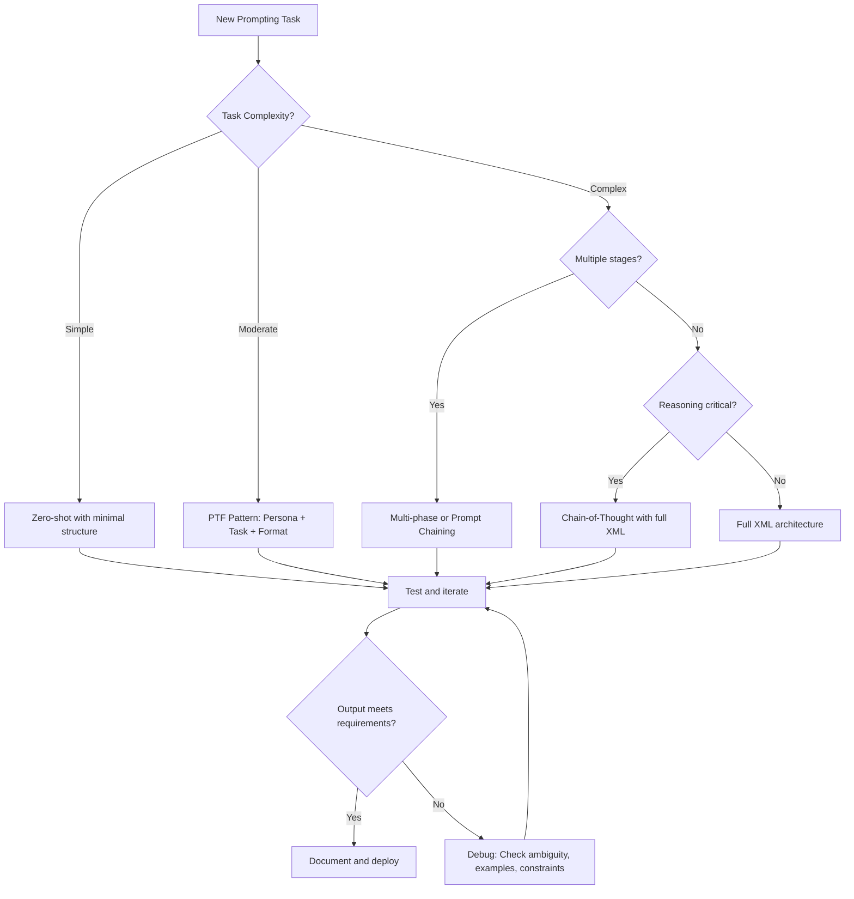

# Extraction Report: Claude AI: Comprehensive Reference & Prompt Engineering Mastery

> [!info] Auto-Generated Report
> This report was automatically generated by `pkb_extractor.py` on 2026-03-13 04:18.
> **Source**: `reference-comprehensive-claude-prompt-engineering-mastery-202511100.md` | **Items Extracted**: 530

---

## 📋 Document Overview

| Field | Value |
|-------|-------|
| **Source File** | `reference-comprehensive-claude-prompt-engineering-mastery-202511100.md` |
| **Extraction Date** | 2026-03-13 04:18 |
| **Word Count** | 14,974 |
| **Character Count** | 118,303 |
| **Line Count** | 3,358 |
| **Total Items Extracted** | 530 |

### Document Outline

- # 🤖 Claude AI: Comprehensive Reference & Prompt Engineering Mastery
  - ## 📑 Table of Contents
  - ## 🧬 Claude Fundamentals: Architecture & Capabilities
    - ### The Claude Model Family
    - ### Core Capabilities Matrix
    - ### Technical Specifications
    - ### Knowledge Cutoff & Real-Time Limitations
  - ## 🎯 Prompt Engineering Theory for Claude
    - ### Foundational Principles
    - ### The Cognitive Architecture of a Prompt
    - ### Prompt Taxonomy: Categories of Prompting Approaches
    - ### Comparative Analysis of Prompting Paradigms
  - ## 📐 Core Prompting Components: Optimal Phrasing
    - ### 🎭 Persona/Role Definition
    - ### 🎯 Task/Objective Definition
    - ### 🌍 Context/Background Information
    - ### 📋 Instructions/Procedure
    - ### 📤 Output Format/Structure
  - ## Summary
  - ## Key Findings
  - ## Recommendations
  - ## Next Steps
    - ### 📚 Examples/Demonstrations
    - ### 🚫 Constraints/Boundaries
    - ### ✨ Tone/Style Specification
    - ### 🎯 Success Criteria/Evaluation
    - ### 🔧 Thinking/Reasoning Instructions
  - ## 🏗️ XML Architecture: Claude's Structural Preference
    - ### Why XML Works for Claude
    - ### Tag Naming Conventions
    - ### Nesting and Hierarchy Best Practices
    - ### Attribute Usage
    - ### Complete XML Prompt Architecture Template
  - ## ⚙️ Working Methodologies: Systematic Approaches
    - ### The IDEA Framework: Iterative Development for Effective Agents
  - ## Requirements Analysis
  - ## Iteration Log
    - ### Iteration 1
    - ### The Chain-of-Thought Prompting Pattern
  - ## Step 1: Problem Analysis
  - ## Step 2: Information Gathering
  - ## Step 3: Reasoning
  - ## Step 4: Self-Check
  - ## Step 5: Final Answer
    - ### The Persona-Task-Format (PTF) Pattern
  - ## Endpoint Overview
  - ## Authentication
  - ## Request Parameters
  - ## Response Format
  - ## Error Handling
  - ## Code Examples
  - ## Rate Limiting
  - ## Common Issues
    - ### The Example-Driven Pattern
    - ### Prompt Versioning and Management
- # Prompt Testing Log: [Prompt Name]
  - ## Version 2.1 Testing (2025-11-10)
    - ### Test 1: Standard Case
    - ### Test 2: Edge Case (Missing Data)
    - ### Test 3: Complex Input
    - ### Summary
  - ## 🎓 Advanced Techniques: Pattern Library
    - ### Multi-Stage Prompting with Explicit Phase Transitions
    - ### Self-Critique and Iterative Refinement
    - ### Constrained Generation with Negative Examples
    - ### Dynamic Adaptation Based on Input Characteristics
    - ### Meta-Prompting: Claude Helps Write Prompts
    - ### Prompt Chaining for Complex Workflows
  - ## ⚠️ Anti-Patterns: Common Pitfalls
    - ### Ambiguity and Implicit Assumptions
    - ### Over-Specification and Constraint Conflict
  - ## Market Overview (150 words)
  - ## Competitive Positioning (200 words)
  - ## Strategic Opportunity (150 words)
    - ### Underutilizing Structure
  - ## Security Issues
  - ## Performance Issues
  - ## Maintainability Issues
  - ## Summary
    - ### Example Misuse
    - ### Persona Inflation
    - ### Reasoning Shortcuts
    - ### Ignoring Claude-Specific Strengths
  - ## 🎯 Synthesis: Mastery Framework
    - ### Cognitive Models for Prompt Design
    - ### Developing Prompt Engineering Intuition
    - ### The Prompt Engineering Skill Ladder
    - ### Practical Wisdom: Dos and Don'ts
    - ### Meta-Skills: Learning to Learn Prompting
  - ## Prompt Experiment Template
  - ## My Prompt Pattern Library
    - ### Pattern: Academic Literature Analysis
  - ## Prompt Debugging Checklist
    - ### Comparative Analysis: When to Use What
    - ### Advanced Optimization: Token Efficiency
    - ### Building a Prompt Engineering Practice
  - ## Prompt Testing Standard
  - ## Prompt Improvement Workflow
    - ### Ethical Considerations in Prompt Engineering
    - ### Future-Proofing Your Prompts
  - ## 📊 Metadata & Attribution
  - ## 🔄 Version History
  - ## 🧠 Cognitive Integration Tools
    - ### Mental Models Summary
    - ### Quick Decision Framework
    - ### Prompt Component Checklist
    - ### Common Task → Optimal Pattern Mapping
    - ### 🔗 Related Topics for PKB Expansion
- # Claude Thinking

---

## 📊 Extraction Summary

| Item Type | Count |
|-----------|-------|
| Callouts | 30 |
| Code Blocks | 112 |
| Color Spans | 0 |
| Definitions | 0 |
| Embeds | 0 |
| External Links | 0 |
| Footnotes | 0 |
| Headings | 109 |
| Inline Fields | 0 |
| Mermaid Diagrams | 1 |
| Tables | 5 |
| Tags | 0 |
| Wiki Links | 68 |
| **TOTAL** | **530** |

---

## 🔔 Callouts (30)

> [!note] What are Callouts?
> Callouts are `> [!TYPE]` blocks used in Obsidian for structured annotation.
> They carry semantic meaning — definitions, insights, warnings, etc.

### By Type

| Callout Type | Count |
|-------------|-------|
| `[!abstract]` | 1 |
| `[!analogy]` | 1 |
| `[!comprehensive-reference]` | 1 |
| `[!core-principle]` | 1 |
| `[!definition]` | 6 |
| `[!how-to-use-this]` | 1 |
| `[!key-claim]` | 4 |
| `[!methodology-and-sources]` | 2 |
| `[!principle-point]` | 3 |
| `[!quick-reference]` | 2 |
| `[!the-philosophy]` | 1 |
| `[!thought-experiment]` | 1 |
| `[!tip]` | 1 |
| `[!use-cases-and-examples]` | 1 |
| `[!warning]` | 4 |

### Full Callout List

#### 1. [COMPREHENSIVE-REFERENCE] 📚 Comprehensive-Reference *(Line 23)*

> [!comprehensive-reference] 📚 Comprehensive-Reference
> - **Generated**:: 2025-11-10
> - **Version**:: 1.0
> - **Type**:: Reference Documentation
> - **Scope**:: Claude AI Architecture, Capabilities, and Prompt Engineering Mastery

#### 2. [ABSTRACT] Untitled *(Line 29)*

> [!abstract] Untitled
> **Executive Overview**
> This reference document provides exhaustive coverage of Claude, Anthropic's family of large language models, with specialized focus on prompt engineering methodologies and optimal interaction patterns. It serves as both a technical specification of Claude's capabilities and a practical guide to extracting maximum utility through sophisticated prompting techniques, with particular emphasis on Claude's XML-based structural preferences and component-oriented prompt architecture.

#### 3. [HOW-TO-USE-THIS] Untitled *(Line 33)*

> [!how-to-use-this] Untitled
> **Navigation Guide**
> This reference note is organized into 8 major sections covering Claude's architecture, prompting theory, specific component optimization, XML structuring, practical methodologies, and advanced techniques. Use the table of contents below for quick navigation, or search for specific terms using [[wiki-links]]. The Component Library (Section 4) serves as a quick-reference lookup for specific prompting elements.

#### 4. [DEFINITION] Untitled *(Line 52)*

> [!definition] Untitled
> - **Key-Term**:: [[04_library/02_pkb-and-pkm-learning/_reference/_official-documentation/_plugin-copilot/_documentation/CLAUDE]]
> - **Definition**:: Claude is a family of large language models (LLMs) developed by [[Anthropic]], designed with an emphasis on [[Constitutional AI]], safety, and helpfulness. Claude models are trained using [[Reinforcement Learning from Human Feedback]] (RLHF) with a constitution of ethical principles, making them particularly adept at nuanced reasoning, following complex instructions, and maintaining contextual awareness over extended conversations.

#### 5. [KEY-CLAIM] Untitled *(Line 66)*

> [!key-claim] Untitled
> **Central Principle of Claude Architecture**
> Claude's design philosophy centers on "[[Constitutional AI]]"—the model is trained not just to be capable, but to be helpful, harmless, and honest according to a predefined set of principles. This makes Claude particularly responsive to structured, principle-based prompting and explicit value alignment in instructions.

#### 6. [THOUGHT-EXPERIMENT] Untitled *(Line 93)*

> [!thought-experiment] Untitled
> **Conceptual Model: Claude as a Reasoning Engine**
> Imagine Claude not as a database of facts, but as a sophisticated reasoning engine that constructs responses by navigating a vast probability space. Each word in your prompt acts as a constraint that narrows this space. Structured prompts with clear XML tags create sharp, well-defined boundaries in this probability landscape, making it easier for Claude to converge on the intended response pattern. This is why explicit structure consistently outperforms implicit structure.

#### 7. [WARNING] Untitled *(Line 99)*

> [!warning] Untitled
> **Critical Constraints**
> Claude's training data has a **knowledge cutoff of January 2025**. The model cannot know about events, publications, or developments occurring after this date without external tools. When users ask about current events, Claude is designed to use [[web search tools]] to supplement its knowledge. This architectural limitation is intentional—it separates "learned knowledge" from "retrieved information," making the model more reliable about the provenance of its responses.

#### 8. [DEFINITION] Untitled *(Line 107)*

> [!definition] Untitled
> - **Key-Term**:: [[Prompt Engineering]]
> - **Definition**:: The systematic practice of designing inputs (prompts) to language models to elicit desired outputs with maximum reliability, specificity, and quality. For Claude specifically, prompt engineering leverages the model's architectural preferences for structure, explicit reasoning, and constitutional alignment to achieve expert-level performance on complex tasks.

#### 9. [KEY-CLAIM] Untitled *(Line 125)*

> [!key-claim] Untitled
> **Central Principle of Claude Prompting**
> Claude responds best to prompts that treat it as a collaborator rather than a black box. Prompts that explicitly structure the task, show the reasoning path, provide examples, and clarify success criteria will consistently outperform minimal or ambiguous prompts by orders of magnitude in quality, reliability, and specificity.

#### 10. [METHODOLOGY-AND-SOURCES] Untitled *(Line 166)*

> [!methodology-and-sources] Untitled
> **Prompt Engineering Methodology**
> 
> **Stage 1: Task Decomposition**
> Begin by breaking complex requests into constituent cognitive operations. What does the model need to *understand*, *analyze*, *generate*, and *validate*?
> 
> **Stage 2: Structural Mapping**
> Map each cognitive operation to a prompt component (context, instructions, examples, constraints). Use XML tags to create clear boundaries between components.
> 
> **Stage 3: Example Integration**
> For any non-trivial task, include at least one high-quality example. Format examples with clear input/output boundaries.
> 
> **Stage 4: Constraint Specification**
> Explicitly state what the model should NOT do, length requirements, style constraints, and success criteria.
> 
> **Stage 5: Iterative Refinement**
> Test prompt, analyze failure modes, add specificity where Claude diverges from intent.

#### 11. [DEFINITION] Untitled *(Line 215)*

> [!definition] Untitled
> - **Key-Term**:: [[Prompt Components]]
> - **Definition**:: Discrete functional elements within a prompt that serve specific cognitive or instructional purposes. Well-engineered prompts assemble these components into a coherent architecture that guides Claude's reasoning and generation process.

#### 12. [TIP] Untitled *(Line 265)*

> [!tip] Untitled
> **Persona Optimization**
> - Be specific about *method* not just *title* ("You analyze code by first understanding data flow, then identifying bottlenecks" vs "You are a code reviewer")
> - Include relevant constraints ("You prefer solutions that don't require new dependencies")
> - Avoid flattery or anthropomorphization ("You are the world's best…" is less effective than specific capability descriptions)

#### 13. [PRINCIPLE-POINT] Untitled *(Line 316)*

> [!principle-point] Untitled
> **Task Clarity Principle**
> The more measurable and specific your task definition, the more reliably Claude can evaluate its own output quality during generation. "Write a good article" is unmeasurable; "Write a 1500-word article that explains X to audience Y using Z framework" is measurable.

#### 14. [KEY-CLAIM] Untitled *(Line 372)*

> [!key-claim] Untitled
> **Context is Constraint**
> Every piece of context you provide narrows the solution space. This is good—it prevents Claude from generating plausible but inappropriate responses. Be especially explicit about what you DON'T want based on past experience.

#### 15. [QUICK-REFERENCE] Untitled *(Line 541)*

> [!quick-reference] Untitled
> **Format Specification Checklist**
> - 🔑 **Specify structure**: Headers, sections, ordering
> - 🔑 **Specify length**: Word/character counts, min/max
> - 🔑 **Specify style**: Tone, voice, person, formality
> - 🔑 **Specify formatting**: Markdown, JSON, code, tables
> - 🔑 **Specify metadata**: What additional fields to include

#### 16. [WARNING] Untitled *(Line 727)*

> [!warning] Untitled
> **Constraint Specificity Matters**
> General constraints like "be careful" or "be accurate" are ineffective. Claude responds best to specific, concrete boundaries: "Do not cite sources that aren't in the provided documents" not "be accurate about sources."

#### 17. [DEFINITION] Untitled *(Line 933)*

> [!definition] Untitled
> - **Key-Term**:: [[XML Prompting]]
> - **Definition**:: The practice of structuring prompts using XML-style tags to create explicit, hierarchical boundaries between prompt components. Claude's architecture is optimized to process these structured inputs with higher fidelity than unstructured prose.

#### 18. [KEY-CLAIM] Untitled *(Line 961)*

> [!key-claim] Untitled
> **XML as Cognitive Scaffolding**
> XML tags function as cognitive scaffolding for Claude's reasoning process. They don't just organize information for humans—they create computational structure that guides how the model's attention mechanism processes and relates different parts of the prompt. This is why XML-structured prompts consistently outperform prose equivalents in complex tasks.

#### 19. [PRINCIPLE-POINT] Untitled *(Line 986)*

> [!principle-point] Untitled
> **Semantic Tag Principle**
> Choose tag names that describe the *semantic function* of the enclosed content, not its importance or position. `<context>` describes function; `<important_stuff>` describes neither function nor structure. Claude's pattern recognition is tuned to semantic meaning.

#### 20. [USE-CASES-AND-EXAMPLES] Untitled *(Line 1214)*

> [!use-cases-and-examples] Untitled
> **When to Use Full XML Architecture**
> 
> Use comprehensive XML structuring for:
> - Complex multi-stage tasks with distinct phases
> - Tasks requiring strict output format compliance
> - Situations where different components need different treatment
> - Production prompts that will be reused frequently
> 
> Simple tasks with 1-2 components can use minimal XML or even prose. The key is proportionality—structure should match complexity.

#### 21. [DEFINITION] Untitled *(Line 1229)*

> [!definition] Untitled
> - **Key-Term**:: [[Prompting Methodology]]
> - **Definition**:: A systematic, repeatable process for designing, testing, and refining prompts to achieve consistent, high-quality results. Methodologies transform prompt engineering from ad-hoc experimentation to engineering discipline.

#### 22. [PRINCIPLE-POINT] Untitled *(Line 1464)*

> [!principle-point] Untitled
> **Chain-of-Thought Universality**
> CoT is not just for mathematical problems. It improves quality across domains: content analysis, strategic planning, code review, creative writing, ethical reasoning, and more. The visible reasoning also makes Claude's logic auditable and correctable.

#### 23. [DEFINITION] Untitled *(Line 1663)*

> [!definition] Untitled
> - **Key-Term**:: [[Advanced Prompting Techniques]]
> - **Definition**:: Sophisticated patterns and strategies that leverage Claude's architecture for complex, multi-stage, or highly specialized tasks. These techniques combine basic components in novel ways to achieve expert-level performance.

#### 24. [WARNING] Untitled *(Line 2160)*

> [!warning] Untitled
> **Purpose of This Section**
> Even well-intentioned prompting can fail due to common mistakes. Understanding anti-patterns prevents wasted effort and improves prompt reliability. This section catalogs frequent failures with explanations and corrections.

#### 25. [THE-PHILOSOPHY] Untitled *(Line 2564)*

> [!the-philosophy] Untitled
> **Underlying Philosophy of Claude Prompting**
> 
> Effective Claude prompting reflects a partnership model rather than a command-and-control paradigm. Claude is not a database to query or a tool to command, but a reasoning engine to guide. The most effective prompts establish clear goals, provide necessary context, demonstrate desired patterns, specify constraints, and then trust Claude's capabilities to execute.
> 
> This philosophy emerges from Claude's [[Constitutional AI]] training, which cultivates helpfulness, harmlessness, and honesty as core values. Prompts that align with these values—that clarify intent, acknowledge limitations, and explicitly request reasoning—produce consistently superior results.

#### 26. [ANALOGY] Untitled *(Line 2605)*

> [!analogy] Untitled
> **Illuminating Comparison: Prompt as Musical Score**
> 
> A musical score doesn't contain the actual music—it contains instructions that skilled musicians interpret to produce music. Similarly, a prompt doesn't contain the output—it contains instructions that Claude interprets to produce output.
> 
> - **Too vague** (like writing only "play something happy"): Results vary wildly
> - **Too prescriptive** (like specifying every finger movement): Stifles the performer's skill
> - **Well-crafted** (like a good composition): Provides structure, shows patterns, allows interpretation within boundaries
> 
> Master prompters write "scores" that leverage Claude's capabilities while providing clear direction.

#### 27. [QUICK-REFERENCE] Untitled *(Line 2698)*

> [!quick-reference] Untitled
> **Claude Prompting Dos**
> 
> - ✅ **Use XML structure** for any non-trivial task
> - ✅ **Request visible reasoning** for complex problems (Chain-of-Thought)
> - ✅ **Provide high-quality examples** when format or style matters
> - ✅ **Specify output format explicitly** with templates or schemas
> - ✅ **State constraints negatively** (what NOT to do) when boundaries matter
> - ✅ **Define success criteria** that Claude can self-evaluate against
> - ✅ **Use personas** to activate domain expertise and set approach
> - ✅ **Include context** about audience, goals, and constraints
> - ✅ **Break complex tasks** into explicit phases
> - ✅ **Iterate and refine** based on actual outputs
> - ✅ **Version your prompts** and track what works

#### 28. [WARNING] Untitled *(Line 2713)*

> [!warning] Untitled
> **Claude Prompting Don'ts**
> 
> - ❌ **Don't assume shared context** – make everything explicit
> - ❌ **Don't use contradictory constraints** – ensure compatibility
> - ❌ **Don't use superlative flattery** in personas – focus on method
> - ❌ **Don't provide low-quality examples** – they set the quality bar
> - ❌ **Don't rely on implicit structure** – use XML for clarity
> - ❌ **Don't skip reasoning requests** for complex tasks
> - ❌ **Don't create ambiguous instructions** – be specific
> - ❌ **Don't ignore Claude's preferences** – XML, CoT, and constitutional alignment
> - ❌ **Don't overload single prompts** – use chaining for very complex workflows
> - ❌ **Don't forget to specify length constraints** when output size matters
> - ❌ **Don't test once and assume success** – validate across multiple inputs

#### 29. [METHODOLOGY-AND-SOURCES] Untitled *(Line 3161)*

> [!methodology-and-sources] Untitled
> **Research Methodology**
> 
> This reference document was compiled through:
> 
> **Primary Sources**:
> - Anthropic's official documentation on Claude capabilities and prompt engineering
> - Claude API documentation and developer resources
> - Constitutional AI research papers and technical specifications
> - Direct interaction with Claude across multiple versions
> 
> **Synthesis Approach**:
> - Systematic analysis of successful prompting patterns
> - Comparative evaluation of different prompting methodologies
> - Integration of general [[Prompt Engineering]] principles with Claude-specific optimizations
> - Practical testing and validation of recommended techniques
> 
> **Confidence Levels**:
> - **High Confidence**: Core architectural details, XML preferences, Chain-of-Thought effectiveness (extensively documented and validated)
> - **Medium Confidence**: Specific optimal phrasing patterns (based on practical experience but may have individual variation)
> - **Evolving**: Future model behavior predictions (models continue to improve, requiring periodic reassessment)

#### 30. [CORE-PRINCIPLE] Untitled *(Line 3195)*

> [!core-principle] Untitled
> **Three Core Principles for Claude Mastery**
> 
> 1. **Structure Enhances Reasoning**: XML tags aren't just organization—they're cognitive scaffolding that guides Claude's attention mechanism and reasoning process
> 
> 2. **Explicit Over Implicit**: Claude's Constitutional AI training makes it exceptional at following explicit instructions but less reliable at inferring implicit intent
> 
> 3. **Show the Path**: Chain-of-Thought reasoning improves quality across all domains by making reasoning visible and therefore correctable

---

## 🔗 Wiki-Links (68 total, 56 unique targets)

> [!info] Knowledge Graph Connections
> These links represent connections to other notes in your PKB.
> **56** distinct notes are referenced.

### Unique Targets

- [[04_library/02_pkb-and-pkm-learning/_reference/_official-documentation/_plugin-copilot/_documentation/CLAUDE]]
- [[AI capabilities]]
- [[Advanced Prompting Techniques]]
- [[Advanced XML Architectures for Complex Workflows]]
- [[Analysis & Synthesis]]
- [[Anthropic]]
- [[Anthropic API Integration Patterns]]
- [[Anthropic Claude]]
- [[Attention Mechanisms in Transformer Architecture]]
- [[Bias Detection and Mitigation in LLM Outputs]]
- [[Byte-Pair Encoding and Tokenization Strategies]]
- [[Chain-of-Thought]]
- [[Chain-of-Thought Reasoning - Mechanisms and Applications]]
- [[Chain-of-Thought-Prompting|Chain-of-Thought prompting]]
- [[Claude AI Reference]]
- [[Claude LLM]]
- [[Claude Prompt Engineering]]
- [[Code Generation]]
- [[Comparative Analysis - Claude vs GPT-4 vs Gemini Prompting]]
- [[Constitutional AI]]
- [[Constitutional AI - Theory and Implementation]]
- [[Constitutional AI training process]]
- [[Creative Writing]]
- [[Ethical Frameworks for AI Interaction Design]]
- [[Ethical Reasoning]]
- [[Few-Shot Learning]]
- [[Few-Shot Learning - Pattern Recognition in LLMs]]
- [[In-Context Learning]]
- [[Instruction Following]]
- [[LLM Evaluation Metrics and Testing Frameworks]]
- [[Long-Context Management in Large Language Models]]
- [[Long-Context Reasoning]]
- [[Mathematical Reasoning]]
- [[Meta-Prompting Techniques for Prompt Improvement]]
- [[Production Prompt Engineering Workflows]]
- [[Prompt Components]]
- [[Prompt Engineering]]
- [[Prompt Versioning and Management Systems]]
- [[Prompting Methodology]]
- [[Reinforcement Learning from Human Feedback]]
- [[Retrieval-Augmented-Generation|Retrieval-Augmented Generation]]
- [[Retrieval-Augmented Generation with Claude]]
- [[Structured Thinking]]
- [[System Prompts vs User Prompts - Architectural Differences]]
- [[Token Economics and Prompt Optimization]]
- [[Tree-of-Thoughts]]
- [[Tree-of-Thoughts - Multi-Path Reasoning Strategies]]
- [[XML Prompting]]
- [[XML Schema Design for LLM Prompting]]
- [[attention mechanism]]
- [[byte-pair encoding]]
- [[few-shot learning]]
- [[positional encoding]]
- [[sliding attention window]]
- [[web search tools]]
- [[wiki-links]]

### All Occurrences

| # | Target | Display Text | Heading | Section | Line |
|---|--------|-------------|---------|---------|------|
| 1 | [[Claude LLM]] | — | — | 🤖 Claude AI: Comprehensive Reference ... | 21 |
| 2 | [[Anthropic Claude]] | — | — | 🤖 Claude AI: Comprehensive Reference ... | 21 |
| 3 | [[Claude Prompt Engineering]] | — | — | 🤖 Claude AI: Comprehensive Reference ... | 21 |
| 4 | [[Claude AI Reference]] | — | — | 🤖 Claude AI: Comprehensive Reference ... | 21 |
| 5 | [[wiki-links]] | — | — | 🤖 Claude AI: Comprehensive Reference ... | 35 |
| 6 | [[04_library/02_pkb-and-pkm-learning/_reference/_official-documentation/_plugin-copilot/_documentation/CLAUDE]] | — | — | 🧬 Claude Fundamentals: Architecture &... | 53 |
| 7 | [[Anthropic]] | — | — | 🧬 Claude Fundamentals: Architecture &... | 54 |
| 8 | [[Constitutional AI]] | — | — | 🧬 Claude Fundamentals: Architecture &... | 54 |
| 9 | [[Reinforcement Learning from Human Feedback]] | — | — | 🧬 Claude Fundamentals: Architecture &... | 54 |
| 10 | [[AI capabilities]] | — | — | The Claude Model Family | 58 |
| 11 | [[Constitutional AI]] | — | — | The Claude Model Family | 68 |
| 12 | [[Long-Context Reasoning]] | — | — | Core Capabilities Matrix | 74 |
| 13 | [[Structured Thinking]] | — | — | Core Capabilities Matrix | 75 |
| 14 | [[Chain-of-Thought]] | — | — | Core Capabilities Matrix | 75 |
| 15 | [[Tree-of-Thoughts]] | — | — | Core Capabilities Matrix | 75 |
| 16 | [[Code Generation]] | — | — | Core Capabilities Matrix | 76 |
| 17 | [[Analysis & Synthesis]] | — | — | Core Capabilities Matrix | 77 |
| 18 | [[Creative Writing]] | — | — | Core Capabilities Matrix | 78 |
| 19 | [[Mathematical Reasoning]] | — | — | Core Capabilities Matrix | 79 |
| 20 | [[Instruction Following]] | — | — | Core Capabilities Matrix | 80 |
| 21 | [[Ethical Reasoning]] | — | — | Core Capabilities Matrix | 81 |
| 22 | [[sliding attention window]] | — | — | Technical Specifications | 87 |
| 23 | [[positional encoding]] | — | — | Technical Specifications | 87 |
| 24 | [[byte-pair encoding]] | — | — | Technical Specifications | 89 |
| 25 | [[Constitutional AI training process]] | — | — | Technical Specifications | 91 |
| 26 | [[web search tools]] | — | — | Knowledge Cutoff & Real-Time Limitations | 101 |
| 27 | [[Prompt Engineering]] | — | — | 🎯 Prompt Engineering Theory for Claude | 108 |
| 28 | [[attention mechanism]] | — | — | Foundational Principles | 117 |
| 29 | [[Constitutional AI]] | — | — | Foundational Principles | 119 |
| 30 | [[few-shot learning]] | — | — | Foundational Principles | 121 |
| 31 | [[Chain-of-Thought]] | — | — | Foundational Principles | 123 |
| 32 | [[In-Context Learning]] | — | — | Prompt Taxonomy: Categories of Prompt... | 190 |
| 33 | [[Prompt Components]] | — | — | 📐 Core Prompting Components: Optimal ... | 216 |
| 34 | [[Instruction Following]] | — | — | 📋 Instructions/Procedure | 380 |
| 35 | [[few-shot learning]] | — | — | 📚 Examples/Demonstrations | 553 |
| 36 | [[Constitutional AI]] | — | — | 🚫 Constraints/Boundaries | 659 |
| 37 | [[Chain-of-Thought]] | — | — | 🔧 Thinking/Reasoning Instructions | 856 |
| 38 | [[XML Prompting]] | — | — | 🏗️ XML Architecture: Claude's Structu... | 934 |
| 39 | [[attention mechanism]] | — | — | Why XML Works for Claude | 939 |
| 40 | [[byte-pair encoding]] | — | — | Why XML Works for Claude | 941 |
| 41 | [[Prompting Methodology]] | — | — | ⚙️ Working Methodologies: Systematic ... | 1230 |
| 42 | [[Chain-of-Thought-Prompting|Chain-of-Thought prompting]] | — | — | The Chain-of-Thought Prompting Pattern | 1395 |
| 43 | [[Advanced Prompting Techniques]] | — | — | 🎓 Advanced Techniques: Pattern Library | 1664 |
| 44 | [[Constitutional AI]] | — | — | 🎯 Synthesis: Mastery Framework | 2569 |
| 45 | [[Prompt Engineering]] | — | — | 📊 Metadata & Attribution | 3175 |
| 46 | [[Constitutional AI - Theory and Implementation]] | — | — | 🔗 Related Topics for PKB Expansion | 3265 |
| 47 | [[Chain-of-Thought Reasoning - Mechanisms and Applications]] | — | — | 🔗 Related Topics for PKB Expansion | 3266 |
| 48 | [[Few-Shot Learning - Pattern Recognition in LLMs]] | — | — | 🔗 Related Topics for PKB Expansion | 3267 |
| 49 | [[XML Schema Design for LLM Prompting]] | — | — | 🔗 Related Topics for PKB Expansion | 3268 |
| 50 | [[Token Economics and Prompt Optimization]] | — | — | 🔗 Related Topics for PKB Expansion | 3269 |
| 51 | [[Attention Mechanisms in Transformer Architecture]] | — | — | 🔗 Related Topics for PKB Expansion | 3270 |
| 52 | [[Prompt Versioning and Management Systems]] | — | — | 🔗 Related Topics for PKB Expansion | 3271 |
| 53 | [[LLM Evaluation Metrics and Testing Frameworks]] | — | — | 🔗 Related Topics for PKB Expansion | 3272 |
| 54 | [[Tree-of-Thoughts - Multi-Path Reasoning Strategies]] | — | — | 🔗 Related Topics for PKB Expansion | 3273 |
| 55 | [[Retrieval-Augmented Generation with Claude]] | — | — | 🔗 Related Topics for PKB Expansion | 3274 |
| 56 | [[Meta-Prompting Techniques for Prompt Improvement]] | — | — | 🔗 Related Topics for PKB Expansion | 3275 |
| 57 | [[Ethical Frameworks for AI Interaction Design]] | — | — | 🔗 Related Topics for PKB Expansion | 3276 |
| 58 | [[Anthropic API Integration Patterns]] | — | — | 🔗 Related Topics for PKB Expansion | 3277 |
| 59 | [[Byte-Pair Encoding and Tokenization Strategies]] | — | — | 🔗 Related Topics for PKB Expansion | 3278 |
| 60 | [[Comparative Analysis - Claude vs GPT-4 vs Gemini Prompting]] | — | — | 🔗 Related Topics for PKB Expansion | 3279 |
| 61 | [[Production Prompt Engineering Workflows]] | — | — | 🔗 Related Topics for PKB Expansion | 3280 |
| 62 | [[Long-Context Management in Large Language Models]] | — | — | 🔗 Related Topics for PKB Expansion | 3281 |
| 63 | [[Bias Detection and Mitigation in LLM Outputs]] | — | — | 🔗 Related Topics for PKB Expansion | 3282 |
| 64 | [[System Prompts vs User Prompts - Architectural Differences]] | — | — | 🔗 Related Topics for PKB Expansion | 3283 |
| 65 | [[Advanced XML Architectures for Complex Workflows]] | — | — | 🔗 Related Topics for PKB Expansion | 3284 |
| 66 | [[Chain-of-Thought]] | — | — | Claude Thinking | 3361 |
| 67 | [[Few-Shot Learning]] | — | — | Claude Thinking | 3361 |
| 68 | [[Retrieval-Augmented-Generation|Retrieval-Augmented Generation]] | — | — | Claude Thinking | 3361 |

---

## 💻 Code Blocks (112)

| Language | Count |
|----------|-------|
| `xml` | 93 |
| `plaintext` | 11 |
| `markdown` | 8 |

### Code Block 1 — `xml` *(Lines 138-162)*

```xml
<task>
Analyze the attached document and produce a structured executive summary.
</task>

<context>
This document is a technical specification for internal engineering use.
Your audience is senior technical leadership who need to make
architectural decisions based on this information.
</context>

<output_format>
Your summary should include:
1. Core technical claims (3-5 bullet points)
2. Implementation requirements
3. Risk assessment
4. Recommendation with justification
</output_format>

<constraints>
- Maximum 500 words
- Assume audience has domain expertise
- Highlight any ambiguities or missing information
</constraints>
```

### Code Block 2 — `xml` *(Lines 229-235)*

```xml
<persona>
You are [specific role/expertise level] with [years/depth of experience] 
in [domain]. Your strengths include [specific capabilities]. You 
approach problems with [characteristic method/philosophy].
</persona>
```

### Code Block 3 — `xml` *(Lines 240-247)*

```xml
<persona>
You are a senior backend engineer specializing in distributed systems 
architecture. You have 10+ years of experience designing high-availability 
services using Go and Kubernetes. Your approach prioritizes reliability, 
observability, and gradual rollout strategies.
</persona>
```

### Code Block 4 — `xml` *(Lines 250-256)*

```xml
<persona>
You are an experienced technical writer who specializes in making complex 
concepts accessible to intelligent non-experts. You use clear examples and 
avoid unnecessary jargon.
</persona>
```

### Code Block 5 — `xml` *(Lines 259-263)*

```xml
<role>
Expert data analyst
</role>
```

### Code Block 6 — `xml` *(Lines 279-283)*

```xml
<task>
[Action verb] [object] that [success criterion/purpose].
</task>
```

### Code Block 7 — `xml` *(Lines 288-293)*

```xml
<task>
Summarize the following article in 3-5 bullet points that capture the 
main claims and evidence.
</task>
```

### Code Block 8 — `xml` *(Lines 296-303)*

```xml
<task>
Analyze the provided codebase to identify performance bottlenecks, then 
generate a prioritized refactoring plan with effort estimates. Each 
recommendation should include before/after code examples and expected 
performance impact.
</task>
```

### Code Block 9 — `xml` *(Lines 306-314)*

```xml
<task>
Complete the following in sequence:
1. Extract all customer complaints from the support tickets
2. Categorize complaints by root cause
3. Generate a prioritized action plan with owner assignments
4. Draft executive summary for leadership review
</task>
```

### Code Block 10 — `xml` *(Lines 328-335)*

```xml
<context>
[Situational information]
[Audience characteristics]
[Domain-specific background]
[Relevant constraints or assumptions]
</context>
```

### Code Block 11 — `xml` *(Lines 340-348)*

```xml
<context>
<audience>
Your audience is technical founders without formal CS training who need to 
make architectural decisions. They understand business logic deeply but need 
explanations of technical trade-offs in terms of cost, risk, and time-to-market.
</audience>
</context>
```

### Code Block 12 — `xml` *(Lines 351-359)*

```xml
<context>
<domain>
This project uses a microservices architecture deployed on AWS. The team 
follows trunk-based development with feature flags. Current pain points 
include slow integration tests and cross-service debugging difficulty.
</domain>
</context>
```

### Code Block 13 — `xml` *(Lines 362-370)*

```xml
<context>
<background>
Previous attempts to solve this problem used approach X, which failed due to Y. 
The team is now skeptical of solutions that rely on Z. Any proposal needs to 
explicitly address how it avoids the previous failure mode.
</background>
</context>
```

### Code Block 14 — `xml` *(Lines 384-394)*

```xml
<instructions>
Follow this process:

1. [First step with specific criteria]
2. [Second step with specific criteria]
3. [Third step with specific criteria]

For each step, [additional guidance on execution].
</instructions>
```

### Code Block 15 — `xml` *(Lines 399-418)*

```xml
<instructions>
Execute the following steps in order:

**Step 1: Data Validation**
- Verify all required fields are present
- Check data types match schema
- Flag any anomalies for review

**Step 2: Transformation**
- Apply normalization rules from the style guide
- Convert dates to ISO format
- Standardize categorical values

**Step 3: Output Generation**
- Format as JSON according to schema
- Include metadata block
- Validate against schema before returning
</instructions>
```

### Code Block 16 — `xml` *(Lines 421-439)*

```xml
<instructions>
Analyze the code following this decision tree:

IF the code includes database queries:
  - Check for SQL injection vulnerabilities
  - Verify proper connection pooling
  - Assess query efficiency

IF the code includes API calls:
  - Verify error handling for network failures
  - Check for proper timeout configuration
  - Assess rate limiting implementation

FOR ALL code:
  - Evaluate test coverage
  - Check documentation completeness
</instructions>
```

### Code Block 17 — `xml` *(Lines 442-455)*

```xml
<instructions>
Iterate through the following process until output meets all criteria:

1. Generate initial draft
2. Self-evaluate against criteria in <success_criteria>
3. Identify specific weaknesses
4. Revise to address weaknesses
5. If any criteria unmet, return to step 2

Maximum 3 iterations. If criteria still unmet, explain why and provide 
best available output.
</instructions>
```

### Code Block 18 — `xml` *(Lines 465-475)*

```xml
<output_format>
Generate output in the following format:

[Template with placeholders]

OR

[Detailed structural specification]
</output_format>
```

### Code Block 19 — `xml` *(Lines 480-501)*

```xml
<output_format>
Use this exact template:

## Summary
[2-3 sentence overview]

## Key Findings
1. [Finding with evidence]
2. [Finding with evidence]
3. [Finding with evidence]

## Recommendations
- **Recommendation**: [Specific action]
  - **Rationale**: [Why this matters]
  - **Priority**: [High/Medium/Low]
  - **Effort**: [Estimate]

## Next Steps
[Concrete next actions with owners]
</output_format>
```

### Code Block 20 — `xml` *(Lines 504-526)*

```xml
<output_format>
Return a JSON object matching this schema:

{
  "analysis": {
    "sentiment": "positive|negative|neutral",
    "confidence": 0.0-1.0,
    "key_themes": ["theme1", "theme2"],
    "entities": [
      {
        "name": "string",
        "type": "person|organization|location",
        "relevance": 0.0-1.0
      }
    ]
  },
  "summary": "string (max 200 chars)"
}

Ensure all fields are present and types match exactly.
</output_format>
```

### Code Block 21 — `xml` *(Lines 529-539)*

```xml
<output_format>
Your response must:
- Begin with a one-sentence summary
- Use headers for each major section
- Include inline code examples in backticks
- End with a "Gotchas" section listing common mistakes
- Be between 800-1200 words
- Use second person ("you") voice
</output_format>
```

### Code Block 22 — `xml` *(Lines 557-573)*

```xml
<examples>
<example>
<input>
[Example input]
</input>
<output>
[Desired output matching that input]
</output>
<explanation>
[Optional: Why this output is good]
</explanation>
</example>

[Additional examples as needed]
</examples>
```

### Code Block 23 — `xml` *(Lines 578-598)*

```xml
<examples>
<example>
<input>
Customer feedback: "The new dashboard is confusing. I can't find the export 
button and the charts don't make sense."
</input>
<output>
**Issue Category**: Usability - Navigation & Data Visualization
**Severity**: Medium
**Affected Feature**: Dashboard v2.1
**Specific Problems**:
  1. Export functionality not discoverable
  2. Chart design lacks clarity
**Recommended Action**: UX audit of dashboard with focus on information 
architecture and visual design. Priority: High.
**Owner**: Product team
</output>
</example>
</examples>
```

### Code Block 24 — `xml` *(Lines 601-628)*

```xml
<examples>
<example name="simple_case">
<input>
Query: "What is photosynthesis?"
Audience: 10-year-old
</input>
<output>
Photosynthesis is how plants make their own food! They take in sunlight, 
water, and air, and create sugar they can use for energy. It's like having 
a solar-powered kitchen inside every leaf.
</output>
</example>

<example name="technical_case">
<input>
Query: "What is photosynthesis?"
Audience: Biology graduate student
</input>
<output>
Photosynthesis is the process by which photoautotrophs convert light energy 
into chemical energy stored in glucose. The light-dependent reactions in the 
thylakoid membranes generate ATP and NADPH, which drive the Calvin cycle in 
the stroma to fix CO2 into organic compounds via RuBisCO catalysis.
</output>
</example>
</examples>
```

### Code Block 25 — `xml` *(Lines 631-653)*

```xml
<examples>
<good_example>
<input>Bug: Login fails with "Invalid credentials" even with correct password</input>
<output>
**Root Cause**: Session token validation logic checking expired timestamp 
before credential verification.
**Fix**: Reorder validation to verify credentials first, then check session status.
**Code Change**: Move token.isExpired() check after credentials.verify()
</output>
</good_example>

<bad_example>
<input>Bug: Login fails with "Invalid credentials" even with correct password</input>
<output>
The login system has a bug. It needs to be fixed.
</output>
<why_bad>
Too vague, no root cause identified, no specific fix proposed, not actionable.
</why_bad>
</bad_example>
</examples>
```

### Code Block 26 — `xml` *(Lines 663-677)*

```xml
<constraints>
DO NOT:
- [Specific unwanted behavior]
- [Specific unwanted behavior]

MUST AVOID:
- [Specific pitfall or error]
- [Specific pitfall or error]

BOUNDARIES:
- [Limit to respect]
- [Scope boundary]
</constraints>
```

### Code Block 27 — `xml` *(Lines 682-690)*

```xml
<constraints>
Stay within the following scope:
- Only analyze files in the /src directory
- Do not make assumptions about database schema
- Limit recommendations to changes requiring <1 week of work
- Do not suggest architectural rewrites
</constraints>
```

### Code Block 28 — `xml` *(Lines 693-702)*

```xml
<constraints>
Quality requirements:
- Every claim must be backed by evidence from the provided documents
- Do not speculate beyond available data
- If information is missing, explicitly state "Unknown: [aspect]"
- Maintain academic tone; avoid marketing language
- Cite sources using [Source X] notation
</constraints>
```

### Code Block 29 — `xml` *(Lines 705-713)*

```xml
<constraints>
Safety and compliance:
- Do not include personally identifiable information (PII) in output
- Redact any email addresses, phone numbers, or addresses
- Do not recommend approaches that violate GDPR data handling requirements
- Flag any potential security concerns rather than implementing workarounds
</constraints>
```

### Code Block 30 — `xml` *(Lines 716-725)*

```xml
<constraints>
Style boundaries:
- Do not use bullet points; write in prose paragraphs
- Avoid passive voice
- Do not use jargon without defining it
- Maximum sentence length: 25 words
- Do not use exclamation points or promotional language
</constraints>
```

### Code Block 31 — `xml` *(Lines 739-745)*

```xml
<tone>
Voice: [first person / second person / third person]
Register: [formal / conversational / technical / academic]
Characteristics: [specific traits]
</tone>
```

### Code Block 32 — `xml` *(Lines 750-762)*

```xml
<tone>
Voice: Third person objective
Register: Professional-technical
Characteristics: 
- Precise, unambiguous language
- Use of domain-specific terminology
- Neutral, unemotional presentation
- Evidence-based claims only
Example phrase: "Analysis indicates three primary bottlenecks in the current 
implementation."
</tone>
```

### Code Block 33 — `xml` *(Lines 765-777)*

```xml
<tone>
Voice: Second person direct
Register: Conversational but authoritative
Characteristics:
- Friendly without being casual
- Use analogies to clarify complex concepts
- Anticipate and answer implicit questions
- Encouraging and supportive
Example phrase: "You're probably wondering why this approach works better—
here's the key insight…"
</tone>
```

### Code Block 34 — `xml` *(Lines 780-792)*

```xml
<tone>
Voice: First person plural ("we")
Register: Academic analytical
Characteristics:
- Measured, nuanced conclusions
- Explicit reasoning chains
- Acknowledgment of limitations
- Citation of theoretical frameworks
Example phrase: "We observe that while approach X demonstrates efficacy in 
controlled settings, real-world applicability remains uncertain due to…"
</tone>
```

### Code Block 35 — `xml` *(Lines 802-812)*

```xml
<success_criteria>
Your output succeeds if it meets ALL of the following:

1. [Specific measurable criterion]
2. [Specific measurable criterion]
3. [Specific measurable criterion]

If any criterion is not met, revise before presenting final output.
</success_criteria>
```

### Code Block 36 — `xml` *(Lines 817-826)*

```xml
<success_criteria>
Complete response must include:
✓ Analysis of all 5 provided documents
✓ At least 3 recommendations with supporting evidence
✓ Identification of conflicting information (if present)
✓ Explicit statement of confidence level for each claim
✓ Next steps section with specific action items
</success_criteria>
```

### Code Block 37 — `xml` *(Lines 829-838)*

```xml
<success_criteria>
High-quality response demonstrates:
✓ Every technical claim is explained, not just stated
✓ Code examples are functional and follow best practices
✓ Explanations progress from simple to complex
✓ Potential misconceptions are addressed proactively
✓ Real-world edge cases are considered
</success_criteria>
```

### Code Block 38 — `xml` *(Lines 841-850)*

```xml
<success_criteria>
Accurate response requires:
✓ All facts verified against provided source documents
✓ No statements beyond what evidence supports
✓ Uncertainties explicitly flagged
✓ Alternative interpretations noted where applicable
✓ No conflation of correlation with causation
</success_criteria>
```

### Code Block 39 — `xml` *(Lines 860-870)*

```xml
<thinking_instructions>
Before providing your final answer:

1. [Reasoning step to show]
2. [Reasoning step to show]
3. [Reasoning step to show]

Present this reasoning in [format], then provide final answer.
</thinking_instructions>
```

### Code Block 40 — `xml` *(Lines 875-894)*

```xml
<thinking_instructions>
Show your reasoning step-by-step:

1. Identify the core problem or question
2. Break down into sub-problems
3. Solve each sub-problem with explicit logic
4. Synthesize sub-solutions into final answer
5. Verify answer addresses original question

Use this format:
**Step 1: Problem Analysis**
[Your reasoning]

**Step 2: Decomposition**
[Your reasoning]

[etc.]
</thinking_instructions>
```

### Code Block 41 — `xml` *(Lines 897-912)*

```xml
<thinking_instructions>
Explore multiple solution paths:

1. Generate 3 distinct approaches to solving this problem
2. For each approach, evaluate:
   - Feasibility
   - Complexity
   - Expected effectiveness
   - Potential failure modes
3. Select the strongest approach and explain why
4. Implement selected approach with detailed rationale

Show this exploration process before presenting final solution.
</thinking_instructions>
```

### Code Block 42 — `xml` *(Lines 915-927)*

```xml
<thinking_instructions>
Before answering, ask yourself these questions explicitly:

1. What assumptions am I making?
2. What alternative interpretations exist?
3. What evidence would contradict my conclusion?
4. What am I uncertain about?
5. What would an expert critic point out?

Document your answers to these questions, then provide your final analysis.
</thinking_instructions>
```

### Code Block 43 — `xml` *(Lines 945-953)*

```xml
<analysis>
  <context>Background information</context>
  <task>
    <primary>Main objective</primary>
    <secondary>Additional goals</secondary>
  </task>
</analysis>
```

### Code Block 44 — `xml` *(Lines 996-1005)*

```xml
<prompt>                          <!-- Level 1 -->
  <task>                          <!-- Level 2 -->
    <primary_objective>           <!-- Level 3 -->
      <success_criteria>          <!-- Level 4 -->
      </success_criteria>
    </primary_objective>
  </task>
</prompt>
```

### Code Block 45 — `xml` *(Lines 1011-1031)*

```xml
<analysis_task>
  <input>
    <data_sources>
      <source type="primary">Document A</source>
      <source type="secondary">Document B</source>
    </data_sources>
  </input>
  
  <process>
    <step_1>Extract key claims</step_1>
    <step_2>Compare across sources</step_2>
    <step_3>Synthesize findings</step_3>
  </process>
  
  <output>
    <format>Markdown report</format>
    <length>1000-1500 words</length>
  </output>
</analysis_task>
```

### Code Block 46 — `xml` *(Lines 1035-1041)*

```xml
<examples>
  <example id="1">…</example>
  <example id="2">…</example>
  <example id="3">…</example>
</examples>
```

### Code Block 47 — `xml` *(Lines 1045-1051)*

```xml
<constraints>
  <constraint type="scope">…</constraint>
  <constraint type="quality">…</constraint>
  <constraint type="format">…</constraint>
</constraints>
```

### Code Block 48 — `xml` *(Lines 1059-1067)*

```xml
<example difficulty="beginner">
  [Content for beginner-level example]
</example>

<example difficulty="advanced">
  [Content for advanced-level example]
</example>
```

### Code Block 49 — `xml` *(Lines 1069-1073)*

```xml
<instruction priority="high" optional="false">
  Complete this step before proceeding to the next phase.
</instruction>
```

### Code Block 50 — `xml` *(Lines 1080-1087)*

```xml
<source type="academic" reliability="high" date="2024">
  <title>Research Paper Title</title>
  <content>
    [Paper content that Claude should analyze]
  </content>
</source>
```

### Code Block 51 — `xml` *(Lines 1093-1212)*

```xml
<prompt version="1.0" task_type="analysis">

  <persona>
    <role>Senior technical analyst</role>
    <expertise>
      <primary>Software architecture</primary>
      <secondary>Performance optimization</secondary>
    </expertise>
    <approach>Systematic evaluation with quantitative metrics</approach>
  </persona>

  <context>
    <situation>
      [Description of current state]
    </situation>
    <stakeholders>
      <stakeholder role="engineering">Needs technical depth</stakeholder>
      <stakeholder role="leadership">Needs executive summary</stakeholder>
    </stakeholders>
    <constraints>
      <constraint type="time">Must deliver within 2 weeks</constraint>
      <constraint type="resources">No new infrastructure budget</constraint>
    </constraints>
  </context>

  <task>
    <primary_objective>
      Analyze system performance and recommend optimization strategy
    </primary_objective>
    
# ... (88 more lines truncated)
```

### Code Block 52 — `markdown` *(Lines 1260-1283)*

```markdown
## Requirements Analysis

**Primary Goal**: [Single sentence objective]

**Cognitive Operations Required**:
- [ ] Understanding: [What Claude needs to comprehend]
- [ ] Analysis: [What Claude needs to evaluate]
- [ ] Generation: [What Claude needs to create]
- [ ] Validation: [How Claude should self-check]

**Success Looks Like**:
1. [Measurable criterion 1]
2. [Measurable criterion 2]
3. [Measurable criterion 3]

**Critical Constraints**:
- [Constraint 1]
- [Constraint 2]

**Failure Modes to Prevent**:
- [Potential failure 1]
- [Potential failure 2]
```

### Code Block 53 — `xml` *(Lines 1307-1328)*

```xml
<!-- PROMPT ARCHITECTURE DESIGN -->

<design_rationale>
  <structure_choice>
    [Why this XML structure was selected]
  </structure_choice>
  
  <component_map>
    <requirement>Understanding of technical context</requirement>
    <component>context</component>
    <rationale>Need domain-specific background</rationale>
  </component_map>
  
  <!-- Additional mappings -->
</design_rationale>

<!-- ACTUAL PROMPT FOLLOWS -->
<prompt>
  [Designed prompt structure]
</prompt>
```

### Code Block 54 — `markdown` *(Lines 1373-1382)*

```markdown
## Iteration Log

### Iteration 1
**Test Result**: Output was correct but too verbose (1800 words vs 1000 target)

**Root Cause**: No explicit length constraint in prompt

**Refinement**: Added to `<output_format>`:
```

### Code Block 55 — `plaintext` *(Lines 1388-1391)*

```plaintext
**Result**: Next iteration produced 1050-word output ✓
```

### Code Block 56 — `xml` *(Lines 1399-1409)*

```xml
<instructions>
Before providing your final answer, think through this step-by-step:

1. [First reasoning step to show]
2. [Second reasoning step to show]
3. [Third reasoning step to show]

Show your complete reasoning, then present your final answer.
</instructions>
```

### Code Block 57 — `xml` *(Lines 1413-1432)*

```xml
<thinking_process>
Follow this reasoning process:

## Step 1: Problem Analysis
[Analyze what the question is really asking]

## Step 2: Information Gathering
[Identify what information is relevant from context]

## Step 3: Reasoning
[Show your logical reasoning process]

## Step 4: Self-Check
[Evaluate your reasoning: What assumptions did you make? What could you be wrong about?]

## Step 5: Final Answer
[Provide your conclusion based on the above reasoning]
</thinking_process>
```

### Code Block 58 — `xml` *(Lines 1436-1462)*

```xml
<reasoning_instructions>
Explore multiple solution approaches:

**Approach 1: [Name]**
- Method: [How you'd solve it this way]
- Pros: [Advantages]
- Cons: [Disadvantages]
- Likely outcome: [What you'd expect]

**Approach 2: [Name]**
- Method: [How you'd solve it this way]
- Pros: [Advantages]
- Cons: [Disadvantages]
- Likely outcome: [What you'd expect]

**Approach 3: [Name]**
- Method: [How you'd solve it this way]
- Pros: [Advantages]
- Cons: [Disadvantages]
- Likely outcome: [What you'd expect]

**Selected Approach**: [Which one and why]

**Implementation**: [Execute the selected approach with detailed steps]
</reasoning_instructions>
```

### Code Block 59 — `xml` *(Lines 1474-1486)*

```xml
<persona>
[Who Claude should be - expertise and approach]
</persona>

<task>
[What Claude should do - specific objective with success criteria]
</task>

<format>
[How output should be structured - template or specification]
</format>
```

### Code Block 60 — `xml` *(Lines 1490-1530)*

```xml
<persona>
You are an experienced API documentation writer who specializes in making 
technical references accessible to developers. You prioritize clear examples 
and practical guidance over theoretical completeness.
</persona>

<task>
Write comprehensive documentation for the user authentication API endpoint. 
The documentation should enable a developer to successfully integrate the 
endpoint within 30 minutes without additional support.
</task>

<format>
Use this structure:

## Endpoint Overview
[One-sentence purpose, HTTP method and path]

## Authentication
[How to authenticate requests]

## Request Parameters
[Table of parameters with types, requirements, descriptions]

## Response Format
[Structure of successful response with example JSON]

## Error Handling
[Possible error codes with meanings and solutions]

# ... (9 more lines truncated)
```

### Code Block 61 — `xml` *(Lines 1544-1561)*

```xml
<task>
[Brief description of what you need]
</task>

<example>
<input>
[Example input that mirrors what you'll provide]
</input>
<output>
[Exactly the style/format/content you want Claude to produce]
</output>
</example>

<your_input>
[Your actual input following same format as example input]
</your_input>
```

### Code Block 62 — `xml` *(Lines 1565-1594)*

```xml
<task>
[Task description]
</task>

<examples>
<example scenario="A">
<input>[Input for scenario A]</input>
<output>[Desired output for scenario A]</output>
</example>

<example scenario="B">
<input>[Input for scenario B]</input>
<output>[Desired output for scenario B]</output>
</example>

<example scenario="C">
<input>[Input for scenario C]</input>
<output>[Desired output for scenario C]</output>
</example>
</examples>

<context>
Your task follows scenario [A/B/C] pattern.
</context>

<your_input>
[Your actual input]
</your_input>
```

### Code Block 63 — `xml` *(Lines 1608-1628)*

```xml
<prompt version="2.1" date="2025-11-10" author="[name]">
  
  <changelog>
    <change version="2.1">
      Added explicit constraint about avoiding speculation when data is insufficient.
      Reason: Version 2.0 would sometimes extrapolate beyond available evidence.
    </change>
    <change version="2.0">
      Restructured XML to nest examples under output_format for better context.
      Reason: Claude was using examples for task understanding rather than format matching.
    </change>
    <change version="1.0">
      Initial prompt based on IDEA framework analysis.
    </change>
  </changelog>

  <!-- Actual prompt content -->
  
</prompt>
```

### Code Block 64 — `markdown` *(Lines 1632-1657)*

```markdown
# Prompt Testing Log: [Prompt Name]

## Version 2.1 Testing (2025-11-10)

### Test 1: Standard Case
- **Input**: [Description or link]
- **Output Quality**: 9/10
- **Issues**: None
- **Notes**: Output well-structured and accurate

### Test 2: Edge Case (Missing Data)
- **Input**: [Description or link]
- **Output Quality**: 8/10
- **Issues**: Minor - included one speculative statement
- **Notes**: Generally good, but constraint could be stronger

### Test 3: Complex Input
- **Input**: [Description or link]
- **Output Quality**: 10/10
- **Issues**: None
- **Notes**: Excellent reasoning chain, perfect format compliance

### Summary
Version 2.1 performs well across test cases. Minor refinement needed in constraint specification for data-poor scenarios. Recommend testing version 2.2 with strengthened evidence constraint.
```

### Code Block 65 — `xml` *(Lines 1673-1702)*

```xml
<multi_stage_task>
  
  <overview>
  This task has [N] distinct phases. Complete each phase fully before 
  proceeding to the next. Signal phase completion with 
  "--- PHASE [N] COMPLETE ---"
  </overview>

  <phase number="1">
    <objective>[What this phase accomplishes]</objective>
    <output>[What you should produce]</output>
    <success_criteria>[How to know phase is complete]</success_criteria>
  </phase>

  <phase number="2">
    <objective>[What this phase accomplishes]</objective>
    <input>[Uses output from Phase 1]</input>
    <output>[What you should produce]</output>
    <success_criteria>[How to know phase is complete]</success_criteria>
  </phase>

  <!-- Additional phases -->

  <final_synthesis>
  After all phases complete, [synthesis instruction]
  </final_synthesis>

</multi_stage_task>
```

### Code Block 66 — `xml` *(Lines 1706-1795)*

```xml
<multi_stage_research_task>
  
  <overview>
  Complete this research report in 4 phases. Each phase builds on the previous.
  Mark completion of each phase before proceeding.
  </overview>

  <phase number="1" name="Source Analysis">
    <objective>
    Extract and organize key information from all provided sources
    </objective>
    <instructions>
    For each source:
    1. Identify main claims
    2. Note supporting evidence
    3. Flag any methodological concerns
    4. Assess source credibility
    </instructions>
    <output>
    Structured analysis for each source with claims, evidence, concerns, 
    and credibility rating
    </output>
    <success_criteria>
    All sources analyzed with consistent framework
    </success_criteria>
  </phase>

  <phase number="2" name="Cross-Source Synthesis">
    <objective>
    Identify patterns, contradictions, and consensus across sources
# ... (58 more lines truncated)
```

### Code Block 67 — `xml` *(Lines 1805-1836)*

```xml
<task>
[Primary task description]
</task>

<self_improvement_protocol>
After generating your initial response:

1. **Self-Evaluation**
   Evaluate your response against these criteria:
   <evaluation_criteria>
   - [Criterion 1]
   - [Criterion 2]
   - [Criterion 3]
   </evaluation_criteria>

2. **Weakness Identification**
   Explicitly state any weaknesses or areas for improvement:
   - What assumptions did you make?
   - What could be explained more clearly?
   - What edge cases did you not address?
   - What alternative approaches exist?

3. **Revision**
   Revise your response to address identified weaknesses.

4. **Final Output**
   Present your improved response.

Show your self-evaluation and revision process, then provide final output.
</self_improvement_protocol>
```

### Code Block 68 — `xml` *(Lines 1840-1867)*

```xml
<task>
Review the following code for bugs, performance issues, and maintainability concerns.
</task>

<code>
[Code to review]
</code>

<review_process>
**Round 1: Initial Analysis**
Perform your code review, documenting issues found.

**Round 2: Self-Critique**
Review your own analysis:
- Did you check for edge cases?
- Did you consider performance implications?
- Did you assess security concerns?
- Are your recommendations specific and actionable?
- Did you miss anything obvious?

**Round 3: Enhanced Review**
Based on your self-critique, provide an enhanced code review that addresses 
any gaps in your initial analysis.

Present both rounds so the improvement process is visible.
</review_process>
```

### Code Block 69 — `xml` *(Lines 1875-1899)*

```xml
<task>
[Task description]
</task>

<examples>
  <good_example name="exemplar">
    <input>[Input]</input>
    <output>[Desired output]</output>
    <why_good>[Explanation of what makes this good]</why_good>
  </good_example>

  <bad_example name="anti-pattern">
    <input>[Same/similar input]</input>
    <output>[Undesired output]</output>
    <why_bad>[Explanation of what makes this bad]</why_bad>
    <how_to_avoid>[Specific guidance]</how_to_avoid>
  </bad_example>
</examples>

<your_task>
Apply the principles from the good example while avoiding the pitfalls 
demonstrated in the bad example.
</your_task>
```

### Code Block 70 — `xml` *(Lines 1903-1950)*

```xml
<task>
Write an executive summary of the quarterly financial report
</task>

<examples>
  <good_example>
    <output>
    Q3 revenue reached $45M, representing 23% YoY growth driven primarily 
    by enterprise segment expansion. Operating margin improved to 18% 
    (from 15% in Q2) due to economies of scale in customer acquisition. 
    However, customer acquisition cost increased 12% to $1,200, signaling 
    potential market saturation in our primary vertical. Recommend 
    diversification into adjacent markets in Q4.
    </output>
    <why_good>
    - Leads with most important metric (revenue + growth)
    - Provides context (YoY comparison)
    - Explains causation (enterprise segment)
    - Acknowledges concerning trends (CAC increase)
    - Connects data to strategic implications
    - Actionable recommendation with reasoning
    </why_good>
  </good_example>

  <bad_example>
    <output>
    This quarter was very successful! Revenue was great and we're doing 
    well in sales. Our margins improved which is excellent. There are some 
    challenges but overall the business is healthy and growing. We should 
    continue our current strategy.
# ... (16 more lines truncated)
```

### Code Block 71 — `xml` *(Lines 1958-1982)*

```xml
<task>
[General task description]
</task>

<adaptive_instructions>
Analyze the input to determine its characteristics, then adapt your approach:

IF [condition about input]:
  THEN [specific approach]
  
ELSE IF [different condition]:
  THEN [different approach]
  
ELSE:
  THEN [default approach]

Examples of characteristics to check:
- Length/complexity
- Formality level
- Technical depth
- Audience signals
- Completeness
</adaptive_instructions>
```

### Code Block 72 — `xml` *(Lines 1986-2023)*

```xml
<task>
Explain the provided code/system
</task>

<adaptive_strategy>
First, assess the input:

**If the code is < 50 lines and straightforward:**
- Provide a concise summary paragraph
- Explain key logic in 3-5 bullet points
- Include one illustrative example

**If the code is 50-200 lines or moderately complex:**
- Start with high-level architecture overview
- Break down into logical components
- Explain each component's purpose and interaction
- Provide examples for non-obvious sections
- Include a flow diagram if helpful

**If the code is > 200 lines or highly complex:**
- Begin with executive summary
- Create hierarchical breakdown (system → subsystems → components)
- Explain design patterns or architectural decisions
- Provide detailed component documentation
- Include sequence diagrams or architecture diagrams
- Add section on how to navigate/understand the codebase

**If the code contains obvious bugs or anti-patterns:**
- Explain what the code does
- Highlight the problematic sections
# ... (6 more lines truncated)
```

### Code Block 73 — `xml` *(Lines 2031-2063)*

```xml
<meta_task>
Analyze the following prompt and suggest improvements to make it more 
effective for Claude.
</meta_task>

<evaluation_framework>
Assess the prompt across these dimensions:

1. **Clarity**: Are instructions unambiguous?
2. **Structure**: Is XML structure optimal?
3. **Completeness**: Are all necessary components present?
4. **Examples**: Would examples improve results?
5. **Constraints**: Are boundaries clearly specified?
6. **Success Criteria**: Are outcomes measurable?
7. **Claude-Optimization**: Does it leverage Claude's strengths?

For each dimension, provide:
- Current state assessment
- Specific weaknesses (if any)
- Concrete improvement suggestions
</evaluation_framework>

<original_prompt>
[The prompt you want to improve]
</original_prompt>

<deliverables>
1. Analysis using the evaluation framework
2. Revised prompt incorporating improvements
3. Explanation of key changes and why they'll improve results
# ... (1 more lines truncated)
```

### Code Block 74 — `plaintext` *(Lines 2071-2078)*

```plaintext
Prompt 1: Data Extraction
    ↓ (Output: Structured data)
Prompt 2: Analysis
    ↓ (Output: Insights)
Prompt 3: Synthesis
    ↓ (Output: Report)
```

### Code Block 75 — `xml` *(Lines 2083-2101)*

```xml
<task>
Extract key information from the meeting transcript
</task>

<extraction_schema>
For each discussion topic:
- Topic name
- Participants
- Key points raised
- Decisions made
- Action items (with owners and deadlines)
- Open questions
</extraction_schema>

<output_format>
Return structured JSON matching schema
</output_format>
```

### Code Block 76 — `xml` *(Lines 2104-2124)*

```xml
<task>
Analyze the meeting data to identify patterns and themes
</task>

<input>
[JSON output from Prompt 1]
</input>

<analysis_dimensions>
1. What topics are recurring across multiple meetings?
2. What decisions are interconnected?
3. What action items are blocked by others?
4. What open questions need escalation?
5. What themes suggest strategic priorities?
</analysis_dimensions>

<output_format>
Analysis report with patterns, dependencies, and strategic insights
</output_format>
```

### Code Block 77 — `xml` *(Lines 2127-2148)*

```xml
<task>
Create executive summary for leadership
</task>

<input>
[Analysis report from Prompt 2]
</input>

<audience>
Senior leadership who need to understand strategic themes and critical 
decisions without reading detailed meeting notes
</audience>

<format>
One-page summary with:
- Key strategic themes (3-5)
- Critical decisions requiring awareness/approval
- Blocked action items needing intervention
- Resource or priority conflicts
</format>
```

### Code Block 78 — `plaintext` *(Lines 2169-2171)*

```plaintext
Analyze the data and let me know what we should do.
```

### Code Block 79 — `xml` *(Lines 2183-2212)*

```xml
<task>
Analyze the quarterly sales data to identify trends and recommend specific 
actions to improve Q4 revenue.
</task>

<context>
Our B2B SaaS company sells project management software. Q3 revenue was flat 
YoY. We're particularly concerned about enterprise deal velocity slowing.
</context>

<data>
[Sales data table or attachment]
</data>

<analysis_focus>
1. Segment performance (SMB vs Enterprise)
2. Deal cycle duration trends
3. Win/loss rates by segment
4. Geographic variations
</analysis_focus>

<output_format>
Provide:
1. Key insights (3-5 bullet points)
2. Recommended actions (prioritized list with rationale)
3. Expected impact of each recommendation
4. Resource requirements for implementation
</output_format>
```

### Code Block 80 — `xml` *(Lines 2221-2235)*

```xml
<task>
Write a comprehensive, in-depth analysis of the market landscape covering 
all competitors, market dynamics, customer segments, pricing strategies, 
and future trends.
</task>

<constraints>
- Maximum 500 words
- Must include detailed competitor profiles
- Include quantitative market data
- Provide specific recommendations
- Maintain executive-level depth
</constraints>
```

### Code Block 81 — `xml` *(Lines 2245-2275)*

```xml
<task>
Write an executive summary of the market landscape focusing on strategic 
implications for our Q4 planning.
</task>

<scope>
Prioritize:
1. Top 3 competitors and their strategic positioning
2. Most significant market trend affecting our segment
3. One high-impact opportunity identified
</scope>

<constraints>
- Target: 500 words (flexibility: 450-550)
- Format: Prose paragraphs, no tables
- Depth: Executive level (strategic insights, not operational detail)
- Include quantitative data only where it directly supports strategic points
</constraints>

<output_format>
## Market Overview (150 words)
[Landscape summary with key trend]

## Competitive Positioning (200 words)
[Top 3 competitors and strategic implications]

## Strategic Opportunity (150 words)
[Specific opportunity with rationale and approach]
</output_format>
```

### Code Block 82 — `plaintext` *(Lines 2284-2291)*

```plaintext
I need you to act as a senior software architect. Look at this code and 
tell me if there are any problems. Make sure to check for security issues, 
performance problems, and maintainability concerns. Also explain your 
reasoning for each issue you find. Use a professional tone and provide 
specific code examples where relevant. Format your response clearly and 
make it easy to understand.
```

### Code Block 83 — `xml` *(Lines 2303-2347)*

```xml
<persona>
You are a senior software architect specializing in security, performance, 
and maintainability reviews.
</persona>

<task>
Conduct a comprehensive code review identifying issues across three dimensions:
1. Security vulnerabilities
2. Performance bottlenecks  
3. Maintainability concerns
</task>

<code>
[Code to review]
</code>

<instructions>
For each issue found:
1. Identify the specific problematic code
2. Explain why it's problematic
3. Assess severity (Critical/High/Medium/Low)
4. Provide corrected code example
5. Explain why your correction is better
</instructions>

<output_format>
## Security Issues
[Issue-by-issue breakdown following instruction format]

## Performance Issues
# ... (13 more lines truncated)
```

### Code Block 84 — `xml` *(Lines 2356-2370)*

```xml
<task>
Summarize research papers
</task>

<example>
<input>
[Long complex neuroscience paper]
</input>
<output>
This paper talks about brains and stuff. It's pretty interesting and 
scientists did experiments.
</output>
</example>
```

### Code Block 85 — `xml` *(Lines 2375-2408)*

```xml
<task>
Summarize research papers for an academic audience
</task>

<example>
<input>
[Research paper title and abstract]
</input>
<output>
**Research Question**: How do dopaminergic neurons in the ventral tegmental 
area (VTA) encode reward prediction errors?

**Methodology**: Optogenetic manipulation of VTA neurons in mice during 
Pavlovian conditioning tasks (n=24), with simultaneous calcium imaging to 
measure neural activity.

**Key Findings**:
1. VTA neurons increase firing rate when reward exceeds expectation (positive 
   prediction error) by 47% ± 12% (p < 0.001)
2. Firing rate decreases when reward is less than expected (negative 
   prediction error) by 31% ± 9% (p < 0.01)
3. Optogenetic inhibition of VTA during reward delivery impaired subsequent 
   reward-seeking behavior

**Implications**: Results support temporal difference learning models of 
dopamine function, suggesting VTA neurons compute reward prediction errors 
that drive learning.

**Limitations**: Mouse model may not fully represent human reward processing; 
conditioning paradigm is simplified compared to real-world reward contexts.
# ... (2 more lines truncated)
```

### Code Block 86 — `xml` *(Lines 2417-2424)*

```xml
<persona>
You are the world's absolute best, most brilliant, super-genius expert 
in quantum physics, with Nobel Prize-level understanding and the ability 
to explain anything perfectly to anyone. Your explanations are legendary 
and people travel from around the globe to learn from you.
</persona>
```

### Code Block 87 — `xml` *(Lines 2435-2442)*

```xml
<persona>
You are a quantum physics researcher with expertise in quantum computing 
applications. Your teaching approach uses concrete analogies from classical 
computing to bridge concepts. You anticipate common misconceptions and 
address them proactively.
</persona>
```

### Code Block 88 — `plaintext` *(Lines 2451-2453)*

```plaintext
What's the best architecture for a distributed task queue system?
```

### Code Block 89 — `xml` *(Lines 2458-2493)*

```xml
<task>
Design the architecture for a distributed task queue system
</task>

<context>
- Expected load: 10K tasks/second peak
- Tasks vary from 100ms to 10 minutes
- Priority-based execution required
- Must handle worker failures gracefully
- Need at-least-once delivery guarantees
</context>

<thinking_process>
Before presenting your architecture, reason through:

1. **Requirements Analysis**
   - What are the critical requirements?
   - What are the key trade-offs to consider?

2. **Component Options**
   - What components/patterns are relevant?
   - Pros and cons of each option

3. **Architecture Decision**
   - Which components/patterns best fit requirements?
   - How do they work together?
   - What trade-offs are you accepting?

4. **Failure Mode Analysis**
   - What can go wrong?
# ... (4 more lines truncated)
```

### Code Block 90 — `plaintext` *(Lines 2502-2504)*

```plaintext
Explain how transformers work.
```

### Code Block 91 — `xml` *(Lines 2515-2556)*

```xml
<task>
Explain transformer architecture in a way that builds deep conceptual understanding
</task>

<audience>
Software engineer with ML fundamentals (understands neural networks, backprop) 
but hasn't worked with transformers specifically
</audience>

<explanation_strategy>
Use a layered explanation approach:

1. **Core Insight**: Start with the one key idea that makes transformers work
2. **Problem Context**: Why were transformers needed? What did they replace?
3. **Mechanism Deep Dive**: Explain attention mechanism step-by-step with mathematical intuition
4. **Architecture**: Build up the full architecture from components
5. **Implications**: Why this architecture is effective for various tasks

For each component, include:
- Conceptual explanation
- Mathematical representation (LaTeX)
- Concrete example with numbers
- Common misconception and clarification
</explanation_strategy>

<output_format>
Structure explanation with clear headers and use:
- Callout boxes for key insights
- Code blocks for mathematical notation  
- Tables for comparing transformer vs previous approaches
# ... (10 more lines truncated)
```

### Code Block 92 — `markdown` *(Lines 2736-2757)*

```markdown
## Prompt Experiment Template

**Hypothesis**: [What you expect will improve results]

**Test Setup**:
- Baseline prompt: [Version A]
- Modified prompt: [Version B with specific change]
- Test inputs: [3-5 representative examples]
- Success metrics: [How you'll measure improvement]

**Results**:
| Input | Baseline Quality | Modified Quality | Notes |
|-------|------------------|------------------|-------|
| 1     | [Score/assessment]| [Score/assessment]| [Observations] |
| 2     | [Score/assessment]| [Score/assessment]| [Observations] |
| 3     | [Score/assessment]| [Score/assessment]| [Observations] |

**Conclusion**: [What you learned]

**Next Experiment**: [What to try next]
```

### Code Block 93 — `markdown` *(Lines 2763-2769)*

```markdown
## My Prompt Pattern Library

### Pattern: Academic Literature Analysis
**Use Case**: Analyzing research papers
**Structure**:
```

### Code Block 94 — `plaintext` *(Lines 2778-2782)*

```plaintext
**Success Rate**: 95% (tested on 20+ papers)
**Last Updated**: 2025-11-10
```

### Code Block 95 — `markdown` *(Lines 2788-2820)*

```markdown
## Prompt Debugging Checklist

**Step 1: Identify Failure Type**
- [ ] Wrong content (factual errors, missing information)
- [ ] Wrong format (doesn't match specification)
- [ ] Wrong tone/style
- [ ] Constraint violation
- [ ] Poor reasoning quality
- [ ] Inconsistent results across runs

**Step 2: Locate Root Cause**
- [ ] Check: Are instructions ambiguous?
- [ ] Check: Are examples high-quality and relevant?
- [ ] Check: Are constraints contradictory?
- [ ] Check: Is context sufficient?
- [ ] Check: Is output format clearly specified?
- [ ] Check: Are success criteria measurable?

**Step 3: Apply Targeted Fix**
- [ ] Add specificity to vague instructions
- [ ] Add examples if format matching fails
- [ ] Resolve constraint conflicts
- [ ] Add missing context
- [ ] Strengthen output format specification
- [ ] Add explicit success criteria

**Step 4: Validate Fix**
- [ ] Test with original failing input
- [ ] Test with 2-3 similar inputs
- [ ] Compare to baseline
# ... (1 more lines truncated)
```

### Code Block 96 — `xml` *(Lines 2857-2870)*

```xml
<!-- STATIC SECTION (cacheable) -->
<system_prompt>
  <persona>[Detailed persona that doesn't change]</persona>
  <output_format>[Detailed format that doesn't change]</output_format>
  <quality_standards>[Standards that don't change]</quality_standards>
</system_prompt>

<!-- DYNAMIC SECTION (changes per request) -->
<user_request>
  <context>[Specific context for this request]</context>
  <input>[User's actual input]</input>
</user_request>
```

### Code Block 97 — `xml` *(Lines 2885-2890)*

```xml
<instructions>
First, think about the problem carefully. Then, break it down into steps.
After that, solve each step. Finally, combine your solutions.
</instructions>
```

### Code Block 98 — `xml` *(Lines 2893-2900)*

```xml
<thinking_process>
  <problem_analysis>[Claude fills this in]</problem_analysis>
  <decomposition>[Claude fills this in]</decomposition>
  <solution_steps>[Claude fills this in]</solution_steps>
  <synthesis>[Claude fills this in]</synthesis>
</thinking_process>
```

### Code Block 99 — `plaintext` *(Lines 2909-2913)*

```plaintext
Please make sure to include all the relevant information and don't leave 
anything out that might be important. Be thorough and comprehensive in your 
analysis and don't skip any steps that could be relevant.
```

### Code Block 100 — `xml` *(Lines 2916-2920)*

```xml
<completeness_requirement>
Address all aspects in <analysis_framework>. Flag if data is insufficient.
</completeness_requirement>
```

### Code Block 101 — `plaintext` *(Lines 2930-2948)*

```plaintext
prompts/
├── README.md (documentation of library)
├── analysis/
│   ├── research_paper_analysis.xml
│   ├── competitive_analysis.xml
│   └── data_analysis.xml
├── generation/
│   ├── technical_documentation.xml
│   ├── executive_summary.xml
│   └── code_generation.xml
├── transformation/
│   ├── format_conversion.xml
│   └── style_adaptation.xml
└── templates/
    ├── basic_template.xml
    ├── complex_template.xml
    └── multi_stage_template.xml
```

### Code Block 102 — `markdown` *(Lines 2954-2985)*

```markdown
## Prompt Testing Standard

**Phase 1: Functional Testing**
- [ ] Test with 5 representative inputs
- [ ] Verify all required output components present
- [ ] Confirm format compliance
- [ ] Check constraint adherence

**Phase 2: Edge Case Testing**
- [ ] Test with minimal input (sparse data)
- [ ] Test with maximal input (data-rich)
- [ ] Test with ambiguous input
- [ ] Test with edge cases specific to domain

**Phase 3: Consistency Testing**
- [ ] Run same input 3 times
- [ ] Verify consistent format
- [ ] Verify consistent quality level
- [ ] Document any variation

**Phase 4: Performance Testing**
- [ ] Measure average response time
- [ ] Track token usage
- [ ] Identify optimization opportunities

**Approval Criteria**:
- Functional tests: 100% pass
- Edge cases: 80%+ pass (document known limitations)
- Consistency: <10% variation in quality scores
- Performance: Within acceptable latency/cost targets
```

### Code Block 103 — `markdown` *(Lines 2991-3018)*

```markdown
## Prompt Improvement Workflow

**Step 1: Usage Monitoring**
- Track which prompts are used most frequently
- Collect user feedback on output quality
- Monitor failure rates and failure types

**Step 2: Analysis**
- Quarterly review of high-usage prompts
- Identify patterns in failures
- Benchmark against newer techniques

**Step 3: Enhancement**
- Propose improvements based on analysis
- Test improvements against baseline
- Document changes and rationale

**Step 4: Deployment**
- Version update with changelog
- Notify stakeholders of improvements
- Archive previous version

**Step 5: Validation**
- Monitor post-deployment performance
- Compare to baseline metrics
- Gather user feedback on improvements
```

### Code Block 104 — `xml` *(Lines 3028-3041)*

```xml
<task>
Generate performance review feedback
</task>

<ethical_framework>
This feedback will be read by the employee and used in compensation decisions.
Ensure feedback is:
- Specific and evidence-based
- Constructive and actionable
- Fair and free from bias
- Balanced (strengths and growth areas)
</ethical_framework>
```

### Code Block 105 — `xml` *(Lines 3047-3057)*

```xml
<bias_check>
Before finalizing your response, consider:
- Does this perpetuate stereotypes?
- Is language inclusive and neutral?
- Are assumptions about the audience valid?
- Could this be interpreted as discriminatory?

If any concerns exist, revise to address them.
</bias_check>
```

### Code Block 106 — `xml` *(Lines 3063-3073)*

```xml
<use_constraints>
This analysis is for informational purposes only. Do not:
- Provide medical diagnoses or treatment recommendations
- Give specific legal advice
- Make financial investment recommendations
- Provide information that could enable harm

If the query requires professional expertise, state that clearly.
</use_constraints>
```

### Code Block 107 — `xml` *(Lines 3079-3088)*

```xml
<accuracy_protocol>
For all factual claims:
1. Verify against provided sources
2. If uncertain, explicitly state uncertainty
3. Distinguish between established facts and emerging research
4. Do not extrapolate beyond evidence
5. Cite sources for key claims
</accuracy_protocol>
```

### Code Block 108 — `plaintext` *(Lines 3099-3101)*

```plaintext
Please note: respond in JSON format (this is critical!) [lots of emphasis]
```

### Code Block 109 — `xml` *(Lines 3104-3116)*

```xml
<output_format>
<schema>
{
  "field1": "type",
  "field2": "type"
}
</schema>
<validation>
Verify output is valid JSON before responding
</validation>
</output_format>
```

### Code Block 110 — `xml` *(Lines 3122-3131)*

```xml
<explicit_instruction>
Analyze the argument structure by:
1. Identifying the main claim
2. Listing supporting premises
3. Evaluating premise validity
4. Assessing logical connections
5. Identifying unstated assumptions
</explicit_instruction>
```

### Code Block 111 — `xml` *(Lines 3137-3153)*

```xml
<prompt>
  <!-- Component: Standard persona -->
  {{PERSONA_TECHNICAL_ANALYST}}
  
  <!-- Component: Task-specific instructions -->
  <task>
    [Specific task for this use case]
  </task>
  
  <!-- Component: Standard output format -->
  {{OUTPUT_FORMAT_STRUCTURED_REPORT}}
  
  <!-- Component: Standard quality requirements -->
  {{QUALITY_STANDARDS_HIGH}}
</prompt>
```

### Code Block 112 — `plaintext` *(Lines 3304-3373)*

```plaintext
<thinking>
This is a substantial request requiring comprehensive research and synthesis. Let me break down what's being asked:

1. Complete reference document on Claude (the LLM)
2. Working methodologies for successful prompt engineering
3. Optimal phrasing for different prompting components
4. Specific focus on XML structure preferences
5. Coverage of: Persona, Task, Output, Role, Behavior, and other components

Initial Scope Mapping:
- Primary domain: Claude AI architecture, capabilities, and interaction patterns
- Adjacent domains: Prompt engineering theory, XML-based prompting, cognitive frameworks for AI interaction, Anthropic's specific recommendations
- Depth requirement: HIGH - this needs to be exhaustive and serve as a permanent reference
- Special consideration: User wants PKB-native format with extensive wiki-linking

Systematic Web Research Plan:

QUERY 1 RATIONALE: I need to find Anthropic's official documentation on Claude's prompting best practices
EXPECTED INSIGHT: Official guidelines, recommended structures, XML preferences
SEARCH: "Anthropic Claude prompt engineering best practices XML"

QUERY 2 RATIONALE: Need to understand Claude's specific architectural preferences and how they differ from other LLMs
EXPECTED INSIGHT: Claude-specific optimization techniques, behavioral patterns
SEARCH: "Claude AI prompting techniques optimal phrasing"

QUERY 3 RATIONALE: Must find concrete examples of successful Claude prompts with explanations
EXPECTED INSIGHT: Real-world examples, structure breakdowns, component analysis
SEARCH: "Claude prompt engineering examples persona role task"

QUERY 4 RATIONALE: Need information on Claude's XML tag preferences and why they work
# ... (38 more lines truncated)
```

---

## 📊 Tables (5)

### Table 1 *(Line 72, 8 rows)*

| Capability Domain | Proficiency Level | Key Characteristics | Optimal Use Cases |
| --- | --- | --- | --- |
| [[Long-Context Reasoning]] | Exceptional | Maintains coherence across 200K+ tokens | Document analysis, extended conversations, multi-source synthesis |
| [[Structured Thinking]] | Superior | Excels at [[Chain-of-Thought]], [[Tree-of-Thoughts]] | Complex problem decomposition, strategic planning |
| [[Code Generation]] | Expert | Multi-language, architecture-aware | Full-stack development, algorithm design, refactoring |
| [[Analysis & Synthesis]] | Expert | Deep pattern recognition, nuanced interpretation | Research, data analysis, critical evaluation |
| [[Creative Writing]] | Advanced | Stylistic versatility, narrative coherence | Content creation, ideation, worldbuilding |
| [[Mathematical Reasoning]] | Advanced | Formal logic, proof construction | Technical analysis, quantitative reasoning |
| [[Instruction Following]] | Exceptional | Precision with complex, nested instructions | Workflow automation, template execution |
| [[Ethical Reasoning]] | Superior | Nuanced value alignment | Content moderation, policy analysis, ethical frameworks |

### Table 2 *(Line 194, 6 rows)*

| Paradigm | Complexity | Reliability | Best Use Cases | Claude-Specific Advantage |
| --- | --- | --- | --- | --- |
| Zero-Shot Imperative | Low | Medium | Simple, well-defined tasks | Strong instruction following |
| Few-Shot Learning | Medium | High | Format matching, style replication | Excellent in-context learning |
| Chain-of-Thought | Medium | Very High | Reasoning-heavy tasks | Explicitly trained for CoT |
| Tree-of-Thoughts | High | Very High | Multi-path exploration | Superior planning capabilities |
| Constitutional | Medium | High | Value-aligned tasks | Native constitutional training |
| Structured XML | Medium | Very High | Complex, multi-component tasks | Architecture optimized for structure |

### Table 3 *(Line 1366, 10 rows)*

| Task Characteristic | Recommended Approach | Rationale |
| --- | --- | --- |
| **Simple, well-defined** (e.g., "Summarize in 3 bullets") | Zero-shot with minimal structure | Claude handles standard tasks reliably without overhead |
| **Format-critical** (e.g., specific JSON schema) | Few-shot with template | Examples ensure format compliance better than descriptions |
| **Complex reasoning** (e.g., multi-step analysis) | Chain-of-Thought with explicit steps | Visible reasoning improves quality and auditability |
| **Multiple valid approaches** (e.g., strategy development) | Tree-of-Thoughts exploration | Exploring alternatives before committing improves outcomes |
| **Domain-specific expertise** (e.g., technical review) | Persona + detailed instructions | Persona activates relevant knowledge and approach |
| **Multi-stage workflow** (e.g., research → analysis → report) | Multi-phase or prompt chaining | Breaks complexity into manageable stages |
| **Quality-critical with iteration** (e.g., important communication) | Self-critique protocol | Iterative refinement catches issues |
| **Needs consistent style** (e.g., brand voice content) | Multiple examples showing range | Pattern matching across examples ensures consistency |
| **Extremely complex** (e.g., comprehensive system design) | Full XML architecture with all components | Maximum structure for maximum complexity |
| **Requires latest information** (e.g., current events analysis) | Combine with web search tools | Supplements Claude's knowledge with current data |

### Table 4 *(Line 1592, 1 rows)*

| Version | Date | Changes |
| --- | --- | --- |
| 1.0 | 2025-11-10 | Initial comprehensive compilation covering Claude fundamentals, prompting theory, component library, XML architecture, methodologies, advanced techniques, anti-patterns, and mastery synthesis |

### Table 5 *(Line 1656, 10 rows)*

| Task Type | Optimal Pattern | Key Components |
| --- | --- | --- |
| **Summarization** | PTF (Persona-Task-Format) | Audience context + length constraint + structure specification |
| **Analysis** | Chain-of-Thought | Explicit reasoning steps + evaluation framework |
| **Code Generation** | Persona + Examples + Constraints | Technical persona + working examples + best practices constraints |
| **Creative Writing** | Persona + Style Examples + Constraints | Specific persona + 2-3 style examples + tone specification |
| **Data Transformation** | Examples + Schema | Input-output examples + explicit schema |
| **Research Synthesis** | Multi-phase | Source analysis → synthesis → evaluation → composition |
| **Strategy Development** | Tree-of-Thoughts | Explore alternatives → evaluate → select → implement |
| **Technical Documentation** | Persona + Template + Examples | Technical writer persona + doc template + example section |
| **Code Review** | Persona + Framework + Self-Critique | Senior engineer persona + review dimensions + self-evaluation |
| **Content Moderation** | Constitutional + Criteria | Explicit ethical framework + decision criteria |

---

## 📐 Mermaid Diagrams (1)

### Diagram 1 — graph *(Line 3206)*



---

## 🕸️ Knowledge Graph Analysis

### Unique Wiki-Link Targets (56)

> These represent all distinct notes referenced in the source document.
> Each is a candidate for backlink creation in your PKB.

- [[04_library/02_pkb-and-pkm-learning/_reference/_official-documentation/_plugin-copilot/_documentation/CLAUDE]]
- [[AI capabilities]]
- [[Advanced Prompting Techniques]]
- [[Advanced XML Architectures for Complex Workflows]]
- [[Analysis & Synthesis]]
- [[Anthropic]]
- [[Anthropic API Integration Patterns]]
- [[Anthropic Claude]]
- [[Attention Mechanisms in Transformer Architecture]]
- [[Bias Detection and Mitigation in LLM Outputs]]
- [[Byte-Pair Encoding and Tokenization Strategies]]
- [[Chain-of-Thought]]
- [[Chain-of-Thought Reasoning - Mechanisms and Applications]]
- [[Chain-of-Thought-Prompting|Chain-of-Thought prompting]]
- [[Claude AI Reference]]
- [[Claude LLM]]
- [[Claude Prompt Engineering]]
- [[Code Generation]]
- [[Comparative Analysis - Claude vs GPT-4 vs Gemini Prompting]]
- [[Constitutional AI]]
- [[Constitutional AI - Theory and Implementation]]
- [[Constitutional AI training process]]
- [[Creative Writing]]
- [[Ethical Frameworks for AI Interaction Design]]
- [[Ethical Reasoning]]
- [[Few-Shot Learning]]
- [[Few-Shot Learning - Pattern Recognition in LLMs]]
- [[In-Context Learning]]
- [[Instruction Following]]
- [[LLM Evaluation Metrics and Testing Frameworks]]
- [[Long-Context Management in Large Language Models]]
- [[Long-Context Reasoning]]
- [[Mathematical Reasoning]]
- [[Meta-Prompting Techniques for Prompt Improvement]]
- [[Production Prompt Engineering Workflows]]
- [[Prompt Components]]
- [[Prompt Engineering]]
- [[Prompt Versioning and Management Systems]]
- [[Prompting Methodology]]
- [[Reinforcement Learning from Human Feedback]]
- [[Retrieval-Augmented-Generation|Retrieval-Augmented Generation]]
- [[Retrieval-Augmented Generation with Claude]]
- [[Structured Thinking]]
- [[System Prompts vs User Prompts - Architectural Differences]]
- [[Token Economics and Prompt Optimization]]
- [[Tree-of-Thoughts]]
- [[Tree-of-Thoughts - Multi-Path Reasoning Strategies]]
- [[XML Prompting]]
- [[XML Schema Design for LLM Prompting]]
- [[attention mechanism]]
- [[byte-pair encoding]]
- [[few-shot learning]]
- [[positional encoding]]
- [[sliding attention window]]
- [[web search tools]]
- [[wiki-links]]

---

## 📁 Raw Data

> [!abstract] JSON File Available
> The full machine-readable extraction is saved alongside this report as:
> `reference-comprehensive-claude-prompt-engineering-mastery-202511100_extracted.json`

---

*Report generated by `pkb_extractor.py v1.1.0` · 2026-03-13 04:18:56*