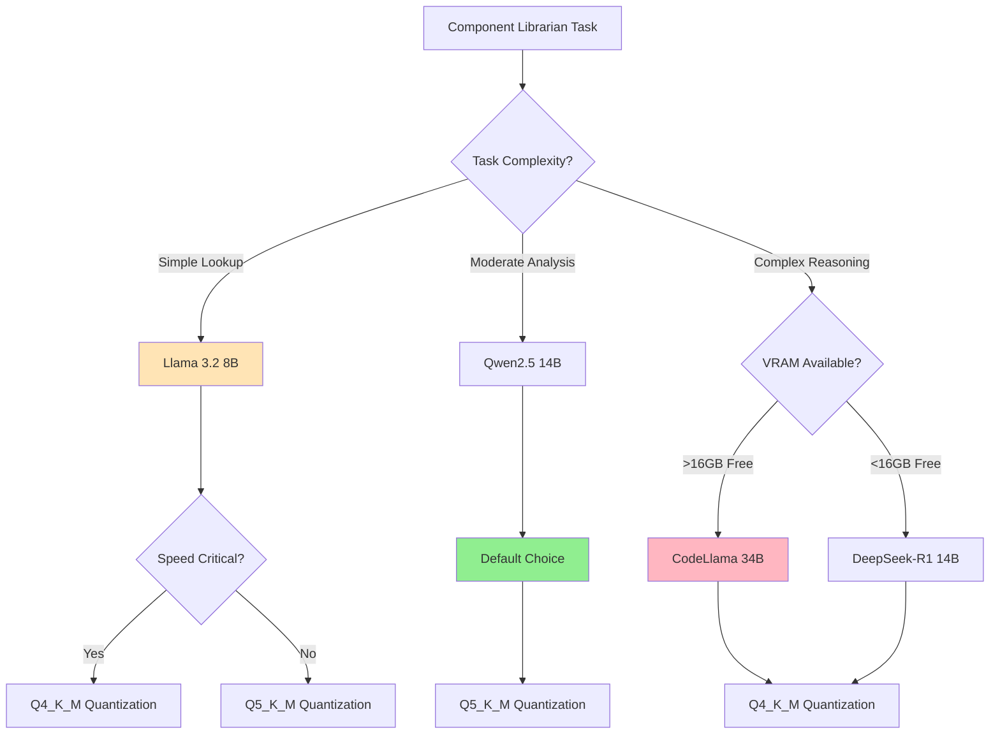
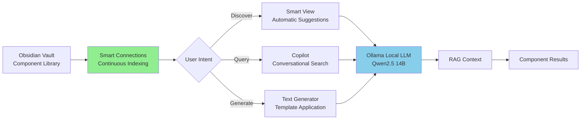
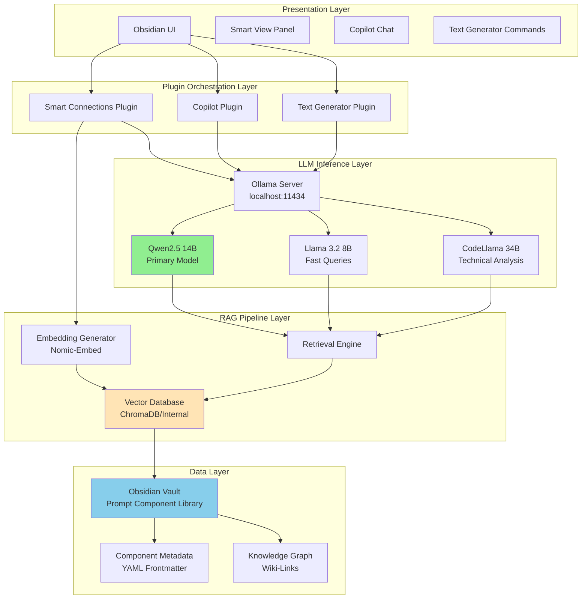
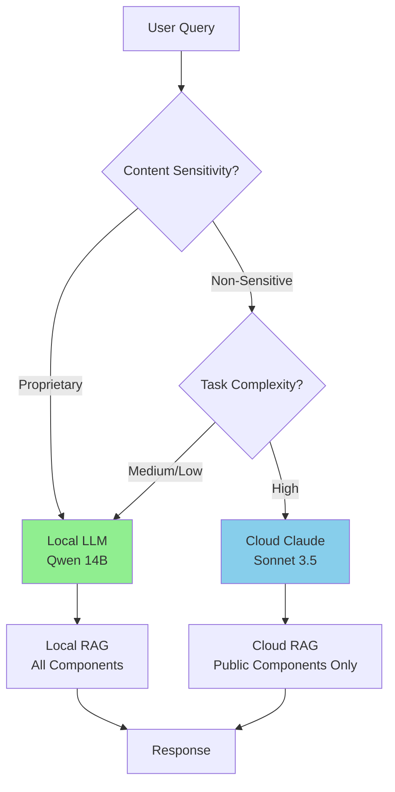

# Extraction Report: 📚Comprehensive Reference: Running a Local LLM as a Prompt Component Librarian

> [!info] Auto-Generated Report
> This report was automatically generated by `pkb_extractor.py` on 2026-03-13 04:18.
> **Source**: `reference-comprehensive-local-llm-prompt-librarian-2025111218.md` | **Items Extracted**: 834

---

## 📋 Document Overview

| Field | Value |
|-------|-------|
| **Source File** | `reference-comprehensive-local-llm-prompt-librarian-2025111218.md` |
| **Extraction Date** | 2026-03-13 04:18 |
| **Word Count** | 13,017 |
| **Character Count** | 103,469 |
| **Line Count** | 2,664 |
| **Total Items Extracted** | 834 |

### Document Outline

  - ## 📑 Table of Contents
  - ## 1️⃣ Conceptual Foundation: Local LLM as Component Librarian
    - ### The Paradigm Shift: From Cloud to Edge
    - ### Why Component Management Suits Local LLMs
    - ### Architectural Philosophy: RAG Over Fine-Tuning
  - ## 2️⃣ Hardware Capability Assessment
    - ### Your Hardware: A Detailed Analysis
      - #### GPU: ASUS TUF RTX 4090 (24GB VRAM)
      - #### CPU: Intel i9-14000K (24 Cores)
      - #### RAM: 32GB DDR5
      - #### Storage: Multiple Samsung NVMe Drives
    - ### Comparative Hardware Context
  - ## 3️⃣ Local LLM Selection Framework
    - ### The Ollama Ecosystem
    - ### Recommended Models for Component Librarian Roles
      - #### **Tier 1: Primary Workhorse Models (14B-30B)**
      - #### **Tier 2: Specialized Task Models (7B-8B)**
      - #### **Tier 3: Embedding Models (Local RAG)**
    - ### Model Selection Decision Tree
    - ### Quantization Strategy
  - ## 4️⃣ Obsidian Plugin Architecture Analysis
    - ### Your Current Plugin Stack Assessment
      - #### **Smart Connections** (Currently Configured with Ollama)
      - #### **Text Generator Plugin** (API-Capable)
      - #### **Copilot Plugin**
    - ### Plugin Architecture Strategy: The Hybrid Approach
    - ### Additional Plugin Considerations
  - ## 5️⃣ System Design Blueprint
    - ### Architectural Overview: The Complete System
    - ### Layer-by-Layer Design Specification
      - #### **Layer 1: Presentation (User Interface)**
      - #### **Layer 2: Plugin Orchestration**
      - #### **Layer 3: LLM Inference**
- # Primary Librarian Model
      - #### **Layer 4: RAG Pipeline**
- # Conceptual retrieval logic
- # Component Library Query
  - ## Retrieved Components
    - ### Component: {component.title}
      - #### **Layer 5: Data Layer (Component Library Structure)**
  - ## 6️⃣ RAG Pipeline Integration
    - ### Why RAG is Essential for Component Librarian
    - ### RAG Pipeline Architecture: Detailed Implementation
      - #### **Phase 1: Indexing (One-Time + Incremental)**
- # Conceptual indexing workflow
      - #### **Phase 2: Query Processing & Retrieval**
      - #### **Phase 3: Context Construction**
      - #### **Phase 4: Generation with Grounding**
    - ### RAG Pipeline Optimization Strategies
- # Example: Find only high-complexity Chain-of-Thought examples for Claude Sonnet
  - ## 7️⃣ Implementation Roadmap
    - ### Phase 1: Foundation Setup (30-45 minutes)
      - #### **Step 1.1: Ollama Installation & Verification**
- # If not already installed
- # Verify installation
- # Check GPU detection
- # Should show GPU utilization metrics
      - #### **Step 1.2: Core Model Downloads**
- # Primary workhorse (9GB)
- # Fast queries (5GB)
- # Embedding model (0.5GB)
- # Optional: Technical specialist (19GB)
- # List installed models
- # Test each model
      - #### **Step 1.3: Ollama Configuration Optimization**
- # Create directory for Modelfiles
- # Create librarian-specific configuration
- # Build custom model from Modelfile
- # Verify custom model
    - ### Phase 2: Plugin Configuration (45-60 minutes)
      - #### **Step 2.1: Smart Connections Configuration**
      - #### **Step 2.2: Copilot Configuration**
      - #### **Step 2.3: Text Generator Configuration**
    - ### Phase 3: Component Library Structuring (30-45 minutes)
      - #### **Step 3.1: Directory Setup**
- # Navigate to your Obsidian vault
- # Create component library structure
      - #### **Step 3.2: Create Foundational Meta-Components**
- # Prompt Component Taxonomy
  - ## Component Type Definitions
    - ### System Instructions
    - ### Examples
    - ### Frameworks
    - ### Templates
    - ### Synthesis Components
  - ## Tagging Strategy
      - #### **Step 3.3: Import Existing Components**
    - ### Phase 4: Validation & Testing (30-45 minutes)
      - #### **Step 4.1: End-to-End Workflow Testing**
      - #### **Step 4.2: Performance Benchmarking**
- # Monitor Smart Connections indexing speed
- # Add a new 1000-word component and time embedding
- # Expected: <1 second for single note embedding
- # Time a Copilot query from submission to first response token
- # Use stopwatch: click Send → start, first token appears → stop
- # Expected: 2-5 seconds for Qwen 14B, <2s for Llama 8B
- # Run Ollama in verbose mode
- # Look for: tokens/s in output
- # Expected: 30-50 tokens/s on RTX 4090
- # Monitor GPU during query processing
- # Expected: 90-98% GPU utilization during active generation
    - ### Phase 5: Optimization & Iteration (Ongoing)
      - #### **Week 1-2: Baseline Establishment**
      - #### **Week 3-4: Refinement Iteration**
      - #### **Month 2+: Advanced Features**
  - ## 8️⃣ Performance Optimization Strategies
    - ### GPU & Memory Optimization
      - #### **Ollama GPU Configuration**
- # Check current GPU layer allocation
- # Should see: PARAMETER num_gpu 99 (fully offloaded)
- # If not, create/update Modelfile:
- # ... rest of configuration
- # Set environment variables for Ollama
      - #### **Model Swapping Strategy**
- # Keep both models warm for instant switching
- # Verify both loaded
- # Should show both models with status "loaded"
    - ### Query Performance Optimization
      - #### **Context Window Efficiency**
      - #### **Embedding Cache Optimization**
      - #### **Retrieval Result Caching**
    - ### Inference Speed Optimization
      - #### **Quantization Tradeoffs**
      - #### **Batch Processing Optimization**
    - ### Obsidian-Specific Optimizations
      - #### **Smart Connections Indexing Efficiency**
- # In Smart Connections settings
      - #### **Plugin Load Order Optimization**
    - ### Advanced: Prompt Optimization for Librarian Tasks
- # ADD specificity for common failure modes:
- # Copilot Prompt Template: Find Components
  - ## 9️⃣ Comparative Analysis: Local vs Cloud
    - ### Performance Comparison
    - ### Cost Analysis (5-Year TCO)
    - ### Privacy & Security Comparison
    - ### Capability Comparison
    - ### Operational Complexity
    - ### Scalability Considerations
    - ### Strategic Recommendation Matrix
    - ### Hybrid Approach: Best of Both Worlds
- # In Copilot plugin settings, create two model profiles:
  - ## 🔟 Maintenance & Troubleshooting
    - ### Routine Maintenance Schedule
      - #### **Weekly Tasks (10 minutes)**
- # Check Ollama service status
- # Should show models loaded with reasonablememory usage
- # Verify GPU utilization history
- # Check Smart Connections indexing status
- # In Obsidian: Settings → Smart Connections → View embedding queue
- # Should be 0 or low number (actively processing)
- # Check for orphaned components (no incoming links)
- # Use Obsidian Graph View or Dataview query:
- # ```dataview
- # TABLE file.inlinks as "Incoming Links"
- # FROM "_Prompt-Components"
- # WHERE length(file.inlinks) = 0
- # SORT file.name ASC
- # ```
      - #### **Monthly Tasks (30-45 minutes)**
- # Check for new model versions
- # Update models (pulls latest versions)
- # If models updated, may need to regenerate custom Modelfile
- # Smart Connections: Force full re-index if:
- # - Major model update
- # - Inconsistent retrieval behavior
- # - Database corruption suspected
- # Settings → Smart Connections → "Force Refresh" (advanced)
- # WARNING: Takes 10-15 minutes for large vaults
- # Run standardized query and time response
- # Compare to baseline: Should be 30-50 tokens/s
- # If degraded, investigate (model changed? GPU thermal throttling?)
      - #### **Quarterly Tasks (1-2 hours)**
- # Backup critical configuration
- # Backup Modelfiles
- # Backup plugin settings (from Obsidian vault)
- # Backup Text Generator templates
- # Backup vector database (if using ChromaDB externally)
- # tar -czf ~/backups/ollama-librarian/$(date +%Y-%m-%d)/chromadb.tar.gz \
- # ~/.cache/smart-connections/
    - ### Common Issues & Solutions
      - #### **Issue Category 1: Connection & API Errors**
- # Check if Ollama is running
- # If error "connection refused", Ollama isn't running
- # Check Ollama API endpoint
- # Should return: {"version":"0.x.x"}
      - #### **Issue Category 2: Performance Degradation**
- # Check GPU utilization during inference
- # During active generation, GPU should be >90%
- # Check for thermal throttling
- # If >85°C, thermal throttling may occur
- # Check system memory
- # If swap is being used heavily, RAM pressure may be limiting GPU
      - #### **Issue Category 3: Retrieval Quality Issues**
      - #### **Issue Category 4: Plugin Conflicts**
      - #### **Issue Category 5: Unexpected Responses**
    - ### Advanced Troubleshooting: Debugging with Logs
- # Run Ollama with debug logging
- # Monitor logs in real-time
- # Look for errors during model loading or inference
- # Check vector database logs
- # Look for indexing errors or query failures
    - ### Recovery Procedures
      - #### **Nuclear Option: Complete Reset**
- # 1. Backup current configuration
- # 2. Stop Ollama
- # 3. Remove all models and configuration
- # 4. Reinstall Ollama
- # 5. Re-download models
- # 6. Recreate custom Modelfiles
- # 7. In Obsidian, disable then re-enable all AI plugins
- # Settings → Community Plugins → Toggle each off/on
- # 8. Force Smart Connections re-index
- # Settings → Smart Connections → Force Refresh
- # 9. Test functionality with known-good queries
- # 🔗 Related Topics for PKB Expansion

---

## 📊 Extraction Summary

| Item Type | Count |
|-----------|-------|
| Callouts | 31 |
| Code Blocks | 68 |
| Color Spans | 0 |
| Definitions | 0 |
| Embeds | 0 |
| External Links | 12 |
| Footnotes | 0 |
| Headings | 215 |
| Inline Fields | 0 |
| Mermaid Diagrams | 4 |
| Tables | 8 |
| Tags | 9 |
| Wiki Links | 100 |
| **TOTAL** | **834** |

---

## 🔔 Callouts (31)

> [!note] What are Callouts?
> Callouts are `> [!TYPE]` blocks used in Obsidian for structured annotation.
> They carry semantic meaning — definitions, insights, warnings, etc.

### By Type

| Callout Type | Count |
|-------------|-------|
| `[!abstract]` | 1 |
| `[!analogy]` | 1 |
| `[!analysis-comparative]` | 1 |
| `[!comprehensive-reference]` | 1 |
| `[!core-principle]` | 3 |
| `[!definition]` | 2 |
| `[!helpful-tip]` | 5 |
| `[!how-to-use-this]` | 1 |
| `[!methodology-and-sources]` | 5 |
| `[!outcome]` | 2 |
| `[!quick-reference]` | 2 |
| `[!the-goal]` | 1 |
| `[!the-philosophy]` | 1 |
| `[!use-cases-and-examples]` | 1 |
| `[!warning]` | 4 |

### Full Callout List

#### 1. [COMPREHENSIVE-REFERENCE] 📚 Comprehensive Reference *(Line 41)*

> [!comprehensive-reference] 📚 Comprehensive Reference
> - **Generated**: 2025-11-12
> - **Version**: 1.0
> - **Type**: Technical Reference & Implementation Guide

#### 2. [ABSTRACT] Untitled *(Line 46)*

> [!abstract] Untitled
> **Executive Overview**
> This comprehensive reference document establishes a complete framework for implementing a Local LLM-based [[Prompt Component Librarian]] system within an [[obsidian]] [[PKB]] environment. Unlike cloud-dependent solutions, this architecture prioritizes data sovereignty, [[Privacy]], and unlimited processing capacity through local inference on high-performance hardware. The system leverages [[Ollama]], [[RAG]] (Retrieval-Augmented Generation), and specialized [[Obsidian Community Plugins]] to create an intelligent, context-aware component management system that rivals cloud-based solutions while maintaining complete user control.

#### 3. [HOW-TO-USE-THIS] Untitled *(Line 50)*

> [!how-to-use-this] Untitled
> **Navigation Guide**
> This reference note is organized into 10 major sections covering conceptual foundations, technical feasibility, implementation architecture, and operational best practices. Use the table of contents below for quick navigation, or search for specific terms using [[Wiki-Links]]. Sections 1-3 establish the conceptual framework and hardware assessment, Sections 4-7 detail implementation specifics, and Sections 8-10 provide optimization strategies and comparative analysis.

#### 4. [DEFINITION] Untitled *(Line 71)*

> [!definition] Untitled
> - **Local LLM Component Librarian**: A self-hosted [[Semantic-Vector-Embeddings-—-Artificial-Intelligence-Information-Retrieval|Artificial Intelligence]] system that manages, retrieves, analyzes, and synthesizes [[Prompt Components]] within a [[Personal-Knowledge-Base|Personal Knowledge Base]], operating entirely on local hardware without external API dependencies.
> - **Core Function**: Semantic search, component recommendation, composition assistance, and metadata enrichment for prompt engineering artifacts.

#### 5. [CORE-PRINCIPLE] Untitled *(Line 87)*

> [!core-principle] Untitled
> **The Local-First Principle**
> Knowledge work systems should prioritize user control, data privacy, and operational independence. Local LLM infrastructure embodies this principle by eliminating external dependencies while matching or exceeding cloud-based capabilities for specialized use cases like component management.

#### 6. [ANALOGY] Untitled *(Line 101)*

> [!analogy] Untitled
> **The Personal Library Analogy**
> Think of cloud LLMs as borrowing books from a public library—convenient but with rules, hours, and limited selections. A local LLM component librarian is your **personal library**: you own every book, there are no closing times, you can rearrange shelves however you want, and no one tracks what you read.

#### 7. [METHODOLOGY-AND-SOURCES] Untitled *(Line 116)*

> [!methodology-and-sources] Untitled
> **RAG Pipeline Fundamentals**
> 1. **Indexing Phase**: Components are converted to [[Embeddings]] (numerical vectors) and stored in a [[Vector Database]]
> 2. **Retrieval Phase**: User queries are embedded and matched against the component database using [[Semantic Similarity]]
> 3. **Augmentation Phase**: Retrieved components are injected into the [[LLM]] context window
> 4. **Generation Phase**: The model synthesizes responses grounded in actual components rather than hallucinated content

#### 8. [OUTCOME] Untitled *(Line 127)*

> [!outcome] Untitled
> **Assessment Result**: Your system (RTX 4090, i9-14000K, 32GB DDR5) is **exceptionally well-suited** for local LLM component librarian implementation, capable of running 30B+ parameter models with strong performance.

#### 9. [HELPFUL-TIP] Untitled *(Line 149)*

> [!helpful-tip] Untitled
> **Model Selection Strategy**
> For component librarian tasks, prioritize **14B-30B models** with Q4_K_M or Q5_K_M quantization. These offer the best balance of semantic understanding, instruction-following, and performance on your hardware. Reserve larger models for complex synthesis tasks.

#### 10. [QUICK-REFERENCE] Untitled *(Line 178)*

> [!quick-reference] Untitled
> **Hardware Capability Matrix**
> - 🟢 **Excellent (8B-14B models)**: Lightning fast, sub-second response times, extended contexts (32K-64K tokens)
> - 🟢 **Strong (30B models)**: Very good performance, 20-40 tokens/s, moderate contexts (16K-32K tokens)
> - 🟡 **Viable (32B models)**: Acceptable performance, 15-25 tokens/s, standard contexts (8K-16K tokens)
> - 🔴 **Not Recommended (70B+ models)**: Severe VRAM constraints, heavy swapping, significantly degraded performance

#### 11. [THE-PHILOSOPHY] Untitled *(Line 200)*

> [!the-philosophy] Untitled
> **Model Selection Philosophy**
> Choose models based on the **task hierarchy**: use smaller, faster models (7B-8B) for routine retrieval and classification, mid-size models (14B-30B) for component analysis and recommendation, and reserve largest viable models (30B-32B) for complex synthesis and generation tasks.

#### 12. [USE-CASES-AND-EXAMPLES] Untitled *(Line 279)*

> [!use-cases-and-examples] Untitled
> **Multi-Model Workflow Example**
> 
> **Scenario**: User queries "Find examples of tree-of-thoughts reasoning with XML structure"
> 
> 1. **Query Processing** (Nomic-Embed, <0.1s): Convert query to embedding vector
> 2. **Semantic Retrieval** (ChromaDB, <0.3s): Return top 10 relevant components
> 3. **Filtering & Ranking** (Llama 3.2 8B, ~2s): Quick classification and relevance scoring
> 4. **Analysis & Synthesis** (Qwen2.5 14B, ~5s): Deep analysis of retrieved components, generate comparative insights
> 5. **Result Presentation** (Qwen2.5 14B, ~3s): Format results with metadata, examples, and usage recommendations
> 
> **Total Time**: ~10 seconds for comprehensive, context-aware response

#### 13. [WARNING] Untitled *(Line 318)*

> [!warning] Untitled
> **Context Window Considerations**
> For optimal RAG performance, models should have at least 32KB context length, with 64KB recommended. Verify context window specifications when selecting models—larger contexts allow more component examples in-context, improving recommendation quality.

#### 14. [HELPFUL-TIP] Untitled *(Line 335)*

> [!helpful-tip] Untitled
> **Practical Quantization Rule**
> Start with **Q5_K_M** for your primary models. If you need faster inference or want to load larger parameter counts, step down to **Q4_K_M**. Only use Q8_0 for specialized tasks where quality degradation from quantization would be problematic—for component librarian work, Q5_K_M offers the best quality/performance balance.

#### 15. [DEFINITION] Untitled *(Line 343)*

> [!definition] Untitled
> - **Obsidian Community Plugins**: Third-party extensions that enhance Obsidian's functionality, often integrating AI capabilities through local or cloud LLMs.
> - **Plugin Ecosystem Role**: Bridges Obsidian's file-based PKB with LLM inference capabilities, enabling natural language interaction with knowledge artifacts.

#### 16. [METHODOLOGY-AND-SOURCES] Untitled *(Line 453)*

> [!methodology-and-sources] Untitled
> **Tri-Plugin Integration Pattern**
> 
> **Layer 1: Continuous Semantic Indexing (Smart Connections)**
> - Runs in background
> - Maintains up-to-date vector embeddings
> - Provides automatic component relationship mapping
> - Powers real-time suggestions
> 
> **Layer 2: Interactive Querying (Copilot)**
> - User-initiated conversations
> - Explicit context specification
> - Complex reasoning and synthesis
> - Multi-turn dialogues for component exploration
> 
> **Layer 3: Automated Generation (Text Generator)**
> - Template-driven component creation
> - Batch metadata enrichment
> - Standardized formatting
> - Cross-reference generation

#### 17. [QUICK-REFERENCE] Untitled *(Line 491)*

> [!quick-reference] Untitled
> **Plugin Selection Matrix**
> 
> | Feature | Smart Connections | Copilot | Text Generator |
> |---------|------------------|---------|----------------|
> | **Semantic Search** | ⭐⭐⭐ | ⭐⭐ | ❌ |
> | **Conversational** | ⭐⭐ | ⭐⭐⭐ | ❌ |
> | **Template Generation** | ❌ | ⭐ | ⭐⭐⭐ |
> | **Batch Operations** | ❌ | ⭐ | ⭐⭐⭐ |
> | **Local Model Support** | ⭐⭐⭐ | ⭐⭐⭐ | ⭐⭐⭐ |
> | **Privacy** | ⭐⭐⭐ | ⭐⭐ | ⭐⭐⭐ |
> | **Resource Efficiency** | ⭐⭐ | ⭐ | ⭐⭐⭐ |

#### 18. [OUTCOME] Untitled *(Line 508)*

> [!outcome] Untitled
> **System Architecture**: A multi-tier, plugin-orchestrated component librarian leveraging local LLM inference through Ollama, unified by RAG pipelines and optimized for your RTX 4090 hardware.

#### 19. [METHODOLOGY-AND-SOURCES] Untitled *(Line 646)*

> [!methodology-and-sources] Untitled
> **Plugin Communication Architecture**
> 
> All three plugins communicate with Ollama via its **OpenAI-compatible REST API**:
> ```
> POST http://localhost:11434/v1/chat/completions
> {
>   "model": "qwen2.5:14b-instruct-q5_k_m",
>   "messages": [...],
>   "temperature": 0.7,
>   "max_tokens": 2048
> }
> ```
> 
> This standardized interface allows:
> - Hot-swapping models without plugin reconfiguration
> - Consistent performance monitoring
> - Centralized logging and debugging
> - Model-specific optimization at the Ollama layer

#### 20. [HELPFUL-TIP] Untitled *(Line 723)*

> [!helpful-tip] Untitled
> **Dynamic Model Selection Strategy**
> 
> Configure plugins to use Qwen2.5 14B as the default, but manually switch to:
> - **Llama 3.2 8B** when doing rapid iteration or browsing
> - **CodeLlama 34B** when analyzing complex technical components or planning multi-component systems
> 
> Monitor token usage and response times to calibrate your intuition for which tasks justify larger models.

#### 21. [WARNING] Untitled *(Line 809)*

> [!warning] Untitled
> **Context Window Management**
> 
> Even advanced LLMs have context window limits—GPT-3 could only handle ~4,000 tokens (~3 pages of text). While modern models support 32K-64K tokens, be strategic about context usage:
> 
> - **Allocate Budget**: Reserve 8K tokens for system prompt + instructions, 16K for retrieved components, 8K for generation
> - **Compress When Needed**: For queries requiring many components, use summaries instead of full content
> - **Progressive Retrieval**: Start with top-5 components, only expand if initial results insufficient

#### 22. [CORE-PRINCIPLE] Untitled *(Line 884)*

> [!core-principle] Untitled
> **RAG as System Foundation**
> RAG addresses LLM limitations by connecting models to external knowledge repositories, enabling dynamic information retrieval at query time rather than relying on static training data. This reduces hallucinations, provides verifiable sources, and allows continuous knowledge updates without expensive retraining.

#### 23. [HELPFUL-TIP] Untitled *(Line 967)*

> [!helpful-tip] Untitled
> **Indexing Performance Optimization**
> 
> - **Initial indexing** of 1000 components: ~5-10 minutes on your hardware
> - **Incremental updates**: <1 second per modified component
> - **Batch processing**: If adding many components, consider pausing Smart Connections indexing and running manual batch update to avoid continuous re-indexing overhead

#### 24. [METHODOLOGY-AND-SOURCES] Untitled *(Line 1109)*

> [!methodology-and-sources] Untitled
> **Three-Tier Retrieval Strategy**
> 
> For optimal results, implement layered retrieval:
> 
> **Tier 1: Broad Retrieval** (k=20)
> - Fast similarity search
> - Low precision threshold (accept more results)
> - Purpose: Capture all potentially relevant components
> 
> **Tier 2: Reranking** (k=10)
> - Hybrid scoring incorporating metadata
> - Filter out marginal matches
> - Purpose: Refine results for quality
> 
> **Tier 3: LLM Filtering** (k=5)
> - Use Llama 3.2 8B for final selection
> - Evaluate contextual relevance given actual query
> - Purpose: Ensure only most relevant components in final context
> 
> This approach balances recall (not missing relevant components) with precision (not overwhelming context with noise).

#### 25. [THE-GOAL] Untitled *(Line 1163)*

> [!the-goal] Untitled
> **Implementation Objective**: Establish a fully functional, optimized local LLM component librarian system within your Obsidian PKB, operational within 2-4 hours of focused setup time, with immediate usability and iterative refinement pathway.

#### 26. [HELPFUL-TIP] Untitled *(Line 1265)*

> [!helpful-tip] Untitled
> **Why Custom Modelfiles Matter**
> 
> The system prompt in the Modelfile "bakes in" librarian-specific behavior, ensuring consistent performance across all plugin interactions. Without this, each plugin would need its own system prompt configuration, leading to inconsistent behavior and maintenance overhead.

#### 27. [WARNING] Untitled *(Line 1565)*

> [!warning] Untitled
> **Common Issues & Fixes**
> 
> **Issue**: Smart Connections not showing suggestions
> - **Fix**: Settings → Smart Connections → "Reload Sources"
> 
> **Issue**: Copilot can't connect to Ollama
> - **Fix**: Verify Ollama is running: `ollama list`
> - **Fix**: Check endpoint URL includes `/v1` suffix
> 
> **Issue**: Slow token generation (<15 tokens/s)
> - **Fix**: Verify GPU offloading: `ollama show qwen-librarian | grep gpu`
> - **Fix**: Ensure no other GPU-intensive applications running
> 
> **Issue**: Text Generator timeout errors
> - **Fix**: Increase timeout in plugin settings (default often 30s, increase to 60-90s for larger models)

#### 28. [CORE-PRINCIPLE] Untitled *(Line 1638)*

> [!core-principle] Untitled
> **Optimization Hierarchy**
> 1. **Hardware Utilization**: Ensure GPU is fully engaged (>90% util during inference)
> 2. **Model Selection**: Right-size models for tasks (don't use 34B when 8B suffices)
> 3. **Context Efficiency**: Minimize token waste in prompts and retrieved components
> 4. **Caching**: Avoid redundant computation through intelligent caching
> 5. **Parallelization**: Run independent operations concurrently when possible

#### 29. [ANALYSIS-COMPARATIVE] Untitled *(Line 1946)*

> [!analysis-comparative] Untitled
> **Objective Comparison Framework**
> This analysis evaluates local LLM component librarian (your system) against cloud-based Claude Desktop implementation across six dimensions: performance, cost, privacy, capability, operational complexity, and scalability.

#### 30. [WARNING] Untitled *(Line 2017)*

> [!warning] Untitled
> **Critical Privacy Consideration**
> 
> If your component library contains:
> - Proprietary prompt techniques under NDA
> - Client-specific examples or data
> - Unreleased product information
> - Competitive intelligence
> 
> Then local deployment is **non-negotiable**. Cloud services, regardless of encryption or policy, introduce a non-zero transmission risk.

#### 31. [METHODOLOGY-AND-SOURCES] Untitled *(Line 2153)*

> [!methodology-and-sources] Untitled
> **Proactive Maintenance Philosophy**
> Maintain system health through regular monitoring, preemptive updates, and systematic issue resolution. Budget 30-60 minutes monthly for maintenance tasks, with additional time for major updates or troubleshooting as needed.

---

## 🔗 Wiki-Links (100 total, 77 unique targets)

> [!info] Knowledge Graph Connections
> These links represent connections to other notes in your PKB.
> **77** distinct notes are referenced.

### Unique Targets

- [[AI]]
- [[API Documentation Generator]]
- [[Advanced RAG Architectures for Knowledge Management]]
- [[Semantic-Vector-Embeddings-—-Artificial-Intelligence-Information-Retrieval|Artificial Intelligence]]
- [[Chain-of-Thought]]
- [[Chain-of-Thought Framework]]
- [[ChromaDB]]
- [[Code Documentation Generator]]
- [[Code Refactoring Samples]]
- [[Code Review Assistant]]
- [[Comparative Analysis: Local LLM Frameworks (Ollama vs LM Studio vs GPT4All)]]
- [[Component Library]]
- [[Component Name]]
- [[Component-Name]]
- [[Context-Window|Context Window]]
- [[Copilot Plugin]]
- [[Customer Support Bot]]
- [[Embedding]]
- [[Embedding Models]]
- [[Embeddings]]
- [[Examples]]
- [[Expert Analyst Persona]]
- [[Frameworks]]
- [[Full Component: {component.filename}]]
- [[Full content: {component.filename}]]
- [[GGUF]]
- [[GGUF Format]]
- [[IDEA Prompt Development]]
- [[Inference Speed]]
- [[JSON Schema Validation Examples]]
- [[Knowledge Graph]]
- [[LLM]]
- [[Local LLM]]
- [[Meeting Notes Summarizer]]
- [[Milvus]]
- [[Model Architecture]]
- [[Model Fine-Tuning]]
- [[Obsidian]]
- [[Obsidian Community Plugins]]
- [[Obsidian Plugin Development for AI Integration]]
- [[Ollama]]
- [[PKB]]
- [[Personal-Knowledge-Base|Personal Knowledge Base]]
- [[Plugin Ecosystem]]
- [[Privacy]]
- [[Prompt Component Librarian]]
- [[Prompt Component Libraries]]
- [[Prompt Component Versioning and Lifecycle Management]]
- [[Prompt Components]]
- [[Prompt Engineering]]
- [[Quantization]]
- [[RAG]]
- [[ReAct Agent Loop]]
- [[Related Component 1]]
- [[Related Component 2]]
- [[Research Paper Analyzer]]
- [[Semantic Search]]
- [[Semantic Similarity]]
- [[Sentiment Analysis Demonstrations]]
- [[Smart-Connections|Smart Connections]]
- [[Specific-Component-Name]]
- [[Synthesis Components]]
- [[System Architecture]]
- [[System Instructions]]
- [[Technical Blog Post Template]]
- [[Technical Documentation Writer]]
- [[Templates]]
- [[Text-Generator-Plugin|Text Generator Plugin]]
- [[Token Throughput]]
- [[Vector Database]]
- [[Vector Embeddings]]
- [[Wiki-Link]]
- [[Wiki-Links]]
- [[XML]]
- [[Zettelkasten]]
- [[obsidian]]
- [[wiki-links]]

### All Occurrences

| # | Target | Display Text | Heading | Section | Line |
|---|--------|-------------|---------|---------|------|
| 1 | [[Prompt Component Librarian]] | — | — | Document Start | 48 |
| 2 | [[obsidian]] | — | — | Document Start | 48 |
| 3 | [[PKB]] | — | — | Document Start | 48 |
| 4 | [[Privacy]] | — | — | Document Start | 48 |
| 5 | [[Ollama]] | — | — | Document Start | 48 |
| 6 | [[RAG]] | — | — | Document Start | 48 |
| 7 | [[Obsidian Community Plugins]] | — | — | Document Start | 48 |
| 8 | [[Wiki-Links]] | — | — | Document Start | 52 |
| 9 | [[Semantic-Vector-Embeddings-—-Artificial-Intelligence-Information-Retrieval|Artificial Intelligence]] | — | — | 1️⃣ Conceptual Foundation: Local LLM ... | 72 |
| 10 | [[Prompt Components]] | — | — | 1️⃣ Conceptual Foundation: Local LLM ... | 72 |
| 11 | [[Personal-Knowledge-Base|Personal Knowledge Base]] | — | — | 1️⃣ Conceptual Foundation: Local LLM ... | 72 |
| 12 | [[LLM]] | — | — | The Paradigm Shift: From Cloud to Edge | 77 |
| 13 | [[AI]] | — | — | The Paradigm Shift: From Cloud to Edge | 79 |
| 14 | [[Component Library]] | — | — | The Paradigm Shift: From Cloud to Edge | 79 |
| 15 | [[Prompt Component Libraries]] | — | — | Why Component Management Suits Local ... | 93 |
| 16 | [[PKB]] | — | — | Why Component Management Suits Local ... | 95 |
| 17 | [[RAG]] | — | — | Why Component Management Suits Local ... | 95 |
| 18 | [[Chain-of-Thought]] | — | — | Why Component Management Suits Local ... | 97 |
| 19 | [[XML]] | — | — | Why Component Management Suits Local ... | 97 |
| 20 | [[System Instructions]] | — | — | Why Component Management Suits Local ... | 97 |
| 21 | [[RAG]] | — | — | Architectural Philosophy: RAG Over Fi... | 107 |
| 22 | [[Model Fine-Tuning]] | — | — | Architectural Philosophy: RAG Over Fi... | 107 |
| 23 | [[PKB]] | — | — | Architectural Philosophy: RAG Over Fi... | 114 |
| 24 | [[RAG]] | — | — | Architectural Philosophy: RAG Over Fi... | 114 |
| 25 | [[Embeddings]] | — | — | Architectural Philosophy: RAG Over Fi... | 118 |
| 26 | [[Vector Database]] | — | — | Architectural Philosophy: RAG Over Fi... | 118 |
| 27 | [[Semantic Similarity]] | — | — | Architectural Philosophy: RAG Over Fi... | 119 |
| 28 | [[LLM]] | — | — | Architectural Philosophy: RAG Over Fi... | 120 |
| 29 | [[LLM]] | — | — | Your Hardware: A Detailed Analysis | 132 |
| 30 | [[GGUF]] | — | — | GPU: ASUS TUF RTX 4090 (24GB VRAM) | 143 |
| 31 | [[Quantization]] | — | — | GPU: ASUS TUF RTX 4090 (24GB VRAM) | 143 |
| 32 | [[Embedding]] | — | — | CPU: Intel i9-14000K (24 Cores) | 157 |
| 33 | [[RAG]] | — | — | CPU: Intel i9-14000K (24 Cores) | 157 |
| 34 | [[obsidian]] | — | — | CPU: Intel i9-14000K (24 Cores) | 158 |
| 35 | [[Ollama]] | — | — | RAM: 32GB DDR5 | 166 |
| 36 | [[ChromaDB]] | — | — | RAM: 32GB DDR5 | 167 |
| 37 | [[Milvus]] | — | — | RAM: 32GB DDR5 | 167 |
| 38 | [[obsidian]] | — | — | Storage: Multiple Samsung NVMe Drives | 176 |
| 39 | [[Ollama]] | — | — | The Ollama Ecosystem | 206 |
| 40 | [[GGUF]] | — | — | The Ollama Ecosystem | 206 |
| 41 | [[Semantic Search]] | — | — | **Tier 3: Embedding Models (Local RAG)** | 269 |
| 42 | [[Vector Embeddings]] | — | — | **Smart Connections** (Currently Conf... | 356 |
| 43 | [[ChromaDB]] | — | — | **Smart Connections** (Currently Conf... | 357 |
| 44 | [[RAG]] | — | — | **Smart Connections** (Currently Conf... | 359 |
| 45 | [[Wiki-Link]] | — | — | Primary Librarian Model | 707 |
| 46 | [[Full Component: {component.filename}]] | — | — | Component: {component.title} | 801 |
| 47 | [[Related Component 1]] | — | — | **Layer 5: Data Layer (Component Libr... | 867 |
| 48 | [[Related Component 2]] | — | — | **Layer 5: Data Layer (Component Libr... | 868 |
| 49 | [[Component Name]] | — | — | **Phase 4: Generation with Grounding** | 1087 |
| 50 | [[Component-Name]] | — | — | Create librarian-specific configuration | 1247 |
| 51 | [[wiki-links]] | — | — | **Step 2.3: Text Generator Configurat... | 1359 |
| 52 | [[System Instructions]] | — | — | System Instructions | 1410 |
| 53 | [[Expert Analyst Persona]] | — | — | System Instructions | 1418 |
| 54 | [[Technical Documentation Writer]] | — | — | System Instructions | 1418 |
| 55 | [[Code Review Assistant]] | — | — | System Instructions | 1418 |
| 56 | [[Examples]] | — | — | Examples | 1421 |
| 57 | [[JSON Schema Validation Examples]] | — | — | Examples | 1429 |
| 58 | [[Code Refactoring Samples]] | — | — | Examples | 1429 |
| 59 | [[Sentiment Analysis Demonstrations]] | — | — | Examples | 1429 |
| 60 | [[Frameworks]] | — | — | Frameworks | 1432 |
| 61 | [[Chain-of-Thought Framework]] | — | — | Frameworks | 1440 |
| 62 | [[IDEA Prompt Development]] | — | — | Frameworks | 1440 |
| 63 | [[ReAct Agent Loop]] | — | — | Frameworks | 1440 |
| 64 | [[Templates]] | — | — | Templates | 1443 |
| 65 | [[Technical Blog Post Template]] | — | — | Templates | 1451 |
| 66 | [[API Documentation Generator]] | — | — | Templates | 1451 |
| 67 | [[Meeting Notes Summarizer]] | — | — | Templates | 1451 |
| 68 | [[Synthesis Components]] | — | — | Synthesis Components | 1454 |
| 69 | [[Research Paper Analyzer]] | — | — | Synthesis Components | 1462 |
| 70 | [[Code Documentation Generator]] | — | — | Synthesis Components | 1462 |
| 71 | [[Customer Support Bot]] | — | — | Synthesis Components | 1462 |
| 72 | [[wiki-links]] | — | — | **Step 4.1: End-to-End Workflow Testi... | 1512 |
| 73 | [[Full content: {component.filename}]] | — | — | **Context Window Efficiency** | 1746 |
| 74 | [[Specific-Component-Name]] | — | — | **Issue Category 5: Unexpected Respon... | 2497 |
| 75 | [[Advanced RAG Architectures for Knowledge Management]] | — | — | 🔗 Related Topics for PKB Expansion | 2609 |
| 76 | [[Comparative Analysis: Local LLM Frameworks (Ollama vs LM Studio vs GPT4All)]] | — | — | 🔗 Related Topics for PKB Expansion | 2614 |
| 77 | [[Obsidian Plugin Development for AI Integration]] | — | — | 🔗 Related Topics for PKB Expansion | 2619 |
| 78 | [[Prompt Component Versioning and Lifecycle Management]] | — | — | 🔗 Related Topics for PKB Expansion | 2624 |
| 79 | [[Local LLM]] | — | — | 🔗 Related Topics for PKB Expansion | 2674 |
| 80 | [[Ollama]] | — | — | 🔗 Related Topics for PKB Expansion | 2674 |
| 81 | [[Obsidian]] | — | — | 🔗 Related Topics for PKB Expansion | 2674 |
| 82 | [[Smart-Connections|Smart Connections]] | — | — | 🔗 Related Topics for PKB Expansion | 2674 |
| 83 | [[Text-Generator-Plugin|Text Generator Plugin]] | — | — | 🔗 Related Topics for PKB Expansion | 2674 |
| 84 | [[Copilot Plugin]] | — | — | 🔗 Related Topics for PKB Expansion | 2674 |
| 85 | [[Prompt Engineering]] | — | — | 🔗 Related Topics for PKB Expansion | 2674 |
| 86 | [[Component Library]] | — | — | 🔗 Related Topics for PKB Expansion | 2674 |
| 87 | [[RAG]] | — | — | 🔗 Related Topics for PKB Expansion | 2674 |
| 88 | [[Vector Database]] | — | — | 🔗 Related Topics for PKB Expansion | 2674 |
| 89 | [[Embedding Models]] | — | — | 🔗 Related Topics for PKB Expansion | 2674 |
| 90 | [[Context-Window|Context Window]] | — | — | 🔗 Related Topics for PKB Expansion | 2674 |
| 91 | [[Quantization]] | — | — | 🔗 Related Topics for PKB Expansion | 2674 |
| 92 | [[GGUF Format]] | — | — | 🔗 Related Topics for PKB Expansion | 2674 |
| 93 | [[Model Architecture]] | — | — | 🔗 Related Topics for PKB Expansion | 2674 |
| 94 | [[Inference Speed]] | — | — | 🔗 Related Topics for PKB Expansion | 2674 |
| 95 | [[Token Throughput]] | — | — | 🔗 Related Topics for PKB Expansion | 2674 |
| 96 | [[System Architecture]] | — | — | 🔗 Related Topics for PKB Expansion | 2674 |
| 97 | [[Plugin Ecosystem]] | — | — | 🔗 Related Topics for PKB Expansion | 2674 |
| 98 | [[PKB]] | — | — | 🔗 Related Topics for PKB Expansion | 2674 |
| 99 | [[Zettelkasten]] | — | — | 🔗 Related Topics for PKB Expansion | 2674 |
| 100 | [[Knowledge Graph]] | — | — | 🔗 Related Topics for PKB Expansion | 2674 |

---

## 🏷️ Tags (9 occurrences, 5 unique)

### All Unique Tags

`#llm`, `#pkb`, `#prompt-component-library`, `#prompt-engineering`, `#type/reference`

### Hierarchical Tags

- **type/**
  - `#type/reference`

---

## 💻 Code Blocks (68)

| Language | Count |
|----------|-------|
| `bash` | 35 |
| `python` | 12 |
| `plaintext` | 11 |
| `markdown` | 4 |
| `yaml` | 3 |
| `json` | 1 |
| `dockerfile` | 1 |
| `javascript` | 1 |

### Code Block 1 — `plaintext` *(Lines 598-608)*

```plaintext
User working on new prompt component
↓
Smart Connections auto-embeds note as it's written
↓
Smart View updates with semantically related components
↓
User clicks suggested component
↓
Component opens in split pane for reference
```

### Code Block 2 — `plaintext` *(Lines 611-627)*

```plaintext
User invokes Copilot chat
↓
User query: "Show me examples of few-shot prompting with JSON output"
↓
Copilot calls Ollama API (Qwen2.5 14B)
↓
Model generates query embedding
↓
Vector DB retrieves top-k relevant components
↓
Components injected into model context
↓
Model synthesizes response with inline component references
↓
User receives answer with clickable component links
```

### Code Block 3 — `plaintext` *(Lines 630-644)*

```plaintext
User selects multiple new component files
↓
User triggers Text Generator template: "Enrich Component Metadata"
↓
Template calls Ollama API (Llama 3.2 8B for speed)
↓
For each component:
  - Extract key concepts
  - Generate descriptive tags
  - Suggest related components
  - Create YAML frontmatter
↓
Batch update all files with generated metadata
```

### Code Block 4 — `plaintext` *(Lines 650-658)*

```plaintext
> POST http://localhost:11434/v1/chat/completions
> {
>   "model": "qwen2.5:14b-instruct-q5_k_m",
>   "messages": [...],
>   "temperature": 0.7,
>   "max_tokens": 2048
> }
>
```

### Code Block 5 — `json` *(Lines 671-680)*

```json
{
  "gpu_layers": 99,
  "context_window": 32768,
  "num_thread": 16,
  "use_mmap": true,
  "use_mlock": true,
  "numa": false
}
```

### Code Block 6 — `dockerfile` *(Lines 683-712)*

```dockerfile
# Primary Librarian Model
FROM qwen2.5:14b-instruct-q5_k_m

PARAMETER temperature 0.7
PARAMETER top_p 0.9
PARAMETER top_k 40
PARAMETER num_ctx 32768

SYSTEM """You are a specialized Prompt Component Librarian for an Obsidian PKB system. Your role is to:

1. ANALYZE prompt engineering components for structure, quality, and applicability
2. RECOMMEND relevant components based on user needs and context
3. SYNTHESIZE multiple components into coherent frameworks
4. EXTRACT metadata and relationships from component content
5. MAINTAIN consistent terminology aligned with the PKB taxonomy

Core Competencies:
- Deep understanding of prompt engineering methodologies
- Knowledge of XML structure, Chain-of-Thought reasoning, and Constitutional AI
- Ability to identify component relationships and hierarchies
- Precision in component classification and tagging

Output Guidelines:
- Cite specific components using [[Wiki-Link]] format
- Provide actionable recommendations, not generic advice
- Maintain technical accuracy and terminology consistency
- Format responses for Obsidian markdown compatibility
"""
```

### Code Block 7 — `python` *(Lines 749-781)*

```python
# Conceptual retrieval logic
def retrieve_components(query: str, k: int = 10, filter_params: dict = None):
    """
    Retrieve most relevant components for a given query.
    
    Args:
        query: Natural language query from user
        k: Number of results to return
        filter_params: Optional metadata filters (e.g., {"type": "example"})
    
    Returns:
        List of (component, similarity_score, metadata) tuples
    """
    # 1. Generate query embedding
    query_embedding = nomic_embed(query)
    
    # 2. Similarity search in vector DB
    raw_results = vector_db.similarity_search(
        query_embedding, 
        k=k*2,  # Over-retrieve for reranking
        filter=filter_params
    )
    
    # 3. Rerank by hybrid criteria
    reranked = rerank_results(
        raw_results,
        criteria=["semantic_similarity", "recency", "usage_frequency"]
    )
    
    # 4. Return top-k after reranking
# ... (1 more lines truncated)
```

### Code Block 8 — `markdown` *(Lines 785-807)*

```markdown
# Component Library Query

User Query: {user_query}

## Retrieved Components

{for component in retrieved_components}
### Component: {component.title}
- **Type**: {component.type}
- **Tags**: {component.tags}
- **Relevance**: {component.similarity_score}

**Content Excerpt**:
{component.content[:500]}...

[[Full Component: {component.filename}]]

---
{endfor}

Based on these components from the library, {task_instruction}
```

### Code Block 9 — `plaintext` *(Lines 821-849)*

```plaintext
Obsidian Vault/
├── _Prompt-Components/
│   ├── 00_Meta/
│   │   ├── Component-Taxonomy.md
│   │   ├── Tagging-Guidelines.md
│   │   └── Component-Templates/
│   ├── 01_Foundational/
│   │   ├── System-Instructions/
│   │   ├── Role-Definitions/
│   │   └── Core-Frameworks/
│   ├── 02_Structural/
│   │   ├── XML-Templates/
│   │   ├── Formatting-Rules/
│   │   └── Output-Specifications/
│   ├── 03_Cognitive/
│   │   ├── Chain-of-Thought/
│   │   ├── Tree-of-Thoughts/
│   │   └── ReAct-Patterns/
│   ├── 04_Examples/
│   │   ├── Few-Shot-Sets/
│   │   ├── Use-Case-Samples/
│   │   └── Anti-Patterns/
│   └── 05_Synthesis/
│       ├── Complete-Prompts/
│       └── Multi-Component-Systems/
└── _Vector-DB/
    └── chromadb/ (embeddings storage)
```

### Code Block 10 — `yaml` *(Lines 852-872)*

```yaml
---
title: Component Name
id: unique-identifier-timestamp
type: [system-instruction|example|framework|template|synthesis]
status: [draft|active|deprecated]
tags:
  - #primary-category
  - #methodology
  - #use-case
claude_version: [sonnet-3.5|opus-3|haiku-3]
created: YYYY-MM-DD
last_modified: YYYY-MM-DD
usage_count: 0
related_components:
  - [[Related Component 1]]
  - [[Related Component 2]]
complexity: [low|medium|high]
context_requirements: [minimal|moderate|extensive]
---
```

### Code Block 11 — `python` *(Lines 916-956)*

```python
# Conceptual indexing workflow
import ollama
from chromadb import Client
from pathlib import Path

def index_component_library(vault_path: Path, collection_name: str = "components"):
    """
    Initial indexing of entire component library.
    """
    # Initialize ChromaDB client
    chroma_client = Client()
    collection = chroma_client.create_collection(
        name=collection_name,
        metadata={"description": "Prompt Component Library"}
    )
    
    # Walk vault directory
    component_files = vault_path.glob("_Prompt-Components/**/*.md")
    
    for file_path in component_files:
        # Extract content and metadata
        content, metadata = parse_component_file(file_path)
        
        # Generate embedding using Ollama
        embedding_response = ollama.embeddings(
            model="nomic-embed-text",
            prompt=content
        )
        embedding = embedding_response["embedding"]
        
# ... (9 more lines truncated)
```

### Code Block 12 — `python` *(Lines 979-1003)*

```python
def process_query(user_query: str) -> dict:
    """
    Parse user intent and extract query parameters.
    """
    # Use lightweight LLM to extract intent and filters
    analysis_response = ollama.generate(
        model="llama3.2:8b-instruct-q4_k_m",
        prompt=f"""Analyze this component library query and extract:
        1. Core semantic intent
        2. Specific component types requested (if any)
        3. Metadata filters (tags, complexity, etc.)
        
        Query: {user_query}
        
        Respond in JSON format:
        {{
            "intent": "...",
            "component_types": [...],
            "filters": {{...}}
        }}
        """
    )
    return json.loads(analysis_response["response"])
```

### Code Block 13 — `python` *(Lines 1006-1025)*

```python
def retrieve_relevant_components(query_analysis: dict, k: int = 10):
    """
    Retrieve most similar components using vector search.
    """
    # Generate query embedding
    query_embedding = ollama.embeddings(
        model="nomic-embed-text",
        prompt=query_analysis["intent"]
    )["embedding"]
    
    # Similarity search with metadata filtering
    results = collection.query(
        query_embeddings=[query_embedding],
        n_results=k,
        where=query_analysis["filters"]  # e.g., {"type": "example"}
    )
    
    return results
```

### Code Block 14 — `python` *(Lines 1030-1046)*

```python
def rerank_results(raw_results: list, query: str) -> list:
    """
    Rerank initial results using hybrid criteria.
    """
    scored_results = []
    for component in raw_results:
        score = (
            0.6 * component["similarity_score"] +          # Semantic similarity
            0.2 * calculate_recency_score(component) +     # Favor recent components
            0.1 * calculate_usage_score(component) +       # Favor frequently used
            0.1 * calculate_quality_score(component)       # Manual quality ratings
        )
        scored_results.append((component, score))
    
    return sorted(scored_results, key=lambda x: x[1], reverse=True)
```

### Code Block 15 — `python` *(Lines 1051-1075)*

```python
def build_rag_context(retrieved_components: list, query: str, max_tokens: int = 16000):
    """
    Construct context from retrieved components, respecting token budget.
    """
    context_parts = [
        "# Relevant Components from Library\n\n",
        f"Query: {query}\n\n"
    ]
    
    current_tokens = count_tokens(" ".join(context_parts))
    
    for i, (component, score) in enumerate(retrieved_components):
        component_text = format_component_for_context(component)
        component_tokens = count_tokens(component_text)
        
        if current_tokens + component_tokens > max_tokens:
            # Use summary instead of full content if approaching limit
            component_text = f"Component {i+1}: {component['title']} (Summary)\n{component['summary']}\n"
        
        context_parts.append(component_text)
        current_tokens += count_tokens(component_text)
    
    return "\n".join(context_parts)
```

### Code Block 16 — `python` *(Lines 1080-1105)*

```python
def generate_grounded_response(query: str, context: str, model: str = "qwen2.5:14b"):
    """
    Generate response using RAG context.
    """
    system_prompt = """You are a Prompt Component Librarian. Your responses must:
    1. Be grounded in the provided component library context
    2. Cite specific components using [[Component Name]] notation
    3. Never invent or hallucinate components not in the library
    4. Provide actionable recommendations based on actual library content
    """
    
    full_prompt = f"{system_prompt}\n\n{context}\n\nUser Query: {query}\n\nResponse:"
    
    response = ollama.generate(
        model=model,
        prompt=full_prompt,
        options={
            "temperature": 0.7,
            "top_p": 0.9,
            "num_ctx": 32768
        }
    )
    
    return response["response"]
```

### Code Block 17 — `python` *(Lines 1143-1157)*

```python
# Example: Find only high-complexity Chain-of-Thought examples for Claude Sonnet
results = collection.query(
    query_embeddings=[query_embedding],
    n_results=10,
    where={
        "$and": [
            {"type": "example"},
            {"complexity": "high"},
            {"tags": {"$contains": "#chain-of-thought"}},
            {"claude_version": "sonnet-3.5"}
        ]
    }
)
```

### Code Block 18 — `bash` *(Lines 1170-1180)*

```bash
# If not already installed
curl -fsSL https://ollama.com/install.sh | sh

# Verify installation
ollama --version

# Check GPU detection
ollama run llama3.2:latest "Test GPU access" --verbose
# Should show GPU utilization metrics
```

### Code Block 19 — `bash` *(Lines 1188-1200)*

```bash
# Primary workhorse (9GB)
ollama pull qwen2.5:14b-instruct-q5_k_m

# Fast queries (5GB)
ollama pull llama3.2:8b-instruct-q5_k_m

# Embedding model (0.5GB)
ollama pull nomic-embed-text

# Optional: Technical specialist (19GB)
ollama pull codellama:34b-instruct-q4_k_m
```

### Code Block 20 — `bash` *(Lines 1203-1210)*

```bash
# List installed models
ollama list

# Test each model
ollama run qwen2.5:14b-instruct-q5_k_m "Explain prompt engineering in one sentence."
ollama run llama3.2:8b-instruct-q5_k_m "Quick test."
```

### Code Block 21 — `bash` *(Lines 1216-1263)*

```bash
# Create directory for Modelfiles
mkdir -p ~/.ollama/modelfiles

# Create librarian-specific configuration
cat > ~/.ollama/modelfiles/qwen-librarian << 'EOF'
FROM qwen2.5:14b-instruct-q5_k_m

PARAMETER temperature 0.7
PARAMETER top_p 0.9
PARAMETER top_k 40
PARAMETER num_ctx 32768
PARAMETER repeat_penalty 1.1

SYSTEM """You are a specialized Prompt Component Librarian for an Obsidian Personal Knowledge Base (PKB) system focused on prompt engineering. 

Your responsibilities:
1. ANALYZE prompt components for structure, methodology, and quality
2. RECOMMEND relevant components based on user needs and query context
3. SYNTHESIZE multiple components into coherent prompt frameworks
4. EXTRACT and ENRICH metadata from component content
5. MAINTAIN consistent terminology aligned with the PKB taxonomy

Core competencies:
- Deep knowledge of prompt engineering techniques (CoT, ToT, ReAct, Constitutional AI, etc.)
- Understanding of XML structure and semantic markup for prompts
- Ability to identify component relationships and hierarchical structures
- Expertise in component classification using standardized taxonomies
- Proficiency in extracting actionable insights from component libraries

Output guidelines:
# ... (16 more lines truncated)
```

### Code Block 22 — `markdown` *(Lines 1342-1363)*

```markdown
{{#system}}You are a metadata extraction specialist for a prompt component library. Extract structured information from the provided component content.{{/system}}

{{#user}}
Analyze this prompt component and generate comprehensive metadata:

Component Content:
{{selection}}

Generate YAML frontmatter with:
1. title (descriptive, specific)
2. type (choose: system-instruction, example, framework, template, synthesis)
3. tags (3-5 relevant tags in #category/subcategory format)
4. complexity (low, medium, high)
5. claude_version (sonnet-3.5, opus-3, haiku-3, or "any")
6. context_requirements (minimal, moderate, extensive)
7. A brief description (1-2 sentences)
8. related_components (suggest 2-3 [[wiki-links]] to potentially related components based on content)

Format output as valid YAML frontmatter wrapped in ---.
{{/user}}
```

### Code Block 23 — `bash` *(Lines 1378-1390)*

```bash
# Navigate to your Obsidian vault
cd /path/to/your/vault

# Create component library structure
mkdir -p _Prompt-Components/{00_Meta,01_Foundational,02_Structural,03_Cognitive,04_Examples,05_Synthesis}
mkdir -p _Prompt-Components/00_Meta/Component-Templates
mkdir -p _Prompt-Components/01_Foundational/{System-Instructions,Role-Definitions,Core-Frameworks}
mkdir -p _Prompt-Components/02_Structural/{XML-Templates,Formatting-Rules,Output-Specifications}
mkdir -p _Prompt-Components/03_Cognitive/{Chain-of-Thought,Tree-of-Thoughts,ReAct-Patterns}
mkdir -p _Prompt-Components/04_Examples/{Few-Shot-Sets,Use-Case-Samples,Anti-Patterns}
mkdir -p _Prompt-Components/05_Synthesis/{Complete-Prompts,Multi-Component-Systems}
```

### Code Block 24 — `markdown` *(Lines 1395-1483)*

```markdown
---
title: Prompt Component Taxonomy
type: meta-documentation
tags:
  - #meta/taxonomy
  - #documentation/core
created: {{date}}
---

# Prompt Component Taxonomy

## Component Type Definitions

### System Instructions
[[System Instructions]] define the base behavior, persona, and operational parameters of an AI system. These are foundational components that set the stage for all other interactions.

**Characteristics**:
- Establish model identity and role
- Define capabilities and limitations
- Set communication style and tone
- Specify output formats and constraints

**Examples**: [[Expert Analyst Persona]], [[Technical Documentation Writer]], [[Code Review Assistant]]

### Examples
[[Examples]] provide concrete demonstrations of desired behavior through few-shot learning. They show the model what success looks like.

**Characteristics**:
- Input-output pairs demonstrating patterns
- Annotated with reasoning or explanation
# ... (57 more lines truncated)
```

### Code Block 25 — `bash` *(Lines 1533-1538)*

```bash
# Monitor Smart Connections indexing speed
# Add a new 1000-word component and time embedding

# Expected: <1 second for single note embedding
```

### Code Block 26 — `bash` *(Lines 1541-1546)*

```bash
# Time a Copilot query from submission to first response token
# Use stopwatch: click Send → start, first token appears → stop

# Expected: 2-5 seconds for Qwen 14B, <2s for Llama 8B
```

### Code Block 27 — `bash` *(Lines 1549-1555)*

```bash
# Run Ollama in verbose mode
ollama run qwen-librarian "Generate a 500-word component analysis." --verbose

# Look for: tokens/s in output
# Expected: 30-50 tokens/s on RTX 4090
```

### Code Block 28 — `bash` *(Lines 1558-1563)*

```bash
# Monitor GPU during query processing
nvidia-smi -l 1  # Updates every second

# Expected: 90-98% GPU utilization during active generation
```

### Code Block 29 — `bash` *(Lines 1652-1671)*

```bash
# Check current GPU layer allocation
ollama show qwen-librarian --modelfile

# Should see: PARAMETER num_gpu 99 (fully offloaded)

# If not, create/update Modelfile:
cat > ~/.ollama/modelfiles/qwen-librarian-optimized << 'EOF'
FROM qwen2.5:14b-instruct-q5_k_m

PARAMETER num_gpu 99
PARAMETER num_thread 16
PARAMETER use_mmap true
PARAMETER use_mlock true

# ... rest of configuration
EOF

ollama create qwen-librarian-optimized -f ~/.ollama/modelfiles/qwen-librarian-optimized
```

### Code Block 30 — `bash` *(Lines 1677-1682)*

```bash
# Set environment variables for Ollama
export OLLAMA_MAX_LOADED_MODELS=2  # Keep max 2 models in VRAM simultaneously
export OLLAMA_NUM_PARALLEL=1       # Process one request at a time (for single-user)
export OLLAMA_FLASH_ATTENTION=1    # Enable flash attention for faster inference
```

### Code Block 31 — `bash` *(Lines 1696-1704)*

```bash
# Keep both models warm for instant switching
ollama run qwen-librarian "warmup" &
ollama run llama3.2:8b-instruct-q5_k_m "warmup" &

# Verify both loaded
ollama ps
# Should show both models with status "loaded"
```

### Code Block 32 — `plaintext` *(Lines 1715-1724)*

```plaintext
Total Context Window: 32,768 tokens
├─ System Prompt: 1,500 tokens (5%)
├─ RAG Context: 20,000 tokens (60%)
│  ├─ Component excerpts: 15,000 tokens
│  └─ Metadata: 5,000 tokens
├─ User Query: 1,000 tokens (3%)
├─ Response Buffer: 8,000 tokens (24%)
└─ Safety Margin: 2,268 tokens (8%)
```

### Code Block 33 — `python` *(Lines 1729-1750)*

```python
def smart_component_injection(components: list, token_budget: int):
    context = []
    tokens_used = 0
    
    for component in components:
        # Always include title and metadata (low cost)
        header = f"## {component.title}\n**Type**: {component.type} | **Tags**: {component.tags}\n"
        context.append(header)
        tokens_used += count_tokens(header)
        
        # Include full content only if budget allows
        if tokens_used + component.full_tokens < token_budget * 0.8:
            context.append(component.full_content)
            tokens_used += component.full_tokens
        else:
            # Use summary instead
            context.append(f"*Summary*: {component.summary}\n[[Full content: {component.filename}]]")
            tokens_used += count_tokens(component.summary)
    
    return "\n".join(context)
```

### Code Block 34 — `python` *(Lines 1760-1788)*

```python
import hashlib
from functools import lru_cache

@lru_cache(maxsize=1000)
def get_query_embedding(query: str) -> list:
    """
    Cache embeddings for repeated queries.
    """
    query_hash = hashlib.md5(query.encode()).hexdigest()
    
    # Check persistent cache first
    cached_path = f"~/.cache/embeddings/{query_hash}.json"
    if os.path.exists(cached_path):
        with open(cached_path) as f:
            return json.load(f)["embedding"]
    
    # Generate and cache
    embedding = ollama.embeddings(
        model="nomic-embed-text",
        prompt=query
    )["embedding"]
    
    # Persist to disk
    with open(cached_path, 'w') as f:
        json.dump({"query": query, "embedding": embedding}, f)
    
    return embedding
```

### Code Block 35 — `python` *(Lines 1796-1815)*

```python
from datetime import datetime, timedelta

class RetrievalCache:
    def __init__(self, ttl_seconds: int = 300):
        self.cache = {}
        self.ttl = timedelta(seconds=ttl_seconds)
    
    def get(self, query_embedding: list) -> Optional[list]:
        key = hash(tuple(query_embedding[:10]))  # Use embedding prefix as key
        if key in self.cache:
            result, timestamp = self.cache[key]
            if datetime.now() - timestamp < self.ttl:
                return result
        return None
    
    def set(self, query_embedding: list, results: list):
        key = hash(tuple(query_embedding[:10]))
        self.cache[key] = (results, datetime.now())
```

### Code Block 36 — `python` *(Lines 1838-1859)*

```python
async def batch_process_components(components: list, template: str, batch_size: int = 5):
    """
    Process multiple components concurrently.
    """
    import asyncio
    
    async def process_one(component):
        return await ollama_api.generate_async(
            model="llama3.2:8b-instruct-q5_k_m",
            prompt=template.format(content=component.content)
        )
    
    # Process in batches to avoid overwhelming GPU
    results = []
    for i in range(0, len(components), batch_size):
        batch = components[i:i+batch_size]
        batch_results = await asyncio.gather(*[process_one(c) for c in batch])
        results.extend(batch_results)
    
    return results
```

### Code Block 37 — `yaml` *(Lines 1874-1880)*

```yaml
# In Smart Connections settings
embedding_model: nomic-embed-text
auto_embed_on_save: true
embed_on_startup: false  # Disable for faster startup, manually trigger when needed
re_embed_threshold: 0.15  # Only re-embed if content changed significantly
```

### Code Block 38 — `plaintext` *(Lines 1901-1919)*

```plaintext
# ADD specificity for common failure modes:

SYSTEM """
...existing prompt...

Common pitfalls to avoid:
- DO NOT suggest components not explicitly mentioned in the provided context
- DO NOT provide generic prompt engineering advice when specific components are available
- DO NOT summarize components when the user asks for examples—provide direct citations
- DO NOT use phrases like "based on my training data"—always reference "the component library"

Response calibration:
- For "find" queries: List 3-5 specific components with brief descriptions
- For "compare" queries: Create a comparison table highlighting key differences
- For "synthesize" queries: Propose a composition strategy citing multiple components
- For "analyze" queries: Provide detailed assessment of component structure and quality
"""
```

### Code Block 39 — `markdown` *(Lines 1925-1938)*

```markdown
# Copilot Prompt Template: Find Components

Find components matching these criteria:
- **Type**: [system-instruction|example|framework|template|synthesis]
- **Methodology**: [CoT|ToT|few-shot|ReAct|...]
- **Use Case**: [code-generation|analysis|creative-writing|...]
- **Complexity**: [low|medium|high]

Additional context:
[Describe what you're trying to accomplish]

Format results as a table with columns: Component Name, Type, Relevance Score, Key Features
```

### Code Block 40 — `plaintext` *(Lines 1967-1980)*

```plaintext
Hardware Investment (Already Owned):
├─ RTX 4090: $1,800 (sunk cost, already owned)
├─ Supporting hardware: $0 (already in system)
└─ Total Initial: $0 (amortized)

Operating Costs:
├─ Electricity: ~300W avg × 2000 hrs/year × $0.15/kWh × 5 years = $450
├─ Cooling/HVAC increment: ~$100/year × 5 years = $500
└─ Total Operating: $950 over 5 years

Total 5-Year Cost: $950
Cost per Query (est. 50,000 queries): $0.019/query
```

### Code Block 41 — `plaintext` *(Lines 1983-1994)*

```plaintext
Subscription Costs:
├─ Claude Pro: $20/month × 60 months = $1,200
└─ Total 5-Year Cost: $1,200

Additional Considerations:
├─ Rate limits: May require Claude Team ($25/user/month) = $1,500 over 5 years
├─ Overages: Potential if exceeding message limits
└─ Adjusted Total: $1,200-1,500

Cost per Query (unlimited within limits): $0.024/query (pro-rated)
```

### Code Block 42 — `yaml` *(Lines 2132-2145)*

```yaml
# In Copilot plugin settings, create two model profiles:

Profile 1: "Local Default"
- Model: qwen-librarian (Ollama)
- Endpoint: http://localhost:11434/v1
- Use for: All queries by default

Profile 2: "Cloud Escalation"
- Model: Claude Sonnet 3.5 (Anthropic API)
- Endpoint: https://api.anthropic.com/v1
- Use for: Manual escalation only
- Context Filter: Exclude /_Confidential/ and metadata.confidential==true
```

### Code Block 43 — `bash` *(Lines 2162-2173)*

```bash
# Check Ollama service status
ollama ps
# Should show models loaded with reasonablememory usage

# Verify GPU utilization history
nvidia-smi --query-gpu=utilization.gpu,utilization.memory,memory.used,memory.free --format=csv

# Check Smart Connections indexing status
# In Obsidian: Settings → Smart Connections → View embedding queue
# Should be 0 or low number (actively processing)
```

### Code Block 44 — `bash` *(Lines 2181-2184)*

```bash
# Check for orphaned components (no incoming links)
# Use Obsidian Graph View or Dataview query:
#
```

### Code Block 45 — `plaintext` *(Lines 2189-2190)*

```plaintext

```

### Code Block 46 — `bash` *(Lines 2195-2206)*

```bash
# Check for new model versions
ollama list

# Update models (pulls latest versions)
ollama pull qwen2.5:14b-instruct-q5_k_m
ollama pull llama3.2:8b-instruct-q5_k_m
ollama pull nomic-embed-text

# If models updated, may need to regenerate custom Modelfile
ollama create qwen-librarian -f ~/.ollama/modelfiles/qwen-librarian
```

### Code Block 47 — `bash` *(Lines 2217-2225)*

```bash
# Smart Connections: Force full re-index if:
# - Major model update
# - Inconsistent retrieval behavior
# - Database corruption suspected

# Settings → Smart Connections → "Force Refresh" (advanced)
# WARNING: Takes 10-15 minutes for large vaults
```

### Code Block 48 — `bash` *(Lines 2234-2242)*

```bash
# Run standardized query and time response
echo "Benchmark query: Find examples of chain-of-thought reasoning" | \
  ollama run qwen-librarian --verbose 2>&1 | \
  grep "eval rate"

# Compare to baseline: Should be 30-50 tokens/s
# If degraded, investigate (model changed? GPU thermal throttling?)
```

### Code Block 49 — `bash` *(Lines 2248-2258)*

```bash
# Check Ollama model storage
   du -sh ~/.ollama/models/
   
   # Check vector database size
   du -sh ~/.cache/smart-connections/
   # or wherever ChromaDB stores data
   
   # If storage exceeds expectations, remove unused models
   ollama rm <unused-model>
```

### Code Block 50 — `bash` *(Lines 2274-2295)*

```bash
# Backup critical configuration
mkdir -p ~/backups/ollama-librarian/$(date +%Y-%m-%d)

# Backup Modelfiles
cp -r ~/.ollama/modelfiles ~/backups/ollama-librarian/$(date +%Y-%m-%d)/

# Backup plugin settings (from Obsidian vault)
cp ~/path/to/vault/.obsidian/plugins/smart-connections/data.json \
   ~/backups/ollama-librarian/$(date +%Y-%m-%d)/smart-connections-settings.json

cp ~/path/to/vault/.obsidian/plugins/copilot/data.json \
   ~/backups/ollama-librarian/$(date +%Y-%m-%d)/copilot-settings.json

# Backup Text Generator templates
cp -r ~/path/to/vault/.obsidian/plugins/text-generator/data.json \
      ~/backups/ollama-librarian/$(date +%Y-%m-%d)/text-generator-settings.json

# Backup vector database (if using ChromaDB externally)
# tar -czf ~/backups/ollama-librarian/$(date +%Y-%m-%d)/chromadb.tar.gz \
#   ~/.cache/smart-connections/
```

### Code Block 51 — `bash` *(Lines 2304-2312)*

```bash
# Check if Ollama is running
ollama list
# If error "connection refused", Ollama isn't running

# Check Ollama API endpoint
curl http://localhost:11434/api/version
# Should return: {"version":"0.x.x"}
```

### Code Block 52 — `bash` *(Lines 2316-2321)*

```bash
# Start Ollama service
   ollama serve
   # Or use system service manager (systemd on Linux)
   sudo systemctl start ollama
```

### Code Block 53 — `bash` *(Lines 2329-2335)*

```bash
# Test if port 11434 is accessible
   netstat -an | grep 11434
   # Should show LISTEN state
   
   # If blocked, add firewall rule (Windows/Linux specific)
```

### Code Block 54 — `bash` *(Lines 2342-2354)*

```bash
# Check GPU utilization during inference
nvidia-smi -l 1
# During active generation, GPU should be >90%

# Check for thermal throttling
nvidia-smi --query-gpu=temperature.gpu --format=csv
# If >85°C, thermal throttling may occur

# Check system memory
free -h
# If swap is being used heavily, RAM pressure may be limiting GPU
```

### Code Block 55 — `bash` *(Lines 2358-2364)*

```bash
# Verify GPU offloading in Modelfile
   ollama show qwen-librarian --modelfile | grep gpu
   # Should show: PARAMETER num_gpu 99
   
   # If not, recreate Modelfile with proper GPU settings
```

### Code Block 56 — `bash` *(Lines 2378-2382)*

```bash
# Re-pull model
   ollama rm qwen2.5:14b-instruct-q5_k_m
   ollama pull qwen2.5:14b-instruct-q5_k_m
```

### Code Block 57 — `bash` *(Lines 2400-2408)*

```bash
# Check which embedding model Smart Connections uses
   # Settings → Smart Connections → Embedding Model
   # Should be: nomic-embed-text
   
   # Test embedding generation
   ollama embeddings model=nomic-embed-text prompt="test embedding"
   # Should return array of ~768 numbers
```

### Code Block 58 — `bash` *(Lines 2417-2421)*

```bash
# Force full re-embedding with updated model
   # Settings → Smart Connections → Force Refresh
   # Wait for completion (monitor embedding queue)
```

### Code Block 59 — `bash` *(Lines 2431-2434)*

```bash
ollama pull nomic-embed-text:latest
   # Then force re-index in Smart Connections
```

### Code Block 60 — `bash` *(Lines 2461-2466)*

```bash
# Close Obsidian
   # Delete plugin cache (safe, will regenerate)
   rm -rf ~/path/to/vault/.obsidian/plugins/*/data.json.bak
   # Restart Obsidian
```

### Code Block 61 — `bash` *(Lines 2491-2494)*

```bash
ollama show qwen-librarian --modelfile
   # Check SYSTEM section—should include librarian instructions
```

### Code Block 62 — `bash` *(Lines 2502-2508)*

```bash
# Recreate custom model with proper system prompt
   ollama create qwen-librarian -f ~/.ollama/modelfiles/qwen-librarian
   
   # Update plugin to use recreated model
   # Settings → Copilot → Model Selection → qwen-librarian
```

### Code Block 63 — `bash` *(Lines 2518-2524)*

```bash
# Edit Modelfile, reduce temperature
   PARAMETER temperature 0.5  # Down from 0.7
   
   # Recreate model
   ollama create qwen-librarian -f ~/.ollama/modelfiles/qwen-librarian
```

### Code Block 64 — `bash` *(Lines 2536-2544)*

```bash
# Run Ollama with debug logging
OLLAMA_DEBUG=1 ollama serve

# Monitor logs in real-time
tail -f ~/.ollama/logs/server.log

# Look for errors during model loading or inference
```

### Code Block 65 — `javascript` *(Lines 2547-2555)*

```javascript
// Open Developer Console (Ctrl+Shift+I)
// Filter by plugin name
console.log("smart-connections")

// Monitor network requests to Ollama API
// Network tab → Filter: "localhost:11434"
// Check request/response payloads
```

### Code Block 66 — `bash` *(Lines 2558-2563)*

```bash
# Check vector database logs
tail -f ~/.cache/smart-connections/chroma.log

# Look for indexing errors or query failures
```

### Code Block 67 — `bash` *(Lines 2571-2601)*

```bash
# 1. Backup current configuration
mkdir -p ~/backups/ollama-librarian/pre-reset
cp -r ~/.ollama ~/backups/ollama-librarian/pre-reset/
cp -r ~/path/to/vault/.obsidian/plugins ~/backups/ollama-librarian/pre-reset/

# 2. Stop Ollama
killall ollama

# 3. Remove all models and configuration
rm -rf ~/.ollama/models/*

# 4. Reinstall Ollama
curl -fsSL https://ollama.com/install.sh | sh

# 5. Re-download models
ollama pull qwen2.5:14b-instruct-q5_k_m
ollama pull llama3.2:8b-instruct-q5_k_m
ollama pull nomic-embed-text

# 6. Recreate custom Modelfiles
ollama create qwen-librarian -f ~/.ollama/modelfiles/qwen-librarian

# 7. In Obsidian, disable then re-enable all AI plugins
# Settings → Community Plugins → Toggle each off/on

# 8. Force Smart Connections re-index
# Settings → Smart Connections → Force Refresh

# 9. Test functionality with known-good queries
```

### Code Block 68 — `plaintext` *(Lines 2633-2695)*

```plaintext
<thinking>
Let me analyze this request carefully:

**REQUEST CLASSIFICATION:**
- Type: comprehensive_note (technical guide + reference note hybrid)
- Scope: reference + synthesis (blending theoretical framework with practical implementation)
- Research Required: YES - need to verify current state of local LLMs, Obsidian plugins, and implementation approaches
- Note Type: Reference Note with strong technical/implementation focus

**USER CONTEXT ANALYSIS:**
From uploaded file, I can see the user has:
1. Already created a comprehensive "Claude as Prompt Component Librarian" system
2. Strong technical specifications (4090 RTX, i9 14000K, 32GB RAM) - capable of running large local LLMs
3. Experience with Smart Connections, Text-Generator, and Copilot plugins
4. Already has Ollama running locally
5. Wants to replicate/adapt the Claude Desktop system using local LLMs through Obsidian

**STRUCTURAL PLANNING:**

This needs to be a multi-layered reference note covering:
1. **Conceptual Foundation** - What is a Local LLM Prompt Component Librarian?
2. **Technical Feasibility Assessment** - Hardware requirements vs user's specs
3. **LLM Selection Framework** - Comprehensive analysis of local LLM options
4. **Plugin Architecture** - Deep dive into Obsidian plugin options and capabilities
5. **System Design Blueprint** - Complete architecture for the working system
6. **Implementation Roadmap** - Step-by-step deployment guide
7. **Comparative Analysis** - Local vs Cloud (Claude Desktop) approaches
8. **Optimization Strategies** - Performance tuning for the user's hardware
9. **Troubleshooting & Maintenance** - Common issues and solutions

# ... (31 more lines truncated)
```

---

## 📊 Tables (8)

### Table 1 *(Line 109, 2 rows)*

| Approach | Advantages | Disadvantages | Best For |
| --- | --- | --- | --- |
| **RAG** | Dynamic updates, no retraining, preserves base model capabilities, lower computational requirements | Requires robust retrieval system, context window constraints | Evolving knowledge bases, frequent updates, smaller teams |
| **Fine-Tuning** | Deeply internalized knowledge, no retrieval overhead, optimized for specific tasks | Static knowledge, expensive retraining cycles, requires significant compute | Stable domains, well-defined tasks, large organizations |

### Table 2 *(Line 319, 4 rows)*

| Quantization | Size Impact | Quality | Use When |
| --- | --- | --- | --- |
| **Q5_K_M** | Baseline | Excellent | Primary models, sufficient VRAM, quality-critical tasks |
| **Q4_K_M** | -35% size | Very Good | VRAM constraints, speed priority, general tasks |
| **Q8_0** | +60% size | Best | Specialized analysis, research, maximum fidelity |
| **Q3_K_M** | -55% size | Acceptable | Extreme VRAM constraints, experimental only |

### Table 3 *(Line 534, 4 rows)*

| Task Type | Complexity | Model | Rationale |
| --- | --- | --- | --- |
| Quick lookup, simple classification | Low | Llama 3.2 8B | Speed priority, sub-3s response |
| Component analysis, recommendations | Medium | Qwen2.5 14B | Balance of capability and performance |
| Technical deep-dive, synthesis | High | CodeLlama 34B | Maximum reasoning depth |
| Embedding generation | N/A | Nomic-Embed | Specialized for vector creation |

### Table 4 *(Line 1134, 4 rows)*

| Quantization | VRAM | Tokens/Sec | Quality Loss | Recommended For |
| --- | --- | --- | --- | --- |
| Q8_0 | 15 GB | 25 t/s | 0% (baseline) | Research, maximum fidelity |
| Q5_K_M | 9 GB | 42 t/s | <2% | **Primary use** (best balance) |
| Q4_K_M | 6 GB | 58 t/s | 3-5% | Speed-critical, simple tasks |
| Q3_K_M | 4.5 GB | 75 t/s | 8-12% | Emergency fallback only |

### Table 5 *(Line 1209, 7 rows)*

| Metric | Local LLM (RTX 4090) | Cloud (Claude Desktop) | Advantage |
| --- | --- | --- | --- |
| **First Token Latency** | 2-4 seconds | 1-2 seconds | 🔵 Cloud (network optimized) |
| **Token Generation Speed** | 30-50 t/s (Qwen 14B) | 40-60 t/s (Sonnet 3.5) | 🔵 Cloud (optimized infrastructure) |
| **Long Context Processing** | 32K tokens (stable) | 200K tokens (variable latency) | 🔵 Cloud (larger context) |
| **Cold Start Time** | <1s (model pre-loaded) | 0s (always hot) | 🔵 Cloud (always available) |
| **Concurrent Queries** | 1 at a time (single GPU) | Unlimited | 🔵 Cloud (distributed system) |
| **Response Consistency** | High (same model/settings) | Medium (model updates) | 🟢 Local (stability) |
| **Offline Capability** | ✅ Full functionality | ❌ Requires internet | 🟢 Local (independence) |

### Table 6 *(Line 1244, 6 rows)*

| Concern | Local LLM | Cloud (Claude) | Risk Level |
| --- | --- | --- | --- |
| **Data Transmission** | None (all local) | TLS-encrypted to Anthropic servers | 🟢 Local (zero transmission risk) |
| **Data Storage** | Local vault only | Stored on Anthropic servers (encrypted) | 🟢 Local (complete control) |
| **Training Data Usage** | N/A (no training) | Anthropic policy: no training on user data | 🟡 Neutral (policy-dependent) |
| **Third-Party Access** | Impossible | Subject to legal requests | 🟢 Local (no third-party vector) |
| **Audit Trail** | Full local logs | Anthropic internal logs | 🟢 Local (complete transparency) |
| **Compliance** | Self-managed | Anthropic SOC 2, GDPR compliance | 🔵 Cloud (certified compliance) |

### Table 7 *(Line 1279, 8 rows)*

| Capability | Local LLM (Qwen 14B) | Cloud (Claude Sonnet 3.5) | Advantage |
| --- | --- | --- | --- |
| **Reasoning Depth** | Strong (14B parameters) | Excellent (far larger model) | 🔵 Cloud |
| **Instruction Following** | Excellent | Excellent | 🟡 Tie |
| **Structured Output** | Good (with prompting) | Excellent (native support) | 🔵 Cloud |
| **Code Understanding** | Excellent (CodeLlama 34B) | Excellent | 🟡 Tie |
| **Context Synthesis** | Good (32K context) | Excellent (200K context) | 🔵 Cloud |
| **Domain Specialization** | Customizable (Modelfile) | General-purpose | 🟢 Local (specialization) |
| **Model Selection** | Full control (any Ollama model) | Fixed (Claude variants only) | 🟢 Local (flexibility) |
| **Update Frequency** | User-controlled | Automatic (potential breaking changes) | 🟢 Local (stability) |

### Table 8 *(Line 1317, 6 rows)*

| Aspect | Local LLM | Cloud (Claude) | Easier |
| --- | --- | --- | --- |
| **Initial Setup** | 2-4 hours (following this guide) | 10 minutes (sign up + plugin install) | 🔵 Cloud |
| **Maintenance** | Model updates, config tweaks | Zero (handled by Anthropic) | 🔵 Cloud |
| **Troubleshooting** | Requires technical knowledge | Support tickets | 🔵 Cloud |
| **Upgrades** | Manual model pulls | Automatic | 🔵 Cloud |
| **Monitoring** | DIY (GPU usage, logs) | Built-in usage dashboard | 🔵 Cloud |
| **Customization** | Full control (code-level) | Limited (system prompt only) | 🟢 Local |

---

## 🌐 External Links (12)

| # | Display Text | URL | Line |
|---|-------------|-----|------|
| 1 | Plugin Link | https://github.com/your-papa/obsidian-Smart2Brain | 478 |
| 2 | Recently Released | https://www.obsidianstats.com/plugins/infio-copilot | 487 |
| 3 | http://localhost:11434/v1/chat/completions | http://localhost:11434/v1/chat/completions | 651 |
| 4 | https://ollama.com/install.sh | https://ollama.com/install.sh | 1172 |
| 5 | http://localhost:11434` | http://localhost:11434` | 1277 |
| 6 | http://localhost:11434/v1` | http://localhost:11434/v1` | 1305 |
| 7 | http://localhost:11434/v1` | http://localhost:11434/v1` | 1332 |
| 8 | http://localhost:11434/v1 | http://localhost:11434/v1 | 2137 |
| 9 | https://api.anthropic.com/v1 | https://api.anthropic.com/v1 | 2142 |
| 10 | http://localhost:11434/api/version | http://localhost:11434/api/version | 2310 |
| 11 | http://localhost:11434/v1` | http://localhost:11434/v1` | 2325 |
| 12 | https://ollama.com/install.sh | https://ollama.com/install.sh | 2584 |

---

## 📐 Mermaid Diagrams (4)

### Diagram 1 — graph *(Line 294)*



### Diagram 2 — graph *(Line 433)*



### Diagram 3 — graph *(Line 515)*



### Diagram 4 — graph *(Line 2102)*



---

## 🔢 Math Expressions (4)

> [!info] LaTeX Math
> Found 0 display (`$$...$$`) and 4 inline (`$...$`) expressions.

### Inline Math

| # | Expression | Line |
|---|-----------|------|
| 1 | `$0.15/kWh × 5 years =$` | 1954 |
| 2 | `$100/year × 5 years =$` | 1955 |
| 3 | `$20/month × 60 months =$` | 1957 |
| 4 | `$25/user/month) =$` | 1958 |

---

## 🕸️ Knowledge Graph Analysis

### Unique Wiki-Link Targets (77)

> These represent all distinct notes referenced in the source document.
> Each is a candidate for backlink creation in your PKB.

- [[AI]]
- [[API Documentation Generator]]
- [[Advanced RAG Architectures for Knowledge Management]]
- [[Semantic-Vector-Embeddings-—-Artificial-Intelligence-Information-Retrieval|Artificial Intelligence]]
- [[Chain-of-Thought]]
- [[Chain-of-Thought Framework]]
- [[ChromaDB]]
- [[Code Documentation Generator]]
- [[Code Refactoring Samples]]
- [[Code Review Assistant]]
- [[Comparative Analysis: Local LLM Frameworks (Ollama vs LM Studio vs GPT4All)]]
- [[Component Library]]
- [[Component Name]]
- [[Component-Name]]
- [[Context-Window|Context Window]]
- [[Copilot Plugin]]
- [[Customer Support Bot]]
- [[Embedding]]
- [[Embedding Models]]
- [[Embeddings]]
- [[Examples]]
- [[Expert Analyst Persona]]
- [[Frameworks]]
- [[Full Component: {component.filename}]]
- [[Full content: {component.filename}]]
- [[GGUF]]
- [[GGUF Format]]
- [[IDEA Prompt Development]]
- [[Inference Speed]]
- [[JSON Schema Validation Examples]]
- [[Knowledge Graph]]
- [[LLM]]
- [[Local LLM]]
- [[Meeting Notes Summarizer]]
- [[Milvus]]
- [[Model Architecture]]
- [[Model Fine-Tuning]]
- [[Obsidian]]
- [[Obsidian Community Plugins]]
- [[Obsidian Plugin Development for AI Integration]]
- [[Ollama]]
- [[PKB]]
- [[Personal-Knowledge-Base|Personal Knowledge Base]]
- [[Plugin Ecosystem]]
- [[Privacy]]
- [[Prompt Component Librarian]]
- [[Prompt Component Libraries]]
- [[Prompt Component Versioning and Lifecycle Management]]
- [[Prompt Components]]
- [[Prompt Engineering]]
- [[Quantization]]
- [[RAG]]
- [[ReAct Agent Loop]]
- [[Related Component 1]]
- [[Related Component 2]]
- [[Research Paper Analyzer]]
- [[Semantic Search]]
- [[Semantic Similarity]]
- [[Sentiment Analysis Demonstrations]]
- [[Smart-Connections|Smart Connections]]
- [[Specific-Component-Name]]
- [[Synthesis Components]]
- [[System Architecture]]
- [[System Instructions]]
- [[Technical Blog Post Template]]
- [[Technical Documentation Writer]]
- [[Templates]]
- [[Text-Generator-Plugin|Text Generator Plugin]]
- [[Token Throughput]]
- [[Vector Database]]
- [[Vector Embeddings]]
- [[Wiki-Link]]
- [[Wiki-Links]]
- [[XML]]
- [[Zettelkasten]]
- [[obsidian]]
- [[wiki-links]]

---

## 📁 Raw Data

> [!abstract] JSON File Available
> The full machine-readable extraction is saved alongside this report as:
> `reference-comprehensive-local-llm-prompt-librarian-2025111218_extracted.json`

---

*Report generated by `pkb_extractor.py v1.1.0` · 2026-03-13 04:18:56*