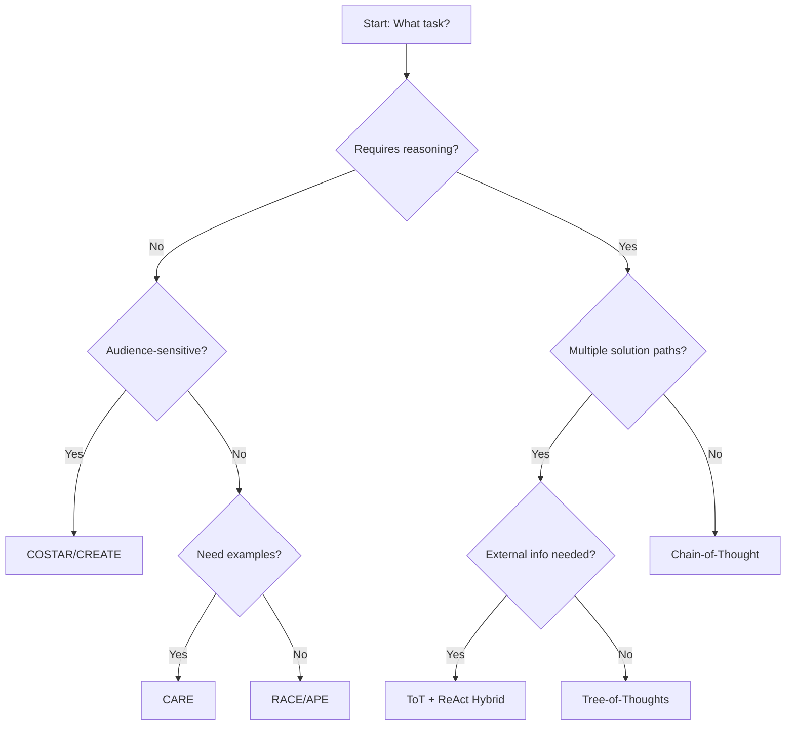

# Extraction Report: 📚Prompt Engineering Frameworks & Methodologies: Comprehensive Reference

> [!info] Auto-Generated Report
> This report was automatically generated by `pkb_extractor.py` on 2026-03-13 04:18.
> **Source**: `reference-comprehensive-prompt-engineering-frameworks-&-methodologies-2025111007.md` | **Items Extracted**: 608

---

## 📋 Document Overview

| Field | Value |
|-------|-------|
| **Source File** | `reference-comprehensive-prompt-engineering-frameworks-&-methodologies-2025111007.md` |
| **Extraction Date** | 2026-03-13 04:18 |
| **Word Count** | 11,247 |
| **Character Count** | 85,333 |
| **Line Count** | 1,464 |
| **Total Items Extracted** | 608 |

### Document Outline

- # 📚 Prompt Engineering Frameworks & Methodologies: Comprehensive Reference
  - ## 📑 Table of Contents
  - ## 1️⃣ ⚙️ Foundational Concepts & Theoretical Underpinnings
    - ### The Genesis of Structured Prompting
    - ### The Role of Frameworks in Systematization
    - ### Theoretical Models of Interaction
    - ### Domain-Specific vs. Universal Frameworks
  - ## 2️⃣ 🏗️ Structural Framework Taxonomies
    - ### Classification by Complexity Level
    - ### Classification by Interaction Pattern
    - ### Classification by Reasoning Depth
    - ### Comparative Framework Analysis
  - ## 3️⃣ 🧠 Cognitive Reasoning Frameworks
    - ### Chain-of-Thought (CoT) Prompting
      - #### Theoretical Foundation
      - #### Implementation Variants
      - #### Empirical Performance
      - #### Critical Analysis
    - ### Tree-of-Thoughts (ToT) Prompting
      - #### Conceptual Framework
      - #### Operational Mechanics
      - #### Performance Characteristics
      - #### Advanced Developments
    - ### ReAct (Reasoning + Acting) Framework
      - #### Foundational Concept
      - #### Thought-Action-Observation Cycle
      - #### Performance and Applications
    - ### Self-Consistency Decoding
    - ### Comparative Analysis of Reasoning Frameworks
  - ## 4️⃣ 🎭 Template-Based Structural Frameworks
    - ### COSTAR Framework
      - #### Component Breakdown
    - ### CRISPE Framework
      - #### Component Analysis
    - ### 5C Framework
      - #### Framework Components
    - ### CREATE Framework
      - #### Component Specifications
    - ### Rhetorical Approach Framework
    - ### Structured Approach (Cummings Method)
    - ### Simple Acronym Frameworks (Rapid Reference)
    - ### Template Framework Comparative Analysis
  - ## 5️⃣ 📊 Evaluation & Measurement Systems
    - ### Core Evaluation Metrics
      - #### Relevance
      - #### Accuracy
      - #### Consistency
      - #### Completeness
      - #### Specificity
      - #### Efficiency
    - ### Automated Evaluation Frameworks
      - #### BLEU Score
      - #### ROUGE Score
      - #### METEOR Score
    - ### Qualitative Evaluation Approaches
      - #### Human Evaluation
      - #### A/B Testing
      - #### User Feedback Loops
    - ### Performance Monitoring
      - #### Key Performance Indicators (KPIs)
      - #### Evaluation Cycles
    - ### Cost-Benefit Analysis
    - ### Evaluation Best Practices
    - ### Evaluation Tools and Platforms
  - ## 6️⃣ 🔬 Advanced & Hybrid Approaches
    - ### Multi-Framework Integration
      - #### CoT + ReAct Synthesis
      - #### ToT + Self-Consistency
    - ### Domain-Adapted Frameworks
    - ### Reflexion and Self-Improvement
    - ### Automatic Reasoning and Tool-use (ART)
    - ### Prompt Templates and Dynamic Prompting
    - ### Principled Instructions Research
    - ### Limitations and Challenges
  - ## 7️⃣ 🎯 Implementation & Production Considerations
    - ### From Prototype to Production
    - ### Safety and Alignment Considerations
    - ### Scalability and Performance
    - ### Version Control and Prompt Management
    - ### Cost Management
    - ### Monitoring and Observability
    - ### Team Collaboration and Knowledge Management
    - ### Ethical and Legal Considerations
    - ### Future-Proofing
  - ## 🎯 Synthesis & Mastery
    - ### Cognitive Models for Framework Selection
    - ### Mental Model: The Communication Stack
    - ### Comparative Framework Philosophy
    - ### The Framework Selection Decision Tree
    - ### Practical Integration Wisdom
    - ### Common Antipatterns to Avoid
    - ### Future Trajectories
  - ## 📊 Metadata & Attribution
    - ### Sources Consulted
  - ## 🔄 Version History
    - ### 🔗 Related Topics for PKB Expansion
  - ## Phase 1: Research & Knowledge Extraction
    - ### Initial Scope Mapping
    - ### Knowledge Gap Analysis Before Research
    - ### Systematic Web Research

---

## 📊 Extraction Summary

| Item Type | Count |
|-----------|-------|
| Callouts | 34 |
| Code Blocks | 6 |
| Color Spans | 0 |
| Definitions | 0 |
| Embeds | 0 |
| External Links | 0 |
| Footnotes | 0 |
| Headings | 100 |
| Inline Fields | 0 |
| Mermaid Diagrams | 1 |
| Tables | 5 |
| Tags | 9 |
| Wiki Links | 131 |
| **TOTAL** | **608** |

---

## 🔔 Callouts (34)

> [!note] What are Callouts?
> Callouts are `> [!TYPE]` blocks used in Obsidian for structured annotation.
> They carry semantic meaning — definitions, insights, warnings, etc.

### By Type

| Callout Type | Count |
|-------------|-------|
| `[!abstract]` | 1 |
| `[!analogy]` | 2 |
| `[!comprehensive-reference]` | 1 |
| `[!connections-and-links]` | 1 |
| `[!core-principle]` | 1 |
| `[!definition]` | 7 |
| `[!equation]` | 1 |
| `[!how-to-use-this]` | 1 |
| `[!key-claim]` | 1 |
| `[!left-off-reading-at]` | 1 |
| `[!methodology-and-sources]` | 4 |
| `[!quick-reference]` | 3 |
| `[!the-philosophy]` | 3 |
| `[!thought-experiment]` | 1 |
| `[!use-cases-and-examples]` | 3 |
| `[!warning]` | 3 |

### Full Callout List

#### 1. [COMPREHENSIVE-REFERENCE] 📚Comprehensive-Reference *(Line 33)*

> [!comprehensive-reference] 📚Comprehensive-Reference
> - **Generated**:: 2025-11-10
> - **Version**:: 1.0
> - **Type**:: Reference Documentation

#### 2. [ABSTRACT] Untitled *(Line 38)*

> [!abstract] Untitled
> **Executive Overview**
> [[Prompt Engineering]] frameworks represent systematic methodologies for structuring interactions with [[Large Language Models]] ([[LLM]]s) to elicit optimal, consistent, and predictable responses. These frameworks evolved from craft-based experimentation to structured, production-grade systems that bridge [[human intent]] with [[machine interpretation]], encompassing everything from simple template-based approaches to sophisticated multi-step reasoning architectures.

#### 3. [HOW-TO-USE-THIS] Untitled *(Line 42)*

> [!how-to-use-this] Untitled
> **Navigation Guide**
> This reference note is organized into seven major sections covering all aspects of prompt engineering frameworks. Use the table of contents below for quick navigation, or search for specific terms using [[wiki-links]]. The document progresses from foundational concepts through advanced techniques, evaluation methodologies, and practical implementation strategies.

#### 4. [LEFT-OFF-READING-AT] Untitled *(Line 58)*

> [!left-off-reading-at] Untitled
> - Last-Read-POS::

#### 5. [DEFINITION] Untitled *(Line 63)*

> [!definition] Untitled
> - **Key-Term**:: [[Prompt Engineering]]
> - **Definition**:: The systematic practice of designing, structuring, and optimizing input queries (prompts) to [[Large Language Models]] to achieve specific, desired outputs with maximum accuracy, relevance, and consistency.

#### 6. [KEY-CLAIM] Untitled *(Line 75)*

> [!key-claim] Untitled
> **Central Principle**
> Effective prompt engineering is not about "tricking" the model, but rather about providing optimal conditions for the model to leverage its training through clear communication structures that mirror how [[Neural Networks]] process and retrieve information.

#### 7. [CORE-PRINCIPLE] Untitled *(Line 101)*

> [!core-principle] Untitled
> **Fundamental Axiom**
> The effectiveness of any prompt engineering framework is determined by its alignment with the model's [[attention mechanisms]], [[Tokenization]] strategies, and [[training objectives]]. Frameworks that work with the model's architecture rather than against it yield superior results.

#### 8. [CONNECTIONS-AND-LINKS] Untitled *(Line 115)*

> [!connections-and-links] Untitled
> **Related Concepts Within This Note**
> - For reasoning-specific frameworks, see [[#🧠 Cognitive Reasoning Frameworks]]
> - For template structures, see [[#🎭 Template-Based Structural Frameworks]]
> - For evaluation approaches, see [[#📊 Evaluation Measurement Systems]]

#### 9. [DEFINITION] Untitled *(Line 125)*

> [!definition] Untitled
> - **Key-Term**:: [[Framework Taxonomy]]
> - **Definition**:: A hierarchical classification system for organizing prompt engineering frameworks based on their structural characteristics, intended use cases, and operational complexity.

#### 10. [USE-CASES-AND-EXAMPLES] Untitled *(Line 173)*

> [!use-cases-and-examples] Untitled
> **Real-World Applications**
> 1. **Context**: Customer service automation
> 2. **Application**: COSTAR framework structures responses based on customer history (context), agent goals (objective), and brand voice (style + tone)
> 3. **Outcome**: Consistent, brand-aligned, context-aware support responses
> 
> ---
> 
> 4. **Context**: Technical documentation generation
> 5. **Application**: CRISPE framework balances analytical precision (Capacity, Insight, Statement) with appropriate tone (Personality) and allows iterative refinement (Experiment)
> 6. **Outcome**: Accurate, appropriately-toned technical content refined through testing

#### 11. [QUICK-REFERENCE] Untitled *(Line 200)*

> [!quick-reference] Untitled
> **Framework Selection Decision Tree**
> - 🔑 **Simple task, clear goal** → Use [[RACE]] or [[APE]]
> - 🔑 **Need examples to guide** → Use [[CARE]]
> - 🔑 **Audience-aware communication** → Use [[COSTAR]]
> - 🔑 **Analytical + exploratory** → Use [[CRISPE]]
> - 🔑 **Complex reasoning required** → Use [[CoT]], [[ToT]], or [[ReAct]]
> - 🔑 **Need systematic refinement** → Use [[5C Framework]]

#### 12. [DEFINITION] Untitled *(Line 213)*

> [!definition] Untitled
> - **Key-Term**:: [[Cognitive Reasoning Frameworks]]
> - **Definition**:: Advanced prompt engineering methodologies that explicitly guide [[Large Language Models]] through multi-step reasoning processes, mimicking human problem-solving strategies through structured thought progression.

#### 13. [EQUATION] Untitled *(Line 241)*

> [!equation] Untitled
> **Performance Scaling Relationship**
> $$\text{Performance}_{\text{CoT}} = f(\text{Model Scale}) \times \text{Reasoning Complexity}$$
> Where performance improvements scale non-linearly with both model parameters and task complexity, with emergent capabilities appearing at sufficient scale.

#### 14. [WARNING] Untitled *(Line 252)*

> [!warning] Untitled
> **Critical Constraints**
> - CoT prompting significantly increases token usage and response latency
> - CoT can introduce more variability, sometimes triggering occasional errors in questions the model would otherwise answer correctly
> - Effectiveness diminishes with newer "reasoning models" that internally implement CoT-like processes
> - Invalid intermediate steps can propagate errors despite generating coherent-seeming reasoning

#### 15. [THOUGHT-EXPERIMENT] Untitled *(Line 294)*

> [!thought-experiment] Untitled
> **Conceptual Model: The Maze Explorer**
> Imagine navigating a complex maze where you can see three steps ahead. Chain-of-Thought is like always walking forward, describing each turn. Tree-of-Thoughts is like mentally exploring multiple paths simultaneously, marking dead ends, and only physically walking the most promising route. When you hit a wall, you backtrack to your last decision point and try a different branch.

#### 16. [USE-CASES-AND-EXAMPLES] Untitled *(Line 298)*

> [!use-cases-and-examples] Untitled
> **Real-World Applications**
> 1. **Context**: Game of 24 mathematical puzzle
> 2. **Application**: ToT generates multiple solution paths, evaluates feasibility of partial solutions, prunes impossible branches, backtracks when needed
> 3. **Outcome**: 74% success rate (b=5) versus 4-9% with standard methods
> 
> ---
> 
> 4. **Context**: Strategic planning with multiple viable approaches
> 5. **Application**: Explore different strategic options simultaneously, evaluate consequences of each path, compare outcomes before committing
> 6. **Outcome**: More robust solutions that consider diverse approaches and avoid local optima

#### 17. [METHODOLOGY-AND-SOURCES] Untitled *(Line 329)*

> [!methodology-and-sources] Untitled
> **Practical Framework: ReAct Prompt Structure**
> 
> **Step 1**: Define the task and available tools
> ```
> Task: [Description]
> Available Actions: Search, Lookup, Finish
> ```
> 
> **Step 2**: Provide few-shot exemplars showing Thought-Action-Observation patterns
> ```
> Question: [Example question]
> Thought 1: [Reasoning about what's needed]
> Action 1: [Tool invocation]
> Observation 1: [Tool output]
> Thought 2: [Reasoning about next steps based on observation]
> Action 2: [Next action]
> Observation 2: [Next output]
> …
> Thought N: [Final reasoning]
> Action N: Finish[answer]
> ```
> 
> **Step 3**: Present the actual task following the same pattern

#### 18. [WARNING] Untitled *(Line 362)*

> [!warning] Untitled
> **Critical Constraints**
> - Requires integration with external tools and APIs
> - Increased latency from multi-turn tool interactions
> - Tool outputs must be properly formatted for model consumption
> - ReAct follows a single reasoning chain, making it less robust than ToT in exploring multiple possibilities simultaneously
> - Depends on the quality and reliability of external information sources

#### 19. [THE-PHILOSOPHY] Untitled *(Line 391)*

> [!the-philosophy] Untitled
> **Underlying Philosophy**
> The evolution from Chain-of-Thought to Tree-of-Thoughts to ReAct represents a progression in how we conceptualize machine reasoning: from linear narrative (human-like explanation) to multi-path exploration (systematic search) to grounded interaction (empirical verification). Each framework embodies different epistemological assumptions about the nature of knowledge and reasoning.

#### 20. [DEFINITION] Untitled *(Line 399)*

> [!definition] Untitled
> - **Key-Term**:: [[Template Framework]]
> - **Definition**:: A structured, reusable prompt pattern that organizes information into predefined categories or components, optimized for specific communication goals or task types.

#### 21. [QUICK-REFERENCE] Untitled *(Line 587)*

> [!quick-reference] Untitled
> **Template Framework Selection Matrix**
> - 📋 **Audience-sensitive communication** → [[COSTAR]]
> - 🔬 **Analytical + experimental balance** → [[CRISPE]]
> - 🎯 **Systematic quality optimization** → [[5C Framework]]
> - 📝 **Character-driven interactions** → [[create]]
> - 🎭 **Persuasive/rhetorical content** → [[Rhetorical Approach]]
> - ⚡ **Quick, simple tasks** → [[RACE]], [[CARE]], [[APE]]

#### 22. [ANALOGY] Untitled *(Line 607)*

> [!analogy] Untitled
> **Illuminating Comparison**
> Think of template frameworks as different types of scaffolding for construction:
> 
> **Simple acronyms (RACE, CARE)** = Ladders: Quick to set up, limited functionality, suitable for small jobs.
> 
> **Comprehensive frameworks (COSTAR, CRISPE)** = Modular scaffolding: Takes time to assemble, highly configurable, supports complex projects.
> 
> **Reasoning frameworks (CoT, ToT)** = Cranes: Expensive to operate, essential for heavy lifting, required for tasks beyond scaffolding's capability.

#### 23. [DEFINITION] Untitled *(Line 621)*

> [!definition] Untitled
> - **Key-Term**:: [[Prompt Evaluation Metrics]]
> - **Definition**:: Quantitative and qualitative measures used to assess the effectiveness, efficiency, and quality of prompts in eliciting desired responses from [[Large Language Models]].

#### 24. [METHODOLOGY-AND-SOURCES] Untitled *(Line 782)*

> [!methodology-and-sources] Untitled
> **Comprehensive Evaluation Protocol**
> 
> **Phase 1: Define Success Criteria**
> - Task-specific metrics (accuracy, completeness, relevance)
> - Performance requirements (latency, cost)
> - Quality standards (fluency, coherence, safety)
> 
> **Phase 2: Establish Baselines**
> - Benchmark performance on validation set
> - Measure TTFT and total latency
> - Calculate token usage and costs
> - Document error patterns
> 
> **Phase 3: Implement Monitoring**
> - Deploy KPI dashboards
> - Set up automated metric collection
> - Establish alert thresholds
> - Create feedback mechanisms
> 
> **Phase 4: Iterative Refinement**
> - Run A/B tests on variants
> - Analyze performance data
> - Identify optimization opportunities
> - Deploy improvements and measure impact
> 
> **Phase 5: Continuous Improvement**
> - Regular evaluation cycles (weekly/monthly)
> - Long-term performance tracking
> - Adaptation to model updates
> - Documentation of learnings

#### 25. [QUICK-REFERENCE] Untitled *(Line 827)*

> [!quick-reference] Untitled
> **Evaluation Metric Selection Guide**
> - 🎯 **Factual accuracy critical** → [[Accuracy]], [[BLEU]], fact-checking against references
> - 💬 **User satisfaction paramount** → [[Relevance]], human evaluation, feedback scores
> - ⚡ **Performance-sensitive application** → [[Latency]], [[Token usage]], [[Cost]]
> - 🔁 **Reliability requirement** → [[Consistency]], multi-run testing, variance analysis
> - 📝 **Comprehensive coverage needed** → [[Completeness]], component checklist, coverage ratio
> - 💰 **Cost optimization focus** → [[Token efficiency]], prompt length, output verbosity

#### 26. [DEFINITION] Untitled *(Line 840)*

> [!definition] Untitled
> - **Key-Term**:: [[Hybrid Prompting]]
> - **Definition**:: The strategic combination of multiple prompt engineering frameworks or techniques to leverage synergistic benefits and address complex use cases that single-framework approaches cannot optimally solve.

#### 27. [WARNING] Untitled *(Line 978)*

> [!warning] Untitled
> **Critical Constraints for Advanced Approaches**
> - **Computational overhead**: Multi-framework approaches multiply token usage and latency
> - **Implementation complexity**: Hybrid systems require careful orchestration and error handling
> - **Brittleness**: Advanced techniques may be more sensitive to prompt variations
> - **Model dependency**: What works on one model may fail on another
> - **Maintenance burden**: Complex prompts are harder to debug and optimize
> - **Cost scaling**: Token-intensive approaches become expensive at scale

#### 28. [USE-CASES-AND-EXAMPLES] Untitled *(Line 987)*

> [!use-cases-and-examples] Untitled
> **Real-World Applications of Hybrid Approaches**
> 
> 1. **Context**: Medical diagnosis support system
> 2. **Application**: Combines domain-adapted MED-Prompt framework with CoT reasoning for differential diagnosis, ReAct for literature verification, and Reflexion for learning from misdiagnoses
> 3. **Outcome**: More accurate diagnostic suggestions with evidence-based support and continuous improvement from feedback
> 
> ---
> 
> 4. **Context**: Legal research and case analysis
> 5. **Application**: ToT explores multiple legal arguments, CoT structures detailed reasoning for each argument, ReAct retrieves relevant precedents and statutes, self-consistency validates conclusions across multiple reasoning paths
> 6. **Outcome**: Comprehensive legal analysis considering multiple perspectives with verified citations and internally consistent conclusions
> 
> ---
> 
> 7. **Context**: Complex financial modeling and forecasting
> 8. **Application**: Domain-adapted framework with financial terminology and regulations, ART for tool use (calculators, data APIs), CoT for multi-step financial reasoning, self-consistency for critical predictions
> 9. **Outcome**: Accurate financial models with transparent reasoning, verified calculations, and robust predictions validated through multiple approaches

#### 29. [DEFINITION] Untitled *(Line 1010)*

> [!definition] Untitled
> - **Key-Term**:: [[Production-Grade Prompting]]
> - **Definition**:: The practice of deploying prompt engineering solutions in real-world applications with considerations for reliability, scalability, maintainability, cost-effectiveness, and safety.

#### 30. [METHODOLOGY-AND-SOURCES] Untitled *(Line 1199)*

> [!methodology-and-sources] Untitled
> **Production Deployment Checklist**
> 
> **Pre-Deployment**
> - [ ] Comprehensive evaluation on diverse test sets
> - [ ] A/B testing completed with statistical significance
> - [ ] Safety and alignment testing passed
> - [ ] Cost projections validated at scale
> - [ ] Monitoring infrastructure in place
> - [ ] Rollback procedures documented
> - [ ] Team training completed
> 
> **Deployment**
> - [ ] Gradual rollout with traffic splitting
> - [ ] Real-time monitoring of key metrics
> - [ ] Alert thresholds configured
> - [ ] Support team briefed on new prompts
> - [ ] User communication prepared
> - [ ] Escalation procedures activated
> 
> **Post-Deployment**
> - [ ] Performance data collection and analysis
> - [ ] User feedback gathering and review
> - [ ] Cost tracking and optimization
> - [ ] Incident documentation and learning
> - [ ] Continuous improvement planning
> - [ ] Regular audit scheduling

#### 31. [THE-PHILOSOPHY] Untitled *(Line 1228)*

> [!the-philosophy] Untitled
> **Underlying Philosophy of Production Prompting**
> The transition from experimentation to production represents a shift from optimizing for peak performance to optimizing for consistent, sustainable, and responsible performance at scale. Production prompting is less about finding the "perfect" prompt and more about building robust systems that perform reliably across diverse conditions, degrade gracefully under stress, and evolve responsibly as models and requirements change.

#### 32. [THE-PHILOSOPHY] Untitled *(Line 1236)*

> [!the-philosophy] Untitled
> **Underlying Philosophy**
> [[Prompt Engineering]] frameworks represent the codification of effective [[human-AI communication]] patterns discovered through systematic experimentation. At their core, these frameworks embody a fundamental insight: [[Large Language Models]] are neither wholly intelligent agents nor simple pattern matchers, but rather sophisticated statistical systems that benefit from structured, intentional communication. The evolution from simple templates to complex reasoning frameworks mirrors humanity's growing understanding of how to collaborate with AI systems—not by anthropomorphizing them, but by understanding their actual mechanisms and designing communication protocols that work with their architecture rather than against it.

#### 33. [ANALOGY] Untitled *(Line 1295)*

> [!analogy] Untitled
> **Illuminating Comparison: The Architecture Metaphor**
> 
> Prompt engineering frameworks are like architectural blueprints for buildings:
> 
> **Simple acronym frameworks** = Basic floor plans: Quick to sketch, suitable for simple structures like sheds or garages. They provide essential structure but limited sophistication.
> 
> **Comprehensive template frameworks** = Detailed architectural drawings: Include elevations, cross-sections, material specifications. Suitable for houses and small commercial buildings. They require more upfront work but result in well-designed structures.
> 
> **Reasoning frameworks** = Engineering specifications: Include structural calculations, load-bearing analyses, dynamic modeling. Essential for skyscrapers, bridges, and complex structures. They're expensive and time-consuming but necessary for projects that can't afford failure.
> 
> Just as you wouldn't use skyscraper engineering for a garden shed (wasteful) or use basic floor plans for a hospital (dangerous), choosing the right prompt framework means matching complexity to need.

#### 34. [METHODOLOGY-AND-SOURCES] Untitled *(Line 1377)*

> [!methodology-and-sources] Untitled
> **Research Methodology**
> - **Primary Sources**: Academic papers on CoT prompting (Wei et al., 2022), ToT (Yao et al., 2023), ReAct (Yao et al., 2022), and empirical studies on prompt engineering effectiveness
> - **Research Queries**: 
>   - "prompt engineering frameworks overview 2024"
>   - "chain-of-thought prompting research paper techniques"
>   - "tree-of-thoughts ReAct prompting framework advanced techniques"
>   - "prompt engineering evaluation metrics best practices 2024"
> - **Synthesis Approach**: Integrated findings from academic research, practitioner guides, industry implementations, and evaluation studies to create comprehensive reference covering theory, practice, and production considerations
> - **Confidence Level**: 
>   - **High**: Core framework definitions, CoT/ToT/ReAct mechanisms, established evaluation metrics
>   - **Medium**: Comparative framework performance, cost-benefit analyses, emerging hybrid approaches
>   - **Evolving**: Production best practices, future trajectories, model-specific optimizations

---

## 🔗 Wiki-Links (131 total, 83 unique targets)

> [!info] Knowledge Graph Connections
> These links represent connections to other notes in your PKB.
> **83** distinct notes are referenced.

### Unique Targets

- [[03_notes/01_permanent-notes/01_cognitive-development/Knowledge Management]]
- [[5C Framework]]
- [[AI Communication Architecture]]
- [[AI systems]]
- [[APE]]
- [[Accuracy]]
- [[Advanced CoT Variations and Research]]
- [[Agentic AI and Multi-Step Reasoning Systems]]
- [[BLEU]]
- [[CARE]]
- [[COSTAR]]
- [[CRISPE]]
- [[Chain-of-Thought]]
- [[CoT]]
- [[Cognitive Reasoning Frameworks]]
- [[Cognitive Science]]
- [[Completeness]]
- [[Consistency]]
- [[Constitutional AI and Value Alignment in Prompts]]
- [[Context Windowing]]
- [[Cost]]
- [[Cost Optimization Strategies for Production LLMs]]
- [[Cross-Lingual Prompt Engineering]]
- [[Domain-Specific Framework Design Patterns]]
- [[Dual-Process Theory]]
- [[Few-Shot Learning Best Practices]]
- [[Framework Taxonomy]]
- [[Generative Ai]]
- [[Hallucination Mitigation Strategies]]
- [[Human-Machine Communication]]
- [[Hybrid Prompting]]
- [[Information Architecture]]
- [[Information Theory]]
- [[Instruction Following]]
- [[Instructional Design]]
- [[LLM]]
- [[LLM Architecture and Its Impact on Prompting]]
- [[LLM Interaction Methodologies]]
- [[Large Language Models]]
- [[Latency]]
- [[Library Science]]
- [[Linguistics]]
- [[Multimodal Prompt Engineering Frameworks]]
- [[Neural Networks]]
- [[PE Frameworks]]
- [[Production-Grade Prompting]]
- [[Prompt Chaining and Workflow Orchestration]]
- [[Prompt Design Systems]]
- [[Prompt Engineering]]
- [[Prompt Engineering for Code Generation]]
- [[Prompt Evaluation Metrics]]
- [[Prompt Injection Defense Mechanisms]]
- [[RACE]]
- [[ReAct]]
- [[Relevance]]
- [[Retrieval-Augmented Generation (RAG) Integration with Prompting]]
- [[Rhetorical]]
- [[Rhetorical Approach]]
- [[Self-Consistency]]
- [[Semantic Precision]]
- [[Semantic Similarity Metrics for Prompt Evaluation]]
- [[Structured Prompting]]
- [[Template Framework]]
- [[ToT]]
- [[Token efficiency]]
- [[Token usage]]
- [[Tokenization]]
- [[Translation]]
- [[Tree-of-Thoughts]]
- [[attention mechanisms]]
- [[code generation]]
- [[create]]
- [[human intent]]
- [[human-AI communication]]
- [[human-computer interaction]]
- [[language models]]
- [[machine interpretation]]
- [[progressive enhancement]]
- [[question answering]]
- [[summarization]]
- [[training objectives]]
- [[user interface design]]
- [[wiki-links]]

### All Occurrences

| # | Target | Display Text | Heading | Section | Line |
|---|--------|-------------|---------|---------|------|
| 1 | [[PE Frameworks]] | — | — | 📚 Prompt Engineering Frameworks & Met... | 31 |
| 2 | [[Prompt Design Systems]] | — | — | 📚 Prompt Engineering Frameworks & Met... | 31 |
| 3 | [[LLM Interaction Methodologies]] | — | — | 📚 Prompt Engineering Frameworks & Met... | 31 |
| 4 | [[Structured Prompting]] | — | — | 📚 Prompt Engineering Frameworks & Met... | 31 |
| 5 | [[AI Communication Architecture]] | — | — | 📚 Prompt Engineering Frameworks & Met... | 31 |
| 6 | [[Prompt Engineering]] | — | — | 📚 Prompt Engineering Frameworks & Met... | 40 |
| 7 | [[Large Language Models]] | — | — | 📚 Prompt Engineering Frameworks & Met... | 40 |
| 8 | [[LLM]] | — | — | 📚 Prompt Engineering Frameworks & Met... | 40 |
| 9 | [[human intent]] | — | — | 📚 Prompt Engineering Frameworks & Met... | 40 |
| 10 | [[machine interpretation]] | — | — | 📚 Prompt Engineering Frameworks & Met... | 40 |
| 11 | [[wiki-links]] | — | — | 📚 Prompt Engineering Frameworks & Met... | 44 |
| 12 | [[Prompt Engineering]] | — | — | 1️⃣ ⚙️ Foundational Concepts & Theore... | 64 |
| 13 | [[Large Language Models]] | — | — | 1️⃣ ⚙️ Foundational Concepts & Theore... | 65 |
| 14 | [[Prompt Engineering]] | — | — | The Genesis of Structured Prompting | 69 |
| 15 | [[Human-Machine Communication]] | — | — | The Genesis of Structured Prompting | 69 |
| 16 | [[Generative Ai]] | — | — | The Genesis of Structured Prompting | 69 |
| 17 | [[language models]] | — | — | The Genesis of Structured Prompting | 69 |
| 18 | [[AI systems]] | — | — | The Genesis of Structured Prompting | 69 |
| 19 | [[Cognitive Science]] | — | — | The Genesis of Structured Prompting | 71 |
| 20 | [[Linguistics]] | — | — | The Genesis of Structured Prompting | 71 |
| 21 | [[Information Theory]] | — | — | The Genesis of Structured Prompting | 71 |
| 22 | [[Semantic Precision]] | — | — | The Genesis of Structured Prompting | 71 |
| 23 | [[Context Windowing]] | — | — | The Genesis of Structured Prompting | 71 |
| 24 | [[Instruction Following]] | — | — | The Genesis of Structured Prompting | 71 |
| 25 | [[user interface design]] | — | — | The Genesis of Structured Prompting | 73 |
| 26 | [[human-computer interaction]] | — | — | The Genesis of Structured Prompting | 73 |
| 27 | [[Neural Networks]] | — | — | The Genesis of Structured Prompting | 77 |
| 28 | [[Dual-Process Theory]] | — | — | Theoretical Models of Interaction | 95 |
| 29 | [[Information Architecture]] | — | — | Theoretical Models of Interaction | 97 |
| 30 | [[Library Science]] | — | — | Theoretical Models of Interaction | 97 |
| 31 | [[03_notes/01_permanent-notes/01_cognitive-development/Knowledge Management]] | — | — | Theoretical Models of Interaction | 97 |
| 32 | [[Instructional Design]] | — | — | Theoretical Models of Interaction | 99 |
| 33 | [[attention mechanisms]] | — | — | Theoretical Models of Interaction | 103 |
| 34 | [[Tokenization]] | — | — | Theoretical Models of Interaction | 103 |
| 35 | [[training objectives]] | — | — | Theoretical Models of Interaction | 103 |
| 36 | [[create]] | — | — | Domain-Specific vs. Universal Frameworks | 109 |
| 37 | [[COSTAR]] | — | — | Domain-Specific vs. Universal Frameworks | 109 |
| 38 | [[5C Framework]] | — | — | Domain-Specific vs. Universal Frameworks | 109 |
| 39 | [[code generation]] | — | — | Domain-Specific vs. Universal Frameworks | 113 |
| 40 | [[summarization]] | — | — | Domain-Specific vs. Universal Frameworks | 113 |
| 41 | [[Translation]] | — | — | Domain-Specific vs. Universal Frameworks | 113 |
| 42 | [[question answering]] | — | — | Domain-Specific vs. Universal Frameworks | 113 |
| 43 | [[Framework Taxonomy]] | — | — | 2️⃣ 🏗️ Structural Framework Taxonomies | 126 |
| 44 | [[RACE]] | — | — | Classification by Complexity Level | 135 |
| 45 | [[APE]] | — | — | Classification by Complexity Level | 136 |
| 46 | [[CARE]] | — | — | Classification by Complexity Level | 137 |
| 47 | [[Chain-of-Thought]] | — | — | Classification by Complexity Level | 150 |
| 48 | [[CoT]] | — | — | Classification by Complexity Level | 150 |
| 49 | [[Tree-of-Thoughts]] | — | — | Classification by Complexity Level | 151 |
| 50 | [[ToT]] | — | — | Classification by Complexity Level | 151 |
| 51 | [[ReAct]] | — | — | Classification by Complexity Level | 152 |
| 52 | [[Self-Consistency]] | — | — | Classification by Complexity Level | 153 |
| 53 | [[RACE]] | — | — | Comparative Framework Analysis | 189 |
| 54 | [[APE]] | — | — | Comparative Framework Analysis | 190 |
| 55 | [[CARE]] | — | — | Comparative Framework Analysis | 191 |
| 56 | [[create]] | — | — | Comparative Framework Analysis | 192 |
| 57 | [[COSTAR]] | — | — | Comparative Framework Analysis | 193 |
| 58 | [[CRISPE]] | — | — | Comparative Framework Analysis | 194 |
| 59 | [[5C Framework]] | — | — | Comparative Framework Analysis | 195 |
| 60 | [[Chain-of-Thought]] | — | — | Comparative Framework Analysis | 196 |
| 61 | [[Tree-of-Thoughts]] | — | — | Comparative Framework Analysis | 197 |
| 62 | [[ReAct]] | — | — | Comparative Framework Analysis | 198 |
| 63 | [[RACE]] | — | — | Comparative Framework Analysis | 202 |
| 64 | [[APE]] | — | — | Comparative Framework Analysis | 202 |
| 65 | [[CARE]] | — | — | Comparative Framework Analysis | 203 |
| 66 | [[COSTAR]] | — | — | Comparative Framework Analysis | 204 |
| 67 | [[CRISPE]] | — | — | Comparative Framework Analysis | 205 |
| 68 | [[CoT]] | — | — | Comparative Framework Analysis | 206 |
| 69 | [[ToT]] | — | — | Comparative Framework Analysis | 206 |
| 70 | [[ReAct]] | — | — | Comparative Framework Analysis | 206 |
| 71 | [[5C Framework]] | — | — | Comparative Framework Analysis | 207 |
| 72 | [[Cognitive Reasoning Frameworks]] | — | — | 3️⃣ 🧠 Cognitive Reasoning Frameworks | 214 |
| 73 | [[Large Language Models]] | — | — | 3️⃣ 🧠 Cognitive Reasoning Frameworks | 215 |
| 74 | [[CoT]] | — | — | Comparative Analysis of Reasoning Fra... | 386 |
| 75 | [[ToT]] | — | — | Comparative Analysis of Reasoning Fra... | 387 |
| 76 | [[ReAct]] | — | — | Comparative Analysis of Reasoning Fra... | 388 |
| 77 | [[Self-Consistency]] | — | — | Comparative Analysis of Reasoning Fra... | 389 |
| 78 | [[Template Framework]] | — | — | 4️⃣ 🎭 Template-Based Structural Frame... | 400 |
| 79 | [[COSTAR]] | — | — | Simple Acronym Frameworks (Rapid Refe... | 589 |
| 80 | [[CRISPE]] | — | — | Simple Acronym Frameworks (Rapid Refe... | 590 |
| 81 | [[5C Framework]] | — | — | Simple Acronym Frameworks (Rapid Refe... | 591 |
| 82 | [[create]] | — | — | Simple Acronym Frameworks (Rapid Refe... | 592 |
| 83 | [[Rhetorical Approach]] | — | — | Simple Acronym Frameworks (Rapid Refe... | 593 |
| 84 | [[RACE]] | — | — | Simple Acronym Frameworks (Rapid Refe... | 594 |
| 85 | [[CARE]] | — | — | Simple Acronym Frameworks (Rapid Refe... | 594 |
| 86 | [[APE]] | — | — | Simple Acronym Frameworks (Rapid Refe... | 594 |
| 87 | [[COSTAR]] | — | — | Template Framework Comparative Analysis | 600 |
| 88 | [[CRISPE]] | — | — | Template Framework Comparative Analysis | 601 |
| 89 | [[5C Framework]] | — | — | Template Framework Comparative Analysis | 602 |
| 90 | [[create]] | — | — | Template Framework Comparative Analysis | 603 |
| 91 | [[Rhetorical]] | — | — | Template Framework Comparative Analysis | 604 |
| 92 | [[RACE]] | — | — | Template Framework Comparative Analysis | 605 |
| 93 | [[CARE]] | — | — | Template Framework Comparative Analysis | 605 |
| 94 | [[Prompt Evaluation Metrics]] | — | — | 5️⃣ 📊 Evaluation & Measurement Systems | 622 |
| 95 | [[Large Language Models]] | — | — | 5️⃣ 📊 Evaluation & Measurement Systems | 623 |
| 96 | [[Accuracy]] | — | — | Evaluation Tools and Platforms | 829 |
| 97 | [[BLEU]] | — | — | Evaluation Tools and Platforms | 829 |
| 98 | [[Relevance]] | — | — | Evaluation Tools and Platforms | 830 |
| 99 | [[Latency]] | — | — | Evaluation Tools and Platforms | 831 |
| 100 | [[Token usage]] | — | — | Evaluation Tools and Platforms | 831 |
| 101 | [[Cost]] | — | — | Evaluation Tools and Platforms | 831 |
| 102 | [[Consistency]] | — | — | Evaluation Tools and Platforms | 832 |
| 103 | [[Completeness]] | — | — | Evaluation Tools and Platforms | 833 |
| 104 | [[Token efficiency]] | — | — | Evaluation Tools and Platforms | 834 |
| 105 | [[Hybrid Prompting]] | — | — | 6️⃣ 🔬 Advanced & Hybrid Approaches | 841 |
| 106 | [[Production-Grade Prompting]] | — | — | 7️⃣ 🎯 Implementation & Production Con... | 1011 |
| 107 | [[Prompt Engineering]] | — | — | 🎯 Synthesis & Mastery | 1238 |
| 108 | [[human-AI communication]] | — | — | 🎯 Synthesis & Mastery | 1238 |
| 109 | [[Large Language Models]] | — | — | 🎯 Synthesis & Mastery | 1238 |
| 110 | [[RACE]] | — | — | Cognitive Models for Framework Selection | 1249 |
| 111 | [[CARE]] | — | — | Cognitive Models for Framework Selection | 1249 |
| 112 | [[APE]] | — | — | Cognitive Models for Framework Selection | 1249 |
| 113 | [[CoT]] | — | — | Cognitive Models for Framework Selection | 1256 |
| 114 | [[ToT]] | — | — | Cognitive Models for Framework Selection | 1256 |
| 115 | [[ReAct]] | — | — | Cognitive Models for Framework Selection | 1256 |
| 116 | [[progressive enhancement]] | — | — | Practical Integration Wisdom | 1337 |
| 117 | [[Advanced CoT Variations and Research]] | — | — | 🔗 Related Topics for PKB Expansion | 1417 |
| 118 | [[Multimodal Prompt Engineering Frameworks]] | — | — | 🔗 Related Topics for PKB Expansion | 1418 |
| 119 | [[Domain-Specific Framework Design Patterns]] | — | — | 🔗 Related Topics for PKB Expansion | 1419 |
| 120 | [[Prompt Injection Defense Mechanisms]] | — | — | 🔗 Related Topics for PKB Expansion | 1420 |
| 121 | [[Cost Optimization Strategies for Production LLMs]] | — | — | 🔗 Related Topics for PKB Expansion | 1421 |
| 122 | [[Prompt Engineering for Code Generation]] | — | — | 🔗 Related Topics for PKB Expansion | 1422 |
| 123 | [[Few-Shot Learning Best Practices]] | — | — | 🔗 Related Topics for PKB Expansion | 1423 |
| 124 | [[Semantic Similarity Metrics for Prompt Evaluation]] | — | — | 🔗 Related Topics for PKB Expansion | 1424 |
| 125 | [[LLM Architecture and Its Impact on Prompting]] | — | — | 🔗 Related Topics for PKB Expansion | 1425 |
| 126 | [[Agentic AI and Multi-Step Reasoning Systems]] | — | — | 🔗 Related Topics for PKB Expansion | 1426 |
| 127 | [[Prompt Chaining and Workflow Orchestration]] | — | — | 🔗 Related Topics for PKB Expansion | 1427 |
| 128 | [[Constitutional AI and Value Alignment in Prompts]] | — | — | 🔗 Related Topics for PKB Expansion | 1428 |
| 129 | [[Retrieval-Augmented Generation (RAG) Integration with Prompting]] | — | — | 🔗 Related Topics for PKB Expansion | 1429 |
| 130 | [[Hallucination Mitigation Strategies]] | — | — | 🔗 Related Topics for PKB Expansion | 1430 |
| 131 | [[Cross-Lingual Prompt Engineering]] | — | — | 🔗 Related Topics for PKB Expansion | 1431 |

---

## 🏷️ Tags (9 occurrences, 7 unique)

### All Unique Tags

`#conversational-ai`, `#instructional-design`, `#llm`, `#pkb`, `#prompt-engineering`, `#topic/psychology`, `#topic/psychology/methodology`

### Hierarchical Tags

- **topic/**
  - `#topic/psychology`
  - `#topic/psychology/methodology`

---

## 💻 Code Blocks (6)

| Language | Count |
|----------|-------|
| `plaintext` | 6 |

### Code Block 1 — `plaintext` *(Lines 333-336)*

```plaintext
> Task: [Description]
> Available Actions: Search, Lookup, Finish
>
```

### Code Block 2 — `plaintext` *(Lines 339-350)*

```plaintext
> Question: [Example question]
> Thought 1: [Reasoning about what's needed]
> Action 1: [Tool invocation]
> Observation 1: [Tool output]
> Thought 2: [Reasoning about next steps based on observation]
> Action 2: [Next action]
> Observation 2: [Next output]
> …
> Thought N: [Final reasoning]
> Action N: Finish[answer]
>
```

### Code Block 3 — `plaintext` *(Lines 858-875)*

```plaintext
Task: Analyze the economic impact of a recent policy change

Thought 1 (CoT): To evaluate economic impact, I need to consider 
GDP effects, employment changes, and sector-specific impacts…

Action 1 (ReAct): Search["recent policy change economic data"]

Observation 1: [Retrieved economic indicators and analysis]

Thought 2 (CoT): Based on the data, employment increased by X% 
in sector Y, suggesting positive impact. However, I should verify 
if this is correlation or causation…

Action 2 (ReAct): Search["sector Y employment trends historical"]

…continuing the cycle…
```

### Code Block 4 — `plaintext` *(Lines 1198-1226)*

```plaintext
> [!methodology-and-sources]
> **Production Deployment Checklist**
> 
> **Pre-Deployment**
> - [ ] Comprehensive evaluation on diverse test sets
> - [ ] A/B testing completed with statistical significance
> - [ ] Safety and alignment testing passed
> - [ ] Cost projections validated at scale
> - [ ] Monitoring infrastructure in place
> - [ ] Rollback procedures documented
> - [ ] Team training completed
> 
> **Deployment**
> - [ ] Gradual rollout with traffic splitting
> - [ ] Real-time monitoring of key metrics
> - [ ] Alert thresholds configured
> - [ ] Support team briefed on new prompts
> - [ ] User communication prepared
> - [ ] Escalation procedures activated
> 
> **Post-Deployment**
> - [ ] Performance data collection and analysis
> - [ ] User feedback gathering and review
> - [ ] Cost tracking and optimization
> - [ ] Incident documentation and learning
> - [ ] Continuous improvement planning
> - [ ] Regular audit scheduling
```

### Code Block 5 — `plaintext` *(Lines 1433-1480)*

```plaintext
<thinking>
This is a comprehensive request for a reference document on Prompt Engineering Frameworks. Let me work through this systematically.

## Phase 1: Research & Knowledge Extraction

### Initial Scope Mapping
THINKING: "The topic 'Prompt Engineering Frameworks' encompasses several major domains…"
* Primary domain: AI/ML interaction methodologies, specifically techniques for optimizing communication with Large Language Models
* Adjacent domains: Cognitive science (how humans structure requests), computational linguistics, software development patterns, instructional design
* Depth requirement: HIGH - This is a rapidly evolving field with both theoretical foundations and practical applications. Need to cover historical development, current state-of-the-art, and emerging practices.

### Knowledge Gap Analysis Before Research
Key areas to investigate:
1. Historical evolution of prompt engineering practices
2. Established frameworks (Chain-of-Thought, Tree-of-Thoughts, ReAct, etc.)
3. Systematic approaches to prompt construction
4. Evaluation methodologies
5. Domain-specific applications
6. Emerging trends and future directions

Let me conduct systematic web research to build a comprehensive knowledge base.

### Systematic Web Research

**Search 1: Foundational Understanding**
QUERY RATIONALE: "I'm searching for 'prompt engineering frameworks overview' to establish the landscape of existing frameworks and their relationships"
EXPECTED INSIGHT: "This should reveal the major categories of frameworks, their historical development, and how they relate to each other"

**Search 2: Technical Specifications**
QUERY RATIONALE: "I need to search for 'chain-of-thought prompting techniques' to understand one of the most foundational frameworks in detail"
# ... (16 more lines truncated)
```

### Code Block 6 — `plaintext` *(Lines 1482-1484)*

```plaintext
I'll create a comprehensive reference document on Prompt Engineering Frameworks. Let me conduct the necessary research first.Now I have sufficient research material. Let me create the comprehensive reference document as specified in the instructions.
```

---

## 📊 Tables (5)

### Table 1 *(Line 187, 10 rows)*

| Framework | Complexity | Components | Best For | Limitations |
| --- | --- | --- | --- | --- |
| [[RACE]] | Simple | 4 | Quick tasks, clear objectives | Limited context handling |
| [[APE]] | Simple | 3 | Goal-oriented tasks | Minimal guidance on execution details |
| [[CARE]] | Simple | 4 | Example-driven learning | Requires good examples |
| [[create]] | Medium | 6 | Character-driven interactions | More setup overhead |
| [[COSTAR]] | Medium | 6 | Professional communications | Requires detailed audience analysis |
| [[CRISPE]] | Medium | 5 | Analytical + creative tasks | Experiment component needs definition |
| [[5C Framework]] | Medium | 5 | Systematic optimization | Requires iterative application |
| [[Chain-of-Thought]] | Advanced | Dynamic | Complex reasoning | Token-intensive |
| [[Tree-of-Thoughts]] | Advanced | Dynamic | Multi-path problems | Computationally expensive |
| [[ReAct]] | Advanced | Dynamic | Tool-augmented tasks | Requires tool integration |

### Table 2 *(Line 375, 4 rows)*

| Framework | Reasoning Pattern | External Tools | Computational Cost | Best Use Case |
| --- | --- | --- | --- | --- |
| [[CoT]] | Linear, sequential | No | Low | Step-by-step logical problems |
| [[ToT]] | Branching, tree-based | No | High | Multi-path exploration problems |
| [[ReAct]] | Cyclic, tool-augmented | Yes | Medium-High | Factual tasks needing verification |
| [[Self-Consistency]] | Parallel sampling | No | Very High | Critical accuracy requirements |

### Table 3 *(Line 589, 6 rows)*

| Framework | Setup Time | Flexibility | Learning Curve | Best For | Weaknesses |
| --- | --- | --- | --- | --- | --- |
| [[COSTAR]] | High | High | Medium | Professional communications | Requires detailed audience analysis |
| [[CRISPE]] | Medium | Very High | Medium | R&D and innovation | Experiment component needs clear definition |
| [[5C Framework]] | Low | Medium | Low | Quality-focused iteration | Requires multiple passes |
| [[create]] | Medium | High | Low | Instructive scenarios | More verbose setup |
| [[Rhetorical]] | High | Medium | High | Persuasive content | Requires rhetorical expertise |
| [[RACE]]/[[CARE]] | Very Low | Low | Very Low | Quick tasks | Limited sophistication |

### Table 4 *(Line 1266, 5 rows)*

| Framework Type | Philosophy | When It Fails | Adaptation Strategy |
| --- | --- | --- | --- |
| **Simple Templates** | "Clear structure enables basic communication" | Complex reasoning required | Add CoT elements or upgrade to comprehensive framework |
| **Comprehensive Templates** | "Detailed specification reduces ambiguity" | Reasoning depth needed | Hybrid with CoT or ToT |
| **CoT** | "Explicit reasoning improves accuracy" | Multiple solution paths viable | Upgrade to ToT |
| **ToT** | "Exploration finds better solutions" | External information needed | Hybrid with ReAct |
| **ReAct** | "Grounding in reality improves reliability" | Pure reasoning without facts | Use standalone for fact-based tasks |

### Table 5 *(Line 1367, 1 rows)*

| Version | Date | Changes |
| --- | --- | --- |
| 1.0 | 2025-11-10 | Initial comprehensive compilation covering all major framework categories, reasoning approaches, evaluation systems, and production considerations |

---

## 📐 Mermaid Diagrams (1)

### Diagram 1 — graph *(Line 1320)*



---

## 🔢 Math Expressions (1)

> [!info] LaTeX Math
> Found 1 display (`$$...$$`) and 0 inline (`$...$`) expressions.

### Display Math (Block Equations)

#### Equation 1 *(Line 233)*

$$
\text{Performance}_{\text{CoT}} = f(\text{Model Scale}) \times \text{Reasoning Complexity}
$$


---

## 🕸️ Knowledge Graph Analysis

### Unique Wiki-Link Targets (83)

> These represent all distinct notes referenced in the source document.
> Each is a candidate for backlink creation in your PKB.

- [[03_notes/01_permanent-notes/01_cognitive-development/Knowledge Management]]
- [[5C Framework]]
- [[AI Communication Architecture]]
- [[AI systems]]
- [[APE]]
- [[Accuracy]]
- [[Advanced CoT Variations and Research]]
- [[Agentic AI and Multi-Step Reasoning Systems]]
- [[BLEU]]
- [[CARE]]
- [[COSTAR]]
- [[CRISPE]]
- [[Chain-of-Thought]]
- [[CoT]]
- [[Cognitive Reasoning Frameworks]]
- [[Cognitive Science]]
- [[Completeness]]
- [[Consistency]]
- [[Constitutional AI and Value Alignment in Prompts]]
- [[Context Windowing]]
- [[Cost]]
- [[Cost Optimization Strategies for Production LLMs]]
- [[Cross-Lingual Prompt Engineering]]
- [[Domain-Specific Framework Design Patterns]]
- [[Dual-Process Theory]]
- [[Few-Shot Learning Best Practices]]
- [[Framework Taxonomy]]
- [[Generative Ai]]
- [[Hallucination Mitigation Strategies]]
- [[Human-Machine Communication]]
- [[Hybrid Prompting]]
- [[Information Architecture]]
- [[Information Theory]]
- [[Instruction Following]]
- [[Instructional Design]]
- [[LLM]]
- [[LLM Architecture and Its Impact on Prompting]]
- [[LLM Interaction Methodologies]]
- [[Large Language Models]]
- [[Latency]]
- [[Library Science]]
- [[Linguistics]]
- [[Multimodal Prompt Engineering Frameworks]]
- [[Neural Networks]]
- [[PE Frameworks]]
- [[Production-Grade Prompting]]
- [[Prompt Chaining and Workflow Orchestration]]
- [[Prompt Design Systems]]
- [[Prompt Engineering]]
- [[Prompt Engineering for Code Generation]]
- [[Prompt Evaluation Metrics]]
- [[Prompt Injection Defense Mechanisms]]
- [[RACE]]
- [[ReAct]]
- [[Relevance]]
- [[Retrieval-Augmented Generation (RAG) Integration with Prompting]]
- [[Rhetorical]]
- [[Rhetorical Approach]]
- [[Self-Consistency]]
- [[Semantic Precision]]
- [[Semantic Similarity Metrics for Prompt Evaluation]]
- [[Structured Prompting]]
- [[Template Framework]]
- [[ToT]]
- [[Token efficiency]]
- [[Token usage]]
- [[Tokenization]]
- [[Translation]]
- [[Tree-of-Thoughts]]
- [[attention mechanisms]]
- [[code generation]]
- [[create]]
- [[human intent]]
- [[human-AI communication]]
- [[human-computer interaction]]
- [[language models]]
- [[machine interpretation]]
- [[progressive enhancement]]
- [[question answering]]
- [[summarization]]
- [[training objectives]]
- [[user interface design]]
- [[wiki-links]]

---

## 📁 Raw Data

> [!abstract] JSON File Available
> The full machine-readable extraction is saved alongside this report as:
> `reference-comprehensive-prompt-engineering-frameworks-&-methodologies-2025111007_extracted.json`

---

*Report generated by `pkb_extractor.py v1.1.0` · 2026-03-13 04:18:56*