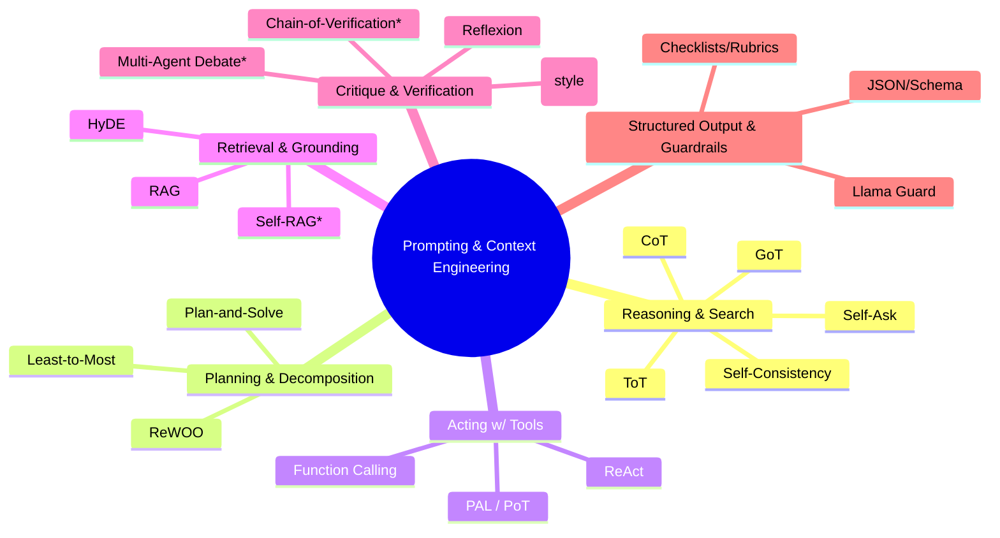

# Extraction Report: Reference_Prompting-Scaffolds_🆔20251022171207

> [!info] Auto-Generated Report
> This report was automatically generated by `pkb_extractor.py` on 2026-03-13 04:18.
> **Source**: `reference-prompting-scaffolds-🆔20251022171207.md` | **Items Extracted**: 174

---

## 📋 Document Overview

| Field | Value |
|-------|-------|
| **Source File** | `reference-prompting-scaffolds-🆔20251022171207.md` |
| **Extraction Date** | 2026-03-13 04:18 |
| **Word Count** | 3,146 |
| **Character Count** | 24,722 |
| **Line Count** | 448 |
| **Total Items Extracted** | 174 |

### Document Outline

- # Prompting Scaffolds & Frameworks — Master Reference (2025-10-22)
  - ## Plan of Attack (Deconstruct → Research → Synthesize → Compose)
  - ## Literature & Source Backbone (for verification)
  - ## Visual Map of the Space
- # Drop-in Scaffolds (Paste into your prompts)
  - ## Scaffold (ReAct-Loop)
  - ## Task Frame (SCQA-T)
- # Persona Card:
  - ## Role
  - ## Directive
  - ## Constraints
- # Technique Cards (what it is • how it works • how to use)
  - ## Reasoning & Search
  - ## Planning & Decomposition
  - ## Acting with Tools & Code
  - ## Retrieval & Grounding
  - ## Critique, Verification & Multi-Agent Patterns
  - ## Structured Output & Guardrails
  - ## Practitioner Frameworks (community patterns you’ll see in the wild)
- # Paste-Ready Examples (Persona + Frame + Technique)
- # Persona Card:
  - ## Role
  - ## Directive
  - ## Constraints
  - ## Task Frame (SCQA-T)
  - ## More Technique Cards (compact set you can slot anywhere)
  - ## Operational “How-To” Notes (turning methods into SOPs)
  - ## Reusable Snippets (drop into templates)
  - ## Cross-links (create these notes in your PKB)
  - ## Citations (anchor points for each family)
    - ### 🔗 Related Topics for PKB Expansion

---

## 📊 Extraction Summary

| Item Type | Count |
|-----------|-------|
| Callouts | 17 |
| Code Blocks | 37 |
| Color Spans | 0 |
| Definitions | 0 |
| Embeds | 0 |
| External Links | 13 |
| Footnotes | 0 |
| Headings | 31 |
| Inline Fields | 0 |
| Mermaid Diagrams | 1 |
| Tables | 0 |
| Tags | 0 |
| Wiki Links | 60 |
| **TOTAL** | **174** |

---

## 🔔 Callouts (17)

> [!note] What are Callouts?
> Callouts are `> [!TYPE]` blocks used in Obsidian for structured annotation.
> They carry semantic meaning — definitions, insights, warnings, etc.

### By Type

| Callout Type | Count |
|-------------|-------|
| `[!abstract]` | 1 |
| `[!check]` | 1 |
| `[!definition]` | 1 |
| `[!example]` | 2 |
| `[!hint]` | 1 |
| `[!info]` | 2 |
| `[!note]` | 1 |
| `[!plan]` | 1 |
| `[!quote]` | 1 |
| `[!summary]` | 1 |
| `[!the-purpose]` | 1 |
| `[!tip]` | 2 |
| `[!warning]` | 2 |

### Full Callout List

#### 1. [THE-PURPOSE] Untitled *(Line 26)*

> [!the-purpose] Untitled
> **What this note is**
> A PKB-ready, living catalogue of the most useful **prompting / context-engineering scaffolds**. It blends peer-reviewed methods with widely-adopted practitioner frameworks, each given a compact “technique card,” persona and task frames you can paste into `[[Obsidian]]`, and links to source literature for verification and deeper study.

#### 2. [PLAN] How I built this *(Line 34)*

> [!plan] How I built this
> **Deconstruct.** I mapped the space into families: Reasoning & Search; Planning & Decomposition; Acting with Tools; Retrieval & Grounding; Critique & Verification; Structured Output & Guardrails; Community prompt patterns.
> **Research.** I pulled primary papers and official docs for each family (arXiv/NeurIPS/ICLR, Anthropic/OpenAI docs), favoring methods with reproducible gains or broad adoption. ([arXiv][1])
> **Synthesize.** I normalized each method into a **Technique Card** (what/why/how + best practices), plus drop-in scaffolds and persona frames.
> **Compose.** Everything here is **PKB-ready Markdown** with `[[wiki-links]]`, callouts, and a small `mermaid` map to keep it navigable.

#### 3. [ABSTRACT] Core references (representative, not exhaustive) *(Line 44)*

> [!abstract] Core references (representative, not exhaustive)
> • **RAG** (retrieval-augmented generation): Lewis et al. (NeurIPS 2020). ([arXiv][1])
> • **ReAct** (reason+act loops): Yao et al. (ICLR 2023).
> • **Chain-of-Thought** (CoT): Wei et al. (2022). **Self-Consistency**: Wang et al. (ICLR 2023). ([arXiv][2])
> • **Tree-of-Thoughts** (ToT) and **Graph-of-Thoughts** (GoT): 2023–2024. 
> • **Self-Ask with Search** (decomposed Q→sub-Q): Press et al. (EMNLP Findings 2023). ([arXiv][3])
> • **Least-to-Most Prompting** (LtM): Zhou et al. (ICLR 2023). ([arXiv][4])
> • **Reflexion** (self-reflection RL without weight updates): Shinn et al. (2023/2024). ([arXiv][5])
> • **PAL / PoT** (program-aided reasoning): Gao et al. (2022/2023). ([arXiv][6])
> • **HyDE** (hypothetical documents for retrieval): Gao et al. (2022), plus practical docs. ([arXiv][7])
> • **Constitutional AI** (principle-guided self-critique): Anthropic research posts (2022–2024+). ([Anthropic][8])
> • **Structured Output / Function Calling** (schema-guided generation): OpenAI docs. ([OpenAI Platform][9])
> • **Guardrails** (Llama Guard; policy classifiers): Meta/FAIR (2023). ([arXiv][10])

#### 4. [DEFINITION] Untitled *(Line 66)*

> [!definition] Untitled
> Contents

#### 5. [NOTE] *Asterisks mark areas with multiple competing variants or active research lines; your `[[Obsidian]]` notes can branch these further.* *(Line 104)*

> [!note] *Asterisks mark areas with multiple competing variants or active research lines; your `[[Obsidian]]` notes can branch these further.*

#### 6. [TIP] Paste-ready**: Combine a **Persona Card** + **SCQA-T** + one **Technique Card** below to build robust, reusable prompts. *(Line 146)*

> [!tip] Paste-ready**: Combine a **Persona Card** + **SCQA-T** + one **Technique Card** below to build robust, reusable prompts.

#### 7. [HINT] Format *(Line 152)*

> [!hint] Format
> *Technique:* `[[Name (Acronym)]]`
> *Description:* 4–5 sentences on mechanism and use.
> *Best Practices:* Concrete heuristics you can operationalize.

#### 8. [WARNING] On Self-RAG / Corrective-RAG *(Line 245)*

> [!warning] On Self-RAG / Corrective-RAG
> Research-grade variants that add **critique/retrieve/rewrite** cycles or retrieval **self-grading** can reduce hallucinations, but require extra plumbing. Treat them as extensions to your base `[[RAG]]` note and log settings as part of your SOPs.

#### 9. [INFO] These are not research papers but **widely used prompt shapes** that help you structure instructions and context. Treat them as **starter templates** you customize per task. *(Line 302)*

> [!info] These are not research papers but **widely used prompt shapes** that help you structure instructions and context. Treat them as **starter templates** you customize per task.

#### 10. [EXAMPLE] Persona + SCQA-T + ReAct (tools) *(Line 326)*

> [!example] Persona + SCQA-T + ReAct (tools)
> Use this when you need **search/tool** work plus visible reasoning.

#### 11. [TIP] Choosing a scaffold *(Line 392)*

> [!tip] Choosing a scaffold
> Start simple (CoT → SC) → add **planning** (LtM) → add **tools** (ReAct/Function Calling) → add **grounding** (RAG/HyDE) → add **verification** (CoVe/Reflexion) → wrap with **schemas & guardrails** (JSON/Policies).

#### 12. [EXAMPLE] Minimal HyDE-RAG capture (for your vault) *(Line 395)*

> [!example] Minimal HyDE-RAG capture (for your vault)
> 1. Generate 3 concise hypotheticals ≤200 words each; 2) embed & average; 3) retrieve top-k; 4) write with **inline citations**; 5) `Chain-of-Verification`. ([arXiv][7])

#### 13. [WARNING] Common failure modes *(Line 399)*

> [!warning] Common failure modes
> Over-branching (ToT/GoT) → cost blow-ups; missing **acceptance criteria** (LtM/Plan-and-Solve); unvalidated tool outputs (ReAct/PAL); schema drift (JSON/Functions) if enums/regex aren’t enforced.

#### 14. [CHECK] Acceptance Criteria *(Line 407)*

> [!check] Acceptance Criteria
> - All numeric claims recomputed or cited.
> - Each section mapped to at least one source (or marked "no evidence").
> - Final JSON validates against schema; include human-readable summary.

#### 15. [QUOTE] Constitution (short) *(Line 414)*

> [!quote] Constitution (short)
> 1) Be accurate and cite sources. 2) Avoid speculation; label uncertainty. 3) Prefer primary literature. 4) Respect safety guidelines. 5) If unsure, propose tests. 6) No fabricated citations.

#### 16. [SUMMARY] Self-Reflection (Reflexion) *(Line 419)*

> [!summary] Self-Reflection (Reflexion)
> What failed? Why? What change will prevent recurrence next time? One concrete rule to add to memory.

#### 17. [INFO] Scope note *(Line 446)*

> [!info] Scope note
> This note intentionally prioritizes **load-bearing methods** with research or wide adoption. If you want an **exhaustive** long-tail list (e.g., PromptBreeder/GRIPS/DSPy learning loops), say the word and I’ll add an appendix with implementation-level guidance and Obsidian templates.

---

## 🔗 Wiki-Links (60 total, 51 unique targets)

> [!info] Knowledge Graph Connections
> These links represent connections to other notes in your PKB.
> **51** distinct notes are referenced.

### Unique Targets

- [[Agentic Workflows in Obsidian (Dataview logs, Reflexion memories)]]
- [[Algorithm-of-Thought (AoT)]]
- [[CRISPE]]
- [[Chain-of-Thought|Chain-of-Thought (CoT)]]
- [[Chain-of-Verification]]
- [[Chain-of-Verification|Chain-of-Verification (CoVe)]]
- [[Constitutional-AI|Constitutional AI (Prompt style)]]
- [[Constitutional-AI|Constitutional AI (Prompt-Style Variant)]]
- [[Evaluation Harnesses for Prompts (Rubrics, Benchmarks, Human-in-the-Loop)]]
- [[Function Calling / Tools]]
- [[Function Calling / Tools (Structured APIs)]]
- [[Graph-of-Thoughts]]
- [[Graph-of-Thoughts (GoT)]]
- [[Guarded I/O]]
- [[Guardrails / Llama Guard]]
- [[Guardrails: Llama Guard / Policy Classifiers]]
- [[HyDE]]
- [[HyDE (Hypothetical Document Embeddings)]]
- [[JSON-First Answer]]
- [[LLM-as-a-Judge]]
- [[LLM-as-a-Judge / Rubric Grading]]
- [[Least-to-Most Prompting]]
- [[Least-to-Most Prompting (LtM)]]
- [[Multi-Agent Debate]]
- [[Multi-Agent Debate / Deliberation]]
- [[Name (Acronym)]]
- [[Obsidian]]
- [[PAL (Program-Aided LMs) / PoT]]
- [[PAL / Program-of-Thoughts]]
- [[Plan → Execute → Verify (PEV)]]
- [[Plan-and-Solve]]
- [[Plan-and-Solve / ReWOO-style]]
- [[RAG]]
- [[RAG (Retrieval-Augmented Generation)]]
- [[RAG Architecture Patterns (Indices, Chunking, Caching)]]
- [[RICCE]]
- [[RICCE / RICES / RICCE-T]]
- [[ReAct]]
- [[ReWOO]]
- [[Reflexion]]
- [[SCQA]]
- [[SCQA (Minto Pyramid)]]
- [[Safety Pass / Constitutional Critique]]
- [[Self-Ask with Search]]
- [[Self-Consistency]]
- [[Self-Consistency|Self-Consistency (SC)]]
- [[Structured Output (JSON/Schemas)]]
- [[Tree-of-Thoughts]]
- [[Tree-of-Thoughts|Tree-of-Thoughts (ToT)]]
- [[wiki-links]]
- [[Zero-Shot CoT (“Let’s think step by step”)]]

### All Occurrences

| # | Target | Display Text | Heading | Section | Line |
|---|--------|-------------|---------|---------|------|
| 1 | [[Obsidian]] | — | — | Prompting Scaffolds & Frameworks — Ma... | 28 |
| 2 | [[wiki-links]] | — | — | Plan of Attack (Deconstruct → Researc... | 38 |
| 3 | [[Obsidian]] | — | — | Visual Map of the Space | 104 |
| 4 | [[Name (Acronym)]] | — | — | Technique Cards (what it is • how it ... | 153 |
| 5 | [[Chain-of-Thought|Chain-of-Thought (CoT)]] | — | — | Reasoning & Search | 162 |
| 6 | [[Self-Consistency|Self-Consistency (SC)]] | — | — | Reasoning & Search | 168 |
| 7 | [[Self-Ask with Search]] | — | — | Reasoning & Search | 174 |
| 8 | [[Tree-of-Thoughts|Tree-of-Thoughts (ToT)]] | — | — | Reasoning & Search | 180 |
| 9 | [[Graph-of-Thoughts (GoT)]] | — | — | Reasoning & Search | 186 |
| 10 | [[Least-to-Most Prompting (LtM)]] | — | — | Planning & Decomposition | 196 |
| 11 | [[Plan-and-Solve / ReWOO-style]] | — | — | Planning & Decomposition | 202 |
| 12 | [[ReAct]] | — | — | Acting with Tools & Code | 212 |
| 13 | [[Function Calling / Tools (Structured APIs)]] | — | — | Acting with Tools & Code | 218 |
| 14 | [[PAL (Program-Aided LMs) / PoT]] | — | — | Acting with Tools & Code | 224 |
| 15 | [[Obsidian]] | — | — | Acting with Tools & Code | 226 |
| 16 | [[RAG (Retrieval-Augmented Generation)]] | — | — | Retrieval & Grounding | 234 |
| 17 | [[HyDE (Hypothetical Document Embeddings)]] | — | — | Retrieval & Grounding | 240 |
| 18 | [[RAG]] | — | — | Retrieval & Grounding | 246 |
| 19 | [[Reflexion]] | — | — | Critique, Verification & Multi-Agent ... | 253 |
| 20 | [[Constitutional-AI|Constitutional AI (Prompt-Style Variant)]] | — | — | Critique, Verification & Multi-Agent ... | 259 |
| 21 | [[LLM-as-a-Judge / Rubric Grading]] | — | — | Critique, Verification & Multi-Agent ... | 265 |
| 22 | [[Multi-Agent Debate / Deliberation]] | — | — | Critique, Verification & Multi-Agent ... | 271 |
| 23 | [[Chain-of-Verification|Chain-of-Verification (CoVe)]] | — | — | Critique, Verification & Multi-Agent ... | 277 |
| 24 | [[Structured Output (JSON/Schemas)]] | — | — | Structured Output & Guardrails | 287 |
| 25 | [[Guardrails: Llama Guard / Policy Classifiers]] | — | — | Structured Output & Guardrails | 293 |
| 26 | [[CRISPE]] | — | — | Practitioner Frameworks (community pa... | 305 |
| 27 | [[RICCE / RICES / RICCE-T]] | — | — | Practitioner Frameworks (community pa... | 311 |
| 28 | [[SCQA (Minto Pyramid)]] | — | — | Practitioner Frameworks (community pa... | 317 |
| 29 | [[Zero-Shot CoT (“Let’s think step by step”)]] | — | — | More Technique Cards (compact set you... | 365 |
| 30 | [[Algorithm-of-Thought (AoT)]] | — | — | More Technique Cards (compact set you... | 369 |
| 31 | [[Plan → Execute → Verify (PEV)]] | — | — | More Technique Cards (compact set you... | 373 |
| 32 | [[JSON-First Answer]] | — | — | More Technique Cards (compact set you... | 377 |
| 33 | [[Safety Pass / Constitutional Critique]] | — | — | More Technique Cards (compact set you... | 381 |
| 34 | [[Guarded I/O]] | — | — | More Technique Cards (compact set you... | 385 |
| 35 | [[Chain-of-Thought|Chain-of-Thought (CoT)]] | — | — | Cross-links (create these notes in yo... | 427 |
| 36 | [[Self-Consistency]] | — | — | Cross-links (create these notes in yo... | 427 |
| 37 | [[Self-Ask with Search]] | — | — | Cross-links (create these notes in yo... | 427 |
| 38 | [[Tree-of-Thoughts]] | — | — | Cross-links (create these notes in yo... | 427 |
| 39 | [[Graph-of-Thoughts]] | — | — | Cross-links (create these notes in yo... | 427 |
| 40 | [[Least-to-Most Prompting]] | — | — | Cross-links (create these notes in yo... | 427 |
| 41 | [[Plan-and-Solve]] | — | — | Cross-links (create these notes in yo... | 427 |
| 42 | [[ReWOO]] | — | — | Cross-links (create these notes in yo... | 427 |
| 43 | [[ReAct]] | — | — | Cross-links (create these notes in yo... | 427 |
| 44 | [[Function Calling / Tools]] | — | — | Cross-links (create these notes in yo... | 427 |
| 45 | [[PAL / Program-of-Thoughts]] | — | — | Cross-links (create these notes in yo... | 427 |
| 46 | [[RAG]] | — | — | Cross-links (create these notes in yo... | 427 |
| 47 | [[HyDE]] | — | — | Cross-links (create these notes in yo... | 427 |
| 48 | [[Reflexion]] | — | — | Cross-links (create these notes in yo... | 427 |
| 49 | [[Constitutional-AI|Constitutional AI (Prompt style)]] | — | — | Cross-links (create these notes in yo... | 427 |
| 50 | [[LLM-as-a-Judge]] | — | — | Cross-links (create these notes in yo... | 427 |
| 51 | [[Multi-Agent Debate]] | — | — | Cross-links (create these notes in yo... | 427 |
| 52 | [[Chain-of-Verification]] | — | — | Cross-links (create these notes in yo... | 427 |
| 53 | [[Structured Output (JSON/Schemas)]] | — | — | Cross-links (create these notes in yo... | 427 |
| 54 | [[Guardrails / Llama Guard]] | — | — | Cross-links (create these notes in yo... | 427 |
| 55 | [[SCQA]] | — | — | Cross-links (create these notes in yo... | 427 |
| 56 | [[CRISPE]] | — | — | Cross-links (create these notes in yo... | 427 |
| 57 | [[RICCE]] | — | — | Cross-links (create these notes in yo... | 427 |
| 58 | [[RAG Architecture Patterns (Indices, Chunking, Caching)]] | — | — | 🔗 Related Topics for PKB Expansion | 453 |
| 59 | [[Evaluation Harnesses for Prompts (Rubrics, Benchmarks, Human-in-the-Loop)]] | — | — | 🔗 Related Topics for PKB Expansion | 454 |
| 60 | [[Agentic Workflows in Obsidian (Dataview logs, Reflexion memories)]] | — | — | 🔗 Related Topics for PKB Expansion | 455 |

---

## 💻 Code Blocks (37)

| Language | Count |
|----------|-------|
| `plaintext` | 28 |
| `markdown` | 9 |

### Code Block 1 — `markdown` *(Lines 110-119)*

```markdown
## Scaffold (ReAct-Loop)

**THINK-1**: Draft a brief plan; list unknowns.  
**ACT-1**: Call tools or search to resolve top unknown.  
**OBSERVE-1**: Integrate results; update plan.  
**THINK-2**: Expand reasoning; check against success criteria.  
**ACT-2**: Fill remaining gaps via tools.  
**OBSERVE-2**: Consolidate evidence; prepare candidate draft.
```

### Code Block 2 — `markdown` *(Lines 121-130)*

```markdown
## Task Frame (SCQA-T)

**Situation**: Summarize the user’s context and objective in 2–3 sentences.  
**Complication**: Name the key uncertainty, constraint, or risk.  
**Question**: State the central question(s) to be answered.  
**Answer Plan**: Outline the method and checkpoints.  
**Tools**: List allowed tools/functions and selection heuristics.  
**Success Criteria**: Define verifiable deliverables, format, and evaluation rubric.
```

### Code Block 3 — `markdown` *(Lines 132-144)*

```markdown
# Persona Card: 
**Persona Name:** {{*Insert Persona Name Here*}}

## Role
**You are** {{*Insert The defined Role of the Persona*}}

## Directive
**Default to the method:** {{*Insert Method of Approach to Data and/or Information*}}

## Constraints
**You Do not** {{*Insert any constraint you want the persona to follow*}}
```

### Code Block 4 — `plaintext` *(Lines 161-165)*

```plaintext
**Technique:** `[[Chain-of-Thought|Chain-of-Thought (CoT)]]`
**Description:** CoT elicits step-by-step intermediate reasoning before the final answer, improving performance on arithmetic, commonsense, and symbolic tasks. It works by **demonstrating** or **requesting** explicit reasoning traces, letting the model decompose a problem into atomic steps. Zero-shot CoT can be triggered with instructions like “Let’s think step by step,” while few-shot CoT seeds the pattern with exemplars. CoT is foundational and composes with most other scaffolds.
**Best Practices:** Use **few-shot** exemplars that mirror target difficulty; include **success criteria** and units; cap reasoning length; combine with **self-consistency** for robustness.
```

### Code Block 5 — `plaintext` *(Lines 167-171)*

```plaintext
**Technique:** `[[Self-Consistency|Self-Consistency (SC)]]`
**Description:** Rather than trusting a single chain, SC samples **multiple reasoning paths**, then **majority-votes** the final answer by marginalizing over chains. This stabilizes brittle single-trajectory errors and boosts accuracy across GSM8K, SVAMP, StrategyQA, etc. SC is a **decoding strategy**, not a prompt; pair it with CoT prompts. ([arXiv][2])
**Best Practices:** Generate 5–20 independent chains with mild temperature; majority-vote the **final answer** (not the paths); filter obviously invalid units before voting.
```

### Code Block 6 — `plaintext` *(Lines 173-177)*

```plaintext
**Technique:** `[[Self-Ask with Search]]`
**Description:** The model first **asks itself** sub-questions (Q→q₁…qₙ), answers them (optionally via a search tool), then composes a final answer. This narrows the “compositionality gap” by enforcing modular reasoning. It’s a structured prompt pattern that plays well with external search. ([arXiv][3])
**Best Practices:** Constrain sub-question count; define which sub-Qs **must** hit tools; log citations per sub-Q; end with a **synthesis** that cites supporting sub-answers.
```

### Code Block 7 — `plaintext` *(Lines 179-183)*

```plaintext
**Technique:** `[[Tree-of-Thoughts|Tree-of-Thoughts (ToT)]]`
**Description:** ToT generalizes CoT from a single chain to a **search over multiple thought branches** with lookahead and backtracking, guided by an evaluator. It shines where early choices strongly affect outcomes (planning, puzzles). Expect higher cost than single-chain CoT due to branching. 
**Best Practices:** Limit branching factor & depth; score partial thoughts against a rubric; prune aggressively; checkpoint intermediate states you could reuse.
```

### Code Block 8 — `plaintext` *(Lines 185-189)*

```plaintext
**Technique:** `[[Graph-of-Thoughts (GoT)]]`
**Description:** GoT replaces trees with **arbitrary graphs** of thoughts, allowing merges, re-use, and feedback cycles. It improves tasks like sorting and complex synthesis by **linking** and **ranking** thought nodes with evaluators. Best for multi-source synthesis and workflows that benefit from DAG-like reuse. 
**Best Practices:** Model thoughts as nodes with typed edges (supports/contradicts/depends); attach evaluators; periodically **distill** subgraphs into summaries to control context bloat.
```

### Code Block 9 — `plaintext` *(Lines 195-199)*

```plaintext
**Technique:** `[[Least-to-Most Prompting (LtM)]]`
**Description:** LtM decomposes a complex task into a **curriculum of simpler sub-tasks**, solving them sequentially from easy→hard. Each solved sub-step informs the next, enabling generalization to problems **harder** than the examples given. Excellent for compositional math/program transformations. ([arXiv][4])
**Best Practices:** Force the model to **list sub-problems** first; pin the **ordering**; cache outputs of early steps; keep each step’s acceptance criteria crisp.
```

### Code Block 10 — `plaintext` *(Lines 201-205)*

```plaintext
**Technique:** `[[Plan-and-Solve / ReWOO-style]]`
**Description:** Variants like Plan-and-Solve or ReWOO separate **planning**, **evidence gathering**, and **final writing**. The model **plans first**, then executes tool calls, then drafts with citations. This separation reduces tool thrashing and hallucination. ([arXiv][11])
**Best Practices:** Freeze the plan before tools; log each retrieval with purpose; require a post-hoc **evidence table** prior to the final answer.
```

### Code Block 11 — `plaintext` *(Lines 211-215)*

```plaintext
**Technique:** `[[ReAct]]`
**Description:** ReAct interleaves **reasoning tokens** (“Thought: …”) with **action tokens** (“Action: Search[…]”) and **observations**, producing a readable trace and tighter tool coupling. It is a robust default for agentic tasks that require alternating **thinking and doing**.
**Best Practices:** Keep a fixed syntax (`Thought/Action/Obs`); constrain allowed tools and selection rules; add a “Stop if success criteria met” guard.
```

### Code Block 12 — `plaintext` *(Lines 217-221)*

```plaintext
**Technique:** `[[Function Calling / Tools (Structured APIs)]]`
**Description:** Modern APIs let you specify **JSON-schema-like tool signatures**; the model decides when to call them and must return **schema-valid** JSON. This enforces structure, improves reliability, and supports multi-tool workflows and “Agents” patterns. ([OpenAI Platform][9])
**Best Practices:** Design **narrow, single-intent** tools; include **selection heuristics** in the prompt; require a **final natural-language summary** after all tool calls.
```

### Code Block 13 — `plaintext` *(Lines 223-227)*

```plaintext
**Technique:** `[[PAL (Program-Aided LMs) / PoT]]`
**Description:** Offload arithmetic/logic to a **Python interpreter** (or other runtime). The model writes small, executable programs as the reasoning substrate, then reports results. This reduces logical slips versus free-text CoT. ([arXiv][6])
**Best Practices:** Enforce **pure functions** with clear IO; run then **explain**; store code + output snippets in `[[Obsidian]]` for reproducibility.
```

### Code Block 14 — `plaintext` *(Lines 233-237)*

```plaintext
**Technique:** `[[RAG (Retrieval-Augmented Generation)]]`
**Description:** Combine a parametric LM with **non-parametric memory** via dense retrieval, feeding passages into the context window to ground answers and provide provenance. RAG improves specificity and factuality on knowledge-intensive tasks and remains the canonical grounding pattern. ([arXiv][1])
**Best Practices:** Normalize queries; **de-dupe** similar chunks; enforce a **cite-then-write** loop; add a **“No evidence → say so”** clause.
```

### Code Block 15 — `plaintext` *(Lines 239-243)*

```plaintext
**Technique:** `[[HyDE (Hypothetical Document Embeddings)]]`
**Description:** Before retrieval, prompt the model to write a **hypothetical answer document**, embed that document, and use it to retrieve real neighbors; average multiple hypotheticals for robustness. HyDE is powerful for **zero-shot** retrieval in new domains. ([arXiv][7])
**Best Practices:** Generate 3–5 hypotheticals; **average** embeddings; keep hypotheticals concise and on-topic to avoid drifting retrieval.
```

### Code Block 16 — `plaintext` *(Lines 252-256)*

```plaintext
**Technique:** `[[Reflexion]]`
**Description:** Agents generate outcomes, **reflect** on feedback (scores or free-form critique), store a **verbal memory**, then redo the task leveraging that memory. It’s like lightweight RL where the “policy update” lives in **language** rather than weights. Works well for coding and game-like tasks. ([arXiv][5])
**Best Practices:** Bound episodes; structure reflection prompts (“What went wrong? Why? Fix?”); persist **episodic memory** per task family.
```

### Code Block 17 — `plaintext` *(Lines 258-262)*

```plaintext
**Technique:** `[[Constitutional-AI|Constitutional AI (Prompt-Style Variant)]]`
**Description:** Although originally a **training** method, you can adapt the idea at prompt-time: provide a short **constitution** of principles, ask the model to **self-critique** an answer against them, then revise. It yields safer, more policy-consistent outputs. ([Anthropic][8])
**Best Practices:** Keep the constitution 5–12 short clauses; separate **Draft → Critique → Revision**; require the critique to quote the clause it invokes.
```

### Code Block 18 — `plaintext` *(Lines 264-268)*

```plaintext
**Technique:** `[[LLM-as-a-Judge / Rubric Grading]]`
**Description:** Use a second model (or pass) to **grade** an output against a rubric and request **targeted edits**. Works as a plug-in verifier and for A/B comparison. Pairs nicely with SCQA-T success criteria. (General evaluation pattern; numerous implementations in literature.)
**Best Practices:** Make rubrics **behavioral and measurable**; demand **evidence-linked** critiques; apply **edits-only** in the revision pass.
```

### Code Block 19 — `plaintext` *(Lines 270-274)*

```plaintext
**Technique:** `[[Multi-Agent Debate / Deliberation]]`
**Description:** Spawn two or more agents with distinct priors or roles; have them **debate** with a moderator that enforces citation and resolution. Debate can surface blind spots and improve final answers on reasoning tasks. (Multiple 2023+ studies; outcomes task-dependent.)
**Best Practices:** Cap rounds (2–3); enforce **turn budgets**; require **final synthesis** that resolves conflicts or flags irresolvable disagreements.
```

### Code Block 20 — `plaintext` *(Lines 276-280)*

```plaintext
**Technique:** `[[Chain-of-Verification|Chain-of-Verification (CoVe)]]`
**Description:** Add a final pass that **lists claims**, then **verifies** each against sources (or recalculates) before publishing. Reduces factual slips in long outputs. (Multiple implementations; closely related to “verify-then-write” like ReWOO.)
**Best Practices:** Require a **claims table**; re-query or re-compute **only** flagged claims; show a **diff** if any edits occur.
```

### Code Block 21 — `plaintext` *(Lines 286-290)*

```plaintext
**Technique:** `[[Structured Output (JSON/Schemas)]]`
**Description:** Constrain outputs to **schemas** (JSON, Pydantic-like) using models’ structured output modes; combine with **function calling** so tools consume outputs deterministically. This reduces post-processing and failure modes in automation. ([OpenAI Platform][9])
**Best Practices:** Provide the **exact schema**; add **enum** values and regexes; return a **human summary** alongside the JSON for review.
```

### Code Block 22 — `plaintext` *(Lines 292-296)*

```plaintext
**Technique:** `[[Guardrails: Llama Guard / Policy Classifiers]]`
**Description:** Run prompts and/or model outputs through a **policy classifier** (e.g., Llama Guard) that maps them to safety taxonomies and allows/blocks based on risk. Use as **input filter**, **output filter**, or **advisor** in a chain. ([arXiv][10])
**Best Practices:** Log decisions with **taxonomy labels**; keep a **human-override** path; tune for your domain to reduce over-refusals.
```

### Code Block 23 — `plaintext` *(Lines 304-308)*

```plaintext
**Technique:** `[[CRISPE]]`
**Description:** A mnemonic frame: **Context, Role, Intent, Style, Persona, Examples**. It reminds you to specify **who** the model is, **what** to do, **how** to speak, and to ground with exemplars. Useful for instruction-following chats and content generation. (Community framework; origin varies.)
**Best Practices:** Keep each field to 1–3 sentences; never skip **Context** or **Examples**; finish with **Success Criteria** even if CRISPE doesn’t name it.
```

### Code Block 24 — `plaintext` *(Lines 310-314)*

```plaintext
**Technique:** `[[RICCE / RICES / RICCE-T]]`
**Description:** Variants like **Role, Instructions, Context, Constraints, Examples** (+**Tone/Tests**) focus on **constraints** and **negatives** (“Do not …”), which reduces drift in long generations. Great for SOPs and templatized content. (Community framework.)
**Best Practices:** Write **“must/should/must-not”** lines; include **counter-examples**; add a **short checklist** the model must tick before finalizing.
```

### Code Block 25 — `plaintext` *(Lines 316-320)*

```plaintext
**Technique:** `[[SCQA (Minto Pyramid)]]`
**Description:** Structure the narrative as **Situation → Complication → Question → Answer**, then attach a plan and rubric. SCQA turns vague asks into solvable tasks and pairs cleanly with any of the reasoning methods above.
**Best Practices:** Keep **Situation** factual; make the **Question** decision-ready; tie **Answer** to explicit deliverables and evaluation.
```

### Code Block 26 — `markdown` *(Lines 329-341)*

```markdown
# Persona Card:
**Persona Name:** Research Ops Engineer

## Role
**You are** a research operations engineer who turns ambiguous questions into tool-driven, evidence-based answers with citations.

## Directive
**Default to the method:** ReAct with SCQA-T; plan first, then act; always log tool I/O and sources.

## Constraints
**You Do not** invent citations; if no evidence, you say so and propose next steps.
```

### Code Block 27 — `markdown` *(Lines 343-352)*

```markdown
## Task Frame (SCQA-T)

**Situation**: The user needs an up-to-date overview of X.  
**Complication**: The domain changes rapidly; hallucination and stale sources are risks.  
**Question**: What are the most credible, recent sources and what do they say?  
**Answer Plan**: Use ReAct to search → shortlist → extract claims → synthesize with citations.  
**Tools**: Web search, PDF reader, calculator.  
**Success Criteria**: 5–8 high-quality citations; claim→source mapping; a concise final summary.
```

### Code Block 28 — `markdown` *(Lines 354-358)*

```markdown
*Technique:* `ReAct`
*Description:* Interleave "Thought", "Action(tool)", and "Observation" to plan, execute, and integrate evidence before drafting the final answer. Ideal for workflows that alternate search with synthesis. 
*Best Practices:* Fix the `Thought/Action/Observation` tags; decide tool selection heuristics; cap to 2–3 tool rounds; end with a verification sweep against the success criteria.
```

### Code Block 29 — `plaintext` *(Lines 364-366)*

```plaintext
**Technique:** `[[Zero-Shot CoT (“Let’s think step by step”)]]` — Trigger CoT without exemplars; add **units and constraints** to reduce rambling.
```

### Code Block 30 — `plaintext` *(Lines 368-370)*

```plaintext
**Technique:** `[[Algorithm-of-Thought (AoT)]]` — Prompt the model to follow algorithmic sketches (search, DP) rather than prose; good with code or PAL. (DeepMind 2023; see also ToT/GoT family.) ([Parametric Pro Consulting][12])
```

### Code Block 31 — `plaintext` *(Lines 372-374)*

```plaintext
**Technique:** `[[Plan → Execute → Verify (PEV)]]` — Three-pass pattern where verification is an explicit checklist (CoVe-style). (Practice-driven; aligns with ReWOO.) ([OpenReview][13])
```

### Code Block 32 — `plaintext` *(Lines 376-378)*

```plaintext
**Technique:** `[[JSON-First Answer]]` — Ask for a structured **decision record** first (schema), then the human-readable narrative. Reduces post-hoc parsing. ([OpenAI Platform][9])
```

### Code Block 33 — `plaintext` *(Lines 380-382)*

```plaintext
**Technique:** `[[Safety Pass / Constitutional Critique]]` — Insert a short **principles** list, have the model critique its own draft, and revise. Useful in regulated content. ([Anthropic][8])
```

### Code Block 34 — `plaintext` *(Lines 384-386)*

```plaintext
**Technique:** `[[Guarded I/O]]` — Run inputs/outputs through a **policy classifier**; block/soften high-risk content; log taxonomy labels. ([arXiv][10])
```

### Code Block 35 — `markdown` *(Lines 406-411)*

```markdown
> [!check] Acceptance Criteria
> - All numeric claims recomputed or cited.
> - Each section mapped to at least one source (or marked "no evidence").
> - Final JSON validates against schema; include human-readable summary.
```

### Code Block 36 — `markdown` *(Lines 413-416)*

```markdown
> [!quote] Constitution (short)
> 1) Be accurate and cite sources. 2) Avoid speculation; label uncertainty. 3) Prefer primary literature. 4) Respect safety guidelines. 5) If unsure, propose tests. 6) No fabricated citations.
```

### Code Block 37 — `markdown` *(Lines 418-421)*

```markdown
> [!summary] Self-Reflection (Reflexion)
> What failed? Why? What change will prevent recurrence next time? One concrete rule to add to memory.
```

---

## 🌐 External Links (13)

| # | Display Text | URL | Line |
|---|-------------|-----|------|
| 1 | https://arxiv.org/abs/2005.11401 | https://arxiv.org/abs/2005.11401 | 457 |
| 2 | https://arxiv.org/abs/2203.11171 | https://arxiv.org/abs/2203.11171 | 458 |
| 3 | https://arxiv.org/abs/2210.03350 | https://arxiv.org/abs/2210.03350 | 459 |
| 4 | https://arxiv.org/abs/2205.10625 | https://arxiv.org/abs/2205.10625 | 460 |
| 5 | https://arxiv.org/abs/2303.11366 | https://arxiv.org/abs/2303.11366 | 461 |
| 6 | https://arxiv.org/abs/2211.10435 | https://arxiv.org/abs/2211.10435 | 462 |
| 7 | https://arxiv.org/abs/2212.10496?utm_source=cha... | https://arxiv.org/abs/2212.10496?utm_source=chatgpt.com | 463 |
| 8 | https://www.anthropic.com/research/constitution... | https://www.anthropic.com/research/constitutional-ai-harm... | 464 |
| 9 | https://platform.openai.com/docs/guides/prompt-... | https://platform.openai.com/docs/guides/prompt-engineerin... | 465 |
| 10 | https://arxiv.org/abs/2312.06674 | https://arxiv.org/abs/2312.06674 | 466 |
| 11 | https://arxiv.org/abs/2310.06117?utm_source=cha... | https://arxiv.org/abs/2310.06117?utm_source=chatgpt.com | 467 |
| 12 | https://parametricpro.com/blog/scqa-framework?u... | https://parametricpro.com/blog/scqa-framework?utm_source=... | 468 |
| 13 | https://openreview.net/pdf?id=_3ELRdg2sgI&utm_s... | https://openreview.net/pdf?id=_3ELRdg2sgI&utm_source=chat... | 469 |

---

## 📐 Mermaid Diagrams (1)

### Diagram 1 — mindmap *(Line 72)*



---

## 🕸️ Knowledge Graph Analysis

### Unique Wiki-Link Targets (51)

> These represent all distinct notes referenced in the source document.
> Each is a candidate for backlink creation in your PKB.

- [[Agentic Workflows in Obsidian (Dataview logs, Reflexion memories)]]
- [[Algorithm-of-Thought (AoT)]]
- [[CRISPE]]
- [[Chain-of-Thought|Chain-of-Thought (CoT)]]
- [[Chain-of-Verification]]
- [[Chain-of-Verification|Chain-of-Verification (CoVe)]]
- [[Constitutional-AI|Constitutional AI (Prompt style)]]
- [[Constitutional-AI|Constitutional AI (Prompt-Style Variant)]]
- [[Evaluation Harnesses for Prompts (Rubrics, Benchmarks, Human-in-the-Loop)]]
- [[Function Calling / Tools]]
- [[Function Calling / Tools (Structured APIs)]]
- [[Graph-of-Thoughts]]
- [[Graph-of-Thoughts (GoT)]]
- [[Guarded I/O]]
- [[Guardrails / Llama Guard]]
- [[Guardrails: Llama Guard / Policy Classifiers]]
- [[HyDE]]
- [[HyDE (Hypothetical Document Embeddings)]]
- [[JSON-First Answer]]
- [[LLM-as-a-Judge]]
- [[LLM-as-a-Judge / Rubric Grading]]
- [[Least-to-Most Prompting]]
- [[Least-to-Most Prompting (LtM)]]
- [[Multi-Agent Debate]]
- [[Multi-Agent Debate / Deliberation]]
- [[Name (Acronym)]]
- [[Obsidian]]
- [[PAL (Program-Aided LMs) / PoT]]
- [[PAL / Program-of-Thoughts]]
- [[Plan → Execute → Verify (PEV)]]
- [[Plan-and-Solve]]
- [[Plan-and-Solve / ReWOO-style]]
- [[RAG]]
- [[RAG (Retrieval-Augmented Generation)]]
- [[RAG Architecture Patterns (Indices, Chunking, Caching)]]
- [[RICCE]]
- [[RICCE / RICES / RICCE-T]]
- [[ReAct]]
- [[ReWOO]]
- [[Reflexion]]
- [[SCQA]]
- [[SCQA (Minto Pyramid)]]
- [[Safety Pass / Constitutional Critique]]
- [[Self-Ask with Search]]
- [[Self-Consistency]]
- [[Self-Consistency|Self-Consistency (SC)]]
- [[Structured Output (JSON/Schemas)]]
- [[Tree-of-Thoughts]]
- [[Tree-of-Thoughts|Tree-of-Thoughts (ToT)]]
- [[wiki-links]]
- [[Zero-Shot CoT (“Let’s think step by step”)]]

---

## 📁 Raw Data

> [!abstract] JSON File Available
> The full machine-readable extraction is saved alongside this report as:
> `reference-prompting-scaffolds-🆔20251022171207_extracted.json`

---

*Report generated by `pkb_extractor.py v1.1.0` · 2026-03-13 04:18:56*