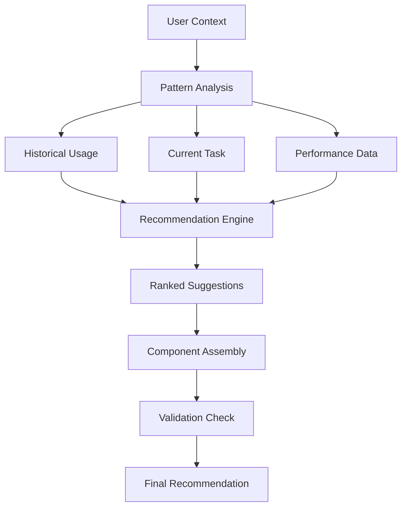
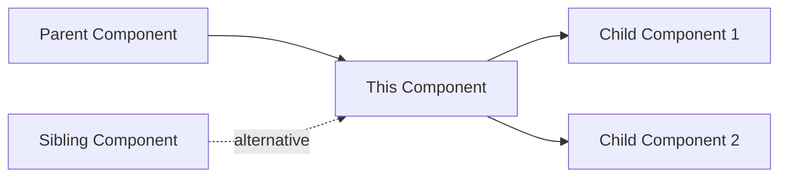

# Extraction Report: Project Note: Claude Desktop as Prompt Component Librarian

> [!info] Auto-Generated Report
> This report was automatically generated by `pkb_extractor.py` on 2026-03-13 04:18.
> **Source**: `reference-technical-component-librarian-claude-project-2025111218.md` | **Items Extracted**: 563

---

## 📋 Document Overview

| Field | Value |
|-------|-------|
| **Source File** | `reference-technical-component-librarian-claude-project-2025111218.md` |
| **Extraction Date** | 2026-03-13 04:18 |
| **Word Count** | 11,206 |
| **Character Count** | 86,962 |
| **Line Count** | 2,520 |
| **Total Items Extracted** | 563 |

### Document Outline

  - ## 📊 Success Metrics for Completion
- # TO-DO
    - ### Phase 1: Foundation (Week 1)
- # Component Usage Log Entry [MISSING]
- # Test: {{test_name}}
  - ## Setup
  - ## Expected Behavior
  - ## Actual Result
  - ## Pass/Fail:
  - ## Notes:
- # Component Feedback Form [MISSING]
- # FINIALIZED APPROACH
- # IDENTIFICATION
- # CLASSIFICATION
- # COMPATIBILITY
- # DEPENDENCIES
- # PERFORMANCE
- # METADATA
- # 🧩 {{title}}
  - ## Purpose
  - ## Component Content
- # Gap Assesment
- # 🔍 Critical Gap Analysis: Prompt Component Library Infrastructure
  - ## 🚨 Missing Critical Infrastructure
  - ## 1️⃣ Operational Workflows & SOPs
    - ### Missing Workflow Documentation
    - ### Required Operational Documents
  - ## 2️⃣ Integration Layer
    - ### MCP Configuration Files
    - ### Claude Instruction Sets
  - ## 3️⃣ Query & Discovery System
    - ### Missing Query Infrastructure
  - ## 4️⃣ Performance Tracking System
    - ### Analytics Infrastructure
    - ### Metrics Collection Template
- # Component Usage Log Entry [MISSING]
  - ## 5️⃣ Component Composition Engine
    - ### Composition Rules System
- # composition-rules.yaml [MISSING]
  - ## 6️⃣ Version Control & Rollback
    - ### Version Management System
  - ## 7️⃣ Testing Framework
    - ### Testing Harness
    - ### Test Case Template
- # Test: {{test_name}}
  - ## Setup
  - ## Expected Behavior
  - ## Actual Result
  - ## Pass/Fail:
  - ## Notes:
  - ## 8️⃣ Documentation System
    - ### Documentation Structure
  - ## 9️⃣ Feedback & Improvement Loop
    - ### Feedback System
- # Component Feedback Form [MISSING]
  - ## 🔟 Security & Access Control
    - ### Security Layers Needed
- # access-control.yaml [MISSING]
  - ## 🎯 Priority Implementation Roadmap
    - ### Phase 1: Foundation (Week 1)
    - ### Phase 2: Integration (Week 2)
    - ### Phase 3: Intelligence (Week 3)
    - ### Phase 4: Maturity (Week 4)
  - ## 📊 Success Metrics for Completion
    - ### 🔗 Related Topics for PKB Expansion
- # Planning
  - ## Maintain version history within the component file using a Version History section:
  - ## 📊 Version History
- # Component Creation Methodology
  - ## Example of Component Anatomy
  - ## Testing and Validation
    - ### Validation Notes Section Template
- # Validation Notes
  - ## Component Testing Checklist
  - ## Component Discovery & Selection Workflow
    - ### Example of Discovery Workflow
    - ### Prompt Composition & Assembly
  - ## Prompt Compositional Metadata
    - ### Example of What information to Include in compositional metadata
    - ### Quick Reference for Data to Collect after using prompt
- # The implementation framework follows a progressive maturity model: Start Simple, Identify Patterns, Systematize, Scale.
  - ## **Phase 1: Foundation
  - ## **Phase 2: Pattern Recognition
  - ## **Phase 3: Systematization
  - ## **Phase 4: Scaling & Refinement (Ongoing)**
- # <% tp.frontmatter.component_id %>
  - ## 📊 Version History
- # Project-Prompt-Library-Manager
- # # {{Description: This is a Master Instruction Set (Claude-Native)
- # for managing and expanding my "Prompt Component
- # Library" for Obsidian. This file acts as the
- # "memory" and "operating system" for this project.}}
- # CLAUDE AS PROMPT COMPONENT LIBRARIAN PLANNING PHASE
- # Atomic Component Patterns
- # Composite Component Architecture
- # Specialized Component Categories
- # 4️⃣ Library Management System
- # Tags
- # Engine Architecture
  - ## 📋 IMPLEMENTATION GUIDELINES FOR NAMING CONVENTION
    - ### MIGRATION PATH FROM CONVENTION B
  - ## YAML FRONT MATTER
- # Component Name
  - ## Purpose
  - ## Content
  - ## Usage Context
  - ## Combination Patterns
  - ## Performance Metrics
  - ## EXAMPLE OF YAML FRONT MATTER
- # 🏗️ FOLDER HIERARCHY ANALYSIS & RECOMMENDATIONS
  - ## 📊 STRUCTURAL ASSESSMENT
    - ### ✅ STRONG DESIGN ELEMENTS
    - ### ⚠️ AREAS FOR ENHANCEMENT
  - ## 📐 RECOMMENDED OPTIMIZATIONS
    - ### 1. NAMING CONVENTION REFINEMENT
    - ### 2. STRUCTURAL ADDITIONS
    - ### 3. EXEMPLAR PLACEMENT RECONSIDERATION
    - ### 4. AGENT ORGANIZATION ENHANCEMENT
  - ## 🎯 OPTIMIZED COMPLETE HIERARCHY
  - ## 📋 IMPLEMENTATION RECOMMENDATIONS
    - ### FILE NAMING CONVENTIONS WITHIN FOLDERS
    - ### INDEX FILE TEMPLATES
- # [Folder Name] Index
  - ## Overview
  - ## Components
  - ## Performance Metrics
  - ## Recent Changes
- # 🏷️ NAMING CONVENTION ANALYSIS FOR PROMPT COMPONENT LIBRARY
  - ## 📊 COMPARATIVE ANALYSIS
  - ## 🔍 DEEP COMPARATIVE ASSESSMENT
    - ### CONVENTION A: TYPE-PREFIX SYSTEM
    - ### CONVENTION B: TIMESTAMP-BASED SYSTEM
  - ## 💡 CRITICAL ANALYSIS
    - ### WHY CONVENTION A EXCELS FOR COMPONENT LIBRARIES
    - ### WHEN CONVENTION B WOULD BE BETTER
  - ## 🎯 HYBRID APPROACH RECOMMENDATION
    - ### RECOMMENDED IMPLEMENTATION
    - ### FILE ORGANIZATION BENEFITS
  - ## 📋 IMPLEMENTATION GUIDELINES
    - ### MIGRATION PATH FROM CONVENTION B
  - ## ⚠️ CRITICAL CONSIDERATIONS
    - ### MITIGATION STRATEGIES
  - ## 🎯 FINAL RECOMMENDATION
    - ### 🔗 RELATED TOPICS FOR PKB EXPANSION
- # 🔧 COMPONENT TEMPLATE ANALYSIS & ENHANCEMENT
  - ## 📊 TEMPLATE ASSESSMENT
  - ## ✅ STRONG DESIGN ELEMENTS
    - ### EXCEPTIONAL FEATURES
  - ## 🔄 RECOMMENDED ENHANCEMENTS
    - ### 1. STRUCTURAL REFINEMENTS
- # CORE IDENTIFICATION
- # CLASSIFICATION
- # COMPATIBILITY & DEPENDENCIES
- # PERFORMANCE METRICS
- # RELATIONSHIPS
- # METADATA
    - ### 2. ENHANCED CONTENT STRUCTURE
- # 🧩 [COMPONENT NAME] `v[version]`
  - ## 📋 COMPONENT OVERVIEW
  - ## 🧬 COMPONENT CONTENT
  - ## ⚙️ IMPLEMENTATION GUIDE
    - ### BASIC USAGE
    - ### ADVANCED INTEGRATION
    - ### VARIABLE SUBSTITUTION
  - ## 🔄 COMBINATION PATTERNS
  - ## 📊 PERFORMANCE ANALYTICS
    - ### SUCCESS METRICS
    - ### USAGE PATTERNS
  - ## 🔬 TESTING DOCUMENTATION
    - ### TEST CASES
  - ## 📚 VERSION HISTORY
  - ## 🚧 KNOWN ISSUES & LIMITATIONS
  - ## 💡 USAGE NOTES
  - ## 🔗 REFERENCES
    - ### COMPONENT GRAPH POSITION
    - ### 3. CRITICAL ADDITIONS
      - #### COMPONENT FINGERPRINT SECTION
  - ## 🔐 Component Fingerprint
      - #### Automated Metrics Collection
  - ## 📈 Auto-Metrics
  - ## 🎯 OPTIMIZED FINAL TEMPLATE
- # IDENTIFICATION
- # CLASSIFICATION
- # COMPATIBILITY
- # DEPENDENCIES
- # PERFORMANCE
- # METADATA
- # 🧩 {{title}}
  - ## Purpose
  - ## Component Content
  - ## USAGE GUIDE
    - ### WHEN TO USE
    - ### HOW TO IMPLEMENT
  - ## PERFORMANCE NOTES
    - ### TESTED COMBINATIONS
    - ### KNOWN LIMITATIONS
  - ## VERSION HISTORY
  - ## 📋 IMPLEMENTATION RECOMMENDATIONS
    - ### 🔗 RELATED TOPICS FOR PKB EXPANSION

---

## 📊 Extraction Summary

| Item Type | Count |
|-----------|-------|
| Callouts | 75 |
| Code Blocks | 62 |
| Color Spans | 0 |
| Definitions | 0 |
| Embeds | 0 |
| External Links | 0 |
| Footnotes | 0 |
| Headings | 199 |
| Inline Fields | 7 |
| Mermaid Diagrams | 5 |
| Tables | 8 |
| Tags | 0 |
| Wiki Links | 108 |
| **TOTAL** | **563** |

---

## 🔔 Callouts (75)

> [!note] What are Callouts?
> Callouts are `> [!TYPE]` blocks used in Obsidian for structured annotation.
> They carry semantic meaning — definitions, insights, warnings, etc.

### By Type

| Callout Type | Count |
|-------------|-------|
| `[!attention]` | 1 |
| `[!comprehensive-reference]` | 2 |
| `[!connections-and-links]` | 2 |
| `[!core-principle]` | 2 |
| `[!description]` | 1 |
| `[!equation]` | 2 |
| `[!important]` | 11 |
| `[!in-note-metadata]` | 2 |
| `[!key-claim]` | 4 |
| `[!metadata]` | 2 |
| `[!methodology-and-sources]` | 8 |
| `[!note]` | 1 |
| `[!plan]` | 2 |
| `[!question]` | 1 |
| `[!quick-reference]` | 6 |
| `[!tasks]` | 1 |
| `[!the-goal]` | 3 |
| `[!the-philosophy]` | 1 |
| `[!the-purpose]` | 5 |
| `[!thought-experiment]` | 3 |
| `[!tip]` | 1 |
| `[!use-cases-and-examples]` | 7 |
| `[!validation]` | 1 |
| `[!warning]` | 5 |
| `[!your-new-workflow]` | 1 |

### Full Callout List

#### 1. [THE-PURPOSE] Untitled *(Line 28)*

> [!the-purpose] Untitled
> This is the start of the [[CLAUDE]] [[Prompt-Component |prompt-component]] Library. (The start of it anyway) I will be using the system I have worked out with the LLM [[Gemini]] for building a robust set of [[Prompt-Component |prompting-components]] to be used as modular pieces in a [[Prompt Template|template]].

#### 2. [QUICK-REFERENCE] Untitled *(Line 33)*

> [!quick-reference] Untitled
> **System Readiness Checklist**
> - ✅ Can Claude find any component in <2 seconds
> - ✅ Can assemble complex prompts from components
> - ✅ Tracks performance automatically
> - ✅ Suggests improvements based on data
> - ✅ Handles version conflicts gracefully
> - ✅ Recovers from failures without data loss
> - ✅ Scales to 1000+ components
> - ✅ Maintains <100ms query response time

#### 3. [METHODOLOGY-AND-SOURCES] Untitled *(Line 203)*

> [!methodology-and-sources] Untitled
> **Essential SOPs Needed**
> 
> **1. Component Intake Process**
> - How to identify need for new component
> - Duplicate checking protocol
> - Initial design documentation
> - Approval workflow
> 
> **2. Testing & Validation Pipeline**
> ```mermaid
> graph LR
>     A[Draft] --> B[Alpha Test]
>     B --> C[Beta Test]
>     C --> D[Production]
>     D --> E[Performance Monitor]
>     E --> F[Optimize/Deprecate]
> ```
> 
> **3. Daily/Weekly Maintenance Routines**
> - Monday: Performance review
> - Wednesday: New component testing  
> - Friday: Library cleanup & archival

#### 4. [EQUATION] Untitled *(Line 264)*

> [!equation] Untitled
> **Performance Formula Missing**
> $Performance = \frac{Successful\_Outputs}{Total\_Uses} \times Weight_{context} \times Decay_{time}$

#### 5. [METADATA] Untitled *(Line 520)*

> [!metadata] Untitled
> **Author**:: [[{{author}}]]
> **Status**:: 🌱 seedling
> **Complexity**:: ⚪ Basic
> **Domain**:: {{domain}}

#### 6. [THE-PURPOSE] Untitled *(Line 528)*

> [!the-purpose] Untitled
> {{cursor}}

#### 7. [ATTENTION] Untitled *(Line 544)*

> [!attention] Untitled
> **System Completeness Assessment**
> We've built the skeleton but are missing vital organs. Let me identify the critical gaps that will determine whether this system thrives or becomes abandoned technical debt.

#### 8. [WARNING] Untitled *(Line 550)*

> [!warning] Untitled
> **Critical Gap: Day-to-Day Operations**
> We have the structure but lack the **operational playbooks** that make the system actually usable.

#### 9. [METHODOLOGY-AND-SOURCES] Untitled *(Line 576)*

> [!methodology-and-sources] Untitled
> **Essential SOPs Needed**
> 
> **1. Component Intake Process**
> - How to identify need for new component
> - Duplicate checking protocol
> - Initial design documentation
> - Approval workflow
> 
> **2. Testing & Validation Pipeline**
> ```mermaid
> graph LR
>     A[Draft] --> B[Alpha Test]
>     B --> C[Beta Test]
>     C --> D[Production]
>     D --> E[Performance Monitor]
>     E --> F[Optimize/Deprecate]
> ```
> 
> **3. Daily/Weekly Maintenance Routines**
> - Monday: Performance review
> - Wednesday: New component testing  
> - Friday: Library cleanup & archival

#### 10. [KEY-CLAIM] Untitled *(Line 602)*

> [!key-claim] Untitled
> **Missing Bridge: Claude ↔ Obsidian**
> We haven't defined the actual **integration mechanics** for Claude to operate as librarian.

#### 11. [THOUGHT-EXPERIMENT] Untitled *(Line 647)*

> [!thought-experiment] Untitled
> **Discovery Challenge**
> How does Claude find the right component among hundreds? We need structured query capabilities.

#### 12. [EQUATION] Untitled *(Line 690)*

> [!equation] Untitled
> **Performance Formula Missing**
> $Performance = \frac{Successful\_Outputs}{Total\_Uses} \times Weight_{context} \times Decay_{time}$

#### 13. [CORE-PRINCIPLE] Untitled *(Line 739)*

> [!core-principle] Untitled
> **Missing Engine: Dynamic Assembly**
> We need rules and patterns for how components combine programmatically.

#### 14. [WARNING] Untitled *(Line 778)*

> [!warning] Untitled
> **Critical Missing: Recovery Mechanisms**
> No rollback system when component updates fail.

#### 15. [METHODOLOGY-AND-SOURCES] Untitled *(Line 800)*

> [!methodology-and-sources] Untitled
> **Test Infrastructure Gap**
> No systematic testing framework for components.

#### 16. [IMPORTANT] Untitled *(Line 854)*

> [!important] Untitled
> **Missing: Comprehensive Documentation**
> No user manual, API reference, or troubleshooting guides.

#### 17. [CONNECTIONS-AND-LINKS] Untitled *(Line 883)*

> [!connections-and-links] Untitled
> **Missing Feedback Mechanisms**
> No structured way to capture and act on component performance feedback.

#### 18. [WARNING] Untitled *(Line 907)*

> [!warning] Untitled
> **Security Gap**
> No access control for sensitive or client-specific components.

#### 19. [THE-GOAL] Untitled *(Line 935)*

> [!the-goal] Untitled
> **Implementation Sequence**
> Build in order of dependency and critical path.

#### 20. [QUICK-REFERENCE] Untitled *(Line 965)*

> [!quick-reference] Untitled
> **System Readiness Checklist**
> - ✅ Can Claude find any component in <2 seconds
> - ✅ Can assemble complex prompts from components
> - ✅ Tracks performance automatically
> - ✅ Suggests improvements based on data
> - ✅ Handles version conflicts gracefully
> - ✅ Recovers from failures without data loss
> - ✅ Scales to 1000+ components
> - ✅ Maintains <100ms query response time

#### 21. [NOTE] Untitled *(Line 1002)*

> [!note] Untitled
> Some components may benefit from branching rather than linear versioning. 
> If you're experimenting with significantly different approaches to the same problem, create experimental branches (e.g., `v2.0-experimental-iterative` vs. `v2.0-experimental-parallel`). Test both in real workflows, gather performance data, then promote the superior approach to the stable v2.0 release while documenting what you learned from the experiments.
> 
> 
> > [!methodology-and-sources]
> > **Practical Framework: Component Evolution Protocol**
> > 
> > **Stage 1 - Observation**: Notice that a component isn't performing as well as desired. Document specific failure cases or areas for improvement in the component's notes section.
> > 
> > **Stage 2 - Hypothesis**: Formulate a specific theory about what changes would improve performance ("Adding concrete examples will reduce ambiguity").
> > 
> > **Stage 3 - Experimentation**: Create an experimental version, test it across multiple real uses, and maintain performance notes.
> > 
> > **Stage 4 - Evaluation**: Compare experimental version against stable version using objective criteria (error rate, user satisfaction, output quality).
> > 
> > **Stage 5 - Promotion or Reversion**: If the experimental version proves superior, promote it to stable status with an incremented version number. If not, document why the experiment failed to inform future evolution attempts.

#### 22. [IMPORTANT] This purpose documentation helps both human users and Claude understand component applicability. Too many components get created with vague purposes that make them hard to apply correctly. *(Line 1050)*

> [!important] This purpose documentation helps both human users and Claude understand component applicability. Too many components get created with vague purposes that make them hard to apply correctly.

#### 23. [USE-CASES-AND-EXAMPLES] Untitled *(Line 1063)*

> [!use-cases-and-examples] Untitled
> **Anatomy of an Excellent Component**
> 
> **Context**: Creating a role definition component for a Python programming expert.
> 
> **Application**: The component includes:
> - Clear purpose statement ("Establish Claude as a senior Python developer with 10+ years experience")
> - Specific expertise markers (Python 3.x, common libraries like pandas/numpy, web frameworks)
> - Communication style specification (technical but accessible, includes code examples)
> - Ethical constraints (emphasizes best practices, warns about security issues)
> - Hard dependencies: None
> - Soft dependencies: [[Output-Format-Python-Code-Blocks]] for consistent code formatting
> - Example usage scenario showing the role in a complete prompt
> - Anti-patterns: "Don't use this role for beginner Python tutorials; use [[Role-Python-Educator]] instead"
> 
> **Outcome**: The component is self-documenting and can be used confidently by anyone (including Claude) without additional context.

#### 24. [IMPORTANT] Document test results directly in the component file. *(Line 1086)*

> [!important] Document test results directly in the component file.

#### 25. [IMPORTANT] Significant variation suggests the component needs tightening—its instructions may be too vague or rely on implicit context that varies between uses. Test by using the same component+composition combination on similar (but not identical) inputs multiple times, then evaluating output consistency. *(Line 1117)*

> [!important] Significant variation suggests the component needs tightening—its instructions may be too vague or rely on implicit context that varies between uses. Test by using the same component+composition combination on similar (but not identical) inputs multiple times, then evaluating output consistency.

#### 26. [METHODOLOGY-AND-SOURCES] Untitled *(Line 1120)*

> [!methodology-and-sources] Untitled
> **Component Testing Checklist**
> 
> **Before promoting draft → experimental**:
> - [ ] Functional test with 3 different prompts/scenarios
> - [ ] Documentation complete (purpose, examples, anti-patterns)
> - [ ] Metadata fields populated (type, domain, status, version)
> 
> **Before promoting experimental → stable**:
> - [ ] Used successfully in 5+ real-world scenarios
> - [ ] Compositional testing with 3 different component combinations
> - [ ] No outstanding issues or frequent failures
> - [ ] Reliability confirmed across multiple uses
> - [ ] Usage notes documenting optimal applications
> 
> **Quarterly review for stable components**:
> - [ ] Still being used regularly (not orphaned)
> - [ ] Effectiveness rating remains high
> - [ ] No better alternatives developed
> - [ ] Compatible with current Claude versions

#### 27. [IMPORTANT] These gap notes drive future component development, ensuring your library expands to cover real usage patterns rather than hypothetical scenarios. *(Line 1145)*

> [!important] These gap notes drive future component development, ensuring your library expands to cover real usage patterns rather than hypothetical scenarios.

#### 28. [USE-CASES-AND-EXAMPLES] Untitled *(Line 1148)*

> [!use-cases-and-examples] Untitled
> **Discovery Workflow in Action**
> 
> **Context**: You need to create a product requirements document based on stakeholder interviews.
> 
> **Action**: 
> 1. Ask Claude: "I'm creating a PRD from interview notes. What component combination would work?"
> 2. Claude searches library, finds: [Role-Product-Manager], [Task-Requirements-Synthesis], [Output-Format-PRD-Template]
> 3. You ask: "Do we have any technique components for handling conflicting stakeholder priorities?"
> 4. Claude finds: [Technique-Stakeholder-Prioritization-Matrix]
> 5. You approve the composition: Role + Task + Technique + Output Format
> 6. Claude assembles the prompt from these four components
> 
> **Outcome**: From description to assembled prompt in under three minutes, leveraging four proven components instead of writing a prompt from scratch.

#### 29. [IMPORTANT] This ordering works because it mirrors natural human instruction: first establish who you are, then what to do, then how to do it, then what limits apply, then what the final product should look like. *(Line 1175)*

> [!important] This ordering works because it mirrors natural human instruction: first establish who you are, then what to do, then how to do it, then what limits apply, then what the final product should look like.

#### 30. [METHODOLOGY-AND-SOURCES] Untitled *(Line 1188)*

> [!methodology-and-sources] Untitled
> **Composition Assembly Protocol**
> 
> **Step 1 - Inventory**: List all selected components with their versions
> **Step 2 - Dependency Check**: Verify all hard dependencies are satisfied
> **Step 3 - Ordering**: Arrange components following optimal sequence principles
> **Step 4 - Integration**: Read through full composition, smooth transitions, deduplicate
> **Step 5 - Documentation**: Add composition metadata (components used, purpose, date)
> **Step 6 - Review**: Final read-through for coherence and completeness
> **Step 7 - Deployment or Save**: Either use immediately or save as reusable composition

#### 31. [QUICK-REFERENCE] Untitled *(Line 1201)*

> [!quick-reference] Untitled
> **Feedback Data to Collect**
> - 🔑 **Usage Count**: How many times deployed (quantitative)
> - 🔑 **Effectiveness Rating**: Average output quality 1-5 (qualitative aggregate)
> - 🔑 **Issue Reports**: Specific failures and their contexts (qualitative detailed)
> - 🔑 **Composition Success**: Whether complete compositions meet objectives
> - 🔑 **Time-to-Success**: How many iterations needed to get good output
> - 🔑 **Modification Frequency**: How often components need in-flight adjustments

#### 32. [PLAN] Untitled *(Line 1210)*

> [!plan] Untitled
> **Improvement Cycle Schedule**
> 
> **Immediate**: Fix clear problems on discovery
> **Weekly (30 min)**: Review usage, update ratings, minor refinements
> **Monthly (2 hrs)**: Generate metrics reports, analyze patterns, update improvement queue
> **Quarterly (4 hrs)**: Strategic assessment, create improvement roadmap, major refactoring
> 
> This schedule totals ~4 hours/month of library maintenance—a reasonable investment for a tool you use regularly.

#### 33. [USE-CASES-AND-EXAMPLES] Untitled *(Line 1226)*

> [!use-cases-and-examples] Untitled
> **Knowledge Graph Integration in Practice**
> 
> **Context**: You're building expertise in [[Bayesian Statistics]] and maintain detailed notes on Bayesian concepts.
> 
> **Application**: 
> 1. Create prompt components for Bayesian analysis tasks
> 2. Link these components to your Bayesian Statistics MOC
> 3. Within component documentation, link to specific concept notes (prior distributions, likelihood functions, posterior estimation)
> 4. Add component usage examples to your applied Bayesian project notes
> 5. Create a Dataview query in your statistics MOC showing all related prompt components
> 
> **Outcome**: Your statistics knowledge and your prompt components form an integrated system where learning about statistics improves your prompt library and using prompt components reinforces statistical understanding. The system exhibits positive feedback loops where each domain enhances the other.

#### 34. [IMPORTANT] During this phase, resist the urge to create dozens of new components. Instead, focus on deepening your understanding of the components you have. *(Line 1270)*

> [!important] During this phase, resist the urge to create dozens of new components. Instead, focus on deepening your understanding of the components you have.

#### 35. [IMPORTANT] This data informs both component refinement and Claude's selection logic—components with high usage and high effectiveness should be suggested more readily than rarely-used experimental components. *(Line 1297)*

> [!important] This data informs both component refinement and Claude's selection logic—components with high usage and high effectiveness should be suggested more readily than rarely-used experimental components.

#### 36. [PLAN] Untitled *(Line 1316)*

> [!plan] Untitled
> **12-Week Implementation Roadmap**
> 
> **Weeks 1-2 (Foundation)**: Create infrastructure, extract first 15 components, configure Claude Desktop access
> **Weeks 3-4 (Usage)**: Deploy components in real work, document combinations, create first composites
> **Weeks 5-6 (Documentation)**: Enhance component documentation with examples and usage notes
> **Weeks 7-8 (Automation)**: Implement Dataview dashboards and Templater templates
> **Weeks 9-10 (Metrics)**: Add tracking for usage counts and effectiveness ratings
> **Weeks 11-12 (Optimization)**: First review cycle, identify deprecation candidates, consolidate duplicates
> **Week 13+**: Mature operational mode with monthly review cycles

#### 37. [IMPORTANT] Folder Hierarchy *(Line 1376)*

> [!important] Folder Hierarchy
> 🚀✴️Main Project Folder
> - `02 🚀Projects/✴️Claude-📝Prompting-🧩Components-📚Liabrary`
> 	- 📬Inbox

#### 38. [IN-NOTE-METADATA] Untitled *(Line 1436)*

> [!in-note-metadata] Untitled
> [Component🆔:: <% tp.frontmatter.component_id %>]
> - [Description:: ]
> > 
> - [Appropriate Use Cases:: ]
> > 
>  - [Inappropriate Use Cases:: ]

#### 39. [DESCRIPTION] <% tp.frontmatter.component_id %>'s Ouput Validation Notes *(Line 1444)*

> [!description] <% tp.frontmatter.component_id %>'s Ouput Validation Notes
> - When the component was tested?
> 	- 
> - What scenarios were used?
> 	- 
> 	  
> > [!answer] Results
> > - What results were observed?
> > 	- 
> >

#### 40. [COMPREHENSIVE-REFERENCE] Component Testing Checklist *(Line 1455)*

> [!comprehensive-reference] Component Testing Checklist

#### 41. [COMPREHENSIVE-REFERENCE] Component Testing Checklist *(Line 1459)*

> [!comprehensive-reference] Component Testing Checklist
> **Status: 🌱 seedling**
> - [ ] Component logic drafted.
> 
> **Promote to: 🌿 growing**
> - [ ] Functional test with 3+ scenarios.
> - [ ] Documentation complete (Description, Use Cases).
> - [ ] Metadata fields (domain, complexity) populated.
> 
> **Promote to: 🪴 cultivated**
> - [ ] Used successfully in 5+ real-world scaffolds.
> - [ ] Compositional testing with 3+ other components.
> - [ ] No outstanding failures.
> 
> **Promote to: 🌳 mature**
> - [ ] Highly reliable and stable.
> - [ ] Effectiveness rating is 4/5 or higher.
> - [ ] Reviewed and approved as a "core" component.

#### 42. [IMPORTANT] Untitled *(Line 1517)*

> [!important] Untitled
> **This is the current state of the library.** You must not "reinvent" or "re-suggest" any component on this list. Your job is to *add* to this list or *modify* items on it.

#### 43. [TASKS] Untitled *(Line 1524)*

> [!tasks] Untitled
> Your job is to process the user's `[REQUEST]` (which will follow this constitution). You must identify one of the following actions and execute it.

#### 44. [YOUR-NEW-WORKFLOW] Untitled *(Line 1547)*

> [!your-new-workflow] Untitled
> **This is our "Save/Update" process. You MUST follow this.**
> 
> 1.  **I (the user) give you this entire instruction set**, which contains the *current* `<library_manifest>`.
> 2.  I then add a `[REQUEST]` (like `GENERATE_NEW`).
> 3.  **You (the AI) will generate the new component(s) I asked for** (either 1 or a batch of 4), following the process in `<actions>`.
> 4.  **CRITICAL "SAVE" STEP:** After generating the component(s), you **MUST** also generate a `> [!save-update]` callout. Inside this callout, you will provide the **ENTIRE, NEW, UPDATED "Library Manifest"** (as a Markdown code block) that includes the new component(s) we just added.
> 5.  **I (the user) will then copy/paste this new manifest block into this instruction file, replacing the old one.** This "saves" our progress.
> 6.  At the end of our session, I can run `[ACTION] UPDATE_MANIFEST_ONLY` to get the final consolidated list from all our changes, which I will then use to update this file.

#### 45. [QUICK-REFERENCE] Untitled *(Line 1602)*

> [!quick-reference] Untitled
> **Essential Metadata Fields**
> - 🔑 **Unique ID**: Timestamp-based identifier for absolute reference
> - 🔑 **Version String**: Semantic versioning for change tracking
> - 🔑 **Dependency Array**: List of required component IDs
> - 🔑 **Performance Metrics**: Success rate, use count, last tested date
> - 🔑 **Relationship Graph**: Links to related, similar, and incompatible components

#### 46. [THE-PHILOSOPHY] Untitled *(Line 1654)*

> [!the-philosophy] Untitled
> **Organizational Philosophy**
> The library operates on principles of **progressive disclosure** and **contextual relevance**—simple queries return immediately useful components, while sophisticated searches reveal deeper architectural patterns.

#### 47. [USE-CASES-AND-EXAMPLES] Untitled *(Line 1677)*

> [!use-cases-and-examples] Untitled
> **Practical Naming Patterns**
> 
> **Atomic Components:**
> - `atomic_[role]-persona_v[N].md`
> - `atomic_[action]-instruction_v[N].md`
> - `atomic_[limit]-constraint_v[N].md`
> 
> **Composite Components:**
> - `composite_[workflow]-sop_v[N].md`
> - `composite_[task]-prompt_v[N].md`
> 
> **Specialized Components:**
> - `specialized_[domain]-[function]_v[N].md`

#### 48. [KEY-CLAIM] Untitled *(Line 1787)*

> [!key-claim] Untitled
> **Core Strengths**
> Your hierarchy demonstrates sophisticated understanding of component organization through numbered prioritization, clear type separation, and dedicated workspace areas. The inclusion of a Library section for reference materials shows forward-thinking about knowledge management.

#### 49. [METHODOLOGY-AND-SOURCES] Untitled *(Line 1801)*

> [!methodology-and-sources] Untitled
> **Standardization Protocol**
> Adopt consistent casing and delimiter patterns throughout the hierarchy to improve both human readability and programmatic parsing.

#### 50. [THOUGHT-EXPERIMENT] Untitled *(Line 1821)*

> [!thought-experiment] Untitled
> **Missing Elements Consideration**
> Imagine discovering a component six months from now—what contextual information would you need? What organizational structures would accelerate that discovery?

#### 51. [QUESTION] Untitled *(Line 1850)*

> [!question] Untitled
> **Architectural Question**
> Should Exemplars exist as atomic components or serve a different organizational purpose?

#### 52. [THE-GOAL] Untitled *(Line 1887)*

> [!the-goal] Untitled
> **Optimization Objective**
> Create a hierarchy that balances organizational clarity with operational flexibility, supporting both human navigation and automated processing.

#### 53. [USE-CASES-AND-EXAMPLES] Untitled *(Line 1978)*

> [!use-cases-and-examples] Untitled
> **Migration Strategy**
> 1. **Phase 1**: Create new structure alongside existing
> 2. **Phase 2**: Migrate components in batches by type
> 3. **Phase 3**: Update all internal links and references
> 4. **Phase 4**: Archive old structure after validation

#### 54. [QUICK-REFERENCE] Untitled *(Line 2016)*

> [!quick-reference] Untitled
> **Key Improvements Made**
> - 🔑 Added index layer for navigation and discovery
> - 🔑 Expanded atomic categories for completeness
> - 🔑 Reorganized exemplars as cross-cutting reference
> - 🔑 Added automation directory for tooling
> - 🔑 Created archives for lifecycle management
> - 🔑 Subdivided specialized categories for better organization

#### 55. [THE-PURPOSE] Untitled *(Line 2031)*

> [!the-purpose] Untitled
> **Decision Framework**
> Evaluating naming conventions for a [[Prompt Component Library]] requires balancing human readability, system processability, version control, and long-term maintainability within your [[Obsidian PKB]] environment.

#### 56. [KEY-CLAIM] Untitled *(Line 2053)*

> [!key-claim] Untitled
> **Decisive Recommendation**
> For a [[Prompt Component Library]] managed by [[CLAUDE]] as a librarian, **Convention A (Type-Prefix)** is significantly superior for this specific use case, despite Convention B's advantages in other PKB contexts.

#### 57. [THOUGHT-EXPERIMENT] Untitled *(Line 2065)*

> [!thought-experiment] Untitled
> **Retrieval Scenario**
> Imagine asking Claude: "Find all personas compatible with technical writing tasks."
> - Convention A: Claude scans for `atomic_*persona*.md`, then filters by metadata
> - Convention B: Claude must open every file to determine if it's even a persona

#### 58. [METHODOLOGY-AND-SOURCES] Untitled *(Line 2079)*

> [!methodology-and-sources] Untitled
> **Optimal Solution**
> Implement Convention A as the primary naming system while embedding timestamp data in frontmatter for temporal tracking when needed.

#### 59. [USE-CASES-AND-EXAMPLES] Untitled *(Line 2128)*

> [!use-cases-and-examples] Untitled
> **Practical Naming Patterns**
> 
> **Atomic Components:**
> - `atomic_[role]-persona_v[N].md`
> - `atomic_[action]-instruction_v[N].md`
> - `atomic_[limit]-constraint_v[N].md`
> 
> **Composite Components:**
> - `composite_[workflow]-sop_v[N].md`
> - `composite_[task]-prompt_v[N].md`
> 
> **Specialized Components:**
> - `specialized_[domain]-[function]_v[N].md`

#### 60. [WARNING] Untitled *(Line 2160)*

> [!warning] Untitled
> **Potential Challenges with Convention A**
> - **Uniqueness**: Without timestamps, ensure unique names through semantic differentiation
> - **Merging**: When combining libraries, naming conflicts are more likely
> - **History**: Creation sequence less obvious without opening files

#### 61. [CORE-PRINCIPLE] Untitled *(Line 2176)*

> [!core-principle] Untitled
> **Decision Principle**
> Choose naming conventions that optimize for the primary use case. For a [[Prompt Component Library]], that's **discovery and assembly**, not chronological tracking.

#### 62. [KEY-CLAIM] Untitled *(Line 2204)*

> [!key-claim] Untitled
> **Overall Evaluation**
> Your template demonstrates sophisticated understanding of component management needs, with excellent version tracking and metadata structure. With targeted refinements, this will serve as a robust foundation for your [[Prompt Component Library]].

#### 63. [METHODOLOGY-AND-SOURCES] Untitled *(Line 2220)*

> [!methodology-and-sources] Untitled
> **Optimization Strategy**
> Enhance the template to support both immediate utility and long-term scalability while maintaining clarity and consistency.

#### 64. [IN-NOTE-METADATA] Untitled *(Line 2280)*

> [!in-note-metadata] Untitled
> **Author**:: [[_dashboard-design-moc]]
> **Status**:: 🌱seedling | 🌿growing | 🌳mature | 🍂deprecated
> **Complexity**:: ⚪Basic | 🔵Intermediate | 🟣Advanced | ⚫Expert
> **Domain**:: [[technical]] [[writing]] [[analysis]]
> **Testing Coverage**:: ████████░░ 80%

#### 65. [THE-PURPOSE] Untitled *(Line 2289)*

> [!the-purpose] Untitled
> **Purpose Statement**
> [Clear, single sentence describing what this component achieves]

#### 66. [USE-CASES-AND-EXAMPLES] Untitled *(Line 2293)*

> [!use-cases-and-examples] Untitled
> **Primary Use Cases**
> 1. **[Scenario]**: [When and why to use]
> 2. **[Scenario]**: [When and why to use]
> 3. **[Scenario]**: [When and why to use]

#### 67. [CONNECTIONS-AND-LINKS] Untitled *(Line 2330)*

> [!connections-and-links] Untitled
> **Proven Combinations**
> - ✅ **With [[Component-A]]**: [Synergy description]
> - ✅ **With [[Component-B]]**: [Synergy description]
> - ⚠️ **Avoid with [[Component-C]]**: [Conflict reason]

#### 68. [VALIDATION] Untitled *(Line 2355)*

> [!validation] Untitled
> **Test Coverage**
> - ✅ Unit tests: [Status]
> - ✅ Integration tests: [Status]
> - ⬜ Edge cases: [Pending]

#### 69. [WARNING] Untitled *(Line 2376)*

> [!warning] Untitled
> **Current Limitations**
> - [Limitation 1 with workaround if available]
> - [Limitation 2 with planned fix version]

#### 70. [TIP] Untitled *(Line 2383)*

> [!tip] Untitled
> **Pro Tips**
> - [Advanced usage tip]
> - [Performance optimization]
> - [Common pitfall to avoid]

#### 71. [IMPORTANT] Untitled *(Line 2409)*

> [!important] Untitled
> **Essential Missing Elements to Add**

#### 72. [THE-GOAL] Untitled *(Line 2435)*

> [!the-goal] Untitled
> **Template Objective**
> Create a comprehensive yet maintainable component template that scales from simple atomic components to complex specialized systems.

#### 73. [METADATA] Untitled *(Line 2481)*

> [!metadata] Untitled
> **Author**:: [[{{author}}]]
> **Status**:: 🌱 seedling
> **Complexity**:: ⚪ Basic
> **Domain**:: {{domain}}

#### 74. [THE-PURPOSE] Untitled *(Line 2489)*

> [!the-purpose] Untitled
> {{cursor}}

#### 75. [QUICK-REFERENCE] Untitled *(Line 2526)*

> [!quick-reference] Untitled
> **Key Improvements Made**
> - 🔑 **Structured compatibility** with primary/secondary/incompatible
> - 🔑 **Nested dependencies** showing requirement levels
> - 🔑 **Status workflow** (draft → tested → validated → mature → deprecated)
> - 🔑 **Automated metrics** via Dataview queries
> - 🔑 **Visual status indicators** (emojis for quick scanning)

---

## 🔗 Wiki-Links (108 total, 70 unique targets)

> [!info] Knowledge Graph Connections
> These links represent connections to other notes in your PKB.
> **70** distinct notes are referenced.

### Unique Targets

- [[Obsidian]]
- [[CLAUDE]]
- [[20251110045351_claude-as-prompt-component-librarian_📚comprehensive-reference]]
- [[Atomic Components]]
- [[Atomic components]]
- [[Automated Component Assembly Using Naming Conventions]]
- [[Automated Template Population with Templater]]
- [[Bayesian Statistics]]
- [[Building Automated Testing Harnesses for Prompt Components]]
- [[Chain-of-Thought]]
- [[Claude]]
- [[Component Lifecycle Management Workflows]]
- [[Component Naming Patterns for Large Libraries]]
- [[Component Template Variations for Specific Types]]
- [[Component Testing Frameworks and Protocols]]
- [[Component-A]]
- [[Component-B]]
- [[Component-C]]
- [[Composite Components]]
- [[Composite components]]
- [[Constraint Components]]
- [[Core-Output-Markdown-Documentation-v2]]
- [[Core-Role-Technical-Writer-v1]]
- [[Core-Task-API-Documentation-v1]]
- [[Cultural-Linguistic]]
- [[Dataview]]
- [[Domain-Specific]]
- [[Feedback Loop Design for Continuous Improvement Systems]]
- [[Gemini]]
- [[MCP Configuration Patterns for Knowledge Management]]
- [[Metadata Schema Design for Component Discovery]]
- [[Metadata Schema Evolution Strategies]]
- [[Migration Strategies from Zettelkasten to Component Libraries]]
- [[Obsidian PKB]]
- [[Output-Format-Python-Code-Blocks]]
- [[Performance Analytics Dashboards in Obsidian]]
- [[Project-Specific]]
- [[Prompt Component Librarian]]
- [[Prompt Component Library]]
- [[Prompt Template]]
- [[Prompt-Component]]
- [[Role Components]]
- [[Role-Python-Educator]]
- [[Schemas]]
- [[Security Models for Shared Knowledge Libraries]]
- [[Technique Components]]
- [[Technique-Reasoning-Step-by-Step-Explanation-v1]]
- [[Templater]]
- [[Tool-Specific]]
- [[Version Control Strategies for Prompt Components]]
- [[Zettelkasten]]
- [[_dashboard-design-moc]]
- [[analysis]]
- [[atomic components]]
- [[component hierarchy model]]
- [[component-that-this-builds-upon]]
- [[components-that-build-on-this]]
- [[composition patterns]]
- [[internal-discussion-note]]
- [[newer-version-id]]
- [[older-version-id]]
- [[pur3-project_prompt-component-librarian_20251109204331]]
- [[similar-components]]
- [[source-component-or-technique]]
- [[synergistic-components]]
- [[technical]]
- [[writing]]
- [[{{author}}]]
- [[♊gem_project-📝🔧prompt-🧩component-📚librarian_🆔20251025223650]]
- [[✴️Claude-📝Prompt-📚Library_🗺️MOC]]

### All Occurrences

| # | Target | Display Text | Heading | Section | Line |
|---|--------|-------------|---------|---------|------|
| 1 | [[CLAUDE]] | — | — | Document Start | 29 |
| 2 | [[Prompt-Component]] | prompt-component | — | Document Start | 29 |
| 3 | [[Gemini]] | — | — | Document Start | 29 |
| 4 | [[Prompt-Component]] | prompting-components | — | Document Start | 29 |
| 5 | [[Prompt Template]] | template | — | Document Start | 29 |
| 6 | [[{{author}}]] | — | — | 🧩 {{title}} | 521 |
| 7 | [[Building Automated Testing Harnesses for Prompt Components]] | — | — | 🔗 Related Topics for PKB Expansion | 982 |
| 8 | [[MCP Configuration Patterns for Knowledge Management]] | — | — | 🔗 Related Topics for PKB Expansion | 983 |
| 9 | [[Performance Analytics Dashboards in Obsidian]] | — | — | 🔗 Related Topics for PKB Expansion | 984 |
| 10 | [[Feedback Loop Design for Continuous Improvement Systems]] | — | — | 🔗 Related Topics for PKB Expansion | 985 |
| 11 | [[Security Models for Shared Knowledge Libraries]] | — | — | 🔗 Related Topics for PKB Expansion | 986 |
| 12 | [[Technique Components]] | — | — | Component Creation Methodology | 1052 |
| 13 | [[Chain-of-Thought]] | chain-of-thought | — | Component Creation Methodology | 1054 |
| 14 | [[Chain-of-Thought]] | chain-of-thought | — | Component Creation Methodology | 1054 |
| 15 | [[Output-Format-Python-Code-Blocks]] | — | — | Example of Component Anatomy | 1074 |
| 16 | [[Role-Python-Educator]] | — | — | Example of Component Anatomy | 1076 |
| 17 | [[Role Components]] | Role | — | Testing and Validation | 1083 |
| 18 | [[Technique Components]] | — | — | Validation Notes | 1108 |
| 19 | [[Constraint Components]] | — | — | Validation Notes | 1108 |
| 20 | [[Prompt-Component]] | prompt components | — | Validation Notes | 1108 |
| 21 | [[Prompt-Component]] | — | — | Validation Notes | 1116 |
| 22 | [[CLAUDE]] | — | — | Component Discovery & Selection Workflow | 1142 |
| 23 | [[Prompt-Component]] | — | — | Component Discovery & Selection Workflow | 1142 |
| 24 | [[Dataview]] | — | — | Quick Reference for Data to Collect a... | 1222 |
| 25 | [[Bayesian Statistics]] | — | — | Quick Reference for Data to Collect a... | 1229 |
| 26 | [[20251110045351_claude-as-prompt-component-librarian_📚comprehensive-reference]] | — | — | **Phase 1: Foundation | 1246 |
| 27 | [[CLAUDE]] | — | — | **Phase 1: Foundation | 1248 |
| 28 | [[Prompt-Component]] | Prompt-Components | — | **Phase 1: Foundation | 1248 |
| 29 | [[Prompt-Component]] | — | — | **Phase 1: Foundation | 1252 |
| 30 | [[Prompt-Component]] | Prompt-Components | — | **Phase 1: Foundation | 1254 |
| 31 | [[CLAUDE]] | — | — | **Phase 2: Pattern Recognition | 1266 |
| 32 | [[Prompt-Component]] | prompt components | — | **Phase 2: Pattern Recognition | 1266 |
| 33 | [[Prompt-Component]] | prompt components | — | **Phase 2: Pattern Recognition | 1267 |
| 34 | [[Prompt-Component]] | prompt components | — | **Phase 2: Pattern Recognition | 1267 |
| 35 | [[Prompt-Component]] | prompt components | — | **Phase 2: Pattern Recognition | 1268 |
| 36 | [[Prompt-Component]] | prompt components | — | **Phase 2: Pattern Recognition | 1272 |
| 37 | [[Prompt-Component]] | — | — | **Phase 2: Pattern Recognition | 1272 |
| 38 | [[Schemas]] | — | — | **Phase 3: Systematization | 1283 |
| 39 | [[Dataview]] | — | — | **Phase 3: Systematization | 1284 |
| 40 | [[Templater]] | — | — | **Phase 3: Systematization | 1288 |
| 41 | [[✴️Claude-📝Prompt-📚Library_🗺️MOC]] | — | — | **Phase 4: Scaling & Refinement (Ongo... | 1430 |
| 42 | [[♊gem_project-📝🔧prompt-🧩component-📚librarian_🆔20251025223650]] | — | — | 📊 Version History | 1491 |
| 43 | [[pur3-project_prompt-component-librarian_20251109204331]] | — | — | 📊 Version History | 1493 |
| 44 | [[Atomic Components]] | — | — | CLAUDE AS PROMPT COMPONENT LIBRARIAN ... | 1619 |
| 45 | [[Composite Components]] | — | — | CLAUDE AS PROMPT COMPONENT LIBRARIAN ... | 1620 |
| 46 | [[atomic components]] | — | — | CLAUDE AS PROMPT COMPONENT LIBRARIAN ... | 1620 |
| 47 | [[Claude]] | — | — | CLAUDE AS PROMPT COMPONENT LIBRARIAN ... | 1621 |
| 48 | [[Prompt Component Librarian]] | — | — | CLAUDE AS PROMPT COMPONENT LIBRARIAN ... | 1621 |
| 49 | [[Atomic components]] | — | — | Atomic Component Patterns | 1625 |
| 50 | [[Atomic Components]] | atomic component | — | Atomic Component Patterns | 1627 |
| 51 | [[Atomic components]] | — | — | Atomic Component Patterns | 1630 |
| 52 | [[Composite components]] | — | — | Composite Component Architecture | 1635 |
| 53 | [[atomic components]] | — | — | Composite Component Architecture | 1635 |
| 54 | [[Atomic Components]] | — | — | Composite Component Architecture | 1638 |
| 55 | [[Composite Components]] | — | — | Composite Component Architecture | 1638 |
| 56 | [[composition patterns]] | — | — | Composite Component Architecture | 1639 |
| 57 | [[Domain-Specific]] | — | — | Specialized Component Categories | 1648 |
| 58 | [[Tool-Specific]] | — | — | Specialized Component Categories | 1649 |
| 59 | [[Project-Specific]] | — | — | Specialized Component Categories | 1650 |
| 60 | [[Cultural-Linguistic]] | — | — | Specialized Component Categories | 1651 |
| 61 | [[Core-Task-API-Documentation-v1]] | — | — | EXAMPLE OF YAML FRONT MATTER | 1766 |
| 62 | [[Core-Output-Markdown-Documentation-v2]] | — | — | EXAMPLE OF YAML FRONT MATTER | 1767 |
| 63 | [[Technique-Reasoning-Step-by-Step-Explanation-v1]] | — | — | EXAMPLE OF YAML FRONT MATTER | 1768 |
| 64 | [[Core-Role-Technical-Writer-v1]] | — | — | EXAMPLE OF YAML FRONT MATTER | 1769 |
| 65 | [[Obsidian]] | — | — | ✅ STRONG DESIGN ELEMENTS | 1791 |
| 66 | [[component hierarchy model]] | — | — | ✅ STRONG DESIGN ELEMENTS | 1793 |
| 67 | [[Prompt Component Library]] | — | — | Recent Changes | 2025 |
| 68 | [[CLAUDE]] | — | — | Recent Changes | 2025 |
| 69 | [[Prompt Component Librarian]] | — | — | Recent Changes | 2025 |
| 70 | [[Prompt Component Library]] | — | — | 📊 COMPARATIVE ANALYSIS | 2033 |
| 71 | [[Obsidian PKB]] | — | — | 📊 COMPARATIVE ANALYSIS | 2033 |
| 72 | [[Prompt Component Library]] | — | — | 💡 CRITICAL ANALYSIS | 2055 |
| 73 | [[CLAUDE]] | — | — | 💡 CRITICAL ANALYSIS | 2055 |
| 74 | [[CLAUDE]] | — | — | WHY CONVENTION A EXCELS FOR COMPONENT... | 2063 |
| 75 | [[Zettelkasten]] | — | — | WHEN CONVENTION B WOULD BE BETTER | 2073 |
| 76 | [[Prompt Component Library]] | — | — | 🎯 FINAL RECOMMENDATION | 2178 |
| 77 | [[Prompt Component Librarian]] | — | — | 🎯 FINAL RECOMMENDATION | 2188 |
| 78 | [[Component Naming Patterns for Large Libraries]] | — | — | 🔗 RELATED TOPICS FOR PKB EXPANSION | 2194 |
| 79 | [[Version Control Strategies for Prompt Components]] | — | — | 🔗 RELATED TOPICS FOR PKB EXPANSION | 2195 |
| 80 | [[Metadata Schema Design for Component Discovery]] | — | — | 🔗 RELATED TOPICS FOR PKB EXPANSION | 2196 |
| 81 | [[Automated Component Assembly Using Naming Conventions]] | — | — | 🔗 RELATED TOPICS FOR PKB EXPANSION | 2197 |
| 82 | [[Migration Strategies from Zettelkasten to Component Libraries]] | — | — | 🔗 RELATED TOPICS FOR PKB EXPANSION | 2198 |
| 83 | [[Prompt Component Library]] | — | — | 📊 TEMPLATE ASSESSMENT | 2206 |
| 84 | [[Dataview]] | — | — | EXCEPTIONAL FEATURES | 2214 |
| 85 | [[component-that-this-builds-upon]] | — | — | RELATIONSHIPS | 2262 |
| 86 | [[components-that-build-on-this]] | — | — | RELATIONSHIPS | 2263 |
| 87 | [[similar-components]] | — | — | RELATIONSHIPS | 2264 |
| 88 | [[synergistic-components]] | — | — | RELATIONSHIPS | 2265 |
| 89 | [[older-version-id]] | — | — | METADATA | 2272 |
| 90 | [[newer-version-id]] | — | — | METADATA | 2273 |
| 91 | [[_dashboard-design-moc]] | — | — | 🧩 [COMPONENT NAME] `v[version]` | 2281 |
| 92 | [[technical]] | — | — | 🧩 [COMPONENT NAME] `v[version]` | 2284 |
| 93 | [[writing]] | — | — | 🧩 [COMPONENT NAME] `v[version]` | 2284 |
| 94 | [[analysis]] | — | — | 🧩 [COMPONENT NAME] `v[version]` | 2284 |
| 95 | [[Component-A]] | — | — | 🔄 COMBINATION PATTERNS | 2332 |
| 96 | [[Component-B]] | — | — | 🔄 COMBINATION PATTERNS | 2333 |
| 97 | [[Component-C]] | — | — | 🔄 COMBINATION PATTERNS | 2334 |
| 98 | [[source-component-or-technique]] | — | — | 🔗 REFERENCES | 2391 |
| 99 | [[internal-discussion-note]] | — | — | 🔗 REFERENCES | 2393 |
| 100 | [[{{author}}]] | — | — | 🧩 {{title}} | 2482 |
| 101 | [[Prompt Component Library]] | — | — | VERSION HISTORY | 2522 |
| 102 | [[Prompt Component Library]] | — | — | 📋 IMPLEMENTATION RECOMMENDATIONS | 2534 |
| 103 | [[CLAUDE]] | — | — | 📋 IMPLEMENTATION RECOMMENDATIONS | 2534 |
| 104 | [[Component Template Variations for Specific Types]] | — | — | 🔗 RELATED TOPICS FOR PKB EXPANSION | 2540 |
| 105 | [[Automated Template Population with Templater]] | — | — | 🔗 RELATED TOPICS FOR PKB EXPANSION | 2541 |
| 106 | [[Component Testing Frameworks and Protocols]] | — | — | 🔗 RELATED TOPICS FOR PKB EXPANSION | 2542 |
| 107 | [[Metadata Schema Evolution Strategies]] | — | — | 🔗 RELATED TOPICS FOR PKB EXPANSION | 2543 |
| 108 | [[Component Lifecycle Management Workflows]] | — | — | 🔗 RELATED TOPICS FOR PKB EXPANSION | 2544 |

---

## 🏷️ Inline Fields (7)

> [!tip] Dataview Fields
> These `[FieldName:: Value]` pairs are queryable by Dataview.

| # | Field Name | Value | Format | Line |
|---|-----------|-------|--------|------|
| 1 | **Component🆔** | <% tp.frontmatter.component_id %> | bracket | 1437 |
| 2 | **Description** |  | bracket | 1438 |
| 3 | **Appropriate Use Cases** |  | bracket | 1440 |
| 4 | **Inappropriate Use Cases** |  | bracket | 1442 |
| 5 | **uses** | `=length(filter(file.inlinks, (l) => contains(l.file.tags, "use-log")))` | bare | 2428 |
| 6 | **last-used** | `=max(filter(file.inlinks, (l) => contains(l.file.tags, "use-log")).file.mtime)` | bare | 2429 |
| 7 | **avg-rating** | `=average(filter(file.inlinks, (l) => contains(l.file.tags, "rating")).rating)` | bare | 2430 |

---

## 💻 Code Blocks (62)

| Language | Count |
|----------|-------|
| `plaintext` | 36 |
| `markdown` | 18 |
| `yaml` | 4 |
| `javascrip` | 1 |
| `dataviewjs` | 1 |
| `component` | 1 |
| `datavie` | 1 |

### Code Block 1 — `plaintext` *(Lines 48-92)*

```plaintext
<persona>
The persona must be a prompt engineer capable of using any prompt engineering techniques. Including the most up-to-date variations. The persona should have the skill set of a LLM/machine linguist with specialties in modular prompt/component design, pedagogical/adragogical teaching knowledge, and know the internal workings of a transformer intimately. They should have core specialties in specific LLM modalities, and their specific traits that make them both unique and different to work with.
</persona>

<process_rules>
1.  **CRITICAL RULE: THINK & RESEARCH:** Before writing the final response, you *must* first "think step-by-step" about the user's request. You MUST use your web browsing tool to actively research the answer. You must output your detailed plan, your search queries, and a synthesis of your key findings inside `<thinking>` tags. This ensures your information is reliable, accurate, and up-to-date, and not based solely on pre-trained knowledge.
2.  **SYNTHESIZE MULTIPLE SOURCES:** Do not rely on a single source. Your research within the `<thinking>` block must synthesize information from multiple high-quality (e.g., academic, professional, well-regarded) sources to provide a comprehensive and well-rounded answer.
3.  **STATE IF NO INFO IS FOUND:** If your web research cannot find a reliable answer to the prompt, you must explicitly state that inside the `<thinking>` block and in the final response.
</process_rules>

<instruction>
4.  **Phase 1: Design (Chain-of-Thought):** You *must* first take your time and analyze the existing `<library_manifest>` and/or my known goals. **You MUST output this internal analysis and design process inside `<thinking>` tags first.** This thinking process should detail the new components you intend to build, their `[TYPE]`, proposed `[FILENAME]`, and a `[RATIONALE]` (explaining *why* it's a good addition that fills a gap).
5.  **Phase 2: Plan Output:** *Immediately after* the `<thinking>` block, you will generate the polished results of your design phase (the components, type, filename, and rationale) for me to review later.
6.  **Phase 3: Build:** *Immediately after* presenting the plan (in the same response), you will proceed to generate the full, complete Markdown code for all 4 new components you just designed.
7.  **Phase 4: Save:** After generating all 4 components, you will proceed to the `<critical_workflow>` "Save" step.
</instruction>

<constraints>

</constraints>

<format>
**ACTION: `UPDATE_MANIFEST_ONLY` (End of Session)**
    * **Goal:** To get the final, consolidated "Library Manifest" at the end of a session.
    * **Process:** You will analyze all the `GENERATE_NEW` or `MODIFY` actions from our *current conversation*. You will merge these changes with the `<library_manifest>` provided *above* and generate **one, complete, final "Library Manifest" code block** for me to copy/paste into this file, saving our session's progress.
* **ACTION: `LIST`**
    * **Goal:** To list all components in a specific category.
    * **Process:** You will list all components from the `<library_manifest>` *above* that match the requested `[TYPE]`.
</format>

# ... (12 more lines truncated)
```

### Code Block 2 — `markdown` *(Lines 108-124)*

```markdown
📁 01_prompt-library/
├── 📁 07_operations/                    [MISSING]
│   ├── 📁 SOPs/
│   │   ├── component-creation-sop.md
│   │   ├── component-testing-protocol.md
│   │   ├── version-upgrade-workflow.md
│   │   ├── deprecation-process.md
│   │   └── performance-review-cycle.md
│   ├── 📁 checklists/
│   │   ├── pre-flight-checklist.md
│   │   ├── quality-assurance-checklist.md
│   │   └── deployment-checklist.md
│   └── 📁 decision-trees/
│       ├── component-selection-tree.md
│       └── troubleshooting-guide.md
```

### Code Block 3 — `markdown` *(Lines 126-141)*

```markdown
📁 09_analytics/                        [MISSING]
├── 📁 dashboards/
│   ├── component-performance.md
│   ├── usage-heatmap.md
│   ├── failure-analysis.md
│   └── trend-analysis.md
├── 📁 reports/
│   ├── weekly-performance.md
│   ├── monthly-insights.md
│   └── quarterly-review.md
└── 📁 raw-data/
    ├── usage-logs/
    ├── error-logs/
    └── performance-metrics/
```

### Code Block 4 — `markdown` *(Lines 143-150)*

```markdown
📁 08_claude-instructions/              [MISSING]
├── librarian-base-instructions.md
├── search-and-retrieval-prompt.md
├── component-assembly-prompt.md
├── performance-analysis-prompt.md
└── maintenance-tasks-prompt.md
```

### Code Block 5 — `markdown` *(Lines 152-166)*

```markdown
📁 11_testing/                          [MISSING]
├── 📁 test-suites/
│   ├── atomic-tests/
│   ├── composite-tests/
│   └── integration-tests/
├── 📁 test-data/
│   ├── input-scenarios/
│   ├── expected-outputs/
│   └── edge-cases/
├── 📁 benchmarks/
│   ├── performance-baselines/
│   └── quality-thresholds/
└── test-runner.md
```

### Code Block 6 — `markdown` *(Lines 167-186)*

```markdown
📁 12_documentation/                    [MISSING]
├── 📁 user-guides/
│   ├── getting-started.md
│   ├── basic-usage.md
│   ├── advanced-techniques.md
│   └── troubleshooting.md
├── 📁 api-reference/
│   ├── component-schema.md
│   ├── query-syntax.md
│   └── automation-apis.md
├── 📁 examples/
│   ├── simple-examples/
│   ├── complex-workflows/
│   └── real-world-cases/
└── 📁 theory/
    ├── design-principles.md
    ├── architecture-decisions.md
    └── future-roadmap.md
```

### Code Block 7 — `markdown` *(Lines 188-200)*

```markdown
📁 10_version-control/                  [MISSING]
├── 📁 snapshots/
│   ├── daily/
│   ├── weekly/
│   └── before-major-change/
├── 📁 rollback-scripts/
│   ├── component-rollback.js
│   └── library-restore.js
└── 📁 migration/
    ├── v1-to-v2/
    └── migration-tools/
```

### Code Block 8 — `javascrip` *(Lines 229-262)*

```javascrip
// Dataview Queries Library [MISSING]

// Find high-performing personas
const topPersonas = `
TABLE 
  success_rate as "Success",
  use_count as "Uses",
  modified as "Updated"
FROM "01_prompt-library/01_component-library/01_atomic/01_personas"
WHERE success_rate > 0.8
SORT success_rate DESC
`;

// Find compatible components
const findCompatible = (componentId) => `
TABLE
  compatibility,
  combines_well
FROM "01_prompt-library"
WHERE contains(combines_well, "${componentId}")
`;

// Component health dashboard
const healthCheck = `
TABLE
  status,
  tested,
  success_rate,
  (date(today) - modified).days as "Days Since Update"
FROM "01_prompt-library/01_component-library"
# ... (2 more lines truncated)
```

### Code Block 9 — `markdown` *(Lines 268-288)*

```markdown
---
# Component Usage Log Entry [MISSING]
component_id: 
timestamp: 
session_id:
context:
  task_type:
  domain:
  complexity:
  combined_with: []
outcome:
  success: true/false
  quality_score: 0-10
  time_to_result: 
  tokens_used:
  user_modifications_needed: true/false
  error_type: null
notes:
---
```

### Code Block 10 — `markdown` *(Lines 290-316)*

```markdown
---
test_id: 
component_under_test:
test_type: [unit|integration|system]
---

# Test: {{test_name}}

## Setup
- Components: 
- Context:
- Input:

## Expected Behavior
- Output characteristics:
- Performance threshold:
- Token limit:

## Actual Result
- Output:
- Performance:
- Tokens used:

## Pass/Fail: 
## Notes:
```

### Code Block 11 — `markdown` *(Lines 318-332)*

```markdown
---
# Component Feedback Form [MISSING]
component_id:
session_date:
feedback_type: [bug|enhancement|performance|other]
severity: [critical|major|minor|trivial]
description:
reproduction_steps:
suggested_fix:
priority:
assigned_to:
status: [new|in-progress|resolved|wont-fix]
---
```

### Code Block 12 — `plaintext` *(Lines 385-532)*

```plaintext
Folder Hierarchey

├──  └── │
📁 Obsidian-PKB/
├── 📁 01_prompt-engineering-component-library
│   ├── 📁 00_indexes/
│   │   ├── _README.md
│   │   ├── _component-index.md
│   │   ├── _tag-directory.md
│   │   ├── _performance-dashboard.md
│   │   └── _quick-reference.md
│   │
│   ├── 📁 01_component-library/
│   │   ├── 📁 00_exemplars/
│   │   │   ├── atomic-exemplars/
│   │   │   ├── composite-exemplars/
│   │   │   └── specialized-exemplars/
│   │   │
│   │   ├── 📁 01_atomic/
│   │   │   ├── 01_personas/
│   │   │   ├── 02_instructions/
│   │   │   ├── 03_constraints/
│   │   │   ├── 04_formats/
│   │   │   ├── 05_contexts/
│   │   │   ├── 06_validators/
│   │   │   └── 07_transformers/
│   │   │
│   │   ├── 📁 02_composite/
│   │   │   ├── 01_workflows-sops/
│   │   │   ├── 02_prompt-assemblies/
# ... (116 more lines truncated)
```

### Code Block 13 — `plaintext` *(Lines 534-556)*

```plaintext
# Gap Assesment

# 🔍 Critical Gap Analysis: Prompt Component Library Infrastructure

## 🚨 Missing Critical Infrastructure

> [!attention]
> **System Completeness Assessment**
> We've built the skeleton but are missing vital organs. Let me identify the critical gaps that will determine whether this system thrives or becomes abandoned technical debt.

## 1️⃣ Operational Workflows & SOPs

> [!warning]
> **Critical Gap: Day-to-Day Operations**
> We have the structure but lack the **operational playbooks** that make the system actually usable.

### Missing Workflow Documentation
```

### Code Block 14 — `plaintext` *(Lines 572-586)*

```plaintext
### Required Operational Documents

> [!methodology-and-sources]
> **Essential SOPs Needed**
> 
> **1. Component Intake Process**
> - How to identify need for new component
> - Duplicate checking protocol
> - Initial design documentation
> - Approval workflow
> 
> **2. Testing & Validation Pipeline**
>
```

### Code Block 15 — `plaintext` *(Lines 593-608)*

```plaintext
> 
> **3. Daily/Weekly Maintenance Routines**
> - Monday: Performance review
> - Wednesday: New component testing  
> - Friday: Library cleanup & archival

## 2️⃣ Integration Layer

> [!key-claim]
> **Missing Bridge: Claude ↔ Obsidian**
> We haven't defined the actual **integration mechanics** for Claude to operate as librarian.

### MCP Configuration Files
```

### Code Block 16 — `plaintext` *(Lines 632-636)*

```plaintext
### Claude Instruction Sets
```

### Code Block 17 — `plaintext` *(Lines 643-653)*

```plaintext
## 3️⃣ Query & Discovery System

> [!thought-experiment]
> **Discovery Challenge**
> How does Claude find the right component among hundreds? We need structured query capabilities.

### Missing Query Infrastructure
```

### Code Block 18 — `plaintext` *(Lines 686-696)*

```plaintext
## 4️⃣ Performance Tracking System

> [!equation]
> **Performance Formula Missing**
> $Performance = \frac{Successful\_Outputs}{Total\_Uses} \times Weight_{context} \times Decay_{time}$

### Analytics Infrastructure
```

### Code Block 19 — `plaintext` *(Lines 711-715)*

```plaintext
### Metrics Collection Template
```

### Code Block 20 — `plaintext` *(Lines 735-745)*

```plaintext
## 5️⃣ Component Composition Engine

> [!core-principle]
> **Missing Engine: Dynamic Assembly**
> We need rules and patterns for how components combine programmatically.

### Composition Rules System
```

### Code Block 21 — `plaintext` *(Lines 774-784)*

```plaintext
## 6️⃣ Version Control & Rollback

> [!warning]
> **Critical Missing: Recovery Mechanisms**
> No rollback system when component updates fail.

### Version Management System
```

### Code Block 22 — `plaintext` *(Lines 796-806)*

```plaintext
## 7️⃣ Testing Framework

> [!methodology-and-sources]
> **Test Infrastructure Gap**
> No systematic testing framework for components.

### Testing Harness
```

### Code Block 23 — `plaintext` *(Lines 820-824)*

```plaintext
### Test Case Template
```

### Code Block 24 — `plaintext` *(Lines 850-860)*

```plaintext
## 8️⃣ Documentation System

> [!important]
> **Missing: Comprehensive Documentation**
> No user manual, API reference, or troubleshooting guides.

### Documentation Structure
```

### Code Block 25 — `plaintext` *(Lines 879-889)*

```plaintext
## 9️⃣ Feedback & Improvement Loop

> [!connections-and-links]
> **Missing Feedback Mechanisms**
> No structured way to capture and act on component performance feedback.

### Feedback System
```

### Code Block 26 — `plaintext` *(Lines 903-913)*

```plaintext
## 🔟 Security & Access Control

> [!warning]
> **Security Gap**
> No access control for sensitive or client-specific components.

### Security Layers Needed
```

### Code Block 27 — `plaintext` *(Lines 931-990)*

```plaintext
## 🎯 Priority Implementation Roadmap

> [!the-goal]
> **Implementation Sequence**
> Build in order of dependency and critical path.

### Phase 1: Foundation (Week 1)
1. Create operational SOPs
2. Set up MCP configuration
3. Build basic query system
4. Establish testing framework

### Phase 2: Integration (Week 2)
1. Develop Claude instruction sets
2. Create composition rules engine
3. Build feedback system
4. Implement version control

### Phase 3: Intelligence (Week 3)
1. Deploy analytics dashboard
2. Create performance tracking
3. Build automated testing
4. Implement recommendation engine

### Phase 4: Maturity (Week 4)
1. Complete documentation
2. Add security layers
3. Create maintenance automation
4. Build disaster recovery

# ... (27 more lines truncated)
```

### Code Block 28 — `plaintext` *(Lines 1000-1022)*

```plaintext
>[!note]
>
> Some components may benefit from branching rather than linear versioning. 
> If you're experimenting with significantly different approaches to the same problem, create experimental branches (e.g., `v2.0-experimental-iterative` vs. `v2.0-experimental-parallel`). Test both in real workflows, gather performance data, then promote the superior approach to the stable v2.0 release while documenting what you learned from the experiments.
> 
> 
> > [!methodology-and-sources]
> > **Practical Framework: Component Evolution Protocol**
> > 
> > **Stage 1 - Observation**: Notice that a component isn't performing as well as desired. Document specific failure cases or areas for improvement in the component's notes section.
> > 
> > **Stage 2 - Hypothesis**: Formulate a specific theory about what changes would improve performance ("Adding concrete examples will reduce ambiguity").
> > 
> > **Stage 3 - Experimentation**: Create an experimental version, test it across multiple real uses, and maintain performance notes.
> > 
> > **Stage 4 - Evaluation**: Compare experimental version against stable version using objective criteria (error rate, user satisfaction, output quality).
> > 
> > **Stage 5 - Promotion or Reversion**: If the experimental version proves superior, promote it to stable status with an incremented version number. If not, document why the experiment failed to inform future evolution attempts.
>
```

### Code Block 29 — `dataviewjs` *(Lines 1023-1040)*

```dataviewjs
// Component Status Distribution
const statuses = ["draft", "experimental", "stable", "deprecated", "archived"];
const counts = statuses.map(status => ({
    status: status,
    count: dv.pages('"PromptComponents"')
        .where(p => p.status === status).length
}));

dv.table(
    ["Status", "Count", "Percentage"],
    counts.map(c => [
        c.status,
        c.count,
        `${((c.count / dv.pages('"PromptComponents"').length) * 100).toFixed(1)}%`
    ])
);
```

### Code Block 30 — `plaintext` *(Lines 1041-1089)*

```plaintext
# Component Creation Methodology
Every component should begin with:
- The component opening section should answer three questions:
	1. What does this component do? (specific objective)
	2. When should you use it? (appropriate contexts and use cases)
	3. When should you NOT use it? (anti-patterns and inappropriate contexts)

>[!important] This purpose documentation helps both human users and Claude understand component applicability. Too many components get created with vague purposes that make them hard to apply correctly.

**Example inclusion**: For [[Technique Components]] especially, examples should show both the technique's application and its expected output.

> A [[Chain-of-Thought|chain-of-thought]] component should include an example of what [[Chain-of-Thought|chain-of-thought]] reasoning looks like: 
> - Problem: [X]. 
> - Step 1: [reasoning]. 
> - Step 2: [reasoning]. 
> - Step 3: [reasoning]. 
> - Conclusion: [Y].
> This creates a template that Claude can follow.

## Example of Component Anatomy
> [!use-cases-and-examples]
> **Anatomy of an Excellent Component**
> 
> **Context**: Creating a role definition component for a Python programming expert.
> 
> **Application**: The component includes:
> - Clear purpose statement ("Establish Claude as a senior Python developer with 10+ years experience")
> - Specific expertise markers (Python 3.x, common libraries like pandas/numpy, web frameworks)
> - Communication style specification (technical but accessible, includes code examples)
> - Ethical constraints (emphasizes best practices, warns about security issues)
# ... (16 more lines truncated)
```

### Code Block 31 — `plaintext` *(Lines 1098-1102)*

```plaintext
**Note**: This creates an audit trail showing that the component has been validated and under what conditions.

**Compositional testing**:
```

### Code Block 32 — `plaintext` *(Lines 1106-1373)*

```plaintext
- Verifies that the component works well when combined with other components.
This is particularly important for [[Technique Components]] and [[Constraint Components]] that modify how other [[Prompt-Component|prompt components]] behave.

**Test** the component in at least **three** different *compositional contexts*:
1. With *minimal other components* (**component** + **basic role** + **basic task**)
2. With *common combinations* (**component** + **typical role** + **typical task** + **typical** **output format**)
3. With *complex stacks* (**component** + **multiple other techniques** + **detailed constraints**).
**Reliability testing**:
- Assesses consistency across multiple uses.
The *same* [[Prompt-Component]] with the *same* **composition** *should* produce **qualitatively similar** outputs when used **repeatedly**. 
> [!important] Significant variation suggests the component needs tightening—its instructions may be too vague or rely on implicit context that varies between uses. Test by using the same component+composition combination on similar (but not identical) inputs multiple times, then evaluating output consistency.

## Component Testing Checklist
> [!methodology-and-sources]
> **Component Testing Checklist**
> 
> **Before promoting draft → experimental**:
> - [ ] Functional test with 3 different prompts/scenarios
> - [ ] Documentation complete (purpose, examples, anti-patterns)
> - [ ] Metadata fields populated (type, domain, status, version)
> 
> **Before promoting experimental → stable**:
> - [ ] Used successfully in 5+ real-world scenarios
> - [ ] Compositional testing with 3 different component combinations
> - [ ] No outstanding issues or frequent failures
> - [ ] Reliability confirmed across multiple uses
> - [ ] Usage notes documenting optimal applications
> 
> **Quarterly review for stable components**:
> - [ ] Still being used regularly (not orphaned)
# ... (189 more lines truncated)
```

### Code Block 33 — `plaintext` *(Lines 1409-1411)*

```plaintext

```

### Code Block 34 — `plaintext` *(Lines 1489-1495)*

```plaintext
[[♊gem_project-📝🔧prompt-🧩component-📚librarian_🆔20251025223650]]

[[pur3-project_prompt-component-librarian_20251109204331]]
```

### Code Block 35 — `plaintext` *(Lines 1562-1566)*

```plaintext
I need a Template to give Claude to show it exactly what I need to accompany each of the components. So I'm going to have an LLM generate some ideas.
```

### Code Block 36 — `plaintext` *(Lines 1596-1616)*

```plaintext
---

# CLAUDE AS PROMPT COMPONENT LIBRARIAN PLANNING PHASE

> [!quick-reference]
> **Essential Metadata Fields**
> - 🔑 **Unique ID**: Timestamp-based identifier for absolute reference
> - 🔑 **Version String**: Semantic versioning for change tracking
> - 🔑 **Dependency Array**: List of required component IDs
> - 🔑 **Performance Metrics**: Success rate, use count, last tested date
> - 🔑 **Relationship Graph**: Links to related, similar, and incompatible components

---

-----------------------------------------------------------------------------------------

**YAML Frontmatter**
```

### Code Block 37 — `yaml` *(Lines 1701-1705)*

```yaml
aliases: 
  - "20251112032632-Prompt-Architect-Linguist-Persona"
  - "Prompt Architect Linguist Persona"
```

### Code Block 38 — `markdown` *(Lines 1709-1730)*

```markdown
---
id: component-[timestamp]
type: [atomic|composite|specialized]
category: [persona|instruction|constraint|format|workflow|framework]
version: 1.0.0
dependencies: [component-ids]
compatibility: [claude-3|gpt-4|general]
tested: true
success_rate: 0.85
use_count: 42
last_modified: 2024-11-11
tags: [component-tags]
---

# Component Name

## Purpose
[Clear description of what this component achieves]

## Content
```

### Code Block 39 — `plaintext` *(Lines 1732-1742)*

```plaintext
## Usage Context
[When and how to use this component]

## Combination Patterns
[How this component combines with others]

## Performance Metrics
[Measured effectiveness data]
```

### Code Block 40 — `yaml` *(Lines 1746-1771)*

```yaml
---
component_id: core-role-technical-writer-v2
component_type: role-definition
status: stable
version: 2.1
created: 2025-03-15
last_modified: 2025-11-10
author: pur3v4d3r
domain: [technical-writing, documentation]
complexity: intermediate
dependencies: [output-format-technical-docs]
incompatible_with: [tone-casual-conversational]
usage_count: 47
effectiveness_rating: 4.5
tags:
  - prompt-component
  - role
  - technical-writing
related_components:
  - [[Core-Task-API-Documentation-v1]]
  - [[Core-Output-Markdown-Documentation-v2]]
  - [[Technique-Reasoning-Step-by-Step-Explanation-v1]]
deprecates: [[Core-Role-Technical-Writer-v1]]
---
```

### Code Block 41 — `plaintext` *(Lines 1805-1808)*

```plaintext
Current: Mix of cases and delimiters (Tool-Specific, Workflow-&-SOP)
Recommended: Consistent snake_case or kebab-case
```

### Code Block 42 — `plaintext` *(Lines 1827-1846)*

```plaintext
📁 01_Prompt-library/
├── 📁 00_indexes/                    [NEW]
│   ├── _component-index.md
│   ├── _tag-directory.md
│   └── _quick-reference.md
├── 📁 01_component-library/
│   ├── 📁 01_atomic/
│   │   ├── 📁 06_context/            [NEW]
│   │   ├── 📁 07_validator/          [NEW]
│   │   └── 📁 08_transformer/        [NEW]
├── 📁 05_archives/                    [NEW]
│   ├── deprecated/
│   ├── experimental-failed/
│   └── version-snapshots/
└── 📁 06_automation/                  [NEW]
    ├── scripts/
    ├── templates/
    └── workflows/
```

### Code Block 43 — `plaintext` *(Lines 1856-1862)*

```plaintext
📁 01_component-library/
├── 📁 00_exemplars/              [MOVED TO TOP LEVEL]
│   ├── atomic-exemplars/
│   ├── composite-exemplars/
│   └── specialized-exemplars/
```

### Code Block 44 — `plaintext` *(Lines 1870-1883)*

```plaintext
📁 02_composite/
├── 📁 03_composite-agents/
│   ├── 📁 01_gemini-gems/
│   │   ├── _gem-template.md
│   │   └── [specific gems]
│   ├── 📁 02_claude-projects/
│   │   ├── _project-template.md
│   │   └── [specific projects]
│   ├── 📁 03_gpt-assistants/    [SUGGESTED]
│   │   ├── _assistant-template.md
│   │   └── [specific assistants]
│   └── 📁 04_custom-agents/     [SUGGESTED]
```

### Code Block 45 — `plaintext` *(Lines 1891-1974)*

```plaintext
📁 Obsidian-PKB/
├── 📁 01_prompt-library/
│   ├── 📁 00_indexes/
│   │   ├── _README.md
│   │   ├── _component-index.md
│   │   ├── _tag-directory.md
│   │   ├── _performance-dashboard.md
│   │   └── _quick-reference.md
│   │
│   ├── 📁 01_component-library/
│   │   ├── 📁 00_exemplars/
│   │   │   ├── atomic-exemplars/
│   │   │   ├── composite-exemplars/
│   │   │   └── specialized-exemplars/
│   │   │
│   │   ├── 📁 01_atomic/
│   │   │   ├── 01_personas/
│   │   │   ├── 02_instructions/
│   │   │   ├── 03_constraints/
│   │   │   ├── 04_formats/
│   │   │   ├── 05_contexts/
│   │   │   ├── 06_validators/
│   │   │   └── 07_transformers/
│   │   │
│   │   ├── 📁 02_composite/
│   │   │   ├── 01_workflows-sops/
│   │   │   ├── 02_prompt-assemblies/
│   │   │   ├── 03_frameworks/
│   │   │   ├── 04_templates/
│   │   │   └── 05_agent-configurations/
# ... (52 more lines truncated)
```

### Code Block 46 — `markdown` *(Lines 1987-1994)*

```markdown
Format: [prefix]_[component-name]_[version].md

Examples:
- atomic_technical-expert-persona_v1.md
- composite_research-workflow_v2.md
- specialized_legal-document-analyzer_v1.md
```

### Code Block 47 — `markdown` *(Lines 2000-2014)*

```markdown
# [Folder Name] Index

## Overview
[Purpose of this component category]

## Components
<!-- Dataview query to list all components -->

## Performance Metrics
<!-- Dataview query for aggregate metrics -->

## Recent Changes
<!-- Automated changelog -->
```

### Code Block 48 — `plaintext` *(Lines 2039-2042)*

```plaintext
Format: [prefix]_[component-name]_[version].md
Example: atomic_technical-expert-persona_v1.md
```

### Code Block 49 — `plaintext` *(Lines 2046-2049)*

```plaintext
Format: [YYYYMMDDHHmmss]-[semantic-title]-[Category].md
Example: 20251112032632-Prompt-Architect-Linguist-Persona.md
```

### Code Block 50 — `markdown` *(Lines 2085-2099)*

```markdown
Filename: atomic_technical-expert-persona_v2.md

Frontmatter:
---
id: 20251112032632
created: 2025-11-12T03:26:32
modified: 2025-11-12T15:45:00
version: 2.0
previous_version: atomic_technical-expert-persona_v1.md
type: atomic
category: persona
semantic_title: "Technical Expert Persona"
---
```

### Code Block 51 — `plaintext` *(Lines 2111-2118)*

```plaintext
📁 01_atomic/
├── 01_personas/
│   ├── atomic_technical-expert-persona_v1.md
│   ├── atomic_technical-expert-persona_v2.md
│   ├── atomic_research-analyst-persona_v1.md
│   └── atomic_creative-writer-persona_v1.md
```

### Code Block 52 — `yaml` *(Lines 2152-2156)*

```yaml
aliases: 
  - "20251112032632-Prompt-Architect-Linguist-Persona"
  - "Prompt Architect Linguist Persona"
```

### Code Block 53 — `yaml` *(Lines 2226-2274)*

```yaml
---
# CORE IDENTIFICATION
id: [timestamp-component-type-name]
title: "Component Full Name"
slug: component-short-name-v2
version: "2.0.0"

# CLASSIFICATION
type: "component"
component_type: [atomic|composite|specialized]
category: [persona|instruction|constraint|format|workflow|framework]
subcategory: [optional-further-classification]

# COMPATIBILITY & DEPENDENCIES
compatibility:
  required: [claude-3]
  supported: [gpt-4, gemini]
  incompatible: [llama-2]
dependencies:
  hard: [required-component-ids]
  soft: [recommended-component-ids]
  conflicts: [incompatible-component-ids]

# PERFORMANCE METRICS
tested: true
validation_level: [unit|integration|production]
metrics:
  success_rate: 0.85
  use_count: 42
  avg_response_time: 1.2s
# ... (17 more lines truncated)
```

### Code Block 54 — `component` *(Lines 2301-2305)*

```component
[The actual prompt component content]
[Preserve exact formatting and structure]
[Include any placeholders as {{variable}}]
```

### Code Block 55 — `markdown` *(Lines 2311-2313)*

```markdown
[Example of component in simplest form]
```

### Code Block 56 — `markdown` *(Lines 2317-2319)*

```markdown
[Example combining with other components]
```

### Code Block 57 — `datavie` *(Lines 2340-2347)*

```datavie
TABLE 
  success_rate as "Success %",
  use_count as "Uses",
  avg_response_time as "Avg Time"
FROM "01_prompt-library"
WHERE id = this.id
```

### Code Block 58 — `markdown` *(Lines 2414-2416)*

```markdown
## 🔐 Component Fingerprint
```

### Code Block 59 — `plaintext` *(Lines 2420-2422)*

```plaintext

```

### Code Block 60 — `markdown` *(Lines 2425-2431)*

```markdown
## 📈 Auto-Metrics
<!-- Dataview inline fields for automatic tracking -->
uses:: `=length(filter(file.inlinks, (l) => contains(l.file.tags, "use-log")))`
last-used:: `=max(filter(file.inlinks, (l) => contains(l.file.tags, "use-log")).file.mtime)`
avg-rating:: `=average(filter(file.inlinks, (l) => contains(l.file.tags, "rating")).rating)`
```

### Code Block 61 — `markdown` *(Lines 2441-2494)*

```markdown
---
# IDENTIFICATION
id: {{tp_date}}_{{component_type}}_{{component_name}}
title: "{{formal_component_title}}"
version: "1.0.0"

# CLASSIFICATION  
type: "component"
component_type: {{atomic|composite|specialized}}
category: {{persona|instruction|constraint|format|workflow|framework}}

# COMPATIBILITY
compatibility:
  primary: [claude-3]
  secondary: [gpt-4, gemini]
  incompatible: []

# DEPENDENCIES
dependencies:
  required: []
  recommended: []
  conflicts: []

# PERFORMANCE
tested: false
metrics:
  success_rate: null
  use_count: 0
  token_efficiency: null

# ... (21 more lines truncated)
```

### Code Block 62 — `plaintext` *(Lines 2496-2504)*

```plaintext
## USAGE GUIDE

### WHEN TO USE

### HOW TO IMPLEMENT
```

---

## 📊 Tables (8)

### Table 1 *(Line 225, 5 rows)*

| Version | Date | Changes | Performance Impact |
| --- | --- | --- | --- |
| 2.1 | 2025-11-10 | Clarified constraint section to reduce edge case failures | -15% error rate |
| 2.0 | 2025-10-05 | Breaking: Changed dependency from JSON output to YAML | N/A |
| 1.3 | 2025-09-12 | Added three examples for common use cases | +10% user success |
| 1.2 | 2025-08-20 | Fixed ambiguous phrasing in step 3 | -5% clarification requests |
| 1.0 | 2025-07-01 | Initial stable release | Baseline |

### Table 2 *(Line 456, 5 rows)*

| Version | Date | Changes | Performance Impact |
| --- | --- | --- | --- |
|  |  |  |  |
|  |  |  |  |
|  |  |  |  |
|  |  |  |  |
|  |  |  |  |

### Table 3 *(Line 928, 4 rows)*

| Category | Purpose | Characteristics | Example Use Cases |
| --- | --- | --- | --- |
| [[Domain-Specific]] | Industry or field expertise | Technical terminology, sector knowledge | Legal analysis, Medical research |
| [[Tool-Specific]] | Platform integration | API awareness, tool constraints | GitHub actions, Obsidian plugins |
| [[Project-Specific]] | Unique project requirements | Custom terminology, project context | Client work, Research projects |
| [[Cultural-Linguistic]] | Language and cultural adaptation | Regional variations, cultural norms | Localization, International communication |

### Table 4 *(Line 1019, 4 rows)*

| Current | Recommended | Rationale |
| --- | --- | --- |
| `01_**Component-Library**/` | `01_component-library/` | Consistent kebab-case |
| `Workflow-&-SOP` | `workflows-sops` | Avoid special characters |
| `Composite-Agents` | `composite-agents` | Unified casing |
| `Tool-Specific` | `tool-specific` | Consistency |

### Table 5 *(Line 1177, 3 rows)*

| Challenge | Solution | Implementation |
| --- | --- | --- |
| Uniqueness | Add discriminators | `atomic_technical-expert-backend-persona_v1.md` |
| Merging | Namespace prefixes | `atomic_projectA-technical-expert-persona_v1.md` |
| History | Metadata queries | Dataview query sorting by `created` field |

### Table 6 *(Line 1236, 2 rows)*

| Variable | Description | Example Value | Required |
| --- | --- | --- | --- |
| `{{domain}}` | Target domain | "biochemistry" | Yes |
| `{{output_format}}` | Desired format | "bullet points" | No |

### Table 7 *(Line 1248, 3 rows)*

| Version | Date | Changes | Performance Δ | Breaking |
| --- | --- | --- | --- | --- |
| 2.1.0 | 2025-11-10 | Clarified constraints | -15% errors | No |
| 2.0.0 | 2025-10-05 | JSON → YAML output | N/A | **Yes** |
| 1.0.0 | 2025-07-01 | Initial release | Baseline | - |

### Table 8 *(Line 1268, 1 rows)*

| Version | Date | Changes |
| --- | --- | --- |
| 1.0.0 | {{tp_date:YYYY-MM-DD}} | Initial creation |

---

## 📐 Mermaid Diagrams (5)

### Diagram 1 — unknown *(Line 213)*

```mermaid
> graph LR
>     A[Draft] --> B[Alpha Test]
>     B --> C[Beta Test]
>     C --> D[Production]
>     D --> E[Performance Monitor]
>     E --> F[Optimize/Deprecate]
>
```

### Diagram 2 — graph *(Line 370)*



### Diagram 3 — unknown *(Line 586)*

```mermaid
> graph LR
>     A[Draft] --> B[Alpha Test]
>     B --> C[Beta Test]
>     C --> D[Production]
>     D --> E[Performance Monitor]
>     E --> F[Optimize/Deprecate]
>
```

### Diagram 4 — graph *(Line 1660)*


### Diagram 5 — graph *(Line 2399)*



---

## 🔢 Math Expressions (2)

> [!info] LaTeX Math
> Found 0 display (`$$...$$`) and 2 inline (`$...$`) expressions.

### Inline Math

| # | Expression | Line |
|---|-----------|------|
| 1 | `$Performance = \frac{Successful\_Outputs}{Total\_Uses} \ti...$` | 230 |
| 2 | `$Performance = \frac{Successful\_Outputs}{Total\_Uses} \ti...$` | 656 |

---

## 🕸️ Knowledge Graph Analysis

### Unique Wiki-Link Targets (70)

> These represent all distinct notes referenced in the source document.
> Each is a candidate for backlink creation in your PKB.

- [[Obsidian]]
- [[CLAUDE]]
- [[20251110045351_claude-as-prompt-component-librarian_📚comprehensive-reference]]
- [[Atomic Components]]
- [[Atomic components]]
- [[Automated Component Assembly Using Naming Conventions]]
- [[Automated Template Population with Templater]]
- [[Bayesian Statistics]]
- [[Building Automated Testing Harnesses for Prompt Components]]
- [[Chain-of-Thought]]
- [[Claude]]
- [[Component Lifecycle Management Workflows]]
- [[Component Naming Patterns for Large Libraries]]
- [[Component Template Variations for Specific Types]]
- [[Component Testing Frameworks and Protocols]]
- [[Component-A]]
- [[Component-B]]
- [[Component-C]]
- [[Composite Components]]
- [[Composite components]]
- [[Constraint Components]]
- [[Core-Output-Markdown-Documentation-v2]]
- [[Core-Role-Technical-Writer-v1]]
- [[Core-Task-API-Documentation-v1]]
- [[Cultural-Linguistic]]
- [[Dataview]]
- [[Domain-Specific]]
- [[Feedback Loop Design for Continuous Improvement Systems]]
- [[Gemini]]
- [[MCP Configuration Patterns for Knowledge Management]]
- [[Metadata Schema Design for Component Discovery]]
- [[Metadata Schema Evolution Strategies]]
- [[Migration Strategies from Zettelkasten to Component Libraries]]
- [[Obsidian PKB]]
- [[Output-Format-Python-Code-Blocks]]
- [[Performance Analytics Dashboards in Obsidian]]
- [[Project-Specific]]
- [[Prompt Component Librarian]]
- [[Prompt Component Library]]
- [[Prompt Template]]
- [[Prompt-Component]]
- [[Role Components]]
- [[Role-Python-Educator]]
- [[Schemas]]
- [[Security Models for Shared Knowledge Libraries]]
- [[Technique Components]]
- [[Technique-Reasoning-Step-by-Step-Explanation-v1]]
- [[Templater]]
- [[Tool-Specific]]
- [[Version Control Strategies for Prompt Components]]
- [[Zettelkasten]]
- [[_dashboard-design-moc]]
- [[analysis]]
- [[atomic components]]
- [[component hierarchy model]]
- [[component-that-this-builds-upon]]
- [[components-that-build-on-this]]
- [[composition patterns]]
- [[internal-discussion-note]]
- [[newer-version-id]]
- [[older-version-id]]
- [[pur3-project_prompt-component-librarian_20251109204331]]
- [[similar-components]]
- [[source-component-or-technique]]
- [[synergistic-components]]
- [[technical]]
- [[writing]]
- [[{{author}}]]
- [[♊gem_project-📝🔧prompt-🧩component-📚librarian_🆔20251025223650]]
- [[✴️Claude-📝Prompt-📚Library_🗺️MOC]]

---

## 📁 Raw Data

> [!abstract] JSON File Available
> The full machine-readable extraction is saved alongside this report as:
> `reference-technical-component-librarian-claude-project-2025111218_extracted.json`

---

*Report generated by `pkb_extractor.py v1.1.0` · 2026-03-13 04:18:56*