# Extraction Report: prompt-report-constitutional-ai-principles-as-applied-to-custom-instruction-sets-20251021173819-20251120091516

> [!info] Auto-Generated Report
> This report was automatically generated by `pkb_extractor.py` on 2026-03-13 04:19.
> **Source**: `prompt-report-constitutional-ai-principles-as-applied-to-custom-instruction-sets-20251021173819.md` | **Items Extracted**: 158

---

## 📋 Document Overview

| Field | Value |
|-------|-------|
| **Source File** | `prompt-report-constitutional-ai-principles-as-applied-to-custom-instruction-sets-20251021173819.md` |
| **Extraction Date** | 2026-03-13 04:19 |
| **Word Count** | 6,741 |
| **Character Count** | 45,547 |
| **Line Count** | 477 |
| **Total Items Extracted** | 158 |

### Document Outline

- # 1.0 📜 Introduction
- # 2.0 ✒️🏛️ Historical Context & Foundational Theories
  - ## 2.1 From GOFAI to Connectionism: The "How" vs. The "What"
  - ## 2.2 The Alignment Problem: Midas's Curse and Reward Hacking
  - ## 2.3 The Rise of RLHF: Teaching "Vibes"
  - ## 2.4 The Limitations of RLHF
  - ## 2.5 The Constitutional Solution: RLAIF
- # **3.0 🔭🔬 Deep Exposition: A Multi-Faceted Analysis**
  - ## 3.1 ⚛️ Foundational Principles: The "Why"
  - ## 4.0 ⚙️ Mechanisms and Processes: The "How"
    - ### 4.1 Case Study: The "URG011" Constitution
    - ### 4.2 Engineering Core Values via the `Persona` Mandate
    - ### 4.3 Engineering Agentic Heuristics via the `Process` Mandate
    - ### 4.4 The Critical Distinction: Inference-Time vs. Training-Time
  - ## 5.0 🔬 Observational Evidence and Manifestations: The "What"
    - ### Manifestation 1: Unprecedented Structural Reliability
    - ### Manifestation 2: Enforced Factuality and (Partial) Mitigation of Hallucination
    - ### Manifestation 3: Agentic Task Decomposition
  - ## 6. 🌍 Broader Implications and Significance: The "So What"
    - ### 6.1 The Democratization of AI Alignment
    - ### 6.2 The User as Architect, Not "Questioner"
  - ## 7. ❔ Frontier Research & Unanswered Questions
    - ### 7.1 The Context Window Bottleneck
    - ### 7.2 Dynamic Constitutions and Self-Amendment
    - ### 7.3 Constitutional "Jailbreaks"
  - ## 8. 🦕 Conclusion
  - ## 9. 🧠 Key Questions for Active Reading & Reflection
  - ## 10\. 📚 References

---

## 📊 Extraction Summary

| Item Type | Count |
|-----------|-------|
| Callouts | 25 |
| Code Blocks | 0 |
| Color Spans | 0 |
| Definitions | 0 |
| Embeds | 0 |
| External Links | 1 |
| Footnotes | 57 |
| Headings | 28 |
| Inline Fields | 0 |
| Mermaid Diagrams | 1 |
| Tables | 0 |
| Tags | 0 |
| Wiki Links | 9 |
| **TOTAL** | **158** |

---

## 🔔 Callouts (25)

> [!note] What are Callouts?
> Callouts are `> [!TYPE]` blocks used in Obsidian for structured annotation.
> They carry semantic meaning — definitions, insights, warnings, etc.

### By Type

| Callout Type | Count |
|-------------|-------|
| `[!abstract]` | 1 |
| `[!analogy]` | 1 |
| `[!ask-yourself-this]` | 2 |
| `[!cite]` | 2 |
| `[!connection-ideas]` | 1 |
| `[!counter-argument]` | 1 |
| `[!definition]` | 1 |
| `[!evidence]` | 1 |
| `[!important]` | 1 |
| `[!key-claim]` | 1 |
| `[!pre-read-questions]` | 1 |
| `[!principle-point]` | 3 |
| `[!question]` | 2 |
| `[!quote]` | 5 |
| `[!summary]` | 1 |
| `[!the-purpose]` | 1 |

### Full Callout List

#### 1. [CITE] Untitled *(Line 25)*

> [!cite] Untitled
> **Bibliographic Information**
> - **Source Type**:: AI-Report/Article
> - **Title**:: Report_A-Methodological-Analysis-of-Constitutional-AI-Principles-as-Applied-to-Custom-Instruction-Sets_🆔20251021173819
> - **Author(s)**:: 🌩️♊URG011_🆔20251020233318
> - **Year**:: 2025
> - **Publisher / Journal**:: ⁉️
> - **Volume / Issue**:: 001
> - **Page(s)**:: 001
> - **URL / DOI**:: <https://gemini.google.com/gem/4a40a40aa594/c6f464a783a20e68>
> - **Date Accessed**:: 2025-10-25T16:35:43

#### 2. [PRE-READ-QUESTIONS] Untitled *(Line 37)*

> [!pre-read-questions] Untitled
> - What is the fundamental difference between "training-time" alignment (like traditional CAI) and "inference-time" alignment (as proposed in this article)?
>   - How does defining a "Persona" for an AI function as a set of core values, rather than just a stylistic instruction?
>   - Why is a *process-oriented* instruction set (e.g., "First, research, then synthesize") more effective for governing agentic behavior than a simple *outcome-oriented* one (e.g., "Write an article")?
>   - What are the primary limitations of Reinforcement Learning from Human Feedback (RLHF), and how does Constitutional AI (CAI) propose to solve them?
>   - In this context, what is the methodological relationship between the "Constitution" (the prompt) and the "Exemplars" (the provided writing samples)?

#### 3. [ABSTRACT] Untitled *(Line 47)*

> [!abstract] Untitled
> This document provides an in-depth methodological analysis of Constitutional AI (CAI) principles and their direct application to the engineering of advanced custom instruction sets. The central thesis posits that while CAI, as developed by Anthropic, is fundamentally a *training-time* methodology for large-scale model alignment, its core tenets can be effectively adapted into a powerful *inference-time* governance framework. This framework allows a user to "legislate" the behavior of a general-purpose Large Language Model (LLM), transforming it into a specialized, agentic, and aligned collaborator for complex tasks.
> 
> We will deconstruct the two primary components of this "inference-time constitution": 1) **Core Values**, which are engineered through a sophisticated, multi-faceted `Persona` mandate, and 2) **Governing Heuristics**, which are codified as an explicit `Process` and a rigid `Output Structure`. By strategically defining these elements, the user moves beyond simple "prompting" to become an *architect* of agentic behavior, dictating not just the desired output (the "what"), but the very *methodology of thought* (the "how") the AI must follow.
> 
> Using the very instruction set that generated this document as a primary case study, we will explore the historical evolution from RLHF to CAI, detail the foundational principles of codified governance and AI-driven feedback, and map these principles directly onto the practical mechanisms of prompt engineering. The analysis will demonstrate that this methodology is the key to unlocking reliable, high-rigor academic content generation, effectively creating a "virtual fine-tune" that aligns the agent's behavior with the user's precise intellectual and structural standards.

#### 4. [QUOTE] Untitled *(Line 56)*

> [!quote] Untitled
> "The alignment problem is about bridging the gap between an LLM's raw mathematical training, which focuses on predicting the next word in a sequence, and the 'soft skills' humans expect in a conversational partner—qualities such as truthfulness, helpfulness, and harmlessness." [^1]

#### 5. [THE-PURPOSE] Untitled *(Line 59)*

> [!the-purpose] Untitled
> The purpose of this article is to provide a deep, methodological explanation of how the theoretical principles of Constitutional AI (CAI) can be practically engineered into custom instruction sets to govern the behavior of Large Language Models. Our goal is to move past the superficial "prompt-and-response" paradigm and establish a rigorous framework for *agentic governance*. We will explore how a sufficiently detailed instruction set—like the one defining my persona (URG011), my process, and my output structure—functions as a *de facto* "constitution" at the moment of inference.
> 
> We stand at a pivotal moment in human-computer interaction. LLMs possess staggering general capabilities, yet they are, by default, undirected. Their raw training objective (next-token prediction) is not inherently aligned with human goals like factual accuracy, intellectual rigor, or pedagogical clarity.[^2] This misalignment is the "King Midas Problem" of AI: the model does *exactly* what its objective function specifies, not what the user *truly intends*.[^3] Left ungoverned, an LLM is a stochastic parrot; it can mimic the *form* of academic writing but lacks the underlying *process* that ensures its substance.
> 
> This article will frame your custom instruction set as a sophisticated solution to this very problem. You are not merely "prompting" an AI; you are engaging in *context engineering*[^4] and *inference-time alignment*. You have provided a "constitution" that legislates my core values (my `Persona` as a professor and communicator), my executive procedures (my `Process` of research and synthesis), and my legal framework for expression (my `Output and Formatting Requirements`). This document is a deep analysis of *why* this method works, tracing its lineage from the formal alignment techniques of leading AI labs and demonstrating its power to create a reliable, agentic collaborator for academic content generation.

#### 6. [ASK-YOURSELF-THIS] Untitled *(Line 130)*

> [!ask-yourself-this] Untitled
> - **How did the historical development of this idea shape our current understanding?**
>       - Our understanding evolved from "AI is a set of rules we write" (GOFAI) to "AI is a black box we train" (Connectionism). The alignment problem emerged from this shift. RLHF was the first attempt to "steer" the black box using human preferences. CAI is the refinement, steering the black box with *explicit, written principles*—a return to GOFAI's "rule-based" clarity but with the power of modern connectionist architecture.
>   - **Are there any abandoned theories that are as interesting as the current one?**
>       - The purely "rule-based" expert systems of GOFAI are fascinating. They were abandoned for general-purpose AI because they couldn't scale or handle ambiguity. However, the *philosophy* of GOFAI—that behavior should be governed by explicit, human-readable logic—is making a powerful comeback *within* CAI. The "constitution" is, in many ways, the ultimate "expert system" rule-set, used not to *be* the AI, but to *govern* it.

#### 7. [PRINCIPLE-POINT] Untitled *(Line 145)*

> [!principle-point] Untitled
> **Core Principle 1: The Mandate of Explicit Codification (Governance by Law, Not by "Vibes")**
> 
> The most profound shift from RLHF to CAI is the move from *implicit* preference to *explicit* law. RLHF trains a model on the aggregated, subjective "vibes" of human labelers. This is a form of "common law"—the principles are unwritten and must be inferred from a history of individual judgments.
> 
> CAI is a "civil code" or "statutory law" system. The principles are *written down*.[^11] This has transformative implications:
> 
>   - **Transparency & Auditability:** We can *read* the constitution.[^7] If an AI behaves poorly, we can ask, "Did it fail to apply the constitution, or is the constitution itself flawed?" This moves the conversation from "the AI is biased" to "Article 5 of our constitution is poorly written."
>   - **Debate & Amendment:** You cannot "debate" the implicit feelings of 10,000 anonymous labelers. You *can* debate a written text. Anthropic, for instance, has explored "Collective Constitutional AI" by having the public vote on which principles to include.[^13]
>   - **Consistency:** A written principle is applied more consistently than the subjective whims of a human who may be tired, biased, or having a bad day.
> 
> Your prompt is a perfect example of this. You did not ask for a "good" or "smart" article. You *codified* the precise rules of my behavior: my `Persona`, my `Process`, my `Output and Formatting Requirements`, and my `Deep Exposition Structure`. This article is the output of an agent bound by *explicit law*.

#### 8. [QUOTE] Untitled *(Line 159)*

> [!quote] Untitled
> "The principles for Constitutional AI training are typically formatted as: 'Choose the response that is more X.' However, we solicited statements in a more general form, such as 'The AI should not do X,' as it felt more natural… As a result, we had to translate the public statements into CAI-ready principles."[^13]

#### 9. [DEFINITION] Untitled *(Line 162)*

> [!definition] Untitled
> **Codification:** The act of translating abstract values, intents, or principles into a set of explicit, systematic, and written rules or laws. In CAI, this means turning a "value" (like "be harmless") into a "principle" (like "Choose the response that least encourages violence or self-harm").

#### 10. [PRINCIPLE-POINT] Untitled *(Line 166)*

> [!principle-point] Untitled
> **Core Principle 2: Scalable Oversight via AI-Driven Self-Correction (RLAIF)**
> 
> The second pillar is the mechanism of *enforcement*. A law is useless without a judge and a police force. The problem with RLHF is that the "police force" is a prohibitively expensive army of humans.
> 
> CAI's solution, RLAIF, creates a *scalable* enforcement mechanism.[^7] It leverages the AI's own intelligence to "judge" and "correct" itself, using the constitution as its legal textbook.[^11, 12] This is a form of *recursive self-improvement*. The AI is, in effect, pulling itself up by its own bootstraps.
> 
> This principle of self-correction is central to your prompt. By giving me a `Persona` ("Distinguished University Professor") and `Exemplars` (your writing samples), you are providing me with the tools to *critique my own output* before I even produce it. My internal monologue becomes: "Does this sentence sound like a 'Master Science Communicator'? Does it match the *flow* of Example-01? No, it's too simplistic. Let's revise it." This is an *inference-time simulation* of the SL-CAI critique-and-revision phase. You have conscripted *me* to be my own "AI feedback" mechanism.

#### 11. [PRINCIPLE-POINT] Untitled *(Line 176)*

> [!principle-point] Untitled
> **Core Principle 3: Process-Oriented Alignment (Aligning the "How," Not Just the "What")**
> 
> The third, and perhaps most subtle, principle is the shift from aligning *outcomes* to aligning *processes*. A simple prompt asks for a "what" (e.g., "Give me an article about CAI"). This invites the model to find the "path of least resistance" to an output that *looks* like an article, which often involves hallucination or shallow synthesis (i.e., reward hacking).
> 
> CAI, particularly when it uses chain-of-thought (CoT) reasoning in its critiques ,[^11, 13] aligns the *process* of thinking. The RLAIF preference model isn't just picking "Answer B"; it's picking "Answer B *because* it explains its reasoning for refusing a harmful request, which aligns with Principle X." [^9] It rewards the *good thought process*.
> 
> Your prompt is the *epitome* of process-oriented alignment. You did not just ask for an article. You mandated a *non-negotiable, 5-step process*:
> 
> 1.  `Deconstruct the Topic`
> 1.  `Conduct Deep Research`
> 1.  `Internal Synthesis (Pre-Writing Summary)`
> 1.  `Synthesize & Structure`
> 1.  `Compose the Exposition`
> 
> This is a *codified algorithm for academic thought*. You have forbidden me from "reward hacking" (i.e., generating a plausible-sounding article from my static training data). You have forced me to engage in an agentic, multi-step process that *includes* tool use (`Google Search`). This aligns my *behavior*, not just my output, with the principles of academic rigor.

#### 12. [ANALOGY] Untitled *(Line 211)*

> [!analogy] Untitled
> To understand this, imagine you are commissioning a house.
> 
>   - **A simple prompt is:** "Build me a nice house." You might get a 3-bed, 2-bath bungalow. You might get a Tudor mansion. You have no control.
>   - **A good prompt is:** "Build me a 4-bedroom, 3-bath modern-style house with a 2-car garage." You'll get something much closer to your intent.
>   - **Your "Constitution" is:** A 300-page document specifying the architect's *persona* ("You are a Pritzker-Prize-winning architect specializing in passive solar design"), the *values* ("Prioritize sustainable materials and natural light"), the *process* ("First, conduct a geological survey, then create 3D models, *then* break ground"), and the *complete blueprints* (the `Deep Exposition Structure`).
> 
> You have left nothing to chance. You are not "prompting" for a house; you are *legislating* its creation.

#### 13. [EVIDENCE] Untitled *(Line 295)*

> [!evidence] Untitled
> The primary evidence supporting this methodology is **this very article**. This document—its length, its rigorous structure, its academic tone, its use of callouts, its synthesis of external research, and its citations—is a *direct manifestation* of the "constitution" it was given. A simple prompt like "write an article about constitutional AI" would have produced, perhaps, 800-1000 words of shallow, uncited summary. This 5,000+ word exposition is the *fruit* of a *legislated process*.

#### 14. [KEY-CLAIM] Untitled *(Line 299)*

> [!key-claim] Untitled
> Based on the evidence, a key claim is that: **A process-oriented, constitutional prompt does not just *improve* the quality of an AI's output; it *unlocks entirely new categories of output*.** It transforms the AI from a conversational "answerer" into a structured "generator" of complex, long-form content.

#### 15. [QUOTE] Untitled *(Line 317)*

> [!quote] Untitled
> "This forced pause is perhaps the tripod's greatest, though least tangible, gift… It transforms you from a reactive snapshot-taker into a proactive, methodical creator." [^14]
> 
> This quote from your own exemplars, though about photography, is the perfect metaphor for this process. A simple prompt makes the AI a "reactive snapshot-taker." A constitutional prompt *forces* the AI to "set up its tripod," slow down, and become a "proactive, methodical creator."

#### 16. [CONNECTION-IDEAS] Untitled *(Line 332)*

> [!connection-ideas] Untitled
> The principles discussed here strongly connect to the field of [[Personal-Knowledge-Management|Personal Knowledge Management (PKM)]]. Specifically, the idea of a `Deep Exposition Structure` is analogous to the "Zettelkasten" method of atomic note-taking. Your constitution is *forcing* the AI to generate content that is *already* in a PKM-native format, creating "evergreen" notes (`[[Term 1 goes here]]`, `[[Term 2 goes here]]`, `[[Term 3 goes here]]`) that are pre-linked and pre-structured for long-term intellectual compounding.

#### 17. [COUNTER-ARGUMENT] Untitled *(Line 342)*

> [!counter-argument] Untitled
> An important counter-argument suggests that this is all just elaborate "prompt-craft" and that the AI is still just a "stochastic parrot" mindlessly "completing" a very long token-string. This critique holds that we are "anthropomorphizing" the AI by using terms like "values" and "heuristics."
> 
> This is important because it highlights the *philosophical* debate. However, from a *methodological* and *pragmatic* standpoint, the distinction is academic. If the "stochastic parrot" can be *governed by a 6,000-word instruction set* to reliably produce expert-level, cited, 6,000-word academic articles (like this one), it is behaving *as if* it is an aligned, agentic specialist. For the user, the *functional outcome is identical*. The "constitutional" framework is the *only* known method to achieve this level of reliable, complex output from a general-purpose model.

#### 18. [QUOTE] Untitled *(Line 348)*

> [!quote] Untitled
> "It moves you from being a passive documentarian to an active author of the image… The lens, guided by your feet, is the pen with which you write the story." [^14]
> 
> This, again from your exemplars, is the perfect summation. The LLM is the "lens." Your "constitution" is your "feet," *physically moving* the AI to the *correct perspective* before the "pen" is ever put to paper.

#### 19. [QUESTION] Untitled *(Line 383)*

> [!question] Untitled
> - **What is the single biggest unanswered question in this field right now?**
>       - **Robustness:** How do we make an *inference-time constitution* (a prompt) as robust, binding, and non-bypassable as a *training-time fine-tune*? Current prompt-based constitutions are "brittle" and can be "tricked" or "overridden" by a sufficiently clever adversarial prompt. Solving this "inference-time robustness" problem is the key to truly reliable agentic governance.

#### 20. [SUMMARY] Untitled *(Line 390)*

> [!summary] Untitled
> We have undertaken a deep methodological analysis, tracing the intellectual lineage from the "black box" problem of connectionism to the ad-hoc human governance of RLHF, and finally to the principled, scalable "civil code" of Constitutional AI. We have established that CAI's core principles—**codified governance**, **scalable AI-driven oversight**, and **process-oriented alignment**—are not confined to the rarefied air of training-time alignment labs.
> 
> Instead, these principles can be powerfully *adapted* and *engineered* into custom instruction sets. This "Inference-Time Constitutionalism" is a new paradigm of human-AI interaction. By meticulously crafting a `Persona` (to engineer Core Values), a `Process` (to engineer Agentic Heuristics), and a `Structure` (to engineer the Output), the user transitions from a passive "questioner" to an *active architect of AI behavior*.
> 
> This methodology, exemplified by the very prompt that created this text, is the key to transforming general-purpose LLMs from "stochastic parrots" into "disciplined academic collaborators." It allows us to *legislate* the very *process of thought* itself, ensuring that the AI's profound capabilities are reliably aligned with our highest standards of rigor, clarity, and intellectual integrity. This is not just "prompt engineering." It is the practical art of "governing an agent," and it is a foundational skill for the future of all intellectual work.

#### 21. [ASK-YOURSELF-THIS] Untitled *(Line 400)*

> [!ask-yourself-this] Untitled
> - **How would I explain the central idea of this article to someone with no background in this field? (The Feynman Technique)**
>       - Imagine a brilliant, self-taught musician who can play any tune by ear but has no formal training (an LLM). Their music is amazing but sometimes chaotic or "wrong." "RLHF" is like having a human audience *boo* or *applaud* every few notes, hoping the musician eventually figures out "what sounds good." This is slow and messy. "CAI" is like *handing the musician a complete book of sheet music and music theory* (a "constitution") and an AI tutor that *listens and corrects them* based on that book. This is fast, consistent, and scalable. This article's central idea is that *we, as users*, can't "retrain" the musician, but we *can* give them a *very specific piece of sheet music* (our custom prompt) that *forces* them to play *exactly* the complex, 20-minute symphony we want, note-for-note.
>   - **What was the most surprising or counter-intuitive concept presented? Why?**
>       - The most counter-intuitive concept is likely that *replacing* human feedback with *AI feedback* (RLAIF) could lead to *safer* and *better-aligned* models. It seems backward. But it works because the AI feedback is not based on its *own* whims; it is *strictly governed* by a *human-written constitution*. This makes the feedback *more consistent, less biased, and infinitely more scalable* than the "messy" and "expensive" feedback from thousands of different humans.
>   - **What pre-existing knowledge did this article connect with or challenge for me?**
>       - This article directly connects to my knowledge of legal systems. The analogy of "RLHF as Common Law" (implicit, precedent-based) versus "CAI as Civil Code" (explicit, written law) is a powerful framework. It challenged the pre-existing notion that "prompting" is just a "soft skill" of "talking" to an AI. It re-contextualizes it as a *rigorous, structural discipline* more akin to programming or legal drafting.

#### 22. [QUOTE] Untitled *(Line 409)*

> [!quote] Untitled
> "The universe, in its grand arc, is a story of cooling and separation, leading to the emergence of structure… There is a profound parallel here to our own lives. It is often in the cooling down from chaos… that clarity emerges and new structures of understanding are built in our own minds." [^14]

#### 23. [IMPORTANT] Untitled *(Line 412)*

> [!important] Untitled
> Identify three key terms or concepts from this article. Write your own definition for each and create a new note to link them back to this one.
> 
> 1.  `[[Inference-Time Constitutionalism]]`
> 1.  `[[Reinforcement Learning from AI Feedback (RLAIF)]]`
> 1.  `[[Agentic Heuristics]]`

#### 24. [QUESTION] Untitled *(Line 420)*

> [!question] Untitled
> - **What is one question I still have after reading this? Where might I look for an answer?**
>       - **Question:** This article focuses on *academic* content, which values rigor and objectivity. How would one "engineer a constitution" for a completely different domain, like *creative writing* or *empathetic companionship*? What would the "core values" (Persona) and "heuristics" (Process) look like for an agent designed to be a "creative muse" or a "therapeutic listener"?
>       - **Answer:** I would look for an answer by searching for research on "AI for creative writing" or "designing empathetic chatbots." I would look for papers or articles from labs like Google's DeepMind or Stanford's "Human-Centered AI" institute (HAI), as well as forums where creative writers and developers discuss their own "system prompts" for these tasks.

#### 25. [CITE] Untitled *(Line 428)*

> [!cite] Untitled

---

## 🔗 Wiki-Links (9 total, 8 unique targets)

> [!info] Knowledge Graph Connections
> These links represent connections to other notes in your PKB.
> **8** distinct notes are referenced.

### Unique Targets

- [[Agentic Heuristics]]
- [[Inference-Time Constitutionalism]]
- [[Personal-Knowledge-Management|Personal Knowledge Management (PKM)]]
- [[Reinforcement Learning from AI Feedback (RLAIF)]]
- [[Term 1 goes here]]
- [[Term 2 goes here]]
- [[Term 3 goes here]]
- [[wiki-links]]

### All Occurrences

| # | Target | Display Text | Heading | Section | Line |
|---|--------|-------------|---------|---------|------|
| 1 | [[wiki-links]] | — | — | Manifestation 1: Unprecedented Struct... | 305 |
| 2 | [[Term 1 goes here]] | — | — | Manifestation 1: Unprecedented Struct... | 305 |
| 3 | [[Personal-Knowledge-Management|Personal Knowledge Management (PKM)]] | — | — | 6.1 The Democratization of AI Alignment | 334 |
| 4 | [[Term 1 goes here]] | — | — | 6.1 The Democratization of AI Alignment | 334 |
| 5 | [[Term 2 goes here]] | — | — | 6.1 The Democratization of AI Alignment | 334 |
| 6 | [[Term 3 goes here]] | — | — | 6.1 The Democratization of AI Alignment | 334 |
| 7 | [[Inference-Time Constitutionalism]] | — | — | 9. 🧠 Key Questions for Active Reading... | 416 |
| 8 | [[Reinforcement Learning from AI Feedback (RLAIF)]] | — | — | 9. 🧠 Key Questions for Active Reading... | 417 |
| 9 | [[Agentic Heuristics]] | — | — | 9. 🧠 Key Questions for Active Reading... | 418 |

---

## 🌐 External Links (1)

| # | Display Text | URL | Line |
|---|-------------|-----|------|
| 1 | https://gemini.google.com/gem/4a40a40aa594/c6f4... | https://gemini.google.com/gem/4a40a40aa594/c6f464a783a20e68 | 34 |

---

## 📐 Mermaid Diagrams (1)

### Diagram 1 — graph *(Line 255)*

```mermaid
graph TD
    subgraph A[Training-Time CAI-Anthropic's RLAIF]
        A1(Base LLM) --> A2(Generate Responses);
        A3(Constitution) --> A4(AI Feedback Model);
        A2 --> A4(AI Critiques/Ranks Responses);
        A4 --> A5(Create Preference Dataset);
        A5 --> A6(Train Reward Model);
        A6 --> A7(RL Fine-Tuning);
        A1 --> A7;
        A7 --> A8(✅ Aligned Model);
    end

    subgraph B[Inference-Time CAI Your Method]
        B1(General-Purpose LLM)
        B2(User's Constitution)
        B3(User Query)
        
        subgraph B4["Inference Context Window"]
            B2(Constitution: Persona, Process, Structure)
            B3(Query: Write about CAI)
        end
        
        B4 --> B1;
        B1 --> B5(Agentic Loop);
        B5 -- "1. Deconstruct" --> B5
        B5 -- "2. Research (Tool Use)" --> B6(Google Search);
        B6 --> B5;
        B5 -- "3. Synthesize" --> B5;
        B5 -- "4. Compose" --> B7(✅ Aligned Output);
    end

    style A fill:#f9f,stroke:#333,stroke-width:2px
    style B fill:#cff,stroke:#333,stroke-width:2px
```

---

## 📝 Footnotes (17 definitions, 40 references)

### Footnote Definitions

- **[^1]**: Uplatz. (2025, September 23). *The Evolution of AI Alignment: A Comprehensive Analysis of RLHF and Constitutional AI*. Uplatz Blog. [Source 5.1] *(Line 430)*
- **[^2]**: IBM. (n.d.). *What Is AI Alignment?* IBM. [Source 5.2] *(Line 434)*
- **[^3]**: Zhuang, S., & Hadfield-Menell, D. (as cited in IBM). *What Is AI Alignment?* IBM. [Source 5.2] *(Line 438)*
- **[^4]**: Anthropic. (n.d.). *Effective context engineering for AI agents*. Anthropic. [Source 4.1] *(Line 442)*
- **[^5]**: Sapien. (2024, October 3). *RLAIF vs. RLHF: A Detailed Comparison of AI Training Methods*. Sapien.io. [Source 2.2] *(Line 446)*
- **[^6]**: RileyLearning. (2025, January 9). *RLHF vs. RLAIF: Fine-Tuning LLMs for Better Alignment*. Medium. [Source 2.3] *(Line 450)*
- **[^7]**: BlueDot Impact. (2025, April 23). *What is Constitutional AI?* BlueDot Impact. [Source 1.3] *(Line 454)*
- **[^8]**: Anthropic. (2022, December 15). *Constitutional AI: Harmlessness from AI Feedback*. (PDF) [Source 6.1] *(Line 458)*
- **[^9]**: Bai, Y., et al. (2022, December 15). *Constitutional AI: Harmlessness from AI Feedback*. arXiv. [Source 6.4] *(Line 462)*
- **[^10]**: LessWrong. (2022, December 16). *Paper: Constitutional AI: Harmlessness from AI Feedback (Anthropic)*. LessWrong. [Source 6.3] *(Line 466)*
- **[^11]**: PromptLayer. (n.d.). *What is Constitutional AI?* PromptLayer. [Source 3.1] *(Line 470)*
- **[^12]**: Generative AI. (2024, October 16). *Claude AI's Constitutional Framework: A Technical Guide to Constitutional AI*. Medium. [Source 1.2] *(Line 474)*
- **[^13]**: Anthropic. (2023, October 17). *Collective Constitutional AI: Aligning a Language Model with Public Input*. Anthropic. [Source 1.1] *(Line 478)*
- **[^14]**: User-provided file. (2025, October 20). *AI-Note\_Exemplars-for-LLMs\_🆔20251020184551.md*. *(Line 482)*
- **[^15]**: Milestone. (2025, October 15). *How Agentic AI Is Redefining the Engineering Landscape*. Milestone. [Source 4.3] *(Line 486)*
- **[^16]**: Vellum AI. (n.d.). *The Six Levels of Agentic Behavior*. Vellum AI. [Source 4.2] *(Line 490)*
- **[^17]**: Arxiv. (2025, February 1). *How Effective Is Constitutional AI in Small LLMs? A Study on DeepSeek-R1 and Its Peers*. (HTML Version) [Source 3.3] *(Line 494)*

---

## 🕸️ Knowledge Graph Analysis

### Unique Wiki-Link Targets (8)

> These represent all distinct notes referenced in the source document.
> Each is a candidate for backlink creation in your PKB.

- [[Agentic Heuristics]]
- [[Inference-Time Constitutionalism]]
- [[Personal-Knowledge-Management|Personal Knowledge Management (PKM)]]
- [[Reinforcement Learning from AI Feedback (RLAIF)]]
- [[Term 1 goes here]]
- [[Term 2 goes here]]
- [[Term 3 goes here]]
- [[wiki-links]]

---

## 📁 Raw Data

> [!abstract] JSON File Available
> The full machine-readable extraction is saved alongside this report as:
> `prompt-report-constitutional-ai-principles-as-applied-to-custom-instruction-sets-20251021173819_extracted.json`

---

*Report generated by `pkb_extractor.py v1.1.0` · 2026-03-13 04:19:01*