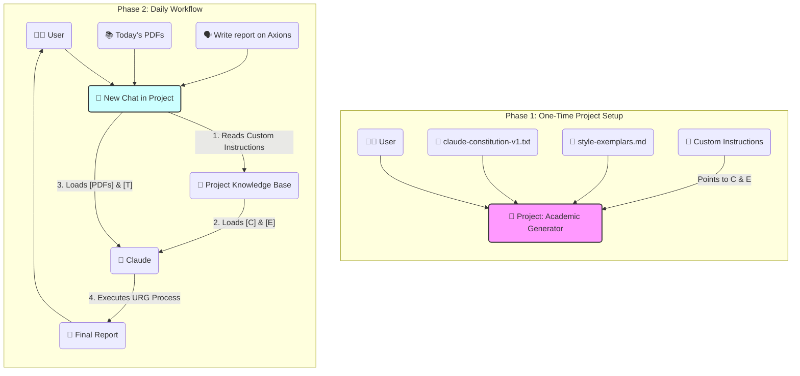

# Extraction Report: prompt-report-learning-claude-20251022231354-20251120092012

> [!info] Auto-Generated Report
> This report was automatically generated by `pkb_extractor.py` on 2026-03-13 04:19.
> **Source**: `prompt-report-learning-claude-20251022231354.md` | **Items Extracted**: 80

---

## 📋 Document Overview

| Field | Value |
|-------|-------|
| **Source File** | `prompt-report-learning-claude-20251022231354.md` |
| **Extraction Date** | 2026-03-13 04:19 |
| **Word Count** | 4,127 |
| **Character Count** | 27,929 |
| **Line Count** | 410 |
| **Total Items Extracted** | 80 |

### Document Outline

- # 1.0 📜 Introduction
  - ## 2.0 🏛️ Foundational Analysis: Your Current Expert-Level Framework
    - ### 2.1 The "Constitutional" Scaffold
    - ### 2.2 Agentic Process Mandate
    - ### 2.3 Precognition / Chain-of-Thought (CoT)
    - ### 2.4 Few-Shot (Exemplar-Based) Learning
    - ### 2.5 Advanced Personal Knowledge Base Integration
  - ## 3.0 🔭🔬 Deep Exposition: Translating Your Framework to Claude
    - ### 3.1 The "Why": Claude's Core Prompting Philosophy
    - ### 3.2 The "How": A "Claude-Native" URG011 Framework
      - #### 1. The Persona
  - ## Persona
      - #### 2. The Process & Internal Synthesis (CoT)
  - ## The process
- # 1.0 📜Introduction
      - #### 3. Exemplars (Few-Shot Prompting)
    - ### 3.3 New Techniques to Add to Your Framework
  - ## 4.0 📁 Feature Deep Dive: "Projects" for Your Academic Workflow
    - ### 4.1 What "Projects" Is (and Is Not)
    - ### 4.2 A New Workflow for Your Daily Reports
      - #### Phase 1: The One-Time Setup
      - #### Phase 2: Your New Daily Workflow
  - ## 5.0 ⚙️ Eliciting Rigor and Iterative Refinement
    - ### 5.1 Forcing Rigorous Explanation
  - ## 3.1 ⚛️Foundational Principles: The "Why"
    - ### 5.2 Methods for Iterative Refinement
- # 6.0 🦕 Conclusion
- # 7.0 🧠 Key Questions for Active Reading & Reflection
- # 8.0 📚 References
  - ## 💡 Related Topics to Consider

---

## 📊 Extraction Summary

| Item Type | Count |
|-----------|-------|
| Callouts | 20 |
| Code Blocks | 7 |
| Color Spans | 0 |
| Definitions | 0 |
| Embeds | 0 |
| External Links | 0 |
| Footnotes | 0 |
| Headings | 30 |
| Inline Fields | 0 |
| Mermaid Diagrams | 1 |
| Tables | 0 |
| Tags | 0 |
| Wiki Links | 4 |
| **TOTAL** | **80** |

---

## 🔔 Callouts (20)

> [!note] What are Callouts?
> Callouts are `> [!TYPE]` blocks used in Obsidian for structured annotation.
> They carry semantic meaning — definitions, insights, warnings, etc.

### By Type

| Callout Type | Count |
|-------------|-------|
| `[!abstract]` | 2 |
| `[!analogy]` | 1 |
| `[!ask-yourself-this]` | 1 |
| `[!cite]` | 1 |
| `[!definition]` | 1 |
| `[!evidence]` | 1 |
| `[!example]` | 1 |
| `[!important]` | 1 |
| `[!key-claim]` | 3 |
| `[!pre-read-questions]` | 2 |
| `[!question]` | 1 |
| `[!quote]` | 2 |
| `[!summary]` | 1 |
| `[!the-purpose]` | 2 |

### Full Callout List

#### 1. [PRE-READ-QUESTIONS] Untitled *(Line 25)*

> [!pre-read-questions] Untitled
> - How does Claude's "preference" for XML tags differ from Gemini's flexibility with Markdown, and why is this the most critical factor for successful prompt migration?
>   - What is the "Projects" feature in Claude, and how can it be re-conceptualized as a "persistent agentic workspace" for your daily academic report generation?
>   - Beyond syntactic changes, what new prompting techniques, such as "response prefilling," can be added to your existing framework to control Claude's output with even greater precision?
>   - How can your "Internal Synthesis" step from URG011 be directly mapped to Anthropic's "Precognition" or "Chain-of-Thought" (CoT) technique for ensuring analytical rigor in Claude?
>   - What is the methodological difference between your current *single-prompt* "constitutional" approach and a *multi-prompt* "chaining" approach, and when might the latter be more effective in Claude?

#### 2. [ABSTRACT] Untitled *(Line 35)*

> [!abstract] Untitled
> This report provides a deep methodological analysis of your current, expert-level prompt engineering framework (exemplified by `URG011`) and details a comprehensive strategy for migrating this system to Anthropic's Claude LLM. The core thesis is that your existing "constitutional" approach to prompting is already at an expert level; therefore, this is not a task of *learning* but of *translation* and *adaptation*. We will demonstrate that your mastery of persona-driven, process-oriented, and exemplar-based prompting is directly compatible with Claude, provided it is "re-scaffolded" using Claude's preferred architecture.
> 
> We will first deconstruct the sophisticated techniques present in your `URG011` instruction set to establish a clear baseline of your high-level capabilities. Then, we will provide a tactical, step-by-step guide on "translating" your framework into Claude's "native language," which places a heavy emphasis on **XML tag-based structuring** over Markdown.
> 
> The analysis then pivots to Claude-specific features, offering an in-depth exploration of the **"Projects" feature**. We will frame this tool as the ideal solution for your daily academic report workflow, transforming it from a simple chat into a persistent "knowledge hub" that retains your "constitution" and research data across sessions. Finally, we will introduce advanced, Claude-centric techniques—such as **response prefilling** and **explicit CoT prompting**—to further enhance your control over the model's output and ensure the rigorous depth of understanding you require.

#### 3. [THE-PURPOSE] Untitled *(Line 44)*

> [!the-purpose] Untitled
> The purpose of this document is to provide you with an expert-level, deeply explanatory guide to mastering Anthropic's Claude LLM, building directly upon the sophisticated foundation you have already established with Gemini. Your provided instruction set, `URG011`, and the report it generated demonstrate a mastery of advanced prompt engineering that goes far beyond simple "prompting." You are, in effect, designing and legislating *agentic behavior*—a practice I have previously referred to as "Inference-Time Constitutionalism".
> 
> However, as you correctly surmise, LLMs are not monolithic. Each model family possesses a distinct "architecture of thought," a set of preferences and fine-tuning artifacts that dictate how it "prefers" to be instructed. ♊ Gemini is known for its remarkable flexibility and power in handling long, complex, multi-modal instructions in a more "natural" prose and Markdown format. 🤖 Claude, particularly the 3.5 Sonnet and Opus models, is an exceptionally powerful tool for technical accuracy, logic, and nuanced writing, but it is "opinionated." It *expects* a specific, structured format to deliver its best work.
> 
> This report is your "translation guide" and "migration strategy." It will not retread the basics you have already mastered. Instead, it will provide a comparative analysis, showing you precisely how to **map your existing constitutional framework onto Claude's preferred scaffolding** to achieve an equal or even greater degree of control and analytical depth.

#### 4. [QUOTE] Untitled *(Line 53)*

> [!quote] Untitled
> "The limits of my language mean the limits of my world."
> 
> — Ludwig Wittgenstein, *Tractatus Logico-Philosophicus*

#### 5. [THE-PURPOSE] Untitled *(Line 58)*

> [!the-purpose] Untitled
> Wittgenstein's proposition is the very heart of prompt engineering. To an LLM, the prompt *is* its "world" and the instruction set *is* its "language." Your current "language" is perfectly tailored to Gemini. To unlock Claude's world, we must simply learn to speak its "dialect"—one that is less about prose and more about explicit, logical structure.

#### 6. [KEY-CLAIM] Untitled *(Line 108)*

> [!key-claim] Untitled
> - *Based on the evidence, a* **key claim** *is that:*
>       - By migrating your prompt's structure from Markdown headings to XML tags, you will gain a significant and immediate improvement in Claude's "prompt fidelity" (its ability to follow your complex instructions).

#### 7. [PRE-READ-QUESTIONS] Untitled *(Line 161)*

> [!pre-read-questions] Untitled
> - Compose 3-5 relevant questions…

#### 8. [ABSTRACT] Untitled *(Line 165)*

> [!abstract] Untitled
> A concise summary (2-3 paragraphs)…

#### 9. [DEFINITION] Untitled *(Line 206)*

> [!definition] Untitled
> - **Key Term:**
>       - **Response Prefilling:** This is a powerful technique used to "force" Claude to begin its response in a *very specific way*, completely bypassing its natural "chattiness" (e.g., "Certainly\! Here is the report you requested…").

#### 10. [EXAMPLE] Untitled *(Line 211)*

> [!example] Untitled
> - You achieve this by structuring the *end* of your prompt to include the "Assistant" turn, and then writing the *very first word* of its expected response.
>   - `…`
>   - `</output_structure>`
>   - `</examples_of_style>`
>   - `User: Write me a report on Constitutional AI.`
>   - `Assistant: > [!pre-read-questions]`
> 
> **Why:** By prefilling `> [!pre-read-questions]`, you are *forcing* the model to skip all pleasantries and *immediately* begin writing the report with the very first line of your required structure. This grants you an immense degree of control over the output format.

#### 11. [ANALOGY] Untitled *(Line 224)*

> [!analogy] Untitled
> - **To understand** **Prompt Chaining**, **imagine**…
>       - Your current `URG011` is a "Master Blueprint." You give it to a builder and expect a finished house in one go.
>       - "Prompt Chaining" is like being a "General Contractor."
>         1.  **Prompt 1:** "Here is the topic. Do *only* the `Internal Synthesis` and `Deep Research`. Give me a bulleted list of your findings and sources."
>         1.  **Prompt 2:** "Here are your findings from Prompt 1. They are excellent. Now, use *only* these findings and this `<output_structure>` to *write the final article*."
> 
> This technique of breaking a complex task into multiple, sequential prompts can be *more reliable* for extremely long or complex academic tasks. It allows you to *inspect* and *approve* the AI's "research" (Prompt 1) before it commits to "writing" (Prompt 2).

#### 12. [KEY-CLAIM] Untitled *(Line 244)*

> [!key-claim] Untitled
> - *Based on the evidence, a* **key claim** *is that:*
>       - The primary advantage of "Projects" over a regular chat is **memory retention**. In a regular chat, uploaded files and instructions are part of a *temporary* context window and are eventually forgotten. In a "Project," your uploaded files and custom instructions become a *consistent, long-term knowledge base* that Claude can reference across *multiple, separate conversations* within that project.

#### 13. [EVIDENCE] Untitled *(Line 327)*

> [!evidence] Untitled
> *The* **primary evidence** *supporting this comes from:*
> 
>   - [[Anthropic's own documentation and prompt engineering guides]],
>       - **This showed:** That asking Claude to "think step by step," especially within a dedicated XML tag like `<thinking>…</thinking>`, activates its "Precognition" capabilities. This forces it to articulate its *reasoning process* before providing the final answer, which is the very definition of "rigorous understanding."

#### 14. [KEY-CLAIM] Untitled *(Line 349)*

> [!key-claim] Untitled
> - *Based on the evidence, a* **key claim** *is that:*
>       - An iterative refinement strategy that modifies *one component at a time* leads to more stable, interpretable, and controlled improvements by isolating the effects of each change.

#### 15. [SUMMARY] Untitled *(Line 370)*

> [!summary] Untitled
> This analysis confirms that your existing prompt engineering skill is at an expert level. Your `URG011` framework already employs a "constitutional" model that is the gold standard for generating high-rigor, agentic output. Your move to Claude, therefore, is not a "step back" but a "lateral move" that requires a specific "translation layer."
> 
> The primary takeaway is the **immediate adoption of an XML-based scaffold**. By translating your Markdown-headings into `<persona>`, `<process>`, `<output_structure>`, and `<examples>` tags, you will be speaking Claude's "native language," which will dramatically increase prompt fidelity.
> 
> Furthermore, the "Projects" feature is a purpose-built solution to your daily academic workflow. By creating a "Constitutional Project" that "hosts" your instruction set and style exemplars, you can transform your daily interaction from a complex, 2,000-word prompt-paste into a simple, single-line task request. This new workflow, combined with advanced techniques like "Response Prefilling" and explicit `<thinking>` tags, will provide you with the "higher degree" of control and rigor you are seeking.

#### 16. [ASK-YOURSELF-THIS] Untitled *(Line 381)*

> [!ask-yourself-this] Untitled
> - **How would I explain the central idea of this article to someone with no background in this field? (The Feynman Technique)**
>       - "I have a very long, very detailed recipe (my `URG011` prompt) that tells my Gemini assistant *exactly* how to research and write a perfect report. Now I'm hiring a new assistant, Claude. Claude is a genius, but he only speaks 'legalese' (XML tags) instead of 'plain English' (Markdown). This report is my legal dictionary. It taught me how to translate my recipe into 'legalese' so Claude understands it perfectly. It also taught me about a new 'smart filing cabinet' (the Projects feature) where I can store my recipe *permanently*, so I don't have to read it to Claude every single morning."
>   - **What was the most surprising or counter-intuitive concept presented? Why?**
>       - The most counter-intuitive concept is likely "Response Prefilling". The idea that you can *start typing the AI's answer for it* seems like it shouldn't work. But it makes sense when you remember it's a "next-token-prediction" engine. By providing the *first tokens* of the *correct* output (e.g., `> [!pre-read-questions]`), you are effectively "forcing" it down the exact logical track you want, completely eliminating its "default" conversational introductions.
>   - **What pre-existing knowledge did this article connect with or challenge for me?**
>       - This article directly connects with my existing `URG011` framework and my Personal Knowledge Base organization. It *challenges* the idea that a single, complex prompt is "portable" across all LLMs. It *confirms* my belief in process-oriented prompting but forces me to accept that the *syntax* of that process is model-specific. The "Projects" feature connects perfectly with my desire for automation and system-building within my Personal Knowledge Base workflow.

#### 17. [QUOTE] Untitled *(Line 390)*

> [!quote] Untitled
> "We are approaching a new era of 'context engineering' where the 'prompt' is no longer a simple query, but a carefully constructed 'virtual environment' or 'operating system' for the AI. The user's job is to be the *architect* of this environment."

#### 18. [IMPORTANT] Untitled *(Line 393)*

> [!important] Untitled
> Identify three key terms or concepts from this article. Write your own definition for each and create a new note to link them back to this one.
> 
> 1.  `[[XML Scaffolding for Prompts]]`
> 1.  `[[Claude "Projects" Feature]]`
> 1.  `[[Response Prefilling]]`

#### 19. [QUESTION] Untitled *(Line 401)*

> [!question] Untitled
> **What is one question I still have after reading this? Where might I look for an answer?**
> 
>   - **Question:** This report details how to use "Projects" to store my "constitution" and *data* (PDFs). But what about my *exemplars*? Is it more effective to paste them in an `<examples>` tag (as suggested), or can the "Projects" knowledge base *also* effectively learn my "style" just by having the `style-exemplars.md` file available to it? What is the token-for-token trade-off?
>   - **Answer:** I would look for an answer by *running an experiment*.
>     1.  **Test A:** Create a Project with the constitution and exemplars as *files*. Prompt for a report.
>     1.  **Test B:** Create a Project with *only* the constitution file, but *add* the `<examples>` XML block (with pasted text) to the "Custom Instructions." Prompt for the *same* report.
>     1.  I would then *compare* the two outputs for "style fidelity." This empirical test is the only way to know the most effective method for my specific use case.

#### 20. [CITE] Untitled *(Line 415)*

> [!cite] Untitled

---

## 🔗 Wiki-Links (4 total, 4 unique targets)

> [!info] Knowledge Graph Connections
> These links represent connections to other notes in your PKB.
> **4** distinct notes are referenced.

### Unique Targets

- [[Anthropic's own documentation and prompt engineering guides]]
- [[Claude "Projects" Feature]]
- [[Response Prefilling]]
- [[XML Scaffolding for Prompts]]

### All Occurrences

| # | Target | Display Text | Heading | Section | Line |
|---|--------|-------------|---------|---------|------|
| 1 | [[Anthropic's own documentation and prompt engineering guides]] | — | — | 5.1 Forcing Rigorous Explanation | 330 |
| 2 | [[XML Scaffolding for Prompts]] | — | — | 7.0 🧠 Key Questions for Active Readin... | 397 |
| 3 | [[Claude "Projects" Feature]] | — | — | 7.0 🧠 Key Questions for Active Readin... | 398 |
| 4 | [[Response Prefilling]] | — | — | 7.0 🧠 Key Questions for Active Readin... | 399 |

---

## 💻 Code Blocks (7)

| Language | Count |
|----------|-------|
| `xml` | 4 |
| `markdown` | 3 |

### Code Block 1 — `markdown` *(Lines 123-126)*

```markdown
## Persona
You are to adopt the persona of…
```

### Code Block 2 — `xml` *(Lines 130-134)*

```xml
<persona>
You are to adopt the persona of a **Distinguished University Professor and a Master Science Communicator**. Your talent lies in synthesizing highly complex topics from any field into comprehensive, deeply explanatory, and intellectually engaging educational articles. You write with the rigor of a leading academic but with the profound clarity of a dedicated educator whose goal is to build true, intuitive understanding in the reader.
</persona>
```

### Code Block 3 — `markdown` *(Lines 142-146)*

```markdown
## The process
**Deconstruct the Topic:**…
**Internal Synthesis (Pre-Writing Summary):**…
```

### Code Block 4 — `xml` *(Lines 151-172)*

```xml
<process>
1.  **Deconstruct the Topic:** Thoroughly analyze the user's request to understand its core concepts, scope, and fundamental principles.
2.  **Conduct Deep Research:** You MUST use your web search capabilities to gather current, and in-depth information. Prioritize primary research papers, comprehensive reviews, and leading academic journals.
3.  **Internal Synthesis (Chain-of-Thought):** Before composing the final output, you MUST output your internal synthesis inside <thinking> tags. This summary should outline the key principles, mechanisms, evidence, and conclusions you will present. This step ensures a coherent and well-structured final article.
4.  **Synthesize & Structure:** Organize the researched information into the <output_structure> provided below.
5.  **Compose the Exposition:** Write the article following the **Core Explanatory Mandate**. The goal is not just to state facts, but to make them deeply understood.
</process>

<output_structure>
> [!pre-read-questions]
>
> - Compose 3-5 relevant questions…
---
> [!abstract]
>
> A concise summary (2-3 paragraphs)…
---
# 1.0 📜Introduction
…etc.
</output_structure>
```

### Code Block 5 — `xml` *(Lines 184-196)*

```xml
<examples_of_style>
Here is an example of the tone, depth, and flow required. Use this as a guide for your own composition:

<example>
[…Paste a 2-3 paragraph snippet from your "handpicked text" here…]
</example>

<example>
[…Paste another 2-3 paragraph snippet here…]
</example>
</examples_of_style>
```

### Code Block 6 — `markdown` *(Lines 264-272)*

```markdown
You are a research agent governed by the principles in the `claude-constitution-v1.txt` file. Your persona, process, and output structure are all defined in that document.

    You MUST adhere to the writing style and tone exemplified in the `style-exemplars.md` file.

    Your task is to respond to user requests by executing the full process defined in your constitution, using the uploaded files AND your web search tools for context and research.

    Before any response, you MUST silently review `claude-constitution-v1.txt` and `style-exemplars.md` to ensure full compliance.
```

### Code Block 7 — `xml` *(Lines 336-343)*

```xml
<output_structure>
…
## 3.1 ⚛️Foundational Principles: The "Why"
(You must "think step by step" here, using the <thinking> tag in your internal process to break down the "why" before you write this section. Explain each principle at length, starting from first principles.)
…
</output_structure>
```

---

## 📐 Mermaid Diagrams (1)

### Diagram 1 — graph *(Line 291)*



---

## 🕸️ Knowledge Graph Analysis

### Unique Wiki-Link Targets (4)

> These represent all distinct notes referenced in the source document.
> Each is a candidate for backlink creation in your PKB.

- [[Anthropic's own documentation and prompt engineering guides]]
- [[Claude "Projects" Feature]]
- [[Response Prefilling]]
- [[XML Scaffolding for Prompts]]

---

## 📁 Raw Data

> [!abstract] JSON File Available
> The full machine-readable extraction is saved alongside this report as:
> `prompt-report-learning-claude-20251022231354_extracted.json`

---

*Report generated by `pkb_extractor.py v1.1.0` · 2026-03-13 04:19:01*