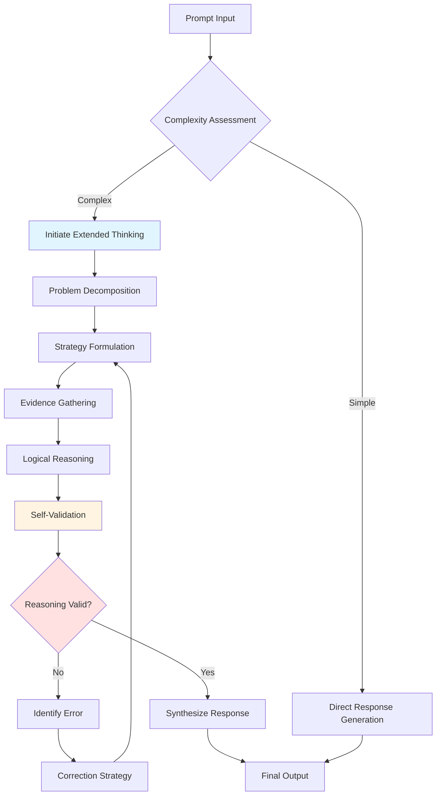

# Extraction Report: Claudes Extended Thinking

> [!info] Auto-Generated Report
> This report was automatically generated by `pkb_extractor.py` on 2026-03-19 02:44.
> **Source**: `claudes-extended-thinking.md` | **Items Extracted**: 295

---

## 📋 Document Overview

| Field | Value |
|-------|-------|
| **Source File** | `claudes-extended-thinking.md` |
| **Extraction Date** | 2026-03-19 02:44 |
| **Word Count** | 5,065 |
| **Character Count** | 41,525 |
| **Line Count** | 656 |
| **Total Items Extracted** | 295 |

### Document Outline

    - ### Claude Thinking
- # Claude's Extended Thinking Architecture: A Comprehensive Analysis of Reasoning Tags, Cognitive Scaffolding, and Advanced Prompt Engineering Methodologies
  - ## Abstract
  - ## 1. Introduction: The Evolution from Token Generation to Explicit Reasoning
    - ### 1.1 The Fundamental Paradigm Shift
    - ### 2.2 Cognitive Budget and Resource Allocation
    - ### 2.3 The Reasoning-Response Pipeline
    - ### 2.4 Integration with Tool Use and Multi-Step Workflows
  - ## 3. Reasoning Frameworks: From Theory to Implementation
    - ### 3.1 Chain of Thought (CoT): The Foundation
    - ### 3.2 Tree of Thoughts (ToT): Exploring Multiple Reasoning Paths
    - ### 3.3 Self-Consistency: Reliability Through Ensemble Reasoning
    - ### 3.4 Reflexion: Learning from Mistakes
  - ## 4. Advanced Reasoning Patterns: Structured XML Thinking Protocols
    - ### 4.1 The State-Tracking Pattern
    - ### 4.2 The Multi-Perspective Analysis Pattern
    - ### 4.3 The Chain of Verification Pattern
    - ### 4.4 The Metacognitive Checkpoint Pattern
  - ## 5. Prompt Engineering Best Practices for Extended Thinking
    - ### 5.1 Strategic Thinking Invocation
    - ### 5.2 Explicit Thinking Instructions
    - ### 5.3 The Thinking-Response Boundary Contract
    - ### 5.4 Calibrating Thinking Depth
- # Shallow Thinking (Fast & Cheap)
- # Moderate Thinking (Standard)
- # Deep Thinking (Thorough)
- # Adaptive Thinking
  - ## 6. Practical Applications and Use Cases
    - ### 6.1 Code Generation and Debugging
    - ### 6.2 Research Synthesis and Writing
    - ### 6.3 Complex Decision Making
    - ### 6.4 Educational Content Creation
  - ## 7. Limitations and Failure Modes
    - ### 7.1 When Thinking Doesn't Help
    - ### 7.2 Computational Cost Considerations
    - ### 7.3 Transparency vs. Opacity Trade-offs
  - ## 8. Future Directions and Research Opportunities
    - ### 8.1 Learned Thinking Patterns
    - ### 8.2 Collaborative Thinking
    - ### 8.3 Human-AI Thinking Partnerships
  - ## 🔗 Related Topics for PKB Expansion
    - ### 1. **[[Prompt Engineering Taxonomy and Pattern Library]]**
    - ### 2. **[[Token Economics and Cost Optimization for Production LLM Systems]]**
    - ### 3. **[[Cognitive Science Foundations of LLM Reasoning Techniques]]**
    - ### 4. **[[Multi-Agent Architectures and Agentic Workflows]]**
    - ### 5. **[[Evaluation Methodologies for LLM Reasoning Quality]]**
    - ### 6. **[[Safety and Alignment Considerations in Advanced Reasoning Systems]]**
  - ## References and Further Reading

---

## 📊 Extraction Summary

| Item Type | Count |
|-----------|-------|
| Callouts | 5 |
| Code Blocks | 24 |
| Color Spans | 0 |
| Definitions | 51 |
| Embeds | 0 |
| External Links | 0 |
| Footnotes | 0 |
| Headings | 48 |
| Inline Fields | 51 |
| Mermaid Diagrams | 1 |
| Tables | 1 |
| Tags | 0 |
| Wiki Links | 21 |
| **TOTAL** | **295** |

---

## 🔔 Callouts (5)

> [!note] What are Callouts?
> Callouts are `> [!TYPE]` blocks used in Obsidian for structured annotation.
> They carry semantic meaning — definitions, insights, warnings, etc.

### By Type

| Callout Type | Count |
|-------------|-------|
| `[!definition]` | 1 |
| `[!example]` | 1 |
| `[!key-claim]` | 1 |
| `[!warning]` | 2 |

### Full Callout List

#### 1. [DEFINITION] Extended Thinking Modes *(Line 88)*

> [!definition] Extended Thinking Modes
> Claude supports multiple thinking modes controlled via the `<thinking_mode>` parameter:
> 
> - **`enabled`**: Thinking blocks generated when the model determines they would improve response quality
> - **`disabled`**: No thinking blocks generated (standard response mode)  
> - **`auto`**: Model autonomously decides when to use thinking based on task complexity
> - **`interleaved`**: Thinking can be interspersed with tool use and response generation for complex multi-step workflows

#### 2. [EXAMPLE] Practical Manifestation: Error Correction Without Visible Revisions *(Line 145)*

> [!example] Practical Manifestation: Error Correction Without Visible Revisions
> Consider a mathematical problem where Claude's initial approach in a thinking block proves incorrect:
> 
> ```xml
> 
> 
> The solution uses formula Y because [explanation]...
> ```
> 
> The user sees only the correct approach—never knowing that an initial error was caught and corrected during thinking. This creates response quality that would be impossible with visible reasoning chains.

#### 3. [WARNING] Computational Cost Considerations *(Line 227)*

> [!warning] Computational Cost Considerations
> While ToT enables superior reasoning quality, it comes with significant token costs. A ToT exploration with branching factor 4 and depth 3 generates 64 leaf nodes in complete exploration. Strategic pruning (discarding low-scoring branches early) is essential for practical deployment. The academic paper generator template in the user's original request demonstrates sophisticated pruning strategies using threshold-based and relative scoring approaches.

#### 4. [KEY-CLAIM] The Meta-Learning Hypothesis *(Line 268)*

> [!key-claim] The Meta-Learning Hypothesis
> Reflexion within extended thinking enables a form of "fast meta-learning"—not learning new knowledge, but learning better problem-solving strategies for the specific task at hand through rapid iteration cycles. This parallels human expert problem-solving more closely than direct answer generation.

#### 5. [WARNING] The Deliberation Paradox *(Line 545)*

> [!warning] The Deliberation Paradox
> [**Deliberation-Effectiveness-Tradeoff**:: The empirically observed phenomenon where moderate deliberation improves outcomes, but excessive deliberation can degrade performance through overthinking, anxiety effects, or analysis paralysis—suggesting optimal thinking depth is task-dependent with diminishing returns.]

---

## 🔗 Wiki-Links (21 total, 17 unique targets)

> [!info] Knowledge Graph Connections
> These links represent connections to other notes in your PKB.
> **17** distinct notes are referenced.

### Unique Targets

- [[Chain-of-Thought|Chain of Thought]]
- [[Chain-of-Thought-Prompting|Chain of Thought Prompting]]
- [[Chain-of-Verification|Chain of Verification]]
- [[Cognitive Science Foundations of LLM Reasoning Techniques]]
- [[Dhuliawala et al. 2023]]
- [[Evaluation Methodologies for LLM Reasoning Quality]]
- [[Multi-Agent Architectures and Agentic Workflows]]
- [[Prompt Engineering Taxonomy and Pattern Library]]
- [[Reflexion]]
- [[Safety and Alignment Considerations in Advanced Reasoning Systems]]
- [[Self-Consistency]]
- [[Shinn et al. 2023]]
- [[Token Economics and Cost Optimization for Production LLM Systems]]
- [[Tree-of-Thoughts|Tree of Thoughts]]
- [[Wang-et-al.-2022|Wang et al. 2022]]
- [[Wei-et-al.-2022|Wei et al. 2022]]
- [[Yao et al. 2023]]

### All Occurrences

| # | Target | Display Text | Heading | Section | Line |
|---|--------|-------------|---------|---------|------|
| 1 | [[Chain-of-Thought|Chain of Thought]] | — | — | Abstract | 73 |
| 2 | [[Tree-of-Thoughts|Tree of Thoughts]] | — | — | Abstract | 73 |
| 3 | [[Self-Consistency]] | — | — | Abstract | 73 |
| 4 | [[Reflexion]] | — | — | Abstract | 73 |
| 5 | [[Chain-of-Thought|Chain of Thought]] | — | — | 2.3 The Reasoning-Response Pipeline | 143 |
| 6 | [[Chain-of-Thought-Prompting|Chain of Thought Prompting]] | — | — | 3.1 Chain of Thought (CoT): The Found... | 179 |
| 7 | [[Wei-et-al.-2022|Wei et al. 2022]] | — | — | 3.1 Chain of Thought (CoT): The Found... | 179 |
| 8 | [[Tree-of-Thoughts|Tree of Thoughts]] | — | — | 3.2 Tree of Thoughts (ToT): Exploring... | 207 |
| 9 | [[Yao et al. 2023]] | — | — | 3.2 Tree of Thoughts (ToT): Exploring... | 207 |
| 10 | [[Self-Consistency]] | — | — | 3.3 Self-Consistency: Reliability Thr... | 232 |
| 11 | [[Wang-et-al.-2022|Wang et al. 2022]] | — | — | 3.3 Self-Consistency: Reliability Thr... | 232 |
| 12 | [[Reflexion]] | — | — | 3.4 Reflexion: Learning from Mistakes | 252 |
| 13 | [[Shinn et al. 2023]] | — | — | 3.4 Reflexion: Learning from Mistakes | 252 |
| 14 | [[Chain-of-Verification|Chain of Verification]] | — | — | 4.3 The Chain of Verification Pattern | 301 |
| 15 | [[Dhuliawala et al. 2023]] | — | — | 4.3 The Chain of Verification Pattern | 301 |
| 16 | [[Prompt Engineering Taxonomy and Pattern Library]] | — | — | 1. **[[Prompt Engineering Taxonomy an... | 605 |
| 17 | [[Token Economics and Cost Optimization for Production LLM Systems]] | — | — | 2. **[[Token Economics and Cost Optim... | 611 |
| 18 | [[Cognitive Science Foundations of LLM Reasoning Techniques]] | — | — | 3. **[[Cognitive Science Foundations ... | 617 |
| 19 | [[Multi-Agent Architectures and Agentic Workflows]] | — | — | 4. **[[Multi-Agent Architectures and ... | 623 |
| 20 | [[Evaluation Methodologies for LLM Reasoning Quality]] | — | — | 5. **[[Evaluation Methodologies for L... | 629 |
| 21 | [[Safety and Alignment Considerations in Advanced Reasoning Systems]] | — | — | 6. **[[Safety and Alignment Considera... | 635 |

---

## 📖 Definitions (51)

> [!tip] PKB Definitions
> These `[**Term**:: Definition]` fields define key concepts.
> They are queryable by Dataview.

### 1. Extended-Thinking-Architecture

> [!definition] Extended-Thinking-Architecture
> Claude's systematic capability to perform explicit, visible reasoning through structured XML tags that enable multi-step deliberation, self-correction, and metacognitive reflection before generating final responses.

*Source: Line 73 in `claudes-extended-thinking.md`*

### 2. Opaque-Reasoning-Problem

> [!definition] Opaque-Reasoning-Problem
> The fundamental limitation of standard LLM architectures where complex multi-step reasoning occurs implicitly during forward pass computation, making it impossible to verify intermediate steps, identify reasoning errors, or understand decision pathways.

*Source: Line 81 in `claudes-extended-thinking.md`*

### 3. Explicit-Reasoning-Externalization

> [!definition] Explicit-Reasoning-Externalization
> A systematic approach where the model generates visible, structured reasoning processes in designated `[Final user-facing response appears here after thinking is complete

*Source: Line 83 in `claudes-extended-thinking.md`*

### 4. Thinking-Tag-Semantics

> [!definition] Thinking-Tag-Semantics
> XML tags (``) that signal to Claude's architecture that content within should be treated as internal reasoning—not displayed to users in standard interfaces, exempt from certain brevity pressures, and subject to different optimization objectives prioritizing reasoning quality over presentation polish.

*Source: Line 86 in `claudes-extended-thinking.md`*

### 5. Thinking-Budget-Mechanism

> [!definition] Thinking-Budget-Mechanism
> The internal computational allocation system that determines how much processing Claude devotes to explicit reasoning versus direct response generation, influenced by task complexity assessment, prompt instructions, and configured thinking modes.

*Source: Line 98 in `claudes-extended-thinking.md`*

### 6. Cognitive-Resource-Separation

> [!definition] Cognitive-Resource-Separation
> Architectural design where expensive reasoning operations (hypothesis generation, verification, alternative exploration) occur in thinking space while user-facing responses benefit from these deliberations without bearing their token cost or verbosity.

*Source: Line 110 in `claudes-extended-thinking.md`*

### 7. Thinking-Response-Decoupling

> [!definition] Thinking-Response-Decoupling
> The architectural property where reasoning processes (in thinking blocks) can iterate, backtrack, and self-correct without these revisions appearing in final responses, enabling higher-quality outputs through invisible refinement cycles.

*Source: Line 143 in `claudes-extended-thinking.md`*

### 8. Interleaved-Thinking-Tool-Integration

> [!definition] Interleaved-Thinking-Tool-Integration
> The capability to alternate between reasoning deliberation, tool invocation, and response generation within a single interaction, enabling sophisticated agentic workflows where each tool result triggers new reasoning before subsequent actions.

*Source: Line 158 in `claudes-extended-thinking.md`*

### 9. Agentic-Reasoning-Loop

> [!definition] Agentic-Reasoning-Loop
> Workflow pattern where autonomous tool-using agents alternate between action execution and metacognitive reflection, with thinking blocks serving as the deliberation space that determines next actions based on observed results.

*Source: Line 171 in `claudes-extended-thinking.md`*

### 10. Reasoning-Path-Dependency

> [!definition] Reasoning-Path-Dependency
> LLM output quality for complex tasks strongly depends on whether intermediate reasoning steps are explicitly articulated versus implicitly computed, with explicit articulation enabling error detection and recovery.

*Source: Line 179 in `claudes-extended-thinking.md`*

### 11. CoT-Thinking-Synergy

> [!definition] CoT-Thinking-Synergy
> The multiplicative benefit achieved when Chain of Thought reasoning occurs within thinking blocks rather than user-facing text, enabling much deeper exploration without response bloat and creating space for self-validation steps that improve reliability.

*Source: Line 203 in `claudes-extended-thinking.md`*

### 12. Branching-Reasoning-Search

> [!definition] Branching-Reasoning-Search
> Systematic exploration of multiple reasoning trajectories organized in a tree structure, where each node represents a partial solution state and edges represent reasoning steps, enabling backtracking from dead-ends and comparison across alternative approaches.

*Source: Line 207 in `claudes-extended-thinking.md`*

### 13. Thought-Granularity

> [!definition] Thought-Granularity
> The decision about what constitutes a single "thought" or reasoning step—too coarse risks missing critical intermediates, too fine creates combinatorial explosion—balanced based on problem structure and evaluation cost.

*Source: Line 211 in `claudes-extended-thinking.md`*

### 14. Intermediate-State-Scoring

> [!definition] Intermediate-State-Scoring
> Heuristic assessment of partial solutions' promise before fully exploring their branches, enabling pruning of low-quality paths and resource concentration on promising directions.

*Source: Line 213 in `claudes-extended-thinking.md`*

### 15. BFS-ToT-Pattern

> [!definition] BFS-ToT-Pattern
> Exploration strategy that fully develops all thoughts at depth N before proceeding to depth N+1, ensuring comprehensive coverage but potentially expensive.

*Source: Line 216 in `claudes-extended-thinking.md`*

### 16. DFS-ToT-Pattern

> [!definition] DFS-ToT-Pattern
> Exploration strategy that fully explores one reasoning path to conclusion before backtracking to try alternatives, enabling earlier termination when good solutions found but risking local optima.

*Source: Line 217 in `claudes-extended-thinking.md`*

### 17. ToT-Thinking-Scalability

> [!definition] ToT-Thinking-Scalability
> The architectural advantage where ToT's potentially large exploration space (multiple branches × multiple depths) fits naturally within thinking blocks without overwhelming user-facing responses, enabling complex searches that would be impractical in visible reasoning formats.

*Source: Line 225 in `claudes-extended-thinking.md`*

### 18. Single-Sample-Unreliability

> [!definition] Single-Sample-Unreliability
> The problem that any individual reasoning path from a stochastic model may contain errors, even with CoT, making single responses insufficient for high-stakes decisions.

*Source: Line 232 in `claudes-extended-thinking.md`*

### 19. Ensemble-Verification-Principle

> [!definition] Ensemble-Verification-Principle
> Generate multiple independent reasoning paths for the same problem, extract answers from each, and select the majority response—leveraging the statistical tendency for correct reasoning to converge while errors vary randomly.

*Source: Line 232 in `claudes-extended-thinking.md`*

### 20. Self-Consistency-Quality-Reliability-Tradeoff

> [!definition] Self-Consistency-Quality-Reliability-Tradeoff
> The explicit exchange where computational cost increases linearly with sample count (typically 3-10 samples) while reliability and confidence increase non-linearly, with diminishing returns beyond ~7 samples for most tasks.

*Source: Line 240 in `claudes-extended-thinking.md`*

### 21. Reasoning-Path-Independence

> [!definition] Reasoning-Path-Independence
> The requirement that each self-consistency sample must explore the problem fresh without being influenced by previous samples, typically achieved through temperature>0 and explicit instructions to "reason from first principles" for each sample.

*Source: Line 244 in `claudes-extended-thinking.md`*

### 22. SC-Temperature-Optimization

> [!definition] SC-Temperature-Optimization
> The critical parameter choice where too-low temperature (e.g., 0.3) produces near-identical samples (defeating the purpose), while too-high temperature (e.g., 1.0) increases random variation but may introduce errors—optimal range typically 0.6-0.8 for self-consistency applications.

*Source: Line 246 in `claudes-extended-thinking.md`*

### 23. Acceptance-Threshold-Policy

> [!definition] Acceptance-Threshold-Policy
> The minimum agreement percentage required to accept a majority answer, typically 0.60-0.80 depending on risk tolerance—higher thresholds reduce false positives but increase "uncertain" outcomes requiring human review.

*Source: Line 248 in `claudes-extended-thinking.md`*

### 24. Trial-Error-Learning-Paradigm

> [!definition] Trial-Error-Learning-Paradigm
> Iterative refinement process where agents attempt tasks, receive feedback (from environment, evaluator, or self-assessment), explicitly reflect on failures, and adjust strategies for subsequent attempts—creating learning within a single problem-solving episode rather than across training data.

*Source: Line 252 in `claudes-extended-thinking.md`*

### 25. Reflexion-Thinking-Synergy

> [!definition] Reflexion-Thinking-Synergy
> The natural fit between Reflexion's iterative trial-error-reflection cycles and Claude's extended thinking architecture, where multiple attempts and learning loops can occur invisibly before presenting the refined final solution to users.

*Source: Line 260 in `claudes-extended-thinking.md`*

### 26. Explicit-State-Tracking

> [!definition] Explicit-State-Tracking
> The practice of maintaining structured representations of current problem state, progress through multi-step processes, and intermediate results within thinking blocks, enabling complex workflows that would overwhelm working context without explicit tracking.

*Source: Line 277 in `claudes-extended-thinking.md`*

### 27. XML-Structured-Thinking

> [!definition] XML-Structured-Thinking
> The technique of using XML-like tags within thinking blocks to create hierarchical, parseable structure that aids both Claude's reasoning organization and human debugging of complex workflows.

*Source: Line 285 in `claudes-extended-thinking.md`*

### 28. Structured-Perspective-Synthesis

> [!definition] Structured-Perspective-Synthesis
> Systematic pattern where thinking blocks enumerate distinct perspectives/frameworks/approaches, analyze each independently, then synthesize findings into a coherent integrated understanding that transcends any single viewpoint.

*Source: Line 289 in `claudes-extended-thinking.md`*

### 29. Perspective-Balance-Enforcement

> [!definition] Perspective-Balance-Enforcement
> The benefit of structured analysis where forcing explicit treatment of multiple viewpoints prevents cognitive biases (anchoring, confirmation bias) that can cause premature convergence on initial perspectives.

*Source: Line 297 in `claudes-extended-thinking.md`*

### 30. Hallucination-Risk-Management

> [!definition] Hallucination-Risk-Management
> The systematic challenge where LLMs confidently state false information, particularly factual claims, dates, citations, or technical specifications—requiring explicit verification protocols before accepting generated content.

*Source: Line 301 in `claudes-extended-thinking.md`*

### 31. CoVe-Thinking-Integration

> [!definition] CoVe-Thinking-Integration
> The natural synergy where Chain of Verification's multi-step process (generate → extract claims → independently verify → revise) maps perfectly onto thinking block workflow, enabling verification to occur invisibly before presenting final content to users.

*Source: Line 309 in `claudes-extended-thinking.md`*

### 32. Metacognitive-Monitoring

> [!definition] Metacognitive-Monitoring
> Explicit self-assessment of reasoning quality, strategy effectiveness, and confidence levels during problem-solving—analogous to human metacognition where we pause to evaluate whether our current approach is working or needs adjustment.

*Source: Line 313 in `claudes-extended-thinking.md`*

### 33. Self-Correction-Through-Metacognition

> [!definition] Self-Correction-Through-Metacognition
> The mechanism where explicit strategy evaluation catches errors, flawed assumptions, or misalignments with goals before they propagate through entire reasoning chains—functioning as an internal "peer review" step.

*Source: Line 321 in `claudes-extended-thinking.md`*

### 34. Thinking-Benefit-Criteria

> [!definition] Thinking-Benefit-Criteria
> The decision framework for determining when extended thinking provides meaningful value versus when it's computational overhead—generally high benefit for multi-step reasoning, low benefit for simple factual retrieval or direct knowledge application.

*Source: Line 329 in `claudes-extended-thinking.md`*

### 35. Thinking-Directive-Specificity

> [!definition] Thinking-Directive-Specificity
> The principle that explicit, detailed instructions about what to think about and how to structure thinking produce significantly better reasoning than generic "think about this" directives.

*Source: Line 378 in `claudes-extended-thinking.md`*

### 36. Thinking-Structure-Templates

> [!definition] Thinking-Structure-Templates
> Pre-defined reasoning frameworks embedded in prompts that guide Claude's thinking process along productive paths—functioning as cognitive scaffolding that reduces the search space of possible reasoning approaches.

*Source: Line 419 in `claudes-extended-thinking.md`*

### 37. Thinking-Response-Separation-Contract

> [!definition] Thinking-Response-Separation-Contract
> The explicit understanding that content in thinking blocks is NOT user-facing and content in final responses should NOT duplicate thinking block reasoning—maintaining clear separation of process (thinking) from product (response).

*Source: Line 423 in `claudes-extended-thinking.md`*

### 38. Thinking-Depth-Calibration

> [!definition] Thinking-Depth-Calibration
> The prompt engineering technique of explicitly specifying how much reasoning effort to allocate, preventing both under-thinking (quick but shallow) and over-thinking (expensive but marginally better)—tuned based on task value and budget constraints.

*Source: Line 450 in `claudes-extended-thinking.md`*

### 39. Cognitive-Budget-Specification

> [!definition] Cognitive-Budget-Specification
> Explicit instruction about computational resource allocation for reasoning, enabling cost-performance optimization tuned to specific use cases—critical for production deployments where thinking costs multiply across thousands of requests.

*Source: Line 476 in `claudes-extended-thinking.md`*

### 40. Code-Reasoning-Workflow

> [!definition] Code-Reasoning-Workflow
> Multi-stage process where thinking blocks handle architectural decisions, edge case analysis, and logic verification before generating actual code—producing higher-quality implementations with fewer bugs and better documentation.

*Source: Line 484 in `claudes-extended-thinking.md`*

### 41. Diagnostic-Reasoning-Process

> [!definition] Diagnostic-Reasoning-Process
> Systematic fault isolation where thinking blocks formulate hypotheses about bug causes, evaluate evidence for each hypothesis, and prioritize investigations—replacing random trial-and-error with strategic debugging.

*Source: Line 494 in `claudes-extended-thinking.md`*

### 42. Systematic-Research-Synthesis

> [!definition] Systematic-Research-Synthesis
> Structured process where thinking blocks handle literature review, framework comparison, evidence integration, and argument construction before generating polished prose—producing research writing that is both rigorous and coherent.

*Source: Line 498 in `claudes-extended-thinking.md`*

### 43. Structured-Decision-Framework

> [!definition] Structured-Decision-Framework
> Explicit enumeration of options, criteria-based evaluation, risk assessment, and sensitivity analysis in thinking blocks before recommending specific actions.

*Source: Line 509 in `claudes-extended-thinking.md`*

### 44. Pedagogical-Content-Design

> [!definition] Pedagogical-Content-Design
> Systematic analysis of learner needs, prerequisite knowledge, common misconceptions, and optimal explanation sequences before generating educational materials—producing content that is genuinely learner-centered rather than expert-perspective-centered.

*Source: Line 519 in `claudes-extended-thinking.md`*

### 45. Thinking-Ineffectiveness-Domains

> [!definition] Thinking-Ineffectiveness-Domains
> Task categories where extended thinking provides minimal benefit or may actively harm performance, typically involving open-ended creativity, pure knowledge retrieval, or rapid iteration scenarios where thinking overhead outweighs quality gains.

*Source: Line 533 in `claudes-extended-thinking.md`*

### 46. Deliberation-Effectiveness-Tradeoff

> [!definition] Deliberation-Effectiveness-Tradeoff
> The empirically observed phenomenon where moderate deliberation improves outcomes, but excessive deliberation can degrade performance through overthinking, anxiety effects, or analysis paralysis—suggesting optimal thinking depth is task-dependent with diminishing returns.

*Source: Line 546 in `claudes-extended-thinking.md`*

### 47. Thinking-Token-Economics

> [!definition] Thinking-Token-Economics
> The cost accounting reality where thinking blocks consume tokens during generation even though they're not visible to users, potentially doubling or tripling request costs for thinking-heavy workflows.

*Source: Line 550 in `claudes-extended-thinking.md`*

### 48. Thinking-Accessibility-Challenge

> [!definition] Thinking-Accessibility-Challenge
> The usability problem where thinking blocks full of technical reasoning or extensive exploration may be valuable for debugging but overwhelming for end users—requiring thoughtful decisions about when to expose thinking and to whom.

*Source: Line 561 in `claudes-extended-thinking.md`*

### 49. Thinking-Pattern-Learning

> [!definition] Thinking-Pattern-Learning
> Potential capability where models could accumulate effective reasoning patterns across tasks, building a library of proven thinking structures that get automatically invoked for similar future problems—analogous to human expertise development.

*Source: Line 576 in `claudes-extended-thinking.md`*

### 50. Shared-Thinking-Spaces

> [!definition] Shared-Thinking-Spaces
> Architectural pattern where multiple AI agents contribute to a common thinking block, each adding their perspective or analysis before collective synthesis—enabling richer reasoning than any single agent produces.

*Source: Line 585 in `claudes-extended-thinking.md`*

### 51. Augmented-Thinking-Collaboration

> [!definition] Augmented-Thinking-Collaboration
> Interface design where humans and AI jointly populate thinking blocks, with each contributing their strengths—humans providing intuition, domain knowledge, and values, while AI provides systematic analysis and computational reasoning.

*Source: Line 594 in `claudes-extended-thinking.md`*

---

## 🏷️ Inline Fields (51)

> [!tip] Dataview Fields
> These `[FieldName:: Value]` pairs are queryable by Dataview.

| # | Field Name | Value | Format | Line |
|---|-----------|-------|--------|------|
| 1 | **Extended-Thinking-Architecture** | Claude's systematic capability to perform explicit, visible reasoning through... | bracket | 73 |
| 2 | **Opaque-Reasoning-Problem** | The fundamental limitation of standard LLM architectures where complex multi-... | bracket | 81 |
| 3 | **Explicit-Reasoning-Externalization** | A systematic approach where the model generates visible, structured reasoning... | bracket | 83 |
| 4 | **Thinking-Tag-Semantics** | XML tags (``) that signal to Claude's architecture that content within should... | bracket | 86 |
| 5 | **Thinking-Budget-Mechanism** | The internal computational allocation system that determines how much process... | bracket | 98 |
| 6 | **Cognitive-Resource-Separation** | Architectural design where expensive reasoning operations (hypothesis generat... | bracket | 110 |
| 7 | **Thinking-Response-Decoupling** | The architectural property where reasoning processes (in thinking blocks) can... | bracket | 143 |
| 8 | **Interleaved-Thinking-Tool-Integration** | The capability to alternate between reasoning deliberation, tool invocation, ... | bracket | 158 |
| 9 | **Agentic-Reasoning-Loop** | Workflow pattern where autonomous tool-using agents alternate between action ... | bracket | 171 |
| 10 | **Reasoning-Path-Dependency** | LLM output quality for complex tasks strongly depends on whether intermediate... | bracket | 179 |
| 11 | **CoT-Thinking-Synergy** | The multiplicative benefit achieved when Chain of Thought reasoning occurs wi... | bracket | 203 |
| 12 | **Branching-Reasoning-Search** | Systematic exploration of multiple reasoning trajectories organized in a tree... | bracket | 207 |
| 13 | **Thought-Granularity** | The decision about what constitutes a single "thought" or reasoning step—too ... | bracket | 211 |
| 14 | **Intermediate-State-Scoring** | Heuristic assessment of partial solutions' promise before fully exploring the... | bracket | 213 |
| 15 | **BFS-ToT-Pattern** | Exploration strategy that fully develops all thoughts at depth N before proce... | bracket | 216 |
| 16 | **DFS-ToT-Pattern** | Exploration strategy that fully explores one reasoning path to conclusion bef... | bracket | 217 |
| 17 | **ToT-Thinking-Scalability** | The architectural advantage where ToT's potentially large exploration space (... | bracket | 225 |
| 18 | **Single-Sample-Unreliability** | The problem that any individual reasoning path from a stochastic model may co... | bracket | 232 |
| 19 | **Ensemble-Verification-Principle** | Generate multiple independent reasoning paths for the same problem, extract a... | bracket | 232 |
| 20 | **Self-Consistency-Quality-Reliability-Tradeoff** | The explicit exchange where computational cost increases linearly with sample... | bracket | 240 |
| 21 | **Reasoning-Path-Independence** | The requirement that each self-consistency sample must explore the problem fr... | bracket | 244 |
| 22 | **SC-Temperature-Optimization** | The critical parameter choice where too-low temperature (e.g., 0.3) produces ... | bracket | 246 |
| 23 | **Acceptance-Threshold-Policy** | The minimum agreement percentage required to accept a majority answer, typica... | bracket | 248 |
| 24 | **Trial-Error-Learning-Paradigm** | Iterative refinement process where agents attempt tasks, receive feedback (fr... | bracket | 252 |
| 25 | **Reflexion-Thinking-Synergy** | The natural fit between Reflexion's iterative trial-error-reflection cycles a... | bracket | 260 |
| 26 | **Explicit-State-Tracking** | The practice of maintaining structured representations of current problem sta... | bracket | 277 |
| 27 | **XML-Structured-Thinking** | The technique of using XML-like tags within thinking blocks to create hierarc... | bracket | 285 |
| 28 | **Structured-Perspective-Synthesis** | Systematic pattern where thinking blocks enumerate distinct perspectives/fram... | bracket | 289 |
| 29 | **Perspective-Balance-Enforcement** | The benefit of structured analysis where forcing explicit treatment of multip... | bracket | 297 |
| 30 | **Hallucination-Risk-Management** | The systematic challenge where LLMs confidently state false information, part... | bracket | 301 |
| 31 | **CoVe-Thinking-Integration** | The natural synergy where Chain of Verification's multi-step process (generat... | bracket | 309 |
| 32 | **Metacognitive-Monitoring** | Explicit self-assessment of reasoning quality, strategy effectiveness, and co... | bracket | 313 |
| 33 | **Self-Correction-Through-Metacognition** | The mechanism where explicit strategy evaluation catches errors, flawed assum... | bracket | 321 |
| 34 | **Thinking-Benefit-Criteria** | The decision framework for determining when extended thinking provides meanin... | bracket | 329 |
| 35 | **Thinking-Directive-Specificity** | The principle that explicit, detailed instructions about what to think about ... | bracket | 378 |
| 36 | **Thinking-Structure-Templates** | Pre-defined reasoning frameworks embedded in prompts that guide Claude's thin... | bracket | 419 |
| 37 | **Thinking-Response-Separation-Contract** | The explicit understanding that content in thinking blocks is NOT user-facing... | bracket | 423 |
| 38 | **Thinking-Depth-Calibration** | The prompt engineering technique of explicitly specifying how much reasoning ... | bracket | 450 |
| 39 | **Cognitive-Budget-Specification** | Explicit instruction about computational resource allocation for reasoning, e... | bracket | 476 |
| 40 | **Code-Reasoning-Workflow** | Multi-stage process where thinking blocks handle architectural decisions, edg... | bracket | 484 |
| 41 | **Diagnostic-Reasoning-Process** | Systematic fault isolation where thinking blocks formulate hypotheses about b... | bracket | 494 |
| 42 | **Systematic-Research-Synthesis** | Structured process where thinking blocks handle literature review, framework ... | bracket | 498 |
| 43 | **Structured-Decision-Framework** | Explicit enumeration of options, criteria-based evaluation, risk assessment, ... | bracket | 509 |
| 44 | **Pedagogical-Content-Design** | Systematic analysis of learner needs, prerequisite knowledge, common misconce... | bracket | 519 |
| 45 | **Thinking-Ineffectiveness-Domains** | Task categories where extended thinking provides minimal benefit or may activ... | bracket | 533 |
| 46 | **Deliberation-Effectiveness-Tradeoff** | The empirically observed phenomenon where moderate deliberation improves outc... | bracket | 546 |
| 47 | **Thinking-Token-Economics** | The cost accounting reality where thinking blocks consume tokens during gener... | bracket | 550 |
| 48 | **Thinking-Accessibility-Challenge** | The usability problem where thinking blocks full of technical reasoning or ex... | bracket | 561 |
| 49 | **Thinking-Pattern-Learning** | Potential capability where models could accumulate effective reasoning patter... | bracket | 576 |
| 50 | **Shared-Thinking-Spaces** | Architectural pattern where multiple AI agents contribute to a common thinkin... | bracket | 585 |
| 51 | **Augmented-Thinking-Collaboration** | Interface design where humans and AI jointly populate thinking blocks, with e... | bracket | 594 |

---

## 💻 Code Blocks (24)

| Language | Count |
|----------|-------|
| `xml` | 13 |
| `plaintext` | 11 |

### Code Block 1 — `xml` *(Lines 148-152)*

```xml
> 
> 
> The solution uses formula Y because [explanation]...
>
```

### Code Block 2 — `plaintext` *(Lines 182-190)*

```plaintext
Question: [Problem statement]

Let's think through this step by step:
1. [First reasoning step]
2. [Second reasoning step]
3. [Third reasoning step]
Therefore, [conclusion]
```

### Code Block 3 — `xml` *(Lines 199-201)*

```xml
[Concise, polished response incorporating conclusions]
```

### Code Block 4 — `xml` *(Lines 221-223)*

```xml
[Final response based on optimal path discovered through ToT search]
```

### Code Block 5 — `xml` *(Lines 236-238)*

```xml
Final answer: Option A [with explanation synthesized from consensus reasoning]
```

### Code Block 6 — `xml` *(Lines 256-258)*

```xml
[Final response using successful strategy discovered through reflexion]
```

### Code Block 7 — `xml` *(Lines 281-283)*

```xml

```

### Code Block 8 — `xml` *(Lines 293-295)*

```xml
[Response integrating multi-perspective analysis without overwhelming structure]
```

### Code Block 9 — `xml` *(Lines 305-307)*

```xml
[Final response with verified and refined claims]
```

### Code Block 10 — `xml` *(Lines 317-319)*

```xml

```

### Code Block 11 — `plaintext` *(Lines 334-337)*

```plaintext
Example: "Calculate the compound annual growth rate across these quarters, 
   accounting for seasonal adjustment, then predict next quarter's revenue"
```

### Code Block 12 — `plaintext` *(Lines 340-344)*

```plaintext
Example: "Design a workshop agenda that covers topics A, B, C, keeps 
   each under 45 minutes, includes breaks, fits in 6 hours, and prioritizes 
   interactive activities"
```

### Code Block 13 — `plaintext` *(Lines 347-350)*

```plaintext
Example: "The data shows unusual patterns—determine whether this indicates 
   a genuine trend or measurement artifact"
```

### Code Block 14 — `plaintext` *(Lines 353-356)*

```plaintext
Example: "Choose between Implementation A (faster but rigid) and 
   Implementation B (slower but flexible) given our project constraints"
```

### Code Block 15 — `plaintext` *(Lines 361-363)*

```plaintext
Example: "What is the capital of France?"
```

### Code Block 16 — `plaintext` *(Lines 366-368)*

```plaintext
Example: "Format this data as a markdown table"
```

### Code Block 17 — `plaintext` *(Lines 371-374)*

```plaintext
Example: "Write a short poem about autumn"
   (Though some creative tasks DO benefit from strategic thinking)
```

### Code Block 18 — `plaintext` *(Lines 381-383)*

```plaintext
Use extended thinking to solve this problem: [problem statement]
```

### Code Block 19 — `plaintext` *(Lines 386-417)*

```plaintext
Solve this problem using extended thinking with the following structure:

<thinking>
1. PROBLEM DECOMPOSITION
   - Identify all sub-problems
   - Map dependencies between sub-problems
   - Determine solving order

2. STRATEGY SELECTION  
   - List 3 potential approaches
   - Evaluate each on [criteria X, Y, Z]
   - Select optimal approach with justification

3. DETAILED REASONING
   - Apply selected approach step-by-step
   - Show all intermediate calculations
   - Validate each step before proceeding

4. VERIFICATION
   - Check against all constraints
   - Test edge cases: [list edge cases]
   - Assess confidence level

5. ALTERNATIVE CONSIDERATION
   - What could go wrong with this solution?
   - Are there better approaches we missed?
   - Final validation of decision
</thinking>

[Final response]
```

### Code Block 20 — `xml` *(Lines 426-433)*

```xml
Response:
The user is asking about X. X involves three components: A, B, and C.

Let me explain A: [explanation]
Then B: [explanation]  
Finally C: [explanation]
```

### Code Block 21 — `xml` *(Lines 437-445)*

```xml
Response:
X is [concise definition]. 

The critical distinction is that X excels when [condition 1], while 
alternative Y works better for [condition 2] and Z for [condition 3]. 

Choose X if you need [specific benefit], as demonstrated in [practical example].
```

### Code Block 22 — `plaintext` *(Lines 454-474)*

```plaintext
# Shallow Thinking (Fast & Cheap)
"Use brief extended thinking to quickly validate your approach, 
then provide the solution. Keep thinking under 100 words."

# Moderate Thinking (Standard)
"Think through this carefully, considering the main approach 
and 1-2 alternatives before selecting the best."

# Deep Thinking (Thorough)
"Use extensive extended thinking to explore this problem comprehensively:
- Consider at least 3 distinct approaches
- Perform self-consistency validation with 3 reasoning paths
- Verify all claims before stating them
- Plan for edge cases and failure modes"

# Adaptive Thinking
"Use extended thinking as needed. For straightforward parts, 
proceed directly. For complex decisions or ambiguous requirements, 
think deeply before committing to an approach."
```

### Code Block 23 — `xml` *(Lines 488-490)*

```xml
[Clean code implementation with documentation]
```

### Code Block 24 — `xml` *(Lines 513-515)*

```xml
[Concise decision recommendation with rationale]
```

---

## 📊 Tables (1)

### Table 1 *(Line 102, 5 rows)*

| Dimension | User-Facing Response | Thinking Block |
| --- | --- | --- |
| **Brevity pressure** | High (users prefer conciseness) | Low (depth prioritized) |
| **Polish requirement** | High (presentation quality matters) | Low (clarity sufficient) |
| **Scope freedom** | Constrained (stay on-topic) | Expansive (explore alternatives) |
| **Error tolerance** | Very low (mistakes visible) | Higher (self-correction possible) |
| **Metacognitive content** | Inappropriate | Expected and valuable |

---

## 📐 Mermaid Diagrams (1)

### Diagram 1 — graph *(Line 116)*



---

## 🕸️ Knowledge Graph Analysis

### Unique Wiki-Link Targets (17)

> These represent all distinct notes referenced in the source document.
> Each is a candidate for backlink creation in your PKB.

- [[Chain-of-Thought|Chain of Thought]]
- [[Chain-of-Thought-Prompting|Chain of Thought Prompting]]
- [[Chain-of-Verification|Chain of Verification]]
- [[Cognitive Science Foundations of LLM Reasoning Techniques]]
- [[Dhuliawala et al. 2023]]
- [[Evaluation Methodologies for LLM Reasoning Quality]]
- [[Multi-Agent Architectures and Agentic Workflows]]
- [[Prompt Engineering Taxonomy and Pattern Library]]
- [[Reflexion]]
- [[Safety and Alignment Considerations in Advanced Reasoning Systems]]
- [[Self-Consistency]]
- [[Shinn et al. 2023]]
- [[Token Economics and Cost Optimization for Production LLM Systems]]
- [[Tree-of-Thoughts|Tree of Thoughts]]
- [[Wang-et-al.-2022|Wang et al. 2022]]
- [[Wei-et-al.-2022|Wei et al. 2022]]
- [[Yao et al. 2023]]

---

## 📁 Raw Data

> [!abstract] JSON File Available
> The full machine-readable extraction is saved alongside this report as:
> `claudes-extended-thinking_extracted.json`

---

*Report generated by `pkb_extractor.py v1.1.0` · 2026-03-19 02:44:59*