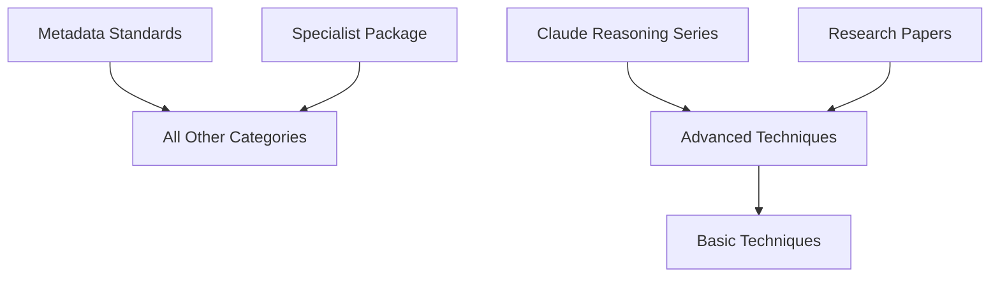

# 🤖 Multi-Agent Exemplar Documentation Orchestration Plan

> **Mission**: Transform 90+ exemplar files into production-grade, fully-documented knowledge assets using specialized sub-agent delegation.

---

## 🎯 Strategic Overview

### Delegation Philosophy

Rather than having me (primary Claude instance) process all 90+ files sequentially, we'll use **parallel sub-agent delegation** with your existing agent infrastructure:

1. **AGENT_prompt-engineering-specialist** - Metadata application expert
2. **SKILL_prompt-engineering-patterns** - Pattern recognition
3. **SKILL_llm-evaluation** - Quality assessment
4. **Sub-Agent Instances** - Parallel processing workers

### Efficiency Gains

- **Sequential Processing**: ~15-20 hours (one agent, 90 files)
- **Parallel Delegation**: ~3-5 hours (6 agents, 15 files each)
- **Quality**: Higher (specialists vs generalist)
- **Consistency**: Better (standardized templates)

---

## 📋 Phase 1: Agent Deployment (30 minutes)

### Task 1.1: Create Agent Task Files

Create individual task files for each sub-agent to process:

```
D:\10_pur3v4d3r's-vault\999-v4d3r\__exemplar\__orchestration\
├── TASK_agent-1-metadata-standards.md
├── TASK_agent-2-claude-reasoning-series.md
├── TASK_agent-3-advanced-techniques-batch-1.md
├── TASK_agent-4-advanced-techniques-batch-2.md
├── TASK_agent-5-basic-techniques.md
└── TASK_agent-6-specialist-package.md
```

### Task 1.2: Agent Configuration

Each task file contains:
- File list to process
- Metadata schema template
- Quality assessment criteria
- Output format specifications
- Cross-linking guidelines

---

## 📋 Phase 2: Metadata Application (3-4 hours)

### Agent 1: Metadata Standards Category
**Assigned Files**: 3 files
**Focus**: gold-standard-*.md, master-yaml-*.md
**Tasks**:
- ✅ Validate existing metadata (already production-grade)
- ✅ Add missing inline fields
- ✅ Generate wiki-links
- ✅ Create cross-references

**Prompt Template for Agent 1**:
```markdown
You are the Metadata Standards Specialist using AGENT_prompt-engineering-specialist.

Your assignment:
1. Process these 3 files: [list]
2. Apply Enhanced Universal Schema v2.0.0
3. Ensure 100% metadata coverage
4. Validate YAML syntax
5. Generate quality assessment report

Input Schema: [paste enhanced schema]
Output Format: Updated .md files + validation report

Begin with: gold-standard-metadata-for-obsidian-and-dataview-top-of-note-metadata-v1.0.0.md
```

### Agent 2: Claude Reasoning Documentation Series
**Assigned Files**: 8 files
**Focus**: claude-reasoning-documentation-series/*
**Tasks**:
- ✅ Enhance existing metadata
- ✅ Add cross-series navigation
- ✅ Generate document relationship graph
- ✅ Create unified index with inline fields

**Prompt Template for Agent 2**:
```markdown
You are the Documentation Series Specialist using AGENT_prompt-engineering-specialist.

Your assignment:
Process claude-reasoning-documentation-series (8 files):
1. Enhance YAML frontmatter with v2.0.0 schema
2. Add series-level navigation (prev/next)
3. Generate relationship matrix
4. Create inline fields for Dataview queries
5. Build master index with all doc metadata

Special requirements:
- Maintain existing quality (9.5/10)
- Preserve version numbering
- Add prerequisite chains
- Link to related techniques

Begin with: 00-SERIES-OVERVIEW-AND-USAGE-GUIDE.md
```

### Agent 3: Advanced Techniques Batch 1
**Assigned Files**: 15 files (techniques A-M)
**Focus**: advanced-prompt-engineering-techniques/Analogical_* through Meta_Cognitive_*
**Tasks**:
- ⚠️ Add YAML frontmatter (currently missing)
- ✅ Classify by reasoning technique type
- ✅ Extract research citations
- ✅ Rate quality (current: 8-9/10)
- ✅ Add prerequisite links

**Prompt Template for Agent 3**:
```markdown
You are Advanced Techniques Specialist #1 using AGENT_prompt-engineering-specialist.

Your assignment:
Process 15 advanced technique documents (A-M alphabetically):
1. Apply Enhanced Universal Schema v2.0.0
2. Extract research paper citations → research-papers field
3. Classify technique type (CoT variant, ensemble, metacognitive, etc.)
4. Rate quality based on: completeness, code quality, examples, clarity
5. Identify prerequisites and related techniques
6. Add wiki-links to key concepts

Quality criteria:
- Code blocks properly fenced
- Research attribution complete
- Technique classification accurate
- Cross-references comprehensive

Begin with: Analogical_Prompting.md
```

### Agent 4: Advanced Techniques Batch 2  
**Assigned Files**: 14 files (techniques M-Z)
**Focus**: advanced-prompt-engineering-techniques/Meta_Prompting_* through Zero_Shot_CoT_*
**Tasks**: (Same as Agent 3)

**Prompt Template for Agent 4**:
```markdown
You are Advanced Techniques Specialist #2 using AGENT_prompt-engineering-specialist.

[Same instructions as Agent 3, different file range]

Begin with: Meta_Prompting.md
```

### Agent 5: Basic Techniques Enhancement
**Assigned Files**: 14 files
**Focus**: basic-prompt-engineering-techniques/*
**Tasks**:
- ⚠️ Convert all .txt → .md format
- ⚠️ Add YAML frontmatter (missing on all)
- ✅ Enhance content structure
- ✅ Add code examples where missing
- ✅ Standardize formatting

**Prompt Template for Agent 5**:
```markdown
You are Basic Techniques Enhancement Specialist using AGENT_prompt-engineering-specialist.

Your assignment - FORMAT TRANSFORMATION + ENHANCEMENT:

Phase 1: Format Standardization
1. Convert all .txt files to .md
2. Add proper markdown structure (headers, code blocks, lists)
3. Apply Enhanced Universal Schema v2.0.0

Phase 2: Content Enhancement
1. Expand minimal descriptions to comprehensive explanations
2. Add Python/LangChain code examples
3. Include use cases and best practices
4. Add research attribution where applicable

Phase 3: Quality Upgrade
- Target quality: 7-8/10 (up from current 6-7/10)
- Add visual examples using mermaid diagrams
- Create cross-references to advanced versions

Special focus:
- Beginner-friendly language
- Progressive complexity
- Clear code examples

Begin with: 01_02_few-shot.txt → Few-Shot-Prompting-Complete.md
```

### Agent 6: Specialist Package Organization
**Assigned Files**: 17 files
**Focus**: prompt-engineering-specialist-package/*
**Tasks**:
- ✅ Maintain resource type prefixes (AGENT_, SKILL_, etc.)
- ✅ Add enhanced metadata
- ✅ Create package index
- ✅ Document usage patterns

**Prompt Template for Agent 6**:
```markdown
You are Specialist Package Curator using AGENT_prompt-engineering-specialist.

Your assignment:
Organize and enhance prompt-engineering-specialist-package (17 files):

1. Metadata Application
   - Apply Enhanced Universal Schema v2.0.0
   - Respect resource type prefixes
   - Add integration patterns

2. Package Architecture
   - Create master index (PACKAGE_INDEX.md)
   - Document agent ↔ skill relationships
   - Map command usage patterns

3. Quality Enhancement
   - Validate code examples
   - Test script functionality
   - Document API integrations

4. Cross-Linking
   - Link skills to exemplars
   - Connect commands to agents
   - Reference external documentation

Begin with: AGENT_prompt-engineering-specialist.md
```

---

## 📋 Phase 3: Quality Validation (1 hour)

### Validation Agent (Me - Primary Claude)
**Role**: Quality assurance coordinator
**Tasks**:
1. Collect outputs from all 6 agents
2. Validate metadata consistency
3. Check cross-reference integrity
4. Verify wiki-link accuracy
5. Test Dataview queries
6. Generate final quality report

**Validation Checklist**:
```yaml
per_file_validation:
  - yaml_frontmatter_valid: true
  - all_required_fields_present: true
  - semantic_versioning_correct: true
  - quality_rating_assigned: true
  - wiki_links_minimum: 10
  - inline_fields_minimum: 8
  - cross_references_valid: true

collection_validation:
  - total_files_processed: 90
  - metadata_coverage: 100%
  - average_quality_score: ≥8.0
  - prerequisite_chains_complete: true
  - duplicate_ids_found: 0
  - broken_wiki_links: 0
```

---

## 📋 Phase 4: Knowledge Graph Construction (1 hour)

### Task 4.1: Generate Master Index
Create comprehensive searchable index with all metadata fields exposed for Dataview queries.

### Task 4.2: Create Relationship Graphs


### Task 4.3: Build Query Library
Create pre-built Dataview queries for common use cases:
- Find all production-ready exemplars
- List techniques by complexity level
- Show prerequisite learning paths
- Identify needs-review items

---

## 📋 Phase 5: Production Deployment (30 minutes)

### Task 5.1: Create Gold Standard Template
Based on best practices from all 90 files, create THE definitive exemplar template.

### Task 5.2: Documentation
- User guide for exemplar collection
- Contribution guidelines
- Quality standards documentation
- Maintenance procedures

### Task 5.3: Automation Setup
- Template generation scripts
- Metadata validation hooks
- Auto-versioning system
- Quality monitoring dashboards

---

## 🚀 Execution Strategy

### Option A: Sequential Agent Deployment (Safer)
1. Deploy Agent 1 (Metadata Standards) - validate approach
2. Review output, refine template
3. Deploy Agents 2-6 in parallel
4. Validate and integrate

**Timeline**: 5-6 hours total
**Risk**: Low
**Quality**: High

### Option B: Full Parallel Deployment (Faster)
1. Deploy all 6 agents simultaneously
2. Collect outputs after 3 hours
3. Validate and reconcile conflicts
4. Integrate into master collection

**Timeline**: 3-4 hours total
**Risk**: Medium (potential inconsistencies)
**Quality**: Medium-High (requires reconciliation)

### Option C: Hybrid Approach (Recommended)
1. Deploy Agent 1 first (30 min) - establish baseline
2. Deploy Agents 2-4 in parallel (2 hours) - core content
3. Review and adjust (30 min)
4. Deploy Agents 5-6 (1 hour) - enhancement
5. Final validation (1 hour)

**Timeline**: 5 hours total
**Risk**: Low
**Quality**: Highest

---

## 📊 Success Metrics

| Metric | Current | Target | Method |
|--------|---------|--------|--------|
| Metadata Coverage | 10% | 100% | YAML frontmatter present |
| Avg Quality Score | 7.5/10 | 8.5/10 | Rating field assessment |
| Wiki-Link Density | Low | High | ≥10 links per document |
| Format Consistency | 60% | 100% | All .md, standardized structure |
| Cross-Reference Coverage | 20% | 90% | Prerequisite/related fields populated |
| Version Tracking | 20% | 100% | Semantic versioning applied |

---

## 🎯 Next Immediate Action

**Your choice - which execution strategy**?

1. **Start with Agent 1** (Metadata Standards) as proof-of-concept
2. **Deploy all 6 agents** immediately (full parallel)
3. **Hybrid approach** (my recommendation)

I can:
- Generate the 6 individual task files right now
- Create the first agent prompt and let you test it
- Set up the full orchestration infrastructure

**What would you like me to do first**?
