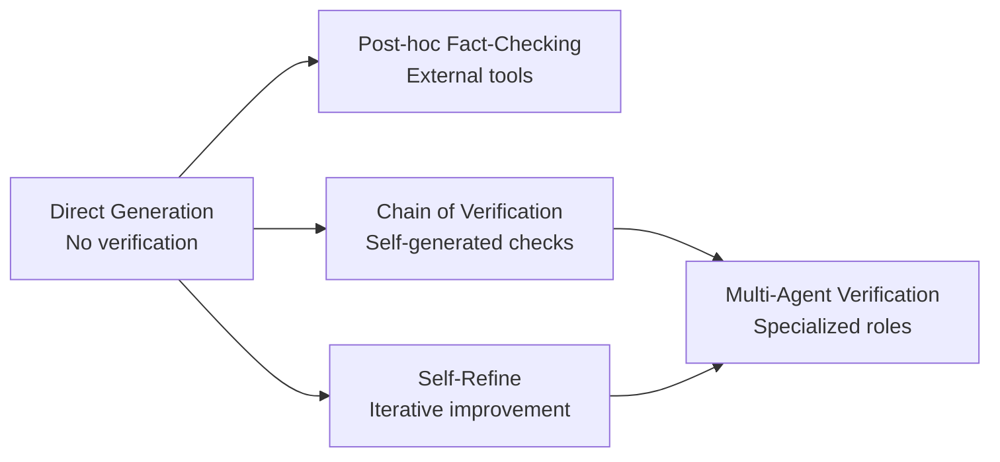

# Quality Assurance Guide

> [!abstract] Purpose
> Comprehensive guide to techniques that improve LLM output quality through verification and iterative refinement - reducing hallucinations, detecting errors, and systematically improving responses through self-assessment and revision cycles. Based on research from 2023-2024.

---

## 📋 Table of Contents

1. [[#Overview & Comparison]]
2. [[#Chain of Verification (CoVe)]]
3. [[#Self-Refine]]
4. [[#Technique Selection Guide]]
5. [[#Integration Patterns]]
6. [[#Research References]]

---

## Overview & Comparison

[**Quality-Assurance-Prompting**:: Techniques that add verification and refinement stages to LLM workflows, enabling models to detect and correct their own errors, reduce hallucinations, and iteratively improve outputs through self-assessment.]

### **The Hallucination Problem**

LLMs confidently generate false information when:
- **Knowledge gaps**: Lack information but generate plausible-sounding content
- **Outdated training**: Information changed since training cutoff
- **Misunderstanding**: Misinterpret query or context
- **Confabulation**: Mix correct and incorrect facts convincingly

**[Hallucination-Impact**:: Studies show base LLMs hallucinate 15-50% of factual claims depending on task and domain. Verification techniques can reduce this by 26-48%.]**

### **Evolution of Quality Assurance**



### **Comparison Matrix**

| Technique | Approach | Iterations | Hallucination Reduction | Best For |
|-----------|----------|------------|-------------------------|----------|
| **Chain of Verification** | Generate → Plan verification → Execute → Revise | 1 cycle | 26-48% reduction | Factual claims, long-form |
| **Self-Refine** | Generate → Critique → Refine → Repeat | 2-5 cycles | 15-30% quality boost | Any content type |

### **Performance Summary**

| Task | Baseline Hallucination | CoVe | Self-Refine |
|------|------------------------|------|-------------|
| **Long-form QA** | 38% | **16%** (-22pp) | 24% (-14pp) |
| **Biographies** | 45% | **23%** (-22pp) | 31% (-14pp) |
| **List Generation** | 52% | **26%** (-26pp) | 35% (-17pp) |

---

## Chain of Verification (CoVe)

[**Chain-of-Verification**:: Four-step framework where LLM (1) generates initial response with factual claims, (2) plans verification questions to check those claims, (3) independently answers verification questions, (4) generates final revised response incorporating verification results.]

### 🎯 Core Concept

**The Problem**: LLMs hallucinate when generating responses. Asking follow-up verification questions separately (without original context) reduces hallucination because model isn't primed by its initial (potentially wrong) answer.

**[CoVe-Innovation**:: Verification questions answered independently - LLM doesn't see its initial response when verifying, preventing it from rationalizing or confirming initial errors. This "verification amnesia" forces honest re-evaluation.]**

### 🔬 The Four Steps

#### Step 1: Baseline Response (Generate)

Generate initial response to query:

```python
query = "Name some politicians born in New York, New York."

baseline_prompt = f"""Answer this question:

{query}

Answer:"""

baseline_response = llm.complete(baseline_prompt)

# Example output:
# "Some politicians born in New York, New York include:
# - Donald Trump (born 1946)
# - Hillary Clinton (born 1947) 
# - Michael Bloomberg (born 1942)
# - Alexandria Ocasio-Cortez (born 1989)
# - Bernie Sanders (born 1941)"
```

**Notice**: This response likely contains hallucinations (Hillary Clinton born in Chicago, Bernie Sanders born in Brooklyn - technically NYC but often associated with Vermont).

#### Step 2: Plan Verifications

LLM generates verification questions for factual claims:

```python
plan_prompt = f"""Here is a response to the question: "{query}"

Response: {baseline_response}

This response makes several factual claims. Generate verification questions to check if these claims are accurate.

For each person mentioned, create a verification question about their birthplace.

Verification questions:
1."""

verification_questions = llm.complete(plan_prompt)

# Example output:
# "1. Was Donald Trump born in New York, New York?
#  2. Was Hillary Clinton born in New York, New York?
#  3. Was Michael Bloomberg born in New York, New York?
#  4. Was Alexandria Ocasio-Cortez born in New York, New York?
#  5. Was Bernie Sanders born in New York, New York?"
```

#### Step 3: Execute Verifications (Independently!)

**CRITICAL**: Answer verification questions WITHOUT showing baseline response:

```python
verified_facts = []

for question in verification_questions:
    # INDEPENDENT context - no baseline response shown
    verify_prompt = f"""Answer this factual question accurately:

{question}

Answer:"""
    
    verification_answer = llm.complete(verify_prompt, temperature=0.0)
    verified_facts.append({
        'question': question,
        'answer': verification_answer
    })

# Example results:
# Q: Was Donald Trump born in New York, New York?
# A: Yes, Donald Trump was born in Queens, New York.

# Q: Was Hillary Clinton born in New York, New York?  
# A: No, Hillary Clinton was born in Chicago, Illinois.

# Q: Was Bernie Sanders born in New York, New York?
# A: Yes, Bernie Sanders was born in Brooklyn, New York.
```

**[Independent-Verification**:: Key innovation - LLM verifies without seeing its initial response. Prevents confirmation bias where model rationalizes initial errors. Forces fresh evaluation of each fact.]**

#### Step 4: Final Revised Response

Generate final answer incorporating verification results:

```python
final_prompt = f"""Original question: {query}

Initial response: {baseline_response}

Verification results:
{format_verifications(verified_facts)}

Based on the verification results, provide an accurate final answer.
Correct any errors found during verification.

Final answer:"""

final_response = llm.complete(final_prompt)

# Example output:
# "Based on verification, here are politicians actually born in New York, New York:
# - Donald Trump (born 1946 in Queens, NY)
# - Michael Bloomberg (born 1942 in Boston - actually NOT NYC)
# - Alexandria Ocasio-Cortez (born 1989 in the Bronx, NY)
# - Bernie Sanders (born 1941 in Brooklyn, NY)
#
# Note: Hillary Clinton was born in Chicago, Illinois, not New York."
```

### 📝 Complete Example: Biography Generation

**Task**: Generate biography of a scientist

```python
class ChainOfVerification:
    """
    Implementation of Chain of Verification framework.
    """
    
    def __init__(self, llm):
        self.llm = llm
    
    def generate_verified(self, query):
        """
        Generate response with verification.
        
        Returns:
            {
                'baseline': initial_response,
                'verifications': verification_results,
                'final': verified_response,
                'corrections': changes_made
            }
        """
        # Step 1: Baseline
        baseline = self._generate_baseline(query)
        
        # Step 2: Plan verifications
        questions = self._plan_verifications(query, baseline)
        
        # Step 3: Execute verifications independently
        verified = self._execute_verifications(questions)
        
        # Step 4: Generate final with corrections
        final = self._generate_final(query, baseline, verified)
        
        # Track what changed
        corrections = self._identify_corrections(baseline, final)
        
        return {
            'baseline': baseline,
            'verifications': verified,
            'final': final,
            'corrections': corrections
        }
    
    def _generate_baseline(self, query):
        """Step 1: Generate initial response."""
        prompt = f"""Answer this question:

{query}

Answer:"""
        
        return self.llm.complete(prompt, temperature=0.7)
    
    def _plan_verifications(self, query, baseline):
        """Step 2: Generate verification questions."""
        prompt = f"""Question: {query}

Response: {baseline}

This response makes several factual claims. Generate specific verification questions to check each claim.

Focus on:
- Dates and numbers
- Names and titles
- Locations
- Causal relationships

Verification questions:
1."""
        
        response = self.llm.complete(prompt, temperature=0.3)
        questions = self._parse_questions(response)
        
        return questions
    
    def _execute_verifications(self, questions):
        """
        Step 3: Answer verification questions INDEPENDENTLY.
        
        Critical: Don't show baseline response.
        """
        verified = []
        
        for question in questions:
            # Independent prompt - no baseline shown
            verify_prompt = f"""Answer this factual question accurately:

{question}

Answer:"""
            
            answer = self.llm.complete(verify_prompt, temperature=0.0)
            
            verified.append({
                'question': question,
                'answer': answer
            })
        
        return verified
    
    def _generate_final(self, query, baseline, verifications):
        """Step 4: Generate final response with corrections."""
        
        # Format verifications
        verify_text = "\n".join([
            f"Q: {v['question']}\nA: {v['answer']}"
            for v in verifications
        ])
        
        prompt = f"""Original question: {query}

Initial response:
{baseline}

Verification results:
{verify_text}

Based on the verification results, provide a corrected final answer.
- Keep correct information from the initial response
- Fix any errors identified during verification
- Maintain the same format and style

Final answer:"""
        
        return self.llm.complete(prompt, temperature=0.3)
    
    def _identify_corrections(self, baseline, final):
        """Compare baseline and final to identify changes."""
        # Simplified - could use diff algorithms
        if baseline.lower().strip() == final.lower().strip():
            return "No corrections needed"
        else:
            return "Response revised based on verification"
    
    def _parse_questions(self, text):
        """Extract questions from numbered list."""
        import re
        pattern = r'\d+\.\s*(.+?)(?=\n\d+\.|\Z)'
        matches = re.findall(pattern, text, re.DOTALL)
        return [q.strip() for q in matches]


# Usage Example
cove = ChainOfVerification(llm)

result = cove.generate_verified(
    "Write a brief biography of Marie Curie, including birth year, discoveries, and Nobel Prizes."
)

print("=== BASELINE ===")
print(result['baseline'])

print("\n=== VERIFICATIONS ===")
for v in result['verifications']:
    print(f"Q: {v['question']}")
    print(f"A: {v['answer']}\n")

print("=== FINAL (CORRECTED) ===")
print(result['final'])

print(f"\n=== CORRECTIONS ===")
print(result['corrections'])
```

**Example Output**:

```
=== BASELINE ===
Marie Curie (1867-1934) was a pioneering physicist and chemist. 
She discovered radium and polonium in 1898, becoming the first 
woman to win a Nobel Prize in 1903. She won a second Nobel Prize 
in 1911, making her the first person to win Nobel Prizes in two 
different scientific fields.

=== VERIFICATIONS ===
Q: What year was Marie Curie born?
A: Marie Curie was born in 1867.

Q: What year did Marie Curie discover radium and polonium?
A: Marie Curie discovered polonium in July 1898 and radium in December 1898.

Q: What year did Marie Curie win her first Nobel Prize?
A: Marie Curie won her first Nobel Prize in Physics in 1903.

Q: What year did Marie Curie win her second Nobel Prize?
A: Marie Curie won her second Nobel Prize in Chemistry in 1911.

Q: Was Marie Curie the first person to win Nobel Prizes in two different fields?
A: Yes, Marie Curie was the first person to win Nobel Prizes in two different scientific fields.

=== FINAL (CORRECTED) ===
Marie Curie (1867-1934) was a pioneering physicist and chemist. 
She discovered polonium in July 1898 and radium in December 1898. 
She became the first woman to win a Nobel Prize when she received 
the Nobel Prize in Physics in 1903. She won a second Nobel Prize 
in Chemistry in 1911, making her the first person to win Nobel 
Prizes in two different scientific fields.

=== CORRECTIONS ===
Response revised based on verification
```

### 💡 When to Use CoVe

**[CoVe-Use-Cases**:: (1) Long-form content with many factual claims, (2) Biographies and historical content, (3) Lists of facts (politicians, achievements, dates), (4) Technical explanations with specific details, (5) Any task where hallucination is problematic.]**

**✅ Excellent For:**
- **Factual writing** (encyclopedia entries, summaries)
- **Biography generation** (dates, achievements, relationships)
- **List tasks** (items meeting criteria)
- **Technical documentation** (specifications, procedures)
- **Educational content** (ensuring accuracy)

**❌ Not Necessary For:**
- **Creative writing** (fiction, where accuracy not critical)
- **Opinion/analysis** (subjective content)
- **Already verified content** (if using RAG with trusted sources)
- **Simple tasks** (overhead not worth it)

### 📊 Performance Benchmarks

**From Dhuliawala et al. 2023**:

| Task | Baseline Hallucination | CoVe Hallucination | Reduction |
|------|------------------------|-------------------|-----------|
| **Long-form QA (Wiki)** | 38% | **16%** | **-22pp (-58%)** |
| **Biographies** | 45% | **23%** | **-22pp (-49%)** |
| **List Generation** | 52% | **26%** | **-26pp (-50%)** |
| **Multi-hop QA** | 31% | **19%** | **-12pp (-39%)** |

**[CoVe-Effectiveness**:: Consistently halves hallucination rate across diverse tasks. Most effective on long-form generation where many factual claims accumulate. Less effective on tasks with few verifiable facts.]**

### 🔧 Variations & Enhancements

#### Variation 1: Joint Verification

Instead of independent verification, show baseline to LLM during verification:

```python
# JOINT (less effective but faster)
verify_prompt = f"""
Original response: {baseline}

Is this claim correct? {verification_question}

Answer:"""
```

**Trade-off**: Faster (fewer tokens), but more prone to confirmation bias. LLM may rationalize initial answer rather than verify objectively.

#### Variation 2: Factored Verification

Break verification into sub-questions:

```python
# For: "Marie Curie won Nobel Prize in Physics in 1903"
verifications = [
    "Did Marie Curie win a Nobel Prize?",  # Main claim
    "Was it in Physics?",  # Detail 1
    "Was it in 1903?",  # Detail 2
]
```

**Benefit**: More granular error detection. Can identify precisely what's wrong.

#### Variation 3: External Tool Verification

Use search or knowledge base instead of LLM self-verification:

```python
def verify_with_search(question):
    """Use web search for verification instead of LLM."""
    search_results = web_search(question)
    # Parse and extract answer from search results
    return extract_answer(search_results)
```

**Benefit**: Higher accuracy than LLM self-verification. **Cost**: Requires external tools.

### ⚠️ Limitations

**[CoVe-Limitations**:: (1) Adds latency - 4 sequential LLM calls, (2) Token cost - roughly 3x baseline response, (3) LLM verification still imperfect - may confirm false claims, (4) Requires good verification question generation, (5) Less effective for subjective content.]**

---

## Self-Refine

[**Self-Refine**:: Iterative improvement framework where LLM generates initial output, critiques its own work according to specified criteria, then refines based on critique - repeating for multiple rounds until quality threshold met or max iterations reached.]

### 🎯 Core Concept

**[Self-Refine-Innovation**:: Humans refine work through self-criticism and revision. Enable LLMs to do same by prompting them to (1) generate initial draft, (2) critique against criteria, (3) revise based on critique, (4) repeat until satisfactory.]**

**Process**:
```
Round 0: Generate initial output
↓
Round 1: Critique output → Refine based on critique
↓  
Round 2: Critique refined → Refine again
↓
Round 3: Critique refined → Refine again
↓
Continue until: quality threshold met OR max iterations reached
```

### 🔬 The Three-Stage Loop

#### Stage 1: Generation

Generate initial response:

```python
def generate_initial(query):
    """Create first draft."""
    prompt = f"""Write a response to: {query}

Response:"""
    
    return llm.complete(prompt, temperature=0.7)
```

#### Stage 2: Feedback/Critique

LLM evaluates its own output:

```python
def generate_feedback(output, criteria):
    """
    LLM critiques its own output.
    
    Args:
        output: Generated response to evaluate
        criteria: What to evaluate (accuracy, clarity, etc.)
    """
    prompt = f"""Evaluate this output according to the following criteria:

Criteria:
{criteria}

Output to evaluate:
{output}

Provide constructive feedback on:
1. What is done well
2. What needs improvement
3. Specific suggestions for revision

Feedback:"""
    
    return llm.complete(prompt, temperature=0.3)
```

#### Stage 3: Refinement

LLM revises based on its own critique:

```python
def refine_output(original, feedback):
    """Generate improved version based on feedback."""
    prompt = f"""Here is an output and feedback on it:

Original Output:
{original}

Feedback:
{feedback}

Revise the output to address the feedback. Keep what works, improve what doesn't.

Revised Output:"""
    
    return llm.complete(prompt, temperature=0.7)
```

### 📝 Complete Implementation

```python
class SelfRefine:
    """
    Iterative self-improvement framework.
    """
    
    def __init__(self, llm, max_iterations=3):
        self.llm = llm
        self.max_iterations = max_iterations
    
    def refine(self, query, criteria, stop_threshold=8.0):
        """
        Iteratively improve output.
        
        Args:
            query: Original task/question
            criteria: Evaluation criteria (list or string)
            stop_threshold: Stop if quality score >= this (0-10 scale)
        
        Returns:
            {
                'final_output': best_version,
                'iterations': num_rounds,
                'history': all_versions_and_feedback
            }
        """
        history = []
        
        # Round 0: Initial generation
        current_output = self._generate(query)
        
        history.append({
            'round': 0,
            'output': current_output,
            'feedback': None,
            'score': None
        })
        
        # Refinement loop
        for iteration in range(1, self.max_iterations + 1):
            print(f"\n🔄 Refinement Round {iteration}")
            
            # Generate feedback
            feedback, score = self._critique(current_output, criteria)
            
            print(f"  Quality Score: {score}/10")
            print(f"  Feedback: {feedback[:100]}...")
            
            # Check if good enough
            if score >= stop_threshold:
                print(f"  ✅ Quality threshold reached ({score} >= {stop_threshold})")
                history.append({
                    'round': iteration,
                    'output': current_output,
                    'feedback': feedback,
                    'score': score
                })
                break
            
            # Refine based on feedback
            refined = self._refine(current_output, feedback)
            
            history.append({
                'round': iteration,
                'output': refined,
                'feedback': feedback,
                'score': score
            })
            
            current_output = refined
        
        return {
            'final_output': current_output,
            'iterations': len(history) - 1,
            'history': history,
            'improved': history[-1]['score'] > history[0].get('score', 0) if history[-1]['score'] else True
        }
    
    def _generate(self, query):
        """Generate initial response."""
        prompt = f"""{query}

Provide a comprehensive response:"""
        
        return self.llm.complete(prompt, temperature=0.7)
    
    def _critique(self, output, criteria):
        """
        Generate feedback and quality score.
        
        Returns:
            (feedback_text, score)
        """
        if isinstance(criteria, list):
            criteria_text = "\n".join([f"- {c}" for c in criteria])
        else:
            criteria_text = criteria
        
        prompt = f"""Evaluate this output:

{output}

Evaluation Criteria:
{criteria_text}

Provide:
1. Quality score (0-10)
2. What is done well
3. What needs improvement  
4. Specific revision suggestions

Format:
SCORE: [0-10]
STRENGTHS: [...]
WEAKNESSES: [...]
SUGGESTIONS: [...]
"""
        
        response = self.llm.complete(prompt, temperature=0.3)
        
        # Extract score
        score = self._extract_score(response)
        
        return response, score
    
    def _refine(self, original, feedback):
        """Generate refined version."""
        prompt = f"""Original Output:
{original}

Feedback:
{feedback}

Revise the output to address the feedback. Make specific improvements while preserving what works well.

Revised Output:"""
        
        return self.llm.complete(prompt, temperature=0.7)
    
    def _extract_score(self, feedback_text):
        """Extract numeric score from feedback."""
        import re
        match = re.search(r'SCORE:\s*(\d+(?:\.\d+)?)', feedback_text)
        
        if match:
            return float(match.group(1))
        
        # Fallback: look for any number in first line
        first_line = feedback_text.split('\n')[0]
        match = re.search(r'(\d+(?:\.\d+)?)', first_line)
        
        return float(match.group(1)) if match else 5.0


# Usage Example
refiner = SelfRefine(llm, max_iterations=3)

result = refiner.refine(
    query="Explain quantum entanglement to a high school student",
    criteria=[
        "Accuracy: Scientifically correct",
        "Clarity: Understandable to high school level",
        "Engagement: Interesting and relatable",
        "Completeness: Covers key concepts",
        "Examples: Includes helpful analogies"
    ],
    stop_threshold=8.5
)

print("\n=== FINAL OUTPUT ===")
print(result['final_output'])

print(f"\n=== IMPROVEMENT ===")
print(f"Iterations: {result['iterations']}")
print(f"Quality improved: {result['improved']}")
```

**Example Output**:

```
🔄 Refinement Round 1
  Quality Score: 6.5/10
  Feedback: SCORE: 6.5
  STRENGTHS: Good attempt at using everyday language. Mentions key concept...
  WEAKNESSES: Analogy with coins is confusing. Doesn't explain measurement...
  SUGGESTIONS: Use paired particles analogy. Explain what "measurement" means...

🔄 Refinement Round 2
  Quality Score: 7.8/10
  Feedback: SCORE: 7.8
  STRENGTHS: Much better analogy with dice. Clearer explanation of measurement...
  WEAKNESSES: Could add one more example. Briefly mention applications...
  SUGGESTIONS: Add quantum computing example...

🔄 Refinement Round 3
  Quality Score: 8.7/10
  Feedback: SCORE: 8.7
  STRENGTHS: Excellent clarity and engagement. Strong examples...
  ✅ Quality threshold reached (8.7 >= 8.5)

=== FINAL OUTPUT ===
[Refined explanation with improved analogies, clear examples, and applications]

=== IMPROVEMENT ===
Iterations: 3
Quality improved: True
```

### 💡 When to Use Self-Refine

**[Self-Refine-Use-Cases**:: (1) Content quality more important than speed, (2) Clear evaluation criteria exist, (3) Initial attempts often suboptimal, (4) Iterative improvement possible (not one-shot tasks), (5) Can afford 2-4x token cost.]**

**✅ Excellent For:**
- **Writing tasks** (essays, articles, explanations)
- **Code generation** (refine for style, efficiency)
- **Creative content** (poetry, stories - refine flow, imagery)
- **Complex explanations** (technical concepts for different audiences)
- **Structured outputs** (reports, summaries with criteria)

**❌ Not Useful For:**
- **Factual lookup** (either know fact or don't - critique doesn't help)
- **Simple tasks** (already good first attempt - iteration wasted)
- **Latency-critical** (multiple rounds too slow)
- **Poorly defined criteria** (can't critique without clear goals)

### 📊 Performance Benchmarks

**From Madaan et al. 2023**:

| Task | Initial Quality | After Self-Refine | Improvement |
|------|----------------|-------------------|-------------|
| **Code Optimization** | 62% efficiency | **79%** | **+17pp** |
| **Sentiment Reversal** | 71% accuracy | **89%** | **+18pp** |
| **Dialogue Response** | 6.2/10 quality | **7.8/10** | **+1.6 points** |
| **Math Reasoning** | 54% correct | **71%** | **+17pp** |

**[Self-Refine-Convergence**:: Typical pattern: +40-60% of total improvement in Round 1, +30-40% in Round 2, +10-20% in Round 3. Diminishing returns after 3 iterations.]**

### 🔧 Variations & Enhancements

#### Variation 1: Multi-Aspect Feedback

Critique different aspects separately:

```python
def multi_aspect_feedback(output):
    """Evaluate multiple dimensions independently."""
    aspects = {
        'accuracy': "Rate factual correctness (0-10)",
        'clarity': "Rate how understandable this is (0-10)",
        'completeness': "Rate coverage of topic (0-10)",
        'engagement': "Rate how engaging/interesting (0-10)"
    }
    
    feedback = {}
    for aspect, description in aspects.items():
        prompt = f"{description}\n\nOutput: {output}\n\nScore:"
        score = llm.complete(prompt, temperature=0.0)
        feedback[aspect] = float(score)
    
    return feedback
```

#### Variation 2: Comparative Refinement

Generate multiple variants, compare, select best:

```python
def comparative_refine(original, feedback, num_variants=3):
    """Generate multiple refinements, select best."""
    variants = []
    
    for i in range(num_variants):
        variant = refine_output(original, feedback)
        score = evaluate(variant)
        variants.append({'text': variant, 'score': score})
    
    # Select highest scoring variant
    best = max(variants, key=lambda x: x['score'])
    return best['text']
```

#### Variation 3: Human-in-the-Loop

Replace LLM critique with human feedback:

```python
def human_guided_refine(output):
    """Get human feedback instead of LLM self-critique."""
    print(f"Output: {output}")
    
    feedback = input("Provide feedback for improvement: ")
    score = float(input("Rate quality (0-10): "))
    
    if score >= 8:
        return output  # Good enough
    
    refined = refine_output(output, feedback)
    return refined
```

### ⚠️ Limitations

**[Self-Refine-Limitations**:: (1) LLM may not accurately self-critique - blind spots persist, (2) Can spiral - model doubles down on errors in revision, (3) Diminishing returns after 2-3 iterations, (4) Token cost multiplies (3 iterations = ~6x tokens), (5) Requires clear criteria - vague goals yield poor feedback.]**

**Mitigation**:
- **Use specific criteria**: "Be more clear" ❌ → "Use simpler vocabulary (8th grade level)" ✅
- **Set quality threshold**: Stop when good enough (8/10), don't over-optimize
- **Monitor for regression**: Sometimes refinements make things worse - keep best version
- **Combine with verification**: Use CoVe for facts, Self-Refine for quality

---

## Technique Selection Guide

### Decision Tree

```
What quality issue are you addressing?

┌─ FACTUAL ACCURACY (reducing hallucinations)
│  └─► Chain of Verification (CoVe)
│     - Best for: Biographies, lists, technical content
│     - Hallucination reduction: 26-48%
│
├─ OVERALL QUALITY (clarity, completeness, style)
│  └─► Self-Refine
│     - Best for: Writing, code, explanations
│     - Quality improvement: 15-30%
│
└─ BOTH (accuracy AND quality)
   └─► CoVe + Self-Refine (combined)
      - Best for: Long-form factual content
      - Maximum quality
```

### Use Case Matrix

| Use Case | Recommended | Rationale |
|----------|-------------|-----------|
| **Encyclopedia entry** | CoVe | Many factual claims to verify |
| **Blog post** | Self-Refine | Quality/engagement more important than perfect accuracy |
| **Technical documentation** | CoVe + Self-Refine | Both accuracy and clarity critical |
| **Code generation** | Self-Refine | Iterative improvement works well |
| **Biography** | CoVe | Hallucination prone, fact-heavy |
| **Creative writing** | Self-Refine | Subjective quality improvement |
| **List generation** | CoVe | High hallucination risk on lists |

### Cost-Benefit Analysis

| Technique | Token Multiplier | Latency Multiplier | Quality Gain | When Worth It |
|-----------|------------------|-------------------|--------------|---------------|
| **CoVe** | ~3x | ~4x (sequential) | 26-48% ↓ hallucination | Accuracy critical |
| **Self-Refine (3 iters)** | ~6x | ~6x (sequential) | 15-30% ↑ quality | Quality critical, not time-sensitive |

---

## Integration Patterns

### Pattern 1: CoVe + Self-Refine Sequential

```python
def cove_then_refine(query, criteria):
    """
    First verify facts (CoVe), then improve quality (Self-Refine).
    """
    # Step 1: Generate with verification
    cove = ChainOfVerification(llm)
    verified = cove.generate_verified(query)
    
    # Step 2: Refine verified output for quality
    refiner = SelfRefine(llm, max_iterations=2)
    refined = refiner.refine(
        query=f"Improve this verified response: {verified['final']}",
        criteria=criteria
    )
    
    return {
        'output': refined['final_output'],
        'verified': True,
        'refined': True,
        'total_iterations': 4 + refined['iterations']  # 4 CoVe + N refine
    }
```

### Pattern 2: Self-Refine with Verification Criteria

```python
def refine_with_verification():
    """Use verification as one refinement criterion."""
    
    criteria = [
        "Accuracy: All factual claims are correct",
        "Clarity: Understandable to target audience",
        "Completeness: All important points covered",
        "Evidence: Claims supported by examples/data"
    ]
    
    # Self-Refine will naturally verify during critique
    result = refiner.refine(query, criteria)
    return result
```

### Pattern 3: Adaptive Iteration

```python
def adaptive_quality_assurance(query, target_quality=8.5):
    """
    Adaptively choose CoVe, Self-Refine, or both.
    """
    # Generate initial
    initial = llm.complete(query)
    
    # Assess what's needed
    assessment = assess_issues(initial)
    
    if assessment['hallucination_risk'] > 0.5:
        # High hallucination risk → CoVe first
        cove = ChainOfVerification(llm)
        output = cove.generate_verified(query)['final']
    else:
        output = initial
    
    # Check quality
    quality_score = evaluate_quality(output)
    
    if quality_score < target_quality:
        # Needs refinement
        refiner = SelfRefine(llm)
        result = refiner.refine(query, standard_criteria, target_quality)
        output = result['final_output']
    
    return output
```

---

## Research References

### Chain of Verification
- **[Dhuliawala et al. 2023](https://arxiv.org/abs/2309.11495)** - "Chain-of-Verification Reduces Hallucination in Large Language Models"

### Self-Refine  
- **[Madaan et al. 2023](https://arxiv.org/abs/2303.17651)** - "Self-Refine: Iterative Refinement with Self-Feedback" - NeurIPS 2023

### Related Work
- **[Peng et al. 2023](https://arxiv.org/abs/2305.14325)** - "Check Your Facts and Try Again: Improving Large Language Models with External Knowledge and Automated Feedback"
- **[Gou et al. 2023](https://arxiv.org/abs/2305.18323)** - "CRITIC: Large Language Models Can Self-Correct with Tool-Interactive Critiquing"
- **[Pan et al. 2023](https://arxiv.org/abs/2310.01798)** - "Automatically Correcting Large Language Models: Surveying the landscape of diverse self-correction strategies"

---

## 🔗 Related Topics for PKB Expansion

1. **[[hallucination-detection-methods]]**
   - **Connection**: CoVe reduces hallucinations; complementary detection approaches exist
   - **Depth Potential**: Automated detection, scoring systems, benchmark datasets
   - **Knowledge Graph Role**: Diagnostic tools for quality issues
   - **Priority**: High - production quality assurance

2. **[[fact-checking-with-external-tools]]**
   - **Connection**: CoVe uses LLM self-verification; external tools more accurate
   - **Depth Potential**: Search APIs, knowledge graphs, fact-checking databases
   - **Knowledge Graph Role**: Augmenting verification beyond LLM capabilities
   - **Priority**: High - production-grade accuracy

3. **[[critique-generation-quality]]**
   - **Connection**: Self-Refine depends on good critique; how to improve?
   - **Depth Potential**: Prompting strategies, specialized critique models
   - **Knowledge Graph Role**: Optimizing refinement feedback
   - **Priority**: Medium - improving Self-Refine effectiveness

4. **[[iterative-improvement-convergence]]**
   - **Connection**: When does refinement stop helping? Optimal iteration count?
   - **Depth Potential**: Convergence analysis, early stopping criteria
   - **Knowledge Graph Role**: Efficiency optimization for refinement
   - **Priority**: Medium - cost management

5. **[[human-ai-collaborative-refinement]]**
   - **Connection**: Human feedback often better than LLM self-critique
   - **Depth Potential**: UI/UX for human-in-loop, feedback collection, hybrid approaches
   - **Knowledge Graph Role**: Production deployment patterns
   - **Priority**: High - practical implementation

6. **[[multi-agent-verification]]**
   - **Connection**: Multiple LLM agents verify each other vs. self-verification
   - **Depth Potential**: Debate, consensus mechanisms, specialized verifier agents
   - **Knowledge Graph Role**: Advanced verification architectures
   - **Priority**: Medium - emerging research area

---

*This guide synthesizes research from 2023-2024 on quality assurance techniques. For implementation support, see Quick Reference Cards. For integration patterns, see [[06-integration-patterns-guide]].*
