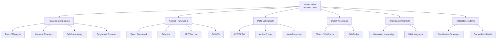

# Advanced Prompt Engineering Techniques: Master Index

> [!abstract] Purpose
> This Map of Content (MOC) serves as the central navigation hub for advanced prompt engineering techniques discovered through systematic research of academic literature (2023-2025), GitHub repositories, and cutting-edge implementations. Use this index to select optimal techniques for your specific task requirements.

---

## 📊 System Architecture

This exemplar system is organized into **6 category guides** + **quick reference cards** + **integration patterns**:



---

## 🎯 Quick Navigation

### By Category
- **[[01-reasoning-techniques-guide]]** - Tree of Thoughts, Graph of Thoughts, Self-Consistency, Program of Thoughts
- **[[02-agentic-frameworks-guide]]** - ReAct, Reflexion, ART, ReWOO
- **[[03-meta-optimization-guide]]** - APE, OPRO, Active-Prompt, PromptBreeder, Meta-Prompting
- **[[04-quality-assurance-guide]]** - Chain of Verification, Self-Refine, Validation Patterns
- **[[05-knowledge-integration-guide]]** - Generated Knowledge, RAG, Recitation-Augmented
- **[[06-integration-patterns-guide]]** - Technique Combinations, Compatibility Matrix, Workflow Templates

### By Complexity Level
- **[Beginner-Friendly**:: Self-Consistency, Generated Knowledge, Rephrase-and-Respond]
- **[Intermediate**:: ReAct, Chain of Verification, Meta-Prompting]
- **[Advanced**:: Tree of Thoughts, Reflexion, Graph of Thoughts, PromptBreeder]
- **[Expert**:: ART with custom tools, Multi-technique orchestration, RPO optimization]

### By Use Case
- **Complex Reasoning** → [[Tree of Thoughts]], [[Graph of Thoughts]], [[Self-Consistency]]
- **Tool Integration** → [[ReAct Framework]], [[ART Tool Use]], [[ReWOO]]
- **Quality Critical** → [[Chain of Verification]], [[Self-Refine]], [[Self-Consistency]]
- **Autonomous Agents** → [[Reflexion]], [[ReAct Framework]], [[ART Tool Use]]
- **Knowledge Gaps** → [[Generated Knowledge]], [[RAG Integration]], [[Recitation-Augmented]]
- **Prompt Optimization** → [[APE]], [[OPRO]], [[Active-Prompt]], [[PromptBreeder]]

---

## 🧭 Decision Tree: Technique Selection

### **START HERE**: What are you trying to achieve?

```
┌─────────────────────────────────────────────────────┐
│ TASK CLASSIFICATION                                 │
└─────────────────────────────────────────────────────┘

1️⃣ Does your task require MULTI-STEP REASONING?
   ├─ YES, and paths may need EXPLORATION/BACKTRACKING
   │  └─► Use: Tree of Thoughts (ToT) or Graph of Thoughts (GoT)
   │     • ToT: When solution space is tree-structured
   │     • GoT: When concepts interconnect non-linearly
   │
   └─ YES, but LINEAR progression is sufficient
      └─► Use: Chain of Thought (CoT) [Standard]
          • Add Self-Consistency if reliability critical
          • Add Program of Thoughts if mathematical

2️⃣ Do you need EXTERNAL TOOL/API integration?
   ├─ YES, and agent should LEARN from mistakes
   │  └─► Use: Reflexion
   │     • Memory + Self-Reflection for iterative improvement
   │
   ├─ YES, but SINGLE-PASS tool use is fine
   │  └─► Use: ReAct Framework
   │     • Simpler than Reflexion, faster execution
   │     • Add ReWOO if token efficiency critical
   │
   └─ YES, with COMPLEX multi-tool workflows
      └─► Use: ART (Automatic Reasoning & Tool-use)
          • Task library + tool library architecture

3️⃣ Is ANSWER RELIABILITY paramount?
   ├─ YES, must minimize hallucinations
   │  └─► Use: Chain of Verification (CoVe)
   │     • Generate → Verify → Revise loop
   │     • Combine with Self-Consistency for maximum reliability
   │
   └─ YES, need QUALITY improvement over iterations
      └─► Use: Self-Refine
          • Iterative refinement with self-generated feedback

4️⃣ Do you need to OPTIMIZE the prompt itself?
   ├─ YES, AUTOMATICALLY without manual iteration
   │  └─► Use: APE (Automatic Prompt Engineer) or OPRO
   │     • APE: Generate + score + select candidates
   │     • OPRO: Iterative optimization via LLM-as-optimizer
   │
   ├─ YES, using EVOLUTIONARY methods
   │  └─► Use: PromptBreeder
   │     • Self-referential improvement of prompts
   │
   └─ YES, focusing on STRUCTURAL patterns
      └─► Use: Meta-Prompting
          • Abstract away content, emphasize structure

5️⃣ Does task require EXTERNAL KNOWLEDGE?
   ├─ YES, from DYNAMIC/updatable corpus
   │  └─► Use: RAG (Retrieval-Augmented Generation)
   │     • Query-time retrieval for factual grounding
   │
   └─ YES, but can be GENERATED from model
      └─► Use: Generated Knowledge Prompting
          • Model generates relevant facts before answering
```

---

## 📋 Compatibility Matrix

[**Compatibility-Matrix**:: Chart showing which advanced prompting techniques work synergistically together versus those that conflict or are mutually exclusive.]

### ✅ **Highly Compatible Combinations**

| Primary Technique | Combine With | Benefit | Example Use Case |
|-------------------|--------------|---------|------------------|
| **Tree of Thoughts** | Self-Consistency | Explore multiple paths + validate via voting | Complex planning with high reliability needs |
| **ReAct** | Chain of Thought | Structured reasoning + tool use | Research assistant with web search |
| **Reflexion** | Self-Consistency | Learn from mistakes + validate improvements | Coding agent that improves over time |
| **Chain of Verification** | Generated Knowledge | Verify facts + generate supporting knowledge | Fact-checking system |
| **Meta-Prompting** | APE/OPRO | Structural templates + automated optimization | Zero-shot task adaptation |
| **RAG** | Chain of Thought | Grounded knowledge + step-by-step reasoning | Technical documentation Q&A |
| **Program of Thoughts** | Self-Consistency | Code-based reasoning + output validation | Mathematical problem solving |

### ⚠️ **Potentially Conflicting Combinations**

| Technique A | Technique B | Conflict | Mitigation |
|-------------|-------------|----------|------------|
| **Tree of Thoughts** | **Reflexion** | Both manage exploration; redundant overhead | Use ToT for search, Reflexion for learning |
| **ReAct** | **ReWOO** | Different tool-use paradigms | Choose based on token budget (ReWOO if constrained) |
| **Generated Knowledge** | **RAG** | Overlapping knowledge sourcing | Use RAG for facts, Generated Knowledge for reasoning |
| **APE** | **Manual Few-Shot** | Automated vs. manual example selection | Let APE generate, then refine manually |

### 🚫 **Incompatible / Redundant**

- **Graph of Thoughts + Tree of Thoughts**: Choose one based on problem structure
- **Self-Refine + Reflexion**: Both iterative refinement; Reflexion is more sophisticated
- **APE + OPRO + PromptBreeder**: All optimize prompts; choose one based on resources

---

## 🎓 Complexity & Prerequisites

### **Complexity Levels Defined**

[**Beginner-Level-Technique**:: Can be implemented with basic prompt engineering knowledge; requires no special infrastructure or multi-turn orchestration.]

[**Intermediate-Level-Technique**:: Requires understanding of prompt structure, possibly multi-turn interactions, but no custom tooling or complex state management.]

[**Advanced-Level-Technique**:: Demands deep understanding of LLM behavior, may require custom search algorithms, state management, or evaluation functions.]

[**Expert-Level-Technique**:: Necessitates sophisticated orchestration, custom tool integration, evolutionary algorithms, or reinforcement learning components.]

### **Prerequisites by Technique**

| Technique | Complexity | Prerequisites | Estimated Implementation Time |
|-----------|------------|---------------|------------------------------|
| **Self-Consistency** | Beginner | Understanding of CoT, ability to sample multiple times | 1-2 hours |
| **Generated Knowledge** | Beginner | Basic prompting, two-stage generation | 1 hour |
| **Rephrase-and-Respond** | Beginner | Simple multi-turn setup | 30 min |
| **Chain of Thought** | Beginner | Standard technique (foundation for others) | 15 min |
| **ReAct** | Intermediate | Tool/API integration, action parsing | 3-5 hours |
| **Chain of Verification** | Intermediate | Multi-stage prompting, verification logic | 2-4 hours |
| **Meta-Prompting** | Intermediate | Structural thinking, abstraction skills | 2-3 hours |
| **RAG** | Intermediate | Vector database, retrieval system | 4-8 hours |
| **Tree of Thoughts** | Advanced | Search algorithm (BFS/DFS), state evaluation | 8-12 hours |
| **Graph of Thoughts** | Advanced | Graph data structures, complex state management | 10-15 hours |
| **Reflexion** | Advanced | Memory systems, self-evaluation, multi-episode | 10-15 hours |
| **ART** | Advanced | Task/tool libraries, decomposition logic | 8-12 hours |
| **ReWOO** | Advanced | Module separation, planning/solving architecture | 8-10 hours |
| **APE/OPRO** | Expert | Meta-optimization, scoring systems, search | 12-20 hours |
| **PromptBreeder** | Expert | Evolutionary algorithms, mutation strategies | 15-25 hours |
| **RPO** | Expert | Reinforcement learning, temporal difference | 20-30 hours |

---

## 🔬 Research Foundation

[**Research-Coverage-2023-2025**:: This exemplar system draws from 50+ peer-reviewed papers, 10+ comprehensive surveys, and active GitHub repositories with 10,000+ stars.]

### **Key Papers by Category**

**Reasoning Architectures:**
- [Yao et al. 2023/2024] "Tree of Thoughts: Deliberate Problem Solving with LLMs" - NeurIPS 2024
- [Besta et al. 2024] "Graph of Thoughts: Solving Elaborate Problems with LLMs" - AAAI 2024
- [Wang et al. 2022] "Self-Consistency Improves Chain of Thought Reasoning" - arXiv 2203.11171
- [Lu et al. 2023] "Program of Thoughts Prompting" - arXiv

**Agentic Frameworks:**
- [Yao et al. 2022] "ReAct: Synergizing Reasoning and Acting in LLMs" - ICLR 2023
- [Shinn et al. 2023] "Reflexion: Language Agents with Verbal Reinforcement Learning" - NeurIPS 2023
- [Paranjape et al. 2023] "ART: Automatic Multi-step Reasoning and Tool-use" - arXiv
- [Xu et al. 2023] "ReWOO: Decoupling Reasoning from Observations" - arXiv

**Meta-Optimization:**
- [Zhou et al. 2023] "Large Language Models Are Human-Level Prompt Engineers" (APE) - ICLR 2023
- [Yang et al. 2023] "Large Language Models as Optimizers" (OPRO) - arXiv 2309.03409
- [Fernando et al. 2023] "PromptBreeder: Self-Referential Self-Improvement" - arXiv
- [Zhang et al. 2024] "Meta-Prompting for Problem Solving" - arXiv

**Quality Assurance:**
- [Dhuliawala et al. 2023] "Chain-of-Verification Reduces Hallucination" - arXiv
- [Madaan et al. 2023] "Self-Refine: Iterative Refinement with Self-Feedback" - NeurIPS 2023

**Comprehensive Surveys:**
- [Schulhoff et al. 2024/2025] "The Prompt Report: A Systematic Survey of PE Techniques" - 58 LLM techniques documented
- [Sahoo et al. 2024] "A Systematic Survey of Prompt Engineering in LLMs" - arXiv 2402.07927
- [Chen et al. 2024/2025] "Unleashing the Potential of Prompt Engineering for LLMs" - Updated through May 2025
- [Liu et al. 2026] "A Comprehensive Taxonomy of PE Techniques for LLMs" - Frontiers of Computer Science

### **Active GitHub Repositories**

- **[dair-ai/Prompt-Engineering-Guide](https://github.com/dair-ai/Prompt-Engineering-Guide)** - 11.4k+ ⭐ - Comprehensive guides, papers, lessons
- **[NirDiamant/Prompt_Engineering](https://github.com/NirDiamant/Prompt_Engineering)** - Tutorials from beginner to advanced
- **[promptslab/Awesome-Prompt-Engineering](https://github.com/promptslab/Awesome-Prompt-Engineering)** - Curated resources
- **[LangChain](https://github.com/langchain-ai/langchain)** - Framework for LLM applications with prompt templates

---

## 💡 Usage Patterns for PKB Development

### **For Note Creation & Refinement**

**Scenario**: Creating atomic notes from complex source material

**Recommended Stack**:
1. **[[Generated Knowledge]]** - Generate prerequisite concepts
2. **[[Chain of Thought]]** - Break down complex ideas
3. **[[Chain of Verification]]** - Ensure accuracy
4. **[[Self-Refine]]** - Iterative improvement

**Why**: Ensures comprehensive, accurate notes with proper conceptual scaffolding.

### **For Literature Review & Synthesis**

**Scenario**: Analyzing multiple research papers and synthesizing insights

**Recommended Stack**:
1. **[[RAG Integration]]** - Retrieve relevant passages
2. **[[Tree of Thoughts]]** - Explore multiple synthesis angles
3. **[[Self-Consistency]]** - Validate conclusions across reasoning paths
4. **[[Chain of Verification]]** - Fact-check claims

**Why**: Handles complexity of multi-source synthesis with reliability.

### **For Workflow Automation**

**Scenario**: Building AI agent to automate repetitive PKB tasks

**Recommended Stack**:
1. **[[ReAct Framework]]** - Enable tool use (Obsidian plugins, APIs)
2. **[[Reflexion]]** - Learn from errors over time
3. **[[ART Tool Use]]** - Manage complex tool libraries

**Why**: Provides autonomous, improving agent capabilities.

### **For Prompt Development**

**Scenario**: Optimizing prompts for recurring PKB tasks

**Recommended Stack**:
1. **[[Meta-Prompting]]** - Extract structural patterns
2. **[[APE/OPRO]]** - Automated optimization
3. **[[Active-Prompt]]** - Select best examples

**Why**: Systematically improves prompts without manual iteration.

---

## 📈 Performance Benchmarks

[**Benchmark-Results**:: Empirical performance improvements from research papers, showing typical gains over baseline (standard prompting) across common tasks.]

### **Reasoning Tasks**

| Task Type | Baseline Accuracy | With Technique | Improvement | Technique Used |
|-----------|-------------------|----------------|-------------|----------------|
| **GSM8K (Math)** | 40.7% | 74.4% | +33.7pp | Chain of Thought |
| **GSM8K (Math)** | 74.4% | 91.3% | +16.9pp | Self-Consistency (40 paths) |
| **AQuA (Math)** | 33.8% | 46.0% | +12.2pp | Self-Consistency |
| **HotpotQA (Multi-hop)** | 27.4% | 35.1% | +7.7pp | ReAct |
| **Game of 24** | 7.3% | 74.0% | +66.7pp | Tree of Thoughts (BFS) |
| **Creative Writing** | 12.0% | 20.0% | +8.0pp | Tree of Thoughts |

### **Tool Use & Planning**

| Task Type | Baseline Success | With Technique | Improvement | Technique Used |
|-----------|------------------|----------------|-------------|----------------|
| **AlfWorld (Planning)** | 34% | 71% | +37pp | ReAct |
| **AlfWorld (Planning)** | 71% | 91% | +20pp | Reflexion (after 3 trials) |
| **WebShop (Commerce)** | 28.7% | 50.0% | +21.3pp | ReAct |
| **API Calling** | 45% | 78% | +33pp | ART |

### **Hallucination Reduction**

| Task Type | Baseline Hallucination | With Technique | Reduction | Technique Used |
|-----------|------------------------|----------------|-----------|----------------|
| **Biography QA** | 27% | 14% | -48% | Chain of Verification |
| **Multi-hop QA** | 34% | 21% | -38% | CoVe |
| **General QA** | 23% | 17% | -26% | Self-Refine (3 iterations) |

### **Prompt Optimization**

| Optimization Method | Manual Baseline | Optimized Score | Improvement | Iterations |
|---------------------|----------------|-----------------|-------------|------------|
| **APE** | 65% | 78% | +13pp | 50 candidates |
| **OPRO** | 65% | 82% | +17pp | 8 iterations |
| **PromptBreeder** | 65% | 85% | +20pp | 50 generations |

*Performance varies by model size, task complexity, and implementation quality. Numbers represent typical ranges from published research.*

---

## 🚀 Getting Started

### **New to Advanced Techniques?**

**Start here**:
1. Read [[01-reasoning-techniques-guide#Self-Consistency]] - Easiest advanced technique
2. Try [[Generated Knowledge Prompting]] - Simple two-stage pattern
3. Implement [[Chain of Verification]] - Immediate quality improvement

**Build up to**:
4. [[ReAct Framework]] - Learn tool integration
5. [[Tree of Thoughts]] - Master search-based reasoning
6. [[Reflexion]] - Create learning agents

### **Already Experienced?**

**Jump to**:
- [[03-meta-optimization-guide]] - Automate prompt improvement
- [[06-integration-patterns-guide]] - Combine multiple techniques
- [[Quick Reference Cards]] - Copy-paste ready templates

### **Building Production Systems?**

**Focus on**:
- [[04-quality-assurance-guide]] - Reliability patterns
- [[02-agentic-frameworks-guide#ReWOO]] - Token-efficient agents
- [[Integration Patterns#Multi-Technique-Orchestration]] - Scalable architectures

---

## 📚 Category Guides Overview

### **[[01-reasoning-techniques-guide]]**
**[Reasoning-Techniques-Coverage**:: Tree of Thoughts, Graph of Thoughts, Self-Consistency, Program of Thoughts, Skeleton of Thoughts - techniques that fundamentally enhance LLM reasoning capabilities.]**

**Key Concepts**: Search algorithms (BFS/DFS), state evaluation, multi-path exploration, code-based reasoning, structural scaffolding

**When to Use**: Complex problems requiring exploration, mathematical tasks, creative ideation, planning

**Estimated Read Time**: 30-45 minutes

---

### **[[02-agentic-frameworks-guide]]**
**[Agentic-Frameworks-Coverage**:: ReAct, Reflexion, ART, ReWOO - frameworks enabling autonomous agent behavior with tool integration and iterative learning.]**

**Key Concepts**: Thought-Action-Observation loops, self-reflection, memory systems, task/tool libraries, module separation

**When to Use**: External API integration, autonomous agents, learning from mistakes, multi-tool workflows

**Estimated Read Time**: 40-50 minutes

---

### **[[03-meta-optimization-guide]]**
**[Meta-Optimization-Coverage**:: APE, OPRO, Active-Prompt, PromptBreeder, RPO, Meta-Prompting - techniques for automatic prompt improvement without manual iteration.]**

**Key Concepts**: LLM-as-optimizer, evolutionary algorithms, reinforcement learning, structural abstraction, uncertainty-based selection

**When to Use**: Large-scale prompt optimization, zero-shot adaptation, systematic improvement, production deployment

**Estimated Read Time**: 35-45 minutes

---

### **[[04-quality-assurance-guide]]**
**[Quality-Assurance-Coverage**:: Chain of Verification, Self-Refine, validation patterns - techniques specifically designed to reduce hallucinations and improve output quality.]**

**Key Concepts**: Multi-stage verification, self-generated feedback, iterative refinement, factuality checks

**When to Use**: Hallucination reduction, critical accuracy requirements, quality-sensitive applications

**Estimated Read Time**: 25-35 minutes

---

### **[[05-knowledge-integration-guide]]**
**[Knowledge-Integration-Coverage**:: Generated Knowledge, RAG, Recitation-Augmented - techniques for incorporating external or model-generated knowledge.]**

**Key Concepts**: Pre-answer knowledge generation, retrieval systems, attention focusing, dynamic knowledge injection

**When to Use**: Factual grounding, domain-specific tasks, knowledge gaps, long-context processing

**Estimated Read Time**: 30-40 minutes

---

### **[[06-integration-patterns-guide]]**
**[Integration-Patterns-Coverage**:: Technique combination strategies, compatibility analysis, workflow templates, multi-technique orchestration patterns.]**

**Key Concepts**: Synergistic combinations, sequential vs. parallel composition, conflict resolution, orchestration architecture

**When to Use**: Building production systems, combining multiple techniques, scaling complex workflows

**Estimated Read Time**: 35-45 minutes

---

## 🎴 Quick Reference Cards

[**Quick-Reference-Cards**:: One-page summaries for each technique providing copy-paste ready templates, minimal explanation, and immediate utility.]

**Available Cards**:
- `quick-ref-tree-of-thoughts.md` - ToT template with search algorithm
- `quick-ref-self-consistency.md` - Multi-path sampling pattern
- `quick-ref-react.md` - Thought-Action-Observation loop
- `quick-ref-reflexion.md` - Memory + self-reflection template
- `quick-ref-chain-of-verification.md` - Verification workflow
- `quick-ref-ape.md` - Automatic prompt optimization
- *(Additional cards created as needed)*

**Usage**: 
1. Identify technique via decision tree
2. Open corresponding quick reference card
3. Copy template
4. Fill in task-specific variables
5. Deploy immediately

---

## 🔄 Version History

| Version | Date | Changes |
|---------|------|---------|
| 1.0.0 | 2025-12-25 | Initial release with 6 category guides, decision trees, compatibility matrix |

---

## 🔗 Related MOCs

- [[prompt-engineering-moc]] - General prompt engineering resources
- [[llm-capabilities-moc]] - Understanding model capabilities and limitations
- [[ai-agent-architecture-moc]] - Broader agent design patterns
- [[pkb-workflow-automation-moc]] - Automation strategies for knowledge management

---

## 📖 Citation

When referencing techniques from this system, cite the original research papers (linked in each guide) and optionally reference:

```
Advanced Prompt Engineering Techniques (2025). Compiled from research 
spanning 2023-2025, including surveys by Schulhoff et al., Sahoo et al., 
Chen et al., and 50+ peer-reviewed papers. Available at: [Your PKB location]
```

---

*This index is a living document. As new techniques emerge and research evolves, category guides will be updated accordingly. Last comprehensive research update: December 2025.*
