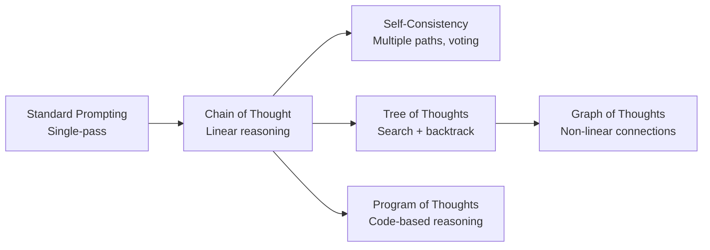

# Reasoning Techniques Guide

> [!abstract] Purpose
> Comprehensive guide to advanced reasoning techniques that fundamentally enhance LLM problem-solving capabilities through multi-path exploration, systematic search, ensemble methods, and structural scaffolding. Based on peer-reviewed research from 2022-2024.

---

## 📋 Table of Contents

1. [[#Overview & Comparison]]
2. [[#Tree of Thoughts (ToT)]]
3. [[#Graph of Thoughts (GoT)]]
4. [[#Self-Consistency]]
5. [[#Program of Thoughts (PoT)]]
6. [[#Skeleton of Thoughts (SoT)]]
7. [[#Technique Selection Matrix]]
8. [[#Integration Patterns]]
9. [[#Research References]]

---

## Overview & Comparison

[**Reasoning-Architecture**:: Framework that structures how an LLM explores solution spaces, manages intermediate states, and arrives at final answers - ranging from linear (Chain of Thought) to tree-structured (ToT) to graph-based (GoT) to ensemble-based (Self-Consistency).]

### **Evolution of Reasoning Approaches**



### **Comparison Matrix**

| Technique | Search Strategy | State Management | Best For | Complexity | Token Cost |
|-----------|----------------|------------------|----------|------------|------------|
| **Chain of Thought** | None (linear) | Implicit | Simple reasoning | Low | Low |
| **Self-Consistency** | Sample multiple | None | Reliability boost | Low-Med | Medium |
| **Tree of Thoughts** | BFS/DFS | Explicit tree | Complex planning | High | High |
| **Graph of Thoughts** | Custom | Explicit graph | Interconnected problems | Very High | Very High |
| **Program of Thoughts** | None (linear) | Code state | Mathematical tasks | Medium | Low-Med |
| **Skeleton of Thoughts** | None (structured) | Template-based | Structured analysis | Low-Med | Medium |

---

## Tree of Thoughts (ToT)

[**Tree-of-Thoughts**:: Deliberate problem-solving framework where LLMs explore multiple reasoning branches, systematically search through solution space using algorithms like BFS/DFS, evaluate intermediate states, and backtrack when needed.]

### 🎯 Core Concept

Traditional prompting generates solutions linearly - once the model commits to a reasoning path, it cannot easily backtrack. **[ToT-Innovation**:: Enables LLMs to explore like humans do when solving complex problems: try an approach, evaluate progress, backtrack if stuck, explore alternatives.]**

Tree of Thoughts decomposes problem-solving into:
1. **Thought Generation**: Create intermediate reasoning steps (branches)
2. **State Evaluation**: Score quality/promise of each thought
3. **Search Algorithm**: Systematically explore thought tree (BFS/DFS)
4. **Backtracking**: Abandon unpromising paths, explore alternatives

### 🔬 How It Works

**[ToT-Four-Components**:: (1) Thought Decomposition - how to break problem into intermediate steps, (2) Thought Generator - LLM prompted to generate candidate next steps, (3) State Evaluator - LLM or heuristic to score thought quality, (4) Search Algorithm - BFS/DFS to navigate tree.]**

#### Component 1: Thought Decomposition

Define what constitutes a "thought" (intermediate reasoning step):

```python
# Example: Game of 24
# Thought = One equation combining numbers

INPUT: Numbers [4, 5, 6, 10]
GOAL: Reach 24 using +, -, *, /

THOUGHT_1: "6 * 4 = 24" (Direct solution!)
THOUGHT_2: "10 - 6 = 4" (Intermediate, not solution yet)
THOUGHT_3: "5 + 4 = 9" (Intermediate)
```

#### Component 2: Thought Generator

**Prompt template for generating next thoughts**:

```markdown
# THOUGHT GENERATION PROMPT

Current State:
{current_numbers}

Steps taken so far:
{previous_thoughts}

Generate {k} possible next steps. Each step should:
1. Combine two numbers from current state
2. Use one operation: +, -, *, /
3. Result in a new number

Possible next steps:
1. [First candidate thought]
2. [Second candidate thought]
3. [Third candidate thought]
...
```

**Implementation**:

```python
def generate_thoughts(state, num_candidates=3):
    """Generate k candidate next thoughts from current state."""
    
    prompt = f"""
Current numbers: {state['numbers']}
Goal: Reach 24
Steps so far: {state['history']}

Generate {num_candidates} different next steps.
Each step: combine two numbers with +, -, *, or /.

Format:
1. [operation] => [result]
2. [operation] => [result]
3. [operation] => [result]
"""
    
    response = llm.generate(prompt, n=1, temperature=0.7)
    thoughts = parse_thoughts(response)
    return thoughts
```

#### Component 3: State Evaluator

**[State-Evaluation**:: Assess how promising a partial solution is - can use LLM judgment ("rate this approach 1-10"), heuristic functions (distance to goal), or domain-specific rules.]**

**Value Prompt Template**:

```markdown
# STATE EVALUATION PROMPT

Goal: Reach 24 using [4, 5, 6, 10]

Current state after operations:
{thought_sequence}
Current numbers available: {current_numbers}

Evaluate this state:
- Is it IMPOSSIBLE? (no way to reach 24 from here)
- Is it LIKELY? (clear path visible)
- Is it MAYBE? (possible but uncertain)
- Is it SOLVED? (reached 24)

Provide:
1. Assessment: [IMPOSSIBLE/MAYBE/LIKELY/SOLVED]
2. Confidence: [0-10]
3. Reasoning: [brief explanation]
```

**Implementation**:

```python
def evaluate_state(state):
    """Score how promising current state is."""
    
    # Check if solved
    if 24 in state['numbers']:
        return {'value': 10, 'status': 'SOLVED'}
    
    # LLM-based evaluation for intermediate states
    prompt = f"""
Evaluate this partial solution:
Numbers left: {state['numbers']}
Goal: Reach 24

Rate promise of this state (1-10):
- 1-3: Dead end, impossible
- 4-6: Uncertain, might work
- 7-9: Promising, likely solvable
- 10: Solved

Score: """
    
    response = llm.generate(prompt, temperature=0.0)
    score = extract_score(response)
    
    return {'value': score, 'status': 'IN_PROGRESS'}
```

#### Component 4: Search Algorithm

**Breadth-First Search (BFS)**:
- Explores all thoughts at depth *d* before moving to depth *d+1*
- Finds shortest solution path
- Higher memory/token cost

**Depth-First Search (DFS)**:
- Explores one branch fully before backtracking
- Lower memory/token cost
- May not find optimal solution

**BFS Implementation**:

```python
from collections import deque

def tree_of_thoughts_bfs(initial_state, max_depth=5, branching_factor=3):
    """
    BFS implementation of Tree of Thoughts.
    
    Args:
        initial_state: Starting problem state
        max_depth: Maximum search depth
        branching_factor: Thoughts generated per state
    
    Returns:
        Solution path if found, else None
    """
    queue = deque([(initial_state, [])])  # (state, path)
    
    while queue:
        current_state, path = queue.popleft()
        
        # Check if solved
        evaluation = evaluate_state(current_state)
        if evaluation['status'] == 'SOLVED':
            return path + [current_state]
        
        # Prune dead ends
        if evaluation['value'] < 3:  # Threshold for pruning
            continue
        
        # Don't exceed depth limit
        if len(path) >= max_depth:
            continue
        
        # Generate and evaluate next thoughts
        next_thoughts = generate_thoughts(current_state, branching_factor)
        
        for thought in next_thoughts:
            new_state = apply_thought(current_state, thought)
            queue.append((new_state, path + [thought]))
    
    return None  # No solution found
```

**DFS Implementation**:

```python
def tree_of_thoughts_dfs(state, path=[], max_depth=5, branching_factor=3):
    """
    DFS implementation of Tree of Thoughts (recursive).
    """
    # Base cases
    evaluation = evaluate_state(state)
    
    if evaluation['status'] == 'SOLVED':
        return path + [state]
    
    if len(path) >= max_depth or evaluation['value'] < 3:
        return None
    
    # Generate next thoughts
    thoughts = generate_thoughts(state, branching_factor)
    
    # Sort by evaluation score (best-first)
    thoughts_with_scores = []
    for thought in thoughts:
        temp_state = apply_thought(state, thought)
        score = evaluate_state(temp_state)['value']
        thoughts_with_scores.append((score, thought))
    
    thoughts_with_scores.sort(reverse=True)  # Best first
    
    # Explore each branch
    for score, thought in thoughts_with_scores:
        new_state = apply_thought(state, thought)
        result = tree_of_thoughts_dfs(
            new_state, 
            path + [thought], 
            max_depth, 
            branching_factor
        )
        if result:
            return result
    
    return None  # No solution in this branch
```

### 💡 When to Use Tree of Thoughts

**[ToT-Ideal-Use-Cases**:: (1) Planning tasks with multiple valid approaches, (2) Creative problems requiring exploration, (3) Tasks where early mistakes lead to dead ends, (4) Problems with clear intermediate goals, (5) Situations where optimal solution matters.]**

**✅ Excellent For:**
- **Game of 24**: Mathematical puzzle requiring search
- **Creative Writing**: Exploring different story angles
- **Travel Planning**: Optimizing multi-city routes
- **Code Generation**: Trying different architectural approaches
- **Strategic Planning**: Business decisions with multiple paths

**❌ Overkill For:**
- Simple factual questions ("What is the capital of France?")
- Tasks with single clear path (straightforward calculations)
- Time-critical applications (too slow)
- Token-budget-constrained scenarios (very expensive)

### 📝 Complete Working Example: Game of 24

**Problem**: Using [4, 5, 6, 10], reach 24 with +, -, *, /

**ToT Solution with BFS**:

```python
# Initial state
state_0 = {
    'numbers': [4, 5, 6, 10],
    'operations': [],
    'goal': 24
}

# Iteration 1: Generate 3 thoughts from initial state
thoughts_1 = generate_thoughts(state_0, k=3)
# Outputs:
# Thought 1.1: "10 - 6 = 4" → new state [4, 4, 5]
# Thought 1.2: "6 * 4 = 24" → SOLVED! ✓
# Thought 1.3: "5 + 4 = 9" → new state [6, 9, 10]

# Evaluation:
# Thought 1.1: Score 6/10 (neutral)
# Thought 1.2: Score 10/10 (SOLVED!)
# Thought 1.3: Score 5/10 (possible)

# BFS found solution at depth 1: "6 * 4 = 24"
```

**More Complex Example** (no immediate solution):

```
Initial: [2, 3, 7, 9]
Goal: 24

BFS Exploration:

Depth 1:
├─ 9 * 3 = 27 [2, 7, 27] → Score: 7/10
├─ 9 - 7 = 2  [2, 2, 3]  → Score: 3/10 (prune)
└─ 7 + 2 = 9  [3, 9, 9]  → Score: 4/10

Depth 2 (from best path):
├─ 27 - 7 = 20 [2, 20] → Score: 8/10
├─ 27 / 3 = 9  [2, 7, 9] → Score: 5/10
└─ 27 + 2 = 29 [7, 29] → Score: 4/10

Depth 3 (from best path):
├─ 20 + 2 = 22 [22] → Score: 6/10
├─ 20 - 2 = 18 [18] → Score: 5/10
└─ 20 * 2 = 40 [40] → Score: 2/10 (prune)

BACKTRACK to Depth 1, try next branch...
Eventually finds: (9 - 7) * (3 + 2) = 2 * 12 = 24
```

### 🔧 Production-Ready ToT Template

**Complete copyable implementation**:

```python
class TreeOfThoughts:
    """
    Production implementation of Tree of Thoughts prompting.
    
    Usage:
        tot = TreeOfThoughts(llm_client)
        solution = tot.solve(problem_state, search='bfs')
    """
    
    def __init__(self, llm, branching_factor=3, max_depth=5):
        self.llm = llm
        self.branching_factor = branching_factor
        self.max_depth = max_depth
        
    def generate_thoughts(self, state, k):
        """Generate k candidate next steps."""
        prompt = self._build_generation_prompt(state, k)
        response = self.llm.complete(prompt, temperature=0.7)
        return self._parse_thoughts(response)
    
    def evaluate_state(self, state):
        """Score how promising current state is (0-10)."""
        if self._is_goal(state):
            return {'score': 10, 'status': 'solved'}
        
        prompt = self._build_evaluation_prompt(state)
        response = self.llm.complete(prompt, temperature=0.0)
        score = self._extract_score(response)
        
        return {'score': score, 'status': 'in_progress'}
    
    def solve(self, initial_state, search='bfs'):
        """
        Solve problem using ToT.
        
        Args:
            initial_state: Problem starting point
            search: 'bfs' or 'dfs'
        
        Returns:
            Solution path or None
        """
        if search == 'bfs':
            return self._solve_bfs(initial_state)
        else:
            return self._solve_dfs(initial_state)
    
    def _solve_bfs(self, initial_state):
        """BFS implementation."""
        from collections import deque
        
        queue = deque([(initial_state, [])])
        visited = set()
        
        while queue:
            state, path = queue.popleft()
            
            state_hash = self._hash_state(state)
            if state_hash in visited:
                continue
            visited.add(state_hash)
            
            eval_result = self.evaluate_state(state)
            
            if eval_result['status'] == 'solved':
                return path + [state]
            
            if eval_result['score'] < 3 or len(path) >= self.max_depth:
                continue
            
            thoughts = self.generate_thoughts(state, self.branching_factor)
            
            for thought in thoughts:
                new_state = self._apply_thought(state, thought)
                queue.append((new_state, path + [thought]))
        
        return None
    
    def _solve_dfs(self, state, path=[], visited=None):
        """DFS implementation (recursive)."""
        if visited is None:
            visited = set()
        
        state_hash = self._hash_state(state)
        if state_hash in visited:
            return None
        visited.add(state_hash)
        
        eval_result = self.evaluate_state(state)
        
        if eval_result['status'] == 'solved':
            return path + [state]
        
        if eval_result['score'] < 3 or len(path) >= self.max_depth:
            return None
        
        thoughts = self.generate_thoughts(state, self.branching_factor)
        
        # Sort by promise (best-first)
        thoughts_scored = [
            (self.evaluate_state(self._apply_thought(state, t))['score'], t)
            for t in thoughts
        ]
        thoughts_scored.sort(reverse=True)
        
        for score, thought in thoughts_scored:
            new_state = self._apply_thought(state, thought)
            result = self._solve_dfs(new_state, path + [thought], visited)
            if result:
                return result
        
        return None
    
    # Helper methods (implement based on problem domain)
    def _build_generation_prompt(self, state, k):
        """Construct prompt for thought generation."""
        raise NotImplementedError
    
    def _build_evaluation_prompt(self, state):
        """Construct prompt for state evaluation."""
        raise NotImplementedError
    
    def _parse_thoughts(self, response):
        """Extract thoughts from LLM response."""
        raise NotImplementedError
    
    def _extract_score(self, response):
        """Extract numeric score from evaluation."""
        raise NotImplementedError
    
    def _is_goal(self, state):
        """Check if state satisfies goal."""
        raise NotImplementedError
    
    def _apply_thought(self, state, thought):
        """Generate new state from current + thought."""
        raise NotImplementedError
    
    def _hash_state(self, state):
        """Create hashable representation (for visited set)."""
        raise NotImplementedError
```

### 📊 Performance Benchmarks

[**ToT-Performance-Data**:: Game of 24 task - ToT achieves 74% success vs. 7.3% for standard prompting (10x improvement). Creative Writing task - ToT achieves 20% coherence vs. 12% baseline. Crossword task - ToT outperforms by 60%+.]**

**From Yao et al. 2023**:

| Task | Method | Success Rate | Improvement |
|------|--------|--------------|-------------|
| **Game of 24** | Standard Prompting | 7.3% | - |
| **Game of 24** | CoT Prompting | 4.0% | -3.3pp |
| **Game of 24** | ToT (BFS, b=5, T=3) | **74.0%** | **+66.7pp** |
|  |  |  |  |
| **Creative Writing** | Standard | 12% coherent | - |
| **Creative Writing** | ToT | **20% coherent** | **+8pp** |
|  |  |  |  |
| **5x5 Crossword** | Standard | <20% | - |
| **5x5 Crossword** | ToT | **78%** | **+58pp** |

### ⚠️ Limitations & Considerations

**[ToT-Limitations**:: (1) High token cost - generates multiple thoughts per step, (2) Slow - systematic search takes time, (3) Requires good evaluation function, (4) Not all problems benefit from search, (5) Can get stuck in local optima.]**

1. **Token Cost**: Branching factor of 3-5 and depth of 3-5 means 27-3125 LLM calls
2. **Latency**: Sequential evaluation creates bottlenecks
3. **Evaluation Quality**: Weak evaluator → poor search decisions
4. **Problem Structure**: Must have decomposable intermediate states
5. **Local Optima**: Like all search, can miss global optimum

**Mitigation Strategies**:
- Use **pruning aggressively** (threshold evaluation scores)
- Implement **beam search** (limit branches explored per level)
- Cache **state evaluations** (avoid re-evaluating same states)
- Use **heuristics** instead of LLM evaluation when possible
- Combine with **Self-Consistency** at final answer stage

---

## Graph of Thoughts (GoT)

[**Graph-of-Thoughts**:: Extends ToT by allowing arbitrary connections between reasoning steps (not just tree hierarchy), enabling non-linear thought processes where concepts can interconnect bidirectionally and thoughts can build on multiple predecessors.]**

### 🎯 Core Concept

While ToT structures thoughts hierarchically (parent → child), **GoT recognizes that human reasoning often involves non-linear connections**: a thought at depth 3 might inform a thought at depth 2, or two parallel branches might merge.

**[GoT-vs-ToT-Distinction**:: ToT enforces tree structure (each thought has one parent). GoT allows graph structure (thoughts can have multiple parents, children can influence parents, parallel branches can merge). Think Wikipedia's interconnected articles vs. a table of contents.]**

```
Tree of Thoughts:          Graph of Thoughts:
      ROOT                      ROOT
      /  \                     /  |  \
     A    B                   A   B   C
    / \    \                  |\ /|\ /|
   C   D    E                 D E F G H
                              |X|X|X|X|
                               Final Answer
```

### 🔬 How It Works

**GoT Architecture** (from Besta et al. 2024):

1. **Nodes**: Individual thoughts/reasoning steps
2. **Edges**: Dependencies and relationships between thoughts
3. **Operations**:
   - **Generate**: Create new thought node
   - **Aggregate**: Merge multiple thoughts into one
   - **Refine**: Improve existing thought based on others
   - **Validate**: Check thought against criteria

**[GoT-Operations**:: Four fundamental operations - Generate creates new nodes, Aggregate merges nodes, Refine improves nodes, Validate checks node quality. These enable complex workflows like "generate 3 approaches → validate each → aggregate best parts → refine combined approach".]**

### 💡 When to Use Graph of Thoughts

**✅ Ideal For:**
- **Multi-faceted problems** requiring integration of diverse perspectives
- **Creative synthesis** where ideas build on each other non-linearly
- **Comparative analysis** (compare A vs B, then synthesize insights)
- **Iterative refinement** where later thoughts improve earlier ones
- **Document understanding** with cross-referenced concepts

**❌ Overkill For:**
- Simple linear reasoning tasks
- Problems with clear hierarchical structure (use ToT instead)
- Resource-constrained environments (GoT is even more expensive than ToT)

### 📝 Complete Example: Comparative Analysis

**Problem**: Compare and synthesize insights from 3 research approaches

**GoT Workflow**:

```python
# Phase 1: Generate independent analyses (parallel nodes)
thought_A = generate("Analyze Approach A: [Neural Networks]")
thought_B = generate("Analyze Approach B: [Symbolic AI]")
thought_C = generate("Analyze Approach C: [Hybrid Systems]")

# Phase 2: Pairwise comparisons (cross-connections)
comparison_AB = aggregate(thought_A, thought_B, 
                          operation="compare_strengths_weaknesses")
comparison_BC = aggregate(thought_B, thought_C, 
                          operation="compare_strengths_weaknesses")
comparison_AC = aggregate(thought_A, thought_C, 
                          operation="compare_strengths_weaknesses")

# Phase 3: Refine original analyses based on comparisons (backward edges!)
thought_A_refined = refine(thought_A, 
                           context=[comparison_AB, comparison_AC])
thought_B_refined = refine(thought_B, 
                           context=[comparison_AB, comparison_BC])
thought_C_refined = refine(thought_C, 
                           context=[comparison_BC, comparison_AC])

# Phase 4: Synthesize all refined insights
synthesis = aggregate(thought_A_refined, thought_B_refined, thought_C_refined,
                      operation="synthesize_unified_perspective")

# Phase 5: Validate synthesis against original papers
validation = validate(synthesis, 
                      criteria=["accuracy", "completeness", "novelty"])

# Phase 6: Final refinement based on validation
final_output = refine(synthesis, validation_feedback=validation)
```

**Prompt Template for Aggregate Operation**:

```markdown
# AGGREGATE THOUGHTS PROMPT

You are synthesizing multiple reasoning steps into a unified insight.

Thought 1:
{thought_1_content}

Thought 2:
{thought_2_content}

Operation: {operation_type}
(Examples: "compare", "merge", "find_common_ground", "synthesize")

Generate a new thought that:
1. Identifies key points from each input thought
2. Finds relationships/connections between them
3. Produces integrated insight (not just concatenation)

Aggregated Thought:
```

### 🔧 GoT Implementation Pattern

```python
class GraphOfThoughts:
    """
    Graph of Thoughts implementation.
    
    Nodes are thoughts, edges are dependencies/relationships.
    Supports: generate, aggregate, refine, validate operations.
    """
    
    def __init__(self, llm):
        self.llm = llm
        self.graph = {}  # node_id → {'content': str, 'dependencies': list}
        self.node_counter = 0
    
    def generate(self, prompt, dependencies=None):
        """Create new thought node."""
        node_id = f"node_{self.node_counter}"
        self.node_counter += 1
        
        # If dependencies exist, include context
        context = ""
        if dependencies:
            context = "Based on previous thoughts:\n"
            for dep_id in dependencies:
                context += f"- {self.graph[dep_id]['content']}\n"
        
        full_prompt = context + "\n" + prompt
        response = self.llm.complete(full_prompt)
        
        self.graph[node_id] = {
            'content': response,
            'dependencies': dependencies or [],
            'operation': 'generate'
        }
        
        return node_id
    
    def aggregate(self, node_ids, operation="merge"):
        """Merge multiple thoughts into one."""
        new_id = f"node_{self.node_counter}"
        self.node_counter += 1
        
        # Gather content from input nodes
        thoughts = [self.graph[nid]['content'] for nid in node_ids]
        
        prompt = f"""
Aggregate these {len(thoughts)} thoughts using operation: {operation}

Thoughts to aggregate:
{self._format_thoughts(thoughts)}

Produce a unified thought that synthesizes the key insights.
"""
        
        response = self.llm.complete(prompt)
        
        self.graph[new_id] = {
            'content': response,
            'dependencies': node_ids,
            'operation': f'aggregate_{operation}'
        }
        
        return new_id
    
    def refine(self, node_id, context_nodes=None, feedback=None):
        """Improve a thought based on additional context or feedback."""
        new_id = f"node_{self.node_counter}"
        self.node_counter += 1
        
        original_content = self.graph[node_id]['content']
        
        additional_context = ""
        if context_nodes:
            additional_context = "Additional context:\n"
            for ctx_id in context_nodes:
                additional_context += f"- {self.graph[ctx_id]['content']}\n"
        
        if feedback:
            additional_context += f"\nFeedback to address:\n{feedback}\n"
        
        prompt = f"""
Original thought:
{original_content}

{additional_context}

Refine the original thought incorporating the additional context.
Improved thought:
"""
        
        response = self.llm.complete(prompt)
        
        self.graph[new_id] = {
            'content': response,
            'dependencies': [node_id] + (context_nodes or []),
            'operation': 'refine'
        }
        
        return new_id
    
    def validate(self, node_id, criteria):
        """Evaluate thought against criteria."""
        content = self.graph[node_id]['content']
        
        prompt = f"""
Evaluate this thought against criteria:
{content}

Criteria:
{chr(10).join(f'- {c}' for c in criteria)}

For each criterion, provide:
1. Score (1-10)
2. Explanation
3. Suggestions for improvement

Validation Results:
"""
        
        response = self.llm.complete(prompt)
        return response
    
    def _format_thoughts(self, thoughts):
        """Format multiple thoughts for display."""
        return "\n\n".join(f"{i+1}. {t}" for i, t in enumerate(thoughts))
    
    def visualize(self):
        """Generate Mermaid diagram of thought graph."""
        lines = ["graph TD"]
        for node_id, data in self.graph.items():
            label = data['content'][:30] + "..." if len(data['content']) > 30 else data['content']
            lines.append(f'    {node_id}["{label}"]')
            
            for dep in data['dependencies']:
                lines.append(f'    {dep} --> {node_id}')
        
        return "\n".join(lines)
```

### ⚠️ GoT Limitations

1. **Extreme Complexity**: Managing graph state is harder than tree state
2. **Even Higher Cost**: More operations → more LLM calls than ToT
3. **Cycle Risk**: Graph structure can create circular dependencies
4. **Difficult Visualization**: Hard to inspect/debug reasoning process

**When to Use GoT vs ToT**:
- **Use ToT** if problem has hierarchical structure, clear parent-child relationships
- **Use GoT** if insights genuinely need to cross-influence, merge, or build bidirectionally

---

## Self-Consistency

[**Self-Consistency**:: Ensemble method that generates diverse reasoning paths for the same query (typically 5-40 samples), then selects the most frequent final answer via majority voting to improve reliability and reduce errors.]**

### 🎯 Core Concept

**The Problem**: Even with Chain of Thought, a single reasoning path can lead to errors. A small mistake early in reasoning cascades into wrong answer.

**[Self-Consistency-Insight**:: Humans solve hard problems by trying multiple approaches - if different methods yield same answer, confidence increases. Self-Consistency brings this to LLMs by sampling diverse reasoning paths and using consensus as confidence signal.]**

### 🔬 How It Works

**Three-Step Process** (Wang et al. 2022):

1. **Sample Diverse Paths**: Use high temperature (0.7-1.0) to generate N different reasoning chains
2. **Extract Answers**: Parse final answer from each reasoning path
3. **Majority Vote**: Select most frequent answer

```python
def self_consistency(prompt, num_samples=5):
    """
    Self-Consistency implementation.
    
    Args:
        prompt: Task prompt (preferably with CoT)
        num_samples: Number of reasoning paths to generate
    
    Returns:
        Most consistent answer + confidence score
    """
    reasoning_paths = []
    answers = []
    
    # Step 1: Generate diverse reasoning paths
    for i in range(num_samples):
        response = llm.complete(
            prompt,
            temperature=0.7,  # Higher temp for diversity
            max_tokens=512
        )
        reasoning_paths.append(response)
        answer = extract_final_answer(response)
        answers.append(answer)
    
    # Step 2: Majority vote
    from collections import Counter
    vote_counts = Counter(answers)
    most_common_answer, count = vote_counts.most_common(1)[0]
    
    # Step 3: Calculate confidence
    confidence = count / num_samples
    
    return {
        'answer': most_common_answer,
        'confidence': confidence,
        'vote_distribution': dict(vote_counts),
        'all_paths': reasoning_paths
    }
```

### 💡 When to Use Self-Consistency

**[Self-Consistency-Use-Cases**:: (1) High-stakes decisions requiring reliability, (2) Arithmetic/mathematical reasoning prone to calculation errors, (3) Multi-step commonsense reasoning, (4) When single-path CoT is insufficient, (5) Whenever you can afford 5-10x token cost.]**

**✅ Excellent For:**
- **Mathematical reasoning** (GSM8K, SVAMP, AQuA benchmarks)
- **Commonsense reasoning** (StrategyQA, ARC benchmarks)
- **High-reliability applications** (medical, legal, financial decisions)
- **Verification of complex reasoning** (validate ToT/GoT outputs)

**❌ Not Worth It For:**
- **Simple factual questions** (no reasoning to vary)
- **Open-ended creative tasks** (diversity is feature, not bug)
- **Real-time applications** (5-10x slower)
- **Tight token budgets** (5-10x more expensive)

### 📝 Complete Example: Math Problem

**Problem**: "A juggler can juggle 16 balls. Half of the balls are golf balls, and half of the golf balls are blue. How many blue golf balls are there?"

**Standard CoT** (single path - may err):

```
Reasoning:
- Total balls: 16
- Half are golf balls: 16 / 2 = 8 golf balls
- Half of golf balls are blue: 8 / 2 = 4

Answer: 4 blue golf balls ✓ (Correct)
```

**But sometimes CoT makes mistakes**:

```
Reasoning:
- Total balls: 16
- Half are golf balls: 8
- Blue golf balls: 8 (MISTAKE - misread "half of golf balls")

Answer: 8 ❌ (Wrong)
```

**Self-Consistency** (5 paths):

```python
# Path 1:
"16 balls total. Half = 8 are golf balls. Half of those = 4 are blue. Answer: 4"

# Path 2:
"Total: 16. Golf balls: 16/2 = 8. Blue golf: 8/2 = 4. Answer: 4"

# Path 3:
"16 balls, 50% are golf (8 balls). Of those 8, 50% blue = 4. Answer: 4"

# Path 4:
"16 balls. Half golf = 8. Half of 8 = 4 blue golf balls. Answer: 4"

# Path 5:
"Start: 16. Golf: 16 ÷ 2 = 8. Blue: 8 ÷ 2 = 4. Answer: 4"

# Majority vote: 4 appears 5/5 times → Confidence: 100%
```

Even if one path makes an error:

```python
# Path 1-4: All correctly conclude "4"
# Path 5: "Blue golf balls = 8" (error)

# Majority vote: 4 appears 4/5 times → Confidence: 80%
# Still selects correct answer despite one error!
```

### 📊 Performance Benchmarks

**From Wang et al. 2022**:

| Task (Dataset) | CoT Baseline | Self-Consistency | Improvement |
|----------------|--------------|------------------|-------------|
| **GSM8K (Math)** | 46.9% | 74.4% | **+27.5pp** |
| **SVAMP (Math)** | 68.9% | 79.9% | **+11.0pp** |
| **AQuA (Math)** | 33.8% | 46.0% | **+12.2pp** |
| **StrategyQA (Reasoning)** | 66.4% | 72.5% | **+6.1pp** |
| **ARC-challenge (Science)** | 79.4% | 83.7% | **+4.3pp** |

**[Self-Consistency-Performance-Pattern**:: Improvements largest on mathematical/arithmetic tasks (10-27pp), moderate on commonsense (4-10pp). Gains increase with model scale - larger models benefit more from self-consistency.]**

### 🔧 Production Template with Adaptive Sampling

```python
class AdaptiveSelfConsistency:
    """
    Self-Consistency with adaptive sampling.
    
    Starts with minimum samples, adds more if low confidence.
    """
    
    def __init__(self, llm, min_samples=3, max_samples=10, confidence_threshold=0.7):
        self.llm = llm
        self.min_samples = min_samples
        self.max_samples = max_samples
        self.confidence_threshold = confidence_threshold
    
    def solve(self, prompt, cot_template=None):
        """
        Adaptive self-consistency.
        
        Returns early if high confidence achieved,
        continues sampling if uncertain.
        """
        from collections import Counter
        
        # Apply CoT template if provided
        if cot_template:
            prompt = cot_template.format(query=prompt)
        else:
            prompt = f"{prompt}\n\nLet's solve this step by step:"
        
        answers = []
        reasoning_paths = []
        
        # Initial sampling
        for i in range(self.min_samples):
            response = self.llm.complete(prompt, temperature=0.7)
            reasoning_paths.append(response)
            answer = self._extract_answer(response)
            answers.append(answer)
        
        # Check if confident
        vote_counts = Counter(answers)
        most_common, count = vote_counts.most_common(1)[0]
        confidence = count / len(answers)
        
        # If confident, return early
        if confidence >= self.confidence_threshold:
            return self._format_result(most_common, confidence, 
                                      vote_counts, reasoning_paths)
        
        # Otherwise, continue sampling
        while len(answers) < self.max_samples:
            response = self.llm.complete(prompt, temperature=0.7)
            reasoning_paths.append(response)
            answer = self._extract_answer(response)
            answers.append(answer)
            
            # Recompute confidence
            vote_counts = Counter(answers)
            most_common, count = vote_counts.most_common(1)[0]
            confidence = count / len(answers)
            
            # Break if confident
            if confidence >= self.confidence_threshold:
                break
        
        return self._format_result(most_common, confidence, 
                                   vote_counts, reasoning_paths)
    
    def _extract_answer(self, response):
        """Extract final answer from reasoning text."""
        # Common patterns
        patterns = [
            r"answer is:?\s*([^\n]+)",
            r"final answer:?\s*([^\n]+)",
            r"therefore,?\s*([^\n]+)",
            r"so,?\s*([^\n]+)"
        ]
        
        import re
        for pattern in patterns:
            match = re.search(pattern, response, re.IGNORECASE)
            if match:
                return match.group(1).strip()
        
        # Fallback: last line
        return response.strip().split('\n')[-1]
    
    def _format_result(self, answer, confidence, votes, paths):
        """Format output with metadata."""
        return {
            'answer': answer,
            'confidence': confidence,
            'vote_distribution': dict(votes),
            'num_samples': len(paths),
            'reasoning_paths': paths
        }
```

### ⚙️ Tuning Self-Consistency

**[SC-Hyperparameters**:: (1) Temperature - controls diversity (0.7-1.0 recommended), (2) Num samples - more samples = higher reliability but slower (5-40 typical), (3) Confidence threshold - when to stop adaptive sampling (0.6-0.8).]**

**Temperature Selection**:
- **0.3-0.5**: Low diversity, may not catch errors (not recommended)
- **0.7-0.8**: Good balance (recommended for most tasks)
- **0.9-1.0**: High diversity, may generate nonsense (use cautiously)

**Sample Count**:
```
Minimum effective: 3 samples
Typical production: 5-10 samples
High-stakes: 20-40 samples
```

**Cost vs. Reliability Trade-off**:
```python
# Cheap but less reliable
quick_sc = self_consistency(prompt, num_samples=3)

# Balanced
standard_sc = self_consistency(prompt, num_samples=5)

# Expensive but highly reliable
thorough_sc = self_consistency(prompt, num_samples=20)
```

### 🔗 Integration with Other Techniques

**Self-Consistency + Tree of Thoughts**:

```python
def tot_with_self_consistency(problem, branching_factor=3, sc_samples=5):
    """
    Use ToT to find solution, validate with Self-Consistency.
    """
    # Step 1: ToT exploration
    tot = TreeOfThoughts(llm, branching_factor=branching_factor)
    solution_path = tot.solve(problem)
    
    if not solution_path:
        return None
    
    # Step 2: Validate final answer with SC
    final_state = solution_path[-1]
    answer_prompt = f"Given this solution path:\n{format_path(solution_path)}\nWhat is the final answer?"
    
    sc_result = self_consistency(answer_prompt, num_samples=sc_samples)
    
    return {
        'solution_path': solution_path,
        'final_answer': sc_result['answer'],
        'confidence': sc_result['confidence']
    }
```

---

## Program of Thoughts (PoT)

[**Program-of-Thoughts**:: Instead of expressing reasoning in natural language, generate executable code (Python) that performs calculations, with LLM writing the program and interpreter providing accurate results.]**

### 🎯 Core Concept

**[PoT-Key-Insight**:: Natural language is imprecise for mathematics. "Multiply 7.3 by 892.4" might be computed wrong in NL reasoning, but `7.3 * 892.4` in Python is always correct. PoT delegates calculation to code interpreter while LLM handles problem understanding and program construction.]**

**Standard CoT** (error-prone):
```
Question: What is 1234 * 5678?
Reasoning:
1234
×5678
-----
9872 (1234 × 8)
86380 (1234 × 70)
... [complex mental math]
Answer: 7006652 ✓ (if lucky)
```

**Program of Thoughts**:
```python
# Question: What is 1234 * 5678?
result = 1234 * 5678
print(result)
# Output: 7006652 ✓ (always correct)
```

### 🔬 How It Works

**Two Components**:
1. **LLM**: Generates Python code expressing the reasoning
2. **Interpreter**: Executes code, returns result

**[PoT-Architecture**:: LLM acts as programmer (understanding problem, decomposing into steps, writing code). Python interpreter acts as calculator (performing exact arithmetic, data manipulation). Final answer comes from code execution, not LLM generation.]**

### 📝 Complete Example: Multi-Step Math Problem

**Problem**: "A store has 1250 apples. They sell 40% on Monday, 30% of what remains on Tuesday. How many apples are left?"

**Standard CoT** (prone to calculation errors):
```
Step 1: Apples sold Monday = 1250 × 0.4 = 500
Step 2: Remaining after Monday = 1250 - 500 = 750
Step 3: Apples sold Tuesday = 750 × 0.3 = 225
Step 4: Final remaining = 750 - 225 = 525

Answer: 525 apples
```

**Program of Thoughts**:
```python
# Initial apples
total_apples = 1250

# Monday: sell 40%
sold_monday = total_apples * 0.4
remaining_monday = total_apples - sold_monday

# Tuesday: sell 30% of remaining
sold_tuesday = remaining_monday * 0.3
remaining_tuesday = remaining_monday - sold_tuesday

print(f"Final answer: {remaining_tuesday} apples")
# Output: Final answer: 525.0 apples ✓
```

### 🔧 PoT Implementation

```python
class ProgramOfThoughts:
    """
    Program of Thoughts prompting.
    
    LLM generates Python code, interpreter executes it.
    """
    
    def __init__(self, llm):
        self.llm = llm
    
    def solve(self, question, max_code_length=500):
        """
        Generate and execute program to solve question.
        
        Returns:
            {'answer': final_result, 'code': generated_code, 'output': execution_output}
        """
        # Step 1: Generate code
        code_prompt = f"""
Convert this problem into Python code that solves it.

Problem: {question}

Write Python code that:
1. Defines variables for given quantities
2. Performs calculations step by step
3. Prints the final answer

Python code:
```python
"""
        
        code = self.llm.complete(code_prompt, temperature=0.0)
        code = self._extract_code(code)
        
        # Safety check
        if len(code) > max_code_length:
            return {'error': 'Generated code too long (possible infinite loop)'}
        
        # Step 2: Execute code
        execution_result = self._execute_code(code)
        
        return {
            'code': code,
            'output': execution_result['output'],
            'answer': self._extract_answer(execution_result['output']),
            'error': execution_result.get('error')
        }
    
    def _extract_code(self, response):
        """Extract Python code from LLM response."""
        import re
        
        # Try to find code block
        match = re.search(r'```python\n(.*?)\n```', response, re.DOTALL)
        if match:
            return match.group(1)
        
        # Fallback: treat entire response as code
        return response.strip()
    
    def _execute_code(self, code):
        """
        Safely execute Python code.
        
        Uses restricted environment for safety.
        """
        import io
        import sys
        from contextlib import redirect_stdout
        
        # Capture output
        output_buffer = io.StringIO()
        
        try:
            # Execute in restricted namespace (no dangerous imports)
            namespace = {'__builtins__': __builtins__}
            
            with redirect_stdout(output_buffer):
                exec(code, namespace)
            
            output = output_buffer.getvalue()
            return {'output': output, 'error': None}
        
        except Exception as e:
            return {'output': None, 'error': str(e)}
    
    def _extract_answer(self, output):
        """Extract final numerical answer from output."""
        if not output:
            return None
        
        # Look for numbers in output
        import re
        numbers = re.findall(r'-?\d+\.?\d*', output)
        
        if numbers:
            return float(numbers[-1])  # Last number is likely the answer
        
        return output.strip()
```

### 💡 When to Use PoT

**[PoT-Ideal-Tasks**:: (1) Multi-step arithmetic, (2) Percentage calculations, (3) Data aggregation/statistics, (4) Algorithmic problems, (5) Any task where precise calculation matters more than natural language explanation.]**

**✅ Excellent For:**
- **Mathematical word problems** (GSM8K, SVAMP, ASDiv benchmarks)
- **Financial calculations** (interest, amortization, ROI)
- **Statistical analysis** (mean, median, variance)
- **Unit conversions** (currency, measurements)
- **Algorithmic puzzles** (combinatorics, optimization)

**❌ Not Suitable For:**
- **Commonsense reasoning** (no code equivalent)
- **Creative writing** (not a computational task)
- **Subjective questions** (no right answer to compute)
- **When code execution unavailable** (interpreter required)

### 📊 Performance Benchmarks

**From Chen et al. 2022**:

| Task | CoT Accuracy | PoT Accuracy | Improvement |
|------|--------------|--------------|-------------|
| **GSM8K (Grade School Math)** | 46.9% | 59.8% | **+12.9pp** |
| **SVAMP (Math Word Problems)** | 68.9% | 79.0% | **+10.1pp** |
| **ASDiv (Diverse Math)** | 73.9% | 82.6% | **+8.7pp** |
| **TabMWP (Tabular Math)** | 57.4% | 67.2% | **+9.8pp** |

**[PoT-Performance-Advantage**:: PoT consistently outperforms CoT on arithmetic-heavy tasks by 8-13 percentage points. Benefit comes from delegating calculation to Python rather than error-prone natural language arithmetic.]**

### 🔗 Integration: PoT + Self-Consistency

```python
def pot_with_self_consistency(question, num_samples=5):
    """
    Generate multiple programs, execute all, majority vote on answers.
    """
    pot = ProgramOfThoughts(llm)
    
    answers = []
    programs = []
    
    for i in range(num_samples):
        result = pot.solve(question)
        
        if result.get('error'):
            continue  # Skip failed executions
        
        programs.append(result['code'])
        answers.append(result['answer'])
    
    # Majority vote on numerical answers
    from collections import Counter
    vote_counts = Counter(answers)
    
    if not vote_counts:
        return {'error': 'All code executions failed'}
    
    most_common_answer, count = vote_counts.most_common(1)[0]
    
    return {
        'answer': most_common_answer,
        'confidence': count / len(answers),
        'programs': programs,
        'vote_distribution': dict(vote_counts)
    }
```

### ⚠️ Safety Considerations

**[PoT-Security**:: Executing LLM-generated code is inherently risky - model could generate malicious code (file I/O, network access, infinite loops). Always use sandboxed execution environment with strict resource limits.]**

**Mitigation Strategies**:

```python
import resource
import signal

def execute_code_safely(code, timeout=5):
    """
    Execute code with safety restrictions.
    
    - Timeout after 5 seconds
    - Memory limit: 256MB
    - No file I/O, network access
    """
    # Set resource limits
    resource.setrlimit(resource.RLIMIT_AS, (256 * 1024 * 1024, 256 * 1024 * 1024))
    
    # Set timeout
    signal.signal(signal.SIGALRM, timeout_handler)
    signal.alarm(timeout)
    
    # Restricted namespace (no dangerous modules)
    safe_namespace = {
        '__builtins__': {
            'print': print,
            'range': range,
            'len': len,
            'sum': sum,
            'max': max,
            'min': min,
            'abs': abs,
            # ... safe built-ins only
        }
    }
    
    try:
        exec(code, safe_namespace)
        signal.alarm(0)  # Cancel alarm
        return {'success': True}
    except Exception as e:
        return {'error': str(e)}

def timeout_handler(signum, frame):
    raise TimeoutError("Code execution exceeded time limit")
```

**Production Alternative**: Use cloud sandboxes (AWS Lambda, Google Cloud Functions) to isolate code execution.

---

## Skeleton of Thoughts (SoT)

[**Skeleton-of-Thoughts**:: Establishes structural framework/outline before elaboration, ensuring comprehensive coverage by first creating "skeleton" then "fleshing out" each component systematically.]**

### 🎯 Core Concept

**[SoT-Metaphor**:: Like an essay outline - first create structure (Introduction, Point 1, Point 2, Conclusion), then expand each section. Ensures no key aspects forgotten and logical flow.]**

**Problem**: When generating long-form content, LLMs may:
- Forget to cover important aspects
- Lose logical flow mid-generation
- Repeat themselves
- End abruptly without conclusion

**Solution**: Generate skeleton first, then expand systematically.

### 🔬 How It Works

**Two-Stage Process**:

**Stage 1: Skeleton Generation**
```
Prompt: Create an outline/structure for [task]

Output: 
1. Introduction
   - Hook
   - Context
   - Thesis
2. Main Analysis
   - Point A
   - Point B
   - Point C
3. Conclusion
   - Summary
   - Implications
```

**Stage 2: Flesh Out Skeleton**
```
For each skeleton point:
  Prompt: Expand "[Point]" in detail
  
  Output: [Detailed paragraph for that point]
```

### 📝 Complete Example: Essay Writing

**Task**: Write an analysis of renewable energy adoption challenges

**Stage 1 - Generate Skeleton**:

```markdown
# Skeleton Prompt:
Create a structured outline for an essay analyzing challenges in renewable energy adoption.
Include: introduction, 3-4 main challenges, conclusion

# Generated Skeleton:
1. Introduction
   - Growing climate concerns
   - Promise of renewable energy
   - Thesis: Despite benefits, adoption faces economic, technical, and political barriers

2. Challenge 1: Economic Barriers
   - High upfront costs
   - Subsidy dependence
   - Competition with fossil fuels

3. Challenge 2: Technical Limitations
   - Intermittency (solar/wind)
   - Storage challenges
   - Grid infrastructure needs

4. Challenge 3: Political/Regulatory
   - Policy inconsistency
   - Fossil fuel lobbying
   - International coordination difficulties

5. Conclusion
   - Recap challenges
   - Path forward: innovation + policy
   - Cautious optimism
```

**Stage 2 - Flesh Out Each Point**:

```markdown
# Expansion Prompt for Point 1:
Expand this outline point into 2-3 detailed paragraphs:

"Introduction
- Growing climate concerns
- Promise of renewable energy
- Thesis: Despite benefits, adoption faces economic, technical, and political barriers"

# Generated Expansion:
The escalating climate crisis has thrust renewable energy into the global spotlight...
[2-3 paragraphs expanding introduction]

# Repeat for each skeleton point...
```

### 🔧 Implementation

```python
class SkeletonOfThoughts:
    """
    Two-stage generation: skeleton then expansion.
    """
    
    def __init__(self, llm):
        self.llm = llm
    
    def generate(self, task, detail_level="medium"):
        """
        Generate content using skeleton-first approach.
        
        Args:
            task: Description of content to generate
            detail_level: "brief", "medium", "detailed"
        
        Returns:
            Complete expanded content
        """
        # Stage 1: Generate skeleton
        skeleton = self._generate_skeleton(task)
        
        # Stage 2: Expand each skeleton point
        expanded_sections = []
        for point in skeleton:
            expansion = self._expand_point(point, detail_level)
            expanded_sections.append(expansion)
        
        # Combine into final output
        final_output = self._combine_sections(expanded_sections)
        
        return {
            'skeleton': skeleton,
            'expanded': final_output
        }
    
    def _generate_skeleton(self, task):
        """Generate structural outline."""
        prompt = f"""
Create a structured outline for: {task}

Requirements:
- Include introduction and conclusion
- Identify 3-5 main points/sections
- Each section should have 2-4 sub-points
- Use clear hierarchical structure

Outline:
"""
        
        response = self.llm.complete(prompt, temperature=0.3)
        skeleton = self._parse_skeleton(response)
        return skeleton
    
    def _expand_point(self, point, detail_level):
        """Expand a single skeleton point."""
        expansion_targets = {
            'brief': "1 paragraph",
            'medium': "2-3 paragraphs",
            'detailed': "3-5 paragraphs with examples"
        }
        
        prompt = f"""
Expand this outline point in detail:

{point}

Target length: {expansion_targets[detail_level]}

Make the expansion:
- Comprehensive (cover all sub-points)
- Well-structured (clear progression)
- Informative (specific details, not vague)

Expansion:
"""
        
        response = self.llm.complete(prompt, temperature=0.7)
        return response
    
    def _parse_skeleton(self, outline_text):
        """Parse outline into structured list."""
        # Simple parsing - can be made more sophisticated
        lines = outline_text.strip().split('\n')
        skeleton = []
        
        for line in lines:
            if line.strip() and not line.strip().startswith('#'):
                skeleton.append(line.strip())
        
        return skeleton
    
    def _combine_sections(self, sections):
        """Combine expanded sections into coherent whole."""
        return "\n\n".join(sections)
```

### 💡 When to Use SoT

**✅ Ideal For:**
- **Long-form content** (essays, articles, reports)
- **Structured analysis** (business plans, research papers)
- **Multi-faceted topics** (ensuring comprehensive coverage)
- **Complex arguments** (maintaining logical flow)

**❌ Not Useful For:**
- **Short responses** (overhead not worth it)
- **Highly creative writing** (structure may constrain creativity)
- **Real-time responses** (two-stage generation is slower)

### 📊 Benefits

**[SoT-Advantages**:: (1) Ensures comprehensive coverage - skeleton prevents forgetting key points, (2) Maintains logical flow - structure guides coherent progression, (3) Enables parallelization - can expand multiple skeleton points simultaneously, (4) Improves planning - forces upfront thinking about scope.]**

---

## Technique Selection Matrix

### Quick Decision Guide

```
START: What's your primary goal?

┌─ RELIABILITY/ACCURACY
│  ├─ Simple task → Self-Consistency (5 samples)
│  ├─ Complex reasoning → ToT + Self-Consistency
│  └─ Mathematical → Program of Thoughts
│
├─ EXPLORATION/CREATIVITY
│  ├─ Hierarchical problem → Tree of Thoughts
│  ├─ Interconnected concepts → Graph of Thoughts
│  └─ Multiple perspectives → Self-Consistency (high diversity)
│
├─ STRUCTURED CONTENT
│  ├─ Long-form → Skeleton of Thoughts
│  ├─ Multi-step calculation → Program of Thoughts
│  └─ Comparative analysis → Graph of Thoughts
│
└─ EFFICIENCY/SPEED
   ├─ Moderate reliability boost → Self-Consistency (3 samples)
   ├─ Mathematical precision → Program of Thoughts
   └─ Standard cases → Chain of Thought (not covered here, but baseline)
```

### Combination Strategies

| Primary | Add | Benefit | Use Case |
|---------|-----|---------|----------|
| **ToT** | Self-Consistency | Validate ToT solution | High-stakes planning |
| **PoT** | Self-Consistency | Multiple programs vote | Critical calculations |
| **SoT** | Self-Consistency | Multiple skeleton variants | Important documents |
| **ToT** | PoT | Use code for ToT state evaluation | Game of 24 |
| **GoT** | Self-Consistency | Validate graph synthesis | Multi-source analysis |

---

## Integration Patterns

### Pattern 1: ToT for Exploration + SC for Validation

```python
def tot_sc_pipeline(problem, tot_depth=4, sc_samples=5):
    """
    Use ToT to explore solution space deeply,
    then Self-Consistency to validate final answer.
    """
    # Stage 1: ToT exploration
    tot = TreeOfThoughts(llm)
    solution_candidates = tot.solve(problem, max_depth=tot_depth)
    
    if not solution_candidates:
        return {'error': 'No solution found via ToT'}
    
    # Stage 2: Extract answer from ToT path
    tot_answer = extract_answer_from_path(solution_candidates)
    
    # Stage 3: Validate with SC
    validation_prompt = f"""
Problem: {problem}
Proposed solution: {tot_answer}

Verify this solution is correct. If incorrect, provide correct answer.

Answer:
"""
    
    sc_result = self_consistency(validation_prompt, num_samples=sc_samples)
    
    return {
        'tot_solution': tot_answer,
        'validated_answer': sc_result['answer'],
        'confidence': sc_result['confidence'],
        'agreement': tot_answer == sc_result['answer']
    }
```

### Pattern 2: SoT + PoT for Structured Analysis

```python
def sot_pot_report(data, analysis_task):
    """
    Use SoT for structure, PoT for calculations.
    
    Example: Financial report generation
    """
    sot = SkeletonOfThoughts(llm)
    pot = ProgramOfThoughts(llm)
    
    # Stage 1: Generate report skeleton
    skeleton_prompt = f"Create outline for {analysis_task} report analyzing: {data}"
    skeleton = sot._generate_skeleton(skeleton_prompt)
    
    # Stage 2: For each section, determine if computation needed
    expanded_sections = []
    
    for section in skeleton:
        if requires_calculation(section):
            # Use PoT for numerical sections
            code_result = pot.solve(f"Calculate {section} from data: {data}")
            expanded_sections.append({
                'section': section,
                'content': format_numerical_results(code_result),
                'method': 'PoT'
            })
        else:
            # Use standard expansion for narrative sections
            expansion = sot._expand_point(section, 'medium')
            expanded_sections.append({
                'section': section,
                'content': expansion,
                'method': 'Narrative'
            })
    
    return sot._combine_sections([s['content'] for s in expanded_sections])
```

---

## Research References

### Tree of Thoughts
- **[Yao et al. 2023](https://arxiv.org/abs/2305.10601)** - "Tree of Thoughts: Deliberate Problem Solving with Large Language Models" - NeurIPS 2024
- **[Long 2023](https://arxiv.org/abs/2305.08291)** - "Large Language Model Guided Tree-of-Thought"

### Graph of Thoughts
- **[Besta et al. 2024](https://arxiv.org/abs/2308.09687)** - "Graph of Thoughts: Solving Elaborate Problems with Large Language Models" - AAAI 2024

### Self-Consistency
- **[Wang et al. 2022](https://arxiv.org/abs/2203.11171)** - "Self-Consistency Improves Chain of Thought Reasoning in Language Models" - ICLR 2023

### Program of Thoughts
- **[Chen et al. 2022](https://arxiv.org/abs/2211.12588)** - "Program of Thoughts Prompting: Disentangling Computation from Reasoning for Numerical Reasoning Tasks"

### Skeleton of Thoughts
- **[Ning et al. 2023](https://arxiv.org/abs/2307.15337)** - "Skeleton-of-Thought: Large Language Models Can Do Parallel Decoding"

### Foundational Chain of Thought
- **[Wei et al. 2022](https://arxiv.org/abs/2201.11903)** - "Chain-of-Thought Prompting Elicits Reasoning in Large Language Models" - NeurIPS 2022
- **[Kojima et al. 2022](https://arxiv.org/abs/2205.11916)** - "Large Language Models are Zero-Shot Reasoners" - NeurIPS 2022

---

## 🔗 Related Topics for PKB Expansion

1. **[[agentic-reasoning-frameworks]]**
   - **Connection**: ReAct, Reflexion extend reasoning with tool use and learning
   - **Depth Potential**: Agent architectures combining reasoning + action + memory
   - **Knowledge Graph Role**: Bridges reasoning techniques to autonomous systems
   - **Priority**: High - natural progression from reasoning to agency

2. **[[evaluation-metrics-for-reasoning]]**
   - **Connection**: How to measure quality of ToT, SC, PoT outputs
   - **Depth Potential**: Automated scoring, human evaluation, benchmark datasets
   - **Knowledge Graph Role**: Quality assurance methodology for reasoning systems
   - **Priority**: Medium - essential for production deployment

3. **[[computational-efficiency-reasoning-techniques]]**
   - **Connection**: Token optimization, caching, parallelization strategies
   - **Depth Potential**: Making ToT/GoT practical at scale, cost-benefit analysis
   - **Knowledge Graph Role**: Production engineering considerations
   - **Priority**: High - critical for real-world use

4. **[[reasoning-model-capabilities]]**
   - **Connection**: Which techniques work best with different model families
   - **Depth Potential**: Model-specific optimization (GPT-4 vs Claude vs Gemini)
   - **Knowledge Graph Role**: Model selection guide for reasoning tasks
   - **Priority**: Medium - helps choose right tool for job

5. **[[combining-symbolic-neural-reasoning]]**
   - **Connection**: PoT bridges symbolic (code) and neural (LLM) reasoning
   - **Depth Potential**: Neuro-symbolic AI, formal verification with LLMs
   - **Knowledge Graph Role**: Theoretical foundations of hybrid reasoning
   - **Priority**: Low - advanced topic for later exploration

6. **[[reasoning-task-taxonomy]]**
   - **Connection**: Classification of reasoning types and matching techniques
   - **Depth Potential**: When to use which technique based on task characteristics
   - **Knowledge Graph Role**: Decision framework for technique selection
   - **Priority**: High - practical navigation tool

---

*This guide synthesizes research from 2022-2024 on advanced reasoning techniques. For implementation support, see Quick Reference Cards. For integration patterns, see [[06-integration-patterns-guide]].*
