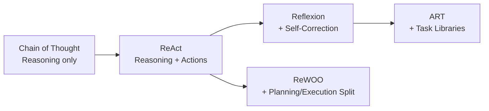
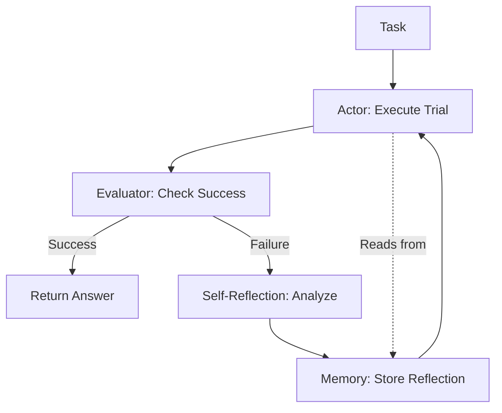

# Agentic Frameworks Guide

> [!abstract] Purpose
> Comprehensive guide to frameworks enabling autonomous agent behavior in LLMs through tool integration, iterative learning, and structured action cycles. Covers ReAct, Reflexion, ART, and ReWOO based on 2022-2023 research.

---

## 📋 Table of Contents

1. [[#Overview & Agent Paradigm]]
2. [[#ReAct Framework]]
3. [[#Reflexion Framework]]
4. [[#ART (Automatic Reasoning & Tool-use)]]
5. [[#ReWOO (Reasoning Without Observation)]]
6. [[#Technique Comparison Matrix]]
7. [[#Integration Patterns]]
8. [[#Research References]]

---

## Overview & Agent Paradigm

[**Agentic-Framework**:: System architecture enabling LLMs to function as autonomous agents through structured interaction patterns with external tools, environments, and self-evaluation mechanisms, transforming passive text generators into active problem solvers.]

### **What Makes an Agent?**

**[Agent-Definition**:: An autonomous entity that perceives environment through observations, reasons about actions to take, executes those actions via tools/APIs, and learns from outcomes - contrasted with traditional LLMs that simply generate text without environment interaction.]**

**Traditional LLM**:
```
Input → LLM → Output
(Single pass, no interaction)
```

**Agentic LLM**:
```
Input → Think → Act → Observe → Think → Act → ... → Final Answer
       ↑_____↓      ↑_____↓     ↑______↓
      (Reasoning) (Tool Use) (Feedback)
```

### **Core Components of Agentic Systems**

1. **Perception**: Receiving observations from environment/tools
2. **Reasoning**: Deciding what action to take next
3. **Action**: Executing operations via APIs/tools
4. **Memory**: Retaining context across interactions
5. **Learning**: Improving from past experiences (advanced)

### **Evolution of Agentic Capabilities**



### **Comparison Matrix**

| Framework | Learning | Memory | Tool Use | Planning | Best For | Complexity |
|-----------|----------|--------|----------|----------|----------|------------|
| **ReAct** | ❌ No | Session only | ✅ Yes | Implicit | General tool use | Medium |
| **Reflexion** | ✅ Yes | Episodic | ✅ Yes | Implicit | Improving agents | High |
| **ART** | ❌ No | Task library | ✅ Yes | Explicit | Multi-tool workflows | High |
| **ReWOO** | ❌ No | None | ✅ Yes | Explicit | Token efficiency | Medium |

---

## ReAct Framework

[**ReAct**:: "Reasoning and Acting" - framework synergizing verbal reasoning traces with action execution in interleaved manner, enabling LLMs to generate reasoning steps (Thought), execute actions (Act), and process feedback (Observe) in iterative cycles.]

### 🎯 Core Concept

**[ReAct-Paradigm-Shift**:: Traditional approaches separate reasoning (CoT) from acting (tool use). ReAct unifies them: model alternates between thinking about what to do and actually doing it, using observations to inform next thoughts in dynamic feedback loop.]**

**Problem**: Pure reasoning (CoT) cannot access external information. Pure action (tool calling) lacks interpretability and planning.

**Solution**: Interleave reasoning and acting in structured loop.

### 🔬 How It Works

**The Thought-Action-Observation Cycle**:

```
THOUGHT: [Reasoning about current situation and next step]
ACTION: [Tool to call with specific parameters]
OBSERVATION: [Result from tool execution]
THOUGHT: [Reasoning about observation]
ACTION: [Next tool call based on new information]
OBSERVATION: [New result]
...
THOUGHT: [Final reasoning]
ANSWER: [Final response to user]
```

**[ReAct-Loop-Structure**:: Each iteration contains three components - (1) Thought: internal monologue about what's known and what's needed, (2) Action: structured command to execute via tool/API, (3) Observation: feedback from environment that informs next iteration.]**

### 📝 Complete Example: Question Answering with Search

**Question**: "Who was the president of the United States when the iPhone was first released?"

**ReAct Execution**:

```
THOUGHT 1: I need to find when the iPhone was first released, then determine who was president at that time.

ACTION 1: Search["when was iPhone first released"]

OBSERVATION 1: The first iPhone was released on June 29, 2007.

THOUGHT 2: Now I know the iPhone was released on June 29, 2007. I need to find who was the U.S. president in 2007.

ACTION 2: Search["US president in 2007"]

OBSERVATION 2: George W. Bush was the 43rd president of the United States, serving from 2001 to 2009.

THOUGHT 3: George W. Bush was president from 2001-2009, and the iPhone was released on June 29, 2007, which falls within his presidency. I can now provide the final answer.

ANSWER: George W. Bush was the president of the United States when the iPhone was first released in June 2007.
```

### 🔧 Production Implementation

```python
class ReActAgent:
    """
    ReAct Framework implementation.
    
    Enables LLM to reason and act in interleaved manner,
    using tools to gather information and accomplish tasks.
    """
    
    def __init__(self, llm, tools, max_iterations=10):
        """
        Initialize ReAct agent.
        
        Args:
            llm: Language model client
            tools: Dict of available tools {name: function}
            max_iterations: Maximum thought-action cycles
        """
        self.llm = llm
        self.tools = tools
        self.max_iterations = max_iterations
        self.trajectory = []  # Store full execution trace
    
    def run(self, task):
        """
        Execute task using ReAct loop.
        
        Args:
            task: User's question or objective
        
        Returns:
            Final answer with execution trace
        """
        self.trajectory = []
        
        # System prompt establishing ReAct pattern
        system_prompt = self._build_system_prompt()
        
        # Initialize context with task
        context = f"Question: {task}\n\n"
        
        for iteration in range(self.max_iterations):
            # Generate thought and action
            response = self.llm.complete(
                system_prompt + context,
                temperature=0.0
            )
            
            # Parse response
            thought, action, action_input = self._parse_response(response)
            
            if thought:
                self.trajectory.append(('THOUGHT', thought))
                context += f"THOUGHT {iteration + 1}: {thought}\n"
            
            # Check if final answer reached
            if action == 'FINISH':
                self.trajectory.append(('ANSWER', action_input))
                return {
                    'answer': action_input,
                    'trajectory': self.trajectory,
                    'iterations': iteration + 1
                }
            
            # Execute action
            if action in self.tools:
                observation = self._execute_tool(action, action_input)
                self.trajectory.append(('ACTION', f"{action}[{action_input}]"))
                self.trajectory.append(('OBSERVATION', observation))
                
                context += f"ACTION {iteration + 1}: {action}[{action_input}]\n"
                context += f"OBSERVATION {iteration + 1}: {observation}\n\n"
            else:
                # Invalid action
                observation = f"Error: Tool '{action}' not available. Available tools: {list(self.tools.keys())}"
                context += f"OBSERVATION {iteration + 1}: {observation}\n\n"
        
        # Max iterations reached without answer
        return {
            'answer': "Could not reach conclusion within iteration limit",
            'trajectory': self.trajectory,
            'iterations': self.max_iterations
        }
    
    def _build_system_prompt(self):
        """Construct system prompt defining ReAct pattern."""
        tool_descriptions = "\n".join(
            f"- {name}: {tool.__doc__ or 'No description'}"
            for name, tool in self.tools.items()
        )
        
        return f"""You are a helpful assistant that can use tools to answer questions.

Available tools:
{tool_descriptions}

Follow this format for EVERY step:

THOUGHT: [Your reasoning about what to do next]
ACTION: [Tool name from available tools, or FINISH if ready to answer]
ACTION INPUT: [Input for the tool, or final answer if ACTION is FINISH]

You will receive:
OBSERVATION: [Result from tool execution]

Then continue with next THOUGHT-ACTION-OBSERVATION cycle.

When you have enough information to answer the original question:
THOUGHT: [Final reasoning]
ACTION: FINISH
ACTION INPUT: [Your final answer]

Begin!

"""
    
    def _parse_response(self, response):
        """Extract thought, action, and action input from LLM response."""
        import re
        
        # Extract THOUGHT
        thought_match = re.search(r'THOUGHT:?\s*(.+?)(?=ACTION:|$)', response, re.DOTALL | re.IGNORECASE)
        thought = thought_match.group(1).strip() if thought_match else None
        
        # Extract ACTION
        action_match = re.search(r'ACTION:?\s*(\w+)', response, re.IGNORECASE)
        action = action_match.group(1).strip() if action_match else None
        
        # Extract ACTION INPUT
        input_match = re.search(r'ACTION INPUT:?\s*(.+?)(?=OBSERVATION:|$)', response, re.DOTALL | re.IGNORECASE)
        action_input = input_match.group(1).strip() if input_match else None
        
        return thought, action, action_input
    
    def _execute_tool(self, tool_name, tool_input):
        """Execute tool and return observation."""
        try:
            result = self.tools[tool_name](tool_input)
            return str(result)
        except Exception as e:
            return f"Error executing {tool_name}: {str(e)}"
```

### 💡 Example Tools Integration

```python
# Define tools the agent can use
def web_search(query):
    """Search the web for information."""
    # In production, integrate with actual search API
    # Here's a mock example
    search_results = {
        "when was iPhone first released": "The first iPhone was released on June 29, 2007.",
        "US president in 2007": "George W. Bush was president from 2001-2009.",
        # ... more results
    }
    return search_results.get(query, "No results found.")

def calculator(expression):
    """Evaluate mathematical expressions."""
    try:
        # Safe eval with restricted namespace
        result = eval(expression, {"__builtins__": {}}, {})
        return f"Result: {result}"
    except Exception as e:
        return f"Error: {str(e)}"

def wikipedia_lookup(entity):
    """Look up entity on Wikipedia."""
    # Mock implementation
    wiki_data = {
        "George W. Bush": "43rd President of the United States (2001-2009)",
        "iPhone": "Smartphone designed by Apple Inc., first released June 29, 2007",
    }
    return wiki_data.get(entity, "Entity not found in Wikipedia.")

# Create agent with tools
tools = {
    'Search': web_search,
    'Calculator': calculator,
    'Wikipedia': wikipedia_lookup
}

agent = ReActAgent(llm=your_llm_client, tools=tools)

# Run task
result = agent.run("What is 15% of the number of days between iPhone release and today?")
```

### 📊 Performance Benchmarks

**From Yao et al. 2022 (ICLR 2023)**:

| Task | Baseline | ReAct | Improvement |
|------|----------|-------|-------------|
| **HotpotQA** (Multi-hop QA) | 27.4% | 35.1% | **+7.7pp** |
| **FEVER** (Fact Verification) | 56.3% | 60.9% | **+4.6pp** |
| **AlfWorld** (Interactive Planning) | 34% | 71% | **+37pp** |
| **WebShop** (Web Navigation) | 28.7% | 50.0% | **+21.3pp** |

**[ReAct-Performance-Pattern**:: Largest gains on tasks requiring external information access (web search, APIs) and interactive environments (games, simulators). Moderate gains on pure reasoning tasks where tools add limited value.]**

### 💡 When to Use ReAct

**✅ Excellent For:**
- **Information lookup** (search engines, databases, APIs)
- **Multi-step research** (gathering facts from multiple sources)
- **Interactive environments** (games, simulations, robotics)
- **Tool orchestration** (file systems, calculators, code execution)
- **Dynamic tasks** where information needs emerge during execution

**❌ Not Suitable For:**
- **Pure reasoning** (no external information needed → use CoT instead)
- **Real-time constraints** (tool calls add latency)
- **No tool access** (framework requires executable actions)
- **Simple queries** (overhead not worth it)

### ⚙️ ReAct Prompt Engineering Tips

**[ReAct-Prompt-Best-Practices**:: (1) Explicit format specification reduces parsing errors, (2) Tool descriptions must be clear and unambiguous, (3) Few-shot examples dramatically improve action selection, (4) Error handling in observations helps agent recover, (5) Iteration limits prevent infinite loops.]**

**Improved System Prompt with Examples**:

```markdown
You solve tasks by alternating between thinking and acting.

FORMAT:
THOUGHT: [Reasoning about current state]
ACTION: [Tool name]
ACTION INPUT: [Tool parameter]
[You receive OBSERVATION: [Tool output]]
... repeat until solved ...
THOUGHT: [Final reasoning]
ACTION: FINISH
ACTION INPUT: [Final answer]

AVAILABLE TOOLS:
- Search[query]: Web search
- Wikipedia[entity]: Look up entity
- Calculator[expression]: Evaluate math

EXAMPLE:
Question: What is the age difference between Barack Obama and Donald Trump?

THOUGHT: I need to find the birth years of both people.
ACTION: Wikipedia
ACTION INPUT: Barack Obama

OBSERVATION: Barack Obama, born August 4, 1961, 44th President...

THOUGHT: Obama was born in 1961. Now I need Trump's birth year.
ACTION: Wikipedia  
ACTION INPUT: Donald Trump

OBSERVATION: Donald Trump, born June 14, 1946, 45th President...

THOUGHT: Trump born 1946, Obama born 1961. Difference is 1961-1946=15 years.
ACTION: FINISH
ACTION INPUT: The age difference is 15 years, with Donald Trump being older.

Now solve this:
Question: {user_question}
```

### 🔗 ReAct Variations

**ReAct + Chain of Thought**:
```python
# Enhanced thought quality with CoT
def react_with_cot(agent, task):
    """ReAct where thoughts use chain-of-thought reasoning."""
    # Modify system prompt to encourage step-by-step thinking
    enhanced_prompt = """
THOUGHT: [Break down your reasoning step by step:
1. What do I know?
2. What do I need to find out?
3. What tool should I use?]
ACTION: [Tool]
ACTION INPUT: [Input]
"""
    # Rest of implementation...
```

**ReAct + Self-Consistency**:
```python
def react_with_sc(agent, task, num_paths=3):
    """Run ReAct multiple times, vote on final answers."""
    results = []
    
    for i in range(num_paths):
        result = agent.run(task)
        results.append(result['answer'])
    
    # Majority vote
    from collections import Counter
    votes = Counter(results)
    best_answer = votes.most_common(1)[0][0]
    
    return best_answer
```

---

## Reflexion Framework

[**Reflexion**:: Advanced agentic framework with self-reflection and episodic memory, enabling agents to learn from mistakes across multiple trials through verbal self-evaluation and experience storage.]

### 🎯 Core Concept

**[Reflexion-Innovation**:: ReAct executes one trajectory per task with no learning. Reflexion adds (1) Evaluator to assess trajectory quality, (2) Self-Reflection to generate improvement insights, (3) Episodic Memory to store past attempts and learnings, enabling iterative improvement across trials.]**

**ReAct Limitation**: Each task execution is independent - agent doesn't learn from past failures.

**Reflexion Solution**: After each trial, agent reflects on failures, stores insights in memory, uses them in subsequent attempts.

### 🔬 Architecture

**Four Core Components** (Shinn et al. 2023):

1. **Actor**: ReAct-style agent executing tasks
2. **Evaluator**: Scores trajectory quality (success/failure)
3. **Self-Reflection**: Generates verbal analysis of failures
4. **Memory**: Stores reflections for future trials



**[Reflexion-Loop**:: Trial → Evaluate → Reflect → Remember → Retry with improved strategy. Process continues for max_trials or until success, with each trial informed by reflections from previous failures.]**

### 📝 Complete Example: Coding Task

**Task**: "Write a function to find the longest palindromic substring"

**Trial 1**:
```python
# Actor generates code
def longest_palindrome(s):
    return s[::-1]  # Wrong approach - just reverses string

# Evaluator tests code
test_cases = [("babad", "bab"), ("cbbd", "bb")]
result = evaluate(longest_palindrome, test_cases)
# Result: FAILED (0/2 tests passed)

# Self-Reflection generates
reflection_1 = """
REFLECTION: My solution simply reversed the entire string, which is incorrect.
I confused "palindrome" with "reverse". A palindrome reads the same forwards
and backwards, but the task asks for the longest SUBSTRING that is a palindrome,
not the whole string reversed.

KEY INSIGHT: I need to:
1. Check all substrings
2. For each substring, test if it's a palindrome
3. Track the longest one found

MISTAKE: Fundamental misunderstanding of problem requirements.
"""

# Memory stores reflection_1
```

**Trial 2** (with reflection from Trial 1):
```python
# Actor reads reflection_1 from memory, tries again
def longest_palindrome(s):
    longest = ""
    for i in range(len(s)):
        for j in range(i, len(s)):
            substr = s[i:j+1]
            if substr == substr[::-1] and len(substr) > len(longest):
                longest = substr
    return longest

# Evaluator tests
result = evaluate(longest_palindrome, test_cases)
# Result: FAILED (1/2 tests passed - timeout on long strings)

# Self-Reflection
reflection_2 = """
REFLECTION: My solution is correct in logic but inefficient (O(n³)).
It checks every substring and reverses each to test palindrome property.
For long strings, this times out.

KEY INSIGHT: I need a more efficient approach:
- Expand around centers (O(n²)) would be better
- There are 2n-1 possible centers (each char + between each pair)

MISTAKE: Correct algorithm but poor time complexity.
"""

# Memory stores reflection_2
```

**Trial 3** (with reflections 1 & 2):
```python
# Actor incorporates both reflections
def longest_palindrome(s):
    def expand_around_center(left, right):
        while left >= 0 and right < len(s) and s[left] == s[right]:
            left -= 1
            right += 1
        return s[left+1:right]
    
    longest = ""
    for i in range(len(s)):
        # Odd length palindromes (center is single char)
        odd_palindrome = expand_around_center(i, i)
        # Even length palindromes (center is between chars)
        even_palindrome = expand_around_center(i, i+1)
        
        longest = max(longest, odd_palindrome, even_palindrome, key=len)
    
    return longest

# Evaluator tests
result = evaluate(longest_palindrome, test_cases)
# Result: SUCCESS (2/2 tests passed)

# No reflection needed - task complete
```

### 🔧 Implementation

```python
class ReflexionAgent:
    """
    Reflexion framework: Actor + Evaluator + Self-Reflection + Memory.
    
    Learns from failures across multiple trials.
    """
    
    def __init__(self, llm, tools, evaluator_fn, max_trials=3):
        """
        Args:
            llm: Language model
            tools: Available tools (like ReAct)
            evaluator_fn: Function to evaluate trajectory → score/success
            max_trials: Maximum attempts per task
        """
        self.llm = llm
        self.tools = tools
        self.evaluator = evaluator_fn
        self.max_trials = max_trials
        self.memory = []  # Episodic memory of reflections
    
    def solve(self, task):
        """
        Solve task with iterative self-improvement.
        
        Returns:
            Best solution found across all trials
        """
        best_solution = None
        best_score = -float('inf')
        
        for trial in range(self.max_trials):
            print(f"\n=== Trial {trial + 1}/{self.max_trials} ===")
            
            # Actor: Execute task (ReAct-style)
            trajectory = self._execute_trial(task)
            
            # Evaluator: Score the trajectory
            eval_result = self.evaluator(trajectory)
            score = eval_result['score']
            success = eval_result['success']
            
            print(f"Score: {score}, Success: {success}")
            
            # Track best solution
            if score > best_score:
                best_score = score
                best_solution = trajectory
            
            # If successful, return
            if success:
                print("✓ Task completed successfully")
                return {
                    'solution': trajectory,
                    'trial': trial + 1,
                    'reflections': self.memory
                }
            
            # Self-Reflection: Analyze failure
            if trial < self.max_trials - 1:  # Don't reflect on last trial
                reflection = self._generate_reflection(task, trajectory, eval_result)
                self.memory.append(reflection)
                print(f"Reflection generated: {reflection[:100]}...")
        
        # Max trials reached without success
        print("✗ Max trials reached")
        return {
            'solution': best_solution,
            'trial': self.max_trials,
            'reflections': self.memory,
            'success': False
        }
    
    def _execute_trial(self, task):
        """
        Execute one trial attempt using ReAct-style loop.
        
        Incorporates past reflections from memory.
        """
        # Build context with memory
        memory_context = ""
        if self.memory:
            memory_context = "\nPAST ATTEMPTS AND REFLECTIONS:\n"
            for i, reflection in enumerate(self.memory):
                memory_context += f"\nTrial {i+1} Reflection:\n{reflection}\n"
        
        system_prompt = f"""You are solving: {task}

{memory_context}

Use the THOUGHT-ACTION-OBSERVATION format.
Learn from past reflections to avoid previous mistakes.
"""
        
        # Standard ReAct loop (simplified here)
        context = system_prompt
        trajectory = []
        
        for step in range(10):  # Max 10 steps per trial
            response = self.llm.complete(context, temperature=0.0)
            
            # Parse and execute (similar to ReAct)
            thought, action, action_input = self._parse(response)
            
            if action == 'FINISH':
                trajectory.append({
                    'thought': thought,
                    'action': action,
                    'result': action_input
                })
                break
            
            # Execute tool
            observation = self.tools[action](action_input) if action in self.tools else "Invalid tool"
            
            trajectory.append({
                'thought': thought,
                'action': action,
                'action_input': action_input,
                'observation': observation
            })
            
            context += f"\nTHOUGHT: {thought}\nACTION: {action}[{action_input}]\nOBSERVATION: {observation}\n"
        
        return trajectory
    
    def _generate_reflection(self, task, trajectory, eval_result):
        """
        Generate verbal self-reflection on failed trajectory.
        """
        trajectory_text = self._format_trajectory(trajectory)
        failure_details = eval_result.get('feedback', 'No specific feedback')
        
        reflection_prompt = f"""Analyze this failed attempt and provide a detailed reflection.

TASK: {task}

TRAJECTORY:
{trajectory_text}

EVALUATION RESULT:
- Success: {eval_result['success']}
- Score: {eval_result['score']}
- Feedback: {failure_details}

Provide a reflection covering:
1. What went wrong?
2. Why did this approach fail?
3. What key insight would improve the next attempt?
4. What specific mistake should be avoided?

REFLECTION:
"""
        
        reflection = self.llm.complete(reflection_prompt, temperature=0.3)
        return reflection
    
    def _format_trajectory(self, trajectory):
        """Format trajectory for display."""
        lines = []
        for i, step in enumerate(trajectory):
            lines.append(f"Step {i+1}:")
            lines.append(f"  Thought: {step.get('thought', '')}")
            lines.append(f"  Action: {step.get('action', '')}[{step.get('action_input', '')}]")
            if 'observation' in step:
                lines.append(f"  Observation: {step['observation']}")
        return "\n".join(lines)
    
    def _parse(self, response):
        """Parse LLM response (same as ReAct)."""
        # Implementation same as ReAct._parse_response
        pass
```

### 💡 When to Use Reflexion

**[Reflexion-Ideal-Use-Cases**:: (1) Complex coding tasks requiring iteration, (2) Games/puzzles where trial-and-error learning helps, (3) Tasks with clear success criteria and evaluable outcomes, (4) Scenarios where learning from failures provides compounding value, (5) Multi-trial workflows acceptable.]**

**✅ Excellent For:**
- **Code generation** with test-driven evaluation
- **Interactive games** (text adventures, puzzles)
- **Optimization tasks** (find best parameters)
- **Creative tasks** with refinement cycles
- **Any task where self-critique helps**

**❌ Not Suitable For:**
- **One-shot queries** (no opportunity for retrial)
- **Ambiguous success criteria** (can't evaluate objectively)
- **Real-time requirements** (multiple trials too slow)
- **Simple tasks** (overhead not worth it)

### 📊 Performance Benchmarks

**From Shinn et al. 2023 (NeurIPS)**:

| Task | ReAct Baseline | Reflexion | Improvement | Trials |
|------|----------------|-----------|-------------|--------|
| **AlfWorld** (Interactive) | 71% | 91% | **+20pp** | 3 trials |
| **HotPotQA** (QA) | 35.1% | 40.2% | **+5.1pp** | 3 trials |
| **HumanEval** (Coding) | 67% | 88% | **+21pp** | Up to 3 |

**[Reflexion-Learning-Curve**:: Performance improves monotonically with trials. Trial 1 ≈ ReAct performance. Trial 2 shows moderate gains. Trial 3 achieves peak performance. Diminishing returns after 3-4 trials.]**

### ⚙️ Reflexion Variations

**Reflexion + External Memory**:
```python
class ReflexionWithVectorMemory(ReflexionAgent):
    """
    Use vector database for reflection retrieval.
    
    Instead of using all past reflections, retrieve most relevant ones.
    """
    
    def __init__(self, llm, tools, evaluator_fn, embedding_model):
        super().__init__(llm, tools, evaluator_fn)
        self.embedding_model = embedding_model
        self.reflection_db = []  # (embedding, reflection) pairs
    
    def _get_relevant_reflections(self, task, top_k=3):
        """Retrieve top-k most similar past reflections."""
        if not self.reflection_db:
            return []
        
        task_embedding = self.embedding_model.encode(task)
        
        # Compute similarities
        similarities = []
        for emb, refl in self.reflection_db:
            sim = cosine_similarity(task_embedding, emb)
            similarities.append((sim, refl))
        
        # Return top-k
        similarities.sort(reverse=True)
        return [refl for _, refl in similarities[:top_k]]
    
    def _execute_trial(self, task):
        """Use only relevant past reflections."""
        relevant_refs = self._get_relevant_reflections(task)
        
        memory_context = ""
        if relevant_refs:
            memory_context = "\nRELEVANT PAST REFLECTIONS:\n"
            for i, ref in enumerate(relevant_refs):
                memory_context += f"\n{i+1}. {ref}\n"
        
        # Rest same as base class, but with filtered context
        # ...
```

---

## ART (Automatic Reasoning & Tool-use)

[**ART**:: "Automatic multi-step Reasoning and Tool-use" - framework with decomposable task library and tool library, enabling zero-shot generalization to new tasks via automatic selection of relevant demonstrations and tools.]

### 🎯 Core Concept

**[ART-Architecture**:: Maintains (1) Task Library - few-shot demonstrations of multi-step reasoning for different task types, (2) Tool Library - executable functions with descriptions, (3) Automatic Selection - given new task, retrieves similar demonstrations and relevant tools, constructs prompt automatically.]**

**Problem**: ReAct/Reflexion require manual prompt engineering for each task type. Tools must be specified upfront.

**Solution**: Build libraries that enable zero-shot generalization via automatic retrieval.

### 🔬 How It Works

**Three-Stage Process** (Paranjape et al. 2023):

**Stage 1: Task Decomposition**
```python
# Given new task, find similar task in library
new_task = "Solve this math word problem: ..."

# Retrieve similar demonstrations
similar_tasks = task_library.search(new_task, k=2)
# Returns: [arithmetic_word_problem_demo, multi_step_math_demo]
```

**Stage 2: Tool Selection**
```python
# Based on task type, select relevant tools
relevant_tools = tool_library.select_for_task(similar_tasks)
# Returns: [Calculator, UnitConverter, SearchEngine]
```

**Stage 3: Prompt Construction**
```python
# Automatically construct prompt with demonstrations + tools
prompt = construct_prompt(
    demonstrations=similar_tasks,
    tools=relevant_tools,
    new_task=new_task
)

# Execute with ReAct-style loop
result = execute(prompt)
```

### 📝 Task Library Structure

```python
task_library = {
    'arithmetic_word_problem': {
        'demonstration': """
Question: A bakery makes 12 cakes per hour. How many cakes in 3.5 hours?

THOUGHT: I need to multiply 12 cakes/hour by 3.5 hours.
ACTION: Calculator[12 * 3.5]
OBSERVATION: 42

THOUGHT: The bakery makes 42 cakes in 3.5 hours.
ACTION: FINISH[42 cakes]
""",
        'required_tools': ['Calculator'],
        'task_type': 'math'
    },
    
    'multi_hop_qa': {
        'demonstration': """
Question: What is the elevation of the highest peak in the country where the Eiffel Tower is located?

THOUGHT: First, I need to find which country has the Eiffel Tower.
ACTION: Search[Where is Eiffel Tower located]
OBSERVATION: The Eiffel Tower is in Paris, France.

THOUGHT: Now I need to find France's highest peak.
ACTION: Search[highest peak in France]
OBSERVATION: Mont Blanc is France's highest peak.

THOUGHT: Finally, I need the elevation of Mont Blanc.
ACTION: Search[Mont Blanc elevation]
OBSERVATION: Mont Blanc has an elevation of 4,808 meters.

THOUGHT: I have all the information needed.
ACTION: FINISH[4,808 meters]
""",
        'required_tools': ['Search'],
        'task_type': 'multi_hop_reasoning'
    },
    
    # ... more task types
}
```

### 🔧 Implementation

```python
class ARTFramework:
    """
    ART: Automatic Reasoning and Tool-use.
    
    Combines task library (demonstrations) with tool library
    for zero-shot generalization to new tasks.
    """
    
    def __init__(self, llm, task_library, tool_library, embedding_model):
        """
        Args:
            llm: Language model
            task_library: Dict of {task_type: demonstration}
            tool_library: Dict of {tool_name: tool_function}
            embedding_model: For semantic similarity search
        """
        self.llm = llm
        self.task_library = task_library
        self.tool_library = tool_library
        self.embedder = embedding_model
        
        # Pre-compute embeddings for task library
        self.task_embeddings = {}
        for task_type, data in task_library.items():
            demo_text = data['demonstration']
            self.task_embeddings[task_type] = self.embedder.encode(demo_text)
    
    def solve(self, new_task, k_demonstrations=2):
        """
        Solve new task using automatic retrieval.
        
        Args:
            new_task: User's question
            k_demonstrations: Number of similar demonstrations to use
        
        Returns:
            Solution using automatically constructed prompt
        """
        # Step 1: Retrieve similar task demonstrations
        similar_tasks = self._retrieve_similar_tasks(new_task, k=k_demonstrations)
        
        # Step 2: Determine required tools
        required_tools = self._get_required_tools(similar_tasks)
        
        # Step 3: Construct prompt automatically
        prompt = self._construct_prompt(
            demonstrations=similar_tasks,
            tools=required_tools,
            new_task=new_task
        )
        
        # Step 4: Execute with ReAct loop
        result = self._execute_react_loop(prompt, required_tools)
        
        return result
    
    def _retrieve_similar_tasks(self, query, k=2):
        """Find k most similar task demonstrations."""
        query_embedding = self.embedder.encode(query)
        
        similarities = []
        for task_type, task_emb in self.task_embeddings.items():
            sim = cosine_similarity(query_embedding, task_emb)
            similarities.append((sim, task_type))
        
        similarities.sort(reverse=True)
        
        # Return top-k task data
        top_tasks = []
        for _, task_type in similarities[:k]:
            top_tasks.append(self.task_library[task_type])
        
        return top_tasks
    
    def _get_required_tools(self, task_demonstrations):
        """Extract union of required tools from demonstrations."""
        all_tools = set()
        for demo_data in task_demonstrations:
            all_tools.update(demo_data['required_tools'])
        
        # Return actual tool functions
        return {
            tool_name: self.tool_library[tool_name]
            for tool_name in all_tools
            if tool_name in self.tool_library
        }
    
    def _construct_prompt(self, demonstrations, tools, new_task):
        """Build prompt from retrieved components."""
        # Tool descriptions
        tool_desc = "\n".join(
            f"- {name}: {func.__doc__}" 
            for name, func in tools.items()
        )
        
        # Demonstration examples
        demo_text = "\n\n".join(
            demo['demonstration'] 
            for demo in demonstrations
        )
        
        prompt = f"""You can use these tools:
{tool_desc}

Here are examples of similar tasks:

{demo_text}

Now solve this task:
{new_task}

Follow the THOUGHT-ACTION-OBSERVATION format shown in examples.
"""
        
        return prompt
    
    def _execute_react_loop(self, prompt, tools):
        """Execute ReAct-style loop with prompt and tools."""
        # Standard ReAct execution (same as before)
        context = prompt
        max_steps = 10
        
        for step in range(max_steps):
            response = self.llm.complete(context, temperature=0.0)
            
            thought, action, action_input = self._parse(response)
            
            if action == 'FINISH':
                return action_input
            
            if action in tools:
                observation = tools[action](action_input)
            else:
                observation = f"Tool {action} not available"
            
            context += f"\nTHOUGHT: {thought}\nACTION: {action}[{action_input}]\nOBSERVATION: {observation}\n"
        
        return "Max steps reached"
    
    def _parse(self, response):
        """Parse response (same as ReAct)."""
        # Implementation identical to ReAct
        pass
```

### 💡 When to Use ART

**✅ Excellent For:**
- **Zero-shot task adaptation** (new task types without manual prompting)
- **Large tool libraries** (automatically select relevant subset)
- **Production systems** (reuse demonstrations across users)
- **Scaling to many tasks** (add to library, don't reprogram)

**❌ Not Suitable For:**
- **Completely novel tasks** (no similar demonstrations exist)
- **Simple applications** (overhead of library management)
- **Limited task diversity** (manual ReAct more direct)

### 📊 Performance

**From Paranjape et al. 2023**:

| Task Type | Manual ReAct | ART (Auto) | Comparison |
|-----------|--------------|------------|------------|
| **BigBench Tasks** | 68% | 78% | +10pp via better demonstrations |
| **Tool Selection Accuracy** | Manual | 92% auto | Near-human performance |

---

## ReWOO (Reasoning Without Observation)

[**ReWOO**:: "Reasoning WithOut Observation" - decouples planning from execution through three modules (Planner, Worker, Solver), reducing token usage by generating complete plan upfront then executing all tools in parallel before final solving.]**

### 🎯 Core Concept

**[ReWOO-Efficiency-Innovation**:: ReAct interleaves reasoning and tool calls, requiring LLM invocation after each observation (high token cost). ReWOO separates into phases - (1) Plan all actions upfront, (2) Execute tools in parallel, (3) Solve with all results available - reducing LLM calls from O(n) to O(1) for n tools.]**

**ReAct Pattern** (Sequential, High Token Cost):
```
LLM → Tool1 → LLM → Tool2 → LLM → Tool3 → LLM → Answer
 ↑_______↓     ↑_____↓      ↑_____↓      ↑
(4 LLM calls, sequential execution)
```

**ReWOO Pattern** (Parallel, Low Token Cost):
```
LLM (Plan) → [Tool1, Tool2, Tool3] (Parallel) → LLM (Solve) → Answer
    ↑                                                ↑
(2 LLM calls, parallel execution)
```

### 🔬 Three-Module Architecture

**Module 1: Planner** - Generates complete plan with variable placeholders
**Module 2: Worker** - Executes all tool calls (can be parallel)
**Module 3: Solver** - Generates final answer given all evidence

### 📝 Complete Example

**Question**: "What is the hometown of the 2023 Nobel Prize in Literature winner?"

**Phase 1: Planner**
```
PLANNER OUTPUT:
#E1 = Search[2023 Nobel Prize Literature winner]
#E2 = LookUp[#E1, hometown]
Answer: #E2
```

**Phase 2: Worker** (Parallel Execution)
```
#E1 = Search[2023 Nobel Prize Literature winner]
     → "Jon Fosse from Norway won 2023 Nobel Literature"

#E2 = LookUp["Jon Fosse from Norway won 2023 Nobel Literature", hometown]
     → "Jon Fosse's hometown is Haugesund, Norway"
```

**Phase 3: Solver**
```
SOLVER INPUT:
Question: What is the hometown of the 2023 Nobel Prize in Literature winner?
Evidence:
#E1: Jon Fosse from Norway won 2023 Nobel Literature
#E2: Jon Fosse's hometown is Haugesund, Norway

SOLVER OUTPUT:
The hometown of the 2023 Nobel Prize in Literature winner (Jon Fosse) is Haugesund, Norway.
```

### 🔧 Implementation

```python
class ReWOOFramework:
    """
    ReWOO: Reasoning Without Observation.
    
    Three modules: Planner → Worker → Solver
    More token-efficient than ReAct for multi-tool tasks.
    """
    
    def __init__(self, llm, tools):
        self.llm = llm
        self.tools = tools
    
    def solve(self, question):
        """
        Execute ReWOO pipeline.
        
        Returns:
            Final answer with execution details
        """
        # Phase 1: Planning
        plan = self._plan(question)
        
        # Phase 2: Worker execution
        evidence = self._execute_plan(plan)
        
        # Phase 3: Solving
        answer = self._solve(question, evidence)
        
        return {
            'answer': answer,
            'plan': plan,
            'evidence': evidence
        }
    
    def _plan(self, question):
        """
        Generate complete plan with variable placeholders.
        
        Returns:
            List of (variable, tool, input) tuples
        """
        tool_desc = "\n".join(f"- {name}" for name in self.tools.keys())
        
        planner_prompt = f"""Generate a plan to answer the question.

Available tools:
{tool_desc}

Use variables #E1, #E2, etc. to reference evidence from previous steps.

Format:
#E1 = ToolName[input]
#E2 = ToolName[#E1]  # Can reference previous evidence
...
Answer: #EN

Question: {question}

Plan:
"""
        
        response = self.llm.complete(planner_prompt, temperature=0.0)
        plan = self._parse_plan(response)
        
        return plan
    
    def _parse_plan(self, plan_text):
        """Parse plan into structured steps."""
        import re
        
        steps = []
        lines = plan_text.strip().split('\n')
        
        for line in lines:
            # Match pattern: #E1 = Tool[input]
            match = re.match(r'#E(\d+)\s*=\s*(\w+)\[(.*?)\]', line)
            if match:
                var_num = int(match.group(1))
                tool = match.group(2)
                tool_input = match.group(3)
                steps.append({
                    'variable': f'#E{var_num}',
                    'tool': tool,
                    'input': tool_input
                })
        
        return steps
    
    def _execute_plan(self, plan):
        """
        Execute all plan steps (can be parallelized).
        
        Returns:
            Dict mapping variables to evidence
        """
        evidence = {}
        
        for step in plan:
            var = step['variable']
            tool_name = step['tool']
            tool_input = step['input']
            
            # Substitute previous evidence variables
            for prev_var, prev_evidence in evidence.items():
                tool_input = tool_input.replace(prev_var, str(prev_evidence))
            
            # Execute tool
            if tool_name in self.tools:
                result = self.tools[tool_name](tool_input)
                evidence[var] = result
            else:
                evidence[var] = f"Tool {tool_name} not found"
        
        return evidence
    
    def _solve(self, question, evidence):
        """
        Generate final answer given question and all evidence.
        """
        evidence_text = "\n".join(
            f"{var}: {value}"
            for var, value in evidence.items()
        )
        
        solver_prompt = f"""Answer the question using the provided evidence.

Question: {question}

Evidence:
{evidence_text}

Answer:
"""
        
        answer = self.llm.complete(solver_prompt, temperature=0.0)
        return answer
```

### 💡 When to Use ReWOO

**[ReWOO-vs-ReAct-Tradeoff**:: ReWOO is faster and cheaper when plan is deterministic and parallelizable. ReAct is better when observations must inform next actions (dynamic planning). Choose based on task dependency structure.]**

**✅ Use ReWOO For:**
- **Multi-step lookup** (independent information retrieval)
- **Token-budget constraints** (ReWOO uses fewer tokens)
- **Parallelizable tools** (can execute simultaneously)
- **Production cost optimization**

**❌ Use ReAct Instead For:**
- **Dynamic planning** (next action depends on observation)
- **Interactive environments** (game states, simulations)
- **Error recovery** (may need to retry/adjust)

### 📊 Performance Comparison

**Token Efficiency** (from Xu et al. 2023):

| Task Type | ReAct Tokens | ReWOO Tokens | Savings |
|-----------|--------------|--------------|---------|
| **3-step lookup** | ~2400 | ~1200 | **50%** |
| **5-step research** | ~4500 | ~1800 | **60%** |

**Accuracy** (similar to ReAct when tasks are parallelizable):

| Task | ReAct | ReWOO | Note |
|------|-------|-------|------|
| **Multi-hop QA** | 35% | 34% | Comparable |
| **HotpotQA** | 27% | 26% | Slight decrease acceptable for cost savings |

---

## Technique Comparison Matrix

### **Selection Decision Tree**

```
Does task require LEARNING from mistakes?
├─ YES → Reflexion
│  └─ Trials: 3-5 attempts
│
└─ NO → Continue below

Does task involve MANY sequential tool calls?
├─ YES, and observations inform next actions
│  └─ ReAct (dynamic planning)
│
└─ YES, but tools can run in parallel
   └─ ReWOO (efficiency)

Is this a RECURRING task type?
├─ YES, with library of demonstrations
│  └─ ART (zero-shot generalization)
│
└─ NO → ReAct (general purpose)
```

### **Feature Comparison**

| Feature | ReAct | Reflexion | ART | ReWOO |
|---------|-------|-----------|-----|-------|
| **Learning** | ❌ | ✅ Episodic | ❌ | ❌ |
| **Memory** | Session | Persistent | Library | None |
| **Parallel Execution** | ❌ | ❌ | ❌ | ✅ |
| **Token Efficiency** | Medium | Low | Medium | High |
| **Dynamic Planning** | ✅ | ✅ | ✅ | ❌ |
| **Self-Improvement** | ❌ | ✅ | ❌ | ❌ |
| **Zero-Shot Adaptation** | ❌ | ❌ | ✅ | ❌ |
| **Implementation Complexity** | Medium | High | High | Medium |

---

## Integration Patterns

### Pattern 1: ReAct + Reflexion Hybrid

```python
def react_reflexion_hybrid(task, max_trials=3):
    """
    Use ReAct for execution, Reflexion for learning.
    
    Best of both: ReAct's dynamic planning + Reflexion's learning
    """
    reflexion = ReflexionAgent(llm, tools, evaluator)
    
    # Each trial uses ReAct execution
    result = reflexion.solve(task)
    
    return result
```

### Pattern 2: ART + ReWOO for Efficiency

```python
def art_rewoo_pipeline(new_task):
    """
    Use ART for zero-shot demonstration retrieval,
    ReWOO for efficient execution.
    """
    # ART: Select demonstrations and tools
    art = ARTFramework(llm, task_library, tool_library, embedder)
    similar_demos = art._retrieve_similar_tasks(new_task)
    tools = art._get_required_tools(similar_demos)
    
    # ReWOO: Efficient execution
    rewoo = ReWOOFramework(llm, tools)
    result = rewoo.solve(new_task)
    
    return result
```

---

## Research References

### Core Papers

- **[Yao et al. 2022](https://arxiv.org/abs/2210.03629)** - "ReAct: Synergizing Reasoning and Acting in Language Models" - ICLR 2023
- **[Shinn et al. 2023](https://arxiv.org/abs/2303.11366)** - "Reflexion: Language Agents with Verbal Reinforcement Learning" - NeurIPS 2023
- **[Paranjape et al. 2023](https://arxiv.org/abs/2303.09014)** - "ART: Automatic Multi-step Reasoning and Tool-use for Large Language Models"
- **[Xu et al. 2023](https://arxiv.org/abs/2305.18323)** - "ReWOO: Decoupling Reasoning from Observations for Efficient Augmented Language Models"

---

## 🔗 Related Topics for PKB Expansion

1. **[[tool-library-design-for-agents]]**
   - **Connection**: Designing effective tool APIs for agent frameworks
   - **Depth Potential**: Tool interface patterns, error handling, composition
   - **Knowledge Graph Role**: Practical implementation guide
   - **Priority**: High - essential for production agents

2. **[[agent-evaluation-metrics]]**
   - **Connection**: How to measure agent performance objectively
   - **Depth Potential**: Success rates, tool selection accuracy, efficiency metrics
   - **Knowledge Graph Role**: Quality assurance methodology
   - **Priority**: High - needed for iterative improvement

3. **[[agent-safety-sandboxing]]**
   - **Connection**: Preventing agents from harmful actions
   - **Depth Potential**: Code execution safety, API rate limiting, action validation
   - **Knowledge Graph Role**: Production deployment requirements
   - **Priority**: Critical - safety cannot be optional

4. **[[multi-agent-collaboration]]**
   - **Connection**: Multiple agents working together on complex tasks
   - **Depth Potential**: Communication protocols, task delegation, consensus
   - **Knowledge Graph Role**: Advanced agent architectures
   - **Priority**: Medium - frontier topic

---

*This guide covers agentic frameworks enabling autonomous behavior. For reasoning techniques, see [[01-reasoning-techniques-guide]]. For meta-optimization, see [[03-meta-optimization-guide]].*
