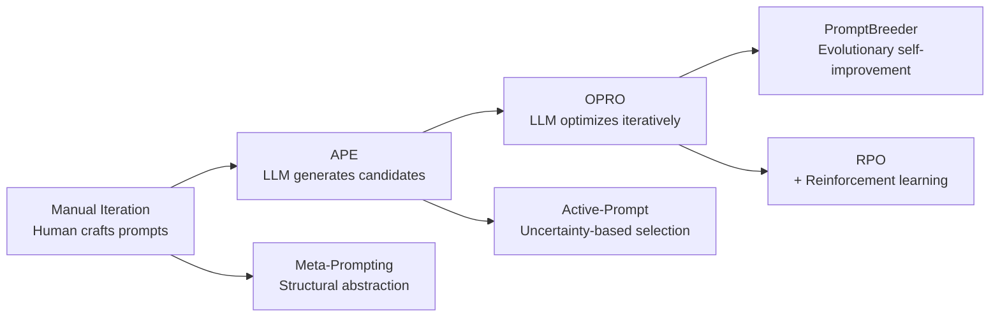

# Meta-Optimization Guide

> [!abstract] Purpose
> Comprehensive guide to techniques that automatically improve prompts without manual iteration - using LLMs to optimize prompts, evolutionary algorithms for breeding better variants, reinforcement learning for refinement, and structural abstraction for generalization. Based on cutting-edge research from 2023-2025.

---

## 📋 Table of Contents

1. [[#Overview & Comparison]]
2. [[#APE: Automatic Prompt Engineer]]
3. [[#OPRO: Optimization by Prompting]]
4. [[#Active-Prompt]]
5. [[#PromptBreeder]]
6. [[#RPO: Reinforced Prompt Optimization]]
7. [[#Meta-Prompting]]
8. [[#Technique Selection Guide]]
9. [[#Research References]]

---

## Overview & Comparison

[**Meta-Optimization**:: Automated techniques that improve prompts without manual iteration by using LLMs as optimizers, evolutionary algorithms for breeding variants, reinforcement learning for refinement, or structural abstraction for generalization - transforming prompt engineering from craft to systematic optimization.]

### **Why Meta-Optimization Matters**

**The Problem**: Traditional prompt engineering is:
- **Manual**: Requires expert time for iteration
- **Inconsistent**: Quality varies by engineer skill
- **Slow**: Multiple rounds of testing and refinement
- **Local**: Optimizes for observed cases, may miss better solutions
- **Expensive**: Human time costs more than compute

**[Meta-Optimization-Value**:: Automates the prompt improvement cycle - generate candidates automatically, evaluate systematically, select best performers, iterate rapidly. Trades human time for compute time. Enables optimization at scale impossible manually.]**

### **Evolution of Meta-Optimization**



### **Comparison Matrix**

| Technique | Approach | Iterations | Complexity | Best For |
|-----------|----------|------------|------------|----------|
| **APE** | Generate + score + select | Single round | Low | Quick optimization |
| **OPRO** | Iterative LLM-as-optimizer | 5-20 rounds | Medium | Systematic improvement |
| **Active-Prompt** | Uncertainty-based example selection | 1-3 rounds | Low | Few-shot optimization |
| **PromptBreeder** | Evolutionary breeding | 50-100 generations | High | Maximum quality |
| **RPO** | Reinforcement learning | 10-50 episodes | Very High | Fine-grained tuning |
| **Meta-Prompting** | Structural templates | N/A | Low | Zero-shot transfer |

### **Performance Summary**

| Technique | GSM8K (Math) | BBH (Reasoning) | Typical Improvement |
|-----------|--------------|-----------------|---------------------|
| **Manual Baseline** | 65% | 55% | - |
| **APE** | 78% (+13pp) | 63% (+8pp) | +8-13pp |
| **OPRO** | 82% (+17pp) | 68% (+13pp) | +10-17pp |
| **PromptBreeder** | 85% (+20pp) | 71% (+16pp) | +15-20pp |
| **Active-Prompt** | 73% (+8pp) | 60% (+5pp) | +5-8pp (less compute) |

---

## APE: Automatic Prompt Engineer

[**APE-Framework**:: Uses LLM to automatically generate diverse prompt candidates, evaluates each on training set, selects best performer - achieving human-level prompt engineering performance without manual iteration.]

### 🎯 Core Concept

**[APE-Innovation**:: Instead of human engineer iterating prompts manually, use LLM to generate many candidates automatically, score each on held-out examples, select top performer. LLM acts as prompt engineer.]**

**Traditional Process**:
```
Human: Writes prompt
→ Tests on examples  
→ Identifies issues
→ Rewrites prompt
→ Repeat...
(10-20 iterations, hours/days)
```

**APE Process**:
```
LLM: Generates 50 prompt candidates
→ Automated scoring on test set
→ Select best performer
(Minutes, fully automated)
```

### 🔬 How It Works

**[APE-Three-Steps**:: (1) Generation - LLM creates diverse prompt candidates from task description and examples, (2) Evaluation - each candidate scored on validation set, (3) Selection - highest-scoring prompt returned as optimal.]**

#### Step 1: Prompt Generation

**Inputs**:
- Task description: "Classify sentiment as Positive/Negative/Neutral"
- Few training examples: [(input, output), ...]

**Generation Prompt**:
```markdown
I need a prompt for an AI to perform this task:

Task: {task_description}

Examples of input-output pairs:
{examples}

Generate {num_candidates} different prompts that would make an AI perform this task well.
Each prompt should:
- Clearly specify the task
- Provide helpful context or instructions
- Encourage accurate outputs

Prompts:
1. [First candidate]
2. [Second candidate]
...
```

**LLM Generates** (example output):
```
1. "Analyze the sentiment of the following text and classify it as Positive, Negative, or Neutral. Consider both explicit and implicit sentiment cues."

2. "You are a sentiment analysis expert. Classify the emotional tone of this text into one of three categories: Positive (optimistic, happy), Negative (critical, sad), or Neutral (factual, balanced)."

3. "Determine whether the following statement expresses a positive opinion, negative opinion, or neutral stance. Respond with a single word: Positive, Negative, or Neutral."

... (47 more candidates)
```

#### Step 2: Evaluation

Each generated prompt is scored on validation set:

```python
def evaluate_prompt(prompt, validation_set):
    """
    Score prompt on validation examples.
    
    Returns accuracy on validation set.
    """
    correct = 0
    
    for example in validation_set:
        # Format with prompt
        full_prompt = prompt + "\n\n" + example['input']
        
        # Get model prediction
        prediction = llm.complete(full_prompt)
        
        # Check if correct
        if prediction.strip().lower() == example['expected'].strip().lower():
            correct += 1
    
    return correct / len(validation_set)


# Score all candidates
scores = []
for candidate in generated_prompts:
    score = evaluate_prompt(candidate, validation_set)
    scores.append((score, candidate))
```

#### Step 3: Selection

```python
# Sort by score, select best
scores.sort(reverse=True)
best_prompt, best_score = scores[0]

print(f"Best Prompt (Accuracy: {best_score:.1%}):")
print(best_prompt)
```

### 📝 Complete Example: Math Word Problems

**Task**: Solve grade-school math problems

**Training Examples**:
```
Input: "If John has 5 apples and gives 2 to Mary, how many does he have?"
Output: "3"

Input: "A car travels 60 mph for 2 hours. How far does it go?"
Output: "120 miles"
```

**APE Process**:

```python
# Step 1: Generate candidates
generation_prompt = """
Generate 20 different prompts for solving math word problems.

Examples:
- Input: "If John has 5 apples and gives 2 to Mary, how many does he have?"
  Output: "3"

- Input: "A car travels 60 mph for 2 hours. How far does it go?"
  Output: "120 miles"

Each prompt should help an AI solve similar problems accurately.

Prompts:
"""

candidates = llm.complete(generation_prompt, n=1, max_tokens=2000)

# Parse candidates
prompts = parse_numbered_list(candidates)  # Extract 1-20

# Step 2: Evaluate
validation_set = [
    {'input': 'Sarah has 12 cookies and eats 3. How many left?', 'expected': '9'},
    {'input': 'A train travels 90 mph for 3 hours. Distance?', 'expected': '270 miles'},
    # ... more validation examples
]

results = []
for prompt in prompts:
    accuracy = evaluate_prompt(prompt, validation_set)
    results.append({'prompt': prompt, 'accuracy': accuracy})

# Step 3: Select best
best = max(results, key=lambda x: x['accuracy'])

print(f"Optimal Prompt ({best['accuracy']:.1%} accuracy):")
print(best['prompt'])
```

**Output Example**:
```
Optimal Prompt (87% accuracy):
"Solve this math problem step by step. First identify the quantities, then determine the operation needed, calculate the answer, and include units if applicable."
```

### 🔧 Production APE Implementation

```python
class AutomaticPromptEngineer:
    """
    APE framework for automatic prompt optimization.
    """
    
    def __init__(self, llm, num_candidates=20):
        self.llm = llm
        self.num_candidates = num_candidates
    
    def optimize(self, task_description, train_examples, validation_examples):
        """
        Automatically engineer optimal prompt.
        
        Args:
            task_description: What the task is
            train_examples: Examples for generation (input-output pairs)
            validation_examples: Examples for evaluation
        
        Returns:
            {
                'best_prompt': optimized_prompt,
                'accuracy': score_on_validation,
                'all_candidates': list_of_all_tested_prompts
            }
        """
        # Step 1: Generate candidates
        print(f"Generating {self.num_candidates} prompt candidates...")
        candidates = self._generate_prompts(task_description, train_examples)
        
        # Step 2: Evaluate each candidate
        print(f"Evaluating {len(candidates)} candidates...")
        results = []
        for i, candidate in enumerate(candidates):
            accuracy = self._evaluate_prompt(candidate, validation_examples)
            results.append({
                'prompt': candidate,
                'accuracy': accuracy,
                'rank': None  # Will be filled after sorting
            })
            print(f"  Candidate {i+1}/{len(candidates)}: {accuracy:.1%}")
        
        # Step 3: Select best
        results.sort(key=lambda x: x['accuracy'], reverse=True)
        for i, result in enumerate(results):
            result['rank'] = i + 1
        
        best = results[0]
        print(f"\n✅ Best prompt found (Rank 1, {best['accuracy']:.1%} accuracy)")
        
        return {
            'best_prompt': best['prompt'],
            'accuracy': best['accuracy'],
            'all_candidates': results
        }
    
    def _generate_prompts(self, task_description, examples):
        """Generate diverse prompt candidates."""
        
        # Format examples
        examples_text = "\n\n".join([
            f"Input: {ex['input']}\nOutput: {ex['output']}"
            for ex in examples[:5]  # Use first 5 for generation
        ])
        
        generation_prompt = f"""
Generate {self.num_candidates} different prompts for this task:

Task: {task_description}

Example input-output pairs:
{examples_text}

Create diverse prompts that would help an AI perform this task accurately.
Vary the approach: some should be concise, others detailed; some should emphasize reasoning, others output format; etc.

List {self.num_candidates} prompts, numbered:

1."""
        
        response = self.llm.complete(
            generation_prompt,
            temperature=0.9,  # High temp for diversity
            max_tokens=2000
        )
        
        # Parse numbered list
        candidates = self._parse_numbered_list(response)
        
        return candidates[:self.num_candidates]  # Ensure we have exactly num_candidates
    
    def _evaluate_prompt(self, prompt, validation_examples):
        """Score prompt on validation set."""
        
        correct = 0
        total = len(validation_examples)
        
        for example in validation_examples:
            # Construct full prompt
            full_prompt = f"{prompt}\n\nInput: {example['input']}\nOutput:"
            
            # Get prediction
            prediction = self.llm.complete(
                full_prompt,
                temperature=0.0,  # Deterministic for eval
                max_tokens=100
            ).strip()
            
            # Check correctness
            if self._is_correct(prediction, example['expected']):
                correct += 1
        
        return correct / total
    
    def _is_correct(self, prediction, expected):
        """Check if prediction matches expected output."""
        # Simple exact match (can be made more sophisticated)
        pred_clean = prediction.strip().lower()
        exp_clean = expected.strip().lower()
        
        return pred_clean == exp_clean or pred_clean in exp_clean
    
    def _parse_numbered_list(self, text):
        """Extract numbered items from LLM response."""
        import re
        
        # Match patterns like "1. Some text" or "1) Some text"
        pattern = r'\d+[\.)]\s*(.+?)(?=\n\d+[\.)]|\Z)'
        matches = re.findall(pattern, text, re.DOTALL)
        
        return [match.strip() for match in matches]


# Usage
ape = AutomaticPromptEngineer(llm, num_candidates=20)

result = ape.optimize(
    task_description="Classify text sentiment as Positive, Negative, or Neutral",
    train_examples=[
        {'input': 'I love this product!', 'output': 'Positive'},
        {'input': 'Terrible experience.', 'output': 'Negative'},
        {'input': 'It works as expected.', 'output': 'Neutral'}
    ],
    validation_examples=[
        {'input': 'Best purchase ever!', 'expected': 'Positive'},
        {'input': 'Waste of money.', 'expected': 'Negative'},
        # ... 20+ more for robust evaluation
    ]
)

print(f"\nOptimal Prompt:\n{result['best_prompt']}")
```

### 💡 When to Use APE

**[APE-Use-Cases**:: (1) New task requiring prompt from scratch, (2) Have labeled examples but no good prompt yet, (3) Manual iteration not yielding improvements, (4) Need to optimize multiple prompts quickly, (5) Want baseline before more sophisticated optimization.]**

**✅ Excellent For:**
- **Rapid prototyping** (get good prompt quickly)
- **Benchmark establishment** (what's achievable?)
- **Task with many examples** (data-rich scenarios)
- **Replacing manual prompt engineering** (automation value high)

**❌ Not Worth It For:**
- **Trivial tasks** (manual prompting sufficient)
- **Few examples** (<10 validation examples - unreliable evaluation)
- **Highly complex tasks** (APE may not explore sophisticated enough strategies)

### 📊 Performance Benchmarks

**From Zhou et al. 2023**:

| Task | Manual Baseline | APE | Improvement |
|------|----------------|-----|-------------|
| **Instruction Induction** | 64.2% | 77.8% | **+13.6pp** |
| **BBH (Reasoning)** | 55.1% | 62.9% | **+7.8pp** |
| **TruthfulQA** | 48.3% | 56.1% | **+7.8pp** |

**[APE-Human-Level**:: On many tasks, APE-generated prompts match or exceed human expert prompts. Largest gains where task is well-specified but optimal phrasing unclear.]**

### ⚠️ Limitations

1. **Requires good evaluation set**: Bad eval → bad optimization
2. **Single-round**: Doesn't iteratively improve (see OPRO for iterative)
3. **Candidate diversity limited**: LLM may generate similar variations
4. **Compute cost**: Evaluating 20-50 candidates on validation set expensive
5. **Local optimum**: Finds good prompt in explored space, may miss great prompts

---

## OPRO: Optimization by Prompting

[**OPRO**:: Iterative optimization framework where LLM acts as optimizer, maintaining history of (prompt, score) pairs and proposing improved prompts based on what worked previously - enabling systematic convergence to high-quality prompts over multiple rounds.]

### 🎯 Core Concept

**[OPRO-Innovation**:: Treats prompt optimization as iterative search where LLM is the optimizer. Each iteration: (1) LLM sees previous prompts and scores, (2) proposes new improved prompt, (3) new prompt evaluated, (4) result added to history. LLM learns from trajectory what improves performance.]**

**APE vs OPRO**:
```
APE (One Round):
Generate 50 candidates → Evaluate all → Select best
(Breadth-first search)

OPRO (Multiple Rounds):
Round 1: Generate 5 candidates → Evaluate → Keep best
Round 2: See Round 1 results → Generate improved 5 → Evaluate
Round 3: See Rounds 1-2 results → Generate better 5 → Evaluate
...
Round N: Converge to optimum
(Gradient descent-like search)
```

### 🔬 How It Works

**[OPRO-Meta-Prompt**:: Fixed prompt instructing LLM to act as optimizer: "Below are prompts and their scores. Your task is to propose new prompts that will score higher. Propose N new prompts that improve upon previous attempts."]**

**Iteration Structure**:

```
Meta-Prompt (Fixed):
"You are an optimization algorithm. Below are instruction prompts and their accuracies on a task.

<trajectory>
Prompt: "Solve this problem"
Score: 0.65

Prompt: "Think step by step and solve"  
Score: 0.71

Prompt: "Analyze carefully then solve"
Score: 0.69
</trajectory>

Based on this trajectory, propose 3 new prompts that will achieve higher scores.

New prompts:"

LLM Output:
1. "Break the problem into steps, solve each step, then combine for final answer"
2. "First understand what's being asked, then methodically solve"
3. "Think step by step. Show your work. Verify your answer."

[Evaluate these 3 new prompts]
[Add best to trajectory]
[Repeat for next iteration]
```

### 📝 Complete Example: Math Problem Optimization

**Task**: Optimize prompt for GSM8K math problems

**Starting Prompt**: "Solve this problem."

**OPRO Trajectory**:

```
Iteration 0:
Prompt: "Solve this problem."
Score: 0.58

Iteration 1:
Meta-prompt generates:
1. "Solve step by step."
2. "Think carefully and solve."
3. "Show your work."

Best: "Solve step by step." → Score: 0.67 (+0.09)

Iteration 2:
Meta-prompt sees history, generates:
1. "Break into steps: identify knowns, determine operation, calculate, verify."
2. "Solve step by step. Show each calculation."
3. "Think step by step. Check your answer."

Best: "Solve step by step. Show each calculation." → Score: 0.73 (+0.06)

Iteration 3:
Meta-prompt generates:
1. "Let's solve step by step: 1) Identify quantities 2) Determine operation 3) Calculate 4) Verify units match"
2. "Solve systematically: extract data, set up equation, compute, state final answer with units"
3. "Step-by-step solution with verification: ..."

Best: "Let's solve step by step: 1) Identify quantities 2) Determine operation 3) Calculate 4) Verify units match" → Score: 0.79 (+0.06)

... continues until convergence or max iterations ...

Final (Iteration 8):
Prompt: "Let's work through this step-by-step:
1) Read carefully and identify all given quantities
2) Determine what operation(s) are needed
3) Perform calculations, showing work
4) State the answer clearly with appropriate units
5) Double-check the answer makes sense"

Score: 0.82 (+0.24 from start)
```

### 🔧 OPRO Implementation

```python
class OPROOptimizer:
    """
    Optimization by Prompting framework.
    
    Iteratively improves prompts using LLM as optimizer.
    """
    
    def __init__(self, llm, task_description, validation_set):
        self.llm = llm
        self.task_description = task_description
        self.validation_set = validation_set
        self.trajectory = []  # History of (prompt, score) pairs
    
    def optimize(self, initial_prompt, num_iterations=8, candidates_per_iter=3):
        """
        Optimize prompt over multiple iterations.
        
        Args:
            initial_prompt: Starting point
            num_iterations: How many optimization rounds
            candidates_per_iter: New prompts to try each iteration
        
        Returns:
            {
                'best_prompt': final_optimized_prompt,
                'best_score': accuracy_on_validation,
                'trajectory': full_optimization_history
            }
        """
        # Evaluate initial prompt
        initial_score = self._evaluate_prompt(initial_prompt)
        self.trajectory.append({
            'iteration': 0,
            'prompt': initial_prompt,
            'score': initial_score
        })
        
        print(f"Iteration 0 (Initial): {initial_score:.1%}")
        
        # Optimization loop
        for iteration in range(1, num_iterations + 1):
            print(f"\n🔄 Iteration {iteration}")
            
            # Generate new candidate prompts based on trajectory
            candidates = self._generate_improved_prompts(candidates_per_iter)
            
            # Evaluate each candidate
            best_candidate = None
            best_score = -1
            
            for i, candidate in enumerate(candidates):
                score = self._evaluate_prompt(candidate)
                print(f"  Candidate {i+1}: {score:.1%}")
                
                if score > best_score:
                    best_score = score
                    best_candidate = candidate
            
            # Add best to trajectory
            self.trajectory.append({
                'iteration': iteration,
                'prompt': best_candidate,
                'score': best_score
            })
            
            print(f"  ✅ Best: {best_score:.1%} (Δ = {best_score - self.trajectory[-2]['score']:+.1%})")
            
            # Early stopping if no improvement
            if best_score <= self.trajectory[-2]['score']:
                print(f"  ⚠️  No improvement - converged")
                break
        
        # Return best overall
        best_overall = max(self.trajectory, key=lambda x: x['score'])
        
        return {
            'best_prompt': best_overall['prompt'],
            'best_score': best_overall['score'],
            'improvement': best_overall['score'] - initial_score,
            'trajectory': self.trajectory
        }
    
    def _generate_improved_prompts(self, num_prompts):
        """
        Use LLM as optimizer to generate improved prompts.
        """
        # Format trajectory for meta-prompt
        trajectory_text = self._format_trajectory()
        
        meta_prompt = f"""
You are an optimization algorithm. Your goal is to propose instruction prompts that will maximize performance on this task:

Task: {self.task_description}

Below is the optimization trajectory showing previous prompts and their accuracies:

{trajectory_text}

Analyze the trajectory:
- Which prompt elements correlate with higher scores?
- What improvements can be made?
- What new approaches haven't been tried?

Propose {num_prompts} new instruction prompts that will score higher than all previous attempts.

New prompts:
1."""
        
        response = self.llm.complete(
            meta_prompt,
            temperature=0.7,  # Moderate temp for diverse but focused proposals
            max_tokens=800
        )
        
        # Parse candidates
        candidates = self._parse_numbered_list(response)
        
        return candidates[:num_prompts]
    
    def _format_trajectory(self):
        """Format optimization history for meta-prompt."""
        lines = []
        for entry in self.trajectory:
            lines.append(
                f"Iteration {entry['iteration']}:\n"
                f"Prompt: \"{entry['prompt']}\"\n"
                f"Score: {entry['score']:.3f}\n"
            )
        return "\n".join(lines)
    
    def _evaluate_prompt(self, prompt):
        """Evaluate prompt on validation set."""
        correct = 0
        
        for example in self.validation_set:
            full_prompt = f"{prompt}\n\n{example['input']}"
            prediction = self.llm.complete(full_prompt, temperature=0.0).strip()
            
            if self._is_correct(prediction, example['expected']):
                correct += 1
        
        return correct / len(self.validation_set)
    
    def _is_correct(self, prediction, expected):
        """Check if prediction matches expected."""
        return prediction.lower().strip() == expected.lower().strip()
    
    def _parse_numbered_list(self, text):
        """Extract numbered prompts from LLM response."""
        import re
        pattern = r'\d+[\.)]\s*(.+?)(?=\n\d+[\.)]|\Z)'
        matches = re.findall(pattern, text, re.DOTALL)
        return [m.strip().strip('"\'') for m in matches]


# Usage
opro = OPROOptimizer(
    llm=llm,
    task_description="Solve grade-school math word problems",
    validation_set=math_validation_examples
)

result = opro.optimize(
    initial_prompt="Solve this problem.",
    num_iterations=10,
    candidates_per_iter=3
)

print(f"\n🎯 Final Best Prompt ({result['best_score']:.1%}):")
print(result['best_prompt'])
print(f"\n📈 Total Improvement: {result['improvement']:+.1%}")
```

### 💡 When to Use OPRO

**[OPRO-Use-Cases**:: (1) Have computational budget for iterations (5-20 rounds), (2) Task where incremental improvements valuable, (3) Want systematic exploration vs. random sampling, (4) APE plateau'd but think better exists, (5) Can afford meta-LLM calls (uses LLM to optimize prompts for task-LLM).]**

**✅ Excellent For:**
- **High-value tasks** (improvement worth iteration cost)
- **Systematic optimization** (understand what works via trajectory)
- **Benchmark competition** (squeeze out last percentages)
- **Research** (study optimization dynamics)

**❌ Not Worth It For:**
- **Tight compute budgets** (8+ LLM calls per iteration)
- **Good-enough sufficient** (APE may be enough)
- **Very few validation examples** (noisy scores → poor optimization signal)

### 📊 Performance Benchmarks

**From Yang et al. 2023**:

| Task | Manual | APE | OPRO | OPRO Gain |
|------|--------|-----|------|-----------|
| **GSM8K** | 65% | 78% | **82%** | **+4pp over APE** |
| **BBH** | 55% | 63% | **68%** | **+5pp over APE** |
| **MMLU** | 71% | 74% | **77%** | **+3pp over APE** |

**[OPRO-Convergence**:: Typically converges in 5-10 iterations. Diminishing returns after iteration 8. Early iterations yield largest gains (40-60% of total improvement in first 3 iterations).]**

### 🔗 Integration: OPRO + Self-Consistency

```python
def opro_with_sc_evaluation(task_description, validation_set, initial_prompt):
    """
    Use Self-Consistency for more robust prompt evaluation during OPRO.
    
    Each prompt evaluated with SC (5 samples), reducing noise in scores.
    """
    class OPROWithSC(OPROOptimizer):
        def _evaluate_prompt(self, prompt):
            """Override to use Self-Consistency."""
            from collections import Counter
            
            example_scores = []
            
            for example in self.validation_set:
                # Self-Consistency: 5 predictions per example
                predictions = []
                for _ in range(5):
                    full_prompt = f"{prompt}\n\n{example['input']}"
                    pred = self.llm.complete(full_prompt, temperature=0.7).strip()
                    predictions.append(pred)
                
                # Majority vote
                vote = Counter(predictions)
                majority_pred = vote.most_common(1)[0][0]
                
                # Score
                if self._is_correct(majority_pred, example['expected']):
                    example_scores.append(1.0)
                else:
                    example_scores.append(0.0)
            
            return sum(example_scores) / len(example_scores)
    
    opro_sc = OPROWithSC(llm, task_description, validation_set)
    return opro_sc.optimize(initial_prompt)
```

---

## Active-Prompt

[**Active-Prompt**:: Selects most informative few-shot examples based on uncertainty - identifies inputs where model is least confident, elicits human annotations for those, includes as examples in prompt to maximally improve performance.]

### 🎯 Core Concept

**The Problem**: Few-shot prompting requires selecting k examples from dataset. Random selection may include redundant easy examples, missing hard cases where model needs most help.

**[Active-Prompt-Innovation**:: Uses active learning principle - select examples where model is most uncertain. Uncertain examples are most informative for learning. Annotating uncertain cases improves prompt more than annotating easy cases model already handles.]**

**Process**:
```
1. Unlabeled pool of inputs
2. For each input, measure model uncertainty (multiple predictions, check variance)
3. Select k inputs with highest uncertainty
4. Get annotations for those k (human or high-quality LLM)
5. Use as few-shot examples in prompt
```

### 🔬 How It Works

**[Active-Prompt-Uncertainty-Metrics**:: (1) Disagreement - run CoT multiple times, count how many different answers, (2) Entropy - if model outputs probabilities, measure entropy, (3) Confidence - use model's self-assessed confidence scores.]**

#### Uncertainty via Disagreement

```python
def calculate_uncertainty(input_text, num_samples=5):
    """
    Measure uncertainty by running CoT multiple times.
    
    High disagreement = high uncertainty.
    """
    predictions = []
    
    for _ in range(num_samples):
        prompt = f"Let's think step by step.\n\n{input_text}"
        response = llm.complete(prompt, temperature=0.7)
        answer = extract_answer(response)
        predictions.append(answer)
    
    # Calculate disagreement rate
    from collections import Counter
    counts = Counter(predictions)
    most_common_count = counts.most_common(1)[0][1]
    
    # Disagreement = 1 - (most_common / total)
    disagreement = 1 - (most_common_count / num_samples)
    
    return disagreement  # 0 = all agree, 1 = all different


# Example
uncertainty_1 = calculate_uncertainty("2 + 2 = ?")
# Returns: 0.0 (all predictions agree: "4")

uncertainty_2 = calculate_uncertainty("Complex ambiguous question...")
# Returns: 0.8 (predictions: ["A", "B", "A", "C", "B"])
```

#### Active Selection

```python
def active_prompt_selection(unlabeled_pool, k=5):
    """
    Select k most uncertain examples for annotation.
    """
    # Calculate uncertainty for each
    scored_pool = []
    for input_text in unlabeled_pool:
        uncertainty = calculate_uncertainty(input_text)
        scored_pool.append((uncertainty, input_text))
    
    # Sort by uncertainty (descending)
    scored_pool.sort(reverse=True)
    
    # Select top k most uncertain
    most_uncertain = [text for _, text in scored_pool[:k]]
    
    return most_uncertain


# Usage
unlabeled_inputs = [
    "What is 5 + 3?",
    "If a train leaves Chicago at 9am traveling 60mph...",
    "Complex reasoning problem with ambiguous wording...",
    # ... hundreds more
]

selected_for_annotation = active_prompt_selection(unlabeled_inputs, k=8)

# Get annotations (human or high-quality LLM)
annotated_examples = []
for input_text in selected_for_annotation:
    # Could be human annotation or high-quality LLM
    answer = get_annotation(input_text)
    annotated_examples.append({'input': input_text, 'output': answer})

# Build few-shot prompt with these
few_shot_prompt = build_prompt_with_examples(annotated_examples)
```

### 📝 Complete Example: Math Problem Selection

**Scenario**: Have 1000 unlabeled math problems, budget for 5 annotations

**Step 1: Measure Uncertainty**

```python
math_problems = [
    "2 + 2 = ?",
    "If 3 apples cost $1.50, how much do 7 apples cost?",
    "A complex multi-step problem involving percentages and fractions...",
    # ... 997 more
]

uncertainties = []
for problem in math_problems:
    u = calculate_uncertainty(problem, num_samples=5)
    uncertainties.append((u, problem))

# Sort by uncertainty
uncertainties.sort(reverse=True)

print("Most Uncertain Problems:")
for uncertainty, problem in uncertainties[:5]:
    print(f"  Uncertainty: {uncertainty:.2f} - {problem[:50]}...")
```

**Output**:
```
Most Uncertain Problems:
  Uncertainty: 0.80 - A complex multi-step problem involving...
  Uncertainty: 0.75 - If x is 20% of y, and y is 150% of z...
  Uncertainty: 0.70 - Three workers can complete a job in different...
  Uncertainty: 0.65 - A mixture problem with changing concentrations...
  Uncertainty: 0.60 - Probability question with conditional events...
```

**Step 2: Annotate Selected**

```python
selected_problems = [problem for _, problem in uncertainties[:5]]

annotated = []
for problem in selected_problems:
    # High-quality annotation (could be human or GPT-4)
    answer = expert_annotator(problem)
    annotated.append({'input': problem, 'output': answer})
```

**Step 3: Build Prompt**

```python
few_shot_prompt = "Solve these math problems.\n\nExamples:\n\n"

for ex in annotated:
    few_shot_prompt += f"Problem: {ex['input']}\nSolution: {ex['output']}\n\n"

few_shot_prompt += "Now solve:\n\nProblem: {new_problem}\nSolution:"
```

**Result**: Few-shot prompt with 5 highly informative examples (the uncertain cases) performs better than random 5 examples.

### 🔧 Active-Prompt Implementation

```python
class ActivePromptSelector:
    """
    Select most informative few-shot examples via uncertainty.
    """
    
    def __init__(self, llm, uncertainty_samples=5):
        self.llm = llm
        self.uncertainty_samples = uncertainty_samples
    
    def select_examples(self, unlabeled_pool, k, annotator):
        """
        Select k most uncertain examples and get annotations.
        
        Args:
            unlabeled_pool: List of input texts
            k: Number of examples to select
            annotator: Function that takes input and returns annotated output
        
        Returns:
            List of {'input': ..., 'output': ...} annotated examples
        """
        print(f"Calculating uncertainty for {len(unlabeled_pool)} examples...")
        
        # Calculate uncertainty for each
        scored = []
        for i, input_text in enumerate(unlabeled_pool):
            uncertainty = self._calculate_uncertainty(input_text)
            scored.append((uncertainty, input_text))
            
            if (i + 1) % 50 == 0:
                print(f"  Processed {i+1}/{len(unlabeled_pool)}")
        
        # Select top k most uncertain
        scored.sort(reverse=True)
        selected_inputs = [text for _, text in scored[:k]]
        
        print(f"\nSelected {k} most uncertain examples")
        print("Getting annotations...")
        
        # Get annotations
        annotated_examples = []
        for i, input_text in enumerate(selected_inputs):
            output = annotator(input_text)
            annotated_examples.append({
                'input': input_text,
                'output': output
            })
            print(f"  Annotated {i+1}/{k}")
        
        return annotated_examples
    
    def _calculate_uncertainty(self, input_text):
        """
        Measure uncertainty via disagreement in multiple predictions.
        """
        predictions = []
        
        # Generate multiple predictions
        for _ in range(self.uncertainty_samples):
            prompt = f"Let's think step by step.\n\n{input_text}\n\nAnswer:"
            response = self.llm.complete(
                prompt,
                temperature=0.7,  # Need diversity
                max_tokens=200
            )
            answer = self._extract_answer(response)
            predictions.append(answer)
        
        # Calculate disagreement
        from collections import Counter
        counts = Counter(predictions)
        
        if len(counts) == 0:
            return 0.0
        
        most_common_count = counts.most_common(1)[0][1]
        agreement = most_common_count / len(predictions)
        uncertainty = 1 - agreement
        
        return uncertainty
    
    def _extract_answer(self, response):
        """Extract final answer from response."""
        # Simple extraction - can be made more sophisticated
        lines = response.strip().split('\n')
        return lines[-1].strip()
    
    def build_few_shot_prompt(self, annotated_examples, task_description=""):
        """
        Construct few-shot prompt with selected examples.
        """
        prompt = task_description
        if task_description:
            prompt += "\n\n"
        
        prompt += "Examples:\n\n"
        
        for ex in annotated_examples:
            prompt += f"Input: {ex['input']}\nOutput: {ex['output']}\n\n"
        
        prompt += "Now solve:\n\nInput: {{new_input}}\nOutput:"
        
        return prompt


# Usage
selector = ActivePromptSelector(llm, uncertainty_samples=5)

# Select examples
annotated = selector.select_examples(
    unlabeled_pool=math_problems,
    k=8,
    annotator=lambda x: expert_llm.solve(x)  # High-quality annotator
)

# Build prompt
few_shot_prompt = selector.build_few_shot_prompt(
    annotated,
    task_description="Solve these grade-school math problems."
)

# Use prompt
result = llm.complete(few_shot_prompt.format(new_input="Sarah has 15 cookies..."))
```

### 💡 When to Use Active-Prompt

**[Active-Prompt-Use-Cases**:: (1) Large unlabeled pool but limited annotation budget, (2) Few-shot learning where example quality matters more than quantity, (3) Task has some hard cases model struggles with, (4) Want to maximize performance per annotation, (5) Can afford uncertainty calculation cost.]**

**✅ Excellent For:**
- **Expensive annotations** (human expert time costly)
- **Unbalanced difficulty** (mix of easy and hard examples)
- **Few-shot optimization** (selecting best k from large pool)
- **Domain adaptation** (find edge cases in new domain)

**❌ Not Worth It For:**
- **Cheap annotations** (if labeling is free, label everything)
- **Homogeneous difficulty** (all examples equally hard/easy - no benefit)
- **Very small pools** (if only have 10 examples, just use all)
- **Tight compute budget** (uncertainty calculation requires multiple forward passes)

### 📊 Performance Benchmarks

**From Diao et al. 2023**:

| Selection Method | GSM8K | SVAMP | AQuA |
|------------------|-------|-------|------|
| **Random 8-shot** | 71.2% | 76.8% | 42.1% |
| **Active-Prompt 8-shot** | **78.5%** | **82.3%** | **48.9%** |
| **Improvement** | **+7.3pp** | **+5.5pp** | **+6.8pp** |

**[Active-Prompt-Efficiency**:: With same annotation budget (k examples), active selection yields +5-7pp improvement over random selection. Most gains from identifying genuinely hard cases model needs help with.]**

---

## PromptBreeder

[**PromptBreeder**:: Self-referential evolutionary algorithm where LLM breeds better prompts through mutation and selection - prompts that perform well survive and reproduce, generating even better offspring over many generations without human intervention.]**

### 🎯 Core Concept

**[PromptBreeder-Innovation**:: Applies evolutionary algorithms to prompt engineering. Start with population of prompts, evaluate fitness (performance), select best performers, mutate/crossover to create offspring, repeat for many generations. LLM generates mutations of prompts, creating self-improving system.]**

**Evolutionary Process**:
```
Generation 0: Random initial population (10-20 prompts)
↓
Evaluate fitness (accuracy on validation set)
↓
Select best performers (top 50%)
↓
Breed offspring via mutation:
  - LLM mutates prompt: "Make this prompt better..."
  - LLM crosses prompts: "Combine these two prompts..."
↓
Replace worst with offspring
↓
Generation 1: New population
↓
Repeat for 50-100 generations
```

### 🔬 How It Works

**[PromptBreeder-Components**:: (1) Task prompts - the actual prompts being optimized, (2) Mutation prompts - meta-prompts that tell LLM how to mutate task prompts, (3) Fitness function - evaluation on validation set, (4) Evolution operators - selection, mutation, crossover.]**

#### Mutation Operators

**Mutation Prompt Templates**:
```markdown
# Mutation 1: Direct Improvement
"Here is a prompt: '{prompt}'

Make this prompt better for the task: {task_description}

Improved prompt:"

# Mutation 2: Add Constraint
"Here is a prompt: '{prompt}'

Add a helpful constraint or instruction to make it better.

Enhanced prompt:"

# Mutation 3: Simplify
"Here is a prompt: '{prompt}'

Simplify this prompt while preserving its effectiveness.

Simplified prompt:"

# Mutation 4: Crossover
"Here are two prompts:
Prompt A: '{prompt_a}'
Prompt B: '{prompt_b}'

Combine the best elements of both into a new prompt.

Combined prompt:"
```

#### Complete Algorithm

```python
class PromptBreeder:
    """
    Evolutionary algorithm for prompt optimization.
    """
    
    def __init__(self, llm, task_description, validation_set,
                 population_size=20, num_generations=50):
        self.llm = llm
        self.task_description = task_description
        self.validation_set = validation_set
        self.population_size = population_size
        self.num_generations = num_generations
        
        # Mutation prompts (meta-level)
        self.mutation_templates = self._create_mutation_templates()
    
    def evolve(self, seed_prompts=None):
        """
        Run evolutionary optimization.
        
        Args:
            seed_prompts: Optional initial prompts (else random)
        
        Returns:
            Best prompt after evolution
        """
        # Initialize population
        if seed_prompts and len(seed_prompts) >= self.population_size:
            population = seed_prompts[:self.population_size]
        else:
            population = self._initialize_population(seed_prompts)
        
        # Evolution loop
        best_fitness_history = []
        
        for gen in range(self.num_generations):
            print(f"\n🧬 Generation {gen + 1}/{self.num_generations}")
            
            # Evaluate fitness
            fitness_scores = self._evaluate_population(population)
            
            # Track best
            best_idx = fitness_scores.index(max(fitness_scores))
            best_fitness = fitness_scores[best_idx]
            best_fitness_history.append(best_fitness)
            
            print(f"  Best fitness: {best_fitness:.1%}")
            print(f"  Avg fitness: {sum(fitness_scores)/len(fitness_scores):.1%}")
            
            # Selection
            parents = self._select_parents(population, fitness_scores)
            
            # Create offspring via mutation/crossover
            offspring = self._create_offspring(parents)
            
            # Replacement
            population = self._replace_worst(population, fitness_scores, offspring)
        
        # Return best from final population
        final_fitness = self._evaluate_population(population)
        best_idx = final_fitness.index(max(final_fitness))
        
        return {
            'best_prompt': population[best_idx],
            'best_fitness': final_fitness[best_idx],
            'fitness_history': best_fitness_history
        }
    
    def _initialize_population(self, seeds=None):
        """Create initial population."""
        population = []
        
        # Add seeds if provided
        if seeds:
            population.extend(seeds)
        
        # Generate rest randomly
        while len(population) < self.population_size:
            prompt = self._generate_random_prompt()
            population.append(prompt)
        
        return population
    
    def _generate_random_prompt(self):
        """Generate a random initial prompt."""
        gen_prompt = f"""
Generate a random instruction prompt for this task:
{self.task_description}

The prompt should tell an AI how to perform the task.

Prompt:"""
        
        prompt = self.llm.complete(gen_prompt, temperature=1.0).strip()
        return prompt
    
    def _evaluate_population(self, population):
        """Evaluate fitness (accuracy) for each prompt."""
        fitness_scores = []
        
        for prompt in population:
            accuracy = self._evaluate_prompt(prompt)
            fitness_scores.append(accuracy)
        
        return fitness_scores
    
    def _evaluate_prompt(self, prompt):
        """Calculate accuracy on validation set."""
        correct = 0
        
        for example in self.validation_set:
            full_prompt = f"{prompt}\n\n{example['input']}"
            prediction = self.llm.complete(full_prompt, temperature=0.0).strip()
            
            if prediction.lower() == example['expected'].lower():
                correct += 1
        
        return correct / len(self.validation_set)
    
    def _select_parents(self, population, fitness_scores):
        """Select top 50% as parents."""
        # Pair prompts with fitness
        paired = list(zip(fitness_scores, population))
        paired.sort(reverse=True)
        
        # Select top 50%
        num_parents = self.population_size // 2
        parents = [prompt for _, prompt in paired[:num_parents]]
        
        return parents
    
    def _create_offspring(self, parents):
        """Generate offspring via mutation and crossover."""
        offspring = []
        
        import random
        
        while len(offspring) < len(parents):
            # Randomly choose mutation or crossover
            if random.random() < 0.7:  # 70% mutation
                parent = random.choice(parents)
                child = self._mutate(parent)
            else:  # 30% crossover
                parent1, parent2 = random.sample(parents, 2)
                child = self._crossover(parent1, parent2)
            
            offspring.append(child)
        
        return offspring
    
    def _mutate(self, prompt):
        """Mutate prompt using LLM."""
        mutation_template = random.choice(self.mutation_templates)
        
        mutation_prompt = mutation_template.format(
            prompt=prompt,
            task_description=self.task_description
        )
        
        mutated = self.llm.complete(
            mutation_prompt,
            temperature=0.8  # High temp for diversity
        ).strip()
        
        return mutated
    
    def _crossover(self, prompt1, prompt2):
        """Combine two prompts."""
        crossover_prompt = f"""
Combine these two prompts into one better prompt:

Prompt A: {prompt1}

Prompt B: {prompt2}

Take the best elements from each.

Combined prompt:"""
        
        combined = self.llm.complete(crossover_prompt, temperature=0.7).strip()
        return combined
    
    def _replace_worst(self, population, fitness_scores, offspring):
        """Replace worst individuals with offspring."""
        # Pair and sort
        paired = list(zip(fitness_scores, population))
        paired.sort(reverse=True)
        
        # Keep best half, replace worst half with offspring
        new_population = [prompt for _, prompt in paired[:len(offspring)]]
        new_population.extend(offspring)
        
        return new_population
    
    def _create_mutation_templates(self):
        """Define mutation prompt templates."""
        return [
            "Improve this prompt: '{prompt}'\n\nTask: {task_description}\n\nBetter version:",
            "Add helpful details to this prompt: '{prompt}'\n\nEnhanced version:",
            "Simplify this prompt: '{prompt}'\n\nSimpler version:",
            "Make this prompt more specific: '{prompt}'\n\nMore specific version:",
            "Rephrase this prompt more clearly: '{prompt}'\n\nClearer version:"
        ]


# Usage
breeder = PromptBreeder(
    llm=llm,
    task_description="Classify sentiment as Positive, Negative, or Neutral",
    validation_set=validation_examples,
    population_size=20,
    num_generations=50
)

result = breeder.evolve(seed_prompts=["Classify the sentiment.", "Determine if positive or negative."])

print(f"\n🏆 Evolved Best Prompt ({result['best_fitness']:.1%}):")
print(result['best_prompt'])
```

### 💡 When to Use PromptBreeder

**[PromptBreeder-Use-Cases**:: (1) Willing to invest significant compute for maximum performance, (2) Exhausted simpler methods (APE, OPRO), (3) Benchmark competition where every percentage point matters, (4) Research on self-improvement and evolution, (5) Have large computational budget.]**

**✅ Excellent For:**
- **Absolute maximum performance** (squeeze out last %)
- **Research purposes** (studying emergence)
- **High-stakes tasks** (worth the compute cost)
- **Benchmark leaderboards** (competitive optimization)

**❌ Not Worth It For:**
- **Limited compute** (50 generations × 20 population = 1000s evaluations)
- **Good-enough sufficient** (OPRO may achieve 95% of benefit)
- **Rapid prototyping** (too slow for iteration)
- **Simple tasks** (overkill)

### 📊 Performance Benchmarks

**From Fernando et al. 2023**:

| Method | Big-Bench Hard | MMLU |
|--------|----------------|------|
| **Manual** | 55% | 71% |
| **APE** | 63% (+8pp) | 74% (+3pp) |
| **OPRO** | 68% (+13pp) | 77% (+6pp) |
| **PromptBreeder** | **71% (+16pp)** | **79% (+8pp)** |

**[PromptBreeder-Gains**:: Typically +3-5pp over OPRO, +5-8pp over APE. Gains largest on complex reasoning tasks. Requires 10-50x compute vs OPRO.]**

---

## RPO: Reinforced Prompt Optimization

[**RPO**:: Uses reinforcement learning with temporal difference methods to fine-tune prompts, updating based on reward signals and intermediate feedback - enabling gradient-like optimization in discrete prompt space.]**

### 🎯 Core Concept

**[RPO-Innovation**:: Treats prompt optimization as reinforcement learning problem. Prompt = policy, validation accuracy = reward. Use RL algorithms (temporal difference learning) to update prompts toward higher rewards. Unlike OPRO's discrete sampling, RPO performs more continuous optimization.]**

**Key Idea**: Generate prompt variants, get rewards (accuracy), use rewards to guide next generation of variants via RL update rules.

### 🔬 How It Works (Simplified)

```python
# Simplified RPO concept
class SimplifiedRPO:
    """
    Conceptual RPO implementation.
    
    Note: Full RPO requires gradient estimation in discrete space,
    which is complex. This shows the core idea.
    """
    
    def optimize(self, initial_prompt, validation_set, num_episodes=20):
        """
        RL-based prompt optimization.
        """
        current_prompt = initial_prompt
        
        for episode in range(num_episodes):
            # Generate perturbation (small change)
            perturbed = self._perturb_prompt(current_prompt)
            
            # Evaluate both
            reward_current = self._evaluate(current_prompt, validation_set)
            reward_perturbed = self._evaluate(perturbed, validation_set)
            
            # TD update: move toward better reward
            if reward_perturbed > reward_current:
                # Accept perturbation
                current_prompt = perturbed
                print(f"Episode {episode}: Improved to {reward_perturbed:.1%}")
            else:
                # Reject perturbation (or accept with small probability)
                print(f"Episode {episode}: Staying at {reward_current:.1%}")
        
        return current_prompt
    
    def _perturb_prompt(self, prompt):
        """Generate small variation of prompt."""
        perturbation_prompt = f"""
Make a small modification to this prompt:
'{prompt}'

Modified prompt:"""
        
        return llm.complete(perturbation_prompt, temperature=0.6).strip()
```

**Full RPO is significantly more complex**, involving:
- Policy gradient estimation
- Advantage functions
- Baseline subtraction
- Multiple sampling for gradient estimation

Due to complexity, RPO is primarily research-oriented rather than practical for most use cases.

### 💡 When to Use RPO

**[RPO-Use-Cases**:: (1) Research on RL for prompt optimization, (2) Have infrastructure for RL training, (3) Task requires fine-grained optimization, (4) Other methods plateaued.]**

**✅ Consider For:**
- **Research projects** (novel optimization methods)
- **Extreme optimization** (last few percentage points)

**❌ Not Practical For:**
- **Most production use cases** (complexity >> benefit over OPRO)
- **Limited ML expertise** (requires RL knowledge)
- **Standard tasks** (simpler methods sufficient)

---

## Meta-Prompting

[**Meta-Prompting**:: Focuses on structural/syntactical patterns rather than specific content - creating abstract templates that generalize across tasks by emphasizing how to structure prompts, not what specific words to use.]**

### 🎯 Core Concept

**[Meta-Prompting-Insight**:: Most prompt engineering focuses on content ("say X, Y, Z"). Meta-prompting focuses on structure ("use format A, apply pattern B"). Structural patterns transfer better across tasks than specific phrasing.]**

**Example**:

```
Content-focused (doesn't generalize):
"Classify this text as Positive, Negative, or Neutral sentiment"

Structure-focused (generalizes):
"Classify {input} into one of: {category_1}, {category_2}, {category_3}"

The second is a meta-template applicable to any classification task.
```

### 🔬 How It Works

**Structural Patterns**:

```markdown
# Pattern 1: Classification Template
"Classify {input_description} into one of these categories: {category_list}

{optional_context}

Input: {input_value}
Category:"

# Pattern 2: Extraction Template
"Extract {entity_types} from the following {input_type}.

{optional_examples}

{input_type}: {input_value}

Extracted {entity_types}:"

# Pattern 3: Transformation Template
"Transform the input {source_format} to {target_format}.

{optional_transformation_rules}

Input: {input_value}
Output:"

# Pattern 4: Reasoning Template
"{task_description}

Think through this step-by-step:
1. {step_1_description}
2. {step_2_description}
3. {step_3_description}

Input: {input_value}

Step-by-step solution:"
```

### 📝 Example: Building Meta-Templates

```python
class MetaPromptTemplate:
    """
    Structural prompt template with variable slots.
    """
    
    def __init__(self, structure):
        """
        Args:
            structure: Template string with {variable} placeholders
        """
        self.structure = structure
    
    def instantiate(self, **kwargs):
        """Fill template with specific values."""
        return self.structure.format(**kwargs)


# Define meta-template
classification_meta = MetaPromptTemplate(
    structure="""Classify {input_description} into one of these categories: {categories}

{context}

Input: {input}
Category:"""
)

# Instantiate for different tasks

# Task 1: Sentiment analysis
sentiment_prompt = classification_meta.instantiate(
    input_description="the sentiment of this text",
    categories="Positive, Negative, Neutral",
    context="Consider both explicit and implicit emotional cues.",
    input="{user_text}"
)

# Task 2: Topic classification
topic_prompt = classification_meta.instantiate(
    input_description="the topic of this article",
    categories="Politics, Sports, Technology, Entertainment",
    context="Focus on the primary subject matter.",
    input="{article_text}"
)

# Same structure, different content - structure transfers!
```

### 💡 When to Use Meta-Prompting

**[Meta-Prompting-Use-Cases**:: (1) Building prompt libraries for reuse, (2) Zero-shot transfer to new tasks, (3) Systematic prompt design (not ad-hoc), (4) Teaching prompt patterns to others, (5) Creating prompt frameworks/tools.]**

**✅ Excellent For:**
- **Prompt libraries** (reusable templates)
- **Framework development** (LangChain-style tools)
- **Cross-task generalization** (one template, many tasks)
- **Systematic design** (structured approach)

**❌ Not Directly For:**
- **Optimizing specific prompt** (use APE/OPRO instead)
- **Finding best wording** (meta-prompting is structural, not lexical)

---

## Technique Selection Guide

### Decision Tree

```
What's your goal?

┌─ RAPID PROTOTYPING (get something working quickly)
│  └─► APE (1 round, 20-50 candidates)
│
├─ SYSTEMATIC OPTIMIZATION (best possible prompt)
│  ├─ Moderate compute → OPRO (5-10 iterations)
│  └─ Large compute → PromptBreeder (50 generations)
│
├─ LIMITED ANNOTATIONS (expensive labels)
│  └─► Active-Prompt (select most informative examples)
│
├─ BUILDING FRAMEWORK (reusable templates)
│  └─► Meta-Prompting (structural patterns)
│
└─ RESEARCH (novel optimization)
   └─► RPO or PromptBreeder
```

### Compute vs. Performance Trade-off

```
┌────────────────────────────────────────┐
│                                        │
│         PromptBreeder ●                │
│    RPO ●             (50-100 gens)     │
│  (RL)                                  │
│                                        │
│          OPRO ●                        │
│         (5-10 iters)                   │
│                                        │
│   APE ●                                │
│  (1 round)                             │
│                                        │
│ Active-Prompt ●                        │
│  (uncertainty)                         │
│                                        │
│ Manual ●                               │
│                                        │
└────────────────────────────────────────┘
 Low                               High
          Compute Cost →

Performance ↑: As you move up, performance generally increases
Cost ↑: As you move right, computational cost increases
```

---

## Research References

### APE
- **[Zhou et al. 2023](https://arxiv.org/abs/2211.01910)** - "Large Language Models Are Human-Level Prompt Engineers" - ICLR 2023

### OPRO
- **[Yang et al. 2023](https://arxiv.org/abs/2309.03409)** - "Large Language Models as Optimizers"

### Active-Prompt
- **[Diao et al. 2023](https://arxiv.org/abs/2302.12246)** - "Active Prompting with Chain-of-Thought for Large Language Models"

### PromptBreeder
- **[Fernando et al. 2023](https://arxiv.org/abs/2309.16797)** - "Promptbreeder: Self-Referential Self-Improvement Via Prompt Evolution"

### RPO
- **[Zhang et al. 2024](https://arxiv.org/abs/2401.12354)** - "RPO: Reinforced Prompt Optimization for Large Language Models" (2025 update)

### Meta-Prompting
- **[Zhang et al. 2024](https://arxiv.org/abs/2401.12954)** - "Meta-Prompting: Enhancing Language Models with Task-Agnostic Scaffolding"

### Related Work
- **[Pryzant et al. 2023](https://arxiv.org/abs/2305.03495)** - "Automatic Prompt Optimization with Gradient Descent and Beam Search"

---

## 🔗 Related Topics for PKB Expansion

1. **[[prompt-evaluation-metrics]]**
   - **Connection**: Meta-optimization requires systematic evaluation
   - **Depth Potential**: Accuracy, diversity, robustness metrics
   - **Knowledge Graph Role**: Quality measurement for optimization
   - **Priority**: High - essential for meta-optimization

2. **[[evolutionary-algorithms-nlp]]**
   - **Connection**: PromptBreeder uses genetic algorithms
   - **Depth Potential**: Selection strategies, mutation operators, crossover methods
   - **Knowledge Graph Role**: Algorithmic foundations
   - **Priority**: Medium - theoretical depth

3. **[[zero-shot-vs-few-shot-learning]]**
   - **Connection**: Active-Prompt optimizes few-shot example selection
   - **Depth Potential**: When to use which, example engineering
   - **Knowledge Graph Role**: Learning paradigm selection
   - **Priority**: High - fundamental technique

4. **[[llm-as-optimizer-paradigm]]**
   - **Connection**: OPRO treats LLM as optimization algorithm
   - **Depth Potential**: Beyond prompts - hyperparameters, architectures
   - **Knowledge Graph Role**: Novel AI capabilities
   - **Priority**: Medium - emerging research area

5. **[[prompt-template-libraries]]**
   - **Connection**: Meta-Prompting creates reusable templates
   - **Depth Potential**: Library design, versioning, sharing
   - **Knowledge Graph Role**: Practical engineering
   - **Priority**: High - production utility

6. **[[cost-benefit-analysis-optimization]]**
   - **Connection**: Different meta-methods have different cost/performance profiles
   - **Depth Potential**: When optimization investment worthwhile
   - **Knowledge Graph Role**: Business decision framework
   - **Priority**: High - practical deployment

---

*This guide synthesizes research from 2023-2025 on meta-optimization techniques. For implementation support, see Quick Reference Cards. For technique combinations, see [[06-integration-patterns-guide]].*
