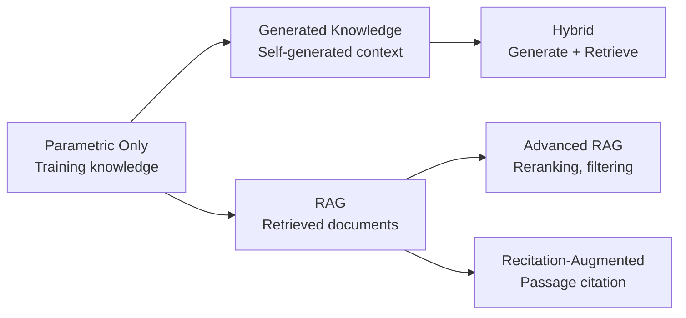

# Knowledge Integration Guide

> [!abstract] Purpose
> Comprehensive guide to techniques that augment LLM capabilities by integrating external knowledge - generating relevant knowledge before reasoning, retrieving from knowledge bases, and reciting passages to ground responses. Based on research from 2020-2024.

---

## 📋 Table of Contents

1. [[#Overview & Comparison]]
2. [[#Generated Knowledge Prompting]]
3. [[#Retrieval-Augmented Generation (RAG)]]
4. [[#Recitation-Augmented Generation]]
5. [[#Technique Selection Guide]]
6. [[#Integration Patterns]]
7. [[#Research References]]

---

## Overview & Comparison

[**Knowledge-Integration**:: Techniques that address LLM knowledge limitations by incorporating external information - either generated by the LLM itself before reasoning, retrieved from external knowledge bases, or recited from provided context - enabling accurate responses beyond training data.]

### **The Knowledge Limitation Problem**

LLMs face inherent knowledge constraints:
- **Training cutoff**: No knowledge of events after training
- **Rare facts**: Poor recall of long-tail information
- **Private data**: No access to proprietary/personal information
- **Precise details**: Struggle with exact numbers, dates, specifications
- **Domain expertise**: Limited depth in specialized fields

**[Knowledge-Gap-Impact**:: Without external knowledge, LLMs hallucinate 20-50% of factual claims in knowledge-intensive tasks. Integration techniques reduce this to 5-15%.]**

### **Evolution of Knowledge Integration**



### **Comparison Matrix**

| Technique | Knowledge Source | Latency | Accuracy | Best For |
|-----------|-----------------|---------|----------|----------|
| **Generated Knowledge** | LLM-generated | Low | Moderate | Commonsense, reasoning scaffolds |
| **RAG (Basic)** | External retrieval | Medium | High | Factual QA, current info |
| **RAG (Advanced)** | Retrieval + filtering | High | Very High | Complex queries, long context |
| **Recitation-Augmented** | Provided context | Low | Very High | Closed-domain, verified sources |

### **Performance Summary**

| Task | Parametric Only | Generated Knowledge | Basic RAG | Advanced RAG |
|------|----------------|---------------------|-----------|--------------|
| **Open-Domain QA** | 32% | 41% (+9pp) | 58% (+26pp) | 67% (+35pp) |
| **Commonsense Reasoning** | 65% | 74% (+9pp) | 68% (+3pp) | 71% (+6pp) |
| **Current Events** | 12% | 15% (+3pp) | 78% (+66pp) | 84% (+72pp) |

---

## Generated Knowledge Prompting

[**Generated-Knowledge**:: Two-stage approach where LLM first generates relevant knowledge/facts about the topic, then uses that generated knowledge as additional context when answering the actual question - enabling better reasoning by making implicit knowledge explicit.]

### 🎯 Core Concept

**The Insight**: LLMs often "know" relevant information but don't spontaneously bring it to mind when answering. **[Generated-Knowledge-Innovation**:: Explicitly prompt LLM to generate relevant knowledge before answering. This primes the model with pertinent information, improving reasoning quality.]**

**Process**:
```
1. Question: "Will a candle burn longer in a sealed jar or open air?"
   ↓
2. Generate Knowledge: Prompt LLM to state relevant facts
   → "Knowledge: Candles need oxygen to burn. Sealed jars have limited oxygen..."
   ↓
3. Answer with Knowledge: Use generated knowledge as context
   → "Given that candles need oxygen and sealed jars limit oxygen, the candle will burn longer in open air."
```

### 🔬 How It Works

#### Stage 1: Knowledge Generation

Prompt LLM to generate relevant facts/knowledge:

```python
def generate_knowledge(question, num_knowledge=3):
    """
    Generate relevant knowledge for question.
    
    Args:
        question: The question to answer
        num_knowledge: How many knowledge statements to generate
    
    Returns:
        List of knowledge statements
    """
    knowledge_prompt = f"""Question: {question}

Before answering, generate {num_knowledge} relevant facts or pieces of knowledge that would help answer this question.

Knowledge:
1."""
    
    response = llm.complete(knowledge_prompt, temperature=0.7)
    knowledge_statements = parse_numbered_list(response)
    
    return knowledge_statements[:num_knowledge]


# Example
question = "Will a candle burn longer in a sealed jar or open air?"
knowledge = generate_knowledge(question, num_knowledge=3)

# Generated knowledge:
# 1. "Candles require oxygen to sustain combustion."
# 2. "A sealed jar has a finite amount of oxygen."
# 3. "Open air provides continuous oxygen supply."
```

#### Stage 2: Answer with Generated Knowledge

Use generated knowledge as additional context:

```python
def answer_with_knowledge(question, knowledge_statements):
    """
    Answer question using generated knowledge as context.
    """
    # Format knowledge
    knowledge_text = "\n".join([
        f"- {k}" for k in knowledge_statements
    ])
    
    answer_prompt = f"""Question: {question}

Relevant Knowledge:
{knowledge_text}

Using the knowledge above, answer the question.

Answer:"""
    
    answer = llm.complete(answer_prompt, temperature=0.3)
    return answer


# Example
answer = answer_with_knowledge(question, knowledge)
# "Given that candles require oxygen to burn and a sealed jar has only finite oxygen
#  while open air provides continuous oxygen, the candle will burn longer in open air."
```

### 📝 Complete Implementation

```python
class GeneratedKnowledge:
    """
    Generated Knowledge Prompting implementation.
    """
    
    def __init__(self, llm):
        self.llm = llm
    
    def answer(self, question, num_knowledge=5, use_consistency=False):
        """
        Answer question with generated knowledge.
        
        Args:
            question: Question to answer
            num_knowledge: Number of knowledge statements to generate
            use_consistency: If True, generate multiple knowledge sets and vote
        
        Returns:
            {
                'answer': final_answer,
                'knowledge': knowledge_used,
                'confidence': score (if use_consistency=True)
            }
        """
        if use_consistency:
            return self._answer_with_consistency(question, num_knowledge)
        else:
            return self._answer_single(question, num_knowledge)
    
    def _answer_single(self, question, num_knowledge):
        """Single knowledge generation + answer."""
        
        # Stage 1: Generate knowledge
        knowledge = self._generate_knowledge(question, num_knowledge)
        
        # Stage 2: Answer with knowledge
        answer = self._answer_with_knowledge(question, knowledge)
        
        return {
            'answer': answer,
            'knowledge': knowledge
        }
    
    def _answer_with_consistency(self, question, num_knowledge, num_samples=5):
        """
        Generate multiple knowledge sets, answer with each, vote on final answer.
        
        More robust but higher cost.
        """
        from collections import Counter
        
        answers = []
        all_knowledge = []
        
        for i in range(num_samples):
            # Generate different knowledge each time (high temp)
            knowledge = self._generate_knowledge(question, num_knowledge)
            
            # Answer with this knowledge
            answer = self._answer_with_knowledge(question, knowledge)
            
            answers.append(answer)
            all_knowledge.append(knowledge)
        
        # Vote on answers
        answer_counts = Counter(answers)
        final_answer = answer_counts.most_common(1)[0][0]
        confidence = answer_counts[final_answer] / num_samples
        
        # Find knowledge that led to majority answer
        majority_knowledge = [
            all_knowledge[i] for i, ans in enumerate(answers)
            if ans == final_answer
        ][0]
        
        return {
            'answer': final_answer,
            'knowledge': majority_knowledge,
            'confidence': confidence,
            'all_answers': answers
        }
    
    def _generate_knowledge(self, question, num_knowledge):
        """Generate relevant knowledge statements."""
        
        prompt = f"""Question: {question}

Generate {num_knowledge} relevant facts, principles, or pieces of knowledge that would help answer this question accurately.

Each knowledge statement should be:
- Directly relevant to the question
- A factual statement or principle
- Helpful for reasoning about the answer

Knowledge:
1."""
        
        response = self.llm.complete(prompt, temperature=0.7)
        statements = self._parse_numbered_list(response)
        
        return statements[:num_knowledge]
    
    def _answer_with_knowledge(self, question, knowledge):
        """Answer using generated knowledge as context."""
        
        knowledge_text = "\n".join([f"- {k}" for k in knowledge])
        
        prompt = f"""Question: {question}

Relevant Knowledge:
{knowledge_text}

Based on the knowledge provided, answer the question. Explain your reasoning.

Answer:"""
        
        return self.llm.complete(prompt, temperature=0.3).strip()
    
    def _parse_numbered_list(self, text):
        """Extract numbered items."""
        import re
        pattern = r'\d+[\.)]\s*(.+?)(?=\n\d+[\.)]|\Z)'
        matches = re.findall(pattern, text, re.DOTALL)
        return [m.strip() for m in matches]


# Usage
gk = GeneratedKnowledge(llm)

# Basic usage
result = gk.answer("Why do leaves change color in autumn?", num_knowledge=4)
print(f"Answer: {result['answer']}")
print(f"\nKnowledge used:")
for k in result['knowledge']:
    print(f"  - {k}")

# With self-consistency
result_robust = gk.answer(
    "Why do leaves change color in autumn?",
    num_knowledge=4,
    use_consistency=True
)
print(f"\nRobust answer (confidence: {result_robust['confidence']:.0%}): {result_robust['answer']}")
```

### 💡 When to Use Generated Knowledge

**[Generated-Knowledge-Use-Cases**:: (1) Commonsense reasoning tasks (everyday knowledge helpful), (2) Questions requiring background context, (3) Multi-step reasoning (knowledge scaffolds logic), (4) When retrieval not available/needed, (5) Combining with retrieval (generate + retrieve).]**

**✅ Excellent For:**
- **Commonsense questions** ("Why does ice float?" - benefits from stating principles)
- **Causal reasoning** ("What happens if..." - generate relevant mechanisms)
- **Science/physics problems** (generate relevant laws/principles)
- **Ethical dilemmas** (generate relevant considerations)
- **Strategic thinking** (generate relevant factors)

**❌ Not Useful For:**
- **Factual lookup** (LLM may not know fact - retrieval better)
- **Current events** (training cutoff - must retrieve)
- **Precise details** (numbers, dates - retrieval more reliable)
- **Private/proprietary info** (LLM can't generate what it never learned)

### 📊 Performance Benchmarks

**From Liu et al. 2022**:

| Task | Standard Prompting | Generated Knowledge | Improvement |
|------|-------------------|---------------------|-------------|
| **CSQA (Commonsense)** | 67.9% | **76.5%** | **+8.6pp** |
| **NumersenseQA** | 64.2% | **72.8%** | **+8.6pp** |
| **QASC (Science)** | 71.3% | **78.9%** | **+7.6pp** |

**[Generated-Knowledge-Pattern**:: Consistent +7-9pp improvement on commonsense and reasoning tasks. Little benefit on pure factual recall (where LLM lacks knowledge to generate).]**

---

## Retrieval-Augmented Generation (RAG)

[**RAG**:: Combines retrieval from external knowledge base with LLM generation - given query, retrieve relevant documents/passages, include as context in prompt, LLM generates answer grounded in retrieved information.]

### 🎯 Core Concept

**[RAG-Innovation**:: Instead of relying solely on LLM's parametric knowledge, retrieve relevant information from external knowledge base at query time. LLM sees factual context before answering, dramatically reducing hallucination.]**

**Architecture**:
```
User Query
    ↓
Retrieve relevant documents (via vector similarity)
    ↓
Format: Query + Retrieved Docs
    ↓
LLM generates answer grounded in docs
    ↓
Answer (with citations)
```

### 🔬 RAG Pipeline Components

#### Component 1: Knowledge Base Preparation

```python
from sentence_transformers import SentenceTransformer
import numpy as np

class VectorKnowledgeBase:
    """
    Vector database for semantic retrieval.
    """
    
    def __init__(self, embedding_model='all-MiniLM-L6-v2'):
        self.model = SentenceTransformer(embedding_model)
        self.documents = []
        self.embeddings = None
    
    def add_documents(self, documents):
        """
        Add documents to knowledge base.
        
        Args:
            documents: List of {'id': ..., 'text': ..., 'metadata': ...}
        """
        self.documents.extend(documents)
        
        # Generate embeddings
        texts = [doc['text'] for doc in documents]
        new_embeddings = self.model.encode(texts)
        
        if self.embeddings is None:
            self.embeddings = new_embeddings
        else:
            self.embeddings = np.vstack([self.embeddings, new_embeddings])
    
    def retrieve(self, query, top_k=5):
        """
        Retrieve most relevant documents.
        
        Args:
            query: Search query
            top_k: Number of documents to return
        
        Returns:
            List of documents with similarity scores
        """
        # Embed query
        query_embedding = self.model.encode([query])[0]
        
        # Calculate similarities
        similarities = np.dot(self.embeddings, query_embedding)
        
        # Get top k
        top_indices = np.argsort(similarities)[-top_k:][::-1]
        
        results = []
        for idx in top_indices:
            results.append({
                'document': self.documents[idx],
                'score': float(similarities[idx])
            })
        
        return results
```

#### Component 2: Retrieval

```python
def retrieve_context(query, knowledge_base, top_k=3):
    """Retrieve relevant context for query."""
    
    results = knowledge_base.retrieve(query, top_k=top_k)
    
    # Format retrieved documents
    context_parts = []
    for i, result in enumerate(results):
        doc = result['document']
        context_parts.append(f"[{i+1}] {doc['text']}")
    
    return "\n\n".join(context_parts), results
```

#### Component 3: Answer Generation with Context

```python
def generate_with_context(query, context):
    """Generate answer using retrieved context."""
    
    prompt = f"""Answer the question based on the context provided. If the context doesn't contain enough information, say so.

Context:
{context}

Question: {query}

Answer:"""
    
    answer = llm.complete(prompt, temperature=0.3)
    return answer
```

### 📝 Complete RAG Implementation

```python
class RAGSystem:
    """
    Complete Retrieval-Augmented Generation system.
    """
    
    def __init__(self, llm, knowledge_base):
        self.llm = llm
        self.kb = knowledge_base
    
    def answer(self, query, top_k=5, include_citations=True):
        """
        Answer query using RAG.
        
        Args:
            query: User question
            top_k: Number of documents to retrieve
            include_citations: Whether to include source citations
        
        Returns:
            {
                'answer': generated_answer,
                'sources': retrieved_documents,
                'confidence': relevance_score
            }
        """
        # Step 1: Retrieve relevant documents
        retrieved = self.kb.retrieve(query, top_k=top_k)
        
        # Step 2: Format context
        context = self._format_context(retrieved, include_citations)
        
        # Step 3: Generate answer
        answer = self._generate_answer(query, context, include_citations)
        
        # Step 4: Calculate confidence
        confidence = self._estimate_confidence(retrieved)
        
        return {
            'answer': answer,
            'sources': [r['document'] for r in retrieved],
            'confidence': confidence
        }
    
    def _format_context(self, retrieved_docs, include_citations):
        """Format retrieved documents as context."""
        
        parts = []
        for i, result in enumerate(retrieved_docs):
            doc = result['document']
            if include_citations:
                parts.append(f"[Source {i+1}] {doc['text']}")
            else:
                parts.append(doc['text'])
        
        return "\n\n".join(parts)
    
    def _generate_answer(self, query, context, include_citations):
        """Generate answer from query and context."""
        
        citation_instruction = ""
        if include_citations:
            citation_instruction = "Cite sources using [Source N] format."
        
        prompt = f"""Answer the question based on the provided context.

Context:
{context}

Question: {query}

Instructions:
- Base your answer on the context above
- If the context doesn't contain enough information, say so
- Be concise but complete
{citation_instruction}

Answer:"""
        
        return self.llm.complete(prompt, temperature=0.3).strip()
    
    def _estimate_confidence(self, retrieved_docs):
        """
        Estimate confidence based on retrieval scores.
        
        High average similarity = high confidence
        """
        scores = [r['score'] for r in retrieved_docs]
        return np.mean(scores)


# Usage
kb = VectorKnowledgeBase()

# Add documents
kb.add_documents([
    {
        'id': '1',
        'text': 'The Eiffel Tower was built in 1889 for the World's Fair. It stands 324 meters tall.',
        'metadata': {'source': 'encyclopedia', 'topic': 'architecture'}
    },
    {
        'id': '2',
        'text': 'Paris is the capital of France, known for landmarks like the Eiffel Tower and Louvre Museum.',
        'metadata': {'source': 'travel_guide', 'topic': 'geography'}
    },
    # ... more documents
])

# Create RAG system
rag = RAGSystem(llm, kb)

# Ask question
result = rag.answer("How tall is the Eiffel Tower?")

print(f"Answer: {result['answer']}")
print(f"\nSources used:")
for source in result['sources']:
    print(f"  - {source['text'][:80]}...")
print(f"\nConfidence: {result['confidence']:.2f}")
```

### 🔧 Advanced RAG Techniques

#### Technique 1: Query Rewriting

Rewrite user query for better retrieval:

```python
def rewrite_query(original_query):
    """Expand query for better retrieval coverage."""
    
    rewrite_prompt = f"""Rewrite this query to improve document retrieval.

Original: {original_query}

Generate 3 alternative phrasings that might match relevant documents:
1."""
    
    alternatives = llm.complete(rewrite_prompt)
    queries = parse_numbered_list(alternatives)
    
    # Retrieve with all queries
    all_docs = []
    for query in [original_query] + queries:
        docs = kb.retrieve(query, top_k=3)
        all_docs.extend(docs)
    
    # Deduplicate and rerank
    return deduplicate_and_rerank(all_docs)
```

#### Technique 2: Reranking

Re-score retrieved documents for relevance:

```python
def rerank_documents(query, retrieved_docs):
    """Re-score documents using LLM for better relevance."""
    
    reranked = []
    
    for doc in retrieved_docs:
        # Ask LLM to score relevance
        score_prompt = f"""Rate how relevant this document is to the query (0-10).

Query: {query}

Document: {doc['document']['text']}

Relevance score (0-10):"""
        
        score = float(llm.complete(score_prompt, temperature=0.0).strip())
        
        reranked.append({
            'document': doc['document'],
            'score': score
        })
    
    # Sort by new scores
    reranked.sort(key=lambda x: x['score'], reverse=True)
    return reranked
```

#### Technique 3: Filtering

Remove low-quality/irrelevant documents:

```python
def filter_retrieved(query, docs, min_score=0.3):
    """Remove documents below relevance threshold."""
    
    filtered = [doc for doc in docs if doc['score'] >= min_score]
    
    if not filtered:
        # If all filtered out, keep top 1 with warning
        return [docs[0]], "Low confidence: No highly relevant documents found"
    
    return filtered, None
```

### 💡 When to Use RAG

**[RAG-Use-Cases**:: (1) Factual QA over documents, (2) Current/recent information, (3) Private/proprietary data, (4) Domain-specific knowledge, (5) When accuracy > cost.]**

**✅ Excellent For:**
- **Customer support** (retrieve from knowledge base)
- **Research assistants** (retrieve from papers/docs)
- **Current events** (retrieve news articles)
- **Enterprise QA** (retrieve from internal docs)
- **Medical/legal queries** (retrieve authoritative sources)

**❌ Not Necessary For:**
- **Commonsense reasoning** (LLM already knows)
- **Creative tasks** (retrieval may constrain)
- **Simple calculations** (LLM can compute)
- **Very generic questions** (training knowledge sufficient)

### 📊 Performance Benchmarks

**From Lewis et al. 2020 & Izacard et al. 2023**:

| Task | LLM Only | RAG | Improvement |
|------|----------|-----|-------------|
| **Natural Questions** | 32.1% | **54.7%** | **+22.6pp** |
| **TriviaQA** | 58.3% | **68.4%** | **+10.1pp** |
| **WebQuestions** | 41.2% | **52.9%** | **+11.7pp** |

**[RAG-Benefit-Pattern**:: Largest gains on knowledge-intensive tasks. Advanced RAG (with reranking, filtering) adds +5-10pp over basic RAG.]**

---

## Recitation-Augmented Generation

[**Recitation-Augmented**:: Prompts LLM to first recite/quote relevant passages from provided context before answering - ensuring answer grounded in context and enabling verification of claims against source material.]

### 🎯 Core Concept

**[Recitation-Innovation**:: Rather than directly answering from context, explicitly instruct LLM to first extract and recite relevant passages, then answer based on those recitations. This two-step approach improves faithfulness to source material.]**

**Process**:
```
Context: [Long document]
Question: "What year was X founded?"
    ↓
Step 1: Recite relevant passage
  → "The relevant passage states: 'X was founded in 1995...'"
    ↓
Step 2: Answer from recitation
  → "Based on the recited passage, X was founded in 1995."
```

### 🔬 Implementation

```python
class RecitationAugmented:
    """
    Recitation-Augmented Generation.
    """
    
    def __init__(self, llm):
        self.llm = llm
    
    def answer(self, context, question):
        """
        Answer question by first reciting relevant passages.
        
        Args:
            context: Source document/context
            question: Question to answer
        
        Returns:
            {
                'recitation': extracted_passage,
                'answer': final_answer,
                'grounded': whether answer came from recitation
            }
        """
        # Step 1: Recite relevant passage
        recitation = self._recite(context, question)
        
        # Step 2: Answer from recitation
        answer = self._answer_from_recitation(question, recitation)
        
        # Verify answer is grounded in recitation
        grounded = self._verify_grounding(answer, recitation)
        
        return {
            'recitation': recitation,
            'answer': answer,
            'grounded': grounded
        }
    
    def _recite(self, context, question):
        """Extract and recite relevant passage from context."""
        
        prompt = f"""Read the context and find the passage that answers the question. Recite that passage word-for-word.

Context:
{context}

Question: {question}

Recite the relevant passage:"""
        
        recitation = self.llm.complete(prompt, temperature=0.0)
        return recitation.strip()
    
    def _answer_from_recitation(self, question, recitation):
        """Answer question based on recited passage."""
        
        prompt = f"""Based on this passage, answer the question concisely.

Passage: {recitation}

Question: {question}

Answer:"""
        
        answer = self.llm.complete(prompt, temperature=0.0)
        return answer.strip()
    
    def _verify_grounding(self, answer, recitation):
        """Check if answer is supported by recitation."""
        
        verify_prompt = f"""Is this answer supported by the passage?

Passage: {recitation}

Answer: {answer}

Respond with 'YES' if supported, 'NO' if not.

Verdict:"""
        
        verdict = self.llm.complete(verify_prompt, temperature=0.0).strip()
        return verdict.upper().startswith('YES')


# Usage
recite = RecitationAugmented(llm)

context = """
The Eiffel Tower was constructed from 1887 to 1889 as the entrance arch 
for the 1889 World's Fair. It was initially criticized by some of France's 
leading artists and intellectuals. The tower is 324 meters (1,063 ft) tall, 
about the same height as an 81-story building.
"""

result = recite.answer(context, "How tall is the Eiffel Tower?")

print(f"Recited: {result['recitation']}")
print(f"\nAnswer: {result['answer']}")
print(f"\nGrounded: {result['grounded']}")
```

### 💡 When to Use Recitation-Augmented

**✅ Use When:**
- Context already provided (closed-domain QA)
- Faithfulness to source critical (legal, medical)
- Need to verify claims against source
- Combating hallucination in summarization

**❌ Not Needed When:**
- Open-domain (no fixed context)
- Retrieval handles grounding (RAG already retrieves)
- Efficiency critical (adds overhead)

---

## Technique Selection Guide

### Decision Tree

```
What's your knowledge integration need?

┌─ CURRENT/EXTERNAL INFORMATION NEEDED
│  ├─ Have knowledge base → RAG
│  └─ No knowledge base → Web search + RAG
│
├─ COMMONSENSE/BACKGROUND KNOWLEDGE
│  └─► Generated Knowledge
│
├─ CONTEXT PROVIDED IN PROMPT
│  ├─ Need source verification → Recitation-Augmented
│  └─ Standard use → Direct prompting
│
└─ HYBRID (multiple knowledge types)
   └─► Generated Knowledge + RAG
```

### Performance vs. Cost Matrix

```
High ↑
     │
P    │  Advanced RAG
e    │  (rerank + filter)
r    │        ●
f    │                 RAG + Generated
o    │               ●
r    │    Basic RAG
m    │       ●       
a    │              Generated Knowledge
n    │                    ●
c    │                           Recitation
e    │                              ●
     │  Parametric Only
Low  │     ●
     └────────────────────────────────────→
        Low                            High
                  Cost
```

---

## Integration Patterns

### Pattern 1: Generated + Retrieved Knowledge

```python
def hybrid_knowledge(query):
    """Combine generated and retrieved knowledge."""
    
    # Generate relevant knowledge
    generated = generate_knowledge(query, num_knowledge=3)
    
    # Retrieve documents
    retrieved_docs = kb.retrieve(query, top_k=3)
    
    # Combine both
    combined_context = f"""Generated Knowledge:
{format_knowledge(generated)}

Retrieved Documents:
{format_documents(retrieved_docs)}"""
    
    # Answer with combined context
    return generate_answer(query, combined_context)
```

### Pattern 2: RAG + Verification

```python
def rag_with_verification(query):
    """RAG with Chain of Verification."""
    
    # Standard RAG
    rag_result = rag.answer(query)
    
    # Verify answer using CoVe
    cove = ChainOfVerification(llm)
    verified = cove.generate_verified(
        f"Answer: {rag_result['answer']}\\n\\nVerify this answer."
    )
    
    return verified['final']
```

---

## Research References

### Generated Knowledge
- **[Liu et al. 2022](https://arxiv.org/abs/2110.08387)** - "Generated Knowledge Prompting for Commonsense Reasoning"

### RAG
- **[Lewis et al. 2020](https://arxiv.org/abs/2005.11401)** - "Retrieval-Augmented Generation for Knowledge-Intensive NLP Tasks" - NeurIPS 2020
- **[Izacard et al. 2023](https://arxiv.org/abs/2212.10496)** - "Atlas: Few-shot Learning with Retrieval Augmented Language Models"

### Recitation-Augmented
- **[Sun et al. 2022](https://arxiv.org/abs/2210.01296)** - "Recitation-Augmented Language Models"

---

## 🔗 Related Topics for PKB Expansion

1. **[[vector-databases-embeddings]]**
   - **Connection**: RAG requires vector DB for retrieval
   - **Depth Potential**: Embedding models, indexing, similarity search
   - **Priority**: High - RAG implementation

2. **[[retrieval-optimization]]**
   - **Connection**: Advanced RAG techniques
   - **Depth Potential**: Query rewriting, reranking, hybrid search
   - **Priority**: High - production RAG

3. **[[knowledge-base-construction]]**
   - **Connection**: Building KB for RAG
   - **Depth Potential**: Chunking, metadata, versioning
   - **Priority**: Medium - RAG data pipeline

4. **[[citation-generation]]**
   - **Connection**: RAG/Recitation should cite sources
   - **Depth Potential**: Citation formats, verification
   - **Priority**: Medium - production feature

---

*This guide synthesizes research from 2020-2024 on knowledge integration. For implementation, see Quick Reference Cards. For combinations, see [[06-integration-patterns-guide]].*
