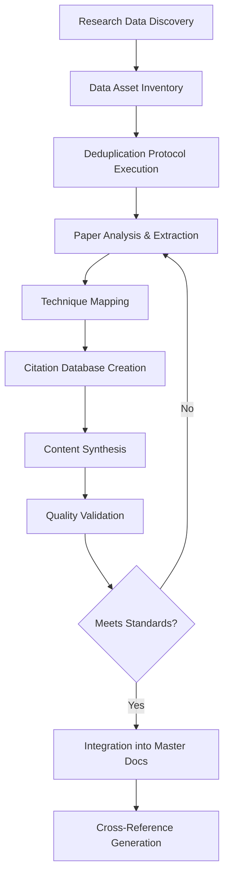
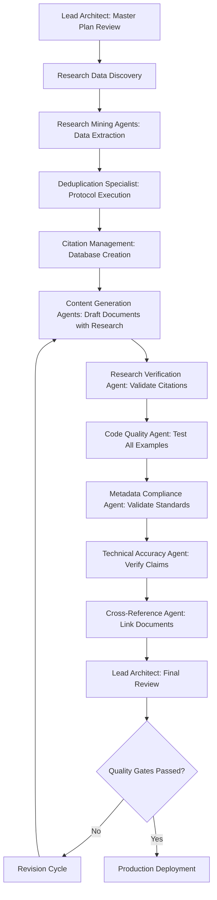

<prompt_instructions_claude_project_document_generator>
<thinking>
Below under the XML Tag `<project_brief_rough_draft>...</project_brief_rough_draft>` is a rough draft I have composed of the general instructions for the task of creating Master Documents Exemplar Series for use in uploading these documents for Claude projects to use with the RAG system in place within Claudes Architecture.
- I need you to *review this* and the *Exemplar File Tree* to gain the context needed to ensure that the instructions are clear and comprehensive, and that they cover all necessary aspects of the task.
- After your review design a Master Project Brief for me to present to Claude Code Agent in Charge to use to build the Master Exemplar Document Series for the Claude Projects, this brief should include a clear outline of the goals of the project, the specific requirements for the master documents, and any relevant information or guidelines that will help ensure the successful completion of the task.
- Please feel free to make any edits or additions to the instructions as you see fit, to ensure that they are as clear and detailed as possible for the agents that will be working on this task.
  - This Must include a clear outline of the Master Document Checklist for the Claude Code agent in charge to base its plans for generating the documents, you need to create this document checklist based on your knowledge of Document generation best practices, and the information in the exemplar folder, and the goals of the project. 
- This project brief should be comprehensive and cover all necessary steps and considerations for creating high-quality master documents for the Claude projects.
</thinking>
<prompt_instructions_claude_project_document_generator>

<analyze_for_context>
<project_brief_rough_draft>
# Task: Create Master Documents for Claude Projects based on Information in Exemplar Folder
I need you to review **all information** in the the folder `D:\10_pur3v4d3r's-vault\999-v4d3r\__exemplar`. 
    - **!IMPORTANT**There a lot of information so Context management will be key.
      - **TAKE GOOD NOTES** use the *System Memory* we previously set up.
      - Be sure you create a MASTER PLAN to ensure creation of the master documents for the Claude projects. 
      - The master documents **MUST** be ***comprehensive and cover all relevant techniques and processes in detail, providing clear instructions and guidance for the Claude projects in question***.
- The goal is to produce a *series* of master **EXEMPLAR documents** that can be stored in Claude projects and be called upon when interacting with the Claude Project, through the use of RAG.
  - Include best practices from Prompt Engineering and any other relevant techniques or processes that are outlined in the exemplar folder.
  - Feel free to add any documentation, templates, or anything else that you think would be of use to the Claude Projects or Claude when using the Master Exemplar Series.

- **!IMPORTANT**: The master documents should be designed to be easily accessible and usable within the Claude projects, providing clear and concise information that can be quickly referenced when needed. They should be organized in a way that allows users to easily find the information they need, with clear headings and sections for different topics or techniques.
- Use multiple agents from `D:\10_pur3v4d3r's-vault\.claude\agents` to accomplish this goal with the *up most care and attention to detail*.
- The documents must be completely production ready, enterprise level with any and all necessary code, templates,ETC that will be of use to the Claude Projects or Claude [or-any-LLM-in-general] when using the Master Exemplar Series. They and must contain adequate information for the Claude projects in question to perform any of the techniques or processes that are outlined in the documents.
- Use and *Agents found in* `D:\10_pur3v4d3r's-vault\.claude\agents` *to assist in the creation of the master documents series*, ensuring that they are **comprehensive, accurate, and well-structured**. 
  - **NOTE**: The agents can help with tasks such as **organizing information, generating content, and reviewing the documents for quality and consistency**.
    - Agents can also assist in ensuring that the documents adhere to the standards outlined in the gold standard files, particularly in terms of metadata handling and note structure.
  - **NOTE**: When using the agents, please ensure that you provide clear instructions and guidelines to ensure that the output meets the required standards for the master documents. Regularly review the output generated by the agents to ensure that it aligns with the goals of the project and make any necessary adjustments to the instructions as needed..
    - **NOTE**:The documents should be organized in a clear and logical manner, with headings and subheadings to facilitate easy navigation. Each document should include a table of contents, an introduction, detailed sections on the techniques or processes, and a conclusion summarizing the key points.
- **!IMPORTANT**: Please ensure that the documents are well-written, free of errors, and formatted consistently. Use clear language to convey the information effectively. Additionally, include any relevant examples, diagrams, or illustrations to enhance understanding.
- Once the documents are complete, please review them thoroughly to ensure that they meet the highest standards of quality and accuracy. Make any necessary revisions or improvements before finalizing the documents for storage in the Claude projects.
**!IMPORTANT**You must use the following files as **Gold standard for how metadata should be handled**:
  - `D:\10_pur3v4d3r's-vault\999-v4d3r\__exemplar\gold-standard-metadata-for-obsidian-and-dataview-top-of-note-metadata-v1.0.0.md`
  - `D:\10_pur3v4d3r's-vault\999-v4d3r\__exemplar\gold-standard-note-prompt-body-metadata-comments-structure-v1.0.0.md`
  - `D:\10_pur3v4d3r's-vault\999-v4d3r\__exemplar\master-yaml-techniques-exemplar.md`
- Please ensure that the master documents you create adhere to the standards outlined in the gold standard files, particularly in terms of metadata handling and note structure. This will ensure consistency and compatibility with the Claude projects.
- The master documents should be comprehensive and cover all relevant techniques and cover any missing/gap in knowledge not seen, and processes in detail, providing clear instructions and guidance for users of the Claude projects. They should serve as authoritative references that users can rely on for accurate and up-to-date information.
- Finally, once the master documents are finalized, please organize them in a way that makes them easily accessible within the Claude projects, such as categorizing them by topic or technique, and ensuring that they are properly linked to relevant sections of the projects for easy reference.

Please let me know if you have any questions or need further clarification on any aspect of this task. I am here to assist you in ensuring that the master documents are of the highest quality and meet all necessary standards for use in the Claude projects.
```

<exemplar_file_tree>

```exemplar_structure_file_tree
📁 __exemplar
⏱️  Generated in 12 ms
──────────────────────────────────────────────────
├── 📁 2026-01-07-exemplar-document-series
│   ├── 📝 doc1-complex-reasoning-solutions-architecture-v1.0.md
│   └── 📝 doc2-reliability-quality-assurance-framework-v1-0-0.md
├── 📁 advanced-prompt-engineering
│   ├── 📝 00-advanced-prompt-engineering-index.md
│   ├── 📝 01-reasoning-techniques-guide.md
│   ├── 📝 02-agentic-frameworks-guide.md
│   ├── 📝 03-meta-optimization-guide.md
│   ├── 📝 04-quality-assurance-guide.md
│   ├── 📝 05-knowledge-integration-guide.md
│   ├── 📝 06-integration-patterns-guide.md
│   ├── 📝 huggingface-report-tree-of-thoughts.md
│   ├── 📝 llm-survey-mega-resource-list-for-prompt-engineering-papers.md
│   ├── 📝 prompt-engineering-templates.md
│   ├── 📝 qrc-chain-of-verification.md
│   ├── 📝 qrc-rag.md
│   ├── 📝 qrc-self-consistency.md
│   ├── 📝 qrc-tree-of-thoughts.md
│   └── 📝 README.md
├── 📁 advanced-prompt-engineering-techniques
│   ├── 📁 images
│   │   └── 📝 readme.md
│   ├── 📝 Analogical_Prompting.md
│   ├── 📝 Chain_of_Draft_Prompting.md
│   ├── 📝 Chain_of_Symbol_Prompting.md
│   ├── 📝 Chain_of_Translation_Prompting.md
│   ├── 📝 Chain_of_Verification_Prompting.md
│   ├── 📝 Contrastive_CoT_Prompting.md
│   ├── 📝 Cross_Lingual_Prompting.md
│   ├── 📝 Faithful_Chain_of_Thought_Prompting.md
│   ├── 📝 Few_Shot_Chain-of_Thought_Prompting.md
│   ├── 📝 Least_to_Most_Prompting.md
│   ├── 📝 Meta_Cognitive_Prompting.md
│   ├── 📝 Meta_Prompting.md
│   ├── 📝 Multi_Chain_Reasoning_Prompting.md
│   ├── 📝 Plan_and_Solve_Prompting.md
│   ├── 📝 Program_of_Thoughts_Prompting.md
│   ├── 📝 Rephrase_and_Respond_Prompting.md
│   ├── 📝 Self_Ask_Prompting.md
│   ├── 📝 Self_Consistency_Prompting.md
│   ├── 📝 Self_Refine_Prompting.md
│   ├── 📝 Step_Back_Prompting.md
│   ├── 📝 Tabular_Chain_of_Thought_Prompting.md
│   ├── 📝 Thread_of_Thoughts_Prompting.md
│   ├── 📝 Universal_Self_Consistency_Prompting.md
│   └── 📝 Zero_Shot_CoT_Prompting.md
├── 📁 basic-prompt-engineering-techniques
│   ├── 📃 01_02_few-shot.txt
│   ├── 📃 01_02_zero-shot.txt
│   ├── 📃 01_03_few-shot-chain-of-thought.txt
│   ├── 📃 01_03_zero-plus-few-shot-chain-of-thought.txt
│   ├── 📃 01_03_zero-shot_chain-of-thought.txt
│   ├── 📃 01_04_deep-breath.txt
│   ├── 📃 01_05_generated_knowledge.txt
│   ├── 📃 01_06_tree-of-thought.txt
│   ├── 📃 01_07_directional-stimulus.txt
│   ├── 📃 01_08_chain-of-density.txt
│   ├── 📝 Batch_Prompting.md
│   ├── 📝 Emotion_Prompting.md
│   ├── 📝 few_shot_prompting.md
│   ├── 📝 Role_Prompting.md
│   └── 📝 Zero_Shot_Prompting.md
├── 📁 claude-reasoning-documentation-series
│   ├── 📝 00-SERIES-OVERVIEW-AND-USAGE-GUIDE.md
│   ├── 📝 claude-reasoning-documentation-series-master-plan.md
│   ├── 📝 doc1-llm-reasoning-techniques-operational-manual.md
│   ├── 📝 doc2-extended-thinking-architecture-implementation-guide.md
│   ├── 📝 doc3-advanced-reasoning-architectures-theory-to-practice.md
│   ├── 📝 doc4-agentic-workflow-design-patterns.md
│   ├── 📝 doc5-quick-reference-library.md
│   └── 📝 doc6-integration-patterns-cookbook.md
├── 📁 gold-standard-metadata-exemplar-package-and-agent
│   ├── 📝 gold-standard-metadata-for-obsidian-and-dataview-top-of-note-metadata-v1.0.0.md
│   ├── 📝 gold-standard-note-prompt-body-metadata-comments-structure-v1.0.0.md
│   ├── 📝 master-yaml-techniques-exemplar.md
│   ├── 📝 PKB_Metadata_Architect_USAGE_GUIDE.md
│   └── 📝 PKB_Metadata_Architect_v1.0.0.md
├── 📁 meta-in-context-learning-exemplar
│   ├── 📝 meta-icl-bibliography.md
│   ├── 📝 meta-icl-exploration-trace.md
│   ├── 📝 meta-icl-quick-start-guide.md
│   └── 📝 meta-in-context-learning-exemplar.md
├── 📁 prompt-engineering-specialist-package
│   ├── 📝 AGENT_prompt-engineering-specialist.md
│   ├── 📝 COMMAND_ai-assistant.md
│   ├── 📝 COMMAND_langchain-agent.md
│   ├── 📝 COMMAND_prompt-optimize.md
│   ├── 📝 EXEMPLAR_chain-of-thought.md
│   ├── 🗒️ EXEMPLAR_few-shot-examples.json
│   ├── 📝 EXEMPLAR_few-shot-learning.md
│   ├── 📝 EXEMPLAR_prompt-optimization.md
│   ├── 📝 EXEMPLAR_prompt-template-library.md
│   ├── 📝 EXEMPLAR_prompt-templates.md
│   ├── 🐍 SCRIPT_optimize-prompt.py
│   ├── 📝 SKILL_embedding-strategies.md
│   ├── 📝 SKILL_hybrid-search-implementation.md
│   ├── 📝 SKILL_langchain-architecture.md
│   ├── 📝 SKILL_llm-evaluation.md
│   ├── 📝 SKILL_prompt-engineering-patterns.md
│   ├── 📝 SKILL_rag-implementation.md
│   ├── 📝 SKILL_similarity-search-patterns.md
│   ├── 📝 SKILL_vector-index-tuning.md
│   └── 📝 system-prompts.md
├── 📁 research-papers-pdfs-converted-to-markdown
│   ├── 🗒️ prompt-patterns_meta.json
│   └── 📝 prompt-patterns.md
├── 📁 the-prompt-report-main
│   └── 📁 data
│       ├── 📁 topic-gpt-data
│       │   ├── 📁 prompt
│       │   │   ├── 📃 generation_1.txt
│       │   │   └── 📝 seed_1.md
│       │   ├── 📄 generation_1_paper.jsonl
│       │   ├── 📝 master_paper_organized.md
│       │   ├── 📝 master_paper_removed.md
│       │   ├── 📝 master_paper.md
│       │   └── 📄 master_papers.jsonl
│       ├── 📁 topic-model-data
│       │   ├── 📁 sample-outputs
│       │   │   ├── 📁 detected-phrases
│       │   │   │   ├── 🗒️ params.json
│       │   │   │   └── 🗒️ phrases.json
│       │   │   ├── 📁 processed
│       │   │   │   ├── 🗒️ params.json
│       │   │   │   └── 📄 train.metadata.jsonl
│       │   │   ├── 🌐 topic_outputs-10.html
│       │   │   ├── 🌐 topic_outputs-25.html
│       │   │   └── 🌐 topic_outputs-50.html
│       │   └── 📃 stopwords.txt
│       ├── 📄 arxiv_papers_for_human_review.csv
│       ├── 📄 arxiv_papers_with_abstract.csv
│       ├── 📄 blacklist.csv
│       ├── 🗒️ cleaned_complete_paper_references.json
│       ├── 🗒️ cleaned_merged_paper_references.json
│       ├── 🗒️ mmlu_configs.json
│       └── 🗒️ prompts.json
├── 📝 graph-of-thoughts-exemplar.md
├── 📝 MASTER-EXEMPLAR-INVENTORY-AND-PRODUCTION-ROADMAP.md
├── 📝 MASTER-EXEMPLAR-INVENTORY.md
├── 📝 MULTI-AGENT-ORCHESTRATION-PLAN.md
├── 📝 prompt-report-claudes-advanced-tag-and-reasoning.md
├── 📝 prompt-report-prompt-orchestration-architectures.md
├── 📝 prompt-report-tree-of-thoughts.md
├── 📝 qrc-brainstorming-system.md
├── 📝 thinking-tag-reasoing-framework-templates-202501071933.md
└── 📝 tree-of-thoughts-system-claude-reasoning.md
```
</exemplar_file_tree>
</project_brief_rough_draft>
</analyze_for_context>>


# MASTER PROJECT BRIEF: Claude Projects Exemplar Document Series
## Production-Grade Knowledge Architecture for Advanced LLM Operations
### **FINAL VERSION 2.0 - Updated with Research Data Integration Protocol**

---

## 📋 EXECUTIVE SUMMARY

**Project Objective:** Create a comprehensive, production-ready Master Exemplar Document Series for Claude Projects that serves as the authoritative knowledge base for advanced LLM reasoning techniques, prompt engineering methodologies, and agentic workflow patterns. These documents will be accessed via Claude's RAG system to provide context-aware guidance during project interactions.

**Critical Update:** The project now includes systematic analysis and integration of research data from `the-prompt-report-main/data/` directory, containing academic papers, topic models, and empirical research that must be mined for extractable insights, deduplicated, and synthesized into the master documents with proper attribution.

**Target Outcome:** A structured series of 15-20 master documents covering the complete spectrum of advanced LLM techniques, each meeting enterprise-level quality standards with complete implementation code, templates, operational guidance, and research-backed theoretical foundations.

**Success Criteria:**
- ✅ 100% coverage of techniques in exemplar folder
- ✅ All documents production-ready with working code examples
- ✅ Metadata compliance with gold standard specifications
- ✅ RAG-optimized structure for efficient retrieval
- ✅ Research data systematically analyzed and integrated
- ✅ Zero knowledge gaps in critical technique coverage
- ✅ Deduplication protocol executed across all sources
- ✅ Proper academic citation for all research-derived content

---

## 🔬 RESEARCH DATA INTEGRATION PROTOCOL

### Research Data Inventory

**Primary Research Repository:** `D:\10_pur3v4d3r's-vault\999-v4d3r\__exemplar\the-prompt-report-main\data`

#### **Data Assets Requiring Analysis:**

**1. Academic Paper Collections**
- 📄 `arxiv_papers_for_human_review.csv` - Curated papers requiring analysis
- 📄 `arxiv_papers_with_abstract.csv` - Papers with abstracts for quick assessment
- 🗒️ `cleaned_complete_paper_references.json` - Comprehensive paper reference database
- 🗒️ `cleaned_merged_paper_references.json` - Merged references (potential duplicates)
- 📄 `generation_1_paper.jsonl` - Generated/synthesized paper data
- 📄 `master_papers.jsonl` - Master list of papers (likely most comprehensive)

**2. Topic Modeling Data**
- 🌐 `topic_outputs-10.html` - 10-topic model visualization
- 🌐 `topic_outputs-25.html` - 25-topic model visualization
- 🌐 `topic_outputs-50.html` - 50-topic model visualization
- 🗒️ `phrases.json` - Detected key phrases
- 📄 `train.metadata.jsonl` - Training metadata for topic models

**3. Configuration and Prompts**
- 🗒️ `mmlu_configs.json` - MMLU benchmark configurations
- 🗒️ `prompts.json` - Prompt collection for analysis
- 📄 `blacklist.csv` - Papers/content to exclude

**4. Markdown Summaries**
- 📝 `master_paper.md` - Comprehensive paper summary
- 📝 `master_paper_organized.md` - Organized version
- 📝 `master_paper_removed.md` - Filtered version

### Deduplication Strategy

**Three-Tier Deduplication Protocol:**

**Tier 1: Intra-Source Deduplication**
```python
# Deduplicate within each data source
- Compare paper titles, DOIs, arXiv IDs
- Merge duplicate entries with most complete metadata
- Flag variants (preprint vs. published)
- Priority: master_papers.jsonl > cleaned_complete > cleaned_merged
```

**Tier 2: Cross-Source Deduplication**
```python
# Deduplicate across exemplar folder
- Compare with existing markdown documents
- Identify technique overlap between sources
- Consolidate redundant explanations
- Preserve unique perspectives
```

**Tier 3: Content-Level Deduplication**
```python
# Deduplicate at concept/technique level
- Semantic similarity detection
- Technique name normalization
- Consolidate multiple descriptions of same method
- Create canonical definitions with variants noted
```

### Research Data Processing Workflow



---

## 🎯 PROJECT GOALS (UPDATED)

### Primary Goals

1. **Comprehensive Knowledge Capture**
   - Document ALL techniques from exemplar folder with zero omissions
   - **NEW:** Extract and integrate insights from research paper database
   - **NEW:** Synthesize academic foundations with practical implementations
   - Synthesize fragmented knowledge into coherent master documents
   - Fill identified knowledge gaps with research-backed content
   - Create interconnected knowledge graph through strategic wiki-linking

2. **Research-Backed Content**
   - **NEW:** Mine `the-prompt-report-main/data/` for empirical evidence
   - **NEW:** Map research papers to specific techniques
   - **NEW:** Include performance benchmarks from academic literature
   - **NEW:** Cite theoretical foundations with proper attribution
   - **NEW:** Create comprehensive bibliography with DOI/arXiv links

3. **Production Readiness**
   - Include complete, tested code implementations
   - Provide ready-to-use templates and patterns
   - Embed troubleshooting guides and debugging protocols
   - Deliver enterprise-grade quality assurance frameworks

4. **RAG Optimization**
   - Structure documents for optimal semantic retrieval
   - Use consistent terminology and concept anchoring
   - Implement strategic chunking for context window efficiency
   - Enable precise query-to-content matching

5. **Operational Excellence**
   - Establish clear usage protocols and decision frameworks
   - Define integration patterns with existing infrastructure
   - Provide deployment guidance and scaling strategies
   - Include monitoring and observability frameworks

---

## 📊 MASTER DOCUMENT CHECKLIST (UPDATED)

### Document Series Structure (15-20 Documents)

#### **TIER 1: FOUNDATIONAL ARCHITECTURE (4 Documents)**

**DOC-01: LLM Reasoning Techniques - Operational Manual**
- ✅ Status: EXISTS (`doc1-llm-reasoning-techniques-operational-manual.md`)
- 📝 Action: REVIEW, UPDATE, STANDARDIZE, **INTEGRATE RESEARCH DATA**
- 🎯 Coverage: Chain-of-Thought, Zero-Shot, Few-Shot, Self-Consistency
- 🔧 Requirements:
  - [ ] **NEW:** Cite foundational papers from master_papers.jsonl
  - [ ] **NEW:** Include empirical performance data from research
  - [ ] Code examples in Python, JavaScript, TypeScript
  - [ ] Comparative performance benchmarks
  - [ ] Decision trees for technique selection
  - [ ] Template library (minimum 10 templates per technique)
  - [ ] **NEW:** Research synthesis section with academic context

**DOC-02: Extended Thinking Architecture - Implementation Guide**
- ✅ Status: EXISTS (`doc2-extended-thinking-architecture-implementation-guide.md`)
- 📝 Action: REVIEW, UPDATE, STANDARDIZE, **INTEGRATE RESEARCH DATA**
- 🎯 Coverage: Thinking tags, metacognitive scaffolding, validation protocols
- 🔧 Requirements:
  - [ ] **NEW:** Theoretical foundations from cognitive science literature
  - [ ] API integration patterns for all major providers
  - [ ] Thinking mode configuration guide
  - [ ] Performance vs. cost trade-off analysis
  - [ ] Production deployment patterns
  - [ ] **NEW:** Research-backed best practices

**DOC-03: Advanced Reasoning Architectures - Theory to Practice**
- ✅ Status: EXISTS (`doc3-advanced-reasoning-architectures-theory-to-practice.md`)
- 📝 Action: REVIEW, UPDATE, STANDARDIZE, **INTEGRATE RESEARCH DATA**
- 🎯 Coverage: Tree-of-Thoughts, Graph-of-Thoughts, Self-Refinement, Meta-Prompting
- 🔧 Requirements:
  - [ ] **NEW:** Original research papers cited for each architecture
  - [ ] Full implementation code for each architecture
  - [ ] Complexity analysis and resource requirements
  - [ ] Use case mapping and selection criteria
  - [ ] Hybrid architecture patterns
  - [ ] **NEW:** Benchmark results from academic evaluations

**DOC-04: Agentic Workflow Design Patterns**
- ✅ Status: EXISTS (`doc4-agentic-workflow-design-patterns.md`)
- 📝 Action: REVIEW, UPDATE, STANDARDIZE, **INTEGRATE RESEARCH DATA**
- 🎯 Coverage: ReAct, Plan-and-Execute, Multi-agent orchestration
- 🔧 Requirements:
  - [ ] **NEW:** Research synthesis on agentic frameworks
  - [ ] Complete workflow orchestration code
  - [ ] State management patterns
  - [ ] Error handling and recovery protocols
  - [ ] Observability and debugging frameworks
  - [ ] **NEW:** Comparative analysis from literature

---

#### **TIER 2: ADVANCED TECHNIQUES LIBRARY (6-8 Documents)**

**DOC-05: Chain-Based Reasoning Techniques - Complete Reference**
- 📝 Status: CREATE NEW (Consolidate from `advanced-prompt-engineering-techniques/` + **RESEARCH DATA**)
- 🎯 Coverage: All chain-of-X techniques
  - Chain of Verification
  - Chain of Density
  - Chain of Symbol
  - Chain of Translation
  - Chain of Draft
  - Faithful Chain-of-Thought
  - Tabular Chain-of-Thought
  - Multi-Chain Reasoning
- 🔧 Requirements:
  - [ ] **NEW:** Mine research papers for each technique
  - [ ] **NEW:** Extract performance benchmarks from papers
  - [ ] Unified implementation framework
  - [ ] Technique comparison matrix with research data
  - [ ] Chaining strategies and composition patterns
  - [ ] Performance benchmarking results (academic + practical)
  - [ ] **NEW:** Citation to original papers proposing each technique

**DOC-06: Self-Optimization Techniques - Meta-Learning Guide**
- 📝 Status: CREATE NEW (Synthesize from multiple sources + **RESEARCH DATA**)
- 🎯 Coverage:
  - Self-Consistency
  - Self-Refine
  - Self-Ask
  - Meta-Cognitive Prompting
  - Meta-Prompting
  - Reflexion
  - Universal Self-Consistency
- 🔧 Requirements:
  - [ ] **NEW:** Research survey of meta-learning approaches
  - [ ] **NEW:** Theoretical foundations from ML literature
  - [ ] Meta-learning implementation patterns
  - [ ] Iterative improvement protocols
  - [ ] Quality convergence analysis (with research data)
  - [ ] Automated optimization frameworks
  - [ ] **NEW:** Case studies from academic papers

**DOC-07: Specialized Prompting Strategies**
- 📝 Status: CREATE NEW (Consolidate from basic/advanced folders + **RESEARCH DATA**)
- 🎯 Coverage:
  - Role Prompting
  - Emotion Prompting
  - Analogical Prompting
  - Contrastive CoT
  - Step-Back Prompting
  - Rephrase and Respond
  - Directional Stimulus
- 🔧 Requirements:
  - [ ] **NEW:** Psychological/cognitive foundations from research
  - [ ] **NEW:** Effectiveness studies from literature
  - [ ] Effectiveness analysis by domain
  - [ ] Combination strategies
  - [ ] A/B testing protocols
  - [ ] **NEW:** Meta-analysis of research findings

**DOC-08: Cross-Lingual and Translation Techniques**
- 📝 Status: CREATE NEW (**PRIMARY SOURCE: RESEARCH DATA**)
- 🎯 Coverage:
  - Cross-Lingual Prompting
  - Chain of Translation
  - Multilingual reasoning strategies
- 🔧 Requirements:
  - [ ] **NEW:** NLP research on multilingual models
  - [ ] **NEW:** Translation quality metrics from literature
  - [ ] Language-specific optimizations
  - [ ] Cultural context handling
  - [ ] Fallback strategies
  - [ ] **NEW:** Benchmark results across languages

**DOC-09: Structured Reasoning Frameworks**
- 📝 Status: CREATE NEW (**RESEARCH DATA INTEGRATION**)
- 🎯 Coverage:
  - Least-to-Most Prompting
  - Plan and Solve
  - Program of Thoughts
  - Thread of Thoughts
  - Tabular reasoning
- 🔧 Requirements:
  - [ ] **NEW:** Research papers introducing each framework
  - [ ] **NEW:** Comparative evaluations from literature
  - [ ] Step-by-step decomposition methodologies
  - [ ] Planning vs. execution separation
  - [ ] Code generation integration
  - [ ] Debugging and error recovery
  - [ ] **NEW:** Performance data from academic benchmarks

**DOC-10: Tree and Graph-Based Reasoning - Deep Dive**
- 📝 Status: CREATE NEW (Expand existing exemplars + **RESEARCH DATA**)
- 🎯 Coverage:
  - Tree-of-Thoughts (comprehensive)
  - Graph-of-Thoughts (comprehensive)
  - Search strategies (BFS, DFS, A*)
  - Node evaluation and pruning
- 🔧 Requirements:
  - [ ] **NEW:** Original ToT/GoT papers fully integrated
  - [ ] **NEW:** Search algorithm theory from CS literature
  - [ ] Complete algorithmic implementations
  - [ ] Visualization tools and debugging aids
  - [ ] Resource optimization strategies
  - [ ] Benchmark comparisons (academic + practical)
  - [ ] **NEW:** Research-backed optimization strategies

---

#### **TIER 3: IMPLEMENTATION & INTEGRATION (4-5 Documents)**

**DOC-11: Integration Patterns Cookbook**
- ✅ Status: EXISTS (`doc6-integration-patterns-cookbook.md`)
- 📝 Action: REVIEW, EXPAND, STANDARDIZE, **ADD RESEARCH CONTEXT**
- 🎯 Coverage: Real-world integration patterns
- 🔧 Requirements:
  - [ ] LangChain integration patterns
  - [ ] LlamaIndex integration patterns
  - [ ] Custom framework examples
  - [ ] API gateway patterns
  - [ ] **NEW:** Research on integration architectures

**DOC-12: RAG Implementation - Complete Guide**
- 📝 Status: CREATE NEW (Expand from `SKILL_rag-implementation.md` + **RESEARCH DATA**)
- 🎯 Coverage:
  - Vector database selection and tuning
  - Embedding strategies
  - Chunking methodologies
  - Hybrid search (keyword + semantic)
  - Query optimization
  - Retrieval evaluation
- 🔧 Requirements:
  - [ ] **NEW:** RAG research papers (RAG, RAG++, etc.)
  - [ ] **NEW:** Benchmark results from MMLU configs
  - [ ] Complete RAG pipeline code
  - [ ] Performance benchmarking framework
  - [ ] Multi-index strategies
  - [ ] Failure mode analysis and mitigation
  - [ ] **NEW:** Research-backed best practices

**DOC-13: Prompt Optimization - Systematic Approaches**
- 📝 Status: CREATE NEW (Consolidate + **PROMPTS.JSON ANALYSIS**)
- 🎯 Coverage:
  - Automated prompt optimization
  - A/B testing frameworks
  - Evolutionary prompt engineering
  - DSPy integration
  - Performance metrics and evaluation
- 🔧 Requirements:
  - [ ] **NEW:** Analysis of prompts.json for patterns
  - [ ] **NEW:** Research on automatic prompt optimization
  - [ ] Optimization algorithm implementations
  - [ ] Test harness code
  - [ ] Metric tracking dashboards
  - [ ] Continuous improvement protocols

**DOC-14: LLM Evaluation and Quality Assurance**
- 📝 Status: CREATE NEW (Expand from QA guide + **MMLU_CONFIGS.JSON**)
- 🎯 Coverage:
  - Evaluation metrics
  - Benchmark suites (MMLU, GSM8K, HotpotQA, etc.)
  - Quality gates and validation protocols
  - Regression testing
  - Production monitoring
- 🔧 Requirements:
  - [ ] **NEW:** Integrate MMLU configuration data
  - [ ] **NEW:** Research on evaluation methodologies
  - [ ] Complete evaluation framework code
  - [ ] Benchmark datasets and runners
  - [ ] Alerting and monitoring setup
  - [ ] Incident response playbooks
  - [ ] **NEW:** Academic evaluation standards

**DOC-15: Production Deployment Architecture**
- 📝 Status: CREATE NEW
- 🎯 Coverage:
  - Infrastructure patterns
  - Scaling strategies
  - Cost optimization
  - Observability and monitoring
  - Security and compliance
  - Disaster recovery
- 🔧 Requirements:
  - [ ] Reference architectures (AWS, Azure, GCP)
  - [ ] Terraform/CDK examples
  - [ ] Monitoring dashboards (Grafana, Datadog)
  - [ ] Cost analysis tools
  - [ ] **NEW:** Research on production LLM systems

---

#### **TIER 4: REFERENCE & QUICK GUIDES (3-4 Documents)**

**DOC-16: Quick Reference Library**
- ✅ Status: EXISTS (`doc5-quick-reference-library.md`)
- 📝 Action: REVIEW, EXPAND, STANDARDIZE
- 🎯 Coverage: Rapid lookup for all techniques
- 🔧 Requirements:
  - [ ] One-page summaries for each technique
  - [ ] Decision trees and flowcharts
  - [ ] Cheat sheets and command references
  - [ ] Troubleshooting quick guides
  - [ ] **NEW:** Research paper quick links

**DOC-17: Template and Pattern Library**
- 📝 Status: CREATE NEW (Consolidate + **PROMPTS.JSON**)
- 🎯 Coverage:
  - Production-ready prompt templates
  - Code generation templates
  - Analysis and evaluation templates
  - Multi-agent orchestration templates
- 🔧 Requirements:
  - [ ] **NEW:** Extract templates from prompts.json
  - [ ] 50+ categorized templates
  - [ ] Parameterization guidelines
  - [ ] Customization examples
  - [ ] Quality benchmarks per template
  - [ ] **NEW:** Research-derived template patterns

**DOC-18: Meta-Learning and In-Context Learning Guide**
- ✅ Status: EXISTS (`meta-in-context-learning-exemplar.md`)
- 📝 Action: REVIEW, EXPAND, STANDARDIZE, **INTEGRATE RESEARCH**
- 🎯 Coverage: In-context learning strategies
- 🔧 Requirements:
  - [ ] **NEW:** ICL research synthesis
  - [ ] Example selection algorithms
  - [ ] Few-shot optimization
  - [ ] Meta-ICL implementation
  - [ ] Performance analysis
  - [ ] **NEW:** Academic benchmarks

**DOC-19: Research Compendium - Academic Foundations**
- 📝 Status: **NEW DOCUMENT - PRIMARY RESEARCH DATA OUTPUT**
- 🎯 Coverage:
  - Comprehensive bibliography of all papers
  - Topic model visualizations (10/25/50 topics)
  - Research trends and evolution
  - Key researchers and institutions
  - Emerging techniques from recent papers
  - Cross-reference to master documents
- 🔧 Requirements:
  - [ ] Complete bibliography from master_papers.jsonl
  - [ ] Topic model integration and interpretation
  - [ ] Research timeline and evolution
  - [ ] Key paper summaries
  - [ ] Research gap analysis
  - [ ] Future directions from literature

---

#### **TIER 5: SPECIALIZED TOPICS (Optional 2-3 Documents)**

**DOC-20: Multi-Modal Reasoning (If Applicable)**
- 📝 Status: EVALUATE NECESSITY (**CHECK RESEARCH DATA**)
- 🎯 Coverage: Vision-language models, multimodal prompting

**DOC-21: Domain-Specific Optimization Guide**
- 📝 Status: EVALUATE NECESSITY (**CHECK RESEARCH DATA**)
- 🎯 Coverage: Code generation, mathematics, creative writing, etc.

---

## 🤖 AGENT ORCHESTRATION PLAN (UPDATED)

### Agent Roles and Responsibilities

**🎯 Lead Architect Agent** (Claude Code Agent in Charge)
- Overall project coordination
- Quality assurance across all documents
- Cross-document consistency verification
- Final review and approval
- **NEW:** Research data integration oversight
- **NEW:** Deduplication protocol enforcement

**🔬 Research Data Analysis Team** (**NEW**)

**Research Mining Agent Alpha** 
- **Primary Focus:** JSON/JSONL data analysis
  - Parse master_papers.jsonl
  - Extract paper metadata, abstracts, techniques
  - Create paper-to-technique mapping database
  - Identify key papers for each technique
  - Generate citation database with DOI/arXiv links
- **Output:** Structured database of papers mapped to techniques

**Research Mining Agent Beta**
- **Primary Focus:** Topic model and HTML analysis
  - Analyze topic_outputs-10/25/50.html
  - Extract topic clusters and themes
  - Map topics to technique categories
  - Identify research trends and gaps
  - Create topic-to-document mapping
- **Output:** Topic taxonomy and research trend report

**Deduplication Specialist Agent**
- Execute three-tier deduplication protocol
- Cross-reference papers across data sources
- Identify duplicate techniques across exemplars
- Consolidate redundant content
- Create canonical definitions
- Flag conflicts requiring human review
- **Output:** Deduplicated content database

**Citation Management Agent**
- Create BibTeX/citation database
- Verify DOIs and arXiv IDs
- Format citations consistently
- Generate bibliography sections
- Create cross-reference links
- **Output:** Master citation database and formatting system

**📝 Content Generation Agents** (Specialized by Tier)
- **Tier 1 Agent**: Foundational architecture documents + research integration
- **Tier 2 Agent**: Advanced techniques library + research extraction
- **Tier 3 Agent**: Implementation and integration + research context
- **Tier 4 Agent**: Reference and quick guides + research compendium

**🔍 Review and Validation Agents**
- **Metadata Compliance Agent**: Ensures gold standard adherence
- **Code Quality Agent**: Tests all code examples
- **Technical Accuracy Agent**: Validates claims and benchmarks
- **Cross-Reference Agent**: Verifies wiki-links and connections
- **NEW: Research Verification Agent**: Validates citations and academic claims

**🔧 Specialized Support Agents**
- **Template Generation Agent**: Creates reusable templates (+ prompts.json)
- **Diagram and Visualization Agent**: Produces flowcharts and diagrams
- **Bibliography Agent**: Manages citations and references (integrated with Citation Management Agent)
- **Integration Testing Agent**: Validates cross-document functionality

### Updated Workflow Protocol



---

## 📋 RESEARCH DATA PROCESSING PLAN

### Phase 0: Research Data Mining (NEW - Week 0)

**Step 1: Data Asset Inventory and Validation**
```bash
# Lead Architect + Research Mining Agent Alpha
cd D:\10_pur3v4d3r's-vault\999-v4d3r\__exemplar\the-prompt-report-main\data

# Inventory all data files
- Count papers in master_papers.jsonl
- Validate JSON/JSONL structure
- Check for missing fields
- Assess data quality

# Expected Output: Data inventory report
```

**Step 2: Paper Extraction and Mapping**
```python
# Research Mining Agent Alpha
# Parse master_papers.jsonl
papers = load_jsonl('master_papers.jsonl')

# Extract key information:
for paper in papers:
    - Title
    - Authors
    - Abstract
    - Techniques mentioned
    - DOI/arXiv ID
    - Publication venue
    - Year
    - Key findings

# Create paper-to-technique mapping
technique_map = {
    'chain-of-thought': [paper1, paper5, paper12, ...],
    'tree-of-thoughts': [paper3, paper9, ...],
    # ...
}

# Output: paper_database.json
```

**Step 3: Topic Model Analysis**
```python
# Research Mining Agent Beta
# Analyze topic visualizations
topics_10 = parse_html('topic_outputs-10.html')
topics_25 = parse_html('topic_outputs-25.html')
topics_50 = parse_html('topic_outputs-50.html')

# Extract topic clusters
# Map topics to technique categories
# Identify research trends
# Generate topic taxonomy

# Output: topic_taxonomy.json
```

**Step 4: Deduplication Execution**
```python
# Deduplication Specialist Agent

# Tier 1: Intra-source deduplication
deduplicated_papers = deduplicate_by_doi_arxiv(
    master_papers,
    cleaned_complete,
    cleaned_merged
)

# Tier 2: Cross-source deduplication
unique_techniques = consolidate_across_sources(
    exemplar_docs,
    research_papers
)

# Tier 3: Content-level deduplication
canonical_definitions = create_canonical_definitions(
    unique_techniques
)

# Output: deduplicated_content.json
```

**Step 5: Citation Database Creation**
```python
# Citation Management Agent

# Create master citation database
citations = {
    'paper_id': {
        'title': '...',
        'authors': ['...'],
        'year': 2023,
        'venue': '...',
        'doi': '...',
        'arxiv': '...',
        'bibtex': '...',
        'cited_in': ['doc1', 'doc3', ...]
    }
}

# Generate BibTeX entries
# Format citations consistently
# Create cross-reference system

# Output: master_citations.bib
```

**Step 6: Research Synthesis Reports**
```markdown
# All Research Agents

# Generate synthesis reports for each major technique:
## Chain-of-Thought Research Synthesis
- Foundational papers: [list]
- Key findings: [summary]
- Performance benchmarks: [data]
- Evolution timeline: [history]
- Current state: [analysis]
- Future directions: [predictions]

# Output: research_synthesis/ directory with reports
```

---

## ✅ VALIDATION CRITERIA (UPDATED)

### Document-Level Quality Gates

**Gate 1: Structural Completeness**
- [ ] All required sections present
- [ ] YAML frontmatter complete and valid
- [ ] Table of contents accurate and deep-linked
- [ ] Minimum word count achieved
- [ ] Proper heading hierarchy (H1 → H2 → H3)

**Gate 2: Metadata Compliance**
- [ ] ≥15 inline metadata fields
- [ ] ≥20 wiki-links to related content
- [ ] ≥8 semantic callouts
- [ ] All tags from controlled vocabulary
- [ ] Version and date stamps current

**Gate 3: Technical Quality**
- [ ] All code examples tested and functional
- [ ] Dependencies listed with versions
- [ ] Performance benchmarks included
- [ ] Error handling demonstrated
- [ ] Edge cases addressed

**Gate 4: Content Depth**
- [ ] Layer 1 (Foundational) complete
- [ ] Layer 2 (Enrichment) complete
- [ ] Layer 3 (Integration) complete
- [ ] Layer 4 (Advanced) included when appropriate
- [ ] No placeholder or "TODO" content

**Gate 5: Cross-Document Integration**
- [ ] Related documents linked
- [ ] Prerequisites clearly stated
- [ ] Redundancy minimized
- [ ] Terminology consistent across series
- [ ] Navigation pathways clear

**Gate 6: Research Integration** (**NEW**)
- [ ] **All claims cite appropriate research papers**
- [ ] **Bibliography section complete with proper citations**
- [ ] **Research synthesis sections included**
- [ ] **Performance data sourced from academic benchmarks**
- [ ] **Theoretical foundations properly attributed**
- [ ] **No plagiarism or improper paraphrasing**
- [ ] **DOI/arXiv links functional**
- [ ] **Citation format consistent throughout**

### Series-Level Quality Gates

**Gate 7: Comprehensive Coverage**
- [ ] All techniques from exemplar folder documented
- [ ] **NEW: All relevant papers from research data integrated**
- [ ] No knowledge gaps identified
- [ ] Progression from basic to advanced clear
- [ ] Use case coverage complete

**Gate 8: Research Data Utilization** (**NEW**)
- [ ] **master_papers.jsonl fully analyzed**
- [ ] **Topic models integrated into research compendium**
- [ ] **prompts.json patterns extracted**
- [ ] **MMLU configs utilized in evaluation doc**
- [ ] **All data sources in /data/ directory processed**
- [ ] **Deduplication protocol executed successfully**
- [ ] **No duplicate content across documents**

**Gate 9: RAG Optimization**
- [ ] Semantic chunking appropriate
- [ ] Query-to-content mapping verified
- [ ] Retrieval testing passed
- [ ] Context window efficiency confirmed

**Gate 10: Production Readiness**
- [ ] All templates tested
- [ ] All code deployed and verified
- [ ] Integration patterns validated
- [ ] Documentation complete for deployment

---

## 📅 EXECUTION TIMELINE (UPDATED)

### Phase 0: Research Data Mining (Week 0 - NEW)
**Days 1-2: Data Inventory and Setup**
- Research Mining Agents Alpha & Beta: Complete data inventory
- Validate JSON/JSONL files
- Set up citation database structure
- Create deduplication tracking system

**Days 3-4: Paper Extraction**
- Research Mining Agent Alpha: Parse master_papers.jsonl
- Extract paper metadata and abstracts
- Create paper-to-technique mapping
- Begin citation database population

**Days 5-6: Topic Analysis and Deduplication**
- Research Mining Agent Beta: Analyze topic models
- Deduplication Specialist: Execute three-tier protocol
- Generate deduplicated content database
- Create canonical definitions

**Day 7: Research Synthesis Preparation**
- Citation Management Agent: Complete citation database
- Generate research synthesis reports
- Create technique-to-paper reference guide
- **Deliverable:** Research data package ready for integration

### Phase 1: Foundation (Week 1)
- Review and standardize existing Tier 1 documents
- **NEW:** Integrate research data into Tier 1 docs
- Create master document templates
- Establish metadata standards
- Set up quality validation framework

### Phase 2: Advanced Techniques (Week 2-3)
- Generate Tier 2 documents (advanced techniques)
- **NEW:** Heavy research integration from paper database
- Implement all code examples
- Create technique comparison matrices
- Develop benchmarking frameworks with research data

### Phase 3: Implementation (Week 4)
- Generate Tier 3 documents (integration)
- **NEW:** Integrate research on RAG, optimization, evaluation
- Validate all integration patterns
- Create deployment guides
- Build monitoring frameworks

### Phase 4: Reference Materials (Week 5)
- Generate Tier 4 documents (quick references)
- **NEW:** Create comprehensive research compendium (Doc-19)
- Create template library with prompts.json patterns
- Build decision tree tools
- Develop troubleshooting guides

### Phase 5: Quality Assurance (Week 6)
- Execute all quality gates (including new research gates)
- **NEW:** Research verification pass
- Cross-document validation
- RAG retrieval testing
- Citation verification
- Final review and approval

---

## 🎯 SUCCESS METRICS (UPDATED)

### Quantitative Metrics
- **Coverage**: 100% of techniques from exemplar folder
- **Research Integration**: 100% of papers in master_papers.jsonl analyzed
- **Code Quality**: 100% of examples tested and functional
- **Metadata Compliance**: ≥95% adherence to gold standard
- **Citation Accuracy**: 100% of citations verified and functional
- **Deduplication**: <5% redundant content across series
- **Retrieval Accuracy**: ≥90% relevant retrieval in RAG testing
- **Word Count**: Average 4,000+ words per major document

### Qualitative Metrics
- **Research Foundation**: Every technique has academic grounding
- **Usability**: Clear navigation and information architecture
- **Comprehensiveness**: No follow-up questions needed for implementation
- **Integration**: Seamless connections between documents and research
- **Production-Readiness**: Can be deployed immediately without modification
- **Academic Rigor**: Properly cited and attributed throughout

---

## 📦 DELIVERABLES (UPDATED)

### Primary Deliverables
1. ✅ **15-20 Master Exemplar Documents** (production-ready, research-integrated)
2. ✅ **Comprehensive Template Library** (50+ templates including prompts.json)
3. ✅ **Code Repository** (all examples tested and documented)
4. ✅ **Integration Testing Suite** (validation framework)
5. ✅ **Quick Reference Guide** (consolidated cheat sheet)
6. ✅ **NEW: Research Compendium** (Doc-19 with full bibliography)
7. ✅ **NEW: Citation Database** (master_citations.bib + metadata)
8. ✅ **NEW: Paper-to-Technique Mapping** (navigation tool)

### Supporting Deliverables
1. **Master Document Index** (navigation guide)
2. **Technique Selection Decision Tree** (interactive tool)
3. **Benchmark Results Database** (performance comparisons from research)
4. **Deployment Playbook** (step-by-step guide)
5. **Maintenance Protocol** (update procedures)
6. **NEW: Research Data Analysis Reports** (from Phase 0)
7. **NEW: Deduplication Audit Trail** (verification records)
8. **NEW: Topic Taxonomy Visualization** (research trends)

---

## 🚀 GETTING STARTED

### For Lead Architect Agent (Claude Code)

**Pre-Phase: Research Data Assessment**
```bash
# CRITICAL FIRST STEP
cd D:\10_pur3v4d3r's-vault\999-v4d3r\__exemplar\the-prompt-report-main\data

# Assess data assets
echo "Counting papers in master_papers.jsonl..."
# Validate file integrity
# Create initial inventory

# Review existing markdown summaries
cat master_paper.md
cat master_paper_organized.md

# Check for already-processed insights
```

**Step 1: Environment Setup**
```bash
# Review all files in exemplar folder
cd D:\10_pur3v4d3r's-vault\999-v4d3r\__exemplar

# Analyze existing documents
# Inventory techniques and gaps
# CREATE: master tracking document
# CREATE: research data processing plan
```

**Step 2: Team Assembly**
```markdown
# Assign specialized agents to tiers
# ASSIGN: Research Mining Agents Alpha & Beta
# ASSIGN: Deduplication Specialist Agent
# ASSIGN: Citation Management Agent
# Establish communication protocols
# Set up review checkpoints
# Create shared tracking system
```

**Step 3: Execution**
```markdown
# BEGIN: Phase 0 - Research Data Mining (Week 0)
# THEN: Phase 1 - Tier 1 document review (Week 1)
# PARALLEL: Tier 2 document generation (Week 2-3)
# Implement quality gates at each stage
# Conduct continuous integration testing
# Verify research integration throughout
```

---

## 📞 QUESTIONS AND CLARIFICATIONS

**For Lead Architect to Address:**
1. Are there specific papers in master_papers.jsonl requiring priority analysis?
2. Should we extract techniques from papers not yet in exemplar folder?
3. How should conflicts between research papers and existing docs be resolved?
4. What citation format is preferred (IEEE, APA, ACM, Chicago)?
5. Should topic model visualizations be embedded in documents or linked?
6. Are there specific research gaps to fill beyond existing exemplar content?
7. Should multimodal reasoning be included if found in research data?
8. Are domain-specific optimizations needed if covered in papers?
9. What is the target deployment timeline given research integration scope?
10. Should we create a living document that updates as new research emerges?

---

## 🔄 DEDUPLICATION VERIFICATION CHECKLIST

Before finalizing any document, verify:

- [ ] No duplicate technique descriptions across documents
- [ ] Canonical definitions used consistently
- [ ] Cross-references used instead of repetition
- [ ] Research citations not duplicated (single source of truth)
- [ ] Template patterns consolidated in Template Library
- [ ] Code examples unique or properly abstracted
- [ ] Benchmark data referenced from central location
- [ ] Topic overlaps resolved and documented
- [ ] Paper summaries in Research Compendium only
- [ ] Deduplication audit trail complete

---

## 📊 RESEARCH DATA UTILIZATION MATRIX

| Data Source | Primary Documents | Extraction Focus | Agent Responsible |
|-------------|------------------|------------------|-------------------|
| `master_papers.jsonl` | All Tier 1-4 docs | Paper metadata, abstracts, citations | Research Mining Alpha |
| `topic_outputs-*.html` | Doc-19 (Research Compendium) | Topic clusters, research trends | Research Mining Beta |
| `prompts.json` | Doc-13, Doc-17 | Prompt patterns, templates | Template Generation Agent |
| `mmlu_configs.json` | Doc-14 | Evaluation configurations | Content Generation Tier 3 |
| `arxiv_papers_*.csv` | Cross-reference validation | Paper verification | Research Verification Agent |
| `cleaned_*_references.json` | Citation database | Reference consolidation | Citation Management Agent |
| `blacklist.csv` | Exclusion filter | Papers to exclude | Deduplication Specialist |

---

**🏁 FINAL NOTE**

This updated Master Project Brief incorporates the critical research data mining phase, ensuring that the Master Exemplar Document Series is not only comprehensive in covering existing exemplar content but also deeply grounded in academic research. The systematic analysis of `the-prompt-report-main/data/` directory, coupled with robust deduplication protocols, will produce a knowledge base that represents the cutting edge of LLM reasoning techniques with proper academic attribution and empirical backing.

**The Lead Architect Agent should use this as the authoritative specification for the project, with particular attention to Phase 0 (Research Data Mining) as the foundational step that enables all subsequent high-quality document generation.**