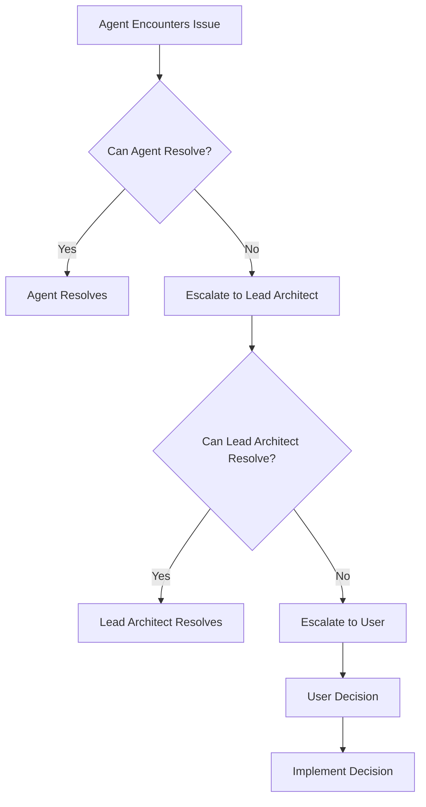

# Agent Assignments and Responsibilities

> [!abstract] Overview
> Comprehensive mapping of specialized agents from `.claude/agents/` inventory to specific project roles, responsibilities, and deliverables for the Master Exemplar Document Series project.

---

## 🎯 LEAD ARCHITECT

### **Agent**: Claude Code (Current Session Agent)
**File**: N/A (Primary operational agent)
**Specialization**: PKB Architecture, Prompt Engineering, System Design

**Responsibilities**:
- Overall project coordination and oversight
- Quality assurance across all deliverables
- Cross-document consistency verification
- Final review and approval
- Research data integration oversight
- Deduplication protocol enforcement
- Conflict resolution and escalation
- Timeline management and milestone tracking

**Time Commitment**: Full-time, 6 weeks (Phases 0-5)

**Key Deliverables**:
- Daily progress tracking
- Weekly review reports
- Phase completion sign-offs
- Final deployment approval

---

## 🔬 RESEARCH DATA ANALYSIS TEAM

### **Research Mining Agent Alpha**
**Agent**: `search-specialist.md` + `python-data-scientist.md` (hybrid assignment)
**Specialization**: Information retrieval, data analysis, search optimization

**Responsibilities**:
- Parse `master_papers.jsonl` (1,464 papers)
- Extract paper metadata (title, authors, DOI, arXiv, abstract)
- Create paper-to-technique mapping database
- Generate per-technique bibliographies
- Identify key papers for each technique
- Build citation database structure

**Timeline**: Phase 0, Days 1-4
**Model**: Sonnet (complex data processing)

**Deliverables**:
- `paper_database.json`
- `technique_to_papers_mapping.json`
- `papers_by_technique/` directory
- Data quality assessment report

---

### **Research Mining Agent Beta**
**Agent**: `python-data-scientist.md` + `machine-learning-engineer.md`
**Specialization**: ML/NLP, data analysis, visualization

**Responsibilities**:
- Analyze topic model HTML files (10/25/50 topics)
- Extract topic clusters and themes
- Map topics to technique categories
- Create topic taxonomy
- Generate topic-to-document mapping
- Interpret research trends from topic models

**Timeline**: Phase 0, Days 5-6
**Model**: Sonnet (NLP analysis)

**Deliverables**:
- `topic_taxonomy.json`
- `topic_to_technique_mapping.json`
- Topic interpretation reports
- Research trend analysis

---

### **Deduplication Specialist Agent**
**Agent**: `code-quality-guardian.md` + Custom deduplication logic
**Specialization**: Pattern matching, similarity detection, quality control

**Responsibilities**:
- Execute three-tier deduplication protocol
  - Tier 1: Intra-source (DOI/arXiv matching)
  - Tier 2: Cross-source (exemplar vs research)
  - Tier 3: Content-level (semantic similarity)
- Use sentence transformers for similarity detection
- Create canonical technique definitions
- Flag high-similarity pairs for review
- Generate deduplication audit trail

**Timeline**: Phase 0, Days 5-6
**Model**: Sonnet (complex logic)
**Tools**: Python, sentence-transformers library

**Deliverables**:
- `deduplicated_papers.json`
- `canonical_technique_definitions.json`
- `deduplication_audit_trail.md`
- High-similarity pairs report

---

### **Citation Management Agent**
**Agent**: `documentation-specialist.md`
**Specialization**: Technical documentation, bibliography management

**Responsibilities**:
- Create master citation database (1,464 entries)
- Generate BibTeX entries for all papers
- Format citations consistently (IEEE/APA/ACM)
- Create cross-reference system
- Track citation usage across documents
- Verify DOI/arXiv link functionality

**Timeline**: Phase 0 Day 7, then ongoing support
**Model**: Haiku (formatting tasks)

**Deliverables**:
- `master_citations.bib`
- `citation_database.json`
- Citation formatting guidelines
- Cross-reference tracking system

---

## 📝 CONTENT GENERATION TEAM

### **Content Generation Agent - Tier 1**
**Agent**: `academic-report-enhancement-agent-v1.0.md`
**Specialization**: Academic writing, research synthesis, deep analysis
**Architecture**: Hybrid ToT + Reflexion + Self-Consistency

**Responsibilities**:
- Review 4 existing Tier 1 documents
- Integrate research data into foundational documents
- Add research citations (10-20 per document)
- Update code examples with research-backed practices
- Ensure theoretical foundations properly attributed
- Apply gold standard metadata

**Timeline**: Phase 1 (Week 1, Days 8-14)
**Model**: Sonnet (high-quality content generation)

**Documents Assigned**:
- DOC-01: LLM Reasoning Techniques
- DOC-02: Extended Thinking Architecture
- DOC-03: Advanced Reasoning Architectures
- DOC-04: Agentic Workflow Design Patterns

**Deliverables**:
- 4 updated Tier 1 documents (production-ready)
- Research integration logs
- Enhancement plan documentation

---

### **Content Generation Agent - Tier 2**
**Agent**: `prompt-engineering-specialist.md` + `exemplar-generator-enhanced.md`
**Specialization**: Prompt engineering, technique synthesis, example generation

**Responsibilities**:
- Create 6 new Tier 2 documents from scratch
- Consolidate techniques from multiple sources
- Write comprehensive explanations (500-800 words per technique)
- Provide complete code implementations (Python + JavaScript)
- Create technique comparison matrices
- Integrate research citations and benchmarks

**Timeline**: Phase 2 (Weeks 2-3, Days 15-28)
**Model**: Sonnet (complex synthesis work)

**Documents Assigned**:
- DOC-05: Chain-Based Reasoning Techniques
- DOC-06: Self-Optimization Techniques
- DOC-07: Specialized Prompting Strategies
- DOC-08: Cross-Lingual and Translation
- DOC-09: Structured Reasoning Frameworks
- DOC-10: Tree and Graph-Based Reasoning

**Deliverables**:
- 6 comprehensive Tier 2 documents (6,000+ words each)
- Complete code repositories
- Technique comparison matrices
- Research synthesis integration

---

### **Content Generation Agent - Tier 3**
**Agent**: `senior-architect.md` + `rag-architecture-expert.md`
**Specialization**: System design, integration patterns, production architecture

**Responsibilities**:
- Create 4-5 Tier 3 implementation-focused documents
- Design integration patterns and architectures
- Provide production-ready deployment guides
- Include infrastructure-as-code examples
- Add monitoring and observability frameworks

**Timeline**: Phase 3 (Week 4, Days 29-35)
**Model**: Sonnet (architectural decisions)

**Documents Assigned**:
- DOC-11: Integration Patterns Cookbook (review & expand)
- DOC-12: RAG Implementation Guide
- DOC-13: Prompt Optimization
- DOC-14: LLM Evaluation and QA
- DOC-15: Production Deployment Architecture

**Deliverables**:
- 4-5 production-focused documents
- Infrastructure code (Terraform/CDK)
- Monitoring dashboards
- Deployment playbooks

---

### **Content Generation Agent - Tier 4**
**Agent**: `documentation-specialist.md` + `prompt-pkb-speacialist-v1.0.0.md`
**Specialization**: Quick references, templates, knowledge organization

**Responsibilities**:
- Create/update quick reference materials
- Extract and organize 50+ templates from prompts.json
- Build comprehensive research compendium (Doc-19)
- Organize bibliography with 1,464 papers
- Create paper-to-document mapping
- Integrate topic model visualizations

**Timeline**: Phase 4 (Week 5, Days 36-41)
**Model**: Sonnet for Doc-19, Haiku for quick refs

**Documents Assigned**:
- DOC-16: Quick Reference Library (update)
- DOC-17: Template and Pattern Library
- DOC-18: Meta-Learning and ICL (update)
- DOC-19: Research Compendium (NEW - CRITICAL)

**Deliverables**:
- Updated quick references
- 50+ template library
- Comprehensive research compendium (10,000+ words)
- Topic visualizations integrated

---

## 🔍 QUALITY ASSURANCE TEAM

### **Metadata Compliance Agent**
**Agent**: `PKB_Metadata_Architect_v1.0.0.md`
**Specialization**: YAML frontmatter, metadata standards, Obsidian compliance

**Responsibilities**:
- Validate YAML frontmatter on all documents
- Ensure gold standard compliance
- Check tag taxonomy consistency
- Verify aliases and cross-references
- Generate metadata reports

**Timeline**: Ongoing, all phases
**Model**: Haiku (validation tasks)

**Quality Gates**:
- Gate 2: Metadata compliance (≥95%)

**Deliverables**:
- Metadata validation reports
- Compliance checklists
- Automated validation scripts

---

### **Code Quality Agent**
**Agent**: `code-quality-guardian.md` + `test-automation-specialist.md`
**Specialization**: Code testing, quality gates, automated testing

**Responsibilities**:
- Test all code examples (unit tests)
- Verify outputs match expected results
- Check edge case handling
- Ensure error handling works
- Run integration tests
- Create test harnesses

**Timeline**: Ongoing, heavy in Phases 2-3
**Model**: Haiku (testing execution)

**Quality Gates**:
- Gate 3: Technical quality (100% tested code)

**Deliverables**:
- Code test results (JSON)
- Unit test suites
- Integration test reports
- Bug fix documentation

---

### **Technical Accuracy Agent**
**Agent**: `code-review-master.md`
**Specialization**: Technical review, accuracy verification, best practices

**Responsibilities**:
- Verify technical claims and statements
- Check for misinformation or outdated info
- Validate performance benchmarks
- Review algorithmic correctness
- Ensure security best practices

**Timeline**: Ongoing, all phases
**Model**: Sonnet (complex validation)

**Quality Gates**:
- Gate 4: Content depth
- Gate 10: Production readiness

**Deliverables**:
- Technical review reports
- Accuracy verification logs
- Correction recommendations

---

### **Research Verification Agent**
**Agent**: `academic-report-enhancement-agent-v1.0.md` (secondary role)
**Specialization**: Academic integrity, citation verification, attribution

**Responsibilities**:
- Validate all research citations
- Check DOI/arXiv link functionality
- Verify no plagiarism or improper paraphrasing
- Ensure proper attribution
- Check citation format consistency
- Cross-reference papers with claims

**Timeline**: Phases 1-5, continuous
**Model**: Sonnet (academic rigor)

**Quality Gates**:
- Gate 6: Research integration
- Gate 8: Research data utilization

**Deliverables**:
- Citation verification reports
- Plagiarism check results
- Attribution audit logs

---

### **Cross-Reference Agent**
**Agent**: `prompt-pkb-speacialist-v1.0.0.md`
**Specialization**: Wiki-linking, knowledge graph, cross-document integration

**Responsibilities**:
- Verify all wiki-links resolve correctly
- Check terminology consistency across documents
- Validate cross-document references
- Ensure no conflicting information
- Build knowledge graph visualization
- Test navigation pathways

**Timeline**: Phase 5 (Days 44-45)
**Model**: Haiku (link validation)

**Quality Gates**:
- Gate 5: Cross-document integration

**Deliverables**:
- Broken link reports (and fixes)
- Terminology consistency report
- Knowledge graph visualization
- Navigation pathway documentation

---

## 🔧 SPECIALIZED SUPPORT TEAM

### **Template Generation Agent**
**Agent**: `prompt-engineering-specialist.md`
**Specialization**: Template creation, pattern extraction, parameterization

**Responsibilities**:
- Extract templates from `prompts.json` (180 prompts)
- Create parameterized template library (50+ templates)
- Categorize by use case
- Add customization guidelines
- Create template documentation

**Timeline**: Phase 4 (Days 36-37)
**Model**: Haiku (template extraction)

**Deliverables**:
- 50+ production-ready templates
- Template categorization
- Parameterization guide
- Usage examples

---

### **Diagram and Visualization Agent**
**Agent**: Custom (Mermaid specialist)
**Specialization**: Flowcharts, decision trees, architecture diagrams

**Responsibilities**:
- Create mermaid diagrams for workflows
- Design decision trees for technique selection
- Build architecture visualizations
- Embed topic model visualizations
- Create comparison matrices

**Timeline**: Ongoing as needed
**Model**: Haiku (diagram generation)

**Deliverables**:
- Mermaid diagram library
- Decision tree flowcharts
- Architecture diagrams
- Visualization assets

---

### **Integration Testing Agent**
**Agent**: `test-automation-specialist.md` + `performance-testing-expert.md`
**Specialization**: Integration testing, RAG testing, performance validation

**Responsibilities**:
- Test integration patterns
- Run RAG retrieval testing (100 queries)
- Measure retrieval accuracy (target: ≥90%)
- Validate context window efficiency
- Test semantic chunking
- Performance benchmarking

**Timeline**: Phase 5 (Days 46-47)
**Model**: Haiku (test execution)

**Quality Gates**:
- Gate 9: RAG optimization

**Deliverables**:
- RAG test results
- Retrieval accuracy metrics
- Performance benchmarks
- Optimization recommendations

---

## 📊 AGENT UTILIZATION MATRIX

| Agent | Phase 0 | Phase 1 | Phase 2 | Phase 3 | Phase 4 | Phase 5 |
|-------|---------|---------|---------|---------|---------|---------|
| **Lead Architect** | ████████ | ████████ | ████████ | ████████ | ████████ | ████████ |
| Research Mining Alpha | ████████ | - | - | - | - | - |
| Research Mining Beta | ████████ | - | - | - | - | - |
| Deduplication Specialist | ████████ | - | - | - | - | - |
| Citation Management | ████████ | ████ | ████ | ████ | ████ | ████ |
| Content Gen - Tier 1 | - | ████████ | - | - | - | - |
| Content Gen - Tier 2 | - | - | ████████ | - | - | - |
| Content Gen - Tier 3 | - | - | - | ████████ | - | - |
| Content Gen - Tier 4 | - | - | - | - | ████████ | - |
| Metadata Compliance | ████ | ████ | ████ | ████ | ████ | ████ |
| Code Quality | - | ████ | ████████ | ████████ | ████ | ████ |
| Technical Accuracy | ████ | ████ | ████ | ████ | ████ | ████ |
| Research Verification | - | ████████ | ████████ | ████ | ████ | ████████ |
| Cross-Reference | - | ████ | ████ | ████ | ████ | ████████ |
| Template Generation | - | - | - | - | ████████ | - |
| Diagram/Visualization | ████ | ████ | ████ | ████ | ████ | ████ |
| Integration Testing | - | - | - | - | - | ████████ |

**Legend**: ████████ Full-time | ████ Part-time | - Not engaged

---

## 🔄 AGENT COORDINATION PROTOCOLS

### Daily Async Standup
Each agent reports daily progress in `daily_progress/` directory:

**Format**: `YYYY-MM-DD-[agent-role].md`

**Template**:
```markdown
# Daily Progress Report

**Agent**: [Agent Name/Role]
**Date**: YYYY-MM-DD
**Phase**: X - [Phase Name]

## Completed Yesterday
- Task 1 description
- Task 2 description

## Working On Today
- Task 1 description
- Task 2 description

## Blockers
- Blocker 1 (if any)
- Blocker 2 (if any)

## Notes
- Any relevant observations or decisions
```

---

### Weekly Sync Review
**Frequency**: Every Sunday
**Participants**: Lead Architect + All Active Agents
**Format**: Async written summary

**Agenda**:
1. Review phase progress vs. timeline
2. Discuss any blockers or risks
3. Adjust agent assignments if needed
4. Preview next week's priorities
5. Celebrate wins and milestones

---

### Conflict Resolution Escalation Path



**Examples of Escalation Triggers**:
- Data quality below acceptable threshold
- Conflicting research papers with no clear resolution
- Timeline slippage exceeding 20%
- Quality gate failure after 2 retry attempts
- Technical blockers requiring infrastructure changes
- Scope ambiguity requiring user clarification

---

## 📋 AGENT RESPONSIBILITY CHECKLIST

### Research Data Analysis Team
- [ ] Data inventory complete and validated
- [ ] 1,464 papers extracted with complete metadata
- [ ] Topic taxonomy created and mapped
- [ ] Deduplication executed (3 tiers)
- [ ] Citation database built (1,464 entries)
- [ ] Research synthesis reports generated

### Content Generation Team
- [ ] Tier 1: 4 documents reviewed and updated
- [ ] Tier 2: 6 documents created from scratch
- [ ] Tier 3: 4-5 documents created
- [ ] Tier 4: 4 documents created/updated
- [ ] All code examples implemented
- [ ] All research citations integrated

### Quality Assurance Team
- [ ] Metadata compliance validated (≥95%)
- [ ] All code tested (100% pass rate)
- [ ] Technical accuracy verified
- [ ] Research citations verified
- [ ] Cross-references validated
- [ ] All 10 quality gates passed

### Support Team
- [ ] 50+ templates extracted and documented
- [ ] Diagrams and visualizations created
- [ ] RAG testing complete (≥90% accuracy)
- [ ] Integration patterns validated

---

## 🎯 AGENT SUCCESS METRICS

### Individual Agent Metrics
- **On-time delivery**: % of tasks completed by deadline
- **Quality score**: % of deliverables passing first review
- **Blocker resolution**: Time to resolve or escalate blockers
- **Communication**: Daily standup participation rate

### Team Metrics
- **Velocity**: Tasks completed per week
- **Quality gate pass rate**: % passing on first attempt
- **Rework rate**: % of work requiring revision
- **Coordination efficiency**: Blocker resolution time

---

## 📞 CONTACT AND COORDINATION

### Lead Architect Availability
**Agent**: Claude Code (Current Session)
**Availability**: Continuous throughout project
**Response Time**: Immediate for critical issues, within 4 hours for non-critical

### Agent Assignment Changes
Any changes to agent assignments must be approved by Lead Architect and documented in:
- `agent_assignment_changes.md` (change log)
- Updated agent-assignments.md (this file)

---

*This agent assignment document serves as the authoritative source for roles, responsibilities, and coordination protocols. All agents should reference this document to understand their scope and integration points.*
