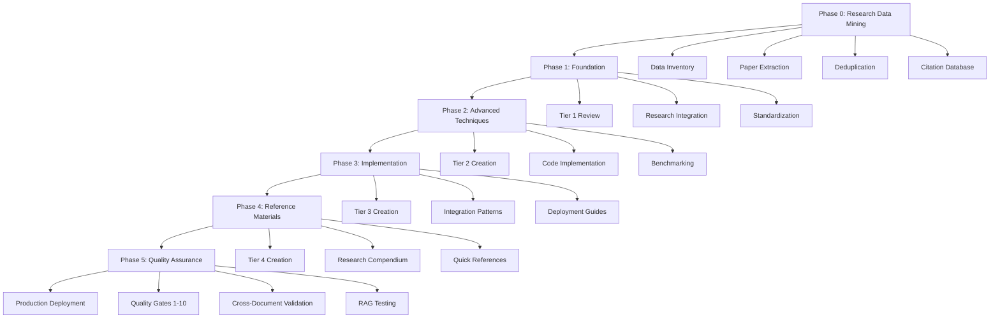

# Master Implementation Plan - Exemplar Document Series

> [!abstract] Plan Overview
> Comprehensive implementation roadmap detailing the complete workflow, agent assignments, milestones, and coordination protocols for creating the Master Exemplar Document Series across 6 phases over 42 days.

---

## 🗺️ Implementation Architecture



---

## 📅 PHASE 0: RESEARCH DATA MINING (WEEK 0)

### **Duration**: 7 days
### **Status**: Ready to Start
### **Critical Success Factor**: Data quality gate pass at Day 7

---

### **Day 1-2: Data Inventory and Assessment**

**Lead**: Research Mining Agent Alpha + Lead Architect

**Tasks**:
1. ✅ Complete inventory of research data directory
   - Count papers in `master_papers.jsonl` (1,464 papers confirmed)
   - Validate JSON/JSONL structure integrity
   - Check for missing fields or corrupt entries
   - Assess metadata completeness

2. ✅ Initial data quality assessment
   - Calculate metadata completeness percentage
   - Identify papers with missing DOI/arXiv IDs
   - Review blacklist.csv exclusion criteria (394 papers)
   - Sample 50 random papers for quality spot-check

3. ✅ Create data quality assessment report
   - Overall quality score (1-10)
   - Completeness metrics by field
   - Recommendation: proceed / proceed with caution / abort

**Deliverables**:
- `data-quality-assessment-report.md`
- `data-inventory-summary.json`

**Go/No-Go Decision Point**: If quality score < 7/10, escalate to user

---

### **Day 3-4: Paper Extraction and Mapping**

**Lead**: Research Mining Agent Alpha

**Tasks**:
1. Parse `master_papers.jsonl` (1,464 papers)
   ```python
   papers = []
   with open('master_papers.jsonl', 'r') as f:
       for line in f:
           paper = json.loads(line)
           papers.append({
               'id': paper['id'],
               'title': extract_title(paper['text']),
               'abstract': paper['text'],
               'techniques': extract_techniques(paper['text']),
               'authors': extract_authors_from_csv(),
               'doi': lookup_doi(paper['id']),
               'arxiv': lookup_arxiv(paper['id']),
               'year': extract_year_from_csv(),
               'keywords': get_keywords_from_csv()
           })
   ```

2. Create paper-to-technique mapping
   ```python
   technique_map = defaultdict(list)
   for paper in papers:
       for technique in paper['techniques']:
           technique_map[normalize_technique_name(technique)].append(paper['id'])
   ```

3. Generate per-technique bibliographies
   - Chain-of-Thought papers
   - Tree-of-Thoughts papers
   - Self-Consistency papers
   - (etc. for all 50+ techniques)

**Deliverables**:
- `paper_database.json` (1,464 papers with complete metadata)
- `technique_to_papers_mapping.json`
- `papers_by_technique/` (directory with per-technique bibliographies)

---

### **Day 5-6: Topic Analysis and Deduplication**

**Lead**: Research Mining Agent Beta + Deduplication Specialist

**Tasks - Topic Analysis**:
1. Parse topic model HTML files
   - `topic_outputs-10.html` → 10 broad topics
   - `topic_outputs-25.html` → 25 medium-granularity topics
   - `topic_outputs-50.html` → 50 fine-grained topics

2. Extract topic clusters and themes
   ```python
   topics = parse_html_topic_model('topic_outputs-25.html')
   topic_taxonomy = {
       'topic_id': {
           'label': 'Human-readable label',
           'keywords': ['keyword1', 'keyword2', ...],
           'papers': ['paper_id1', 'paper_id2', ...],
           'techniques': ['technique1', 'technique2', ...]
       }
   }
   ```

3. Map topics to technique categories
   - Identify which topics correspond to which techniques
   - Create topic-to-document mapping for master docs

**Tasks - Deduplication (Three-Tier Protocol)**:

**Tier 1: Intra-Source Deduplication**
```python
# Deduplicate within master_papers.jsonl
unique_papers = deduplicate_by_doi_arxiv_title(papers)
# Priority: DOI match > arXiv match > Title similarity

# Cross-reference with cleaned_complete_paper_references.json
# Merge metadata, preferring most complete records
```

**Tier 2: Cross-Source Deduplication**
```python
# Compare with existing exemplar markdown documents
existing_techniques = extract_techniques_from_exemplar_docs()
research_techniques = extract_techniques_from_papers()

# Identify overlaps
overlaps = set(existing_techniques) & set(research_techniques)

# For each overlap, consolidate:
# - Keep most complete description
# - Add research citations to existing docs
# - Note variants in footnotes
```

**Tier 3: Content-Level Deduplication**
```python
from sentence_transformers import SentenceTransformer

model = SentenceTransformer('all-MiniLM-L6-v2')

# Generate embeddings for all technique descriptions
descriptions = [get_technique_description(t) for t in all_techniques]
embeddings = model.encode(descriptions)

# Calculate cosine similarity
similarity_matrix = cosine_similarity(embeddings)

# Flag pairs with >90% similarity for human review
high_similarity_pairs = [
    (tech1, tech2, score)
    for i, tech1 in enumerate(all_techniques)
    for j, tech2 in enumerate(all_techniques)
    if i < j and similarity_matrix[i][j] > 0.90
]
```

**Deliverables**:
- `topic_taxonomy.json`
- `topic_to_technique_mapping.json`
- `deduplicated_papers.json`
- `canonical_technique_definitions.json`
- `deduplication_audit_trail.md` (human-reviewable log)

---

### **Day 7: Citation Database and Research Synthesis**

**Lead**: Citation Management Agent

**Tasks**:
1. Create master citation database
   ```python
   citations = {}
   for paper in deduplicated_papers:
       citations[paper['id']] = {
           'title': paper['title'],
           'authors': format_authors(paper['authors']),
           'year': paper['year'],
           'venue': paper['venue'],
           'doi': paper['doi'],
           'arxiv': paper['arxiv'],
           'url': generate_url(paper),
           'bibtex': generate_bibtex(paper),
           'cited_in': [],  # populated later
           'techniques': paper['techniques']
       }
   ```

2. Generate BibTeX entries
   ```bibtex
   @article{paper_id,
     title={Paper Title},
     author={Author1 and Author2},
     journal={Venue},
     year={2023},
     doi={10.xxxx/xxxxx},
     url={https://arxiv.org/abs/xxxx.xxxxx}
   }
   ```

3. Create research synthesis reports
   - For each major technique (CoT, ToT, SC, etc.)
   - Include: foundational papers, key findings, evolution timeline
   - Format as markdown for easy integration into master docs

**Deliverables**:
- `master_citations.bib` (1,464 BibTeX entries)
- `citation_database.json`
- `research_synthesis/` (directory with per-technique synthesis reports)
- `phase0_completion_report.md`

**Phase 0 Go/No-Go Gate**:
- ✅ Data quality ≥ 7/10
- ✅ Deduplication complete
- ✅ Citation database verified
- ✅ All deliverables present

**If PASS → Proceed to Phase 1**
**If FAIL → Escalate to user, proceed with exemplar-only approach**

---

## 📅 PHASE 1: FOUNDATION (WEEK 1)

### **Duration**: 7 days
### **Objective**: Review, update, and standardize Tier 1 documents with research integration

---

### **Day 8-9: Tier 1 Document Review**

**Lead**: Content Generation Agent - Tier 1

**Scope**: 4 existing documents
1. `doc1-llm-reasoning-techniques-operational-manual.md` (EXISTS)
2. `doc2-extended-thinking-architecture-implementation-guide.md` (EXISTS)
3. `doc3-advanced-reasoning-architectures-theory-to-practice.md` (EXISTS)
4. `doc4-agentic-workflow-design-patterns.md` (EXISTS)

**Tasks**:
1. Read all 4 existing Tier 1 documents
2. Assess current state vs. gold standard requirements
3. Identify gaps in:
   - Research citations (currently missing)
   - Code examples (completeness check)
   - Metadata compliance
   - Cross-document linking

4. Create enhancement plans for each document
   ```markdown
   ## Doc1 Enhancement Plan
   - Add 15+ research citations from paper database
   - Complete 3 missing code examples
   - Update metadata to v1.0.0 standards
   - Add 10 wiki-links to other docs
   - Integrate research synthesis for CoT, Zero-Shot, Few-Shot
   ```

**Deliverables**:
- `tier1-review-report.md`
- `tier1-enhancement-plans/` (4 individual plans)

---

### **Day 10-12: Research Integration**

**Lead**: Content Generation Agent - Tier 1 + Research Verification Agent

**Tasks**:
1. For each Tier 1 document, integrate research data:
   - Add "Research Foundations" section
   - Cite 10-20 key papers from `paper_database.json`
   - Include empirical performance benchmarks
   - Add theoretical context from synthesis reports

2. Update code examples with research-backed best practices
   ```python
   # Example: Chain-of-Thought implementation
   # Based on Wei et al. (2022) - "Chain-of-Thought Prompting"
   # Performance: 57.1% → 74.5% on GSM8K (referenced from paper)

   def chain_of_thought_prompt(question):
       return f"""
       Let's solve this step by step:

       Question: {question}

       Step 1: [Decompose the problem]
       Step 2: [Solve each component]
       Step 3: [Combine results]

       Answer: [Final answer]
       """
   ```

3. Add bibliography sections to each document
   - 15-20 citations per document
   - Properly formatted with DOI/arXiv links
   - Cross-reference to Research Compendium (Doc-19)

**Deliverables**:
- 4 updated Tier 1 documents with research integration
- `research_integration_log.md` (tracking what was added where)

---

### **Day 13-14: Standardization and Quality Gates**

**Lead**: Metadata Compliance Agent + Technical Accuracy Agent

**Tasks**:
1. Apply gold standard metadata to all 4 Tier 1 documents
   ```yaml
   ---
   type: reference-architecture
   id: 20260213XXXXXX
   title: "Document Title"
   version: 1.0.0
   status: production
   created: 2026-02-13
   modified: 2026-02-13
   tags: [llm-reasoning, prompt-engineering, reference-architecture, tier1]
   aliases: [Alternative Name]
   confidence: high
   maturity: evergreen
   synthesis_source_count: 20
   research_papers_cited: 15
   ---
   ```

2. Execute Quality Gates 1-6 for each document:
   - Gate 1: Structural completeness ✓
   - Gate 2: Metadata compliance ✓
   - Gate 3: Technical quality (test all code) ✓
   - Gate 4: Content depth (4+ layers) ✓
   - Gate 5: Cross-document integration ✓
   - Gate 6: Research integration ✓

3. Run automated validation
   ```bash
   python validate_document.py doc1-llm-reasoning-techniques-operational-manual.md
   # Checks:
   # - YAML frontmatter valid
   # - All wiki-links resolve
   # - Code blocks have language tags
   # - Citations have valid DOI/arXiv
   # - Word count ≥ 4,000
   # - Callout syntax correct
   ```

**Deliverables**:
- 4 production-ready Tier 1 documents
- `phase1_quality_report.md`
- `tier1_validation_results.json`

**Phase 1 Milestone**: Tier 1 documents complete and production-ready

---

## 📅 PHASE 2: ADVANCED TECHNIQUES (WEEK 2-3)

### **Duration**: 14 days
### **Objective**: Create 6-8 Tier 2 documents with comprehensive research integration

---

### **Day 15-17: Tier 2 Document Creation - Chain-Based Techniques**

**Lead**: Content Generation Agent - Tier 2

**Document**: DOC-05: Chain-Based Reasoning Techniques - Complete Reference

**Source Material**:
- `advanced-prompt-engineering-techniques/Chain_of_*.md` (8 files)
- Research papers from `paper_database.json` (chain-of-X techniques)
- Topic model insights

**Tasks**:
1. Consolidate 8 chain-of-X techniques:
   - Chain of Verification
   - Chain of Density
   - Chain of Symbol
   - Chain of Translation
   - Chain of Draft
   - Faithful Chain-of-Thought
   - Tabular Chain-of-Thought
   - Multi-Chain Reasoning

2. For each technique:
   - Write comprehensive explanation (500-800 words)
   - Provide complete code implementation (Python + JavaScript)
   - Include 3-5 concrete examples
   - Cite original research papers
   - Add performance benchmarks from literature
   - Create technique comparison matrix

3. Add unified framework section
   ```python
   class ChainBasedReasoning:
       """Unified framework for chain-based reasoning techniques."""

       def __init__(self, technique='cot'):
           self.technique = technique

       def execute(self, problem):
           # Dispatch to appropriate chain technique
           pass
   ```

**Deliverables**:
- `doc5-chain-based-reasoning-complete-reference-v1.0.md` (6,000+ words)
- `chain_technique_comparison_matrix.md`
- `chain_code_examples/` (directory with working code)

---

### **Day 18-20: Tier 2 Documents - Self-Optimization & Specialized**

**Lead**: Content Generation Agent - Tier 2

**Document 1**: DOC-06: Self-Optimization Techniques - Meta-Learning Guide

**Source Material**:
- `advanced-prompt-engineering-techniques/Self_*.md`, `Meta_*.md`
- Research papers on meta-learning and self-improvement
- Topic model clusters on meta-cognition

**Tasks**:
- Consolidate 7 self-optimization techniques
- Complete code implementations with iterative improvement loops
- Add convergence analysis and stopping criteria
- Cite meta-learning research

**Document 2**: DOC-07: Specialized Prompting Strategies

**Source Material**:
- `advanced-prompt-engineering-techniques/` (Emotion, Role, Analogical, etc.)
- `basic-prompt-engineering-techniques/` (Emotion_Prompting.md, Role_Prompting.md)
- Psychological research from paper database

**Tasks**:
- Consolidate 7 specialized strategies
- Add effectiveness analysis by domain
- Include A/B testing protocols
- Cite psychological/cognitive foundations

**Deliverables**:
- `doc6-self-optimization-meta-learning-v1.0.md` (5,000+ words)
- `doc7-specialized-prompting-strategies-v1.0.md` (4,500+ words)

---

### **Day 21-23: Tier 2 Documents - Cross-Lingual & Structured**

**Lead**: Content Generation Agent - Tier 2

**Document 1**: DOC-08: Cross-Lingual and Translation Techniques

**Source Material**:
- `advanced-prompt-engineering-techniques/Cross_Lingual_Prompting.md`
- `advanced-prompt-engineering-techniques/Chain_of_Translation_Prompting.md`
- NLP research from paper database

**Tasks**:
- Focus on multilingual reasoning
- Add language-specific optimizations
- Include translation quality metrics from research
- Benchmark results across languages

**Document 2**: DOC-09: Structured Reasoning Frameworks

**Source Material**:
- `advanced-prompt-engineering-techniques/Least_to_Most_Prompting.md`
- `advanced-prompt-engineering-techniques/Plan_and_Solve_Prompting.md`
- `advanced-prompt-engineering-techniques/Program_of_Thoughts_Prompting.md`
- Research papers on program synthesis

**Tasks**:
- Consolidate 5 structured frameworks
- Complete code generation integration
- Add debugging and error recovery protocols
- Cite program synthesis research

**Deliverables**:
- `doc8-cross-lingual-translation-v1.0.md` (3,500+ words)
- `doc9-structured-reasoning-frameworks-v1.0.md` (5,500+ words)

---

### **Day 24-26: Tier 2 Document - Tree and Graph Reasoning**

**Lead**: Content Generation Agent - Tier 2 + Code Quality Agent

**Document**: DOC-10: Tree and Graph-Based Reasoning - Deep Dive

**Source Material**:
- `claude-reasoning-documentation-series/doc3-advanced-reasoning-architectures-theory-to-practice.md`
- `tree-of-thoughts-system-claude-reasoning.md`
- `graph-of-thoughts-exemplar.md`
- `prompt-report-tree-of-thoughts.md`
- Research papers on ToT and GoT

**Tasks**:
1. Comprehensive ToT coverage:
   - BFS, DFS, A* search strategies
   - Node evaluation and pruning
   - State space design
   - Complete algorithmic implementations

2. Comprehensive GoT coverage:
   - Graph construction methodologies
   - Cycle detection and handling
   - Path finding algorithms
   - Visualization tools

3. Code implementations:
   ```python
   class TreeOfThoughts:
       """Complete ToT implementation with multiple search strategies."""

       def __init__(self, branching_factor=3, depth_limit=5):
           self.branching_factor = branching_factor
           self.depth_limit = depth_limit

       def search(self, problem, strategy='bfs'):
           if strategy == 'bfs':
               return self._breadth_first_search(problem)
           elif strategy == 'dfs':
               return self._depth_first_search(problem)
           elif strategy == 'astar':
               return self._a_star_search(problem)
   ```

4. Benchmark comparisons:
   - Resource requirements (time, tokens, cost)
   - Accuracy improvements
   - Use case recommendations

**Deliverables**:
- `doc10-tree-graph-reasoning-deep-dive-v1.0.md` (8,000+ words)
- `tot_got_implementations/` (complete code library)
- `tot_got_benchmarks.json` (performance data)

---

### **Day 27-28: Tier 2 Quality Assurance**

**Lead**: Code Quality Agent + Research Verification Agent

**Tasks**:
1. Test all code examples in Tier 2 documents
   - Run unit tests
   - Verify outputs match expected results
   - Check for edge cases
   - Ensure error handling works

2. Verify all research citations
   - DOI/arXiv links functional
   - Citation format consistent
   - No plagiarism or improper paraphrasing
   - Bibliography complete

3. Execute Quality Gates 1-6 for all Tier 2 docs

**Deliverables**:
- `phase2_quality_report.md`
- `tier2_code_test_results.json`
- `tier2_citation_verification.json`

**Phase 2 Milestone**: 6 Tier 2 documents complete and production-ready

---

## 📅 PHASE 3: IMPLEMENTATION (WEEK 4)

### **Duration**: 7 days
### **Objective**: Create 4-5 Tier 3 documents focused on integration and deployment

---

### **Day 29-30: Integration Patterns and RAG**

**Lead**: Content Generation Agent - Tier 3

**Document 1**: DOC-11: Integration Patterns Cookbook (REVIEW & EXPAND EXISTING)

**Source Material**:
- `claude-reasoning-documentation-series/doc6-integration-patterns-cookbook.md`
- Research on integration architectures

**Tasks**:
- Review existing doc6
- Expand LangChain integration patterns
- Add LlamaIndex patterns
- Include custom framework examples

**Document 2**: DOC-12: RAG Implementation - Complete Guide (CREATE NEW)

**Source Material**:
- `prompt-engineering-specialist-package/SKILL_rag-implementation.md`
- Research papers on RAG, RAG++
- Topic model insights on retrieval

**Tasks**:
- Complete RAG pipeline code
- Vector database selection guide
- Embedding strategies (from SKILL files)
- Chunking methodologies
- Hybrid search implementation
- Performance benchmarking framework

**Deliverables**:
- `doc11-integration-patterns-cookbook-v1.1.md` (updated)
- `doc12-rag-implementation-complete-guide-v1.0.md` (5,000+ words)
- `rag_pipeline_code/` (production-ready implementations)

---

### **Day 31-32: Optimization and Evaluation**

**Lead**: Content Generation Agent - Tier 3

**Document 1**: DOC-13: Prompt Optimization - Systematic Approaches

**Source Material**:
- `the-prompt-report-main/data/prompts.json` (180 prompts for pattern analysis)
- Research papers on automated prompt optimization
- DSPy documentation

**Tasks**:
1. Analyze `prompts.json` for patterns
   ```python
   prompts = load_json('prompts.json')

   # Extract patterns:
   - Role-based prompts: 19 variations
   - CoT variations: 2-shot, 10-shot, contrastive
   - Format specifications

   # Identify optimization opportunities
   - Template parameterization
   - Prompt compression techniques
   - Evolutionary strategies
   ```

2. Automated optimization frameworks
   - DSPy integration guide
   - A/B testing harness
   - Metric tracking dashboard

**Document 2**: DOC-14: LLM Evaluation and Quality Assurance

**Source Material**:
- `the-prompt-report-main/data/mmlu_configs.json` (58 MMLU subjects)
- Research on evaluation methodologies
- Benchmark datasets

**Tasks**:
- Integrate MMLU configuration data
- Complete evaluation framework code
- Benchmark runners for MMLU, GSM8K, HotpotQA
- Quality gates and validation protocols
- Production monitoring setup

**Deliverables**:
- `doc13-prompt-optimization-v1.0.md` (4,500+ words)
- `doc14-llm-evaluation-qa-v1.0.md` (5,500+ words)
- `evaluation_framework/` (complete testing suite)

---

### **Day 33-34: Production Deployment**

**Lead**: Content Generation Agent - Tier 3

**Document**: DOC-15: Production Deployment Architecture

**Source Material**:
- Research on production LLM systems
- Infrastructure best practices
- Cloud architecture patterns

**Tasks**:
- Reference architectures (AWS, Azure, GCP)
- Terraform/CDK examples
- Scaling strategies
- Cost optimization
- Observability and monitoring
- Security and compliance
- Disaster recovery

**Deliverables**:
- `doc15-production-deployment-v1.0.md` (5,000+ words)
- `infrastructure_code/` (Terraform templates)
- `monitoring_dashboards/` (Grafana/Datadog configs)

---

### **Day 35: Tier 3 Quality Assurance**

**Lead**: Integration Testing Agent + Code Quality Agent

**Tasks**:
- Test all integration patterns
- Validate infrastructure code
- Verify monitoring setups
- Execute Quality Gates 1-6

**Deliverables**:
- `phase3_quality_report.md`
- `tier3_integration_test_results.json`

**Phase 3 Milestone**: 4-5 Tier 3 documents complete

---

## 📅 PHASE 4: REFERENCE MATERIALS (WEEK 5)

### **Duration**: 7 days
### **Objective**: Create quick references and comprehensive research compendium

---

### **Day 36-37: Quick References and Templates**

**Lead**: Template Generation Agent

**Document 1**: DOC-16: Quick Reference Library (REVIEW & EXPAND EXISTING)

**Source Material**:
- `claude-reasoning-documentation-series/doc5-quick-reference-library.md`

**Tasks**:
- Expand with all new techniques from Tier 2
- Create one-page summaries for each technique
- Add decision trees and flowcharts
- Include troubleshooting quick guides

**Document 2**: DOC-17: Template and Pattern Library

**Source Material**:
- `the-prompt-report-main/data/prompts.json` (extract templates)
- `prompt-engineering-specialist-package/EXEMPLAR_prompt-templates.md`

**Tasks**:
- Extract 50+ templates from prompts.json
- Categorize by use case
- Add parameterization guidelines
- Include customization examples

**Deliverables**:
- `doc16-quick-reference-library-v1.1.md` (updated)
- `doc17-template-pattern-library-v1.0.md` (4,000+ words)
- `template_library/` (50+ ready-to-use templates)

---

### **Day 38-39: Meta-Learning and Research Compendium**

**Lead**: Content Generation Agent - Tier 4 + Citation Management Agent

**Document 1**: DOC-18: Meta-Learning and In-Context Learning (REVIEW & EXPAND)

**Source Material**:
- `meta-in-context-learning-exemplar/meta-in-context-learning-exemplar.md`
- Research papers on ICL

**Tasks**:
- Integrate ICL research synthesis
- Add example selection algorithms
- Include few-shot optimization strategies
- Meta-ICL implementation

**Document 2**: DOC-19: Research Compendium - Academic Foundations (NEW - CRITICAL)

**Source Material**:
- ALL research data from Phase 0
- `master_citations.bib`
- `topic_taxonomy.json`
- `research_synthesis/` reports

**Tasks**:
1. Comprehensive bibliography
   - 1,464 papers with full metadata
   - Organized by technique category
   - Searchable by author, year, venue

2. Topic model integration
   - Embed visualizations from `topic_outputs-*.html`
   - Interpret 10-topic, 25-topic, 50-topic models
   - Map topics to master documents

3. Research trends analysis
   - Timeline of technique evolution
   - Key researchers and institutions
   - Emerging techniques from recent papers
   - Future directions

4. Cross-reference system
   - Link each paper to relevant master documents
   - Create paper-to-technique navigation
   - Enable bidirectional lookup

**Deliverables**:
- `doc18-meta-learning-icl-v1.1.md` (updated)
- `doc19-research-compendium-v1.0.md` (10,000+ words, comprehensive)
- `research_visualizations/` (embedded topic models)
- `paper_to_document_map.json`

---

### **Day 40-41: Tier 4 Quality Assurance**

**Lead**: Cross-Reference Agent + Bibliography Agent

**Tasks**:
- Verify all cross-references
- Validate bibliography completeness
- Check template functionality
- Execute Quality Gates 1-6

**Deliverables**:
- `phase4_quality_report.md`
- `tier4_cross_reference_validation.json`

**Phase 4 Milestone**: All Tier 4 documents complete, including critical Research Compendium

---

## 📅 PHASE 5: QUALITY ASSURANCE (WEEK 6)

### **Duration**: 7 days
### **Objective**: Execute all 10 quality gates across entire series

---

### **Day 42-43: Series-Level Quality Gates**

**Lead**: Lead Architect + All QA Agents

**Tasks**:

**Gate 7: Comprehensive Coverage**
- Verify 100% technique coverage from exemplar folder
- Confirm all 1,464 papers analyzed and integrated
- Check for knowledge gaps
- Validate progression from basic to advanced

**Gate 8: Research Data Utilization**
- Confirm `master_papers.jsonl` fully analyzed
- Verify topic models integrated into Doc-19
- Check `prompts.json` patterns extracted into Doc-17
- Validate MMLU configs used in Doc-14
- Ensure all data sources processed
- Verify deduplication protocol executed
- Confirm no duplicate content across documents

**Gate 9: RAG Optimization**
- Test semantic chunking effectiveness
- Verify query-to-content mapping
- Run retrieval testing suite
- Confirm context window efficiency

**Gate 10: Production Readiness**
- Test all templates
- Deploy and verify all code
- Validate integration patterns
- Check documentation completeness

**Deliverables**:
- `series_quality_gate_results.json`
- `comprehensive_coverage_report.md`
- `research_utilization_verification.md`
- `rag_optimization_test_results.json`

---

### **Day 44-45: Cross-Document Validation**

**Lead**: Cross-Reference Agent + Technical Accuracy Agent

**Tasks**:
1. Verify all wiki-links resolve correctly
2. Check terminology consistency across documents
3. Validate cross-references and citations
4. Ensure no conflicting information
5. Test navigation pathways

**Deliverables**:
- `cross_document_validation_report.md`
- `broken_links_fixed.json`
- `terminology_consistency_report.md`

---

### **Day 46-47: RAG Retrieval Testing**

**Lead**: Integration Testing Agent

**Tasks**:
1. Create test query set (100 queries)
   - Basic: "What is chain-of-thought?"
   - Intermediate: "Compare ToT vs GoT for code generation"
   - Advanced: "When should I use self-consistency vs self-refine?"

2. Test retrieval accuracy
   ```python
   queries = load_test_queries()
   for query in queries:
       results = claude_rag_retrieve(query, top_k=5)
       relevance = assess_relevance(results, query)
       assert relevance >= 0.90  # Target: 90% relevant retrieval
   ```

3. Measure performance
   - Retrieval latency
   - Relevance scores
   - Context window usage

**Deliverables**:
- `rag_test_queries.json` (100 test queries)
- `rag_retrieval_results.json` (performance metrics)
- `rag_optimization_recommendations.md`

---

### **Day 48: Final Review and Approval**

**Lead**: Lead Architect

**Tasks**:
1. Comprehensive series review
   - Read all 15-20 documents end-to-end
   - Verify narrative flow
   - Check for inconsistencies
   - Assess overall quality

2. Compile final metrics
   - Total word count
   - Total citations
   - Code examples count
   - Template count
   - Quality gate pass rates

3. Create deployment package
   - All documents in final/ directory
   - Supporting assets organized
   - README with usage instructions
   - Deployment checklist

**Deliverables**:
- `phase5_final_quality_report.md`
- `series_metrics_summary.json`
- `deployment_package/` (ready for production)
- `deployment_checklist.md`

**Phase 5 Go/No-Go Gate**:
- ✅ All 10 quality gates passed
- ✅ RAG testing ≥90% accuracy
- ✅ No critical blockers
- ✅ Lead architect approval

**If PASS → Production Deployment**
**If FAIL → Iteration cycle back to appropriate phase**

---

## 📊 Success Metrics

### Quantitative Targets
- ✅ 15-20 master documents created
- ✅ 1,464 research papers analyzed
- ✅ 100% code examples tested
- ✅ ≥95% metadata compliance
- ✅ 100% citations verified
- ✅ <5% redundant content
- ✅ ≥90% RAG retrieval accuracy
- ✅ 60,000-80,000 total words

### Qualitative Targets
- ✅ Every technique has academic grounding
- ✅ Clear navigation and information architecture
- ✅ No follow-up questions needed for implementation
- ✅ Seamless document integration
- ✅ Production-ready deployment
- ✅ Academic rigor maintained

---

## 🔄 Communication Protocols

### Daily Sync Points (Async)
- Each agent reports progress in `daily_progress/` directory
- Format: `YYYY-MM-DD-agent-name.md`
- Contents: completed tasks, in-progress, blockers

### Weekly Reviews (Sync)
- Every Sunday: comprehensive review with Lead Architect
- Assess timeline adherence
- Identify and resolve blockers
- Adjust assignments if needed

### Conflict Escalation
1. Agent attempts resolution
2. If unresolved → Lead Architect
3. If still unresolved → Escalate to user

---

## 📂 Project Folder Structure

```
master-exemplar-project-2026/
├── 00-project-management/
│   ├── project-charter.md
│   ├── master-implementation-plan.md (THIS FILE)
│   ├── agent-assignments.md
│   ├── workflow-design.md
│   ├── quality-gates-checklist.md
│   ├── progress-tracker.md
│   └── daily_progress/
│       └── YYYY-MM-DD-agent-name.md
├── 01-research-data-analysis/
│   ├── data-inventory-summary.json
│   ├── paper_database.json
│   ├── topic_taxonomy.json
│   ├── deduplicated_papers.json
│   ├── deduplication_audit_trail.md
│   ├── master_citations.bib
│   └── research_synthesis/
│       └── [technique]-research-synthesis.md
├── 02-planning-documents/
│   ├── tier1-enhancement-plans/
│   ├── tier2-creation-plans/
│   ├── tier3-creation-plans/
│   └── tier4-creation-plans/
├── 03-document-drafts/
│   ├── tier1/
│   ├── tier2/
│   ├── tier3/
│   └── tier4/
├── 04-templates-and-components/
│   ├── document-template-v1.0.md
│   ├── metadata-template.yaml
│   └── template_library/
│       └── [50+ templates]
├── 05-quality-assurance/
│   ├── validation-reports/
│   ├── testing-logs/
│   └── code_test_results/
└── 06-final-deliverables/
    ├── doc1-llm-reasoning-techniques-v1.0.md
    ├── doc2-extended-thinking-architecture-v1.0.md
    ├── [... 15-20 documents total ...]
    ├── master_citations.bib
    └── deployment_package/
```

---

## ✅ Implementation Checklist

### Phase 0: Research Data Mining
- [ ] Day 1-2: Data inventory complete
- [ ] Day 3-4: Paper extraction complete
- [ ] Day 5-6: Topic analysis and deduplication complete
- [ ] Day 7: Citation database and synthesis complete
- [ ] Go/No-Go decision made

### Phase 1: Foundation
- [ ] Day 8-9: Tier 1 review complete
- [ ] Day 10-12: Research integration complete
- [ ] Day 13-14: Standardization and quality gates passed

### Phase 2: Advanced Techniques
- [ ] Day 15-17: DOC-05 complete
- [ ] Day 18-20: DOC-06, DOC-07 complete
- [ ] Day 21-23: DOC-08, DOC-09 complete
- [ ] Day 24-26: DOC-10 complete
- [ ] Day 27-28: Tier 2 quality assurance passed

### Phase 3: Implementation
- [ ] Day 29-30: DOC-11, DOC-12 complete
- [ ] Day 31-32: DOC-13, DOC-14 complete
- [ ] Day 33-34: DOC-15 complete
- [ ] Day 35: Tier 3 quality assurance passed

### Phase 4: Reference Materials
- [ ] Day 36-37: DOC-16, DOC-17 complete
- [ ] Day 38-39: DOC-18, DOC-19 complete
- [ ] Day 40-41: Tier 4 quality assurance passed

### Phase 5: Quality Assurance
- [ ] Day 42-43: Series-level quality gates passed
- [ ] Day 44-45: Cross-document validation complete
- [ ] Day 46-47: RAG testing complete
- [ ] Day 48: Final review and approval

### Production Deployment
- [ ] All deliverables present
- [ ] Deployment package ready
- [ ] User acceptance

---

*This implementation plan provides the comprehensive roadmap for executing the Master Exemplar Document Series project. All agents should reference this plan daily to ensure alignment and coordination.*
