# Quality Gates Checklist - Master Exemplar Project

> [!abstract] Purpose
> Comprehensive quality validation framework with 10 quality gates ensuring production-readiness for all documents in the Master Exemplar Series. Each gate must pass before proceeding to deployment.

---

## 🎯 QUALITY GATE OVERVIEW

```mermaid
graph LR
    A[Document Creation] --> B[Gate 1: Structure]
    B --> C[Gate 2: Metadata]
    C --> D[Gate 3: Technical]
    D --> E[Gate 4: Content]
    E --> F[Gate 5: Integration]
    F --> G[Gate 6: Research]
    G --> H[Gate 7: Coverage]
    H --> I[Gate 8: Data Util]
    I --> J[Gate 9: RAG]
    J --> K[Gate 10: Production]
    K --> L[Deployment Approved]
```



**Target Pass Rate**: 100% (all gates must pass)
**Retry Limit**: Maximum 2 retry attempts per gate
**Escalation**: After 2 failures, escalate to Lead Architect

---

## 📋 GATE 1: STRUCTURAL COMPLETENESS

### **Scope**: Document-level validation
### **Responsible Agent**: Metadata Compliance Agent
### **Frequency**: Per document after initial creation

### Validation Criteria

#### Required Sections Present
- [ ] YAML frontmatter (properly formatted)
- [ ] Abstract/Executive summary callout
- [ ] Table of contents (for documents >2000 words)
- [ ] Introduction section
- [ ] Main content sections (technique-specific)
- [ ] Code examples section (if applicable)
- [ ] Related Topics / PKB Expansion section
- [ ] Bibliography / References section (if research-integrated)

#### Heading Hierarchy
- [ ] Single H1 (document title)
- [ ] Logical H2 structure (major sections)
- [ ] Proper H3/H4 nesting (no skipped levels)
- [ ] No heading level jumping (H1 → H3)

#### Document Length
- [ ] Minimum word count achieved:
  - Tier 1: ≥4,000 words
  - Tier 2: ≥4,000 words
  - Tier 3: ≥4,000 words
  - Tier 4: ≥3,000 words (except Doc-19: ≥10,000)

#### No Placeholder Content
- [ ] No "TODO" markers
- [ ] No "[TBD]" placeholders
- [ ] No empty sections
- [ ] All code blocks populated

### Validation Method
```bash
python validate_structure.py [document-path]
# Outputs: PASS / FAIL with specific issues listed
```

### Pass Criteria
- ✅ All checkboxes checked
- ✅ Structure score ≥ 95%

---

## 📋 GATE 2: METADATA COMPLIANCE

### **Scope**: Document-level validation
### **Responsible Agent**: Metadata Compliance Agent (PKB_Metadata_Architect)
### **Frequency**: Per document after initial creation

### Validation Criteria

#### YAML Frontmatter Required Fields
```yaml
---
type: [required, must be from controlled vocabulary]
id: [required, timestamp format YYYYMMDDHHMMSS]
title: [required, matches H1]
version: [required, semantic versioning X.Y.Z]
status: [required: active | production | testing | archived]
created: [required, YYYY-MM-DD]
modified: [required, YYYY-MM-DD]
tags: [required, 3-5 tags from taxonomy]
aliases: [required, 2-4 alternatives]
confidence: [required: speculative | provisional | moderate | high | verified]
maturity: [required: seedling | budding | evergreen | wilting]
---
```

#### Tag Compliance
- [ ] 3-5 tags total
- [ ] Primary domain tag (e.g., #prompt-engineering)
- [ ] Methodology tag (e.g., #reference-architecture)
- [ ] Content type tag (e.g., #master-exemplar)
- [ ] All tags from controlled vocabulary
- [ ] Consistent tag format (#tag-name)

#### Aliases Quality
- [ ] 2-4 meaningful aliases provided
- [ ] Includes abbreviations if applicable
- [ ] Includes alternative names
- [ ] Includes search-friendly variants

#### Research-Specific Metadata (if applicable)
- [ ] `synthesis_source_count: [number]`
- [ ] `research_papers_cited: [number]`
- [ ] `synthesis_methodology: [description]`

### Validation Method
```bash
python validate_metadata.py [document-path]
# Checks:
# - YAML syntax valid
# - All required fields present
# - Tag taxonomy compliance
# - Date formats correct
# - Version numbering valid
```

### Pass Criteria
- ✅ All required fields present
- ✅ YAML syntax valid
- ✅ Tag compliance 100%
- ✅ Metadata score ≥ 95%

---

## 📋 GATE 3: TECHNICAL QUALITY

### **Scope**: Code examples and technical implementations
### **Responsible Agent**: Code Quality Agent + Test Automation Specialist
### **Frequency**: Per document after code implementation

### Validation Criteria

#### Code Example Quality
- [ ] All code blocks have language tags (```python, ```javascript, etc.)
- [ ] Code is syntactically valid (no errors)
- [ ] Code follows PEP 8 (Python) / Standard (JavaScript) style
- [ ] Variables and functions have descriptive names
- [ ] Code includes inline comments for complex logic
- [ ] Error handling implemented
- [ ] Edge cases addressed

#### Testing Requirements
- [ ] All code examples tested and functional
- [ ] Unit tests provided where applicable
- [ ] Test outputs match expected results
- [ ] No hard-coded credentials or secrets
- [ ] Dependencies listed with versions

#### Code Organization
- [ ] Code examples organized in dedicated sections
- [ ] Supporting code files in appropriate directories
- [ ] README provided for complex examples
- [ ] Installation instructions included

#### Performance Benchmarks
- [ ] Performance data included where relevant
- [ ] Benchmarks sourced from research or testing
- [ ] Resource requirements specified (memory, compute)
- [ ] Scalability considerations documented

### Validation Method
```bash
# Run automated tests
python run_code_tests.py [document-path]

# Check style compliance
pylint [code-file]
eslint [code-file]

# Verify dependencies
pip freeze > requirements.txt
npm list --depth=0
```

### Pass Criteria
- ✅ 100% of code examples tested and passing
- ✅ No critical linting errors
- ✅ Dependencies documented
- ✅ Technical score ≥ 100% (no tolerance for failing code)

---

## 📋 GATE 4: CONTENT DEPTH

### **Scope**: Content quality and comprehensiveness
### **Responsible Agent**: Technical Accuracy Agent + Content Generation Agent
### **Frequency**: Per document after content completion

### Validation Criteria

#### Layer 1: Foundational (REQUIRED)
- [ ] Clear definition of concepts
- [ ] Basic explanation accessible to intermediate practitioners
- [ ] Key terminology defined
- [ ] Fundamental principles explained

#### Layer 2: Enrichment (REQUIRED)
- [ ] Detailed explanation with nuance
- [ ] Multiple examples provided (3-5 minimum)
- [ ] Comparison with related techniques
- [ ] Use case descriptions

#### Layer 3: Integration (REQUIRED)
- [ ] Integration patterns documented
- [ ] Combination strategies explained
- [ ] Cross-technique relationships explored
- [ ] Workflow context provided

#### Layer 4: Advanced (CONDITIONAL - based on document tier)
- [ ] Advanced optimizations discussed
- [ ] Research frontiers noted
- [ ] Expert-level insights included
- [ ] Future directions explored

#### Content Quality
- [ ] Clear, professional prose
- [ ] No grammatical or spelling errors
- [ ] Consistent terminology throughout
- [ ] Logical flow and structure
- [ ] Appropriate technical depth for audience

### Validation Method
- Manual review by Technical Accuracy Agent
- Checklist scoring for each layer
- Prose quality assessment
- Peer review (cross-agent validation)

### Pass Criteria
- ✅ Layers 1-3 complete (100%)
- ✅ Layer 4 appropriate for document tier
- ✅ Content depth score ≥ 85%
- ✅ No factual errors or misinformation

---

## 📋 GATE 5: CROSS-DOCUMENT INTEGRATION

### **Scope**: Document interconnections and knowledge graph
### **Responsible Agent**: Cross-Reference Agent + PKB Specialist
### **Frequency**: Per document + series-level validation

### Validation Criteria

#### Wiki-Link Density
- [ ] Minimum wiki-links achieved:
  - Simple query response: 3-8 links
  - Atomic note: 3-8 links
  - Reference note: 15-40 links
  - MOC: 20-50+ links
- [ ] All wiki-links resolve correctly (no broken links)
- [ ] Links use `[[Wiki-Link]]` format (not markdown `[text](file.md)`)
- [ ] Links to related master documents present

#### Cross-References
- [ ] Prerequisites clearly stated and linked
- [ ] Related documents referenced
- [ ] Technique dependencies noted
- [ ] Navigation pathways clear

#### Terminology Consistency
- [ ] Key terms used consistently across documents
- [ ] No conflicting definitions
- [ ] Canonical definitions referenced
- [ ] Glossary terms aligned

#### Redundancy Minimization
- [ ] No duplicate technique descriptions
- [ ] Cross-references used instead of repetition
- [ ] Complementary coverage (no overlap > 20%)

### Validation Method
```bash
# Check for broken links
python check_links.py [document-path]

# Verify wiki-link density
python count_wikilinks.py [document-path]

# Check terminology consistency
python check_terminology.py [all-documents]
```

### Pass Criteria
- ✅ Zero broken links
- ✅ Wiki-link density targets met
- ✅ Terminology consistency ≥ 95%
- ✅ Redundancy < 10%

---

## 📋 GATE 6: RESEARCH INTEGRATION

### **Scope**: Academic citations and attribution
### **Responsible Agent**: Research Verification Agent
### **Frequency**: Per document after research integration

### Validation Criteria

#### Citation Requirements
- [ ] All research claims cited with appropriate papers
- [ ] Citations formatted consistently (IEEE/APA/ACM chosen format)
- [ ] DOI/arXiv links functional
- [ ] Bibliography section complete
- [ ] Minimum citations achieved:
  - Tier 1: 15-20 citations
  - Tier 2: 10-20 citations
  - Tier 3: 8-15 citations
  - Tier 4: 5-10 citations (except Doc-19: 1,464 papers)

#### Research Synthesis
- [ ] "Research Foundations" section included (if applicable)
- [ ] Theoretical foundations properly attributed
- [ ] Performance data sourced from academic benchmarks
- [ ] Research synthesis reports integrated
- [ ] Evolution timeline documented (when relevant)

#### Academic Integrity
- [ ] No plagiarism detected
- [ ] No improper paraphrasing
- [ ] Proper attribution for all borrowed concepts
- [ ] Original papers cited (not just review papers)
- [ ] Quotes properly marked and attributed

#### Cross-Reference to Research Compendium
- [ ] Papers cross-referenced to Doc-19
- [ ] Paper IDs used consistently
- [ ] Navigation to full bibliography enabled

### Validation Method
```bash
# Verify citation format
python validate_citations.py [document-path]

# Check DOI/arXiv links
python verify_links.py [bibliography-section]

# Plagiarism check (Turnitin-style)
python check_plagiarism.py [document-path] [paper-database]
```

### Pass Criteria
- ✅ 100% of citations verified
- ✅ 100% of DOI/arXiv links functional
- ✅ Zero plagiarism detected
- ✅ Citation format consistency 100%
- ✅ Research integration score ≥ 95%

---

## 📋 GATE 7: COMPREHENSIVE COVERAGE

### **Scope**: Series-level validation
### **Responsible Agent**: Lead Architect
### **Frequency**: End of Phase 4 (before final QA)

### Validation Criteria

#### Technique Coverage
- [ ] 100% of techniques from exemplar folder documented
- [ ] All techniques from existing documents included
- [ ] All techniques from research papers addressed
- [ ] No knowledge gaps identified
- [ ] Progression from basic to advanced clear

#### Document Coverage Matrix
| Technique Category | Documents Covering | Status |
|--------------------|-------------------|--------|
| Basic reasoning (CoT, ZS, FS) | DOC-01 | ✓ |
| Extended thinking | DOC-02 | ✓ |
| Advanced architectures (ToT, GoT) | DOC-03, DOC-10 | ✓ |
| Agentic workflows | DOC-04 | ✓ |
| Chain-based techniques | DOC-05 | ✓ |
| Self-optimization | DOC-06 | ✓ |
| Specialized strategies | DOC-07 | ✓ |
| Cross-lingual | DOC-08 | ✓ |
| Structured reasoning | DOC-09 | ✓ |
| Integration patterns | DOC-11 | ✓ |
| RAG implementation | DOC-12 | ✓ |
| Prompt optimization | DOC-13 | ✓ |
| Evaluation frameworks | DOC-14 | ✓ |
| Production deployment | DOC-15 | ✓ |
| Quick references | DOC-16 | ✓ |
| Templates | DOC-17 | ✓ |
| Meta-learning/ICL | DOC-18 | ✓ |
| Research compendium | DOC-19 | ✓ |

#### Use Case Coverage
- [ ] Code generation use cases
- [ ] Mathematical reasoning
- [ ] Creative writing
- [ ] Data analysis
- [ ] Question answering
- [ ] Multi-step problem solving

### Validation Method
- Manual review by Lead Architect
- Checklist audit against exemplar folder
- Gap analysis (compare with source materials)

### Pass Criteria
- ✅ 100% technique coverage verified
- ✅ All use cases addressed
- ✅ No identified gaps
- ✅ Coverage matrix complete

---

## 📋 GATE 8: RESEARCH DATA UTILIZATION

### **Scope**: Series-level validation
### **Responsible Agent**: Research Mining Agents + Lead Architect
### **Frequency**: End of Phase 4

### Validation Criteria

#### Data Source Processing
- [ ] `master_papers.jsonl` fully analyzed (1,464 papers)
- [ ] Topic models integrated into Doc-19 (10/25/50 topics)
- [ ] `prompts.json` patterns extracted into Doc-17 (180 prompts)
- [ ] `mmlu_configs.json` utilized in Doc-14 (58 subjects)
- [ ] All CSV files in `/data/` directory reviewed
- [ ] `blacklist.csv` exclusions documented

#### Deduplication Protocol
- [ ] Tier 1 (intra-source) deduplication complete
- [ ] Tier 2 (cross-source) deduplication complete
- [ ] Tier 3 (content-level) deduplication complete
- [ ] Deduplication audit trail documented
- [ ] No duplicate content across documents (<5% overlap)

#### Paper-to-Technique Mapping
- [ ] Mapping database created
- [ ] All techniques linked to papers
- [ ] Navigation tools functional
- [ ] Cross-references verified

### Validation Method
```bash
# Verify all data sources processed
python audit_data_utilization.py

# Check deduplication completeness
python verify_deduplication.py

# Validate paper-to-technique mapping
python test_paper_navigation.py
```

### Pass Criteria
- ✅ 100% of data sources processed
- ✅ Deduplication protocol executed
- ✅ Duplicate content < 5%
- ✅ All mappings functional

---

## 📋 GATE 9: RAG OPTIMIZATION

### **Scope**: Series-level validation
### **Responsible Agent**: Integration Testing Agent
### **Frequency**: Phase 5 (Days 46-47)

### Validation Criteria

#### Semantic Chunking
- [ ] Documents chunked appropriately (500-1000 tokens)
- [ ] Chunk boundaries respect semantic meaning
- [ ] Overlap configured for context continuity
- [ ] Metadata preserved in chunks

#### Query-to-Content Mapping
- [ ] Test query set created (100 queries)
- [ ] Retrieval accuracy measured
- [ ] Relevance scoring implemented
- [ ] Edge cases tested

#### Retrieval Testing Results
- [ ] Basic queries: ≥95% accuracy
- [ ] Intermediate queries: ≥90% accuracy
- [ ] Advanced queries: ≥85% accuracy
- [ ] Overall average: ≥90% accuracy

#### Context Window Efficiency
- [ ] Average retrieved content < 80% of context window
- [ ] Relevant information density > 70%
- [ ] Token usage optimized

### Validation Method
```python
# Run RAG test suite
test_queries = load_test_queries()  # 100 queries
results = []

for query in test_queries:
    retrieved_docs = claude_rag_retrieve(query, top_k=5)
    relevance = assess_relevance(retrieved_docs, query)
    results.append({
        'query': query,
        'relevance': relevance,
        'latency': measure_latency(),
        'tokens_used': count_tokens(retrieved_docs)
    })

# Calculate metrics
accuracy = mean([r['relevance'] >= 0.90 for r in results])
assert accuracy >= 0.90, f"RAG accuracy {accuracy} below target"
```

### Pass Criteria
- ✅ RAG retrieval accuracy ≥ 90%
- ✅ Context window usage < 80%
- ✅ Latency acceptable (< 2 seconds per query)
- ✅ All test queries pass

---

## 📋 GATE 10: PRODUCTION READINESS

### **Scope**: Series-level validation
### **Responsible Agent**: Lead Architect + All QA Agents
### **Frequency**: Phase 5 (Day 48)

### Validation Criteria

#### All Templates Tested
- [ ] 50+ templates extracted and documented
- [ ] Templates tested with example inputs
- [ ] Template parameterization verified
- [ ] Template customization guides complete

#### All Code Deployed
- [ ] Code repositories organized
- [ ] Dependencies documented
- [ ] Installation instructions provided
- [ ] Code tested in clean environment

#### Integration Patterns Validated
- [ ] LangChain patterns tested
- [ ] LlamaIndex patterns tested
- [ ] Custom framework examples verified
- [ ] API integration examples functional

#### Documentation Complete
- [ ] Master document index created
- [ ] Navigation guide published
- [ ] Deployment playbook written
- [ ] Maintenance protocol documented

#### No Blocking Issues
- [ ] Zero critical bugs
- [ ] Zero high-priority technical debt
- [ ] All medium issues documented with workarounds
- [ ] Low-priority issues logged for future work

### Validation Method
- Comprehensive series review by Lead Architect
- End-to-end deployment test
- User acceptance criteria verification
- Final stakeholder sign-off

### Pass Criteria
- ✅ All previous gates passed (Gates 1-9)
- ✅ All templates functional
- ✅ All code deployable
- ✅ Zero blocking issues
- ✅ Documentation complete
- ✅ Lead architect approval obtained

---

## 📊 QUALITY GATE TRACKING

### Gate Pass/Fail Tracking Template

```markdown
## Quality Gate Report

**Document**: [Document Name]
**Date**: YYYY-MM-DD
**Reviewer**: [Agent Name]

### Gate Results
| Gate | Status | Score | Notes |
|------|--------|-------|-------|
| 1. Structure | PASS/FAIL | X% | [Comments] |
| 2. Metadata | PASS/FAIL | X% | [Comments] |
| 3. Technical | PASS/FAIL | X% | [Comments] |
| 4. Content | PASS/FAIL | X% | [Comments] |
| 5. Integration | PASS/FAIL | X% | [Comments] |
| 6. Research | PASS/FAIL | X% | [Comments] |

### Overall Status
- **Passed Gates**: X/6
- **Overall Score**: X%
- **Recommendation**: APPROVE / REVISE / REJECT

### Issues Identified
1. [Issue description and location]
2. [Issue description and location]

### Required Corrections
1. [Correction needed]
2. [Correction needed]
```

---

## ✅ FINAL APPROVAL CRITERIA

### Production Deployment Authorization

**Required Conditions**:
1. ✅ All 10 quality gates PASSED (100%)
2. ✅ All 15-20 documents complete
3. ✅ All code examples tested (100%)
4. ✅ All research citations verified (100%)
5. ✅ RAG testing passed (≥90% accuracy)
6. ✅ Zero blocking issues
7. ✅ Lead Architect approval
8. ✅ User (pur3v4d3r) acceptance

**Sign-Off**:
```
Lead Architect: ___________________ Date: __________
User: ___________________ Date: __________
```

---

## 🔄 ITERATIVE IMPROVEMENT PROTOCOL

### If Quality Gate Fails

**Step 1**: Document the failure
- Identify specific failures
- Note affected sections
- Assess severity (critical / high / medium / low)

**Step 2**: Create remediation plan
- Assign responsible agent
- Set deadline for fixes
- Identify dependencies

**Step 3**: Implement fixes
- Make required changes
- Test corrections
- Document changes

**Step 4**: Re-test
- Run quality gate validation again
- Verify all issues resolved
- Update tracking documentation

**Step 5**: Escalate if needed
- After 2 failures: escalate to Lead Architect
- Lead Architect reviews and decides:
  - Continue with revised approach
  - Defer to next phase
  - Escalate to user for scope decision

---

*This quality gates checklist ensures systematic validation of all deliverables to production-ready standards. No document proceeds to deployment without passing all applicable gates.*
