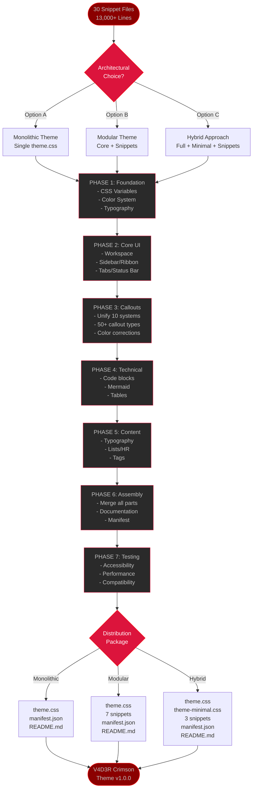

# V4D3R CRIMSON THEME - TRANSFORMATION WORKFLOW

## 📊 VISUAL PROCESS MAP



---

## 🎯 ARCHITECTURE COMPARISON MATRIX

| Feature | Monolithic | Modular | Hybrid |
|---------|-----------|---------|--------|
| **Installation Complexity** | ⭐ Simple | ⭐⭐⭐ Complex | ⭐⭐ Moderate |
| **User Customization** | ⭐⭐ Limited | ⭐⭐⭐⭐⭐ Excellent | ⭐⭐⭐⭐ Great |
| **File Management** | ⭐⭐⭐⭐⭐ Single file | ⭐ 8+ files | ⭐⭐⭐ 3-4 files |
| **Update Maintenance** | ⭐⭐⭐⭐ Easy | ⭐⭐ Moderate | ⭐⭐⭐ Good |
| **Distribution Ready** | ⭐⭐⭐⭐⭐ Theme store | ⭐⭐ GitHub only | ⭐⭐⭐⭐ Both |
| **Beginner Friendly** | ⭐⭐⭐⭐⭐ Very | ⭐⭐ Not much | ⭐⭐⭐⭐ Yes |
| **Power User Appeal** | ⭐⭐ Limited | ⭐⭐⭐⭐⭐ Maximum | ⭐⭐⭐⭐ High |
| **Toggle Flexibility** | ⭐⭐⭐ Comments | ⭐⭐⭐⭐⭐ File-based | ⭐⭐⭐⭐ Both |

**RECOMMENDATION**: **Hybrid** - Best balance for community distribution + power user adoption

---

## 📋 PHASE-BY-PHASE DELIVERABLES

### **PHASE 1: Foundation** (Turns 1-2)
**Input:** 30 snippet files
**Output:**
```
/theme-workspace/
├── 01-foundation-variables.css
│   ├── Color Palette (Red/Black/Grey)
│   ├── Typography System
│   ├── Spacing Scale
│   └── Animation Variables
├── color-mapping.md (Old → New color conversions)
└── variable-reference.md (Complete variable documentation)
```

---

### **PHASE 2: Core UI** (Turns 3-5)
**Input:** `___v4d3r-ui-system.css` + 3 UI snippets
**Output:**
```
/theme-workspace/
├── 02-core-ui.css
│   ├── Workspace & Canvas
│   ├── Ribbon & Sidebar (with glassmorphism)
│   ├── File Explorer (00-folder-tree integrated)
│   ├── Tabs & Tab Bar
│   ├── Status Bar & Titlebar
│   └── Metadata Panel
└── ui-toggle-guide.md (Toggle documentation)
```

---

### **PHASE 3: Callouts** (Turns 6-8)
**Input:** 10 callout systems
**Output:**
```
/theme-workspace/
├── 03-callouts-unified.css
│   ├── Essential Callouts (30 types)
│   ├── Neon Callout Mod (toggleable)
│   ├── Card Callout Mod (toggleable)
│   └── Shadow Callout Mod (toggleable)
├── 03-callouts-advanced.css (companion snippet - optional)
│   └── 50+ advanced callout types
└── callout-reference.md (Complete callout library documentation)
```

---

### **PHASE 4: Technical** (Turns 9-10)
**Input:** Code, Mermaid, Table snippets
**Output:**
```
/theme-workspace/
├── 04-technical.css
│   ├── Code Blocks (syntax highlighting)
│   ├── Inline Code
│   ├── Mermaid Charts
│   └── Tables
└── technical-customization.md (Advanced user guide)
```

---

### **PHASE 5: Content** (Turns 11-12)
**Input:** Typography, lists, tags, formatting snippets
**Output:**
```
/theme-workspace/
├── 05-content.css
│   ├── Typography (JetBrains Mono integration)
│   ├── Headers (with glow effects)
│   ├── Lists & Ordered Numbers
│   ├── Horizontal Rules
│   ├── Tags
│   └── Links & Wiki-links
└── content-guide.md (Typography and formatting guide)
```

---

### **PHASE 6: Assembly** (Turns 13-14)
**Input:** All phase outputs (01-05)
**Output:**
```
/v4d3r-crimson-theme/
├── manifest.json
├── theme.css (FULL - all features)
├── theme-minimal.css (LITE - essential only)
├── README.md (Installation and usage)
├── CHANGELOG.md
└── snippets/ (Optional companions)
    ├── v4d3r-callouts-advanced.css
    ├── v4d3r-experimental-effects.css
    └── v4d3r-plugin-integrations.css
```

---

### **PHASE 7: Testing** (Turn 15)
**Input:** Assembled theme package
**Output:**
```
/v4d3r-crimson-theme/
├── [All files from Phase 6]
├── ACCESSIBILITY-REPORT.md
├── COMPATIBILITY-MATRIX.md
└── INSTALLATION-GUIDE.md
```

**Final Package:** Ready for GitHub release + Obsidian theme store submission

---

## 🔴 COLOR CORRECTION STRATEGY

### **Automated Color Mapping**

```css
/* OLD PALETTE (Purple/Teal/Gold) → NEW PALETTE (Red/Black/Grey) */

/* PURPLE → RED */
#7800F4 → #DC143C (Primary Purple → Crimson Red)
#9333EA → #FF6B6B (Light Purple → Salmon Red)
#6B21A8 → #8B0000 (Dark Purple → Dark Red)

/* TEAL → GREY */
#72FFF1 → #C0C0C0 (Teal Accent → Silver Grey)
#5EEAD4 → #808080 (Light Teal → Medium Grey)
#14B8A6 → #4A4A4A (Dark Teal → Dark Grey)

/* GOLD → RED/GREY */
#FFC700 → #FF6B6B (Gold Highlight → Salmon Red)
#F59E0B → #DC143C (Orange → Crimson)
#D97706 → #8B0000 (Dark Orange → Dark Red)

/* BLUE/GREEN → GREY */
#3B82F6 → #808080 (Blue → Medium Grey)
#10B981 → #4A4A4A (Green → Dark Grey)
```

**Implementation:**
- Phase 1: Create CSS variables with new palette
- Phases 2-5: Find/replace all hex codes systematically
- Phase 7: Visual validation of all color corrections

---

## 📊 EXPECTED THEME STATISTICS

### **FULL THEME (theme.css)**
- **Lines of Code**: ~10,000-12,000
- **Toggle Sections**: 40-50
- **CSS Variables**: 150-200
- **Callout Types**: 30 essential + mods
- **File Size**: ~250-300 KB

### **MINIMAL THEME (theme-minimal.css)**
- **Lines of Code**: ~3,000-4,000
- **Toggle Sections**: 15-20 essential
- **CSS Variables**: 100-120
- **Callout Types**: 12 essential
- **File Size**: ~80-100 KB

### **COMPANION SNIPPETS** (Optional)
- **Advanced Callouts**: ~2,000 lines (50+ types)
- **Experimental Effects**: ~1,500 lines (glassmorphism, animations)
- **Plugin Integrations**: ~1,000 lines (Dataview, Tasks, etc.)

---

## ⚡ QUICK START CHECKLIST

Before we begin Phase 1, confirm these decisions:

- [ ] **Architecture**: Monolithic / Modular / **Hybrid** ← (Recommended)
- [ ] **Callout Scope**: All-in-one / Tiered / **Minimal** ← (Your choice)
- [ ] **Visual Effects**: Keep all / Moderate / **Minimal** ← (Your choice)
- [ ] **Color Palette**: Approve proposed values / Provide custom hex codes
- [ ] **Ready to proceed**: Yes / Need more time

**Once confirmed, I'll begin Phase 1 immediately.**
