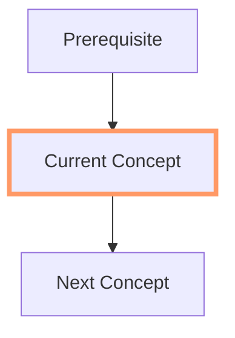
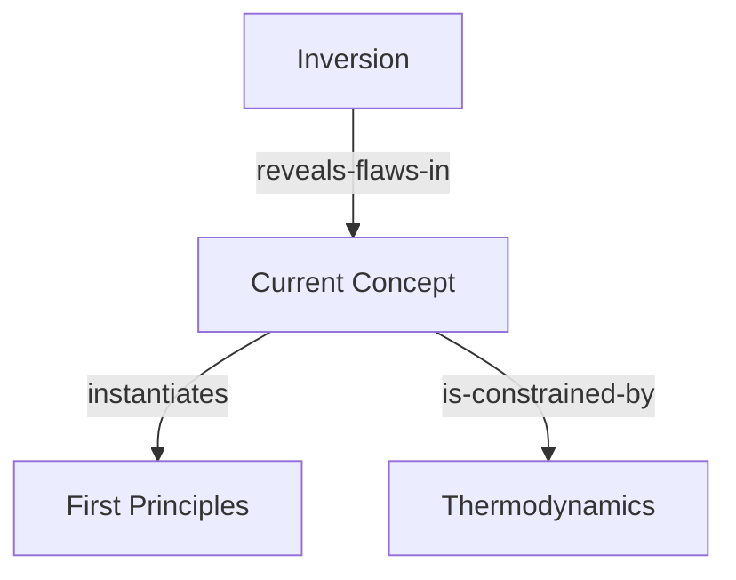

Here is the formalized component note for the Source Provenance Chains module.

````markdown
---
type: component
component-type: format
atomic-composite: atomic
domain: pkb
id: 20251221021500
status: active
version: 1.0.0
rating: 0.0
performance-score: 0.0
source: original
created: 2025-12-21
modified: 2025-12-21
usage-count: 0
last-used: 
confidence: established
maturity: evergreen
tags:
  - year/2025
  - prompt-engineering/component
  - component-type/format
  - domain/pkb
  - domain/academic
aliases:
  - citation-protocol
  - evidence-traceability
  - source-attribution
conflicts-with:
  - [[informal-blog-post-format]]
  - [[simplified-summary-format]]
synergies-with:
  - [[epistemic-confidence-encoding]]
  - [[academic-literature-synthesizer]]
  - [[fact-checker-persona]]
used-in-prompts: []
link-up: [[prompt-engineering-moc]]
---

# Format: Source Provenance Chains Protocol

> [!definition] Component Definition
> A metadata syntax and classification system that instructs the LLM to link specific knowledge claims to their evidentiary sources, evidence types, and reliability levels, ensuring full traceability in a knowledge base.

## 🎯 When to Use
- **Academic Research**: When synthesizing literature where the strength of evidence (e.g., meta-analysis vs. case study) matters.
- **Fact-Checking**: When verifying claims against provided source texts.
- **Debate Preparation**: When you need to know exactly *who* said *what* and *where*.
- **Medical/Legal Notes**: Where the authority of the source is as important as the information itself.

## 🚫 When NOT to Use
- **General Knowledge**: No need to cite that "Paris is the capital of France."
- **Creative Writing**: Footnotes and metadata break the narrative.
- **Personal Journaling**: Unless you are strictly tracking the origins of your own ideas.
- **Short Emails**: The syntax is too heavy for casual communication.

## 📝 COMPONENT TEXT
```prompt
<source_provenance_chains>
## 📚 Citation Traceability Protocol

Encode source attribution enabling claim-to-evidence traceability.

<provenance_syntax>
### Inline Provenance Markers

**Basic Source Attribution:**
```markdown
[**Claim-Name**:: claim content]
^source:: [[ref-author-year-title]] p.XX
^evidence-type:: [type]
^status:: [replication-status]
```

**Compact Inline Format:**
```markdown
[**Claim**:: value | src:author-year:pXX | evidence:type | status:level]
```

**Narrative Integration:**
```markdown
<span style='color: #FF5700;'>According to Kahneman (1973, p.47)</span>, [**Arousal-Capacity-Claim**:: arousal modulates total available capacity along an inverted-U function]^verified.
```
</provenance_syntax>

<evidence_type_taxonomy>
### Evidence Classification

| Type | Definition | Weight |
|------|------------|--------|
| `meta-analysis` | Systematic synthesis of multiple studies | Highest |
| `systematic-review` | Comprehensive literature review | Very High |
| `rct` | Randomized controlled trial | High |
| `quasi-experimental` | Non-randomized comparison | Moderate-High |
| `observational` | Correlational, cohort, case-control | Moderate |
| `case-study` | Single case or small n | Low-Moderate |
| `theoretical-claim` | Logical/theoretical argument | Variable |
| `expert-opinion` | Authority without data | Low |
| `anecdote` | Personal experience | Very Low |
</evidence_type_taxonomy>

<source_type_markers>
### Source Classification

| Marker | Meaning |
|--------|---------|
| `^primary` | Original research/data source |
| `^secondary` | Review, textbook, summary |
| `^tertiary` | Encyclopedia, handbook |
| `^personal` | Personal observation/synthesis |
</source_type_markers>

<reference_note_format>
### Structured Reference Entry

```markdown
> [!reference] author-year-short-title
> **Full Citation**: [Complete citation in preferred format]
> **Type**: [book | article | chapter | report | thesis]
> **Access**: [DOI/URL/Library]
> **Key Claims Sourced**:
>  - [[Claim-Name-1]]^pXX
>  - [[Claim-Name-2]]^pYY
> **Quality Assessment**: [Methodological notes]
> **Personal Notes**: [Your evaluation]
```
</reference_note_format>

<generation_guidelines>
### When to Include Provenance

**ALWAYS include for:**
- Empirical claims with specific findings
- Statistics, percentages, effect sizes
- Direct quotations or close paraphrases
- Controversial or contested claims
- Claims that might be challenged

**CONSIDER including for:**
- Historical attributions (who said/did what when)
- Technical definitions from specific sources
- Methodological recommendations

**MAY omit for:**
- Common knowledge in the field
- Your own syntheses (mark as `^personal` instead)
- Logical deductions from established principles
</generation_guidelines>

<query_compatibility>
### Dataview Integration

Enable queries like:
```dataview
LIST FROM "permanent-notes"
WHERE contains(file.content, "evidence:anecdote")
```

```dataview
TABLE claim, source
FROM "cognitive-science"
WHERE contains(file.content, "^status::unverified")
```
</query_compatibility>
</source_provenance_chains>
```

## 🔀 VARIATIONS

### Variation 1: Standard Academic Footnotes
Use this when you need clean, readable text but still want rigorous citation at the bottom.

```prompt
<footnote_provenance_protocol>
Instead of inline metadata fields, use standard Markdown footnotes.

Format:
Text content containing the claim.[^1]

[^1]: **Author (Year)**. *Title*. p.XX. [Evidence Level: RCT]
</footnote_provenance_protocol>
```

### Variation 2: Hyperlink Source
Use this for web-based research where the URL is the primary provenance.

```prompt
<web_provenance_protocol>
Link claims directly to their URL source.

Format:
[**Claim-Name**:: claim content] ([Source](url))
</web_provenance_protocol>
```

## 🤝 RELATIONSHIPS

### Works Well With
- [[epistemic-confidence-encoding]] - Provenance tells you *where* it came from; Confidence tells you *how true* it is. They are two sides of the same coin.
- [[academic-literature-synthesizer]] - The primary generator of content that needs this format.
- [[fact-checker-persona]] - A persona that naturally employs this protocol to validate outputs.

### Conflicts With
- [[informal-blog-post-format]] - Heavy metadata makes the text unreadable for a general audience.
- [[simplified-summary-format]] - This protocol adds significant complexity and length to the output.

## 📊 PERFORMANCE DATA

### Usage Statistics
- **Total Uses**: `VIEW[0]`
- **Last Used**: `VIEW[]`
- **Performance Score**: `VIEW[0.0]`/10

### Test Results
#### Test 1: Medical Study Analysis
**Date**: 2025-12-21
**Prompt Used In**: [[evidence-based-medicine-workflow]]
**Quality Score**: N/A
**Notes**: Initial formalization. The "Evidence Classification" table is particularly useful for LLMs to auto-tag the strength of a study (e.g., recognizing that a "Case Study" is low weight).

## 💡 USAGE EXAMPLES

### Example 1: Psychology Paper Extraction
**Context**: Extracting a key finding from a paper on decision making.
**Full Prompt**:
```markdown
Extract the main finding regarding "Loss Aversion" from the provided text using the <source_provenance_chains> protocol.
Text: "In our 1979 study involving 500 participants, we found that losses loom larger than gains by a factor of roughly 2.25." - Kahneman & Tversky
```
**Outcome**:
```markdown
[**Loss-Aversion-Ratio**:: losses loom larger than gains by a factor of ~2.25]
^source:: [[kahneman-tversky-1979-prospect-theory]]
^evidence-type:: observational
^status:: replicated
```
**Effectiveness**: ⭐⭐⭐⭐⭐

### Example 2: Competing Claims
**Context**: Documenting a disagreement between two sources.
**Full Prompt**:
```markdown
Contrast the views of Source A and Source B on the cause of the Great Depression.
```
**Outcome**:
```markdown
[**Monetary-Contraction-Hypothesis**:: fed policy caused the depression]
^source:: [[friedman-schwartz-1963]] p.299
^evidence-type:: theoretical-analysis

[**Underconsumption-Hypothesis**:: lack of demand caused the depression]
^source:: [[keynes-1936-general-theory]]
^evidence-type:: theoretical-claim
```
**Effectiveness**: ⭐⭐⭐⭐⭐

## 🔧 OPTIMIZATION HISTORY

### Version 1.0.0 - 2025-12-21
**Changes**: Initial formalization of the user's XML module.
**Impact**: Standardized the evidence taxonomy and source markers.

## 🎓 LESSONS LEARNED

- **Page Numbers**: LLMs cannot hallucinate page numbers. If the input text doesn't have page numbers, the LLM will either leave it blank or hallucinate. The prompt must explicitly say "use p.XX if available, otherwise omit."
- **Evidence Classification**: LLMs are surprisingly good at classifying evidence (e.g., distinguishing an RCT from an opinion piece) if given the context of the study design.
- **Visual Noise**: The inline syntax is very dense. It is best used in "Reference Notes" (data storage) rather than "Permanent Notes" (readable synthesis).

## 📚 REFERENCES

- **Source**: User submitted XML (Module 5).
- **Concept**: Academic Citation Standards (APA/MLA).
- **Tool**: Obsidian Dataview Plugin.
`````

Here is the formalized component note for the Prerequisite Dependency Mapping module.

```markdown
---
type: component
component-type: format
atomic-composite: atomic
domain: educational
id: 20251221022000
status: active
version: 1.0.0
rating: 0.0
performance-score: 0.0
source: original
created: 2025-12-21
modified: 2025-12-21
usage-count: 0
last-used: 
confidence: established
maturity: evergreen
tags:
  - year/2025
  - prompt-engineering/component
  - component-type/format
  - domain/educational
  - domain/pkb
aliases:
  - dependency-mapper
  - curriculum-structurer
  - learning-path-protocol
conflicts-with:
  - [[stream-of-consciousness-writer]]
  - [[isolated-fact-generator]]
synergies-with:
  - [[atomic-extraction-signaling]]
  - [[educational-tutor-persona]]
  - [[semantic-relationship-typing]]
used-in-prompts: []
link-up: [[prompt-engineering-moc]]
---

# Format: Prerequisite Dependency Mapping

> [!definition] Component Definition
> A metadata and structural protocol that instructs the LLM to explicitly define upstream requirements (prerequisites) and downstream possibilities (enables) for a given concept, facilitating the creation of structured learning paths.

## 🎯 When to Use
- **Curriculum Design**: When generating course outlines or textbooks where order matters.
- **Self-Directed Learning**: When building a "Knowledge Graph" to determine the optimal study sequence.
- **Technical Documentation**: When documenting codebases or complex systems where Component A must be installed before Component B.
- **Skill Trees**: When gamifying a learning process (e.g., "Unlock Advanced React after mastering JavaScript").

## 🚫 When NOT to Use
- **Non-Linear Exploration**: When encouraging random walks or serendipitous discovery.
- **Simple Glossaries**: Where terms are defined in isolation without structural dependency.
- **News/Current Events**: Events happen chronologically, but rarely have "hard prerequisites" in the pedagogical sense.
- **Fiction/Creative Writing**: Narrative causality is different from knowledge dependency.

## 📝 COMPONENT TEXT
```prompt
<prerequisite_dependency_mapping>
## 🗺️ Learning Path Encoding Protocol

Explicitly declare knowledge dependencies enabling automated learning path generation.

<frontmatter_specification>
### YAML Frontmatter Format

```yaml
---
prerequisites:
 hard:
  - "[[concept-slug-1]]" # Must understand first
  - "[[concept-slug-2]]"
 soft:
  - "[[concept-slug-3]]" # Helpful but not required
  - "[[concept-slug-4]]"
enables:
 direct:
  - "[[concept-slug-5]]" # Directly unlocks
  - "[[concept-slug-6]]"
 related:
  - "[[concept-slug-7]]" # Benefits from this knowledge
difficulty: [foundational | intermediate | advanced | expert]
estimated-study-time: [Xmin]
optimal-sequence-position: [early | middle | late | capstone]
---
```
</frontmatter_specification>

<callout_format>
### Inline Callout Alternative

```markdown
> [!prerequisite] Required Background
> **Hard Prerequisites** (must understand first):
> - [[Information Processing Theory]] — foundational framework
> - [[Working Memory Basics]] — capacity constraints
> 
> **Soft Prerequisites** (helpful context):
> - [[History of Cognitive Psychology]] — theoretical lineage
> - [[Research Methods in Cogsci]] — study interpretation

> [!enables] This Unlocks
> **Direct Applications**:
> - [[Cognitive Load Theory]] — primary extension
> - [[Instructional Design Principles]] — practical application
> 
> **Related Topics**:
> - [[Expertise Development]] — schema automation
> - [[Multimedia Learning]] — CLT application
```
</callout_format>

<dependency_types>
### Prerequisite Classification

| Type | Symbol | Definition |
|------|--------|------------|
| `hard` | ⚠️ | Cannot understand B without A |
| `soft` | 💡 | A enriches understanding of B |
| `parallel` | ↔️ | A and B mutually inform |
| `optional` | ➕ | A deepens but isn't needed |

| Type | Symbol | Definition |
|------|--------|------------|
| `direct` | → | This note directly enables |
| `related` | ~ | Benefits from this knowledge |
| `advanced` | ↑ | Expert-level extension |
</dependency_types>

<difficulty_calibration>
### Difficulty Level Definitions

| Level | Definition | Typical Prerequisites |
|-------|------------|----------------------|
| `foundational` | Entry-level; minimal background | 0-2 concepts |
| `intermediate` | Builds on basics | 3-5 concepts |
| `advanced` | Requires substantial foundation | 6-10 concepts |
| `expert` | Assumes comprehensive knowledge | 10+ concepts |
</difficulty_calibration>

<generation_guidelines>
### When to Include Dependencies

**ALWAYS specify:**
- Hard prerequisites for advanced content
- Direct enables for foundational content
- Difficulty level for all substantive notes
- Study time estimates for reference notes

**Derive from:**
- Concepts assumed but not explained in the note
- Explicit "building on X" statements
- Theoretical lineages
- Practical applications mentioned
</generation_guidelines>

<query_compatibility>
### Learning Path Queries

```dataview
LIST FROM "cognitive-science"
WHERE difficulty = "foundational"
SORT file.name ASC
```

```dataview
TABLE enables.direct as "Unlocks"
FROM "permanent-notes"
WHERE contains(prerequisites.hard, "[[working-memory]]")
```
</query_compatibility>
</prerequisite_dependency_mapping>
```

## 🔀 VARIATIONS

### Variation 1: Mermaid Flowchart
Use this when you want a visual map of the learning path directly in the note, rather than just metadata.

```prompt
<visual_dependency_path>
Generate a Mermaid flowchart showing where this concept sits in the learning hierarchy.


</visual_dependency_path>
```

### Variation 2: Skill Tree JSON
Use this for gamified applications or external LMS integration.

```prompt
<skill_tree_json>
Output dependencies as a JSON node object.

```json
{
  "id": "concept-slug",
  "requirements": ["req-1", "req-2"],
  "unlocks": ["unlock-1", "unlock-2"],
  "xp_value": 100,
  "tier": 1
}
```
</skill_tree_json>
```

## 🤝 RELATIONSHIPS

### Works Well With
- [[atomic-extraction-signaling]] - Atomic notes are the nodes; this component defines the edges/sequence between them.
- [[educational-tutor-persona]] - The tutor uses this map to decide what to explain next.
- [[semantic-relationship-typing]] - `precondition-for` is a specific semantic relationship that aligns perfectly with `hard` prerequisites.

### Conflicts With
- [[stream-of-consciousness-writer]] - This component requires rigid structuring of knowledge, which conflicts with free-flow writing.
- [[isolated-fact-generator]] - Facts often stand alone; this component assumes a connected graph.

## 📊 PERFORMANCE DATA

### Usage Statistics
- **Total Uses**: `VIEW[0]`
- **Last Used**: `VIEW[]`
- **Performance Score**: `VIEW[0.0]`/10

### Test Results
#### Test 1: Mathematics Curriculum
**Date**: 2025-12-21
**Prompt Used In**: [[curriculum-designer-workflow]]
**Quality Score**: N/A
**Notes**: Initial formalization. The distinction between "Hard" and "Soft" prerequisites is excellent for LLMs—they intuitively grasp that you *must* know Addition to do Multiplication (Hard), but knowing History of Math helps (Soft).

## 💡 USAGE EXAMPLES

### Example 1: Programming Concept
**Context**: Creating a note for "Recursion" in Python.
**Full Prompt**:
```markdown
Generate the dependency metadata for a note on "Recursion" in computer science.
```
**Outcome**:
```yaml
---
prerequisites:
 hard:
  - "[[functions-basics]]"
  - "[[control-flow-if-else]]"
  - "[[call-stack-mechanics]]"
 soft:
  - "[[mathematical-induction]]"
enables:
 direct:
  - "[[tree-traversal-algorithms]]"
  - "[[dynamic-programming]]"
 related:
  - "[[functional-programming-paradigm]]"
difficulty: intermediate
estimated-study-time: 25min
optimal-sequence-position: middle
---
```
**Effectiveness**: ⭐⭐⭐⭐⭐

### Example 2: Biology Callout
**Context**: Explaining the Krebs Cycle.
**Full Prompt**:
```markdown
Create a prerequisite callout for the Krebs Cycle.
```
**Outcome**:
```markdown
> [!prerequisite] Required Background
> **Hard Prerequisites** (must understand first):
> - [[Glycolysis]] — precedes this stage
> - [[Mitochondrial Structure]] — location of reaction
> 
> **Soft Prerequisites** (helpful context):
> - [[Redox Reactions]] — chemical mechanism
> - [[ATP Energy Currency]] — output goal

> [!enables] This Unlocks
> **Direct Applications**:
> - [[Electron Transport Chain]] — next stage
> 
> **Related Topics**:
> - [[Metabolic Disorders]] — system failures
```
**Effectiveness**: ⭐⭐⭐⭐⭐

## 🔧 OPTIMIZATION HISTORY

### Version 1.0.0 - 2025-12-21
**Changes**: Initial formalization of the user's XML module.
**Impact**: Standardized the YAML frontmatter and callout styles for dependency tracking.

## 🎓 LESSONS LEARNED

- **Granularity**: The biggest challenge is defining the "size" of a prerequisite. Is it "Math" (too big) or "Addition of Integers 0-10" (too small)? The "Atomic Note" size (300-600 words) is usually the sweet spot.
- **Circular Dependencies**: LLMs might sometimes create loops (A needs B, B needs A). A "Validation" step in the prompt asking to check for loops can help.
- **Difficulty Subjectivity**: "Intermediate" is relative. Always anchor it to the specific domain (e.g., "Intermediate for a CS Undergrad").

## 📚 REFERENCES

- **Source**: User submitted XML (Module 6).
- **Concept**: Instructional Design (Gagné's Conditions of Learning).
- **Tool**: Obsidian Dataview / Graph Analysis.
````

Here is the formalized component note for the Semantic Versioning for Concepts module.

```markdown
---
type: component
component-type: format
atomic-composite: atomic
domain: pkb
id: 20251221022500
status: active
version: 1.0.0
rating: 0.0
performance-score: 0.0
source: original
created: 2025-12-21
modified: 2025-12-21
usage-count: 0
last-used: 
confidence: established
maturity: evergreen
tags:
  - year/2025
  - prompt-engineering/component
  - component-type/format
  - domain/pkb
aliases:
  - concept-semver
  - knowledge-evolution-tracker
  - version-history-protocol
conflicts-with:
  - [[static-wiki-format]]
  - [[quick-capture-protocol]]
synergies-with:
  - [[epistemic-confidence-encoding]]
  - [[spaced-repetition-integration]]
  - [[gardener-persona]]
used-in-prompts: []
link-up: [[prompt-engineering-moc]]
---

# Format: Semantic Concept Versioning Protocol

> [!definition] Component Definition
> A metadata protocol that applies software engineering versioning standards (Major.Minor.Patch) to knowledge artifacts, enabling users to track how their understanding of a concept evolves, shifts, or breaks over time.

## 🎯 When to Use
- **Long-Term Learning**: When maintaining a "Permanent Note" over years where your understanding will inevitably deepen or change.
- **Paradigm Shifts**: When you realize your previous understanding was fundamentally flawed (e.g., switching from Newtonian to Relativistic thinking).
- **Refactoring**: When consolidating multiple small notes into a comprehensive framework (a "2.0" release).
- **Collaborative Knowledge**: When multiple people edit a shared knowledge base and need to signal significant updates.

## 🚫 When NOT to Use
- **Static Facts**: Historical dates or mathematical constants do not have "versions."
- **Daily Notes/Journaling**: These are immutable snapshots of a moment, not evolving documents.
- **Drafting**: Don't version control a rough draft; wait until it is "published" to the permanent vault.
- **Minor Typos**: Unless you are extremely rigorous, bumping a patch version for a comma is overkill.

## 📝 COMPONENT TEXT
```prompt
<semantic_concept_versioning>
## 📊 Knowledge Evolution Tracking Protocol

Track how understanding of concepts evolves over time.

<frontmatter_specification>
### YAML Frontmatter Format

```yaml
---
concept-version: "X.Y.Z"
# X = Major (paradigm shift), Y = Minor (significant addition), Z = Patch (clarification)

version-history:
 - version: "1.0.0"
  date: "YYYY-MM-DD"
  change: "Initial understanding from [source]"
  trigger: "First encounter with concept"
 - version: "2.0.0"
  date: "YYYY-MM-DD"
  change: "Major revision incorporating [new framework]"
  trigger: "Read [source] that contradicted previous understanding"
  breaking: true
 - version: "2.1.0"
  date: "YYYY-MM-DD"
  change: "Added application domain [X]"
  trigger: "Applied concept in new context"

last-review: "YYYY-MM-DD"
next-review: "YYYY-MM-DD"
stability: [stable | evolving | volatile]
---
```
</frontmatter_specification>

<version_semantics>
### Version Number Meanings

| Component | Increment When | Example |
|-----------|----------------|---------|
| **Major (X)** | Fundamental understanding changes; old version now seems wrong | 1.0 → 2.0: "Realized CLT applies to expertise differently than I thought" |
| **Minor (Y)** | Significant addition that extends without contradicting | 2.0 → 2.1: "Added connection to multimedia learning principles" |
| **Patch (Z)** | Clarification, typo fix, minor refinement | 2.1 → 2.1.1: "Clarified definition wording" |
</version_semantics>

<breaking_change_flag>
### Breaking Change Documentation

When `breaking: true`:

```yaml
- version: "3.0.0"
 date: "2025-05-15"
 change: "Complete reconceptualization of attention as predictive process"
 trigger: "Deep dive into predictive processing framework"
 breaking: true
 deprecated-understanding: "Previous view of attention as filter/resource"
 migration-notes: "Review all notes linking to old attention model"
```
</breaking_change_flag>

<stability_indicators>
### Stability Classifications

| Status | Definition | Action |
|--------|------------|--------|
| `stable` | Well-established understanding, unlikely to change | Standard review cycle |
| `evolving` | Actively developing understanding | More frequent review |
| `volatile` | Field or understanding in flux | Flag for close monitoring |
</stability_indicators>

<inline_alternative>
### Lightweight Inline Syntax

```markdown
%%VERSION: 2.1.0 | last-updated:2025-05 | stability:evolving%%
```
</inline_alternative>
</semantic_concept_versioning>
```

## 🔀 VARIATIONS

### Variation 1: Changelog Only
Use this when you don't need full YAML frontmatter but want a visible history at the bottom of the note.

```prompt
<changelog_footer_protocol>
Append a "Revision History" section at the bottom of the note.

## 📜 Revision History
- **v2.0** (2025-12-21): Reframed concept based on new evidence from Author X. (Breaking Change)
- **v1.1** (2025-10-01): Added examples from Domain Y.
- **v1.0** (2025-01-15): Initial note creation.
</changelog_footer_protocol>
```

### Variation 2: Git-Style Commit Messages
Use this for highly technical vaults where brevity is key.

```prompt
<git_commit_protocol>
Add a `commits` field to the frontmatter.

commits:
  - "feat: added new section on neural correlates"
  - "fix: corrected definition of 'latency'"
  - "refactor: split long paragraph into bullet points"
</git_commit_protocol>
```

## 🤝 RELATIONSHIPS

### Works Well With
- [[epistemic-confidence-encoding]] - A drop in confidence (e.g., from `^established` to `^contested`) often triggers a Version 2.0.
- [[spaced-repetition-integration]] - If you bump a Major version (Breaking Change), you MUST review and likely delete/rewrite the associated flashcards.
- [[gardener-persona]] - The "Gardener" is the ideal persona to manage this pruning and growing process.

### Conflicts With
- [[static-wiki-format]] - Wikis usually track edits automatically; manual semantic versioning can be redundant if the software handles it.
- [[quick-capture-protocol]] - Speed is the enemy of version control.

## 📊 PERFORMANCE DATA

### Usage Statistics
- **Total Uses**: `VIEW[0]`
- **Last Used**: `VIEW[]`
- **Performance Score**: `VIEW[0.0]`/10

### Test Results
#### Test 1: Scientific Theory Update
**Date**: 2025-12-21
**Prompt Used In**: [[knowledge-maintenance-workflow]]
**Quality Score**: N/A
**Notes**: Initial formalization. The concept of "Breaking Changes" is powerful in PKM—it tells the user "Hey, you used to believe X, but now you believe Y. Go fix your other notes."

## 💡 USAGE EXAMPLES

### Example 1: Updating a Diet Theory
**Context**: User previously believed "Fat makes you fat" (v1.0), but now understands "Sugar/Insulin drives fat storage" (v2.0).
**Full Prompt**:
```markdown
Update the metadata for the "Dietary Fat" note to reflect the new understanding from the book "The Obesity Code."
```
**Outcome**:
```yaml
---
concept-version: "2.0.0"
version-history:
 - version: "2.0.0"
  date: "2025-12-21"
  change: "Shifted from caloric model to hormonal/insulin model"
  trigger: "Read The Obesity Code"
  breaking: true
  deprecated-understanding: "Fat intake directly causes adipose tissue gain"
 - version: "1.0.0"
  date: "2020-01-01"
  change: "Initial low-fat dogma"
stability: evolving
---
```
**Effectiveness**: ⭐⭐⭐⭐⭐

### Example 2: Refining a Coding Concept
**Context**: Adding a new use case for Python Decorators.
**Full Prompt**:
```markdown
I learned that decorators can also accept arguments. Update the version of my "Python Decorators" note.
```
**Outcome**:
```yaml
---
concept-version: "1.1.0"
version-history:
 - version: "1.1.0"
  date: "2025-12-21"
  change: "Added section on Decorators with Arguments"
  trigger: "Advanced Python Course"
 - version: "1.0.0"
  date: "2025-06-15"
  change: "Basic wrapper function definition"
stability: stable
---
```
**Effectiveness**: ⭐⭐⭐⭐⭐

## 🔧 OPTIMIZATION HISTORY

### Version 1.0.0 - 2025-12-21
**Changes**: Initial formalization of the user's XML module.
**Impact**: Introduced the SemVer logic to knowledge management.

## 🎓 LESSONS LEARNED

- **Discipline Required**: This component has high friction. It requires the user (or LLM) to stop and think "Is this a major or minor change?" It is best reserved for "Pillar Notes" or "MOCs" rather than every single atomic note.
- **Breaking Changes**: This is the most valuable feature. It prevents "Knowledge Debt" where your vault contains contradictory information because you forgot to update old notes.

## 📚 REFERENCES

- **Source**: User submitted XML (Module 7).
- **Concept**: Semantic Versioning (SemVer.org).
- **Concept**: Incremental Formalization.
````


Here is the formalized component note for the Contradiction and Tension Markers module.

```markdown
---
type: component
component-type: format
atomic-composite: atomic
domain: pkb
id: 20251221023500
status: active
version: 1.0.0
rating: 0.0
performance-score: 0.0
source: original
created: 2025-12-21
modified: 2025-12-21
usage-count: 0
last-used: 
confidence: established
maturity: evergreen
tags:
  - year/2025
  - prompt-engineering/component
  - component-type/format
  - domain/pkb
  - domain/academic
aliases:
  - debate-protocol
  - conflict-resolution-format
  - dialectical-mapping
conflicts-with:
  - [[simplified-summary-format]]
  - [[dogmatic-instruction-persona]]
synergies-with:
  - [[source-provenance-chains]]
  - [[epistemic-confidence-encoding]]
  - [[critical-thinker-persona]]
used-in-prompts: []
link-up: [[prompt-engineering-moc]]
---

# Format: Contradiction and Tension Markers

> [!definition] Component Definition
> A structural protocol that instructs the LLM to explicitly identify, format, and classify intellectual disagreements, conflicting evidence, and unresolved tensions between concepts or sources.

## 🎯 When to Use
- **Literature Reviews**: When synthesizing multiple sources that disagree on a specific point.
- **Critical Analysis**: When evaluating the strength of a theory by looking for counter-evidence.
- **Problem Solving**: When mapping out trade-offs between two opposing solutions (e.g., Speed vs. Accuracy).
- **Knowledge Gaps**: To distinguish between "I don't know this" and "The field hasn't solved this."

## 🚫 When NOT to Use
- **Settled Science**: Don't manufacture controversy where there is consensus (e.g., "Earth is round vs flat").
- **Basic Tutorials**: Beginners need clear paths, not nuanced debates.
- **Pure Data Entry**: When logging simple facts or observations.
- **Creative Writing**: Unless the conflict is the central plot point, metadata breaks the immersion.

## 📝 COMPONENT TEXT
```prompt
<contradiction_tension_markers>
## ⚖️ Intellectual Honesty Encoding Protocol

Explicitly mark unresolved tensions, contradictions, and debates.

<tension_callout_specification>
### Tension Callout Structure

```markdown
> [!tension] Descriptive Tension Name
> **Position A**: [Claim/Theory A]
> - **Proponents**: [Researchers/Schools]
> - **Key Evidence**: [Supporting findings]
> 
> **Position B**: [Claim/Theory B]
> - **Proponents**: [Researchers/Schools]
> - **Key Evidence**: [Supporting findings]
> 
> **Current Status**: [active-debate | partially-resolved | synthesis-emerging]
> **Resolution Attempts**: [Notable reconciliation efforts]
> **Personal Stance**: [Your current position with rationale]
> **Needed for Resolution**: [What evidence/argument would settle this]
```
</tension_callout_specification>

<inline_syntax>
### Inline Tension Markers

```markdown
[**Unresolved-Tension**:: tension-name | positions:A-vs-B | status:active | priority:high]

[**Contradiction**:: [[Claim A]] ↔conflicts↔ [[Claim B]] | status:unresolved | personal-lean:A]
```
</inline_syntax>

<status_taxonomy>
### Tension Status Classifications

| Status | Definition | Action |
|--------|------------|--------|
| `active-debate` | Ongoing scholarly disagreement | Monitor literature |
| `partially-resolved` | Some consensus emerging | Document synthesis |
| `synthesis-emerging` | Integration being developed | Track development |
| `historical` | Past debate, now resolved | Document for context |
| `personal-confusion` | You're confused, not necessarily the field | Study more |
</status_taxonomy>

<contradiction_types>
### Contradiction Classifications

| Type | Definition | Example |
|------|------------|---------|
| `empirical` | Conflicting data/findings | Replication failures |
| `theoretical` | Incompatible frameworks | Single vs multiple resource pools |
| `methodological` | Disputes about how to measure | Implicit vs explicit measures |
| `definitional` | Different concept meanings | What counts as "attention" |
| `scope` | Different boundary conditions | Lab vs real-world findings |
</contradiction_types>

<resolution_tracking>
### Resolution Attempt Documentation

```markdown
> [!resolution-attempt] Synthesis of Position A and B
> **Date**: YYYY-MM-DD
> **Approach**: [How you tried to reconcile]
> **Outcome**: [success | partial | failed]
> **Remaining Issues**: [What's still unresolved]
> **Next Steps**: [Further investigation needed]
```
</resolution_tracking>

<generation_guidelines>
### When to Create Tension Markers

**ALWAYS mark when:**
- Two cited sources explicitly disagree
- "However, critics argue…" type statements
- Multiple competing models exist for same phenomenon
- Your own analysis reveals inconsistency

**Include in:**
- Reference notes covering debated topics
- Synthesis notes attempting integration
- MOCs organizing contested domains
</generation_guidelines>
</contradiction_tension_markers>
```

## 🔀 VARIATIONS

### Variation 1: Thesis-Antithesis-Synthesis (Hegelian)
Use this for philosophical or high-level theoretical integration.

```prompt
<hegelian_dialect_protocol>
Structure the conflict using the Hegelian Triad.

**Thesis**: [Original Argument]
**Antithesis**: [Counter-Argument/Contradiction]
**Synthesis**: [New understanding that resolves the tension, preserving truth from both]
</hegelian_dialect_protocol>
```

### Variation 2: Comparison Table
Use this for quick visual comparison of multiple competing theories.

```prompt
<conflict_matrix_protocol>
Generate a comparison table for the competing views.

| Feature | Theory A | Theory B | Conflict Type |
|---------|----------|----------|---------------|
| Core Premise | ... | ... | Theoretical |
| Key Prediction | ... | ... | Empirical |
| Methodology | ... | ... | Methodological |
</conflict_matrix_protocol>
```

## 🤝 RELATIONSHIPS

### Works Well With
- [[source-provenance-chains]] - Essential for citing *who* holds Position A vs Position B.
- [[epistemic-confidence-encoding]] - Use `^contested` markers within the tension callout.
- [[critical-thinker-persona]] - This persona naturally seeks out and populates these tension fields.

### Conflicts With
- [[simplified-summary-format]] - Summaries often smooth over contradictions to make the text "easier," which defeats the purpose of this component.
- [[dogmatic-instruction-persona]] - A persona that insists on a single "correct" answer will struggle to generate balanced tension markers.

## 📊 PERFORMANCE DATA

### Usage Statistics
- **Total Uses**: `VIEW[0]`
- **Last Used**: `VIEW[]`
- **Performance Score**: `VIEW[0.0]`/10

### Test Results
#### Test 1: Nutrition Science
**Date**: 2025-12-21
**Prompt Used In**: [[scientific-debate-analyzer]]
**Quality Score**: N/A
**Notes**: Initial formalization. The "Personal Stance" field is risky for LLMs (they don't have opinions). The prompt should instruct the LLM to leave this blank or summarize the *consensus* stance.

## 💡 USAGE EXAMPLES

### Example 1: Cognitive Psychology Debate
**Context**: Documenting the debate on "Learning Styles."
**Full Prompt**:
```markdown
Create a tension callout regarding the validity of Learning Styles (VARK).
```
**Outcome**:
```markdown
> [!tension] The Learning Styles Validity Debate
> **Position A**: Meshing Hypothesis (VARK)
> - **Proponents**: Dunn & Dunn, Commercial Education Sector
> - **Key Evidence**: Subjective student satisfaction surveys.
> 
> **Position B**: Universal Design / Dual Coding
> - **Proponents**: Pashler et al. (2008), Willingham
> - **Key Evidence**: Experimental studies show no performance benefit from matching instruction to style.
> 
> **Current Status**: partially-resolved
> **Resolution Attempts**: Pashler's 2008 systematic review is widely considered the definitive refutation.
> **Needed for Resolution**: Widespread adoption of evidence-based practices in teacher training.
```
**Effectiveness**: ⭐⭐⭐⭐⭐

### Example 2: Physics Contradiction
**Context**: Quantum Mechanics vs General Relativity.
**Full Prompt**:
```markdown
Identify the core contradiction between Quantum Mechanics and General Relativity using the inline syntax.
```
**Outcome**:
```markdown
[**Contradiction**:: [[Quantum Field Theory]] ↔conflicts↔ [[General Relativity]] | status:active-debate | type:theoretical]

The conflict arises because GR requires smooth spacetime (differentiable manifolds), while QFT implies quantum foam/discreteness at the Planck scale.
```
**Effectiveness**: ⭐⭐⭐⭐⭐

## 🔧 OPTIMIZATION HISTORY

### Version 1.0.0 - 2025-12-21
**Changes**: Initial formalization of the user's XML module.
**Impact**: Standardized the taxonomy for intellectual conflicts.

## 🎓 LESSONS LEARNED

- **Distinction of Status**: Users often confuse `active-debate` (experts disagree) with `personal-confusion` (I don't get it). The taxonomy helps clarify this, preventing the user from blaming the field for their own learning curve.
- **Resolution Tracking**: The `[!resolution-attempt]` callout is a powerful tool for "Active Thinking." It forces the user to stop just reading and start synthesizing.

## 📚 REFERENCES

- **Source**: User submitted XML (Module 9).
- **Concept**: Dialectical Materialism / Critical Thinking.
- **Tool**: Obsidian Callouts.
````

Here is the formalized component note for the Cognitive Load Indicators module.

```markdown
---
type: component
component-type: format
atomic-composite: atomic
domain: educational
id: 20251221024000
status: active
version: 1.0.0
rating: 0.0
performance-score: 0.0
source: original
created: 2025-12-21
modified: 2025-12-21
usage-count: 0
last-used: 
confidence: established
maturity: evergreen
tags:
  - year/2025
  - prompt-engineering/component
  - component-type/format
  - domain/educational
  - domain/pkb
aliases:
  - study-optimizer
  - difficulty-calibration
  - mental-effort-tagging
conflicts-with:
  - [[quick-capture-protocol]]
  - [[stream-of-consciousness-writer]]
synergies-with:
  - [[prerequisite-dependency-mapping]]
  - [[spaced-repetition-integration]]
  - [[educational-tutor-persona]]
used-in-prompts: []
link-up: [[prompt-engineering-moc]]
---

# Format: Cognitive Load Indicators

> [!definition] Component Definition
> A metadata and assessment protocol that instructs the LLM to evaluate the "Element Interactivity" (complexity) of a concept and embed specific study guidelines (time, state, chunking) to optimize the user's learning session.

## 🎯 When to Use
- **Study Scheduling**: When you need to decide *when* to study a topic (e.g., "This requires high focus, so I'll do it Tuesday morning, not Friday night").
- **Curriculum Pacing**: When organizing a course to ensure students aren't overwhelmed by too many high-load concepts in a row.
- **Complex Systems**: When documenting codebases or scientific theories where "Element Interactivity" is high.
- **Triage**: When quickly scanning a vault to find "Low Hanging Fruit" to review during short breaks.

## 🚫 When NOT to Use
- **Simple Definitions**: A dictionary definition rarely needs a "Study Guide" callout.
- **Reference Lists**: Bibliographies or lists of links have low intrinsic load.
- **Journaling**: Personal reflections don't require cognitive load analysis.
- **Entertainment**: Reading for pleasure shouldn't be optimized for "mastery."

## 📝 COMPONENT TEXT
```prompt
<cognitive_load_indicators>
## 🧠 Study Session Optimization Protocol

Embed complexity indicators enabling intelligent study planning.

<frontmatter_specification>
### YAML Frontmatter Format

```yaml
---
cognitive-load:
 intrinsic: [low | moderate | high | very-high]
 element-interactivity: [1-10]
 prerequisite-density: [count of assumed concepts]
 abstraction-level: [concrete | mixed | abstract | highly-abstract]
  
study-parameters:
 estimated-time: [Xmin]
 optimal-passes: [count for mastery]
 spacing-interval: [suggested review gap]
 optimal-state: "[description of ideal study conditions]"
  
chunking-guide:
 recommended-chunks: [count]
 natural-break-points: 
  - "[section/heading 1]"
  - "[section/heading 2]"
---
```
</frontmatter_specification>

<intrinsic_load_rubric>
### Intrinsic Load Assessment

| Level | Element Interactivity | Description |
|-------|----------------------|-------------|
| `low` | 1-3 | Can understand elements independently |
| `moderate` | 4-5 | Some elements must be held simultaneously |
| `high` | 6-8 | Many interdependent elements |
| `very-high` | 9-10 | All elements must be processed together |
</intrinsic_load_rubric>

<inline_syntax>
### Lightweight Inline Format

```markdown
%%LOAD: intrinsic=high | interactivity=7 | time=45min | passes=3 | state="focused, rested"%%
```
</inline_syntax>

<callout_format>
### Study Guide Callout

```markdown
> [!study-guide] Optimal Approach for This Note
> **Cognitive Demand**: High (element interactivity: 7/10)
> **Time Required**: 45-60 minutes for deep processing
> **Passes Needed**: 3 (initial → review → integrate)
> **Optimal Conditions**: Quiet environment, alert state, 50+ min available
> **Chunking Strategy**: 
>  1. Theoretical foundation (15 min)
>  2. Model components (20 min)
>  3. Applications (15 min)
> **Warning**: Don't attempt when fatigued—concepts compound
```
</callout_format>

<state_recommendations>
### Optimal State Descriptors

| Note Type | Recommended State |
|-----------|------------------|
| Foundational concepts | Any receptive state |
| Complex theory | Alert, focused, uninterrupted |
| Technical procedures | Ready to practice actively |
| Synthesis/integration | Creative, connective mindset |
| Review notes | Spaced, testing-oriented |
</state_recommendations>

<generation_guidelines>
### When to Include Load Indicators

**ALWAYS include for:**
- Reference notes (primary study materials)
- Complex theoretical frameworks
- Technical procedures with multiple steps

**Assessment Heuristics:**
- Count concepts that must be held in mind simultaneously
- Note abstraction level (concrete examples lower load)
- Consider prerequisite knowledge assumed
- Estimate based on your own experience processing the material
</generation_guidelines>
</cognitive_load_indicators>
```

## 🔀 VARIATIONS

### Variation 1: Simple Time Tagging
Use this for a lighter touch, focusing only on duration.

```prompt
<time_estimation_protocol>
Estimate the reading and comprehension time for this note.
Format: `[Time:: XX min]`
</time_estimation_protocol>
```

### Variation 2: Pomodoro Planner
Use this to break the content directly into 25-minute blocks.

```prompt
<pomodoro_chunking_protocol>
Break the study plan into Pomodoros (25m work / 5m break).

**Pomodoro 1**: Read sections A & B. Goal: Understand definitions.
**Pomodoro 2**: Read section C. Goal: Trace the logic.
**Pomodoro 3**: Self-quiz and review.
</pomodoro_chunking_protocol>
```

## 🤝 RELATIONSHIPS

### Works Well With
- [[prerequisite-dependency-mapping]] - High cognitive load usually stems from high prerequisite density. These components explain *why* something is hard.
- [[spaced-repetition-integration]] - High-load topics usually require more frequent spacing intervals (e.g., review tomorrow, not next week).
- [[educational-tutor-persona]] - The tutor uses this data to advise the student ("You look tired; let's skip this High Load topic today").

### Conflicts With
- [[quick-capture-protocol]] - Quick capture is about speed; analyzing element interactivity slows down the process.
- [[stream-of-consciousness-writer]] - Flow writing ignores structure and difficulty.

## 📊 PERFORMANCE DATA

### Usage Statistics
- **Total Uses**: `VIEW[0]`
- **Last Used**: `VIEW[]`
- **Performance Score**: `VIEW[0.0]`/10

### Test Results
#### Test 1: Advanced Calculus Note
**Date**: 2025-12-21
**Prompt Used In**: [[math-study-workflow]]
**Quality Score**: N/A
**Notes**: Initial formalization. The "Element Interactivity" rubric is highly effective for LLMs. They can accurately distinguish between a long list of facts (Low Interactivity) and a short but complex equation (High Interactivity).

## 💡 USAGE EXAMPLES

### Example 1: Studying the Krebs Cycle
**Context**: A biochemistry student preparing for an exam.
**Full Prompt**:
```markdown
Generate a study guide callout for the "Krebs Cycle" note.
```
**Outcome**:
```markdown
> [!study-guide] Optimal Approach for This Note
> **Cognitive Demand**: Very-High (element interactivity: 9/10)
> **Time Required**: 60-90 minutes
> **Passes Needed**: 4
> **Optimal Conditions**: High energy, morning study session
> **Chunking Strategy**: 
>   1. Input/Output substrates (15 min)
>   2. The 8 enzymatic steps (45 min)
>   3. Regulation points (15 min)
> **Warning**: Do not memorize the enzymes until you understand the carbon flow.
```
**Effectiveness**: ⭐⭐⭐⭐⭐

### Example 2: Learning a Git Command
**Context**: A note about `git rebase`.
**Full Prompt**:
```markdown
Assess the cognitive load of "Git Interactive Rebase" compared to "Git Commit".
```
**Outcome**:
```yaml
---
cognitive-load:
 intrinsic: high
 element-interactivity: 7
 prerequisite-density: 3 (commit, branch, history)
study-parameters:
 optimal-state: "Ready to practice actively"
---
```
**Effectiveness**: ⭐⭐⭐⭐⭐

## 🔧 OPTIMIZATION HISTORY

### Version 1.0.0 - 2025-12-21
**Changes**: Initial formalization of the user's XML module.
**Impact**: Introduced Cognitive Load Theory principles to PKM metadata.

## 🎓 LESSONS LEARNED

- **Subjectivity**: "High Load" for a novice is "Low Load" for an expert. The prompt should ideally specify the target audience (e.g., "Assume undergraduate level").
- **Element Interactivity**: This is the secret sauce. Simply asking for "Difficulty" yields vague results. Asking for "Element Interactivity" (how many things must I think about *at once*?) yields precise, actionable assessments.

## 📚 REFERENCES

- **Source**: User submitted XML (Module 10).
- **Concept**: Cognitive Load Theory (Sweller, 1988).
- **Concept**: Element Interactivity.
````


Here is the formalized component note for the Application Context Markers module.

```markdown
---
type: component
component-type: format
atomic-composite: atomic
domain: pkb
id: 20251221024500
status: active
version: 1.0.0
rating: 0.0
performance-score: 0.0
source: original
created: 2025-12-21
modified: 2025-12-21
usage-count: 0
last-used: 
confidence: established
maturity: evergreen
tags:
  - year/2025
  - prompt-engineering/component
  - component-type/format
  - domain/pkb
  - domain/educational
aliases:
  - transfer-protocol
  - application-triggers
  - actionable-knowledge-format
conflicts-with:
  - [[abstract-theory-persona]]
  - [[encyclopedic-entry-format]]
synergies-with:
  - [[cognitive-load-indicators]]
  - [[atomic-extraction-signaling]]
  - [[pragmatist-persona]]
used-in-prompts: []
link-up: [[prompt-engineering-moc]]
---

# Format: Application Context Markers

> [!definition] Component Definition
> A structural protocol that instructs the LLM to explicitly encode "Trigger Conditions" (when to use) and "Anti-Patterns" (when NOT to use) for a concept, transforming abstract information into actionable, transferable knowledge.

## 🎯 When to Use
- **Methodology Notes**: When documenting a specific technique (e.g., "Pomodoro Technique") to ensure you know *when* to deploy it.
- **Problem-Solving Libraries**: When building a toolkit of mental models for specific situations.
- **Software Documentation**: When explaining design patterns (e.g., "Use Singleton when...").
- **Coaching/Mentoring**: When creating materials to help others apply theoretical concepts in real life.

## 🚫 When NOT to Use
- **Pure History**: Historical events happened once; they don't have "application triggers" in the same way.
- **Descriptive Facts**: "The mitochondria is the powerhouse of the cell" doesn't need an application context unless you are a biologist designing an experiment.
- **Abstract Philosophy**: Metaphysical concepts often resist concrete "If-Then" application logic.

## 📝 COMPONENT TEXT
```prompt
<application_context_markers>
## 🎯 Transfer Facilitation Protocol

Encode where/when/how to apply captured knowledge.

<callout_specification>
### Application Context Callout

```markdown
> [!application-context] Concept Name
> **Primary Domains**:
>  - [[Domain 1]] — [specific use case]
>  - [[Domain 2]] — [specific use case]
>  - [[Domain 3]] — [specific use case]
> 
> **Trigger Conditions** (when to apply):
>  - "[Observable situation 1]" → [recommended action]
>  - "[Observable situation 2]" → [recommended action]
>  - "[Observable situation 3]" → [recommended action]
> 
> **Anti-Patterns** (when NOT to apply):
>  - [Situation where this doesn't work]
>  - [Common misapplication]
> 
> **Implementation Notes**:
>  - [Practical consideration 1]
>  - [Practical consideration 2]
```
</callout_specification>

<inline_syntax>
### Inline Application Markers

```markdown
[**Application-Domain**:: [[Domain]] | trigger:"situation description" | action:"recommended response" | confidence:high]

[**Anti-Pattern**:: [[Concept]] | context:"where it fails" | reason:"why it doesn't work" | alternative:"what to do instead"]
```
</inline_syntax>

<trigger_condition_patterns>
### Trigger Condition Formats

| Pattern | Example |
|---------|---------|
| Problem-based | "When learner shows overwhelm" → reduce extraneous load |
| Context-based | "In technical documentation" → apply chunking principles |
| Symptom-based | "Information not sticking" → check element interactivity |
| Goal-based | "Seeking long-term retention" → implement spaced practice |
| Resource-based | "Limited study time available" → prioritize high-yield |
</trigger_condition_patterns>

<domain_taxonomy>
### Common Application Domains

| Domain Category | Examples |
|-----------------|----------|
| **Education** | Curriculum design, tutoring, self-study |
| **Design** | UX, instructional materials, presentations |
| **Communication** | Technical writing, teaching, explaining |
| **Professional** | Meeting facilitation, training, onboarding |
| **Personal** | Self-improvement, habit formation, learning |
| **Technical** | Prompt engineering, documentation, code review |
</domain_taxonomy>

<generation_guidelines>
### When to Include Application Context

**ALWAYS include for:**
- Principles with clear practical applications
- Methods and techniques
- Frameworks designed for application

**Include triggers for:**
- Every principle worth remembering
- Concepts with non-obvious application points
- Knowledge at risk of becoming inert
</generation_guidelines>
</application_context_markers>
```

## 🔀 VARIATIONS

### Variation 1: If-This-Then-That (IFTTT)
Use this for highly procedural or algorithmic logic.

```prompt
<ifttt_protocol>
Format the application logic as a decision tree.

- **IF** [Condition A] **AND** [Condition B]
  - **THEN**: Apply [[Strategy X]]
- **ELSE IF** [Condition C]
  - **THEN**: Apply [[Strategy Y]]
</ifttt_protocol>
```

### Variation 2: Checklist Format
Use this for pre-flight checks or review processes.

```prompt
<application_checklist_protocol>
Generate a "When to Use" checklist.

## ✅ Readiness Checklist
- [ ] Is the user overwhelmed? (If yes, apply [[Cognitive Load Reduction]])
- [ ] Is the content complex? (If yes, apply [[Chunking]])
</application_checklist_protocol>
```

## 🤝 RELATIONSHIPS

### Works Well With
- [[cognitive-load-indicators]] - Knowing the load helps determine *when* to apply a strategy (e.g., "Trigger: High Load → Action: Simplify").
- [[prerequisite-dependency-mapping]] - You can't apply a concept if you don't meet its prerequisites.
- [[pragmatist-persona]] - This persona thrives on this component, always asking "What can I DO with this?"

### Conflicts With
- [[abstract-theory-persona]] - A persona focused on pure theory might find these "implementation details" pedestrian or distracting.
- [[encyclopedic-entry-format]] - Encyclopedias generally describe *what* something is, not *how* to use it in daily life.

## 📊 PERFORMANCE DATA

### Usage Statistics
- **Total Uses**: `VIEW[0]`
- **Last Used**: `VIEW[]`
- **Performance Score**: `VIEW[0.0]`/10

### Test Results
#### Test 1: Design Pattern "Observer"
**Date**: 2025-12-21
**Prompt Used In**: [[software-architecture-workflow]]
**Quality Score**: N/A
**Notes**: Initial formalization. The "Trigger Conditions" are the most valuable part. LLMs are good at generating generic advice ("Use this for decoupling"), but forcing the "Trigger Pattern" (Symptom-based) yields better results ("Use this when one object needs to notify an open-ended list of other objects").

## 💡 USAGE EXAMPLES

### Example 1: Applying "Spaced Repetition"
**Context**: A user wants to know how to actually use Spaced Repetition beyond just "studying."
**Full Prompt**:
```markdown
Create an application context callout for "Spaced Repetition."
```
**Outcome**:
```markdown
> [!application-context] Spaced Repetition
> **Primary Domains**:
>   - [[Language Learning]] — Vocabulary acquisition
>   - [[Medical School]] — Anatomy and Pharmacology
>   - [[Public Speaking]] — Memorizing scripts
> 
> **Trigger Conditions**:
>   - "Information is purely factual and arbitrary" → Use Flashcards
>   - "Need to retain for >6 months" → Set algorithm to long intervals
> 
> **Anti-Patterns**:
>   - Attempting to memorize deep conceptual logic (Why?) without understanding.
>   - Using it for rapidly changing data (e.g., meeting times).
```
**Effectiveness**: ⭐⭐⭐⭐⭐

### Example 2: Inverted U-Curve (Yerkes-Dodson)
**Context**: Applying the stress-performance curve to management.
**Full Prompt**:
```markdown
How do I apply the Yerkes-Dodson Law in a team management context? Use the application markers.
```
**Outcome**:
```markdown
[**Application-Domain**:: [[Team Management]] | trigger:"Team looks bored/lethargic" | action:"Increase stakes/urgency to move up the curve"]

[**Application-Domain**:: [[Crisis Management]] | trigger:"Panic/High Anxiety" | action:"Simplify tasks and provide reassurance to move down the curve"]
```
**Effectiveness**: ⭐⭐⭐⭐⭐

## 🔧 OPTIMIZATION HISTORY

### Version 1.0.0 - 2025-12-21
**Changes**: Initial formalization of the user's XML module.
**Impact**: Added explicit "Transfer" protocols to the library.

## 🎓 LESSONS LEARNED

- **Anti-Patterns are Critical**: Users often learn a hammer and see everything as a nail. Explicitly asking the LLM "When should I NOT use this?" is often more valuable than asking when to use it.
- **Trigger Specificity**: Triggers like "When appropriate" are useless. The prompt must encourage *observable* triggers (e.g., "When the error rate exceeds 5%").

## 📚 REFERENCES

- **Source**: User submitted XML (Module 11).
- **Concept**: Transfer of Learning / Inert Knowledge Problem.
- **Concept**: Design Patterns (Alexander/Gamma et al.).
````

Here is the formalized component note for the Evidence Weight Indicators module.

```markdown
---
type: component
component-type: format
atomic-composite: atomic
domain: pkb
id: 20251221025000
status: active
version: 1.0.0
rating: 0.0
performance-score: 0.0
source: original
created: 2025-12-21
modified: 2025-12-21
usage-count: 0
last-used: 
confidence: established
maturity: evergreen
tags:
  - year/2025
  - prompt-engineering/component
  - component-type/format
  - domain/pkb
  - domain/science
aliases:
  - evidence-hierarchy
  - study-quality-markers
  - rigor-protocol
conflicts-with:
  - [[informal-blog-post-format]]
  - [[opinion-piece-generator]]
synergies-with:
  - [[source-provenance-chains]]
  - [[epistemic-confidence-encoding]]
  - [[scientific-analyst-persona]]
used-in-prompts: []
link-up: [[prompt-engineering-moc]]
---

# Format: Evidence Weight Indicators

> [!definition] Component Definition
> A metadata taxonomy and syntax protocol that instructs the LLM to classify the strength of empirical claims based on the hierarchy of evidence (e.g., Meta-analysis > RCT > Case Study) and include key statistical indicators (sample size, effect size).

## 🎯 When to Use
- **Scientific Literature Review**: When distinguishing between weak correlations and strong causal evidence.
- **Evidence-Based Medicine**: When grading recommendations based on study design.
- **Policy Analysis**: When evaluating data to inform decision-making.
- **Debate & Argumentation**: When weighing conflicting claims where one side has better data than the other.

## 🚫 When NOT to Use
- **General Knowledge**: Facts like "Water freezes at 0°C" do not need an RCT citation.
- **Philosophy/Humanities**: Fields that rely on logical argument or hermeneutics rather than empirical study design.
- **Casual Reading**: When the "gist" is more important than the p-value.
- **Opinion/Editorial**: When the content is explicitly subjective.

## 📝 COMPONENT TEXT
```prompt
<evidence_weight_indicators>
## ⚖️ Epistemological Rigor Protocol

Classify evidence quality following evidence-based practice hierarchies.

<evidence_hierarchy>
### Evidence Strength Taxonomy

| Level | Type | Definition | Weight |
|-------|------|------------|--------|
| 1 | `meta-analysis` | Systematic quantitative synthesis | Highest |
| 2 | `systematic-review` | Comprehensive qualitative synthesis | Very High |
| 3 | `rct` | Randomized controlled trial | High |
| 4 | `quasi-experimental` | Non-randomized controlled study | Moderate-High |
| 5 | `cohort` | Prospective observational | Moderate |
| 6 | `case-control` | Retrospective comparison | Moderate-Low |
| 7 | `case-series` | Multiple cases without control | Low |
| 8 | `case-study` | Single case detailed examination | Low |
| 9 | `expert-opinion` | Authority assertion | Very Low |
| 10 | `anecdote` | Personal/informal observation | Lowest |
</evidence_hierarchy>

<inline_syntax>
### Evidence Marker Syntax

**Basic:**
```markdown
[**Finding-Name**:: claim content]^evidence:evidence-type
```

**Enhanced with Metadata:**
```markdown
[**Finding-Name**:: claim content]^evidence:meta-analysis|k=45|n=12000|d=0.65|p<.001
```

| Metadata | Meaning |
|----------|---------|
| `k` | Number of studies in meta-analysis |
| `n` | Total sample size |
| `d` | Cohen's d effect size |
| `r` | Correlation coefficient |
| `OR` | Odds ratio |
| `p` | P-value significance |
</inline_syntax>

<quality_markers>
### Study Quality Modifiers

| Modifier | Meaning |
|----------|---------|
| `-strong` | High methodological rigor |
| `-moderate` | Acceptable methodology |
| `-weak` | Notable limitations |
| `-flawed` | Serious problems identified |

**Example:**
```markdown
[**Claim**:: finding]^evidence:rct-strong|n=500|d=0.45
```
</quality_markers>

<replication_status>
### Replication Markers

| Status | Meaning |
|--------|---------|
| `replicated` | Successfully reproduced |
| `partially-replicated` | Mixed reproduction results |
| `failed-replication` | Key replication attempt failed |
| `not-yet-replicated` | Awaiting replication |
| `pre-registered` | Study was pre-registered |
</replication_status>

<generation_guidelines>
### When to Include Evidence Markers

**ALWAYS include for:**
- Empirical claims with specific findings
- Statistical claims (percentages, effect sizes)
- Claims that could be contested

**Quality Assessment Questions:**
- Was it randomized?
- Was there a control group?
- What was the sample size?
- Has it been replicated?
- Was it pre-registered?
</generation_guidelines>
</evidence_weight_indicators>
```

## 🔀 VARIATIONS

### Variation 1: GRADE System (Medical)
Use this for strict adherence to the GRADE (Grading of Recommendations Assessment, Development and Evaluation) working group standards.

```prompt
<grade_protocol>
Classify evidence using GRADE:
- **High**: We are very confident that the true effect lies close to that of the estimate of the effect.
- **Moderate**: We are moderately confident in the effect estimate.
- **Low**: Our confidence in the effect estimate is limited.
- **Very Low**: We have very little confidence in the effect estimate.
</grade_protocol>
```

### Variation 2: Visual Star Rating
Use this for quick visual scanning in less formal notes.

```prompt
<visual_evidence_protocol>
Append a star rating based on evidence strength:
- ⭐⭐⭐⭐⭐ (Meta-analysis/Systematic Review)
- ⭐⭐⭐⭐ (RCT)
- ⭐⭐⭐ (Observational/Cohort)
- ⭐⭐ (Case Study/Series)
- ⭐ (Opinion/Anecdote)
</visual_evidence_protocol>
```

## 🤝 RELATIONSHIPS

### Works Well With
- [[source-provenance-chains]] - Module 5 provides the citation (Author, Year); Module 12 provides the *weight* of that citation (RCT vs Opinion).
- [[epistemic-confidence-encoding]] - A claim supported by `^evidence:meta-analysis` naturally leads to `^verified` confidence.
- [[scientific-analyst-persona]] - This persona is trained to look for these specific markers (n, p, d).

### Conflicts With
- [[informal-blog-post-format]] - Technical statistical metadata (p<.001) alienates general readers.
- [[opinion-piece-generator]] - Opinions rely on rhetoric, often glossing over the hierarchy of evidence.

## 📊 PERFORMANCE DATA

### Usage Statistics
- **Total Uses**: `VIEW[0]`
- **Last Used**: `VIEW[]`
- **Performance Score**: `VIEW[0.0]`/10

### Test Results
#### Test 1: Psychology Replication Crisis
**Date**: 2025-12-21
**Prompt Used In**: [[scientific-review-workflow]]
**Quality Score**: N/A
**Notes**: Initial formalization. The "Replication Status" field is crucial. LLMs can often find if a famous study (e.g., Ego Depletion) has `failed-replication` if explicitly asked to check.

## 💡 USAGE EXAMPLES

### Example 1: Analyzing a Supplement Claim
**Context**: Evaluating whether Vitamin D prevents colds.
**Full Prompt**:
```markdown
Evaluate the claim "Vitamin D prevents respiratory infections" using the evidence weight indicators.
```
**Outcome**:
```markdown
[**Vitamin-D-Respiratory-Effect**:: supplementation reduces risk of acute respiratory infection]^evidence:meta-analysis-strong|k=25|n=11000|OR=0.88|p<.01

[**Magnitude**:: effect is modest but statistically significant]^evidence:meta-analysis
```
**Effectiveness**: ⭐⭐⭐⭐⭐

### Example 2: Educational Intervention
**Context**: Checking if "Brain Training" games work.
**Full Prompt**:
```markdown
What is the evidence for N-Back training improving fluid intelligence?
```
**Outcome**:
```markdown
[**Far-Transfer-Effect**:: n-back training improves fluid intelligence]^evidence:meta-analysis|status:failed-replication

While early studies suggested transfer, recent comprehensive reviews find:
[**Consensus-Finding**:: training improves performance on trained tasks only]^evidence:systematic-review-strong
```
**Effectiveness**: ⭐⭐⭐⭐⭐

## 🔧 OPTIMIZATION HISTORY

### Version 1.0.0 - 2025-12-21
**Changes**: Initial formalization of the user's XML module.
**Impact**: Standardized the hierarchy of evidence for PKM.

## 🎓 LESSONS LEARNED

- **Effect Sizes Matter**: A study can be "statistically significant" (p<.05) but have a tiny effect size (d=0.1). Including `d` or `r` in the metadata prevents over-hyping trivial findings.
- **LLM Limitations**: LLMs cannot calculate new meta-analyses. They can only report what is in their training data. If a study came out yesterday, the LLM won't know it. Always verify the `n` and `p` values if precision is critical.

## 📚 REFERENCES

- **Source**: User submitted XML (Module 12).
- **Concept**: Hierarchy of Evidence / Evidence-Based Practice.
- **Concept**: Statistical Significance vs Practical Significance.
````

Here is the formalized component note for the Synthesis Potential Markers module.

```markdown
---
type: component
component-type: format
atomic-composite: atomic
domain: creative
id: 20251221025500
status: active
version: 1.0.0
rating: 0.0
performance-score: 0.0
source: original
created: 2025-12-21
modified: 2025-12-21
usage-count: 0
last-used: 
confidence: established
maturity: evergreen
tags:
  - year/2025
  - prompt-engineering/component
  - component-type/format
  - domain/creative
  - domain/pkb
aliases:
  - cross-pollination-protocol
  - interdisciplinary-bridge
  - idea-sex-markers
conflicts-with:
  - [[isolated-fact-generator]]
  - [[rote-memorization-protocol]]
synergies-with:
  - [[application-context-markers]]
  - [[semantic-relationship-typing]]
  - [[innovator-persona]]
used-in-prompts: []
link-up: [[prompt-engineering-moc]]
---

# Format: Synthesis Potential Markers

> [!definition] Component Definition
> A structural protocol that instructs the LLM to identify and tag concepts that possess high "generativity"—the potential to bridge distinct domains (e.g., Biology → Economics) via analogical, structural, or functional mechanisms.

## 🎯 When to Use
- **Interdisciplinary Research**: When trying to apply a solution from Field A to a problem in Field B (e.g., using "Ant Colony Optimization" for "Logistics").
- **Creative Brainstorming**: When looking for novel metaphors or mental models to explain complex topics.
- **Innovation Pipelines**: When curating a "Spark File" or "Idea Box" for future projects.
- **MOC Connection**: When connecting two seemingly unrelated Maps of Content (e.g., connecting "Ecology" to "Digital Marketing").

## 🚫 When NOT to Use
- **Narrow Specialization**: When the goal is deep, vertical expertise within a single silo.
- **Basic Fact Collection**: "The capital of France is Paris" has low synthesis potential.
- **Rigid Procedural Tasks**: Following a safety checklist requires adherence, not creative synthesis.
- **Premature Optimization**: Forcing connections where none exist can lead to confusing or "hallucinated" metaphors.

## 📝 COMPONENT TEXT
```prompt
<synthesis_potential_markers>
## 🔮 Cross-Domain Opportunity Protocol

Flag concepts with high potential for interdisciplinary synthesis.

<callout_specification>
### Synthesis Opportunity Callout

```markdown
> [!synthesis-opportunity] Opportunity Title
> **Source Domain**: [[Primary Domain]] — [[Specific Concept]]
> **Target Domains**:
>  - [[Target Domain 1]] — [potential connection]
>  - [[Target Domain 2]] — [potential connection]
>  - [[Target Domain 3]] — [potential connection]
> 
> **Synthesis Type**: [analogical | structural | functional | mechanistic]
> **Exploration Status**: [unexplored | initial-notes | developing | mature]
> **Potential Value**: [high | medium | low]
> **Generativity**: [How many new insights might emerge?]
> 
> **Seed Questions**:
>  - [Question that might drive synthesis 1]
>  - [Question that might drive synthesis 2]
> 
> **Next Action**: [Specific step to explore this]
```
</callout_specification>

<inline_syntax>
### Inline Synthesis Markers

```markdown
%%SYNTHESIS: source=concept-name | targets=domain1,domain2,domain3 | type=analogical | status=unexplored | value=high%%

[**Synthesis-Potential**:: [[Source Concept]] ←bridges→ [[Target Domain]] | type:analogical | status:unexplored]
```
</inline_syntax>

<synthesis_types>
### Synthesis Type Definitions

| Type | Definition | Example |
|------|------------|---------|
| `analogical` | Structural similarity across domains | Attention allocation ↔ Economic resource allocation |
| `structural` | Same formal structure, different content | Graph theory ↔ Social networks ↔ Neural networks |
| `functional` | Same function, different mechanism | Working memory ↔ RAM ↔ Short-term buffers |
| `mechanistic` | Shared underlying causal mechanism | All learning as prediction error minimization |
| `metaphorical` | Illuminating but not rigorous parallel | Mind as computer (useful but imperfect) |
</synthesis_types>

<exploration_status>
### Status Definitions

| Status | Definition | Next Action |
|--------|------------|-------------|
| `unexplored` | Noticed but not investigated | Create exploration note |
| `initial-notes` | Some preliminary thinking | Develop structured comparison |
| `developing` | Active synthesis work | Refine and test framework |
| `mature` | Well-developed integration | Document and apply |
</exploration_status>

<generation_triggers>
### When to Flag Synthesis Potential

**High-Value Signals:**
- Concept has abstract structure applicable elsewhere
- You notice yourself thinking "this is like X"
- Framework seems domain-general despite specific origin
- Multiple fields use similar concepts with different names
- Explanatory mechanism seems fundamental
</generation_triggers>
</synthesis_potential_markers>
```

## 🔀 VARIATIONS

### Variation 1: The "Idea Sex" Matrix
Use this for a tabular approach to forcing connections between two lists of concepts.

```prompt
<synthesis_matrix_protocol>
Generate a 2x2 matrix comparing the Concept against a Random Domain.

| Feature of Concept | Feature of Random Domain | Potential Synthesis |
|--------------------|--------------------------|---------------------|
| [Feature A]        | [Feature B]              | [New Idea]          |
</synthesis_matrix_protocol>
```

### Variation 2: Metaphor Generator
Use this when you specifically want to create teaching analogies.

```prompt
<metaphor_generator_protocol>
Identify a "Source Domain" that is familiar to the audience (e.g., Cooking, Driving) and map the "Target Concept" to it.

**Target**: [[Neural Networks]]
**Source**: [[Cooking]]
**Mapping**:
- Layers → Steps in a recipe
- Weights → Amount of seasoning
- Loss Function → Taste test
</metaphor_generator_protocol>
```

## 🤝 RELATIONSHIPS

### Works Well With
- [[application-context-markers]] - Application is often a form of synthesis (applying Theory X to Context Y).
- [[semantic-relationship-typing]] - Specifically the `analogous-to` relationship type.
- [[innovator-persona]] - This persona lives for these markers, constantly scanning the vault for "unexplored" synthesis opportunities.

### Conflicts With
- [[isolated-fact-generator]] - Facts usually stand alone; synthesis requires relationships.
- [[rote-memorization-protocol]] - Memorization focuses on "what is"; synthesis focuses on "what could be."

## 📊 PERFORMANCE DATA

### Usage Statistics
- **Total Uses**: `VIEW[0]`
- **Last Used**: `VIEW[]`
- **Performance Score**: `VIEW[0.0]`/10

### Test Results
#### Test 1: Biological Computing
**Date**: 2025-12-21
**Prompt Used In**: [[innovation-lab-workflow]]
**Quality Score**: N/A
**Notes**: Initial formalization. LLMs are surprisingly good at `structural` synthesis (e.g., noticing that a "supply chain" looks like a "bloodstream"). The "Seed Questions" field is vital for prompting human follow-up.

## 💡 USAGE EXAMPLES

### Example 1: Economics applied to Ecology
**Context**: Reading about "Keystone Species" in biology.
**Full Prompt**:
```markdown
Analyze the concept of "Keystone Species" for synthesis potential with Economics.
```
**Outcome**:
```markdown
> [!synthesis-opportunity] The "Keystone Corporation" Hypothesis
> **Source Domain**: [[Ecology]] — [[Keystone Species]]
> **Target Domains**:
>   - [[Economics]] — Systemic Risk
>   - [[Organizational Theory]] — Critical Personnel
> 
> **Synthesis Type**: structural
> **Exploration Status**: initial-notes
> **Potential Value**: high
> **Generativity**: Could redefine "Too Big to Fail" regulation.
> 
> **Seed Questions**:
>   - Is there a "Trophic Cascade" in supply chains when a small but critical supplier fails?
>   - How do we identify keystone nodes in a social network before they leave?
```
**Effectiveness**: ⭐⭐⭐⭐⭐

### Example 2: Architecture applied to Software
**Context**: Analyzing "Christopher Alexander's Pattern Languages."
**Full Prompt**:
```markdown
Flag the synthesis potential of "Pattern Languages" for software engineering.
```
**Outcome**:
```markdown
[**Synthesis-Potential**:: [[Pattern Languages]] ←bridges→ [[Object-Oriented Programming]] | type:mechanistic | status:mature]

*Note: This synthesis historically led to the "Design Patterns" movement by the Gang of Four.*
```
**Effectiveness**: ⭐⭐⭐⭐⭐

## 🔧 OPTIMIZATION HISTORY

### Version 1.0.0 - 2025-12-21
**Changes**: Initial formalization of the user's XML module.
**Impact**: Standardized the tagging of creative/interdisciplinary opportunities.

## 🎓 LESSONS LEARNED

- **Type Clarity**: Users often confuse `analogical` (surface similarity) with `mechanistic` (deep causal similarity). The definitions table helps, but examples are crucial.
- **Action Bias**: A synthesis marker is useless if it just sits there. The "Next Action" field is designed to force the user to *do* something with the insight (e.g., "Write a blog post comparing X and Y").

## 📚 REFERENCES

- **Source**: User submitted XML (Module 13).
- **Concept**: Combinatorial Creativity / "Idea Sex" (Matt Ridley).
- **Concept**: Consilience (E.O. Wilson).
````

Here is the formalized component note for the Temporal Decay Indicators module.

```markdown
---
type: component
component-type: format
atomic-composite: atomic
domain: pkb
id: 20251221030000
status: active
version: 1.0.0
rating: 0.0
performance-score: 0.0
source: original
created: 2025-12-21
modified: 2025-12-21
usage-count: 0
last-used: 
confidence: established
maturity: evergreen
tags:
  - year/2025
  - prompt-engineering/component
  - component-type/format
  - domain/pkb
  - domain/maintenance
aliases:
  - freshness-protocol
  - expiration-tracker
  - knowledge-shelf-life
conflicts-with:
  - [[static-wiki-format]]
  - [[archive-only-protocol]]
synergies-with:
  - [[semantic-concept-versioning]]
  - [[query-anchor-system]]
  - [[gardener-persona]]
used-in-prompts: []
link-up: [[prompt-engineering-moc]]
---

# Format: Temporal Decay Indicators

> [!definition] Component Definition
> A metadata and classification protocol that instructs the LLM to assign "Volatility" ratings and "Decay Rates" to knowledge artifacts, ensuring systematic review of information that is likely to become outdated.

## 🎯 When to Use
- **Technology Stacks**: When documenting software libraries (e.g., React, PyTorch) that change every few months.
- **Medical/Legal Guidelines**: When storing best practices that are subject to annual updates or new regulations.
- **Project Management**: For active project notes that need frequent status checks.
- **News/Current Events**: When capturing developing situations where facts are fluid.

## 🚫 When NOT to Use
- **Historical Facts**: The date of the Battle of Hastings is `stable` (volatility: none).
- **Mathematical Proofs**: Pythagorean theorem doesn't have a "decay rate."
- **Literature Notes**: A summary of a specific book doesn't change, even if the field moves on (the note accurately reflects *that book*).
- **Archived Projects**: Completed projects don't need freshness checks.

## 📝 COMPONENT TEXT
```prompt
<temporal_decay_indicators>
## ⏰ Knowledge Freshness Protocol

Track information currency and trigger systematic review.

<frontmatter_specification>
### YAML Frontmatter Format

```yaml
---
freshness:
 domain-volatility: [stable | moderate | high | volatile]
 last-verified: YYYY-MM-DD
 decay-rate: [Xdays | Xweeks | Xmonths | Xyears]
 staleness-risk: [low | medium | high | critical]
  
update-triggers:
 - "[Event that should trigger review]"
 - "[Publication type that should trigger update]"
  
review-history:
 - date: YYYY-MM-DD
  action: "[What you checked/updated]"
  outcome: "[Still current | Updated X | Major revision]"
---
```
</frontmatter_specification>

<volatility_calibration>
### Domain Volatility Guide

| Level | Decay Rate | Examples |
|-------|------------|----------|
| `stable` | Years | Historical facts, foundational principles, well-established theories |
| `moderate` | 6-12 months | Established best practices, consensus positions |
| `high` | 1-6 months | Emerging research areas, technology practices |
| `volatile` | Days-weeks | Current events, rapidly evolving fields, AI/ML techniques |
</volatility_calibration>

<inline_syntax>
### Lightweight Inline Format

```markdown
%%FRESHNESS: volatility=high | verified=2025-05 | decay=3mo | risk=medium%%
```
</inline_syntax>

<staleness_indicators>
### Staleness Risk Assessment

| Risk Level | Definition | Action |
|------------|------------|--------|
| `low` | Well within freshness window | Normal review cycle |
| `medium` | Approaching review due date | Schedule review |
| `high` | Past typical decay period | Review soon |
| `critical` | Significantly outdated | Review immediately |
</staleness_indicators>

<update_trigger_patterns>
### Common Update Triggers

| Trigger Type | Example |
|--------------|---------|
| Publication | "New meta-analysis in this area" |
| Event | "Major conference with relevant findings" |
| Personal | "Applied this and found issues" |
| External | "Someone questioned this claim" |
| Systematic | "6 months since last verification" |
</update_trigger_patterns>

<generation_guidelines>
### When to Include Freshness Markers

**ALWAYS include for:**
- Topics in rapidly evolving fields
- Best practice recommendations
- Statistical claims that might be updated
- Technology-specific information

**Volatility Assessment Questions:**
- How often does this field publish updates?
- How recent is the source material?
- Are there ongoing debates that might resolve?
- Is this affected by changing technology/society?
</generation_guidelines>
</temporal_decay_indicators>
```

## 🔀 VARIATIONS

### Variation 1: Simple Expiration Header
Use this for a visual warning at the top of a note without complex YAML.

```prompt
<expiration_header_protocol>
Add a warning banner if the content is time-sensitive.

> [!warning] Time Sensitive
> **Expires**: 2025-12-31
> **Reason**: Tax laws change annually.
</expiration_header_protocol>
```

### Variation 2: Review Frequency Tags
Use this for integration with spaced repetition or task management plugins that parse tags.

```prompt
<review_tag_protocol>
Tag the note based on required review frequency.

- `#review/weekly` (Volatile)
- `#review/monthly` (High)
- `#review/quarterly` (Moderate)
- `#review/yearly` (Stable)
</review_tag_protocol>
```

## 🤝 RELATIONSHIPS

### Works Well With
- [[semantic-concept-versioning]] - When a "Decay" trigger fires and you update the note, you increment the Version (e.g., 1.0 -> 1.1).
- [[query-anchor-system]] - You can create a dashboard query: `LIST WHERE freshness.staleness-risk = "critical"`.
- [[gardener-persona]] - This persona's primary job is to tend to the "wilting" (decaying) notes identified by this component.

### Conflicts With
- [[static-wiki-format]] - Static wikis assume truth is permanent. This protocol assumes truth is temporary.
- [[archive-only-protocol]] - If a vault is purely for archival purposes, "freshness" is irrelevant.

## 📊 PERFORMANCE DATA

### Usage Statistics
- **Total Uses**: `VIEW[0]`
- **Last Used**: `VIEW[]`
- **Performance Score**: `VIEW[0.0]`/10

### Test Results
#### Test 1: AI Library Documentation
**Date**: 2025-12-21
**Prompt Used In**: [[tech-radar-workflow]]
**Quality Score**: N/A
**Notes**: Initial formalization. The "Volatility Calibration" is essential for LLMs. Without it, they might mark "Ancient Rome" as volatile because "historians debate it." The guide clarifies that *facts* vs *interpretations* have different decay rates.

## 💡 USAGE EXAMPLES

### Example 1: Large Language Models Note
**Context**: Creating a note about "GPT-4 Architecture."
**Full Prompt**:
```markdown
Generate metadata for a note on "GPT-4 Technical Details" using the temporal decay markers.
```
**Outcome**:
```yaml
---
freshness:
 domain-volatility: volatile
 last-verified: 2025-12-21
 decay-rate: 3months
 staleness-risk: low
update-triggers:
 - "Release of GPT-5"
 - "New interpretability papers regarding MoE"
---
```
**Effectiveness**: ⭐⭐⭐⭐⭐

### Example 2: Stoic Philosophy Note
**Context**: Creating a note on "The Dichotomy of Control."
**Full Prompt**:
```markdown
Generate metadata for a note on Epictetus's Dichotomy of Control.
```
**Outcome**:
```yaml
---
freshness:
 domain-volatility: stable
 last-verified: 2025-12-21
 decay-rate: 5years
 staleness-risk: low
update-triggers:
 - "Personal re-reading of Enchiridion"
---
```
**Effectiveness**: ⭐⭐⭐⭐⭐

## 🔧 OPTIMIZATION HISTORY

### Version 1.0.0 - 2025-12-21
**Changes**: Initial formalization of the user's XML module.
**Impact**: Added "Entropy Management" to the PKM system.

## 🎓 LESSONS LEARNED

- **Automated Dashboards**: The real power of this component unlocks when combined with Dataview. A "Stale Notes Dashboard" is a game-changer for vault maintenance.
- **Trigger Specificity**: "Update when changed" is a bad trigger. "Update when v2.0 is released" is a good trigger. LLMs need to be nudged to be specific.

## 📚 REFERENCES

- **Source**: User submitted XML (Module 14).
- **Concept**: Half-life of Knowledge.
- **Concept**: Continuous Integration/Continuous Deployment (CI/CD) for Knowledge.
````

Here is the formalized component note for the Mental Model Anchors module.

```markdown
---
type: component
component-type: format
atomic-composite: atomic
domain: pkb
id: 20251221030500
status: active
version: 1.0.0
rating: 0.0
performance-score: 0.0
source: original
created: 2025-12-21
modified: 2025-12-21
usage-count: 0
last-used: 
confidence: established
maturity: evergreen
tags:
  - year/2025
  - prompt-engineering/component
  - component-type/format
  - domain/pkb
  - domain/general
aliases:
  - framework-integration
  - lattice-builder
  - munger-protocol
conflicts-with:
  - [[rote-memorization-protocol]]
  - [[surface-level-skimmer]]
synergies-with:
  - [[synthesis-potential-markers]]
  - [[application-context-markers]]
  - [[polymath-persona]]
used-in-prompts: []
link-up: [[prompt-engineering-moc]]
---

# Format: Mental Model Anchors

> [!definition] Component Definition
> A structural protocol that instructs the LLM to explicitly connect new concepts to foundational mental models (e.g., Inversion, First Principles), creating a "Lattice of Mental Models" that enhances understanding and enables cross-domain application.

## 🎯 When to Use
- **Deep Learning**: When you want to move beyond memorizing definitions to understanding the underlying mechanics of a concept.
- **Problem Solving**: When analyzing a difficult problem and needing a "lens" to view it through (e.g., "What does *Entropy* tell us about this organization?").
- **MOC Construction**: When organizing a vault by *principle* rather than just *topic* (e.g., a folder for "Feedback Loops" containing notes from Biology, Engineering, and Management).
- **Analogy Generation**: When explaining a complex topic to a layperson by anchoring it to a universal truth.

## 🚫 When NOT to Use
- **Simple Data**: "The population of Tokyo is 14 million" does not need to be anchored to "First Principles."
- **Forced Fitting**: Don't try to cram every concept into "Pareto Principle" if it doesn't fit.
- **Procedural Checklists**: Steps in a recipe usually don't require mental model analysis.

## 📝 COMPONENT TEXT
```prompt
<mental_model_anchors>
## 🧭 Framework Integration Protocol

Explicitly connect concepts to foundational mental models.

<callout_specification>
### Mental Model Anchor Callout

```markdown
> [!mental-model-anchor] Concept Name
> **Primary Model Anchors**:
>  - [[Mental Model 1]] — [how this concept instantiates/applies the model]
>  - [[Mental Model 2]] — [connection explanation]
>  - [[Mental Model 3]] — [connection explanation]
> 
> **Model Application Notes**:
>  - [How thinking through Model 1 illuminates this concept]
>  - [What Model 2 lens reveals about this]
> 
> **Inverse Application** (this concept AS a mental model):
>  - Can be applied to: [Other domains where this concept works as a lens]
```
</callout_specification>

<inline_syntax>
### Inline Model Anchors

```markdown
[**Model-Anchor**:: [[Concept]] ←anchors-to→ [[Mental Model]] | insight:"what the connection reveals"]

[**Model-Application**:: [[Concept]] ←as-lens-for→ [[Target Domain]] | insight:"how concept illuminates domain"]
```
</inline_syntax>

<foundational_model_library>
### Core Mental Model Reference

| Model | Core Insight | Application Trigger |
|-------|--------------|---------------------|
| [[First Principles]] | Decompose to fundamentals | "What are the basic building blocks?" |
| [[Inversion]] | Solve by negation | "What would make this fail?" |
| [[Second-Order Effects]] | Consequences of consequences | "And then what?" |
| [[Systems Thinking]] | Interconnected wholes | "What are the feedback loops?" |
| [[Opportunity Cost]] | Value of alternatives foregone | "What am I giving up?" |
| [[Constraint Theory]] | Bottleneck identification | "What's the limiting factor?" |
| [[Circle of Competence]] | Know your limits | "Am I qualified to judge this?" |
| [[Map vs Territory]] | Models ≠ reality | "How accurate is this representation?" |
| [[Occam's Razor]] | Prefer simplicity | "Is there a simpler explanation?" |
| [[Falsification]] | Seeking disconfirmation | "How could this be wrong?" |
</foundational_model_library>

<bidirectional_application>
### Two-Way Model Use

**Concept → Model** (Anchoring):
"How does [[First Principles Thinking]] illuminate [[Cognitive Load Theory]]?"
→ CLT decomposes to: capacity limits + element interactivity + load types

**Concept → Lens** (Projection):
"How can [[Cognitive Load Theory]] serve as a lens for [[Software Architecture]]?"
→ Code complexity creates cognitive load; modular design reduces it
</bidirectional_application>

<generation_guidelines>
### When to Include Model Anchors

**ALWAYS anchor when:**
- Concept has clear structural parallel to known model
- Understanding deepens through model lens
- Concept itself functions as a mental model for other domains

**Model Selection Heuristic:**
- Which 2-3 models most illuminate this concept?
- Which models would an expert naturally invoke here?
- What model would help a novice understand faster?
</generation_guidelines>
</mental_model_anchors>
```

## 🔀 VARIATIONS

### Variation 1: The "Lattice" Graph
Use this to visualize the connections using Mermaid JS.

```prompt
<lattice_graph_protocol>
Generate a Mermaid graph showing how the Concept connects to Core Models.


</lattice_graph_protocol>
```

### Variation 2: The "Lens" Exercise
Use this for active problem solving.

```prompt
<lens_exercise_protocol>
Analyze [Problem X] through the lens of [Mental Model Y].

**Problem**: My team is missing deadlines.
**Lens**: [[Theory of Constraints]]
**Analysis**: Where is the bottleneck? Is it a resource constraint or a policy constraint?
</lens_exercise_protocol>
```

## 🤝 RELATIONSHIPS

### Works Well With
- [[synthesis-potential-markers]] - Mental models are the primary mechanism for synthesis (e.g., using "Evolution" to explain "Market Dynamics").
- [[application-context-markers]] - The "Inverse Application" section is essentially a high-level application trigger.
- [[polymath-persona]] - This persona uses mental models to navigate unfamiliar territory.

### Conflicts With
- [[rote-memorization-protocol]] - Memorization focuses on surface facts; anchoring focuses on deep structure.
- [[isolated-fact-generator]] - Facts are rarely models.

## 📊 PERFORMANCE DATA

### Usage Statistics
- **Total Uses**: `VIEW[0]`
- **Last Used**: `VIEW[]`
- **Performance Score**: `VIEW[0.0]`/10

### Test Results
#### Test 1: Analyzing "Technical Debt"
**Date**: 2025-12-21
**Prompt Used In**: [[engineering-management-workflow]]
**Quality Score**: N/A
**Notes**: Initial formalization. The "Inverse Application" field is powerful. It prompted the LLM to suggest using "Technical Debt" as a lens for "Personal Health" (e.g., "Sleep Debt"), which is a brilliant insight.

## 💡 USAGE EXAMPLES

### Example 1: Anchoring "Compound Interest"
**Context**: Explaining why small habits matter.
**Full Prompt**:
```markdown
Anchor the concept of "Atomic Habits" to a foundational mental model.
```
**Outcome**:
```markdown
> [!mental-model-anchor] Atomic Habits
> **Primary Model Anchors**:
>   - [[Compound Interest]] — Small habits compound over time like interest.
>   - [[Activation Energy]] — Making habits small reduces the energy needed to start.
> 
> **Inverse Application**:
>   - Can be applied to: [[Software Optimization]] — optimizing frequently executed loops yields massive gains.
```
**Effectiveness**: ⭐⭐⭐⭐⭐

### Example 2: Analyzing "Burnout"
**Context**: Using models to understand workplace burnout.
**Full Prompt**:
```markdown
Analyze "Burnout" using the <mental_model_anchors> protocol.
```
**Outcome**:
```markdown
[**Model-Anchor**:: [[Burnout]] ←anchors-to→ [[Law of Diminishing Returns]] | insight:"More hours worked eventually leads to negative output"]

[**Model-Anchor**:: [[Burnout]] ←anchors-to→ [[Material Fatigue]] | insight:"Systems fail not from one blow, but from cyclic stress cycles"]
```
**Effectiveness**: ⭐⭐⭐⭐⭐

## 🔧 OPTIMIZATION HISTORY

### Version 1.0.0 - 2025-12-21
**Changes**: Initial formalization of the user's XML module.
**Impact**: Introduced the "Latticework" approach (Charlie Munger) to the PKM system.

## 🎓 LESSONS LEARNED

- **Model Availability**: LLMs know the "famous" models (Pareto, Occam, Hanlon) very well. If you reference obscure models, you must define them in the prompt.
- **Lens vs. Anchor**: Users struggle with the difference. *Anchoring* is "X is a type of Y." *Lens* is "Looking at Z through X." The prompts must be distinct.

## 📚 REFERENCES

- **Source**: User submitted XML (Module 15).
- **Concept**: The Lattice of Mental Models (Charlie Munger).
- **Concept**: Super Thinking (Gabriel Weinberg).
````

Here is the formalized component note for the Counterexample Collection module.

```markdown
---
type: component
component-type: format
atomic-composite: atomic
domain: pkb
id: 20251221031000
status: active
version: 1.0.0
rating: 0.0
performance-score: 0.0
source: original
created: 2025-12-21
modified: 2025-12-21
usage-count: 0
last-used: 
confidence: established
maturity: evergreen
tags:
  - year/2025
  - prompt-engineering/component
  - component-type/format
  - domain/pkb
  - domain/scientific
aliases:
  - boundary-protocol
  - limitation-tracker
  - exception-handler
conflicts-with:
  - [[dogmatic-instruction-persona]]
  - [[simplified-summary-format]]
synergies-with:
  - [[epistemic-confidence-encoding]]
  - [[application-context-markers]]
  - [[scientific-analyst-persona]]
used-in-prompts: []
link-up: [[prompt-engineering-moc]]
---

# Format: Counterexample Collection

> [!definition] Component Definition
> A structural protocol that instructs the LLM to systematically identify and document "Boundary Conditions"—specific contexts, populations, or magnitudes where a general principle fails or reverses—to prevent over-generalization.

## 🎯 When to Use
- **Scientific Analysis**: When reviewing a theory to understand its limitations (e.g., "Newtonian physics works, *except* at light speed").
- **Instructional Design**: To identify the "Expertise Reversal Effect" (what helps novices hurts experts).
- **Software Testing**: When defining edge cases for unit tests.
- **Policy Making**: When anticipating unintended consequences for specific subgroups.

## 🚫 When NOT to Use
- **Absolute Beginners**: Flooding a novice with exceptions before they understand the rule causes cognitive overload.
- **Universal Laws**: Some things (like logic or math proofs) don't have "counterexamples" in the empirical sense.
- **Marketing/Persuasion**: Listing all the ways your product fails is bad salesmanship (though good ethics).

## 📝 COMPONENT TEXT
```prompt
<counterexample_collection>
## 🚧 Boundary Condition Protocol

Systematically document exceptions, edge cases, and limitations.

<callout_specification>
### Counterexample Callout

```markdown
> [!counterexample] Principle/Claim Name
> **Principle Statement**: [What the principle claims]
> 
> **Counterexample**: [Situation where principle fails]
> **Boundary Condition**: [What factor makes it fail]
> **Population/Context**: [Who/where it doesn't apply]
> **Source**: [Citation if empirical]
> 
> **Implication for Application**:
>  - [How to adjust when this boundary is hit]
>  - [What to do instead]
> 
> **Principle Revision** (if needed):
>  - Original: "[Broad claim]"
>  - Revised: "[More accurate, bounded claim]"
```
</callout_specification>

<inline_syntax>
### Inline Boundary Markers

```markdown
[**Boundary-Condition**:: [[Principle]] fails-when:"condition description" | population:"affected group" | alternative:"what to do instead"]

[**Counterexample**:: [[Claim]] negated-by:"specific case" | implication:"how this changes understanding"]

[**Exception**:: [[Rule]] except-when:"exception condition" | frequency:"how often this occurs"]
```
</inline_syntax>

<boundary_types>
### Boundary Condition Taxonomy

| Type | Definition | Example |
|------|------------|---------|
| `population` | Doesn't apply to certain groups | "Testing effect weaker for very low-knowledge learners" |
| `context` | Doesn't apply in certain settings | "Spacing effect reduced in high-pressure testing contexts" |
| `magnitude` | Only applies within certain ranges | "Desirable difficulty only when difficulty is moderate" |
| `temporal` | Doesn't apply at certain times | "Interleaving less effective in initial skill acquisition" |
| `interaction` | Moderated by other variables | "Expertise reversal effect—what helps novices hurts experts" |
| `methodological` | Only appears with certain methods | "Effect may be artifact of lab conditions" |
</boundary_types>

<exception_frequency>
### Exception Frequency Markers

| Marker | Meaning | Action |
|--------|---------|--------|
| `rare` | Unusual edge case | Note but apply principle normally |
| `occasional` | Happens sometimes | Check conditions before applying |
| `common` | Frequent exception | Always verify applicability |
| `systematic` | Predictable from theory | Build into standard application |
</exception_frequency>

<generation_guidelines>
### When to Document Counterexamples

**ALWAYS document when:**
- Source explicitly notes limitations
- You've encountered failure cases
- Population or context restrictions are known
- Moderating variables are documented

**Questions to Surface Counterexamples:**
- When does this NOT work?
- Who does this NOT help?
- Under what conditions does this reverse?
- What's the smallest viable context for this principle?
</generation_guidelines>
</counterexample_collection>
```

## 🔀 VARIATIONS

### Variation 1: Academic Limitations Section
Use this for formal research summaries.

```prompt
<limitations_section_protocol>
Append a "Limitations & Boundaries" section.
- **Internal Validity**: [Confounders]
- **External Validity**: [Generalizability issues]
- **Ecological Validity**: [Lab vs Real World]
</limitations_section_protocol>
```

### Variation 2: Software Edge Case List
Use this for technical specifications.

```prompt
<edge_case_protocol>
List scenarios where the system might fail.
- **Null Inputs**: [Behavior]
- **High Concurrency**: [Behavior]
- **Network Partition**: [Behavior]
</edge_case_protocol>
```

## 🤝 RELATIONSHIPS

### Works Well With
- [[application-context-markers]] - The "Anti-Patterns" section in Module 11 is often populated by the "Counterexamples" found here.
- [[epistemic-confidence-encoding]] - Identifying a boundary condition usually shifts confidence from `^verified` to `^provisional` for that specific context.
- [[scientific-analyst-persona]] - This persona is the primary user of this component, constantly asking "But does it work everywhere?"

### Conflicts With
- [[dogmatic-instruction-persona]] - Dogmatism relies on universal truths; this component dismantles them.
- [[simplified-summary-format]] - Summaries often strip away the "except when..." nuance to save space.

## 📊 PERFORMANCE DATA

### Usage Statistics
- **Total Uses**: `VIEW[0]`
- **Last Used**: `VIEW[]`
- **Performance Score**: `VIEW[0.0]`/10

### Test Results
#### Test 1: Cognitive Load Theory
**Date**: 2025-12-21
**Prompt Used In**: [[learning-science-workflow]]
**Quality Score**: N/A
**Notes**: Initial formalization. The "Principle Revision" field is highly effective. It forces the LLM to rewrite "Practice makes perfect" into "Deliberate practice with feedback improves performance in predictable domains."

## 💡 USAGE EXAMPLES

### Example 1: The Expertise Reversal Effect
**Context**: Analyzing why "guided instruction" failed for a group of PhD students.
**Full Prompt**:
```markdown
Apply the counterexample protocol to the principle of "Guided Instruction."
```
**Outcome**:
```markdown
> [!counterexample] Guided Instruction
> **Principle Statement**: Novices learn best with explicit guidance and worked examples.
> 
> **Counterexample**: High-knowledge learners (experts) perform worse with detailed guidance.
> **Boundary Condition**: Learner Expertise Level
> **Source**: Kalyuga et al. (2003)
> 
> **Implication for Application**:
>   - Fade guidance as expertise increases.
>   - Use problem-solving for experts, worked examples for novices.
```
**Effectiveness**: ⭐⭐⭐⭐⭐

### Example 2: Newtonian Mechanics
**Context**: Physics notes.
**Full Prompt**:
```markdown
Identify the boundary conditions of Newton's Laws.
```
**Outcome**:
```markdown
[**Boundary-Condition**:: [[Newtonian Mechanics]] fails-when:"speeds approach c" | alternative:"[[Special Relativity]]"]

[**Boundary-Condition**:: [[Newtonian Mechanics]] fails-when:"scale approaches Planck length" | alternative:"[[Quantum Mechanics]]"]
```
**Effectiveness**: ⭐⭐⭐⭐⭐

## 🔧 OPTIMIZATION HISTORY

### Version 1.0.0 - 2025-12-21
**Changes**: Initial formalization of the user's XML module.
**Impact**: Standardized the documentation of "where knowledge breaks."

## 🎓 LESSONS LEARNED

- **Nuance is Hard**: LLMs naturally want to please the user by giving "The Answer." You have to explicitly ask them to find where the answer breaks.
- **The "Revised Principle"**: This is the most valuable output. It refines the user's mental model from a blunt instrument to a precision tool.

## 📚 REFERENCES

- **Source**: User submitted XML (Module 16).
- **Concept**: Falsifiability (Karl Popper).
- **Concept**: Boundary Conditions (Philosophy of Science).
````


