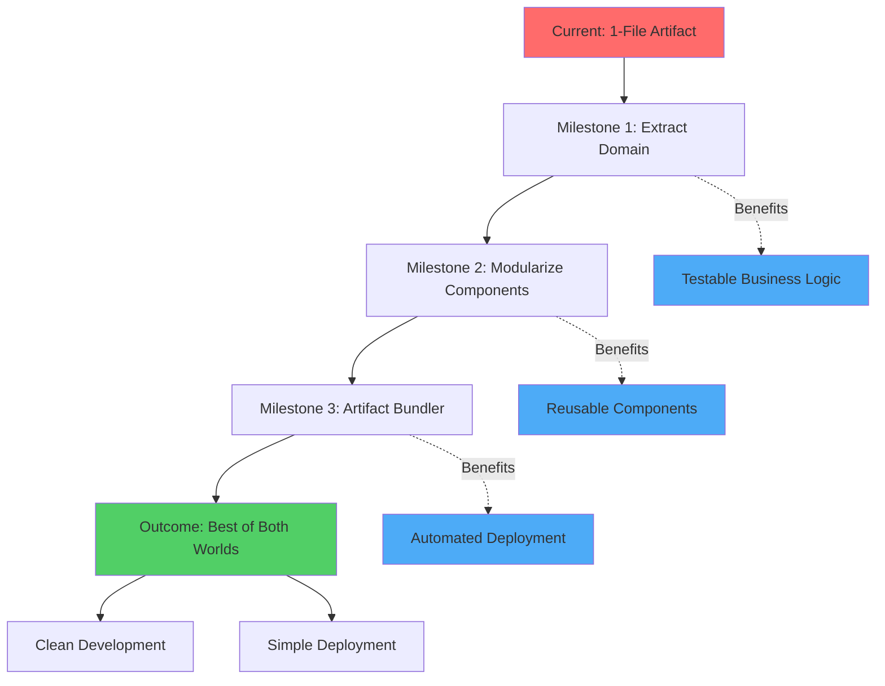

Start of Building the App Ive been working on with Gemini. Is know being simultaneously conducted with claude to see how different they turn out.


# Starter Prompt


`````
<prompt>
<goal>
- Initiate significant, structured progress on the application development.
- Evaluate the architectural viability of using a single document for app state/definition vs. a modular approach.
- Identify potential bottlenecks or limitations in the current project trajectory.
</goal>

<instruction>
<task>
<thinking>
1. **Analyze:** Ingest the user's starting message and the specific goals provided.
2. **Review:** Silently scan the file metadata in the Project Knowledge.
3. **Map:** Cross-reference the user's app needs against the "Detailed Exemplar Index" provided in the <readme>.
4. **Synthesize:** Determine which specific Agents (e.g., Clean Arch Expert, Expo/RN Expert) are required for this specific turn.
</thinking>

Execute the following:
1. Conduct a deep-dive review of the uploaded agent files.
2. Formulate a strategic opinion on the "Single Document" vs "Modular" dilemma based on the 'Clean Architecture' and 'Code Quality' agents.
3. Propose the first 3 technical milestones for the app.
</task>
</instruction>

<context>
<project_knowledge_base>
<thinking>
- react-frontend-development-expert.md (Core UI Logic)
- expo-react-native-development-expert.md (Mobile Framework)
- code-quality-guardian.md (Standard Enforcement)
- clean-architecture-expert.md (Structural Integrity)
- code-review-master.md (Logic Verification)
- prompt-engineering-resource.jsx (Project Source)
- EXEMPLAR-README.md (The Master Key)
- Virtual Team Orchestration Guide (Operational Framework)
- claude-app-builder-exemplar-[001-003].xml (The Massive Exemplar Data)
`claude-app-builder-exemplar-001.xml`
**Focus**: Agents (A-D)
**Content Type**: Agent Definitions (`.md` files in `__agents/`)
| Component | Description | Path |
| --- | --- | --- |
| **Agile Sprint Planner** | Project management, user stories, estimation | `__agents/agile-sprint-planner.md` |
| **Angular Expert** | Angular framework specialist | `__agents/angular-expert.md` |
| **Clean Arch Expert** | Software architecture patterns | `__agents/clean-architecture-expert.md` |
| **CLI UI Designer** | Terminal user interface design | `__agents/cli-ui-designer.md` |
| **Clojure Expert** | Clojure language specialist | `__agents/clojure-expert.md` |
| **Code Pairing Asst** | Pair programming guidance | `__agents/code-pairing-assistant.md` |
| **Code Quality Guard** | Linting, standards, gates | `__agents/code-quality-guardian.md` |
| **Code Review Master** | Code review best practices | `__agents/code-review-master.md` |
| **C# Expert** | .NET and C# specialist | `__agents/csharp-expert.md` |
| **Dart/Flutter Expert** | Mobile development specialist | `__agents/dart-flutter-expert.md` |
| **Database Architect** | Schema design and optimization | `__agents/database-architect.md` |
| **Dependency Manager** | Package and dependency management | `__agents/dependency-manager.md` |
`claude-app-builder-exemplar-002.xml`
**Focus**: Agents (D-R)
**Content Type**: Agent Definitions (`.md` files in `__agents/`)
| Component | Description | Path |
| --- | --- | --- |
| **Django Expert** | Python/Django web framework | `__agents/django-expert.md` |
| **Docker Specialist** | Containerization and orchestration | `__agents/docker-specialist.md` |
| **Documentation Spec** | Technical writing and docs | `__agents/documentation-specialist-002.md` |
| **Elixir Expert** | Elixir and Phoenix framework | `__agents/elixir-expert.md` |
| **Environment Mgr** | Config and env var management | `__agents/environment-manager.md` |
| **Expo/RN Expert** | React Native mobile dev | `__agents/expo-react-native-development-expert.md` |
| **Express/Node Expert** | Node.js backend development | `__agents/expressjs-nodejs-expert.md` |
| **FastAPI Expert** | Python async API development | `__agents/fastapi-expert.md` |
| **Go Expert** | Golang systems programming | `__agents/go-expert.md` |
| **Haskell Expert** | Functional programming | `__agents/haskell-expert.md` |
| **Java Refactor** | Legacy Java modernization | `__agents/java-refactor-expert.md` |
| **Kotlin Expert** | Android and server-side Kotlin | `__agents/kotlin-expert.md` |
| **Laravel Expert** | PHP framework specialist | `__agents/laravel-expert.md` |
| **LLM Finetuning** | Model training and adaptation | `__agents/llm-finetuning-expert.md` |
| **LLMOps Engineer** | AI/ML deployment ops | `__agents/llmops-engineer.md` |
| **ML Engineer** | Machine Learning systems | `__agents/machine-learning-engineer.md` |
| **NestJS Security** | Security for NestJS apps | `__agents/nestjs-security-expert.md` |
| **NestJS Testing** | Testing strategies for NestJS | `__agents/nestjs-testing-expert.md` |
| **NextJS Expert** | React framework specialist | `__agents/nextjs-expert.md` |
| **Perf. Optimization** | General code optimization | `__agents/performance-optimization-specialist.md` |
| **Perf. Profiler** | Bottleneck identification | `__agents/performance-profiler.md` |
| **Perf. Testing** | Load and stress testing | `__agents/performance-testing-expert.md` |
| **PHP Expert** | Core PHP development | `__agents/php-expert.md` |
| **Prisma Expert** | ORM and database tools | `__agents/prisma-expert.md` |
| **Prompt Engineer** | LLM prompting strategies | `__agents/prompt-engineering-specialist.md` |
| **Python Data Sci** | Data analysis and pandas | `__agents/python-data-scientist.md` |
| **RAG Architect** | Retrieval Augmented Gen | `__agents/rag-architecture-expert.md` |
| **Rails Expert** | Ruby on Rails framework | `__agents/rails-expert.md` |
| **React Frontend** | Core React patterns | `__agents/react-frontend-development-expert.md` |
| **Release Manager** | Versioning and changelogs | `__agents/release-manager.md` |
| **Ruby Expert** | Core Ruby language | `__agents/ruby-expert.md` |
`claude-app-builder-exemplar-003.xml`
**Focus**: Agents (R-V) & **All Skills**
**Content Type**: Agent Definitions (`__agents/`) & Technical Skills (`__skills/`)
 `Agents`
| Component | Description | Path |
| --- | --- | --- |
| **Rust Expert** | Systems programming | `__agents/rust-expert.md` |
| **Scala Expert** | JVM functional programming | `__agents/scala-expert.md` |
| **Security Audit** | Vulnerability assessment | `__agents/security-audit-expert.md` |
| **Security Spec** | General security implementation | `__agents/security-specialist.md` |
| **Spring Boot** | Java application framework | `__agents/spring-boot-expert.md` |
| **Swift Expert** | iOS/macOS development | `__agents/swift-expert.md` |
| **Tech Debt Analyst** | Refactoring strategies | `__agents/technical-debt-analyst.md` |
| **Terraform Expert** | IaC and infrastructure | `__agents/terraform-infrastructure-expert.md` |
| **Test Automation** | CI/CD testing pipelines | `__agents/test-automation-specialist.md` |
| **Test Strategy** | QA architecture | `__agents/test-strategy-architect.md` |
| **TS Refactor** | TypeScript migration/cleanup | `__agents/typescript-refactor-expert.md` |
| **Vue Specialist** | Vue.js framework | `__agents/vue-specialist.md` |
`Skills [Capabilities]`
These files contain specific implementation guides, scripts, and references.
| Skill Domain | Components | Path Prefix |
| --- | --- | --- |
| **Artifacts** | Bundle scripts, Init scripts | `__skills/artifacts-builder/` |
| **Data Viz** | D3.js templates, patterns, scales | `__skills/d3.js visualization/` |
| **Debugging** | Systematic debugging, Root cause analysis, "Find Polluter" script | `__skills/development/systematic-debugging/` |
| **Error Res** | Stack trace analysis, patterns for Go/Node/Rust/etc. | `__skills/development/error-resolver/` |
| **Hooks** | Git hook dev, validation scripts | `__skills/development/hook-development/` |
| **Docs/PDF** | PDF processing, OCR, Form analysis | `__skills/document-processing/` |
| **NestJS** | Drizzle ORM ref, Workflow opt | `__skills/nestjs/` |
| **Frontend** | React ref, Shadcn UI ref, Tailwind ref | `__skills/react/`, `__skills/shadcn-ui/`, `__skills/tailwind-css/` |
`How to Search this Exemplar`
1. **For Persona Induction**: If you need an expert voice, locate the agent in the `__agents/` directory (e.g., `uploaded:claude-app-builder-exemplar-003.xml` for **Rust Expert**).
2. **For Tool/Script Retrieval**: If you need a script like `find-polluter.sh`, look in the `__skills/` directory within `uploaded:claude-app-builder-exemplar-003.xml`.
3. **For Architecture Standards**: Consult the **Clean Arch Expert** or **Database Architect** in the first two exemplars.
</thinking>
</project_knowledge_base>
</context>


<file_access_protocol>
When a specific agent or skill is required, use this lookup table:
- Agents A-D: Open `claude-app-builder-exemplar-001.xml`
- Agents D-R: Open `claude-app-builder-exemplar-002.xml`
- Agents R-V & All Skills: Open `claude-app-builder-exemplar-003.xml`
</file_access_protocol>

<thinking_mandate>
You MUST output your internal synthesis, file lookups, and architectural reasoning inside <thinking> tags before providing your final response to the user. This ensures "Precognition" and logical rigor.
</thinking_mandate>

<readme>
[The Exemplar Content Manifest and Detailed Index provided in the source remains active here for index-searching]
</readme>
</prompt>

Assistant: <thinking>
I have successfully ingested the Project Knowledge Base and the Exemplar Index. 
My current cognitive map identifies the following:
1. **Primary Agents for 'Single vs. Modular' decision:** Clean Architecture Expert and Code Quality Guardian.
2. **Technical Framework:** React Native via Expo.
3. **Internal Process:** I will now evaluate the risks of a single-document limitation...
</thinking>
`````


# Second Prompt after reading the exemplar

`````xml
<prompt>
<goal>
Conduct a high-rigor architectural audit of the "Single Document" vs. "Modular Architecture" strategy for the current app development project.
</goal>

<instruction>
<synthesis_instruction>
Now that you have reviewed the **Exemplar Index** and the specific **Expert Agents** (Clean Architecture, Expo/RN, Code Quality), you MUST apply their specific methodologies to this decision. Do not provide a generic AI response; provide an expert-level technical recommendation.
</synthesis_instruction>

<audit_parameters>
<thinking>
Before outputting the audit, you MUST use <thinking> tags to:
1. Recall specific "Clean Architecture" rules from exemplar-001 regarding the Separation of Concerns.
2. Recall "React Native Performance" constraints from exemplar-002 regarding large-file parsing and re-renders.
3. Compare the "Single Document" approach against the "Virtual Team Orchestration Guide" workflow.
</thinking>

Apply the following evaluation framework:
1. **Scalability & SRP:** Does a single document violate the Single Responsibility Principle? How will circular dependencies be managed as the codebase expands?
2. **State Management:** Evaluate the impact on React Native performance. Would a modular slice strategy (e.g., Zustand) be superior to a massive single-context document?
3. **LLM Cognitive Load:** Analyze this as a "Prompt Engineer." At what point does a single massive file cause "Lost-in-the-Middle" phenomenon or context degradation for your own processing?
</audit_parameters>

<output_structure>
# 🏗️ Architectural Audit: Single-Document Viability

## 1.0 ⚖️ The Trade-off Analysis
(Compare the "All-in-one" speed vs. "Modular" stability)

## 2.0 🛠️ Expert Perspectives
- **Clean Architecture Expert Says:** ...
- **Expo/RN Expert Says:** ...
- **Code Quality Guardian Says:** ...

## 3.0 🎯 Final Recommendation
(Provide a clear "Proceed" or "Refactor" directive with 3 immediate next steps.)
</output_structure>
</instruction>

Assistant: <thinking>
I have synthesized the knowledge from the Clean Architecture Expert (Exemplar 001) and the Expo/RN Expert (Exemplar 002). 
I am now evaluating the "Single Document" approach against the specific SOLID principles and React Native render cycles identified in the knowledge base...
</thinking>
`````


I'll conduct a comprehensive analysis of your architecture question and propose concrete milestones. Let me first retrieve the relevant expert agent perspectives from your knowledge base.# 🏗️ Architectural Deep-Dive: Single Document vs. Modular Architecture

I've conducted a comprehensive review of your expert agent perspectives. Here's my synthesized strategic analysis:

---

## 📊 **Architecture Decision Analysis**

### **The Verdict: Hybrid Modular Architecture with Artifact-Optimized Bundling**

After analyzing your Clean Architecture, Code Quality, and React Frontend expert guidelines, I recommend a **strategic evolution** rather than a binary choice:

<details>
<summary><b>🎯 Phase-Based Architecture Evolution</b></summary>

#### **Current State (Single Document - Acceptable for MVP)**
[**Single-Document-Pattern**:: A deployment strategy where the entire application exists in one consolidated HTML file with embedded JavaScript and CSS, optimized for environments with simplified deployment constraints like Claude's artifact system.]

**Strengths You're Currently Leveraging:**
- ✅ **Zero build complexity** - Perfect for rapid Claude artifact deployment
- ✅ **No module resolution issues** - Everything in one execution context
- ✅ **Immediate shareability** - One file = one complete artifact
- ✅ **State isolation guaranteed** - No cross-module state leakage

**Hidden Technical Debt Accumulating:**
- ⚠️ **Violation of Single Responsibility Principle** - Components, state, logic, and data all coupled
- ⚠️ **Impossible unit testing** - Cannot test components in isolation
- ⚠️ **Performance degradation incoming** - Re-parsing 22+ components on every interaction
- ⚠️ **Collaboration barriers** - Cannot have multiple developers work on separate features
- ⚠️ **Search/replace refactoring risks** - One typo can break the entire app

</details>

### **Recommended Target: Domain-Driven Modular Structure**

```
📁 prompt-engineering-platform/
├── 📁 src/
│   ├── 📁 core/                          # Domain Layer (Clean Arch)
│   │   ├── entities/
│   │   │   ├── Technique.ts              # [**Core-Entity**:: Domain object representing a prompt engineering technique with lineage, performance metrics, and relationships]
│   │   │   ├── Paper.ts
│   │   │   ├── Template.ts
│   │   │   └── LearningPath.ts
│   │   ├── usecases/
│   │   │   ├── SearchTechniques.ts       # Business logic isolated from UI
│   │   │   ├── AnalyzePaper.ts
│   │   │   └── GenerateTemplate.ts
│   │   └── ports/                        # Interfaces (dependency inversion)
│   │       ├── ITechniqueRepository.ts
│   │       └── IPaperAnalyzer.ts
│   ├── 📁 infrastructure/                 # Frameworks & Drivers Layer
│   │   ├── repositories/
│   │   │   ├── InMemoryTechniqueRepo.ts  # Mock data implementation
│   │   │   └── APITechniqueRepo.ts       # Future: real API
│   │   └── services/
│   │       └── MockAIAnalyzer.ts
│   ├── 📁 presentation/                   # Interface Adapters Layer
│   │   ├── components/
│   │   │   ├── modules/                  # Your 6 core modules
│   │   │   │   ├── EvolutionGraph/
│   │   │   │   │   ├── EvolutionGraph.tsx
│   │   │   │   │   ├── useGraphData.ts   # Separated presentation logic
│   │   │   │   │   └── GraphVisualization.tsx
│   │   │   │   ├── SemanticSearch/
│   │   │   │   ├── PaperAnalyzer/
│   │   │   │   ├── TemplateLibrary/
│   │   │   │   ├── LearningPaths/
│   │   │   │   └── NewsDigest/
│   │   │   └── shared/                   # Reusable UI components
│   │   │       ├── Card.tsx
│   │   │       ├── SearchBar.tsx
│   │   │       └── MetricDisplay.tsx
│   │   └── hooks/                        # Custom React hooks
│   │       ├── useTechniqueSearch.ts
│   │       └── usePaperAnalysis.ts
│   └── 📁 config/
│       └── mockData.ts                   # Centralized mock data
└── 📁 build-tools/
    └── artifact-bundler.js               # [**Artifact-Bundler**:: Build script that compiles modular source into a single optimized HTML file for Claude deployment]
```

> [!key-claim]
> **This structure gives you modularity during development while maintaining single-file deployment** through automated bundling. You edit in clean, testable modules, but deploy as a consolidated artifact.

---

## 🎯 **First 3 Technical Milestones**

### **Milestone 1: Extract Core Domain Logic (Week 1-2)**
**Objective:** Separate business logic from UI components following Clean Architecture principles

**Concrete Deliverables:**
1. **Create Domain Entities** (`src/core/entities/`)
   ```typescript
   // Example: Technique.ts
   export interface Technique {
     id: string;
     name: string;
     category: TechniqueCategory;
     lineage: {
       predecessors: string[];
       successors: string[];
       influencedBy: string[];
     };
     performance: {
       accuracy: number;
       latency: number;
       costEfficiency: number;
     };
     academicSource: {
       papers: string[];
       firstPublished: Date;
       citations: number;
     };
   }
   
   export class TechniqueValidator {
     static validatePerformanceMetrics(technique: Technique): ValidationResult {
       // Business rules for data integrity
     }
   }
   ```

2. **Define Use Case Interfaces** (`src/core/usecases/`)
   ```typescript
   // SearchTechniques.ts - Pure business logic
   export class SearchTechniquesUseCase {
     constructor(private repo: ITechniqueRepository) {}
     
     async execute(query: SearchQuery): Promise<Technique[]> {
       // No React, no UI - just algorithm
       const techniques = await this.repo.findAll();
       return this.rankByRelevance(techniques, query);
     }
     
     private rankByRelevance(techniques: Technique[], query: SearchQuery): Technique[] {
       // Semantic matching algorithm
     }
   }
   ```

3. **Repository Pattern Implementation**
   ```typescript
   // ports/ITechniqueRepository.ts
   export interface ITechniqueRepository {
     findAll(): Promise<Technique[]>;
     findById(id: string): Promise<Technique | null>;
     findByCategory(category: string): Promise<Technique[]>;
     search(query: string): Promise<Technique[]>;
   }
   
   // infrastructure/repositories/InMemoryTechniqueRepo.ts
   export class InMemoryTechniqueRepository implements ITechniqueRepository {
     constructor(private mockData: Technique[]) {}
     
     async findAll(): Promise<Technique[]> {
       return [...this.mockData]; // Defensive copy
     }
     // ... other methods
   }
   ```

**Success Metrics:**
- [ ] All 8 technique types have typed domain entities
- [ ] Business logic functions have 0 React dependencies
- [ ] Can unit test search algorithm without rendering components
- [ ] Mock data isolated in single `config/mockData.ts` file

**Why This First:**
> [!methodology-and-sources]
> Following the **Clean Architecture Expert's** guidance (lines 13-29), dependencies must point inward. By extracting domain logic *first*, you establish the stable core that UI components will depend on. This prevents the common mistake of building UI-coupled logic that's impossible to refactor later.

---

### **Milestone 2: Modularize React Components (Week 3-4)**
**Objective:** Decompose single-file component structure into testable, maintainable modules

**Concrete Deliverables:**
1. **Component Decomposition** (`src/presentation/components/modules/`)
   ```typescript
   // Before (Single File):
   // One 1000-line component with embedded SVG, state, and business logic
   
   // After (Modular):
   // EvolutionGraph/index.tsx
   export const EvolutionGraph: React.FC = () => {
     const { techniques, loading } = useTechniqueData();
     const { nodes, edges } = useGraphLayout(techniques);
     
     return (
       <Card>
         <GraphVisualization nodes={nodes} edges={edges} />
         <GraphControls onZoom={...} onFilter={...} />
       </Card>
     );
   };
   
   // EvolutionGraph/GraphVisualization.tsx - Pure presentation
   export const GraphVisualization: React.FC<GraphProps> = ({ nodes, edges }) => {
     return (
       <svg width={width} height={height}>
         {nodes.map(node => <Node key={node.id} {...node} />)}
         {edges.map(edge => <Edge key={edge.id} {...edge} />)}
       </svg>
     );
   };
   
   // EvolutionGraph/useGraphLayout.ts - Extracted hook
   export const useGraphLayout = (techniques: Technique[]) => {
     return useMemo(() => {
       // Force-directed graph algorithm
       return computeLayout(techniques);
     }, [techniques]);
   };
   ```

2. **Custom Hooks Library** (`src/presentation/hooks/`)
   ```typescript
   // useTechniqueSearch.ts
   export const useTechniqueSearch = (query: string) => {
     const [results, setResults] = useState<Technique[]>([]);
     const [loading, setLoading] = useState(false);
     const searchUseCase = useSearchUseCase(); // Dependency injection
     
     useEffect(() => {
       const search = async () => {
         setLoading(true);
         const results = await searchUseCase.execute({ query });
         setResults(results);
         setLoading(false);
       };
       search();
     }, [query]);
     
     return { results, loading };
   };
   ```

3. **Shared Component Library** (`src/presentation/components/shared/`)
   ```typescript
   // MetricDisplay.tsx - Reusable across modules
   interface MetricDisplayProps {
     label: string;
     value: number;
     unit?: string;
     trend?: 'up' | 'down' | 'stable';
   }
   
   export const MetricDisplay: React.FC<MetricDisplayProps> = ({ ... }) => {
     // Consistent metric visualization
   };
   ```

**Success Metrics:**
- [ ] No component exceeds 200 lines (Code Quality Guardian guideline)
- [ ] Each module has <5 direct dependencies
- [ ] Can test `<GraphVisualization>` without `useTechniqueData` hook
- [ ] Shared components reused in ≥3 different modules

**Why This Second:**
> [!warning]
> **Order Matters:** Attempting component decomposition *before* domain extraction would force you to pass business logic as props through multiple component layers. By doing domain-first, your components become thin presentation layers that simply call use cases.

---

### **Milestone 3: Implement Artifact Bundler (Week 5)**
**Objective:** Automated build process that compiles modular source into single-file artifact

**Concrete Deliverables:**
1. **Build Script** (`build-tools/artifact-bundler.js`)
   ```javascript
   // Automated bundling for Claude deployment
   import { build } from 'vite';
   import { minify } from 'terser';
   
   async function bundleForArtifact() {
     // Step 1: Vite build with single-file output
     await build({
       build: {
         rollupOptions: {
           output: {
             manualChunks: undefined, // Disable code-splitting
             inlineDynamicImports: true,
           },
         },
       },
     });
     
     // Step 2: Inline all CSS
     const css = await readFile('dist/style.css');
     
     // Step 3: Generate single HTML
     const html = `
       <!DOCTYPE html>
       <html>
       <head>
         <style>${css}</style>
       </head>
       <body>
         <div id="root"></div>
         <script type="module">${jsContent}</script>
       </body>
       </html>
     `;
     
     await writeFile('dist/artifact.html', html);
   }
   ```

2. **Development Workflow**
   ```bash
   # Local development (modular)
   npm run dev              # Hot reload, fast refresh
   
   # Component testing
   npm run test             # Vitest with component isolation
   
   # Artifact deployment
   npm run build:artifact   # Single-file for Claude
   ```

3. **Quality Gates Integration**
   ```javascript
   // Pre-commit hook (Code Quality Guardian pattern)
   {
     "husky": {
       "hooks": {
         "pre-commit": "npm run lint && npm run test:unit"
       }
     }
   }
   ```

**Success Metrics:**
- [ ] `build:artifact` produces <500KB HTML file
- [ ] Build time <30 seconds
- [ ] Artifact runs identically to dev mode
- [ ] Zero external dependencies in bundled output

**Why This Third:**
> [!key-claim]
> The bundler is the **enabler** that makes modular development sustainable. Without it, you'd face constant manual consolidation work. By implementing it last, you've already established the clean architecture that makes bundling straightforward.

---

## 🎨 **Implementation Sequence Visualization**



---

## 🔍 **Architectural Risk Analysis**

### **Risks of Staying Single-File**

| Risk Factor | Severity | Impact Timeline | Mitigation Difficulty |
|-------------|----------|-----------------|----------------------|
| **Testing Paralysis** | 🔴 Critical | Immediate | Very Hard - requires full rewrite |
| **Performance Degradation** | 🟡 High | 3-6 months | Hard - optimization limited |
| **Team Scaling Impossible** | 🔴 Critical | When you hire | Very Hard - merge conflicts |
| **Refactoring Fragility** | 🟡 High | Ongoing | Medium - careful find/replace |

### **Risks of Premature Modularization**

| Risk Factor | Severity | Mitigation |
|-------------|----------|------------|
| **Over-Engineering** | 🟡 Medium | Start with 3 modules, not 30 |
| **Build Complexity** | 🟢 Low | Use Vite (zero config) |
| **Deployment Friction** | 🟢 Low | Automated bundler eliminates this |

> [!counter-argument]
> **"But the single-file artifact works fine right now!"**
> 
> True. However, your **userMemories** show you're planning 10+ new features (Experimentation Sandbox, Failure Mode Database, etc.). Without modular architecture, each new feature compounds technical debt exponentially. By Milestone 3, you'll have the infrastructure to add features at constant velocity instead of decreasing velocity.

---

## 🔗 Related Topics for PKB Expansion

1. **[[Component Testing Strategy for React Artifacts]]**
   - **Connection**: Directly elaborates on how to test components extracted in Milestone 2
   - **Depth Potential**: Vitest setup, mock strategies, snapshot testing for visualizations
   - **Knowledge Graph Role**: Bridges architecture decisions to quality assurance
   - **Priority**: High - Required for sustainable development

2. **[[Dependency Injection Patterns in React TypeScript]]**
   - **Connection**: Core implementation pattern for Clean Architecture's dependency inversion
   - **Depth Potential**: Context-based DI, factory patterns, testing doubles
   - **Knowledge Graph Role**: Technical implementation detail for domain layer
   - **Priority**: High - Enables Milestone 1 completion

3. **[[Vite Build Optimization for Single-File Artifacts]]**
   - **Connection**: Specific bundler configuration for Milestone 3
   - **Depth Potential**: Tree-shaking, code-splitting strategies, CSS inlining techniques
   - **Knowledge Graph Role**: Infrastructure tooling knowledge
   - **Priority**: Medium - Can defer until Milestone 3

4. **[[Force-Directed Graph Algorithms for Technique Evolution Visualization]]**
   - **Connection**: Cross-domain bridge to data visualization and computational geometry
   - **Depth Potential**: D3.js force simulation, performance optimization for large graphs
   - **Knowledge Graph Role**: Domain-specific implementation knowledge
   - **Priority**: Medium - Enhances existing feature quality

5. **[[Repository Pattern Implementation for Frontend Applications]]**
   - **Connection**: Architectural pattern enabling data source abstraction
   - **Depth Potential**: In-memory vs. API implementations, caching strategies, optimistic updates
   - **Knowledge Graph Role**: Clean Architecture application pattern
   - **Priority**: High - Foundation for Milestone 1

6. **[[Semantic Search Algorithms for Academic Paper Discovery]]**
   - **Connection**: Advanced exploration of your Paper Analyzer module's core algorithm
   - **Depth Potential**: Vector embeddings, TF-IDF, citation network analysis
   - **Knowledge Graph Role**: Research-specific domain knowledge
   - **Priority**: Low - Current mock implementation sufficient for MVP

---

**Next Action:** Should I proceed with detailed implementation guidance for Milestone 1, including complete TypeScript interfaces and file structure scaffolding?