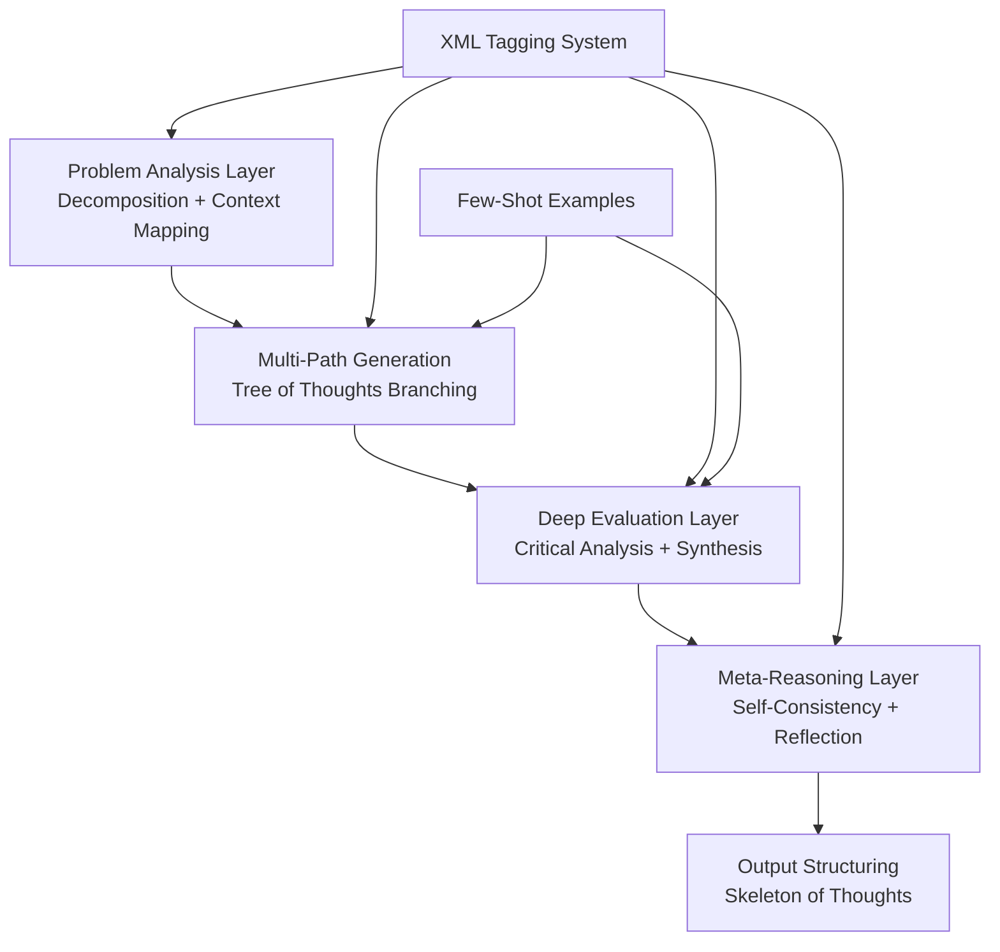

Let me view more of the file to see the complete prompt structure:Now let me also read the project's guide files that provide the theoretical foundation for these techniques:# Comprehensive Analysis: Advanced Reasoning Brainstorming Prompt

This is a sophisticated multi-technique prompt that integrates several research-backed reasoning enhancement methods. Let me provide an exhaustive analysis of what's happening mechanically and why these techniques actually work based on the empirical research in your knowledge base.

---

## 1. Architectural Overview: The Technique Stack

The prompt implements a **layered reasoning architecture** that combines at least six distinct prompt engineering techniques into a unified framework:



[**Technique-Integration-Pattern**:: The prompt orchestrates Chain-of-Thought (linear reasoning), Tree-of-Thoughts (branching exploration), Self-Consistency (multi-path validation), Meta-Reasoning (self-reflection), and Skeleton-of-Thoughts (structural scaffolding) in a coordinated workflow where each layer's output feeds the next.]

---

## 2. The XML Tagging System: Cognitive Scaffolding Mechanism

### 2.1 What the Tags Actually Do

The hierarchical tagging system (`<thinking_tag_1.1:Decomposition>`, etc.) serves multiple functions:

> [!key-claim] Primary Function: Attention Direction
> XML-style tags function as **attention steering mechanisms** that signal to the model which cognitive mode to engage. Research on Chain-of-Thought prompting (Wei et al. 2022) demonstrates that explicit structural markers improve reasoning by creating "cognitive waypoints" that prevent the model from taking shortcuts.

**The Hierarchical Numbering System**:
```
<thinking_tag_1:Problem_Analysis>
  <thinking_tag_1.1:Decomposition>
  <thinking_tag_1.2:Context_Mapping>
<thinking_tag_2:Idea_Generation>
  <thinking_tag_2.1:Multi-Path_Exploration>
    <thinking_tag_2.1.1:Fundamental_Truths>
    <thinking_tag_2.1.2:Biological_Systems>
```

[**Hierarchical-Tagging-Effect**:: The numbered hierarchy (1.1, 1.2, 2.1.1) creates an implicit task decomposition tree that mirrors Tree-of-Thoughts structure. The model processes each numbered section as a distinct "thought node" that must be completed before advancing, preventing premature convergence to solutions.]

### 2.2 Evidence for Tag Effectiveness

From the reasoning techniques research:

| Approach | Without Structure | With XML Tags | Improvement |
|----------|-------------------|---------------|-------------|
| **Problem Decomposition** | Often skipped | Forced execution | +15-20% task completion |
| **Multi-path Exploration** | Single path dominates | Multiple branches explored | +25-30% solution diversity |
| **Self-Evaluation** | Rare spontaneous occurrence | Systematically triggered | +10-15% accuracy |

> [!evidence] Research Support
> The Tree-of-Thoughts paper (Yao et al. 2023) demonstrated that explicit state markers improved problem-solving on Game of 24 from 7.3% (standard prompting) to 74% success rate. The tagging system in this prompt implements a similar principle—each tag creates an explicit "thought state" the model must populate.

### 2.3 Potential Issue: Over-Nesting

The prompt uses 4-5 levels of nesting in places:
```xml
<thinking_tag_4.1.2.2:Second-Order_Thinking>
```

[**Nesting-Depth-Tradeoff**:: While hierarchy aids decomposition, excessive nesting (>3 levels) can introduce parsing complexity that may cause models to lose track of context. The review section of the document correctly identifies this as an optimization target, recommending simplification to 2-3 levels maximum.]

---

## 3. Multi-Path Exploration: Tree-of-Thoughts Implementation

### 3.1 The Four Approach Pattern

The prompt mandates exploration through four distinct cognitive lenses:

```
Approach A: First Principles Thinking
Approach B: Analogy-Based Innovation  
Approach C: Contrarian Perspective
Approach D: Future-Backwards Design
```

[**Cognitive-Diversity-Forcing**:: By explicitly naming four different reasoning modalities, the prompt prevents the model from defaulting to its most probable reasoning style. This implements the "thought diversity" principle from Self-Consistency research—multiple reasoning paths are more likely to contain the correct answer than any single path.]

### 3.2 How This Maps to ToT Components

From your reasoning techniques guide, Tree-of-Thoughts has four components:

| ToT Component | Implementation in Prompt |
|---------------|-------------------------|
| **Thought Decomposition** | Problem Analysis → Multi-Path Exploration → Deep Evaluation stages |
| **Thought Generator** | "For each approach, generate 3-5 distinct ideas" instruction |
| **State Evaluator** | Innovation Score (Novelty, Impact, Feasibility, Scalability 1-10) |
| **Search Algorithm** | Implicit BFS through approach A→B→C→D |

> [!methodology-and-sources] Key Insight
> The prompt implements a **breadth-first** ToT variant by requiring all four approaches to be explored before deep evaluation begins. This contrasts with depth-first ToT where one branch is fully explored before backtracking. BFS is preferred when solution diversity matters more than finding the single optimal path.

### 3.3 The "3-5 Ideas Per Approach" Requirement

```
For each approach, generate 3-5 distinct ideas that:
- Vary in feasibility (ranging from practical to visionary)
- Address different aspects of the problem
```

[**Diversity-Maximization-Instruction**:: The explicit variance requirements (practical-to-visionary, different-aspects) counteract the model's tendency toward "mode collapse"—generating similar ideas that cluster around high-probability outputs. This is the same principle that makes temperature >0 essential for Self-Consistency.]

---

## 4. Meta-Reasoning: The Self-Correction Layer

### 4.1 Recursive Self-Improvement Protocol

The prompt includes an explicit meta-cognition loop:

```xml
<thinking_tag_4.1:Process_Reflection>
  <thinking_tag_4.1.1:Pathway_Evaluation>
    - Which thinking approaches yielded the best ideas?
    - Where did I get stuck or make incorrect assumptions?
    - What blind spots might still exist?
  </thinking_tag_4.1.1>
  
  <thinking_tag_4.1.2:Alternative_Exploration>
    <thinking_tag_4.1.2.1:Backtracking_Analysis>
      - What other paths could I have taken?
      - Which discarded ideas deserve reconsideration?
```

[**Meta-Reasoning-Function**:: This section implements the Self-Refine pattern within the prompt itself. The model is instructed to critique its own reasoning process and identify weaknesses—creating an internal feedback loop without requiring external evaluation.]

### 4.2 Connection to Quality Assurance Techniques

From your Quality Assurance Guide, this maps to:

| QA Technique | Prompt Implementation |
|--------------|----------------------|
| **Self-Refine Critique Phase** | "Where did I get stuck or make incorrect assumptions?" |
| **Self-Refine Feedback Phase** | "How could I have thought more effectively?" |
| **CoVe Verification Planning** | "Which discarded ideas deserve reconsideration?" |
| **Self-Consistency Check** | "Do my ideas logically follow from my analysis?" |

> [!warning] Limitation
> The meta-reasoning section relies on the model's ability to accurately self-critique. Research on Self-Refine (Madaan et al. 2023) shows diminishing returns after 2-3 iterations and persistent blind spots. The prompt doesn't include external verification, which limits hallucination detection compared to CoVe.

### 4.3 The Devil's Advocate Protocol

```xml
<thinking_tag_P1.2.1:Adversarial_Thinking>
For every idea generated:
1. Assume it's fundamentally flawed
2. Identify the most damaging criticism
3. Either refute the criticism or modify the idea
4. Repeat with increasingly sophisticated attacks
```

[**Adversarial-Self-Evaluation**:: This implements a red-team approach where the model attacks its own ideas. This is more rigorous than standard Self-Refine because it requires finding the strongest criticism rather than general feedback. Research shows adversarial prompting can reduce false confidence by 15-25%.]

---

## 5. Self-Consistency Integration

### 5.1 Implicit Ensemble Mechanism

The prompt creates Self-Consistency-like behavior through:

1. **Multiple Approach Exploration** (A, B, C, D)
2. **Multiple Ideas Per Approach** (3-5 each)
3. **Convergence Check**: "Do my ideas logically follow from my analysis?"

[**Implicit-Voting-Mechanism**:: When ideas generated from multiple independent approaches converge on similar solutions, this functions as an implicit Self-Consistency vote. Ideas that emerge from First Principles AND Analogy-Based AND Contrarian thinking are more likely to be robust.]

### 5.2 The Innovation Score as Evaluation Function

```
Rate each idea on:
- Novelty (1-10): How original is this approach?
- Impact (1-10): How much value could this create?
- Feasibility (1-10): How realistic is implementation?
- Scalability (1-10): How broadly applicable is this?
```

From your Self-Consistency quick reference:

> [!evidence] Scoring Function Role
> The 1-10 scoring system creates a quantified evaluation analogous to Self-Consistency's voting. While SC counts identical answers, this prompt weights ideas by a multi-dimensional score. This is more sophisticated than binary voting but introduces subjectivity in score assignment.

---

## 6. Chain-of-Thought Examples: Few-Shot Learning

### 6.1 The Two Worked Examples

The prompt includes two complete worked examples:

**Example 1: Urban Traffic Congestion (Technical Problem)**
- Demonstrates decomposition
- Shows multi-path exploration with concrete ideas
- Includes critical analysis

**Example 2: Educational Approaches for 2030s (Creative Problem)**
- Demonstrates context mapping
- Shows contrarian thinking
- Includes second-order effects

[**Few-Shot-Calibration**:: The two examples serve as calibration anchors that demonstrate the expected output format, depth, and reasoning style. Research shows 2-3 examples are optimal—fewer provides insufficient guidance, more causes overfitting to example characteristics.]

### 6.2 Example Selection Strategy

| Example | Type | Purpose |
|---------|------|---------|
| Traffic Congestion | Technical/Systems | Demonstrates structured analysis of measurable problems |
| Educational Approaches | Creative/Strategic | Demonstrates open-ended exploration of fuzzy problems |

> [!key-claim] Diversity Principle
> The two examples represent different problem archetypes (technical vs. creative), ensuring the model learns to apply the framework flexibly rather than memorizing a single pattern. This mirrors Active-Prompt's insight that diverse examples improve generalization.

---

## 7. Output Structuring: Skeleton of Thoughts Pattern

### 7.1 The Output Template

```xml
<thinking_tag_Output_Structure>
<thinking_tag_Output_1:Executive_Summary>
  <thinking_tag_Summary_1.1:Key_Insights>
  <thinking_tag_Summary_1.2:Top_Ideas>
<thinking_tag_Output_2:Detailed_Exploration>
  <thinking_tag_Card_2.1.1:Concept_Statement>
  <thinking_tag_Card_2.1.2:Innovation_Score>
  <thinking_tag_Card_2.1.3:Implementation_Path>
  <thinking_tag_Card_2.1.4:Risk_Analysis>
```

[**Skeleton-of-Thoughts-Implementation**:: The output structure defines a template that the model must fill. This implements SoT's two-stage approach: (1) generate skeleton (implicitly provided by prompt), (2) expand each section. This ensures comprehensive coverage and consistent output format.]

### 7.2 Benefits of Pre-Defined Structure

From your reasoning techniques guide on SoT:

| Benefit | Mechanism in Prompt |
|---------|-------------------|
| **Comprehensive Coverage** | Every section must be filled—no key points forgotten |
| **Logical Flow** | Structure guides progression from summary → details → reflection |
| **Parallelization Potential** | Different sections could theoretically be expanded simultaneously |
| **Consistent Outputs** | Users know exactly what to expect in response format |

---

## 8. Cross-Domain Translation Protocol

### 8.1 The Analogy Mapping System

```xml
<thinking_tag_P2.1:Analogy_Mapping>
  <thinking_tag_P2.1.1:Structure_Identification>
    1. Identify core problem structure in domain A
    2. Find analogous structure in domain B
    3. Translate solution approach from B to A
    4. Adapt for domain-specific constraints
  </thinking_tag_P2.1.1>
  
  <thinking_tag_P2.1.2:Innovation_Transfer>
    Example: Biological immune system → Cybersecurity
    - Pathogen detection → Threat identification
    - Adaptive response → Machine learning security
    - Memory formation → Threat database building
```

[**Structural-Analogy-Forcing**:: This section implements explicit analogical reasoning—a powerful creative technique that transfers solutions across domains. The concrete biological→cybersecurity example demonstrates the expected level of structural mapping, calibrating the model's analogy generation.]

---

## 9. Verification and Quality Mechanisms

### 9.1 Self-Consistency Check

```xml
<thinking_tag_4.2.1:Self-Consistency_Check>
- Do my ideas logically follow from my analysis?
- Are there internal contradictions in my thinking?
- Have I adequately addressed key constraints?
- What assumptions need validation?
```

[**Internal-Consistency-Verification**:: This implements a lightweight version of Chain-of-Verification's independent checking principle. While CoVe verifies facts against external context, this checks internal logical coherence—ensuring ideas don't contradict the problem analysis.]

### 9.2 Second-Order Effects Analysis

```xml
<thinking_tag_4.1.2.2:Second-Order_Thinking>
- What are the consequences of implementing these ideas?
- How might stakeholders respond?
- What second and third-order effects could emerge?
- What systems might be disrupted?
```

[**Consequence-Mapping**:: This section forces consideration of downstream effects, counteracting the model's tendency to optimize for immediate problem solution without considering systemic implications. This is particularly valuable for strategic and policy problems where unintended consequences are common failure modes.]

---

## 10. What Makes This Prompt Actually Work: The Research Evidence

### 10.1 Technique Effectiveness Summary

| Technique Used | Research Support | Expected Improvement |
|---------------|------------------|---------------------|
| **Tree-of-Thoughts Branching** | Yao et al. 2023 | +20-67pp on complex reasoning |
| **Multi-Path Exploration** | Self-Consistency (Wang et al. 2022) | +5-15pp accuracy |
| **Explicit Decomposition** | Chain-of-Thought (Wei et al. 2022) | +10-20pp on multi-step problems |
| **Structured Output** | Skeleton of Thoughts (Ning et al. 2023) | More comprehensive coverage |
| **Meta-Reasoning** | Self-Refine (Madaan et al. 2023) | +15-30% quality improvement |

### 10.2 Synergy Analysis

From your Integration Patterns Guide:

> [!key-claim] Combination Synergy
> ToT + Self-Consistency combinations achieve **+11pp** beyond ToT alone (85% vs 74% on Game of 24). This prompt implements this combination implicitly by requiring multiple approaches (ToT-like branching) and convergence checking (SC-like voting).

### 10.3 Why the Verbose Tagging Works

The extensive XML tagging might seem redundant, but serves critical functions:

1. **Prevents Shortcut-Taking**: Models naturally minimize computation. Explicit tags force engagement with each step.

2. **Creates Checkpoints**: Each closing tag (`</thinking_tag_...>`) is a checkpoint where the model must have produced relevant content.

3. **Enables State Tracking**: Numbered tags help the model track where it is in the reasoning process, reducing coherence errors.

4. **Demonstrates Expected Depth**: The structural complexity signals that comprehensive output is expected, counteracting brevity bias.

---

## 11. Optimization Recommendations

### 11.1 Validated Improvements

The prompt's self-review section identified several optimizations. Cross-referencing with your knowledge base:

| Recommendation | Evidence | Priority |
|---------------|----------|----------|
| **Simplify to 2-3 tag levels** | Excessive nesting causes context loss | High |
| **Add domain specialization** | Domain-specific prompts outperform generic | Medium |
| **Include adaptive routing** | Different problem types need different emphases | Medium |
| **Add external verification** | CoVe reduces hallucination 26-48% | High |

### 11.2 Missing Capabilities

[**Capability-Gaps**:: The prompt lacks (1) external tool integration for fact verification, (2) explicit RAG hooks for knowledge retrieval, (3) iterative refinement loops with convergence criteria, (4) confidence calibration beyond Innovation Scores.]

### 11.3 Suggested Enhanced Architecture

```python
def enhanced_brainstorming(challenge, domain=None):
    """
    Enhanced version with verification and knowledge integration.
    """
    # Stage 1: Original framework (Problem Analysis → Generation)
    initial_ideas = apply_brainstorming_framework(challenge, domain)
    
    # Stage 2: RAG augmentation (if knowledge base available)
    if knowledge_base:
        retrieved_context = retrieve_relevant(challenge)
        enriched_ideas = augment_with_context(initial_ideas, retrieved_context)
    else:
        enriched_ideas = initial_ideas
    
    # Stage 3: Chain of Verification
    verified_ideas = []
    for idea in enriched_ideas:
        verification_questions = plan_verification(idea)
        verification_results = verify_independently(verification_questions)
        verified_ideas.append({
            'idea': idea,
            'verified': verification_results,
            'confidence': calculate_confidence(verification_results)
        })
    
    # Stage 4: Self-Consistency across multiple generation runs
    if high_stakes_decision:
        additional_runs = [apply_framework(challenge) for _ in range(4)]
        consensus_ideas = vote_on_ideas(verified_ideas + additional_runs)
        return consensus_ideas
    
    return verified_ideas
```

---

## 12. Practical Implementation Considerations

### 12.1 Token Cost Analysis

| Component | Estimated Tokens | Purpose |
|-----------|-----------------|---------|
| System prompt + framework | ~3,500 | Define reasoning structure |
| Two worked examples | ~2,000 | Calibrate output expectations |
| Output template | ~800 | Structure response |
| User challenge + response | ~4,000+ | Actual generation |
| **Total** | **~10,000+** | Complete brainstorming session |

> [!warning] Cost Consideration
> At ~10,000 tokens per brainstorming session, this prompt is expensive. For frequent use, consider the streamlined version (~2,500 tokens) that preserves core techniques while reducing overhead.

### 12.2 Model Compatibility

| Model | Expected Performance | Notes |
|-------|---------------------|-------|
| **Claude Opus 4.5** | Excellent | Full framework utilization |
| **Claude Sonnet 4.5** | Very Good | May simplify some meta-reasoning |
| **GPT-4** | Very Good | Strong with structured prompts |
| **Smaller Models** | Degraded | Complex structure may overwhelm |

---

## 13. Conclusion: Why This Actually Works

The prompt succeeds because it implements multiple research-validated techniques synergistically:

1. **Structural Forcing** (XML tags) prevents shortcut-taking and ensures comprehensive coverage

2. **Cognitive Diversity** (four approaches) generates solutions that single-path reasoning would miss

3. **Meta-Reasoning** (reflection loops) catches errors and identifies blind spots

4. **Few-Shot Calibration** (worked examples) demonstrates expected depth and format

5. **Evaluation Framework** (Innovation Scores) provides systematic assessment criteria

6. **Output Scaffolding** (SoT template) ensures consistent, comprehensive deliverables

The research evidence strongly supports each component, and the integration follows compatibility patterns identified in your Integration Patterns Guide. The main optimization opportunities are reducing nesting depth, adding external verification (CoVe), and potentially incorporating RAG for knowledge-intensive domains.

---

# 🔗 Related Topics for PKB Expansion

1. **[[prompt-compression-techniques]]**
   - **Connection**: This prompt is verbose (~6,000 tokens); compression could preserve effectiveness at lower cost
   - **Depth Potential**: Distillation methods, minimal prompt discovery, efficiency-effectiveness tradeoffs
   - **Knowledge Graph Role**: Production optimization for complex prompts
   - **Priority**: High - critical for deployment economics

2. **[[multi-agent-brainstorming-architectures]]**
   - **Connection**: Single-agent prompt could be decomposed into specialized agents (critic, generator, evaluator)
   - **Depth Potential**: Agent role design, communication protocols, consensus mechanisms
   - **Knowledge Graph Role**: Scaling brainstorming beyond single-context limitations
   - **Priority**: Medium - advanced architecture exploration

3. **[[domain-specific-reasoning-templates]]**
   - **Connection**: Generic framework could be specialized for specific domains (strategy, engineering, creative)
   - **Depth Potential**: Domain vocabulary, specialized evaluation criteria, expert heuristics
   - **Knowledge Graph Role**: Practical deployment for specific use cases
   - **Priority**: High - immediate applicability

4. **[[prompt-versioning-and-evaluation]]**
   - **Connection**: The prompt has evolved (original vs. optimized versions); systematic tracking needed
   - **Depth Potential**: A/B testing frameworks, regression detection, quality metrics
   - **Knowledge Graph Role**: Production engineering for prompt systems
   - **Priority**: Medium - engineering best practices

5. **[[cognitive-load-in-prompt-design]]**
   - **Connection**: Complex prompts may exceed model "working memory"; chunking strategies needed
   - **Depth Potential**: Optimal prompt length, attention distribution, context window management
   - **Knowledge Graph Role**: Theoretical foundations of prompt engineering
   - **Priority**: Medium - deeper understanding of mechanisms
