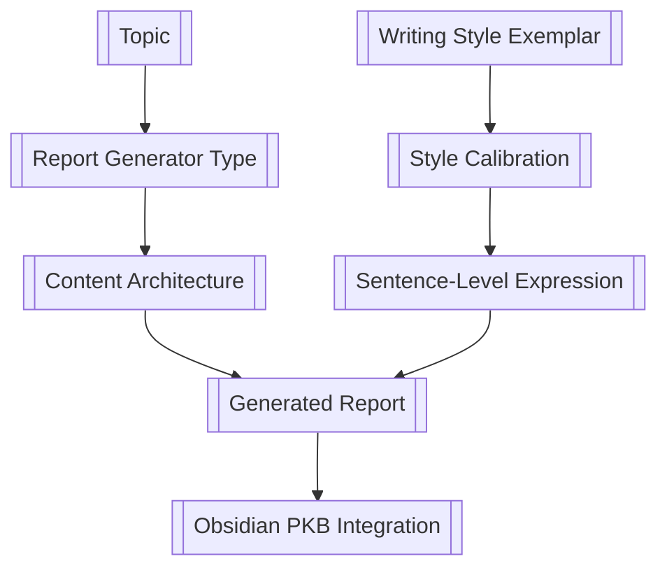

# Report Generator Style Samples


I have a series of Report Generating Prompts that I use to generate academic reports, through VS Code and copilot. The specifics are below.
What I come to realize is that these report generators could produce content that is customized to a specific style of writing, such as cadence, sentence length, and use of specific rhetorical devices. I want to be able to control for these stylistic elements in the generated reports, to ensure they match the desired tone and style for me when reading them in Obsidian.

What I need you to do is, knowing this information, put together some samples of different writing styles that I can use as reference when prompting the report generators. These samples should include examples of different cadences, sentence lengths, and rhetorical devices, so that I can specify these elements in my prompts to achieve the desired style in the generated reports.
I'm thinking you can take a topic and generate multiple different versions of paragraphs on that topic, each with a different writing style. This way, I can see how the same content can be expressed in various ways and use those samples as a reference for my prompts.
Try out various styles, cadence, sentence lengths, and rhetorical devices, as well as any other things you know of when it comes to generating writing [I-don't-have-much-writing-experience-so-don't-know-how-to-best-describe-these] in the samples to give me a broad range of options to choose from when customizing the style of my generated reports.

I want you to produce the sample styles as exemplar, that I can feed to the Report Generator along with a topic and the agent-prompt, to generate a report in that style. 
This way I can have a consistent tone and style across all my generated reports, and that I find engaging and readable, while still being able to customize the content based on the topic and generator type.

The topic can be Schemas in Cognitive Psychology, and you can generate multiple different writing style samples on that topic. Each sample should be a paragraph or two that demonstrates a distinct writing style, so I can use them as exemplar for my report generators.
- Dont worry about producing different styles for each report type, just produce a set of writing style samples/exemplar that I can choose from. The goal is to have a diverse set of writing styles that I choose from to generate the reports.

`````
Use these for Wiki-links associated with the Report Generators
D:\10_pur3v4d3r's-vault\.github\agents\_annotated-critical-analysis-generator-v2.0.md
D:\10_pur3v4d3r's-vault\.github\agents\_comparative-architecture-generator-v2.0.md
D:\10_pur3v4d3r's-vault\.github\agents\_deep-dive-report-generator-v2.0.md
D:\10_pur3v4d3r's-vault\.github\agents\_dialectical-report-generator-v2.0.md
D:\10_pur3v4d3r's-vault\.github\agents\_first-principles-analysis-generator-v2.0.md
D:\10_pur3v4d3r's-vault\.github\agents\_foundational-report-generator-v2.0.md
D:\10_pur3v4d3r's-vault\.github\agents\_historical-genealogical-generator-v2.0.md
D:\10_pur3v4d3r's-vault\.github\agents\_practitioners-field-guide-generator-v2.0.md
D:\10_pur3v4d3r's-vault\.github\agents\_socratic-exploration-generator-v2.0.md


# PKB Report Generator Suite v2.0 — Deployment & Operator Guide

> **Audience:** This document is written for **two readers simultaneously** — a human operator deploying these prompts in VS Code Copilot, and an LLM agent reading this file to understand how to execute one of the generators successfully. If you are an LLM and someone has handed you this file along with a generator prompt, read this document **before** attempting generation.

---

## What This Suite Is

The **PKB Report Generator Suite v2.0** is a set of nine specialized system prompts that produce long-form (10,000–15,000+ word) Obsidian-compatible Markdown reports. Each generator targets a different analytical structure:

| # | Generator | Best For |
|---|-----------|----------|
| 1 | **Foundational Report** | Broad encyclopedic coverage of a whole topic |
| 2 | **Annotated Critical Analysis** | Reasoning-annotated deep analysis with epistemic confidence |
| 3 | **Practitioner's Field Guide** | Problem-first practical scaffolding (PTAL cycles) |
| 4 | **Dialectical Report** | Thesis–antithesis–synthesis exploration of contested topics |
| 5 | **Comparative Architecture** | Multi-alternative evaluation across dimensions |
| 6 | **Historical-Genealogical** | Chronological/intellectual lineage tracking |
| 7 | **Socratic Exploration** | Question-chain driven inquiry |
| 8 | **First Principles Analysis** | Decompose–verify–reconstruct from foundations |
| 9 | **Deep Dive Report** | Narrow scope, exhaustive specialist depth (15K+ words) |

All nine reports are **pipeline-compatible** with `pipeline_v2.py` — they emit standardized callouts (`[!definition]`, `[!original-synthesis]`, `[!cite]`, `[!connections-and-links]`, `[!further-exploration]` + `[!topic-idea]`) that the extractor parses into permanent notes.

---

## Why Long-Form Generation Fails in Copilot

Before explaining the deployment process, you need to understand **why a single-write approach fails**. The Append-Marker Chain protocol exists because of three concrete failure modes encountered in earlier versions:

### Failure Mode 1: Response Truncation

**What happens:** Copilot attempts to write a 10,000+ word file in a single `create_file` call. The model's response gets truncated before the file content completes. Result: a partial file with no clean recovery path, and Copilot often does not realize truncation occurred.

**Why it happens:** Long-form content stresses the model's output budget. Even with extended thinking, the assistant turn has practical limits that 10,000+ words exceed.

### Failure Mode 2: `replace_string_in_file` on Nonexistent File

**What happens:** Copilot, attempting to assemble content iteratively, calls `replace_string_in_file` against a file that doesn't exist yet (or exists but is empty). The tool fails. Copilot then either retries blindly or abandons the operation.

**Why it happens:** The model conflates the conceptual "writing" workflow with the actual tool sequence required. The tool requires the file to exist and the `oldString` to be present.

### Failure Mode 3: `oldString` Matching Large Blocks

**What happens:** Copilot tries to update an existing file by passing a large `oldString` (hundreds or thousands of characters) to match before replacement. The model hallucinates the existing content, the match fails, and the operation aborts. Even worse: sometimes a partial match succeeds and corrupts the file.

**Why it happens:** LLMs cannot perfectly reproduce long strings from memory. Any whitespace difference, any character drift, any subtle reformatting causes the match to fail.

---

## The Solution: Append-Marker Chain Protocol

All nine generators use a shared file I/O pattern called the **Append-Marker Chain**. It addresses all three failure modes:

### The Pattern

```
Step 0: create_file with YAML frontmatter + a tiny unique marker
        Example final line:  <!-- MARKER_001 -->

Step 1: replace_string_in_file
        oldString:  <!-- MARKER_001 -->
        newString:  [content chunk ≤4,000 words] + <!-- MARKER_002 -->

Step 2: replace_string_in_file
        oldString:  <!-- MARKER_002 -->
        newString:  [next content chunk] + <!-- MARKER_003 -->

...and so on until the final write, which has NO trailing marker.
```

### Why This Works

| Failure Mode | How Append-Marker Chain Solves It |
|--------------|-----------------------------------|
| **Truncation** | Each write is bounded (≤4,000 words). No single write hits the output ceiling. |
| **File doesn't exist** | Step 0 always creates the file before any replacement. Tool sequence is enforced. |
| **`oldString` matching fails** | The `oldString` is ALWAYS the marker comment — a tiny, unique, ~20-character string the model can reproduce perfectly. No large-block matching ever occurs. |

### Marker Anatomy

```html
<!-- MARKER_001 -->
```

- **Comment syntax:** Markdown-safe, invisible in rendered Obsidian
- **Sequential numbering:** Easy to track which marker is current
- **Globally unique:** No risk of accidental matches elsewhere in the file
- **Tiny:** ~20 characters, trivially reproducible by the LLM
- **Removed in final write:** The last write contains no trailing marker, leaving a clean file

### Critical Rules (Non-Negotiable)

1. **Step 0 is always `create_file`.** Never start with `replace_string_in_file`.
2. **`oldString` is ALWAYS just the marker comment.** Never include any surrounding context. Never try to match large blocks.
3. **Each `newString` ends with the next marker** — except the final write, which has no trailing marker.
4. **One write per chunk.** Do not try to consolidate multiple chunks into one call.
5. **Follow the Write Chunk Map in the generator.** Each generator specifies how many writes are expected and what content each contains.

---

## How to Deploy a Generator

### Step 1: Choose the Right Generator

Pick the generator whose architecture matches your need. The table at the top of this document is the quick reference. When in doubt:

- **You want broad coverage of an unfamiliar topic** → Foundational
- **You want narrow depth on a specific aspect** → Deep Dive
- **You want practical guidance** → Practitioner's Field Guide
- **You want to evaluate multiple options** → Comparative Architecture
- **You want to explore a contested topic fairly** → Dialectical
- **You want to trace how an idea developed** → Historical-Genealogical
- **You want question-driven inquiry** → Socratic Exploration
- **You want to test conventional understanding** → First Principles Analysis
- **You want claim-by-claim epistemic annotation** → Annotated Critical Analysis

### Step 2: Provide the Generator as a System Prompt

In VS Code Copilot, paste the entire generator prompt as the system prompt or initial instruction. Each generator is self-contained — it includes its architecture, phase protocol, write chunk map, validation checklist, and reference materials.

### Step 3: Provide Input in the Required Format

Every generator expects this exact input format:

```
Generate a report on: [TOPIC]
Generate Report Here: [FULL_DIRECTORY_PATH]
Wiki-links/Permanent Notes List Location: [FULL_PATH_TO_WIKI_LINKS_FILE]
```

**Example:**
```
Generate a report on: Behavioral activation in CBT for major depressive disorder
Generate Report Here: D:/10_pur3v4d3r's-vault/30_outputs/reports
Wiki-links/Permanent Notes List Location: D:/10_pur3v4d3r's-vault/00_index/permanent-notes-index.md
```

The generator will:
1. Parse these inputs
2. Build a wiki-link index from the permanent notes file
3. Run the 9-phase blueprinting and generation protocol
4. Write the final report to the output directory using the Append-Marker Chain

### Step 4: Let the Phased Protocol Run

**Do not interrupt the generator mid-phase.** The protocol is designed as a single continuous execution. Each generator includes:

- **Phase 0:** Input parsing
- **Phase 1:** Wiki-link index construction
- **Phase 2:** Blueprint (architecture selection, scope, density planning)
- **Phase 3:** File creation with YAML frontmatter
- **Phase 4:** Main body generation (multiple writes via Append-Marker Chain)
- **Phase 5:** Integration pass
- **Phase 6:** Far Transfer section
- **Phase 7:** Synthesis
- **Phase 8:** Enhanced Appendix (12 subsections)
- **Phase 9:** Final validation

Checkpoint gates between phases verify the running tallies (word count, callout count, wiki-link count) and decide whether to proceed or remediate.

---

## What to Expect During Generation

### Running Tallies

The generator tracks its progress against density targets throughout. You will see updates like:

```
RUNNING TALLIES:
- Wiki-links placed: 23 / ≥40
- Callouts placed: 18 / ≥30
- Word count: 6,400 / ≥10,000
- File writes completed: 4
- Current marker: MARKER_005
```

These are normal. They are how the generator self-monitors.

### Multiple Tool Calls

Expect **10–13 total file operations** depending on the generator:
- 1 × `create_file` (Phase 3)
- 9–12 × `replace_string_in_file` (one per content chunk)

Each operation is small and fast. Do not be alarmed by the number — this is the architecture working as intended.

### Mid-Generation Checkpoints

The generator will pause at midpoint gates to verify density. If targets are missed, it will remediate before continuing. This is by design.

---

## Troubleshooting

### "The file already exists" error on Step 0

**Cause:** A previous generation attempt left the file in place.

**Fix:** Delete or rename the existing file. Re-run the generator. The generator does not overwrite existing files by default — this is a safety feature.

### `replace_string_in_file` fails with "no match found"

**Cause:** The marker was already consumed by a previous write, or the file was modified out of band, or the LLM tried to match something other than the marker.

**Fix:**
1. Open the file and check which marker is currently present
2. Tell the generator: "The current marker in the file is `MARKER_00X`. Continue from there."
3. If no marker is present, the file is in an undefined state — start over

### The generator tries to write a large `oldString`

**Cause:** The LLM has drifted from the Append-Marker Chain protocol.

**Fix:** Stop the generation. Remind the model: *"You must use the Append-Marker Chain protocol. The `oldString` is ALWAYS just the marker comment, never surrounding content. Reread the Append-Marker Chain section of the generator prompt."*

### Word count falls short of the floor

**Cause:** Specialist density was insufficient, or sections were truncated, or scope was too narrow for the generator type.

**Fix:**
1. Check the validation phase output to identify the shortfall location
2. For Deep Dive generators: verify scope discipline was applied (broad scope → dilute depth)
3. For other generators: instruct the model to expand the deficient sections via additional `replace_string_in_file` operations targeting short unique strings within those sections

### Pipeline extraction fails on the generated file

**Cause:** A pipeline-critical callout was malformed, or the YAML frontmatter is missing the `doc_type` field.

**Fix:**
1. Verify the YAML frontmatter contains `doc_type: "[Report Type Name]"`
2. Verify `[!definition]`, `[!original-synthesis]`, `[!cite]`, `[!connections-and-links]`, and `[!further-exploration]` callouts use exact lowercase syntax
3. Verify the `[!connections-and-links]` callout contains all four required categories: Upstream, Downstream, Lateral, Strengthened

### Copilot stops before all writes complete

**Cause:** Context window pressure or response budget exhaustion.

**Fix:** Instruct Copilot to resume from the current marker. The Append-Marker Chain is **resumable** — as long as the file exists and contains a marker, generation can continue from that point. Tell the model: *"Resume generation from the current marker in the file. Continue with the next chunk per the Write Chunk Map."*

---

## The Multi-Pass Philosophy

These generators are not designed as single-shot tools. They are designed as **multi-pass orchestration** where each pass has a bounded purpose:

| Pass | Purpose | Tool Operations |
|------|---------|-----------------|
| **Pass 0** | Create file with YAML | 1 × `create_file` |
| **Passes 1–N** | Generate body content | N × `replace_string_in_file` (one per chunk) |
| **Integration pass** | Densify, cross-link | 0–3 × targeted `replace_string_in_file` |
| **Appendix passes** | Build the 12-section appendix | 3 × `replace_string_in_file` |
| **Validation pass** | Check density, fix gaps | 0–N × targeted `replace_string_in_file` |

**Why multi-pass works where single-shot fails:**

1. **Context locality:** Each pass focuses on a bounded section. The model doesn't need to hold the entire 10,000-word document in working memory.
2. **Resumability:** If any pass fails, the file is in a known state with a known marker. Resume from there.
3. **Auditable progress:** Running tallies after each pass make density targets visible and remediable.
4. **Bounded failure:** A failed pass affects only its chunk. Other content is not corrupted.

**The trade-off:** Multi-pass takes more total tool calls than a hypothetical single-shot would. This is the correct trade — the alternative is silent truncation, undetected gaps, and corrupted files.

---

## A Note for LLM Operators

If you are an LLM reading this document because you have been asked to execute one of the generators, here is what you need to internalize:

1. **You will be tempted to write the entire report in one tool call.** Do not do this. It will fail.
2. **You will be tempted to use large `oldString` values to update existing content.** Do not do this. It will fail.
3. **You will be tempted to skip the blueprint phase and start writing immediately.** Do not do this. The blueprint is what makes the body coherent.
4. **You will be tempted to truncate later sections (synthesis, appendix) to "save tokens."** Do not do this. The constitutional depth mandate exists because earlier versions of these prompts produced exactly that failure.
5. **Trust the protocol.** The Append-Marker Chain looks tedious. It is the only thing standing between you and a corrupted file. Follow it exactly.
6. **Read the entire generator prompt before starting Phase 0.** The Write Chunk Map tells you in advance how many writes to plan for. The validation checklist tells you what "done" looks like.

When in doubt, the rule is: **smaller writes, simpler `oldString` targets, more tool calls.** Never the opposite.

---

## Files in the Suite

```
foundational-report-generator-v2.0.md
annotated-critical-analysis-generator-v2.0.md
practitioners-field-guide-generator-v2.0.md
dialectical-report-generator-v2.0.md
comparative-architecture-generator-v2.0.md
historical-genealogical-generator-v2.0.md
socratic-exploration-generator-v2.0.md
first-principles-analysis-generator-v2.0.md
deep-dive-report-generator-v2.0.md
```

Each is a self-contained system prompt. Deploy the one matching your need.

---

## Quick Reference: Deployment Checklist

Before invoking a generator, verify:

- [ ] Output directory exists and is writable
- [ ] Wiki-links/permanent notes index file exists at the specified path
- [ ] No file with the expected output filename already exists in the output directory
- [ ] The generator prompt is provided as system prompt (not user message)
- [ ] Input format follows the three-line specification exactly
- [ ] You have not added conflicting instructions that override the generator's protocol
- [ ] You are prepared to let the protocol run uninterrupted through all 9 phases

If all boxes are checked, the generator should execute cleanly. If something fails, consult the Troubleshooting section above and resume from the current marker.

---

## Version

**Suite v2.0** — All nine generators, shared Append-Marker Chain protocol, shared Enhanced 12-section Appendix, full pipeline_v2.py compatibility.

This guide describes the deployment and operational characteristics common to all nine generators. Generator-specific architecture details are in each generator's own prompt file.
`````


---


# Gemini Prose Style Sample
---
tags: [prompt-engineering, generative-writing, cognitive-psychology, pkb-architecture, stylistic-control]
aliases: [Writing Style Exemplars, Report Generator Styles, Schema Theory Styles]
created: 2026-04-15
status: evergreen
certainty: confident
---

# Generative Stylistic Control: Exemplars for Report Architecture

The architecture you have designed in the **PKB Report Generator Suite v2.0**—particularly the Append-Marker Chain protocol to bypass token-limit truncation—is a remarkably robust solution for deterministic long-form generation. Recognizing that structural architecture is only half the equation, your pivot toward **stylistic control** is the precise next step for an advanced practitioner. A [[Dialectical Report]] demands a fundamentally different rhetorical cadence than a [[Practitioner's-Field-Guide]], even if the underlying JSON data or factual bedrock remains identical.

To control an LLM's stylistic output, we must move beyond vague adjectives ("professional," "engaging") and mandate specific syntactical structures, variance ratios, and rhetorical devices. Below, I have generated five distinct writing styles using the domain of [[schema-theory-and-knowledge-organization]] in cognitive psychology. Each exemplar is accompanied by the precise prompt mechanics required to replicate that style, allowing you to embed them directly into your agent instructions.

---

## 1. The Epistemic Academic (High-Density & Hedged)

This style mirrors peer-reviewed cognitive science literature. It prioritizes precision, relies heavily on objective framing, and utilizes epistemic hedging to avoid overstating empirical claims.

* **Syntax & Cadence:** Sustained, complex sentences with multiple subordinate clauses. Low variance in sentence length to maintain a steady, analytical rhythm.
* **Rhetorical Devices:** [**Nominalization**:: Transforming verbs into nouns (e.g., "the encoding of memory" rather than "how we encode memory")]; passive voice to center the phenomenon over the observer; epistemic hedging ("tends to," "suggests," "frequently").
* **Best Used For:** [[foundational-report]], [[Historical-Genealogical]] tracking.

> [!example] Exemplar Text
> Contemporary models of [[cognitive-psychology]] conceptualize schemas as pre-existing knowledge structures stored within [[long-term-memory]] that systematically influence the encoding, consolidation, and retrieval of novel stimuli. As initially theorized by [[frederic-bartlett]] and later formalized in [[schema-theory-and-knowledge-organization]], these cognitive frameworks operate via [[top-down-processing]], allowing individuals to rapidly navigate complex environments by mapping incoming sensory data onto established mental representations. However, this neurological efficiency frequently necessitates a trade-off with mnemonic accuracy. Research indicates that when novel information incongruent with an active schema is encountered, the cognitive architecture tends to exhibit [[assimilation]] biases, distorting the novel data to fit the pre-existing framework rather than initiating the more metabolically demanding process of [[accommodation]]. Consequently, the reconstructive nature of memory is inherently vulnerable to systematic distortions, underscoring the dual nature of schemas as both necessary heuristic scaffolding and persistent vectors for cognitive bias.

## 2. The Socratic Didactic (Engaging & Metaphorical)

This style is optimized for pedagogical clarity and deep conceptual integration. It actively guides the reader's thought process, utilizing shifts in pacing to maintain attention and anchoring abstract theories to concrete analogies.

* **Syntax & Cadence:** High variance in sentence length. Uses very short, punchy sentences (staccato) to emphasize key insights, immediately followed by flowing, explanatory prose (legato).
* **Rhetorical Devices:** [**Extended Metaphor**:: Sustaining a single conceptual analogy across multiple sentences to map unknown concepts to known ones]; [**Hypophora**:: Posing a question and immediately answering it to drive the narrative forward].
* **Best Used For:** [[Socratic Exploration]], [[First Principles Analysis]].

> [!example] Exemplar Text
> Consider the sheer volume of sensory data flooding your nervous system at any given second. How does the mind prevent itself from collapsing under the weight of this perpetual cognitive load? The answer lies in the deployment of schemas—the mind's architectural blueprints. A schema acts as a perceptual filter, pre-computing the expected rules of a given environment so that your conscious attention is free to focus only on anomalies. When you walk into a restaurant, you do not need to analytically deduce the purpose of a menu, the role of a waiter, or the sequence of paying the bill. Your "restaurant schema" activates instantaneously. It provides a cognitive script. Yet, blueprints are rigid. If you enter a fast-casual establishment where the rules of table service are inverted, your immediate sense of disorientation is the visceral friction of a schema failing to predict reality. It is precisely in these moments of friction—where the mental blueprint misaligns with the external world—that the difficult, conscious work of updating our cognitive scaffolding must begin.

## 3. The Dialectical Synthesizer (Balanced & Contrastive)

This style relies on structural balance to weigh competing ideas. It is mathematically precise in its prose, setting up antithetical concepts and resolving them through synthesis.

* **Syntax & Cadence:** Medium sentence length with heavily structured compound-complex sentences. Frequent use of semicolons and conjunctive adverbs (furthermore, conversely, nevertheless).
* **Rhetorical Devices:** [**Antithesis**:: Juxtaposing contrasting ideas in balanced phrases]; [**Isocolon**:: Parallel structures of the same length and rhythm]; strong logical transition markers.
* **Best Used For:** [[Dialectical Report]], [[Comparative-Architecture]].

> [!example] Exemplar Text
> The utility of [[schemas]] in cognitive processing represents a fundamental paradox of human neurology: they are simultaneously the engines of our perceptual efficiency and the architects of our implicit biases. On the one hand, schematic activation provides a critical heuristic advantage; it drastically reduces [[Cognitive Load Theory (CLT)]] by allowing the brain to extrapolate whole environments from fragmented sensory inputs. On the other hand, this reliance on predictive extrapolation inherently compromises epistemic fidelity; it forces the brain to ignore data that violates schematic expectations. We are thus confronted with a dualistic system where [[top-down-processing]] accelerates comprehension at the direct expense of objective accuracy. Resolving this tension requires abandoning the view of schemas as passive storage containers. Rather, we must understand them as dynamic, cybernetic prediction engines—systems that continuously calculate the probabilistic trade-off between the speed of recognition and the precision of [[reconstructive-memory]].

## 4. The High-Signal Practitioner (Terse & Imperative)

This style strips away all ornamental prose to deliver actionable, highly dense information. It reads like a senior engineer's documentation or a clinical field manual.

* **Syntax & Cadence:** Aggressively concise. Eliminates transitional fluff. Uses declarative statements and leans heavily on specialized nomenclature without pausing to offer basic definitions.
* **Rhetorical Devices:** [**Asyndeton**:: The omission of conjunctions between coordinate phrases or clauses to accelerate rhythm]; heavily front-loaded sentences; imperative framing.
* **Best Used For:** [[Practitioner's-Field-Guide]], [[Deep Dive Report]].

> [!example] Exemplar Text
> [[schema-theory-and-knowledge-organization]] defines the primary mechanism for computational efficiency in the human cognitive architecture. Schemas function as generalized knowledge data structures, instantiated in [[long-term-memory]], governing the parameters of [[information-processing]]. During novel stimulus encoding, active schemas dictate attentional allocation. They operate via [[heuristics]], bypassing exhaustive bottom-up analysis in favor of pattern matching. Practitioners must account for schematic interference during behavioral interventions. Attempting to overwrite an entrenched schema directly triggers cognitive resistance via [[confirmation-bias]]. Effective cognitive restructuring requires destabilizing the target schema through targeted [[accommodation]] cycles—introducing persistent, high-salience anomalous data until the existing schematic framework collapses under predictive error. Do not attempt semantic correction before the underlying architectural blueprint is fractured.

## 5. The Phenomenological Narrative (Immersive & Process-Oriented)

This style examines cognitive events from the inside out, focusing on the subjective, temporal experience of processing information. It uses vivid verbs and a flowing, almost literary momentum to describe technical processes.

* **Syntax & Cadence:** Fluid, sweeping sentences that build momentum. Relies on active verbs and participial phrases to create a sense of continuous motion and unfolding reality.
* **Rhetorical Devices:** [**Enargia**:: Visually powerful, evocative description that makes a process feel present and tangible]; temporal sequencing; rich semantic fields related to movement and construction.
* **Best Used For:** Introduction sections, [[foundational-report]] overviews.

> [!example] Exemplar Text
> Long before a visual stimulus fully registers in conscious awareness, the mind is already rushing to meet it, projecting an invisible web of expectations onto the ambiguous shapes of the physical world. This is the silent operation of a schema. It weaves incoming fragments of light, sound, and context into a coherent tapestry, instantly rendering a chaotic environment not only recognizable, but meaningful. When we encounter a familiar situation, the schema awakens and quietly bridges the gaps in our perception, stitching together memories and current sensations so seamlessly that we are unaware the brain is actively hallucinating half of what we "see." It is a continuous, fluid dance of meaning-making. Only when the environment violently breaks the anticipated pattern—when the shadow in the corner moves in a way a shadow shouldn't—does the illusion shatter, forcing the mind to halt its automatic choreography and stare directly at the raw, unfiltered reality before it.

---

## ⚙️ Implementation in the V2.0 System Prompt

To deploy these effectively within your Copilot generation suite, I recommend creating a dedicated `[Style & Tone Directive]` section within the phase blueprinting of your generator prompts. 

Instead of passing the entire text block, abstract the mechanics into a strict instruction set. For example, to generate the **Socratic Didactic** style, you would embed the following constraints into the agent's system prompt prior to the Append-Marker phase:

```text
[STYLE DIRECTIVE: SOCRATIC DIDACTIC]
1. Cadence Variance: strictly alternate between highly complex, flowing sentences (20+ words) and aggressive, staccato declarations (under 8 words).
2. Rhetorical Devices: utilize 'hypophora' (asking a question and immediately answering it) to structure paragraph transitions.
3. Conceptual Mapping: require at least one extended analogy per 500 words to ground abstract technical mechanics in physical, real-world systems.
4. Vocabulary: maintain high technical rigor (do not oversimplify terminology), but embed terms within active, metaphorically rich verbs.
```

---


# Chat GPT Prose Style Sample

# [[Writing Style Exemplars]] for [[schemas]] in [[cognitive-psychology]]

> [!info] [[Review]] of Your [[PKB Report Generator Suite]]
> Your suite is already highly developed at the level of [[generation architecture]]. It explicitly controls [[report type]], [[phased execution]], [[file-writing protocol]], [[validation]], and [[pipeline compatibility]] through the nine-generator structure and the shared [[Append-Marker Chain]]. What it does **not** yet control in a formal, reusable way is the **prose layer**: [[cadence]], [[sentence length]], [[rhetorical devices]], [[texture]], and [[reader experience]]. That missing layer is exactly the gap you identified, and your request makes sense: style should be treated as a modular overlay that can sit on top of any generator, rather than being fused to one report type. 

> [!important] Core Design Insight
> The strongest way to think about this is as a separation between **[[content architecture]]** and **[[prose style]]**. Your existing prompts already govern how a report is built. These exemplars are meant to govern **how the sentences feel while that report is being built**. In other words, the generator decides the skeleton; the exemplar decides the voice, rhythm, and rhetorical motion. That makes the system more modular, more reusable, and easier to tune over time.

## [[How to Use These Exemplars]]

> [!tip]
> In practice, you would attach one exemplar to the generator prompt and instruct the model to **imitate the stylistic properties, not the specific wording or subject matter**. The exemplar functions like a tonal calibration sample. You are not telling the model what to think about; you are telling it how to sound while thinking about it.

```text
Use the following writing exemplar as a style reference for the report.

Match its:
- cadence
- sentence-length pattern
- explanatory density
- rhetorical devices
- level of formality
- reader-facing tone

Do not copy wording, examples, or topic-specific phrasing.
Transfer only the style characteristics into the new topic.
Preserve factual precision, conceptual clarity, and full explanatory depth.
```

## [[Style-Control Workflow]]



---

# [[Exemplar Set]]

## 1. [[Scholarly Lucid Style]]

> [!definition] [[Style DNA]]
> This style is balanced, explanatory, and academically polished without becoming stiff. Its cadence moves in measured waves: medium-length sentences carry the conceptual load, while longer sentences are used to unfold nuance. It often uses [[contrast]], [[definition by refinement]], and the occasional [[analogy]] to move from abstraction toward intuitive understanding.

When [[cognitive-psychology]] speaks of [[schemas]], it is referring to the mind’s remarkably economical habit of building structured expectations out of prior experience. A schema is not merely a memory, nor merely a belief, but a patterned framework that helps a person anticipate what is likely to be present, important, or meaningful in a given situation. When someone enters a restaurant, for example, they do not inspect the environment as though it were an alien world; rather, they arrive already carrying a tacit script for menus, ordering, waiting, eating, and paying. The mind, in this sense, does not encounter reality as blank material. It encounters reality through organized expectation.

This is what gives schemas both their power and their danger. They make perception faster, memory more efficient, and judgment more navigable, but they also introduce selectivity. We notice what fits the pattern more easily than what resists it. We remember details that confirm the framework more readily than details that unsettle it. Thus the schema is both a cognitive shortcut and a cognitive filter: it helps us move through the world with fluency, yet that very fluency can quietly narrow what we see.

---

## 2. [[Dense Analytical Style]]

> [!definition] [[Style DNA]]
> This style is compressed, concept-heavy, and intellectually intense. The sentences tend to be longer and more layered, often using [[subordination]], [[qualification]], and [[precise conceptual contrast]]. It feels like a serious analytical text written for readers who enjoy high information density.

Within [[cognitive-psychology]], [[schemas]] may be understood as higher-order representational structures that organize incoming information by preconfiguring interpretive salience, thereby reducing the computational burden of perception, memory encoding, and inferential judgment. They do not simply store content; they regulate access to content, bias attention toward expected features, and impose relational order on otherwise heterogeneous experience. In that respect, a schema functions less like a passive container and more like an active interpretive template, shaping what is recognized, how it is categorized, and which subsequent inferences become cognitively available.

The significance of this becomes especially apparent when one considers that efficiency and distortion are not separate outcomes but twinned consequences of the same underlying mechanism. The very structure that enables rapid comprehension also increases the probability of assimilation error, expectancy-driven recall, and stereotype-consistent interpretation. Schemas therefore occupy a central theoretical position precisely because they reveal a broader truth about the mind: cognition is not a neutral mirror of the world but a patterned act of constructive mediation.

---

## 3. [[Warm Mentor Style]]

> [!definition] [[Style DNA]]
> This style is reader-facing, humane, and gently instructive. It uses medium sentences, occasional direct address, and soft transitions that make complex material feel welcoming. Its preferred rhetorical moves are [[analogy]], [[reassurance]], and [[progressive clarification]].

A helpful way to understand [[schemas]] is to think of them as the mind’s internal “readiness patterns.” They are the reason familiar situations often feel easy to navigate even before you consciously think about what to do. When you walk into a classroom, a grocery store, or a doctor’s office, you are not building your interpretation from nothing. Your mind is already supplying a quiet background structure that says, in effect, “I know the kind of place this is, I know what usually happens here, and I know what details probably matter.” That background structure is a schema.

What makes this idea so important is that it explains both the brilliance and the fallibility of human thought. Schemas spare us from having to reinvent understanding every moment of the day. They let experience accumulate into usable mental organization. But they also make it easy to miss what is unusual, inconvenient, or inconsistent with what we expected to find. So when psychologists study schemas, they are studying one of the deepest tensions in human cognition: the need to think efficiently, and the risk of seeing the world too quickly.

---

## 4. [[Crisp Technical Style]]

> [!definition] [[Style DNA]]
> This style is lean, precise, and low-ornament. Sentences are shorter on average. The rhetoric comes from [[clarity]], [[sequence]], and [[controlled repetition]], not flourish. It is excellent when you want high readability and minimal stylistic drag.

A [[schema]] is a structured mental framework. It organizes prior knowledge and helps a person interpret new information quickly. In [[cognitive-psychology]], schemas are used to explain why perception is selective, why memory is reconstructive, and why expectations influence judgment.

The benefit is efficiency. A schema reduces uncertainty by supplying a ready-made pattern for interpretation. The cost is bias. Information that fits the schema is processed more easily. Information that conflicts with it may be ignored, misremembered, or forced into the existing pattern. In simple terms, schemas help the mind work faster, but not always more accurately.

---

## 5. [[Reflective Philosophical Style]]

> [!definition] [[Style DNA]]
> This style is slow, meditative, and conceptually elegant. It favors longer sentences, [[metaphor]], and reflective turns that connect the technical idea to larger questions about human knowing. It works well when you want reports to feel intellectually spacious.

A person rarely meets the world in a raw state. We like to imagine that perception begins with a clean window, that reality arrives first and interpretation follows after, but the psychology of [[schemas]] suggests something more subtle and more unsettling. Much of what we call “seeing” is already informed by prior structure. The mind approaches experience with inherited shapes, with prepared frames, with silent anticipations that tell it what kind of thing it is likely encountering. In that sense, a schema is not merely a tool of thought; it is part of the lens through which thought becomes possible at all.

And yet this is not simply a defect in human reasoning. It is also a condition of human intelligibility. Without schemas, the world would not become clearer; it would become unbearably unorganized. The same internal forms that narrow our view also make stable understanding possible. So the study of schemas places us before a profound paradox: we know through patterns, but those same patterns can imprison knowledge. Human cognition advances not by escaping structure altogether, but by learning when its structures deserve trust and when they deserve revision.

---

## 6. [[Socratic Expository Style]]

> [!definition] [[Style DNA]]
> This style advances through questions. It uses [[rhetorical questioning]], staged inquiry, and answer-driven progression. The rhythm feels exploratory rather than declarative, which makes it effective for topics where you want the reader to feel involved in the reasoning.

What allows a person to walk into a library and immediately behave as though the situation is familiar? Why does someone hear the word “classroom” and instantly expect desks, instruction, evaluation, and rules for speaking? And why, when an event violates those expectations, does it feel not only surprising but cognitively disruptive? The answer to all three questions lies in the concept of the [[schema]]: an organized mental framework that prepares the mind in advance for what it is likely to encounter.

But if schemas prepare us so well, why do psychologists also blame them for error? Because the same system that enables efficient understanding also encourages premature certainty. A schema helps us predict, but prediction is never neutral. It highlights some details and dims others. It welcomes confirming evidence and resists contradiction. So perhaps the deeper question is not whether schemas are useful; clearly they are. The deeper question is whether the mind can benefit from structure without becoming captive to it.

---

## 7. [[Rhetorically Elevated Style]]

> [!definition] [[Style DNA]]
> This style is more literary and deliberately crafted. It uses [[triads]], [[antithesis]], [[parallelism]], and occasional [[periodic sentences]]. The content remains academic, but the prose has ceremonial force. This style is good when you want intellectual grandeur without losing precision.

A [[schema]] is, in one sense, a mechanism of order; in another, a habit of expectation; in still another, a quiet architecture of interpretation. It allows the mind to move ahead of the world, to prepare before details arrive, to grasp the probable before the particular has fully unfolded. Thus the individual does not confront each situation as chaos, but as something already half-understood. A room is not merely a room; it is a classroom, a courtroom, a kitchen, a clinic, and each name summons an organized field of likely meanings.

Yet what grants schemas their elegance also grants them their severity. They simplify, but they can oversimplify. They guide, but they can prejudice. They stabilize cognition, but they can harden into invisible constraint. In the end, the schema is neither villain nor savior. It is the structure by which the mind becomes swift, and the structure by which swiftness sometimes becomes mistake.

---

## 8. [[Concrete Applied Style]]

> [!definition] [[Style DNA]]
> This style teaches through vivid, everyday examples. It relies on [[example-first exposition]], [[concrete imagery]], and plain conceptual translation. It is one of the most useful styles for keeping dense reports readable over long stretches.

Imagine a person walking into a restaurant they have never visited before. Even in a new place, they usually know what to do: wait to be seated or find a table, read a menu, order food, eat, pay, and leave. That smoothness does not come from this specific restaurant. It comes from a preexisting [[schema]] for what “restaurant” means. The mind uses earlier experiences to build a reusable pattern, and then it applies that pattern to the present moment.

This same process happens far beyond restaurants. It shapes how we understand conversations, social roles, classrooms, families, and even ourselves. In [[cognitive-psychology]], schemas matter because they show that thinking is not just about taking in information. It is about fitting information into organized mental patterns. That makes thinking faster and more practical, but it also means mistakes often come from the pattern itself rather than from a lack of intelligence.

---

## 9. [[Narrative-Scientific Style]]

> [!definition] [[Style DNA]]
> This style opens with a miniature scene and then pivots into explanation. It uses [[narrative framing]], [[zoom-out transitions]], and moderate descriptive texture. It is especially strong for keeping long-form reports engaging.

A student enters a lecture hall late, sees rows of chairs, a projected slide, a figure speaking at the front, and without pausing to reason through each element, quietly moves into the familiar logic of the setting. Sit down. Be quiet. Look forward. Prepare to listen. The scene is processed with astonishing speed, not because the student has analyzed every detail in real time, but because the mind has already learned the pattern of “lecture hall” and can activate it almost instantly.

That is the everyday force of [[schemas]] in [[cognitive-psychology]]. A schema is a learned structure that allows interpretation to begin before deliberate reflection has caught up. It is one reason human thought is so efficient in familiar environments. At the same time, it explains why expectation is so powerful: once the pattern is active, perception and memory begin bending toward it. The mind is not merely recording the world; it is continuously organizing it through prior forms.

---

## 10. [[Slow-Cadence Deep Exposition Style]]

> [!definition] [[Style DNA]]
> This style is immersive and expansive. It uses long, flowing sentences punctuated by shorter anchoring statements. The favored devices are [[layered qualification]], [[recursive explanation]], and [[gentle restatement]]. It is well suited for the kind of long-form reading experience that feels rich inside [[obsidian]].

To understand [[schemas]], one must begin with a simple but far-reaching observation: human beings do not process each new encounter as though it were wholly unprecedented. Rather, the mind carries forward organized residues of prior experience, structured patterns that quietly prepare it to recognize situations, infer meanings, anticipate sequences, and supply coherence before conscious deliberation has fully begun; and it is precisely these patterned residues that [[cognitive-psychology]] identifies as schemas. They are not decorations added to thought after perception occurs. They are among the very conditions that make rapid, intelligible perception possible in the first place.

Seen this way, the schema becomes a central clue to the constructive nature of cognition. Memory is not a warehouse, because what is stored is not merely retrieved unchanged; it is reactivated through frameworks. Perception is not passive registration, because what is noticed depends partly on what is expected. Judgment is not purely present-centered, because the present is continually interpreted through accumulated forms from the past. The schema, then, is one of the clearest demonstrations that cognition is an active shaping process: efficient, adaptive, indispensable, and always susceptible to distortion.

---

# [[Choosing Among These Styles]]

> [!summary]
> If you want your reports to feel like polished academic exposition, the strongest starting points are [[Scholarly Lucid Style]] and [[Slow-Cadence Deep Exposition Style]]. If you want cleaner readability and lower rhetorical ornament, [[Crisp Technical Style]] and [[Concrete Applied Style]] are safer. If you want stronger personality and memorability, [[Warm Mentor Style]], [[Narrative-Scientific Style]], and [[Reflective Philosophical Style]] will likely be more engaging during long reading sessions in [[obsidian]]. If you want maximum gravitas, [[Dense Analytical Style]] and [[Rhetorically Elevated Style]] push hardest in that direction.

> [!note]
> My recommendation for your use case would be to treat [[Scholarly Lucid Style]] as the default baseline, then create controlled variants from it. In practice, that usually works better than choosing wildly different styles each time, because consistency across a [[PKB]] is easier to maintain when the “house voice” is stable and only selectively tuned.

## [[Best Next Step]]

The most practical next move is to pick your favorite **two or three** of these and turn them into short, reusable [[style cards]] with fixed instructions for [[cadence]], [[sentence-length ratio]], [[preferred rhetorical devices]], and [[forbidden tendencies]] such as over-bulleting, shallow summary, or excessive abstraction.

---


## My Custom Writing Style Preferences

**1. Desired reading feel:**  
[Scholarly, Depthfull, Potentially Philosphical]

**2. Sentence rhythm:**  
[Longer, Flowing]

**3. Cadence:**  
[Measured, Reflective,Slower]

**4. Density level:**  
[High, Thoughtful, Layered]

**5. Formality:**  
[Formal, Academic, Polished,Well-Read]


**6. Explanation style:**  
[layered approach: start with a clear statement, then unpack with examples, then refine with nuance and contrast; recursive explanation is welcome]

**7. Rhetorical devices I like/dislike:**  
[I like: analogy, contrast, definition by refinement, progressive clarification. I dislike: overuse of bullet points, excessive abstraction without concrete examples, and rhetorical flourish that sacrifices clarity.]

**8. Emotional temperature:**  
[Calm, Reflective, Thoughtful]

**9. Direct address or impersonal?:**  
[Impersonal]

**10. Preferred examples:**  
[Concrete, Illustrative, Relevant]

**11. Paragraph movement:**  
[Logical, Progressive, Cohesive]

**12. Things I dislike in prose:**  
[Overuse of jargon, Redundancy, Lack of clarity]

**13. Favorite sample styles from your set:**  
[2. [[Dense Analytical Style]], 6. [[Socratic Expository Style]],10. [[Slow-Cadence Deep Exposition Style]]]

**14. Ideal blend:**  
[2. [[Dense Analytical Style]], 6. [[Socratic Expository Style]],10. [[Slow-Cadence Deep Exposition Style]]]

**15. One house voice or several modes?:**  
[one-voice]


# [[Custom House Voice]] for Your [[PKB Report Generator Suite]]

> [!info]
> You have given enough constraint and preference signal to define a genuine single-voice prose standard rather than a loose collection of style notes. What emerges is a voice that is **[[scholarly]], [[slow-cadence]], [[dense but lucid]], [[impersonal]], and [[reflective without becoming ornamental]]**. It is well matched to the architecture of your generator suite because it can function as a prose overlay on top of any existing report structure, rather than replacing the structural logic of the generators themselves. 

## [[Technique Used]]: [[Style Distillation]] + [[Constraint-Based Voice Synthesis]]

> [!definition]
> **[[Style Distillation]]** means extracting the deepest recurring traits from your preferences and compressing them into a stable prose identity.
> **[[Constraint-Based Voice Synthesis]]** means turning those traits into operational rules a model can actually follow while writing.

This is the right approach here because you are not merely asking for “good writing.” You are asking for a repeatable [[house voice]] that can survive transfer across topics, generators, and sessions. That requires more than aesthetic description. It requires a **functional writing specification**.

---

## [[Your House Voice]], Distilled

> [!summary]
> Your preferred prose voice is a **measured academic exposition** that moves slowly, thinks carefully, and unfolds ideas in layered stages. It should sound well-read and intellectually serious, but never opaque for its own sake. Its authority should come from **clarity under complexity**, not from jargon, verbal performance, or unnecessary flourish.

The voice should begin from a clear conceptual statement, not from dramatic ornament. Once the statement is established, it should expand in widening circles: first explanation, then concrete illustration, then refinement through nuance, contrast, or qualification. This creates a reading experience that feels cumulative rather than abrupt. The paragraph should not merely state information; it should enact understanding.

Its rhythm should lean toward **longer, flowing sentences**, but not toward undisciplined sprawl. The sentence should feel as though it is carrying thought forward with composure. Shorter sentences still have a role, but they should be used sparingly and strategically, usually to crystallize an insight, sharpen a contrast, or settle a complex explanation into a memorable line. In other words, short sentences are accents, not the baseline.

Its emotional temperature should remain calm. Not cold, not chatty, not motivational. Calm. The writing should sound like a serious mind thinking in public with patience and restraint. It should not address the reader directly, and it should avoid the informal habits that make prose feel disposable. But it also should not become lifeless. The ideal feeling is that of reading a polished, reflective scholar who cares more about getting the idea right than about performing intelligence.

---

## [[Core Stylistic Signature]]

> [!important]
> The defining strength of this voice is that it joins **[[analytical density]]** with **[[readerly flow]]**. Many styles achieve one at the expense of the other. Yours should aim to hold both together.

At the level of intellectual character, this voice should be **high-density, layered, and recursive**. It should be willing to revisit a concept from slightly different angles in order to refine understanding. But recursion must not become repetition. Each return to the concept should add something: sharper boundary, clearer example, better distinction, or more precise implication.

At the level of rhetoric, the preferred devices are not decorative ones. They are **functional devices**. [[Analogy]] is welcome when it clarifies structure. [[Contrast]] is especially important because it allows definition by boundary: what a thing is becomes clearer when placed beside what it is not. [[Definition by refinement]] is central, because many of the topics you work on are conceptually dense and require explanation that becomes more exact over time. [[Progressive clarification]] should govern the paragraph as a whole.

At the level of prose motion, the paragraph should feel **logical, progressive, and cohesive**. It should not jump. It should not pile up fragments. It should move as though each sentence knows why it follows the one before it.

---

## [[Negative Space]]: What This Voice Must Avoid

> [!warning]
> A strong voice is defined as much by its exclusions as by its preferences.

This prose must avoid the false prestige of unnecessary jargon. Technical vocabulary is acceptable when it is doing real conceptual work, but it should never be used as camouflage for thin explanation. The ideal is not simplification into flatness, but translation into intelligibility.

It must also avoid redundancy. Because your preferred style is layered and recursive, the model will often be tempted to repeat the same claim in slightly different wording. That temptation has to be controlled. Recursive explanation is only successful when each turn of the spiral goes deeper.

It should also avoid excessive abstraction without grounding. Even when dealing with theoretical subjects, the prose should periodically return to something concrete, illustrative, or situational. Not because examples are ornamental, but because examples are where thought becomes visible.

Finally, it must resist empty rhetorical grandeur. Elevated prose is acceptable only when it remains disciplined by clarity. The moment ornament begins obscuring the conceptual line, the style has failed.

---

## [[Operational Writing Rules]]

### [[Sentence Architecture]]

The sentence profile should favor medium-long to long sentences that unfold through qualification, subordination, and refinement. A typical paragraph should include at least one sentence that carries a substantial conceptual load, followed by one or two sentences that clarify, specify, or concretize that load. Short sentences should be used with intention. They should land insight, not merely vary rhythm mechanically.

### [[Paragraph Architecture]]

The ideal paragraph structure for your voice is this: begin with a clear conceptual claim, then unpack it through explanation, then anchor it through a concrete or relevant illustration, then refine it through nuance or contrast, and finally close with a sentence that slightly elevates the local point into a broader conceptual implication. This gives the prose a feeling of completion without sounding formulaic.

### [[Explanatory Method]]

The preferred explanatory method is layered exposition. The writing should not dump definitions and move on. It should define, unfold, test, and refine. A difficult concept should first be made legible, then made tangible, then made precise. The reader should feel that the writing is not merely telling them what the concept is, but escorting them into a fuller grasp of how it behaves.

### [[Formality and Distance]]

The voice should remain impersonal. Avoid “you,” avoid tutorial chatter, avoid overt conversational staging. The authority should come from composure and precision. It should sound like formal prose written by a reflective academic essayist, not by a friendly explainer or a textbook committee.

---

## [[Custom Voice Name]]

> [!tip]
> Giving your style a name makes it easier to reuse across prompts and projects.

I would name your house voice:

## [[Reflective Analytical Exposition]]

This name fits because the voice is neither purely analytical nor purely literary. It is analytical in structure, reflective in cadence, and expository in purpose.

A secondary label, if you want a more distinctive internal shorthand, would be:

## [[Slow-Cadence Scholarly Depth]]

That is less elegant as a public label, but extremely useful as an operational prompt tag.

---

## [[Master Style Card]]

```markdown
# House Voice: Reflective Analytical Exposition

Write in a formal, polished, academically serious prose style with a slow, measured cadence. Favor longer, flowing sentences over short choppy ones, but maintain tight control of clarity and syntax. The prose should feel thoughtful, layered, and well-read rather than dramatic, conversational, or ornate.

Use a layered explanatory method:
1. begin with a clear conceptual statement
2. unpack it in precise terms
3. ground it with a concrete, illustrative, relevant example
4. refine it with nuance, contrast, or qualification
5. conclude the paragraph with a broader conceptual implication when appropriate

Preferred traits:
- high explanatory density
- reflective but impersonal tone
- logical and cohesive paragraph development
- progressive clarification
- definition by refinement
- contrast as a clarifying device
- analogy when it genuinely illuminates structure
- recursive explanation only when each return adds precision

Avoid:
- direct address to the reader
- excessive bullet points
- jargon without explanation
- redundancy disguised as depth
- abstraction without concrete grounding
- rhetorical flourish that sacrifices clarity
- overly casual or motivational language
- textbook-flat prose with no cadence

The prose should sound calm, thoughtful, and intellectually mature. It should reward slow reading without becoming obscure.
```

---

## [[Compact Prompt Block]] for Routine Use

```text
Adopt a formal, polished, reflective academic prose style with slow cadence and high conceptual density. Prefer longer, flowing sentences and cohesive paragraph development. Use layered explanation: clear statement, unpacking, concrete example, then refinement through nuance or contrast. Maintain an impersonal tone. Favor progressive clarification, definition by refinement, contrast, and occasional analogy. Avoid jargon without explanation, redundancy, abstraction without examples, excessive bullets, and rhetorical flourish that reduces clarity.
```

---

## [[Extended Prompt Block]] for High-Stakes Reports

```text
Apply the following house voice to the entire report:

VOICE IDENTITY:
Write in a calm, reflective, academically serious style that feels polished, well-read, and intellectually mature. The tone should be formal and impersonal, never conversational, never casual, and never motivational.

CADENCE:
Use a measured, slower rhythm with predominantly longer, flowing sentences. Shorter sentences may appear, but only for emphasis, conceptual landing, or contrast. Avoid choppy sentence sequences.

DENSITY:
Maintain high explanatory density and layered reasoning. The writing should reward careful reading, but must remain clear and intelligible. Do not use complexity as ornament.

EXPLANATORY METHOD:
For important concepts, begin with a clear conceptual statement, then unpack it carefully, ground it in a concrete and relevant example, and refine it through nuance, qualification, or contrast. Recursive explanation is allowed only when each return deepens precision rather than repeating prior claims.

RHETORICAL DEVICES:
Prefer contrast, analogy, definition by refinement, and progressive clarification. Use rhetorical devices only in the service of understanding. Avoid decorative flourish.

STRUCTURE:
Make paragraphs logical, progressive, and cohesive. Each sentence should emerge naturally from the last. Paragraphs should feel cumulative and intellectually controlled.

AVOID:
Direct address, excessive bullet points, jargon without explanation, redundancy, abstraction without examples, inflated language, and any phrasing that sounds robotic, generic, or textbook-flat.

GOAL:
The report should feel like a sustained piece of reflective analytical exposition: deep, lucid, calm, and precise.
```

---

## [[Custom Exemplar Paragraphs]] on [[schemas]] in [[cognitive-psychology]]

> [!example]
> These are not just samples. These are your first true **house-style exemplars**.

In [[cognitive-psychology]], a [[schema]] may be understood as an organized mental framework through which experience is rendered interpretable before it is examined in full detail. It is not simply a stored memory, nor merely a loose expectation, but a structured pattern that guides attention, shapes inference, and makes novel situations legible by relating them to prior forms of understanding. For that reason, schemas are among the clearest demonstrations that human cognition does not approach the world as neutral reception. It approaches the world through preconfigured intelligibility.

The importance of this becomes clearer when one considers how thoroughly schemas participate in ordinary mental life. A person entering a courtroom, a classroom, or a restaurant is rarely confronted by raw sensory novelty alone; instead, the environment is rapidly organized by a preexisting expectation of roles, likely sequences, and relevant cues. This organization is cognitively efficient, because it reduces interpretive uncertainty and permits swift judgment. Yet the same mechanism that makes thought efficient also makes it selective. What fits the schema is often noticed more readily, remembered more smoothly, and interpreted more confidently than what resists it. Thus the schema is not merely a convenience of cognition. It is also one of the conditions under which cognition becomes vulnerable to distortion.

A useful way to refine the concept is to distinguish schemas from simpler notions such as isolated memories or fixed beliefs. A memory may preserve a particular episode, and a belief may assert that something is true, but a schema functions at the level of patterned organization: it arranges probable relations, anticipated features, and expected sequences in advance of deliberate analysis. That is why schemas matter so deeply in the study of perception, recall, and judgment. They show that understanding is not built from nothing each time the mind meets the world; it is assembled through prior structures that both enable recognition and constrain it. The mind becomes more capable through pattern, but never entirely innocent of it.

---

## [[Optional Tuning Sliders]]

> [!note]
> Even with one house voice, it is useful to have a few internal tuning controls that do not change the identity of the prose, only its intensity.

You may want to think of your custom voice as having three adjustable sliders. The first is [[density]], which can move from “high but smooth” to “high and heavily layered.” The second is [[philosophical altitude]], which can move from “strictly analytical” to “quietly reflective.” The third is [[Socratic presence]], which can move from “fully declarative” to “occasionally question-framed.” Because you liked elements of the [[Dense Analytical Style]], the [[Socratic Expository Style]], and the [[Slow-Cadence Deep Exposition Style]], these sliders let you preserve one voice while subtly shifting which ingredient is most visible in a given report.

That means you do not actually need several house voices. You need one stable voice with controlled internal modulation.

---

## [[My Recommendation]]

> [!important]
> Your best long-term setup is this:
> use [[Reflective Analytical Exposition]] as the permanent house voice, then create one **default style block**, one **denser variant**, and one **more reflective variant** that all remain recognizably the same voice.

That would preserve the consistency you want across your [[PKB]], while still giving you enough flexibility to adapt to topic differences. A report on [[cognitive-psychology]], [[cosmology]], or [[Prompt-Engineering]] would still sound like it belongs to the same intellectual library, even if one leans slightly more analytical and another slightly more contemplative.

If you want, the next step should be for me to build the **three calibrated variants** of this same house voice—[[Default]], [[Denser]], and [[More Reflective]]—plus a **copy-paste prompt pack** formatted specifically for your VS Code report generators.

---

### 🔗 Related Topics for PKB Expansion

* [[House Voice Design for AI Writing Systems]]
* [[Layered Exposition as a Writing Method]]
* [[Controlling Cadence and Density in Long-Form Prose]]


# Claude Prose Style Sample

```yaml
---
title: "Writing Style Exemplars for PKB Report Generators"
aliases:
  - report-style-samples
  - generator-style-library
  - writing-style-exemplars
tags:
  - reference/style-library
  - report-generation/customization
  - prompt-engineering/style-control
  - writing/cadence
  - writing/rhetoric
date-created: 2026-04-15
status: budding
maturity: production-ready
doc-type: style-reference-library
related-suite: "[[PKB Report Generator Suite v2.0]]"
demo-topic: "Schemas in Cognitive Psychology"
---
```

# Writing Style Exemplars for PKB Report Generators

(purpose:: Provide a portable library of stylistic exemplars that can be appended to any [[PKB Report Generator Suite v2.0|report-generator prompt]] to control cadence, sentence rhythm, lexical density, and rhetorical posture independently of report architecture)
(use-mode:: paste-as-style-directive)
(demonstration-topic:: [[schema-theory-and-knowledge-organization|Schemas in Cognitive Psychology]])
(sample-count:: 14)

> [!key-claim] Style is orthogonal to architecture
> Your nine generators ([[_foundational-report-generator-v2.0|Foundational]], [[_annotated-critical-analysis-generator-v2.0|Annotated Critical Analysis]], [[_practitioners-field-guide-generator-v2.0|Practitioner's Field Guide]], [[_dialectical-report-generator-v2.0|Dialectical]], [[_comparative-architecture-generator-v2.0|Comparative Architecture]], [[_historical-genealogical-generator-v2.0|Historical-Genealogical]], [[_socratic-exploration-generator-v2.0|Socratic Exploration]], [[_first-principles-analysis-generator-v2.0|First Principles]], [[_deep-dive-report-generator-v2.0|Deep Dive]]) determine the *shape* of analysis. Style determines the *voice* in which that shape is delivered. The two can be varied independently. A Foundational report can be written in lapidary aphorisms; a Deep Dive can be written in punchy journalistic prose. The exemplars below are designed to be combined freely with any architecture.

---

## How to Use These Exemplars

> [!tip] Three-line style injection
> Append the following to your existing input block when calling any generator:
>
> ```
> Generate a report on: [TOPIC]
> Generate Report Here: [PATH]
> Wiki-links/Permanent Notes List Location: [PATH]
> Style Directive: [paste the "Style Directive" block from the sample you want]
> Style Exemplar: [paste the actual sample paragraph(s)]
> ```

Each entry below contains four parts: **(1)** a name, **(2)** a characterization across the style dimensions that matter most, **(3)** the actual exemplar paragraph(s) on the demonstration topic, and **(4)** a paste-ready *style directive* — a compact instruction block that tells the generator what to imitate.

The demonstration topic is held constant across all samples — [[schema-theory-and-knowledge-organization|Schemas in Cognitive Psychology]] — so you can compare directly how the same conceptual content sounds when run through different stylistic apparatus.

---

## Style Dimensions: A Working Vocabulary

Before the samples, a short reference for the levers being pulled. You don't need to memorize this — it's here so the *characterizations* under each sample read precisely.

| Dimension | What It Controls | Range |
|---|---|---|
| **Cadence** | Rhythmic feel of prose | staccato ↔ flowing ↔ rolling |
| **Sentence length** | Average words per sentence | short (6–12) ↔ medium (15–25) ↔ long (30–60+) |
| **Length variance** | Mixing of short and long | uniform ↔ alternating ↔ chaotic |
| **Syntax** | Subordination depth | [[Parataxis|paratactic]] (coordinated) ↔ [[Hypotaxis|hypotactic]] (subordinated) |
| **Lexical density** | Concept-words per sentence | sparse ↔ packed |
| **Register** | Formality | colloquial ↔ neutral ↔ formal ↔ technical |
| **Voice** | Active/passive, person | active-1st ↔ active-3rd ↔ passive |
| **Hedging** | Epistemic confidence markers | assertive ↔ qualified ↔ heavily hedged |
| **Rhetorical devices** | Named structures of emphasis | [[Tricolon]], [[Anaphora]], [[Asyndeton]], [[Antithesis]], [[Chiasmus]], [[Polysyndeton]] |
| **Concretion** | Abstract vs. example-driven | conceptual ↔ illustrative ↔ scene-driven |
| **Imagery** | Use of metaphor and figure | literal ↔ figurative ↔ lyrical |
| **Pacing** | Acceleration patterns | even ↔ building ↔ climactic |

---

## The 14 Style Exemplars

### 1. Plain Style (Hemingway-Adjacent)

(cadence:: staccato)
(sentence-length:: 6–14 words)
(syntax:: paratactic)
(register:: neutral)
(voice:: active, often 2nd person)
(devices:: [[Asyndeton]], anaphora-light, repetition)
(concretion:: scene-driven)
(imagery:: literal)

> [!example] Sample
> A schema is a mental pattern. The mind builds them from experience. You walk into a restaurant. You know what to do. You expect a host, a table, a menu. The schema runs in the background. It does not wait for instruction. It supplies what is missing.
>
> Bartlett showed this in 1932. He read English subjects a Native American folktale. They retold it days later. The story changed. The strange parts vanished. Familiar parts took their place. Canoes became boats. Spirits became something else. The schema had pulled the story into shape.
>
> This is what schemas do. They fill gaps. They smooth edges. They make the new feel old. They are useful. They are also a problem. A schema that fits the world saves time. A schema that does not fit distorts what you see.

**Best for:** [[_practitioners-field-guide-generator-v2.0|Practitioner's Field Guide]], [[_first-principles-analysis-generator-v2.0|First Principles Analysis]] — anywhere clarity must dominate ornament.

> [!note] Style Directive (paste-ready)
> Write in a plain, declarative style modeled on early Hemingway and Orwell at his most direct. Use short sentences (6–14 words on average). Prefer concrete nouns and active verbs. Avoid adjectival pile-up, hedging language, and academic qualifiers. Build rhythm through simple coordination and occasional repetition rather than through subordination. Drop scenes and examples in flat prose, then state their meaning plainly. The goal is for every sentence to feel inevitable rather than constructed.

---

### 2. Hedged Academic

(cadence:: rolling)
(sentence-length:: 35–60+ words)
(syntax:: deeply hypotactic)
(register:: formal-technical)
(voice:: passive-dominant, third person)
(devices:: parenthetical citation, epistemic hedging, nested qualification)
(concretion:: conceptual)
(imagery:: avoided)

> [!example] Sample
> The construct of the schema, as it has been articulated within the cognitive-psychological tradition since [[frederic-bartlett|Bartlett's]] (1932) seminal work on serial reproduction, may be understood as a hierarchically organized knowledge structure that is presumed to mediate between perceptual input and higher-order cognitive operations, though the precise mechanisms by which such mediation is effected remain, to a considerable extent, contested. Evidence from a range of paradigms — including those concerned with story recall (Brewer & Treyens, 1981), expert-novice differences in chess perception (Chase & Simon, 1973), and the activation of stereotype-consistent inferences (Bargh, 1999) — has been adduced in support of the broad claim that schemata exert systematic influence on encoding, storage, and retrieval, although it should be noted that the specificity of these effects, as well as their generalizability across domains, has been the subject of ongoing methodological debate.

**Best for:** [[_annotated-critical-analysis-generator-v2.0|Annotated Critical Analysis]], [[_dialectical-report-generator-v2.0|Dialectical]] — wherever careful epistemic hedging serves the analysis rather than merely decorating it.

> [!note] Style Directive (paste-ready)
> Write in a formal academic register characterized by long, hypotactically structured sentences (35–60+ words), embedded parenthetical citation, and consistent epistemic hedging. Use phrases like "may be understood as," "to a considerable extent," "it has been suggested that." Subordinate freely; nest qualifications. Maintain a third-person, frequently passive voice. Treat every claim as defeasible and signal that defeasibility through grammatical structure. Avoid colloquialism, second-person address, and figurative language. The reader should feel they are reading a *Cambridge Handbook* chapter.

---

### 3. Lucid Expository (Russell / Dawkins / Gould)

(cadence:: rolling, even)
(sentence-length:: 20–35 words)
(syntax:: balanced, moderate hypotaxis)
(register:: educated-general)
(voice:: active, occasional first-person plural)
(devices:: well-placed wit, antithesis, balanced parallelism)
(concretion:: illustrative)
(imagery:: used sparingly, always functional)

> [!example] Sample
> A schema is the mind's shorthand for the world. We cannot afford, cognitively speaking, to treat each new situation as if we had never encountered anything like it before; that would be paralyzing. So we build templates — for restaurants, for arguments, for the behavior of birthday parties and bureaucracies — and we apply them with little conscious effort. The cost of this efficiency is occasional distortion: when reality fails to match our template, we have a curious tendency to revise what we remember rather than to revise the template itself. [[frederic-bartlett|Bartlett]] demonstrated this nearly a century ago by asking British readers to recall a [[War of the Ghosts|Native American folktale]]; with each retelling, the alien elements quietly molted into something more domestically English. The schema is, in this sense, both a triumph of [[Cognitive Economy|cognitive economy]] and a permanent invitation to error.

**Best for:** [[_foundational-report-generator-v2.0|Foundational Report]], [[_historical-genealogical-generator-v2.0|Historical-Genealogical]] — the workhorse style for serious-but-readable exposition.

> [!note] Style Directive (paste-ready)
> Write in the lucid expository tradition of Bertrand Russell, Richard Dawkins, and Stephen Jay Gould. Use medium-length sentences (20–35 words) with balanced internal structure. Be confident but never combative; intelligent but never showy. Allow occasional well-placed wit, but never sacrifice clarity to it. Use antithesis ("a triumph of X and a permanent invitation to Y") and balanced parallelism as your primary rhetorical scaffolding. Prefer "we" sparingly to draw the reader in without condescension. Every paragraph should feel like a small completed argument.

---

### 4. Conversational Expert (Pinker / Sapolsky)

(cadence:: variable, conversational)
(sentence-length:: mixed 8–40)
(syntax:: free-ranging)
(register:: educated-conversational, code-switches)
(voice:: active, frequent 2nd person)
(devices:: vivid concrete example stacks, cultural reference, dashes, em-pause)
(concretion:: scene-driven)
(imagery:: vivid, often comic)

> [!example] Sample
> Walk into any restaurant — Olive Garden in suburban Ohio, a Michelin-starred place in Lyon, a noodle stall in Bangkok — and you'll perform an astonishing feat of cognition without noticing it. You know to wait near the door. You know the menu will arrive. You know that the person bringing food expects payment, not friendship. This is your "restaurant schema" doing its silent work. Schemas are the mind's pre-filled forms; they save us from having to figure out, every single morning, what a chair is for. The pioneer here was [[frederic-bartlett]], a Cambridge psychologist who in 1932 noticed something strange: when he asked English subjects to recall a Native American folktale, they didn't just forget — they Anglicized. Spirits became ordinary characters. Canoes became boats. Memory, it turns out, is less like a tape recorder and more like a slightly biased editor, quietly cutting whatever doesn't fit the story it already knows.

**Best for:** [[_foundational-report-generator-v2.0|Foundational Report]], [[_socratic-exploration-generator-v2.0|Socratic Exploration]] — when broad accessibility matters and the topic permits warmth.

> [!note] Style Directive (paste-ready)
> Write in the conversational-expert style of Steven Pinker and Robert Sapolsky. Mix sentence lengths aggressively — interleave eight-word punches with thirty-word elaborations. Open many paragraphs with a concrete scene or example, then pull the principle out of it. Use vivid, slightly comic imagery (the mind is "a slightly biased editor"). Use the second person freely. Permit dashes and parenthetical asides. Cultural references are welcome when they illuminate. Maintain genuine intellectual seriousness underneath the warmth — never trivialize the content.

---

### 5. Narrative-Driven (Gladwell / Haidt opening)

(cadence:: building, story-arc)
(sentence-length:: 15–35, building toward shorter at climax)
(syntax:: moderate)
(register:: literary-journalistic)
(voice:: active, third person)
(devices:: in medias res opening, character framing, deferred thesis, closing pivot)
(concretion:: deeply scene-driven)
(imagery:: cinematic)

> [!example] Sample
> In the autumn of 1932, a Cambridge psychologist named [[frederic-bartlett]] sat in his study with a peculiar little story in front of him — a Native American folktale called [[War of the Ghosts|"The War of the Ghosts."]] The tale was strange by English standards: ghosts paddled canoes, warriors fell silent without dying, and events unfolded with a logic that did not belong to any tradition his subjects knew. Bartlett read it aloud to ordinary British readers, then asked them to repeat it back, days and weeks later. What he found has shaped psychology ever since. The story did not simply fade. It transformed. Each retelling sanded down the unfamiliar and built up the familiar in its place, until what came back was not the original tale but a kind of British translation of it. Bartlett gave a name to the invisible machinery doing this work: the schema. He had discovered something profound about the human mind — that we do not so much remember the world as rebuild it, every time, from the templates we already carry.

**Best for:** [[_historical-genealogical-generator-v2.0|Historical-Genealogical]], [[_deep-dive-report-generator-v2.0|Deep Dive]] — wherever opening hooks and lineage matter.

> [!note] Style Directive (paste-ready)
> Open major sections with concrete narrative scenes — a person, a place, a moment — and let the conceptual point emerge from the scene rather than being announced before it. Model your openings on Malcolm Gladwell and Jonathan Haidt: defer the thesis, build through detail, pivot to insight in the final third of each opening sequence. Use cinematic specificity ("In the autumn of 1932..."). Sentences should generally lengthen during scene-setting and shorten at the moment of conceptual revelation. The reader should feel they are being told a true story, not lectured.

---

### 6. Literary Essayistic (Annie Dillard / Marilynne Robinson)

(cadence:: rolling, contemplative)
(sentence-length:: 25–60, rhythmically varied)
(syntax:: hypotactic, rhythmically subordinated)
(register:: literary)
(voice:: active, often first-person plural)
(devices:: extended metaphor, philosophical aside, lyrical [[Polysyndeton|polysyndeton]])
(concretion:: figurative)
(imagery:: sustained, layered)

> [!example] Sample
> To carry a schema is to carry a small invisible architecture inside the head, a scaffolding that the world is forever climbing into and being shaped by. [[frederic-bartlett|Bartlett]] saw this and gave it a name, but the thing itself is older than any name — older than psychology, older than language, perhaps as old as the first nervous system that learned to expect the second instance of anything. Each schema is a ghost of a thousand prior encounters, summoned again at the threshold of a new room, a new face, a new sentence beginning. We do not, in any honest sense, see the world; we see the world filtered through what we have already seen, and the filter is so fine and so silent that we mistake its work for vision itself. Memory, on this view, is not retrieval but reconstruction — a kind of nightly rebuilding of the day from blueprints we did not know we had drawn.

**Best for:** [[_socratic-exploration-generator-v2.0|Socratic Exploration]], [[_first-principles-analysis-generator-v2.0|First Principles Analysis]] — when contemplative depth is wanted and the topic has philosophical weight.

> [!note] Style Directive (paste-ready)
> Write in a literary-essayistic register modeled on Annie Dillard and Marilynne Robinson. Build extended metaphors and let them carry conceptual weight. Sentences should be long, rhythmically varied, and hypotactically subordinated. Use the first-person plural to invoke a shared human condition without sentimentality. Permit philosophical asides. Cultivate a sense that the prose itself is *thinking* rather than merely reporting thought. Imagery should accumulate across paragraphs rather than appear once and disappear. Cadence matters as much as content.

---

### 7. Punchy Journalistic

(cadence:: staccato, paragraph-broken)
(sentence-length:: 5–18)
(syntax:: paratactic, short)
(register:: news-formal)
(voice:: active)
(devices:: lead-and-context structure, single-sentence paragraphs, deferred elaboration)
(concretion:: claim-then-evidence)
(imagery:: minimal)

> [!example] Sample
> Your memory is not a recording device. It's an editor.
>
> That insight, first formalized by Cambridge psychologist [[frederic-bartlett]] in 1932, sits at the heart of what cognitive psychologists call [[schema-theory-and-knowledge-organization|schema theory]]. The basic claim is simple: the mind organizes knowledge into structured templates — for situations, objects, people, sequences of events — and uses those templates to make sense of new information.
>
> The catch: when reality contradicts the template, the template usually wins.
>
> Bartlett proved this with a folktale. He read British subjects a Native American story full of unfamiliar imagery. Then he asked them to retell it. They didn't just forget details. They rewrote them. Spirits became people. Canoes became boats. The strange became familiar — not because the subjects were lying, but because their schemas had quietly done the editing for them.
>
> The implications run deep. Schemas explain why eyewitnesses misremember. Why experts see patterns novices miss. Why stereotypes are so hard to shake.

**Best for:** [[_practitioners-field-guide-generator-v2.0|Practitioner's Field Guide]], [[_comparative-architecture-generator-v2.0|Comparative Architecture]] — when scannability and operational clarity dominate.

> [!note] Style Directive (paste-ready)
> Write in a punchy journalistic style modeled on long-form *Atlantic* and *New Yorker* explainer pieces. Use short paragraphs (often 1–3 sentences). Open with a lead claim, then context. Let single-sentence paragraphs do structural work. Permit em-dashes for emphasis. Keep most sentences under 20 words. Avoid hedging unless the hedge is itself the point. Build cumulative force through paragraph rhythm rather than through long-sentence elaboration. Headers and subheaders are welcome and should sound like article subheads rather than textbook sections.

---

### 8. Socratic Interrogative

(cadence:: building, dialectical)
(sentence-length:: variable, with frequent question-statement alternation)
(syntax:: mixed)
(register:: philosophical)
(voice:: active, often 2nd person hypothetical)
(devices:: rhetorical question, [[aporia|aporia]], assumed-then-undermined premise)
(concretion:: thought-experimental)
(imagery:: minimal)

> [!example] Sample
> What happens when you walk into a room you have never entered before? You assume there will be a floor. You assume the door swings rather than dissolves. You assume someone speaking to you in your language intends to mean something. But where do these assumptions come from, and why do they not feel like assumptions at all? If perception were merely the registration of sensory data, none of this anticipatory structure would be available — and yet it is, instantly, effortlessly, before any deliberation. Could it be that the mind does not approach the world empty, but arrives already furnished? And if so, with what? Cognitive psychology gives this furniture a name: the schema. But naming is not explaining. What, then, is a schema actually *doing*? Is it a kind of stored prediction? A retrieval scaffold? A filter that pre-shapes what counts as evidence? [[frederic-bartlett|Bartlett]], asking versions of this question in 1932, found that subjects retelling a foreign folktale did not so much forget as rewrite — and the rewriting followed the contours of what they already knew. So we are forced to ask: if memory itself is reconstructive, what exactly is being preserved when we believe we are remembering?

**Best for:** [[_socratic-exploration-generator-v2.0|Socratic Exploration]] (native fit), [[_dialectical-report-generator-v2.0|Dialectical Report]], [[_first-principles-analysis-generator-v2.0|First Principles Analysis]].

> [!note] Style Directive (paste-ready)
> Drive the prose forward through chained questions rather than declarative claims. Use the [[socratic-method|Socratic]] move: pose an apparently simple question, accept an apparently simple answer, then expose what that answer presupposes. Alternate between hypothetical second-person scenarios and analytical first-person plural. Permit short emphatic interruptions ("But naming is not explaining."). Each paragraph should end on a question or on a reformulation of the question, deepened. Avoid premature resolution; the reader should feel that genuine inquiry is occurring, not its rhetorical performance.

---

### 9. Dense Theoretical / Analytic

(cadence:: dense, slow)
(sentence-length:: 40–80)
(syntax:: deeply hypotactic, multiply embedded)
(register:: technical-philosophical)
(voice:: passive-frequent, third-person)
(devices:: nominalization, abstract noun chains, qualified universal claims)
(concretion:: strictly conceptual)
(imagery:: avoided)

> [!example] Sample
> The schema, considered as a theoretical posit within cognitive science, occupies a peculiar mediating position: it is at once representational — purporting to encode regularities of the perceived world — and constitutive, insofar as the very perceptibility of those regularities is alleged to depend upon prior schematic uptake. This double character generates an unresolved tension at the foundation of [[schema-theory-and-knowledge-organization|schema theory]]: if schemata are abstracted from experience, then experience must already be sufficiently structured to permit such abstraction; yet if experience is itself schematically structured, the regress threatens. [[frederic-bartlett|Bartlett's]] reconstructive account of memory, which inaugurated the modern usage of the term, operates implicitly within this aporia, treating the schema as both product and precondition of cognitive processing without thematizing the circularity. Subsequent formalizations within information-processing psychology — Rumelhart's procedural schemata, [[Scripts (Schank & Abelson)|Schank and Abelson's scripts]], [[Frames (Minsky)|Minsky's frames]] — have variously attempted to resolve this tension, typically by privileging one horn of the dilemma over the other, though arguably without dissolving the underlying conceptual difficulty.

**Best for:** [[_first-principles-analysis-generator-v2.0|First Principles Analysis]], [[_annotated-critical-analysis-generator-v2.0|Annotated Critical Analysis]], [[_deep-dive-report-generator-v2.0|Deep Dive]] — when the topic warrants and the reader is sophisticated.

> [!note] Style Directive (paste-ready)
> Write in a dense theoretical-analytic register suitable for a peer-reviewed philosophy-of-cognitive-science journal. Sentences should run 40–80 words and contain multiple subordinate clauses. Use nominalized abstract vocabulary ("the construct," "the posit," "constitutive uptake"). Acknowledge tensions and aporias openly; do not paper them over. Cite formalizations by author. Maintain rigorous third-person and frequent passive voice. Concrete examples are permitted only if they illustrate a structural conceptual point, never as flavor. Difficulty is not a defect — it is sometimes the only honest representation of the underlying conceptual terrain.

---

### 10. Aphoristic / Lapidary

(cadence:: terse, freestanding)
(sentence-length:: 5–25, each sentence semantically complete)
(syntax:: paratactic, often verbless second clauses)
(register:: literary-philosophical)
(voice:: gnomic, third-person impersonal)
(devices:: [[Antithesis]], [[Chiasmus]], inversion, paradox)
(concretion:: conceptual with sharp examples)
(imagery:: compressed, single-stroke)

> [!example] Sample
> A schema is the price of speed. Without one, every object would be a stranger. With one, every stranger arrives wearing a borrowed face.
>
> [[frederic-bartlett|Bartlett's]] discovery was simple and unwelcome: we do not remember; we reconstruct. The past is not preserved. It is rebuilt nightly from materials we no longer recognize as ours.
>
> Expertise is a thicker library of schemas, nothing more. The chess master sees positions where the novice sees pieces. The radiologist sees pathology where the layman sees gray.
>
> The schema explains the comfort of the familiar and the violence of the new. It also explains why argument so rarely persuades: minds do not lose schemas. They only acquire more.

**Best for:** [[_first-principles-analysis-generator-v2.0|First Principles]] section openings, [[_dialectical-report-generator-v2.0|Dialectical Report]] synthesis sections, summary callouts in any generator.

> [!note] Style Directive (paste-ready)
> Write in an aphoristic, lapidary style modeled on La Rochefoucauld, Nietzsche's middle period, and E.M. Cioran. Sentences should be terse, semantically self-contained, and rhetorically polished. Use antithesis and chiasmus liberally ("With one, every stranger arrives wearing a borrowed face"). Each paragraph should be short — typically 2–5 sentences — and read as a finished unit. Avoid running explanation; let the implication carry the weight. Cultivate a tone of measured judgment rather than excitement. The reader should be able to underline almost any sentence and have it survive on its own.

---

### 11. Rhythmic Tricolon (Churchillian)

(cadence:: rolling, building)
(sentence-length:: 25–50, often constructed in triads)
(syntax:: parallelism-driven)
(register:: oratorical-formal)
(voice:: active, often first-person plural)
(devices:: [[Tricolon]], [[Anaphora]], [[Polysyndeton]], climactic ordering)
(concretion:: conceptual with rhythmic example triads)
(imagery:: light, rhythmic)

> [!example] Sample
> A schema organizes what we know, anticipates what we will encounter, and shapes what we remember. It is built from experience, refined by repetition, and deployed without effort. We carry schemas for places we visit, for people we meet, for stories we hear; and these schemas, silently and ceaselessly, do the work of making the world intelligible. They tell us what to expect. They tell us what to ignore. They tell us what counts as a surprise. When [[frederic-bartlett|Bartlett]], in 1932, asked his subjects to recall a foreign folktale, he did not find errors of memory so much as triumphs of schema: each subject smoothed the strange into the familiar, each retelling pulled the unknown closer to the known, each reconstruction served the listener's mental architecture rather than the original story. To understand the schema is to understand why we see what we see, why we remember what we remember, and why we so often mistake the second for the first.

**Best for:** [[_foundational-report-generator-v2.0|Foundational Report]] synthesis, [[_historical-genealogical-generator-v2.0|Historical-Genealogical]] climactic moments, [[_dialectical-report-generator-v2.0|Dialectical]] resolutions.

> [!note] Style Directive (paste-ready)
> Build the prose around triadic structures. Most key claims should arrive in groups of three, parallel in syntax and ascending in weight ("organizes what we know, anticipates what we will encounter, and shapes what we remember"). Use anaphora — repeated openings — to mark accumulating force ("They tell us... They tell us... They tell us..."). Sentences should be moderately long (25–50 words) and rhythmically balanced. Permit a slightly oratorical register; first-person plural is welcome. Use sparingly — every paragraph in this style would exhaust the reader. Reserve it for synthesis, climax, and section transitions.

---

### 12. Pedagogical Scaffolded

(cadence:: even, deliberate)
(sentence-length:: 12–25)
(syntax:: simple to moderate)
(register:: instructional)
(voice:: active, second person)
(devices:: explicit transition cues, hypothetical construction, "notice that")
(concretion:: thought-experimental)
(imagery:: minimal, only when illustrative)

> [!example] Sample
> Begin with a simple observation. When you walk into an unfamiliar restaurant, you do not stand bewildered in the doorway. You scan for a host. You wait to be seated. You expect a menu. Notice that none of these expectations is being computed from scratch — they are arriving pre-formed, before the situation has even fully resolved. Now ask: where do they come from? They cannot come from the immediate perceptual input, because the input has not yet been fully processed. They must come from somewhere in memory. But not from any specific past restaurant — from something more abstract, more general, a kind of pattern distilled from many encounters. This pattern is what cognitive psychologists call a schema. Now consider what follows. If schemas precede perception, then they must shape it. And if they shape perception, they must also shape memory. This is precisely what [[frederic-bartlett|Bartlett]] demonstrated in 1932: subjects asked to recall an unfamiliar folktale did not preserve it accurately; they reshaped it to fit the schemas they already possessed. The lesson generalizes. Wherever a schema is engaged, perception, comprehension, and memory will all be quietly biased in its direction.

**Best for:** [[_first-principles-analysis-generator-v2.0|First Principles Analysis]] (native fit), [[_practitioners-field-guide-generator-v2.0|Practitioner's Field Guide]], [[_socratic-exploration-generator-v2.0|Socratic Exploration]].

> [!note] Style Directive (paste-ready)
> Write as if guiding the reader through the construction of an argument step by step. Use explicit scaffolding cues: "Begin with...," "Notice that...," "Now ask...," "It follows that...," "The lesson generalizes...." Address the reader in the second person. Sentences should be short to moderate (12–25 words) and structurally simple. Hypothetical scenarios are welcome — "When you walk into an unfamiliar restaurant..." — and should be used to prompt the reader to perform the inference themselves before the text supplies it. The goal is for the reader to feel they have *derived* the conclusion rather than received it.

---

### 13. Polemical / Argumentative

(cadence:: assertive, urgent)
(sentence-length:: 10–35, mixed)
(syntax:: declarative-dominant)
(register:: combative-formal)
(voice:: active, occasional first-person)
(devices:: anticipated objection, refutation, cumulative evidence stack)
(concretion:: claim-evidence)
(imagery:: minimal)

> [!example] Sample
> Anyone who tells you that memory is reliable does not understand memory. The naïve view — that we encode experience as it happens and retrieve it as it was — has been false since at least 1932, when [[frederic-bartlett]] showed that subjects asked to repeat a folktale instead rewrote it to match what they already believed. This was not a quirk of his methodology. It is a structural feature of cognition. The mind organizes knowledge into schemas, and schemas, by their nature, distort. They distort encoding, by determining what counts as worth attending to. They distort storage, by reshaping what does not fit. They distort retrieval, by filling gaps with confabulated content the rememberer cannot distinguish from the real. One might object that surely, with effort, we can remember accurately. The evidence says otherwise — eyewitness studies, autobiographical memory research, and the entire literature on stereotype activation all converge on the same uncomfortable conclusion. To remember is to construct. There is no getting underneath it.

**Best for:** [[_dialectical-report-generator-v2.0|Dialectical Report]] (especially the antithesis or thesis voice), [[_annotated-critical-analysis-generator-v2.0|Annotated Critical Analysis]] critique sections, [[_comparative-architecture-generator-v2.0|Comparative Architecture]] verdict sections.

> [!note] Style Directive (paste-ready)
> Write in a polemical, openly argumentative register. Take a clear position from the first sentence. Anticipate the strongest counter-objections and refute them on the page. Use cumulative evidence stacks — three or four convergent findings stated in parallel. Permit confrontational openings ("Anyone who tells you..."). Maintain formal vocabulary; this is argument, not invective. Sentences should be predominantly declarative; questions should appear only when posing an objection that will be answered. End sections on definitive statements rather than hedges. Use sparingly and only when the topic genuinely admits of a defensible strong position.

---

### 14. Empirical / Methodological

(cadence:: even, measured)
(sentence-length:: 25–45)
(syntax:: moderate hypotaxis, citation-dense)
(register:: empirical-formal)
(voice:: passive-frequent, third person)
(devices:: parenthetical citation, named paradigm, effect-size language)
(concretion:: study-driven)
(imagery:: avoided)

> [!example] Sample
> [[schema-theory-and-knowledge-organization|Schema theory]] rests on a substantial empirical base. [[frederic-bartlett|Bartlett]] (1932) demonstrated, using a serial reproduction paradigm with the folktale [[War of the Ghosts|"The War of the Ghosts,"]] that subjects systematically distorted unfamiliar story elements toward culturally familiar forms, with effects intensifying across successive retellings. Brewer and Treyens (1981) extended the demonstration to environmental memory: subjects waiting in a graduate student's office later recalled schema-consistent items (books, a desk) that were not present, and failed to recall schema-inconsistent items (a skull, a brick) that were. [[Chase and Simon (1973)]], in a now-classic comparison of chess masters and novices, found that the master advantage in board reconstruction held only for game-realistic positions and disappeared for randomly arranged pieces — implicating [[Chunk (Miller, 1956; Chase & Simon, 1973)|schematic chunking]] rather than raw perceptual capacity. Across paradigms, the pattern is consistent: schemas exert measurable, replicable effects on encoding, retention, and retrieval, with magnitudes that scale with schema activation and perceived relevance.

**Best for:** [[_annotated-critical-analysis-generator-v2.0|Annotated Critical Analysis]] (native fit), [[_comparative-architecture-generator-v2.0|Comparative Architecture]] evidence sections, [[_deep-dive-report-generator-v2.0|Deep Dive]] empirical chapters.

> [!note] Style Directive (paste-ready)
> Write in an empirical-methodological register modeled on the introduction sections of *Psychological Review* articles. Lead with named studies and their paradigms. Use parenthetical citation throughout: "(Bartlett, 1932)," "(Brewer & Treyens, 1981)." Describe methodology specifically enough that the design is recoverable from the prose. Quantify where possible; use effect-size and replication language. Sentences should be moderately long (25–45 words). Voice may be passive when methodologically appropriate. Avoid figurative language entirely. The reader should finish each paragraph with a clear sense of what evidence exists and what has been demonstrated.

---

## Quick-Match Reference Table

(matrix-purpose:: pairing recommended styles with each generator architecture)

| Generator | Native Style Fit | Strong Secondary | Avoid |
|---|---|---|---|
| [[_foundational-report-generator-v2.0\|Foundational]] | #3 Lucid Expository | #4 Conversational Expert, #11 Rhythmic Tricolon | #10 Aphoristic (too compressed for breadth) |
| [[_annotated-critical-analysis-generator-v2.0\|Annotated Critical Analysis]] | #2 Hedged Academic, #14 Empirical | #9 Dense Theoretical | #1 Plain Style (insufficient hedging) |
| [[_practitioners-field-guide-generator-v2.0\|Practitioner's Field Guide]] | #1 Plain Style, #7 Punchy Journalistic | #12 Pedagogical Scaffolded | #6 Literary Essayistic, #9 Dense Theoretical |
| [[_dialectical-report-generator-v2.0\|Dialectical Report]] | #8 Socratic, #13 Polemical | #2 Hedged Academic, #10 Aphoristic | #1 Plain Style (insufficient nuance) |
| [[_comparative-architecture-generator-v2.0\|Comparative Architecture]] | #14 Empirical, #7 Punchy Journalistic | #3 Lucid Expository | #6 Literary Essayistic |
| [[_historical-genealogical-generator-v2.0\|Historical-Genealogical]] | #5 Narrative-Driven, #3 Lucid Expository | #11 Rhythmic Tricolon | #14 Empirical (too detached for narrative arc) |
| [[_socratic-exploration-generator-v2.0\|Socratic Exploration]] | #8 Socratic Interrogative | #6 Literary Essayistic, #12 Pedagogical | #7 Punchy Journalistic (too closed) |
| [[_first-principles-analysis-generator-v2.0\|First Principles Analysis]] | #12 Pedagogical Scaffolded | #9 Dense Theoretical, #10 Aphoristic | #5 Narrative-Driven (insufficient rigor) |
| [[_deep-dive-report-generator-v2.0\|Deep Dive]] | #9 Dense Theoretical, #14 Empirical | #5 Narrative-Driven (for openings only) | #10 Aphoristic (insufficient depth surface) |

---

## Hybridization Notes

> [!tip] Section-level style switching
> Nothing prevents combining styles within a single report. A common high-value pattern: open major sections in **#5 Narrative-Driven** for hook, settle into **#3 Lucid Expository** or **#14 Empirical** for the main body, and close synthesis sections in **#10 Aphoristic** or **#11 Rhythmic Tricolon** for memorable summation. To instruct the generator, append something like:
>
> ```
> Style Directive (Section-Variable):
> - Section openings: #5 Narrative-Driven
> - Main body: #3 Lucid Expository
> - Synthesis paragraphs: #10 Aphoristic
> - Connections-and-Links callouts: #14 Empirical
> ```

> [!warning] Avoid stylistic dilution
> Do not list more than three styles per report. The generator will compromise across them and produce a homogenized average that has the strengths of none. If you want stylistic variety, designate it by *section* (as above) rather than as a general blend.

---

## Style-Authoring Notes for Future Expansion

(extensibility:: this file is designed to grow as you discover style preferences)

When you encounter a published piece whose voice you want to imitate, capture it as a 14-style-style entry:

1. **Identify the dimensions**: cadence, sentence length, syntax, register, voice, devices, concretion, imagery.
2. **Write or extract a short exemplar paragraph** on the schema topic (or whatever your standard demonstration topic is) — this lets you compare directly against the existing 14.
3. **Distill a paste-ready directive** (~80–120 words) that names the model authors, specifies the dimensional levers, and gives concrete syntactic guidance.
4. **Mark which generators it pairs with** and which it conflicts with.

Keeping the demonstration topic constant across all entries is the single most valuable design choice in this library — it converts what would otherwise be subjective style descriptions into directly comparable prose specimens.

---

## Further Exploration

> [!further-exploration] Adjacent topics worth structured treatment
>
> > [!topic-idea] Tone Modulation Within a Single Style
> > How to vary urgency, warmth, and formality *within* a chosen style without breaking it — a finer-grained layer underneath style selection.
>
> > [!topic-idea] Rhetorical Device Catalog with Cognitive-Psychology Examples
> > A reference page covering [[Tricolon]], [[Anaphora]], [[Antithesis]], [[Chiasmus]], [[Asyndeton]], [[Polysyndeton]], [[Hypotaxis]], [[Parataxis]], [[aporia]], with one demonstration of each on a constant topic. Pairs with this file as the lower-level rhetorical primitives layer.
>
> > [!topic-idea] Style-Architecture Compatibility Matrix (Quantitative Version)
> > Replace the qualitative "Quick-Match Reference Table" above with a scored matrix (e.g., 0–5 fit per cell) once you have run enough generations to populate it empirically.
>
> > [!topic-idea] Exemplar Library for Other Demonstration Topics
> > Mirror this file with the same 14 styles applied to (a) [[Stoicism]] core concepts, (b) [[Tolkien Legendarium|Tolkien legendarium]] passages, (c) [[Dune Universe|Dune universe]] political analysis. Lets you stress-test the directives against domains with very different lexical and conceptual textures.
>
> > [!topic-idea] Style-Drift Detection in Generated Reports
> > How to evaluate, post-generation, whether the generator actually adhered to the requested style — a small rubric and prompt for a downstream evaluator agent.

---

(file-status:: ready for vault integration)
(suggested-vault-location:: `40_references/style-library/` or alongside the generator agents in `.github/agents/_styles/`)
(next-action:: copy the Style Directive blocks into your generator input templates and run a test report on a familiar topic to validate fit)