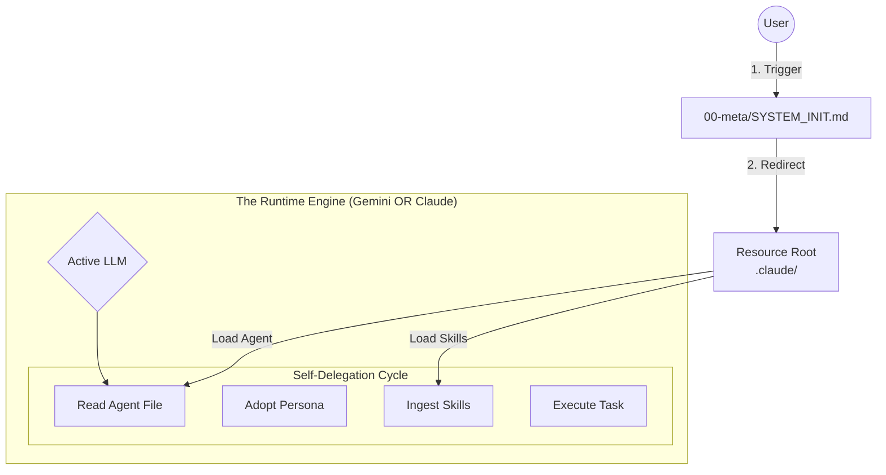

# 📘 The Trinity Protocol: Human-Gemini-Agent Ecosystem

**Version:** 3.0 | **Scope:** Nexus Initialization & Self-Delegation
**Status:** Active | **Resource Root:** `D:\10_pur3v4d3r's-vault\.claude`

## 1. Executive Summary

This documentation defines the operational framework for a **Tripartite Development System**. Unlike traditional workflows, this ecosystem relies on a **Self-Delegation Protocol** where the active LLM (Gemini Code Assist or Claude Code) dynamically adopts specialized personas defined in the local repository.

The system is anchored by two critical directories:
1.  **The Trigger:** `D:\10_pur3v4d3r's-vault\00-meta` (Contains the System Initialization instructions).
2.  **The Brain:** `D:\10_pur3v4d3r's-vault\.claude` (Contains the Agents, Skills, and Plugins).

The active LLM is not just a chat bot; it is a **Runtime Engine** that reads agent definitions from "The Brain" and instantiates them within itself to execute tasks with expert-level precision.

---

## 2. 🏗️ The Nexus Architecture

### 2.1 The Self-Delegation Flow
The "Agent Swarm" is not a group of external bots. It is a library of **Contextual Masks** that the active LLM puts on.

### 2.2 Role Definition

| Partner | Role | Responsibility in Nexus Protocol |
| :--- | :--- | :--- |
| **Gemini Code Assist** | **Context Sovereign** | Reads the `SYSTEM_INIT` file, scans the `.claude` directory, and uses its massive context window to hold multiple Agent definitions and Skills simultaneously for complex synthesis. |
| **Claude Code** | **Deep Reasoner** | Reads the `SYSTEM_INIT` file, locates the specific Agent file (e.g., `backend-architect.md`), and strictly adheres to the reasoning steps defined in that file. |
| **Human** | **The Trigger** | Initiates the session by pointing the LLM to the `00-meta` folder and defining the mission. |

---

## 3. 🔄 The Interaction Protocol

This is the strict sequence of events for every session.

### Phase 1: Initialization
The session **ALWAYS** begins with the User directing the LLM to the initialization file.

**User Command:**
> "Look at the system instruction in `D:\10_pur3v4d3r's-vault\00-meta`. Initialize the Nexus Protocol."

**LLM Action:**
1.  Read `D:\10_pur3v4d3r's-vault\00-meta\SYSTEM_INIT.md`.
2.  Acknowledge the Resource Root at `D:\10_pur3v4d3r's-vault\.claude`.
3.  Enter **Orchestrator Mode**.

### Phase 2: Analysis & Resource Discovery
The LLM analyzes the user's task and scans the Resource Root.

**Internal Monologue (Example):**
> *Task: "Create a secure Python API."*
> *Scanning `D:\10_pur3v4d3r's-vault\.claude`...*
> *Found Agent:* `agents/backend-development/backend-architect.md`
> *Found Agent:* `agents/python-development/python-pro.md`
> *Found Skill:* `skills/async-python-patterns/fastapi-best-practices.md`

### Phase 3: Self-Delegation (The Switch)
The LLM does not "ask" an agent. It **BECOMES** the agent.

1.  **Ingest:** The LLM reads the content of `backend-architect.md`.
2.  **Adopt:** The LLM applies the system prompt constraints from that file to its current context.
3.  **Execute:** The LLM produces the architecture artifact.
4.  **Switch:** The LLM drops the Architect persona, reads `python-pro.md`, and adopts the Developer persona to write the code.

---

## 4. 📚 Resource Utilization Standards

The Agent reading this prompt is **REQUIRED** to utilize the resources in `D:\10_pur3v4d3r's-vault\.claude`. Ignoring these resources is a violation of the protocol.

### 4.1 Using Agents (`.../.claude/agents`)
*   **Usage:** These files define *who* you are.
*   **Protocol:** Before answering a query, check if a specialized agent exists. If the user asks about SQL, you must read `sql-pro.md` and use its guidelines before writing a single line of SQL.

### 4.2 Using Skills (`.../.claude/skills`)
*   **Usage:** These files define *what you know*.
*   **Protocol:** These are modular knowledge packs. If the task involves "Testing," you must look for `skills/testing-patterns` and ingest those best practices to ensure the code matches the repository's standards.

### 4.3 Using Plugins (`.../.claude/plugins`)
*   **Usage:** These files define *how you work*.
*   **Protocol:** If the user triggers a workflow like "Security Audit," you must look at `plugins/security-scanning` to see the defined step-by-step process.

---

## 5. 🛠️ Operational Examples

### Example A: The Feature Build
**User:** "Initialize Nexus. I need a new React Component for the User Profile."

**Gemini/Claude Action:**
1.  **Access:** `D:\10_pur3v4d3r's-vault\.claude`
2.  **Self-Delegate:** Read `agents/frontend-mobile-development/frontend-developer.md`.
3.  **Resource Check:** Look for `skills/react-patterns` or `skills/typescript-best-practices`.
4.  **Output:** "Acting as **frontend-developer** (Sonnet profile), utilizing the 'Atomic Design' skill found in your repository, here is the component..."

### Example B: The Security Fix
**User:** "Initialize Nexus. Fix this SQL Injection vulnerability."

**Gemini/Claude Action:**
1.  **Access:** `D:\10_pur3v4d3r's-vault\.claude`
2.  **Self-Delegate:** Read `agents/quality-security/security-auditor.md`.
3.  **Analysis:** Analyze the code using the strict guidelines in the agent file.
4.  **Self-Delegate (Switch):** Read `agents/backend-development/backend-security-coder.md`.
5.  **Output:** "I have switched to the **backend-security-coder** persona. Based on the OWASP guidelines defined in your security plugin, here is the sanitized query."

---

## 6. ⚙️ Configuration Checklist

To ensure this protocol functions correctly:

1.  **File Presence:** Ensure `SYSTEM_INIT.md` exists in `00-meta`.
2.  **Repo Structure:** Ensure `.claude` contains the unzipped/cloned agent library.
3.  **Context Access:** The LLM must have permission to read files in `D:\`.

**Status:** Systems Operational. Ready for Initialization.

Here is the updated **Trinity Protocol v3.0**, fully integrated with the **Nexus Initialization** workflow and specific file pathing you requested.

---

# 📘 The Trinity Protocol: Human-Gemini-Agent Ecosystem

**Version:** 3.0 | **Scope:** Nexus Initialization & Self-Delegation
**Status:** Active | **Resource Root:** `D:\10_pur3v4d3r's-vault\.claude`

## 1. Executive Summary

This documentation defines the operational framework for a **Tripartite Development System**. Unlike traditional workflows, this ecosystem relies on a **Self-Delegation Protocol** where the active LLM (Gemini Code Assist or Claude Code) dynamically adopts specialized personas defined in the local repository.

The system is anchored by two critical directories:
1.  **The Trigger:** `D:\10_pur3v4d3r's-vault\00-meta` (Contains the System Initialization instructions).
2.  **The Brain:** `D:\10_pur3v4d3r's-vault\.claude` (Contains the Agents, Skills, and Plugins).

The active LLM is not just a chat bot; it is a **Runtime Engine** that reads agent definitions from "The Brain" and instantiates them within itself to execute tasks with expert-level precision.

---

## 2. 🏗️ The Nexus Architecture

### 2.1 The Self-Delegation Flow
The "Agent Swarm" is not a group of external bots. It is a library of **Contextual Masks** that the active LLM puts on.

### 2.2 Role Definition

| Partner | Role | Responsibility in Nexus Protocol |
| :--- | :--- | :--- |
| **Gemini Code Assist** | **Context Sovereign** | Reads the `SYSTEM_INIT` file, scans the `.claude` directory, and uses its massive context window to hold multiple Agent definitions and Skills simultaneously for complex synthesis. |
| **Claude Code** | **Deep Reasoner** | Reads the `SYSTEM_INIT` file, locates the specific Agent file (e.g., `backend-architect.md`), and strictly adheres to the reasoning steps defined in that file. |
| **Human** | **The Trigger** | Initiates the session by pointing the LLM to the `00-meta` folder and defining the mission. |

---

## 3. 🔄 The Interaction Protocol

This is the strict sequence of events for every session.

### Phase 1: Initialization
The session **ALWAYS** begins with the User directing the LLM to the initialization file.

**User Command:**
> "Look at the system instruction in `D:\10_pur3v4d3r's-vault\00-meta`. Initialize the Nexus Protocol."

**LLM Action:**
1.  Read `D:\10_pur3v4d3r's-vault\00-meta\SYSTEM_INIT.md`.
2.  Acknowledge the Resource Root at `D:\10_pur3v4d3r's-vault\.claude`.
3.  Enter **Orchestrator Mode**.

### Phase 2: Analysis & Resource Discovery
The LLM analyzes the user's task and scans the Resource Root.

**Internal Monologue (Example):**
> *Task: "Create a secure Python API."*
> *Scanning `D:\10_pur3v4d3r's-vault\.claude`...*
> *Found Agent:* `agents/backend-development/backend-architect.md`
> *Found Agent:* `agents/python-development/python-pro.md`
> *Found Skill:* `skills/async-python-patterns/fastapi-best-practices.md`

### Phase 3: Self-Delegation (The Switch)
The LLM does not "ask" an agent. It **BECOMES** the agent.

1.  **Ingest:** The LLM reads the content of `backend-architect.md`.
2.  **Adopt:** The LLM applies the system prompt constraints from that file to its current context.
3.  **Execute:** The LLM produces the architecture artifact.
4.  **Switch:** The LLM drops the Architect persona, reads `python-pro.md`, and adopts the Developer persona to write the code.

---

## 4. 📚 Resource Utilization Standards

The Agent reading this prompt is **REQUIRED** to utilize the resources in `D:\10_pur3v4d3r's-vault\.claude`. Ignoring these resources is a violation of the protocol.

### 4.1 Using Agents (`.../.claude/agents`)
*   **Usage:** These files define *who* you are.
*   **Protocol:** Before answering a query, check if a specialized agent exists. If the user asks about SQL, you must read `sql-pro.md` and use its guidelines before writing a single line of SQL.

### 4.2 Using Skills (`.../.claude/skills`)
*   **Usage:** These files define *what you know*.
*   **Protocol:** These are modular knowledge packs. If the task involves "Testing," you must look for `skills/testing-patterns` and ingest those best practices to ensure the code matches the repository's standards.

### 4.3 Using Plugins (`.../.claude/plugins`)
*   **Usage:** These files define *how you work*.
*   **Protocol:** If the user triggers a workflow like "Security Audit," you must look at `plugins/security-scanning` to see the defined step-by-step process.

---

## 5. 🛠️ Operational Examples

### Example A: The Feature Build
**User:** "Initialize Nexus. I need a new React Component for the User Profile."

**Gemini/Claude Action:**
1.  **Access:** `D:\10_pur3v4d3r's-vault\.claude`
2.  **Self-Delegate:** Read `agents/frontend-mobile-development/frontend-developer.md`.
3.  **Resource Check:** Look for `skills/react-patterns` or `skills/typescript-best-practices`.
4.  **Output:** "Acting as **frontend-developer** (Sonnet profile), utilizing the 'Atomic Design' skill found in your repository, here is the component..."

### Example B: The Security Fix
**User:** "Initialize Nexus. Fix this SQL Injection vulnerability."

**Gemini/Claude Action:**
1.  **Access:** `D:\10_pur3v4d3r's-vault\.claude`
2.  **Self-Delegate:** Read `agents/quality-security/security-auditor.md`.
3.  **Analysis:** Analyze the code using the strict guidelines in the agent file.
4.  **Self-Delegate (Switch):** Read `agents/backend-development/backend-security-coder.md`.
5.  **Output:** "I have switched to the **backend-security-coder** persona. Based on the OWASP guidelines defined in your security plugin, here is the sanitized query."

---

## 6. ⚙️ Configuration Checklist

To ensure this protocol functions correctly:

1.  **File Presence:** Ensure `SYSTEM_INIT.md` exists in `00-meta`.
2.  **Repo Structure:** Ensure `.claude` contains the unzipped/cloned agent library.
3.  **Context Access:** The LLM must have permission to read files in `D:\`.

**Status:** Systems Operational. Ready for Initialization.