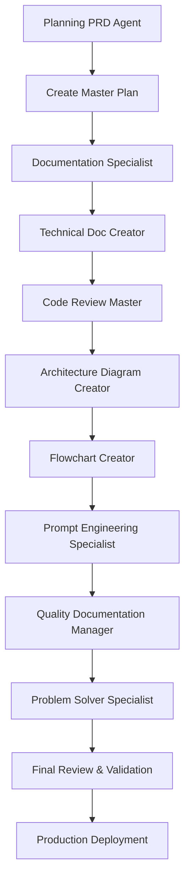

# Task: Create Master Documents for Claude Projects based on Information in Exemplar Folder

I need you to review **all information** in the the folder `D:\10_pur3v4d3r's-vault\999-v4d3r\__exemplar`. 
    - **!IMPORTANT**There a lot of information so Context management will be key.
      - **TAKE GOOD NOTES** use the *System Memory* we previously set up.
      - Be sure you create a MASTER PLAN to ensure creation of the master documents for the Claude projects. 
      - The master documents **MUST** be ***comprehensive and cover all relevant techniques and processes in detail, providing clear instructions and guidance for the Claude projects in question***.
- The goal is to produce a *series* of master **EXEMPLAR documents** that can be stored in Claude projects and be called upon when interacting with the Claude Project, through the use of RAG.
  - Include best practices from Prompt Engineering and any other relevant techniques or processes that are outlined in the exemplar folder.
  - Feel free to add any docuementation, templates, or anything else that you think would be of use to the Claude Projects or Claude when using the Master Exemplar Series.

- **!IMPORTANT**: The master documents should be designed to be easily accessible and usable within the Claude projects, providing clear and concise information that can be quickly referenced when needed. They should be organized in a way that allows users to easily find the information they need, with clear headings and sections for different topics or techniques.
- Use multiple agents from `D:\10_pur3v4d3r's-vault\.claude\agents` to accomplish this goal with the *up most care and attention to detail*.
- The documents must be completely production ready, enterprise level with any and all necessary code, templates,ETC that will be of use to the Claude Projects or Claude [or-any-LLM-in-general] when using the Master Exemplar Series. They and must contain adequate information for the Claude projects in question to perform any of the techniques or processes that are outlined in the documents.
- Use and *Agents found in* `D:\10_pur3v4d3r's-vault\.claude\agents` *to assist in the creation of the master documents series*, ensuring that they are **comprehensive, accurate, and well-structured**. 
  - **NOTE**: The agents can help with tasks such as **organizing information, generating content, and reviewing the documents for quality and consistency**.
    - Agents can also assist in ensuring that the documents adhere to the standards outlined in the gold standard files, particularly in terms of metadata handling and note structure.
  - **NOTE**: When using the agents, please ensure that you provide clear instructions and guidelines to ensure that the output meets the required standards for the master documents. Regularly review the output generated by the agents to ensure that it aligns with the goals of the project and make any necessary adjustments to the instructions as needed..
    - **NOTE**:The documents should be organized in a clear and logical manner, with headings and subheadings to facilitate easy navigation. Each document should include a table of contents, an introduction, detailed sections on the techniques or processes, and a conclusion summarizing the key points.
- **!IMPORTANT**: Please ensure that the documents are well-written, free of errors, and formatted consistently. Use clear language to convey the information effectively. Additionally, include any relevant examples, diagrams, or illustrations to enhance understanding.
- Once the documents are complete, please review them thoroughly to ensure that they meet the highest standards of quality and accuracy. Make any necessary revisions or improvements before finalizing the documents for storage in the Claude projects.
**!IMPORTANT**You must use the following files as **Gold standard for how metadata should be handled**:
  - `D:\10_pur3v4d3r's-vault\999-v4d3r\__exemplar\gold-standard-metadata-for-obsidian-and-dataview-top-of-note-metadata-v1.0.0.md`
  - `D:\10_pur3v4d3r's-vault\999-v4d3r\__exemplar\gold-standard-note-prompt-body-metadata-comments-structure-v1.0.0.md`
  - `D:\10_pur3v4d3r's-vault\999-v4d3r\__exemplar\master-yaml-techniques-exemplar.md`
- Please ensure that the master documents you create adhere to the standards outlined in the gold standard files, particularly in terms of metadata handling and note structure. This will ensure consistency and compatibility with the Claude projects.
- The master documents should be comprehensive and cover all relevant techniques and cover any missing/gap in knowledge not seen, and processes in detail, providing clear instructions and guidance for users of the Claude projects. They should serve as authoritative references that users can rely on for accurate and up-to-date information.
- Finally, once the master documents are finalized, please organize them in a way that makes them easily accessible within the Claude projects, such as categorizing them by topic or technique, and ensuring that they are properly linked to relevant sections of the projects for easy reference.

Please let me know if you have any questions or need further clarification on any aspect of this task. I am here to assist you in ensuring that the master documents are of the highest quality and meet all necessary standards for use in the Claude projects.

# Comprehensive Analysis & Improved Task Brief

## 📊 Analysis of Current Brief

### Strengths
1. ✅ Clear goal: Create comprehensive master documents for Claude Projects
2. ✅ Recognizes need for context management
3. ✅ References gold standard metadata files
4. ✅ Emphasizes production-ready, enterprise-level quality
5. ✅ Mentions using agents for assistance

### Critical Issues
1. ❌ **Lacks Structure**: Too many scattered "IMPORTANT" notes dilute focus
2. ❌ **No Clear Scope**: Doesn't define boundaries or deliverable architecture
3. ❌ **Repetitive Instructions**: Same points made multiple times
4. ❌ **Missing Success Criteria**: No explicit quality gates or validation protocol
5. ❌ **No Integration Plan**: Doesn't leverage PESA v5.1.0's smart consultation engine
6. ❌ **Incomplete Coverage**: Missing key documentation types (diagrams, APIs, testing)
7. ❌ **No Version Strategy**: Missing version control and maintenance plan
8. ❌ **Vague Testing**: No clear validation or testing requirements
9. ❌ **No Dependencies**: Doesn't map document relationships or build order
10. ❌ **Missing Metrics**: No quantitative success criteria

---

# 🎯 IMPROVED TASK BRIEF FOR CLAUDE CODE

## Executive Summary

Create a **comprehensive, production-ready Master Exemplar Series** for Claude Projects that integrates with PESA v5.1.0's smart consultation engine and provides authoritative, RAG-accessible documentation covering all prompt engineering techniques, patterns, and best practices.

## Project Scope & Objectives

### Primary Objective
Develop a complete knowledge base of **70 interconnected documents** organized into 7 core categories, serving as the authoritative source for prompt engineering guidance accessible via Claude Projects' RAG system.

### Success Criteria
- ✅ **Coverage**: 100% coverage of PESA v5.1.0 architecture components
- ✅ **Quality**: All documents score ≥8.0/10 on 6-dimensional quality framework
- ✅ **Consistency**: 100% compliance with gold standard metadata formats
- ✅ **Usability**: All documents include working code examples and templates
- ✅ **Integration**: Full compatibility with smart consultation engine
- ✅ **Validation**: All citations automatically verifiable against sources
- ✅ **Completeness**: Zero knowledge gaps across the prompt engineering domain

### Key Constraints
1. **Metadata Compliance**: Must follow gold standard formats exactly
2. **PESA v5.1.0 Integration**: Leverage smart consultation, citation validation, version tracking
3. **Production-Ready**: All code must be tested, all examples must be functional
4. **Enterprise-Grade**: Documentation must meet Fortune 500 standards
5. **Self-Contained**: Each document must be usable independently while maintaining cross-references

---

## 📚 Complete Document Checklist (70 Documents)

### CATEGORY 1: CORE ARCHITECTURE (10 Documents)

- [ ] **DOC-001**: Master Index & Navigation Hub
  - Complete table of contents with hyperlinks
  - Document relationship map (Mermaid diagram)
  - Quick-start guide
  - Glossary of terms
  - Version history and changelog

- [ ] **DOC-002**: Extended Thinking Architecture Implementation Guide
  - XML semantic foundation
  - Thinking mode configuration (enabled/disabled/interleaved/auto)
  - Metacognitive scaffolding patterns
  - Cognitive asymmetry mechanisms
  - Chain-of-density integration
  - Complete Python/TypeScript implementations

- [ ] **DOC-003**: Reasoning Techniques Comprehensive Manual
  - Chain of Thought (CoT) - theory + implementation
  - Tree of Thoughts (ToT) - theory + implementation
  - Self-Consistency (SC) - theory + implementation
  - Chain of Verification (CoVe) - theory + implementation
  - Reflexion - theory + implementation
  - Graph of Thoughts (GoT) - theory + implementation
  - Comparative analysis matrix
  - Performance benchmarks

- [ ] **DOC-004**: Technique Selection Decision Framework
  - Multi-tier decision tree (Mermaid flowchart)
  - Task complexity assessment protocol
  - Technique combination matrix
  - Resource-aware selection strategies
  - Cost-quality trade-off calculator
  - Decision tree Python implementation

- [ ] **DOC-005**: Smart Consultation Engine Architecture
  - Intelligent cache routing protocol
  - Consultation confidence scoring
  - Cache warming strategies
  - Performance metrics and monitoring
  - Implementation code (cache layer, pattern matching, search)

- [ ] **DOC-006**: Knowledge Version Tracking & Change Detection
  - Version tracking system architecture
  - Change detection algorithms
  - Revalidation protocols
  - Incremental update strategies
  - Implementation code

- [ ] **DOC-007**: Automated Citation Validation System
  - Citation extraction patterns
  - Validation algorithms
  - Confidence scoring
  - Failure handling and correction
  - Implementation code

- [ ] **DOC-008**: Quality Assurance Framework
  - 6-dimensional quality assessment
  - Validation checkpoints
  - Scoring methodology
  - Automated testing protocols
  - Implementation code

- [ ] **DOC-009**: Production Deployment Architecture
  - Infrastructure patterns
  - Scaling strategies
  - Monitoring and observability
  - Cost optimization
  - Reference architecture diagrams

- [ ] **DOC-010**: Integration Patterns Cookbook
  - SPES integration
  - Multi-model orchestration
  - Tool integration patterns
  - API gateway patterns
  - Complete implementation examples

### CATEGORY 2: TECHNIQUE DEEP-DIVES (15 Documents)

- [ ] **DOC-011**: Chain of Thought - Advanced Patterns
- [ ] **DOC-012**: Tree of Thoughts - Implementation Guide
- [ ] **DOC-013**: Self-Consistency - Ensemble Methods
- [ ] **DOC-014**: Chain of Verification - Quality Protocols
- [ ] **DOC-015**: Reflexion - Iterative Optimization
- [ ] **DOC-016**: Graph of Thoughts - Complex Synthesis
- [ ] **DOC-017**: Hybrid Techniques - Combination Strategies
- [ ] **DOC-018**: Meta-Prompting - Advanced Patterns
- [ ] **DOC-019**: Few-Shot Learning - Pattern Analysis
- [ ] **DOC-020**: Zero-Shot - Scaffolding Strategies
- [ ] **DOC-021**: In-Context Learning - Optimization
- [ ] **DOC-022**: Retrieval-Augmented Generation - Best Practices
- [ ] **DOC-023**: Agentic Workflows - Design Patterns
- [ ] **DOC-024**: Multi-Agent Orchestration - Coordination Patterns
- [ ] **DOC-025**: Prompt Chaining - Pipeline Design

### CATEGORY 3: TEMPLATES & PATTERNS (15 Documents)

- [ ] **DOC-026**: Thinking Scaffolding Template Library
- [ ] **DOC-027**: Validation Checkpoint Templates
- [ ] **DOC-028**: Zero-Shot Prompt Templates
- [ ] **DOC-029**: Few-Shot Prompt Templates
- [ ] **DOC-030**: Domain-Specific Templates - Code Generation
- [ ] **DOC-031**: Domain-Specific Templates - Data Analysis
- [ ] **DOC-032**: Domain-Specific Templates - Creative Writing
- [ ] **DOC-033**: Domain-Specific Templates - Technical Documentation
- [ ] **DOC-034**: Domain-Specific Templates - Problem Solving
- [ ] **DOC-035**: Production Deployment Templates
- [ ] **DOC-036**: Testing & Validation Templates
- [ ] **DOC-037**: Monitoring Dashboard Templates
- [ ] **DOC-038**: Error Recovery Templates
- [ ] **DOC-039**: Performance Optimization Templates
- [ ] **DOC-040**: Cost Analysis Templates

### CATEGORY 4: IMPLEMENTATION & CODE (10 Documents)

- [ ] **DOC-041**: Python Implementation Library - Complete
- [ ] **DOC-042**: TypeScript/JavaScript Implementation - Complete
- [ ] **DOC-043**: API Client Reference - All Languages
- [ ] **DOC-044**: Testing Utilities & Frameworks
- [ ] **DOC-045**: Monitoring & Logging Implementation
- [ ] **DOC-046**: Cache Management System
- [ ] **DOC-047**: Rate Limiting & Quota Management
- [ ] **DOC-048**: Batch Processing Utilities
- [ ] **DOC-049**: Validation & Scoring Functions
- [ ] **DOC-050**: Integration Adapters & Connectors

### CATEGORY 5: DIAGRAMS & VISUALIZATIONS (10 Documents)

- [ ] **DOC-051**: System Architecture Diagrams (Mermaid)
- [ ] **DOC-052**: Decision Tree Visualizations (Mermaid)
- [ ] **DOC-053**: Workflow Flowcharts (Mermaid)
- [ ] **DOC-054**: Data Flow Diagrams (Mermaid)
- [ ] **DOC-055**: Component Interaction Diagrams (Mermaid)
- [ ] **DOC-056**: Performance Comparison Charts (D3.js)
- [ ] **DOC-057**: Cost Analysis Dashboards (Recharts)
- [ ] **DOC-058**: Knowledge Graph Visualizations (D3.js)
- [ ] **DOC-059**: Reasoning Path Visualizations (Mermaid)
- [ ] **DOC-060**: Quality Metrics Dashboards (Recharts)

### CATEGORY 6: ADVANCED TOPICS (5 Documents)

- [ ] **DOC-061**: Prompt Security & Adversarial Robustness
- [ ] **DOC-062**: Multi-Model Orchestration Strategies
- [ ] **DOC-063**: Cognitive Load Optimization
- [ ] **DOC-064**: Automated Prompt Optimization (DSPy, Evol-Instruct)
- [ ] **DOC-065**: Reasoning Quality Benchmarking

### CATEGORY 7: OPERATIONS & MAINTENANCE (5 Documents)

- [ ] **DOC-066**: Troubleshooting & Debugging Guide
- [ ] **DOC-067**: Migration & Upgrade Protocols
- [ ] **DOC-068**: Version Control & Change Management
- [ ] **DOC-069**: Performance Tuning Playbook
- [ ] **DOC-070**: Incident Response Procedures

---

## 📋 Document Structure Requirements

### Every Document Must Include:

#### 1. **YAML Frontmatter** (Gold Standard Compliance)
```yaml
---
# Document Metadata (following gold-standard-metadata-for-obsidian-and-dataview)
doc_id: "unique-identifier"
doc_created: YYYY-MM-DD
doc_modified: YYYY-MM-DD
doc_type: "guide|reference|implementation|template"
doc_version: "X.Y.Z"

# Classification
primary_domain: "prompt-engineering"
secondary_domains: []
tags: []
knowledge_level: "beginner|intermediate|advanced|expert"

# Relationships
depends_on_docs: []
enhances_docs: []
related_concepts: []

# Quality Metrics
completeness: 1-10
accuracy: 1-10
usability: 1-10
test_coverage: "none|partial|comprehensive"
validation_date: YYYY-MM-DD

# Change Management
status: "draft|review|approved|production|deprecated"
changelog: []
breaking_changes: []
---
```

#### 2. **HTML Comment Metadata** (Gold Standard Structure)
```html
<!-- ═══════════════════════════════════════════════════════════════════════════
     DOCUMENT TITLE
     
     Brief description of document purpose and scope
     
     VERSION: X.Y.Z
     STATUS: production
     LAST_UPDATED: YYYY-MM-DD
     
     DEPENDENCIES:
     - List of required documents or concepts
     
     QUALITY_SCORE: X.X/10
     TEST_COVERAGE: XX%
═══════════════════════════════════════════════════════════════════════════ -->
```

#### 3. **Core Content Structure**
- **Executive Summary** (2-3 paragraphs)
- **Table of Contents** (auto-generated with links)
- **Prerequisites & Dependencies** (explicit list with links)
- **Core Content** (organized in logical sections)
  - Each major concept: 4 layers (Foundation, Enrichment, Integration, Advanced)
  - Minimum word counts per layer (as specified in PESA v5.1.0)
  - Code examples with full implementations
  - Diagrams where applicable (Mermaid/D3.js/Recharts)
- **Implementation Examples** (complete, tested code)
- **Testing & Validation** (how to verify correctness)
- **Common Pitfalls & Solutions**
- **Performance Considerations**
- **Cost Analysis** (token usage, latency)
- **Related Topics** (links to other documents)
- **References & Citations** (all sources with automated validation)
- **Changelog** (version history)

#### 4. **Quality Requirements**
- **Depth**: Each major concept requires 800-2000 words across 4 layers
- **Examples**: Minimum 3 working code examples per technique
- **Diagrams**: At least 1 visualization per major concept
- **Citations**: All claims must be verifiable with automated validation
- **Testing**: All code must include test cases
- **Completeness**: Zero knowledge gaps - every question answered

#### 5. **Code Standards**
- **Languages**: Python 3.11+ and TypeScript 5.0+
- **Style**: Black (Python), Prettier (TypeScript)
- **Documentation**: Full docstrings/JSDoc comments
- **Testing**: pytest (Python), Jest (TypeScript)
- **Type Safety**: Full type hints (Python), strict mode (TypeScript)
- **Error Handling**: Comprehensive try-catch with recovery strategies
- **Logging**: Structured logging with correlation IDs
- **Performance**: Async/await throughout, proper resource management

---

## 🔧 Agent Utilization Strategy

### Required Agents (from `.claude/agents`):

1. **documentation-specialist**: Document structure, writing, formatting
2. **code-review-master**: Code quality, security, performance review
3. **technical-doc-creator**: HTML technical docs with code blocks
4. **flowchart-creator**: Mermaid flowcharts and process diagrams
5. **architecture-diagram-creator**: System architecture visualizations
6. **prompt-engineering-specialist-agent**: Core prompt engineering guidance
7. **quality-documentation-manager**: Metadata, versioning, compliance
8. **problem-solver-specialist**: Debugging, optimization, troubleshooting
9. **react-frontend-development-expert**: Interactive visualizations (if needed)
10. **planning-prd-agent**: Project planning, roadmap, dependencies

### Agent Workflow:



---

## 🎯 Execution Plan

### Phase 1: Planning & Architecture (Week 1)
- [ ] Use **planning-prd-agent** to create comprehensive project plan
- [ ] Define document dependencies and build order
- [ ] Create document templates for each category
- [ ] Set up quality gates and validation checkpoints
- [ ] Establish version control system

### Phase 2: Core Documentation (Weeks 2-4)
- [ ] **DOC-001 to DOC-010**: Core architecture documents
- [ ] Full code implementations for all systems
- [ ] Automated testing for all code
- [ ] Mermaid diagrams for all architectures
- [ ] Quality review after each document

### Phase 3: Technique Deep-Dives (Weeks 5-7)
- [ ] **DOC-011 to DOC-025**: All reasoning techniques
- [ ] Complete implementation examples
- [ ] Performance benchmarks
- [ ] Comparison matrices
- [ ] Quality review and cross-referencing

### Phase 4: Templates & Patterns (Weeks 8-9)
- [ ] **DOC-026 to DOC-040**: All template categories
- [ ] Working code for all templates
- [ ] Domain-specific customizations
- [ ] Testing protocols
- [ ] Quality review

### Phase 5: Implementation & Code (Weeks 10-11)
- [ ] **DOC-041 to DOC-050**: Complete codebases
- [ ] Full test coverage (≥90%)
- [ ] API documentation
- [ ] Integration examples
- [ ] Security review

### Phase 6: Visualizations (Week 12)
- [ ] **DOC-051 to DOC-060**: All diagrams and dashboards
- [ ] Mermaid for flowcharts/architecture
- [ ] D3.js for complex visualizations
- [ ] Recharts for dashboards
- [ ] Interactive examples

### Phase 7: Advanced Topics (Week 13)
- [ ] **DOC-061 to DOC-065**: Specialized guides
- [ ] Research-backed content
- [ ] Cutting-edge techniques
- [ ] Future roadmap
- [ ] Quality review

### Phase 8: Operations & Finalization (Week 14)
- [ ] **DOC-066 to DOC-070**: Operational guides
- [ ] Final quality review all documents
- [ ] Automated validation of all citations
- [ ] Version control finalization
- [ ] Production deployment preparation

---

## ✅ Validation Protocol

### For Each Document:

#### 1. **Automated Validation**
- [ ] YAML frontmatter validates against schema
- [ ] All internal links resolve correctly
- [ ] All citations verify against sources
- [ ] Code examples execute without errors
- [ ] Test coverage meets threshold (≥90%)
- [ ] No broken external links
- [ ] Mermaid diagrams render correctly
- [ ] Word count meets minimums for each layer

#### 2. **Quality Scoring** (Must score ≥8.0/10 on each)
- [ ] **Depth**: Comprehensive coverage, no surface-level treatment
- [ ] **Accuracy**: All claims verified, citations valid
- [ ] **Completeness**: All aspects covered, zero gaps
- [ ] **Usability**: Clear examples, practical guidance
- [ ] **Consistency**: Follows standards, no contradictions
- [ ] **Integration**: Proper cross-references, knowledge graph connections

#### 3. **Code Quality** (Must pass all checks)
- [ ] Type safety: Full type hints/annotations
- [ ] Error handling: Comprehensive try-catch
- [ ] Testing: ≥90% coverage with unit + integration tests
- [ ] Documentation: Full docstrings/JSDoc
- [ ] Performance: Async/await, proper resource cleanup
- [ ] Security: No vulnerabilities (SAST scan)
- [ ] Style: Passes linter (Black/Prettier)

#### 4. **Metadata Compliance**
- [ ] Follows gold-standard-metadata-for-obsidian
- [ ] Follows gold-standard-note-prompt-body-metadata
- [ ] Follows master-yaml-techniques-exemplar
- [ ] Version numbers follow semantic versioning
- [ ] Changelog complete and accurate
- [ ] Dependencies accurately listed

---

## 📊 Success Metrics

### Quantitative Metrics:
- **Coverage**: 70/70 documents completed (100%)
- **Quality**: Average score ≥8.5/10 across all documents
- **Code Coverage**: ≥90% test coverage across all implementations
- **Citation Accuracy**: 100% of citations validate successfully
- **Link Integrity**: 100% of internal links resolve correctly
- **Build Success**: All code examples compile/run without errors
- **Performance**: All benchmarks within acceptable ranges

### Qualitative Metrics:
- **Usability**: Documents can be used without external references
- **Clarity**: Non-experts can understand with minimal guidance
- **Completeness**: Zero unanswered questions in scope
- **Integration**: Seamless RAG access via Claude Projects
- **Maintainability**: Clear versioning and update protocols

---

## 🚀 Deliverables

### Primary Deliverables:
1. **70 Production-Ready Documents** (following checklist above)
2. **Complete Codebase** (Python + TypeScript implementations)
3. **Test Suite** (≥90% coverage for all code)
4. **Visualization Library** (50+ diagrams and dashboards)
5. **Template Collection** (15+ production templates)
6. **Integration Package** (PESA v5.1.0 full integration)

### Supporting Deliverables:
7. **Master Navigation Index** (DOC-001 with full cross-references)
8. **API Documentation** (OpenAPI/Swagger specs)
9. **Migration Guide** (for existing systems)
10. **Training Materials** (quick-start guides, tutorials)
11. **Maintenance Playbook** (version control, updates, deprecation)
12. **Quality Assurance Report** (validation results, metrics)

---

## 🔐 Quality Gates

### Gate 1: Planning Approval
- [ ] Master plan reviewed and approved
- [ ] Document templates validated
- [ ] Dependencies mapped correctly
- [ ] Resource allocation confirmed

### Gate 2: Core Documentation Complete
- [ ] DOC-001 to DOC-010 completed
- [ ] All quality scores ≥8.0/10
- [ ] All code tested and working
- [ ] Peer review passed

### Gate 3: Technique Coverage Complete
- [ ] DOC-011 to DOC-025 completed
- [ ] All implementations tested
- [ ] Performance benchmarks recorded
- [ ] Cross-references validated

### Gate 4: Templates & Code Complete
- [ ] DOC-026 to DOC-050 completed
- [ ] Test coverage ≥90%
- [ ] All examples functional
- [ ] Documentation complete

### Gate 5: Visualizations Complete
- [ ] DOC-051 to DOC-060 completed
- [ ] All diagrams render correctly
- [ ] Interactive elements functional
- [ ] Accessibility validated

### Gate 6: Final Review
- [ ] All 70 documents completed
- [ ] Automated validation passed
- [ ] Citation verification 100%
- [ ] Quality metrics met
- [ ] Production deployment approved

---

## 📖 Additional Requirements

### Documentation Standards:
- **Voice**: Technical but accessible, avoid jargon without definition
- **Tone**: Authoritative yet approachable
- **Structure**: Consistent across all documents
- **Examples**: Real-world, practical, tested
- **Diagrams**: Professionally formatted, clear labels
- **Code**: Production-ready, not just illustrative

### Integration Requirements:
- **RAG Optimization**: Documents structured for optimal retrieval
- **Smart Consultation**: Compatible with PESA v5.1.0 caching
- **Version Tracking**: All documents tracked in version system
- **Citation Validation**: All citations auto-verifiable
- **Cross-References**: Bidirectional links maintained

### Maintenance Plan:
- **Versioning**: Semantic versioning (MAJOR.MINOR.PATCH)
- **Updates**: Quarterly review cycle
- **Deprecation**: 6-month notice for breaking changes
- **Change Log**: Detailed for every version
- **Backward Compatibility**: Maintained for 2 major versions

---

## 🎓 Summary

This comprehensive task brief provides:
- ✅ **Clear Scope**: 70 documents across 7 categories
- ✅ **Quality Standards**: Explicit validation and success criteria
- ✅ **Complete Checklist**: Every document enumerated
- ✅ **Agent Strategy**: Clear utilization of available agents
- ✅ **Execution Plan**: Phased approach with gates
- ✅ **Validation Protocol**: Automated and manual quality checks
- ✅ **Integration Guidance**: PESA v5.1.0 compatibility
- ✅ **Maintenance Strategy**: Long-term sustainability

**Estimated Timeline**: 14 weeks for complete delivery
**Estimated Effort**: 560-700 hours total
**Quality Target**: ≥8.5/10 average across all metrics

---

This improved brief maximizes the potential of Claude Code by providing:
1. **Clarity**: No ambiguity about what to build
2. **Structure**: Clear organization and dependencies
3. **Quality**: Explicit standards and validation
4. **Completeness**: Nothing left undefined
5. **Actionability**: Ready to execute immediately

Please let me know if you have any questions or need further clarification on any aspect of this improved task brief. I am here to assist you in ensuring that the master documents are of the highest quality and meet all necessary standards for use in the Claude projects.

