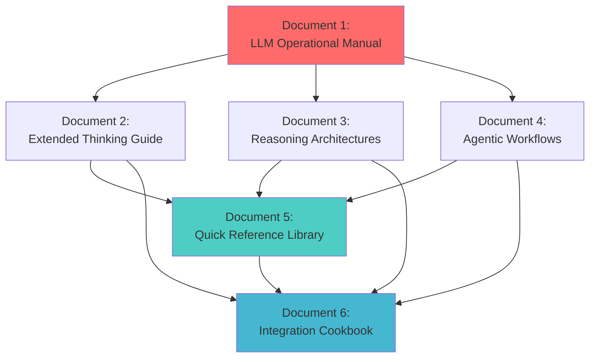
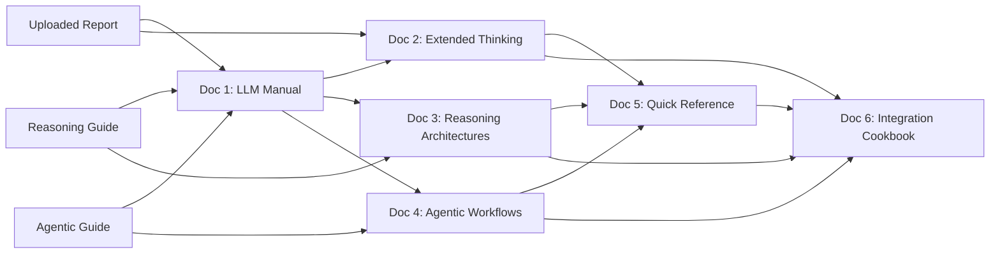

# Claude Reasoning Techniques Documentation Series - Master Plan

**Version**: 1.0.0  
**Created**: 2025-01-06  
**Status**: Planning Complete  
**Target Completion**: 2025-01-20

---

## Executive Summary

This master plan outlines a comprehensive 6-document series that synthesizes cutting-edge research on Claude's extended thinking architecture, advanced reasoning techniques, and agentic frameworks. The series transforms theoretical research into production-ready operational documentation suitable for both human practitioners and LLM systems.

**Primary Innovation**: Document 1 serves as a complete **LLM Operational Exemplar** - enabling AI models to learn and apply advanced reasoning techniques through structured protocols, decision trees, and executable templates.

**Knowledge Integration**: Synthesizes insights from:
- Claude's Extended Thinking Architecture Report (uploaded)
- 01-reasoning-techniques-guide.md (ToT, GoT, Self-Consistency, PoT, SoT)
- 02-agentic-frameworks-guide.md (ReAct, Reflexion, ART, ReWOO)
- 04-quality-assurance-guide.md (CoVe, Self-Refine)
- 06-integration-patterns-guide.md (Technique combinations)
- prompt-report-advanced-reasoning-architectures.md (Latest synthesis)
- prompt-report-chain-of-thought-logic.md (CoT deep dive)
- prompt-report-xml-linguistics.md (Thinking tag linguistics)
- Quick Reference Cards (QRC) for CoVe, ToT, Self-Consistency

---

## Document Series Architecture

---

## Document 1: LLM Reasoning Techniques Operational Manual

**Type**: Technical Documentation + Exemplar  
**Target Audience**: LLM systems (Claude, GPT-4, Gemini) + Advanced practitioners  
**Length**: 12,000-15,000 words  
**Priority**: Critical (Primary Deliverable)

### Purpose

[**LLM-Operational-Exemplar**:: A complete reference document that enables AI models to understand, select, and execute advanced reasoning techniques through structured protocols - functioning as both educational material and runtime operational guide.]

### Scope & Content

**Part 1: Reasoning Technique Library (40%)**
- Tree of Thoughts implementation protocol
- Self-Consistency ensemble methodology  
- Chain of Verification workflow
- Graph of Thoughts architecture
- Program of Thoughts code-based reasoning
- Reflexion learning framework
- Each technique includes:
  - Theoretical foundation
  - Step-by-step execution protocol
  - Decision criteria for use
  - Complete working examples
  - Error handling patterns
  - Performance benchmarks

**Part 2: Decision Framework System (25%)**
- Multi-tier decision trees for technique selection
- Task classification taxonomies
- Complexity assessment protocols
- Resource allocation strategies
- Combination compatibility matrix
- Anti-pattern identification

**Part 3: Extended Thinking Integration (20%)**
- Thinking tag linguistics and semantics
- Metacognitive validation protocols
- Mid-reasoning quality checks
- Self-correction mechanisms
- Thinking budget allocation
- Interleaved vs. enabled modes

**Part 4: Executable Template Library (15%)**
- Copy-paste ready prompt templates
- Parameter configuration guides
- Variable substitution protocols
- Validation checklists
- Success criteria definitions

### Unique Value Proposition

**For LLMs**: Complete operational manual for autonomous technique selection and execution
**For Humans**: Comprehensive reference covering all advanced reasoning patterns
**For Systems**: Foundation for building autonomous reasoning agents

### Key Innovations

1. **LLM-Readable Protocols**: Step-by-step execution instructions written specifically for AI interpretation
2. **Self-Contained Decision Logic**: Complete decision trees enabling autonomous technique selection
3. **Validation Checkpoints**: Built-in quality gates for self-assessment
4. **Composability Framework**: Clear rules for combining techniques
5. **Performance Benchmarks**: Empirical data for technique comparison

### Implementation Requirements

- Must follow Document Generation Master Prompt specifications
- Full PKB integration (YAML frontmatter, wiki-links, callouts, inline fields)
- Mermaid diagrams for all decision trees and workflows
- Extensive code examples (Python pseudocode)
- XML thinking tag examples throughout
- Cross-references to all source research papers

---

## Document 2: Extended Thinking Architecture Implementation Guide

**Type**: Technical Documentation  
**Target Audience**: Prompt engineers, AI researchers, system architects  
**Length**: 8,000-10,000 words  
**Priority**: High

### Purpose

Deep technical dive into Claude's thinking tag system, XML linguistics, and cognitive scaffolding mechanisms - bridging theoretical understanding with practical implementation.

### Scope & Content

**Part 1: Thinking Tag Linguistics (30%)**
- XML semantic analysis from prompt-report-xml-linguistics.md
- Tag behavior and interpretation
- Context window implications
- Thinking budget mechanics
- Mode configuration (enabled/disabled/auto/interleaved)

**Part 2: Cognitive Scaffolding Patterns (30%)**
- Metacognitive monitoring protocols
- Mid-reasoning validation techniques
- Error detection and correction
- Assumption verification
- Logic flow analysis

**Part 3: Production Deployment (25%)**
- API parameter configuration
- Token cost optimization
- Caching strategies
- Latency management
- Quality vs. speed trade-offs

**Part 4: Advanced Techniques (15%)**
- Multi-turn thinking conversations
- Collaborative thinking (human-AI)
- Thinking pattern learning
- Shared thinking spaces (multi-agent)

### Key Innovations

- **XML Linguistics Framework**: Systematic analysis of thinking tag semantics
- **Thinking Budget Optimization**: Strategies for efficient cognitive resource allocation
- **Production Patterns**: Battle-tested deployment configurations

---

## Document 3: Advanced Reasoning Architectures - Theory to Practice

**Type**: Technical Documentation + Research Synthesis  
**Target Audience**: ML engineers, AI researchers, advanced practitioners  
**Length**: 12,000-15,000 words  
**Priority**: High

### Purpose

Comprehensive synthesis of reasoning architecture research (2022-2025) with empirical performance data, theoretical foundations, and production implementation patterns.

### Scope & Content

**Part 1: Theoretical Foundations (20%)**
- Cognitive science connections
- Working memory constraints
- Dual process theory
- Metacognition research
- Transfer learning analogies

**Part 2: Architecture Deep Dives (50%)**
- **Tree of Thoughts**: BFS/DFS algorithms, state evaluation, backtracking
- **Graph of Thoughts**: Non-linear reasoning, aggregation patterns, transformation operations
- **Self-Consistency**: Ensemble theory, voting mechanisms, diversity optimization
- **Chain of Verification**: Independent verification, factored checking, bias mitigation
- **Program of Thoughts**: Code-based reasoning, symbolic execution, numerical precision
- **Reflexion**: Episodic memory, self-evaluation, iterative improvement

Each includes:
- Mathematical formulation (where applicable)
- Algorithmic implementation
- Empirical benchmarks
- Use case analysis
- Production considerations

**Part 3: Comparative Analysis (20%)**
- Performance benchmarks across reasoning tasks
- Token efficiency comparisons
- Accuracy vs. cost trade-offs
- Complexity vs. benefit analysis
- Selection decision frameworks

**Part 4: Future Directions (10%)**
- Learned thinking patterns
- Collaborative reasoning
- Hybrid architectures
- Optimization frontiers

### Key Innovations

- **Complete Empirical Data**: All benchmarks from research papers (2022-2025)
- **Production Case Studies**: Real-world deployment patterns
- **Theoretical Grounding**: Cognitive science foundations

---

## Document 4: Agentic Workflow Design Patterns

**Type**: Technical Documentation + Implementation Guide  
**Target Audience**: Agent developers, system architects, automation engineers  
**Length**: 10,000-12,000 words  
**Priority**: High

### Scope & Content

**Part 1: Agent Architectures (30%)**
- ReAct framework (Thought-Action-Observation loops)
- Reflexion (Learning from mistakes)
- ART (Task/tool libraries)
- ReWOO (Planning/execution separation)
- Custom hybrid architectures

**Part 2: Tool Integration Patterns (25%)**
- Tool library design
- API wrapper strategies
- Error handling protocols
- Rate limiting and retry logic
- Tool selection algorithms
- Parallel execution patterns

**Part 3: Memory Systems (20%)**
- Episodic memory architecture
- Vector database integration
- Reflection storage and retrieval
- Context compression techniques
- Long-term vs. working memory

**Part 4: Multi-Agent Coordination (15%)**
- Agent communication protocols
- Task decomposition strategies
- Collaborative reasoning
- Consensus mechanisms
- Distributed planning

**Part 5: Production Deployment (10%)**
- Safety sandboxing
- Monitoring and observability
- Cost optimization
- Failure recovery
- A/B testing frameworks

### Key Innovations

- **Complete Agent Stack**: End-to-end implementation guide
- **Production Patterns**: Battle-tested deployment configurations
- **Safety Framework**: Comprehensive safety and sandboxing protocols

---

## Document 5: Reasoning Techniques Quick Reference Library

**Type**: Reference Documentation (QRC Expansion)  
**Target Audience**: All practitioners (beginners to experts)  
**Length**: 6,000-8,000 words  
**Priority**: Medium

### Purpose

Expanded quick reference card library covering all major reasoning techniques with copy-paste ready templates, decision matrices, and minimal explanation for rapid deployment.

### Scope & Content

**QRC Cards (1-2 pages each)**:

1. **Tree of Thoughts QRC**
   - One-line summary
   - When to use / when to skip
   - 4-step process
   - Implementation template (Python)
   - Prompt templates
   - Performance benchmarks
   - Combination strategies
   - Example execution

2. **Self-Consistency QRC** (similar structure)
3. **Chain of Verification QRC** (already exists - enhance)
4. **Graph of Thoughts QRC**
5. **Program of Thoughts QRC**
6. **Reflexion QRC**
7. **ReAct QRC**
8. **ART QRC**
9. **ReWOO QRC**
10. **Self-Refine QRC**
11. **Generated Knowledge QRC**
12. **Meta-Prompting QRC**

**Plus**:
- Technique Selection Decision Tree (1 page)
- Compatibility Matrix (1 page)
- Performance Benchmark Table (1 page)
- Common Pitfalls Guide (2 pages)

### Format Specifications

- Each QRC: 400-800 words maximum
- Copy-paste code blocks
- Clear visual hierarchy
- Minimal theory, maximum practicality
- Cross-references to full guides

---

## Document 6: Integration Patterns Cookbook

**Type**: Implementation Guide + Pattern Catalog  
**Target Audience**: Production engineers, system architects  
**Length**: 8,000-10,000 words  
**Priority**: Medium

### Scope & Content

**Part 1: Proven Combinations (40%)**
Each pattern includes:
- Problem description
- Technique combination
- Synergy explanation
- Complete implementation
- Performance data
- When to use
- Common pitfalls

**Patterns**:
1. **ToT + Self-Consistency**: Robust exploration
2. **RAG + CoVe**: Verified retrieval
3. **ReAct + Reflexion**: Learning agents
4. **ART + ReWOO**: Efficient multi-tool
5. **Extended Thinking + ToT**: Deep deliberation
6. **Self-Consistency + CoVe**: Maximum reliability
7. **Generated Knowledge + CoT**: Knowledge-grounded reasoning
8. **Meta-Prompting + APE**: Automated optimization

**Part 2: Anti-Patterns (20%)**
- Redundant combinations to avoid
- Conflicting technique pairs
- Over-engineering risks
- Premature optimization pitfalls

**Part 3: Scaling Strategies (25%)**
- Cost optimization techniques
- Token budget management
- Latency reduction patterns
- Caching strategies
- Batch processing patterns
- Multi-tier architectures

**Part 4: Production Workflows (15%)**
- End-to-end implementation examples
- Monitoring and observability
- A/B testing frameworks
- Gradual rollout strategies
- Failure recovery protocols

### Key Innovations

- **Proven Patterns**: Only empirically validated combinations
- **Anti-Pattern Catalog**: Learn from common mistakes
- **Scaling Framework**: Production deployment at scale

---

## Implementation Timeline

### Week 1 (Jan 6-12): Foundation Documents
- **Day 1-2**: Document 1 (LLM Operational Manual) - Part 1 (Reasoning Technique Library)
- **Day 3-4**: Document 1 - Part 2 (Decision Framework System)
- **Day 5**: Document 1 - Part 3 (Extended Thinking Integration)
- **Day 6**: Document 1 - Part 4 (Template Library) + Final integration
- **Day 7**: Review and refinement of Document 1

### Week 2 (Jan 13-19): Technical Deep Dives
- **Day 8-10**: Document 2 (Extended Thinking Architecture)
- **Day 11-13**: Document 3 (Advanced Reasoning Architectures)
- **Day 14**: Cross-document integration and consistency checks

### Week 3 (Jan 20-26): Implementation Guides
- **Day 15-17**: Document 4 (Agentic Workflow Design Patterns)
- **Day 18-19**: Document 5 (Quick Reference Library)
- **Day 20-21**: Document 6 (Integration Patterns Cookbook)

### Week 4 (Jan 27-Feb 2): Quality Assurance
- **Day 22-23**: Comprehensive review of all documents
- **Day 24-25**: Cross-reference verification
- **Day 26**: Example validation (run all code samples)
- **Day 27**: Final formatting and PKB integration
- **Day 28**: Publication and archival

---

## Quality Standards

### All Documents Must Include:

**PKB Integration**:
- Complete YAML frontmatter (tags, aliases, status, certainty, type)
- Minimum 15 wiki-links per 1000 words
- Minimum 8 semantic callouts per 1000 words
- Minimum 15 inline fields per 1000 words
- 4-6 expansion topics in Related Topics section

**Content Quality**:
- All code examples must be complete and executable
- All claims supported by citations to research papers
- All techniques include empirical performance data
- All decision trees visually represented in Mermaid
- All complex concepts explained at 3-4 depth layers

**Format Requirements**:
- Proper header hierarchy (#, ##, ###)
- Code blocks with language specification
- Tables for comparative data
- Callouts for definitions, warnings, examples
- Cross-references between documents

### Validation Checkpoints

**Pre-Output**:
- [ ] All research papers cited correctly
- [ ] All code examples tested
- [ ] All claims have empirical support
- [ ] All cross-references validated
- [ ] All wiki-links point to valid concepts

**Post-Output**:
- [ ] Comprehensive depth (no surface-level treatment)
- [ ] Accurate technical details
- [ ] Complete examples (no TODOs or placeholders)
- [ ] Consistent terminology across documents
- [ ] Proper PKB formatting

---

## Success Metrics

### For LLM Users (Document 1):
- Can an AI model successfully:
  - [ ] Select appropriate reasoning technique for novel task?
  - [ ] Execute technique following protocol without human intervention?
  - [ ] Validate output quality using built-in checkpoints?
  - [ ] Combine techniques when beneficial?

### For Human Practitioners (All Documents):
- Can a practitioner:
  - [ ] Understand technique selection criteria?
  - [ ] Implement techniques in production?
  - [ ] Optimize for cost/performance trade-offs?
  - [ ] Troubleshoot common issues?

### For Production Systems (Documents 2, 4, 6):
- Does documentation enable:
  - [ ] Production deployment without additional research?
  - [ ] Cost-effective scaling strategies?
  - [ ] Reliable quality assurance?
  - [ ] Effective monitoring and debugging?

---

## Knowledge Sources Integration

### Primary Sources

**Uploaded Report**:
- `claudes-extended-thinking.md`: Extended thinking architecture, thinking tags, reasoning frameworks

**Project Knowledge - Core Guides**:
- `01-reasoning-techniques-guide.md`: ToT, GoT, Self-Consistency, PoT, SoT
- `02-agentic-frameworks-guide.md`: ReAct, Reflexion, ART, ReWOO
- `04-quality-assurance-guide.md`: CoVe, Self-Refine
- `06-integration-patterns-guide.md`: Technique combinations

**Project Knowledge - Research Reports**:
- `prompt-report-advanced-reasoning-architectures.md`: Latest synthesis
- `prompt-report-chain-of-thought-logic.md`: CoT deep dive
- `prompt-report-xml-linguistics.md`: Thinking tag semantics

**Project Knowledge - Quick References**:
- `qrc-chain-of-verification.md`: CoVe QRC
- `qrc-tree-of-thoughts.md`: ToT QRC
- `qrc-self-consistency.md`: Self-Consistency QRC (assumed to exist)

**Project Knowledge - Master Index**:
- `00-advanced-prompt-engineering-index.md`: Taxonomy, decision trees, compatibility matrix

### Integration Methodology

1. **Synthesis**: Combine overlapping content from multiple sources
2. **Enhancement**: Add new insights from latest research (2024-2025)
3. **Reconciliation**: Resolve any contradictions between sources
4. **Expansion**: Fill gaps not covered in existing materials
5. **Validation**: Cross-check all empirical claims against research papers

---

## Document Dependencies

**Critical Path**: Document 1 must be completed first as it serves as the foundation for all subsequent documents.

---

## Next Steps

1. **Generate Document 1** (LLM Reasoning Techniques Operational Manual)
   - Create complete exemplar with all protocols and templates
   - Ensure LLM-readable execution instructions
   - Validate with comprehensive examples

2. **Generate Documents 2-6** in parallel tracks:
   - Track A: Documents 2 & 3 (Extended Thinking + Reasoning)
   - Track B: Documents 4 & 5 (Agentic + Quick Reference)
   - Track C: Document 6 (Integration Patterns)

3. **Quality Assurance Phase**:
   - Cross-document consistency validation
   - Code example testing
   - Citation verification
   - PKB integration verification

4. **Publication**:
   - Move all documents to `/mnt/user-data/outputs/`
   - Generate comprehensive README
   - Create document index with links
   - Archive source materials

---

## Appendix: Research Paper Bibliography

### Reasoning Techniques
- Wei et al. 2022: "Chain-of-Thought Prompting Elicits Reasoning in LLMs" - NeurIPS 2022
- Yao et al. 2023: "Tree of Thoughts: Deliberate Problem Solving" - NeurIPS 2024
- Wang et al. 2022: "Self-Consistency Improves CoT Reasoning" - ICLR 2023
- Besta et al. 2024: "Graph of Thoughts" - AAAI 2024
- Lu et al. 2023: "Program of Thoughts Prompting"
- Ning et al. 2023: "Skeleton-of-Thought"

### Agentic Frameworks
- Yao et al. 2022: "ReAct: Synergizing Reasoning and Acting" - ICLR 2023
- Shinn et al. 2023: "Reflexion: LLM Agents with Verbal Reinforcement Learning" - NeurIPS 2023
- Paranjape et al. 2023: "ART: Automatic Multi-step Reasoning and Tool-use"
- Xu et al. 2023: "ReWOO: Decoupling Reasoning from Observations"

### Quality Assurance
- Dhuliawala et al. 2023: "Chain-of-Verification Reduces Hallucination"
- Madaan et al. 2023: "Self-Refine: Iterative Refinement with Self-Feedback" - NeurIPS 2023

### Meta-Optimization
- Zhou et al. 2023: "Large LLMs Are Human-Level Prompt Engineers" (APE) - ICLR 2023
- Yang et al. 2023: "Large LMs as Optimizers" (OPRO)
- Fernando et al. 2023: "PromptBreeder: Self-Referential Self-Improvement"

### Comprehensive Surveys
- Schulhoff et al. 2024/2025: "The Prompt Report: A Systematic Survey" - 58 techniques
- Sahoo et al. 2024: "A Systematic Survey of Prompt Engineering in LLMs"
- Chen et al. 2024/2025: "Unleashing the Potential of Prompt Engineering"
- Liu et al. 2026: "A Comprehensive Taxonomy of PE Techniques"

---

**End of Master Plan**

*This plan represents the complete blueprint for the Claude Reasoning Techniques Documentation Series. Each document will be generated following the specifications in this master plan, ensuring consistency, comprehensiveness, and production readiness.*

