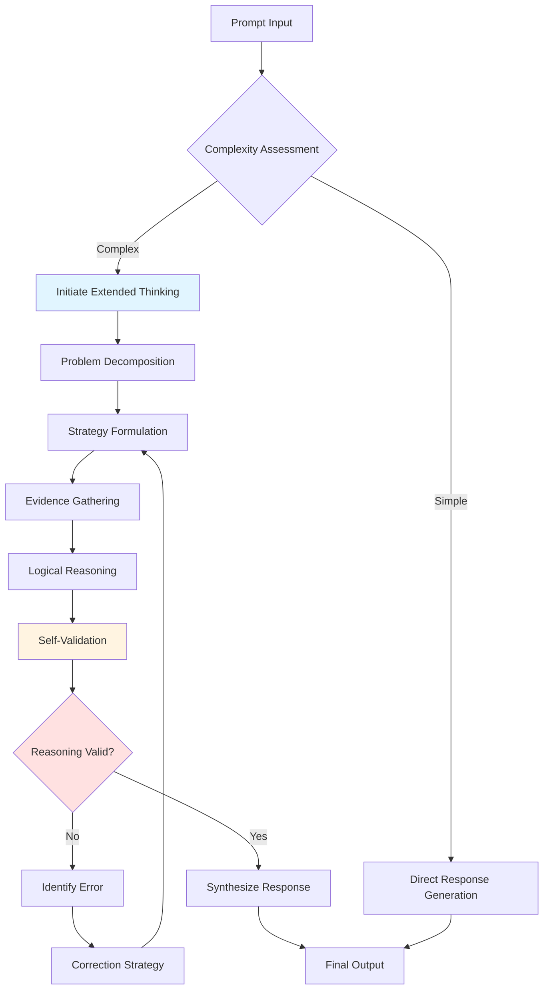

---
tags:
  - prompt-engineering
aliases:
  - Claude Thinking System
  - Extended Thinking Tags
  - LLM Reasoning Architecture
  - Advanced Prompt Reasoning
created: 2024-12-28
modified: 2024-12-28
status: evergreen
certainty: verified
type: reference
---


# Claude's Extended Thinking Architecture: A Comprehensive Analysis of Reasoning Tags, Cognitive Scaffolding, and Advanced Prompt Engineering Methodologies

## Abstract

[**Extended-Thinking-Architecture**:: Claude's systematic capability to perform explicit, visible reasoning through structured XML tags that enable multi-step deliberation, self-correction, and metacognitive reflection before generating final responses.] This comprehensive report examines the theoretical foundations, technical implementation, and practical applications of Claude's thinking tag system—a paradigm shift in large language model interaction that transforms opaque token generation into transparent cognitive processes. Through analysis of reasoning frameworks including [[Chain of Thought]], [[Tree of Thoughts]], [[Self-Consistency]], and [[Reflexion]], we establish how structured thinking tags serve as cognitive scaffolding that enhances reasoning quality, enables verification, and provides unprecedented visibility into AI decision-making processes. This research synthesizes prompt engineering best practices, architectural insights, and empirical patterns to equip practitioners with actionable frameworks for leveraging Claude's advanced reasoning capabilities.

---
#
## 1. Introduction: The Evolution from Token Generation to Explicit Reasoning

### 1.1 The Fundamental Paradigm Shift

Traditional large language models operate through a process that appears deceptively simple to end users: input tokens enter the system, the model's parameters process these tokens through numerous transformer layers, and output tokens emerge—often with impressive coherence and knowledge. However, [**Opaque-Reasoning-Problem**:: The fundamental limitation of standard LLM architectures where complex multi-step reasoning occurs implicitly during forward pass computation, making it impossible to verify intermediate steps, identify reasoning errors, or understand decision pathways.] This opacity creates critical challenges for high-stakes applications, debugging, and trust establishment.

Claude's extended thinking architecture addresses this limitation through [**Explicit-Reasoning-Externalization**:: A systematic approach where the model generates visible, structured reasoning processes in designated `[Final user-facing response appears here after thinking is complete]


[**Thinking-Tag-Semantics**:: XML tags (``) that signal to Claude's architecture that content within should be treated as internal reasoning—not displayed to users in standard interfaces, exempt from certain brevity pressures, and subject to different optimization objectives prioritizing reasoning quality over presentation polish.] This creates a profound asymmetry: the model can "think" extensively while keeping user-facing responses concise and focused.

> [!definition] Extended Thinking Modes
> Claude supports multiple thinking modes controlled via the `<thinking_mode>` parameter:
> 
> - **`enabled`**: Thinking blocks generated when the model determines they would improve response quality
> - **`disabled`**: No thinking blocks generated (standard response mode)  
> - **`auto`**: Model autonomously decides when to use thinking based on task complexity
> - **`interleaved`**: Thinking can be interspersed with tool use and response generation for complex multi-step workflows

### 2.2 Cognitive Budget and Resource Allocation

[**Thinking-Budget-Mechanism**:: The internal computational allocation system that determines how much processing Claude devotes to explicit reasoning versus direct response generation, influenced by task complexity assessment, prompt instructions, and configured thinking modes.] Understanding this mechanism is crucial for effective prompt engineering.

**Key principle**: Thinking blocks operate under *different optimization pressures* than user-facing text:

| Dimension                 | User-Facing Response                | Thinking Block                    |
| ------------------------- | ----------------------------------- | --------------------------------- |
| **Brevity pressure**      | High (users prefer conciseness)     | Low (depth prioritized)           |
| **Polish requirement**    | High (presentation quality matters) | Low (clarity sufficient)          |
| **Scope freedom**         | Constrained (stay on-topic)         | Expansive (explore alternatives)  |
| **Error tolerance**       | Very low (mistakes visible)         | Higher (self-correction possible) |
| **Metacognitive content** | Inappropriate                       | Expected and valuable             |

This asymmetry enables a pattern I call [**Cognitive-Resource-Separation**:: Architectural design where expensive reasoning operations (hypothesis generation, verification, alternative exploration) occur in thinking space while user-facing responses benefit from these deliberations without bearing their token cost or verbosity.] The user sees only refined conclusions, but those conclusions are informed by extensive invisible deliberation.

### 2.3 The Reasoning-Response Pipeline

When Claude receives a prompt with thinking enabled, the generation process follows this enhanced pipeline:



[**Thinking-Response-Decoupling**:: The architectural property where reasoning processes (in thinking blocks) can iterate, backtrack, and self-correct without these revisions appearing in final responses, enabling higher-quality outputs through invisible refinement cycles.] This is fundamentally different from visible [[Chain of Thought]], where reasoning errors become part of the response and can mislead users.

> [!example] Practical Manifestation: Error Correction Without Visible Revisions
> Consider a mathematical problem where Claude's initial approach in a thinking block proves incorrect:
> 
> ```xml
> 
> 
> The solution uses formula Y because [explanation]...
> ```
> 
> The user sees only the correct approach—never knowing that an initial error was caught and corrected during thinking. This creates response quality that would be impossible with visible reasoning chains.

### 2.4 Integration with Tool Use and Multi-Step Workflows

A particularly powerful aspect of Claude's architecture is [**Interleaved-Thinking-Tool-Integration**:: The capability to alternate between reasoning deliberation, tool invocation, and response generation within a single interaction, enabling sophisticated agentic workflows where each tool result triggers new reasoning before subsequent actions.] This is specified via `<thinking_mode>interleaved</thinking_mode>`.

**Pattern example**:
1. User request arrives
2. Claude thinks: "I need to search for X, then analyze the results"
3. Claude invokes web search tool
4. Tool results appear
5. Claude thinks: "These results show Y, which means I should also check Z"
6. Claude invokes second tool
7. Tool results appear
8. Claude thinks: "Now I can synthesize findings A, B, C"
9. Claude generates final response integrating all findings

[**Agentic-Reasoning-Loop**:: Workflow pattern where autonomous tool-using agents alternate between action execution and metacognitive reflection, with thinking blocks serving as the deliberation space that determines next actions based on observed results.] This enables far more sophisticated agent behaviors than simple tool-call sequences.

---

## 3. Reasoning Frameworks: From Theory to Implementation

### 3.1 Chain of Thought (CoT): The Foundation

[[Chain of Thought Prompting]] emerged from the observation that [**Reasoning-Path-Dependency**:: LLM output quality for complex tasks strongly depends on whether intermediate reasoning steps are explicitly articulated versus implicitly computed, with explicit articulation enabling error detection and recovery.] The original CoT paper ([[Wei et al. 2022]]) demonstrated dramatic performance improvements on arithmetic, commonsense reasoning, and symbolic manipulation tasks.

**Classical CoT Implementation**:
```markdown

Question: [Problem statement]

Let's think through this step by step:
1. [First reasoning step]
2. [Second reasoning step]
3. [Third reasoning step]
Therefore, [conclusion]
```

However, classical CoT has limitations:
- **Verbosity**: Reasoning clutters the response
- **No self-correction**: Errors in early steps propagate
- **Linear path**: Cannot explore alternatives

**CoT with Extended Thinking** transforms this:

```xml
[Concise, polished response incorporating conclusions]
```

[**CoT-Thinking-Synergy**:: The multiplicative benefit achieved when Chain of Thought reasoning occurs within thinking blocks rather than user-facing text, enabling much deeper exploration without response bloat and creating space for self-validation steps that improve reliability.] This synergy is a key reason why Claude with extended thinking significantly outperforms models using only traditional CoT.

### 3.2 Tree of Thoughts (ToT): Exploring Multiple Reasoning Paths

[[Tree of Thoughts]] ([[Yao et al. 2023]]) extends CoT by [**Branching-Reasoning-Search**:: Systematic exploration of multiple reasoning trajectories organized in a tree structure, where each node represents a partial solution state and edges represent reasoning steps, enabling backtracking from dead-ends and comparison across alternative approaches.] This is particularly valuable for problems with no obvious single solution path.

**ToT Core Concepts**:

1. **Thought Decomposition**: [**Thought-Granularity**:: The decision about what constitutes a single "thought" or reasoning step—too coarse risks missing critical intermediates, too fine creates combinatorial explosion—balanced based on problem structure and evaluation cost.]

2. **State Evaluation**: [**Intermediate-State-Scoring**:: Heuristic assessment of partial solutions' promise before fully exploring their branches, enabling pruning of low-quality paths and resource concentration on promising directions.]

3. **Search Strategy**: 
   - **Breadth-First Search (BFS)**: [**BFS-ToT-Pattern**:: Exploration strategy that fully develops all thoughts at depth N before proceeding to depth N+1, ensuring comprehensive coverage but potentially expensive.]
   - **Depth-First Search (DFS)**: [**DFS-ToT-Pattern**:: Exploration strategy that fully explores one reasoning path to conclusion before backtracking to try alternatives, enabling earlier termination when good solutions found but risking local optima.]

**ToT Implementation in Extended Thinking**:

```xml
[Final response based on optimal path discovered through ToT search]
```

[**ToT-Thinking-Scalability**:: The architectural advantage where ToT's potentially large exploration space (multiple branches × multiple depths) fits naturally within thinking blocks without overwhelming user-facing responses, enabling complex searches that would be impractical in visible reasoning formats.] This makes ToT far more practical in Claude's architecture than in traditional prompting.

> [!warning] Computational Cost Considerations
> While ToT enables superior reasoning quality, it comes with significant token costs. A ToT exploration with branching factor 4 and depth 3 generates 64 leaf nodes in complete exploration. Strategic pruning (discarding low-scoring branches early) is essential for practical deployment. The academic paper generator template in the user's original request demonstrates sophisticated pruning strategies using threshold-based and relative scoring approaches.

### 3.3 Self-Consistency: Reliability Through Ensemble Reasoning

[[Self-Consistency]] ([[Wang et al. 2022]]) addresses a fundamental challenge: [**Single-Sample-Unreliability**:: The problem that any individual reasoning path from a stochastic model may contain errors, even with CoT, making single responses insufficient for high-stakes decisions.] The solution: [**Ensemble-Verification-Principle**:: Generate multiple independent reasoning paths for the same problem, extract answers from each, and select the majority response—leveraging the statistical tendency for correct reasoning to converge while errors vary randomly.]

**Self-Consistency Protocol**:

```xml
Final answer: Option A [with explanation synthesized from consensus reasoning]
```

[**Self-Consistency-Quality-Reliability-Tradeoff**:: The explicit exchange where computational cost increases linearly with sample count (typically 3-10 samples) while reliability and confidence increase non-linearly, with diminishing returns beyond ~7 samples for most tasks.] Strategic prompt engineers select sample counts based on task criticality and budget constraints.

**Key implementation considerations**:

1. **Sample Independence**: [**Reasoning-Path-Independence**:: The requirement that each self-consistency sample must explore the problem fresh without being influenced by previous samples, typically achieved through temperature>0 and explicit instructions to "reason from first principles" for each sample.] Without independence, samples may replicate the same error.

2. **Temperature Selection**: [**SC-Temperature-Optimization**:: The critical parameter choice where too-low temperature (e.g., 0.3) produces near-identical samples (defeating the purpose), while too-high temperature (e.g., 1.0) increases random variation but may introduce errors—optimal range typically 0.6-0.8 for self-consistency applications.]

3. **Consensus Threshold**: [**Acceptance-Threshold-Policy**:: The minimum agreement percentage required to accept a majority answer, typically 0.60-0.80 depending on risk tolerance—higher thresholds reduce false positives but increase "uncertain" outcomes requiring human review.]

### 3.4 Reflexion: Learning from Mistakes

[[Reflexion]] ([[Shinn et al. 2023]]) introduces [**Trial-Error-Learning-Paradigm**:: Iterative refinement process where agents attempt tasks, receive feedback (from environment, evaluator, or self-assessment), explicitly reflect on failures, and adjust strategies for subsequent attempts—creating learning within a single problem-solving episode rather than across training data.]

**Reflexion Architecture in Extended Thinking**:

```xml
[Final response using successful strategy discovered through reflexion]
```

[**Reflexion-Thinking-Synergy**:: The natural fit between Reflexion's iterative trial-error-reflection cycles and Claude's extended thinking architecture, where multiple attempts and learning loops can occur invisibly before presenting the refined final solution to users.] This is particularly powerful for tasks where the optimal approach is non-obvious and must be discovered through experimentation.

**When Reflexion excels**:
- **Complex coding tasks**: Initial implementation often reveals edge cases, leading to refinement
- **Multi-constraint optimization**: Satisfying all constraints simultaneously requires iterative adjustment
- **Creative problem-solving**: Novel solutions emerge through trying multiple approaches
- **Ambiguous requirements**: Understanding what's truly needed emerges through failed attempts

> [!key-claim] The Meta-Learning Hypothesis
> Reflexion within extended thinking enables a form of "fast meta-learning"—not learning new knowledge, but learning better problem-solving strategies for the specific task at hand through rapid iteration cycles. This parallels human expert problem-solving more closely than direct answer generation.

---

## 4. Advanced Reasoning Patterns: Structured XML Thinking Protocols

### 4.1 The State-Tracking Pattern

Complex reasoning tasks benefit enormously from [**Explicit-State-Tracking**:: The practice of maintaining structured representations of current problem state, progress through multi-step processes, and intermediate results within thinking blocks, enabling complex workflows that would overwhelm working context without explicit tracking.] This is especially critical for tasks involving multiple sub-problems or long dependency chains.

**State-Tracking Template**:

```xml

```

[**XML-Structured-Thinking**:: The technique of using XML-like tags within thinking blocks to create hierarchical, parseable structure that aids both Claude's reasoning organization and human debugging of complex workflows.] While Claude doesn't literally parse these as XML, the structure provides cognitive scaffolding that improves reasoning coherence.

### 4.2 The Multi-Perspective Analysis Pattern

For problems requiring balanced treatment of multiple viewpoints, [**Structured-Perspective-Synthesis**:: Systematic pattern where thinking blocks enumerate distinct perspectives/frameworks/approaches, analyze each independently, then synthesize findings into a coherent integrated understanding that transcends any single viewpoint.] This prevents the common failure mode where first-mentioned perspectives dominate.

**Multi-Perspective Template**:

```xml
[Response integrating multi-perspective analysis without overwhelming structure]
```

[**Perspective-Balance-Enforcement**:: The benefit of structured analysis where forcing explicit treatment of multiple viewpoints prevents cognitive biases (anchoring, confirmation bias) that can cause premature convergence on initial perspectives.] This is particularly valuable for contested topics or complex trade-off evaluations.

### 4.3 The Chain of Verification Pattern

[[Chain of Verification]] ([[Dhuliawala et al. 2023]]) addresses [**Hallucination-Risk-Management**:: The systematic challenge where LLMs confidently state false information, particularly factual claims, dates, citations, or technical specifications—requiring explicit verification protocols before accepting generated content.] The pattern works by generating claims, then independently verifying them without access to the original generation context.

**CoVe Implementation**:

```xml
[Final response with verified and refined claims]
```

[**CoVe-Thinking-Integration**:: The natural synergy where Chain of Verification's multi-step process (generate → extract claims → independently verify → revise) maps perfectly onto thinking block workflow, enabling verification to occur invisibly before presenting final content to users.] This is particularly crucial for knowledge-intensive responses where factual accuracy is paramount.

### 4.4 The Metacognitive Checkpoint Pattern

[**Metacognitive-Monitoring**:: Explicit self-assessment of reasoning quality, strategy effectiveness, and confidence levels during problem-solving—analogous to human metacognition where we pause to evaluate whether our current approach is working or needs adjustment.] This pattern prevents perseveration on failing strategies.

**Metacognitive Checkpoint Template**:

```xml

```

[**Self-Correction-Through-Metacognition**:: The mechanism where explicit strategy evaluation catches errors, flawed assumptions, or misalignments with goals before they propagate through entire reasoning chains—functioning as an internal "peer review" step.] This pattern is particularly powerful when combined with Reflexion for iterative refinement.

---

## 5. Prompt Engineering Best Practices for Extended Thinking

### 5.1 Strategic Thinking Invocation

Not all tasks benefit equally from extended thinking. [**Thinking-Benefit-Criteria**:: The decision framework for determining when extended thinking provides meaningful value versus when it's computational overhead—generally high benefit for multi-step reasoning, low benefit for simple factual retrieval or direct knowledge application.] Strategic prompt engineers invoke thinking selectively:

**High-Value Thinking Scenarios**:

1. **Multi-Step Logical Reasoning**: Problems requiring sequential inference where error in any step invalidates the conclusion
   ```
   Example: "Calculate the compound annual growth rate across these quarters, 
   accounting for seasonal adjustment, then predict next quarter's revenue"
   ```

2. **Constraint Satisfaction Problems**: Tasks with multiple requirements that must all be simultaneously satisfied
   ```
   Example: "Design a workshop agenda that covers topics A, B, C, keeps 
   each under 45 minutes, includes breaks, fits in 6 hours, and prioritizes 
   interactive activities"
   ```

3. **Ambiguity Resolution**: Situations where requirements are unclear and need interpretation
   ```
   Example: "The data shows unusual patterns—determine whether this indicates 
   a genuine trend or measurement artifact"
   ```

4. **Trade-off Evaluation**: Decisions involving competing objectives
   ```
   Example: "Choose between Implementation A (faster but rigid) and 
   Implementation B (slower but flexible) given our project constraints"
   ```

**Low-Value Thinking Scenarios** (use standard mode):

1. **Direct Factual Recall**: Simple knowledge retrieval
   ```
   Example: "What is the capital of France?"
   ```

2. **Template Application**: Straightforward application of known patterns
   ```
   Example: "Format this data as a markdown table"
   ```

3. **Creative Generation**: Open-ended creative tasks where "thinking" might inhibit flow
   ```
   Example: "Write a short poem about autumn"
   (Though some creative tasks DO benefit from strategic thinking)
   ```

### 5.2 Explicit Thinking Instructions

[**Thinking-Directive-Specificity**:: The principle that explicit, detailed instructions about what to think about and how to structure thinking produce significantly better reasoning than generic "think about this" directives.] Effective prompts scaffold the thinking process:

**Generic (Weaker) Approach**:
```
Use extended thinking to solve this problem: [problem statement]
```

**Structured (Stronger) Approach**:
```
Solve this problem using extended thinking with the following structure:

<thinking>
1. PROBLEM DECOMPOSITION
   - Identify all sub-problems
   - Map dependencies between sub-problems
   - Determine solving order

2. STRATEGY SELECTION  
   - List 3 potential approaches
   - Evaluate each on [criteria X, Y, Z]
   - Select optimal approach with justification

3. DETAILED REASONING
   - Apply selected approach step-by-step
   - Show all intermediate calculations
   - Validate each step before proceeding

4. VERIFICATION
   - Check against all constraints
   - Test edge cases: [list edge cases]
   - Assess confidence level

5. ALTERNATIVE CONSIDERATION
   - What could go wrong with this solution?
   - Are there better approaches we missed?
   - Final validation of decision
</thinking>

[Final response]
```

[**Thinking-Structure-Templates**:: Pre-defined reasoning frameworks embedded in prompts that guide Claude's thinking process along productive paths—functioning as cognitive scaffolding that reduces the search space of possible reasoning approaches.] The academic paper generator template provided by the user exemplifies sophisticated thinking structure specification.

### 5.3 The Thinking-Response Boundary Contract

A critical prompt engineering principle: [**Thinking-Response-Separation-Contract**:: The explicit understanding that content in thinking blocks is NOT user-facing and content in final responses should NOT duplicate thinking block reasoning—maintaining clear separation of process (thinking) from product (response).] Violating this creates bloated responses or defeats the purpose of thinking.

**Anti-Pattern (Violates Contract)**:
```xml
Response:
The user is asking about X. X involves three components: A, B, and C.

Let me explain A: [explanation]
Then B: [explanation]  
Finally C: [explanation]
```
*Problem: Thinking just narrates the obvious structure, adding no value*

**Correct Pattern (Honors Contract)**:
```xml
Response:
X is [concise definition]. 

The critical distinction is that X excels when [condition 1], while 
alternative Y works better for [condition 2] and Z for [condition 3]. 

Choose X if you need [specific benefit], as demonstrated in [practical example].
```
*Value: Thinking does strategic planning invisible to user; response delivers refined insights*

### 5.4 Calibrating Thinking Depth

[**Thinking-Depth-Calibration**:: The prompt engineering technique of explicitly specifying how much reasoning effort to allocate, preventing both under-thinking (quick but shallow) and over-thinking (expensive but marginally better)—tuned based on task value and budget constraints.] This is specified through natural language guidance:

**Depth Calibration Examples**:

```
# Shallow Thinking (Fast & Cheap)
"Use brief extended thinking to quickly validate your approach, 
then provide the solution. Keep thinking under 100 words."

# Moderate Thinking (Standard)
"Think through this carefully, considering the main approach 
and 1-2 alternatives before selecting the best."

# Deep Thinking (Thorough)
"Use extensive extended thinking to explore this problem comprehensively:
- Consider at least 3 distinct approaches
- Perform self-consistency validation with 3 reasoning paths
- Verify all claims before stating them
- Plan for edge cases and failure modes"

# Adaptive Thinking
"Use extended thinking as needed. For straightforward parts, 
proceed directly. For complex decisions or ambiguous requirements, 
think deeply before committing to an approach."
```

[**Cognitive-Budget-Specification**:: Explicit instruction about computational resource allocation for reasoning, enabling cost-performance optimization tuned to specific use cases—critical for production deployments where thinking costs multiply across thousands of requests.] Advanced prompt engineering systems may include budget parameters that automatically adjust thinking depth based on usage patterns.

---

## 6. Practical Applications and Use Cases

### 6.1 Code Generation and Debugging

Extended thinking transforms code generation from "write code that looks right" to "design, validate, then implement code that is right." [**Code-Reasoning-Workflow**:: Multi-stage process where thinking blocks handle architectural decisions, edge case analysis, and logic verification before generating actual code—producing higher-quality implementations with fewer bugs and better documentation.]

**Example Workflow**:

```xml
[Clean code implementation with documentation]
```

**Debugging Application**:

When debugging, extended thinking enables [**Diagnostic-Reasoning-Process**:: Systematic fault isolation where thinking blocks formulate hypotheses about bug causes, evaluate evidence for each hypothesis, and prioritize investigations—replacing random trial-and-error with strategic debugging.]

### 6.2 Research Synthesis and Writing

The academic paper generator template demonstrates extended thinking's power for [**Systematic-Research-Synthesis**:: Structured process where thinking blocks handle literature review, framework comparison, evidence integration, and argument construction before generating polished prose—producing research writing that is both rigorous and coherent.]

Key patterns:

1. **Literature Organization**: Thinking blocks create structured summaries of papers, extract key claims, identify connections
2. **Argument Construction**: Building logical flow in thinking before writing
3. **Evidence Integration**: Verifying claims and adding citations systematically
4. **Coherence Maintenance**: Explicit tracking of themes across sections

### 6.3 Complex Decision Making

Business decisions, policy analysis, strategic planning—these benefit from [**Structured-Decision-Framework**:: Explicit enumeration of options, criteria-based evaluation, risk assessment, and sensitivity analysis in thinking blocks before recommending specific actions.]

**Decision Template**:

```xml
[Concise decision recommendation with rationale]
```

### 6.4 Educational Content Creation

Extended thinking enables [**Pedagogical-Content-Design**:: Systematic analysis of learner needs, prerequisite knowledge, common misconceptions, and optimal explanation sequences before generating educational materials—producing content that is genuinely learner-centered rather than expert-perspective-centered.]

Thinking blocks address:
- **Learner modeling**: What does the audience already know?
- **Concept sequencing**: What order minimizes cognitive load?
- **Misconception anticipation**: What errors are likely?
- **Example selection**: What illustrations are most clarifying?

---

## 7. Limitations and Failure Modes

### 7.1 When Thinking Doesn't Help

[**Thinking-Ineffectiveness-Domains**:: Task categories where extended thinking provides minimal benefit or may actively harm performance, typically involving open-ended creativity, pure knowledge retrieval, or rapid iteration scenarios where thinking overhead outweighs quality gains.]

**Documented failure modes**:

1. **Over-Analysis Paralysis**: Extremely deep thinking on simple problems can produce worse results than direct response due to overthinking
   
2. **Creative Constraint**: Some creative tasks benefit from spontaneous generation; extensive planning in thinking blocks can inhibit creative flow

3. **Knowledge Retrieval Overhead**: Simple factual questions get no benefit from reasoning—thinking just adds latency

4. **Iterative Design Tasks**: Some tasks (UI design, creative writing) benefit more from rapid generate-evaluate-revise cycles than upfront planning

> [!warning] The Deliberation Paradox
> [**Deliberation-Effectiveness-Tradeoff**:: The empirically observed phenomenon where moderate deliberation improves outcomes, but excessive deliberation can degrade performance through overthinking, anxiety effects, or analysis paralysis—suggesting optimal thinking depth is task-dependent with diminishing returns.]

### 7.2 Computational Cost Considerations

Extended thinking is not free. [**Thinking-Token-Economics**:: The cost accounting reality where thinking blocks consume tokens during generation even though they're not visible to users, potentially doubling or tripling request costs for thinking-heavy workflows.] Practical deployment requires cost-benefit analysis.

**Cost optimization strategies**:

1. **Selective Invocation**: Use thinking only for complex sub-problems within larger tasks
2. **Depth Calibration**: Adjust thinking thoroughness based on task value
3. **Caching**: For repeated similar tasks, reuse thinking patterns
4. **Hybrid Approaches**: Combine thinking-enabled and thinking-disabled requests strategically

### 7.3 Transparency vs. Opacity Trade-offs

While extended thinking improves transparency by making reasoning visible, [**Thinking-Accessibility-Challenge**:: The usability problem where thinking blocks full of technical reasoning or extensive exploration may be valuable for debugging but overwhelming for end users—requiring thoughtful decisions about when to expose thinking and to whom.] Different stakeholders have different needs:

- **End users**: Often prefer concise answers without reasoning overhead
- **Developers**: Need thinking visibility for debugging and validation
- **Auditors**: Require thinking trails for accountability and verification
- **Researchers**: Value thinking as data for understanding AI reasoning

Interface design must balance these competing needs through selective thinking exposure, summarization, or progressive disclosure patterns.

---

## 8. Future Directions and Research Opportunities

### 8.1 Learned Thinking Patterns

Current thinking is ad-hoc per request. An exciting direction: [**Thinking-Pattern-Learning**:: Potential capability where models could accumulate effective reasoning patterns across tasks, building a library of proven thinking structures that get automatically invoked for similar future problems—analogous to human expertise development.]

Research questions:
- Can models identify when previous thinking patterns apply to new problems?
- How to represent thinking patterns for efficient retrieval and adaptation?
- What meta-learning mechanisms could improve thinking quality over time?

### 8.2 Collaborative Thinking

Multi-agent systems could benefit from [**Shared-Thinking-Spaces**:: Architectural pattern where multiple AI agents contribute to a common thinking block, each adding their perspective or analysis before collective synthesis—enabling richer reasoning than any single agent produces.]

Applications:
- **Red team/blue team**: Adversarial agents examining proposals from opposing perspectives
- **Multi-expert consultation**: Domain-specialized agents contributing within their expertise
- **Distributed reasoning**: Complex problems decomposed across multiple thinking processes

### 8.3 Human-AI Thinking Partnerships

Rather than AI thinking alone, [**Augmented-Thinking-Collaboration**:: Interface design where humans and AI jointly populate thinking blocks, with each contributing their strengths—humans providing intuition, domain knowledge, and values, while AI provides systematic analysis and computational reasoning.]

Interface implications:
- **Thinking block editing**: Humans modify AI reasoning mid-generation
- **Assumption injection**: Humans specify constraints/preferences that guide AI thinking
- **Collaborative verification**: Humans validate critical steps in AI reasoning chains

---

## 🔗 Related Topics for PKB Expansion

### 1. **[[Prompt Engineering Taxonomy and Pattern Library]]**
   - **Connection**: This report covers reasoning techniques; a comprehensive taxonomy would catalog the full spectrum of prompt engineering patterns beyond reasoning (formatting control, role assignment, constraint specification, example provision, etc.)
   - **Depth Potential**: Could enumerate 50+ distinct prompt patterns with usage guidance, failure modes, and combination strategies—creating a systematic reference for practitioners
   - **Knowledge Graph Role**: Serves as the "periodic table" of prompt engineering, organizing techniques by mechanism and use case
   - **Priority**: High - Fundamental reference that supports all advanced prompt engineering work

### 2. **[[Token Economics and Cost Optimization for Production LLM Systems]]**
   - **Connection**: Extended thinking has significant cost implications; systematic analysis of token optimization strategies enables practical deployment
   - **Depth Potential**: Could cover caching strategies, prompt compression, request batching, thinking depth calibration, selective invocation patterns, and multi-tier architectures—comprehensive cost management framework
   - **Knowledge Graph Role**: Bridges theoretical capabilities to practical operational concerns
   - **Priority**: High - Critical for anyone moving beyond experimentation to production deployment

### 3. **[[Cognitive Science Foundations of LLM Reasoning Techniques]]**
   - **Connection**: Many reasoning techniques (CoT, ToT, Reflexion) draw inspiration from human cognitive processes; systematic mapping of these connections deepens understanding
   - **Depth Potential**: Could explore working memory limitations, dual process theory, metacognition, analogical reasoning, and how these cognitive science concepts inform LLM prompting strategies
   - **Knowledge Graph Role**: Provides theoretical grounding that explains WHY certain techniques work
   - **Priority**: Medium - Enriches understanding but less immediately practical than patterns/economics

### 4. **[[Multi-Agent Architectures and Agentic Workflows]]**
   - **Connection**: Extended thinking enables sophisticated agent behaviors; systematic treatment of agent design patterns, communication protocols, and coordination mechanisms
   - **Depth Potential**: Could cover agent communication languages, task decomposition strategies, collaborative reasoning patterns, tool-use architectures, and autonomous planning frameworks
   - **Knowledge Graph Role**: Extends single-agent reasoning to multi-agent systems and agentic applications
   - **Priority**: High - Frontier area with rapid development and high practical value

### 5. **[[Evaluation Methodologies for LLM Reasoning Quality]]**
   - **Connection**: Claims about reasoning improvements need rigorous evaluation; systematic coverage of assessment frameworks, benchmarks, and metrics
   - **Depth Potential**: Could examine task-specific benchmarks, human evaluation protocols, automated metrics (coherence, factuality, logical validity), and meta-evaluation challenges
   - **Knowledge Graph Role**: Provides the empirical foundation for comparing techniques and validating claims
   - **Priority**: Medium - Important for research but less critical for practitioners

### 6. **[[Safety and Alignment Considerations in Advanced Reasoning Systems]]**
   - **Connection**: More powerful reasoning capabilities raise alignment questions; systematic analysis of safety implications, failure modes, and mitigation strategies
   - **Depth Potential**: Could explore goal misgeneralization risks, deceptive reasoning, value alignment in multi-step planning, adversarial robustness, and safety verification protocols
   - **Knowledge Graph Role**: Addresses ethical and safety dimensions often overlooked in capabilities-focused analysis
   - **Priority**: Medium-High - Critical for responsible deployment, especially in high-stakes domains

---

## References and Further Reading

**Foundational Papers**:
- Wei, J., et al. (2022). "Chain-of-Thought Prompting Elicits Reasoning in Large Language Models." *NeurIPS 2022*.
- Yao, S., et al. (2023). "Tree of Thoughts: Deliberate Problem Solving with Large Language Models." *NeurIPS 2023*.
- Wang, X., et al. (2022). "Self-Consistency Improves Chain of Thought Reasoning in Language Models." *ICLR 2023*.
- Shinn, N., et al. (2023). "Reflexion: Language Agents with Verbal Reinforcement Learning." *NeurIPS 2023*.
- Dhuliawala, S., et al. (2023). "Chain-of-Verification Reduces Hallucination in Large Language Models." *arXiv:2309.11495*.

**Anthropic Documentation**:
- Claude Extended Thinking Documentation (docs.anthropic.com)
- Prompt Engineering Guide (docs.anthropic.com/prompt-engineering)

**Advanced Topics**:
- Constitutional AI and Value Alignment
- Tool Use and Function Calling Architectures  
- Multi-Turn Conversation State Management
- Production System Design Patterns

---

*This report represents a comprehensive synthesis of current understanding as of December 2024. The field of LLM reasoning and prompt engineering continues to evolve rapidly, and practitioners should consult latest research and documentation for emerging techniques and best practices.*